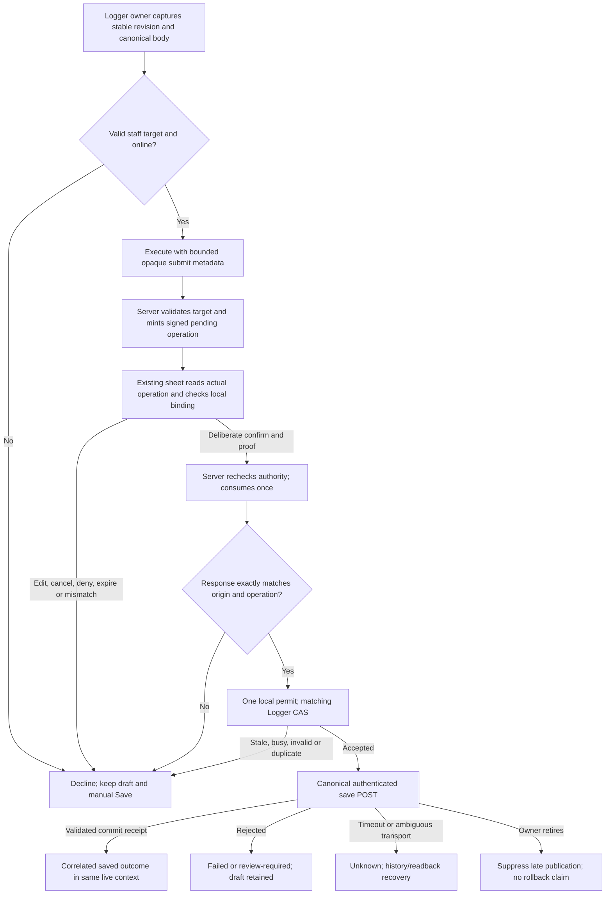
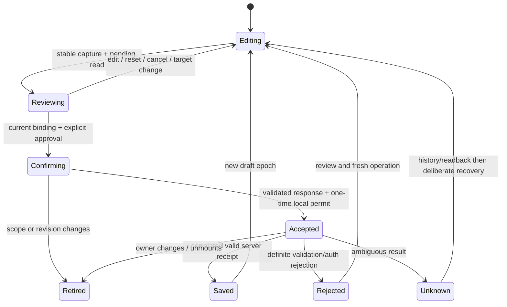

# Confirmed Logger submit: bind approval to one reviewed draft

Version 1, 2026-09-12. **PLAN READY only for R60-A containment, subject to the parent's source/ownership check. Connected R60-B1..B3 remains PENDING; no implementation or enqueue.** Astra/xhigh architecture for [56 finding 1](56-ui-command-hostile-audit.md), including its submit-specific finding 3 receipt defect. This continuation preserves [55](55-coach-selection-and-transport.md) transport ownership, [59](59-rest-adjust-contract.md) command-hook coordination and [45](45-g11-release-readiness.md) release gates. It does not redesign the other 17 frontend commands, Logger manual Save, the global bus, or the Session Desk owner.

## 1. Requirements, baseline and preservation

Job: an actual admin/trainer approves the workout they reviewed, and only the originating Logger may submit that exact body while its actor, target, surface instance and draft revision remain current. A changed or missing origin declines. Browser admission and server command confirmation never replace the authenticated workout-write authorization.

Canonical checkout: `C:/Users/BigotSmasher/Desktop/@Everything/quick-pt/SS-PT/tmp/worktrees/swan-coach-astra-owned-20260906`; branch `codex/swan-coach-astra-owned-20260906`; HEAD `48d792da5351a3f89518baba7f4ab553d69f41a8`. This run inspected source/tests, ran existing isolated baselines, then authored only this NEW plan and the unique [baseline log](../../../../tmp/coach-astra-hostile-20260912/confirmed-submit-baseline-20260912T112741Z.log). Twelve before/after source hashes matched. Concurrent root/Luna work and earlier documents are preserved; these source references describe the inspection, not a promise they remain unchanged.

| ID | Measurable acceptance |
|---|---|
| R60-R1 | Legacy/unbound/malformed `AI_SUBMIT_WORKOUT` cannot edit notes/intensity, acquire a save lock, queue, POST or emit a save receipt. Manual Save keeps its current path. |
| R60-R2 | Capture origin and immutable canonical submit body BEFORE execute; bind server-stored approval to positive target, local instance, draft epoch/revision and digest. Never reconstruct an origin from current form state after a response. |
| R60-R3 | Existing owner atomically invalidates reviews on material edit/reset, actor/target/date/session/assignment change and unmount. A-B-A, same-target new draft, pending React updates and delayed hashing cannot revive a review. |
| R60-R4 | Existing server ownership, roles, pending-operation signature, TTL, render proof, ceremony and one-time consumption remain authoritative. Confirm response must match stored operation and original origin exactly; never fall back to requested/current target. |
| R60-R5 | Exactly one matching Logger accepts a local permit once, then submits the captured effective body via existing validation/service. Two mounted Loggers, duplicate responses and synchronous repeated delivery yield at most one accepted POST. |
| R60-R6 | ACK means accepted attempt only. Correlated completion distinguishes saved, declined, failed, unknown and retired. No initial applied/saved memory fact; late outcomes cannot clear or publish into a newer draft/actor/target. |
| R60-R7 | AI-confirmed submit does not enter the current uncorrelated offline queue. Manual kept-local success requires actual queue-write success. Timeouts/ambiguous network outcomes never trigger an automatic AI retry or queue. |
| R60-R8 | Exercise the real confirmation-to-receiver wiring and real mounted Logger using isolated resources; separately verify authenticated transaction/readback when a disposable database fixture is approved. Existing baseline PASS is not a new regression PASS. |

Roles: retain exact raw `admin`/`trainer` for this AI command. `client`, `user`, missing and other aliases do not acquire it because a Logger is mounted. Manual Save still follows its existing role and server rules. Read authorization in plan52, recent-session read fallback, a selected pin and a valid command response are not workout write permission.

## 2. Blueprint and verified source seams

| Actual source | Finding and integration consequence |
|---|---|
| `backend/services/ai/commandRegistry/workoutCommands.mjs:301-315` | Submit has optional intensity/notes, confirmation required, staff roles and `requiresClientRef:false`. `commandExecutor.mjs:442` therefore skips normal client resolution. A selected client does not ensure a targeted pending operation. |
| `backend/services/ai/commandExecutor.mjs:789,1043-1085` | Pending mint uses resolved client or null; confirmed dispatch returns stored params and a SEPARATE client field. Current response lacks operationId. Add submit-only validated metadata/target binding and explicit operationId, not a new confirmation engine. |
| `backend/services/ai/pendingConfirmations.mjs`; `operationSigning.mjs`; `renderDigest.mjs` | Params are cloned, signed and included in render digest. Store is actor-owned, has 120s TTL and atomic consumption. Put reserved submit metadata inside stored params after classification/validation; existing signature/digest machinery then covers it without schema changes. |
| `backend/routes/aiCommandRoutes.mjs:195,470,532,677,695` | Execute takes route hints; pending GET reads actual stored operation; confirm validates supplied digest/ceremony and rechecks ownership. Missing digest is currently tolerated in observe mode. Submit must require proof explicitly, even in observe mode, without changing policy for all commands. |
| `backend/services/ai/entityOwnershipRecheck.mjs`; `commandContextEnvelope.mjs` | Reuse current actor/target write recheck; missing target presently means nothing to recheck. Existing entityId/entityVersion refer to a DB WorkoutPlan, not local Logger revision. Do not overload them. |
| `frontend/src/hooks/useCoachCommand.ts:163,233`; `utils/aiWorkoutEvents.ts:101-151` | Hook discards response client and broadcasts intensity/notes. Latest listener ACK wins; several listeners can all save. Plan55 retires producers, but the submit receiver also needs a permit/revision check. |
| `components/CoachConfirm/useConfirmationSheet.ts:201`; `ConfirmationSheet.tsx` | Sheet POSTs confirm directly and calls onDone. It does NOT use the hook's dispatcher. Existing operation-ID lifetime protects the sheet itself, not a Logger draft. A hook-only fix misses this actual path. |
| `components/CoachDock/SurfaceCoachDock.tsx:115`; `CoachCommandCenter.actions.ts:225` | Existing sheet callbacks dismiss/record returned results; they do not perform a bound Logger submit. Do not dispatch by guessing which Logger is current. These generic callers remain unable to submit until an explicit origin is provided. |
| `components/WorkoutLogger/useWorkoutLoggerDictation.ts:94,113`; `WorkoutLogger.tsx:204` | Logger's typed/voice command lane sends the Logger surface and target, but only shows text for confirmation_required; it mounts no sheet. A usable connection must mount the EXISTING sheet here. The embedded AI terminal/chat lane blocks submit and is not a substitute. |
| `components/WorkoutLogger/WorkoutLogger.tsx:158-171,293,475` | Logger owns exercises, notes, intensity and equipment; loading supplies client/assignment. Extend this owner's metadata; do not add a second editable draft/provider or copy another owner's exercise arrays. |
| `components/WorkoutLogger/useWorkoutSubmit.ts:90-242,246` | Listener changes notes/intensity before submit guards. Submit uses current closure body; ACK precedes await. Late success clears draft/publishes receipts with no origin fence. Offline and network-fallback branches ignore queueSubmission's boolean. |
| `components/WorkoutLogger/workoutLoggerSubmitPayload.ts`; `useOfflineQueue.ts` | Existing canonical builder determines the persisted body. Queue is client-scoped localStorage with no approval-operation correlation on replay; a queued body is not a committed save. Preserve this owner/storage, with AI containment described below. |
| `frontend/src/services/nasmApiService.ts:716,824`; `backend/routes/dailyWorkoutFormRoutes.mjs:607,914,1185,1373,1577` | Actual save is authenticated POST `/api/workout-forms`, relationship/EDIT_WORKOUTS checks, transaction/day lock, billing, commit and 201 form receipt. Existing GET by form ID supports later readback. Date duplicate detection is not approval-operation idempotency. |
| `frontend/src/utils/coachIntentRecorder.ts:136,158`; `coachEventLog.ts:95,159` | Generic ACK=true is terminal applied and cannot later be reconciled to failure. Default ambient actor/client can be null. Submit must bypass that generic recording and publish a sanitized terminal fact only from the correlated result, using explicit captured context. |

Paths abbreviated as `components/...` in this table are relative to `frontend/src`. No plan52 read receipt, G04 draft owner, route helper, fresh provider request or client profile copy is introduced. The unavoidable cost is an origin capture seam, the actual sheet mount, a submit-only server binding and a result callback; changing only the event type cannot protect reviewed state.

## 3. Desktop/mobile wireframes and states

R60-A is headless containment: no new layout, wireframes N/A for that slice. R60-B adds an inline instance of the existing ConfirmationSheet to the mounted Logger dictation lane; use its current styled-components and keyboard/ceremony behavior. These are concrete text wireframes of the proposed placement, **design only, NOT rendered product evidence**. No extra HTML artifact was authorized for this task.

```text
Desktop 1440x900 - current Logger, Client42, workout date
+-------------------------------------------------------------------+
| Workout Logger | Client42 | date                    [Manual Save] |
| Existing exercises / completed sets / notes remain the owner       |
| Coach input [Save this workout____________________] [Send]         |
| + Existing ConfirmationSheet -----------------------------------+ |
| | Review workout for Client42 - date                            | |
| | 2 exercises, 6 completed sets | intensity / scheduled context  | |
| | Reviewed workout details [expand / scroll complete snapshot]   | |
| | ... server ceremony / arm delay ...                           | |
| | [Return to editing]                  [Confirm reviewed save]  | |
| +---------------------------------------------------------------+ |
| Status: Approval accepted. Saving reviewed workout...              |
+-------------------------------------------------------------------+
Mobile 390x844 - same owner and normal document flow
+------------------------------------+
| Logger | Client42 | date           |
| Existing workout rows              |
| Coach input [________________]     |
| [Send]                             |
| Review workout for Client42        |
| 2 exercises / 6 completed sets     |
| [Reviewed details v]               |
| server ceremony + arm delay        |
| [Confirm reviewed save]            |
| [Return to editing]                |
| Status in aria-live region         |
+------------------------------------+
```

The reviewed details use the immutable EFFECTIVE canonical body (including stored notes/intensity overrides), not a fresh view of live state. Show all submitted exercises/sets/ratings/notes and relevant date/session/assignment/equipment context with progressive disclosure; never send these details to a provider to make a summary. Client42 is synthetic. No sensitive data enters this document or test screenshots.

| State | Visible behavior |
|---|---|
| No origin / containment active / unavailable capability | `AI save is unavailable here. Review the workout and use Save.` No fake missing-Logger explanation, no confirm-to-save claim. |
| Capture or pending read/digest | Existing loading text; Confirm disabled. Edit remains possible and invalidates this review immediately. |
| Ready | Existing stored-operation ceremony and target; expanded details available before deliberate confirmation. |
| Empty, incomplete or invalid form | Existing validation guidance; no submitted ACK, queue or POST. No silently dropped fields. |
| Target/revision changed, denied actor, expiry or mismatch | Confirm disabled, `This workout changed. Review it again before saving.` Return focuses existing editor/input. Fresh request required. |
| Cancel / Return | Existing cancel route for a live operation, retire local permit; no save. Escape cancels only, never confirms. |
| Accepted | `Approval accepted. Saving reviewed workout...` (not Done/Saved). Existing sheet ceremony may finish, but sibling submit receipt remains pending. |
| Committed response | `Workout saved.` with canonical existing receipt/billing information after response validation, only in original live context. |
| Offline | `AI save requires a connection. Your draft is unchanged; use Save for the existing offline workflow.` No AI queue. |
| Definite rejection / duplicate-day conflict | Existing validation/review recovery; preserve draft. Duplicate-day receipt is not this operation's success. |
| Timeout or ambiguous transport | `Save outcome is not confirmed. Check workout history before trying again.` No automatic retry or queued-success claim. |
| Retired after POST | Suppress new-context toasts, receipt, memory and draft clearing. The request may already have committed; retirement is not rollback. |

Use 44px controls, normal mobile flow without overlaying the runner, wrap long exercise names, preserve focus restoration and existing dialog/region semantics. Confirm text/ready state follow the stored server projection. Existing seven-width Logger screenshots and earlier sheet tests do not verify this new mount. Native/accessibility/rendered Mermaid results are NOT RUN.

## 4. Flow, state and sequence





```mermaid
sequenceDiagram
  participant L as Existing Logger owner
  participant C as Command hook / stored Sheet
  participant A as Existing command server
  participant E as Submit-only local delivery
  participant W as Authenticated workout POST
  L->>L: Snapshot current canonical body and generation
  L->>C: Capture + opaque bounded metadata before execute
  C->>A: Execute (no body in classifier prompt)
  A-->>C: Pending operation ID
  C->>A: Read stored operation
  A-->>C: Signed params / target / projection
  C->>L: Check same origin and revision; render effective snapshot
  C->>A: Confirm ID + render proof + permitted channel
  A-->>C: Confirmed event + stored binding + operationId
  C->>E: Validated response plus original local permit
  E->>L: Synchronous compare-and-consume
  L-->>E: Accepted only; not saved
  L->>W: Existing canonical body and authenticated save
  W-->>L: Commit receipt / rejection / ambiguity
  L-->>E: Correlated terminal result if still admitted
```

Mermaid source is supplied; no rendered preview was produced. Browser origin binding prevents stale application among cooperating code; it is not a security boundary against malicious same-origin JavaScript or a replacement for server access checks.

## 5. Strict contracts, ownership and trust boundaries

### Submit-only metadata and approval

New proposed backend helper `backend/services/ai/loggerSubmitReview.mjs` parses a dedicated execute option `loggerSubmitReview` OUTSIDE message/previousContext and classifier prompt. It is optional for other commands, mandatory after classification for `submit_workout_form`. Do not trust model-generated metadata or put a body, profile, notes, JWT or raw UI state in this option.

```ts
// Request hint, strict own-key JSON object, <= 1024 UTF-8 bytes.
interface LoggerSubmitReviewHint {
  schemaVersion: 1;
  surface: 'workout-logger';
  instanceId: string;       // canonical UUID; one per mounted Logger
  draftEpoch: string;       // canonical UUID; new logical draft/reset
  revision: number;         // nonnegative safe integer; never coerce
  clientId: number;         // positive safe integer; never coerce
  baseBodyDigest: string;   // 64 lowercase hexadecimal SHA-256
}
interface StoredLoggerSubmitReview extends LoggerSubmitReviewHint {
  actorId: number;          // stamped only from authenticated server actor
}
// Stored params may contain only the existing domain fields below plus
// preparePendingConfirmation's canonical clientId and reserved metadata.
interface BoundSubmitParams {
  intensity?: number;      // actual finite integer 1..10
  notes?: string;          // <= 1000 code units, preserve reviewed text
  clientId: number;
  loggerSubmitReview: StoredLoggerSubmitReview;
}
```

Reject unknown keys, arrays, null objects, malformed UUID/digest, nonfinite/fractional/unsafe/negative identifiers, overflow revision, or disagreement with selectedClientId. Validate target BEFORE mint with the existing write-target ownership helper; stamp actor from authentication. The helper belongs to submit-only execution, not the general resolver: changing `requiresClientRef` globally would re-decide classification/client-resolution behavior. Confirm must also reject legacy pending submits without a valid binding before consumption, require render digest even in observe mode, and keep the existing current-ownership recheck. Return generic stable reasons without raw DB errors or client details.

Proposed typed refusal codes: `LOGGER_SUBMIT_BINDING_REQUIRED`, `LOGGER_SUBMIT_BINDING_INVALID`, `LOGGER_SUBMIT_TARGET_MISMATCH`, `LOGGER_SUBMIT_ORIGIN_STALE`, `LOGGER_SUBMIT_OFFLINE`, `LOGGER_SUBMIT_OUTCOME_UNKNOWN`. Use existing error/command-result envelopes and existing auth/status conventions; route input shape errors are 400, explicit authenticated permission denial remains existing 403, stale/mismatched approval is 409, expired/unavailable pending operations retain their existing status. Do not remap all command errors or invent a new authorization result.

Confirmed response adds `operationId` copied from the consumed operation, with existing `command:'submit_workout_form'`, `event:'AI_SUBMIT_WORKOUT'`, client and the exact stored params. Client checks ALL of operation ID, command, event, actor, target, instance, epoch, revision, base digest and stored overrides against the read-back review. Missing/mismatched client is a refusal, never `response.client ?? requestedClient`. Existing HMAC and render digest already cover stored params; `pendingConfirmations.mjs`, signing/digest/projection code and the registry need no production edits for this design.

### Existing Logger owner and synchronous revision contract

Add a narrow metadata helper `useLoggerSubmitBinding.ts`, owned by the existing Logger, not a context/provider/store. It holds one instance token, monotonically changing draft epoch/revision, review/flight validity and an immutable review snapshot. It does not own editable exercises or restore arrays to another owner. Reuse `buildWorkoutFormSubmitBody` for capture and submission semantics. Deep-freeze a JSON-wire-normalized copy for review; use existing `canonicalJson` plus browser SHA-256 on that copy. Reject unsupported/nonfinite canonical values before hashing rather than letting JSON convert them to null. Bound AI capture to 256 KiB UTF-8; over-limit declines with manual Save available, not silent truncation. Do not persist this snapshot or send it to a provider.

A material edit must invalidate synchronously BEFORE React queues the update. Wrap the existing Logger setters for exercises, sessionNotes, overallIntensity and equipmentProfileId; functional updates retain their ordinary order and values. Track identity inputs actor ID/raw role, target, date, scheduled session and planned assignment in the same metadata validity check. Client/assignment loading cannot leave an old review eligible. The helper publishes a committed revision after the corresponding render; capture is refused while an invalidation is waiting for commit. This avoids taking old state immediately after a queued setter. Conservative no-op invalidation is acceptable; accepting stale state is not.

Reset/new draft advances epoch even for the same target and equal body. Actor/target/lifecycle changes retire all capabilities; A-B-A never reuses a token. Unmount cleanup invalidates synchronously. Date, scheduled/billing assignment or equipment changes count; timer ticks and runner stage changes alone do not change the persisted body and must not continually cancel reviews. Hash capture checks token before and after await, then the sheet and receiver check it again. A live-state comparison performed only in a React updater or only after the network response is insufficient.

Do not freeze an in-progress implementation's API: root must reread current Logger setters/load callbacks and plan55 generation API before R60-B2. If one write path bypasses the wrapped setters or committed-identity check, connected submit remains disabled until that path is covered. No Session Desk draft owner is reused by copying its arrays into this Logger.

### Local permit, exact body and result correlation

The original Logger capture creates a nonserializable local permit capability (opaque object identity plus a one-time consumed flag). Wire UUIDs describe the review; they do not mint a local capability. Only that Logger retains the matching permit. Submit-specific delivery receives the ACTUAL confirmed result AND the ORIGINAL capture; callers lacking either decline. A shared helper in `aiWorkoutEvents.ts` serves both useCoachCommand and the Logger sheet callback without another confirm POST. Never look up an arbitrary current Logger or broadcast a newly invented origin.

`AISubmitWorkoutEventDetail` becomes submit-specific: validated confirmed binding/operationId, original permit, immutable effective body and result callback. Other command events retain their current envelopes. A nonmatching Logger ignores WITHOUT ACK; the matching owner atomically compares actor/target/epoch/revision, validates current form/billing prerequisites, consumes the permit and acquires its existing flight lock. Duplicate/stale/malformed events do not edit live notes/intensity first. The save body is the immutable base snapshot with the stored, reviewed intensity/notes applied to that copy; no unreviewed current-field substitution. At most one matched owner can ACK once.

```ts
type BoundSubmitResult = {
  operationId: string;
  instanceId: string;
  draftEpoch: string;
  revision: number;
  clientId: number;
} & (
  | { kind: 'saved'; formId: string; evidence: 'server_commit_receipt' }
  | { kind: 'declined'; reason: 'stale' | 'busy' | 'invalid' | 'offline' | 'duplicate' }
  | { kind: 'failed'; reason: 'validation' | 'forbidden' | 'rejected' }
  | { kind: 'unknown'; reason: 'timeout' | 'transport' | 'invalid_receipt' }
  | { kind: 'retired'; reason: 'actor' | 'target' | 'draft' | 'unmounted' }
);
// Synchronous ACK = accepted attempt. A later onResult belongs only to
// this operation/capture; it is not a new global receipt event.
```

Acquire and release the existing single-flight lock with a flight identity so an old finally cannot unlock a newer attempt. Before every post-await UI effect check flight identity plus actor/target/instance and relevant revision: success/error toasts, lastSaveResponse, formId, challenge/billing receipt, workoutLogged event, draft.clear and pending flags. Editing during an issued POST preserves the newer draft; it does not cancel a transaction already committed. Retirement settles the local pending result once, disposes its callback/publication rights and best-effort aborts interest; a later response cannot emit a second terminal result. No timer or arbitrary event can remint the permit.

A saved result requires success, a valid nonempty form ID, and response client/date equal to the submitted body. No fallback target/date may manufacture validation. A 201 receipt is evidence of the canonical server's committed transaction; independent GET readback is a distinct later evidence level, not fabricated by a mocked response. Definite 4xx/auth/validation rejection remains failed/review-required; 409 existing form is not this operation's save. Abort, timeout, transport error, 5xx or invalid success receipt after POST are unknown, since commit may have happened. Do not automatically retry with the consumed approval or infer durable exactly-once semantics from the one-day duplicate constraint.

Submit bypasses generic `recordCoachIntent(...ACK...)`. Add a narrow `recordConfirmedSubmitOutcome` entry point in existing `coachIntentRecorder.ts`: explicit captured actor/target/origin, whitelist only operation IDs, revision, form ID and enumerated reason, and record a terminal fact once. Saved maps to existing applied; definite rejection to failed; declined to noop; retired to superseded if still permitted to record in the original context. Accepted and unknown produce NO believed/applied record (the instance receipt reports pending/unknown). Do not overload awaiting-confirm to mean saving; do not add global log states or trust ambient context. Never pass the snapshot, permit, callbacks or nested notes into the recorder's shallow redactor. `coachEventLog.ts` and memory projection remain unchanged.

### Offline boundary, privacy and applicability

AI-confirmed save is **online-only in this bounded connection**. Check online before review/acceptance; if transport becomes uncertain after POST, report unknown and keep the draft. Existing queue entries have no signed approval-operation/result association on flush, so offline AI acceptance would require a separately reviewed durable correlation/idempotency design. That remains an explicit blocker for offline AI submit, not a claim that the current queue supports it. Manual Save retains offline capability; in the already-touched submit hook return kept_local only when `queueSubmission(formData) === true`, otherwise failed with preserved in-memory draft. No `useOfflineQueue.ts` change or new storage is proposed.

| Actor / boundary | Permit |
|---|---|
| Current raw admin/trainer + matching origin | May request/confirm; actual save still checks current backend permission/billing. |
| Revoked assignment, denied actor, role changed or missing | No new binding/delivery. Server refusal never becomes local success. |
| Another Logger / old target / remounted instance | No matching capability; no mutation, queue or POST. |
| Generic Coach sheet, terminal or global command with no original Logger capture | Cannot submit; show unavailable/review-manually guidance. |
| Offline AI operation | No queue. Manual existing offline flow is separate and truthful about storage success. |

Trust flow: authenticated actor -> bounded opaque metadata -> signed stored operation -> actual sheet read/proof -> matching local permit -> existing authenticated workout POST. Only metadata is added to pending operation; full workout remains in current browser memory until the existing save body is posted to its authorized server. Do not log free text, digests/bodies in telemetry, patient/client names, credentials or network configuration. Digests are transient binding data, not permission and not anonymized training data.

ERD/schema migration N/A: no tables, columns or new durable queue. State/sequence, permissions and privacy are applicable above. Persistent idempotency keys, offline result replay after reload, broader event envelopes and all-surface routing are deliberately outside this packet. An already-issued save cannot be rolled back by frontend retirement.

## 6. Requirement-linked tests and actual baseline

Every new test below is **NOT RUN / NOT CREATED** in this planning task. Observe a behavioral RED against original source before implementation, then GREEN with exact payload and mounted owner. Import/setup failures are not RED. Existing baseline tests cover current contracts, including unbound behavior that the new tests must deliberately replace; do not rename old PASS as origin safety proof.

| Test ID | Requirements | Fixture / action / observable and forbidden effects |
|---|---|---|
| R60-T01 | R1 | Real submit listener, current synthetic valid form, legacy/malformed global payload and two mounted receivers: no note/intensity mutation, lock, queue, POST, clear or saved toast. Manual handleSubmit still reaches existing save exactly once. Intended containment RED is an observed unauthorized attempt, not a type error. |
| R60-T02 | R2,R4 | Actual route/executor with isolated classifier/DB dependencies: strict hint cases, null target, mismatched selected target, spoofed actor field and raw denied roles. No pending operation minted on failure; valid submit stores server-stamped actor/target. |
| R60-T03 | R2,R3 | Existing state owner plus new metadata helper: queued functional edit and capture in same tick; delayed WebCrypto; A-B-A; unmount/remount; equal-body reset/new draft. Old token never becomes current and no old-body capture is accepted. |
| R60-T04 | R3 | Enumerate each exercises/notes/intensity/equipment setter and loaded assignment/date/session/actor/target path. Every material change retires review; ordinary timer ticks/stage changes do not. A missed writer blocks connected readiness. |
| R60-T05 | R2,R4 | Real pending store/signing/render digest + route: mutate metadata/overrides/target, wrong/missing digest including observe mode, wrong actor, expired op, duplicate confirm and legacy unbound op. Deny appropriately; valid response echoes operationId and stored binding exactly. No second consumption. |
| R60-T06 | R5 | Real submit-specific dispatcher with two real receiver hooks: nonowner does not ACK; owner accepts once; duplicate delivery/response and forged same UUID with wrong local permit do not submit. Assert exact immutable effective body, not current closure values. |
| R60-T07 | R3,R4,R6 | Existing Sheet and deferred pending/confirm transport: edit or A-B-A before read, hash, click and after confirm POST; unmount while pending. No stale confirm/delivery, restored ready state, toast or second callback. Include direct Sheet onDone path and hook path separately. |
| R60-T08 | R5,R6 | Existing form guards: busy double fire, no client, incomplete sets, balance denial, null scheduled context and valid override. Rejected submit never changes live notes/intensity first. Deferred old finally cannot release a newer flight lock. |
| R60-T09 | R6,R7 | Deferred canonical save: matching 201, missing/mismatched form ID/client/date, 403/422, 409 existing form, timeout, 5xx and disconnect after simulated commit. Accepted never means saved; only valid receipt yields saved once; ambiguity means unknown with zero auto-queue/retry. |
| R60-T10 | R1,R7 | Offline at capture/accept, connectivity lost after POST, manual queue returns true/false or throws. AI never queues; manual kept_local only after true. Failed localStorage preserves current in-memory draft and never claims it was kept locally. |
| R60-T11 | R6 | Real recorder and event log: accepted save leaves no applied record; terminal saved records once with captured actor/target even if ambient context differs; current-context retirement suppresses publication. Snapshot/notes/permit/callback absent from sanitized record. Unknown is never believed as applied. |
| R60-T12 | R2,R4,R5,R8 | Mount actual Logger dictation and existing Sheet; intercepted command route reads request-generated binding, returns coherent stored operation, deliberate confirm delivers once to the same owner. No fresh provider call. Generic sheet/hook without capture declines. Manual Save regression remains intact. |
| R60-T13 | R4,R8 | Isolated HTTP contract test uses actual command route, executor, pending/signing/digest and existing ownership helper; classifier and database dependencies are synthetic. Verify authorization denial/current revocation and one-time dispatch. Clearly label mocked authentication/DB; no transaction proof from this suite. |
| R60-T14 | R4,R5,R6,R8 | Later disposable PostgreSQL fixture: actual JWT/middleware, synthetic staff + Client42, assignment revocation between approval and save, transaction/billing assertions and authenticated GET readback of created form. One valid operation produces one correct-target form; denial makes zero form/billing changes. Explicit fixture preflight/teardown; never normal local DB. |
| R60-T15 | R1,R3,R6,R8 | Actual mounted desktop/mobile journey, keyboard/Escape/focus, two Loggers, target navigation/back-forward, manual edit while request pending, and rollback to disabled AI submit. Test <=256KiB capture budget; no overflow or provider request. Screenshots are labeled synthetic; saved-via-mock is not deployed/database proof. |

Exact prospective test boundaries (new files unless marked existing):

- `frontend/src/components/WorkoutLogger/useWorkoutSubmit.confirmedBinding.test.tsx`: T01,T06,T08,T09,T10; reuse current hook/transport mocks, do not mock the receiver.
- `frontend/src/components/WorkoutLogger/useLoggerSubmitBinding.test.tsx`: T03,T04, snapshot bounds; real state updates and deferred digest.
- `frontend/src/components/WorkoutLogger/LoggerSubmitConfirmation.test.tsx`: T07,T12, actual shared Sheet; `useWorkoutLoggerDictation.submitReview.test.tsx`: origin capture and actual confirmation_required mount contract.
- Existing `frontend/src/hooks/useCoachCommand.frontendDispatch.test.tsx`: submit-specific execute/confirm receipt regression; existing `components/CoachConfirm/ConfirmationSheet.robustness.test.tsx`: generic ceremonies unchanged plus submit guard refusal.
- Existing `frontend/src/utils/coachEventLog.test.ts` and new `frontend/src/utils/aiWorkoutEvents.confirmedSubmit.test.ts`: T06,T11, existing log semantics unchanged.
- `backend/tests/api/aiCommandLoggerSubmitBinding.test.mjs`: T02,T05,T13; exact actual dependency boundary is asserted in setup, no paid classifier and no external DB.
- `frontend/e2e/workout-logger-confirmed-submit.spec.ts`: T12,T15 mounted actual route/component; mocked HTTP is explicitly isolated UI evidence.
- `backend/tests/integration/confirmedLoggerSubmit.pg.test.mjs`: T14, future disposable-DB-only integration, never included in a normal isolated baseline invocation.

Do not replace canonical payload, real owner or shared confirmation hook with a toy implementation in regression tests. Test cleanup must unmount both receivers, retire pending operations/timers and restore only the test's own browser interceptors. No global bus redesign is justified by test convenience.

**Actual baseline PASS:** frontend five files / 101 tests, backend two files / 30 tests; both exit 0. Expected synthetic network/422 stderr is preserved. Twelve source hashes before/after match. This baseline performed no browser, provider, production or database calls. The backend suites mock DB/auth/audit/executor and use an in-process pending store; they do NOT establish a real permission boundary.

Run from canonical `frontend`:

```powershell
node node_modules/vitest/vitest.mjs run src/components/WorkoutLogger/useWorkoutSubmit.aiAckTruth.test.tsx src/components/WorkoutLogger/WorkoutLogger.submitContract.test.tsx src/components/WorkoutLogger/WorkoutLogger.submitReceipt.test.ts src/hooks/useCoachCommand.frontendDispatch.test.tsx src/components/CoachConfirm/ConfirmationSheet.robustness.test.tsx --maxWorkers=2 --reporter=verbose
```

Run from canonical `backend`:

```powershell
node node_modules/vitest/vitest.mjs run tests/api/aiCommandRoutePendingReadBack.test.mjs tests/api/aiCommandRouteFrontendDispatch.test.mjs --maxWorkers=2 --retry=0 --reporter=verbose
```

Future focused regression commands (NOT RUN; new files absent):

```powershell
# canonical frontend
node node_modules/vitest/vitest.mjs run src/components/WorkoutLogger/useWorkoutSubmit.confirmedBinding.test.tsx src/components/WorkoutLogger/useLoggerSubmitBinding.test.tsx src/components/WorkoutLogger/LoggerSubmitConfirmation.test.tsx src/components/WorkoutLogger/useWorkoutLoggerDictation.submitReview.test.tsx src/utils/aiWorkoutEvents.confirmedSubmit.test.ts --maxWorkers=2 --reporter=verbose
# canonical backend; test setup must mock external DB/provider imports
node node_modules/vitest/vitest.mjs run tests/api/aiCommandLoggerSubmitBinding.test.mjs --maxWorkers=2 --retry=0 --reporter=verbose
```

Future mounted command, from canonical `frontend`, ONLY after root starts the isolated fixture on loopback 4990/4991 and verifies every external API/provider boundary is intercepted. Set skip so the default Playwright configuration cannot start the normal backend. Do not create or connect a DB as an implicit test setup.

```powershell
$env:SWAN_PLAYWRIGHT_SKIP_WEBSERVER='1'
$env:BASE_URL='http://127.0.0.1:4990'
node node_modules/@playwright/test/cli.js test e2e/workout-logger-confirmed-submit.spec.ts --project="Desktop Chrome" --workers=1 --retries=0 --reporter=line
```

The spec sets 1440x900 and 390x844 itself, uses synthetic Client42, and mounts the real production route/component with typed dictation entry. Existing voice feature gates must be checked; a test-only flag is disclosed, never a production flag flip. Browser speech transcription is optional separate evidence, not claimed by typed-command testing. For T14, once a unique disposable fixture receipt exists, run `node node_modules/vitest/vitest.mjs run tests/integration/confirmedLoggerSubmit.pg.test.mjs --maxWorkers=1 --retry=0 --reporter=verbose` from backend. Required DB fixture/environment binding is currently UNAVAILABLE/NOT RUN; do not infer it from the command string.

## 7. Traceability

| Requirement / criterion | Exact artifact or component | Tests | Slice / status |
|---|---|---|---|
| R60-R1 no unbound side effects; manual Save remains | Submit listener + command receipt | T01,T10,T15 | R60-A PLAN READY subject to source window; new tests NOT RUN |
| R60-R2 original capture and signed metadata | Owner metadata, canonical builder, execute/pending route | T02,T03,T05,T12 | B1/B2 PENDING |
| R60-R3 synchronous retirement for every writer | Logger setters/identity and Sheet current guard | T03,T04,T07,T15 | B2 PENDING; exact writer inventory required |
| R60-R4 actual authority and response equality | Existing ownership/pending/signature/proof, sheet and response check | T02,T05,T07,T12,T13,T14 | B1/B2 PENDING; mocked vs real boundary separated |
| R60-R5 one owner, one permit, captured body | Submit-specific bus and existing submit hook | T06,T08,T12,T14 | B3 PENDING |
| R60-R6 correlated truth and retired effects | Hook result callback, canonical receipt, recorder whitelist | T07,T08,T09,T11,T14,T15 | B3 PENDING; durable cross-reload correlation excluded |
| R60-R7 no uncorrelated AI offline replay | Existing submit hook/queue boolean | T09,T10 | B3 PENDING; offline AI remains unavailable |
| R60-R8 actual mounted and real write evidence | Isolated browser + explicit PG fixture | T12,T13,T14,T15 | Integration PENDING; native/PG NOT RUN |

R1..R8 and T01..T15 above use the common `R60-` prefix. This table preserves uncovered requirements rather than pretending R60-A enables the whole feature. Every existing PASS is baseline evidence only. No new acceptance case has behavioral RED or GREEN yet.

## 8. Ordered slices, operations and rollback

Parent retains controller/assignment and approves each exact source window; no builder dispatch is made by this plan. Roles remain Astra/xhigh architecture/adjudication/repair and existing bounded Luna implementation assignment where parent directs. Sean's active workflow override keeps the combined Astra hostile review; this planning run makes no GLM/provider calls.

| Slice | Exact production scope | Entry and exit |
|---|---|---|
| **R60-A: contain confirmed submit** | `frontend/src/components/WorkoutLogger/useWorkoutSubmit.ts`; `frontend/src/hooks/useCoachCommand.ts` | Parent reconciles plan55 B2 and plan59 edits. First write/observe T01 RED. Reject all legacy/unbound submit events before mutations; hook gives unavailable/manual-review guidance. Exit T01/manual-save regression GREEN and no source outside these two files. This deliberately leaves AI submit unavailable. |
| **R60-B1: server approval binding** | NEW `backend/services/ai/loggerSubmitReview.mjs`; `backend/services/ai/commandExecutor.mjs`; `backend/routes/aiCommandRoutes.mjs` | Actual server/ownership source reread after root repairs. T02/T05/T13 RED -> GREEN. Strict submit-only hint/target check, signed reserved params, mandatory submit proof and confirmed operationId. Old clients fail closed. No auto-enable frontend. |
| **R60-B2: owner capture and actual sheet** | NEW `frontend/src/components/WorkoutLogger/useLoggerSubmitBinding.ts`; `WorkoutLogger.tsx`; `useWorkoutLoggerDictation.ts`; NEW `LoggerSubmitConfirmation.tsx`; `frontend/src/components/CoachConfirm/ConfirmationSheet.tsx`; `useConfirmationSheet.ts`; `frontend/src/hooks/useCoachCommand.ts` | B1 GREEN, plan55 producer generations available, parent proves full Logger setter/identity inventory. Original capture passed through execute, actual sheet mounted with submit-only required guard and snapshot preview. Generic sheets cannot submit without capture. T03/T04/T07/T12 RED -> GREEN, but delivery remains disabled until B3. |
| **R60-B3: exactly one receiver and terminal result** | `frontend/src/utils/aiWorkoutEvents.ts`; `frontend/src/components/WorkoutLogger/useWorkoutSubmit.ts`; `frontend/src/utils/coachIntentRecorder.ts`; finish already-owned `useCoachCommand.ts` response adapter | B2 exact typed capture/guard contract verified. Permit+CAS, immutable body, existing save flight, all late-effect fences, online-only AI, truthful queue boolean for manual path, explicit terminal recorder. T06/T08/T09/T10/T11 RED -> GREEN before enabling bound delivery. |
| **R60-I: mounted / real-authority verification** | Tests/fixtures only, bound by root | T12/T15 native screenshots+network assertions, then T14 with explicit disposable PG authority. Combined hostile review compares current code with this packet and plan55. No deployment merely because mocks passed. |

Total connected production boundary: **13 unique files** (10 frontend, 3 backend), in these small sequential edits. Reusing files across slices does not create additional owners. No changes to `useOfflineQueue.ts`, canonical save service/body builder, backend dailyWorkoutForm transaction, command registry, signature/render-digest implementation, Session Desk context/controller, GlobalClient provider, router or all-command classifier. If new source requirements emerge, root updates the bounded packet before widening scope.

Plan55 B1/B2 must fence useAIChat/useCoachCommand/TTS side effects; plan60 additionally fences the submitted receiver and the direct shared-Sheet path. Do not overwrite those generation APIs or duplicate them in an independent command controller. Plan59's rest-specific receipt change shares useCoachCommand: serialize ownership, reread combined file and rerun both command families' targeted tests. Receiver capture is not reconstructable from plan55's eventual response; the Logger must pass it before execute.

Rollout: containment first; deploy server binding before a connected client if a later authorized release is chosen; keep bound frontend submit unavailable until complete gates. No feature flag is silently flipped. Versioned hints provide fail-closed old/new compatibility. Unbound pending approvals cannot be grandfathered; expire/cancel/reissue through existing flow.

Rollback: disable the submit-only delivery/entry adapter and retain unbound rejection, restoring the known containment state. Do not restore the vulnerable current-form listener, rewrite queued manual workouts, or undo committed forms/billing. Revert only the bounded slice via root's normal reviewed process, with manual Save and other event tests rerun. Database migration/restore is N/A; existing data and queue remain intact. Unknown outcomes require history/readback and ordinary authorized recovery, never an automatic destructive cleanup.

Performance: one <=256KiB canonical snapshot/hash per explicit review; at most one review and one flight per instance, reuse existing 120s server TTL and 30s save abort window. No continuous body hashing on timer ticks. Benchmark capture locally with synthetic maximum fixture, target p95 <=50ms excluding normal network latency; if exceeded, keep capture cancellable/visible and investigate before enabling, not by weakening checks. Limit instrumentation to counts/enumerated reasons and elapsed times; no body, notes, digest, auth token or private target names in new diagnostics. Root owns operational acceptance and evidence.

## 9. Hostile review and decisions

- **Small payload types alone do not fix this.** The current command may be untargeted, the hook drops client, the Sheet has its own confirm POST, and the listener sees current form data. The origin starts before execute and stays with the exact stored operation through both frontend confirmation paths.
- **A UUID is not local ownership.** Multiple listeners can receive the same global event; exact opaque permit identity and synchronous one-time consumption select one owner. No attacker/security guarantee beyond the existing same-origin trust boundary is claimed.
- **A digest is not a second owner or permission.** The original canonical body is immutable review evidence. The server signs bounded metadata/overrides and checks actual target authority; authenticated save remains decisive. Unknown model/context fields cannot manufacture a permit.
- **Checking after await is too late for some failures.** Check before capture/confirm/delivery and inside the synchronous mutation/flight admission; then fence every deferred receipt/clear/finally path. Full setter enumeration and same-tick tests are mandatory, not optional polish.
- **The direct Sheet is currently disconnected from submit delivery.** Connected B2 explicitly mounts it in Logger dictation and provides a validated onDone adapter. No new approval ceremony or fallback direct-confirm request is introduced. Generic sheets without capture remain unavailable for this command.
- **Approval consumed does not mean workout committed.** Do not label the command server's dispatch audit, browser ACK, offline enqueue, 409 existing form or transport timeout as saved. Submit-specific terminal recording avoids the irreversible generic ACK=true applied record without broad memory-log redesign.
- **Offline AI is a known authority/correlation gap.** Contain it. Manual queue boolean repair is narrow and testable; durable approval replay, cross-reload result association and server operation-key idempotency require a separate packet before that feature can be enabled.
- **Issued writes cannot be canceled retroactively.** A-B-A retirement protects current UI/draft, not the database from a request already authorized and sent. Any committed receipt belongs to its original operation; current-target publication is suppressed after retirement.
- **Current source is shared and moving.** Root must reread plan55 hooks, the actual Logger owner and backend authorization before assigning B slices. No source signature in this document authorizes overwriting another repair. Existing broad baseline tests cannot compensate for missing actual receiver/authority tests.

Root chose online-only confirmed AI submit and truthful existing manual queue results as the bounded design. Remaining connected-readiness checks, not a new user permission loop: adjudicate the 256KiB capture bound; verify full setter coverage/canonical identity and the exact plan55 generation integration; approve a unique disposable DB fixture for T14. These are recorded as connected-readiness conditions. If root chooses offline AI support, durable queue/operation correlation must be separately planned rather than silently added to this scope.

## 10. Readiness receipt

Canonical continuation: this new document. Preserved predecessors: [49](49-g04-connected-session-desk.md), [55](55-coach-selection-and-transport.md), [56](56-ui-command-hostile-audit.md), [59](59-rest-adjust-contract.md); no existing file was edited by this planning task. Architecture assignment requested `gpt-6-astra` / `xhigh`; actual served-model/token metadata unavailable, so no served-model identity or token usage is invented. This is an Astra planning/repair handoff, not a provider review receipt or builder assignment.

| Category | Disposition |
|---|---|
| Requirements / baseline | COMPLETE planning; eight criteria, canonical identity, source evidence and actual isolated baseline below |
| Blueprint / boundaries | COMPLETE planning; one existing Logger owner, thirteen exact connected files in sequential slices |
| Wireframes / states / accessibility | R60-A headless N/A; B concrete desktop/mobile text wireframes and state specification, rendering/native verification NOT RUN |
| Flow / state / sequence | Mermaid source COMPLETE; rendered preview NOT RUN |
| Contracts / authority / privacy | COMPLETE planning; strict submit-only hint/permit/result, permission matrix; no new write authority |
| ERD / migration / storage restore | N/A, no schema or new storage; existing manual queue and data preserved |
| Tests / traceability | Existing 131 isolated tests PASS; all 15 NEW regression/integration cases NOT RUN, no behavioral RED yet |
| Operations / rollout / rollback | COMPLETE planning; containment rollback and performance/resource boundaries explicit |
| Hostile review / decisions | Source-reviewed risks above; root adjudication and full combined review PENDING |
| Preservation / readiness | Twelve before/after source hashes match; only new plan and unique log. R60-A plan ready after root ownership check; B1..B3/I PENDING; IMPLEMENTATION VERIFIED and DEPLOYED are not claimed |

Baseline evidence: `tmp/coach-astra-hostile-20260912/confirmed-submit-baseline-20260912T112741Z.log`, SHA-256 `340776d76afbdba1bf2d46f533a1a94f5ce135fdc18ffa61a94774c5aab25560`. Actual results: frontend 5 files / 101 PASS, backend 2 files / 30 PASS; exit codes `0,0`; `SOURCE_UNCHANGED=True`. No database, provider, browser or production calls occurred. No source/test/controller/other-document edits, commit, push or deploy occurred.

Use installed `non-vibe-coding/references/receipt-format.md` and exported `validateReceipt` from `scripts/check-readiness.mjs` against a narrow R60-A plan receipt with this document and log hashes; the actual invocation/result is part of the tool handoff. No extra receipt file is created because this task authorizes one new plan and one unique evidence log only. A structural PASS, if obtained, proves shape/references and reciprocal IDs only. It cannot make the pending connected slices ready or prove the application behavior.
