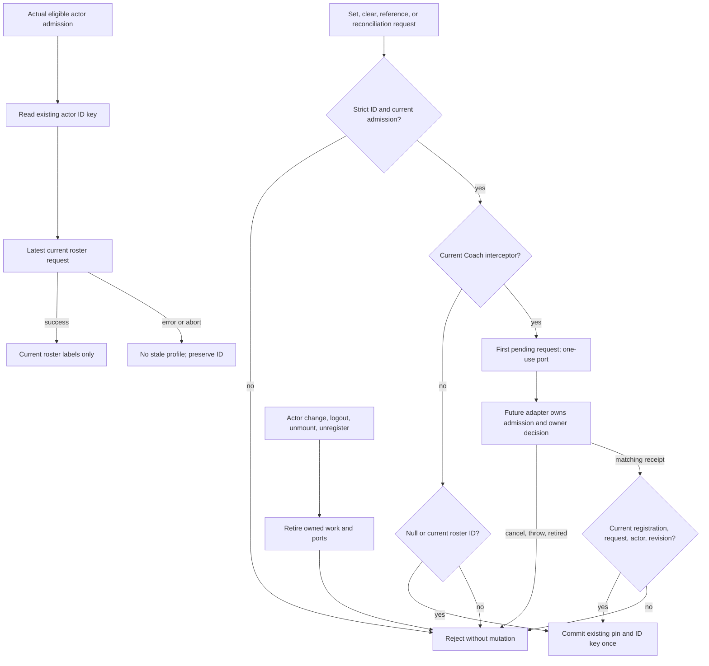

# 61 — G04.2b-C1: existing GlobalClientProvider reference boundary

Status: **PLAN PREPARED for root admission; implementation NOT STARTED.** Planning-only continuation of [55](55-coach-selection-and-transport.md), dated 2026-09-12. This document narrows C1; it does not authorize C2, create plan62, activate Session Desk, or replace plans31/32/45/47/48. B1/B2 transport retirement remains future work and a prerequisite to later product mounting. Root owns active HR10 and the controller; the current builder assignment is unchanged. Sean's Astra review override applies; no GLM/Flash gate or paid call is introduced.

## 1. Baseline, preservation, and requirements

Canonical worktree: `C:/Users/BigotSmasher/Desktop/@Everything/quick-pt/SS-PT/tmp/worktrees/swan-coach-astra-owned-20260906`; branch `codex/swan-coach-astra-owned-20260906`; HEAD `48d792da5351a3f89518baba7f4ab553d69f41a8`. This is an already dirty, shared candidate, not a clean release checkout. This planning run edits no existing product, test, plan, or controller file. It adds this document and one uniquely named existing-test log. Root must snapshot the five future implementation files at slice admission; a hash inventory alone is not a recoverable source snapshot.

Existing baseline: [g04c1-existing-baseline-20260912.log](../../../../tmp/coach-astra-hostile-20260912/g04c1-existing-baseline-20260912.log), SHA256 `3d4d59a2d4460dcfa9acaded77e836d653368f7edea7a1a8020ea454fbae8973`. Actual run started `2026-09-12T11:32:35.309Z`, ended `11:32:38.840Z`: **5 files / 34 PASS, exit0**, with before/after hashes stable for all15 inspected files. Existing React act warnings remain in the captured log. Tests use synthetic auth/roster transport; this is compatibility baseline, not C1 acceptance or production evidence.

Source baseline hashes: `frontend/src/context/GlobalClientContext.tsx` = `f228995e5d3dc5ff73459f6310863d48abf0679733bd9d7ba169d351b9fc0e14`; `globalClientPin.ts` = `dff1494ca5d007be4543616fa98d2301d7ad6a65574cefe0d8d90a1015c68553`. The log carries the remaining inspected source hashes. Preserve unrelated AGENTS.md, `_g02_registry_audit.cjs`, `frontend/.hermes`, root repairs, and other agents' work.

| ID | Job, invariant, and measurable acceptance |
|---|---|
| C1-R01 | Actual authenticated positive safe actor ID and raw `admin`/`trainer` role alone admit provider actions. First changed-actor render exposes no previous pin, profile, roster, or loading state; A-B-A, logout, actual role change, unmount, and old callbacks cannot revive an earlier admission. |
| C1-R02 | Keep one selected-client reference in the existing provider. Expose its ID without fabricating an ActiveClient. Profile fields come only from a current successful roster row; a validated ID absent from the roster remains ID-only. |
| C1-R03 | Keep the existing actor-scoped sessionStorage ID key, legacy PII-key purge, and ordinary restored-pin reconciliation. Never store a profile, receipt, thread, anchor, draft, or access assertion. A stored ID requires fresh later Coach admission. |
| C1-R04 | Exactly one current Coach interceptor can receive every requested pin change before any pin/storage mutation. A pending request preserves the pin; duplicates cannot create another pending decision or silently replace the first. |
| C1-R05 | Only the registration's current one-use commit port may bypass interception. Strict matching read-receipt shape, actor admission, request identity, and reference revision are checked synchronously; failed, retired, repeated, or mismatched commits cause zero mutation. |
| C1-R06 | Roster reads are actor-generation and latest-request bound, abortable locally, and bounded to one current read. Loading, failure, successful empty, and ready states remain distinct. Late success/error/finally cannot change current state or storage. |

Non-goals: route/chat/thread state ownership, dirty-draft decisions, owner mutation, fresh target-access requests, dialogs, transport retirement, Notebook/food/voice integration, workout writes, backend authorization, cross-tab synchronization, new storage policy, or release readiness. No new provider, provider key, selected-client store, or generic event bus.

## 2. Existing architecture and exact implementation boundary

All source references below are **verified-source** observations at the baseline, not newly executed mounted journeys.

| Existing path | Observed behavior and C1 consequence |
|---|---|
| `frontend/src/context/GlobalClientContext.tsx:110–124,153–159,278–298` | Internal pin is an unstamped ID, public API exposes only ActiveClient, and setters publish the supplied profile immediately. Keep the ID owner and derive profile from the roster instead. |
| Same file `:140,183–231` | Passive actor-value ref plus ID/role equality accepts an old A request after A-B-A. No latest-refresh sequence/AbortSignal; a captured setter can still write its old actor's key. Replace lifecycle checks within this provider. |
| Same file `:238–276`; `globalClientPin.ts:25–70` | Successful missing-row reconciliation clears ordinary pins; storage parses IDs permissively and accepts any truthy role. Preserve supported keys and empty-roster behavior while strictly rejecting ineligible identities/IDs. |
| `frontend/src/components/DashBoard/UniversalDashboardLayout.tsx:193`; `UniversalDashboardLayout.shell.tsx:89–144` | The shell-owned CoachSessionDraftProvider surrounds the shell; GlobalClientProvider is inside the shell around header and route content. Shell loading/error can unmount the latter while the draft owner survives. Do not reorder or key either provider. |
| `frontend/src/components/Shared/GlobalClientSelector.tsx:254–266` | Header select/clear reaches existing setters. Interception must precede those mutations; closing the header dropdown is outside C1 and does not mean selection committed. |
| `frontend/src/components/DashBoard/Pages/coach-assistant/hooks/useCoachPinnedClient.ts:65–120` | Reads stored pin from ActiveClient; roster/URL effects call setters; picker then independently calls newChat, clears thread, writes URL, and announces status. C1 interception cannot stop those later caller actions. Do not register it in production until later caller wiring replaces this path. |
| `frontend/src/components/DashBoard/Pages/coach-assistant/hooks/useSwanCoachClientSelection.ts:121–124` | Local selection changes before the global setter; later URL changes are also separate. This is not made atomic by C1. |
| Other consumers | ClientProgressView, BodyMap's raw GlobalClientContext consumer, and AdminCreateSpecialManager can mutate the pin; EnhancedWorkoutLogger/client progress read ActiveClient; AIClientPicker/NutritionPlanBuilder/useTrainerClients read roster data. Preserve existing nullable profile/void setter compatibility; none receives new write authority from an ID reference. |

**Exactly five future files:**

1. `frontend/src/context/GlobalClientContext.tsx` — the existing owner and lifecycle/interceptor implementation.
2. `frontend/src/context/globalClientPin.ts` — existing pure helper/types location for strict IDs, receipt validation, and storage compatibility. No module state or second owner. This one-file refinement to55's C1 list avoids concentrating all validation in the provider.
3. `frontend/src/context/GlobalClientContext.actorSwitch.test.tsx` — extend the real-provider lifecycle regressions.
4. `frontend/src/context/GlobalClientContext.actorScope.test.ts` — extend existing storage/strict-validation cases.
5. NEW `frontend/src/context/GlobalClientContext.selectionReference.test.tsx` — real-provider reference/interceptor/commit behavior.

Do not edit the existing normalizer, selector-close-key, or Coach pinned-client tests to accommodate a regression. Run them unchanged. No owner, App, consumer, adapter, backend, database, transport, or controller edit belongs to C1.

## 3. State ownership and UI applicability

Reference state contains only `{actor admission, revision, pinnedClientId, origin}` in the existing provider. `origin` is `none`, `legacy`, or `validated`; `validated` means a current local commit consumed the expected receipt, **not continuing authorization**. No second authoritative ActiveClient state: resolve the nullable profile from the accepted roster and reference. Keep roster data only in its existing provider scope, stamped with current admission/request sequence.

Actor identity uses strict canonical positive safe integers, accepting number42 and canonical decimal string`"42"` as the same actor; reject booleans, whitespace, leading zeros, exponents, fractions, unsafe values, and role aliases. Only actual `admin` and `trainer` are eligible. Preview/audience changes alone do not retire actual actor admission. Admission identity is unique per committed lifetime, so A1-B-A2 differs despite equal IDs. Follow final51's synchronous ref/snapshot and committed-admission pattern: no React state-updater-only linearization, render-time ref mutation, or effect-only masking. Abandoned renders do not retire live state. Replayed StrictMode cleanup cannot invalidate a later live setup.

At the first incompatible render, expose `pinnedClientId:null`, `activeClient:null`, `clientList:[]`, and non-loading state; actions captured from the old admission reject. Commit-time retirement aborts reads, invalidates ports/interceptor registration, clears in-memory references, and loads only the new eligible actor's existing stored ID. Do not bulk-delete other actors' namespaced keys.

Roster policy: a new current refresh retires the previous exposed roster/profile until that refresh succeeds. During loading/error, keep the pin ID but expose no stale roster profile. A failure is not a successful empty roster and cannot clear the ID. Success publishes only the latest current response. Successful absence clears an ordinary legacy pin through the normal request path; a current `validated` reference may remain with `activeClient:null`. This distinction avoids treating roster incompleteness as canonical access denial. Later fresh roster membership can supply the real profile; no synthesized blank name/email object is permitted. Reconciliation-origin clears must also pass a registered interceptor; a rejected/deferred clear must not create an effect loop.

Wireframes, new keyboard/focus layouts, and responsive styling are **N/A for this headless provider slice**. Existing desktop/mobile controls remain. Observable states are: ineligible/masked; loading; ready-with-profile; ID-only/unresolved; pending intercepted request with prior pin retained; invalid/denied commit with no mutation; error with ID retained and no stale profile. C1 adds no success toast or dialog. Later55 C3 owns accessible Return/Discard and pending UI. Existing consumer compatibility tests are required here, while end-to-end decision UX remains explicitly pending.

## 4. Flowchart, state, and sequence



Reference state transitions: `unadmitted -> legacy/no-pin -> requested -> committed/cancelled`; actor retirement returns to `unadmitted`. Request state is separate lifecycle metadata, not another selected-client value; at most one pending candidate exists. Repeated same candidate coalesces; a competing candidate returns busy without replacing it. Cancel permits a new explicit request; it causes no automatic retry.

Sequence: caller invokes existing setter/reference request -> provider validates and captures current admission/revision -> registration receives frozen candidate and scoped port -> future adapter obtains52 read receipt and applies51 decision contract -> port validates/consumes synchronously -> existing reference ref updates -> React publication and ID-only storage write. No await between final validation and consumption/mutation. Callback rejection/throw closes only its request; it cannot clear newer work. Unregister/retirement aborts local interest, not a transmitted server action.

Mermaid source is provided; rendered preview is **NOT RUN** in this planning task. No new visual artifact or renderer dependency was created. ERD/schema diagram is N/A: no database/schema change. Permission/privacy boundaries below and this state/sequence contract are applicable.

## 5. API, permission, and storage contracts

Retain existing `activeClient`, `clientList`, `loadingClients`, `refreshClients`, `setActiveClient(client|null):void`, and `clearActiveClient():void`. Existing setters validate only the supplied ID and derive any profile from the current roster; they never trust supplied names/email. A same-ID legacy setter is a no-op to avoid current synchronization loops.

Add these narrowly typed members, with pure public types in `globalClientPin.ts`:

- `pinnedClientId:number|null` and `getClientReferenceSnapshot()` returning readonly ID/actual actor/generation/revision/origin/roster-status metadata. A captured old snapshot accessor returns an unadmitted/masked snapshot, never its old actor's data. No profile, route, receipt, message, or draft is copied into this snapshot.
- `requestClientReference(nextId:unknown)` returning a discriminated committed/no-op/pending/rejected result. `null` is an explicit clear; undefined is invalid. Without an interceptor, only null or a strict current-roster ID can commit. A non-roster reference needs the registered validated path; there is no unchecked public setter for it.
- `registerCoachSelectionInterceptor(handler)` returning success with an identity-bound disposer or a registration-conflict result. Exactly one registration; duplicate attempts cannot replace it. Register in an effect, never render. Disposing an old registration cannot remove a later one. C1 ships with no production registration.

The handler receives a frozen bounded candidate `{requestId, actorId, actorRole, actorGeneration, referenceRevision, fromPinnedClientId, nextPinnedClientId, origin}` and a **per-request port** `{isCurrent(), commit(receipt:unknown), cancel()}`. Origin identifies `set`, `clear`, `reference`, or `roster-reconcile`, not arbitrary route/user text. The port is delivered only to the active registration callback; do not expose an unrestricted context-level bypass. Accepted port commit may promote a same-ID legacy reference to validated; this is a reference metadata change, unlike an ordinary same-ID setter. Increment reference revision on accepted ID/origin changes, not label refreshes.

The port accepts the exact52 response envelope: `{success:true,access:{scope:'coach_target_read',actorUserId:number,actorRole:'admin'|'trainer',targetUserId:number|null,conversationId:number|null}}`. Reject missing/extra fields, noncanonical IDs, wrong scope/actor/role/target, or malformed conversation ID. Target must equal this request's next pin; a clear requires a null-target receipt. Validate provider lifetime, current actual admission, registration, pending request ID, and starting reference revision; consume before publication/storage. Reuse, reentrancy, stale cancellation, and after-disposal commits cannot mutate. Validated references absent from the roster retain only the ID and origin.

**Trust limit:**52's JSON is not a signed capability or permission lease. C1 can enforce exact shape, matching metadata, and local one-use ordering; it cannot prove a JavaScript caller fetched a fresh genuine response. The future adapter must obtain the current response over the authenticated API, bind it to its operation and target/thread, and pass it only while current. C1 performs no network admission and gives no read/write permission. Backend reads/writes retain their own checks. C1 does not own conversation identity; the later adapter must match the receipt's conversation against its own requested thread. Restoring an anchor with a different pinned ID cannot reuse a receipt for another target.

Final51 dependency: context exposes `getSnapshot`, `requestTargetChange(next,metadata?)`, `rememberSelection(scopeToken,anchor)`, and request-ID-bound `resolveTargetChange`. Pure owner currently returns `NO_DRAFT` if no draft, `INVALID_TARGET` for same target, and preserves the first pending request. A later adapter must branch around those actual results; do not invent a no-draft/same-target success intent or mutate owner state from C1. Return preserves the draft; Discard retires it before a later destination commit. C1 stores neither this owner state nor selection anchors.

Permission matrix: eligible current staff can restore their own ID key, select current roster IDs normally, and register one interceptor; current port plus matching receipt can commit an ID-only reference. Unknown/client/user roles and stale admission can do none of these. Presentation role has no authority. Storage contains only bare ID under `ss-active-client:<actorId>:<rawRole>`; existing legacy `ss-active-client` PII purge remains. Reload converts any stored ID to legacy origin and never restores validation. Storage unavailable/corrupt cases remain nonfatal. No storage listeners, cross-tab state, token data, receipt persistence, or raw-error/ID/profile telemetry.

Roster reads retain existing endpoints and admin `limit:500`. Use current auth transport read refs, a stable boot per actor admission when transport becomes available, monotonic request identity, and a local AbortController passed to both endpoint configurations. Superseded requests abort; every continuation also checks admission/latest identity because transport may ignore abort. No fetch-per-render loop, new polling, automatic retry, or invented permission timeout. A new explicit refresh can retry. Cleanup removes only owned work; no new timer/listener is needed.

## 6. Executable tests and evidence

All following C1 regressions are **NOT RUN / not yet authored**, because this task is planning-only. Use the real GlobalClientProvider and synthetic useAuth/roster transport, not a mocked provider or a copy of the intended algorithm. Save clean behavioral RED before implementation; import/setup failures are not RED.

| Test ID | Real action and required observable result | Requirement |
|---|---|---|
| C1-T01 | Drive A1-B-A2, logout, actual-role changes, preview-only change, unmount, and StrictMode. Capture every exposed render plus old set/clear/snapshot/refresh callbacks. No old data, state, storage write, loading/error publication, or listener survives retirement; preview alone does not retire. | R01,R06 |
| C1-T02 | Exercise canonical numbers/strings, null, undefined, booleans, zero, decimals, unsafe, exponent/leading-zero IDs; raw client/user/unknown roles; corrupt/private-mode storage. Only supported actor/target inputs pass; existing ID-only keys/purge persist. | R01,R03 |
| C1-T03 | Supply forged/stale profile fields to a valid roster ID and an absent ID. Only real current roster profile appears; absent normal ID is rejected. Validated absent ID remains ID-only across empty roster and gains labels only from a later current row. | R02,R05 |
| C1-T04 | Deferred overlapping refreshes resolve/error/finally out of order and after abort/A-B-A. Only current latest response publishes; admin limit and both signals retained; stable rerenders do not refetch; loading/error retain ID, successful empty clears legacy. | R01,R03,R06 |
| C1-T05 | Register one handler; invoke set, clear, ID reference, and missing-row reconciliation. Observe pin/snapshot/storage before resolution: unchanged. Same candidate coalesces; competing candidate is busy; no repeated reconcile loop. Disposal/handler rejection/throw leaves selection unchanged. | R04 |
| C1-T06 | Valid port commit, wrong/extra/missing receipt fields, wrong actor/target, malformed thread, stale request/revision, double/reentrant commit, old cancel/disposer, and actor retirement during delayed validation. Exactly one matching current commit; zero others, including storage writes. | R01,R05 |
| C1-T07 | Same-event request/commit/snapshot, followed by a second mutation. Snapshot reflects the linearized ref before React rerender; first callback cannot act on the later revision. Same-ID ordinary setter is no-op; explicit admitted promotion happens once. | R02,R04,R05 |
| C1-T08 | Reload ID-only storage, distinguish legacy and current validated origins, successful roster exclusion with/without interceptor, failure versus empty, and storage-write exceptions. No persisted receipt/profile/anchor; no automatic validation after reload; intercepted retirement never pre-clears pin. | R02,R03,R04 |
| C1-T09 | Run existing normalizer, actor tests, selector close-key, and pinned-client compatibility suite unchanged; type-check. No consumer API regression or accidental production interceptor registration. | R01–R06 |

RED targets against current source include A-B-A stale roster acceptance, captured old setter storage mutation, supplied-profile publication, and un-intercepted setter mutation. New API missing at runtime can be an expected contract failure only when the harness imports/mounts successfully; it cannot replace those actual behavioral repros. Follow with the full new matrix GREEN.

Commands from `frontend`, after the new file exists:

```powershell
node node_modules/vitest/vitest.mjs run src/context/GlobalClientContext.test.ts src/context/GlobalClientContext.actorScope.test.ts src/context/GlobalClientContext.actorSwitch.test.tsx src/context/GlobalClientContext.selectionReference.test.tsx src/components/Shared/GlobalClientSelector.closeKey.contract.test.ts src/components/DashBoard/Pages/coach-assistant/CoachCommandCenterPinnedClient.test.tsx --maxWorkers=2 --retry=0 --reporter=verbose
npm run type-check
```

Baseline used the first command with the new selectionReference file omitted; exact stdout/command/hash pairs are in the linked log. Future tests assert request counts (one current boot/read per admission, no settle loop, no automatic retry), max one registration/request/commit, and absence of unexpected API/route/owner/provider calls. No latency number is claimed; network-independent synchronous setter assertions are the meaningful C1 budget. C1 has no database or provider boundary to exercise, so PG/provider tests are N/A. Fresh52 + actual mounted router/owner/selection/browser tests belong to later55 C and remain NOT RUN here; mocks cannot prove them.

## 7. Traceability and dependency receipts

| Requirement | Exact component / acceptance tests | Evidence now |
|---|---|---|
| R01 | Provider admission + pure strict identity; T01,T02,T04,T06,T09 | Existing A-B tests PASS; new lifecycle cases NOT RUN |
| R02 | Existing pin/roster derivation + reference snapshot; T03,T07,T08,T09 | Source inspected; new reference behavior NOT RUN |
| R03 | Existing storage helpers + reconcile request path; T02,T04,T08,T09 | Existing scoped-ID baseline PASS; new origin/race cases NOT RUN |
| R04 | Single interceptor/request lifecycle in provider; T05,T07,T08,T09 | No current API; tests NOT RUN |
| R05 | Pure receipt validator + one-use port; T03,T06,T07,T09 | Final52 shape source verified; port tests NOT RUN |
| R06 | Provider roster request retirement; T01,T04,T09 | Existing late A-B success baseline PASS; latest/A-B-A cases NOT RUN |

Final dependency snapshots inspected:51 doc SHA256 `eab2af0bdfa7c4fecb027c58582c4d3028df057e9e984452bae5be9d1726eb3b`;52 doc `b2119fb84b3f578066b76dcf6b8ae599851d93cf26495bedcff373bee2eb2a13`;55 doc `af4c41b5426327fc2dd13a6d3a803c6423979cc44795097938ecd8d8ca9402d5`. Source API takes precedence over55's formerly in-progress51 descriptions.

Final51 local exit evidence: `tmp/coach-astra-hostile-20260912/g04-2a-local-exit.json`, 49 focused PASS plus typecheck (dependency receipt, not rerun here). Final52 [repair receipt](../../../../tmp/coach-astra-hostile-20260912/g04ra-repair-receipt.json), SHA256 `b79a0922e7306a32a366f61f4fa37183ac6177e509ef3665d4bfcced1c1307f8`:120 focused API/unit,18 PostgreSQL,21 root actual-app checks. The original actual-app table-absence assumption was harness-limited; corrected genuine permission-table outage proof and preserved originals are documented in52. These passed backend checks do not establish C1 client-side receipt provenance or mounting. Canonical 90-day real-session fallback and HR8 actor checks remain unchanged.

## 8. Ordered slice, operations, recovery

Entry: root admits this exact five-file scope against current snapshots/controller and checks dependency API hashes for drift. No C2 implementation begins in this slice. Implementer first records real RED, then pure helpers and existing-provider change, then all focused GREEN/typecheck, then a bounded hostile review of the exact combined C1 diff. Preserve all failed/harness-limited logs with accurate labels and capture before/after source hashes and actual command exits.

C1 exit is a **dormant compatible API** with no production Coach registration. The later55 adapter/caller integration is the only place to register it once route/chat/owner side effects are coordinated and B1/B2 are ready. Existing direct setter callers cannot suddenly be described as having global dirty-draft protection. No deploy, feature activation, migration, provider spending, or controller advancement is performed by this planning task.

Operations: one live roster request and interceptor/pending request per admitted provider; synchronous commits and bounded metadata only. Failure returns bounded reason codes such as invalid actor/ID, busy, registration conflict, stale, invalid receipt, or no current roster. No raw HTTP error or client data logging. Abort is local interest retirement, not proof of server rollback. No additional timer/listener/background polling.

Rollback: restore only the admitted five files from root's verified slice snapshots while preserving other agents' changes. Because C1 has no mounted interceptor, its local rollback does not require uninstalling C2 or changing storage format. Once later consumers depend on it, rollback must coordinate those consumers; never substitute unrestricted commits. No DB restore or destructive storage migration is required. Exercise cleanup/unregister and storage compatibility in T01/T05/T08; no live rollback performed in this planning task.

## 9. Hostile decisions and remaining limits

- Comparing actor values is insufficient for A-B-A; merely aborting HTTP is insufficient when a transport still resolves. Ref/admission/latest-sequence checks must guard every publication and captured mutation.
- ID-only does not mean authorized. Neither a roster match, stored ID, forged TypeScript cast, nor receipt-shaped object grants backend access. Future adapter and server boundaries remain required.
- The single interceptor cannot prevent newChat/URL/local selection that existing callers perform before or after setters. C1's dormant exit is deliberate; mounting it early would produce inconsistent UX and false success messages.
- A roster missing a client may reflect pagination or canonical recent-session access. Preserve only ID metadata for explicitly validated references; expose no fabricated or retired profile. Ordinary restored pins still use successful roster reconciliation.
- Legacy automatic pin clearing must not bypass an active dirty decision. Reconciliation must request once, and a denied clear must not spin. Profile masking is independent of retaining that pending ID.
- A public unrestricted bypass or second registration that overwrites the first would defeat the owner. Keep the one-use port tied to current registration/request/revision, including same-event/reentrant execution and old cleanup.
- Global provider lifetime differs from shell draft-owner lifetime. Its unmount retires its own work only; it must not discard or copy the still-live workout owner.
- No new source-level capability is labeled implemented, no current UI command is labeled usable by this plan, and no combined deployment claim follows from the34-test baseline.

## 10. Compact readiness receipt

| Category | Disposition |
|---|---|
| Baseline/preservation | Current branch/HEAD and15 source hash pairs in existing-test log;34 PASS. No original overwritten. Root's pre-build recoverable snapshots still required. |
| Requirements | Six bounded invariants with measurable tests; non-goals explicit. |
| Blueprint | Existing owner/provider hierarchy, exact five files, consumer limits, final51/52 dependencies specified. |
| Wireframes | N/A headless slice; observable states specified, existing controls retained; later55 decision UX pending. |
| Flowchart/state/sequence | Source and lifecycle included; Mermaid rendered preview NOT RUN. |
| Contracts/permissions/privacy/ERD | Applicable contracts and trust limits included; ERD/schema N/A. |
| Tests | Existing34 PASS; all new C1 tests/RED/typecheck NOT RUN, commands and expected effects specified. |
| Traceability | R01–R06 mapped to exact components and T01–T09; synthetic versus actual boundaries separated. |
| Slices/operations/rollback | Dormant C1 exit, resource budgets, cleanup, scoped recovery, and later mounting prerequisite specified. |
| Hostile review/readiness | Source challenges recorded; root admission and final C1 review pending. No structural receipt checker/native-hook execution claimed. |

**Disposition:** architecture prepared for a bounded C1 admission; root owns final readiness JSON/integrity check, preserved controller history, and activation. This planning task is complete when this new document and unchanged-source baseline evidence are read back. C1 implementation, combined B/C integration, mounted browser proof, and release remain pending. Do not advance another slice or reinterpret B1/B2 as passed from this document.
