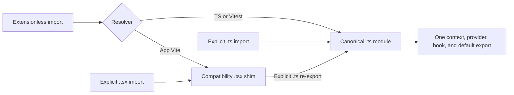

# 62 — Retire the duplicate surface context through a compatibility shim

**PLAN PREPARED; no implementation performed.** This is a one-file repair plan, not plan55's C2 selection adapter. Root owns activation/controller and the running explicit-source compile. Preserve HR10, Luna's assignment, and the existing G04 owner/selection architecture. Sean's Astra review override remains applicable.

## 1. Baseline, requirements, and preservation

Canonical repository: `C:/Users/BigotSmasher/Desktop/@Everything/quick-pt/SS-PT/tmp/worktrees/swan-coach-astra-owned-20260906`; branch `codex/swan-coach-astra-owned-20260906`; HEAD `48d792da5351a3f89518baba7f4ab553d69f41a8`. Both `useCoachSurfaceContext.ts` and `.tsx` are tracked. Existing dirty changes belong to the shared candidate and are untouched.

Exactly one future production edit: `frontend/src/components/DashBoard/Pages/coach-assistant/useCoachSurfaceContext.tsx`. Keep the canonical `.ts`, callers, tests, Vite/TypeScript configuration, owner, and controller unchanged. Root snapshots the original `.tsx` before activation; this plan adds only a document and uniquely named existing-test/resolution evidence.

| Requirement | Acceptance |
|---|---|
| SC-R1 | Extensionless, explicit `.ts`, and explicit `.tsx` consumers reach the same canonical provider/context/hook implementation; no self-re-export cycle or second createContext. |
| SC-R2 | Preserve named/default exports, provider props, surface token/generation, bounded entity IDs, and the outside-provider error. Explicit null entity IDs inherit the canonical null handling. |
| SC-R3 | Existing real-provider tests remain unchanged and green; explicit-source TypeScript checking includes both tracked paths and no longer reports duplicate line57's TS18047. |

Source baseline SHA256: canonical `.ts` `3dd30e82dede01aefb9b8683f267040e77e3a3070763f4b7de96f6006fc48a2f`; duplicate `.tsx` `04185b6f05da91323a7dac13cf34184ef002a93b85325000ca5d7386acdad963`. This task changed neither. No providers, DB, server, or full compile were started.

## 2. Blueprint and verified resolution findings

`useCoachSurfaceContext.ts:48–65` derives the provider value and handles nullable selectedEntityIds with `selectedEntityIds ?? []` at52. `.tsx:48–69` duplicates the context/provider; its accepted nullable prop reaches `.filter` unguarded at57. Supplying explicit null can therefore throw. The duplicate also creates a separate React context at41: mixing its provider with the canonical hook would not share context. Those triggers are source-verified; no browser null-crash or mixed-module runtime repro is claimed here.

The prior assumption that all extensionless callers choose `.ts` is false for the app's bundler. Read-only installed resolver probes returned:

| Resolver, using actual local configuration | Extensionless import | Explicit `.ts` import | Explicit `.tsx` import |
|---|---|---|---|
| TypeScript bundler resolution | canonical `.ts` | canonical `.ts` | duplicate `.tsx` |
| Vite app configuration | duplicate `.tsx` | canonical `.ts` | duplicate `.tsx` |
| Vitest configuration | canonical `.ts` | canonical `.ts` | duplicate `.tsx` |

`frontend/vite.config.ts:60` explicitly prefers `.tsx` before `.ts`; `vitest.config.ts:7–13` leaves extension order at defaults. `tsconfig.json:16,19` enables importing TS extensions with noEmit. Probes include the real Gate, Desk, existing provider test, and the duplicate itself as importers. Explicit `.ts` resolves correctly from the duplicate too. They load actual config with envDir/envFile disabled and start no server.

Actual consumers: `CoachSessionDeskGate.tsx:12,32` imports the provider extensionlessly; `CoachSessionDesk.tsx:19,137` imports the hook the same way. Gate currently omits selectedEntityIds, so its default array does not demonstrate the null trigger. Current CoachCommandCenterPage has no Desk/Gate import or mount; this repair does not activate it. Existing Gate/Desk tests mock the surface module; only `useCoachSurfaceContext.test.ts` mounts the real surface provider, while mocking its draft-owner hook. No whole mounted-owner integration claim follows from those tests.

## 3. UI and state applicability

Wireframes, new responsive/accessibility states, and layout changes are **N/A**: the edit replaces an implementation duplicate with exports. Existing loading/readiness, token changes, null target, selected-entity bounds, and error behavior come from the unchanged canonical provider. No new UI, independent state, actor/permission rule, or draft owner is introduced. Existing React context lifetime remains canonical; consolidating import paths removes the accidental second context.

## 4. Flowchart and sequence



Module sequence is resolution -> re-export if needed -> canonical evaluation -> ordinary existing React render. Blocked resolution/type errors stop verification; no fallback implementation is allowed. Revert only the shim from the saved original if needed. Cancel/retry concerns are N/A for this synchronous export-only module; there are no new asynchronous operations. Mermaid source is supplied; rendered preview NOT RUN.

## 5. Exact contract and conditional diagrams

Replace the duplicate body with a brief compatibility comment and precisely:

```ts
export * from './useCoachSurfaceContext.ts';
export { default } from './useCoachSurfaceContext.ts';
```

The explicit extension is required. An extensionless re-export resolves to the shim itself under the actual Vite configuration. Do not copy the null guard into a second implementation, delete the tracked path, introduce another wrapper/provider, alter extension precedence, or retain separate createContext/useMemo code.

`export *` preserves CoachSurfaceProvider/useCoachSurfaceContext and canonical types; the separate default export preserves default-hook import compatibility. Canonical CoachSurfaceProviderProps becomes available through the compatibility path as an additive type export. Canonical props permit optional children; the duplicate previously required them, so existing valid callers remain accepted. No new public endpoint, payload, storage, event, or schema. ERD/DB migration, permission-matrix changes, and new privacy/trust-boundary diagrams are N/A; the unchanged draft-owner hook remains the source of actor/generation. This shim does not repair or expand that authority contract.

## 6. Test plan and actual evidence

[plan62-existing-provider-resolution-20260912.log](../../../../tmp/coach-astra-hostile-20260912/plan62-existing-provider-resolution-20260912.log), SHA256 `ba089eb752a06d53193b4680b63b6d46e2a0391ec4d7e329a990abfea09faddc`: **1 existing file / 6 PASS, exit0**, run `2026-09-12T11:47:24.019Z` to `11:47:25.146Z`. Eight inspected source/config files retained identical before/after hashes. Expected outside-provider exception output is preserved in the log; it is not an unexpected suite failure. The log records all36 resolver results and the actual command.

| Test/evidence | Status and scope |
|---|---|
| SC-T1: existing useCoachSurfaceContext.test.ts | Baseline PASS6: token, generation, fallback surface, bounded/deduplicated IDs, readiness, outside-provider error. Real surface provider, mocked owner. No existing explicit-null test; do not claim this suite reproduces null. Rerun unchanged after shim. |
| SC-T2: resolver evidence plus exact shim source review | Baseline verified divergence and explicit `.ts` resolution. After edit repeat bounded resolver probe under actual Vite and TS/Vitest configuration, and inspect that `.tsx` contains only the two explicit re-exports. This establishes a single implementation without adding mirror tests. |
| SC-T3: parent explicit-source type-check | Existing v2 log contains only `useCoachSurfaceContext.tsx(57,48): TS18047 selectedEntityIds is possibly null`. Parent owns final process receipt and post-edit rerun. This task did not poll or duplicate session86278. |

Original `coach-explicit-source-type-check.log` also has seven NodeJS.Timeout diagnostics caused by its ambient-type configuration. Preserve it as configuration-limited evidence; do not label those seven product defects or alter unrelated source. Corrected `coach-explicit-source-tsconfig-v2.json` uses the frontend typeRoots and explicitly includes both paths. Its observed SHA256 is `7f8a22866eb539f09969a9e14ef43e6104d95353267c9fbd3c67c21eda3702b9`; v2 log observed SHA256 `42b82298d6fe4047df94449e379c4016ee3a88802fbad4d5a751bff64edf6fdb`. Root must bind the completed command exit; a log line alone does not establish it.

After activation, commands from canonical `frontend`:

```powershell
node node_modules/vitest/vitest.mjs run src/components/DashBoard/Pages/coach-assistant/useCoachSurfaceContext.test.ts --maxWorkers=1 --retry=0 --reporter=verbose
node --max-old-space-size=12288 node_modules/typescript/bin/tsc --noEmit --pretty false --project ../tmp/coach-astra-hostile-20260912/coach-explicit-source-tsconfig-v2.json
```

Reuse the parent's completed pre-edit diagnostic as compiler RED, then capture post-edit GREEN and source hashes. Do not invent a runtime RED, add a duplicate test suite, weaken null types, suppress TS18047, or run the original misconfigured compile again. The one-file shim has no provider/DB/write/concurrency boundary requiring new tests. Browser/build deployment proof is NOT RUN; these are resolution and component/type boundaries only.

## 7. Traceability

| Requirement | Component -> validation | Remaining work |
|---|---|---|
| SC-R1 | `.tsx` shim -> SC-T2, SC-T3 | Post-edit exports/resolution/type verification |
| SC-R2 | Unchanged canonical `.ts` -> SC-T1, exact re-export review | Post-edit existing suite; no copied implementation |
| SC-R3 | Existing test + parent's corrected explicit-source config -> SC-T1–T3 | Parent completed RED receipt and post-edit GREEN |

## 8. Slice, operations, and rollback

Entry: root admits one source path, snapshots its exact original bytes, and binds completed v2 RED. Implementation is only the shim above. Exit: existing6 PASS, corrected explicit-source compile exit0, resolver/source review, one-path diff check, and actual before/after hashes. Root retains controller and review authority. No source or configuration change is authorized by this planning task itself.

Operations/performance: two static exports, no extra state, timers, listeners, retries, storage, telemetry, or network. Existing module caching supplies one canonical context. No measurable new runtime latency budget is warranted. Rollback is restoration of only the saved `.tsx` bytes, preserving all unrelated work; it reintroduces the known duplicate/diagnostic and cannot be labeled verified release. No database/storage migration or destructive cleanup.

## 9. Hostile review

The key failure is test/build resolver disagreement, not only a nullable-array line. A second patched provider would retain context-identity divergence. Deleting the duplicate would break explicit extension imports. An extensionless shim would self-resolve under Vite. The explicit `.ts` shim addresses all three while reusing the canonical implementation. Existing green tests alone cannot prove the duplicate was exercised; the independent resolver evidence closes that ambiguity. The dormant Desk state and absence of null at Gate remain explicit limits; no current-user crash or full product readiness is inferred.

## 10. Compact readiness receipt

All ten categories are accounted for: current baseline/preservation; SC-R1–R3; one-file blueprint; headless wireframe N/A; flow/state/sequence; export and unchanged authority contracts with DB/schema N/A; executable existing tests/explicit compile; traceability; operations/rollback; hostile decisions/readiness. **PLAN PREPARED for root admission.** Existing6 PASS and resolver mismatch verified; shim, post-edit tests/compile, rendered Mermaid, structural readiness checker, and implementation review NOT RUN. This task adds no product/test/controller change and stops after this document/evidence handoff. It does not advance G04.2b-C2 or any other slice.
