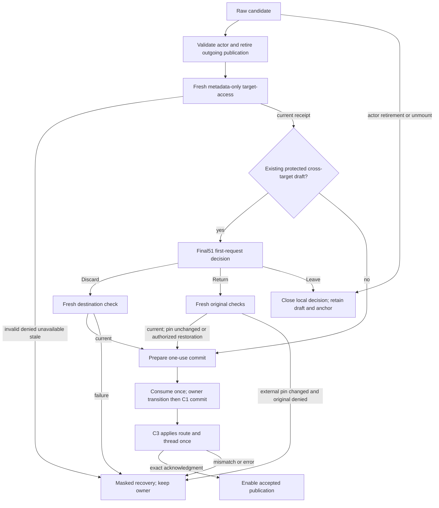
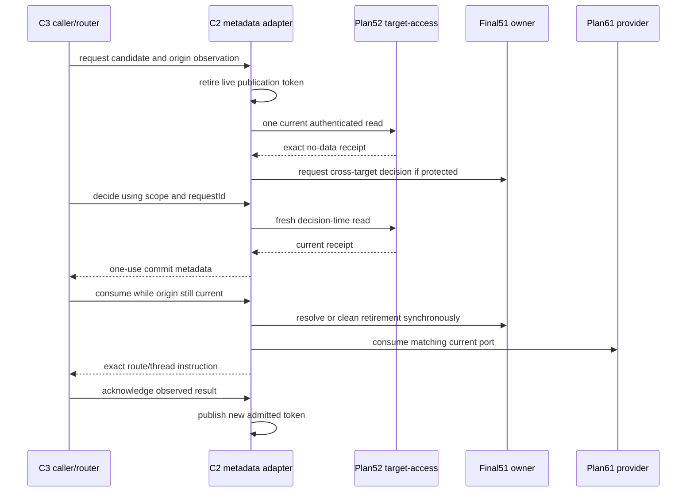

# 63 — G04.2b-C2 selection adapter

Version 1, 2026-09-12. **Architecture PREPARED; C2 implementation requires the actual C1 and B1/B2 exit APIs below.** This is a narrow continuation of [55](55-coach-selection-and-transport.md), using final [51](51-g04-selection-owner.md), implemented [52](52-coach-read-authorization.md), planned [61](61-global-client-reference.md) and the separate [62](62-surface-context-compatibility-shim.md) resolution repair. Root owns admission/controller; Luna currently owns HR7-A. No future source, existing document or controller was edited here. Sean's final Astra review override remains in force; no GLM/provider calls.

## 1. Requirements and actual baseline

Job: decide a requested Coach target/thread using current server read authority and the one existing workout owner, then release one bounded commit to C3. Raw route/pin inputs are candidates, never admitted private context.

Canonical checkout: `C:/Users/BigotSmasher/Desktop/@Everything/quick-pt/SS-PT/tmp/worktrees/swan-coach-astra-owned-20260906`; branch `codex/swan-coach-astra-owned-20260906`; HEAD `48d792da5351a3f89518baba7f4ab553d69f41a8`. Shared dirty work is preserved. This run read source first, ran three existing isolated owner suites, and authored only this NEW plan and [unique evidence](../../../../tmp/coach-astra-hostile-20260912/g04-c2-selection-baseline-20260912T115411Z.log). **35 tests PASS, exit0; ten before/after source hashes matched.** No new tests, compile, build, native suite, database, production or provider calls.

| ID | Acceptance criterion |
|---|---|
| C2-R1 | Only current strict actual actor ID plus raw admin/trainer role may admit a staff target. First incompatible render masks outputs; A1-B-A2, logout/unmount and audience changes retire old capabilities. |
| C2-R2 | Resolve each valid candidate through current authenticated target-access before any private load/publication. Null is deliberate unscoped; absent/unresolved/malformed IDs remain distinct. Receipt is bound to one local operation, not cached permission. |
| C2-R3 | Reuse final51 exactly: branch around NO_DRAFT and same target, preserve same-target draft/submitted state, protect dirty or submitted cross-target work, and use current scope/requestId for decisions. No new draft owner or automatic begin. |
| C2-R4 | Return preserves draft/anchor; Discard reauthorizes before retiring them; Leave retires local interest without discarding. Exact original URL is metadata, never rebuilt through URLSearchParams. Failed external restoration is blocked recovery, not fabricated success. |
| C2-R5 | One pending candidate, one admission request, one C1 port and one one-use commit ticket at a time. First pending decision wins; duplicate/reentrant/stale commit or cleanup cannot mutate newer state. |
| C2-R6 | Expose a live plan55 publication binding and mask until ordinary commit acknowledgment. One validated same-operation created-thread adoption advances the thread token without killing its own send; all independent selections retire old operations. |
| C2-R7 | Selection state, anchors, reference origins and receipts contain bounded IDs/location/lifecycle metadata only. No profiles, messages, workout copies, persisted receipt, permission cache or write grant. |
| C2-R8 | Real-owner/C1 adapter tests prove ordering and failure paths; C3 router/mounted integration and C4 notebook/food/voice remain separate and explicitly pending. |

## 2. Blueprint, source truth and exact scope

**Exactly one future production file:** NEW `frontend/src/components/DashBoard/Pages/coach-assistant/hooks/useCoachSessionSelection.ts`. **One focused test:** NEW adjacent `useCoachSessionSelection.test.tsx`. Types/pure metadata predicates may stay in this module; no module-level mutable state. The hook consumes the existing owner and GlobalClient provider, the authenticated apiService, and C3's bounded location/selection observations. It returns metadata and commit instructions; it calls no chat method, router navigate, notebook, food or voice hook. C3 later mounts it before transport hooks, preventing a circular hook dependency.

| Source inspected | Current fact / consequence |
|---|---|
| `.../CoachSessionDraftContext.tsx:20-39,72-98,120-151` | Actual getSnapshot reads the synchronous owner; rememberSelection takes `(scopeToken,anchor)`; explicit resolve is `(scopeToken,requestId,decision)`. Committed actor admission object prevents A-B-A callback revival; render masks old identity. Reuse it. |
| `.../coachSessionDraftState.ts:1-61,292-414` | Anchor target is NONNULL; pin/thread nullable. requestTargetChange returns NO_DRAFT without a draft, INVALID_TARGET for same target, and the first existing pending change for a competing request. It does not implement clean/same-target navigation success. resolve Return preserves draft/submitted; Discard retires them and increments generation. |
| `frontend/src/context/GlobalClientContext.tsx:21-29` | Current interface still has only activeClient/set/clear/list/loading/refresh. Plan61 snapshot/request/interceptor/one-use port is NOT present. C2 cannot be activated against this current API or manufacture an ActiveClient to bypass it. |
| `backend/services/ai/coachConversationReadAccess.mjs:83-120,161-182`; `backend/routes/aiChatRoutes.mjs:476-497` | Actual target-access resolves an owned/audience-allowed thread using metadata first, checks current canonical access, returns only the plan52 envelope. no-store, Vary Authorization and no implicit ETag shortcut. Receipt contains no audience field; audience is bound by the request/server check. |
| `frontend/src/hooks/useAIChat.ts:230,266,324,459-559`; `useCoachCommand.ts` | Current hooks lack plan55 optional binding; no coachPublicationScope.ts exists. Current create path uses requested-target fallback. B1/B2 and HR11 are dependencies, not completed C2 behavior. |
| `.../CoachCommandCenterPage.tsx:40-43`; `CoachCommandCenter.controller.ts:41-45,78-89,154-212` | Page passes presentation userRole, not raw role. Controller starts transports, derives effective target from raw input and invokes route/notebook/food effects. These C3/C4 callers are excluded from this file-only adapter slice. |
| `.../hooks/useCoachPinnedClient.ts:73-144`; `CoachCommandCenter.controllerEffects.ts:37-83` | Existing pin selection mutates global pin, newChat, local thread, URL and status directly; route/default effects load before admission. C3 must replace these entry paths; dormant C2 alone provides no mounted protection. |
| `frontend/src/App.tsx:116,237`; `UniversalDashboardLayout.tsx:193`; `UniversalDashboardLayout.shell.tsx:89` | Actual data router and existing shell owner/GlobalClient provider exist. C3 uses useBlocker under that router; no router/provider replacement is needed. |
| [62](62-surface-context-compatibility-shim.md) | App Vite prefers duplicate .tsx while TS/Vitest choose .ts. Root owns the explicit .ts compatibility shim. C2 does not import that surface provider or claim its tests prove mounted resolution. |

`.../` in the table is `frontend/src/components/DashBoard/Pages/coach-assistant/`. Current dependencies are recorded in the log; HEAD does not identify shared dirty source. Do not add compatibility fallbacks for missing C1/B APIs. Root must reread their actual completed exports before implementation and bind them to this packet.

Ownership: workout content/submitted snapshot/pending dirty decision/accepted task anchor remain in final51. Pin ID/reference origin/roster remain in C1. C2 owns only admitted selection and transient request/commit/adoption lifecycle metadata. C3 owns URL/thread/presentation effects; C4 owns existing notebook/composer/food/voice boundaries. No selected-target authority is copied into another provider.

## 3. States, controls and wireframe applicability

C2 is headless, so new desktop/mobile wireframes and styling are **N/A**. Reuse [49-wireframe.html](49-wireframe.html) and plan55's desktop/mobile decision design in C3; neither was rendered in this task. C2 exposes enough discriminated state for truthful C3 controls:

| State | Required later C3 presentation |
|---|---|
| unadmitted/checking | Private content masked, no detail fetch; checking status. |
| ready | Only accepted target/thread/location may drive labels, reads, commands and restored text. |
| decision | Return/Discard with first request's IDs; prior workout retained. Candidate private data remains hidden. |
| rechecking-return/rechecking-discard | Disable repeated decisions; no owner/pin/navigation mutation until check resolves current. |
| commit-ready/committing | Consume once, apply C3 effects once; private output remains disabled until exact acknowledgment. |
| invalid/denied/unavailable | Distinct bounded reason; Retry performs a fresh request. No fallback target or automatic draft discard. |
| blocked-return | Original access cannot currently be verified/restored. Preserve owner draft/anchor and mask private details; offer fresh recheck, deliberate Discard or Leave. Do not claim original pin was restored. |
| retired/leaving | No late publication. Leave preserves shell draft/anchor; remount requires fresh admission. |

Return does not mean restore old messages from a copied cache. It restores only accepted reference/location metadata after the required checks. C3 must keep 44px targets, focus return/trap, keyboard/Escape behavior, mobile wrapping and live status; those mounted/accessibility tests remain C3, not a hook-test PASS.

## 4. Flow and lifecycle





State sequence: unadmitted -> checking -> decision or commit-ready -> committing -> ready. Retry creates a new request generation; decision scope/request remains owner-bound. Any actor/selection retirement makes old request/commit/adoption capabilities terminal. Leave preserves shell-owned content. Mermaid source only; rendered preview NOT RUN. No database schema/ERD or storage migration applies.

## 5. Contracts and consequential ordering

**Input/output contract.** C3 supplies strict actual actor identity/raw role, separate audienceRole, and a readonly observation containing exact pathname/search/hash, nullable route target/thread, nullable observed pin/reference revision and a router observation/blocker key. Parse IDs from raw query pairs before current helpers collapse invalid/missing into null; reject duplicate clientId/threadId and malformed canonical integers. An explicit null candidate is represented as null in memory but OMITTED in the target-access query, never sent as the string `null`. An unresolved thread-only candidate is a distinct variant, not null-target authorization.

The hook exposes `requestSelection(candidate)`, `decide(scopeToken,requestId,'return'|'discard')`, `leave()`, `retry(operationId)`, readonly phase/accepted/pending/commit metadata, `consumeCommit(commitId,currentObservation)`, `ackCommit(commitId,observedResult)` and the plan55 `publicationBinding`. These are proposed C2 exports, not assertions they currently exist. C3 receives no raw receipt or unrestricted pin bypass. Store ports/controllers in the hook's private lifetime refs, never in owner anchors or returned serialized metadata.

**Actual plan52 receipt:**

```ts
{
  success: true,
  access: {
    scope: 'coach_target_read',
    actorUserId: number,
    actorRole: 'admin' | 'trainer',
    targetUserId: number | null,
    conversationId: number | null
  }
}
```

Use current authenticated apiService GET `/api/ai-chat/target-access` with only optional positive targetUserId/conversationId and explicit allowed audienceRole. Validate exact object keys and strict numeric IDs, scope, captured actor/raw role, all requested/resolved identities, and the request's still-current audience/operation. Reuse C1's pure receipt/ID validator after its real exported names are available; add the thread/request checks it intentionally does not own. Never expect an audience echo absent from the response. Unknown thread is resolved with conversationId before any messages are fetched; explicit target+thread conflict is a refusal. Unscoped target+no thread still gets a fresh receipt.

Actual safe errors: 400 INVALID_COACH_READ_REQUEST/COACH_TARGET_CONFLICT; 403 COACH_READ_FORBIDDEN/COACH_TARGET_ACCESS_DENIED; 404 COACH_CONVERSATION_NOT_FOUND/COACH_TARGET_NOT_FOUND; 503 COACH_READ_UNAVAILABLE. Map malformed transport, timeout and unavailable API to unavailable; abort/retirement publishes nothing. Never expose raw backend errors or infer denied access from a missing roster row. Server detail/list still reauthorize; this receipt is neither a lease nor a write/confirmation/billing grant.

**Pending operation and receipt lifetime.** At most one current local operation, one HTTP controller (10s client deadline; existing server budget 3s), one pending owner decision, one C1 port and one commit ticket. A repeated identical candidate coalesces; a competing candidate while deciding returns busy and cannot replace the owner request. Before a decision exists, a newer explicit request retires the prior admission request. Observe/check continuations against captured actor admission object, audience generation, operation identity and origin observation BEFORE starting work, after each await, and at synchronous commit. Abort alone is insufficient.

The initial receipt resolves candidate metadata; do not retain it as dialog authority. Return and Discard ALWAYS recheck immediately on the deliberate decision, with new request identity but the same pending owner scope/requestId. A Retry also performs a new read; no TTL cache, background polling or automatic retry. The final receipt is private to the matching current commit ticket; it is consumed once and discarded on commit/cancel/failure/retirement. It cannot be used for another target, pin or thread or passed into a later operation merely because its shape matches.

**Final51 branches.** Read `owner.getSnapshot()` at the decision boundary; do not use a closure's old draft. (a) No draft: admit selection metadata without begin or requestTargetChange; a NO_DRAFT transition observed after await requires a fresh current-operation check, not a fabricated owner intent. (b) Same target, including new chat/thread: preserve draft, submitted snapshot, scope, revision and requestKey; no requestTargetChange call. (c) Clean cross-target with no submitted snapshot: prepare a commit, then retire that exact clean scope with existing discard ONLY at commit, after rechecking it is still clean/current. If it became dirty/submitted while checking, open the decision instead. (d) Dirty OR submitted cross-target work: require a valid remembered anchor and final51 request, then explicit decision. The submitted case is conservatively protected even if dirty=false. The method's returned change must equal the intended destination/scope/origin/thread; `ok:true` can merely mean another first request already won.

Use current `rememberSelection(scopeToken,anchor)` only after successful admitted commit and only when a draft already exists for that accepted target. A later same-target begin can attach the current accepted anchor without changing semantic revision. Never begin a workout just to gain an anchor; no-draft/unscoped accepted metadata stays C2-local. A protected draft with no valid owner anchor yields recovery, not an invented URL or synthetic draft copy. The existing owner cannot represent a null-target draft anchor; that is correct, not a reason to widen its model.

**Return / Discard / Leave.** An original reference contains only exact accepted location, target/thread, C1 pin ID/origin/revision and current actor admission identity. The durable-within-shell portion is final51's existing anchor; pin origin is C1-owned metadata, not a copied profile. On remount revalidate; never treat remembered origin `validated` as current access.

Root adjudication: ordinary intercepted Return cancels the uncommitted destination and preserves the original pin. If an uncontrolled external mutation already changed the pin and fresh original admission is denied/unavailable, Return is BLOCKED. Preserve owner draft/anchor, mask private original details, expose recheck/Discard/Leave recovery. Do not add a restore bypass, fabricate a receipt/profile, silently clear pin, or report restored success. C3 may clear an independently unadmitted current pin only through its own explicit fresh null-target receipt; it is not a hidden C2 fallback.

When restoration is allowed, the original target/thread receipt admits original Coach content. If the anchor's pin differs from that target, obtain a separate fresh matching pin receipt through C1's normal request/interceptor port; do not reuse the content receipt. The two reads are sequential under one operation/deadline and only the first receipt's bounded metadata remains while the second runs. Any failure prevents all restoration effects. For an unchanged original pin no pin commit is necessary; cancel the candidate port. Owner Return clears only the matching decision. C3 restores exact pathname/search/hash or resets the actual router blocker, using one instruction, never both navigate and proceed.

Discard rechecks destination and any distinct intended pin, verifies current port/origin/owner scope/request, then resolves Discard synchronously before committing destination metadata. Fresh-admission failure must not consume the draft. No await or externally supplied callback between final preflight, owner transition and C1 port consumption. C3 then applies route/thread; if a later local effect fails, remain masked with commit-error recovery. C2 cannot undo an already consumed owner discard and must not keep a backup content store to pretend atomic rollback across router/provider owners.

Leave retires adapter/admission/transport interest and cancels its C1 port. If its exact pending owner decision still exists, resolve Return only to close that decision while retaining draft/submitted/anchor; this does not claim the old URL/pin was restored. C3 performs the deliberate leave navigation. No access check is required to stop reading and leave; no automatic discard or pin clear. Same-task Logger navigation preserves the existing shell owner. Hard reload/off-origin departure remains outside useBlocker and cannot persist a memory-only draft.

**Ordinary commit and publication.** Retain plan55's immutable PublicationSnapshot fields: actorId, rawRole, audienceRole, generation, nullable targetUserId/threadId, enabled; PublicationBinding supplies live getSnapshot. C2 generation is selection/publication lifetime, not the workout's semantic revision or every increment of owner generation. Same-target draft begin/edit does not invent a new client admission; independent thread/new-chat/selection requests do retire outgoing publication. Actual actor admission uses committed unique identity and render masking, never mutation during an abandoned render.

A commit ticket is private, operation-bound and one-use. Public metadata contains only commitId, kind, exact expected origin/destination tuples, owner scope/request when applicable, pin request/revision, and whether C3 should reset/proceed/navigate. consumeCommit preflights all current identities and observations, consumes once, performs the synchronous owner transition and matching C1 commit, and returns instructions. C3 applies only those instructions, then ackCommit must match actual route, pin revision/ID and active thread. enabled stays false until acknowledgment; mismatches remain recovery, not a permissive fallback. C2 does not store C3 effect callbacks in the owner or reconstruct route effects from the current raw URL. C3 does not call proceed and navigate for one ticket. An own-commit observation is acknowledged instead of reopening a selection loop.

**Root-approved B1 -> C2 created-thread adoption.** B1's pure `coachPublicationScope.ts` owns the shared type; C2 implements the optional binding member below. These are existing planned B1/C2 boundaries, not extra production files here:

```ts
type CreatedThreadIdentity = Readonly<{
  id: number;
  role: string; // must exactly match captured audienceRole
  targetUserId: number | null;
}>;
type CreateOperationIdentity = Readonly<object>; // opaque identity, not a wire ID
// Optional member on PublicationBinding:
adoptCreatedThread?: (input: {
  captured: PublicationSnapshot;
  operation: CreateOperationIdentity;
  thread: CreatedThreadIdentity;
  signal: AbortSignal;
}) => Promise<PublicationSnapshot | null>;
```

B1 MUST use actual useAuth even without a binding. Bound create requires captured enabled threadId===null and an adopter capability captured BEFORE POST; otherwise refuse before POST. Existing unbound callers retain internal create continuity with actual-auth/operation fences. Mint one opaque operation object before the original create request. The server create response contains id/role/targetUserId but NO userId: validate the real fields and live authenticated actor, never fabricate userId, role or requested-target fallback.

After validated create, only that original operation enters phase `adopting` and calls the captured adopter once with its local AbortSignal. C2 checks live actual actor/audience/target, exact captured snapshot, unused opaque identity, expected positive created ID and absence of a competing ticket. It retains the original selection generation while disabling private publication and preparing a single `adopt-created-thread` commit. This is a same-operation handoff, not arbitrary same-target equivalence. Root approved NO extra target-access GET for this own-created-thread handoff: the exact authenticated create response belongs to the current already-admitted target/audience, and this commit changes neither target nor pin. This bounded exception creates no continuing authorization or lease. Every independent selection and Return/Discard still performs fresh52; subsequent message/detail endpoints independently reauthorize. Do not widen this exception to an arbitrary thread with the same target.

C3's single commit consumer changes accepted thread/URL metadata and acknowledges exact commitId/result; this mode must NOT call chat.newChat, loadConversation, clear the composer or retire the originating send. C2 then publishes/resolves the exact new enabled snapshot with UNCHANGED generation and the exact created thread ID. B1 replaces only that operation's captured token, rechecks exact live snapshot + actual auth + signal, then may install its conversation/optimistic state and issue the follow-on POST. No follow-on request before acknowledgment.

The only retirement exception is **wait-only** for that original opaque operation while phase=adopting: current actual actor/audience/target and generation must match, with either the old disabled thread tuple or the exact validated created thread tuple during acknowledgment. This exception permits NO state/event/audio/request side effect while disabled. All other operations use normal exact-token checks and retire. Every independent selection, even same target or A-B-A, increments generation, invalidates the adoption ticket and resolves null. Null is superseded, not an error to send into chat fallback.

**Hard cap: five seconds from adoption invocation through acknowledgment**, shared with caller cancellation. C2 cleans its timer/abort listener and settles once; B1 bounds a nonsettling adopter too. Timeout, abort, actor change, independent selection, Leave, unmount, invalid receipt/commit, duplicate use or old acknowledgment resolves null; late ack cannot revive it. The already-created server row may exist; no automatic delete/rebind/retry is authorized. Missing/mismatched create target remains HR11/B1 failure, not a problem the adapter repairs by choosing current target. Root approved this exact callback and wait-only exception before B1 starts; the concise contract was sent to the existing Luna agent.

**Trust/privacy.** Permission matrix: current actual admin/trainer may obtain read admission and select; client/user/unknown roles cannot call this staff adapter; a stale actor/operation can neither restore nor consume; C1 validated origin is reference provenance only. Profiles stay in GlobalClient, content stays in its existing owners. C2 metadata must be bounded by final51 location limits (pathname512/search1024/hash512), strict IDs and one current lifecycle; no snapshots of rosters/messages/exercise arrays or storage writes. Existing backend read/write checks remain independent. New schema/ERD, queue, migration and paid transport are N/A.

## 6. Tests, RED strategy and evidence

All NEW C2 tests are **NOT CREATED / NOT RUN**. Use a real final51 provider, real completed C1 provider and real B1 publication predicates; mock only authentication/roster/admission HTTP and C3's effect port. Do not call a mocked owner or standalone copy of the algorithm integration evidence. C2 missing imports are setup failures, not behavioral RED. Once dependency APIs exist, establish tests against an importable adapter skeleton/current candidate, preserve intended behavioral failures, implement and record GREEN. Existing 35 PASS supplies owner compatibility only.

| Test | Requirements | Fixture/action -> required observation |
|---|---|---|
| C2-T01 | R1,R7 | Every render and captured callback across raw admin/trainer/client/user/unknown, actor A-B-A, audience-only change, logout, StrictMode and unmount: no stale metadata, API start, port use or publication; no persisted private data. |
| C2-T02 | R2 | Canonical IDs/null/missing/unresolved/duplicates/whitespace/leading-zero/unsafe inputs; unknown thread outside history page; explicit target-thread conflict. No detail fetch or fallback pin; exact authenticated metadata request only. |
| C2-T03 | R2,R5 | Deferred admission and ignored abort: newer request, wrong actor/role/target/thread/extra receipt fields, 400/403/404/503, transport timeout/error. Old success/error/finally does not publish or consume; Retry starts fresh. |
| C2-T04 | R3 | No draft, clean cross-target, same-target thread/newChat, explicit null, clean becoming dirty/submitted during read, begin/new task during read. Correct branch, zero automatic begin, no fake NO_DRAFT/same-target intent, preserved same-target revisions. |
| C2-T05 | R3,R5 | Dirty/submitted draft with valid anchor, missing anchor, repeated/competing request, stale render resolver, duplicate decision and A-B-A scope. First owner request wins; only exact request/scope resolves once. |
| C2-T06 | R2,R4,R7 | Return with exact query duplicates/order/encoding/hash, pin different from target, unchanged intercepted pin, and externally mutated pin with denied original access. Separate matching pin receipt when needed; denied restoration keeps draft/anchor masked and makes zero fabricated restore/clear calls. |
| C2-T07 | R3,R4,R5 | Discard recheck denied/timed out versus current receipt; pin port stale before consume; commit callback error. Draft remains until valid final preflight; exactly one owner retirement and pin commit; later failure is recovery, never copied-draft rollback. |
| C2-T08 | R4,R5 | Leave while checking/deciding/committing/adopting, child unmount/remount. Cancel only own port/ticket; close exact decision via Return without discarding; retained shell anchor reauthorizes on remount. |
| C2-T09 | R5,R6 | consume/ack same event, double/reentrant use, wrong origin/result, old cleanup, deferred C3 apply and own observation. enabled stays false until exact ack; no recursion/default-selection race. |
| C2-T10 | R1,R6 | Real B1 bound create adoption: null thread/capability precondition, actual-auth change, valid id/role/target with no userId, opaque operation reused, wrong created ID/commitId, five-second timeout, late ack, independent selection during wait. Exactly one follow-on POST only after matching ack; no install/event before it. |
| C2-T11 | R1,R6 | Original adopting operation survives ONLY its own disabled same-generation handoff; other pending sends/loads/list/error/paywall/finally/command-action/TTS publications retire. Reentrant action dispatch rechecks before each event. No arbitrary same-target token substitution. |
| C2-T12 | R7,R8 | Real-provider hook harness checks bounded metadata and no storage/content copies; fresh legacy vs validated reference after remount. Later C3 real data-router/native and C4 retained as separate required evidence, not marked PASS by this test. |

Existing baseline command, canonical `frontend`:

```powershell
node node_modules/vitest/vitest.mjs run src/components/DashBoard/Pages/coach-assistant/coachSessionDraftState.test.ts src/components/DashBoard/Pages/coach-assistant/CoachSessionDraftContext.test.tsx src/components/DashBoard/Pages/coach-assistant/CoachSessionDraftContext.hostile.test.tsx --maxWorkers=1 --retry=0 --reporter=verbose
```

Actual **3 files / 35 PASS, exit0**, ten source pairs unchanged. Log SHA256 `d0c128a2368acabda31989b32222b01beb75f7db3977c59243e1508ca1323e38`. No broad compile/build/native or backend test rerun. Backend52 is source-verified here; its prior actual authority receipts remain in52 and are not this run's PASS.

Future command (NOT RUN, new file absent), from canonical frontend:

```powershell
node node_modules/vitest/vitest.mjs run src/components/DashBoard/Pages/coach-assistant/hooks/useCoachSessionSelection.test.tsx --maxWorkers=1 --retry=0 --reporter=verbose
```

C3 later must use createMemoryRouter/RouterProvider with actual owner/C1/B hooks for push/replace/back/forward, all ordinary global pin callers, first load/default thread, new chat, history and exact Return. C3 native evidence uses root's isolated app fixture, synthetic Client42, intercepted provider/audio transports, desktop/mobile and keyboard/focus. C4 separately tests notebook/composer restore/persist, staged food/paywall and speech callbacks under the same binding. No new native filename/command is frozen until those caller slices are admitted; missing mounted evidence remains an explicit release gate.

## 7. Traceability and excluded caller ownership

| Requirement | Component / tests | Readiness boundary |
|---|---|---|
| R1 actual admission/lifecycle | C2 live binding + B hooks; T01,T10,T11 | B1/B2 actual API/behavior pending |
| R2 current no-data read | C2 request/receipt validation + actual52; T02,T03,T06 | Actual frontend decoder/C1 exports pending |
| R3 final owner branches | C2 + unchanged final51; T04,T05,T07 | Owner35 baseline PASS; new adapter cases NOT RUN |
| R4 Return/Discard/Leave | C2 decision instructions; T06,T07,T08 | Router recovery/UI belongs C3 |
| R5 one pending/one-use commit | C2 + C1 scoped port; T03,T05,T07,T08,T09 | C1 not implemented in inspected source |
| R6 publication/adoption | C2 callback, B1 pure type + operation; T09,T10,T11 | Approved contract; implementation/combined proof pending |
| R7 metadata/privacy | Existing owners + C2 bounded refs; T01,T06,T12 | No new stores; verify actual future code |
| R8 meaningful integration | Real-provider harness; T12 | All C3/C4/native/release evidence remains pending |

R1..R8/T01..T12 use the C2- prefix. C3 alone owns `CoachCommandCenterPage.tsx`, controller/actions/controllerEffects, useCoachPinnedClient and the small decision UI plus router/caller tests from55. It passes actual raw role separately, mounts C2 before transports, registers its current interceptor through C2 and routes every picker/recent/history/new-chat/default/route/back-forward/global-pin request before effects. Raw observed changes mask immediately, even when URL precedence would otherwise hide a new global pin. C2 does not make these existing unsafe callers safe until C3 replaces them.

C4 alone owns existing notebook/composer, pending food/query, route storage consumption and voice-capture boundaries. Admission must fence before read/restore/prefill/send/remove/paywall/finally and late transcript callbacks. Approvals remain their existing server ceremony; C3 retires old views/actions and only adds a narrow live predicate if actual mounted tests establish a remaining pre-unmount start race. C2 contains no approval, diary/Logger submit, food or voice implementation.

## 8. Ordered implementation and operations

Entry: root freezes this packet and exact source snapshots, verifies final51 unchanged, plan52 receipt actual, completed61 exported port/validator contract, completed55 B1/B2 and approved adoption type. Root also owns62 shim/current resolver evidence. C2 should not start by inventing stand-ins for unfinished dependencies; adapt this document to actual compatible export names before assignment, without copying their implementations.

Then one bounded C2 builder slice: (1) importable hook/tests and intended RED, (2) strict metadata/actor/request lifecycle and owner branches, (3) receipt/decision and one-use consume/ack, (4) same-op adoption/cleanup, (5) focused GREEN plus existing owner compatibility and root narrow review. Production scope stays one new hook; any required dependency change returns to its existing B1/C1 owner. C2 exit is a tested **dormant adapter**, not a mounted product. Root serializes C3 then C4 and real journeys; no automatic activation, source assignment or controller advancement occurs here.

Resource bounds: one current HTTP controller, pending owner decision, port, commit and adoption waiter; general admission 10s, adoption/ack hard 5s. No polling, retry loop, fetch-per-render, roster refetch or body traversal. Expired/aborted callbacks settle without touching newer flags. Log only enumerated phase/reason and timing; no route query payload, IDs/names, profiles, messages, receipt or auth data. Memory is cleared on retirement; existing shell workout remains its owner's responsibility.

Rollback: before C3 mounting, remove/revert only the admitted new C2 module/test from root snapshots; existing behavior is not newly certified. After callers depend on it, coordinate their rollback and keep private content disabled until an authoritative scope returns; never re-enable raw selection as a shortcut. Preserve final51,52 and B1/B2 protections. No DB/schema/storage restore or destruction applies. A completed owner discard or transmitted server request is not rolled back by navigation cancellation.

## 9. Hostile decisions and retained blockers

- final51 is not a navigation API: same-target/NO_DRAFT/clean/submitted branches must be explicit. Never call begin to satisfy metadata storage or reinterpret first-request ok as acceptance of a competing candidate.
- Receipt shape is not receipt provenance or ongoing access. C2 owns authenticated request provenance and one-operation use; C1 owns pin commit provenance. A pin different from the accepted target requires its own matching receipt if it must change.
- Root rejected a restore bypass. Already-mutated external pin plus denied original access is blocked recovery. C3 must prevent ordinary mutations through all known callers/router; truly external changes cannot be retroactively prevented by a hook.
- Cross-owner changes are ordered, not a database transaction. Preflight and no-await consumption prevent routine races; a post-discard router failure must be reported honestly. No draft copy or automatic compensation store is introduced.
- getSnapshot alone cannot adopt a newly created thread. Root approved the async one-use callback, actual useAuth even unbound, null-thread/adopter-before-POST preconditions, same-operation wait-only exception, exact C3 acknowledgment and five-second bound. Server response has no userId. Missing target is never filled from the request.
- Actual B1/B2 and C1 are still absent from inspected source. Their final exported types, token comparison and cancellation behavior must be reread; a compiling adapter against mocks cannot close that dependency.
- Final52 backend read authority is not a frontend access lease, server write grant, or evidence that every caller is mounted correctly. HR11 create-schema fallback and62 Vite shim remain their own root-owned dependencies.
- Missing native/real C3/C4 proof remains pending. No desktop/mobile, provider, database, compiler, release or all-surface capability claim follows from 35 owner tests.

## 10. Readiness receipt

Canonical artifacts: this NEW63, linked51/52/55/61/62 and49 design preview, plus [g04-c2-selection-baseline-20260912T115411Z.log](../../../../tmp/coach-astra-hostile-20260912/g04-c2-selection-baseline-20260912T115411Z.log). Source inspection preceded documentation. Requested architecture identity `gpt-6-astra`/`xhigh`; served-model/token metadata unavailable, so no served identity/token count is invented. Original controller/review history remains root-owned; no builder/reviewer/provider was started here.

All ten categories are accounted for: requirements/baseline, one-hook blueprint, headless wireframe N/A and C3 states, Mermaid/state/sequence, actual and proposed contracts plus permissions/privacy/ERD N/A, executable test plan and actual35 baseline, traceability, ordered implementation/operations/rollback, hostile decisions, this receipt. Code-fence/link/hash checks and any structural gate are document evidence only; rendered Mermaid, all NEW C2 tests, compile/build, C3/C4/native/PG/rollback and final review are NOT RUN in this task.

**Disposition: complete architecture handoff, implementation PENDING dependency admission.** Root may admit the one-hook/one-test C2 slice after actual C1/B1/B2 exits and exact adoption integration are verified. C3/C4 and deployment are not ready from this receipt. Preserve the approved denied-Return recovery and five-second adoption contract when recording controller readiness. No further planning or implementation begins without root dispatch.
