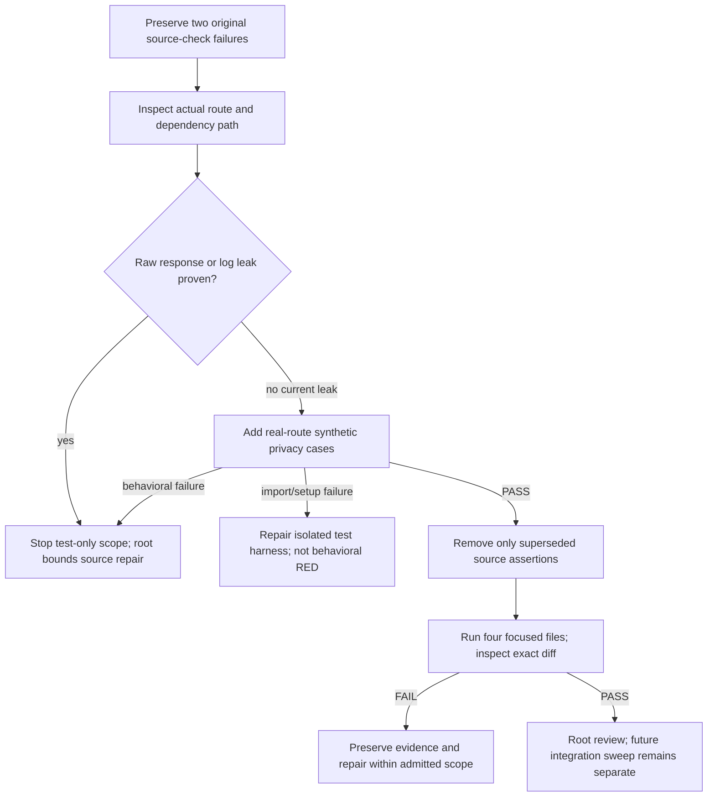

# 64 — Replace stale route-privacy source guards with behavioral coverage

Version1, 2026-09-12. **Narrow test-repair PLAN PREPARED for root admission; no implementation.** Continuation of final [52](52-coach-read-authorization.md) and the post-HR11 sweep, preserving [45](45-g11-release-readiness.md) release gates. Root owns current HR11 and controller; AstraRuntime owns DB1. Sean's final Astra review override applies. No provider/reviewer, DB, browser, production, source or controller changes occurred here.

## 1. Requirements, baseline and preservation

Job: preserve the privacy properties formerly approximated by two source assertions, while making tests follow actual route behavior after the read-service extraction and typed intent-list errors.

Canonical worktree: `C:/Users/BigotSmasher/Desktop/@Everything/quick-pt/SS-PT/tmp/worktrees/swan-coach-astra-owned-20260906`; branch `codex/swan-coach-astra-owned-20260906`; HEAD `48d792da5351a3f89518baba7f4ab553d69f41a8`. Shared dirty work is preserved. Original parent sweep reports 145 selected Vitest files, 1086 PASS/2 FAIL/4 billing SKIP, plus Node58 PASS. Inventory records Vitest exit1 and Node exit0. These are the parent's broad-sweep results, not a broad rerun by this task.

Preserved originals: [backend-post-hr11.log](../../../../tmp/coach-astra-hostile-20260912/backend-post-hr11.log), SHA256 `5c7631757966f250fce084030edc6798760e3e57585f268abeaa74a534f0f80e`; [inventory](../../../../tmp/coach-astra-hostile-20260912/backend-post-hr11-inventory.json), SHA256 `4ba1d085d7e860920b4c8032ceb2a75b6f06cb6936cd68cb2e0076c963090681`. Do not overwrite, relabel green, change skips/exclusions, or alter HR11/DB1 to make this packet pass.

Independent focused rerun: the two failing unit guards plus two existing actual-route suites produced **72 PASS / 2 FAIL, four files, test exit1**. Both failures are the same source assertions; nine before/after source/test hashes matched. [Unique evidence](../../../../tmp/coach-astra-hostile-20260912/privacy-guard-baseline-20260912T122248Z.log), SHA256 `e3c87879c2e58f93c494fdd1d8cef2fc1591329e52e9e9db277cd5a47437f7eb`. Read-only inspection preceded test execution and this new document. New acceptance tests remain NOT RUN.

| ID | Acceptance |
|---|---|
| P64-R1 | Actual authorized conversation-detail HTTP response uses the real failover-trace sanitizer; injected provider error text is absent while allowed metadata remains. Denied reads still return no private payload. |
| P64-R2 | Actual message-route persistence uses sanitized failover metadata before update; deterministic mocked provider output and pre-existing metadata cannot retain raw trace errors. No real provider or DB call. |
| P64-R3 | Actual command routes keep arbitrary exception message/stack/driver detail out of response and route logger calls, while typed fixed 400/404/503 messages retain their useful contract. |
| P64-R4 | Replace only the obsolete assertions after behavioral replacements pass; preserve unrelated guards, pure sanitizer tests, original two FAIL and isolation. No source-text concatenation/mirrors or production repair without a newly proven leak. |

## 2. Blueprint and independent findings

**Verdict for the two reported failures: stale source guards; no current leak established on these inspected paths.** This is not a claim that every metadata key or log in the application is private.

| Inspected source / test | Evidence and consequence |
|---|---|
| `backend/tests/unit/aiChatFailoverTracePrivacy.test.mjs:50-56` | Third test requires `metadata: sanitizeAiChatMetadataForClient(conversation.metadata)` literally inside the route. It also guards the message-update sanitizer by source text. The first two tests execute real sanitizer functions and currently PASS. |
| `backend/routes/aiChatRoutes.mjs:476-497`; `backend/services/ai/coachConversationReadAccess.mjs:217-229` | Route passes `sanitizeMetadata: sanitizeAiChatMetadataForClient`; authorized detail calls `sanitizeMetadata(found.metadata)` after metadata/target checks and payload recheck. Extraction changed location, not this sanitizer path. |
| `backend/services/aiChatService.mjs:2128-2152`; `backend/routes/aiChatRoutes.mjs:996-1009` | Real sanitizer maps unknown trace suffixes to provider_error and preserves allowed codes; message route sanitizes trace/updated metadata before conversation.update. It is not a general recursive scrubber of arbitrary metadata keys. |
| `backend/tests/api/coachConversationReadAuthorization.test.mjs:56-67,156-225,259-295` | Real protect/JWT and route/read-service/authorization run against mocked account/models. Current sanitizer is mocked as identity, so authorized metadata privacy is NOT covered. Denied responses, verification errors and one error-log path are behaviorally covered. |
| `backend/tests/unit/aiCommandRouteFallbackSource.test.mjs:22-26` | Blanket absence of `error: err.message` now matches the intentional typed-error branch, not an arbitrary-exception response. Keep unrelated fallback/unhandled-utterance tests untouched. |
| `backend/routes/aiCommandRoutes.mjs:79-93,495-527`; `backend/services/ai/coachIntentListing.mjs:15-49` | Typed list errors are caught separately; every current constructor call uses a fixed literal. Assignment failures are wrapped in fixed unavailable. Generic model/read exceptions use fixed response text and log only selected name/code/context, not message/stack/cause/sql. Class name spoofing is not instanceof. |
| `backend/tests/api/coachIntentRoutes.test.mjs:143-193` | Real route/listing/public-receipt serialization run with auth/assignment/model/executor mocks. Existing tests cover result redaction, actor/cursor scope and indistinguishable missing/denied404. They do NOT inject generic/typed failure paths or assert exception-log privacy. |

**Exact minimum future edit boundary: four existing TEST files only:**

1. `backend/tests/unit/aiChatFailoverTracePrivacy.test.mjs` — retain real pure-function tests; replace the obsolete third source-wiring test by the actual-route coverage below in the API suite, removing now-unused source-read imports/constant.
2. `backend/tests/api/coachConversationReadAuthorization.test.mjs` — preserve real JWT/route/read-service and all existing authorization/HR11 tests; use real sanitizer exports within the existing service mock, add detail and mocked-message persistence cases.
3. `backend/tests/unit/aiCommandRouteFallbackSource.test.mjs` — remove only the obsolete exception-text guard after its behavioral replacements pass; keep all other existing fallback/audit source guards. No regex exception for the new branch.
4. `backend/tests/api/coachIntentRoutes.test.mjs` — add typed and generic response/log privacy tests through actual routes; expose needed existing mocks rather than mocking listCoachIntents or the route under test.

Production routes/services, Vitest configuration/setup, inventories, known-failure lists, billing skips, HR11 and DB1 are read-only boundaries. No new framework, extracted sanitizer module or guard registry.

## 3. UI/state applicability

Wireframes, desktop/mobile layout and accessibility changes are **N/A: test-only backend repair**. API behavior remains authorized redacted success; denied/missing; fixed validation/unavailable; generic failure. No new response, UI copy, polling or retry behavior. Native/browser proof is unnecessary for these route serialization assertions and is not claimed.

## 4. Flow, sequence and conditional diagrams



Sequence: synthetic model/provider result -> actual route/read service -> real sanitizer or fixed-error branch -> Supertest HTTP body plus captured logger/update arguments -> privacy assertions. Denied reads must stop before private payload; source-test failure alone never enters the leak branch. State machines/ERD/schema migration are N/A, as no product state/model changes. Permissions and privacy boundaries are applicable in section5. Mermaid source supplied; rendered preview NOT RUN.

## 5. Contracts and isolation

Use a constant obviously synthetic sentinel such as `SYNTHETIC_PRIVATE_PROVIDER_DETAIL`, never real keys, addresses, DB URLs or customer records. Include it in trace suffixes and separately in Error.message/stack/cause/driver detail. Use known safe error name/code so the test checks the intended message/stack boundary rather than silently expanding the current logger contract to arbitrary hostile code/name fields.

**Conversation detail:** real `sanitizeAiChatMetadataForClient` and `sanitizeAiFailoverTrace`, seeded stored metadata `{responseStyle:'concise',lastProvider:'fallback',failoverTrace:[...unsafe suffix..., 'openai:success']}`. Authorized GET must return exact safe trace and preserve benign fields, without mutating the seeded record. Denied GET must omit messages/metadata entirely and not invoke payload sanitization. Assert explicit expected JSON, not expected output calculated by calling the same sanitizer under test.

In the existing aiChatService mock use `importOriginal` to retain the TWO real sanitizer exports while keeping provider/enrichment calls stubbed. Do not copy their implementation or extract function text from a file for eval. Audit partial-mock imports: real service also imports `stripIdentityFromNotes` and `NUTRITION_CARE_COPY_RULES`; preserve those actual/pure exports in their existing mocks, plus the analytics stub if required. A missing-export setup failure is not privacy RED. Existing restricted child environment/network preload remains the backstop; unexpected provider/DB activity fails instead of falling through.

**Message persistence:** use the existing actual POST `/api/ai-chat/conversations/:id/messages` with a synthetic active owned model instance and update spy. Choose the supported general conversation lane and deterministic mocked sendChatMessage result containing unsafe trace suffixes. Provide explicit consent/assignment/identity/enrichment mocks so the request reaches the update, not an unrelated refusal. Assert status200, exactly one update, sanitized update.metadata.failoverTrace, benign metadata retained and no unsafe text in HTTP response. GET that saved mock record afterward through the real detail route to verify the read boundary too. This is a mocked persistence assertion, not a real DB commit or provider journey. No network provider implementation runs.

**Command errors:** keep actual listCoachIntents and toPublicCoachIntent; inject failures at model.findAll, listAssignedClientIds, and mocked readCoachIntent. Check exact fixed bodies/statuses: malformed cursor400 `cursor is invalid.`; denial404 `Intent not found or unavailable.`; assignment-verification failure503 `Coach intent history is unavailable.`; ordinary list exception503 `Failed to read coach intents.`; ordinary detail exception500 `Failed to read coach intent.`. Unknown exceptions with a forged name/status are still generic, not typed public messages. Do not directly construct a malicious typed error and falsely label that trusted internal constructor path externally reachable.

Add one actual POST `/api/ai-command/execute` exception case in the same route suite: expose its existing executor mock, add a mocked database query returning an empty identity roster and a valid context-envelope fixture, then reject the executor with the sentinel Error. Assert the executor was actually reached, response500 `Internal server error processing your command`, and absence of sentinel/stack/cause/sql from response AND captured route logger calls. This retains command-lane coverage rather than moving the former safeguard only to a happy receipt read. Existing setup logger is mocked; capture its calls, not console text or file contents. No classifier/provider runs.

Roles/access remain unchanged: conversation suite uses real authentication middleware/JWT with synthetic account storage; intent suite mocks protect and current assignment, so it proves serialization/route behavior, not real assignment/JWT authority. Existing denied/read tests remain. These assertions cover trace sanitization and exception serialization, not all free-form metadata, arbitrary log fields, live infrastructure, provider correctness or production deployment.

## 6. Tests and honest RED/GREEN evidence

| Test ID | Req | Future action / expected observable result |
|---|---|---|
| P64-T1 | R1,R4 | Keep both real sanitizer unit cases; add authorized GET with raw persisted trace sentinel through real route/helper/sanitizer. Exact redacted trace, benign fields kept, input immutable. |
| P64-T2 | R1,R4 | Denied/revoked detail seeded with sentinel metadata: no payload fields and no sanitizer invocation/payload read; retain existing authorization regression matrix. |
| P64-T3 | R2,R4 | Actual message POST with mocked provider, consent/assignment and update; inspect persisted mock metadata and subsequent GET. Raw trace absent at both boundaries, no real provider or database call. |
| P64-T4 | R3 | Actual list endpoint with invalid cursor, denied target and assignment exception. Fixed400/404/503, no sentinel reflection or private error details. |
| P64-T5 | R3 | Model list/read rejection containing message/stack/cause/sql sentinel, plus forged error name/status. Fixed503/500; response/log calls contain no raw details. |
| P64-T6 | R3,R4 | Actual execute reaches mocked pipeline then throws sentinel. Fixed500 and sanitized log; preserve successful fallback/audit tests. |
| P64-T7 | R4 | Four-file diff, no production/test-config/exclusion changes; all focused tests pass with real sanitizer functions in route fixture. Original broad and focused two-failure logs remain unchanged. |

All new tests **NOT CREATED / NOT RUN**. The existing source assertions are known baseline FAIL, NOT valid behavioral product RED: they fail because text moved or a typed branch exists. Expected progression is preserved static FAIL2 -> added behavioral tests on correct current source -> focused GREEN after superseded source assertions are removed. Do not temporarily break production to manufacture RED. If desired, root may separately prove test sensitivity with an explicitly labeled isolated mock fault (identity sanitizer or raw-error return), preserving that failure apart from the normal suite; it does not prove a current product leak.

Actual focused command from canonical backend, run with an OS-only child environment (NODE_ENV=test), existing root dotenv/network preload and envDir-disabled config:

```powershell
node --require ../tmp/coach-astra-hostile-20260912/backend-post-hr11-preload.cjs node_modules/vitest/vitest.mjs run tests/unit/aiChatFailoverTracePrivacy.test.mjs tests/unit/aiCommandRouteFallbackSource.test.mjs tests/api/coachConversationReadAuthorization.test.mjs tests/api/coachIntentRoutes.test.mjs --config ../tmp/coach-astra-hostile-20260912/backend-post-hr11.config.mjs --maxWorkers=1 --retry=0 --reporter=verbose
```

The evidence records actual test exit1, 72 PASS/2 FAIL and nine unchanged hash pairs. The orchestration shell completed successfully while explicitly retaining the child failure; do not report shell exit0 as suite PASS. Reuse this exact isolation for the later focused run. No broad backend rerun, Node suite, compiler, billing, DB1, browser or provider run belongs to this bounded task.

## 7. Traceability

| Requirement | Edited test artifact -> acceptance tests | Current evidence |
|---|---|---|
| P64-R1 detail privacy | sanitizer unit + conversation API suite ->T1,T2 | Real sanitizer unit PASS; authorized route uses identity mock today; new route cases NOT RUN |
| P64-R2 persistence privacy | conversation API suite ->T3 | Source sanitized update verified; new behavior NOT RUN |
| P64-R3 safe typed/generic errors | intent API suite ->T4,T5,T6 | Fixed constructor/catch paths inspected; current suite lacks injected errors |
| P64-R4 safeguards preserved | four exact test files ->T1,T2,T3,T6,T7 | Original2FAIL and focused2FAIL retained; new GREEN NOT RUN |

T1..T7 abbreviate P64-T1..P64-T7. Existing tests do not establish database/provider runtime. No source-pattern replacement is counted as new behavioral coverage.

## 8. Implementation, operations and rollback

Root admits only the four test paths after snapshotting them and checking current HR11 stability. First add real sanitizer/route cases and exception cases, retaining old failed assertions. Resolve fixture setup independently. Once replacements pass, remove only the obsolete guards and unused imports, then run the four-file command once and inspect the diff. If an actual privacy test fails against current production behavior, preserve it and stop this test-only scope for a separately bounded source repair; do not loosen expected output or replace real sanitizer with a fake.

Exit: new behavior PASS, all other focused tests PASS, four-test-file diff only, unchanged source hashes, preserved failure evidence and root review. No build/typecheck is needed for this JavaScript test-only change. Broad integration/release remains root's later work. Resource bound is one worker, four suites, retries0, synthetic account/models and loopback ephemeral HTTP only. No polling, durable writes, migration, new runtime logs or product performance changes; test duration should remain within existing per-test30s timeout.

Rollback restores only the four admitted tests from verified snapshots, retaining new evidence. It restores the known source-check failures and therefore is not a green release. No DB/storage restoration, queue rewrite, HR11 revert or production deployment applies.

## 9. Hostile review and decisions

- Source location is not execution: concatenating route+service text or changing the expected literal would preserve brittleness and still miss real sanitization. Actual route JSON and update arguments are the replacement evidence.
- A sanitizer mocked as identity cannot certify sanitizer privacy. Keep real functions and explicit safe expected values, while mocking only external work.
- Typed fixed messages are not arbitrary driver exceptions. Current call sites are literal-only; test both actual typed input/failure paths and generic exceptions, including logging, without inventing a publicly reachable malicious constructor.
- The old chat guard also covered persistence by source text. A GET-only replacement would silently drop that safeguard; T3 is required.
- Preserve unrelated fallback/audit guards and all current auth/HR11 tests. A test-count decrease without mapped replacement is not acceptable.
- No runtime leak was demonstrated by either original failure. These findings do not certify all metadata/logging privacy, live service behavior or deployment. DB1 and all broader defects remain with their existing owners.

## 10. Readiness receipt

Ten categories are complete for planning: actual baseline/preservation; requirements; four-file blueprint; headless UI N/A; Mermaid/sequence and schema/state N/A; exact privacy/auth/isolation contracts; tests and executable command; traceability; operations/rollback; hostile decisions/readiness. New tests, focused GREEN, rendered Mermaid and implementation review are NOT RUN. Existing two failures remain FAIL with the source-vs-runtime distinction above; no perfect/privacy-complete claim.

Architecture requested `gpt-6-astra`/`xhigh`; served-model/token metadata unavailable. No external reviewer or builder was started. Root retains controller/activation and the final Astra review. **PLAN PREPARED for the four-file test repair; no production source repair is justified by the two inspected failures.** A structural gate may report the retained baseline FAIL; that is not permission to erase it. Root should admit this narrow repair with the known baseline explicitly carried forward, then require behavioral replacement GREEN before closing the two failures.
