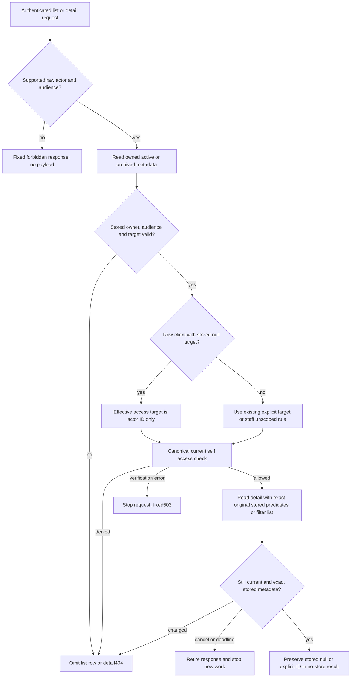

# 65 — HR15 client self-conversation read compatibility

Version 1, 2026-09-12. **PLAN PREPARED for root admission; defect reproduced, repair NOT IMPLEMENTED.** Continuation of [52 current read authorization](52-coach-read-authorization.md), [55 transport contract](55-coach-selection-and-transport.md) and [57 target integrity](57-conversation-target-integrity.md). Preserve [31](31-gwen-execution-handoff.md), [32](32-gwen-domain-and-verification-contract.md) and [45 release gates](45-g11-release-readiness.md). Root owns controller and deployment decisions; Sean's Astra review override applies. [64 privacy test repair](64-route-privacy-regression-tests.md) is separate and must finish/release its shared API-test file before this implementation edits it.

## 1. Baseline, requirement and preservation

Canonical worktree: `C:/Users/BigotSmasher/Desktop/@Everything/quick-pt/SS-PT/tmp/worktrees/swan-coach-astra-owned-20260906`, branch `codex/swan-coach-astra-owned-20260906`, HEAD `48d792da5351a3f89518baba7f4ab553d69f41a8`. Shared dirty work remains untouched. This worker created only this new plan and unique HR15 harness/evidence; it did not edit product code, existing tests, controller or other documents.

Actual local reproduction: [JSON](../../../../tmp/coach-astra-hostile-20260912/hr15-mounted-client-self-red-01.json), [log](../../../../tmp/coach-astra-hostile-20260912/hr15-mounted-client-self-red-01.log), [exact harness](../../../../tmp/coach-astra-hostile-20260912/hr15-mounted-client-self-red-01.mjs). Source/artifact SHA-256 values and commands are bound in [receipt](../../../../tmp/coach-astra-hostile-20260912/hr15-plan65-receipt.json). Preserve these originals; do not relabel them GREEN after repair.

The actual createApp server, real login/protect/JWT and canonical models used only the owned local DB2. One temporary synthetic linked waiver for fixture client42 and one uniquely titled conversation were created and removed. No fixture schema, assignments, DB1, provider, message-send, browser or production operation occurred. Existing synthetic login bookkeeping may update. The waiver fixture does not prove waiver signing.

At `2026-09-12T12:48:21.489Z`, **five product acceptance checks: 3 PASS / 2 FAIL**. Harness exit0 means it successfully reproduced the expected RED, not that the product passed:

| Check | Actual | Verdict |
|---|---|---|
| Actual client creates own conversation | 201; conversation13 | PASS |
| Response and persisted owner/role/target | owner42, role client, target null | PASS |
| Client list includes that conversation | 200, own thread absent | FAIL |
| Client detail returns that conversation | 404 COACH_CONVERSATION_NOT_FOUND | FAIL |
| Client cannot use staff-only target-access | 403 COACH_READ_FORBIDDEN | PASS, preserve |

The same PID62512, boot time `2026-09-12T12:19:57.2052886Z`, loopback listener4991 and five product source hashes held before/after. All product source mtimes preceded boot; binding to loaded code is inferred from that stable process/mtime evidence, not process-memory introspection. Cleanup recorded zero own conversation rows and zero own waiver rows; DB2 pool closed and ownership released. No new unit/API/PG test execution is claimed by this planning task.

Job: a signed-in client can reopen and list their own normally created Coach threads without changing stored identity or gaining staff admission.

| ID | Required observable acceptance |
|---|---|
| HR15-R1 | Exact authenticated owner with raw role client reads active/archived role-client threads whose stored target is explicitly null; list and detail return the original null. |
| HR15-R2 | Retain existing explicit-self target compatibility: target equal to normalized actor ID is readable for the same owner/client audience. Null and explicit-self remain distinct stored representations. |
| HR15-R3 | Foreign owner, other target, malformed/missing stored target, unsupported raw user/unknown role, wrong stored audience and deleted records do not disclose payload. No aliasing user into client. |
| HR15-R4 | Canonical checkClientAccess still adjudicates effective client self access; no new grant policy, trainer fallback or admin override. Staff unscoped/targeted behavior remains unchanged. |
| HR15-R5 | Client target-access remains403, with or without conversationId/self target. No metadata admission receipt is issued to clients. |
| HR15-R6 | Recheck and payload SQL remain bound to the actual stored owner/role/context/status/target. Mid-read null-to-self or self-to-null change is stale, even though both would individually represent self access. |
| HR15-R7 | Preserve no-store/Vary, unknown totals/cursor bounds, denied-row filtering, fail-closed whole-request verification errors, deadlines/cancellation and no additional writes/providers. |

## 2. Blueprint and exact minimum scope

The create and read lanes disagree about representation, not ownership. `backend/routes/aiChatRoutes.mjs:391-435` creates client threads without a target; the canonical model (`backend/models/AiConversation.mjs:31-35,52-58`) supports raw client/trainer/admin and defines nullable target for staff-targeted conversations. The message route already treats a client's null as self (`aiChatRoutes.mjs:632,683-687`). Creation and message behavior are read-only dependencies here.

`backend/services/ai/coachConversationReadAccess.mjs:125-132` currently rejects client null metadata before payload lookup; `:137` grants null access only to staff. The existing API regression at `backend/tests/api/coachConversationReadAuthorization.test.mjs:244-247` incorrectly locks out its own null-target fixture. `clientAccess.mjs:95-119` already provides strict normalized self authorization without relationship SQL. That shared gate intentionally supports raw user for other callers; HR15 must not edit or broaden it.

**Exactly three future edit paths:**

1. `backend/services/ai/coachConversationReadAccess.mjs` — admit only supported raw admin/trainer/client actors at this conversation boundary; allow explicit null metadata only for exact owned raw-client/role-client records; map null to actor ID solely for the canonical self-access check. Keep the stored target unchanged in metadata, SQL predicates, comparisons and serialized responses. No new exported store/model/API needed.
2. `backend/tests/api/coachConversationReadAuthorization.test.mjs` — extend its existing real protect/JWT, actual router/read helper and model fakes with the acceptance matrix below; correct the prior null-exclusion expectation after observing clean RED. Preserve plan64's real sanitizer and behavioral privacy additions when they land.
3. `backend/tests/integration/coachReadAuthorization.postgres.test.mjs` — extend the existing dedicated DB1 fixture with actual canonical client-owned rows, self reads and stale predicates; no new config/schema framework.

**Existing validation paths, run unchanged:** `backend/tests/unit/clientAccess.test.mjs` (real normalized self policy, no relationship queries), `backend/tests/unit/aiChatConversationLifecycleSafety.test.mjs` (lifecycle guard), `backend/tests/api/aiChatConversationListTarget.contract.test.mjs` (target serialization contract), `backend/tests/api/aiChatConversationTargetGuard.test.mjs` (HR11 create compatibility). Do not add mirrored source-string tests or modify the generic user self policy merely to satisfy conversation-role rules.

Read-only boundaries: router/create/send/mutations, model/schema, shared clientAccess, frontend B1/B2 adoption, plan64 files other than the shared API suite after release, test config, controller and provider/spend policy. If a new defect requires any of these, report it and let root bound a separate slice.

## 3. UI and state applicability

Wireframes, responsive layout, focus and accessibility changes are N/A: no frontend or copy changes. Existing client history/list/detail recovers from an erroneous missing-thread state to existing authorized success. Admission403, denied404, unavailable503, empty list, user-triggered retry and archived/deleted semantics remain existing API behavior. This plan does not claim mounted browser coverage or enable Session Desk.

## 4. Flow and conditional diagrams



Sequence: actual actor -> read parser -> original metadata -> canonical self check -> exact original predicate -> detail recheck -> serialization. Staff target-access branches never enter client self resolution. Request retry starts fresh; no cached lease survives. ERD/migration N/A: representation unchanged. Durable state machine/rollback diagram N/A: this read fix has no domain mutations. Mermaid source supplied; rendered preview NOT RUN.

## 5. Contracts, permissions and privacy

| Actual actor / row | Outcome |
|---|---|
| client, exact owner, row role client, target null | Self read through canonical gate; serialize null |
| client, exact owner, row role client, target equal actor ID | Existing self read; serialize explicit ID |
| client, foreign owner, other target or row role trainer/admin | Deny/omit; no payload |
| client, target undefined/invalid/coercive | Deny/omit; never convert to null |
| raw user or unknown | Conversation read forbidden; shared generic gate unchanged |
| admin/trainer | Preserve current role/audience, assignment/recent-session, unscoped and target checks |
| any client staff-admission request |403; no new receipt scope |

Normalize actor ID through existing strict parser. The effective authorization target is a local argument only; never write it into the row, response, `meta.targetUserId`, copied `META_ATTRIBUTES` or detail SQL. `null -> actor ID` is permitted only after exact ownership/raw-client/role-client metadata checks, not as an arbitrary request-target fallback. Missing stored target is invalid. Null is not a grant to read another client's data.

Use current read request guards to reject duplicate/unknown query fields and invalid audience. Role changes between requests use actual protect/account role, not JWT claims or a presentation audience. Keep existing per-request cancellation/deadline and final current check. No patient text, tokens, credential values or unrelated list content in evidence; use only own synthetic ID/presence/status metrics.

## 6. Executable test plan

| ID / requirement | Fixture, action and expected result |
|---|---|
| HR15-T01 / R1,R2 | API: actual client account with string actor ID from protect; exact owned null and explicit-self rows. List with/without audience includes both; detail200 preserves respective target. Active and archived reads; deleted row excluded. Observe null RED before helper repair. |
| HR15-T02 / R3,R5 | API: foreign owner, other target, missing/undefined/zero/coercive target, trainer/admin row audience, raw user/unknown, role changed since token. No private title/messages/provider metadata; query counts show denied metadata never triggers payload read. Staff-admission403 stays correct for null/self/conversation requests. |
| HR15-T03 / R4,R7 | Existing canonical unit self matrix passes unchanged. API authorized client self causes no assignment/session SQL; retain staff existing grant/denial, verification-outage and pagination tests. No write/provider calls on reads. |
| HR15-T04 / R6 | API and real PG: between metadata and payload change original null to explicit self, explicit self to null, owner, role, context or status. Predicate must keep original null or ID and fail detail404 without payload; no canonicalization masks the change. |
| HR15-T05 / R1-R7 | Dedicated DB1 PG: real model/HTTP/protect/JWT, own client null row and explicit-self row positive; other client's owned-null/other target denied; stored targets unchanged after reads; client admission403; no own row writes during reads. Fixture uses existing DB1 safety helper/config only after root coordinates/reset if needed. |
| HR15-T06 / R1,R5 | Root reuses this actual DB2 fixture pattern with fresh tag and GREEN expectations: create201/storednull, list includes own thread, detail200 withnull, admission403; five checks pass, zero own fixture rows remain. Preserve original RED and bind fresh source/server identity. |

Focused command from backend, after plan64 releases its API test:

```text
node node_modules/vitest/vitest.mjs run tests/api/coachConversationReadAuthorization.test.mjs tests/api/aiChatConversationTargetGuard.test.mjs tests/api/aiChatConversationListTarget.contract.test.mjs tests/unit/clientAccess.test.mjs tests/unit/aiChatConversationLifecycleSafety.test.mjs --retry=0 --reporter=verbose
```

Owned PG command from backend after root's explicit DB1 handoff, with `SWAN_COACH_TEST_PORT=55439` and existing config `envDir:false`, no shared setup:

```text
node node_modules/vitest/vitest.mjs run --config tests/helpers/coachReadAuthorization.postgres.config.mjs --retry=0 --reporter=verbose
```

No tests were run by this planning task. Implementation saves an actual clean behavioral RED log before repair; setup/import failure is not RED. The actual-app harness exit0 here reports successful reproduction with two product FAILs; GREEN uses fresh expectations and must not mistake reproduction detection for product success. Broader post-repair suite belongs to root after all slices stabilize.

## 7. Traceability and current gaps

R1/R2 -> helper metadata/effective-target handling -> T01/T05/T06; current actual RED proves null list/detail gap only. R3/R5 -> parser/metadata restrictions -> T02/T05/T06; existing actual admission403 control PASS, expanded hostile matrix NOT RUN. R4 -> unchanged canonical gate -> T03; source inspected, unit rerun NOT RUN. R6 -> unchanged exact `META_ATTRIBUTES` and new null race fixtures -> T04; NOT RUN. R7 -> existing scope/list serializer/privacy controls -> focused regressions and plan64 evidence; new repair NOT RUN. Synthetic API/PG fixtures are not a browser/provider/production claim.

## 8. Slice operations, budgets and rollback

One small slice: root admits and preserves current three edit files after plan64 -> Astra/Luna assignment as root directs -> clean API RED -> helper repair -> focused GREEN -> coordinated DB1 PG -> root actual DB2 GREEN -> source-bound receipt and hostile review. No row migration or feature flag. Existing 3s read budget, max50 candidates/targets, max4 relationship checks and max100 relationship SQL remain unchanged; client self requires zero relationship SQL and adds no extra query. Performance acceptance is unchanged bounded-query behavior, not a new production benchmark.

Rollback only the admitted three-file delta against its final shared baseline; no data rewrite. Reverting reintroduces known client-history unavailability, so report that consequence. Root owns operations/controller, real fixture server and later broad/release validation. Do not restart servers or reset DB without root coordination.

## 9. Hostile decisions

REVISE current product for a usable-client regression. Do not fix by changing create to stored actor ID, granting clients target-access, accepting raw user aliases, trusting roster/presentation role, disabling ownership/payload rechecks, or filling frontend target from request. A fixture that only seeds explicit-self rows misses normal create behavior; the preserved actual create-null proof is indispensable. Existing unit gate support for raw user is not authority for this conversation API. Staff preview audience does not grant a downgraded client actor access to old staff-role threads. Treat same-effective-target storage changes as stale rather than widening the second query.

Plan64 is a separate test-only privacy repair; preserve its final tests and coverage, do not replace them with this feature matrix. No generic Coach/Jarvis or production-readiness conclusion follows from this slice.

## 10. Readiness receipt

**PLAN PREPARED, awaiting root controller admission; implementation remains NOT RUN.** Ten categories accounted for above. Baseline and source preservation hashes are in the unique receipt; original actual RED preserved. UI/ERD/migration are justified N/A, Mermaid render and new tests NOT RUN. Source and isolated runtime prove the exact mismatch; no unresolved product decision remains within the stated ownership/null-self contract. Root must wait for plan64 shared-test ownership release, snapshot final source/test bytes and admit only the three exact edit paths before implementation. This worker has not invoked a readiness checker/native hook or changed controller state; structural admission remains root-owned.
