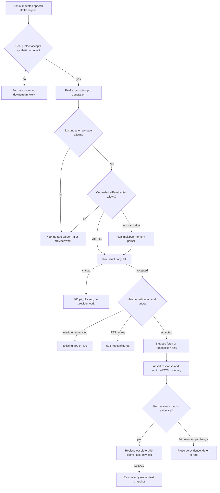

# 66 — Preserve current speech access with executable route contracts

Version1, 2026-09-12. **Test-only PLAN PREPARED for root admission.** Astra architecture; no production implementation. Continuation of the canonical Universe V3 packet and [45 release gates](45-g11-release-readiness.md). Sean's final Astra review override applies; root owns active B1/controller and later enqueue. No new model/provider calls, payment policy, database access, test/source/controller edits or deployment.

## 1. Requirements, decision, baseline and preservation

**Product decision:** Sean answered **“Keep current speech access.”** The [decision receipt](../../../../tmp/coach-astra-hostile-20260912/speech-access-user-decision-20260912.json), SHA256 `6fda1334229fa443f3aa8caede0997a845262ea8ae0d4345521d627073cdc91f`, records preservation of mounted speech generation subscription middleware and strict PII middleware; productionPolicyChangesAuthorized=false. Replace obsolete skipped parity claims with current-policy tests. Do not convert speech to chat billing, introduce a tier charge/402 gate, or weaken privacy.

Canonical worktree: `C:/Users/BigotSmasher/Desktop/@Everything/quick-pt/SS-PT/tmp/worktrees/swan-coach-astra-owned-20260906`; branch `codex/swan-coach-astra-owned-20260906`; HEAD `48d792da5351a3f89518baba7f4ab553d69f41a8`. Shared dirty production route predates this task; preserve it. This document is created only if absent. No earlier plan is overwritten. Before a later test edit, root must snapshot and hash the existing test; Git is not evidence of off-machine backup. Native vault/controller execution is not claimed here.

Independent baseline through the reviewed isolated runner: **8 PASS + 4 SKIP, 3 files, exit0**. Three real PII unit tests and five workout false-positive tests passed; all four obsolete speech cases remain skipped. This is NOT speech access validation. [Unique baseline log](../../../../tmp/coach-astra-hostile-20260912/speech-access-baseline-20260912T133036Z.log), SHA256 `4d45cf3c4b88b0652885ba3dafd2735ef3b0b6d402d0039fe320d1afa4bbafc6`, records exact command and four matching before/after source/test hashes. No new acceptance test has been authored or run.

| ID | Measurable acceptance |
|---|---|
| S66-R1 | Actual router executes global protect, speech subscription factory arguments pro/generation, rate middleware and strict PII in order; chat control retains pro/chat. No source-text assertion or claim of feature parity. |
| S66-R2 | Real subscription middleware with mocked storage preserves current raw-role and usage semantics: only admin/trainer bypass its tracking; client/user take nonstaff tracking and normal free access. No inferred role alias or invented tier denial. |
| S66-R3 | Auth, controlled rate refusal and real critical-PII refusal stop downstream work. Real strict PII transforms synthetic TTS text before a stubbed fetch; multipart text is scanned after upload parsing. |
| S66-R4 | Handler success/validation/unconfigured/refusal contracts are observed without paid/provider/DB calls; transcript bytes and output are not falsely certified PII-free. |
| S66-R5 | Replace the four skipped cases and obsolete comments in one existing test file; preserve baseline, isolation, unrelated tests, all production hashes and truthful proof labels. |

## 2. Blueprint and exact source evidence

The current middleware name/argument does **not** imply a tier paywall. Actual `requireSubscription` has no minimum-tier comparison. Its pro argument remains part of the mounted contract, while feature selects usage tracking. Normal nonstaff free users continue. This is the existing behavior Sean elected to retain, not a newly inferred billing decision.

| Source | Current behavior |
|---|---|
| `backend/routes/aiChatRoutes.mjs:331,511` | Global protect precedes routes. Chat messages mount pro/chat, aiRateLimiter, strictPiiMiddleware. Use an owned synthetic conversation / controlled handler stop for the chat control, never a real inference/provider request. |
| `backend/routes/aiChatRoutes.mjs:1132` | Transcribe mounts pro/generation → aiRateLimiter → real memory upload parser → strict PII → handler. Upload limit is25MiB at122-130. |
| `backend/routes/aiChatRoutes.mjs:1188-1204,1223-1241` | TTS mounts pro/generation → aiRateLimiter → strict PII. Missing/non-string text400; text over5000 chars400; no key503/TTS_NOT_CONFIGURED; downstream fetch receives current sanitized body text. |
| `backend/routes/aiChatRoutes.mjs:1134-1165` | Missing audio400; synchronous checkAndRecordTranscription result gates429 before transcribeAudio; accepted handler returns text/remaining/filename/size. Existing skipped mock wrongly makes this synchronous quota function async and returns an object rather than the service's transcript string. Correct fixture contracts. |
| `backend/middleware/requireSubscription.mjs:94-107,114-121,128-154,175-221` | Missing user401/AUTH_REQUIRED; exact raw admin/trainer bypass; other roles anomaly-tracked; subscription read/possible trial creation; chat or generation usage increment; free/trial/paid/past_due allowed. Import/read failures deliberately allow; usage errors nonblocking. Preserve these existing fallback semantics; do not characterize them as payment enforcement. |
| `backend/middleware/authMiddleware.mjs:274-358` | Real JWT/account lookup, account checks, raw stored role attached to request. No speech-specific client/staff role allowlist. Tests must not infer user→client normalization. |
| `backend/middleware/piiSanitizationMiddleware.mjs:290-373` | Scans configured body strings/nested messages, mutates sanitized values, returns400/pii_blocked for critical content; strict factory blocks critical. It does not inspect binary audio or sanitize the transcribe handler's returned transcript. |
| `backend/tests/api/aiChatTtsPaywallParity.test.mjs:33-53,145-200` | Four deliberately skipped probes with raw role user mislabeled client; subscription and PII are pass-through spies; old comments say mounted guards are absent. Path-spy execution cannot prove payment or sanitation. |

**Minimum edit scope: ONE existing file**, `backend/tests/api/aiChatTtsPaywallParity.test.mjs`. Retain its discoverable filename; replace its misleading title/comments/skipped suite with current speech-access contracts. No new source module, middleware engine, endpoint, fixture framework, dependency or additional test file is necessary.

Use the actual mounted aiChatRoutes in Express/Supertest. Reuse current real-protect/JWT/account-model mocking patterns from `backend/tests/api/coachConversationReadAuthorization.test.mjs:23-28`, without modifying that file. Obtain real subscription and strict PII through importOriginal wrappers that record registration arguments and execution order, then invoke the actual middleware. Mock storage/model/provider dependencies, not the router or the guards being asserted. Wrapper capture alone remains chain evidence; downstream observable assertions establish the bounded behavior.

## 3. UI and state applicability

Desktop/mobile wireframes, keyboard/focus, responsive and accessibility changes are **N/A: backend test-only update, no user interface changes**. Observable response states remain authenticated accepted; denied auth/account; rate refusal; validation/PII refusal; unconfigured503; deterministic stub success/failure. No new loading copy or retry control. Audio playback and native microphone UX are outside this packet.

## 4. Flow and applicable diagrams



Mermaid source supplied; rendered preview **NOT RUN**. Sequence is the actual ordered chain above; a second sequence diagram would repeat it. Permissions/privacy matrix follows. ERD, persisted state machine, schema migration, queue and new event/storage contracts are N/A because no product state changes.

## 5. Contracts, raw roles and trust boundaries

| Actual actor / condition | Existing subscription behavior | Test claim limit |
|---|---|---|
| Anonymous/invalid token | Real protect stops before subscription | JWT tested against synthetic key and mocked account store; not production session proof |
| Raw admin/trainer | next without subscription/usage lookup | Still pass rate, upload/PII and handler gates; no blanket speech bypass |
| Raw client | Nonstaff anomaly + storage/usage path; free/trial/paid normal access | No new pro-tier denial |
| Raw user | Distinct stored role; same nonstaff middleware branch | Never rename fixture client or grant Coach staff selection authority |
| Unknown/missing role in an artificial request | No special staff bypass in this middleware | Does not establish which roles account creation permits; do not invent a role-denial requirement |
| Storage/usage error | Current allow-on-error behavior | Characterization only, not endorsement or payment enforcement proof |

Inputs: real JSON TTS `{text:string,voice?:string}`; real multipart transcribe with synthetic audio file and optional text field; signed synthetic JWT/account. Mock Subscription.findOne/create and User.findByPk/update/increment; no actual record writes. Use unique synthetic actor IDs per test to prevent module-private anomaly counts leaking across tests; fake only Date.now where needed, leaving Supertest timers live.

Record factory arguments including minimumTier and feature. For strict PII assert actual body transformation/blocking, not the recorded call. For TTS provider-boundary checks, a fixed non-secret dummy key and an intercepted in-memory global fetch return a small synthetic PCM response; any unmatched fetch must throw. Provider-error bodies never come from a real service. Restore environment/global stubs in afterEach.

For transcribe quota, `checkAndRecordTranscription` must synchronously return `{allowed:boolean,remaining:number}`; `transcribeAudio` asynchronously returns a string. Multipart `text` is visible only after parser execution. Do not claim that invoking strict PII sanitizes audio bytes, a future transcript or all arbitrary text fields. Mocked rate refusal proves placement/short-circuit, not real limiter thresholds or distributed billing/account correctness.

## 6. Executable test plan and isolated execution

All NEW S66 tests below are **NOT RUN / not authored**. Existing baseline is8PASS/4SKIP. This is filling missing coverage for already-present behavior: do not manufacture a production RED or change source to create one. Preserve SKIP→executed GREEN history. A newly failing behavioral expectation requires root adjudication; an obsolete comment/import/mock failure is not a production regression.

| Test | Requirements | Fixture/action → observable result and forbidden work |
|---|---|---|
| S66-T01 | R1,R5 | Actual chat/TTS/transcribe requests: capture pro/chat versus pro/generation and ordered guard execution; accepted transcript fixture reaches parser then PII. Missing guard, wrong feature or reordered handler work fails. |
| S66-T02 | R2,R3 | Missing/invalid JWT and disabled synthetic account on both speech paths: real auth failure; no subscription/model usage, upload handler, PII or provider work. Keep expected statuses aligned with real protect. |
| S66-T03 | R1,R2 | Raw admin and trainer: accepted TTS unconfigured503 / stub transcript success; no subscription/usage reads, but rate/PII still run. Critical PII blocks staff too. |
| S66-T04 | R1,R2 | Raw client and user with existing free subscription: reach TTS unconfigured503 or stub success; generation increment exactly once and chat increment zero. Chat control reverses counters. Check actual role recorded unchanged. No402 expectation. |
| S66-T05 | R2 | Existing trial/paid/past_due representative fixtures, absent subscription auto-create stub, lookup error and usage-error fixtures characterize current access/fallback only; all DB operations are mocks. Assert no unexplained denial or real resource access. |
| S66-T06 | R2,R3 | Real subscription anomaly path with one actor at fixed time: first50 requests accepted,51st429/AI_ANOMALY_DETECTED, positive retryAfter; no later stage for refusal. Use pre-provider handler stop/stub; unique actor so other tests remain independent. No wait/sleep or distributed-limit claim. |
| S66-T07 | R1,R3 | Controlled aiRateLimiter returns429: neither PII/handler nor transcription quota/provider is reached; for multipart verify quota and transcription absent. Distinguish this injected refusal from T06 real anomaly behavior. |
| S66-T08 | R3 | Real strict PII with synthetic contextual name/email in TTS: intercepted fetch contains redacted text and no synthetic original; safe workout progression remains meaningful. Critical synthetic SSN fixture400/pii_blocked, zero fetch/transcribe calls. Only synthetic identities in logs/evidence. |
| S66-T09 | R3,R4 | Multipart audio + critical text:400 after parser and before quota/transcribe. Benign multipart text + file: stub transcribe receives actual Buffer/filename and returns fixed transcript/remaining. No assertion that audio or returned transcript was scrubbed. |
| S66-T10 | R4 | Missing audio400; synchronous quota denied429 and zero transcribe calls; missing/nonstring/oversized TTS text400; no key503/TTS_NOT_CONFIGURED. Valid accepted fixture calls only one stubbed downstream operation. |
| S66-T11 | R4,R5 | Restore global fetch/env/mocks after failures; no unintended provider, outbound network or actual DB call. Repeated isolated runs produce no skip, no actor-rate bleed, no source changes. |

**Existing reviewed safe execution resources:** [configuration](../../../../tmp/coach-astra-hostile-20260912/backend-post-hr11.config.mjs) SHA256 `10852134900bb54f30258c445f7af80e025b5b23e32812c373e029652d55f143`; [preload](../../../../tmp/coach-astra-hostile-20260912/backend-post-hr11-preload.cjs) SHA256 `e62f53e1c01dd7c1af2db41ed40ee4037017dd774508c8faa32209a4e97ce8e6`. Config uses envDir:false and retry0; preload disables dotenv before base imports and blocks non-loopback/low-port/known fixture-DB TCP connections. It still allows loopback ephemeral Supertest ports: **it is not a proof that every possible local DB port is blocked**. Explicit DB/model mocks and cleared database/provider environment are required. Ordinary backend config alone is not authorized.

Use an isolated child shell with sensitive/database/provider variables removed, NODE_ENV=test, and NODE_OPTIONS requiring that exact reviewed preload. Do not print environment values. From canonical backend, baseline/future focused command:

```powershell
node node_modules/vitest/vitest.mjs run --config ../tmp/coach-astra-hostile-20260912/backend-post-hr11.config.mjs --maxWorkers 1 --no-file-parallelism tests/api/aiChatTtsPaywallParity.test.mjs tests/unit/piiSanitizationMiddleware.test.mjs tests/api/piiWorkoutFalsePositive.test.mjs
```

The command alone omits the mandatory isolation preconditions above. Use root's guarded child runner pattern, not an ordinary shell inheriting credentials. Test time budget30s/case existing configuration, no retry; small synthetic bytes, no25MiB allocation requirement. Original safe baseline duration966ms is evidence for that run only. Future slower startup/import failure is investigated, not worked around with live services.

## 7. Traceability

| Requirement → acceptance | Component/test | Slice/evidence status |
|---|---|---|
| R1 correct actual chain and feature | T01,T03,T04,T07; real router + wrapped actual middleware | S66-A; new NOT RUN |
| R2 current raw-role access/tracking | T02-T06; actual requireSubscription + mocked model records | S66-A; new NOT RUN; no Stripe/DB proof |
| R3 real body privacy/blocked downstream | T02,T03,T07-T09; real strict PII + intercepted fetch | S66-A; existing8 PII PASS is narrower |
| R4 truthful provider-free responses | T09-T11; real upload/handler, synchronous quota stub | S66-A; new NOT RUN; no audio sanitation claim |
| R5 preserve decision/source/evidence | T01,T11, baseline hashes and root test snapshot | Planning evidence present; edit/review pending |

## 8. Ordered implementation, operations and rollback

One later test-only slice S66-A, root admission required by existing ownership sequencing, not another user permission question. Entry: current route/middleware hashes reread, B1 unaffected, root snapshots the single test, verifies safe runner and decision receipt. Then repair fixture contracts/import exports against current route, implement real-chain tests, remove the four obsolete skips/comments, run focused suite once, inspect counts and mock boundaries, and record final Astra review under Sean's override.

No production rollout, endpoint behavior migration, payment action, storage migration or feature flag. Evidence logs contain only fixed test IDs/results/hashes and synthetic data. Rollback restores only the owned test snapshot; the original four SKIP remain explicitly historical/pending if restored. Do not revert speech middleware or expand skip/exclude lists. No native/browser/build, DB, Stripe, provider or live rollback check is needed for this test-only exit; none is claimed.

## 9. Hostile review and decisions

Resolved: (a) old claims of missing speech guards are stale; (b) pro/generation is not current tier denial; (c) raw user fixture is not a client alias; (d) middleware-call spies cannot prove PII sanitation; (e) transcribe binary/output privacy is outside body middleware; (f) quota mock must be synchronous; (g) dotenv/network defaults must not expose real services.

Keep actual subscription allow-on-error behavior unchanged. If root wants to change that policy, it is a separate production design; this packet neither silently repairs nor certifies it. Real PII tests can prove selected synthetic transformations only, not universal detection. JWT/account/model stubs cannot certify production entitlements, payment enforcement, actual usage persistence or distributed quotas. No fresh provider review/spend or silent substitute reviewer.

## 10. Readiness receipt

Canonical new artifact66 and unique baseline are the only files authored by this task. Source/test preservation hashes in baseline match:
- aiChatRoutes: `f1a642cf23916e90cebabf8fcb82523e64d0c1abf511454cd86c7e4038b359b3`
- requireSubscription: `dc6ea328160c3d12c39fe0249c78037e1d55812decadc376c94debe2892681a0`
- strict PII module: `63e296ca86938d915de936b0c0d04c0f4063fac6de5743b51074aa6ad67c4e20`
- existing speech test: `e0049b3d39a49b28efe4dce11d6f29a30e8bf510655460ee31bfd57482905c6f`

All ten categories accounted for. UI/native/accessibility/ERD/schema/migration/payment/provider deployment are justified N/A for this slice; flow/permissions/privacy/contracts/test isolation/rollback apply. Mermaid rendering, all NEW tests, payment enforcement, DB persistence and provider audio remain NOT RUN. Existing8PASS/4SKIP and inspection are not implementation verification.

**Disposition: narrow one-test-file plan prepared; root may enqueue after active slices and baseline/API reread.** Product decision is resolved. No source policy change, builder dispatch or controller advancement occurred. Requested architecture model/effort: gpt-6-astra/xhigh; served-model/token metadata unavailable, not asserted. Final artifact hash/readback is reported to root separately.
