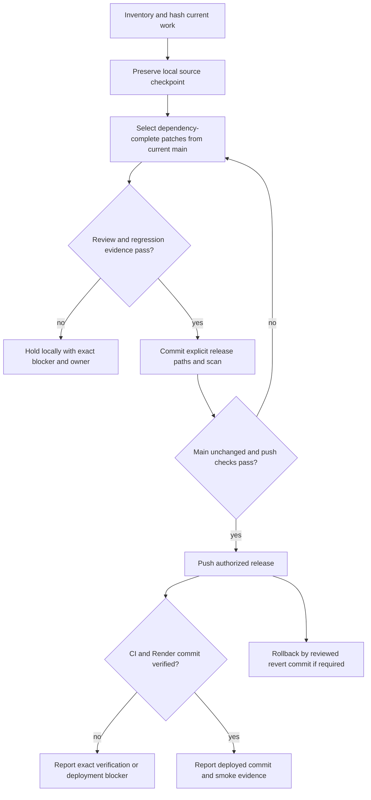

# Selective release audit and local preservation — 2026-09-12

Status: SELECTIVE RELEASE DEPLOYED; final outcome below supersedes historical planning status. Canonical continuation of 31/48/67; this operational release track does not advance or certify M68 or the remaining Coach controller slices.

## Decision and requirements
Sean authorized committing and pushing production, then narrowed this to audited independent fixes, preserving unfinished work locally and producing agent handoffs. Current speech access is retained. Astra owns this review. No paid/provider calls, branch rewrites, worktree deletion or manual production database writes are authorized by this audit. Sean separately authorized the reviewed production deployment, including its unchanged normal startup behavior.

SR1: every current Coach change has an exact path/hash and release/hold/private disposition; existing bytes survive a local checkpoint.
SR2: release starts at fetched origin/main 53120649f356c3efccee32872b530096d386642f and includes only independently reviewed dependency-complete patches.
SR3: meaningful regression and compatibility tests run on the actual release tree; failed boundaries remain held.
SR4: GitHub push uses an explicit ref, clean committed backend, secret scan and source-bound review. Deployment is only reported if independently verified.
SR5: all registered worktrees are inventoried without deleting, moving or committing other tasks' content; unresolved owners and recovery steps are reported.

## Baseline and preservation
Coach worktree: codex/swan-coach-astra-owned-20260906 at 48d792da5351a3f89518baba7f4ab553d69f41a8, 27 behind / 81 ahead of main, 109 dirty/untracked files including three pre-existing local files. Shared primary checkout is a separate WIP lane. Complete local manifests and branch inventory are retained in the task's release-audit artifact directory. Snapshot hashes, checkpoint commit and exact test receipts will be appended after execution. This record is not off-machine backup proof.

167 pre-existing registered worktrees: read-only direct metadata inspection found 90 dirty and 77 clean. 165 have stale .git pointers to the old repository location; reciprocal current Git metadata was verified to read their status without rewriting them. Clean does not mean merged or disposable. Other task ownership is unverified; no other task files have been staged or changed.

## Blueprint, scope and boundaries
Create release/coach-safe-fixes-20260912 at current main in C:/tmp/sspt-selective-release-20260912. Port selected paths without merging the Coach branch or its historical temp/evidence files. Retain main dependencies, configuration, workflows and schema. Preserve unfinished Coach source as a LOCAL checkpoint; do not push that checkpoint branch.

Candidates: daily workout permission-error denial (two paths); SessionProvider request/publication repair (two paths); voice-recorder generation retirement (three paths, including its previously committed race regression). Each remains proposed until review and clean-tree tests pass.

Hold clientAccess normalization pending profile-photo policy closure: it is a shared access helper, and the photo endpoint documents staff-only writes while normalization enables client/user self access. Hold aiRateLimiter deferral with its unfinished chat cancellation consumer. Hold Rolodex changes with G04 selection/privacy integration. Hold all other Coach branch features and repairs pending their canonical gates.

## Wireframes and state applicability
Desktop/mobile wireframes: N/A for this release's backend and nonvisual lifecycle repairs; no page geometry, controls or copy is redesigned. Existing mobile Coach clipping remains M68 and held. Permission states: verified grant/default allowance continue; verification errors deny. Session/recorder state changes must be tested for initial, current, stale, superseded, logout, hidden and unmounted admissions. Existing keyboard/touch layout is unchanged.

## Flow and contracts

Mermaid source provided; rendered preview not yet generated. Git refs, file SHA256, test log exit codes and deployed SHA are authoritative. No new API, schema, event or storage contract. Permission SQL policy and speech billing are unchanged. Permission matrix follows existing route protect and assignment checks. No new ERD; no database migration. Sequence and state coverage are represented in the flow and lifecycle test contracts. Private fixtures/configuration remain local and are excluded from release artifacts.

## Tests, traceability and operations
SR1 -> source-manifest/checkpoint hash verification; SR2 -> base SHA plus final diff/import review; SR3 -> focused regression, existing caller compatibility, frontend type-check/build if frontend included; SR4 -> secret hook, Rule 42 backend checks, push/CI/Render receipts; SR5 -> registered-worktree inventory with dirty paths, divergence, pointer proof and proposed next action.
Run backend tests with environment-file loading disabled and external/database sockets denied. Storage/model/provider behavior is mocked and must be labeled as such. No backend build or production migration command. Frontend uses clean-main dependency locks and canonical configuration.
Capture expected behavioral RED before applying fixes where practical, then GREEN. Setup failures never count as RED. No unconditional full-suite claim. Startup request volume is the SessionProvider performance budget; recorded source-worktree mounted proof was stable 2 session / 1 analytics calls, with clean-main unit verification required.

Deployment owner: Sean/Astra. Render CLI currently returns expired-token error; actual live service, auto-deploy branch and commit are unverified. render.yaml is marked inactive and must not be synchronized. GitHub write permission is verified. If Render remains inaccessible, report GitHub status separately. Rollback uses an ordinary revert of the selected release commit; do not rewrite history or delete local WIP. Recovery resumes the frozen M68 queue after selective release, not from a newly invented architecture.

## Hostile review and readiness
Independent Astra audit found clientAccess cross-caller policy impact and a stale photo test expectation; held for explicit repair/closure. Middleware deferral alone has no origin/main consumer; held with chat cancellation. Frontend review is ongoing. All final review gates remain pending until actual receipts are added.
Readiness: PLAN ESTABLISHED for selective audit/release; IMPLEMENTATION VERIFICATION PENDING; NOT PUSHED; NOT DEPLOYED. Final artifact will list released files, local checkpoint, all held work and specific remaining agent tasks. Document existence does not certify behavior.

## Deployment defect addendum — SR6

Render browser evidence on September 12 confirms the backend remains at 86e66cd; main 5312064 fails to boot because native Node cannot resolve zod from the linked shared schema package. SR6 requires the existing backend npm install to install the shared package from its own committed lock, with scripts disabled there; native Node must import and execute the schema without bundler aliases. A native node:test reproduces RED before repair, then GREEN after the exact install lifecycle. Only backend package manifest/lock metadata and this regression are added. No dependency version, schema, migration, feature flag or billing change. Behavior rollback must preserve this installation repair unless deliberately restoring a separately verified earlier backend deployment. Reverting to the known failing main 5312064 is not a safe recovery target. Headless wireframes/ERD N/A; release flow and privacy contract unchanged. Render pre-deploy seeding, existing startup seed/migration behavior, and the delta since the last live commit must be adjudicated before production. The known unsafe FORCE_RESEED branch must not be exercised.

## Final operational receipt

VERIFIED SELECTIVE RELEASE — 2026-09-12T20:14:16.940Z. [PR 118](https://github.com/SeanSwan/-SS-PT-New/pull/118) merged to main as c0cbe538d8ed2ca519bb494cdf3282bf43b76699; its tree exactly equals reviewed head 46e581d0d10640f90d93c32ddaa7ebb45e025aa8. All final-head PR checks passed. The frontend required one unchanged-SHA retry after the three documented failures; neither original failure nor the 11 backend skipped tests is concealed.

Render backend dep-dair2k9594qs739s3ks0 and frontend dep-dair20ou01pc738jk8sg both report Live at that exact main commit. Public read-only checks returned HTTP 200 for backend /health (healthy), /health/ready (ready=true, store=ready and matching build commit), and the application homepage. Production authenticated role journeys, physical-device microphone behavior and real transcription/provider calls were not exercised by this release smoke.

Backend auto-deploy was restored to On Commit and read back. Pre-deploy remains DISABLE_PROD_SEEDER=true npm run production-seed; start remains USE_BULLMQ_RECONCILIATION=false npm start. The normal build command and existing startup migration/non-package seeder code are unchanged. No manual production DB operation or package reseed was run. Render's payment-failed warning remains an account-owner action; deployment success does not resolve billing.

> **CORRECTED 2026-09-13 — the start command recorded above is not what the repo says.** `render.yaml` reads `startCommand: cd backend && npm start`, with no `USE_BULLMQ_RECONCILIATION` prefix, and that variable is read by no code anywhere in the repository. See [76](76-correction-phantom-bullmq-control.md). That document also records that the **pre-deploy** line in this same sentence was *not* independently checked, so it should not be relied on either. Read the Render service settings directly rather than either document.

Unfinished Coach source remains local in checkpoint 346373264f84e00e392914fdb035d8ac5a1ca8ef. The final documentation checkpoint is recorded in final-audit-report-checkpoint.json; it is not pushed. The clean release tree contains only the reviewed eleven-file patch. The original Coach tree retains two visible local exceptions: AGENTS.md and frontend/.hermes/environment.json. Latest complete inventory: 169 registered trees, 91 dirty and 78 clean, including the release tree. The shared primary tree still has 2,956 dirty/untracked entries. No other task's work was committed, stashed, deleted or certified for production.

Authoritative local receipts: github-production-merge-receipt.json, final-pr-ci.json, final-ci-retry.json, ci-failure-adjudication.json, render-production-deploy-receipt.json, render-release-settings.json, public-postdeploy.json and selective-release-plan-receipt.json. The latter remains a structural plan/reference check; this operational release does not complete the original M68/Universe controller or its held requirements.

See [70 — release and worktree audit](70-release-and-worktree-audit.md) for the complete released/held inventory, hostile review and executable agent handoffs. Earlier IN PROGRESS, NOT PUSHED and unverified Render statements above describe the preserved initial planning state.
