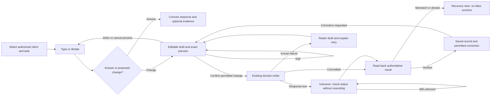

# Command Center experience — audit and design decision packet

Artifact: CC-UX-20260906. Owner: Sean (decisions), Astra (audit/proposal).
Status: IMPLEMENTATION VERIFIED (LOCAL); implementation_authorized: true; deployed: false.
Version: 1.1, 2026-09-06. Supersedes: v1.0 metadata only; additive input to Universe V3 S6/S7/S8 and D23.

## Plain-English Summary

Recommend evolving the existing **Session Desk** into a conversation-first workspace.
Keep one compact client/task header and a reachable composer. Open the workout or
other relevant working document beside the conversation only when useful. Reduce
repeated controls and metadata; preserve the depth behind clear contextual actions.
Admin and trainer use the same experience with different scope, priorities and permissions.

The live desktop problem is measurable: a long conversation grows the transcript
instead of keeping it inside a bounded region. Its composer is more than 3,200px
down, including at QHD and 4K. Phone input is reachable, but the header and repeated
thread metadata consume scarce space. The admin overview also spends its first
screen on framing, appearance settings and navigation rather than operational evidence.

This is a design audit and a decision addendum, not a second implementation blueprint.
Existing Universe V3 work already plans Session Desk and has a partial draft-only
implementation. Its backend/recovery work must be reconciled before new UI claims.

## Technical Summary and baseline

Three distinct evidence surfaces were inspected; they are not interchangeable:

| Surface | Observed identity | Evidence boundary |
|---|---|---|
| Shared SS-PT checkout | `wip/comms-notifications-2026-07-05`, HEAD `a89cbf0f080644877ae8a45729d3f0a59d4cb8b8`; 778 dirty entries at inventory | Older source; Command Center controller has only a pre-existing final-newline difference |
| Universe implementation worktree | `tmp/worktrees/swan-coach-universe-20260904`, HEAD `b88dd9e5c894908d9f193411fe66117294d190ef`, with newer uncommitted work | Source and isolated frontend tests; not deployed proof |
| Live application | `https://sswanstudios.com/dashboard/admin/coach-assistant` and `/dashboard/admin/overview` | Authenticated read-only UI, screenshots viewed in-session and DOM geometry; deployed SHA not established |

Local cached `origin/main` resolves to `53120649f356c3efccee32872b530096d386642f`.
No fetch or claim of current remote equivalence. The separate Astra-owned worktree
also exists at `b88dd9e5c`; its latest repair receipts were read as coordination
context, not re-certified here. Existing shared and per-worktree locks remain authoritative.

## Governing artifacts: discovery before invention

Paths in this table are relative to the repository root. W means
`tmp/worktrees/swan-coach-universe-20260904/`.

| Artifact | Classification and use |
|---|---|
| `scripts/build-protocol/POLICY.md` | Present, untracked workflow source headed **Makeer Blueprints**; accounts for the requested Mega Blueprint checklist. Automatic hook installation was not audited here |
| `docs/ai-workflow/AI-HANDOFF/AUTOMATIC-BUILD-PROTOCOL-2026-09-06.md` | Planning/installation document; no commit history returned for this path. Do not describe it as committed or installed from file existence |
| W + `docs/ai-workflow/AI-HANDOFF/swan-coach-universe-v3/README.md`, `11-comprehensive-handoff.md`, `13-foundation-execution.md`, `14-experience-execution.md`, `15-acceptance-and-release.md`, `16-state-and-data-flows.md`, `17-astra-readiness.md` | Current governing implementation package; status claims must be checked against its later receipts and actual source |
| Same package `18-dashboard-tab-audit.md`, `19-one-coach-domain-contracts.md`, `21-nested-workspace-audit.md` | Existing broad dashboard/domain inventory; source coverage does not equal authenticated role coverage |
| Same package `05-wireframes.md`, `wireframes.html`, `session-desk-review.html` | Existing proposed wireframes; synthetic, not production screenshots |
| `SWAN-COACH-V3-UX-WIREFRAMES-2026-08-12.md` in AI-HANDOFF | Historical August V3, explicitly distinct from Universe V3; useful predecessor, not new build authority |
| `docs/ai-workflow/blueprints/SWAN-COACH-ASSISTANT-MASTER-BLUEPRINT.md:5` | Explicitly superseded; do not revive its build instructions |
| This document | Pending UX decision addendum; no supersession until Sean selects a direction and the implementation owner integrates it |

History checks included recent/all-ref blueprint and Coach commit searches, the
specific August wireframe history, and inspection of `523134d0b`. That recent
blueprint repair concerns a disproven cart-schema hypothesis, not this chat redesign.

## Canonical surface receipt and competing surfaces

Source references below use the shared checkout unless prefixed W. The route
configuration is rendered by `UniversalDashboardLayout.shellPieces.tsx:94-108`:
the map passes each configured component into actual `<Component />` JSX.

| Surface | Classification | Mount/consumer evidence |
|---|---|---|
| Admin Coach | canonical | `frontend/src/components/DashBoard/UniversalDashboardLayout.routes.tsx:99` -> shellPieces JSX -> `Pages/coach-assistant/CoachCommandCenterPage.tsx:34`, controller `:37`, transcript `:180`, composer `:227` |
| Trainer Coach | canonical configured route | Same routes file `:179`, same rendered page; role configuration controls tools. A true trainer login was not available for this audit |
| Admin dashboard | canonical | Same routes file `:98`; `routeComponents.tsx:17` resolves `Pages/admin-dashboard/admin-dashboard-view.tsx`, whose `:43` mounts `AdminOverviewPanel` |
| Trainer dashboard | canonical configured route | Same routes file `:158` -> `TrainerHomeTab`; sessions via `useTrainerTodaySessions`, existing next-session and quick-action components |
| Embedded Admin Assistant | canonical distinct entry | `AdminOverviewPanel.tsx:194` renders `AITerminalPanel` with `context="data_management"`; panel `:59` consumes `useAIChat` |
| `SwanCoachAssistantPage.tsx` | legacy for these verified routes | Not selected by the current role route configuration. This does not prove it is unused everywhere |
| `CoachCommandCenter.styles.ts` / `CommandCenterShell` | legacy style family for this page | Mounted page imports `CommandBridgeShell` from `bridgeStyles`, not this shell |
| W + `CoachSessionDesk.tsx` | active candidate, not live-certified | W page `:212` mounts it. Rows are a summary list; Review freezes a draft and returns to Talk with revision text. This is not proof of the proposed editable, transported, durable workout loop |

Conversation chain: controller `:42` -> `useAIChat.ts:217,249,273,324,448`
uses `/api/ai-chat/conversations` and `/:id/messages`. `backend/core/routes.mjs:630-632`
mounts the narrow stream-spike router, then ai-chat, then ai-command. ai-chat
`router.use(protect)` is at `:283`; conversation handlers are `:308,387,421,466`.
The narrow `/stream-spike` sibling does not establish streaming in the normal chat caller.

Command chain: controller `:43` and actions `:173` -> `useCoachCommand.ts:101`
POST `/api/ai-command/execute`; confirm and cancel use the same hook. Backend
`aiCommandRoutes.mjs:119,296,320` owns `/execute`, `/confirm`, `/cancel`.
The shared actions file sends candidate commands through this lane and chat fallback
through the conversation lane. Preserve their distinct write/response semantics.

Authoritative conversation model: `backend/models/AiConversation.mjs:19-105`
defines `id`, `userId`, `role`, `title`, `context`, `targetUserId`, `messages`
(JSONB), `status`, `metadata`, `messageCount`, `lastMessageAt`; timestamps enabled.
Do not invent an AiMessage table. No ORM change is proposed in this UX addendum.

Admin overview `:64-67` reads `/api/admin/analytics/statistics/{revenue,users,workouts,system-health}`.
Mount order is `backend/core/routes.mjs:491-493`: analyticsRevenue, analyticsUser,
analyticsSystem, all under `/api/admin/analytics`; corresponding explicit handlers
own those distinct suffixes. Their full metric/model semantics remain a per-widget
integration gate, not a blanket data-truth certification from this visual audit.

## Live findings, ranked by workflow impact

| ID | Finding and evidence | Consequence / proposed correction |
|---|---|---|
| F1 | Desktop transcript is content-height. At 2195x1154, transcript 2756px tall; composer top 3201px. QHD 2560x1440: composer top 3257px. 4K 3840x2160: 3273px | Conversation cannot be answered from its visible viewport. Bound the chat region to available shell height; keep composer in its own persistent row |
| F2 | At 414x896, client header 162px, tab bar 51px, transcript only 323px, composer 130px. No horizontal page overflow in this case | Compact context and thread framing; preserve reachable input and increase readable conversation area. Mobile shell overlaps part of the upper context in the inspected state |
| F3 | Selected client repeats in navigation, header, selector, thread metadata and operations target. Thread metadata repeats count/context/state | One authoritative target control; a short thread title; source detail on demand. Target must remain visible at confirmation |
| F4 | Operations rail repeats its heading, recommendation, target/safety and Logger/Planner actions. Review/intake/audio tools appear through several access paths | Replace the default rail with a contextual work panel. Show one primary action and at most three priority secondary actions |
| F5 | Long answer + large response-style selector + fractured workout rows dominate the inspected thread | Default concise response with structured workout/result content. Detail expansion and source links preserve depth. Never blindly truncate safety or validation information |
| F6 | Live admin overview first viewport contains a large title, background picker, signal navigation grid and First Moves. At 2195x1153 its visible headings were overview at y140 and First Moves at y790 | First screen must contain actionable evidence: next session, unresolved work, stale-client signal or honest empty state. Move appearance settings to existing Appearance entry |
| F7 | Admin Assistant and Coach are separate mounted entry experiences; root panel creates its own `useAIChat` state | Make a contextual handoff retain conversation/target/task identity. Do not promise shared memory merely because both use the same hook |
| F8 | Root source, candidate implementation and live UI differ; candidate has Talk/Workout/Review/History, while live has Talk/Review/History | Reconcile source and release lane before implementation. Do not patch a stale lookalike or describe candidate features as deployed |

Live theme was **Graphite Luxe**. Its gray appearance is partly the selected lens,
not by itself proof of a token defect. Structural bulk persists independently of
palette. No appearance preference was changed. Response quality observations are
about the displayed historical thread; no new inference, recording or write was run.

## Swan design brain result, then Astra refinement

Loaded the root router and then the newer router inside W after discovering branch
drift. The latter's laws are more specific: optics rather than decorative creatures,
world/lens consumption, allocated glow, restricted gold, Forge-first, calm data
surfaces and an existing Crystallize signature. Use that version during integration.
The cinematic source docs, design.md, product adapter, motion, QA and historical
wireframes supplied context; conflicting older glass/glow recipes do not authorize
stacking effects. `[MOBBIN UNAVAILABLE]`: no callable Mobbin tools found this turn.

| Brain-derived starting point | Astra enhancement |
|---|---|
| Session Desk: conversation + draft + results | Conversation owns the default screen; the work panel appears when a real task needs it, can be pinned, and never opens over unsaved work |
| Crystalline material and one meaningful phenomenon | A precise refracted seam follows task state. No always-spinning object behind text; verified completion may reuse the existing signature only where calm-zone rules allow |
| Role-specific command surfaces | One conversation/task system, with admin business scope and trainer assigned-client scope enforced at the server |
| Reviewable drafts and receipts | Put the actual exercise, changed value, unit and target at the decision; keep implementation IDs and diagnostics out of ordinary chat |
| Rich options and deep tools | Reveal tools from the current task. Empty chat has up to three relevant starters; ongoing answers offer one useful next action |

These are this agent's synthesis of the loaded Swan brain, not output from an
unrun external design model. Public references support disclosure and performance:
[NN/g progressive disclosure](https://www.nngroup.com/articles/progressive-disclosure/)
and [R3F demand rendering](https://r3f.docs.pmnd.rs/advanced/scaling-performance).

## Design selection and wireframes

See [three directions and desktop/mobile wireframes](COMMAND-CENTER-EXPERIENCE-DIRECTIONS-2026-09-06.md).
The recommendation is Session Desk, conversation first, with a briefing hierarchy on dashboard home.

## Contracts, states, tests and implementation integration

Keep React 18, TypeScript and styled-components. Root dependencies differ from W;
W declares `three ^0.169.0` and already uses it in `SwanGlobe/swanGlobeScene.ts:11`.
Reuse an existing Three integration where appropriate. R3F is optional, not a
required new dependency; if adopted, its official [version pairing](https://r3f.docs.pmnd.rs/getting-started/introduction)
requires Fiber 8 for React 18. A React-major upgrade is outside this task.

Three.js role: one lazy contextual progress/body visualization when it communicates
something that a flat view cannot. All facts and controls remain in accessible DOM.
No WebGL dependency for typing, dictation, review or save. Demand render, DPR <=2,
pause hidden/offscreen, dispose on unmount, static fallback for reduced motion,
low power, context loss and unavailable WebGL. Do not add another 3D scene to a
dashboard already rendering SwanGlobe. Source numbers must match the 2D evidence.

Reuse Universe contracts: one actor/target/task/revision identity; a UI selection is
not authorization. Notes, transcript and workout draft are distinct records. Proposed
UI ownership follows S6's shared task lifetime, not copied state in separate docks.
Maintain conversation context and target on dashboard-to-Coach handoff; dirty target
switch offers return/discard. Reject late responses from an earlier scope generation.

State applicability: loading = quiet skeleton; empty = relevant starters; partial =
visible missing sources; denied = remove inaccessible data; validation = mark exact
field; offline = retain in-memory draft and explain limits; unknown save = status
check, never automatic resend; cancel output = stop generation/audio, not undo a write.
Keyboard: IME-safe Enter, Shift+Enter newline, reachable focus, sheet focus return.
Streaming is a separately gated transport improvement; existing normal chat posts a
complete JSON response. No simulated token streaming and no implied live voice support.

| Requirement | Acceptance/test ID | Existing integration / slice | Status |
|---|---|---|---|
| R1 Reachable conversation | T-UX1: composer visible with long history at 414,1440,2560,3840; keyboard-open phone; no forced jump while reading | Shell, transcript, composer / S6 | Live desktop failure verified; new acceptance NOT RUN |
| R2 Clear actions | T-UX2: one primary, <=3 priority secondary actions; all execute/navigate/open real content | Page, ops, response / S6 | Proposed |
| R3 Correct task continuity | T-UX3: client switch, late response, unsaved revision and dashboard handoff; zero cross-target render/write | Shared context / S1,S6,One Coach | Required; true trainer E2E NOT RUN |
| R4 Useful answer structure | T-UX4: long prose, nested lists, workout rows, malformed output, sources and partial data; no hidden critical warning | Response adapter / S5,S8 | Proposed |
| R5 Truthful review/save | T-UX5: exact revision/units/target; double click; lost response; revoked access; readback mismatch; no duplicate write | Existing proposal/intent/writer / S2-S4 | Inherit existing package gates; not re-certified |
| R6 Dashboard usefulness | T-UX6: actionable real evidence or honest empty/unavailable state in first viewport; primary route opens correct target | Admin overview, trainer home / D23 | Proposed |
| R7 Beautiful and usable | T-UX7: both lenses, 200% zoom, contrast >=4.5:1, 44px targets, reduced motion, phone->4K | Tokens + Forge / S6 | Partial live inspection only |
| R8 Bounded 3D | T-UX8: WebGL failure, offscreen/background, keyboard focus and typed input remain usable; no mismatch with source metric | Existing Three pattern / S6,S8 | Proposed; no new dependency installed |

Proposed budgets: UI input response p95 <100ms on agreed phone hardware; no animation
work while a 3D layer is idle; additional non-3D initial route JS <=50KB gzip; no
additional mandatory WebGL download for chat. Measure a baseline before accepting
these budgets. Wider screens gain useful record detail, not giant text bubbles.

Ordered work after selection: reconcile candidate/source/release ownership -> refine
S6 exact design and RED tests -> reachable shell and shared client header -> response
presentation and contextual work panel -> dashboard briefing/handoff -> optional 3D
and voice polish -> full accessibility, role, recovery and release gates. Each slice
retains previous UI behind the existing gate/rollback mechanism. No database migration
for cosmetic work. New shared persistence or streaming needs a separate contract.

Conditional artifacts: ERD and recovery sequence already exist in Universe `04/16`;
no new schema in this addendum. Permission matrix and privacy flow reuse `03/19`;
trainer assignment must be proven server-side. Rollout, rollback and operational
owner use `15-acceptance-and-release.md`. No provider/financial automation proposed.

## Verification, hostile critique and readiness

Actual baseline command, run from W + `frontend` using installed Vitest:
`node node_modules/vitest/vitest.mjs run <the seven files below> --reporter=dot`.
Coach directory files: `CoachCommandCenterPage.shell.test.tsx`,
`CoachCommandCenterClientMode.test.tsx`, `CoachCommandCenterPage.keyboard.test.tsx`,
`CoachCommandCenterDeepLinkMatrix.test.tsx`, `CoachSessionDesk.test.tsx`.
Admin overview files: `AdminOverviewPanel.priorityOrder.test.ts`, `AdminQuickActions.test.tsx`.
Result: **58 passed, 1 failed; 6 files passed, 1 failed; exit 1**. The failing keyboard
test expects Review after ArrowRight from Talk, while current roleConfig `:9` inserts
Workout between them. Reconcile the test and intended tab contract; this alone is
not proof keyboard navigation is broken. Tests use synthetic/mocked services.
Root suite could not initialize because project Vitest/plugin dependencies were absent.
Candidate initially hit sandbox esbuild spawn EPERM; approved elevated rerun produced
the actual 58/1 result. No application code, test expectations or dependencies changed.

Hostile critique of this proposal: a permanent second panel recreates F4; therefore
default it closed unless useful. Hiding target/safety to gain space creates risk;
therefore retain the target at input and exact preview. All-purpose 3D harms reading;
therefore scope it to one optional evidence scene. Renaming every existing query/tab
breaks incoming links; preserve aliases and current deep-link tests during transition.
Do not describe mounted Session Desk as a completed editable/save integration.

Readiness: **decision packet available; build readiness NOT claimed**. Direction,
theme preference, response tone/default detail, panel behavior and 3D purpose await
Sean's selection. Executable RED acceptance tests for the chosen design are NOT WRITTEN;
full responsive matrix, real trainer auth, audio-device tests, DB recovery, visual
performance, and current release provenance remain NOT RUN in this task.
Next authorized action: Sean's design decision and refinement of the existing S6
packet. This task does not authorize implementation, paid model review or release.

Preservation: no existing blueprint was overwritten; new addendum had no predecessor.
The pre-split addendum was explicitly snapshotted under `tmp/command-center-experience-audit-20260906`; source/copy/isolated-restore hashes match. Native vault hook coverage and off-machine backup are not claimed. Source fingerprints:
W `14-experience-execution.md` SHA256 `31F586B6FE2F9EFC49146B258A5AE3821B9AD4613346A0E8ACBD1E77CF24EFB7`;
W `05-wireframes.md` `D5D3AE924DC2120040BF6B35477D77A2E3D6CD6555E099E84384CADD01873CFF`;
W design router `0193E90317A9AB2C9783D792011C3F5B462C943C120DFFFB1A19BD7792563D37`.
Future canonical edits require a verified pre-edit snapshot and hash recheck.

Hygiene: root inventory found 99 patch files, 38 PNGs, 93 MJS files and other mixed
classes; no files moved/deleted. Runtime route families above are classified for this
scope. Root QA/screenshots/patches are candidate QA/temp artifacts pending per-file
reference checks; recurring classes should be reviewed for ignored QA locations in
a separately authorized cleanup. This pass adds this packet, its directions companion and a verified local split snapshot, plus
coordination metadata; it saves no client screenshots or conversation text to disk.
Test tooling may leave ignored cache files. Existing dirty ACTIVE-INDEX was preserved;
link this addendum from the governing packet when the chosen direction is integrated.
PROOF: live route/geometry receipt above plus actual 58/1 baseline; no runtime fix claim.
DRY-LOOP: N/A — audit and proposal only; unresolved findings intentionally reported.

## Implementation status update — 2026-09-06

Sean authorized continuation of the recommended Direction B Session Desk with
Direction C briefing hierarchy for the admin entry. This slice is now
**IMPLEMENTATION VERIFIED (local)** and remains **NOT DEPLOYED**.

Delivered in the mounted surfaces:

- Coach/admin/trainer command shell: bounded the Talk transcript to the
  available viewport so the composer remains reachable instead of falling
  thousands of pixels below the conversation.
- Command dock: kept Logger, Planner, and Audio as the three first-level
  actions; Attach, Readback, and Voice Replies now live behind one explicit
  Advanced tools disclosure with keyboard-safe menu semantics.
- Role context: trainer command centers now say Assigned coaching, while the
  admin and client labels remain distinct on the shared Coach route.
- Admin overview: promoted the first viewport to a live decision briefing and
  added a direct Open Coach Command Center handoff; appearance controls now
  follow the operational overview.
- Three.js: added a lazy, static, decorative Crystalline Swan focus lens for
  trainer/admin context. WebGL capability failure becomes a CSS fallback; no
  coaching facts, controls, typing, dictation, or review state depend on it.

TDD and verification evidence:

- Valid RED observed after dependency setup: 4 intended failures and 17
  passing tests for the new dock, viewport, trainer-label, and admin-briefing
  contracts.
- Targeted acceptance subset: **3 files / 22 tests passed**.
- Expanded Command Center/admin subset: **7 files / 45 tests passed**.
- `npm run type-check`: **PASS**.
- `npm run build`: **PASS**; the focus lens is emitted as a separate lazy
  chunk, keeping it out of the synchronous module graph.
- Focused ESLint over all changed production files: **PASS**.
- Existing source snapshot preservation confirmed at
  `tmp/command-center-experience-audit-20260906` before this status update.

Remaining gates are intentionally open: authenticated trainer-account proof,
real browser visual QA at 414px, QHD, and 4K, screen-reader/device checks,
3D performance measurement on agreed phone hardware, and release/deploy
provenance. No database migration or production write was performed. The
packet's referenced `CoachSessionDesk.test` file does not exist in the current
tree; the implemented contract is covered by the shell, client-mode, keyboard,
deep-link, layout, and admin priority tests listed above.

