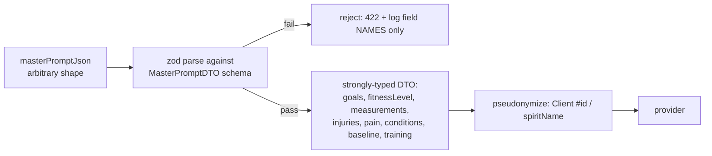
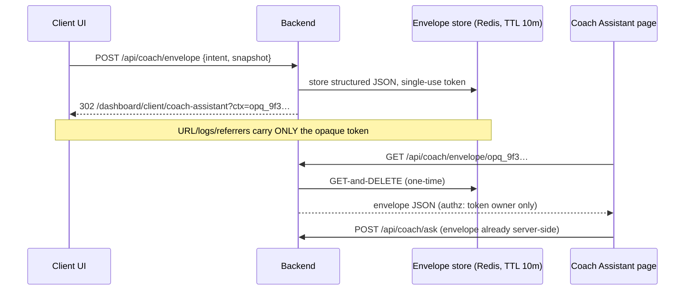

# Ox Alpha — Hostile Gate Review

**Reviewer:** OpenRouter `stealth/ox-alpha` (effort: high)
**Served:** `stealth/ox-alpha`
**Document:** docs/ai-workflow/AI-HANDOFF/WAVE2-FORWARD-REVIEW-PACKET-2026-08-24.md
**Seed:** (none)
**Tokens:** 20240 in / 10319 out · **Cost:** ~$0.0000 · **Wall:** 409.8s · **finish:** stop

---

## VERDICT
REVISE — the authorization architecture is genuinely solid and the fail-closed discipline is real, but `scanAndRedactPII` has a stateful-regex defect that intermittently ships PII to the LLM provider, and `aiConsent.mjs` lets the request body choose whose consent record vouches for the request — both are silent-failure classes this codebase keeps claiming it has retired.

## BLOCKERS

1. **P1 — Global-flag regexes reuse `lastIndex` across the scan loop → intermittent missed PII redaction.**
   Failure scenario: `EMAIL_REGEX`, `PHONE_REGEX`, `SSN_REGEX` are declared with `/g` *inside* `scanAndRedactPII` but *outside* the entry loop (`backend/services/deIdentificationService.mjs`, scanAndRedactPII). `RegExp.prototype.test` on a `/g` regex advances and retains `lastIndex`. Payload: `{ goals: "Contact me at jane.doe@gmail.com about scheduling, reference 555-867-5309 x12", notes: "email bob@corp.com" }`. First `.test()` matches at offset ~13, leaves `lastIndex` ≈ 70. The next string (`"email bob@corp.com"`, length 18) is tested starting at index 70 → `test` returns `false` → `bob@corp.com` is forwarded to the provider verbatim. The longer the earlier string, the larger the blind window. This intermittently violates the consent copy's explicit claim ("plus any email- or phone-shaped string found anywhere in the payload") and the zero-PII-to-LLM house rule, and it fails *stochastically*, so the existing fixtures (single-string payloads) pass while production leaks. Fix: use a non-global regex for `.test()` (or `String.includes`) and keep `/g` only for `.replace()` — or construct fresh regexes per string.

2. **P1 — `requireAiConsent` lets the caller pick whose consent record authorizes the request (`backend/middleware/aiConsent.mjs`, targetUserId resolution).**
   Failure scenario: `rawUserId = req.body?.userId` is honored for *any* authenticated role whenever it parses as finite — the `requesterRole === 'client'` clamp only applies when `body.userId` is absent/non-numeric. Two bad outcomes depending on what the downstream controller trusts:
   - Controller acts on `req.user.id` (the comment says "clients target self"): a client with **no** consent posts `{ userId: <id of a consenting user> }` → middleware validates *that* user's profile, attaches it as `req.aiConsentProfile`, calls `next()` → consent enforcement bypassed for the attacker.
   - Controller acts on `body.userId`: straight IDOR — trigger AI generation billed/logged against another user.
   Either way one side of the "same logic as controller" claim is wrong, and parity-with-a-bug is not a control. Fix: clients are hard-clamped to `req.user.id` server-side, full stop; `body.userId` is only honored for staff roles, verified against an allowlist.

3. **P2 — `setNestedValue` throws on `null` intermediate nodes → `deIdentify` crashes instead of failing closed.**
   Failure scenario: `masterPromptJson = { client: null, training: {...} }`. Step 1: `getNestedValue(payload,'client.alias')` → `undefined` ≠ label → `setNestedValue(payload,'client.alias',…)`. Inside, `typeof null === 'object'`, so the guard does *not* replace the null; `current` becomes `null`; the final assignment `current['alias'] = value` throws `TypeError: Cannot set properties of null`. The documented contract is "fail closed: return null"; instead the AI route 500s (or worse, an upstream catch treats it as transient and retries). Fix: in `setNestedValue`, treat `null` like a missing key (`current[keys[i]] == null || typeof … !== 'object'`).

4. **P2 — Socket throttle still sits behind a per-emit DB query (`backend/socket/socket.mjs`, send_message region).**
   The comment celebrates moving the limiter ahead of the *lane* check (3 round-trips), but `isActiveParticipant` — a Sequelize raw query — still executes on every emit before `checkMessageRate`. An unauthenticated-cost emit loop still forces one indexed lookup per message. Move the throttle to the first line of the handler.

5. **P2 — `MessagingView.tsx` violates the ≤300-line house rule.**
   The component plus its style block is ~370–390 lines. Extract the state blocks/styles (they're already a cohesive "empty/error states" unit per the file's own comment) into `MessagingStates.tsx`.

6. **P2 — Relationship-lane users are trapped in legacy community threads.**
   `scope:'conversation'` requires *every* other participant to be a counterparty or staff. A downgraded subscriber who was elite when a group thread was created is a member of threads the `list` scope deliberately hides — and every write route carrying `:id` (rename, add, remove-self, leave) 403s. They pay for a package, can't see the thread, can't leave it, and it still counts toward their unread badge if any surface surfaces it. Add an explicit self-remove exemption in the conversation scope (`DELETE` of *own* participant row passes with membership-only check).

## ATTACKS

**Correctness**
- `MessagingView` `composeTo` effect has no in-flight guard; its deps (`loading`, `currentUserId`, `createConversation`) churn during mount. If the user navigates with `?composeTo=` while conversations are loading, a dep change re-fires the effect before the first `createConversation` promise settles → duplicate thread creation (server dedupes? unverified). Cheap fix: a `useRef` in-flight flag cleared in `finally`.
- `SAFE_FIELD_PATHS` in `deIdentificationService.mjs` is dead code that still lists `health.supplements` as "safe to keep" while the live gate strips it. The next editor will trust it. Delete it or regenerate it from the gate.
- `deepClone` via `JSON.parse(JSON.stringify())` silently converts `Date`→string and drops `undefined`/Map/Set — a payload with Date objects produces a differently-*shaped* prompt than the caller sent. Harmless today, a trap when someone adds a date-aware feature.
- `hashPayload` is key-order-dependent: logically identical payloads hash differently. If the "cryptographic hash audit trail" consent bullet refers to this, the audit trail can't detect equivalent-replay, only byte-equality.
- `loadConversationMembers` INNER-JOINs `Users`; if `Users` is paranoid (soft-delete), a soft-deleted non-counterparty vanishes from `others`, flipping `every()` to true. Narrowly fail-open. Use a LEFT JOIN + explicit role for missing rows, or count expected membership.

**Security**
- `assertRequestedParticipantsAllowed` reads `req.body.participantIds` / `adminIds`. If the add-participants controller actually binds `userIds`/`members` (field-name drift — the exact class this repo has hit three times), the check is vacuously true and the create-scope bypass the panel fixed comes back through the conversation scope. This is a one-line contract check away from a reopen.
- `toId` is duplicated-by-comment ("deliberately IDENTICAL to…") rather than imported. Comments rot; imports don't. Export one and import it.
- Socket `send_message` has no idempotency key; a client retry on timeout double-posts. Low stakes, but the REST path presumably has the same gap.
- `teachPrompt` producers: `buildClientOverviewCoachPath(snapshot)` puts *client-specific metrics* (level, XP, streak, booking state) into the URL — this is worse than the "prose in query strings" framing in Slice 6. Access logs, proxy logs, and `Referer` headers now carry per-client behavioral telemetry keyed to a session. The envelope design below should be scoped to kill both.
- Consent grant path: `VALID_CONSENT_VERSIONS` correctly rejects stale inbound grants, but confirm the grant endpoint derives the version server-side from the disclosure actually rendered (bundle-hash pinning), otherwise a cached v1.0 bundle still *displays* old copy while submitting whatever it holds — the loop is closed, the honesty isn't.

**Data-truth / schema drift**
- The drifted `ConversationParticipants` Sequelize model (camelCase columns vs snake_case reality) is documented as avoided in raw SQL — but the *model* still exists in the tree. Any controller doing `ConversationParticipants.findAll({ include: [...] })` compiles fine and queries a table/columns that don't exist, or worse, matches a legacy view. Either delete the model or point its `tableName`/`field` mappings at the truth. A model that lies is worse than no model.
- `protect` stores `req.user.id` as a string; `aiConsent.mjs` does `Number(rawUserId)` and queries with a number while other lanes use `toId`. Three id-coercion dialects in one request path. Standardize on `toId`.
- `aiConsentCopy.ts` says supplements/sleep/stress are "Removed before sending" while the matcher is key-name-based and free-text notes carrying supplement talk travel (the "shared" bullet warns generically, the "removed" bullet promises categorically). The copy is *mostly* honest; the categorical sentence in bullet 2 is the residual overclaim until the allowlist DTO lands.

House rules: styled-components ✓, token-plus-fallback ✓, 44px targets ✓, dark-first ✓, Dual-Button Glow present on the state actions ✓, no banned vocabulary spotted ✓. Violations: the 300-line cap (Blocker 5); the zero-PII rule (Blockers 1–2 are direct hits).

## HIGHEST RISK
**Blocker 1 (regex `lastIndex`).** It is the only defect here that defeats a *control specifically built to satisfy a legal/compliance promise*, it fails stochastically (so QA and the existing test suite will keep passing), and it sits on the hottest privacy path in the product. Cheapest de-risk before ship: (a) change three lines — non-global regexes for `.test()`; (b) add one regression fixture with ≥3 string fields where the email-bearing strings are ordered long-then-short, asserting `[REDACTED_EMAIL]` appears in *both*; (c) add a property test that shuffles field order and asserts redaction is order-independent. Under an hour of work, closes a compliance-grade hole.

## CONFIDENCE
- **Whether the AI controller clamps clients to `req.user.id`** — this decides whether Blocker 2 is a consent bypass or an IDOR (or is neutralized). Evidence needed: the workout-generation controller's target-user resolution. I could not verify it from this document, and the middleware's own comment asserts parity without proving it.
- **The exact body-field names the add-participants controller binds** (`participantIds` vs anything else) — decides whether the conversation-scope participant check is load-bearing or vacuous.
- **Whether anything still instantiates the drifted `ConversationParticipants` model** — the doc says "every runtime query uses snake_case," but that's a claim about raw SQL; ORM usage would break differently.
- **`checkMessageRate` persistence** — per-process memory would mean the throttle resets on every pod restart/reconnect and is trivially parallelized across sockets; Redis-backed would be fine.
- **Whether `deIdentify` callers wrap it in try/catch** — decides Blocker 3's blast radius (500 vs swallowed retry loop).
- **Line counts** — I estimated MessagingView at ~370–390 from the listing; a `wc -l` settles it.
- I did **not** see the frontend `useMessagingCapabilities`, `useMessaging`, the consent grant controller, or `requireTier.mjs` internals; several judgments above rest on the document's own claims about them.

---

## REMIT B — THE FORWARD BLUEPRINT (what I'd build next)

The backlog's own history points the way: every P0 this codebase has suffered is the *same* failure shape — a denylist/enumeration drifting from a claim (medicalConditions slipped a path list, arrays slipped the matcher, the socket slipped the REST lane, stale grants slipped the gate). The forward plan should stop patching instances and delete the *shape*. Priority order:

### Build 1 — Outbound Allowlist DTO (kills the denylist class permanently)
This outranks Slice 6 because it is the root cause under three of the five historical incidents.

- Schema IS the policy: unknown keys are dropped *by construction*; the category claim in consent copy becomes literally true because only enumerated fields exist past the boundary.
- `TRAINING_SAFETY_PATHS` becomes schema fields, not an override list — the override-vs-gate precedence war disappears.
- Acceptance criteria: (1) property test — random junk payload in, DTO out contains only schema keys; (2) the word-classifier is demoted to a *telemetry* logger, not a gate; (3) consent copy's "removed" bullet becomes categorical and provable.
- Slice it: define DTO → migrate one producer → delete one denylist section per PR, contract-tested against `aiConsentCopy.ts`.

### Build 2 — Slice 6 properly: CoachContextEnvelope (server-held, opaque-token handoff)
Not "move prose out of query strings" — move *all* client context out of URLs, including the snapshot metrics the current builders embed.

- Single-use consumption kills replay; TTL kills litter; ownership check kills IDOR-via-token-guessing (tokens are 128-bit random).
- Migration: one producer per PR behind a `useCoachEnvelope()` hook; acceptance criterion per producer is "zero client-identifying substrings in any URL the producer emits," asserted by a test that scrapes emitted paths.
- Wireframe of the assistant entry state: token invalid/expired renders the generic prompt with a "context expired — reopen from the page you came from" action, never a blank screen.

### Build 3 — CI gate on main (cheapest lever in the entire backlog)
There is **no CI gate on main** while shipping consent-enforcement and authorization code. Before GitHub Pro is even purchased, a 20-line Actions workflow running lint + tests + the consent-version contract test + a `wc -l ≤ 300` check would have caught Blocker 1's regression class and the line-cap violation automatically. Branch protection + required checks is a one-afternoon change with the highest defect-per-dollar ratio available. Do this first, actually.

### Build 4 — Slice 8: subject-context hygiene
Namespace `sessionStorage` keys by authenticated user id (`swan:{userId}:…`), and add a single auth-change interceptor that wipes the previous namespace on login/logout/account-switch. One utility, 21 consumers migrated mechanically. Acceptance: switching accounts in two tabs cannot bleed `GlobalClientContext`.

### Build 5 — Focus-trap stack, then modal migration
Prerequisite plumbing, uncontroversial: a `<FocusScope>` provider with a stack (nested modals), `Tab` cycling, restore-focus-on-close, and `aria-modal`. Migrate the 3 in-house modals one PR each.

### Defer / cut
- **Slice 10/11 ("Today" recomposition, ClientProgressStory)** — defer until Builds 1–3 land; they're UX polish sitting on top of pipes that still leak.
- **Slice 12 (five-destination IA)** — route aliases are cheap but the IA churn will conflict with the envelope migration's URL changes; sequence it after.
- **Slice 4 (file decomposition)** — partially subsumed by the CI line-cap gate, which turns decomposition from a project into a ratchet: files get split when touched, enforced automatically.

Sequencing rationale in one line: **CI gate → allowlist DTO → envelope → context hygiene → modals → IA.** Each step shrinks the surface the next step has to defend.
