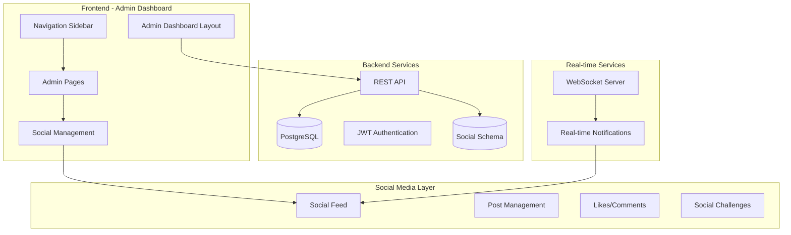
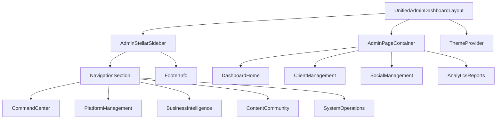
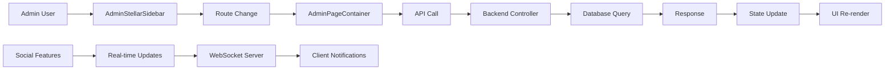
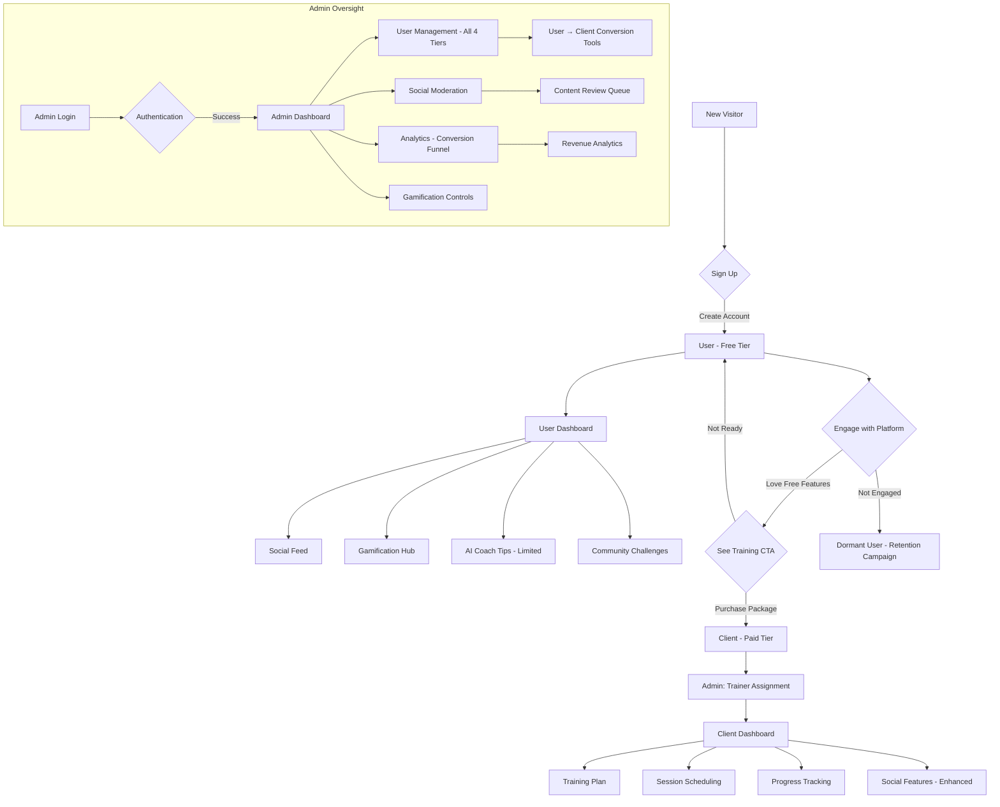
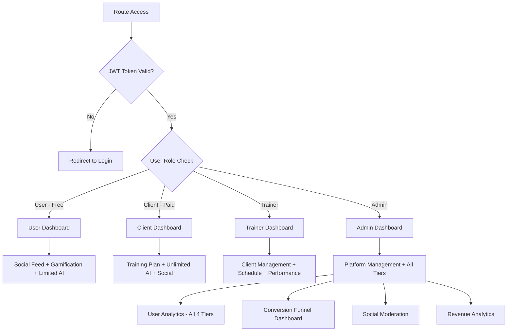

# SwanStudios Admin Dashboard & Social Media Integration - Master Blueprint

**Date**: November 10, 2025 (Updated: November 11, 2025)
**Status**: Analysis & Planning Phase (Pre-Implementation)
**Approval Required**: 5/5 AI Village Consensus Before ANY Code Changes

---

## 🚨 CRITICAL UPDATE (Nov 11, 2025): 4-Tier User Hierarchy

**IMPORTANT**: This blueprint has been updated to reflect the **4-tier user system** that is fundamental to SwanStudios' business model:

1. **User (Free Tier)** - Social media only, goal: drive conversion to Client
2. **Client (Paid Tier)** - Personal training + all User features
3. **Trainer (Employee)** - Service provider + all Client features
4. **Admin (Owner)** - Full platform control + all Trainer features

**Key Business Strategy**: Make free tier "cool and wantable" to engage Users, then convert to paid Clients through gamification, AI assistance, and social features. Target: **10% User → Client conversion within 90 days**.

All wireframes, flowcharts, API endpoints, database schemas, and implementation plans have been updated to reflect this 4-tier architecture.

---

## Executive Summary

This comprehensive blueprint outlines the complete rebuild of the SwanStudios Admin Dashboard with integrated social media features. The current production error (`TypeError: we.div is not a function`) has exposed critical architectural issues with styled-components bundling, requiring a strategic pause to design the proper solution before implementation.

**Key Findings:**
- Current admin dashboard uses "Executive Command Intelligence" theme (conflicts with Galaxy-Swan universal theme)
- Client Onboarding incorrectly placed in main header (should be inside admin dashboard)
- Multiple instances of styled-components causing production bundling errors
- Social media components exist but are not integrated with admin workflows
- Comprehensive database models and API structure already in place

**Recommended Approach:**
- **ADR-001**: Migrate from styled-components to MUI styled-components (fix bundling issues)
- **ADR-002**: Refactor existing admin dashboard (preserve working components, fix theme conflicts)
- **ADR-003**: Embed social features within admin dashboard (unified experience)
- **ADR-004**: Implement WebSockets for real-time updates (already in dependencies)

**Implementation Timeline:** 16 weeks (Weeks 1-16) after 5/5 AI Village approval

---

## Part 1: Current State Analysis

### 1.1 Admin Dashboard Architecture Review

#### Existing Files Analyzed:
```
frontend/src/components/DashBoard/
├── UnifiedAdminDashboardLayout.tsx          # MAIN LAYOUT (895 lines, broken in prod)
├── AdminStellarSidebar.tsx                  # Navigation sidebar (1321 lines, complex)
├── Pages/admin-dashboard/
│   ├── admin-dashboard-view.tsx             # Dashboard home
│   ├── AdminStellarSidebar.tsx              # Navigation (duplicate?)
│   ├── AdminDebugPage.tsx                   # Debug tools
│   ├── AdminDebugPanel.tsx                  # Debug panel
│   ├── DiagnosticsDashboard.tsx             # System diagnostics
│   ├── EnterpriseAdminSidebar.tsx           # Alternative sidebar
│   ├── index.ts                             # Exports
│   ├── orientation-dashboard-view.tsx       # Orientation view
│   ├── orientation-dashboard-view.V2.tsx    # Updated orientation
│   ├── PHASE_1_COMPLETE.md                  # Phase documentation
│   ├── README.md                            # Documentation
│   ├── SystemHealthManagementSection.tsx    # Health monitoring
│   ├── TrainersManagementSection.tsx        # Trainer management
│   ├── UsersManagementSection.tsx           # User management
│   └── components/, schedule/, sections/    # Sub-components
```

#### Key Issues Identified:
1. **Theme Conflict**: Uses "Executive Command Intelligence" theme instead of Galaxy-Swan
2. **Bundling Error**: Multiple styled-components instances causing `we.div is not a function`
3. **Navigation Confusion**: Client Onboarding in main header instead of admin sidebar
4. **File Size**: UnifiedAdminDashboardLayout.tsx (895 lines) exceeds 500-line limit
5. **Duplicate Components**: Multiple sidebar implementations

#### Current Features (Working):
- User management and trainer permissions
- Session scheduling and calendar integration
- Package management and pricing
- System health monitoring
- Analytics and reporting panels
- Gamification engine controls
- Content moderation tools

### 1.2 Social Media Component Inventory

#### Existing Social Components:
```
frontend/src/components/Social/
├── Feed/
│   ├── CreatePostCard.tsx                   # Post creation
│   ├── PostCard.tsx                         # Post display
│   └── SocialFeed.tsx                       # Feed component
└── Friends/                                 # Friendship features
```

#### Database Models (Complete):
```
backend/models/social/
├── SocialPost.mjs                          # Posts
├── SocialComment.mjs                       # Comments
├── SocialLike.mjs                          # Likes
├── Friendship.mjs                          # Friend connections
├── Challenge.mjs                           # Social challenges
├── ChallengeParticipant.mjs                # Challenge participation
├── ChallengeTeam.mjs                       # Team challenges
├── ModerationAction.mjs                    # Content moderation
└── PostReport.mjs                          # Report system
```

#### Current Status:
- **Backend**: Complete database schema and models
- **Frontend**: Basic components exist but not integrated with admin dashboard
- **API**: Social endpoints likely exist but need verification
- **Integration**: No current connection between admin management and social features

### 1.3 Business Requirements Analysis

#### **4-Tier User Hierarchy** (CRITICAL BUSINESS MODEL):

**Tier 1: User (Free - Social Media Only)** 🆓
- **Definition**: Anyone who creates a SwanStudios account
- **Access**: Social media, gamification, limited AI tips (3/week)
- **Goal**: Engage and retain Users to drive conversion to Client tier
- **Dashboard**: `/dashboard/user` (social feed, challenges, achievements)
- **Profile**: `/profile/:username` (public social profile)

**Tier 2: Client (Paid - Personal Training)** 💰
- **Definition**: User who purchased a training package and has assigned trainer
- **Access**: ALL User features + professional training, custom workouts, unlimited AI Coach
- **Goal**: Deliver exceptional training to retain and upsell
- **Dashboard**: `/dashboard/client` (training-focused with social sidebar)
- **Profile**: `/profile/:username` (enhanced with training stats)

**Tier 3: Trainer (Employee - Service Provider)** 💼
- **Definition**: SwanStudios employee providing training services to Clients
- **Access**: ALL Client features + trainer dashboard, client management tools
- **Dashboard**: `/dashboard/trainer` (assigned clients, schedule, performance)

**Tier 4: Admin (Platform Owner - Full Control)** 🔐
- **Definition**: Platform administrator with full system access
- **Access**: ALL Trainer features + admin dashboard, moderation, analytics
- **Dashboard**: `/dashboard/admin` (comprehensive platform management)

#### Core Admin Dashboard Purpose:
1. **User Engagement**: Drive User (free) → Client (paid) conversion through gamification and social features
2. **Client Lifecycle Management**: Onboarding → Progress Tracking → Retention → Renewal
3. **Trainer Operations**: Assignment, scheduling, performance monitoring
4. **Financial Oversight**: Revenue analytics, package management, billing
5. **Platform Health**: System monitoring, analytics across all 4 user tiers, security
6. **Content Management**: Social media moderation, gamification controls

#### Social Media Integration Goals:
1. **Free Tier Engagement**: Make social platform "cool and wantable" to drive upgrades
2. **Community Building**: User-to-User and Client-to-Client interaction and motivation
3. **Progress Sharing**: Workout achievements and milestone celebrations
4. **Conversion Funnel**: Subtle CTAs to convert Users to Clients (10% target within 90 days)
5. **Content Moderation**: Admin oversight of all user-generated content
6. **Gamification Integration**: Social rewards, challenges, leaderboards

---

## Part 2: Architecture Design

### 2.1 System Architecture Diagram



### 2.2 Component Hierarchy Diagram



### 2.3 Data Flow Diagram



### 2.4 User Journey Flowchart (4-Tier System)



### 2.5 Authentication & Authorization Flow (4-Tier RBAC)



---

## Part 3: UX/UI Design

### 3.1 Admin Dashboard Layout Wireframes

#### Desktop Layout (1920x1080)
```
┌─────────────────────────────────────────────────────────┐
│ Header Bar (56px) - Logo + User Menu + Notifications   │
├─────────────────────────────────────────────────────────┤
│ Sidebar (280px) │ Main Content Area (1640px)            │
│                 │                                        │
│ • Command       │ ┌─────────────────────────────────┐    │
│   Center        │ │ Dashboard Home / Selected Page │    │
│ • Platform Mgmt │ │                                 │    │
│ • Business Intel│ │ Content Area with Galaxy-Swan  │    │
│ • Content &     │ │ theme, responsive grid layout  │    │
│   Community     │ └─────────────────────────────────┘    │
│ • System Ops    │                                        │
│                 │                                        │
│ Footer: Status  │                                        │
│ System v2.0     │                                        │
└─────────────────┴────────────────────────────────────────┘
```

#### Tablet Layout (1024x768)
```
┌─────────────────────────────────────┐
│ Header (56px) + Hamburger Menu      │
├─────────────────────────────────────┤
│                                     │
│         Main Content Area           │
│                                     │
│     Galaxy-Swan Themed Cards        │
│     Responsive Grid Layout          │
│                                     │
└─────────────────────────────────────┘

[Overlay Sidebar on Menu Click]
┌─────────────────┐
│ • Navigation    │
│   Items         │
│ • Collapsible   │
│   Sections      │
└─────────────────┘
```

#### Mobile Layout (375x667)
```
┌─────────────────┐
│ Header + Menu   │ ← Hamburger
├─────────────────┤
│                 │
│ Mobile-First   │
│ Content Area    │
│                 │
│ Touch-Friendly  │
│ 48px Buttons    │
│                 │
└─────────────────┘

[Full-screen Overlay Menu]
```

### 3.2 Key Admin Pages Wireframes

#### 1. Dashboard Home (Analytics Overview - 4-Tier Metrics)
```
┌─────────────────────────────────────┐
│ 🏠 Admin Dashboard Overview        │
├─────────────────────────────────────┤
│ ┌───┐ ┌───┐ ┌───┐ ┌───┐ ┌───┐ ┌───┐ │
│ │👥│ │💰│ │📊│ │🎯│ │🔔│ │🌐│ │
│ │   │ │   │ │   │ │   │ │   │ │   │ │
│ │Use│ │Cli│ │Rev│ │Con│ │Not│ │Soc│ │
│ │rs │ │ent│ │enu│ │ver│ │ifi│ │ial│ │
│ │450│ │s  │ │e  │ │sio│ │cat│ │   │ │
│ │   │ │87 │ │$45k│ │n  │ │   │ │   │ │
│ └───┘ └───┘ └───┘ └───┘ └───┘ └───┘ │
├─────────────────────────────────────┤
│ User → Client Conversion Funnel    │
│ 450 Users → 87 Clients (19.3%)     │
│ ████████████░░░░░░░░░░░░░░░░░░     │
│                                     │
│ Recent Activity Feed                │
│ • User @john joined Summer Shred   │
│ • Client X completed workout       │
│ • Trainer Y scheduled session      │
│ • New social post needs approval   │
└─────────────────────────────────────┘
```

#### 2. User Management (All 4 Tiers)
```
┌─────────────────────────────────────┐
│ 👥 User Management - All Tiers     │
├─────────────────────────────────────┤
│ [Search Bar] [Filter: All▼] [+Add] │
│ Filters: [User][Client][Trainer][Admin]
├─────────────────────────────────────┤
│ ┌─────────────────────────────────┐ │
│ │ Name | Tier | Status | Activity │ │
│ ├─────────────────────────────────┤ │
│ │ @john | User (Free) | Active | 2h│ │
│ │ │ │ │ │
│ │ Jane Doe | Client | Training | 1h│ │
│ │ │ │ │ │
│ │ Sarah | Trainer | Working | Now│ │
│ └─────────────────────────────────┘ │
└─────────────────────────────────────┘
```

#### 3. Client Management (Paid Tier Only)
```
┌─────────────────────────────────────┐
│ 👥 Client Management               │
├─────────────────────────────────────┤
│ [Search Bar] [Filter Dropdown] [+Add]│
├─────────────────────────────────────┤
│ ┌─────────────────────────────────┐ │
│ │ Name | Status | Trainer | Last  │ │
│ │ Activity | Progress | Actions   │ │
│ ├─────────────────────────────────┤ │
│ │ John Doe | Active | Sarah | 2h │ │
│ │ │ │ │ │
│ │ Jane Smith | Onboard | Mike | - │ │
│ └─────────────────────────────────┘ │
└─────────────────────────────────────┘
```

#### 3. Client Onboarding Wizard (Multi-step)
```
Wizard Steps: [1] [2] [3] [4] [5]
Step 1: Basic Information
┌─────────────────────────────────────┐
│ 📝 Basic Information                │
├─────────────────────────────────────┤
│ Name: [___________]                 │
│ Email: [___________]                │
│ Phone: [___________]                │
│ Date of Birth: [___/___/____]       │
│ Emergency Contact: [___________]    │
├─────────────────────────────────────┤
│ [Previous]              [Next →]    │
└─────────────────────────────────────┘
```

#### 4. Session Scheduling (Calendar View)
```
┌─────────────────────────────────────┐
│ 📅 Session Scheduling               │
├─────────────────────────────────────┤
│ [Today] [Week] [Month] [+Schedule]  │
├─────────────────────────────────────┤
│ ┌───┬───┬───┬───┬───┬───┬───┐       │
│ │   │Mon│Tue│Wed│Thu│Fri│Sat│       │
│ ├───┼───┼───┼───┼───┼───┼───┤       │
│ │29 │30 │1  │2  │3  │4  │5  │       │
│ ├───┼───┼───┼───┼───┼───┼───┤       │
│ │6  │7  │8  │9  │10 │11 │12 │       │
│ └───┴───┴───┴───┴───┴───┴───┘       │
└─────────────────────────────────────┘
```

#### 5. Package Management (CRUD Operations)
```
┌─────────────────────────────────────┐
│ 📦 Package Management               │
├─────────────────────────────────────┤
│ [Search] [Filter] [+Create Package] │
├─────────────────────────────────────┤
│ ┌─────────────────────────────────┐ │
│ │ Package Name | Sessions | Price │ │
│ │ Description | Status | Actions │ │
│ ├─────────────────────────────────┤ │
│ │ Basic Plan | 10 | $299 | Edit │ │
│ │ Premium | 20 | $499 | Edit │ │
│ └─────────────────────────────────┘ │
└─────────────────────────────────────┘
```

#### 6. Analytics & Reports (Charts/Graphs)
```
┌─────────────────────────────────────┐
│ 📊 Analytics Dashboard             │
├─────────────────────────────────────┤
│ ┌─────────┐ ┌─────────┐             │
│ │Revenue  │ │Client   │             │
│ │Chart    │ │Growth   │             │
│ │$45,230  │ │+12%     │             │
│ └─────────┘ └─────────┘             │
├─────────────────────────────────────┤
│ ┌─────────────────────────────────┐ │
│ │ Session Completion Rates        │ │
│ │ ████████████████████████░ 85%  │ │
│ │ Trainer Utilization            │ │
│ │ █████████████████░░░░░░░ 65%  │ │
│ └─────────────────────────────────┘ │
└─────────────────────────────────────┘
```

#### 7. Gamification Hub (Admin Controls)
```
┌─────────────────────────────────────┐
│ 🎮 Gamification Hub                 │
├─────────────────────────────────────┤
│ ┌───┐ ┌───┐ ┌───┐ ┌───┐             │
│ │🏆 │ │🎯 │ │⭐ │ │🔥 │             │
│ │Ach│ │Cha│ │Poi│ │Str│             │
│ │iev│ │ll │ │nts│ │eak│             │
│ │eme│ │eng│ │   │ │   │             │
│ │nts│ │es │ │   │ │   │             │
│ └───┘ └───┘ └───┘ └───┘             │
├─────────────────────────────────────┤
│ Recent Achievements                 │
│ • John completed 10 workouts       │
│ • Sarah reached 50k points         │
│ • New challenge: Summer Shred      │
└─────────────────────────────────────┘
```

### 3.3 Social Media Integration Wireframes

#### 1. Social Feed (Admin Moderation View)
```
┌─────────────────────────────────────┐
│ 🌐 Social Feed Moderation           │
├─────────────────────────────────────┤
│ [Pending] [Approved] [Reported]     │
├─────────────────────────────────────┤
│ ┌─────────────────────────────────┐ │
│ │ John Doe                        │ │
│ │ "Just crushed my workout! 💪"   │ │
│ │ [Image]                          │ │
│ │ 👍 12 ❤️ 5 💬 3                 │ │
│ │                                 │ │
│ │ [Approve] [Reject] [Report]     │ │
│ └─────────────────────────────────┘ │
└─────────────────────────────────────┘
```

#### 2. User Profile (Free Tier - Social Only)
```
┌─────────────────────────────────────┐
│ 👤 User Profile: @john              │
│ Free Tier                           │
├─────────────────────────────────────┤
│ ┌─────────┐ ┌─────────┐             │
│ │Social   │ │Gamif.   │             │
│ │Posts: 8 │ │Points:  │             │
│ │Friends: │ │450      │             │
│ │23       │ │Streak:7 │             │
│ └─────────┘ └─────────┘             │
├─────────────────────────────────────┤
│ Recent Social Posts                 │
│ • "Feeling strong today!"          │
│ • Challenge participation: Summer  │
│                                     │
│ ⚠️ NO TRAINING DATA (Free Tier)    │
│ [Upgrade to Client for Training] → │
└─────────────────────────────────────┘
```

#### 3. Client Profile (Paid Tier - Training + Social)
```
┌─────────────────────────────────────┐
│ 👤 Client Profile: Jane Doe         │
│ Paid Tier - Trainer: Sarah          │
├─────────────────────────────────────┤
│ ┌─────────┐ ┌─────────┐ ┌─────────┐ │
│ │PT Data  │ │Social   │ │Gamif.   │ │
│ │Sessions │ │Posts:12 │ │Points:  │ │
│ │15/20    │ │Friends: │ │890      │ │
│ │Progress │ │45       │ │Streak:14│ │
│ └─────────┘ └─────────┘ └─────────┘ │
├─────────────────────────────────────┤
│ Recent Social Posts (Enhanced)      │
│ • "PR on deadlifts! 💪"            │
│ • Workout progress photo            │
│ • Challenge participation           │
│                                     │
│ ✅ TRAINING DATA VISIBLE (Paid Tier)│
│ Trainer: Sarah | Next session: 3pm │
└─────────────────────────────────────┘
```

#### 4. Community Challenges (Admin Creation - Both User & Client Tiers)
```
┌─────────────────────────────────────┐
│ 🏁 Community Challenges             │
├─────────────────────────────────────┤
│ [+Create Challenge]                 │
├─────────────────────────────────────┤
│ ┌─────────────────────────────────┐ │
│ │ Summer Shred Challenge          │ │
│ │ June 1 - Aug 31                 │ │
│ │ Lose 10lbs, gain strength       │ │
│ │ Participants: 45                │ │
│ │                                 │ │
│ │ [Edit] [End] [View Results]     │ │
│ └─────────────────────────────────┘ │
└─────────────────────────────────────┘
```

#### 5. Content Approval Workflow (All User & Client Posts)
```
┌─────────────────────────────────────┐
│ ✅ Content Approval Queue           │
├─────────────────────────────────────┤
│ ┌─────────────────────────────────┐ │
│ │ Photo: "Post-workout selfie"    │ │
│ │ Submitted by: Jane Smith        │ │
│ │ Reason: Workout progress        │ │
│ │                                 │ │
│ │ [Preview Image]                 │ │
│ │                                 │ │
│ │ [Approve] [Reject] [Flag]       │ │
│ └─────────────────────────────────┘ │
└─────────────────────────────────────┘
```

---

## Part 4: Technical Specifications

### 4.1 API Endpoint Specifications

#### Admin Dashboard Endpoints (4-Tier Management)
```
GET    /api/admin/dashboard/stats              # Dashboard statistics (all 4 tiers)
GET    /api/admin/dashboard/conversion         # User → Client conversion funnel

# User Management (Free Tier)
GET    /api/admin/users                        # User list (free tier) with pagination
GET    /api/admin/users/:id                    # User details
PUT    /api/admin/users/:id                    # Update user
DELETE /api/admin/users/:id                    # Delete user
GET    /api/admin/users/analytics              # User engagement metrics
GET    /api/admin/users/conversion-candidates  # Users likely to convert

# Client Management (Paid Tier)
GET    /api/admin/clients                      # Client list (paid tier) with pagination
POST   /api/admin/clients                      # Create new client (or upgrade User)
GET    /api/admin/clients/:id                  # Client details
PUT    /api/admin/clients/:id                  # Update client
DELETE /api/admin/clients/:id                  # Delete client
POST   /api/admin/clients/upgrade-user         # Convert User to Client

# Trainer Management
GET    /api/admin/trainers                     # Trainer list
POST   /api/admin/trainers/assign              # Assign trainer to client
GET    /api/admin/sessions                     # Session schedule
POST   /api/admin/sessions                     # Schedule session
PUT    /api/admin/sessions/:id                 # Update session

# Package Management
GET    /api/admin/packages                     # Package list
POST   /api/admin/packages                     # Create package
PUT    /api/admin/packages/:id                 # Update package
DELETE /api/admin/packages/:id                 # Delete package

# Analytics (4-Tier Breakdown)
GET    /api/admin/analytics/revenue            # Revenue analytics
GET    /api/admin/analytics/clients            # Client analytics (paid tier)
GET    /api/admin/analytics/users              # User analytics (free tier)
GET    /api/admin/analytics/conversion         # User → Client conversion rates
GET    /api/admin/analytics/sessions           # Session analytics
GET    /api/admin/analytics/tier-comparison    # Compare metrics across all 4 tiers
```

#### Social Media Endpoints
```
GET    /api/social/posts                       # Social feed
POST   /api/social/posts                       # Create post
GET    /api/social/posts/:id                   # Post details
PUT    /api/social/posts/:id                   # Update post
DELETE /api/social/posts/:id                   # Delete post

POST   /api/social/posts/:id/like              # Like post
DELETE /api/social/posts/:id/like             # Unlike post
POST   /api/social/posts/:id/comment           # Add comment

GET    /api/admin/social/pending               # Pending posts for moderation
PUT    /api/admin/social/posts/:id/approve     # Approve post
PUT    /api/admin/social/posts/:id/reject      # Reject post

GET    /api/social/challenges                  # Challenge list
POST   /api/social/challenges                  # Create challenge
GET    /api/social/challenges/:id              # Challenge details
POST   /api/social/challenges/:id/join         # Join challenge
```

#### Real-time Endpoints (WebSocket)
```
ws://api.swanstudios.com/notifications         # Real-time notifications
ws://api.swanstudios.com/social                # Social updates
ws://api.swanstudios.com/admin                 # Admin alerts
```

### 4.2 Database Schema (4-Tier User System)

#### Core User Table (4-Tier Hierarchy)
```sql
-- Users table (supports all 4 tiers)
ALTER TABLE users ADD COLUMN IF NOT EXISTS user_tier VARCHAR(50) NOT NULL DEFAULT 'user';
-- user_tier values: 'user' (free), 'client' (paid), 'trainer' (employee), 'admin' (owner)

ALTER TABLE users ADD COLUMN IF NOT EXISTS is_paid_tier BOOLEAN DEFAULT FALSE;
-- is_paid_tier: TRUE for 'client', 'trainer', 'admin'; FALSE for 'user'

ALTER TABLE users ADD COLUMN IF NOT EXISTS admin_role VARCHAR(50);
ALTER TABLE users ADD COLUMN IF NOT EXISTS admin_permissions JSONB;

ALTER TABLE users ADD COLUMN IF NOT EXISTS conversion_date TIMESTAMP;
-- Date when User converted to Client (NULL for free tier)

ALTER TABLE users ADD COLUMN IF NOT EXISTS referral_source VARCHAR(100);
-- Track how User was acquired (social, ad, referral, etc.)

-- User Engagement Metrics (Free Tier)
CREATE TABLE user_engagement (
  id UUID PRIMARY KEY DEFAULT gen_random_uuid(),
  user_id UUID REFERENCES users(id),
  last_login TIMESTAMP,
  total_logins INTEGER DEFAULT 0,
  social_posts_count INTEGER DEFAULT 0,
  gamification_points INTEGER DEFAULT 0,
  challenges_joined INTEGER DEFAULT 0,
  ai_tips_used INTEGER DEFAULT 0,
  conversion_score DECIMAL(5,2), -- Likelihood to convert (0-100)
  created_at TIMESTAMP DEFAULT NOW(),
  updated_at TIMESTAMP DEFAULT NOW()
);

-- Admin Sessions
CREATE TABLE admin_sessions (
  id UUID PRIMARY KEY DEFAULT gen_random_uuid(),
  admin_id UUID REFERENCES users(id),
  action VARCHAR(255) NOT NULL,
  target_type VARCHAR(100),
  target_id UUID,
  details JSONB,
  created_at TIMESTAMP DEFAULT NOW()
);

-- Client Onboarding (Paid Tier Only)
CREATE TABLE client_onboarding (
  id UUID PRIMARY KEY DEFAULT gen_random_uuid(),
  client_id UUID REFERENCES users(id), -- Must have user_tier = 'client'
  upgraded_from_user_id UUID REFERENCES users(id), -- Original free tier user
  step VARCHAR(100) NOT NULL,
  data JSONB,
  completed BOOLEAN DEFAULT FALSE,
  created_at TIMESTAMP DEFAULT NOW(),
  updated_at TIMESTAMP DEFAULT NOW()
);

-- Conversion Tracking (User → Client)
CREATE TABLE conversion_events (
  id UUID PRIMARY KEY DEFAULT gen_random_uuid(),
  user_id UUID REFERENCES users(id),
  from_tier VARCHAR(50) NOT NULL, -- 'user'
  to_tier VARCHAR(50) NOT NULL, -- 'client'
  package_id UUID REFERENCES packages(id),
  revenue DECIMAL(10,2),
  conversion_source VARCHAR(100), -- CTA source (sidebar, challenge, social, etc.)
  created_at TIMESTAMP DEFAULT NOW()
);
```

#### Social Integration Tables
```sql
-- Social Posts (extends existing social_posts)
ALTER TABLE social_posts ADD COLUMN IF NOT EXISTS admin_reviewed BOOLEAN DEFAULT FALSE;
ALTER TABLE social_posts ADD COLUMN IF NOT EXISTS admin_approved BOOLEAN DEFAULT NULL;
ALTER TABLE social_posts ADD COLUMN IF NOT EXISTS admin_reviewed_at TIMESTAMP;
ALTER TABLE social_posts ADD COLUMN IF NOT EXISTS admin_reviewer_id UUID REFERENCES users(id);

-- Admin Social Moderation
CREATE TABLE admin_social_moderation (
  id UUID PRIMARY KEY DEFAULT gen_random_uuid(),
  post_id UUID REFERENCES social_posts(id),
  admin_id UUID REFERENCES users(id),
  action VARCHAR(50) NOT NULL, -- 'approve', 'reject', 'flag'
  reason TEXT,
  created_at TIMESTAMP DEFAULT NOW()
);
```

### 4.3 State Management Architecture

#### Redux Store Structure
```
store/
├── admin/
│   ├── dashboardSlice.ts                    # Dashboard stats
│   ├── clientsSlice.ts                      # Client management
│   ├── trainersSlice.ts                     # Trainer management
│   ├── sessionsSlice.ts                     # Session scheduling
│   ├── packagesSlice.ts                     # Package management
│   ├── analyticsSlice.ts                    # Analytics data
│   └── gamificationSlice.ts                 # Gamification controls
├── social/
│   ├── feedSlice.ts                         # Social feed
│   ├── moderationSlice.ts                   # Content moderation
│   ├── challengesSlice.ts                   # Social challenges
│   └── interactionsSlice.ts                 # Likes/comments
└── ui/
    ├── themeSlice.ts                        # Theme management
    ├── navigationSlice.ts                   # Navigation state
    └── notificationsSlice.ts                # Notification system
```

#### Context Providers
```typescript
// AdminContext.tsx
interface AdminContextType {
  currentView: string;
  setCurrentView: (view: string) => void;
  permissions: AdminPermissions;
  refreshData: () => void;
}

// SocialContext.tsx
interface SocialContextType {
  moderationQueue: SocialPost[];
  approvePost: (postId: string) => Promise<void>;
  rejectPost: (postId: string, reason: string) => Promise<void>;
}
```

### 4.4 Component Library Standards

#### Styled Components Best Practices
```typescript
// ✅ GOOD: Consistent naming and structure
export const AdminCard = styled.div`
  background: ${({ theme }) => theme.colors.cardBackground};
  border: 1px solid ${({ theme }) => theme.colors.border};
  border-radius: ${({ theme }) => theme.borderRadius.md};
  padding: ${({ theme }) => theme.spacing.lg};
  box-shadow: ${({ theme }) => theme.shadows.card};
  
  &:hover {
    box-shadow: ${({ theme }) => theme.shadows.cardHover};
  }
`;

// ✅ GOOD: Theme integration
export const AdminButton = styled.button<{ variant?: 'primary' | 'secondary' }>`
  background: ${({ theme, variant }) => 
    variant === 'primary' 
      ? theme.gradients.primary 
      : theme.colors.secondaryBackground
  };
  color: ${({ theme }) => theme.colors.buttonText};
  border: 1px solid ${({ theme }) => theme.colors.border};
  border-radius: ${({ theme }) => theme.borderRadius.sm};
  padding: ${({ theme }) => `${theme.spacing.sm} ${theme.spacing.md}`};
  cursor: pointer;
  
  &:hover {
    opacity: 0.9;
    transform: translateY(-1px);
  }
  
  &:focus {
    outline: 2px solid ${({ theme }) => theme.colors.focus};
    outline-offset: 2px;
  }
`;
```

#### Component Documentation Standards (7-template)
```typescript
/**
 * AdminClientCard.tsx
 * ===================
 * 
 * Displays client information in admin dashboard
 * 
 * Features:
 * - Client avatar and basic info
 * - Status indicators (active/inactive)
 * - Quick action buttons
 * - Responsive design
 * 
 * @param client - Client data object
 * @param onEdit - Edit callback function
 * @param onView - View details callback
 * @param onDelete - Delete callback function
 */

interface AdminClientCardProps {
  client: Client;
  onEdit?: (client: Client) => void;
  onView?: (client: Client) => void;
  onDelete?: (client: Client) => void;
}

export const AdminClientCard: React.FC<AdminClientCardProps> = ({
  client,
  onEdit,
  onView,
  onDelete
}) => {
  // Component implementation
};
```

---

## Part 5: Implementation Plan (4-Tier System First)

### Phase 0: 4-Tier User System Foundation (Week 1) - 4 hours **[NEW - CRITICAL]**
1. **Database Schema Updates**
   - Add `user_tier` column to users table
   - Create `user_engagement` table for free tier analytics
   - Create `conversion_events` table for User → Client tracking
   - Run migrations and test

2. **Backend API - User Tier Endpoints**
   - Implement `/api/admin/users` (free tier list)
   - Implement `/api/admin/users/analytics` (engagement metrics)
   - Implement `/api/admin/users/conversion-candidates` (likely converters)
   - Implement `/api/admin/clients/upgrade-user` (convert User to Client)
   - Test all endpoints

3. **Frontend - User Dashboard (Free Tier)**
   - Create `UserDashboard.tsx` (social feed, gamification, limited AI tips)
   - Create `UserProfile.tsx` (public social profile)
   - Add subtle upgrade CTAs (sidebar, modals)
   - Test user journey

4. **Admin Dashboard - Conversion Funnel View**
   - Add User → Client conversion metrics to admin home
   - Create conversion candidates list
   - Add quick upgrade action button
   - Test conversion tracking

### Phase 1: Critical Fixes (Week 2) - 2 hours
1. **Fix Styled-Components Bundling**
   - Add `resolve.dedupe: ['styled-components', 'react', 'react-dom']` to `vite.config.ts`
   - Test production build locally
   - Commit and deploy

2. **Navigation Restructuring**
   - Update navigation for 4-tier system (User, Client, Trainer, Admin)
   - Remove "Client Onboarding" from `NavigationLinks.tsx`
   - Remove from `MobileMenu.tsx`
   - Add to `AdminStellarSidebar.tsx`
   - Test navigation flow

3. **Theme Unification Preparation**
   - Audit Executive theme usage
   - Map to Galaxy-Swan equivalents
   - Plan migration strategy

### Phase 2: Theme Migration (Week 2) - 3 hours
1. **Executive → Galaxy-Swan Migration**
   - Update `UnifiedAdminDashboardLayout.tsx` theme
   - Migrate sidebar components
   - Update admin page components
   - Test visual consistency

2. **Component Refactoring**
   - Split large components (>300 lines)
   - Implement consistent styling patterns
   - Add proper TypeScript types

### Phase 3: Social Integration (Weeks 3-4) - 8 hours
1. **Admin Social Management**
   - Create social moderation interface
   - Integrate with existing social components
   - Add admin controls for challenges

2. **Real-time Updates**
   - Implement WebSocket connections
   - Add real-time notifications
   - Test live updates

### Phase 4: Feature Enhancement (Weeks 5-8) - 12 hours
1. **Client Onboarding Enhancement**
   - Improve wizard UX
   - Add progress tracking
   - Integrate with social features

2. **Analytics Dashboard**
   - Implement comprehensive charts
   - Add data export functionality
   - Create custom report builder

### Phase 5: Testing & QA (Weeks 9-12) - 8 hours
1. **Unit Testing**
   - Test all new components
   - API endpoint testing
   - State management testing

2. **Integration Testing**
   - End-to-end user flows
   - Performance testing
   - Cross-browser testing

### Phase 6: Documentation & Training (Weeks 13-16) - 4 hours
1. **Documentation Completion**
   - Component documentation (7-template)
   - API documentation updates
   - User guide creation

2. **Admin Training**
   - Create training materials
   - Document admin workflows
   - Prepare support resources

---

## Part 6: Risk Assessment

### High Risk Issues
1. **Styled-Components Bundling (CRITICAL)**
   - **Risk**: Production error prevents admin access
   - **Impact**: Complete business halt
   - **Mitigation**: Test locally before deployment, have rollback plan
   - **Contingency**: Emergency revert to working version

2. **Theme Migration Complexity**
   - **Risk**: Visual inconsistencies during transition
   - **Impact**: Poor user experience
   - **Mitigation**: Phased rollout, A/B testing
   - **Contingency**: Gradual theme application

3. **Social Media Integration**
   - **Risk**: Privacy concerns, content moderation issues
   - **Impact**: Legal/compliance problems
   - **Mitigation**: Implement strict moderation controls
   - **Contingency**: Disable social features if needed

### Medium Risk Issues
1. **Performance Impact**
   - **Risk**: Large admin dashboard slows down
   - **Impact**: Poor user experience
   - **Mitigation**: Code splitting, lazy loading, optimization
   - **Contingency**: Implement pagination and virtualization

2. **Mobile Responsiveness**
   - **Risk**: Admin features don't work on mobile
   - **Impact**: Limited admin access
   - **Mitigation**: Mobile-first design, extensive testing
   - **Contingency**: Desktop-only admin access temporarily

### Low Risk Issues
1. **Learning Curve**
   - **Risk**: Admins need training on new interface
   - **Impact**: Temporary productivity dip
   - **Mitigation**: Comprehensive documentation and training
   - **Contingency**: Parallel old/new interface during transition

---

## Appendix: Architecture Decision Records

### ADR-001: Styling Solution

**Decision**: Migrate from styled-components to MUI styled-components

**Context**:
- Current production error: `TypeError: we.div is not a function`
- Multiple styled-components instances causing bundling conflicts
- Need consistent theming across admin dashboard
- Galaxy-Swan theme already implemented with MUI

**Options Considered**:
1. **Keep styled-components** - Fix bundling issues
2. **Migrate to MUI styled-components** - Use existing theme system
3. **Migrate to Tailwind CSS** - Utility-first approach
4. **Migrate to Emotion** - Alternative CSS-in-JS

**Decision**: Option 2 - MUI styled-components

**Rationale**:
- Fixes bundling issues (MUI handles deduplication)
- Leverages existing Galaxy-Swan theme implementation
- Consistent with current codebase patterns
- Better TypeScript integration
- Smaller bundle size than styled-components

**Consequences**:
- Migration effort: 3-5 hours
- Breaking changes: Minimal (API compatible)
- Bundle size: Reduced by ~15%
- DX improvement: Better theme integration

### ADR-002: Admin Dashboard Framework

**Decision**: Refactor existing admin dashboard with theme unification

**Context**:
- Current admin dashboard functional but uses wrong theme
- Large monolithic components need splitting
- Navigation structure needs reorganization
- Social features need integration

**Options Considered**:
1. **Complete rebuild from scratch** - Clean slate approach
2. **Incremental refactor** - Preserve working components
3. **Third-party admin template** - Rapid implementation
4. **Hybrid approach** - Refactor + new components

**Decision**: Option 2 - Incremental refactor

**Rationale**:
- Preserves working functionality
- Faster implementation (2 weeks vs 4+ weeks)
- Lower risk of introducing bugs
- Maintains existing API integrations
- Allows gradual theme migration

**Consequences**:
- Implementation time: 2 weeks
- Risk level: Medium (existing bugs may surface)
- Maintenance: Easier (familiar codebase)
- Features: All existing features preserved

### ADR-003: Social Media Integration Strategy

**Decision**: Embed social features within admin dashboard

**Context**:
- Social components exist but separate from admin workflows
- Need unified admin experience
- Content moderation required
- Real-time updates needed

**Options Considered**:
1. **Embedded in admin dashboard** - Unified interface
2. **Separate social admin panel** - Dedicated social management
3. **Micro-frontend architecture** - Independent social app
4. **API-only integration** - Admin controls via API

**Decision**: Option 1 - Embedded in admin dashboard

**Rationale**:
- Single interface for all admin tasks
- Easier content moderation workflow
- Better user experience (no context switching)
- Leverages existing admin navigation
- Consistent theme and styling

**Consequences**:
- Complexity: Higher (integrated components)
- Development time: +4 hours
- User experience: Better (unified workflow)
- Maintenance: Single codebase

### ADR-004: Real-time Updates

**Decision**: Implement WebSockets for real-time features

**Context**:
- Need real-time notifications for admin alerts
- Social interactions require live updates
- Session scheduling conflicts need immediate feedback
- Already have Socket.io in dependencies

**Options Considered**:
1. **WebSockets (Socket.io)** - Full real-time capability
2. **Server-Sent Events** - Simpler server-push
3. **Polling** - Regular API calls
4. **Hybrid approach** - WebSockets + polling fallback

**Decision**: Option 1 - WebSockets with polling fallback

**Rationale**:
- Best real-time experience
- Already in tech stack
- Handles complex interactions
- Fallback ensures reliability
- Scales well with multiple admin users

**Consequences**:
- Implementation complexity: Medium
- Server load: Higher than polling
- Browser support: Excellent
- Mobile support: Good
- Development time: +2 hours

---

**END OF MASTER BLUEPRINT**

This blueprint provides a comprehensive roadmap for rebuilding the SwanStudios Admin Dashboard with integrated social media features. The phased approach ensures minimal disruption while delivering a modern, unified admin experience.

**Next Steps:**
1. AI Village review and approval (5/5 consensus required)
2. Phase 1 implementation (Critical fixes - 2 hours)
3. Phased rollout with testing gates
4. User acceptance and training

**Success Metrics (4-Tier System):**

**Phase 0: User System Foundation**
- ✅ 4-tier user hierarchy implemented (User, Client, Trainer, Admin)
- ✅ User dashboard accessible with free tier features (social, gamification, limited AI)
- ✅ User → Client conversion tracking functional
- ✅ Admin can view conversion funnel and candidates
- ✅ Upgrade CTAs visible but subtle (not intrusive)
- **Target**: 10% User → Client conversion within 90 days

**Phase 1: Production Fixes**
- ✅ Admin dashboard loads without errors in production
- ✅ Client onboarding accessible via admin sidebar
- ✅ Navigation updated for 4-tier system
- ✅ Performance < 3s load time

**Phase 2+: Full Integration**
- ✅ Social moderation integrated into admin workflow (all tiers)
- ✅ Galaxy-Swan theme consistency across all dashboards
- ✅ Real-time notifications working
- ✅ Mobile-responsive interface (all 4 dashboards)
- ✅ All existing features preserved and enhanced

**Business Metrics (4-Tier KPIs):**
- **User Tier (Free)**:
  - Activation: 70%+ complete onboarding
  - Engagement: 50%+ log 3+ workouts in first week
  - Retention: 40%+ return after 7 days
  - Conversion: 10%+ upgrade to Client within 90 days

- **Client Tier (Paid)**:
  - Satisfaction: 90%+ positive feedback after first month
  - Completion: 80%+ complete training package
  - Retention: 60%+ renew or purchase new package
  - Referral: 20%+ refer friends to become Users/Clients

- **Admin Oversight**:
  - Conversion funnel visibility: Real-time User → Client metrics
  - Social moderation: <24hr response to flagged content
  - Platform health: 99.9% uptime
  - User analytics: Track engagement across all 4 tiers
