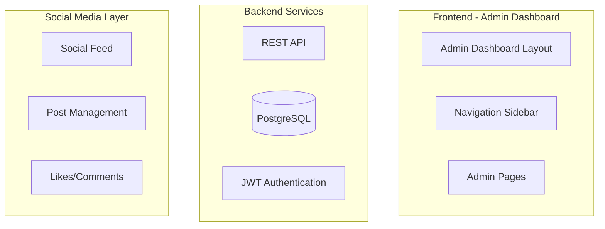

# AI Village: Admin Dashboard & Social Media Integration - Comprehensive Blueprint Request

**Date**: November 10, 2025
**Status**: Analysis & Planning Phase (Pre-Implementation)
**Approval Required**: 5/5 AI Village Consensus Before ANY Code Changes

---

## 🎯 MISSION OBJECTIVE

Create a **comprehensive, production-ready blueprint** for rebuilding the SwanStudios Admin Dashboard from the ground up, integrating personal training functionality with social media features, using existing codebase analysis as foundation.

**Critical Context**: We have encountered persistent production issues with the current admin dashboard (styled-components bundling errors). Rather than continue debugging, we are taking a strategic pause to **fully document, analyze, and architect** the proper solution before writing any code.

---

## 📋 DELIVERABLES REQUIRED

### Phase 1: Deep Codebase Analysis (Week 0 - Analysis Only)

#### 1.1 Admin Dashboard Audit
- **Review ALL existing admin dashboard files**:
  - `frontend/src/components/DashBoard/UnifiedAdminDashboardLayout.tsx`
  - `frontend/src/components/DashBoard/Pages/admin-dashboard/AdminStellarSidebar.tsx`
  - All admin-specific pages in `frontend/src/components/DashBoard/Pages/admin-dashboard/`

- **Document Current Architecture**:
  - Component hierarchy and relationships
  - State management patterns (Redux/Context/Local)
  - Styled-components usage patterns
  - API integration points
  - Current features and functionality
  - Identified technical debt and pain points

#### 1.2 Social Media Feature Inventory
- **Analyze existing social media components**:
  - Location: `frontend/src/components/` (identify all social-related files)
  - Current implementation status (complete/incomplete/broken)
  - Data models and schemas
  - User interaction flows

- **Define Social-PT Integration Points**:
  - How social features mesh with personal training workflows
  - Data sharing between PT management and social features
  - User roles: Admin, Trainer, Client perspectives

#### 1.3 Business Requirements Analysis
- **Core Admin Dashboard Purpose**:
  - Client management (onboarding, profiles, progress tracking)
  - Trainer management and assignments
  - Session scheduling and calendar management
  - Package/pricing management
  - Analytics and reporting
  - Gamification system oversight
  - Payment/billing oversight (Stripe integration)

- **Social Media Integration Goals**:
  - Client community features
  - Progress sharing and motivation
  - Trainer-client communication
  - Group challenges and competitions
  - Social proof and testimonials
  - Content creation and sharing

### Phase 2: Comprehensive Documentation Suite

#### 2.1 Mermaid Diagrams (Minimum 5 Required)

**A. System Architecture Diagram**


**B. Component Hierarchy Diagram**
- Show parent-child relationships
- Identify shared components vs. page-specific
- State management flow

**C. Data Flow Diagram**
- API request/response cycles
- State updates and side effects
- Real-time data (WebSocket/polling)

**D. User Journey Flowchart**
- Admin onboarding new client flow
- Trainer viewing client progress flow
- Client social interaction flow

**E. Authentication & Authorization Flow**
- Role-based access control (RBAC)
- JWT token lifecycle
- Protected route logic

#### 2.2 Wireframes (High-Fidelity UX/UI)

**A. Admin Dashboard Layout Wireframe**
- Desktop (1920x1080) layout
- Tablet (1024x768) responsive layout
- Mobile (375x667) responsive layout
- Galaxy-Swan design system colors/typography
- Component placement and spacing
- Navigation patterns

**B. Key Admin Pages Wireframes**:
1. Dashboard Home (analytics overview)
2. Client Management (list + detail views)
3. Client Onboarding Wizard (multi-step form)
4. Session Scheduling (calendar view)
5. Package Management (CRUD operations)
6. Analytics & Reports (charts/graphs)
7. Gamification Hub (admin controls)

**C. Social Media Integration Wireframes**:
1. Social Feed (admin moderation view)
2. Client Profile (PT data + social presence)
3. Community Challenges (admin creation/management)
4. Content Approval Workflow (if moderation required)

#### 2.3 Flowcharts (Decision Trees & Business Logic)

**A. Client Onboarding Flow**
- Step-by-step wizard progression
- Data validation checkpoints
- Database write operations
- Success/error handling
- Email notifications triggered

**B. Session Scheduling Logic**
- Availability checking
- Conflict detection
- Booking confirmation
- Cancellation/rescheduling rules

**C. Gamification System Flow**
- Achievement unlock conditions
- Point calculation logic
- Level progression rules
- Reward distribution

**D. Social Post Approval Flow** (if applicable)
- Content submission
- Admin review queue
- Approval/rejection logic
- Notification to user

#### 2.4 Technical Specifications

**A. API Endpoint Documentation**
- Complete REST API endpoint list
- Request/response schemas (TypeScript interfaces)
- Authentication requirements
- Rate limiting considerations
- Error response formats

**B. Database Schema Documentation**
- PostgreSQL table structures
- Relationships (1:1, 1:N, N:N)
- Indexes for performance
- Migration strategy

**C. State Management Architecture**
- Redux store structure (if using Redux)
- Context providers needed
- Local component state patterns
- Cache invalidation strategy

**D. Component Library Standards**
- Styled-components best practices (or alternative: MUI styled, Emotion, etc.)
- Theme configuration (Galaxy-Swan colors)
- Responsive breakpoints
- Accessibility (WCAG 2.1 AA compliance)

### Phase 3: Architecture Decision Records (ADRs)

Document key architectural decisions:

**ADR-001: Styling Solution**
- **Decision**: Migrate from styled-components to [ALTERNATIVE] OR fix bundling issues
- **Rationale**: Current production errors, bundle size, DX considerations
- **Alternatives Considered**: MUI styled-components, Emotion, TailwindCSS, CSS Modules
- **Consequences**: Migration effort, breaking changes, bundle size impact

**ADR-002: Admin Dashboard Framework**
- **Decision**: Rebuild from scratch OR refactor existing
- **Rationale**: Technical debt, maintainability, feature requirements
- **Alternatives Considered**: Incremental refactor, complete rebuild, third-party admin template

**ADR-003: Social Media Integration Strategy**
- **Decision**: Embedded in main app OR separate micro-frontend
- **Rationale**: Code reuse, deployment complexity, user experience
- **Consequences**: Build complexity, state management across boundaries

**ADR-004: Real-time Updates**
- **Decision**: WebSockets, Server-Sent Events, or Polling
- **Rationale**: User experience, server load, implementation complexity
- **Technology**: Socket.io (already in dependencies) vs. alternatives

---

## 🗂️ FILES TO ANALYZE

### Admin Dashboard (Primary Focus)
```
frontend/src/components/DashBoard/
├── UnifiedAdminDashboardLayout.tsx          # MAIN LAYOUT (currently broken in prod)
├── Pages/admin-dashboard/
│   ├── AdminStellarSidebar.tsx              # Navigation sidebar
│   ├── AdminDashboardHome.tsx               # Dashboard landing page
│   ├── ClientManagement.tsx                 # Client list/management
│   ├── PackageManagement.tsx                # PT packages/pricing
│   └── [OTHER ADMIN PAGES]
└── [REVIEW ALL FILES IN THIS DIRECTORY]
```

### Social Media Components (Secondary Focus)
```
frontend/src/components/
├── [IDENTIFY SOCIAL MEDIA RELATED FILES]    # Need to locate these
├── [FEED COMPONENTS]
├── [POST COMPONENTS]
└── [INTERACTION COMPONENTS]
```

### Backend API (For Integration Planning)
```
backend/
├── core/routes.mjs                          # Main routing file
├── controllers/                             # Business logic
├── models/                                  # Database models
│   ├── User.mjs
│   ├── ClientTrainerAssignment.mjs
│   └── [OTHER MODELS]
└── routes/                                  # API route definitions
```

### Design System & Configuration
```
frontend/src/
├── styles/                                  # Galaxy-Swan theme
├── theme/                                   # Theme configuration
└── assets/                                  # Design assets
```

### Documentation (Existing Context)
```
docs/ai-workflow/
├── SWANSTUDIOS-AI-VILLAGE-HANDBOOK-FINAL.md # Section 12.6 Component Docs Standards
├── PHASE-0-ADMIN-DASHBOARD-AUDIT.md        # Previous audit results
├── PERSONAL-TRAINING-MASTER-BLUEPRINT-V3.0.md # PT feature requirements
└── [OTHER RELEVANT PLANNING DOCS]
```

---

## 🎨 DESIGN SYSTEM REQUIREMENTS

### Galaxy-Swan Theme
- **Primary Colors**: [Extract from existing theme]
- **Typography**: [Font families, sizes, weights]
- **Spacing Scale**: [Consistent spacing system]
- **Component Library**: Material-UI (already installed) + custom components
- **Responsive Breakpoints**: Mobile-first approach
- **Accessibility**: WCAG 2.1 AA minimum compliance

### UX Principles
1. **Clarity**: Admin users need quick access to critical data
2. **Efficiency**: Minimize clicks for common workflows
3. **Consistency**: Unified patterns across all admin pages
4. **Feedback**: Clear loading states, success/error messages
5. **Responsive**: Works on desktop (primary) and tablets

---

## 🏗️ ARCHITECTURAL GOALS

### Performance Targets
- **Initial Load**: < 3s on 3G connection
- **Time to Interactive**: < 5s
- **Lighthouse Score**: 90+ Performance, 100 Accessibility
- **Bundle Size**: < 500KB initial JS (gzipped)

### Scalability Requirements
- Support 100+ concurrent admin users
- Handle 10,000+ client records
- Efficient pagination and lazy loading
- Optimistic UI updates for better UX

### Maintainability Standards
- **Code Documentation**: TSDoc comments for all public APIs
- **Component Documentation**: Storybook stories (future consideration)
- **Type Safety**: 100% TypeScript coverage, no `any` types
- **Testing**: Unit tests for business logic, integration tests for API calls

---

## 🤖 AI VILLAGE REVIEW PROCESS

### Review Phases

**Phase 1: Individual AI Analysis (Parallel)**
Each AI independently reviews and provides:
1. **Codebase Analysis Report**: Current state assessment
2. **Architecture Recommendations**: Proposed solutions
3. **Concerns & Risks**: Identified potential issues
4. **Questions for Clarification**: Unclear requirements

**Phase 2: Collaborative Consensus (Discussion)**
- Compare findings across all 5 AIs
- Identify agreement points
- Debate disagreements with technical rationale
- Converge on unified recommendations

**Phase 3: Final Blueprint Approval (Vote)**
- **Minimum Required**: 5/5 AI consensus
- Each AI votes: APPROVE / REVISE / REJECT
- If any REVISE/REJECT: Document specific concerns
- Iterate until unanimous APPROVE

**Phase 4: Documentation Handoff**
- Consolidated blueprint document
- All diagrams, wireframes, flowcharts finalized
- Implementation task breakdown (Weeks 1-16 roadmap)
- Risk mitigation strategies documented

---

## 🎯 SUCCESS CRITERIA

### Documentation Completeness
- [ ] All Mermaid diagrams render correctly
- [ ] Wireframes cover all major admin pages
- [ ] Flowcharts explain all business logic paths
- [ ] API specs match backend implementation
- [ ] Database schema matches current production

### AI Village Consensus
- [ ] 5/5 AIs approve architecture decisions
- [ ] All concerns addressed with documented solutions
- [ ] Implementation plan has no blocking unknowns
- [ ] Risk assessment complete with mitigation strategies

### Implementation Readiness
- [ ] Clear task breakdown (no ambiguous "figure it out later" tasks)
- [ ] Dependency order established (what must be built first)
- [ ] Testing strategy defined (unit, integration, E2E)
- [ ] Deployment plan documented (staging → production process)

---

## 📝 DELIVERABLE FORMAT

### Final Blueprint Document Structure

```markdown
# SwanStudios Admin Dashboard & Social Media Integration - Master Blueprint

## Executive Summary
- High-level architecture overview
- Key technology decisions
- Implementation timeline (16-week roadmap)

## Part 1: Current State Analysis
- Existing codebase review
- Technical debt inventory
- Pain points and blockers

## Part 2: Architecture Design
- System architecture diagram
- Component hierarchy
- Data flow diagrams
- State management strategy

## Part 3: UX/UI Design
- Wireframes (all pages)
- User journey maps
- Design system specifications

## Part 4: Technical Specifications
- API endpoint documentation
- Database schema
- TypeScript interfaces
- Error handling patterns

## Part 5: Implementation Plan
- Week-by-week roadmap
- Task dependencies
- Testing strategy
- Deployment process

## Part 6: Risk Assessment
- Identified risks
- Mitigation strategies
- Rollback plans

## Appendix
- ADRs (Architecture Decision Records)
- Research findings
- Alternative approaches considered
```

---

## 🚦 CONSTRAINTS & BOUNDARIES

### What We KEEP
- ✅ Existing database schema (PostgreSQL)
- ✅ Backend API structure (Node.js/Express)
- ✅ Authentication system (JWT)
- ✅ Material-UI component library
- ✅ React ecosystem (React Router, Redux/Context)
- ✅ Galaxy-Swan design system colors

### What We CAN CHANGE
- ⚠️ Styled-components (evaluate alternatives if needed)
- ⚠️ Admin dashboard component structure
- ⚠️ State management patterns (improve if needed)
- ⚠️ Build configuration (Vite settings)
- ⚠️ Component organization/file structure

### What We CANNOT CHANGE (Production Constraints)
- ❌ Backend database (must support existing data)
- ❌ Authentication flow (existing users must continue working)
- ❌ API breaking changes (mobile app may depend on current API)
- ❌ User-facing URLs (SEO/bookmarks must work)

---

## 🎓 AI VILLAGE ROLES & RESPONSIBILITIES

### Roo-Code (Lead Architect)
- **Focus**: Overall system architecture, technical feasibility
- **Deliverables**: Architecture diagrams, ADRs, technology recommendations
- **Expertise**: TypeScript, React, Node.js, production best practices

### Kilo-Code (Backend Specialist)
- **Focus**: API design, database schema, data flow
- **Deliverables**: API specifications, DB migrations, backend integration points
- **Expertise**: PostgreSQL, REST APIs, authentication, data modeling

### MinMax (UX/UI Designer)
- **Focus**: Wireframes, user flows, design system consistency
- **Deliverables**: High-fidelity wireframes, UX journey maps, accessibility audit
- **Expertise**: User experience, visual design, responsive layouts

### Claude Code (Implementation Lead)
- **Focus**: Code quality, testing strategy, implementation plan
- **Deliverables**: Component specifications, testing requirements, task breakdown
- **Expertise**: React components, TypeScript, testing, build tools

### Desktop Claude (Quality Assurance & Research)
- **Focus**: Risk assessment, alternative research, production readiness
- **Deliverables**: Risk mitigation plans, technology comparisons, deployment strategy
- **Expertise**: DevOps, performance optimization, production debugging

---

## 📅 TIMELINE EXPECTATIONS

### Analysis Phase (Week 0 - Days 1-3)
- Day 1: Codebase analysis, file inventory
- Day 2: Architecture design, initial diagrams
- Day 3: Wireframes, flowcharts, documentation

### AI Village Review (Week 0 - Days 4-5)
- Day 4: Individual AI reviews submitted
- Day 5: Collaborative discussion, consensus building

### Blueprint Finalization (Week 0 - Days 6-7)
- Day 6: Incorporate feedback, revise documentation
- Day 7: Final approval vote, publish master blueprint

### Implementation (Weeks 1-16)
- **To be defined in the final blueprint**
- Phased rollout with testing gates
- No code deployment without passing tests + AI review

---

## ❓ QUESTIONS FOR AI VILLAGE TO ANSWER

1. **Should we rebuild admin dashboard from scratch or refactor incrementally?**
   - Pros/cons of each approach
   - Time estimates for each
   - Risk assessment

2. **What styling solution should we use going forward?**
   - Keep styled-components and fix bundling issues?
   - Migrate to MUI styled-components?
   - Migrate to Emotion?
   - Migrate to Tailwind CSS?
   - Use CSS Modules?

3. **How should social media features integrate with PT features?**
   - Separate pages with navigation?
   - Embedded widgets in PT pages?
   - Unified timeline/feed approach?

4. **What state management strategy is optimal?**
   - Redux Toolkit (current approach)?
   - React Context API?
   - Zustand or Jotai?
   - TanStack Query (React Query) for server state?

5. **How do we handle real-time updates efficiently?**
   - WebSockets (Socket.io)?
   - Server-Sent Events?
   - Polling with optimistic updates?

6. **What testing strategy ensures production stability?**
   - Unit test coverage targets?
   - Integration test requirements?
   - E2E test critical paths?
   - Visual regression testing?

7. **How do we ensure accessibility compliance?**
   - Automated testing tools (axe, pa11y)?
   - Manual testing checklist?
   - Screen reader testing?

8. **What's the deployment strategy for zero-downtime updates?**
   - Feature flags for gradual rollout?
   - Blue-green deployment?
   - Canary releases?
   - Rollback procedures?

---

## 🎉 EXPECTED OUTCOME

By the end of this analysis and planning phase, we will have:

✅ **Complete understanding** of current codebase strengths and weaknesses
✅ **Comprehensive blueprint** that any developer could implement
✅ **Visual documentation** (wireframes, diagrams) for stakeholder alignment
✅ **Technical specifications** with zero ambiguity
✅ **Risk-mitigated plan** with fallback strategies
✅ **AI Village consensus** ensuring quality and feasibility
✅ **Implementation roadmap** with clear milestones and deliverables

**Then and only then** will we begin coding.

---

## 📞 NEXT STEPS

1. **AI Village**: Review this prompt for completeness
2. **AI Village**: Ask clarifying questions if any requirements unclear
3. **AI Village**: Begin parallel analysis of codebase files
4. **AI Village**: Submit individual findings within 24-48 hours
5. **AI Village**: Collaborative discussion to reach consensus
6. **AI Village**: Publish final consolidated blueprint
7. **Implementation Team**: Execute blueprint with Phase 0 approval gates

---

**Remember**: We are in **ANALYSIS MODE**, not implementation mode. No code changes until the blueprint is complete and approved by all 5 AIs.

Let's build this right. 🚀
