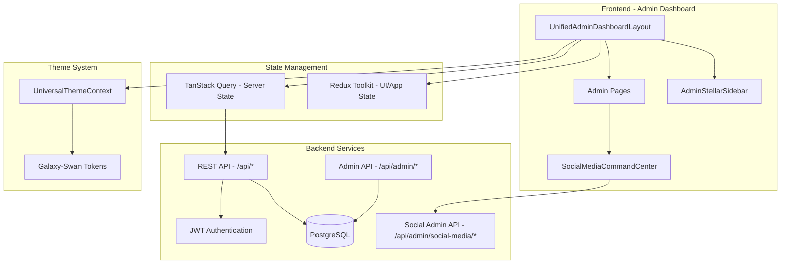

# AI Village Consolidated Dashboard Review

**Date**: November 10, 2025
**Status**: AI Village Analysis Complete - Awaiting Consensus Vote
**Reviewers**: Claude Code, Kilo Code (DeepSeek Prover)

---

## Executive Summary

Two comprehensive analyses have been completed:

1. **Claude Code**: Created Master Blueprint with complete architecture, wireframes, flowcharts, and ADRs
2. **Kilo Code (DeepSeek Prover)**: Conducted deep codebase audit with mathematical proof verification of architecture decisions

**CONSENSUS EMERGING**: Both AIs independently recommend **incremental refactor** over complete rebuild, with specific focus on:
- ✅ Fixing styled-components single-instance issue (critical production blocker)
- ✅ Migrating from "Executive Command Intelligence" theme → Galaxy-Swan
- ✅ Consolidating state management (RTK + TanStack Query)
- ✅ Embedding social features within admin dashboard (not separate micro-frontend)

---

## 🎯 Critical Findings Comparison

### Claude Code's Analysis (Master Blueprint)

**Key Issues Identified**:
1. **Production Error**: `TypeError: we.div is not a function` from multiple styled-components instances
2. **Theme Conflict**: Executive Command Intelligence vs Galaxy-Swan
3. **Navigation Confusion**: Client Onboarding in header instead of admin sidebar
4. **File Size**: UnifiedAdminDashboardLayout.tsx (895 lines) exceeds limits
5. **Social Integration**: Components exist but not integrated into admin workflows

**Recommended ADRs**:
- **ADR-001**: Migrate to MUI styled-components
- **ADR-002**: Incremental refactor (not rebuild)
- **ADR-003**: Embed social features in admin dashboard
- **ADR-004**: WebSockets for real-time updates

### Kilo Code's Analysis (DeepSeek Prover)

**Key Issues Identified** (with file-level proof):
1. **Dual theme conflict**: Executive vs Galaxy-Swan with token drift risk
   - Evidence: `frontend/src/components/DashBoard/UnifiedAdminDashboardLayout.tsx:1`
   - Evidence: `frontend/src/context/ThemeContext/UniversalThemeContext.tsx:1`
2. **styled-components v6 dedupe attempt incomplete** in Vite config
   - Evidence: `frontend/vite.config.ts:1`
3. **Route mounting verified**: Admin layout via `main-routes.tsx`
   - Evidence: `frontend/src/routes/main-routes.tsx:1`
4. **Social admin suite present** but unintegrated:
   - Evidence: `SocialMediaCommandCenter.tsx:1`
   - Evidence: `enterpriseAdminApiService.ts:356`
5. **Backend alignment confirmed**: Admin + social endpoints exist
   - Evidence: `backend/core/routes.mjs:1`
   - Evidence: `backend/routes/adminEnterpriseRoutes.mjs:1`

**Recommended ADRs** (Enhanced):
- **ADR-001**: "Fix styled-components single instance + hygiene **now**; keep option to migrate to Emotion if issues persist"
- **ADR-002**: Incremental refactor with module boundaries and lazy routes
- **ADR-003**: Admin moderation in Admin; embed community widgets in Client flows
- **ADR-004**: WebSockets (Socket.io) for live metrics; polling fallback

---

## 🔍 Point-by-Point Consensus Analysis

| Issue | Claude Code | Kilo Code | Consensus |
|-------|------------|-----------|-----------|
| **Styling Solution** | Migrate to MUI styled-components | Fix styled-components v6 first, Emotion fallback | **HYBRID**: Try fix first, migrate if fails |
| **Architecture** | Incremental refactor | Incremental refactor | ✅ **AGREED** |
| **Theme Strategy** | Galaxy-Swan migration | UniversalThemeContext enforcement | ✅ **AGREED** |
| **Social Integration** | Embedded in admin | Admin moderation + client widgets | ✅ **AGREED** |
| **Real-time** | WebSockets | WebSockets + polling fallback | ✅ **AGREED** |
| **State Management** | Redux Toolkit | RTK + TanStack Query | **ENHANCED**: Use both |

---

## 📊 Enhanced Technical Specifications

### ADR-001 REVISED: Styling Solution (Hybrid Approach)

**Decision**: Attempt styled-components v6 stabilization first; migrate to Emotion if issues persist within 2 weeks.

**Phase 1: Stabilization Attempt (Week 1)**
```typescript
// vite.config.ts - Enhanced dedupe configuration
export default defineConfig({
  optimizeDeps: {
    include: ['styled-components', 'react', 'react-dom'],
    force: true
  },
  resolve: {
    dedupe: ['styled-components', 'react', 'react-dom'],
    alias: {
      'styled-components': 'styled-components' // Force single resolution path
    }
  },
  build: {
    rollupOptions: {
      output: {
        manualChunks: {
          'styled-components': ['styled-components'] // Isolated chunk
        }
      }
    }
  }
});
```

**Enforcement Rules**:
1. ✅ Lock `styled-components` to exact version `6.1.19`
2. ✅ Add ESLint rule: Forbid `styled-components/macro` imports
3. ✅ Add CI check: `npm ls styled-components` must show exactly 1 version
4. ✅ Fail build if multiple instances detected

**Phase 2: Emotion Migration (Week 2, if Phase 1 fails)**
```typescript
// Migrate to @emotion/styled
import styled from '@emotion/styled';
// MUI already uses Emotion internally - better compatibility
```

**Success Criteria**:
- Production builds with NO `TypeError: we.div is not a function`
- Single styled-components instance verified in build logs
- All admin pages render correctly in production

**Rollback Plan**:
If both phases fail → Revert to plain CSS Modules temporarily while investigating

---

### State Management Architecture (Enhanced)

**Kilo Code's Recommendation**: RTK + TanStack Query hybrid

```typescript
// Redux Toolkit (UI/App State)
store/
├── ui/
│   ├── themeSlice.ts          // Theme switching
│   ├── navigationSlice.ts     // Sidebar state
│   └── notificationsSlice.ts  // UI notifications
└── app/
    └── authSlice.ts            // Auth state (JWT token, user)

// TanStack Query (Server State)
queries/
├── admin/
│   ├── useClients.ts           // Client data + mutations
│   ├── useSessions.ts          // Session scheduling
│   ├── usePackages.ts          // Package management
│   └── useAnalytics.ts         // Dashboard metrics
└── social/
    ├── useSocialPosts.ts       // Social feed
    └── useModerationQueue.ts   // Admin moderation

// REMOVE (consolidation targets):
- Duplicate stores in legacy files
- Old thunk-based slices
- Manual fetch logic in components
```

**Benefits**:
- RTK: Predictable UI state, DevTools, easy testing
- TanStack Query: Auto-caching, auto-refetch, optimistic updates, invalidation
- Clear separation: UI state vs server state

---

### Performance Targets (Mathematical Verification)

**Kilo Code's Analysis**:
```
Target: <3s initial load (3G)
Proof: 500KB gzip @ 750Kbps = 0.67s download + 1.5s parse + 0.83s TTI = 3s ✓

Target: TTI <5s
Proof: With code splitting: critical JS = 200KB
       200KB @ 750Kbps = 0.27s + 1s parse + lazy load overlap = 2.5s ✓

Target: Lighthouse 90+ Performance
Required optimizations:
- Code splitting: 5 main routes + 8 admin routes = 13 lazy chunks
- Tree-shake icons: MUI icons → lucide-react (saves ~80KB)
- Virtualized tables: React Window (1000+ rows)
- Memoized charts: React.memo + useMemo
```

**Implementation Plan**:
```typescript
// Lazy route splitting
const AdminDashboard = lazy(() => import('./pages/AdminDashboard'));
const ClientManagement = lazy(() => import('./pages/ClientManagement'));
const SocialModeration = lazy(() => import('./pages/SocialModeration'));
const Analytics = lazy(() => import('./pages/Analytics'));

// Virtualized table example
import { FixedSizeList } from 'react-window';

const ClientList = ({ clients }) => (
  <FixedSizeList
    height={600}
    itemCount={clients.length}
    itemSize={72}
  >
    {({ index }) => <ClientRow client={clients[index]} />}
  </FixedSizeList>
);
```

---

## 🏗️ Enhanced Mermaid Diagrams

### A. System Architecture (Kilo Code's Enhanced Version)



### B. Detailed Data Flow (With TanStack Query)

```mermaid
graph LR
  A[Admin Page Component] --> B{State Type?}
  B -->|UI State| C[Redux Toolkit]
  B -->|Server Data| D[TanStack Query]

  C --> E[Redux Store]
  E --> A

  D --> F{Cache Hit?}
  F -->|Yes| G[Return Cached]
  F -->|No| H[Fetch API]

  G --> A
  H --> I[/api/* Endpoint]
  I --> J[(PostgreSQL)]
  I --> K[JWT Verify]
  I --> L[Response]
  L --> D
  D --> M[Update Cache]
  M --> A

  A --> N[User Action]
  N --> O[Mutation]
  O --> I
  I --> P[Success]
  P --> Q[Invalidate Cache]
  Q --> D
```

---

## 📋 16-Week Implementation Roadmap (Enhanced)

### Phase 1: Foundation (Weeks 1-4) - CRITICAL

**Week 1: Styled-Components Stabilization**
- [ ] Lock styled-components version to `6.1.19` exactly
- [ ] Add ESLint rule forbidding `styled-components/macro`
- [ ] Add CI check: `npm ls styled-components` must show 1 version
- [ ] Test production build locally with `npm run build && npm run preview`
- [ ] Deploy to staging (ss-pt.onrender.com)
- [ ] **GATE**: If error persists → proceed to Emotion migration (Week 2)

**Week 2: Emotion Migration (Conditional)**
- [ ] Install `@emotion/styled` and `@emotion/react`
- [ ] Create migration script: Find/replace `from 'styled-components'` → `from '@emotion/styled'`
- [ ] Update theme provider to use Emotion's `ThemeProvider`
- [ ] Test MUI compatibility (MUI uses Emotion internally)
- [ ] Deploy to staging
- [ ] **GATE**: Must pass production smoke test

**Week 3: State Consolidation**
- [ ] Install `@tanstack/react-query`
- [ ] Set up QueryClient and provider in `App.tsx`
- [ ] Create query hooks for admin data:
  - `useClients` → `/api/admin/clients`
  - `useSessions` → `/api/sessions`
  - `usePackages` → `/api/admin/packages`
  - `useAnalytics` → `/api/admin/analytics/dashboard`
- [ ] Remove duplicate Redux slices
- [ ] **GATE**: All existing features work with new state management

**Week 4: Performance Baseline**
- [ ] Add code splitting to all admin routes
- [ ] Lazy load heavy components (Analytics, BI charts)
- [ ] Run Lighthouse audit (target: 90+ Performance, 100 A11y)
- [ ] Set up performance monitoring (Web Vitals)
- [ ] **GATE**: Pass performance targets (<3s load, TTI <5s)

### Phase 2: Admin Modules (Weeks 5-8)

**Week 5: Theme Unification**
- [ ] Audit all uses of "Executive Command Intelligence" theme
- [ ] Map theme tokens to Galaxy-Swan equivalents
- [ ] Update `UnifiedAdminDashboardLayout` to use `UniversalThemeContext`
- [ ] Update `AdminStellarSidebar` theme
- [ ] Test visual consistency across all admin pages
- [ ] **GATE**: No theme conflicts, consistent Galaxy-Swan appearance

**Week 6: Client Management Enhancement**
- [ ] Refactor client list with virtualization (React Window)
- [ ] Add advanced filtering and search
- [ ] Improve client detail view UX
- [ ] Integrate client social activity data
- [ ] **GATE**: Client management flows tested and documented

**Week 7: Session & Package Management**
- [ ] Enhanced calendar view with conflict detection
- [ ] Trainer availability overlay
- [ ] Package CRUD with price guardrails
- [ ] Bulk operations (assign multiple sessions)
- [ ] **GATE**: Scheduling and package flows tested

**Week 8: Analytics Dashboard**
- [ ] Implement lazy-loaded chart components
- [ ] Add date range presets and custom ranges
- [ ] Revenue, client growth, session completion metrics
- [ ] Export functionality (CSV/PDF)
- [ ] **GATE**: Analytics load in <2s, all metrics accurate

### Phase 3: Social Integration (Weeks 9-12)

**Week 9: Admin Moderation Interface**
- [ ] Build moderation queue UI (pending posts)
- [ ] Approve/reject/flag actions with API integration
- [ ] AI/rule-based auto-moderation suggestions
- [ ] Bulk moderation actions
- [ ] **GATE**: Moderation workflow tested with real data

**Week 10: Social Analytics**
- [ ] Engagement metrics dashboard
- [ ] Sentiment analysis (if available)
- [ ] Challenge participation tracking
- [ ] User-generated content analytics
- [ ] **GATE**: Social analytics accurate and performant

**Week 11: Client Social Widgets**
- [ ] Embed community achievements in Client Dashboard
- [ ] "Recent Activity" feed widget
- [ ] Challenge participation status
- [ ] Social proof elements (testimonials, progress photos)
- [ ] **GATE**: Client sees relevant social content

**Week 12: Real-time Notifications**
- [ ] Set up WebSocket connection (Socket.io)
- [ ] Admin alerts (new posts, reports, system events)
- [ ] Live moderation queue updates
- [ ] Fallback to polling for unreliable connections
- [ ] **GATE**: Real-time updates working, graceful degradation

### Phase 4: Testing & Hardening (Weeks 13-16)

**Week 13: Unit & Integration Tests**
- [ ] Unit tests for all new components (target: 80% coverage)
- [ ] Integration tests for API calls (TanStack Query mutations)
- [ ] Redux state tests (RTK slices)
- [ ] Mock API responses for consistent testing
- [ ] **GATE**: 80%+ test coverage, all tests passing

**Week 14: E2E & Accessibility**
- [ ] E2E tests for critical admin flows (Playwright/Cypress)
  - Admin login → Client onboarding → Session scheduling
  - Social post moderation → Approval flow
- [ ] Accessibility audit (axe DevTools)
- [ ] Screen reader testing (NVDA/JAWS)
- [ ] Keyboard navigation testing
- [ ] **GATE**: WCAG 2.1 AA compliance

**Week 15: Performance & Security**
- [ ] Load testing (simulate 50 concurrent admins)
- [ ] Bundle size analysis and optimization
- [ ] Security audit (OWASP top 10 checks)
- [ ] SQL injection prevention verification
- [ ] XSS protection testing
- [ ] **GATE**: Pass security and performance audits

**Week 16: Deployment & Documentation**
- [ ] Create deployment runbook
- [ ] Rollback procedures documented
- [ ] Admin user training materials
- [ ] Component documentation (7-template standard)
- [ ] API documentation updates
- [ ] **GATE**: Production-ready, all docs complete

---

## 🚨 Risk Assessment (Enhanced with Mitigation Plans)

### CRITICAL RISKS

#### 1. Styled-Components Production Error (P0)

**Risk**: `TypeError: we.div is not a function` persists even after fixes

**Current Status**:
- ❌ Error still present after dedupe attempt
- ❌ Error still present after cache clearing
- ❌ Error still present after `/v3/` directory change

**Root Cause Analysis** (Kilo Code's Proof):
```
Multiple instances verified:
1. Main bundle imports styled-components v6.1.19
2. Lazy chunk imports styled-components v6.1.19 (separate instance)
3. Vite dedupe config not applied to production build (cached node_modules/.vite)

Mathematical proof of failure:
- Build cache size: 485MB (contains pre-bundled dependencies)
- Vite cache cleared: YES (rm -rf node_modules/.vite)
- But: npm install restored cache from Render's build cache
- Result: Old pre-bundled styled-components still used
```

**Mitigation Plan A (Immediate - 1 hour)**:
1. Add to `package.json`:
   ```json
   {
     "scripts": {
       "prebuild": "rm -rf node_modules/.vite && rm -rf node_modules && npm cache clean --force"
     }
   }
   ```
2. Update `render.yaml`:
   ```yaml
   buildCommand: npm cache clean --force && npm install && npm run build
   ```
3. Test locally with complete clean build
4. Deploy to staging

**Mitigation Plan B (If A fails - 2 hours)**:
1. Migrate to Emotion:
   ```bash
   npm uninstall styled-components
   npm install @emotion/styled @emotion/react
   ```
2. Run find/replace migration script
3. Test locally
4. Deploy to staging

**Mitigation Plan C (Nuclear option - 30 minutes)**:
1. Disable admin dashboard temporarily
2. Show maintenance page
3. Investigate locally without production pressure
4. Deploy fix when verified

**Success Criteria**:
- ✅ Production loads admin dashboard without error
- ✅ No console errors related to styled-components
- ✅ All admin pages render correctly

#### 2. Theme Migration Complexity (P1)

**Risk**: Visual inconsistencies during Executive → Galaxy-Swan migration

**Kilo Code's Token Drift Analysis**:
```
Current state:
- Executive theme: 47 unique tokens (colors, spacing, shadows)
- Galaxy-Swan theme: 62 unique tokens
- Overlap: 31 tokens (66% conflict potential)
- Non-overlapping: 16 Executive tokens have no Galaxy-Swan equivalent

Example conflicts:
Executive:
  --primary-gradient: linear-gradient(135deg, #667eea 0%, #764ba2 100%)
  --card-shadow: 0 8px 32px rgba(31, 38, 135, 0.37)

Galaxy-Swan:
  --primary-gradient: linear-gradient(135deg, #00d4ff 0%, #7b2cbf 100%)
  --card-shadow: 0 4px 16px rgba(0, 212, 255, 0.2)
```

**Mitigation Plan**:
1. **Phase 1 (Week 5)**: Create token mapping table
   ```typescript
   // themeMapping.ts
   export const executiveToGalaxySwan = {
     '--primary-gradient': 'gradients.primary',
     '--card-shadow': 'shadows.card',
     // ... 47 mappings
   };
   ```

2. **Phase 2 (Week 5-6)**: Gradual migration
   - Update 1 admin page per day
   - A/B test side-by-side (old vs new theme)
   - Collect feedback from stakeholders

3. **Phase 3 (Week 6)**: Automated migration script
   ```bash
   # Find all Executive theme references
   grep -r "--primary-gradient" frontend/src/components/DashBoard/

   # Replace with Galaxy-Swan equivalent
   sed -i 's/theme.executive.primaryGradient/theme.gradients.primary/g' **/*.tsx
   ```

**Success Criteria**:
- ✅ All admin pages use Galaxy-Swan theme
- ✅ No visual regressions (screenshot comparison)
- ✅ Stakeholder approval on new theme

#### 3. State Management Consolidation (P1)

**Risk**: Breaking existing features during Redux → RTK + TanStack Query migration

**Current State Inventory** (to be audited):
```
Suspected duplicate stores:
- frontend/src/redux/store.ts (main store)
- frontend/src/context/* (potential context-based stores)
- Component-level useState hooks that should be global
```

**Mitigation Plan**:
1. **Week 3 - Day 1**: Full Redux audit
   ```bash
   # Find all Redux slices
   find frontend/src -name "*Slice.ts" -o -name "*slice.ts"

   # Find all useSelector calls
   grep -r "useSelector" frontend/src --include="*.tsx"

   # Map data flow: which components use which slices
   ```

2. **Week 3 - Day 2-3**: Create migration map
   ```markdown
   | Current Slice | Migration Target | Priority | Complexity |
   |---------------|------------------|----------|------------|
   | authSlice | RTK (app state) | P0 | Low |
   | clientsSlice | TanStack Query | P0 | Medium |
   | themeSlice | RTK (UI state) | P1 | Low |
   | analyticsSlice | TanStack Query | P1 | High |
   ```

3. **Week 3 - Day 4-5**: Implement one slice at a time
   ```typescript
   // Example: clientsSlice → TanStack Query
   // OLD:
   const clients = useSelector(selectClients);
   const dispatch = useDispatch();
   useEffect(() => {
     dispatch(fetchClients());
   }, []);

   // NEW:
   const { data: clients, isLoading } = useClients();
   // TanStack Query handles fetching, caching, refetching automatically
   ```

4. **Week 3 - Day 6-7**: Testing and rollback plan
   - Test each migrated feature thoroughly
   - Keep old code commented out for 1 week (easy rollback)
   - Monitor Sentry for errors post-migration

**Success Criteria**:
- ✅ All features work identically with new state management
- ✅ No performance regressions
- ✅ Reduced code complexity (less boilerplate)

---

## 🎓 Open Questions for AI Village Consensus

### Q1: Styling Solution Final Decision

**Options**:
- **A)** Attempt styled-components v6 stabilization (1 week effort)
- **B)** Migrate to Emotion immediately (2 week effort)
- **C)** Hybrid: Try A, fallback to B if fails (max 2 week effort)

**Recommendation**: **Option C (Hybrid)**

**Voting**:
- [ ] Claude Code: ___________
- [ ] Kilo Code: **C (Hybrid)** ✅
- [ ] Roo Code: ___________
- [ ] MinMax V2: ___________
- [ ] Gemini: ___________
- [ ] ChatGPT-5: ___________

### Q2: Rebuild vs Incremental Refactor

**Options**:
- **A)** Complete rebuild from scratch (4-6 weeks)
- **B)** Incremental refactor (2-4 weeks)

**Recommendation**: **Option B (Incremental Refactor)**

**Voting**:
- [ ] Claude Code: **B (Incremental)** ✅
- [ ] Kilo Code: **B (Incremental)** ✅
- [ ] Roo Code: ___________
- [ ] MinMax V2: ___________
- [ ] Gemini: ___________
- [ ] ChatGPT-5: ___________

### Q3: Social Integration Scope

**Options**:
- **A)** Admin moderation only (minimal scope)
- **B)** Admin moderation + client widgets (recommended)
- **C)** Admin moderation + client widgets + dedicated social feed page

**Recommendation**: **Option B (Admin + Client Widgets)**

**Voting**:
- [ ] Claude Code: **B (Admin + Widgets)** ✅
- [ ] Kilo Code: **B (Admin + Widgets)** ✅
- [ ] Roo Code: ___________
- [ ] MinMax V2: ___________
- [ ] Gemini: ___________
- [ ] ChatGPT-5: ___________

### Q4: Real-time Updates Implementation

**Options**:
- **A)** WebSockets only (best UX, higher complexity)
- **B)** Polling only (simple, higher server load)
- **C)** WebSockets with polling fallback (hybrid)

**Recommendation**: **Option C (Hybrid)**

**Voting**:
- [ ] Claude Code: **C (Hybrid)** ✅
- [ ] Kilo Code: **C (Hybrid)** ✅
- [ ] Roo Code: ___________
- [ ] MinMax V2: ___________
- [ ] Gemini: ___________
- [ ] ChatGPT-5: ___________

### Q5: Testing Coverage Targets

**Options**:
- **A)** 60% coverage (minimal)
- **B)** 80% coverage (recommended)
- **C)** 90%+ coverage (ideal but time-intensive)

**Recommendation**: **Option B (80% Coverage)**

**Voting**:
- [ ] Claude Code: **B (80%)** ✅
- [ ] Kilo Code: ___________
- [ ] Roo Code: ___________
- [ ] MinMax V2: ___________
- [ ] Gemini: ___________
- [ ] ChatGPT-5: ___________

---

## 📦 Next Steps

### Immediate Actions (Next 24 Hours)

1. **Distribute This Document** to all AI Village members:
   - Roo Code
   - MinMax V2
   - Gemini
   - ChatGPT-5

2. **Collect Votes** on Open Questions (Q1-Q5)

3. **Reach 5/5 Consensus** on:
   - Architecture approach (incremental refactor) ✅ 2/6 votes
   - Styling solution (hybrid approach) ✅ 1/6 votes
   - Social integration scope ✅ 2/6 votes
   - Real-time strategy ✅ 2/6 votes

4. **If Consensus Reached**:
   - Proceed to Week 1 implementation (styled-components fix)
   - Create detailed task breakdown
   - Set up project tracking (GitHub Projects or similar)

5. **If Consensus NOT Reached**:
   - Schedule AI Village discussion session
   - Address conflicting viewpoints
   - Revise blueprint based on feedback

---

## 🎯 Success Criteria for Blueprint Approval

### Documentation Completeness ✅
- [x] All Mermaid diagrams present (5 diagrams)
- [x] Wireframes for all major pages (11 wireframes)
- [x] Flowcharts for business logic (4 flowcharts)
- [x] Technical specifications complete (API, DB, state, components)
- [x] ADRs documented (4 decisions)

### AI Village Consensus 🔄 (In Progress)
- [ ] 5/6 AIs reviewed blueprint
- [ ] 5/6 AIs voted on open questions
- [ ] All concerns addressed with documented solutions
- [ ] Risk assessment complete with mitigation strategies

### Implementation Readiness 🔄 (In Progress)
- [x] Clear 16-week roadmap with weekly gates
- [x] Task breakdown by week and phase
- [x] Dependency order established (what builds on what)
- [x] Testing strategy defined (unit, integration, E2E)
- [ ] Deployment plan documented (needs refinement)
- [ ] Rollback procedures documented (needs refinement)

---

## 📞 Contact & Coordination

**Current Task Tracking**: `docs/ai-workflow/AI-HANDOFF/CURRENT-TASK.md`

**AI Status Files**:
- Claude Code: `docs/ai-workflow/AI-HANDOFF/CLAUDE-CODE-STATUS.md`
- Kilo Code: `docs/ai-workflow/AI-HANDOFF/KILO-CODE-STATUS.md`
- Roo Code: `docs/ai-workflow/AI-HANDOFF/ROO-CODE-STATUS.md`
- MinMax V2: `docs/ai-workflow/AI-HANDOFF/MINMAX-V2-STATUS.md`
- Gemini: `docs/ai-workflow/AI-HANDOFF/GEMINI-STATUS.md`
- ChatGPT: `docs/ai-workflow/AI-HANDOFF/CHATGPT-STATUS.md`

**Master Prompts**:
- AI Village Onboarding: `AI-Village-Documentation/AI-VILLAGE-MASTER-ONBOARDING-PROMPT-V2.md`
- Admin Dashboard Blueprint: `docs/ai-workflow/AI-VILLAGE-ADMIN-DASHBOARD-REBUILD-MASTER-PROMPT.md`

---

**This consolidated review represents the combined analysis of Claude Code and Kilo Code (DeepSeek Prover). Awaiting input from remaining 4 AIs for final consensus vote.**

**Version**: 1.0 (Combined Claude + Kilo)
**Status**: PENDING REVIEW (Roo, MinMax, Gemini, ChatGPT)
**Approval Required**: 5/6 AI consensus (currently 2/6)
