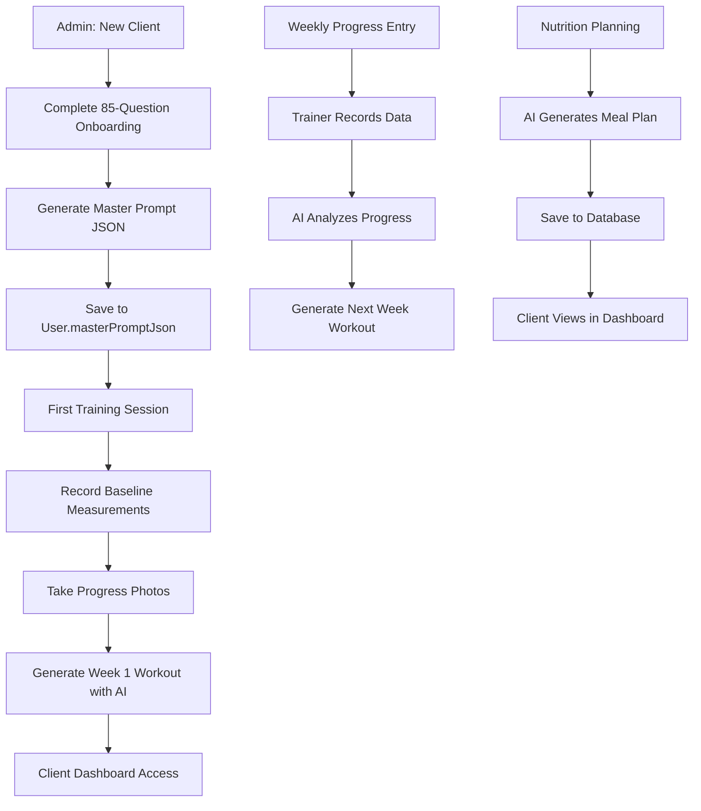
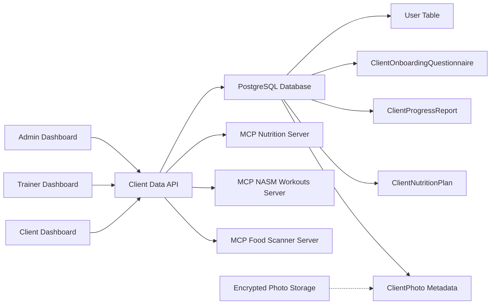

# 🤖 CLIENT DATA DATABASE INTEGRATION - ChatGPT Prompt
## Transform File-Based Client System to Database-Backed Web Application

**Purpose:** This prompt provides complete specifications for integrating the client-data management system into the SwanStudios Personal Training web application with database persistence and cross-dashboard access.

**Target AI:** ChatGPT (or Claude) - Copy this entire document and paste it into your AI session

---

# 📋 PROJECT BRIEF

I need you to create a comprehensive database-backed client data management system that integrates with my existing SwanStudios Personal Training web application. This system must transform a currently file-based client management workflow into a fully functional web interface accessible from Admin, Trainer, and Client dashboards.

## 🎯 Core Objectives

1. **Database Schema**: Create Sequelize models based on the Master Prompt JSON Schema v3.0
2. **API Endpoints**: Full CRUD operations for client data management
3. **Admin Dashboard UI**: Complete client onboarding and management interface
4. **Trainer Dashboard UI**: View/edit assigned clients with appropriate permissions
5. **Client Dashboard UI**: Read-only view of their own data
6. **MCP AI Integration**: Connect with existing AI servers (Nutrition, NASM Workouts, Food Scanner)
7. **Real Data Persistence**: All data must persist in PostgreSQL database
8. **Role-Based Access Control**: Proper permissions for admin/trainer/client roles

---

# 🗄️ PART 1: DATABASE SCHEMA

## Existing User Model Context

The application already has a User model (backend/models/User.mjs) with these relevant fields:

```javascript
User {
  id, firstName, lastName, email, username, password, phone, photo,
  role: ENUM('user', 'client', 'trainer', 'admin'),

  // CLIENT FIELDS (already exist):
  dateOfBirth, gender, weight, height, fitnessGoal,
  trainingExperience, healthConcerns, emergencyContact,
  masterPromptJson: JSON,  // ← Complete Master Prompt v3.0 will go here
  spiritName: STRING,      // ← Privacy alias (e.g., "Orion Ascending")
  availableSessions: INTEGER,

  // TRAINER FIELDS (already exist):
  specialties, certifications, bio, availableDays, availableHours, hourlyRate,

  // GAMIFICATION (already exist):
  points, level, tier, streakDays, lastActivityDate,
  totalWorkouts, totalExercises,

  // STRIPE:
  stripeCustomerId
}
```

**IMPORTANT:** Do NOT recreate these fields. You will ADD new models and EXTEND the User model only where needed.

---

## New Models to Create

### 1. ClientOnboardingQuestionnaire

This model stores the complete 85-question intake form.

**File:** `backend/models/ClientOnboardingQuestionnaire.mjs`

**Schema Requirements:**

```javascript
import { DataTypes, Model } from 'sequelize';
import sequelize from '../database.mjs';

class ClientOnboardingQuestionnaire extends Model {}

ClientOnboardingQuestionnaire.init({
  id: {
    type: DataTypes.INTEGER,
    primaryKey: true,
    autoIncrement: true
  },
  userId: {
    type: DataTypes.INTEGER,
    allowNull: false,
    references: { model: 'Users', key: 'id' }
  },

  // SECTION 1: CLIENT PROFILE (use User model fields, just store extras)
  bloodType: {
    type: DataTypes.ENUM('A', 'B', 'AB', 'O', 'Unknown'),
    allowNull: true
  },
  preferredContactTime: {
    type: DataTypes.ENUM('Morning', 'Afternoon', 'Evening'),
    allowNull: true
  },
  referralSource: {
    type: DataTypes.STRING,
    allowNull: true,
    comment: 'How did you hear about me?'
  },

  // SECTION 2: MEASUREMENTS
  heightFeet: { type: DataTypes.INTEGER },
  heightInches: { type: DataTypes.INTEGER },
  currentWeight: { type: DataTypes.FLOAT },
  targetWeight: { type: DataTypes.FLOAT, allowNull: true },
  bodyFatPercentage: { type: DataTypes.FLOAT, allowNull: true },
  lastDexaScan: { type: DataTypes.DATEONLY, allowNull: true },
  dexaScanResults: { type: DataTypes.TEXT, allowNull: true },

  // SECTION 3: FITNESS GOALS
  primaryGoal: {
    type: DataTypes.ENUM(
      'Weight loss', 'Muscle gain', 'Strength improvement',
      'Pain relief', 'Athletic performance', 'General health', 'Other'
    ),
    allowNull: false
  },
  goalWhy: {
    type: DataTypes.TEXT,
    allowNull: false,
    comment: 'Why is this goal important? (2-3 sentences)'
  },
  successLooksLike: {
    type: DataTypes.TEXT,
    comment: 'What would success look like in 6 months?'
  },
  timeline: {
    type: DataTypes.ENUM('3 months', '6 months', '1 year', 'Ongoing'),
    allowNull: false
  },
  commitmentLevel: {
    type: DataTypes.INTEGER,
    allowNull: false,
    validate: { min: 1, max: 10 }
  },
  pastObstacles: {
    type: DataTypes.TEXT,
    comment: 'What obstacles prevented past success?'
  },
  supportNeeded: {
    type: DataTypes.TEXT,
    comment: 'What support do you need from trainer?'
  },

  // SECTION 4: HEALTH HISTORY
  medicalConditions: {
    type: DataTypes.JSON,
    defaultValue: [],
    comment: 'Array of medical conditions'
  },
  underDoctorCare: {
    type: DataTypes.BOOLEAN,
    defaultValue: false
  },
  doctorCareCondition: { type: DataTypes.STRING, allowNull: true },
  doctorName: { type: DataTypes.STRING, allowNull: true },
  doctorContact: { type: DataTypes.STRING, allowNull: true },
  doctorClearance: {
    type: DataTypes.ENUM('Yes', 'No', 'Not asked'),
    defaultValue: 'Not asked'
  },
  medications: {
    type: DataTypes.JSON,
    defaultValue: [],
    comment: 'Array of {name, dosage, frequency}'
  },
  supplements: {
    type: DataTypes.JSON,
    defaultValue: [],
    comment: 'Array of supplement names'
  },
  supplementCompliance: {
    type: DataTypes.ENUM('Yes', 'Sometimes', 'No'),
    defaultValue: 'Sometimes'
  },
  supplementBarrier: {
    type: DataTypes.TEXT,
    allowNull: true,
    comment: 'If not compliant, what is the barrier?'
  },

  // SECTION 5: INJURIES & SURGERIES
  pastInjuries: {
    type: DataTypes.JSON,
    defaultValue: [],
    comment: 'Array of {year, bodyPart, type, currentStatus}'
  },
  pastSurgeries: {
    type: DataTypes.JSON,
    defaultValue: [],
    comment: 'Array of {year, surgery, recoveryStatus}'
  },
  currentPain: {
    type: DataTypes.JSON,
    defaultValue: [],
    comment: 'Array of {bodyPart, intensity1to10, duration, triggers, relief, affectsDailyLife}'
  },

  // SECTION 6: NUTRITION & LIFESTYLE
  currentDietQuality: {
    type: DataTypes.ENUM(
      'Very healthy', 'Somewhat healthy', 'Average', 'Poor'
    ),
    allowNull: false
  },
  tracksFoodIntake: {
    type: DataTypes.ENUM('Yes', 'Sometimes', 'No'),
    defaultValue: 'No'
  },
  trackingApp: { type: DataTypes.STRING, allowNull: true },
  dailyProteinGrams: { type: DataTypes.INTEGER, allowNull: true },
  dailyWaterGlasses: { type: DataTypes.INTEGER, allowNull: true },
  breakfastTime: { type: DataTypes.TIME, allowNull: true },
  lunchTime: { type: DataTypes.TIME, allowNull: true },
  dinnerTime: { type: DataTypes.TIME, allowNull: true },
  dailySnacks: { type: DataTypes.INTEGER, defaultValue: 0 },
  interestedInBloodTypeDiet: {
    type: DataTypes.ENUM('Yes', 'No', 'Tell me more'),
    defaultValue: 'No'
  },
  dietaryPhilosophy: {
    type: DataTypes.JSON,
    defaultValue: [],
    comment: 'Array of: no sugar, low sodium, non-GMO, organic, gluten-free, etc.'
  },
  foodAllergies: {
    type: DataTypes.JSON,
    defaultValue: [],
    comment: 'Array of food allergies/intolerances'
  },
  foodsLove: {
    type: DataTypes.JSON,
    defaultValue: [],
    comment: 'Array of 5-10 favorite foods'
  },
  foodsHate: {
    type: DataTypes.JSON,
    defaultValue: [],
    comment: 'Array of foods to avoid'
  },
  cooksAtHome: {
    type: DataTypes.ENUM('Yes, often', 'Sometimes', 'Rarely', 'Never'),
    defaultValue: 'Sometimes'
  },
  interestedInMealPrep: {
    type: DataTypes.ENUM('Yes', 'No', 'Maybe'),
    defaultValue: 'Maybe'
  },

  // SECTION 7: LIFESTYLE FACTORS
  sleepHoursAverage: { type: DataTypes.FLOAT, allowNull: true },
  sleepQuality: {
    type: DataTypes.ENUM('Excellent', 'Good', 'Fair', 'Poor'),
    allowNull: true
  },
  stressLevel: {
    type: DataTypes.INTEGER,
    validate: { min: 1, max: 10 }
  },
  stressSources: { type: DataTypes.TEXT, allowNull: true },
  occupation: { type: DataTypes.STRING, allowNull: true },
  workActivityLevel: {
    type: DataTypes.ENUM('Sedentary', 'Moderate', 'Active'),
    defaultValue: 'Sedentary'
  },
  smokes: {
    type: DataTypes.ENUM('Yes', 'No', 'Quit'),
    defaultValue: 'No'
  },
  smokingQuitDate: { type: DataTypes.DATEONLY, allowNull: true },
  alcoholConsumption: {
    type: DataTypes.ENUM('None', '1-2/week', '3-7/week', '8+/week'),
    defaultValue: 'None'
  },

  // SECTION 8: TRAINING HISTORY
  fitnessLevel: {
    type: DataTypes.ENUM(
      'Beginner', 'Beginner-Intermediate', 'Intermediate', 'Advanced'
    ),
    allowNull: false
  },
  currentlyWorkingOut: {
    type: DataTypes.ENUM('Yes', 'No', 'On and off'),
    defaultValue: 'No'
  },
  weeklyWorkoutFrequency: { type: DataTypes.INTEGER, allowNull: true },
  currentWorkoutTypes: { type: DataTypes.TEXT, allowNull: true },
  pastTrainingExperience: {
    type: DataTypes.JSON,
    defaultValue: [],
    comment: 'Array of training types (weight training, cardio, sports, etc.)'
  },
  previousPersonalTrainer: {
    type: DataTypes.BOOLEAN,
    defaultValue: false
  },
  previousTrainerExperience: { type: DataTypes.TEXT, allowNull: true },
  wantsDifferentThisTime: { type: DataTypes.TEXT, allowNull: true },

  // SECTION 9: TRAINING PREFERENCES
  primaryGymLocation: { type: DataTypes.STRING, allowNull: true },
  otherGymAccess: { type: DataTypes.STRING, allowNull: true },
  favoriteExercises: {
    type: DataTypes.JSON,
    defaultValue: [],
    comment: 'Array of 5-10 favorite exercises'
  },
  dislikedExercises: {
    type: DataTypes.JSON,
    defaultValue: [],
    comment: 'Array of exercises to avoid'
  },
  preferredTrainingStyles: {
    type: DataTypes.JSON,
    defaultValue: [],
    comment: 'Array of styles: heavy/low reps, moderate/moderate, HIIT, etc.'
  },
  fitnessInfluencers: { type: DataTypes.TEXT, allowNull: true },
  preferredSessionFrequency: {
    type: DataTypes.INTEGER,
    allowNull: false,
    comment: 'Sessions per week'
  },
  preferredSessionDuration: {
    type: DataTypes.ENUM('60 min', '90 min', 'Flexible'),
    defaultValue: '60 min'
  },

  // SECTION 10: AI COACHING SETUP
  wantsDailyCheckIns: {
    type: DataTypes.BOOLEAN,
    defaultValue: false
  },
  checkInTime: { type: DataTypes.TIME, allowNull: true },
  checkInMethod: {
    type: DataTypes.ENUM('Text message', 'Voice message', 'Both'),
    defaultValue: 'Text message'
  },
  aiHelpWith: {
    type: DataTypes.JSON,
    defaultValue: [],
    comment: 'Array of: accountability, nutrition tracking, workout reminders, etc.'
  },
  communicationStyle: {
    type: DataTypes.ENUM('Direct', 'Warm', 'Educational', 'Balanced'),
    defaultValue: 'Balanced'
  },
  motivationStyle: {
    type: DataTypes.ENUM(
      'Tough love', 'Compassion', 'Remind me why', 'Show data', 'Other'
    ),
    defaultValue: 'Compassion'
  },
  progressReportFrequency: {
    type: DataTypes.ENUM('Weekly', 'Bi-weekly', 'Monthly', 'Only when I ask'),
    defaultValue: 'Weekly'
  },

  // SECTION 11: VISUAL DIAGNOSTICS
  comfortableWithPhotos: {
    type: DataTypes.BOOLEAN,
    defaultValue: false,
    comment: 'Consent for posture/pain analysis photos'
  },
  wantsPainPhotos: {
    type: DataTypes.BOOLEAN,
    defaultValue: false
  },
  wearableDevice: {
    type: DataTypes.ENUM(
      'Apple Watch', 'Fitbit', 'Garmin', 'Oura Ring', 'Whoop', 'Other', 'None'
    ),
    allowNull: true
  },
  interestedInWearableIntegration: {
    type: DataTypes.BOOLEAN,
    defaultValue: false
  },

  // SECTION 12: PACKAGE & COMMITMENT
  selectedTier: {
    type: DataTypes.ENUM('Silver', 'Golden', 'Rhodium'),
    allowNull: false
  },
  packagePrice: {
    type: DataTypes.DECIMAL(10, 2),
    allowNull: false
  },
  packageSessionsPerWeek: {
    type: DataTypes.INTEGER,
    allowNull: false
  },
  commitmentPeriod: {
    type: DataTypes.ENUM('4-week trial', '12-week program', '6-month', '1-year'),
    allowNull: false
  },
  paymentMethod: {
    type: DataTypes.ENUM('Pay per session', 'Monthly billing', 'Upfront package'),
    defaultValue: 'Monthly billing'
  },
  budgetNotes: { type: DataTypes.TEXT, allowNull: true },

  // SECTION 13: CONSENT
  liabilityWaiverSigned: {
    type: DataTypes.BOOLEAN,
    allowNull: false,
    defaultValue: false
  },
  liabilityWaiverDate: { type: DataTypes.DATEONLY, allowNull: true },
  aiDataConsentSigned: {
    type: DataTypes.BOOLEAN,
    allowNull: false,
    defaultValue: false
  },
  aiDataConsentDate: { type: DataTypes.DATEONLY, allowNull: true },

  // SECTION 14: FINAL THOUGHTS
  anythingElse: { type: DataTypes.TEXT, allowNull: true },
  mostExcitedAbout: { type: DataTypes.TEXT, allowNull: true },
  mostNervousAbout: { type: DataTypes.TEXT, allowNull: true },
  questionsForTrainer: { type: DataTypes.TEXT, allowNull: true },

  // SECTION 15: TRAINER ASSESSMENT (completed during first session)
  trainerHealthRisk: {
    type: DataTypes.ENUM('Low', 'Moderate', 'High'),
    allowNull: true
  },
  trainerDoctorNeeded: {
    type: DataTypes.BOOLEAN,
    defaultValue: false
  },
  trainerPriorityAreas: { type: DataTypes.TEXT, allowNull: true },
  trainerRecommendedFrequency: { type: DataTypes.INTEGER, allowNull: true },
  trainerRecommendedTier: {
    type: DataTypes.ENUM('Silver', 'Golden', 'Rhodium'),
    allowNull: true
  },

  // METADATA
  intakeDate: {
    type: DataTypes.DATEONLY,
    allowNull: false,
    defaultValue: DataTypes.NOW
  },
  firstSessionDate: { type: DataTypes.DATEONLY, allowNull: true },
  completedBy: {
    type: DataTypes.INTEGER,
    allowNull: true,
    references: { model: 'Users', key: 'id' },
    comment: 'Trainer who completed the questionnaire'
  }
}, {
  sequelize,
  modelName: 'ClientOnboardingQuestionnaire',
  tableName: 'client_onboarding_questionnaires',
  timestamps: true
});

export default ClientOnboardingQuestionnaire;
```

---

### 2. ClientBaselineMeasurements

Stores fitness test results from first session.

**File:** `backend/models/ClientBaselineMeasurements.mjs`

```javascript
import { DataTypes, Model } from 'sequelize';
import sequelize from '../database.mjs';

class ClientBaselineMeasurements extends Model {}

ClientBaselineMeasurements.init({
  id: {
    type: DataTypes.INTEGER,
    primaryKey: true,
    autoIncrement: true
  },
  userId: {
    type: DataTypes.INTEGER,
    allowNull: false,
    references: { model: 'Users', key: 'id' }
  },
  measurementDate: {
    type: DataTypes.DATEONLY,
    allowNull: false,
    defaultValue: DataTypes.NOW
  },

  // CARDIOVASCULAR
  restingHeartRate: { type: DataTypes.INTEGER, allowNull: true },
  bloodPressureSystolic: { type: DataTypes.INTEGER, allowNull: true },
  bloodPressureDiastolic: { type: DataTypes.INTEGER, allowNull: true },

  // STRENGTH BASELINES (1RM or max reps)
  benchPress1RM: { type: DataTypes.FLOAT, allowNull: true },
  benchPressReps: { type: DataTypes.INTEGER, allowNull: true },
  squat1RM: { type: DataTypes.FLOAT, allowNull: true },
  squatReps: { type: DataTypes.INTEGER, allowNull: true },
  deadlift1RM: { type: DataTypes.FLOAT, allowNull: true },
  deadliftReps: { type: DataTypes.INTEGER, allowNull: true },
  overheadPress1RM: { type: DataTypes.FLOAT, allowNull: true },
  overheadPressReps: { type: DataTypes.INTEGER, allowNull: true },
  pullUpsReps: { type: DataTypes.INTEGER, allowNull: true },
  pullUpsAssisted: { type: DataTypes.BOOLEAN, defaultValue: false },

  // RANGE OF MOTION (in degrees, measured with goniometer)
  shoulderFlexionLeft: { type: DataTypes.INTEGER, allowNull: true },
  shoulderFlexionRight: { type: DataTypes.INTEGER, allowNull: true },
  shoulderAbductionLeft: { type: DataTypes.INTEGER, allowNull: true },
  shoulderAbductionRight: { type: DataTypes.INTEGER, allowNull: true },
  hipFlexionLeft: { type: DataTypes.INTEGER, allowNull: true },
  hipFlexionRight: { type: DataTypes.INTEGER, allowNull: true },
  hipExtensionLeft: { type: DataTypes.INTEGER, allowNull: true },
  hipExtensionRight: { type: DataTypes.INTEGER, allowNull: true },
  ankleDorsiflexionLeft: { type: DataTypes.INTEGER, allowNull: true },
  ankleDorsiflexionRight: { type: DataTypes.INTEGER, allowNull: true },

  // FLEXIBILITY TESTS
  sitAndReachCm: { type: DataTypes.FLOAT, allowNull: true },
  shoulderMobilityClaspBehindBack: { type: DataTypes.BOOLEAN, allowNull: true },
  hipMobility9090Position: { type: DataTypes.BOOLEAN, allowNull: true },

  // NOTES
  trainerNotes: { type: DataTypes.TEXT, allowNull: true },
  recordedBy: {
    type: DataTypes.INTEGER,
    allowNull: true,
    references: { model: 'Users', key: 'id' }
  }
}, {
  sequelize,
  modelName: 'ClientBaselineMeasurements',
  tableName: 'client_baseline_measurements',
  timestamps: true
});

export default ClientBaselineMeasurements;
```

---

### 3. ClientProgressReport

Stores weekly/monthly progress tracking.

**File:** `backend/models/ClientProgressReport.mjs`

```javascript
import { DataTypes, Model } from 'sequelize';
import sequelize from '../database.mjs';

class ClientProgressReport extends Model {}

ClientProgressReport.init({
  id: {
    type: DataTypes.INTEGER,
    primaryKey: true,
    autoIncrement: true
  },
  userId: {
    type: DataTypes.INTEGER,
    allowNull: false,
    references: { model: 'Users', key: 'id' }
  },
  reportType: {
    type: DataTypes.ENUM('weekly', 'monthly', 'quarterly'),
    allowNull: false,
    defaultValue: 'weekly'
  },
  weekNumber: { type: DataTypes.INTEGER, allowNull: true },
  reportDate: {
    type: DataTypes.DATEONLY,
    allowNull: false,
    defaultValue: DataTypes.NOW
  },

  // WORKOUT COMPLIANCE
  workoutsScheduled: { type: DataTypes.INTEGER, defaultValue: 0 },
  workoutsCompleted: { type: DataTypes.INTEGER, defaultValue: 0 },
  compliancePercentage: { type: DataTypes.FLOAT, allowNull: true },

  // MEASUREMENTS
  currentWeight: { type: DataTypes.FLOAT, allowNull: true },
  weightChange: { type: DataTypes.FLOAT, allowNull: true },
  bodyFatPercentage: { type: DataTypes.FLOAT, allowNull: true },

  // STRENGTH PROGRESS (example exercises)
  benchPressWeight: { type: DataTypes.FLOAT, allowNull: true },
  benchPressReps: { type: DataTypes.INTEGER, allowNull: true },
  squatWeight: { type: DataTypes.FLOAT, allowNull: true },
  squatReps: { type: DataTypes.INTEGER, allowNull: true },
  deadliftWeight: { type: DataTypes.FLOAT, allowNull: true },
  deadliftReps: { type: DataTypes.INTEGER, allowNull: true },

  // ENERGY & RECOVERY
  averageEnergyLevel: {
    type: DataTypes.INTEGER,
    validate: { min: 1, max: 10 },
    allowNull: true
  },
  averageSleepHours: { type: DataTypes.FLOAT, allowNull: true },
  averageStressLevel: {
    type: DataTypes.INTEGER,
    validate: { min: 1, max: 10 },
    allowNull: true
  },

  // PAIN TRACKING
  painReports: {
    type: DataTypes.JSON,
    defaultValue: [],
    comment: 'Array of {date, bodyPart, intensity, notes}'
  },

  // NUTRITION COMPLIANCE
  proteinTargetHit: { type: DataTypes.INTEGER, allowNull: true, comment: 'Days protein target was hit' },
  waterIntakeCompliance: { type: DataTypes.INTEGER, allowNull: true },

  // SUBJECTIVE FEEDBACK
  clientFeeling: { type: DataTypes.TEXT, allowNull: true },
  clientChallenges: { type: DataTypes.TEXT, allowNull: true },
  clientWins: { type: DataTypes.TEXT, allowNull: true },

  // TRAINER NOTES
  trainerObservations: { type: DataTypes.TEXT, allowNull: true },
  trainerRecommendations: { type: DataTypes.TEXT, allowNull: true },
  trainerRedFlags: { type: DataTypes.TEXT, allowNull: true },

  // AI ANALYSIS
  aiGeneratedSummary: {
    type: DataTypes.TEXT,
    allowNull: true,
    comment: 'AI-generated analysis of progress trends'
  },
  aiRecommendations: {
    type: DataTypes.TEXT,
    allowNull: true,
    comment: 'AI-generated workout/nutrition recommendations'
  },

  createdBy: {
    type: DataTypes.INTEGER,
    allowNull: true,
    references: { model: 'Users', key: 'id' }
  }
}, {
  sequelize,
  modelName: 'ClientProgressReport',
  tableName: 'client_progress_reports',
  timestamps: true
});

export default ClientProgressReport;
```

---

### 4. ClientNutritionPlan

Stores meal plans and macro targets.

**File:** `backend/models/ClientNutritionPlan.mjs`

```javascript
import { DataTypes, Model } from 'sequelize';
import sequelize from '../database.mjs';

class ClientNutritionPlan extends Model {}

ClientNutritionPlan.init({
  id: {
    type: DataTypes.INTEGER,
    primaryKey: true,
    autoIncrement: true
  },
  userId: {
    type: DataTypes.INTEGER,
    allowNull: false,
    references: { model: 'Users', key: 'id' }
  },
  planName: {
    type: DataTypes.STRING,
    allowNull: false,
    comment: 'e.g., "Week 1 Meal Plan", "Competition Prep Phase 2"'
  },
  startDate: { type: DataTypes.DATEONLY, allowNull: false },
  endDate: { type: DataTypes.DATEONLY, allowNull: true },
  isActive: { type: DataTypes.BOOLEAN, defaultValue: true },

  // MACRO TARGETS
  dailyCalorieTarget: { type: DataTypes.INTEGER, allowNull: false },
  dailyProteinGrams: { type: DataTypes.INTEGER, allowNull: false },
  dailyCarbsGrams: { type: DataTypes.INTEGER, allowNull: true },
  dailyFatGrams: { type: DataTypes.INTEGER, allowNull: true },

  // MEAL PLAN (7-day plan stored as JSON)
  mealPlan: {
    type: DataTypes.JSON,
    allowNull: true,
    comment: 'JSON object with day1-day7, each containing breakfast, lunch, dinner, snacks with macros'
  },

  // SHOPPING LIST
  shoppingList: {
    type: DataTypes.JSON,
    allowNull: true,
    comment: 'Array of grocery items needed for this plan'
  },

  // NOTES
  trainerNotes: { type: DataTypes.TEXT, allowNull: true },
  clientFeedback: { type: DataTypes.TEXT, allowNull: true },

  // AI GENERATION
  generatedByAI: { type: DataTypes.BOOLEAN, defaultValue: false },
  aiPromptUsed: { type: DataTypes.TEXT, allowNull: true },

  createdBy: {
    type: DataTypes.INTEGER,
    allowNull: true,
    references: { model: 'Users', key: 'id' }
  }
}, {
  sequelize,
  modelName: 'ClientNutritionPlan',
  tableName: 'client_nutrition_plans',
  timestamps: true
});

export default ClientNutritionPlan;
```

---

### 5. ClientPhoto

Stores progress photo metadata (NOT the actual image files).

**File:** `backend/models/ClientPhoto.mjs`

```javascript
import { DataTypes, Model } from 'sequelize';
import sequelize from '../database.mjs';

class ClientPhoto extends Model {}

ClientPhoto.init({
  id: {
    type: DataTypes.INTEGER,
    primaryKey: true,
    autoIncrement: true
  },
  userId: {
    type: DataTypes.INTEGER,
    allowNull: false,
    references: { model: 'Users', key: 'id' }
  },
  photoDate: {
    type: DataTypes.DATEONLY,
    allowNull: false,
    defaultValue: DataTypes.NOW
  },
  photoType: {
    type: DataTypes.ENUM('front', 'side', 'back', 'progress', 'form_check', 'injury'),
    allowNull: false
  },

  // FILE STORAGE (encrypted, NOT in Git)
  filePathEncrypted: {
    type: DataTypes.STRING,
    allowNull: false,
    comment: 'Path to encrypted photo file on secure storage'
  },
  fileHash: {
    type: DataTypes.STRING,
    allowNull: true,
    comment: 'SHA-256 hash for file integrity verification'
  },

  // METADATA
  weekNumber: { type: DataTypes.INTEGER, allowNull: true },
  weightAtTime: { type: DataTypes.FLOAT, allowNull: true },
  bodyFatAtTime: { type: DataTypes.FLOAT, allowNull: true },

  // NOTES
  trainerNotes: { type: DataTypes.TEXT, allowNull: true },
  aiAnalysis: {
    type: DataTypes.TEXT,
    allowNull: true,
    comment: 'AI-generated posture/form analysis'
  },

  // CONSENT
  clientConsented: { type: DataTypes.BOOLEAN, defaultValue: true },

  uploadedBy: {
    type: DataTypes.INTEGER,
    allowNull: true,
    references: { model: 'Users', key: 'id' }
  }
}, {
  sequelize,
  modelName: 'ClientPhoto',
  tableName: 'client_photos',
  timestamps: true
});

export default ClientPhoto;
```

---

### 6. ClientNote

General notes and red flags.

**File:** `backend/models/ClientNote.mjs`

```javascript
import { DataTypes, Model } from 'sequelize';
import sequelize from '../database.mjs';

class ClientNote extends Model {}

ClientNote.init({
  id: {
    type: DataTypes.INTEGER,
    primaryKey: true,
    autoIncrement: true
  },
  userId: {
    type: DataTypes.INTEGER,
    allowNull: false,
    references: { model: 'Users', key: 'id' }
  },
  noteType: {
    type: DataTypes.ENUM('general', 'red_flag', 'injury', 'communication', 'success'),
    allowNull: false,
    defaultValue: 'general'
  },
  noteDate: {
    type: DataTypes.DATEONLY,
    allowNull: false,
    defaultValue: DataTypes.NOW
  },
  title: { type: DataTypes.STRING, allowNull: false },
  content: { type: DataTypes.TEXT, allowNull: false },

  // RED FLAG SPECIFIC
  isUrgent: { type: DataTypes.BOOLEAN, defaultValue: false },
  requiresAction: { type: DataTypes.BOOLEAN, defaultValue: false },
  actionTaken: { type: DataTypes.TEXT, allowNull: true },

  createdBy: {
    type: DataTypes.INTEGER,
    allowNull: true,
    references: { model: 'Users', key: 'id' }
  }
}, {
  sequelize,
  modelName: 'ClientNote',
  tableName: 'client_notes',
  timestamps: true
});

export default ClientNote;
```

---

### 7. Update associations.mjs

Add these associations to `backend/models/associations.mjs`:

```javascript
// Import new models
import ClientOnboardingQuestionnaire from './ClientOnboardingQuestionnaire.mjs';
import ClientBaselineMeasurements from './ClientBaselineMeasurements.mjs';
import ClientProgressReport from './ClientProgressReport.mjs';
import ClientNutritionPlan from './ClientNutritionPlan.mjs';
import ClientPhoto from './ClientPhoto.mjs';
import ClientNote from './ClientNote.mjs';

// Add associations in setupAssociations() function:

// User has one onboarding questionnaire
User.hasOne(ClientOnboardingQuestionnaire, {
  foreignKey: 'userId',
  as: 'onboardingQuestionnaire'
});
ClientOnboardingQuestionnaire.belongsTo(User, {
  foreignKey: 'userId',
  as: 'client'
});

// User has one baseline measurement
User.hasOne(ClientBaselineMeasurements, {
  foreignKey: 'userId',
  as: 'baselineMeasurements'
});
ClientBaselineMeasurements.belongsTo(User, {
  foreignKey: 'userId',
  as: 'client'
});

// User has many progress reports
User.hasMany(ClientProgressReport, {
  foreignKey: 'userId',
  as: 'progressReports'
});
ClientProgressReport.belongsTo(User, {
  foreignKey: 'userId',
  as: 'client'
});

// User has many nutrition plans
User.hasMany(ClientNutritionPlan, {
  foreignKey: 'userId',
  as: 'nutritionPlans'
});
ClientNutritionPlan.belongsTo(User, {
  foreignKey: 'userId',
  as: 'client'
});

// User has many photos
User.hasMany(ClientPhoto, {
  foreignKey: 'userId',
  as: 'photos'
});
ClientPhoto.belongsTo(User, {
  foreignKey: 'userId',
  as: 'client'
});

// User has many notes
User.hasMany(ClientNote, {
  foreignKey: 'userId',
  as: 'notes'
});
ClientNote.belongsTo(User, {
  foreignKey: 'userId',
  as: 'client'
});

// Trainer can create records for clients
ClientProgressReport.belongsTo(User, {
  foreignKey: 'createdBy',
  as: 'trainer'
});
ClientNutritionPlan.belongsTo(User, {
  foreignKey: 'createdBy',
  as: 'trainer'
});
ClientNote.belongsTo(User, {
  foreignKey: 'createdBy',
  as: 'trainer'
});
```

---

# 🔌 PART 2: API ENDPOINTS

Create a new controller: `backend/controllers/clientDataController.mjs`

## Required Endpoints

### Client Onboarding

```
POST   /api/client-data/onboarding           - Create new client questionnaire
GET    /api/client-data/onboarding/:userId   - Get questionnaire for client
PUT    /api/client-data/onboarding/:userId   - Update questionnaire
DELETE /api/client-data/onboarding/:userId   - Delete questionnaire (admin only)
```

### Baseline Measurements

```
POST   /api/client-data/baseline             - Create baseline measurements
GET    /api/client-data/baseline/:userId     - Get baseline for client
PUT    /api/client-data/baseline/:userId     - Update baseline
```

### Progress Reports

```
POST   /api/client-data/progress             - Create progress report
GET    /api/client-data/progress/:userId     - Get all progress reports for client
GET    /api/client-data/progress/:userId/:reportId - Get specific report
PUT    /api/client-data/progress/:reportId   - Update progress report
DELETE /api/client-data/progress/:reportId   - Delete progress report
```

### Nutrition Plans

```
POST   /api/client-data/nutrition            - Create nutrition plan
GET    /api/client-data/nutrition/:userId    - Get all plans for client
GET    /api/client-data/nutrition/:userId/active - Get active plan
PUT    /api/client-data/nutrition/:planId    - Update nutrition plan
DELETE /api/client-data/nutrition/:planId    - Delete nutrition plan
```

### Photos

```
POST   /api/client-data/photos               - Upload photo metadata
GET    /api/client-data/photos/:userId       - Get all photos for client
GET    /api/client-data/photos/:photoId      - Get specific photo
DELETE /api/client-data/photos/:photoId      - Delete photo (also removes file)
```

### Notes

```
POST   /api/client-data/notes                - Create note
GET    /api/client-data/notes/:userId        - Get all notes for client
GET    /api/client-data/notes/:userId/red-flags - Get red flag notes only
PUT    /api/client-data/notes/:noteId        - Update note
DELETE /api/client-data/notes/:noteId        - Delete note
```

### Master Prompt JSON Generation

```
POST   /api/client-data/generate-master-prompt/:userId - Generate Master Prompt JSON from questionnaire
GET    /api/client-data/master-prompt/:userId          - Get Master Prompt JSON (from User.masterPromptJson)
PUT    /api/client-data/master-prompt/:userId          - Update Master Prompt JSON
```

### Dashboard Summary

```
GET    /api/client-data/summary/:userId      - Get complete client summary (all data in one call)
```

## Role-Based Access Control

Implement middleware to check permissions:

```javascript
// backend/middleware/clientDataAuth.mjs
export const canAccessClientData = (req, res, next) => {
  const { userId } = req.params;
  const { user } = req; // From auth middleware

  // Admin can access all client data
  if (user.role === 'admin') {
    return next();
  }

  // Trainer can access assigned clients
  if (user.role === 'trainer') {
    // Check if trainer is assigned to this client
    // Query ClientTrainerAssignment model
    // If assigned, allow access
    // Otherwise, 403 Forbidden
  }

  // Client can only access their own data
  if (user.role === 'client' && parseInt(userId) === user.id) {
    return next();
  }

  return res.status(403).json({ error: 'Forbidden: Cannot access this client data' });
};
```

---

# 🎨 PART 3: ADMIN DASHBOARD UI

Create a new section in the Admin Dashboard: "Client Management"

## File Structure

```
frontend/src/components/Admin/ClientManagement/
├── ClientList.tsx                    ← Main list view
├── ClientOnboarding.tsx              ← 85-question form
├── ClientProfile.tsx                 ← View/edit client details
├── ClientProgressTracking.tsx        ← Progress reports view
├── ClientNutritionPlanner.tsx        ← Nutrition plan builder
├── ClientPhotoGallery.tsx            ← Progress photos
├── ClientNotes.tsx                   ← Notes and red flags
├── GenerateMasterPrompt.tsx          ← Generate JSON button
└── AIWorkoutGenerator.tsx            ← Integration with MCP servers
```

## 1. ClientList.tsx

**Features:**
- Table showing all clients with filters (tier, active/inactive, trainer assigned)
- Columns: Name, Spirit Name, Tier, Start Date, Trainer, Status, Actions
- Search by name, email, spirit name
- Quick actions: View Profile, Add Progress, Generate Workout

**Data Source:** `GET /api/users?role=client` (existing endpoint)

---

## 2. ClientOnboarding.tsx

**Features:**
- Multi-step wizard matching the 85-question questionnaire
- Steps:
  1. Client Profile (Questions 1-10)
  2. Measurements (Questions 11-15)
  3. Fitness Goals (Questions 16-22)
  4. Health History (Questions 23-31)
  5. Nutrition & Lifestyle (Questions 32-48)
  6. Training History & Preferences (Questions 49-63)
  7. AI Coaching Setup (Questions 64-70)
  8. Visual Diagnostics (Questions 71-74)
  9. Investment & Commitment (Questions 75-79)
  10. Consent Forms (Questions 80-81)
  11. Final Thoughts (Questions 82-85)
  12. Trainer Assessment (Post-intake)

**UI Components:**
- Form validation for each field
- Progress indicator (Steps 1-12)
- Save draft functionality
- Auto-save every 2 minutes
- Previous/Next buttons
- Submit button on final step

**API Calls:**
- `POST /api/client-data/onboarding` - Create questionnaire
- `PUT /api/client-data/onboarding/:userId` - Update draft

**After Submission:**
- Redirect to Baseline Measurements entry
- Show success message: "Questionnaire completed! Next: Baseline Measurements"

---

## 3. ClientProfile.tsx

**Features:**
- Tabs:
  1. **Overview**: Quick stats, goals, tier, trainer assigned
  2. **Questionnaire**: Read-only view of all 85 answers (with Edit button)
  3. **Baseline**: Strength tests, ROM, flexibility (with Edit button)
  4. **Progress**: Chart showing weight, strength, compliance over time
  5. **Nutrition**: Current meal plan, macro compliance
  6. **Photos**: Progress photo gallery with before/after slider
  7. **Notes**: All notes, red flags highlighted
  8. **Master Prompt**: JSON viewer with syntax highlighting

**Actions:**
- Edit Questionnaire
- Record Progress (this week)
- Generate Workout (opens AI generator modal)
- Generate Meal Plan (opens AI nutrition modal)
- Add Photo
- Add Note
- Generate/Regenerate Master Prompt

**API Calls:**
- `GET /api/client-data/summary/:userId` - Get all data
- All update endpoints as needed

---

## 4. ClientProgressTracking.tsx

**Features:**
- Timeline view of weekly/monthly reports
- Quick entry form for this week:
  - Workouts completed (vs scheduled)
  - Current weight
  - Strength lifts (bench, squat, deadlift)
  - Energy level (1-10 slider)
  - Sleep hours
  - Pain reports (add multiple if needed)
  - Client feedback (text area)
  - Trainer observations (text area)

**Charts:**
- Weight over time (line chart)
- Strength progression (multi-line chart: bench, squat, deadlift)
- Compliance percentage (bar chart)

**AI Integration Button:**
- "Analyze Progress with AI" → Calls MCP NASM Workouts server
- Sends last 4 weeks of progress reports
- Displays AI recommendations in modal

**API Calls:**
- `GET /api/client-data/progress/:userId`
- `POST /api/client-data/progress`
- MCP call to NASM Workouts server

---

## 5. ClientNutritionPlanner.tsx

**Features:**
- Current active plan display (if exists)
- Create new plan form:
  - Plan name (e.g., "Week 1 Meal Plan")
  - Start/end dates
  - Macro targets (calculated from questionnaire)
  - Dietary restrictions (auto-populated from questionnaire)

**AI Generation:**
- "Generate with AI" button
- Opens modal with prompt template:
  ```
  Create a 7-day meal plan for client:
  - Goals: [from questionnaire]
  - Macros: Protein [X]g, Carbs [Y]g, Fats [Z]g, Calories [Total]
  - Restrictions: [from questionnaire]
  - Foods to include: [from questionnaire]
  - Foods to avoid: [from questionnaire]
  ```
- Calls MCP Nutrition server
- Displays generated meal plan
- Save to database button

**Manual Entry:**
- 7-day grid (Monday-Sunday)
- Each day: Breakfast, Lunch, Dinner, Snacks
- Each meal: Food items, portions, macros
- Auto-calculate daily totals

**API Calls:**
- `GET /api/client-data/nutrition/:userId/active`
- `POST /api/client-data/nutrition`
- MCP call to Nutrition server

---

## 6. ClientPhotoGallery.tsx

**Features:**
- Grid view of all progress photos
- Filter by type (front, side, back, form check, injury)
- Timeline slider (Week 1 → Current Week)
- Before/After comparison tool
- Upload new photo:
  - Photo type dropdown
  - Week number
  - Current weight/body fat (auto-filled)
  - Trainer notes

**IMPORTANT SECURITY:**
- Photos are NOT stored in database or Git
- Photos are encrypted on secure storage
- Only metadata (file path, hash) stored in database
- Admin can upload/view, client can only view their own

**API Calls:**
- `GET /api/client-data/photos/:userId`
- `POST /api/client-data/photos`

---

## 7. ClientNotes.tsx

**Features:**
- List of all notes for client
- Filter by type (general, red flag, injury, communication, success)
- Red flags highlighted in red with urgent icon
- Add note form:
  - Type dropdown
  - Title
  - Content (text area)
  - Urgent checkbox (for red flags)
  - Requires action checkbox

**Quick Red Flag Button:**
- Pre-fills type as "red_flag"
- Auto-checks urgent
- Placeholder: "Describe the issue (pain, injury, concern)"

**API Calls:**
- `GET /api/client-data/notes/:userId`
- `GET /api/client-data/notes/:userId/red-flags`
- `POST /api/client-data/notes`

---

## 8. GenerateMasterPrompt.tsx

**Features:**
- Button: "Generate Master Prompt JSON"
- When clicked:
  1. Fetch questionnaire data
  2. Map to Master Prompt Schema v3.0 structure
  3. Show JSON preview (syntax highlighted)
  4. Validate against schema
  5. Save to `User.masterPromptJson` field

**JSON Schema Mapping:**
Map questionnaire fields → Master Prompt JSON fields (use MASTER-PROMPT-SCHEMA-v3.0.json as template)

**Save Options:**
- Save to Database (updates User.masterPromptJson)
- Download as File (for backup)
- Copy to Clipboard (for pasting into AI apps)

**API Calls:**
- `POST /api/client-data/generate-master-prompt/:userId`
- Returns: Complete Master Prompt JSON

---

## 9. AIWorkoutGenerator.tsx

**Features:**
- Modal that opens from Client Profile
- Pre-filled with client data:
  - Spirit name
  - Current week number
  - Last week's workout summary
  - Latest progress report

**AI Prompt Template:**
```
Generate Week [X] workout for client: [Spirit Name]

CLIENT PROFILE:
- Goals: [from questionnaire]
- Fitness Level: [from questionnaire]
- Injuries/Restrictions: [from questionnaire]
- Preferred Styles: [from questionnaire]

LAST WEEK'S PROGRESS:
- Bench Press: [weight] x [reps]
- Squat: [weight] x [reps]
- Deadlift: [weight] x [reps]
- Compliance: [X/Y workouts completed]
- Pain Reports: [if any]

GENERATE:
[X] workouts for this week with progressive overload.
Format as markdown.
```

**Integration:**
- Calls MCP NASM Workouts server
- Displays generated workout in editor
- Save options:
  - Save to database (create new Workout record)
  - Copy to clipboard
  - Send to client via email

**API Calls:**
- MCP call to NASM Workouts server
- `POST /api/workouts` (if you have a workouts table)

---

# 🏋️ PART 4: TRAINER DASHBOARD UI

Create a new section in Trainer Dashboard: "My Clients"

## File Structure

```
frontend/src/components/Trainer/MyClients/
├── MyClientsList.tsx                 ← List of assigned clients only
├── ClientProfile.tsx                 ← Reuse Admin component (read-only for some fields)
├── QuickProgressEntry.tsx            ← Simplified progress entry
├── QuickNotes.tsx                    ← Quick note entry
└── AIWorkoutGenerator.tsx            ← Reuse Admin component
```

## Access Control

- Trainer can ONLY see clients assigned to them
- Filter `GET /api/users?role=client&trainerId={currentTrainerId}`
- Cannot delete clients
- Cannot change client tier or package
- CAN add progress reports, notes, generate workouts

---

# 👤 PART 5: CLIENT DASHBOARD UI

Create a new section in Client Dashboard: "My Profile"

## File Structure

```
frontend/src/components/Client/MyProfile/
├── MyOverview.tsx                    ← Read-only profile summary
├── MyProgress.tsx                    ← Read-only progress charts
├── MyNutrition.tsx                   ← Current meal plan (read-only)
├── MyPhotos.tsx                      ← Their own progress photos
└── MyWorkouts.tsx                    ← Assigned workouts (read-only)
```

## Access Control

- Client can ONLY see their own data
- ALL fields are read-only
- Cannot edit questionnaire, measurements, or plans
- CAN view everything

---

# 🤖 PART 6: MCP AI INTEGRATION

## Integration Points

### 1. Nutrition MCP Server

**Use Cases:**
- Generate meal plans
- Analyze food logs
- Calculate macros

**API Call Pattern:**
```javascript
const response = await fetch('/api/mcp/nutrition', {
  method: 'POST',
  headers: { 'Content-Type': 'application/json' },
  body: JSON.stringify({
    prompt: `Create 7-day meal plan for client with:
      - Goals: ${client.primaryGoal}
      - Macros: Protein ${macros.protein}g, Carbs ${macros.carbs}g
      - Restrictions: ${client.foodAllergies.join(', ')}
      - Foods to include: ${client.foodsLove.join(', ')}
      - Foods to avoid: ${client.foodsHate.join(', ')}
    `,
    clientData: {
      spiritName: client.spiritName,
      // ... redacted data
    }
  })
});
```

### 2. NASM Workouts MCP Server

**Use Cases:**
- Generate weekly workout plans
- Analyze progress trends
- Recommend exercise modifications

**API Call Pattern:**
```javascript
const response = await fetch('/api/mcp/nasm-workouts', {
  method: 'POST',
  headers: { 'Content-Type': 'application/json' },
  body: JSON.stringify({
    prompt: `Generate Week ${weekNum} workout for client: ${spiritName}
      Goals: ${goals}
      Last week progress: ${lastWeekSummary}
      Injuries to avoid: ${injuries}
    `,
    clientData: {
      fitnessLevel: client.fitnessLevel,
      preferredStyles: client.preferredTrainingStyles,
      // ... redacted data
    }
  })
});
```

### 3. Food Scanner MCP Server

**Use Cases:**
- Scan food items and add to nutrition log
- Verify food fits client's diet restrictions

**API Call Pattern:**
```javascript
const response = await fetch('/api/mcp/food-scanner', {
  method: 'POST',
  headers: { 'Content-Type': 'application/json' },
  body: JSON.stringify({
    prompt: `Scan this food item and check if it fits client's diet:
      Allergies: ${client.foodAllergies.join(', ')}
      Restrictions: ${client.dietaryPhilosophy.join(', ')}
    `,
    imageData: base64Image
  })
});
```

---

# 🔒 PART 7: SECURITY & PRIVACY

## Data Redaction for AI

**NEVER send to AI:**
- Full legal name
- Email address
- Phone number
- Home address
- Credit card info
- SSN

**ALWAYS use:**
- Spirit Name instead of real name
- Generalized health info ("client has knee injury" not "John Doe has torn ACL")

## Photo Encryption

**Requirements:**
- Photos MUST be encrypted at rest
- Use industry-standard encryption (AES-256)
- Store encryption keys separate from photos
- Photos excluded from Git (`.gitignore`)
- Only metadata (file path, hash) in database

**Suggested Implementation:**
- Use node.js `crypto` module
- Encrypt on upload, decrypt on view
- Store encrypted files in `/var/secure-client-photos/` (outside web root)

## Consent Tracking

**Requirements:**
- Liability waiver must be signed before training
- AI data consent must be signed before generating Master Prompt
- Photo consent must be given before taking progress photos
- Store consent dates and signatures in database

---

# 📊 PART 8: DOCUMENTATION UPDATES

## Update These Files

### 1. Mermaid Diagrams

Create `docs/diagrams/client-data-flow.mmd`:



### 2. System Architecture Diagram



### 3. Update Wireframes

Create wireframes for:
- Admin: Client Onboarding Wizard
- Admin: Client Profile View
- Admin: Progress Tracking Interface
- Trainer: My Clients List
- Client: My Profile View

### 4. Update Blueprint

Update `docs/ai-workflow/personal-training/PERSONAL-TRAINING-MASTER-BLUEPRINT-V3.0.md`:

**Add Section:**
```markdown
## Database Integration

The client-data system is now fully integrated with the web application:

### Data Flow
1. Admin completes 85-question onboarding in Admin Dashboard
2. System generates Master Prompt JSON and stores in `User.masterPromptJson`
3. Baseline measurements recorded during first session
4. Weekly progress reports created by trainer
5. AI servers generate workouts/meal plans based on client data
6. All data persists in PostgreSQL database

### Access Control
- Admin: Full CRUD access to all clients
- Trainer: Read/write access to assigned clients only
- Client: Read-only access to own data

### AI Integration
- MCP Nutrition Server: Meal plan generation
- MCP NASM Workouts Server: Workout plan generation and progress analysis
- MCP Food Scanner Server: Food verification against client restrictions
```

---

# 🎯 PART 9: IMPLEMENTATION CHECKLIST

## Phase 1: Database Setup
- [ ] Create ClientOnboardingQuestionnaire model
- [ ] Create ClientBaselineMeasurements model
- [ ] Create ClientProgressReport model
- [ ] Create ClientNutritionPlan model
- [ ] Create ClientPhoto model
- [ ] Create ClientNote model
- [ ] Add associations to associations.mjs
- [ ] Run migrations
- [ ] Seed with test data

## Phase 2: API Development
- [ ] Create clientDataController.mjs
- [ ] Implement onboarding endpoints
- [ ] Implement baseline endpoints
- [ ] Implement progress endpoints
- [ ] Implement nutrition endpoints
- [ ] Implement photo endpoints
- [ ] Implement note endpoints
- [ ] Implement Master Prompt generation endpoint
- [ ] Implement summary endpoint
- [ ] Add role-based access control middleware
- [ ] Test all endpoints with Postman

## Phase 3: Admin Dashboard UI
- [ ] Create ClientList component
- [ ] Create ClientOnboarding wizard (85 questions)
- [ ] Create ClientProfile view
- [ ] Create ClientProgressTracking component
- [ ] Create ClientNutritionPlanner component
- [ ] Create ClientPhotoGallery component
- [ ] Create ClientNotes component
- [ ] Create GenerateMasterPrompt button
- [ ] Create AIWorkoutGenerator modal
- [ ] Integrate all components with API

## Phase 4: Trainer Dashboard UI
- [ ] Create MyClientsList component
- [ ] Reuse/adapt ClientProfile for trainers
- [ ] Create QuickProgressEntry component
- [ ] Create QuickNotes component
- [ ] Implement trainer-specific access control

## Phase 5: Client Dashboard UI
- [ ] Create MyOverview component
- [ ] Create MyProgress component
- [ ] Create MyNutrition component
- [ ] Create MyPhotos component
- [ ] Create MyWorkouts component
- [ ] Make all components read-only

## Phase 6: MCP Integration
- [ ] Connect Nutrition MCP server
- [ ] Connect NASM Workouts MCP server
- [ ] Connect Food Scanner MCP server
- [ ] Implement data redaction for AI calls
- [ ] Test AI generation workflows

## Phase 7: Security & Privacy
- [ ] Implement photo encryption
- [ ] Add consent tracking
- [ ] Implement data redaction middleware
- [ ] Add audit logging
- [ ] Security review

## Phase 8: Documentation
- [ ] Create Mermaid diagrams
- [ ] Update wireframes
- [ ] Update blueprint
- [ ] Create user guide
- [ ] Create trainer guide
- [ ] Create client guide

## Phase 9: Testing
- [ ] Unit tests for models
- [ ] Integration tests for API
- [ ] E2E tests for UI workflows
- [ ] Security testing
- [ ] Performance testing

## Phase 10: Deployment
- [ ] Database migrations to production
- [ ] Deploy backend changes
- [ ] Deploy frontend changes
- [ ] Verify MCP connections
- [ ] Monitor for errors
- [ ] User acceptance testing

---

# 📝 EXAMPLE WORKFLOW

## Admin: Onboarding New Client "John Doe"

1. **Admin Dashboard → Client Management → Add New Client**
2. **Complete Onboarding Wizard:**
   - Step 1: Enter John's basic info (name, email, phone, DOB, gender)
   - Step 2: Enter measurements (height 6'1", weight 210 lbs)
   - Step 3: Enter goals (primary goal: "Weight loss", wants to lose 20 lbs in 6 months)
   - ... continue through all 85 questions
   - Step 12: Trainer assessment (mark health risk as "Low", recommend Golden tier)
   - Submit → Saves to `client_onboarding_questionnaires` table

3. **Generate Master Prompt:**
   - Click "Generate Master Prompt JSON"
   - System maps questionnaire data → Master Prompt Schema v3.0
   - Preview JSON
   - Click "Save to Database" → Updates `User.masterPromptJson`

4. **First Training Session:**
   - Record baseline measurements:
     - Bench press: 135 lbs x 5 reps
     - Squat: 155 lbs x 8 reps
     - Deadlift: 185 lbs x 5 reps
     - ROM measurements with goniometer
   - Take progress photos (front, side, back)
   - Photos encrypted and saved to secure storage
   - Metadata saved to `client_photos` table

5. **Generate Week 1 Workout:**
   - Click "Generate Workout with AI"
   - System auto-fills prompt with John's data (using spirit name "Orion Ascending")
   - Calls MCP NASM Workouts server
   - AI generates 2-workout plan for Week 1
   - Trainer reviews and saves to database

6. **Client Views Profile:**
   - John logs into Client Dashboard
   - Sees his goals, current stats, Week 1 workout plan
   - All read-only

7. **Week 1 Progress Entry:**
   - After Week 1, trainer logs:
     - 2/2 workouts completed (100% compliance)
     - Weight: 208 lbs (-2 lbs!)
     - Bench press: 140 lbs x 5 reps (+5 lbs)
     - Energy level: 8/10
     - No pain reported
   - Saves to `client_progress_reports` table

8. **AI Analysis:**
   - Trainer clicks "Analyze Progress with AI"
   - System sends Week 1 progress to MCP NASM server
   - AI responds:
     ```
     Excellent first week! Client shows:
     - Strong compliance (100%)
     - Weight loss on track (-2 lbs)
     - Strength improvements (+5 lbs bench)
     - No pain issues

     Recommendations for Week 2:
     - Continue progressive overload (+5-10 lbs on all lifts)
     - Monitor energy if weight loss continues
     - Consider adding core work for lower back health
     ```
   - Trainer uses this to generate Week 2 workout

---

# 🚀 FINAL DELIVERABLES

When you complete this implementation, I should have:

1. ✅ **6 New Database Models** (with migrations)
2. ✅ **Complete API Layer** (20+ endpoints with RBAC)
3. ✅ **Admin Dashboard** (9 new components for client management)
4. ✅ **Trainer Dashboard** (4 new components for assigned clients)
5. ✅ **Client Dashboard** (5 new components for read-only profile view)
6. ✅ **MCP AI Integration** (3 servers connected with data redaction)
7. ✅ **Security Implementation** (photo encryption, consent tracking, audit logs)
8. ✅ **Updated Documentation** (Mermaid diagrams, wireframes, blueprint updates)
9. ✅ **Test Coverage** (unit, integration, E2E tests)
10. ✅ **Deployment-Ready Code** (with migration scripts)

---

# ❓ QUESTIONS TO CLARIFY BEFORE STARTING

Before you begin implementation, please ask me:

1. **Photo Storage:** Should encrypted photos be stored locally on the server, or use cloud storage (AWS S3, Azure Blob)?

2. **Master Prompt JSON:** Should it be stored ONLY in `User.masterPromptJson`, or also create a separate `MasterPrompt` table for version history?

3. **Workout Storage:** Do you want generated workouts saved to an existing `Workout` table, or create a new `ClientWorkoutPlan` table?

4. **MCP Server URLs:** What are the base URLs for the three MCP servers?
   - Nutrition MCP: `http://localhost:????`
   - NASM Workouts MCP: `http://localhost:????`
   - Food Scanner MCP: `http://localhost:????`

5. **Email Notifications:** Should the system send emails when:
   - New workout generated?
   - Progress report completed?
   - Red flag noted?

6. **Consent Forms:** Should I create printable PDF consent forms, or just checkboxes in the UI?

---

# 🎉 READY TO START!

Copy this entire prompt into ChatGPT and it will have complete context to implement the full client data management system integrated with your SwanStudios Personal Training web application.

**Estimated Implementation Time:** 40-60 hours
**Complexity:** High (database design, API, multi-dashboard UI, AI integration, security)
**Value:** Transforms file-based workflow into production-ready web app with real-time data persistence

Let me know when you're ready to begin! 🚀
