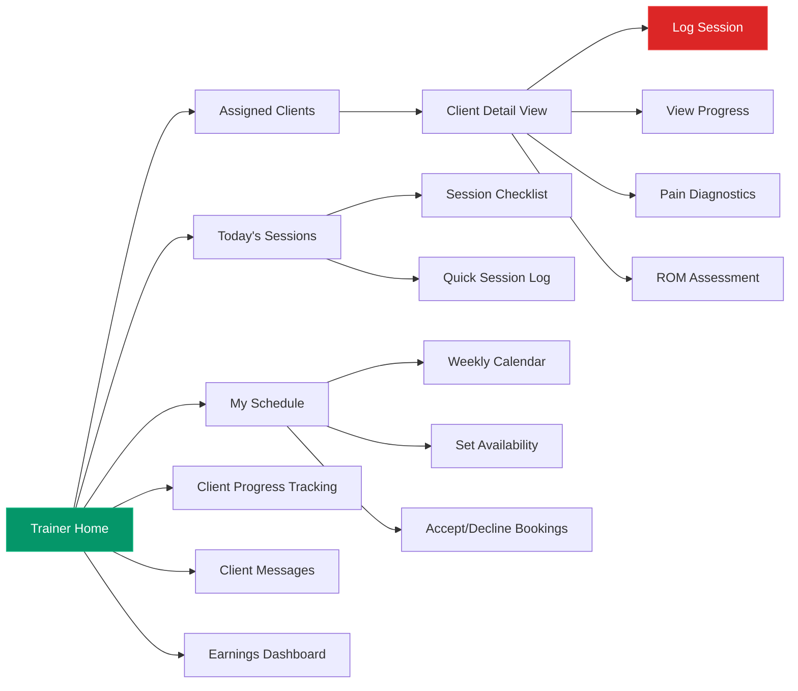

# SwanStudios Dashboard Master Architecture
**Version:** 1.0
**Date:** 2025-11-08
**Status:** 🔴 CRITICAL REVIEW - NO CODE UNTIL APPROVED
**Owner:** AI Village (All 5 AIs)

---

## 🎯 Executive Summary

This document defines the complete architecture for all SwanStudios dashboards: Admin, Trainer, and Client. This is the single source of truth that all AIs must reference before any dashboard-related work.

**Current Status:**
- 🔴 **Admin Dashboard:** BROKEN - `TypeError: we.div is not a function`
- 🟡 **Trainer Dashboard:** IMPLEMENTATION UNCLEAR
- 🟡 **Client Dashboard:** IMPLEMENTATION UNCLEAR
- 🟡 **Navigation:** INCONSISTENT - Client Onboarding in wrong location

**Priority:** Fix admin dashboard access → Document current state → Complete missing features

---

## 📊 Dashboard Overview Mermaid Diagram

```mermaid
graph TB
    subgraph "Public Routes"
        HOME[Home Page]
        STORE[SwanStudios Store]
        ABOUT[About]
        CONTACT[Contact]
        LOGIN[Login Modal]
        SIGNUP[Signup Modal]
    end

    subgraph "Authentication Layer"
        AUTH{Authentication<br/>Check}
        ROLE{Role<br/>Detection}
    end

    subgraph "Admin Dashboard /dashboard/*"
        ADMIN_HOME[Admin Home<br/>/dashboard/default]

        subgraph "Client Management"
            ADMIN_CLIENTS[Clients Registry<br/>/dashboard/clients]
            ADMIN_ONBOARDING[Client Onboarding<br/>/dashboard/client-onboarding]
            ADMIN_CLIENT_PROGRESS[Client Progress<br/>/dashboard/client-management]
            ADMIN_ASSIGNMENTS[Client-Trainer Assignments<br/>/dashboard/client-trainer-assignments]
        end

        subgraph "Trainer Management"
            ADMIN_TRAINERS[Trainers<br/>/dashboard/trainers]
            ADMIN_TRAINER_PERMS[Trainer Permissions<br/>/dashboard/trainers/permissions]
        end

        subgraph "Business Operations"
            ADMIN_SESSIONS[Sessions<br/>/dashboard/admin-sessions]
            ADMIN_PACKAGES[Packages<br/>/dashboard/packages]
            ADMIN_REVENUE[Revenue Analytics<br/>/dashboard/revenue]
            ADMIN_ORDERS[Pending Orders<br/>/dashboard/orders]
        end

        subgraph "Platform Management"
            ADMIN_USERS[User Management<br/>/dashboard/user-management]
            ADMIN_CONTENT[Content Moderation<br/>/dashboard/content]
            ADMIN_NOTIFICATIONS[Notifications<br/>/dashboard/notifications]
            ADMIN_GAMIFICATION[Gamification<br/>/dashboard/gamification]
        end

        subgraph "System & AI"
            ADMIN_MCP[MCP Servers<br/>/dashboard/mcp-servers]
            ADMIN_ANALYTICS[Analytics<br/>/dashboard/analytics]
            ADMIN_SYSTEM[System Health<br/>/dashboard/system]
            ADMIN_SECURITY[Security<br/>/dashboard/security]
            ADMIN_SETTINGS[Settings<br/>/dashboard/settings]
        end

        subgraph "Advanced Features"
            ADMIN_SCHEDULE[Master Schedule<br/>/dashboard/admin/master-schedule]
            ADMIN_EXERCISES[Exercise Library<br/>/dashboard/exercises]
            ADMIN_SOCIAL[Social Media<br/>/dashboard/social]
            ADMIN_BUSINESS_INTEL[Business Intelligence<br/>/dashboard/business-intelligence]
        end
    end

    subgraph "Trainer Dashboard /trainer-dashboard"
        TRAINER_HOME[Trainer Home]
        TRAINER_CLIENTS[My Clients]
        TRAINER_SCHEDULE[My Schedule]
        TRAINER_SESSIONS[Session Logging]
        TRAINER_PROGRESS[Client Progress]
        TRAINER_MESSAGES[Messages]
        TRAINER_EARNINGS[Earnings]
    end

    subgraph "Client Dashboard /client-dashboard"
        CLIENT_HOME[Client Home]
        CLIENT_PROGRESS[My Progress]
        CLIENT_WORKOUTS[My Workouts]
        CLIENT_NUTRITION[Nutrition Plan]
        CLIENT_SCHEDULE[My Schedule]
        CLIENT_GAMIFICATION[Gamification Hub<br/>/gamification]
        CLIENT_MESSAGES[Messages]
        CLIENT_STORE[Store Access]
    end

    HOME --> AUTH
    LOGIN --> AUTH
    SIGNUP --> AUTH
    AUTH -->|Success| ROLE
    AUTH -->|Fail| LOGIN

    ROLE -->|admin| ADMIN_HOME
    ROLE -->|trainer| TRAINER_HOME
    ROLE -->|client| CLIENT_HOME

    ADMIN_HOME --> ADMIN_CLIENTS
    ADMIN_CLIENTS --> ADMIN_ONBOARDING
    ADMIN_HOME --> ADMIN_TRAINERS
    ADMIN_HOME --> ADMIN_SESSIONS
    ADMIN_HOME --> ADMIN_PACKAGES
    ADMIN_HOME --> ADMIN_USERS
    ADMIN_HOME --> ADMIN_MCP

    style ADMIN_HOME fill:#1e3a8a,stroke:#3b82f6,color:#fff
    style TRAINER_HOME fill:#059669,stroke:#10b981,color:#fff
    style CLIENT_HOME fill:#7c3aed,stroke:#a78bfa,color:#fff
    style AUTH fill:#dc2626,stroke:#ef4444,color:#fff
    style ROLE fill:#ea580c,stroke:#f97316,color:#fff
```



---

## 🏗️ Dashboard Architecture Details

### 1️⃣ Admin Dashboard (`/dashboard/*`)

**Layout Component:** `UnifiedAdminDashboardLayout.tsx`
**Main View:** `admin-dashboard-view.tsx`
**Sidebar:** `AdminStellarSidebar.tsx`
**Theme:** Executive Command Intelligence (🔴 NEEDS MIGRATION TO GALAXY-SWAN)

#### Routes Structure
```
/dashboard
├── /default (main overview)
├── /analytics (user analytics)
├── /user-management (all users)
├── /trainers (trainer management)
│   └── /permissions (trainer permissions)
├── /client-trainer-assignments (assign trainers to clients)
├── /client-management (client progress view)
├── /clients (client registry - ClientsManagementSection)
├── /client-onboarding (✅ NEW - onboarding wizard)
├── /packages (package management)
├── /admin-sessions (session management)
├── /admin/master-schedule (calendar/scheduling)
├── /admin-packages (package admin)
├── /content (content moderation)
├── /revenue (revenue analytics)
├── /orders (pending orders)
├── /gamification (gamification admin)
├── /notifications (notification management)
├── /mcp-servers (MCP/AI configuration)
├── /settings (admin settings)
├── /system (system health)
├── /security (security monitoring)
├── /exercises (exercise library admin)
├── /social (social media management)
└── /business-intelligence (BI suite)
```

#### Feature Inventory

**✅ IMPLEMENTED (need verification after fixing `we.div` error):**
- Client Management (ClientsManagementSection)
- Package Management (PackagesManagementSection)
- Content Moderation (ContentModerationSection)
- Notifications (NotificationsSection)
- MCP Servers (MCPServersSection)
- Settings (AdminSettingsSection)
- User Management (ModernUserManagementSystem)
- Trainer Management (TrainersManagementSection)
- Trainer Permissions (TrainerPermissionsManager)
- Client-Trainer Assignments (ClientTrainerAssignments)
- Client Progress View (AdminClientProgressView)
- Session Management (EnhancedAdminSessionsView)
- Master Schedule (AdminScheduleIntegration)
- Package Admin (AdminPackagesView)
- Gamification Admin (AdminGamificationView)
- Exercise Library (AdminExerciseCommandCenter)
- **Client Onboarding (ClientOnboardingWizard)** ✅ JUST ADDED

**⚠️ PARTIALLY IMPLEMENTED:**
- Revenue Analytics (RevenueAnalyticsPanel - component exists, needs route)
- Pending Orders (PendingOrdersAdminPanel - component exists, needs route)
- User Analytics (UserAnalyticsPanel - component exists, route exists)
- System Health (SystemHealthPanel - component exists, needs route)
- Security Monitoring (SecurityMonitoringPanel - component exists, needs route)

**❌ MISSING:**
- Social Media Management (component exists, lazy-loaded, needs verification)
- Business Intelligence Suite (component exists, lazy-loaded, needs verification)
- Performance Reports (PerformanceReportsPanel - component exists, needs route)
- Admin Social Management (AdminSocialManagementView - component exists, needs route)
- NASM Compliance (NASMCompliancePanel - component exists, needs route)

---

### 2️⃣ Trainer Dashboard (`/trainer-dashboard`)

**Status:** 🟡 IMPLEMENTATION UNCLEAR - Route exists but actual implementation not verified

**Expected Features (Based on PERSONAL-TRAINING-MASTER-BLUEPRINT-V3.0.md):**



**Required Trainer Features:**
- [ ] View assigned clients (from `client_trainer_assignments` table)
- [ ] Log training sessions
- [ ] Track client progress (ROM, strength, pain)
- [ ] Session checklist and quick logging
- [ ] Weekly schedule view
- [ ] Set availability
- [ ] Accept/decline session bookings
- [ ] Client messaging
- [ ] Earnings dashboard (session count × rate)
- [ ] Pain diagnostics (photo intake & analysis)
- [ ] ROM assessment tools

**Database Tables Used:**
- `client_trainer_assignments` (which clients assigned)
- `training_sessions` (session history)
- `clients_pii` (client data - LIMITED ACCESS)
- `masterPromptJson` (client goals, preferences)

---

### 3️⃣ Client Dashboard (`/client-dashboard`)

**Status:** 🟡 IMPLEMENTATION UNCLEAR - Route exists but actual implementation not verified

**Expected Features (Based on CLIENT-TO-UI-INTEGRATION-ARCHITECTURE.md):**

```mermaid
graph TB
    CLIENT_HOME[Client Dashboard Home] --> TODAY[Today's Focus]
    CLIENT_HOME --> PROGRESS[My Progress]
    CLIENT_HOME --> WORKOUTS[My Workouts]
    CLIENT_HOME --> NUTRITION[Nutrition Plan]
    CLIENT_HOME --> SCHEDULE[My Schedule]
    CLIENT_HOME --> GAMIFICATION[Gamification Hub]
    CLIENT_HOME --> MESSAGES[Messages & Support]
    CLIENT_HOME --> UPLOADS[Photo/Video Uploads]
    CLIENT_HOME --> STORE[SwanStudios Store]

    TODAY --> DAILY_WORKOUT[Today's Workout]
    TODAY --> CHECK_IN[Daily Check-In]
    TODAY --> COACH_TIP[AI Coach Tip]

    PROGRESS --> ROM_CHART[ROM Progress Chart]
    PROGRESS --> STRENGTH_CHART[Strength Progress]
    PROGRESS --> PAIN_CHART[Pain Reduction]
    PROGRESS --> WEIGHT_CHART[Weight Tracking]
    PROGRESS --> PHOTOS[Progress Photos]

    WORKOUTS --> CURRENT_PROGRAM[Current Program]
    WORKOUTS --> EXERCISE_LIB[Exercise Library]
    WORKOUTS --> VIDEO_DEMO[Video Demonstrations]

    NUTRITION --> MEAL_PLAN[Meal Plan]
    NUTRITION --> SUPPLEMENTS[Supplement Protocol]
    NUTRITION --> FOOD_SCANNER[Food Scanner]
    NUTRITION --> MACRO_TRACKER[Macro Tracker]

    SCHEDULE --> CALENDAR[Calendar View]
    SCHEDULE --> BOOK_SESSION[Book Session]
    SCHEDULE --> UPCOMING[Upcoming Sessions]

    GAMIFICATION --> XP_POINTS[XP & Points]
    GAMIFICATION --> ACHIEVEMENTS[Achievements]
    GAMIFICATION --> BATTLE_PASS[Battle Pass]
    GAMIFICATION --> LEADERBOARD[Leaderboard]
    GAMIFICATION --> REFERRALS[Referral Rewards]

    style CLIENT_HOME fill:#7c3aed,stroke:#a78bfa,color:#fff
    style COACH_TIP fill:#059669,stroke:#10b981,color:#fff
    style GAMIFICATION fill:#dc2626,stroke:#ef4444,color:#fff
```



**Required Client Features:**
- [ ] Today's workout display (from current program)
- [ ] Daily check-in form (pain, energy, mood)
- [ ] AI Coach tips (powered by Coach Cortex)
- [ ] Progress charts (ROM, strength, pain, weight)
- [ ] Progress photo upload and timeline
- [ ] Current workout program display
- [ ] Exercise library with video demos
- [ ] Personalized meal plan
- [ ] Supplement protocol
- [ ] Food scanner integration
- [ ] Macro tracker
- [ ] Calendar view of sessions
- [ ] Book/reschedule sessions
- [ ] Gamification hub (XP, achievements, battle pass)
- [ ] Message trainer
- [ ] Support chat
- [ ] Store access

**Data Sources:**
- `masterPromptJson` (client profile, goals, preferences)
- `training_sessions` (workout history)
- `client_progress` (ROM, strength, pain data)
- `gamification` tables (XP, achievements, points)
- Coach Cortex AI (personalized coaching tips)

---

## 🎨 Design Protocol

### Current Theme Issue
**CRITICAL:** Admin Dashboard uses custom "Executive Command Intelligence" theme that conflicts with the universal "Galaxy-Swan" theme used throughout the rest of the application.

**Executive Theme Colors (Current):**
```typescript
const executiveCommandTheme = {
  colors: {
    deepSpace: '#0a0a0f',
    commandNavy: '#1e3a8a',
    stellarAuthority: '#3b82f6',
    cyberIntelligence: '#0ea5e9',
    executiveAccent: '#0891b2',
    // ... more custom colors
  }
}
```

**Galaxy-Swan Theme (Universal - Should Be Used):**
```typescript
// Defined in UniversalThemeContext and used throughout app
{
  primary: '#00d9ff',      // Cyan
  primaryLight: '#4de6ff',
  accent: '#ff4081',       // Pink
  accentLight: '#ff6b9d',
  background: 'rgba(8, 8, 20, 0.95)',
  // ... consistent with rest of app
}
```

### Design Token Requirements

**Colors:**
- Primary: `#00d9ff` (Galaxy cyan)
- Accent: `#ff4081` (Cosmic pink)
- Background: `rgba(8, 8, 20, 0.95)` (Deep space)
- Text: `rgba(255, 255, 255, 0.87)` (High contrast white)
- Surface: `rgba(16, 16, 32, 0.9)` (Card backgrounds)

**Typography:**
- Font Family: System fonts with fallback
- Heading Scale: 2rem / 1.5rem / 1.25rem / 1rem
- Body: 0.95rem / 0.9rem
- Weight: 400 (normal), 500 (medium), 600 (semibold), 700 (bold)

**Spacing:**
- Base Unit: 8px
- Scale: 4px, 8px, 12px, 16px, 24px, 32px, 48px, 64px
- Container Padding: 24px (desktop), 16px (tablet), 12px (mobile)

**Border Radius:**
- Small: 8px (buttons, inputs)
- Medium: 12px (cards, modals)
- Large: 16px (major containers)

**Shadows:**
- Level 1: `0 2px 8px rgba(0, 0, 0, 0.1)`
- Level 2: `0 4px 16px rgba(0, 0, 0, 0.15)`
- Level 3: `0 8px 32px rgba(0, 0, 0, 0.2)`
- Glow: `0 0 20px rgba(0, 217, 255, 0.3)` (interactive elements)

**Motion:**
- Duration: 200-300ms (micro), 400-500ms (macro)
- Easing: `cubic-bezier(0.4, 0, 0.2, 1)` (standard)
- Page Transitions: 600ms with stagger

---

## 🔧 Technical Implementation

### File Structure
```
frontend/src/components/DashBoard/
├── UnifiedAdminDashboardLayout.tsx (main admin layout)
├── index.ts (exports)
├── MainLayout/
│   └── SideBar/
│       ├── sidebar.tsx
│       └── sidebar-drawer.tsx
├── Pages/
│   ├── admin-dashboard/
│   │   ├── admin-dashboard-view.tsx (main view)
│   │   ├── AdminStellarSidebar.tsx (left nav)
│   │   ├── TrainersManagementSection.tsx
│   │   ├── components/ (analytics panels, etc.)
│   │   └── sections/
│   │       ├── ClientsManagementSection.tsx
│   │       ├── PackagesManagementSection.tsx
│   │       ├── ContentModerationSection.tsx
│   │       ├── NotificationsSection.tsx
│   │       ├── MCPServersSection.tsx
│   │       └── AdminSettingsSection.tsx
│   ├── admin-sessions/
│   │   └── enhanced-admin-sessions-view.tsx
│   ├── admin-client-progress/
│   │   └── admin-client-progress-view.V2.tsx
│   ├── admin-packages/
│   │   └── admin-packages-view.tsx
│   ├── admin-gamification/
│   │   └── admin-gamification-view.tsx
│   ├── admin-exercises/
│   │   └── index.tsx
│   └── user-management/
│       └── modern-user-management.tsx
├── ClientDashboard/
│   └── (client dashboard components)
└── TrainerDashboard/
    └── (trainer dashboard components)
```

### Current Issues

#### 1. 🔴 CRITICAL: Admin Dashboard Runtime Error
**Error:** `TypeError: we.div is not a function`

**Location:** Production build of `UnifiedAdminDashboardLayout.tsx`

**Likely Causes:**
1. Multiple instances of `styled-components` in production bundle
2. Import/export mismatch causing `styled` to be undefined
3. Minification issue where `styled` is aliased to `we` but not available
4. Service Worker cache serving stale chunks
5. Vite build configuration missing dedupe for styled-components

**Impact:** Admin dashboard completely inaccessible

**Debug Steps Required:**
1. Verify `styled-components` version in `package.json`
2. Check for duplicate styled-components in bundle
3. Verify Vite config has `resolve.dedupe: ['styled-components']`
4. Clear service worker cache with `emergencyCacheClear()`
5. Check import statement in `UnifiedAdminDashboardLayout.tsx:26`
   ```typescript
   import styled, { ThemeProvider, createGlobalStyle } from 'styled-components';
   ```
6. Verify production build doesn't split styled-components across chunks

#### 2. 🟡 Navigation Inconsistency
**Issue:** Client Onboarding link was added to main header

**Current State:**
- ❌ Link removed from `NavigationLinks.tsx` (header) - CORRECT
- ❌ Link removed from `MobileMenu.tsx` - CORRECT
- ⚠️ Link NOT added to `AdminStellarSidebar.tsx` yet - NEEDS IMPLEMENTATION

**Correct Flow:**
1. Admin logs in → Redirected to `/dashboard/default`
2. Admin sees `AdminStellarSidebar` with navigation items
3. Admin clicks "Client Onboarding" in sidebar
4. Routed to `/dashboard/client-onboarding`
5. `ClientOnboardingWizard` renders within admin layout

#### 3. 🟡 Theme Inconsistency
**Issue:** Admin dashboard uses different theme than rest of app

**Current:** Custom `executiveCommandTheme` defined in `UnifiedAdminDashboardLayout.tsx`

**Should Be:** Use `useUniversalTheme()` hook to get Galaxy-Swan theme

**Migration Plan:**
1. Remove `executiveCommandTheme` object
2. Remove `<ThemeProvider theme={executiveCommandTheme}>` wrapper
3. Update all styled-components to use theme from context:
   ```typescript
   const { theme } = useUniversalTheme();
   // Use theme.colors.primary instead of props.theme.colors.stellarAuthority
   ```
4. Update `AdminStellarSidebar` to use universal theme
5. Ensure all admin components use consistent Galaxy-Swan aesthetic

---

## 📋 Acceptance Criteria

### Admin Dashboard
- [ ] **Loads without errors** - No `we.div` or other runtime errors
- [ ] **Routing works** - All `/dashboard/*` routes accessible
- [ ] **Authentication enforced** - Only admin role can access
- [ ] **Client Onboarding accessible** - Link in sidebar, wizard renders correctly
- [ ] **Theme consistent** - Uses Galaxy-Swan theme throughout
- [ ] **All sections load** - Every route renders its component
- [ ] **Navigation works** - Sidebar navigation functional
- [ ] **Responsive** - Works on desktop, tablet, mobile
- [ ] **Performance** - Loads in < 3 seconds
- [ ] **No console errors** - Clean JavaScript console

### Trainer Dashboard
- [ ] **Route accessible** - `/trainer-dashboard` loads
- [ ] **Assigned clients displayed** - Shows trainer's assigned clients only
- [ ] **Session logging works** - Can log training sessions
- [ ] **Progress tracking** - Can view client progress charts
- [ ] **Schedule management** - Can view and manage schedule
- [ ] **Messaging functional** - Can message assigned clients
- [ ] **Earnings visible** - Shows session count and earnings

### Client Dashboard
- [ ] **Route accessible** - `/client-dashboard` loads
- [ ] **Today's workout** - Displays current workout
- [ ] **Progress charts** - Shows ROM, strength, pain trends
- [ ] **Meal plan visible** - Displays personalized nutrition
- [ ] **Gamification hub** - XP, achievements, points functional
- [ ] **Schedule access** - Can view and book sessions
- [ ] **AI Coach tips** - Powered by Coach Cortex
- [ ] **Store integration** - Can access SwanStudios store

---

## 🚀 Implementation Priority Order

### Phase 1: CRITICAL FIXES (DO FIRST)
1. **Fix Admin Dashboard `we.div` Error**
   - Debug styled-components issue
   - Verify production build configuration
   - Clear service worker caches
   - Test admin dashboard loads

2. **Add Client Onboarding to Admin Sidebar**
   - Update `AdminStellarSidebar.tsx`
   - Add navigation item for `/dashboard/client-onboarding`
   - Test navigation flow

3. **Unify Theme**
   - Migrate admin dashboard from Executive theme to Galaxy-Swan
   - Update all admin components to use `useUniversalTheme()`
   - Verify consistent styling

### Phase 2: DOCUMENTATION (PARALLEL TO PHASE 1)
1. **Create Trainer Dashboard Documentation**
   - Document expected features
   - Create flow diagrams
   - Define acceptance criteria

2. **Create Client Dashboard Documentation**
   - Document expected features
   - Create UI wireframes
   - Define data sources

3. **Create Design Protocol Document**
   - Extract and document all design tokens
   - Create component library documentation
   - Define pixel-perfect standards

### Phase 3: FEATURE COMPLETION (AFTER APPROVAL)
1. **Verify/Complete Trainer Dashboard**
   - Audit existing implementation
   - Implement missing features
   - Test trainer workflow

2. **Verify/Complete Client Dashboard**
   - Audit existing implementation
   - Implement missing features
   - Test client experience

3. **Add Missing Admin Routes**
   - Social Media Management
   - Business Intelligence
   - Performance Reports
   - NASM Compliance

---

## 🤖 AI Collaboration Protocol

### Review Requirements
**NO CODE CHANGES until 5/5 AI approvals:**

1. **Claude Code (Architect)** - Architecture, routing, technical implementation
2. **MinMax v2 (Designer)** - UX flow, visual design, pixel-perfection
3. **Gemini (Data Specialist)** - Data flow, API integration, performance
4. **ChatGPT-5 (Feature Validator)** - Feature completeness, user experience
5. **Kilo Code (Quality Assurance)** - Testing, edge cases, accessibility

### Approval Process
1. Claude Code creates analysis and proposes changes
2. Document shared in AI Village review channel
3. Each AI reviews and provides feedback
4. Changes made to address feedback
5. Final approval vote (5/5 required)
6. Implementation begins only after approval

### Communication Format
Each AI review must include:
- ✅ Approved aspects
- ⚠️ Concerns or suggested changes
- ❌ Blocking issues
- 📝 Additional recommendations

---

## 📚 Related Documentation

**AI Village Core:**
- `AI-Village-Documentation/SWANSTUDIOS-AI-VILLAGE-HANDBOOK-FINAL.md`
- `AI-Village-Documentation/AI-VILLAGE-MASTER-ONBOARDING-PROMPT-V2.md`

**Design & UX:**
- `docs/ai-workflow/ENHANCED-DESIGN-MASTER-PROMPT.md`
- `docs/ai-workflow/CLIENT-TO-UI-INTEGRATION-ARCHITECTURE.md`

**Features:**
- `docs/ai-workflow/ONBOARDING-TO-DATABASE-PIPELINE-COMPLETE.md`
- `docs/ai-workflow/PERSONAL-TRAINING-MASTER-BLUEPRINT-V3.0.md`
- `docs/ai-workflow/COACH-CORTEX-V3.0-ULTIMATE.md`

**Implementation:**
- `frontend/src/components/DashBoard/UnifiedAdminDashboardLayout.tsx`
- `frontend/src/components/DashBoard/Pages/admin-dashboard/admin-dashboard-view.tsx`
- `frontend/src/routes/main-routes.tsx`

---

## 🔍 Next Actions

### For Claude Code (Me)
1. Create detailed root cause analysis for `we.div` error
2. Create minimal change proposal (diffs only)
3. Create AI review prompts for other AIs
4. Wait for AI Village approval before implementing

### For User
1. Review this master architecture document
2. Share with other AIs for feedback
3. Approve priority order
4. Confirm when to begin Phase 1 fixes

---

**Document Status:** 📋 AWAITING AI VILLAGE REVIEW
**Last Updated:** 2025-11-08
**Next Review:** After all 5 AIs provide feedback
