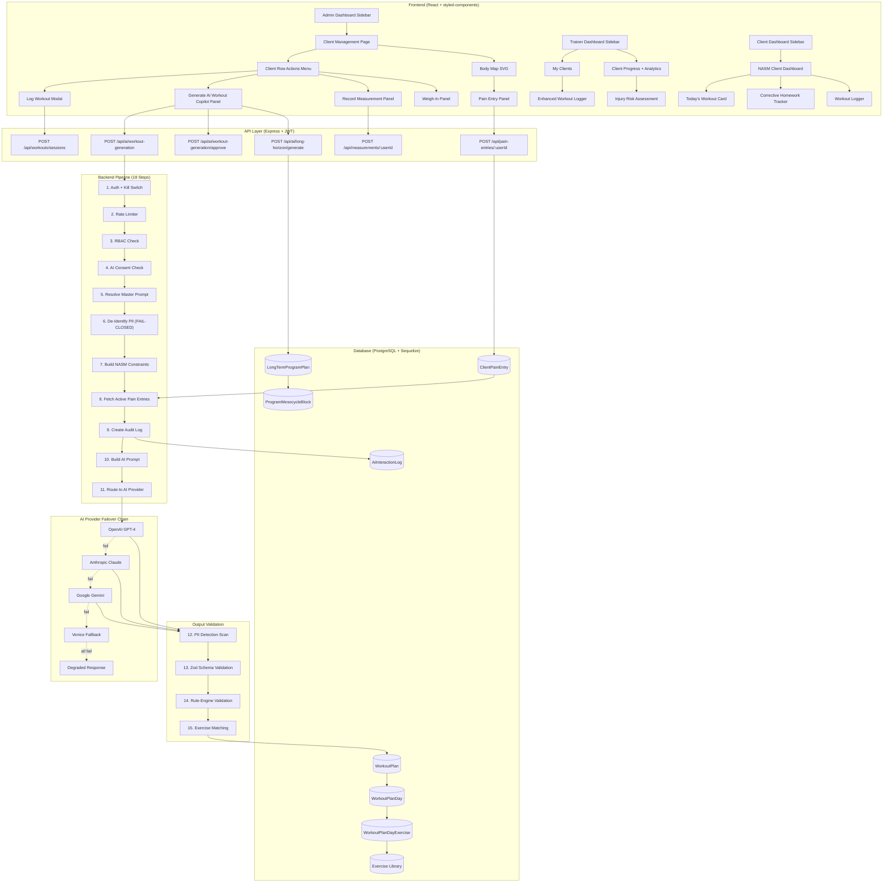
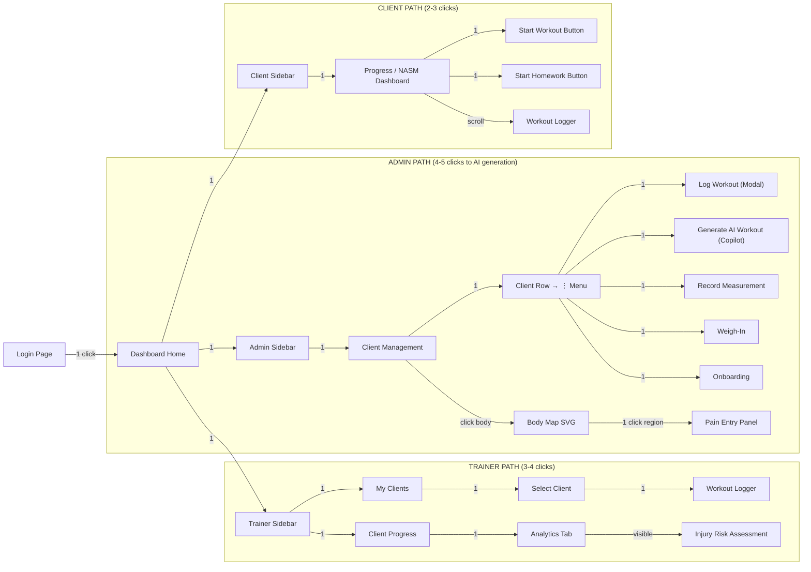
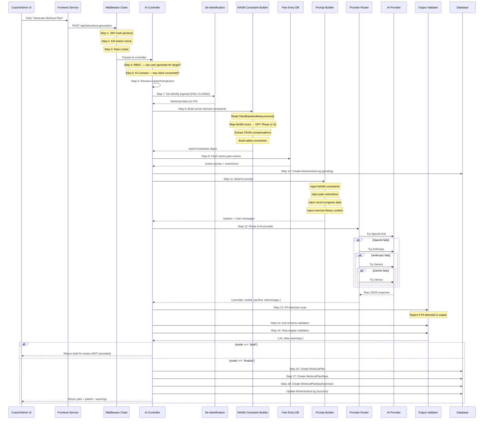
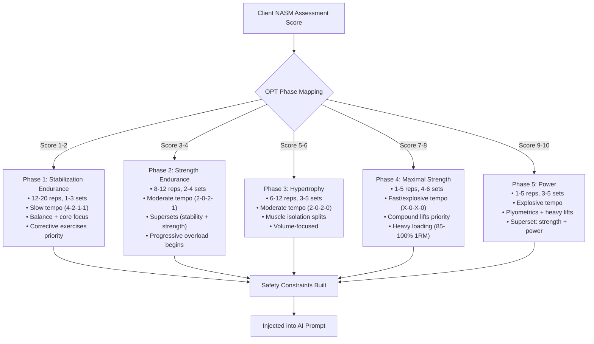
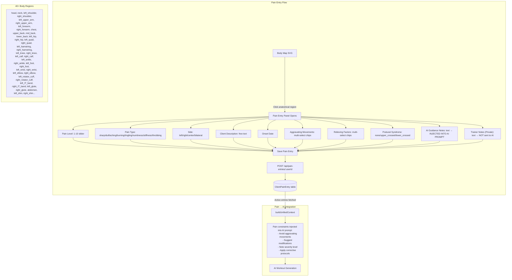
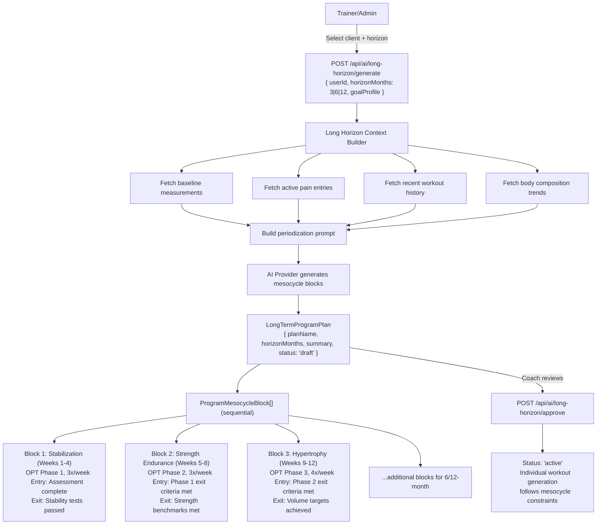
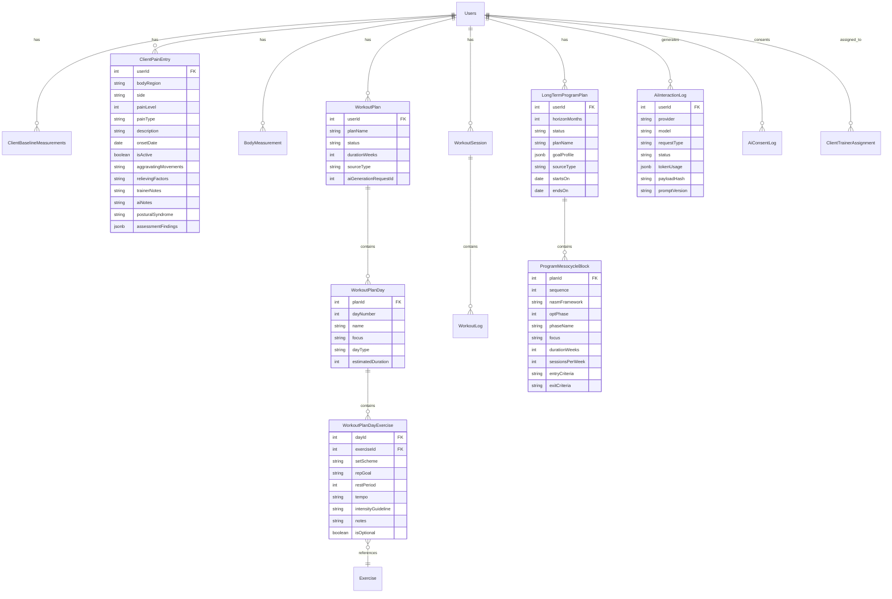

# SwanStudios NASM AI Workout Generation System — Full Blueprint

> **Purpose:** Give any AI assistant (Claude, GPT, Gemini) a complete understanding of how the NASM AI workout system works end-to-end: UI → Backend → AI Provider → Database. Includes navigation paths, click counts, architecture diagrams, and gap analysis.

---

## 1. SYSTEM ARCHITECTURE (High-Level)



---

## 2. UI NAVIGATION — CLICK PATH MAP



### Click Count Summary

| Action | Role | Clicks from Login | Route |
|--------|------|-------------------|-------|
| View Dashboard | Any | 1 | `/dashboard/{role}/overview` |
| Open Client List | Admin | 2 | `/dashboard/admin/client-management` |
| Log a Workout | Admin | 4 | Client Mgmt → Row → Log Workout |
| **Generate AI Workout** | **Admin** | **4** | Client Mgmt → Row → Generate AI |
| Record Measurement | Admin | 4 | Client Mgmt → Row → Measurement |
| Open Body Map | Admin | 3+ | Client Mgmt → Body Map tab |
| **Log Pain Entry** | **Admin** | **5+** | Body Map → Click Region → Fill Form |
| View Client Progress | Admin | 2 | `/dashboard/admin/client-progress-tracking` |
| Log a Workout | Trainer | 3 | Sidebar → Log Workout |
| View Injury Risk | Trainer | 3 | Progress → Analytics tab |
| Start Today's Workout | Client | 3 | Sidebar → Progress → Start |
| Start Homework | Client | 3 | Sidebar → Progress → Start Homework |

---

## 3. AI WORKOUT GENERATION PIPELINE (Detailed 18-Step Flow)



---

## 4. NASM OPT MODEL INTEGRATION



### NASM Constraint Object (Server-Derived)
```json
{
  "optPhase": 3,
  "phaseName": "hypertrophy",
  "repRange": "6-12",
  "setRange": "3-5",
  "tempoGuideline": "2-0-2-0",
  "restPeriod": "60-90s",
  "overheadSquatCompensations": {
    "anteriorView": ["knee_valgus", "foot_pronation"],
    "lateralView": ["excessive_forward_lean"]
  },
  "posturalDeviations": ["upper_crossed_syndrome"],
  "correctiveExerciseFocus": ["hip_flexor_release", "thoracic_extension"],
  "medicalClearanceRequired": false,
  "maxIntensityPct": 85,
  "movementRestrictions": ["avoid_overhead_press_until_thoracic_mobility_improves"]
}
```

---

## 5. PAIN / INJURY LOGGING SYSTEM



### NASM Corrective Exercise Protocol (4-Phase, from Pain Data)
```
INHIBIT   → SMR / Foam Rolling on overactive muscles
LENGTHEN  → Static/dynamic stretching on tight tissues
ACTIVATE  → Isolation exercises for underactive muscles
INTEGRATE → Functional compound movements
```

---

## 6. LONG-HORIZON PROGRAM GENERATION (3/6/12-Month Plans)



---

## 7. DATABASE SCHEMA (Workout + AI Section)



---

## 8. RBAC AUTHORIZATION MATRIX

| Operation | Client | Trainer | Admin |
|-----------|:------:|:-------:|:-----:|
| View own workout progress | ✅ | — | — |
| Start assigned workout | ✅ | — | — |
| Complete homework | ✅ | — | — |
| View assigned client data | — | ✅ | ✅ |
| Log workout for client | — | ✅ | ✅ |
| Generate AI workout plan | — | ✅ (assigned) | ✅ (all) |
| Approve AI draft | — | ✅ (assigned) | ✅ (all) |
| Generate long-horizon plan | — | ✅ (assigned) | ✅ (all) |
| Create pain entry | ✅ (own) | ✅ (assigned) | ✅ (all) |
| View pain entries | ✅ (own) | ✅ (assigned) | ✅ (all) |
| Resolve pain entry | — | ✅ (assigned) | ✅ (all) |
| Delete pain entry | — | — | ✅ |
| Record measurements | — | ✅ (assigned) | ✅ (all) |
| View injury risk assessment | — | ✅ | ✅ |

---

## 9. KEY FILES REFERENCE

### Frontend
| Component | Path | Purpose |
|-----------|------|---------|
| WorkoutCopilotPanel | `frontend/src/components/DashBoard/Pages/admin-clients/components/WorkoutCopilotPanel.tsx` | AI generation UI with draft→approve flow |
| WorkoutLoggerModal | `frontend/src/components/DashBoard/Pages/admin-clients/components/WorkoutLoggerModal.tsx` | Manual workout logging modal |
| WorkoutLogger | `frontend/src/components/WorkoutLogger/WorkoutLogger.tsx` | Standalone workout logger component |
| MobileWorkoutLogger | `frontend/src/components/WorkoutLogger/MobileWorkoutLogger.tsx` | Mobile-optimized variant |
| BodyMapSVG | `frontend/src/components/BodyMap/BodyMapSVG.tsx` | Interactive SVG body with front/back views |
| PainEntryPanel | `frontend/src/components/BodyMap/PainEntryPanel.tsx` | Slide-out pain entry form |
| bodyRegions | `frontend/src/components/BodyMap/bodyRegions.ts` | 40+ body region definitions |
| NASMClientDashboard | `frontend/src/components/Client/NASM/NASMClientDashboard.tsx` | Client-facing NASM workout dashboard |
| InjuryRiskAssessment | `frontend/src/components/TrainerDashboard/ClientProgress/Analytics/InjuryRiskAssessment.tsx` | Trainer analytics view |
| AdminClientManagementView | `frontend/src/components/DashBoard/Pages/admin-clients/AdminClientManagementView.tsx` | Admin client management (triggers modals) |
| aiWorkoutService | `frontend/src/services/aiWorkoutService.ts` | Typed API service for AI generation |
| painEntryService | `frontend/src/services/painEntryService.ts` | Typed API service for pain CRUD |

### Backend
| Component | Path | Purpose |
|-----------|------|---------|
| aiWorkoutController | `backend/controllers/aiWorkoutController.mjs` | 18-step workout generation pipeline |
| longHorizonController | `backend/controllers/longHorizonController.mjs` | 3/6/12-month plan generation |
| painEntryController | `backend/controllers/painEntryController.mjs` | Pain CRUD with RBAC |
| aiRoutes | `backend/routes/aiRoutes.mjs` | AI endpoint routing + middleware |
| painEntryRoutes | `backend/routes/painEntryRoutes.mjs` | Pain endpoint routing |
| workoutRoutes | `backend/routes/workoutRoutes.mjs` | 19 workout endpoints |
| providerRouter | `backend/services/ai/providerRouter.mjs` | Multi-provider failover (OpenAI → Claude → Gemini → Venice) |
| promptBuilder | `backend/services/ai/promptBuilder.mjs` | AI prompt construction |
| contextBuilder | `backend/services/ai/contextBuilder.mjs` | Unified context (NASM + pain + progress) |
| deIdentificationService | `backend/services/ai/deIdentificationService.mjs` | PII removal (FAIL-CLOSED) |
| outputValidator | `backend/services/ai/outputValidator.mjs` | Response validation pipeline |
| ClientPainEntry | `backend/models/ClientPainEntry.mjs` | Pain entry schema (40+ body regions) |
| WorkoutPlan | `backend/models/WorkoutPlan.mjs` | Generated plan record |
| LongTermProgramPlan | `backend/models/LongTermProgramPlan.mjs` | Periodization master plan |
| ProgramMesocycleBlock | `backend/models/ProgramMesocycleBlock.mjs` | Individual mesocycle blocks |
| AiInteractionLog | `backend/models/AiInteractionLog.mjs` | Full audit trail |

---

## 10. GAP ANALYSIS — WEAKEST LINKS

### 🔴 CRITICAL GAPS

| Gap | Impact | Current State | What's Missing |
|-----|--------|---------------|----------------|
| **Pain Entry UI not wired into Client Management flow** | Trainers may not log injuries before generating workouts | BodyMap + PainEntryPanel exist as components but aren't prominently surfaced in AdminClientManagementView action menu | Need a "Log Injury/Pain" button in client row actions (same level as "Log Workout") |
| **No pain entry reminder before AI generation** | AI may generate plans without knowing about new injuries | WorkoutCopilotPanel doesn't check for recent pain entries or prompt trainer | Add pre-generation check: "This client has X active pain entries. Review before generating?" |
| **Client cannot self-report pain** | Clients must wait for trainer to log pain | PainEntry routes require admin/trainer role for creation | Add client-facing pain self-report with trainer approval workflow |
| **No real-time notification when AI plan completes** | Trainers may sit waiting on generation screen | No WebSocket/SSE for async notification | Add push notification when generation completes |

### 🟡 MODERATE GAPS

| Gap | Impact | Current State | What's Missing |
|-----|--------|---------------|----------------|
| **5+ clicks to log pain** | Friction reduces injury tracking compliance | Body Map → Click Region → Fill Form → Save | Surface pain logger as 1st-class action in client row menu (3 clicks) |
| **No pain history visualization** | Can't track pain trends over time | Pain entries stored but no timeline/chart view | Add pain trend chart (severity over time, per body region) |
| **Injury Risk Assessment disconnected from Pain Entries** | InjuryRiskAssessment uses its own data, not live ClientPainEntry records | Two separate systems with overlapping concerns | Feed live ClientPainEntry data into InjuryRiskAssessment component |
| **No AI generation from Trainer dashboard** | Trainers must use Admin path | WorkoutCopilotPanel only accessible from AdminClientManagementView | Wire Copilot into TrainerDashboard → My Clients view |
| **Long-horizon plan UI incomplete** | No dedicated frontend for 3/6/12-month plan generation | Backend endpoints exist, frontend service types defined, but no UI page | Build LongHorizonPlanBuilder page with mesocycle visualization |
| **No exercise library browser for clients** | Clients see exercise names but can't look up proper form | Exercise model exists but no client-facing exercise detail pages | Add exercise detail modal with video/image demos |

### 🟢 NICE-TO-HAVE

| Gap | Impact | What's Missing |
|-----|--------|----------------|
| AI token cost tracking dashboard | Can't monitor AI spend | Admin widget showing token usage per provider per day |
| Bulk workout generation | Can't generate for class groups | Batch endpoint for multiple clients |
| A/B testing AI providers | Can't compare quality | Feature flag for splitting traffic between providers |
| Workout plan sharing | Clients can't share results socially | Integration with social feed (post workout plan to community) |
| Voice-to-pain entry | Mobile friction for injury reporting | Speech-to-text for pain description field |

### 🗺️ Click Path Optimization Targets

```
CURRENT (worst case):
Login → Dashboard → Sidebar → Client Mgmt → Find Client → ⋮ Menu → Action = 6 clicks

OPTIMIZED (proposed):
Login → Dashboard → Quick Actions Bar → [Log Workout | AI Workout | Log Pain | Measurement] = 3 clicks

Key insight: The dashboard overview page should have a "Quick Actions"
widget showing recent/assigned clients with 1-click action buttons.
```

---

## 11. ENVIRONMENT VARIABLES

```bash
# AI Provider Keys (multi-provider failover)
OPENAI_API_KEY=sk-...
ANTHROPIC_API_KEY=sk-ant-...
GOOGLE_GENERATIVE_AI_API_KEY=AIza...
VENICE_API_KEY=...

# Kill Switch
AI_WORKOUT_GENERATION_ENABLED=true  # Set to 'false' to disable all AI generation

# Database
DATABASE_URL=postgres://...

# JWT
JWT_SECRET=...
```

---

## 12. EXAMPLE API CALLS

### Generate AI Workout (Draft Mode)
```bash
POST /api/ai/workout-generation
Authorization: Bearer {jwt}
Content-Type: application/json

{
  "userId": 42,
  "masterPromptJson": {
    "client": { "name": "John Smith" },
    "goals": { "primary": "strength_building" },
    "package": { "tier": "premium" }
  },
  "mode": "draft"
}
```

### Create Pain Entry
```bash
POST /api/pain-entries/42
Authorization: Bearer {jwt}
Content-Type: application/json

{
  "bodyRegion": "right_shoulder",
  "side": "right",
  "painLevel": 6,
  "painType": "sharp",
  "description": "Sharp pain during overhead press at 90° abduction",
  "onsetDate": "2026-02-28",
  "aggravatingMovements": "overhead_press,lateral_raise",
  "relievingFactors": "ice,rest",
  "posturalSyndrome": "upper_crossed",
  "aiNotes": "Avoid overhead movements. Substitute with landmine press.",
  "trainerNotes": "Possible rotator cuff impingement. Refer to PT if not improving in 2 weeks."
}
```

### Generate Long-Horizon Plan
```bash
POST /api/ai/long-horizon/generate
Authorization: Bearer {jwt}
Content-Type: application/json

{
  "userId": 42,
  "horizonMonths": 3,
  "goalProfile": {
    "primaryGoal": "weight_loss",
    "secondaryGoals": ["core_stability", "improved_posture"],
    "constraints": ["right_shoulder_injury"]
  }
}
```

---

*Generated: 2026-03-04 | Based on full codebase analysis of SwanStudios SS-PT*
