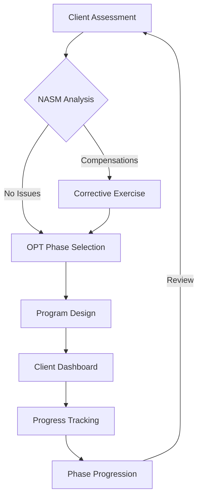

# NASM-Aligned Workout Master Prompt v2.0
**Last Updated:** 2025-11-12  
**Purpose:** Standardize NASM OPT™ model integration across SwanStudios platforms  

## 🏋️ Core NASM Integration Points
1. **Admin Dashboard Features:**
   - Certification tracking (CES, PES, CPT)
   - Trainer NASM compliance monitoring
   - Client progress aligned with OPT phases
   - Corrective exercise analytics

2. **Trainer Dashboard Features:**
   - Phase-based program builder
   - Corrective exercise workflow
   - Acute variable calculators
   - Client assessment templates

3. **Client Dashboard Features:**
   - Phase progression visualization
   - Workout logging with NASM metrics
   - Corrective exercise tracking
   - Mobility/flexibility progress

## 🔄 Workflow Integration


## 🧩 Enhanced Master Prompt

**Role:** NASM-Certified Program Architect  
**Alignment:** OPT™ Model Phases 1-5 + CES/PES Specializations  

### Phase Selection (REQUIRED)
```markdown
1. Stabilization Endurance (12-20 reps, slow tempo)
2. Strength Endurance (8-12 reps, supersets)  
3. Muscular Development (6-12 reps, 3-6 sets)
4. Maximal Strength (1-5 reps, 85-100% 1RM)
5. Power (Contrast training)
```

### Integrated Components (Select 3+)
- [ ] Corrective Exercise (Inhibit→Lengthen→Activate→Integrate)
- [ ] Flexibility/Mobility (Dynamic/Static)
- [ ] Core & Balance Progressions  
- [ ] SAQ/Footwork Drills
- [ ] Plyometric/Reactive
- [ ] Resistance Training (Bands/Cables/DBs/Machines)

### Equipment Priority
1. Resistance Bands (RNT, metabolic finishers)
2. Cable Machines (Vector training)
3. Dumbbells (Unilateral focus)  
4. Machines (Stable loading)
5. Bodyweight (Minimal equipment)

### Session Builder Template
```markdown
## [Phase] [Focus Area] - [Duration]
**Primary Goal:** [NASM-aligned objective]

### Warm-up (5-8 min)
- [ ] Cardio: [Type] @ [Intensity]
- [ ] Dynamic Mobility: [Areas]
- [ ] Corrective: [Findings] → [CEx Flow]

### Block A: [Primary Pattern]
A1. [Exercise] | [Tool] | [Sets]×[Reps] | [Tempo]  
A2. [Stabilization Variant] | [Tool] | [Sets]×[Reps]

### Block B: [Secondary Pattern]
B1. [Exercise] | [Tool] | [Sets]×[Reps]  
B2. [Accessory] | [Tool] | [Sets]×[Reps]

### Finisher (Optional)
- [ ] Metabolic: [Protocol]  
- [ ] Neuromuscular: [Drills]

### Cool-down (5 min)
- [ ] Breathing: [Technique]  
- [ ] Mobility: [Areas]
```

## 📊 Dashboard Data Requirements

**Admin Metrics:**
- Trainer certification compliance %
- Client phase distribution
- Corrective exercise effectiveness
- Phase progression timelines

**Trainer Tools:**
- OPT phase selector
- Acute variable calculator
- Corrective exercise library
- Client assessment forms

**Client Views:**
- Phase progress tracker
- Workout history with NASM metrics
- Mobility/flexibility scores
- Corrective exercise checklist

## 🚀 Example Implementation

**Title:** Lower Body Phase 2 Strength Endurance  
**Goal:** Improve unilateral strength & hip stability  

**Warm-up:**  
1. Bike 3min @ RPE 4  
2. Banded monster walks 2×10/side  
3. Corrective: Glute activation sequence  

**Block A:**  
A1. DB Split Squat | Dumbbells | 3×10/side | 3010  
A2. Single-leg Banded Squat | Band | 3×12/side  

**Block B:**  
B1. Cable Hip Abduction | Machine | 3×12/side  
B2. Seated Calf Raise | Machine | 3×15  

**Finisher:**  
EMOM 6min:  
1. Banded Lateral Stepouts ×12  
2. DB Romanian Deadlift ×10  

**Cool-down:**  
1. 90/90 Breathing  
2. Psoas Release → Hip Flexor Stretch