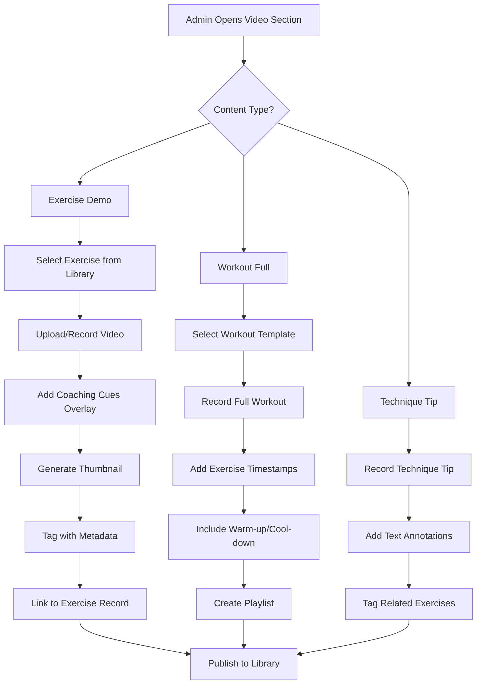
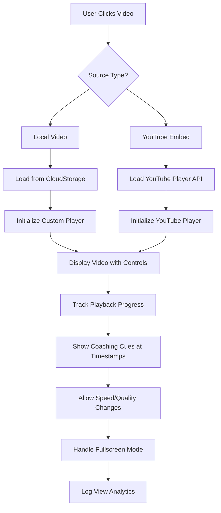

# NASM Video Section Enhancement Prompt

## Executive Summary

After comprehensive review of the NASM × 4-Tier Integration deliverables, a critical gap has been identified: **the lack of a dedicated Video Section for exercise demonstrations and workout examples**. The user requires a modern, enhanced video platform that serves as their "own YouTube but better" for NASM training content.

## Critical Missing Component: Video Section (URGENT - Blocks Content Creation)

**Status**: ❌ Not Implemented
**Impact**: Cannot create or manage video content for exercises and workouts
**Estimated Time**: 20-25 hours

### Video Section Requirements

**Core Functionality**:
1. **Video Library Management**: Upload, organize, and manage exercise demonstration videos
2. **Workout Video Creation**: Record and edit complete workout demonstration videos
3. **Dual Video Sources**: Support both locally hosted videos AND YouTube embeds
4. **Admin Content Creation**: Easy-to-use interface for creating video content
5. **Smart Integration**: Videos automatically link to exercises and workouts in database

**Technical Architecture**:
```typescript
// Database Schema Additions
interface VideoLibrary {
  id: string;
  title: string;
  description: string;
  video_type: 'exercise_demo' | 'workout_full' | 'technique_tip' | 'phase_overview';
  source_type: 'local' | 'youtube';
  local_video_url?: string; // CloudStorage URL
  youtube_video_id?: string; // YouTube video ID
  thumbnail_url: string;
  duration_seconds: number;
  tags: string[];
  related_exercises: string[]; // Exercise IDs
  related_workouts: string[]; // Workout IDs
  opt_phases: number[]; // Applicable phases
  difficulty_level: 'beginner' | 'intermediate' | 'advanced';
  equipment_required: string[];
  created_by_admin_id: string;
  view_count: number;
  like_count: number;
  is_featured: boolean;
  is_private: boolean; // For admin review before publishing
  created_at: Date;
  updated_at: Date;
}
```

**Video Player Features**:
- **Modern Video Player**: Custom player with enhanced controls
- **Playlist Support**: Create workout playlists with multiple exercises
- **Speed Control**: 0.5x to 2x playback speed
- **Quality Selection**: Multiple resolution options
- **Fullscreen Mode**: Immersive viewing experience
- **Progress Tracking**: Resume where you left off
- **Sharing**: Generate shareable links with timestamps

**Content Creation Workflow**:
1. **Exercise Video Creation**:
   - Select exercise from library
   - Record/upload demonstration video
   - Add coaching cues overlay
   - Tag with phase, equipment, contraindications
   - Auto-link to exercise database record

2. **Workout Video Creation**:
   - Select workout template
   - Record full workout demonstration
   - Add timestamps for each exercise
   - Include warm-up and cool-down
   - Generate client-facing playlist

3. **YouTube Integration**:
   - Embed existing YouTube videos
   - Import video metadata automatically
   - Track engagement metrics
   - Fallback for videos not hosted locally

## Enhanced Seed Data Requirements

### Phase D: Seed Data Creation (8-12 hours) ⚠️ CRITICAL

**Exercise Library Seed** (`backend/seeds/nasm-exercise-library-seed.mjs`):
- 150+ exercises with complete NASM tagging
- **NEW**: Video links for each exercise (local OR YouTube)
- Acute variable defaults per phase
- Equipment requirements and alternatives
- Contraindications and coaching cues

**Workout Templates Seed** (`backend/seeds/nasm-workout-templates-seed.mjs`):
- 5 pre-built templates (1 per phase)
- **NEW**: Complete workout demonstration videos
- Admin-approved status
- Full exercise playlists with timestamps

**Video Library Seed** (`backend/seeds/nasm-video-library-seed.mjs`):
- Initial video content for top exercises
- Phase overview videos
- Technique tip videos
- Sample workout demonstrations

## Admin Dashboard Enhancements

### Video Content Management Page

**Required Features**:
1. **Video Upload Interface**:
   - Drag-and-drop video upload
   - Progress indicators
   - Automatic thumbnail generation
   - Metadata extraction

2. **Video Editor**:
   - Trim and cut videos
   - Add text overlays (coaching cues)
   - Insert timestamps
   - Add background music

3. **Content Organization**:
   - Tag-based organization
   - Phase-based filtering
   - Equipment-based categories
   - Featured content curation

4. **Analytics Dashboard**:
   - View counts per video
   - Engagement metrics
   - Popular content identification
   - Client usage tracking

### Exercise Creation Form Enhancement

**New Fields Required**:
```typescript
interface ExerciseCreationForm {
  // Existing fields...
  demo_video_source: 'local' | 'youtube';
  demo_video_url: string; // Local URL or YouTube ID
  demo_video_thumbnail: string;
  coaching_cues_video?: string; // Additional technique video
  alternative_angles_video?: string; // Multiple camera angles
  common_mistakes_video?: string; // What not to do
}
```

## Video Section Wireframes & Flowcharts

### Page Structure
```
┌─────────────────────────────────────────────────────────────┐
│ NAVIGATION BAR                                               │
│ [Logo] [Search] [Filters] [Upload] [My Videos] [Analytics]   │
├─────────────────────────────────────────────────────────────┤
│ FILTERS & SEARCH                                            │
│ Phase: [All] [1] [2] [3] [4] [5]  Equipment: [All] [DB] [BB] │
│ Type: [Exercise] [Workout] [Tip]  Difficulty: [Beginner]    │
├─────────────────────────────────────────────────────────────┤
│ VIDEO GRID (Responsive)                                      │
│ ┌─────────────┐ ┌─────────────┐ ┌─────────────┐ ┌─────────────┐ │
│ │  Thumbnail  │ │  Thumbnail  │ │  Thumbnail  │ │  Thumbnail  │ │
│ │  Duration   │ │  Duration   │ │  Duration   │ │  Duration   │ │
│ │  Title      │ │  Title      │ │  Title      │ │  Title      │ │
│ │  Views      │ │  Views      │ │  Views      │ │  Views      │ │
│ └─────────────┘ └─────────────┘ └─────────────┘ └─────────────┘ │
├─────────────────────────────────────────────────────────────┤
│ PAGINATION & LOAD MORE                                       │
└─────────────────────────────────────────────────────────────┘
```

### Video Player Interface
```
┌─────────────────────────────────────────────────────────────┐
│ VIDEO PLAYER (16:9 Aspect Ratio)                            │
│ ┌─────────────────────────────────────────────────────────┐ │
│ │                    [Video Content]                       │ │
│ │                                                         │ │
│ │                [Progress Bar with Timestamps]           │ │
│ │  ◄◄  ▶  ▲  ❐  [Speed: 1x] [Quality: 1080p] [CC] [FS]   │ │
│ └─────────────────────────────────────────────────────────┘ │
├─────────────────────────────────────────────────────────────┤
│ VIDEO INFO                                                  │
│ Title: "Goblet Squat - Phase 1 Stabilization"              │
│ Description: "Perfect form demonstration..."               │
│ Tags: #squats #phase1 #stabilization #bodyweight            │
│ Related Exercises: [Squat] [Lunge] [Deadlift]               │
├─────────────────────────────────────────────────────────────┤
│ COACHING CUES                                               │
│ • Keep chest up and core engaged                            │
│ • Drive through heels                                       │
│ • Maintain neutral spine                                    │
│ • Breathe out on the way up                                 │
├─────────────────────────────────────────────────────────────┤
│ COMMENTS & DISCUSSION                                       │
│ 💬 "Great form! Question about foot placement..."           │
└─────────────────────────────────────────────────────────────┘
```

## Mermaid Diagrams

### Video Content Creation Flow


### Video Playback & Integration Flow


## Database Schema Extensions

### New Tables Required

**video_library**:
```sql
CREATE TABLE video_library (
  id UUID PRIMARY KEY DEFAULT gen_random_uuid(),
  title VARCHAR(255) NOT NULL,
  description TEXT,
  video_type VARCHAR(50) NOT NULL, -- 'exercise_demo', 'workout_full', 'technique_tip', 'phase_overview'
  source_type VARCHAR(20) NOT NULL, -- 'local', 'youtube'
  local_video_url TEXT, -- CloudStorage URL for local videos
  youtube_video_id VARCHAR(20), -- YouTube video ID for embeds
  thumbnail_url TEXT NOT NULL,
  duration_seconds INTEGER NOT NULL,
  tags JSONB DEFAULT '[]',
  related_exercises JSONB DEFAULT '[]', -- Array of exercise IDs
  related_workouts JSONB DEFAULT '[]', -- Array of workout IDs
  opt_phases JSONB DEFAULT '[]', -- Applicable OPT phases
  difficulty_level VARCHAR(20) DEFAULT 'beginner',
  equipment_required JSONB DEFAULT '[]',
  created_by_admin_id UUID REFERENCES users(id),
  view_count INTEGER DEFAULT 0,
  like_count INTEGER DEFAULT 0,
  is_featured BOOLEAN DEFAULT FALSE,
  is_private BOOLEAN DEFAULT TRUE, -- Admin review required
  created_at TIMESTAMP DEFAULT NOW(),
  updated_at TIMESTAMP DEFAULT NOW()
);
```

**video_analytics**:
```sql
CREATE TABLE video_analytics (
  id UUID PRIMARY KEY DEFAULT gen_random_uuid(),
  video_id UUID REFERENCES video_library(id) ON DELETE CASCADE,
  user_id UUID REFERENCES users(id),
  user_tier VARCHAR(20), -- 'user', 'client', 'trainer', 'admin'
  event_type VARCHAR(50), -- 'view', 'like', 'share', 'complete'
  watch_duration_seconds INTEGER,
  watch_percentage DECIMAL(5,2),
  device_type VARCHAR(50),
  browser_info JSONB,
  created_at TIMESTAMP DEFAULT NOW()
);
```

**exercise_video_links** (Extension of existing exercise_library):
```sql
ALTER TABLE exercise_library
ADD COLUMN demo_video_id UUID REFERENCES video_library(id),
ADD COLUMN coaching_cues_video_id UUID REFERENCES video_library(id),
ADD COLUMN alternative_angles_video_id UUID REFERENCES video_library(id),
ADD COLUMN common_mistakes_video_id UUID REFERENCES video_library(id);
```

## API Endpoints Extensions

### Video Management APIs (12 new endpoints)

```typescript
// Video Library Management
POST   /api/admin/videos/upload              // Upload new video
GET    /api/admin/videos                     // List all videos
PUT    /api/admin/videos/:id                 // Update video metadata
DELETE /api/admin/videos/:id                 // Delete video
POST   /api/admin/videos/:id/publish         // Publish private video
POST   /api/admin/videos/:id/feature         // Mark as featured

// Video Analytics
GET    /api/admin/videos/analytics           // Overall analytics
GET    /api/admin/videos/:id/analytics       // Video-specific analytics

// Exercise Video Linking
PUT    /api/admin/exercises/:id/videos       // Link videos to exercise
GET    /api/admin/exercises/:id/videos       // Get exercise videos

// Public Video Access
GET    /api/videos                           // Public video library (filtered)
GET    /api/videos/:id                       // Get video details
POST   /api/videos/:id/view                  // Track view event
POST   /api/videos/:id/like                  // Track like event
```

## Frontend Components Required

### VideoSection Component
```typescript
// frontend/src/components/Video/VideoSection.tsx
interface VideoSectionProps {
  userTier: 'user' | 'client' | 'trainer' | 'admin';
  filters?: VideoFilters;
  onVideoSelect?: (video: VideoLibrary) => void;
}
```

### VideoPlayer Component
```typescript
// frontend/src/components/Video/VideoPlayer.tsx
interface VideoPlayerProps {
  video: VideoLibrary;
  autoplay?: boolean;
  showControls?: boolean;
  onProgress?: (progress: number) => void;
  onComplete?: () => void;
}
```

### VideoUpload Component (Admin Only)
```typescript
// frontend/src/components/Admin/Video/VideoUpload.tsx
interface VideoUploadProps {
  onUploadComplete: (video: VideoLibrary) => void;
  contentType: 'exercise' | 'workout' | 'tip';
  relatedExerciseId?: string;
  relatedWorkoutId?: string;
}
```

## Content Strategy

### Video Content Types
1. **Exercise Demonstrations**: Form-perfect videos for each exercise
2. **Workout Full Videos**: Complete workout walkthroughs
3. **Technique Tips**: Short clips focusing on specific cues
4. **Phase Overviews**: Educational content about each OPT phase
5. **Common Mistakes**: "What not to do" videos
6. **Progression Videos**: How to advance from one phase to another

### Quality Standards
- **Resolution**: Minimum 1080p, preferred 4K
- **Lighting**: Professional lighting setup
- **Audio**: Clear voiceover with background music
- **Editing**: Text overlays for coaching cues
- **Length**: Exercise demos: 30-60 seconds, Workouts: 10-15 minutes
- **Thumbnails**: Custom, high-quality thumbnails

## Integration Points

### With Exercise Library
- Every exercise automatically links to its demonstration video
- Videos appear in exercise detail modals
- Search results include video availability indicators

### With Workout Builder
- Workout templates include full demonstration videos
- Exercise selection shows video preview thumbnails
- Generated workouts link to relevant technique videos

### With Client Dashboard
- Workout cards include "Watch Demo" buttons
- Homework exercises link to form correction videos
- Progress tracking includes video view analytics

## Monetization Features

### Premium Content
- Advanced technique videos locked behind Client tier
- Full workout demonstrations for paid users only
- Exclusive content for Trainer subscribers

### Analytics Integration
- Track which videos drive conversions
- Identify most engaging content
- Optimize content strategy based on data

## Success Metrics

### Technical Metrics
- Video load times: < 3 seconds
- Playback success rate: > 95%
- Mobile compatibility: 100% responsive

### Content Metrics
- Average view duration: > 70% of video length
- User engagement: > 5 minutes per session
- Content creation: 2-3 videos per week initially

### Business Metrics
- User → Client conversion from video views: > 15%
- Client retention from video engagement: +25%
- Trainer adoption of video tools: > 80%

## Implementation Timeline

### Phase 1: Foundation (Week 1-2)
- Database schema extensions
- Basic video upload functionality
- Simple video player integration
- Link videos to existing exercises

### Phase 2: Enhancement (Week 3-4)
- Advanced video editor
- Analytics dashboard
- Playlist functionality
- YouTube integration

### Phase 3: Optimization (Week 5-6)
- Performance optimization
- Mobile enhancements
- Content creation workflow
- Analytics and reporting

## Risk Mitigation

### Technical Risks
1. **Video Storage Costs**: Implement compression and CDN optimization
2. **Bandwidth Usage**: Progressive loading and quality selection
3. **Cross-browser Compatibility**: Test on all major browsers and devices

### Content Risks
1. **Quality Control**: Admin approval workflow for all videos
2. **Copyright Issues**: Clear guidelines for YouTube embeds
3. **Content Moderation**: Review system for user-generated content

## Conclusion

The Video Section is a critical component that will transform SwanStudios from a text-based platform into a modern, video-first fitness education platform. It serves as the foundation for content creation, exercise demonstration, and client engagement.

**Key Deliverables**:
1. Complete video management system
2. Enhanced admin content creation tools
3. Modern video player with advanced features
4. Comprehensive analytics and reporting
5. Seamless integration with existing NASM features

**Business Impact**: Position SwanStudios as the premier video-based NASM education platform, driving user engagement, client conversions, and trainer adoption.