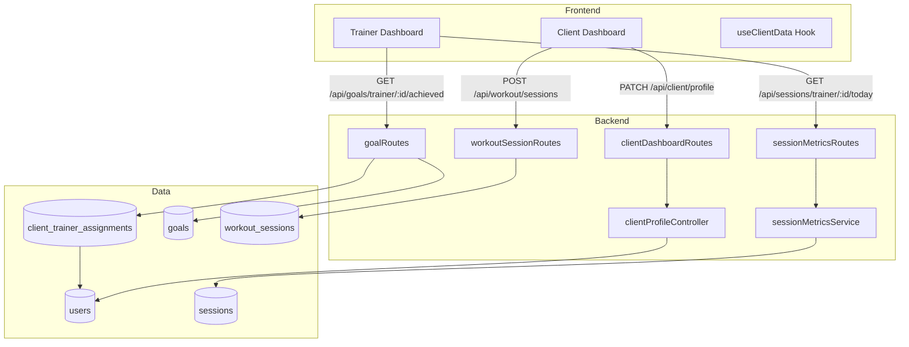
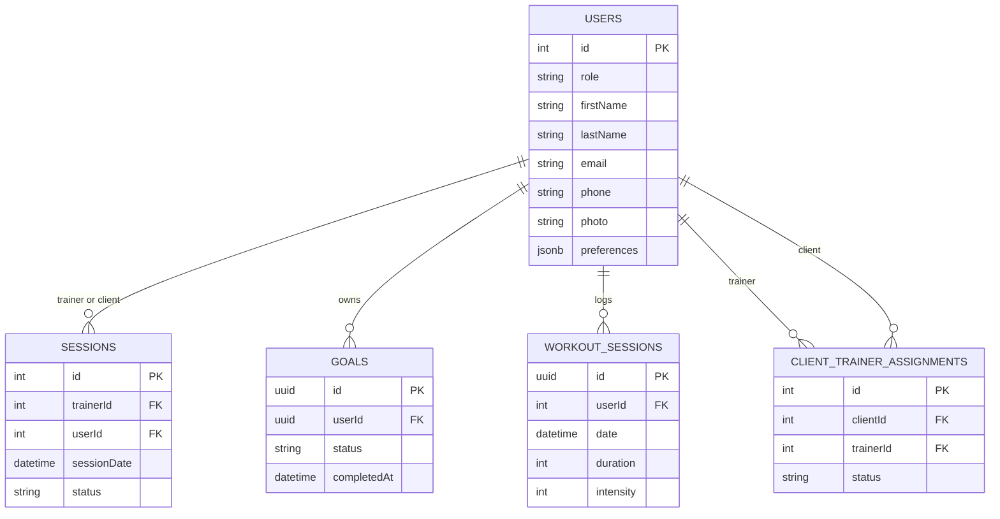
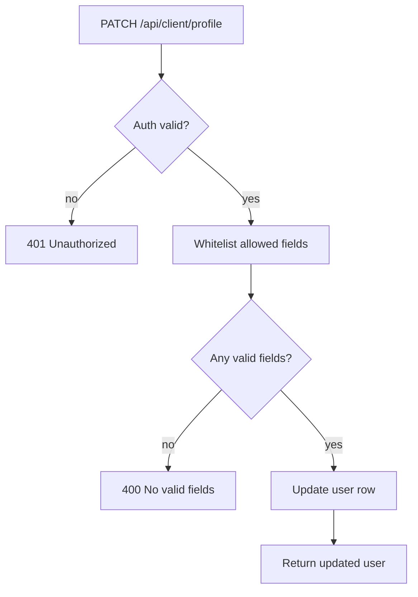
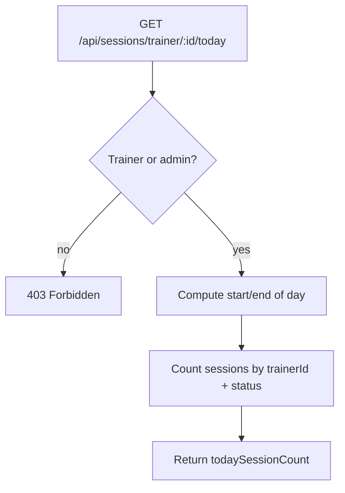
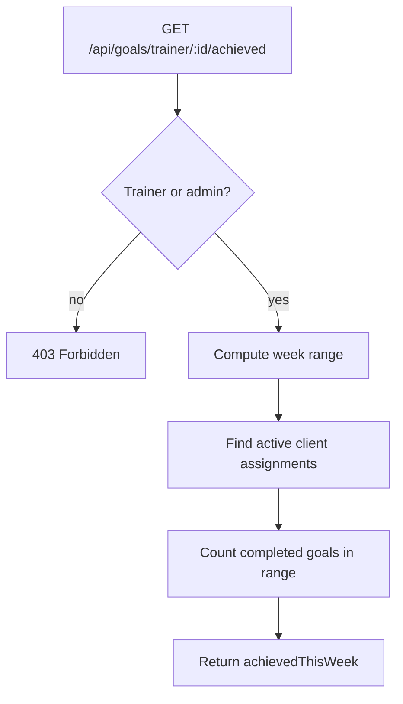

# PHASE 8: DASHBOARD REAL DATA INTEGRATION - API GAPS BLUEPRINT

**System:** SwanStudios Personal Training Platform
**Component:** Dashboard API Integration (Phase 8)
**Author:** AI Village (Roo Code / Claude Code)
**Maintainer:** AI Village (current: ChatGPT-5)
**Date:** 2026-01-06
**Status:** Implemented (2026-01-06)

## 1. EXECUTIVE SUMMARY
This blueprint closes the remaining Phase 8 gaps so the Client and Trainer dashboards are fully powered by real backend data. The scope is limited to wiring existing backend capabilities and adding a safe client profile PATCH endpoint. No new database tables are required.

## 2. SCOPE
In scope:
- PATCH /api/client/profile (partial update with field whitelist)
- Trainer today sessions count (new route + small service)
- Trainer goals achieved this week (new goalRoutes)
- Client workout logging (reuse POST /api/workout/sessions)
- Frontend wiring in useClientData (updateProfile + logWorkout)

Out of scope:
- New tables or migrations
- UI redesign or layout changes
- Gamification or NASM enhancements

## 3. CURRENT STATE (AT START OF PHASE)
- No backend route for GET /api/sessions/trainer/:trainerId/today
- No backend route for GET /api/goals/trainer/:trainerId/achieved
- No backend route for PATCH /api/client/profile
- useClientData contained TODOs for updateProfile and logWorkout
- A root-level goalRoutes.mjs existed but was not wired and had invalid relative imports

Resolved in this change set. See Section 16.

## 4. SOURCE OF TRUTH (TARGET FILES)
- backend/routes/goalRoutes.mjs (new)
- backend/routes/sessionMetricsRoutes.mjs (new; avoids modifying 500+ line sessions.mjs)
- backend/services/sessions/sessionMetrics.service.mjs (new; avoids editing 1900+ line unified service)
- backend/controllers/clientProfileController.mjs (new; avoids editing 565-line profileController)
- backend/routes/clientDashboardRoutes.mjs (add PATCH /api/client/profile)
- backend/core/routes.mjs (register goalRoutes + sessionMetricsRoutes)
- frontend/src/components/ClientDashboard/hooks/useClientData.ts (wire updateProfile/logWorkout)
- backend/routes/workoutSessionRoutes.mjs (existing POST /api/workout/sessions)
- backend/models/ClientTrainerAssignment.mjs (trainer-client mapping)

## 5. ARCHITECTURE DIAGRAM


## 6. DATABASE SCHEMA (ERD)
No new tables required. Existing schemas are used.



## 7. API SPECIFICATIONS

### 7.1 Client Profile Update (NEW)
- Route: PATCH /api/client/profile
- Controller: clientProfileController.updateClientProfile
- Access: protect + clientOnly
- Allowed fields whitelist:
  - firstName, lastName, email
  - phone, photo
  - preferences, emergencyContact
- Request:
```json
{
  "firstName": "Taylor",
  "lastName": "Smith",
  "phone": "555-123-4567",
  "photo": "/uploads/profiles/user-12.png",
  "preferences": { "units": "imperial" }
}
```
- Nullable clear example:
```json
{
  "phone": null,
  "photo": null,
  "emergencyContact": null
}
```
- Response:
```json
{
  "success": true,
  "message": "Profile updated successfully",
  "user": { "id": 12, "firstName": "Taylor", "lastName": "Smith", "email": "taylor@example.com" }
}
```

### 7.2 Trainer Today Sessions (NEW)
- Route: GET /api/sessions/trainer/:trainerId/today
- Service: sessionMetricsService.getTrainerTodaySessions
- Access: protect + trainerOrAdminOnly (trainer can only access own)
- Status filter: scheduled, confirmed, completed
- Response:
```json
{
  "success": true,
  "data": {
    "trainerId": 42,
    "todaySessionCount": 5,
    "date": "2026-01-06"
  }
}
```

### 7.3 Trainer Goals Achieved This Week (NEW)
- Route: GET /api/goals/trainer/:trainerId/achieved
- Data source: ClientTrainerAssignment -> Goal
- Week range: moment().startOf('isoWeek') to moment().endOf('isoWeek')
- Access: protect + trainerOrAdminOnly (trainer can only access own)
- Response:
```json
{
  "success": true,
  "data": {
    "trainerId": 42,
    "achievedThisWeek": 12,
    "weekStart": "2026-01-06T00:00:00.000Z",
    "weekEnd": "2026-01-12T23:59:59.999Z",
    "clientCount": 7
  }
}
```

### 7.4 Log Workout Session (EXISTING)
- Route: POST /api/workout/sessions
- Controller: workoutSessionRoutes (Zod validation)
- Access: protect
- Required fields (per Zod schema):
  - userId, title, date, duration, intensity
  - exercises, totalWeight, totalReps, totalSets
- Response: 201 with created session payload

## 8. LOGIC FLOWCHARTS

### 8.1 Profile Update


### 8.2 Log Workout Session
```mermaid
flowchart TD
  A[POST /api/workout/sessions] --> B{Auth valid?}
  B -- no --> Z[401 Unauthorized]
  B -- yes --> C[Validate payload (zod)]
  C -- invalid --> D[400 Validation error]
  C -- valid --> E[Create workout session]
  E --> F[Return created session]
```

### 8.3 Trainer Today Sessions


### 8.4 Trainer Goals Achieved This Week


## 9. WIREFRAMES (ASCII)
Client Dashboard (Profile + Workout)
```
+------------------------------------------------------------------+
| Client Dashboard                                                  |
+------------------------------------------------------------------+
| Profile Card                          Workout Log                |
| +---------------------------+         +------------------------+ |
| | Name      [__________]    |         | Title   [__________]   | |
| | Email     [__________]    |         | Date    [__________]   | |
| | Phone     [__________]    |         | Duration [__] min      | |
| | Photo     [__________]    |         | Intensity [__]         | |
| | Save Changes (PATCH)      |         | Log Workout (POST)     | |
| +---------------------------+         +------------------------+ |
+------------------------------------------------------------------+
```

Trainer Dashboard (Metrics)
```
+--------------------------------------------------------------+
| Trainer Metrics                                              |
+--------------------------------------------------------------+
| Today Sessions: [  4 ]     Goals Achieved This Week: [ 12 ]   |
+--------------------------------------------------------------+
```

## 10. KEY IMPLEMENTATION DETAILS (ADDED)
- Field whitelist in client profile update:
  - ['firstName', 'lastName', 'phone', 'email', 'photo', 'preferences', 'emergencyContact']
- Week calculation uses moment().startOf('isoWeek') and moment().endOf('isoWeek')
- Trainer endpoints require trainerOrAdminOnly and enforce trainerId === req.user.id
- Goal count uses active assignments from client_trainer_assignments

## 11. SECURITY MODEL (ENHANCED)
- Field-level security: whitelist prevents role/subscription edits
- Trainer metrics: trainerOrAdminOnly and trainer ownership check
- Client data: userId overridden in workout sessions for non-admins
- Input validation: Zod on workout sessions; server-side filtering on profile updates
- SQL injection protection via Sequelize parameterization

## 12. ERROR HANDLING (SPECIFIC)
- PATCH /api/client/profile
  - 400: No valid fields to update
  - 401: Not authenticated
  - 403: Client only
  - 404: User not found
  - 500: Failed to update profile
- GET /api/sessions/trainer/:id/today
  - 403: Trainer can only view own sessions
  - 500: Server error fetching trainer today sessions
- GET /api/goals/trainer/:id/achieved
  - 403: Trainer can only view own goals
  - 500: Failed to fetch achieved goals
- POST /api/workout/sessions
  - 400: Zod validation failure
  - 401: Not authenticated
  - 500: Server error

## 13. MONITORING AND LOGGING
- Winston logging in all new endpoints (userId + trainerId context)
- Log authorization failures with role + path
- Log successful updates with updated field list
- Log query failures with stack for troubleshooting

## 14. PERFORMANCE CONSIDERATIONS
- Trainer metrics are single-query counts
- Client dashboard keeps parallel API calls (Promise.all)
- No extra joins added for Phase 8 beyond assignment lookups

## 15. TESTING CHECKLIST (ENHANCED)
- GET /api/goals/trainer/:trainerId/achieved (trainer and admin)
- GET /api/sessions/trainer/:trainerId/today (trainer and admin)
- PATCH /api/client/profile (valid fields, invalid fields, empty body)
- POST /api/workout/sessions (valid payload, invalid payload, auth required)
- Client dashboard UI: updateProfile and logWorkout flows

Integration examples:
```
GET /api/goals/trainer/42/achieved
Authorization: Bearer <trainer_token>
Expected: 200 with { achievedThisWeek: number, clientCount: number }

PATCH /api/client/profile
Authorization: Bearer <client_token>
Body: { "firstName": "John", "phone": "555-0123" }
Expected: 200 with updated user object
```

## 16. IMPLEMENTATION VERIFICATION (COMPLETED)
Files added:
- backend/routes/goalRoutes.mjs
- backend/routes/sessionMetricsRoutes.mjs
- backend/services/sessions/sessionMetrics.service.mjs
- backend/controllers/clientProfileController.mjs

Files updated:
- backend/routes/clientDashboardRoutes.mjs (PATCH /api/client/profile)
- backend/core/routes.mjs (register new routes)
- frontend/src/components/ClientDashboard/hooks/useClientData.ts (wire updateProfile/logWorkout)

Notes:
- Root-level goalRoutes.mjs remains unused and unchanged.

## 17. QUICK HARDENING ENHANCEMENTS (2026-01-06 to 2026-01-07)

### 17.1 Security & Input Validation Improvements
**File:** `backend/controllers/clientProfileController.mjs`

**Enhancements Applied:**
- **Immutable Field Whitelist:** `ALLOWED_FIELDS` now uses `Object.freeze()` to prevent runtime modifications
- **Input Sanitization:** Added `sanitizeString()` function to trim whitespace and limit string length to 255 characters
- **Structured Error Codes:** Added `ERROR_CODES` object with standardized error identifiers for better monitoring
- **Enhanced Error Responses:** All error responses now include `errorCode` field for programmatic error handling

**Code Changes:**
```javascript
// Error codes for structured error handling
const ERROR_CODES = Object.freeze({
  INVALID_ROLE: 'CLIENT_PROFILE_UPDATE_DENIED',
  FIELD_VALIDATION_FAILED: 'INVALID_PROFILE_DATA',
  USER_NOT_FOUND: 'PROFILE_UPDATE_TARGET_MISSING',
  NO_VALID_FIELDS: 'NO_VALID_PROFILE_FIELDS',
  DATABASE_ERROR: 'PROFILE_UPDATE_DATABASE_ERROR'
});

// Sanitize string inputs to prevent oversized data and trim whitespace
const sanitizeString = (str) => {
  if (typeof str !== 'string') return str;
  return str.trim().substring(0, 255); // Max 255 chars, trim whitespace
};
```

**Benefits:**
- **Security:** Prevents oversized input attacks and ensures consistent data format
- **Monitoring:** Structured error codes enable better error tracking and alerting
- **Reliability:** Immutable constants prevent accidental field whitelist modifications
- **Data Quality:** Automatic trimming prevents whitespace-only fields

### 17.2 Error Response Format Standardization
**Before:**
```json
{
  "success": false,
  "message": "Access denied: Client only"
}
```

**After:**
```json
{
  "success": false,
  "errorCode": "CLIENT_PROFILE_UPDATE_DENIED",
  "message": "Access denied: Client only"
}
```

### 17.3 Input Processing Flow
**Enhanced Flow:**
1. **Authentication Check** -> Returns structured error with `INVALID_ROLE`
2. **Input Sanitization** -> All string fields trimmed and length-limited
3. **Field Filtering** -> Only whitelisted fields pass through
4. **Type Validation** -> Returns `FIELD_VALIDATION_FAILED` for invalid types
5. **Nullable Clears** -> Optional fields (phone/photo/emergencyContact) can be set to null
6. **Database Update** -> Returns `DATABASE_ERROR` for failures

### 17.4 Testing Impact
**Additional Test Cases Required:**
- String sanitization: oversized inputs (>255 chars) should be truncated
- Error code validation: all error responses should include `errorCode` field
- Field immutability: attempts to modify `ALLOWED_FIELDS` should fail
- Rate limiting: PATCH /api/client/profile enforces 10 requests per 15 minutes
- Caching: trainer metrics return cached values within TTL

### 17.5 Rate Limiting (Profile Patch)
**Route:** PATCH /api/client/profile  
**Middleware:** rateLimiter({ windowMs: 15 * 60 * 1000, max: 10 })  
**Purpose:** Prevent rapid profile update abuse and reduce write load.

### 17.6 Metric Caching (Trainer Dashboard)
**Cache Layer:** services/cache/redisWrapper.mjs (memory fallback)  
**Endpoints Cached:**
- GET /api/sessions/trainer/:trainerId/today (TTL 60s)
- GET /api/goals/trainer/:trainerId/achieved (TTL 300s)
**Keys:**
- trainer:todaySessions:{trainerId}:{YYYY-MM-DD}
- trainer:goalsAchieved:{trainerId}:{YYYY-MM-DD}

## 18. APPROVAL GATE
Approved by user on 2026-01-06. Proceed with implementation.
Quick hardening enhancements approved and implemented on 2026-01-06 to 2026-01-07.
