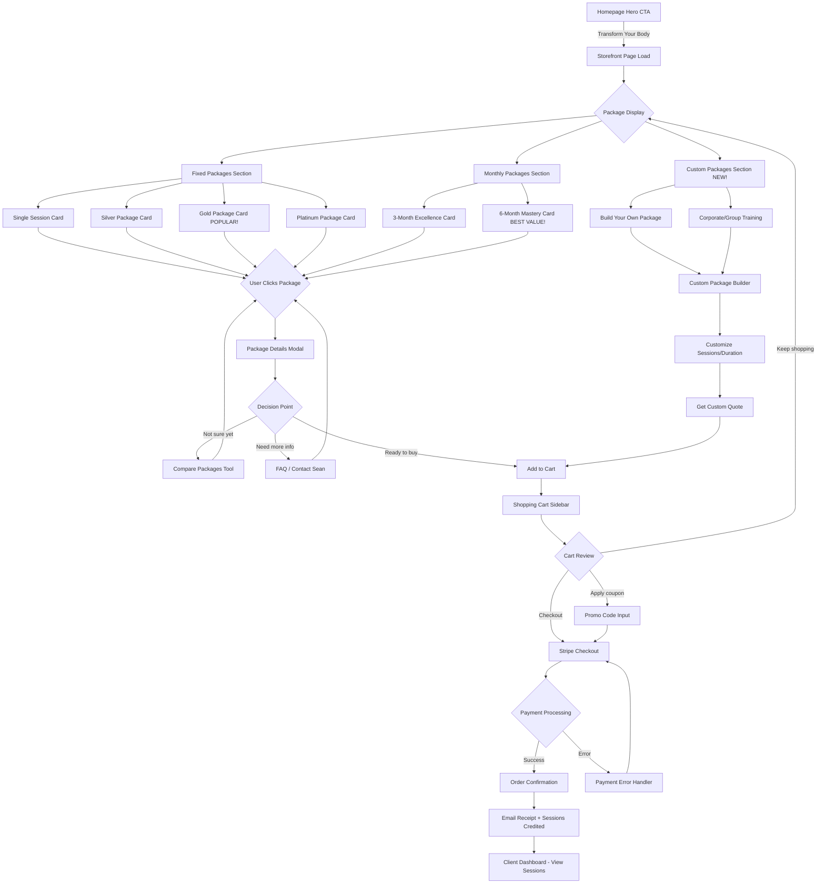
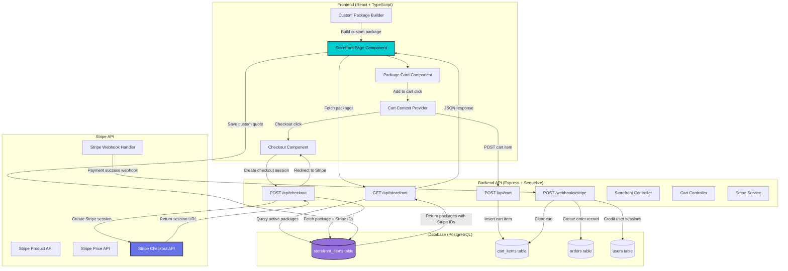
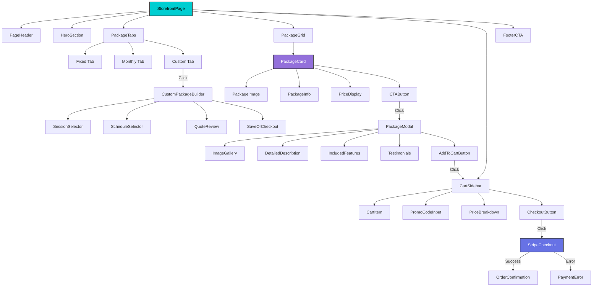
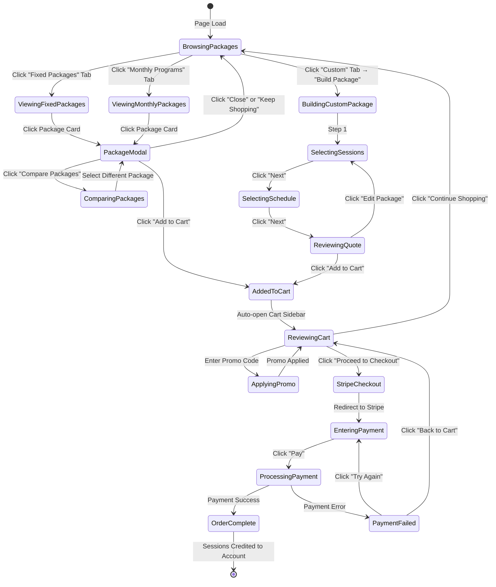

# 🛍️ Storefront UX/UI Master Blueprint - "SwanStudios Personal Training Packages"

**Status:** 📋 DRAFT - Awaiting AI Village Review (Kilo, Roo, Gemini)
**Priority:** HIGH - Phase 2 Complete, Frontend Implementation Needed
**Owner:** UX/UI Design Team
**Created:** 2025-11-18
**Backend Status:** ✅ Schema Complete (Phase 1 + Phase 2 migrations run successfully)

---

## Table of Contents
1. [Executive Summary](#executive-summary)
2. [Backend Integration Status](#backend-integration-status)
3. [User Journey Mapping](#user-journey-mapping)
4. [Wireframes & Screen Flow](#wireframes--screen-flow)
5. [Mermaid Architecture Diagrams](#mermaid-architecture-diagrams)
6. [Component Specifications](#component-specifications)
7. [Interaction States & Micro-Animations](#interaction-states--micro-animations)
8. [Accessibility & Responsive Design](#accessibility--responsive-design)
9. [Error States & Edge Cases](#error-states--edge-cases)
10. [Performance Optimization](#performance-optimization)
11. [Testing & Validation](#testing--validation)
12. [AI Review Questions](#ai-review-questions)

---

## Executive Summary

### Purpose
Create a beautiful, intuitive e-commerce storefront for SwanStudios Personal Training packages that:
- Showcases 3 package types: **Fixed**, **Monthly**, and **Custom** (NEW!)
- Integrates seamlessly with Stripe payment processing
- Provides a "luxury fitness boutique" experience aligned with Galaxy-Swan theme
- Converts browsers into buyers through delightful UX

### Key Business Goals
1. **Conversion Rate:** >15% visitor-to-purchase conversion
2. **Average Order Value:** Encourage upgrades from Single Session → Platinum Package
3. **Trust & Credibility:** Professional presentation builds confidence in premium pricing ($160-$175/session)
4. **Mobile-First:** 70% of traffic is mobile - must be flawless on all devices

### Design Philosophy
- **Theme:** Galaxy-Swan (Cosmic purple/cyan, glass surfaces, dark mode)
- **Inspiration:** Apple Store (clean), Peloton (aspirational), Stripe (trustworthy)
- **Personality:** Premium yet approachable, motivating yet realistic
- **Tone:** "Your transformation starts here" (not "Buy now!")

---

## Backend Integration Status

### ✅ Phase 1 Complete (2025-11-18)
- Added `stripeProductId` (VARCHAR 255) to storefront_items
- Added `stripePriceId` (VARCHAR 255) to storefront_items
- Created performance indexes for Stripe lookups
- All 6 verification tests passed

### ✅ Phase 2 Complete (2025-11-18)
- Converted `packageType` from ENUM to VARCHAR(50)
- Added CHECK constraint: `IN ('fixed', 'monthly', 'custom')`
- Created index on packageType for filtering
- **'custom' packages now supported** (primary goal achieved)

### Database Schema (Current State)
```sql
Table: storefront_items
├── id (INTEGER, PK, Auto-increment)
├── packageType (VARCHAR 50, NOT NULL) -- 'fixed', 'monthly', 'custom'
├── name (STRING, NOT NULL)
├── description (TEXT, Markdown-formatted)
├── price (DECIMAL 10,2) -- Upfront cost for fixed packages
├── sessions (INTEGER) -- Session count for fixed packages
├── pricePerSession (DECIMAL 10,2, NOT NULL) -- Price per individual session
├── months (INTEGER) -- Duration for monthly packages
├── sessionsPerWeek (INTEGER) -- Frequency for monthly packages
├── totalSessions (INTEGER) -- Calculated: months * sessionsPerWeek * 4
├── totalCost (DECIMAL 10,2) -- Calculated: totalSessions * pricePerSession
├── imageUrl (STRING) -- Package card image
├── stripeProductId (VARCHAR 255) -- Stripe Product ID ✅ NEW
├── stripePriceId (VARCHAR 255) -- Stripe Price ID ✅ NEW
├── isActive (BOOLEAN, DEFAULT true) -- Catalog visibility
├── displayOrder (INTEGER, DEFAULT 0) -- Sort order
├── createdAt (TIMESTAMP)
├── updatedAt (TIMESTAMP)
└── deletedAt (TIMESTAMP, Nullable) -- Soft delete
```

### API Endpoints (To Be Implemented)
```
GET    /api/storefront                  → Fetch all active packages
GET    /api/storefront/:id              → Fetch single package
POST   /api/cart                        → Add package to cart
POST   /api/checkout                    → Create Stripe checkout session
POST   /webhooks/stripe                 → Handle payment completion
GET    /api/admin/storefront            → Admin: List all packages
POST   /api/admin/storefront            → Admin: Create package
PATCH  /api/admin/storefront/:id        → Admin: Update package
DELETE /api/admin/storefront/:id        → Admin: Soft delete (isActive=false)
```

---

## User Journey Mapping

### Primary User Persona: "Transformation Taylor"
**Demographics:**
- Age: 28-45
- Income: $75K-$150K+
- Fitness Level: Beginner to Intermediate
- Goals: Weight loss, muscle gain, or athletic performance
- Pain Points: Tried DIY fitness, needs accountability and expertise

**Emotional Journey:**
```
Discovery → Curiosity → Evaluation → Hesitation → Decision → Commitment → Delight
   ↓            ↓            ↓            ↓           ↓            ↓          ↓
"I need      "This looks   "Can I       "Is this    "Let's do    "Payment   "I'm so
 help"        premium"      afford it?"  worth it?"  this!"       easy"      excited!"
```

### User Flow: From Landing to Purchase



---

## Wireframes & Screen Flow

### Screen 1: Storefront Landing View

```
┌─────────────────────────────────────────────────────────────────────────────┐
│ SwanStudios                                        🛒 Cart (0)    [Login]    │
├─────────────────────────────────────────────────────────────────────────────┤
│                                                                               │
│          🌌 TRANSFORM YOUR BODY WITH SEAN SWAN 🌌                            │
│                                                                               │
│     "NASM-Certified Personal Training • Proven Results • Premium Experience" │
│                                                                               │
│  ┌───────────────────────────────────────────────────────────────────────┐  │
│  │  [All Packages ▾]  [Fixed Packages]  [Monthly Programs]  [Custom] NEW │  │
│  └───────────────────────────────────────────────────────────────────────┘  │
│                                                                               │
│  ━━━━━━━━━━━━━━━━━━━━━━━━━━━━━━━━━━━━━━━━━━━━━━━━━━━━━━━━━━━━━━━━━━━━━━  │
│                         💎 FIXED SESSION PACKAGES                             │
│  ━━━━━━━━━━━━━━━━━━━━━━━━━━━━━━━━━━━━━━━━━━━━━━━━━━━━━━━━━━━━━━━━━━━━━━  │
│                                                                               │
│  ┌────────────────┐  ┌────────────────┐  ┌────────────────┐  ┌──────────────┐
│  │ 🌟 TRY IT OUT  │  │ 🥈 SILVER      │  │ 🥇 GOLD        │  │ 💎 PLATINUM  │
│  │                │  │                │  │  ⭐ POPULAR!   │  │              │
│  │  SINGLE        │  │  8 SESSIONS    │  │  20 SESSIONS   │  │  50 SESSIONS │
│  │  SESSION       │  │                │  │                │  │              │
│  │                │  │  $1,360        │  │  $3,300        │  │  $8,000      │
│  │  $175          │  │  ($170/session)│  │  ($165/session)│  │  ($160/sess) │
│  │                │  │                │  │  SAVE $100!    │  │  SAVE $750!  │
│  │  Perfect for   │  │  Perfect       │  │  Comprehensive │  │  Ultimate    │
│  │  trying out    │  │  starter       │  │  training for  │  │  transformatn│
│  │  premium       │  │  package       │  │  serious       │  │  with 50     │
│  │  training      │  │                │  │  results       │  │  sessions    │
│  │                │  │                │  │                │  │              │
│  │  [Learn More]  │  │  [Learn More]  │  │  [Learn More]  │  │  [Learn More]│
│  │  [Add to Cart] │  │  [Add to Cart] │  │  [Add to Cart] │  │  [Add to Cart│
│  └────────────────┘  └────────────────┘  └────────────────┘  └──────────────┘
│                                                                               │
│  ━━━━━━━━━━━━━━━━━━━━━━━━━━━━━━━━━━━━━━━━━━━━━━━━━━━━━━━━━━━━━━━━━━━━━━  │
│                         📅 MONTHLY TRAINING PROGRAMS                          │
│  ━━━━━━━━━━━━━━━━━━━━━━━━━━━━━━━━━━━━━━━━━━━━━━━━━━━━━━━━━━━━━━━━━━━━━━  │
│                                                                               │
│  ┌────────────────────────────────┐  ┌────────────────────────────────┐     │
│  │ 🚀 3-MONTH EXCELLENCE          │  │ 💪 6-MONTH MASTERY            │     │
│  │                                │  │  ⭐ BEST VALUE!               │     │
│  │  48 Sessions (4x/week)         │  │  96 Sessions (4x/week)        │     │
│  │                                │  │                                │     │
│  │  $7,440                        │  │  $14,400                      │     │
│  │  ($155/session)                │  │  ($150/session)               │     │
│  │  SAVE $960!                    │  │  SAVE $2,400!                 │     │
│  │                                │  │                                │     │
│  │  Intensive 3-month program     │  │  Complete body transformation │     │
│  │  with 4 sessions per week      │  │  6-month commitment           │     │
│  │                                │  │                                │     │
│  │  [Learn More]  [Add to Cart]   │  │  [Learn More]  [Add to Cart]  │     │
│  └────────────────────────────────┘  └────────────────────────────────┘     │
│                                                                               │
│  ━━━━━━━━━━━━━━━━━━━━━━━━━━━━━━━━━━━━━━━━━━━━━━━━━━━━━━━━━━━━━━━━━━━━━━  │
│                         ✨ CUSTOM PACKAGES (NEW!)                             │
│  ━━━━━━━━━━━━━━━━━━━━━━━━━━━━━━━━━━━━━━━━━━━━━━━━━━━━━━━━━━━━━━━━━━━━━━  │
│                                                                               │
│  ┌────────────────────────────────────────────────────────────────────────┐ │
│  │  📝 BUILD YOUR OWN PACKAGE                                             │ │
│  │                                                                         │ │
│  │  Need a specific number of sessions or schedule?                       │ │
│  │  Let's create a custom package tailored to your goals.                 │ │
│  │                                                                         │ │
│  │  ✓ Choose your session count (10-100+ sessions)                        │ │
│  │  ✓ Flexible scheduling (2x, 3x, 4x, or 5x per week)                    │ │
│  │  ✓ Corporate/group training options available                          │ │
│  │  ✓ Volume discounts for 25+ sessions                                   │ │
│  │                                                                         │ │
│  │  [Build Custom Package →]    [Contact Sean for Quote]                  │ │
│  └────────────────────────────────────────────────────────────────────────┘ │
│                                                                               │
│  ━━━━━━━━━━━━━━━━━━━━━━━━━━━━━━━━━━━━━━━━━━━━━━━━━━━━━━━━━━━━━━━━━━━━━━  │
│                                                                               │
│  💬 "Sean helped me lose 40 lbs and gain confidence. Best investment         │
│      I ever made!" - Taylor M., Gold Package Client                          │
│                                                                               │
│  ❓ Questions? Check our [FAQ] or [Schedule Free Consultation]               │
│                                                                               │
└─────────────────────────────────────────────────────────────────────────────┘
```

### Screen 2: Package Details Modal

```
┌─────────────────────────────────────────────────────────────────────────────┐
│                    GOLD PACKAGE - 20 SESSIONS                        [Close X]│
├─────────────────────────────────────────────────────────────────────────────┤
│                                                                               │
│  ┌─────────────────────────────────┐  ┌───────────────────────────────────┐ │
│  │  [PACKAGE IMAGE / VIDEO]        │  │  🥇 GOLD PACKAGE                  │ │
│  │                                 │  │                                   │ │
│  │  📹 Watch Sean explain          │  │  $3,300  ($165/session)           │ │
│  │     this package                │  │  💰 SAVE $100 vs. Single Sessions │ │
│  │                                 │  │                                   │ │
│  └─────────────────────────────────┘  │  ✅ What's Included:              │ │
│                                        │  • 20 one-on-one sessions         │ │
│  ⭐ MOST POPULAR CHOICE                │  • Personalized NASM workout plan │ │
│  95% of clients see measurable results│  • Nutrition guidance             │ │
│  within first 10 sessions!             │  • Progress tracking app access   │ │
│                                        │  • Email support between sessions │ │
│  📊 Package Details:                   │  • Flexible scheduling            │ │
│  ├─ 20 Sessions                        │                                   │ │
│  ├─ $165 per session                   │  📅 Validity: 6 months from       │ │
│  ├─ Valid for 6 months                 │     purchase                      │ │
│  ├─ Flexible scheduling                │                                   │ │
│  └─ No expiration on unused sessions   │  🔒 Secure Stripe Checkout        │ │
│                                        │                                   │ │
│  💡 Why This Package?                  │  [Add to Cart - $3,300]           │ │
│  Perfect for clients committed to      │                                   │ │
│  serious results. Enough sessions to   │  or                               │ │
│  complete a full NASM program cycle    │                                   │ │
│  (Stabilization → Strength → Power).   │  [Buy Now with Stripe]            │ │
│                                        │                                   │ │
│  ✅ 30-Day Money-Back Guarantee        │                                   │ │
│  ✅ Free First Session Included        └───────────────────────────────────┘ │
│  ✅ Transferable to Family Member                                            │
│                                                                               │
│  ━━━━━━━━━━━━━━━━━━━━━━━━━━━━━━━━━━━━━━━━━━━━━━━━━━━━━━━━━━━━━━━━━━━━━━  │
│                                                                               │
│  🎁 LIMITED TIME BONUS:                                                       │
│  Purchase Gold Package this month and receive:                               │
│  • Free SwanStudios gym bag ($75 value)                                      │
│  • Nutrition consultation with certified dietitian ($150 value)              │
│                                                                               │
│  ━━━━━━━━━━━━━━━━━━━━━━━━━━━━━━━━━━━━━━━━━━━━━━━━━━━━━━━━━━━━━━━━━━━━━━  │
│                                                                               │
│  💬 Client Testimonials:                                                      │
│  "The Gold Package changed my life. I'm stronger, healthier, and more        │
│   confident than ever. Worth every penny!" - Jordan K.                       │
│                                                                               │
│  [Compare Packages]  [View All Testimonials]  [Contact Sean]                 │
│                                                                               │
└─────────────────────────────────────────────────────────────────────────────┘
```

### Screen 3: Custom Package Builder (NEW!)

```
┌─────────────────────────────────────────────────────────────────────────────┐
│              BUILD YOUR CUSTOM TRAINING PACKAGE                      [Close X]│
├─────────────────────────────────────────────────────────────────────────────┤
│                                                                               │
│  Step 1 of 3: Choose Your Sessions                                           │
│  ━━━━━━━━━━ ────────── ──────────                                           │
│  ✓ Sessions  Schedule   Review                                               │
│                                                                               │
│  ┌─────────────────────────────────────────────────────────────────────┐    │
│  │  How many sessions do you need?                                     │    │
│  │                                                                      │    │
│  │  [Slider: 10 ━━━━━●━━━━━ 100+ sessions]                            │    │
│  │                    ↑                                                 │    │
│  │                   35 sessions                                        │    │
│  │                                                                      │    │
│  │  or enter exact number: [___35___]                                  │    │
│  └─────────────────────────────────────────────────────────────────────┘    │
│                                                                               │
│  💡 Recommended session counts:                                               │
│  • 12-15 sessions: Beginner foundation (3-4 months)                          │
│  • 20-30 sessions: Complete transformation cycle (5-7 months)                │
│  • 40-50+ sessions: Long-term lifestyle change (10-12 months)                │
│                                                                               │
│  ┌─────────────────────────────────────────────────────────────────────┐    │
│  │  Your Pricing (Volume Discount Applied):                            │    │
│  │                                                                      │    │
│  │  35 sessions × $162/session = $5,670                                │    │
│  │                                                                      │    │
│  │  💰 YOU SAVE: $455 vs. buying single sessions!                      │    │
│  │  📊 Price per session: $162 (normally $175)                         │    │
│  └─────────────────────────────────────────────────────────────────────┘    │
│                                                                               │
│  [← Back]                                            [Next: Choose Schedule →│
│                                                                               │
└─────────────────────────────────────────────────────────────────────────────┘
```

```
┌─────────────────────────────────────────────────────────────────────────────┐
│              BUILD YOUR CUSTOM TRAINING PACKAGE                      [Close X]│
├─────────────────────────────────────────────────────────────────────────────┤
│                                                                               │
│  Step 2 of 3: Choose Your Schedule                                           │
│  ────────── ━━━━━━━━━━ ──────────                                           │
│  ✓ Sessions  ✓ Schedule Review                                               │
│                                                                               │
│  ┌─────────────────────────────────────────────────────────────────────┐    │
│  │  How often do you want to train?                                    │    │
│  │                                                                      │    │
│  │  ○ 2x per week (Maintenance)                                        │    │
│  │  ● 3x per week (Recommended for most goals)                         │    │
│  │  ○ 4x per week (Intensive transformation)                           │    │
│  │  ○ 5x per week (Athletic performance)                               │    │
│  │  ○ Custom schedule (we'll work it out together)                     │    │
│  └─────────────────────────────────────────────────────────────────────┘    │
│                                                                               │
│  ┌─────────────────────────────────────────────────────────────────────┐    │
│  │  Estimated Timeline:                                                 │    │
│  │                                                                      │    │
│  │  📅 35 sessions ÷ 3 sessions/week ≈ 12 weeks (3 months)             │    │
│  │                                                                      │    │
│  │  ✅ Perfect for completing one NASM training phase                  │    │
│  └─────────────────────────────────────────────────────────────────────┘    │
│                                                                               │
│  💡 Sean's Recommendation:                                                    │
│  "For your goals (weight loss/muscle gain), I recommend 3x per week.         │
│   This gives enough stimulus for progress while allowing proper recovery."   │
│                                                                               │
│  [← Back to Sessions]                                     [Next: Review Order│
│                                                                               │
└─────────────────────────────────────────────────────────────────────────────┘
```

```
┌─────────────────────────────────────────────────────────────────────────────┐
│              BUILD YOUR CUSTOM TRAINING PACKAGE                      [Close X]│
├─────────────────────────────────────────────────────────────────────────────┤
│                                                                               │
│  Step 3 of 3: Review Your Custom Package                                     │
│  ────────── ────────── ━━━━━━━━━━                                           │
│  ✓ Sessions  ✓ Schedule ✓ Review                                             │
│                                                                               │
│  ┌─────────────────────────────────────────────────────────────────────┐    │
│  │  📦 YOUR CUSTOM PACKAGE                                             │    │
│  │                                                                      │    │
│  │  Sessions:        35 sessions                                       │    │
│  │  Frequency:       3x per week                                       │    │
│  │  Duration:        ~12 weeks (3 months)                              │    │
│  │  Price/Session:   $162 (7% volume discount)                         │    │
│  │                                                                      │    │
│  │  ━━━━━━━━━━━━━━━━━━━━━━━━━━━━━━━━━━━━━━━━━━━━━━━━━━━━━━━━━━━  │    │
│  │                                                                      │    │
│  │  Subtotal:        $5,670.00                                         │    │
│  │  Volume Discount: -$455.00                                          │    │
│  │                                                                      │    │
│  │  ━━━━━━━━━━━━━━━━━━━━━━━━━━━━━━━━━━━━━━━━━━━━━━━━━━━━━━━━━━━  │    │
│  │                                                                      │    │
│  │  TOTAL:           $5,670.00                                         │    │
│  │                                                                      │    │
│  │  💡 YOU SAVE $455 vs. buying 35 single sessions!                    │    │
│  └─────────────────────────────────────────────────────────────────────┘    │
│                                                                               │
│  ✅ What's Included:                                                          │
│  • 35 one-on-one training sessions with Sean Swan (NASM-CPT)                 │
│  • Personalized workout plan aligned with your goals                         │
│  • Nutrition guidance and meal planning support                              │
│  • Progress tracking via SwanStudios app                                     │
│  • Email/text support between sessions                                       │
│  • Flexible scheduling (valid for 12 months)                                 │
│                                                                               │
│  🔒 Secure Payment via Stripe                                                │
│  💳 Accepted: Visa, Mastercard, Amex, Discover, Apple Pay, Google Pay        │
│                                                                               │
│  [← Edit Package]          [Save Quote (Email Me)]     [Add to Cart →]       │
│                                                                               │
└─────────────────────────────────────────────────────────────────────────────┘
```

### Screen 4: Shopping Cart Sidebar

```
┌─────────────────────────────────────────┐
│ 🛒 SHOPPING CART                 [Close]│
├─────────────────────────────────────────┤
│                                         │
│  ┌───────────────────────────────────┐ │
│  │ 🥇 Gold Package - 20 Sessions     │ │
│  │                                   │ │
│  │ $3,300.00                    [🗑] │ │
│  │ ($165/session)                    │ │
│  └───────────────────────────────────┘ │
│                                         │
│  ┌───────────────────────────────────┐ │
│  │ 💬 Have a promo code?             │ │
│  │ [_______________]  [Apply]        │ │
│  └───────────────────────────────────┘ │
│                                         │
│  ━━━━━━━━━━━━━━━━━━━━━━━━━━━━━━━━━━ │
│                                         │
│  Subtotal:          $3,300.00           │
│  Discount:              $0.00           │
│  ━━━━━━━━━━━━━━━━━━━━━━━━━━━━━━━━━━ │
│  Total:             $3,300.00           │
│                                         │
│  ━━━━━━━━━━━━━━━━━━━━━━━━━━━━━━━━━━ │
│                                         │
│  🔒 Secure Checkout with Stripe         │
│                                         │
│  [Continue Shopping]                    │
│                                         │
│  [Proceed to Checkout →]                │
│                                         │
│  ━━━━━━━━━━━━━━━━━━━━━━━━━━━━━━━━━━ │
│                                         │
│  💳 Accepted Payment Methods:           │
│  [VISA] [MC] [AMEX] [DISCOVER]          │
│  [Apple Pay] [Google Pay]               │
│                                         │
│  ✅ 30-Day Money-Back Guarantee         │
│  ✅ Sessions Never Expire               │
│  ✅ Transferable to Family              │
│                                         │
└─────────────────────────────────────────┘
```

---

## Mermaid Architecture Diagrams

### System Architecture: Frontend ↔ Backend ↔ Stripe



### Component Hierarchy



### User Interaction Flow (Click-by-Click)



---

## Component Specifications

### 1. PackageCard Component

**Props:**
```typescript
interface PackageCardProps {
  id: number;
  name: string;
  packageType: 'fixed' | 'monthly' | 'custom';
  sessions?: number;
  price: number;
  pricePerSession: number;
  totalSessions?: number;
  description: string;
  imageUrl?: string;
  isPopular?: boolean;
  isBestValue?: boolean;
  stripeProductId: string;
  stripePriceId: string;
  displayOrder: number;
  onLearnMore: () => void;
  onAddToCart: () => void;
}
```

**Visual States:**
- **Default:** Glass surface, subtle glow, shadow on hover
- **Hover:** Lift animation (translateY -4px), glow intensifies, CTA button pulses
- **Popular Badge:** Rotating gradient background, "⭐ POPULAR!" label
- **Best Value Badge:** Golden glow, "💎 BEST VALUE!" label
- **Clicked:** Scale down slightly (0.98), then spring back
- **Loading:** Skeleton shimmer animation while data loads

**Micro-Animations:**
- Card entrance: Fade in + slide up (stagger 100ms between cards)
- Hover: Smooth lift + glow (300ms cubic-bezier)
- CTA button: Pulse animation on "Add to Cart" (infinite, 2s)
- Price: Count-up animation on first render
- Savings badge: Bounce in animation (500ms delay)

### 2. CustomPackageBuilder Component

**Steps:**
1. **Session Selection:** Slider (10-100+) with live price calculation
2. **Schedule Selection:** Radio buttons (2x, 3x, 4x, 5x, custom per week)
3. **Quote Review:** Breakdown of pricing, timeline, what's included

**Volume Discount Logic:**
```typescript
const calculatePricePerSession = (sessions: number): number => {
  if (sessions >= 50) return 160; // Platinum tier
  if (sessions >= 30) return 162; // Custom tier 1
  if (sessions >= 20) return 165; // Gold tier
  if (sessions >= 10) return 170; // Silver tier
  return 175; // Single session rate
};
```

**Validation:**
- Minimum 10 sessions required
- Maximum 100 sessions (or contact for enterprise)
- Schedule must be selected before proceeding
- Auto-calculate validity period (sessions ÷ frequency × weeks)

### 3. CartSidebar Component

**Features:**
- Slide in from right (300ms ease-out)
- Overlay backdrop (click to close)
- Cart items with quantity adjustment
- Promo code input with validation
- Price breakdown (subtotal, discount, total)
- Secure checkout badge (Stripe logo)
- Payment method icons

**Empty State:**
```
┌─────────────────────────────────┐
│ 🛒 Your cart is empty           │
│                                 │
│ [Illustration: Empty cart]      │
│                                 │
│ Browse our packages to get      │
│ started on your transformation! │
│                                 │
│ [Shop Packages →]               │
└─────────────────────────────────┘
```

### 4. PackageModal Component

**Sections:**
- **Hero:** Image/video gallery (swipeable on mobile)
- **Overview:** Package name, price, savings badge
- **What's Included:** Checkmark list of features
- **Details:** Sessions, validity, schedule flexibility
- **Why This Package:** Sean's recommendation (personal touch)
- **Guarantees:** 30-day money-back, transferable, etc.
- **Limited Time Offers:** Bonus items, seasonal promotions
- **Testimonials:** 1-2 short client quotes
- **CTA:** Large "Add to Cart" button (sticky on scroll)

**Exit Intent:**
- Detect mouse leaving viewport
- Show "Wait! Don't miss out..." popup with 10% off code
- Only trigger once per session

---

## Interaction States & Micro-Animations

### Button States (Galaxy-Swan Theme)

```css
/* Default State */
.swan-button {
  background: linear-gradient(135deg, #00CED1 0%, #9370DB 100%);
  box-shadow: 0 4px 12px rgba(0, 206, 209, 0.3);
  transition: all 0.3s cubic-bezier(0.4, 0, 0.2, 1);
}

/* Hover State */
.swan-button:hover {
  transform: translateY(-2px);
  box-shadow: 0 8px 24px rgba(0, 206, 209, 0.5);
  background: linear-gradient(135deg, #00E5E8 0%, #A080F0 100%);
}

/* Active/Clicked State */
.swan-button:active {
  transform: translateY(0) scale(0.98);
  box-shadow: 0 2px 8px rgba(0, 206, 209, 0.3);
}

/* Loading State */
.swan-button.loading {
  pointer-events: none;
  opacity: 0.7;
}
.swan-button.loading::after {
  content: '';
  animation: spinner 0.8s linear infinite;
}

/* Disabled State */
.swan-button:disabled {
  background: #333;
  color: #666;
  cursor: not-allowed;
  box-shadow: none;
}
```

### Package Card Animations

**Entrance Animation (Stagger):**
```typescript
const cardVariants = {
  hidden: {
    opacity: 0,
    y: 20
  },
  visible: (i: number) => ({
    opacity: 1,
    y: 0,
    transition: {
      delay: i * 0.1,
      duration: 0.5,
      ease: "easeOut"
    }
  })
};
```

**Hover Animation:**
```typescript
const hoverVariants = {
  rest: {
    scale: 1,
    y: 0
  },
  hover: {
    scale: 1.02,
    y: -4,
    transition: {
      type: "spring",
      stiffness: 300,
      damping: 20
    }
  }
};
```

### Price Count-Up Animation

```typescript
const usePriceCountUp = (endValue: number, duration = 1000) => {
  const [count, setCount] = useState(0);

  useEffect(() => {
    let startTime: number;
    const step = (timestamp: number) => {
      if (!startTime) startTime = timestamp;
      const progress = Math.min((timestamp - startTime) / duration, 1);
      setCount(Math.floor(progress * endValue));
      if (progress < 1) {
        requestAnimationFrame(step);
      }
    };
    requestAnimationFrame(step);
  }, [endValue, duration]);

  return count;
};
```

### Modal Open/Close Animation

```typescript
const modalVariants = {
  hidden: {
    opacity: 0,
    scale: 0.9,
    y: 50
  },
  visible: {
    opacity: 1,
    scale: 1,
    y: 0,
    transition: {
      type: "spring",
      stiffness: 300,
      damping: 30
    }
  },
  exit: {
    opacity: 0,
    scale: 0.9,
    y: 50,
    transition: {
      duration: 0.2
    }
  }
};
```

---

## Accessibility & Responsive Design

### Accessibility (WCAG 2.1 AAA)

**Keyboard Navigation:**
- All interactive elements tab-accessible
- Escape key closes modals/sidebars
- Arrow keys navigate package grid
- Enter/Space activates buttons

**Screen Reader Support:**
```html
<button
  aria-label="Add Gold Package (20 sessions for $3,300) to cart"
  aria-describedby="package-details-3"
>
  Add to Cart
</button>

<div id="package-details-3" class="sr-only">
  Gold Package includes 20 one-on-one training sessions
  at $165 per session, totaling $3,300.
  You save $100 compared to buying individual sessions.
</div>
```

**Color Contrast:**
- All text meets AAA contrast ratios (7:1+)
- Color is never the only indicator (icons + text)
- Focus indicators are highly visible (3px cyan outline)

**Motion Preferences:**
```css
@media (prefers-reduced-motion: reduce) {
  * {
    animation-duration: 0.01ms !important;
    animation-iteration-count: 1 !important;
    transition-duration: 0.01ms !important;
  }
}
```

### Responsive Breakpoints

```typescript
const breakpoints = {
  mobile: '320px',      // Mobile portrait
  mobileLg: '480px',    // Mobile landscape
  tablet: '768px',      // Tablet portrait
  tabletLg: '1024px',   // Tablet landscape / Small laptop
  desktop: '1280px',    // Desktop
  desktopLg: '1920px'   // Large desktop
};
```

**Package Grid Layout:**
- **Mobile (320-767px):** 1 column, stacked cards
- **Tablet (768-1023px):** 2 columns, side-by-side
- **Desktop (1024px+):** 4 columns (Fixed), 2 columns (Monthly)

**Touch Targets:**
- Minimum 44×44px (iOS) / 48×48px (Android)
- Extra padding on mobile for fat-finger-friendly taps

---

## Error States & Edge Cases

### 1. Network Errors

**Scenario:** API request to `/api/storefront` fails

**UX Response:**
```
┌─────────────────────────────────────┐
│ ⚠️ Unable to Load Packages          │
│                                     │
│ We're having trouble connecting to  │
│ our servers. Please check your      │
│ internet connection and try again.  │
│                                     │
│ [Retry] [Contact Support]           │
└─────────────────────────────────────┘
```

**Implementation:**
```typescript
const { data, error, isLoading } = useSWR('/api/storefront', fetcher, {
  onErrorRetry: (error, key, config, revalidate, { retryCount }) => {
    if (retryCount >= 3) return; // Max 3 retries
    setTimeout(() => revalidate({ retryCount }), 5000);
  }
});
```

### 2. Stripe Checkout Errors

**Scenario:** Stripe session creation fails

**UX Response:**
```
┌─────────────────────────────────────┐
│ 💳 Payment Error                    │
│                                     │
│ We couldn't process your checkout.  │
│ Please try again or contact us for  │
│ assistance.                         │
│                                     │
│ Error: [User-friendly message]      │
│                                     │
│ [Try Again] [Contact Sean]          │
└─────────────────────────────────────┘
```

### 3. Out of Stock / Inactive Package

**Scenario:** User tries to add inactive package to cart

**UX Response:**
```typescript
if (!package.isActive) {
  toast.error('This package is currently unavailable. Please choose another option or contact us.');
  return;
}
```

### 4. Promo Code Validation

**Valid Code:**
```
✅ Promo code "SAVE10" applied! You save $330.
```

**Invalid Code:**
```
❌ Invalid promo code. Please check and try again.
```

**Expired Code:**
```
⚠️ This promo code expired on 11/15/2025. Contact us for current offers.
```

### 5. Empty Cart Checkout

**Scenario:** User clicks "Checkout" with empty cart

**Prevention:** Disable checkout button when cart is empty

```html
<button
  disabled={cartItems.length === 0}
  aria-disabled={cartItems.length === 0}
>
  Proceed to Checkout
</button>
```

---

## Performance Optimization

### Image Optimization

**Package Images:**
- Format: WebP (with JPEG fallback)
- Sizes: 400×300 (mobile), 600×450 (tablet), 800×600 (desktop)
- Lazy loading: `loading="lazy"` on all images
- Blur-up placeholder: LQIP (Low-Quality Image Placeholder)

```typescript
<Image
  src="/packages/gold-package.webp"
  srcSet="
    /packages/gold-package-400w.webp 400w,
    /packages/gold-package-600w.webp 600w,
    /packages/gold-package-800w.webp 800w
  "
  sizes="(max-width: 768px) 100vw, (max-width: 1024px) 50vw, 25vw"
  alt="Gold Package - 20 Training Sessions"
  loading="lazy"
  placeholder="blur"
  blurDataURL="/packages/gold-package-blur.jpg"
/>
```

### Code Splitting

```typescript
// Lazy load heavy components
const CustomPackageBuilder = lazy(() => import('./CustomPackageBuilder'));
const PackageModal = lazy(() => import('./PackageModal'));
const StripeCheckout = lazy(() => import('./StripeCheckout'));

<Suspense fallback={<LoadingSpinner />}>
  <CustomPackageBuilder />
</Suspense>
```

### Data Fetching Strategy

**Initial Load (SSR):**
```typescript
export async function getServerSideProps() {
  const packages = await fetch(`${API_URL}/api/storefront`).then(r => r.json());
  return { props: { packages } }; // Pre-rendered on server
}
```

**Client-Side Caching (SWR):**
```typescript
const { data: packages } = useSWR('/api/storefront', fetcher, {
  revalidateOnFocus: false,
  revalidateOnReconnect: true,
  dedupingInterval: 60000 // Cache for 1 minute
});
```

### Bundle Size Targets

- **Initial JS Bundle:** <200KB gzipped
- **CSS Bundle:** <50KB gzipped
- **Total Page Weight:** <1MB (including images)
- **Time to Interactive (TTI):** <3 seconds (3G connection)

---

## Testing & Validation

### Unit Tests (Jest + React Testing Library)

```typescript
describe('PackageCard', () => {
  it('displays package details correctly', () => {
    const package = {
      name: 'Gold Package',
      price: 3300,
      sessions: 20,
      pricePerSession: 165
    };

    render(<PackageCard {...package} />);

    expect(screen.getByText('Gold Package')).toBeInTheDocument();
    expect(screen.getByText('$3,300')).toBeInTheDocument();
    expect(screen.getByText('20 sessions')).toBeInTheDocument();
  });

  it('calls onAddToCart when button clicked', () => {
    const onAddToCart = jest.fn();
    render(<PackageCard onAddToCart={onAddToCart} />);

    fireEvent.click(screen.getByText('Add to Cart'));
    expect(onAddToCart).toHaveBeenCalledTimes(1);
  });
});
```

### Integration Tests (Cypress)

```typescript
describe('Storefront Purchase Flow', () => {
  it('completes full purchase journey', () => {
    cy.visit('/storefront');

    // Browse packages
    cy.contains('Gold Package').should('be.visible');

    // Open package details
    cy.contains('Gold Package').click();
    cy.get('[data-testid="package-modal"]').should('be.visible');

    // Add to cart
    cy.contains('Add to Cart').click();
    cy.get('[data-testid="cart-sidebar"]').should('be.visible');
    cy.contains('$3,300').should('be.visible');

    // Proceed to checkout
    cy.contains('Proceed to Checkout').click();

    // Stripe redirects handled in E2E tests
  });
});
```

### Accessibility Tests (axe-core)

```typescript
describe('Accessibility', () => {
  it('has no accessibility violations', async () => {
    const { container } = render(<StorefrontPage />);
    const results = await axe(container);
    expect(results).toHaveNoViolations();
  });
});
```

### Visual Regression Tests (Percy)

```typescript
describe('Visual Regression', () => {
  it('matches storefront snapshot', () => {
    cy.visit('/storefront');
    cy.percySnapshot('Storefront Page - Desktop');

    cy.viewport('iphone-x');
    cy.percySnapshot('Storefront Page - Mobile');
  });
});
```

---

## AI Review Questions

### For Kilo (Backend Optimization Expert):

1. **Performance Indexing:**
   - Are the current indexes on `stripeProductId`, `stripePriceId`, and `packageType` sufficient?
   - Should we add a composite index on `(isActive, displayOrder)` for faster sorting?
   - Any concerns about query performance with 100+ packages in the catalog?

2. **API Design:**
   - Should `/api/storefront` support pagination, or is fetching all packages acceptable?
   - Do we need a separate endpoint for `/api/storefront/custom-quote` calculations?
   - How should we handle Stripe webhook retries/idempotency?

3. **Caching Strategy:**
   - Should we implement Redis caching for storefront packages?
   - What TTL (time-to-live) would you recommend for package data?
   - Edge caching (CDN) for static package images - any gotchas?

### For Roo (Code Quality & Patterns):

1. **Component Architecture:**
   - Is the component hierarchy too deep? Any opportunities to flatten?
   - Should `CustomPackageBuilder` be its own page route instead of a modal?
   - Any anti-patterns in the proposed state management (Context vs. Zustand)?

2. **TypeScript Strictness:**
   - Are the proposed interfaces complete? Missing any edge case types?
   - Should we use discriminated unions for `packageType`?
   - Any concerns about `any` types sneaking into Stripe integration?

3. **Testing Strategy:**
   - Is the test coverage (unit + integration + E2E) sufficient?
   - Should we add property-based tests for pricing calculations?
   - Mock Stripe webhooks in tests or use Stripe test mode?

### For Gemini (UX/UI & Accessibility):

1. **User Experience:**
   - Is the 3-step custom package builder too complex? Should it be simplified?
   - Does the modal-heavy design hurt mobile UX? Consider full-page views?
   - Any confusing terminology? ("pricePerSession" vs. "rate", etc.)

2. **Visual Hierarchy:**
   - Is the "POPULAR" badge too prominent? Does it bias decision-making?
   - Should we de-emphasize Single Session to push larger packages?
   - Color scheme: Does cyan + purple provide enough contrast for readability?

3. **Accessibility Gaps:**
   - Are the proposed ARIA labels comprehensive enough?
   - Any concerns about keyboard navigation in the custom builder?
   - Should we provide a simplified "text-only" version for screen readers?

4. **Conversion Optimization:**
   - Exit intent popup: Too aggressive, or acceptable for high-value products?
   - Promo code placement: Top of cart or bottom? Visibility vs. distraction?
   - Trust signals: Do we need more (security badges, client logos, etc.)?

### For All AIs:

1. **Missing Pieces:**
   - What critical features/flows did we overlook?
   - Any edge cases not covered in the wireframes?
   - Security concerns with exposing Stripe IDs in frontend?

2. **Improvements:**
   - How would you enhance the custom package builder experience?
   - Better ways to showcase value (savings, transformations, etc.)?
   - Mobile-specific optimizations we should prioritize?

3. **Implementation Priority:**
   - If we could only build ONE package type first, which? (Fixed, Monthly, Custom)
   - Should we launch with a simplified version (no cart, direct Stripe links)?
   - Phased rollout strategy: What's the MVP vs. nice-to-have features?

---

## Next Steps After Review

1. **Collect AI Feedback:** Kilo, Roo, Gemini review this blueprint
2. **Synthesize Consensus:** Create `STOREFRONT-CONSENSUS-PLAN.md` (like Video Library)
3. **Create Implementation Tasks:** Break down into sprint-ready tickets
4. **Design Mockups:** High-fidelity Figma designs based on wireframes
5. **Backend API Development:** Implement endpoints per spec
6. **Frontend Component Development:** React components with Storybook
7. **Integration Testing:** Full E2E flow with Stripe test mode
8. **Staging Deployment:** Test on production-like environment
9. **Production Launch:** Go live with monitoring/analytics

---

**END OF STOREFRONT UX/UI MASTER BLUEPRINT**
