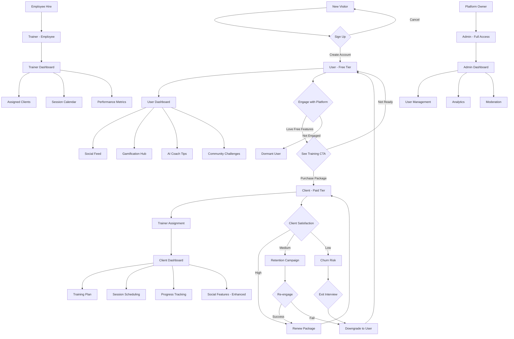
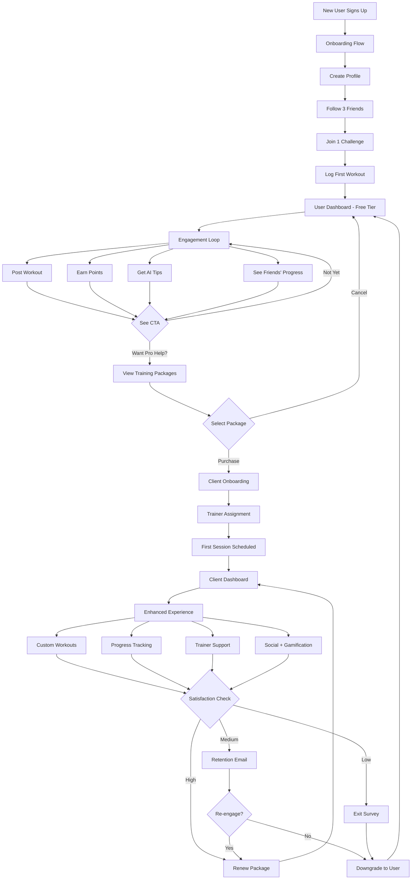

# SwanStudios User Hierarchy & Engagement Strategy - Master Blueprint

**Date**: November 11, 2025
**Status**: CRITICAL CLARIFICATION - User Tier System
**Priority**: HIGH - Foundation for all UX/UI decisions

---

## 🎯 Executive Summary

**CRITICAL CORRECTION**: SwanStudios operates on a **4-tier user hierarchy**, NOT a 3-tier system. The previous documentation incorrectly conflated "User" with "Client."

### The 4 User Tiers:

```
User (Free Tier) → Client (Paid Training) → Trainer (Employee) → Admin (Platform Owner)
```

**Business Strategy**: Engage **Users** through free social/gamification features, converting them to **Clients** through value demonstration.

---

## 🏗️ User Tier Hierarchy (Corrected)

### Tier 1: User (Free - Social Media Only) 🆓

**Definition**: Anyone who creates an account on SwanStudios social platform

**Access**:
- ✅ Social media features (posts, comments, likes, friend connections)
- ✅ Gamification system (achievements, points, challenges)
- ✅ AI Coach tips (limited free tier)
- ✅ Community engagement (groups, challenges, leaderboards)
- ✅ Progress tracking (self-reported workouts)
- ✅ Basic profile page (bio, avatar, stats)
- ❌ Personal trainer assignment
- ❌ Professional workout plans
- ❌ 1-on-1 training sessions
- ❌ Advanced analytics

**Primary Goal**: **Engage and retain** Users so they see value and want to upgrade to Client

**Conversion Path**: User → Client (purchase training package)

**Profile Page**: `/profile/:username` (social-focused, public by default)

**Dashboard**: `/dashboard/user` (social feed, challenges, achievements, AI tips)

---

### Tier 2: Client (Paid - Personal Training) 💰

**Definition**: User who has purchased a training package and been assigned a trainer

**Access**:
- ✅ **ALL User tier features** (social, gamification, AI tips)
- ✅ Professional trainer assignment
- ✅ Custom workout plans
- ✅ 1-on-1 training sessions (virtual or in-person)
- ✅ Advanced progress analytics
- ✅ Nutrition planning
- ✅ Session scheduling
- ✅ Direct trainer communication
- ✅ Premium AI Coach features
- ✅ Priority support

**Primary Goal**: **Deliver exceptional training experience** to retain and upsell

**Profile Page**: `/profile/:username` (enhanced with training stats, trainer info)

**Dashboard**: `/dashboard/client` (training-focused with social sidebar)

**Conversion Path**: Client → Recurring client (renew packages, upgrade tiers)

---

### Tier 3: Trainer (Employee - Service Provider) 💼

**Definition**: SwanStudios employee who provides training services to Clients

**Access**:
- ✅ **ALL Client tier features** (social, gamification, personal profile)
- ✅ Trainer dashboard (assigned clients, session calendar, performance metrics)
- ✅ Client management tools
- ✅ Workout plan creation
- ✅ Progress tracking for assigned clients
- ✅ Scheduling system
- ✅ Communication tools (chat, video, notifications)
- ✅ Revenue/commission tracking
- ❌ Admin controls (user management, platform settings)

**Primary Goal**: **Maximize client success and retention**

**Profile Page**: `/profile/:username` (professional trainer bio, certifications, client testimonials)

**Dashboard**: `/dashboard/trainer` (client list, schedule, performance, engagement panel)

**Conversion Path**: N/A (employee role, not customer journey)

---

### Tier 4: Admin (Platform Owner - Full Control) 🔐

**Definition**: SwanStudios platform administrator with full system access

**Access**:
- ✅ **ALL Trainer tier features** (can manage personal training if desired)
- ✅ Admin dashboard (platform analytics, user management, moderation)
- ✅ Client onboarding
- ✅ Trainer assignment
- ✅ Package management
- ✅ Social moderation
- ✅ Gamification controls
- ✅ System health monitoring
- ✅ Financial analytics
- ✅ Content approval

**Primary Goal**: **Platform growth, user engagement, revenue optimization**

**Dashboard**: `/dashboard/admin` (comprehensive platform management)

**Conversion Path**: N/A (owner role)

---

## 📊 User Journey Flowchart (Complete)



---

## 🎮 Free Tier Engagement Strategy

**Goal**: Make free tier **valuable enough** to engage Users, but **limited enough** to incentivize Client upgrade

### Free Tier Features (User-Only Access):

#### 1. Social Media Platform
```
✅ Create posts (text, images, videos)
✅ Like, comment, share posts
✅ Follow friends and other Users
✅ Join community groups (e.g., "Running Enthusiasts," "Weightlifting Beginners")
✅ Participate in community challenges
✅ Public profile page with bio, stats, achievements
✅ Activity feed (see friends' workouts, posts, achievements)
```

**Limitation**: No trainer interaction, no professional workout plans

**Upgrade CTA**: "Want a pro to design your workouts? Become a Client!"

---

#### 2. Gamification System
```
✅ Earn points for workouts (self-reported)
✅ Unlock achievements (e.g., "10 Workouts," "30-Day Streak")
✅ Climb leaderboards (friends, community)
✅ Join challenges (e.g., "Summer Shred Challenge")
✅ Collect badges and rewards
✅ Progress streaks (daily, weekly, monthly)
```

**Limitation**: Basic gamification only; Clients get exclusive challenges and premium rewards

**Upgrade CTA**: "Join exclusive Client challenges with real prizes!"

---

#### 3. AI Coach Tips (Limited)
```
✅ 3 free AI Coach tips per week
✅ Basic workout suggestions based on logged activities
✅ Motivational messages
✅ General fitness advice
```

**Limitation**: Generic advice; Clients get personalized AI Coach with unlimited access

**Upgrade CTA**: "Get unlimited personalized AI coaching as a Client!"

---

#### 4. Progress Tracking (Self-Reported)
```
✅ Log workouts manually
✅ Track weight, measurements
✅ Basic charts (weight over time, workout frequency)
✅ Weekly summary emails
```

**Limitation**: No professional analysis; Clients get trainer-reviewed progress with advanced analytics

**Upgrade CTA**: "Let a pro analyze your progress and create custom plans!"

---

### Subscription Tiers (Future - Not Implemented Yet)

**Phase 1 (Current)**: Free User tier + Paid Client tier (one-time package purchase)

**Phase 2 (Future - Post-Launch)**:
```
Free Tier (User)
  ↓
Premium Tier ($9.99/mo) - Enhanced social + unlimited AI Coach + advanced analytics
  ↓
Client Tier ($199-499/package) - Personal training + all premium features
  ↓
VIP Client Tier ($999+/package) - Elite training + nutrition + recovery + exclusive perks
```

**Current Implementation**: Focus on **Free User → Client conversion** only

**Future Implementation**: Add Premium tier to capture Users who want more than free but aren't ready for personal training

---

## 🎨 User Dashboard Wireframes (By Tier)

### User Dashboard (`/dashboard/user`)

**Purpose**: Engage Users through social + gamification, subtly promote Client upgrade

```
┌─────────────────────────────────────────────────────────┐
│ Header: SwanStudios Logo | Search | Notifications | Profile
├─────────────────────────────────────────────────────────┤
│ Sidebar (Left)         │ Main Content (Center)          │ Sidebar (Right)      │
│                        │                                 │                      │
│ • Home (Feed)         │ ┌──────────────────────────────┐ │ 🎯 Upgrade to Client │
│ • Challenges          │ │ 📱 Social Feed               │ │                      │
│ • Achievements        │ │                               │ │ "Get a personal     │
│ • Friends             │ │ [Create Post]                │ │ trainer + custom    │
│ • Groups              │ │                               │ │ workout plans!"     │
│ • Profile             │ │ ┌─────────────────────────┐  │ │                      │
│                        │ │ │ 👤 Sarah posted:        │  │ │ [View Packages] →   │
│ ─────────────          │ │ │ "Just finished 5K! 🏃" │  │ │                      │
│ 🏆 Your Stats          │ │ │ [Image]                 │  │ ├──────────────────── │
│                        │ │ │ 👍 12  💬 3             │  │ │ 🤖 AI Coach Tips     │
│ 🔥 Streak: 7 days     │ │ └─────────────────────────┘  │ │                      │
│ ⭐ Points: 450        │ │                               │ │ "Great job logging  │
│ 🏅 Achievements: 8    │ │ ┌─────────────────────────┐  │ │ 3 workouts this     │
│                        │ │ │ 👤 Mike completed:      │  │ │ week! Try adding    │
│ ─────────────          │ │ │ "Chest Day ✅"          │  │ │ 10 min cardio."     │
│ 🎮 Active Challenges   │ │ │ 💪 Bench: 225lbs       │  │ │                      │
│                        │ │ │ 👍 25  💬 8             │  │ │ (2 tips remaining)  │
│ • Summer Shred        │ │ └─────────────────────────┘  │ │                      │
│ • 30-Day Plank        │ │                               │ │ [Upgrade for More]  │
│                        │ └──────────────────────────────┘ │                      │
└─────────────────────────────────────────────────────────┘
```

**Key Features**:
- Social feed is PRIMARY focus (Users want community)
- Gamification sidebar (streaks, points, achievements)
- Subtle upgrade CTAs (right sidebar, not intrusive)
- AI Coach tips (limited, with upgrade prompt)

---

### Client Dashboard (`/dashboard/client`)

**Purpose**: Deliver training experience while maintaining social engagement

```
┌─────────────────────────────────────────────────────────┐
│ Header: SwanStudios Logo | Search | Notifications | Profile
├─────────────────────────────────────────────────────────┤
│ Sidebar (Left)         │ Main Content (Center)          │ Sidebar (Right)      │
│                        │                                 │                      │
│ 🏋️ TRAINING           │ ┌──────────────────────────────┐ │ 📱 Social Feed       │
│ • Today's Workout     │ │ 💪 Today's Workout           │ │                      │
│ • Progress            │ │                               │ │ [Minimized view]    │
│ • Schedule            │ │ Chest & Triceps - 45 min     │ │                      │
│ • My Trainer          │ │                               │ │ Recent from friends │
│                        │ │ 1. Bench Press 4x8           │ │                      │
│ 🎮 COMMUNITY          │ │ 2. Incline DB Press 3x10     │ │ • Sarah: "5K done!" │
│ • Social Feed         │ │ 3. Cable Flies 3x12          │ │ • Mike: "PR today!" │
│ • Challenges          │ │ 4. Tricep Dips 3x12          │ │                      │
│ • Achievements        │ │                               │ │ [View Full Feed]    │
│                        │ │ [Start Workout] [View Plan]  │ │                      │
│ 📊 ANALYTICS          │ └──────────────────────────────┘ │ ─────────────────── │
│ • Progress Charts     │                                 │ 🏆 Your Progress     │
│ • Body Stats          │ ┌──────────────────────────────┐ │                      │
│ • Session History     │ │ 📊 This Week's Summary       │ │ Weight: 185 lbs ↓2  │
│                        │ │                               │ │ Workouts: 4/5       │
│ ─────────────          │ │ Workouts Completed: 4/5      │ │ Streak: 12 days 🔥  │
│ 👤 My Trainer          │ │ Avg Session: 52 min          │ │                      │
│                        │ │ Calories Burned: 1,850       │ │ [View Full Stats]   │
│ Sarah Johnson         │ │                               │ │                      │
│ Certified PT          │ │ [Detailed Analytics →]       │ │                      │
│                        │ └──────────────────────────────┘ │                      │
│ [Message Trainer]     │                                 │                      │
└─────────────────────────────────────────────────────────┘
```

**Key Features**:
- Training is PRIMARY focus (top of sidebar, main content)
- Social features SECONDARY but still accessible (right sidebar, collapsed)
- Progress analytics (trainer-reviewed, professional)
- Direct trainer communication

---

### Trainer Dashboard (`/dashboard/trainer`)

**Purpose**: Manage assigned Clients, optimize training delivery

```
┌─────────────────────────────────────────────────────────┐
│ Header: SwanStudios Logo | Search | Notifications | Profile
├─────────────────────────────────────────────────────────┤
│ Sidebar (Left)         │ Main Content (Center)          │ Sidebar (Right)      │
│                        │                                 │                      │
│ 💼 CLIENTS            │ ┌──────────────────────────────┐ │ 📱 Client Activity   │
│ • Assigned Clients    │ │ 👥 My Clients (12)           │ │                      │
│ • Pending Onboarding  │ │                               │ │ Recent Social Posts │
│ • Session Schedule    │ │ [Search] [Filter: Active ▼]  │ │                      │
│                        │ │                               │ │ • John: "Great      │
│ 📅 SCHEDULE           │ │ ┌─────────────────────────┐   │ │   workout today!"   │
│ • Today (3 sessions)  │ │ │ 👤 John Doe             │   │ │ • Sarah: "Hit PR!" │
│ • This Week           │ │ │ Active | 15/20 sessions │   │ │                      │
│ • Calendar View       │ │ │ Progress: ↑ Weight loss │   │ │ [View All Activity] │
│                        │ │ │ Last Session: 2 days ago│   │ │                      │
│ 📊 PERFORMANCE        │ │ │ [View] [Message] [Plan] │   │ │ ─────────────────── │
│ • Client Retention    │ │ └─────────────────────────┘   │ │ 📊 My Performance    │
│ • Session Completion  │ │                               │ │                      │
│ • Revenue/Commissions │ │ ┌─────────────────────────┐   │ │ Active Clients: 12  │
│                        │ │ │ 👤 Sarah Johnson        │   │ │ Retention: 92%      │
│ 🎮 COMMUNITY          │ │ │ Active | 18/20 sessions │   │ │ Revenue: $2,400     │
│ • Social Feed         │ │ │ Progress: ↑ Strength    │   │ │ This Month          │
│ • My Posts            │ │ │ Last Session: Today     │   │ │                      │
│                        │ │ │ [View] [Message] [Plan] │   │ │ [View Details]      │
│ ─────────────          │ │ └─────────────────────────┘   │ │                      │
│ 👤 My Profile          │ └──────────────────────────────┘ │                      │
│                        │                                 │                      │
│ [Edit Bio/Certs]      │                                 │                      │
└─────────────────────────────────────────────────────────┘
```

**Key Features**:
- Client management is PRIMARY focus
- Session scheduling and calendar
- Performance metrics (retention, revenue)
- Client social activity monitoring (engagement panel - right sidebar)
- Personal social profile (can post as trainer, build brand)

---

### Admin Dashboard (`/dashboard/admin`)

**Purpose**: Platform management, analytics, moderation

*(Already documented in previous blueprint - no changes needed for admin tier)*

---

## 🔄 Conversion Funnel (User → Client)



---

## 📱 Profile Pages (By Tier)

### User Profile (`/profile/:username`)

**Purpose**: Social profile showcasing fitness journey

```
┌─────────────────────────────────────────────────────────┐
│ Cover Photo (Fitness-themed or personal)                │
├─────────────────────────────────────────────────────────┤
│ ┌─────┐  John Doe                                       │
│ │     │  @johndoe                                       │
│ │Photo│  "Fitness enthusiast | Runner | 30-Day Streak" │
│ │     │                                                 │
│ └─────┘  📍 Los Angeles | 🎂 Joined June 2025          │
│                                                          │
│ [Edit Profile]  [Follow]  [Message]                     │
├─────────────────────────────────────────────────────────┤
│ ┌─────────┬─────────┬─────────┬─────────┐               │
│ │ Posts   │ Friends │ Points  │ Streak  │               │
│ │ 45      │ 32      │ 1,250   │ 30 days │               │
│ └─────────┴─────────┴─────────┴─────────┘               │
├─────────────────────────────────────────────────────────┤
│ Tabs: [Posts] [Achievements] [Challenges] [Stats]      │
├─────────────────────────────────────────────────────────┤
│ Recent Posts:                                           │
│ ┌─────────────────────────────────────────────────┐     │
│ │ "Just crushed leg day! 💪"                      │     │
│ │ [Image: Gym selfie]                             │     │
│ │ 👍 25  💬 8  🔁 3                              │     │
│ └─────────────────────────────────────────────────┘     │
│                                                          │
│ Recent Achievements:                                    │
│ 🏅 30-Day Streak | ⭐ 1000 Points | 🏆 Summer Shred     │
└─────────────────────────────────────────────────────────┘
```

---

### Client Profile (`/profile/:username`)

**Purpose**: Social profile + training showcase

```
┌─────────────────────────────────────────────────────────┐
│ Cover Photo                                             │
├─────────────────────────────────────────────────────────┤
│ ┌─────┐  Sarah Johnson                                  │
│ │     │  @sarahj                                        │
│ │Photo│  "Client @ SwanStudios | Training with Mike J." │
│ │     │  "Marathon runner | -15 lbs | 90-day streak"   │
│ └─────┘                                                  │
│         📍 NYC | 🎂 Joined March 2025 | 💪 Client       │
│                                                          │
│ [Edit Profile]  [Follow]  [Message]                     │
├─────────────────────────────────────────────────────────┤
│ ┌─────────┬─────────┬─────────┬─────────┬─────────┐     │
│ │ Posts   │ Friends │ Sessions│ Progress│ Streak  │     │
│ │ 120     │ 58      │ 45/50   │ -15 lbs │ 90 days │     │
│ └─────────┴─────────┴─────────┴─────────┴─────────┘     │
├─────────────────────────────────────────────────────────┤
│ 👤 Trainer: Mike Johnson, CPT                           │
│    [View Trainer Profile]                               │
├─────────────────────────────────────────────────────────┤
│ Tabs: [Posts] [Progress] [Achievements] [Stats]        │
├─────────────────────────────────────────────────────────┤
│ Recent Progress:                                        │
│ ┌─────────────────────────────────────────────────┐     │
│ │ 📊 Weight: 165 lbs → 150 lbs (-15 lbs)          │     │
│ │ 📈 Squat PR: 135 lbs → 185 lbs (+50 lbs)       │     │
│ │ 🏃 5K Time: 32:15 → 27:45 (-4:30)              │     │
│ └─────────────────────────────────────────────────┘     │
└─────────────────────────────────────────────────────────┘
```

---

### Trainer Profile (`/profile/:username`)

**Purpose**: Professional trainer bio + social presence

```
┌─────────────────────────────────────────────────────────┐
│ Professional Header (Fitness/Gym background)            │
├─────────────────────────────────────────────────────────┤
│ ┌─────┐  Mike Johnson, CPT                              │
│ │     │  @mike_trainer                                  │
│ │Photo│  "Certified Personal Trainer @ SwanStudios"     │
│ │     │  "10+ years exp | Strength & Conditioning"      │
│ └─────┘                                                  │
│         📍 Los Angeles | 🏋️ Trainer | ⭐ 4.9/5.0        │
│                                                          │
│ [Message Trainer]  [Book Consultation]  [Follow]        │
├─────────────────────────────────────────────────────────┤
│ ┌─────────┬─────────┬─────────┬─────────┐               │
│ │ Clients │ Sessions│ Rating  │ Exp.    │               │
│ │ 12      │ 500+    │ 4.9/5   │ 10 yrs  │               │
│ └─────────┴─────────┴─────────┴─────────┘               │
├─────────────────────────────────────────────────────────┤
│ 🏆 Certifications:                                      │
│ • NASM Certified Personal Trainer (CPT)                │
│ • Precision Nutrition Level 1                          │
│ • CrossFit Level 2 Trainer                             │
├─────────────────────────────────────────────────────────┤
│ Tabs: [About] [Client Success] [Posts] [Schedule]     │
├─────────────────────────────────────────────────────────┤
│ Client Testimonials:                                    │
│ ⭐⭐⭐⭐⭐ "Mike helped me lose 30 lbs!" - Sarah J.      │
│ ⭐⭐⭐⭐⭐ "Best trainer I've ever had!" - John D.       │
└─────────────────────────────────────────────────────────┘
```

---

## 🎯 Implementation Priority (Updated)

### Phase 1: User Tier Foundation (Week 1-2)
```
✅ User registration and authentication
✅ Basic social feed (posts, likes, comments)
✅ Gamification system (points, achievements, streaks)
✅ AI Coach tips (limited free tier)
✅ User profile page
✅ User dashboard
✅ Upgrade CTAs (subtle, non-intrusive)
```

### Phase 2: Client Tier Implementation (Week 3-4)
```
✅ Package purchase flow
✅ Trainer assignment system
✅ Client onboarding wizard
✅ Client dashboard (training-focused)
✅ Enhanced Client profile
✅ Training plan display
✅ Session scheduling
```

### Phase 3: Trainer Tier Implementation (Week 5-6)
```
✅ Trainer dashboard
✅ Client management tools
✅ Workout plan creation
✅ Session calendar
✅ Trainer profile page
✅ Client engagement panel (social activity monitoring)
```

### Phase 4: Admin Tier Implementation (Week 7-8)
```
✅ Admin dashboard (already mostly built)
✅ Fix production errors (styled-components)
✅ Social moderation tools
✅ Platform analytics
✅ User management
```

---

## ✅ Success Metrics (By Tier)

### User Tier Success:
- **Activation**: 70%+ complete onboarding (profile, first post, join challenge)
- **Engagement**: 50%+ log 3+ workouts in first week
- **Retention**: 40%+ return after 7 days
- **Conversion**: 10%+ upgrade to Client within 90 days

### Client Tier Success:
- **Satisfaction**: 90%+ positive feedback after first month
- **Completion**: 80%+ complete training package
- **Retention**: 60%+ renew or purchase new package
- **Referral**: 20%+ refer friends to become Users/Clients

### Trainer Tier Success:
- **Retention**: 90%+ client retention rate
- **Completion**: 95%+ session completion rate
- **Rating**: 4.5/5.0+ average client rating
- **Revenue**: $2,000+/month per trainer

### Platform Success:
- **User Growth**: 20%+ month-over-month new Users
- **Conversion**: 10%+ User → Client conversion rate
- **Revenue**: $10,000+ monthly recurring revenue by Month 6
- **Engagement**: 50%+ MAU (Monthly Active Users)

---

**END OF USER HIERARCHY MASTER BLUEPRINT**

*This document clarifies the 4-tier user system and serves as the foundation for all UX/UI decisions, wireframes, and user journey flows.*
