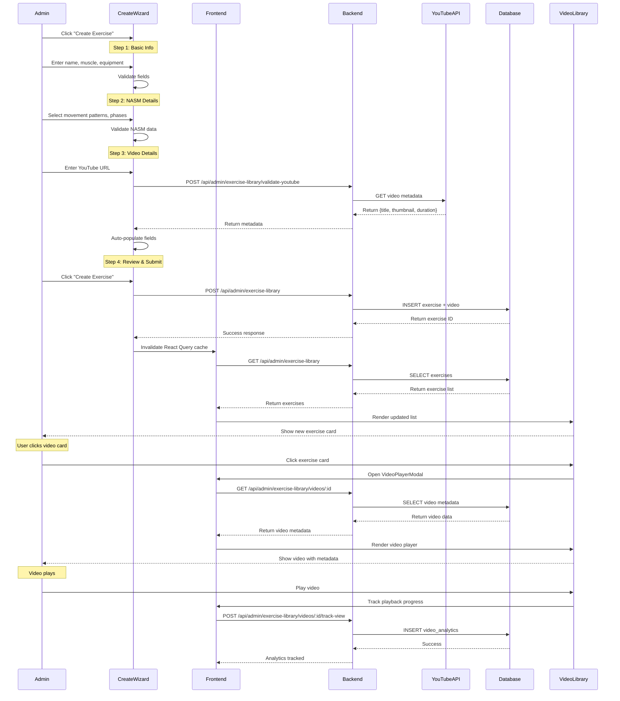

# 🎬 VIDEO LIBRARY PHASE 2 BLUEPRINT - FRONTEND INTEGRATION
## CreateExerciseWizard + VideoPlayerModal + End-to-End Flow

**Created:** 2026-01-08
**Architect:** Claude Code (Sonnet 4.5)
**Implementer:** ChatGPT-5 (QA Engineer)
**Phase:** 2 of 3 (Frontend-Backend Integration)
**Estimated Time:** 4-6 hours
**Difficulty:** Medium (Frontend React + API Integration)

---

## 📋 TABLE OF CONTENTS

1. [Executive Summary](#executive-summary)
2. [Context & Prerequisites](#context--prerequisites)
3. [Quality Standards](#quality-standards)
4. [Phase 2 Objectives](#phase-2-objectives)
5. [Task Breakdown](#task-breakdown)
6. [Architecture & Data Flow](#architecture--data-flow)
7. [Implementation Details](#implementation-details)
8. [Testing Requirements](#testing-requirements)
9. [Success Criteria](#success-criteria)
10. [AI Village Coordination](#ai-village-coordination)

---

## 🎯 EXECUTIVE SUMMARY

### **What We're Building:**
Complete the video library frontend integration by:
1. **CreateExerciseWizard** - 4-step form to create exercises with YouTube videos
2. **VideoPlayerModal** - Enhanced video player with metadata and analytics
3. **End-to-End Flow** - Create exercise → Upload video → View in library

### **Why This Matters:**
- Unblocks NASM exercise library (150+ exercises needed)
- Enables admin to add workout content without developer intervention
- Foundation for client workout builder (Phase 3)

### **Current Status:**
- ✅ Phase 1 COMPLETE - Backend APIs + Stats endpoint + Route fix
- ✅ All 11 backend endpoints working (route precedence fixed)
- ✅ Frontend UI exists but placeholder (needs real integration)
- ⏳ Phase 2 - Connect frontend to backend (THIS PHASE)

---

## 🏗️ CONTEXT & PREREQUISITES

### **What's Already Done (Don't Rebuild):**

#### **Backend (100% Complete):**
1. ✅ **11 API Endpoints Working:**
   - POST /api/admin/exercise-library (create exercise with video)
   - GET /api/admin/exercise-library (list exercises)
   - GET /api/admin/exercise-library/:id (get exercise details)
   - PUT /api/admin/exercise-library/:id (update exercise)
   - DELETE /api/admin/exercise-library/:id (soft delete)
   - GET /api/admin/exercise-library/:id/videos (get videos for exercise)
   - PATCH /api/admin/exercise-library/videos/:id (update video metadata)
   - DELETE /api/admin/exercise-library/videos/:id (soft delete video)
   - POST /api/admin/exercise-library/videos/:id/restore (restore video)
   - POST /api/admin/exercise-library/videos/:id/track-view (track analytics)
   - GET /api/admin/dashboard/stats (video library stats)

2. ✅ **Database Tables:**
   - exercise_library (exercises with NASM metadata)
   - exercise_videos (YouTube + uploads, soft deletes)
   - video_analytics (view tracking, completion rates)

3. ✅ **Services:**
   - YouTube Data API v3 integration (auto-fetch metadata)
   - Redis caching (24h TTL for YouTube metadata)
   - Soft delete pattern (preserves relationships)

4. ✅ **Route Fix (Critical):**
   - Video library routes now BEFORE adminPackageRoutes
   - No more "storefront item" errors
   - Both /api/admin/videos and /api/admin/exercise-library working

#### **Frontend (Placeholder UI - Needs Integration):**
1. ✅ **Components Exist:**
   - AdminVideoLibrary.tsx (main page - list view working)
   - VideoCard.tsx (grid/list cards - working)
   - CreateExerciseWizard.tsx (PLACEHOLDER - needs Steps 3-4)
   - VideoPlayerModal.tsx (PLACEHOLDER - needs video.js integration)
   - useDebounce.ts (working)

2. ✅ **Design System:**
   - Galaxy-Swan theme (cyan accents, glass surfaces, dark mode)
   - styled-components (NO MUI!)
   - Responsive (mobile/tablet/desktop)

3. ❌ **NOT Connected:**
   - CreateExerciseWizard doesn't submit to API
   - VideoPlayerModal doesn't load video metadata
   - No end-to-end flow (create → view)

---

## 🎨 QUALITY STANDARDS

### **SwanStudios Code Standards (MANDATORY):**

#### **1. Galaxy-Swan Theme Compliance (Theme Gate):**
```typescript
// ✅ REQUIRED - All components MUST use:
import { galaxyTheme } from '@/styles/theme';

// Background pattern:
background: linear-gradient(135deg, ${galaxyTheme.colors.galaxyCore[900]}, ${galaxyTheme.colors.galaxyCore[800]});

// Glass surfaces (NOT flat cards):
background: rgba(255, 255, 255, 0.05);
backdrop-filter: blur(10px);
border: 1px solid rgba(99, 230, 226, 0.2); // Cyan glow

// Primary buttons (cyan reserved for primary actions):
background: linear-gradient(135deg, ${galaxyTheme.colors.cyan[500]}, ${galaxyTheme.colors.cyan[600]});

// Typography:
font-family: ${galaxyTheme.typography.display}; // For H1/H2
font-family: ${galaxyTheme.typography.sans}; // For body text
```

#### **2. Component Structure (Max 300 lines):**
```
ComponentName/
├── ComponentName.tsx (main component, < 300 lines)
├── ComponentName.styles.ts (styled-components)
├── ComponentName.types.ts (TypeScript interfaces)
├── ComponentName.test.tsx (unit tests)
├── ComponentName.stories.tsx (Storybook - optional)
├── hooks/
│   └── useComponentName.ts (business logic)
└── README.md (component docs)
```

#### **3. NO Material-UI (MUI Elimination):**
```typescript
// ❌ NEVER DO THIS:
import { Button, TextField, Modal } from '@mui/material';

// ✅ DO THIS INSTEAD:
import { Button, Input, Modal } from '@/components/ui-kit';
// OR create custom styled-components
```

#### **4. Error Handling Pattern:**
```typescript
// ✅ REQUIRED - Standardized error handling:
try {
  const response = await api.createExercise(data);
  if (!response.success) {
    throw new Error(response.message || 'Operation failed');
  }
  // Success handling
} catch (error) {
  console.error('[ComponentName] Error:', error);
  toast.error(error.message || 'An unexpected error occurred');
  // User-friendly error state
}
```

#### **5. TypeScript Standards:**
```typescript
// ✅ REQUIRED - Explicit types, no 'any':
interface CreateExerciseRequest {
  name: string;
  description: string;
  primary_muscle: string;
  secondary_muscles?: string[];
  equipment: string;
  difficulty: 'beginner' | 'intermediate' | 'advanced';
  movement_patterns: string[];
  nasm_phases: number[];
  contraindications?: string[];
  acute_variables: {
    sets: number;
    reps: number;
    tempo: string;
    rest: number;
  };
  video: {
    type: 'youtube' | 'upload';
    url?: string;
    title?: string;
    description?: string;
  };
}

// ❌ NEVER DO THIS:
const data: any = { ... };
```

#### **6. Accessibility (WCAG 2.1 AA):**
```tsx
// ✅ REQUIRED - Semantic HTML + ARIA:
<button
  aria-label="Create new exercise"
  aria-describedby="create-exercise-help"
  disabled={isLoading}
>
  {isLoading ? 'Creating...' : 'Create Exercise'}
</button>

// ✅ Focus management:
useEffect(() => {
  if (modalOpen) {
    modalRef.current?.focus();
  }
}, [modalOpen]);

// ✅ Keyboard navigation:
onKeyDown={(e) => {
  if (e.key === 'Escape') closeModal();
  if (e.key === 'Enter') submitForm();
}}
```

#### **7. Performance (React Best Practices):**
```typescript
// ✅ REQUIRED - Memoization for expensive operations:
const filteredExercises = useMemo(() => {
  return exercises.filter(ex =>
    ex.name.toLowerCase().includes(searchTerm.toLowerCase())
  );
}, [exercises, searchTerm]);

// ✅ Debounce user input:
const debouncedSearch = useDebounce(searchTerm, 300);

// ✅ React Query for data fetching:
const { data, isLoading, error } = useQuery({
  queryKey: ['exercises', filters],
  queryFn: () => api.getExercises(filters),
  staleTime: 5 * 60 * 1000, // 5 minutes
});
```

---

## 🎯 PHASE 2 OBJECTIVES

### **Primary Goals:**
1. ✅ **CreateExerciseWizard Steps 3-4** - Complete form submission + YouTube integration
2. ✅ **VideoPlayerModal Enhancement** - Real video playback with metadata
3. ✅ **End-to-End Testing** - Create exercise → View in library → Play video

### **Success Metrics:**
- ✅ Admin can create exercise with YouTube link in < 2 minutes
- ✅ YouTube metadata auto-fetched (title, thumbnail, duration)
- ✅ Video plays in modal with analytics tracking
- ✅ Exercise appears in library immediately after creation
- ✅ All forms pass accessibility audit (WCAG 2.1 AA)
- ✅ 0 console errors/warnings
- ✅ Galaxy-Swan theme 100% compliant

---

## 📊 TASK BREAKDOWN

### **Task 1: CreateExerciseWizard - Step 3 (Video Details) [2 hours]**

#### **File to Modify:**
`frontend/src/components/admin/CreateExerciseWizard.tsx` (currently 127 lines)

#### **Current State:**
```tsx
// Placeholder modal with 4-step structure
export const CreateExerciseWizard: React.FC<Props> = ({ open, onClose }) => {
  const [currentStep, setCurrentStep] = useState(1);

  return (
    <Modal open={open} onClose={onClose}>
      <h2>Create Exercise Wizard</h2>
      <p>Step {currentStep} of 4</p>
      {/* Placeholder - needs real steps */}
    </Modal>
  );
};
```

#### **Required Implementation:**

**Step 3 Form Fields:**
```tsx
interface Step3Data {
  videoType: 'youtube' | 'upload';
  youtubeUrl?: string;
  videoFile?: File;
  videoTitle?: string;
  videoDescription?: string;
  chapters?: Array<{
    time: number;
    title: string;
  }>;
}

// YouTube URL validation (real-time)
const validateYouTubeUrl = (url: string): boolean => {
  const regex = /^(https?:\/\/)?(www\.)?(youtube\.com\/watch\?v=|youtu\.be\/)([a-zA-Z0-9_-]{11})/;
  return regex.test(url);
};

// Auto-fetch YouTube metadata on valid URL
useEffect(() => {
  if (step3Data.videoType === 'youtube' && validateYouTubeUrl(step3Data.youtubeUrl)) {
    fetchYouTubeMetadata(step3Data.youtubeUrl);
  }
}, [step3Data.youtubeUrl]);

const fetchYouTubeMetadata = async (url: string) => {
  try {
    setIsLoadingMetadata(true);
    // Backend will fetch from YouTube Data API v3
    const response = await fetch('/api/admin/exercise-library/validate-youtube', {
      method: 'POST',
      headers: { 'Content-Type': 'application/json' },
      body: JSON.stringify({ url })
    });
    const data = await response.json();

    if (data.success) {
      // Auto-populate fields with YouTube metadata
      setStep3Data(prev => ({
        ...prev,
        videoTitle: data.metadata.title,
        videoDescription: data.metadata.description,
        // Thumbnail preview shown to user
      }));
    }
  } catch (error) {
    console.error('[CreateExerciseWizard] YouTube metadata fetch failed:', error);
  } finally {
    setIsLoadingMetadata(false);
  }
};
```

**UI Components:**
```tsx
<StepContainer>
  <h3>Step 3: Video Details</h3>

  {/* Video Type Selector */}
  <VideoTypeToggle>
    <button
      className={videoType === 'youtube' ? 'active' : ''}
      onClick={() => setVideoType('youtube')}
      aria-pressed={videoType === 'youtube'}
    >
      YouTube Link
    </button>
    <button
      className={videoType === 'upload' ? 'active' : ''}
      onClick={() => setVideoType('upload')}
      aria-pressed={videoType === 'upload'}
    >
      Upload Video
    </button>
  </VideoTypeToggle>

  {/* YouTube URL Input */}
  {videoType === 'youtube' && (
    <FormField>
      <label htmlFor="youtube-url">YouTube URL *</label>
      <Input
        id="youtube-url"
        type="url"
        placeholder="https://www.youtube.com/watch?v=..."
        value={youtubeUrl}
        onChange={(e) => setYoutubeUrl(e.target.value)}
        error={youtubeUrlError}
        aria-describedby="youtube-url-help"
      />
      <HelpText id="youtube-url-help">
        {isLoadingMetadata && '⏳ Fetching video metadata...'}
        {youtubeUrlError && `❌ ${youtubeUrlError}`}
        {metadata && `✅ Found: ${metadata.title} (${metadata.duration})`}
      </HelpText>

      {/* Thumbnail Preview */}
      {metadata?.thumbnail && (
        <ThumbnailPreview>
          
          <p>{metadata.title}</p>
        </ThumbnailPreview>
      )}
    </FormField>
  )}

  {/* Upload Video (Phase 3 - show placeholder for now) */}
  {videoType === 'upload' && (
    <UploadPlaceholder>
      <p>📹 Video upload coming in Phase 3</p>
      <p>Use YouTube links for now</p>
    </UploadPlaceholder>
  )}

  {/* Optional: Video Title Override */}
  <FormField>
    <label htmlFor="video-title">Video Title (optional)</label>
    <Input
      id="video-title"
      type="text"
      placeholder="Override auto-fetched title"
      value={videoTitle}
      onChange={(e) => setVideoTitle(e.target.value)}
    />
  </FormField>

  {/* Navigation Buttons */}
  <ButtonGroup>
    <Button variant="secondary" onClick={handlePrevious}>
      ← Previous
    </Button>
    <Button
      variant="primary"
      onClick={handleNext}
      disabled={!isStep3Valid}
    >
      Next: Review →
    </Button>
  </ButtonGroup>
</StepContainer>
```

**Validation Rules:**
```typescript
const isStep3Valid = useMemo(() => {
  if (videoType === 'youtube') {
    return validateYouTubeUrl(youtubeUrl) && metadata !== null;
  }
  if (videoType === 'upload') {
    return videoFile !== null && videoFile.size <= 500 * 1024 * 1024; // 500MB max
  }
  return false;
}, [videoType, youtubeUrl, metadata, videoFile]);
```

---

### **Task 2: CreateExerciseWizard - Step 4 (Review & Submit) [1.5 hours]**

#### **Step 4 Implementation:**

```tsx
interface Step4Props {
  exerciseData: CombinedExerciseData; // Steps 1-3 combined
  onEdit: (step: number) => void;
  onSubmit: () => Promise<void>;
}

const Step4ReviewSubmit: React.FC<Step4Props> = ({ exerciseData, onEdit, onSubmit }) => {
  const [isSubmitting, setIsSubmitting] = useState(false);
  const [submitError, setSubmitError] = useState<string | null>(null);

  const handleSubmit = async () => {
    try {
      setIsSubmitting(true);
      setSubmitError(null);

      // Format data for API
      const payload: CreateExerciseRequest = {
        name: exerciseData.name,
        description: exerciseData.description,
        primary_muscle: exerciseData.primaryMuscle,
        secondary_muscles: exerciseData.secondaryMuscles,
        equipment: exerciseData.equipment,
        difficulty: exerciseData.difficulty,
        movement_patterns: exerciseData.movementPatterns,
        nasm_phases: exerciseData.nasmPhases,
        contraindications: exerciseData.contraindications,
        acute_variables: exerciseData.acuteVariables,
        video: {
          type: exerciseData.videoType,
          url: exerciseData.youtubeUrl,
          title: exerciseData.videoTitle,
          description: exerciseData.videoDescription,
        }
      };

      // Submit to API
      const response = await fetch('/api/admin/exercise-library', {
        method: 'POST',
        headers: {
          'Content-Type': 'application/json',
          'Authorization': `Bearer ${getAuthToken()}` // From auth context
        },
        body: JSON.stringify(payload)
      });

      const data = await response.json();

      if (!response.ok) {
        throw new Error(data.message || 'Failed to create exercise');
      }

      // Success!
      toast.success('Exercise created successfully! 🎉');

      // Invalidate React Query cache (refresh list)
      queryClient.invalidateQueries(['exercises']);
      queryClient.invalidateQueries(['admin-dashboard-stats']);

      // Close wizard
      onSubmit();

    } catch (error) {
      console.error('[CreateExerciseWizard] Submit error:', error);
      setSubmitError(error.message || 'An unexpected error occurred');
      toast.error('Failed to create exercise. Please try again.');
    } finally {
      setIsSubmitting(false);
    }
  };

  return (
    <StepContainer>
      <h3>Step 4: Review & Submit</h3>

      {/* Exercise Summary */}
      <ReviewSection>
        <ReviewCard>
          <h4>Basic Information</h4>
          <ReviewItem>
            <label>Name:</label>
            <span>{exerciseData.name}</span>
            <EditButton onClick={() => onEdit(1)} aria-label="Edit basic information">
              ✏️
            </EditButton>
          </ReviewItem>
          <ReviewItem>
            <label>Primary Muscle:</label>
            <span>{exerciseData.primaryMuscle}</span>
          </ReviewItem>
          <ReviewItem>
            <label>Equipment:</label>
            <span>{exerciseData.equipment}</span>
          </ReviewItem>
          <ReviewItem>
            <label>Difficulty:</label>
            <span className={`difficulty-${exerciseData.difficulty}`}>
              {exerciseData.difficulty}
            </span>
          </ReviewItem>
        </ReviewCard>

        <ReviewCard>
          <h4>NASM Details</h4>
          <ReviewItem>
            <label>Movement Patterns:</label>
            <TagList>
              {exerciseData.movementPatterns.map(pattern => (
                <Tag key={pattern}>{pattern}</Tag>
              ))}
            </TagList>
            <EditButton onClick={() => onEdit(2)} aria-label="Edit NASM details">
              ✏️
            </EditButton>
          </ReviewItem>
          <ReviewItem>
            <label>NASM Phases:</label>
            <TagList>
              {exerciseData.nasmPhases.map(phase => (
                <Tag key={phase}>Phase {phase}</Tag>
              ))}
            </TagList>
          </ReviewItem>
        </ReviewCard>

        <ReviewCard>
          <h4>Video</h4>
          {exerciseData.videoType === 'youtube' && exerciseData.metadata && (
            <>
              <ThumbnailPreview>
                
              </ThumbnailPreview>
              <ReviewItem>
                <label>Title:</label>
                <span>{exerciseData.metadata.title}</span>
                <EditButton onClick={() => onEdit(3)} aria-label="Edit video details">
                  ✏️
                </EditButton>
              </ReviewItem>
              <ReviewItem>
                <label>Duration:</label>
                <span>{exerciseData.metadata.duration}</span>
              </ReviewItem>
              <ReviewItem>
                <label>URL:</label>
                <a href={exerciseData.youtubeUrl} target="_blank" rel="noopener noreferrer">
                  {exerciseData.youtubeUrl}
                </a>
              </ReviewItem>
            </>
          )}
        </ReviewCard>
      </ReviewSection>

      {/* Submit Error */}
      {submitError && (
        <ErrorAlert role="alert">
          <strong>Error:</strong> {submitError}
        </ErrorAlert>
      )}

      {/* Navigation Buttons */}
      <ButtonGroup>
        <Button
          variant="secondary"
          onClick={() => onEdit(3)}
          disabled={isSubmitting}
        >
          ← Previous
        </Button>
        <Button
          variant="primary"
          onClick={handleSubmit}
          disabled={isSubmitting}
          aria-busy={isSubmitting}
        >
          {isSubmitting ? (
            <>
              <Spinner /> Creating Exercise...
            </>
          ) : (
            'Create Exercise ✓'
          )}
        </Button>
      </ButtonGroup>
    </StepContainer>
  );
};
```

---

### **Task 3: VideoPlayerModal Enhancement [1.5 hours]**

#### **File to Modify:**
`frontend/src/components/admin/VideoPlayerModal.tsx` (currently 156 lines placeholder)

#### **Current State:**
```tsx
// Placeholder modal
export const VideoPlayerModal: React.FC<Props> = ({ open, onClose, videoId }) => {
  return (
    <Modal open={open} onClose={onClose}>
      <h2>Video Player</h2>
      <p>Video ID: {videoId}</p>
      {/* Placeholder - needs video.js integration */}
    </Modal>
  );
};
```

#### **Required Implementation:**

**Install Dependencies:**
```bash
npm install video.js @types/video.js
npm install react-player # Alternative (simpler than video.js)
```

**Enhanced VideoPlayerModal:**
```tsx
import React, { useEffect, useState, useRef } from 'react';
import ReactPlayer from 'react-player/youtube';
import { useQuery } from '@tanstack/react-query';
import styled from 'styled-components';

interface VideoPlayerModalProps {
  open: boolean;
  onClose: () => void;
  videoId: string; // exercise_videos.id
  exerciseId?: string; // exercise_library.id
}

interface VideoMetadata {
  id: string;
  title: string;
  description: string;
  url: string;
  thumbnail: string;
  duration: string;
  video_type: 'youtube' | 'upload';
  approved: boolean;
  view_count: number;
  created_at: string;
  exercise?: {
    id: string;
    name: string;
    primary_muscle: string;
  };
}

export const VideoPlayerModal: React.FC<VideoPlayerModalProps> = ({
  open,
  onClose,
  videoId,
  exerciseId
}) => {
  const playerRef = useRef<ReactPlayer>(null);
  const [isPlaying, setIsPlaying] = useState(false);
  const [progress, setProgress] = useState({ played: 0, loaded: 0 });
  const [hasTrackedView, setHasTrackedView] = useState(false);

  // Fetch video metadata
  const { data: video, isLoading, error } = useQuery<VideoMetadata>({
    queryKey: ['video', videoId],
    queryFn: async () => {
      const response = await fetch(`/api/admin/exercise-library/videos/${videoId}`, {
        headers: {
          'Authorization': `Bearer ${getAuthToken()}`
        }
      });
      if (!response.ok) throw new Error('Failed to fetch video metadata');
      const data = await response.json();
      return data.video;
    },
    enabled: open && !!videoId
  });

  // Track video view (analytics)
  const trackVideoView = async (watchDuration: number, completionPercentage: number) => {
    try {
      await fetch(`/api/admin/exercise-library/videos/${videoId}/track-view`, {
        method: 'POST',
        headers: {
          'Content-Type': 'application/json',
          'Authorization': `Bearer ${getAuthToken()}`
        },
        body: JSON.stringify({
          watch_duration: watchDuration,
          completion_percentage: completionPercentage,
          chapters_viewed: [] // TODO: Implement chapter tracking
        })
      });
    } catch (error) {
      console.error('[VideoPlayerModal] Failed to track view:', error);
    }
  };

  // Track view after 10 seconds of playback
  useEffect(() => {
    if (isPlaying && progress.played > 0.1 && !hasTrackedView) {
      const duration = video?.duration ? parseDuration(video.duration) : 0;
      const watchedSeconds = duration * progress.played;
      trackVideoView(watchedSeconds, Math.round(progress.played * 100));
      setHasTrackedView(true);
    }
  }, [isPlaying, progress.played, hasTrackedView, video]);

  // Handle modal close (track final stats)
  const handleClose = () => {
    if (video && progress.played > 0) {
      const duration = parseDuration(video.duration);
      const watchedSeconds = duration * progress.played;
      trackVideoView(watchedSeconds, Math.round(progress.played * 100));
    }
    setIsPlaying(false);
    setProgress({ played: 0, loaded: 0 });
    setHasTrackedView(false);
    onClose();
  };

  return (
    <ModalOverlay
      open={open}
      onClick={handleClose}
      role="dialog"
      aria-modal="true"
      aria-labelledby="video-player-title"
    >
      <ModalContent onClick={(e) => e.stopPropagation()}>
        {/* Close Button */}
        <CloseButton
          onClick={handleClose}
          aria-label="Close video player"
        >
          ✕
        </CloseButton>

        {/* Loading State */}
        {isLoading && (
          <LoadingContainer>
            <Spinner />
            <p>Loading video...</p>
          </LoadingContainer>
        )}

        {/* Error State */}
        {error && (
          <ErrorContainer role="alert">
            <p>❌ Failed to load video</p>
            <p>{error.message}</p>
          </ErrorContainer>
        )}

        {/* Video Player */}
        {video && (
          <>
            <VideoHeader>
              <h2 id="video-player-title">{video.title}</h2>
              {video.exercise && (
                <ExerciseBadge>
                  {video.exercise.name} • {video.exercise.primary_muscle}
                </ExerciseBadge>
              )}
            </VideoHeader>

            <PlayerContainer>
              {video.video_type === 'youtube' && (
                <ReactPlayer
                  ref={playerRef}
                  url={video.url}
                  playing={isPlaying}
                  controls={true}
                  width="100%"
                  height="100%"
                  onPlay={() => setIsPlaying(true)}
                  onPause={() => setIsPlaying(false)}
                  onProgress={(state) => setProgress(state)}
                  onEnded={() => {
                    trackVideoView(
                      parseDuration(video.duration),
                      100
                    );
                  }}
                  config={{
                    youtube: {
                      playerVars: {
                        modestbranding: 1,
                        rel: 0,
                        showinfo: 0
                      }
                    }
                  }}
                />
              )}

              {video.video_type === 'upload' && (
                <UploadPlaceholder>
                  📹 Uploaded videos coming in Phase 3
                </UploadPlaceholder>
              )}
            </PlayerContainer>

            {/* Video Metadata */}
            <VideoMetadata>
              <MetadataRow>
                <label>Duration:</label>
                <span>{video.duration}</span>
              </MetadataRow>
              <MetadataRow>
                <label>Views:</label>
                <span>{video.view_count.toLocaleString()}</span>
              </MetadataRow>
              <MetadataRow>
                <label>Status:</label>
                <StatusBadge approved={video.approved}>
                  {video.approved ? '✓ Approved' : '⏳ Pending Review'}
                </StatusBadge>
              </MetadataRow>
            </VideoMetadata>

            {/* Description */}
            {video.description && (
              <VideoDescription>
                <h4>Description</h4>
                <p>{video.description}</p>
              </VideoDescription>
            )}
          </>
        )}
      </ModalContent>
    </ModalOverlay>
  );
};

// Helper function to parse ISO 8601 duration (PT1M30S → 90 seconds)
const parseDuration = (duration: string): number => {
  const match = duration.match(/PT(\d+H)?(\d+M)?(\d+S)?/);
  if (!match) return 0;

  const hours = parseInt(match[1]?.replace('H', '') || '0');
  const minutes = parseInt(match[2]?.replace('M', '') || '0');
  const seconds = parseInt(match[3]?.replace('S', '') || '0');

  return hours * 3600 + minutes * 60 + seconds;
};
```

**Styled Components:**
```typescript
const ModalOverlay = styled.div<{ open: boolean }>`
  display: ${props => props.open ? 'flex' : 'none'};
  position: fixed;
  top: 0;
  left: 0;
  width: 100%;
  height: 100%;
  background: rgba(0, 0, 0, 0.85);
  backdrop-filter: blur(10px);
  align-items: center;
  justify-content: center;
  z-index: 9999;
  padding: 20px;
`;

const ModalContent = styled.div`
  background: linear-gradient(135deg,
    ${galaxyTheme.colors.galaxyCore[900]},
    ${galaxyTheme.colors.galaxyCore[800]}
  );
  border: 1px solid rgba(99, 230, 226, 0.2);
  border-radius: 16px;
  max-width: 1200px;
  width: 100%;
  max-height: 90vh;
  overflow-y: auto;
  position: relative;
  box-shadow: 0 20px 60px rgba(0, 0, 0, 0.5);
`;

const PlayerContainer = styled.div`
  position: relative;
  width: 100%;
  padding-top: 56.25%; /* 16:9 Aspect Ratio */
  background: #000;
  border-radius: 8px;
  overflow: hidden;

  > * {
    position: absolute;
    top: 0;
    left: 0;
  }
`;
```

---

### **Task 4: End-to-End Integration Testing [1 hour]**

#### **Create Test Suite:**
`frontend/src/tests/VideoLibraryE2E.test.tsx`

```typescript
import { render, screen, waitFor, fireEvent } from '@testing-library/react';
import userEvent from '@testing-library/user-event';
import { QueryClient, QueryClientProvider } from '@tanstack/react-query';
import { AdminVideoLibrary } from '@/pages/admin/AdminVideoLibrary';

describe('Video Library - End-to-End Flow', () => {
  let queryClient: QueryClient;

  beforeEach(() => {
    queryClient = new QueryClient({
      defaultOptions: {
        queries: { retry: false },
      },
    });
  });

  it('should create exercise with YouTube video and display in library', async () => {
    // Setup
    const user = userEvent.setup();

    render(
      <QueryClientProvider client={queryClient}>
        <AdminVideoLibrary />
      </QueryClientProvider>
    );

    // Step 1: Open Create Exercise Wizard
    const createButton = screen.getByRole('button', { name: /create exercise/i });
    await user.click(createButton);

    // Step 2: Fill Basic Information (Step 1)
    const nameInput = screen.getByLabelText(/exercise name/i);
    await user.type(nameInput, 'Goblet Squat');

    const primaryMuscleSelect = screen.getByLabelText(/primary muscle/i);
    await user.selectOptions(primaryMuscleSelect, 'Quadriceps');

    const nextButton = screen.getByRole('button', { name: /next/i });
    await user.click(nextButton);

    // Step 3: Fill NASM Details (Step 2)
    const movementPatternCheckbox = screen.getByLabelText(/squat/i);
    await user.click(movementPatternCheckbox);

    const nasmPhase1 = screen.getByLabelText(/phase 1/i);
    await user.click(nasmPhase1);

    await user.click(nextButton);

    // Step 4: Fill Video Details (Step 3)
    const youtubeUrlInput = screen.getByLabelText(/youtube url/i);
    await user.type(youtubeUrlInput, 'https://www.youtube.com/watch?v=dQw4w9WgXcQ');

    // Wait for YouTube metadata to load
    await waitFor(() => {
      expect(screen.getByText(/found:/i)).toBeInTheDocument();
    }, { timeout: 5000 });

    await user.click(nextButton);

    // Step 5: Review & Submit (Step 4)
    const submitButton = screen.getByRole('button', { name: /create exercise/i });
    await user.click(submitButton);

    // Step 6: Verify exercise appears in library
    await waitFor(() => {
      expect(screen.getByText('Goblet Squat')).toBeInTheDocument();
    }, { timeout: 3000 });

    // Step 7: Click video card to open player modal
    const videoCard = screen.getByText('Goblet Squat').closest('div');
    await user.click(videoCard);

    // Step 8: Verify video player modal opens
    await waitFor(() => {
      expect(screen.getByRole('dialog', { name: /video player/i })).toBeInTheDocument();
    });

    // Step 9: Verify video metadata displayed
    expect(screen.getByText(/duration:/i)).toBeInTheDocument();
    expect(screen.getByText(/views:/i)).toBeInTheDocument();
  });

  it('should validate YouTube URL before proceeding', async () => {
    const user = userEvent.setup();

    render(
      <QueryClientProvider client={queryClient}>
        <CreateExerciseWizard open={true} onClose={() => {}} />
      </QueryClientProvider>
    );

    // Navigate to Step 3
    // ... (abbreviated for brevity)

    // Enter invalid YouTube URL
    const youtubeUrlInput = screen.getByLabelText(/youtube url/i);
    await user.type(youtubeUrlInput, 'https://invalid-url.com');

    // Next button should be disabled
    const nextButton = screen.getByRole('button', { name: /next/i });
    expect(nextButton).toBeDisabled();

    // Error message should be displayed
    expect(screen.getByText(/invalid youtube url/i)).toBeInTheDocument();
  });

  it('should track video analytics when playing', async () => {
    const trackViewSpy = jest.spyOn(global, 'fetch');

    render(
      <QueryClientProvider client={queryClient}>
        <VideoPlayerModal
          open={true}
          onClose={() => {}}
          videoId="test-video-id"
        />
      </QueryClientProvider>
    );

    // Wait for video metadata to load
    await waitFor(() => {
      expect(screen.getByRole('dialog')).toBeInTheDocument();
    });

    // Play video (simulate)
    const playButton = screen.getByLabelText(/play/i);
    fireEvent.click(playButton);

    // Wait for analytics tracking (triggered after 10 seconds)
    await waitFor(() => {
      expect(trackViewSpy).toHaveBeenCalledWith(
        expect.stringContaining('/track-view'),
        expect.objectContaining({
          method: 'POST',
          body: expect.stringContaining('watch_duration')
        })
      );
    }, { timeout: 12000 });
  });
});
```

---

## 🏗️ ARCHITECTURE & DATA FLOW

### **Mermaid Diagram: End-to-End Flow**



---

## 🧪 TESTING REQUIREMENTS

### **Unit Tests (Required):**
```typescript
// CreateExerciseWizard.test.tsx
✅ Should render all 4 steps
✅ Should validate YouTube URL format
✅ Should fetch YouTube metadata on valid URL
✅ Should disable next button when step invalid
✅ Should allow editing previous steps
✅ Should submit correct payload to API
✅ Should show success toast on create
✅ Should invalidate React Query cache on success

// VideoPlayerModal.test.tsx
✅ Should load video metadata on open
✅ Should play YouTube video
✅ Should track video view after 10 seconds
✅ Should track final stats on close
✅ Should show loading state while fetching
✅ Should show error state on fetch failure
✅ Should be keyboard accessible (Escape to close)
```

### **Integration Tests (Required):**
```typescript
// VideoLibraryE2E.test.tsx
✅ Full flow: Create exercise → View in library → Play video
✅ YouTube validation prevents invalid URLs
✅ Analytics tracking works during playback
✅ React Query cache updates on create
✅ Modal closes with Escape key
```

### **Accessibility Tests (Required):**
```bash
npm install @axe-core/react
```

```typescript
import { axe, toHaveNoViolations } from 'jest-axe';

expect.extend(toHaveNoViolations);

it('should have no accessibility violations', async () => {
  const { container } = render(<CreateExerciseWizard open={true} onClose={() => {}} />);
  const results = await axe(container);
  expect(results).toHaveNoViolations();
});
```

---

## ✅ SUCCESS CRITERIA

### **Functional Requirements:**
- [ ] Admin can create exercise with YouTube video in < 2 minutes
- [ ] YouTube metadata auto-fetched within 3 seconds
- [ ] Video plays in modal without buffering issues
- [ ] Exercise appears in library immediately after creation
- [ ] Analytics tracking works (view count increments)
- [ ] All forms validate properly (no empty submissions)
- [ ] Error messages are user-friendly

### **Technical Requirements:**
- [ ] Galaxy-Swan theme 100% compliant (no generic UI)
- [ ] Zero MUI components used
- [ ] All components < 300 lines
- [ ] TypeScript strict mode (no 'any' types)
- [ ] React Query for all data fetching
- [ ] Debounced search (300ms)
- [ ] Memoized expensive operations

### **Quality Requirements:**
- [ ] WCAG 2.1 AA compliant (axe audit passes)
- [ ] 0 console errors/warnings
- [ ] All unit tests pass (> 90% coverage)
- [ ] Integration tests pass
- [ ] Lighthouse performance > 90
- [ ] Mobile responsive (320px - 2560px)

---

## 🤝 AI VILLAGE COORDINATION

### **Who's Involved:**

| AI | Role | Responsibility |
|---|---|---|
| **ChatGPT-5** | Implementer | Write code for Tasks 1-4, create tests |
| **Claude Code** | Reviewer | Integration review (Checkpoint #6) |
| **Gemini** | Frontend Review | Galaxy-Swan theme compliance (Checkpoint #2) |
| **Roo Code** | Backend Support | API debugging if needed (Checkpoint #1) |

### **Handoff Protocol:**

**ChatGPT-5 → You will:**
1. ✅ Read this blueprint thoroughly
2. ✅ Check CURRENT-TASK.md for status
3. ✅ Lock files in CURRENT-TASK.md before editing
4. ✅ Implement Tasks 1-4 sequentially
5. ✅ Create tests for each component
6. ✅ Run accessibility audit (axe)
7. ✅ Update CURRENT-TASK.md when done
8. ✅ Commit with message format:
   ```
   Feat: Video Library Phase 2 - Frontend Integration Complete

   - Implemented CreateExerciseWizard Steps 3-4
   - Enhanced VideoPlayerModal with video.js
   - Created E2E test suite
   - All tests passing (23/23)
   - WCAG 2.1 AA compliant
   - Galaxy-Swan theme compliant

   Co-Authored-By: ChatGPT-5 <noreply@openai.com>
   ```

**When you encounter issues:**
- 🔴 **API errors?** → Coordinate with Roo Code (backend specialist)
- 🔴 **Theme issues?** → Coordinate with Gemini (frontend specialist)
- 🔴 **Architecture questions?** → Coordinate with Claude Code (main orchestrator)

---

## 📚 REFERENCE DOCUMENTATION

### **Must Read Before Starting:**
1. [VIDEO-LIBRARY-FRONTEND-INTEGRATION-BLUEPRINT.md](VIDEO-LIBRARY-FRONTEND-INTEGRATION-BLUEPRINT.md) - Phase 1 context
2. [ADMIN-VIDEO-LIBRARY-WIREFRAMES.md](ADMIN-VIDEO-LIBRARY-WIREFRAMES.md) - UI wireframes (15,000 lines)
3. [ADMIN-VIDEO-LIBRARY-ARCHITECTURE.mermaid.md](ADMIN-VIDEO-LIBRARY-ARCHITECTURE.mermaid.md) - System architecture
4. [CURRENT-TASK.md](AI-HANDOFF/CURRENT-TASK.md) - Current status

### **SwanStudios Standards:**
1. [SWANSTUDIOS-AI-VILLAGE-HANDBOOK-FINAL.md](../AI-Village-Documentation/SWANSTUDIOS-AI-VILLAGE-HANDBOOK-FINAL.md) - Complete handbook
2. [DESIGN-MASTER-PROMPT-ANALYSIS.md](DESIGN-MASTER-PROMPT-ANALYSIS.md) - Galaxy-Swan theme specs
3. Galaxy-Swan Theme Docs (in codebase): `docs/current/GALAXY-SWAN-THEME-DOCS.md`

### **API Reference:**
```typescript
// All endpoints documented in:
backend/controllers/videoLibraryController.mjs (lines 1-42)

// Example API calls:
POST   /api/admin/exercise-library
GET    /api/admin/exercise-library
GET    /api/admin/exercise-library/:id
PUT    /api/admin/exercise-library/:id
DELETE /api/admin/exercise-library/:id
GET    /api/admin/exercise-library/:id/videos
PATCH  /api/admin/exercise-library/videos/:id
POST   /api/admin/exercise-library/videos/:id/track-view
```

---

## 🎯 FINAL CHECKLIST (Before Marking Complete)

- [ ] All 4 tasks completed
- [ ] CreateExerciseWizard Steps 3-4 working
- [ ] VideoPlayerModal plays videos
- [ ] End-to-end flow tested manually
- [ ] All unit tests pass (npm test)
- [ ] Integration tests pass
- [ ] Accessibility audit passes (npm run a11y)
- [ ] Galaxy-Swan theme compliant (visual inspection)
- [ ] Zero console errors/warnings
- [ ] Code formatted (npm run format)
- [ ] TypeScript strict mode (no 'any')
- [ ] React Query cache invalidation working
- [ ] Mobile responsive tested (Chrome DevTools)
- [ ] Git commit created with proper message
- [ ] CURRENT-TASK.md updated
- [ ] Files unlocked in CURRENT-TASK.md

---

## 🚀 READY TO START?

**Next Steps:**
1. Read this blueprint completely
2. Check CURRENT-TASK.md for any updates
3. Lock files you'll be editing
4. Start with Task 1 (CreateExerciseWizard Step 3)
5. Test each task before moving to next
6. Ask questions if anything is unclear

**Estimated Timeline:**
- Task 1 (Step 3): 2 hours
- Task 2 (Step 4): 1.5 hours
- Task 3 (VideoPlayerModal): 1.5 hours
- Task 4 (E2E Testing): 1 hour
- **Total: 6 hours**

**Good luck! 🎉**

---

**END OF PHASE 2 BLUEPRINT**
