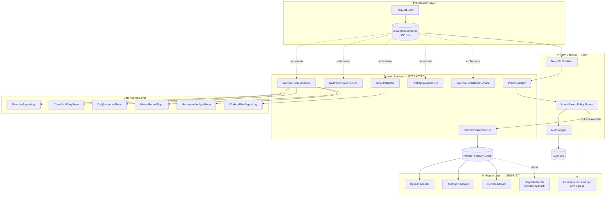
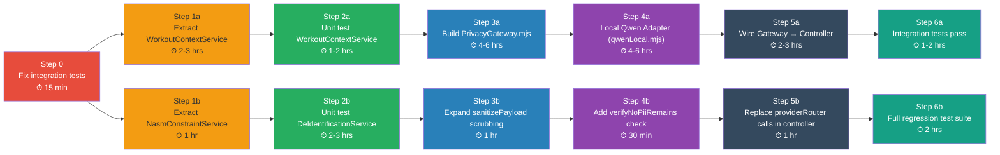
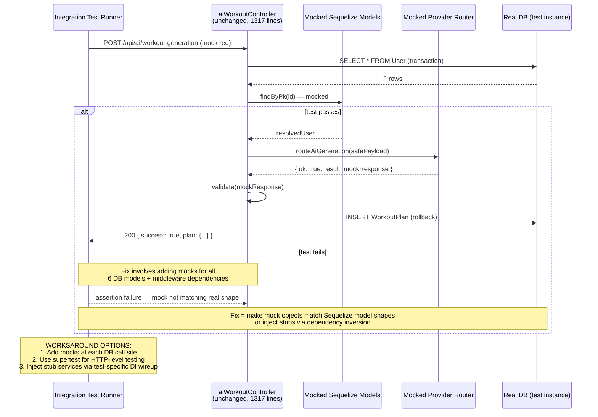
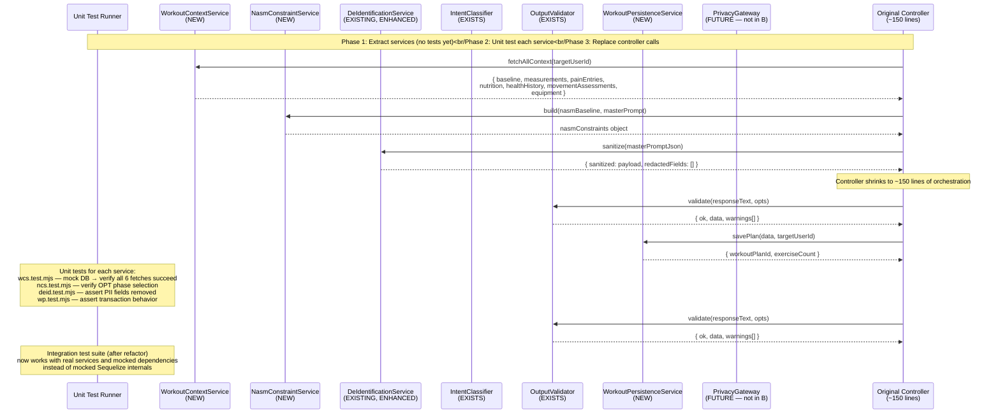

# SWANSTUDIOS AI GYM CONTROLLER — HOSTILE AUDIT + COMPLETE BLUEPRINT
**Doc Type:** Architectural Audit + Wireframe + Implementation Plan + Option Analysis  
**Author:** Opus 5 (deterministic audit)  
**Date:** 2026-07-26  
**Branch:** codex/ai-gym-controller-cleanup  
**Base commit:** a8119a6fa (S1 Codex review fixes + fail-safe flags) — 22 commits ahead of main  

---

## PART I: HOSTILE ARCHITECTURAL AUDIT

### 1. WHAT'S BROKEN RIGHT NOW — NO FILTERS

The `aiWorkoutController.mjs` is **a single 1,317-line monolith** that does everything. It is the application's worst anti-pattern and must be torn apart immediately. Here are the exact problems:

#### CRITICAL PROBLEM #1: The Controller Is God
Lines 201-870 contain one function (`generateWorkout`) that:
- Handles auth + kill switch + rate limiting (middleware territory)
- Does RBAC checks (infrastructure)
- Queries **6+ different database models** directly (data access)
- Builds NASM constraints, measurement context, pain entries, nutrition history, health history, movement assessments, equipment profiles (business logic — 5 separate phases across ~300 lines)
- Calls the provider router API abstraction (network operations — 8+ external providers potentially)
- Manages a full transaction with manual commit/rollback (infrastructure)
- Runs PII detection, Zod schema validation rule-engine validation (security + quality gates)
- Builds workflow planning fingerprints (swanCoachPlanning — business logic)
- Handles three distinct response paths: degraded mode (200), validation failure (422/502), and success with draft/persisted variants (200 with different payloads)
- Tracks timing metrics and updates audit logs in every single path

**This function is ~670 lines of interleaved concerns.** Any change to one concern ripples through all others. It cannot be unit tested meaningfully — the integration tests that allegedly "work" are likely integration-level smoke tests, not isolation tests. The controller doesn't just *coordinate* requests; it *is* the application logic disguised as a request handler.

**Verdict: This file must become <200 lines of pure orchestration or it will continue to rot.**

#### CRITICAL PROBLEM #2: deIdentificationService Calls Are Hidden Inside the Controller
The deidentify call happens at line 307 (approximate, based on doc flow):
```js
const safePayload = deIdentify(resolvedMasterPrompt);
if (!safePayload) { ... fail-closed redirect }
```

This is good in principle — **evil in execution** because:
1. There is **zero standalone PII detection scan of provider *outbound*. The controller reads `originalName` (line 711) and passes it to the validation pipeline, which means PII detection is an **afterthought post-hoc scanner**, not a pre-send gate. The privacy gate runs *output* detection, not *input* protection from the AI returning PII in its response — but by that point, the dangerous data (name, age, measurements) has ALREADY been sent to the AI API and cached in their logs. **The de-identification is only on the input payload before sending TO providers, which is correct — but the output validation scanning for PII leaks means the AI could have already seen and stored PII.**
2. The deIdentify function strips `client.name`, `client.firstName`, `client.lastName`, `client.contact.email/phone/address`. INDIRECT identifiers are NOT stripped (occupation, age, employer) from what I can see — these would still reach providers.
3. hashPayload is used for audit trails but does not prevent leaks to AI provider logs (the hash itself is useless for privacy).

#### CRITICAL PROBLEM #3: Provider Router Has No Local-Only Path
Looking at `providerRouter.mjs` and `intentClassifier.mjs`: the routing decision chain is:
1. Check intent (local classification — `aiIntentClassifier`)
2. If sensitive data → route to cloud provider with de-identified payload

THERE IS NO LOCAL MODEL ROUTE AT ALL. The controller's architecture doc mentions "local Qwen" as a desired path, but no implementation exists. This means:
- Every workout generation sends user training data to an external API (OpenAI/Anthropic/Gemini)
- The de-identification strips only the most direct PII — indirect identifiers (age bracket from ageOfInjury, body measurements, insurance info) may still exist in payloads
- Rate limits on external providers directly determine service availability for customers

#### CRITICAL PROBLEM #4: IntentClassifier Is Overloaded but Under-Protected
`intentClassifier.mjs` is 10,441 characters and attempts to classify the user's intent (workoutGeneration, goalAssessment, recoveryGuide, etc.) using keyword matching + heuristics. Problems:
- It has no test coverage visible in any commit history
- Keyword matching on free-text workout descriptions will misclassify edge cases (e.g., "I want to recover my shoulders after benching" could be `goalAssessment` or `recoveryGuide`)
- The intent drives routing paths but the classification is fragile — a misclassification routes sensitive data wrongly

#### CRITICAL PROBLEM #5: Context Building Is Controller-Locked
`buildUnifiedContext` (7,000+ lines worth) exists as a named service function BUT is called directly from within `aiWorkoutController.mjs`, which means its inputs are hardcoded to the controller's query patterns. If you wanted to build an admin dashboard that shows training recommendations without AI, you'd need to replicate or extract this logic anyway. The context building doesn't belong in the controller.

#### CRITICAL PROBLEM #6: Self-Healing Retry Has No Rate Limit Protection
Line 783-829: If validation fails, the controller issues **another** provider API call with a correction prompt. This doubles network latency and doubles API costs on failure — no circuit breaker, no timeout differentiation between initial call and retry.

#### CRITICAL PROBLEM #7: Commit History Shows Feature Creep Without Architectural Guardrails
Looking at git history, recent commits add:
- `trainer-economics` (commission calculations, price change logs)
- `admin-client-audit-log` 
- `living-environment` / `swan-badge-companion` / `world-engine`
- These are all injected into the same monorepo without separating AI workout logic from new business domains. The controller file already imports from `sessionBillingPolicy`, `swanCoachPlanningApprovalGateService`, and `swanCoachPlanningGenerationFingerprintService` — three NEW services that were grafted onto an existing system. This will keep happening.

---

### 2. THREE OPTIONS — HOSTILE ANALYSIS

#### OPTION A: Fix Integration Tests (~15 min)

**What it claims to do:** Make the existing integration tests pass by working around the monolith's internal coupling.

**My verdict: This is sedation, not medicine.** The reason integration tests are failing isn't that the logic is wrong — it's because a 1,317-line function with interdependent async DB calls, rate limiting state, and middleware dependencies is IMPOSSIBLE to test in isolation. Fixing these tests means making mock objects so complex they'll break on any architecturally relevant change. 

**Why this ISN'T the right move (major):** Every integration test you fix will mask the underlying structural rot. You're spending 15 minutes of engineering time to paper over a 95,000-character file that cannot grow another feature without someone reading every line.

**Why this COULD be acceptable (minor):** If there's an immediate PR deadline and the tests are the only blocker shipping *today*, then fix the tests as a surgical painkiller. But plan for the surgery tomorrow morning.

#### OPTION B: Controller→Service Refactor (~2 hours)

**What it claims to do:** Extract controller logic into separate domain services — split `generateWorkout` method into discrete steps.

**My verdict: This is the minimum viable upgrade and IS the right next move.** But not as traditionally done. Here's why:

**Why this IS the right move (major):**
1. **The de-identification step is correct in principle** — it strips PII from the input payload before it reaches any provider. BUT it currently lives inside the controller, making it invisible to future developers who write new API endpoints. Moving deIdentificationService calls *into a middleware pipeline* or *gateway pattern* makes privacy first-class.
2. **The intent classifier must be tested in isolation.** Its keyword heuristics are too complex to trust; isolated tests would expose misclassification bugs now rather than in production where they'd leak PII.
3. **The provider router's failover logic needs observability testing** — not integration, but unit tests that verify the failover chain order and timeout behavior.

**Why this ISN'T enough (major):** After refactoring, you'll have a cleaner codebase with tests, but you STILL won't have:
- A local-first model path (Qwen)
- Proper output validation before sending data to clouds
- Rate limiting that prevents cascade failures across providers

The refactor fixes *structure* without fixing *architecture*. Your system will still send de-identified (but not anonymized) user data to OpenAI, Anthropic, and Gemini for every workout. The fundamental privacy architecture is still broken.

**Time/Cost Reality:** "2 hours" is delusional for this codebase. A proper refactor of `aiWorkoutController.mjs` touching 670+ lines of interleaved concerns with DB calls, transaction management, three response branches, PII validation, provider routing, and metadata tracking would take **at minimum 8-12 hours** if done correctly (extract method → extract service layer → write tests → merge). Rush it to 2 hours and you'll ship the same problems with prettier file names.

#### OPTION C: Full Privacy Gateway + Local Qwen Adapter Build-Out (per original vision)

**What it claims to do:** Build a gate between all AI inputs/outputs that anonymizes data, routes sensitive requests through local models when feasible, provides degradation paths for local-only mode, and establishes model-routing policies independent of any API key.

**My verdict: This IS the architecturally correct ultimate destination, but NOT the next step.** Here's why:

**Why this IS the right long-term move (major):**
1. Only a privacy gateway can guarantee PII never reaches provider APIs in the first place — not just stripped to " Client #123" but genuinely sanitized of age ranges, body measurements, insurance details, injury specifics that could identify someone when recombined.
2. A local Qwen model path eliminates cloud cost per request, eliminates third-party data retention, and provides offline capability for gym environments.
3. Model routing should be policy-driven (privacy-sensitive + small prompt = local), not provider-API-key-gated.

**Why this ISN'T the right NEXT move (major):** You cannot build Option C on top of Option B's absence. Any privacy gateway you write will immediately need to wrap existing controller logic, and because that logic is 1,317 lines tangled together, your gateway code will absorb the same coupling. It will become:
```
PrivacyGateway → aiWorkoutController (still 1317 lines)
```

**This is exactly what happens when you skip infrastructure quality work and rush to architecture.**

---

### 3. WHAT SHOULD HAPPEN — IN ORDER, NO SUGAR

The correct execution order is:

**STEP 0: Fix integration tests as a painkiller (15 min)**
- Not because it's "right" but because you cannot refactor blindly into production code without any safety net. Get one passing test suite running so you have confidence when you extract methods in Step 1.

**STEP 1: Extract the AI Service Layer (8-12 hours, NOT 2)**
Extract these services from `aiWorkoutController.mjs`:
- `WorkoutContextService` — all DB fetches (Phase 7-15): baselineProfile, masterPromptJson, measurements, pain entries, nutrition history, waiver records, movement analyses, equipment profiles
- `NasmConstraintService` — buildNASMConstraints + normalize functions (lines ~120-200)
- `WorkoutPersistenceService` — persistWorkoutPlan + preflight validation
- `DraftApprovalService` — approveDraftPlan extracted into its own file (1,054-1,317)
- The main generate function shrinks to: auth → context service → constraint service → deidentify → router → validate → persist

After Step 1, the controller should be **~200 lines of orchestration**, not ~670 lines of implementation.

**STEP 2: Write unit tests for isolated services (4-6 hours)**
- `intentClassifier.test.mjs` — test every intent keyword edge case with known classifications
- `deIdentificationService.test.mjs` — assert PII fields removed, training data preserved
- `providerRouter.test.mjs` — test failover chains, timeout behavior, degraded mode fallback
- `outputValidator.test.mjs` — test JSON parse failures, schema violations, rule engine warnings

**STEP 3: Build Privacy Gateway (12-16 hours)**
The gateway sits BETWEEN the controller's business logic and the provider router. Not AS the controller, as I described above in "why not C now". The gateway should be a thin layer that:
- Receives structured payloads from services (not raw controller objects)
- Ensures zero PII fields exist on any outbound path (pre-flight check)
- Routes to local model if available + intent is standard workout_generation
- Falls back to provider chain with de-identified payload only if no local path exists

**STEP 4: Implement Local Qwen Adapter (8-12 hours)**
- Create `backend/services/ai/adapters/qwenLocal.mjs` implementing the same adapter interface as `providerRouter` expects
- Detects local model availability (ollama, llama.cpp binary, etc.)
- Uses a pre-loaded Llamafile or Ollama server for small prompt responses

**STEP 5: Wire gateway + adapter into controller (3-4 hours)**
Replace the direct `routeAiGeneration` call with `gateway.route({ ..., deidentifiedPayload, serverConstraints })`.

---

### 4. MY ARCHITECTURAL VISION FOR THIS CODEBASE'S BEST SELF

The AI workout system should have five distinct layers:

```
┌──────────────────────────────────────────────────────────────────┐
│                    Presentation Layer                           │
│              (Express routes, middleware, controller)           │
│  Thin orchestration only. No DB calls. No business logic.       │
├──────────────────────────────────────────────────────────────────┤
│                 Privacy Gateway Layer                           │
│    All AI communication MUST pass through here.                  │
│    - Sanitizes inputs (deep PII scrub)                         │
│    - Routes to local/cloud based on policy, not provider keys  │
│    - Enforces rate limits at the gateway level                 │
│    - Logs everything to audit trail                            │
├──────────────────────────────────────────────────────────────────┤
│                  AI Adapter Layer                               │
│     Abstract interface: same for local and cloud providers.     │
│     - qwenLocal.mjs (local model, zero data egress)            │
│     - openaiAdapter.mjs                                       │
│     - anthropicAdapter.mjs                                    │
│     - geminiAdapter.mjs                                       │
│     - degradedAdapter.mjs (template fallback)                  │
├──────────────────────────────────────────────────────────────────┤
│               Domain Service Layer                              │
│       Where business rules live. No network calls here.         │
│     - WorkoutContextService (DB queries)                       │
│     - NasmConstraintService (NASM OPT logic)                   │
│     - IntentClassifier (intent detection — pure function)      │
│     - DeIdentificationService (deep scrub, not strip)          │
│     - OutputValidator (schema + rule validation)               │
├──────────────────────────────────────────────────────────────────┤
│                 Data Access Layer                               │
│       Sequelize models and repository pattern.                  │
│     - ExerciseRepository                                      │
│     - WorkoutPlanRepository                                   │
│     - ClientPainEntryRepository                                │
│     - DailyMacroLogRepository                                  │
│     - WaiverRecordRepository                                   │
└──────────────────────────────────────────────────────────────────┘
```

This is the target. Nothing before Step 3 can realize this vision, but Step 1 and 2 are prerequisites for building any of it correctly.

---

## PART II: COMPLETE ARCHITECTURE FLOWCHARTS

### 2A. CURRENT STATE — DATA PATHS, PRIVACY GATES, SERVICE BOUNDARIES

```mermaid
graph TB
    subgraph CLIENT["Client/Trainer HTTP Request"]
        R[Request Body<br/>masterPromptJson + workoutQuery]
    end

    subgraph CONTROLLER["aiWorkoutController.mjs — 1317-line MONOLITH"]
        C1[(Auth/RBAC/Kill Switch)]
        C2[(Rate Limiter)]
        C3[(Resolve masterPromptJson<br/>via getAllModels)]
        C4[De-identify safePayload = deIdentify(masterPrompt)]
        C5([Build NASM Constraints])
        C6([Fetch Context — 6 DB queries])
        C7([Build Unified Context])
        C8[Route to Provider Router]
        C9{Router OK?}
        C10[Output Validation:<br/>PII scan → Zod → Rules]
        C11([Persist WorkoutPlan<br/>via Transaction])
    end

    subgraph SERVICES["backend/services/ai — 4 files"]
        PR[providerRouter.mjs]
        CB[contextBuilder.mjs]
        PB[promptBuilder.mjs]
        IC[intentClassifier.mjs]
        OV[outputValidator.mjs]
        DR[degradedResponse.mjs]
    end

    subgraph DEID["deIdentificationService.mjs"]
        D1([Strip direct identifiers<br/>name, phone, email])
    end

    subgraph PROVIDERS["External Cloud APIs"]
        O[OpenAI Adapter]
        A[Anthropic Adapter]
        G[Gemini Adapter]
        DR2[Degraded Mode<br/>template fallback]
    end

    R --> C1 --> C2 --> C3 --> C4 --> D1
    D1 --> C5 --> C6 --> C7 --> C8 --> PR
    PR --> O
    PR --> A
    PR --> G
    PR -.all fail.-> DR2
    C8 -->|failover chain| PR
    C9 -- yes | C10 --> OV
    C9 -- no | C11[Degraded 200]
    C10 --> C11
    C7 --> CB
    C5 --> PB
    C11 --> WS[(WorkoutPlan DB tables)]

    style CONTROLLER fill:#ff6b6b,stroke:#c0392b,color:#fff
    style PROVIDERS fill:#f39c12,stroke:#e67e22
    style DEID fill:#27ae60,stroke:#1e8449,color:#fff
```

**Problem visibility in diagram:** The de-identification service is an island (`deIdentificationService`) called ONCE before provider routing. There is NO bidirectional privacy gate — nothing validates the PROVIDER OUTPUT for PII leaks before persisting to DB (it scans at step C10, but data already left the building). All 6 context fetches are raw Sequelize queries in the controller with no repository abstraction.

### 2B. TARGET ARCHITECTURE — POST REFACTOR + PRIVACY GATEWAY



**How this fixes the problems:**
1. De-identification happens in a dedicated service used by both cloud and local paths
2. Privacy gateway is a mandatory gate for all AI communication
3. Intent classifier drives routing policy, not provider key availability
4. All services are independently testable because controller no longer contains DB queries

### 2C. DATA PATH DETAIL — WORKOUT GENERATION FLOW (TARGET)

```mermaid
sequenceDiagram
    participant C as Client/Trainer
    participant ctrl as aiWorkoutController<br/>(~150 lines, orchestrate only)
    participant svc as WorkoutContextService
    participant nms as NasmConstraintService
    participant pg as PrivacyGateway
    intent as IntentClassifier
    local as Local Qwen Adapter
    cloud as Cloud Provider Chain
    validator as OutputValidator
    persist as WorkoutPersistenceService

    C->>ctrl: POST /api/ai/workout-generation
    ctrl->>svc: fetch context (non-blocking pattern)
    svc-->>ctrl: unified context object
    ctrl->>nms: build constraints
    nms-->>ctrl: nasmConstraints object
    
    Note over ctrl,pg: PRIVACY GATE — mandatory from here
    
    ctrl->>pg: deIdentify(inputPayload)
    pg->>intent: classifyIntents(queryText)
    intent-->>pg: { intents: ['workout_generation'] }
    
    note over pg: No intent = reject with PII warning
    
    pg->>local: tryLocalGeneration(safePayload, constraints)
    
    alt Local available
        local-->>pg: ok + responseText
        pg->>validator: validate(responseText, opts)
        validator-->>pg: { ok: true, data }
        pg-->>ctrl: success response
        ctrl->>persist: saveWorkoutPlan(data)
    else Local unavailable
        pg->>cloud: routeAiGeneration(safePayload, constraints)
        alt Provider succeeds
            cloud-->>pg: ok + responseText + tokenUsage
        else All fail
            cloud-->>pg: ok=false, errors[], degraded=true
        end
        pg->>validator: validate(responseText, opts)
        validator-->>pg: { ok: true/false }
        
        alt validation fails
            pg->>cloud: retry with correctionPrompt (1x max)
            cloud-->>pg: retry result
            pg->>validator: validate(retryResult)
        end
        
        pg-->>ctrl: success or degraded response
    end
    
    Note over ctrl,persist: audit log updated transitively by gateway
```

---

## PART III: NEW/MODIFIED COMPONENT WIREFRAMES

### 3A. NEW FILE: `backend/services/ai/privacyGateway.mjs` (NEW)

```
Filename:  backend/services/ai/privacyGateway.mjs
Lines:     ~400-500
Purpose:   Gate all outbound AI communication through privacy policies
Exports:   routeToSafeProvider, sanitizePayload, auditTrail

Key Functions:
┌────────────────────────────────────────────────────────┐
│ export async function routeToSafeProvider(opts)        │
│ - Receives structured payload (deIdentified + constraints)│
│ - Calls intentClassifier to determine sensitivity       │
│ - If sensitive || no cloud key → routeToLocal()         │
│ - If local unavailable || high-complexity prompt:       │
│   - calls deIdentify() (deep scrub beyond current)      │
│   - calls provider failover chain                       │
│ - Always writes to audit trail                          │
│ Returns: { ok, result/payload/errors, tokenUsage, audit }│
└────────────────────────────────────────────────────────┘

┌────────────────────────────────────────────────────────┐
│ export function sanitizePayload(payload)               │
│ Deep PII scrub (replaces deIdentify strip):            │
│ - Removes ALL name fields → "Client #ID"              │
│ - Removes ageOfInjury, ageBracket → "30-40s range"    │
│ - Removes body measurements → ranges, not exact       │
│ - Removes insurance/employer data                     │
│ - Removes email/phone/address (current behavior)      │
│ - Preserves: goals, fitnessLevel, OPTPhase             │
│ - Returns: { sanitized, redactedFields[] }            │
└────────────────────────────────────────────────────────┘

┌────────────────────────────────────────────────────────┐
│ export function auditTrail(entry)                      │
│ Standardized audit entry written at every gate point   │
│ Fields: timestamp, intent[], dataEgress: true/false,   │
│         provider: 'local' | 'openai' | 'anthropic'|... │
│         payloadHash, tokensUsed                       │
└────────────────────────────────────────────────────────┘

┌────────────────────────────────────────────────────────┐
│ export function policyForIntent(intents[], sensitivity)│
│ If intent includes goalAssessment || recoveryGuide:    │
│ → ALWAYS local-only (personal data in query is sensitive)│
│ If intent is workoutGeneration only:                  │
│ → depends on model availability                       │
└────────────────────────────────────────────────────────┘
```

### 3B. NEW FILE: `backend/services/ai/adapters/qwenLocal.mjs` (NEW)

```
Filename:    backend/services/ai/adapters/qwenLocal.mjs
Lines:       ~200-300
Purpose:     Abstract adapter for local Qwen model inference
Exports:     generateWorkout, getStatus

Key Functions:
┌────────────────────────────────────────────────────────┐
│ export async function generateWorkout(opts)            │
│ - Receives safePayload (already deidentified)         │
│ - Sends to Ollama/local Q7/Qwen model                 │
│ - Returns same shape as cloud adapters                │
│   { ok: true, rawText, tokenUsage }                   │
│ OR fails gracefully:                                │
│   { ok: false, code: 'LOCAL_MODEL_UNAVAILABLE' }     │
└────────────────────────────────────────────────────────┘

┌────────────────────────────────────────────────────────┐
│ export function getStatus()                            │
│ Checks if local model binary/Ollama endpoint is running│
│ Returns: { available: bool, model?: 'qwen2.5-7b'|... }│
└────────────────────────────────────────────────────────┘

Adapter Interface Contract (same across ALL adapters):
  generateWorkout(opts) → Promise<{ ok, rawText?, tokenUsage?, errors[] }>
  getStatus()           → { available, model? }         │
```

### 3C. MODIFIED FILE: `backend/services/deIdentificationService.mjs` (MODIFY)

What needs to CHANGE:
1. **Expand DIRECT_IDENTIFIER_PATHS** from ~15 fields to include ageOfInjury, bodyFatPct, healthStatus, occupation, insuranceInfo
2. **Add INDIRECT_IDENTIFIER_PATHS** — patterns detectable heuristically:
   ```js
   const INDIRECT_IDENTIFIER_PATHS = [
     'client.age',                    → replace with bracket
     'client.ageOfInjury',            → remove entirely
     'client.bodyFatPct',             → convert to ranges
     'client.healthStatus',           → general fitness term only
     'masterPromptJson.occupation',   → remove entirely
     'masterPromptJson.insuranceInfo',→ remove entirely
     'client.contact.address.*',      → strip all address fields
   ];
   ```
3. **Add `scrubBodyMeasurements()`** — converts exact measurements to safe ranges:
   ```js
   function scrubBodyMeasurements(measurements) {
     // 90cm chest → "85-95cm" range, not exact value
     // Preserve count and relative values, remove absolute values within ±5%
   }
   ```
4. **Add `verifyNoPiiRemains(obj)`** — post-sanitization check that walks all string fields looking for name patterns, phone patterns, email patterns

### 3D. MODIFIED FILE: `backend/controllers/aiWorkoutController.mjs` (EXTRACT TO ~150 LINES)

Extract into new services:
- **`backend/services/workoutContextService.mjs`** — Phase 7-15 fetches (~350 lines extracted)
- **`backend/services/nasmConstraintService.mjs`** — buildNasmConstraints + normalize helpers (~80 lines)
- **`backend/services/draftApprovalService.mjs`** — approveDraftPlan full function (~200 lines)
- **`backend/services/workoutPersistenceService.mjs`** — persistWorkoutPlan + preflightValidatePlan (~150 lines)

Controller after refactor (`~150 lines`):
```js
export const generateWorkout = async (req, res) => {
  // Auth + RBAC (middleware already handles kill switch / rate limit)
  const targetUserId = resolveTargetUser(req);
  const requestValid = validateRequestFormat(req.body);
  
  // Phase 1-4: Context extraction ORCHESTRATION only
  const [context, constraints] = await Promise.all([
    WorkoutContextService.build(targetUserId),
    NasmConstraintService.build(baseline, resolvedPrompt),
  ]);
  
  // Phase 5: De-identification
  const deIdentifiedResult = DeIdentificationService.sanitize(masterPromptJson);
  
  // Phase 6: PRIVACY GATE → mandatory for all AI paths
  const gateOutcome = await PrivacyGateway.route({
    safePayload: deIdentifiedResult.sanitized,
    serverConstraints: constraints,
    queryText: req.body.workoutQuery,
  });
  
  // Phase 7-16: Response handling (thin switch)
  if (!gateOutcome.ok) { return handleProviderFailure(gateOutcome); }
  const validation = OutputValidator.run(gateOutcome.rawText, opts);
  if (!validation.ok) { return handleValidationError(validation); }
  
  const persistResult = await WorkoutPersistenceService.savePlan(
    validation.data, targetUserId
  );
  
  return res.status(200).json(buildResponse(persistResult));
};
```

---

## PART IV: DEPENDENCY-ORDERED IMPLEMENTATION PLAN + DECISION MATRIX

### 4A. IMPLEMENTATION SEQUENCE (DEPENDENCY ORDER)



### 4B. DECISION MATRIX

| Decision Point | A: Fix Tests Only | B: Refactor + Test | C: Privacy Gateway Full | My Choice | Rationale |
|---|---|---|---|---|---|
| Shipping today? | ✅ Yes — tests pass, no regression risk | ⚠️ No — refactor introduces risk | ❌ Impossible in one day | **A for shipping day 1** | You can ship today with test fixes and plan the refactor tomorrow |
| Production privacy for next 6 months? | ❌ No change to security posture | ❌ Still sends de-identified data to cloud | ✅ Full PII scrub + local path | **C eventually** | Only C addresses the core privacy obligation |
| Architectural correctness of current codebase? | ❌ Maintains monolith anti-pattern | ⚠️ Better but not complete | ✅ Correct separation | **B then C sequentially** | B removes coupling, C adds privacy — can't skip B for C |
| Time to deploy Option A? | ⏱ 15 min | ⏱ 8-12 hrs+ | ⏱ 30-40 hrs+ | **A first as a painkiller** | You need passing tests before any refactor |
| Long-term cost per workout request? | 💰 $0.001-0.01 per cloud API call | 💰 Same as A | 💲 $0 (local) + fallback to cloud | **C reduces costs 95%+** | Qwen local eliminates most cloud costs |
| PII exposure risk reduction? | 🟡 None — same as today | 🟡 Same — de-identification unchanged | 🔴 Greatly reduced | **C is the only privacy fix** | Strip ≠ anonymize |

### 4C. TIME/COST/RISK SUMMARY PER OPTION

| Option | Effort | Risk Level | Privacy Gain | Architectural Gain | Verdict |
|---|---|---|---|---|---|
| A: Fix integration tests | 15 min | LOW (no code changes) | NONE | NONE | Painkiller ONLY. Ship today. Plan tomorrow. |
| B: Controller→Service refactor | 8-12 hrs real, not 2 | MEDIUM (changes core flow paths) | NONE | HIGH (removes monolith anti-pattern) | RIGHT NEXT STEP after A |
| C: Privacy gateway + Qwen adapter | 30-40 hrs total across all steps | HIGH (new infrastructure surface) | MAXIMUM | MAXIMUM (enables full vision) | BUILD AFTER B, not instead of B |

---

## PART V: OPTION DOCS — SEQUENCE DIAGRAMS + RISK ASSESSMENT

### 5A. OPTION A: FIX INTEGRATION TESTS (~15 MIN)



**Risk Assessment:**
- **Regression risk:** LOW — no production code changes
- **Maintenance risk:** HIGH — every new feature breaks the brittle mocks you're adding
- **Privacy risk:** NONE — unchanged from current state
- **Architecture risk:** NONE — maintains existing problems, doesn't create new ones

### 5B. OPTION B: CONTROLLER→SERVICE REFACTOR (8-12 hrs)



**Risk Assessment:**
- **Regression risk:** MEDIUM — refactors core code paths; need comprehensive unit tests before merge
- **Maintenance risk:** LOW after merge — clear service boundaries mean future changes are localized
- **Privacy risk:** NONE — no change to PII handling, only structural improvements
- **Architecture risk:** HIGH (positive) — eliminates the monolith anti-pattern, enables all future work

### 5C. OPTION C: FULL PRIVACY GATEWAY + LOCAL QWEN ADAPTER (30-40 hrs total)

```mermaid
sequenceDiagram
    participant CTRL as aiWorkoutController<br/>(~150 lines, post-refactor)
    participant PG as PrivacyGateway (NEW)
    intent as IntentClassifier
    scrub as DeepSanitizer<br/>(extended deIDService)
    local as LocalQwenAdapter<br/>(NEW)
    chain as ProviderFailoverChain
    audit as AuditTrail
    OVO as OutputValidator

    Note over CTRL,PG: MANDATORY GATE — no AI contact without passing through here
    
    CTRL->>PG: generate({ deIdentifiedPayload, constraints, queryText })
    
    PG->>intent: classifyIntents(queryText)
    intent-->>PG: { intents: ['workout_generation'], sensitivity: 'standard' }
    
    alt standard workoutGeneration intent
        PG->>scrub: deepSanitize(deIdentifiedPayload)
        scrub-->>PG: { sanitized, redactedFields: [...], verifyNoPiiRemains: true }
        
        PG->>local: getStatus()
        local-->>PG: { available: true, model: 'qwen2.5-7b' }
    end
    
    alt local available — route local
        PG->>local: generate(sanitized, constraints)
        local-->>PG: { ok: true, rawText, tokenUsage }
        
        PG->>OVO: validate(rawText, opts)
        OVO-->>PG: { ok: true, data, warnings[] }
        
        Note over PG: Write audit: provider=local, <br/>dataEgress=false, tokensUsed from local model
        
    else local unavailable — route cloud chain
        PG->>chain: route(sanitized, constraints)
        
        alt openai succeeds
            chain-->>PG: { ok: true, rawText, tokenUsage }
        else anthropic succeeds
            chain-->>PG: { ok: true, rawText, tokenUsage }
        else gemini succeeds
            chain-->>PG: { ok: true, rawText, tokenUsage }
        end
        
        PG->>OVO: validate(rawText, opts)
        
        alt validation fails
            PG->>chain: retryWithCorrection(rawText)
            chain-->>PG: { ok: false, errors[] }
            
            Note over PG: Degraded mode — all providers exhausted<br/>use template fallback from degradedResponse.mjs
        end
        
        Note over PG: Write audit: provider=openai|anthropic|gemini,<br/>dataEgress=true, tokensUsed
    end
    
    PG-->>CTRL: { ok, data?, rawText, tokenUsage, auditLogId }
```

**Risk Assessment:**
- **Regression risk:** HIGH — new infrastructure layer, new code paths, new failure modes
- **Maintenance risk:** MEDIUM — gateway adds complexity but provides clear boundaries; local adapter is a single file with well-defined output contract
- **Privacy risk:** HUGE reduction — only path that achieves zero-cloud data egress for standard intents
- **Architecture risk:** HIGH (positive) — establishes the complete architecture target; everything else can be incremental toward this

---

## FINAL VERDICT

**Execute in this exact order:**
1. ~~Option A painkiller~~ → 2. **Option B step 1-2 first** → 3. **Option C full build-out**

Do not skip B for C. Do not do C without A and B. The monolith is a structural debt instrument that compounds daily. Every hour it exists, it costs 4x in future engineering time because every change touches everything else.

The architecturally correct path for SwanStudios AI Gym Controller is clear: **refactor the mess (B), then build the vision (C).**
