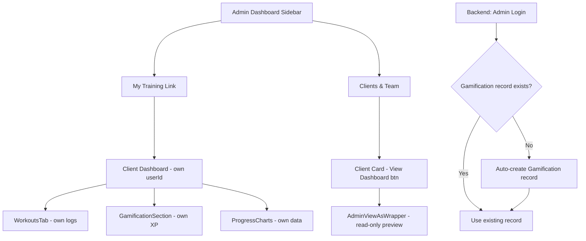

# Blueprint: Admin-as-Client & Client Impersonation UX

## Status: PENDING AI VILLAGE VALIDATION
## Author: Claude Opus 4.6 (CEO) | Date: 2026-03-25

---

## Problem Statement

1. **Admin (Sean Swan) has no client profile** — Cannot log own workouts, earn XP, or see personal progress charts. The system treats admin as management-only, but Sean is also a working trainer who trains himself.

2. **Client impersonation is hidden** — The "View as Client" feature exists (`/dashboard/people/view-as/:userId`) but there's no obvious entry point from client cards or the admin dashboard. Users can't find it.

---

## Architecture Decision: Admin Gets Full Client Capabilities

### Why NOT a Separate Account
- Forces logout/login switching — terrible UX for someone who is simultaneously managing clients AND training
- Splits identity — gamification, social posts, profile all fragmented
- Breaks RBAC model — admin should be a superset of all roles, not a separate silo

### Why Admin-as-Superset
- `authorize()` middleware already gives admin universal access (line 450-453 of authMiddleware.mjs)
- Routes already allow admin on client pages: `allowedRoles={['client', 'admin']}`
- Admin just needs data initialization (gamification record, default goals) to use client features
- Single identity across admin + client + social

---

## Wireframe

```
┌─────────────────────────────────────────────────────────────────┐
│  ADMIN DASHBOARD — Clients & Team Tab                           │
├─────────────────────────────────────────────────────────────────┤
│                                                                 │
│  ┌─ Client Card ────────────────────────────────────────────┐   │
│  │ [Photo]  Jackie Smith         Level 3 · Bronze Forge     │   │
│  │          Active · 12 sessions                             │   │
│  │                                                           │   │
│  │  [📊 View Dashboard]  [✏️ Edit]  [📋 Progress]           │   │
│  └──────────────────────────────────────────────────────────┘   │
│                                                                 │
│  "View Dashboard" → /dashboard/people/view-as/:userId           │
│                                                                 │
├─────────────────────────────────────────────────────────────────┤
│  ADMIN SIDEBAR — New Entry                                      │
│                                                                 │
│  ┌─ Sidebar ────────┐                                           │
│  │ 🏠 Dashboard      │                                           │
│  │ 👥 Clients & Team │                                           │
│  │ 🏋️ Workouts       │                                           │
│  │ 📅 Scheduling     │                                           │
│  │ 🎮 Gamification   │                                           │
│  │ 🛒 Store          │                                           │
│  │ 📹 Content Studio │                                           │
│  │ 📊 Analytics      │                                           │
│  │ ⚙️ System          │                                           │
│  │ ─────────────────│                                           │
│  │ 👤 MY TRAINING    │  ← NEW: Links to /client-dashboard       │
│  └──────────────────┘                                           │
│                                                                 │
│  "My Training" shows Sean's own client dashboard with his       │
│  workouts, XP, badges, and progress charts.                     │
│                                                                 │
└─────────────────────────────────────────────────────────────────┘
```

---

## Mermaid Architecture



---

## Implementation Plan

### Change 1: Auto-initialize Client Data for Admin/Trainer Users
**File:** `backend/controllers/authController.mjs` (login handler)
**What:** After successful admin/trainer login, check if Gamification record exists. If not, create one with defaults. This ensures admin users can immediately use client features.

```javascript
// After successful login, ensure gamification record exists
if (['admin', 'trainer'].includes(user.role)) {
  const [gamRecord] = await Gamification.findOrCreate({
    where: { userId: user.id },
    defaults: { level: 1, currentXP: 0, totalXP: 0, tier: 'bronze' }
  });
}
```

### Change 2: Add "My Training" Link to Admin Sidebar
**File:** `frontend/src/components/DashBoard/` (sidebar/navigation component)
**What:** Add a "My Training" nav item at the bottom of the admin sidebar that links to `/client-dashboard`. Only visible for admin/trainer roles.

### Change 3: Add "View Dashboard" Button to Client Cards
**File:** `frontend/src/components/DashBoard/Pages/admin-clients/` (client card/list component)
**What:** Add a visible button on each client card that navigates to `/dashboard/people/view-as/:userId`. Currently the feature exists but has no obvious entry point.

### Change 4: Client Dashboard Handles Admin Role
**File:** `frontend/src/components/ClientDashboard/` or equivalent
**What:** Ensure the client dashboard doesn't show "Access Denied" for admin users. The route already allows `['client', 'admin']` but the component may have internal role checks. Verify and fix.

### Change 5: WorkoutsTab Uses Own userId for Admin
**File:** `frontend/src/components/UserDashboard/components/WorkoutsTab.tsx`
**What:** When admin accesses their own training view, the API call should use the admin's own userId, not try to fetch "all clients." The current code uses `authAxios.get('/api/workout/sessions')` which already scopes to the logged-in user — this should work as-is.

---

## Data Flow

```
Admin Login → authController checks Gamification.findOrCreate()
            → Gamification record created if missing
            → Admin can now earn XP, log workouts, see progress

Admin clicks "My Training" → /client-dashboard
            → RevolutionaryClientDashboard loads
            → Fetches data using admin's own userId
            → Shows workout logs, XP, charts, badges

Admin clicks "View Dashboard" on client card → /dashboard/people/view-as/:userId
            → AdminViewAsWrapper loads
            → Fetches client data read-only
            → Shows security banner "Viewing as [Name]"
```

---

## Click-Outcome Flowchart

```
[Sidebar: "My Training"] → Navigate to /client-dashboard → Load own workout/XP data → Show personal dashboard
[Client Card: "View Dashboard"] → Navigate to /dashboard/people/view-as/:userId → Fetch client data → Read-only preview
[View-As Banner: "Exit"] → Navigate back to /dashboard/people → Return to client list
[WorkoutsTab: "Log Workout"] → Navigate to /dashboard/admin-sessions → Open workout logger
```

---

## Security Considerations

- **No role change** — Admin stays admin, just uses client features with own userId
- **No token swap** — View-as uses data-fetch only, not session impersonation
- **Audit trail** — All admin workout logs are tagged with admin's userId, distinguishable in DB
- **RBAC preserved** — `authorize()` already gives admin universal access (authMiddleware.mjs:450-453)

---

## Files to Modify

| # | File | Change | Risk |
|---|------|--------|------|
| 1 | `backend/controllers/authController.mjs` | findOrCreate Gamification on login | LOW — additive |
| 2 | Admin sidebar component (TBD — need to locate) | Add "My Training" link | LOW — UI only |
| 3 | Client card component in admin-clients | Add "View Dashboard" button | LOW — UI only |
| 4 | `RevolutionaryClientDashboard` or client dashboard | Verify admin role not blocked | LOW — may already work |
| 5 | No WorkoutsTab changes needed | Already uses logged-in user's data | NONE |

---

## Testing Plan

1. Login as admin (Sean Swan)
2. Click "My Training" in sidebar → should load client dashboard with empty state (no workouts yet)
3. Log a workout via the workout logger
4. Return to "My Training" → should show the logged workout in charts
5. Go to Clients & Team → click "View Dashboard" on Jackie's card → should show Jackie's data read-only
6. Verify admin sidebar still shows all admin tabs + the new "My Training" link
7. Verify XP is awarded to admin's Gamification record after workout logging

---

## Estimated Impact

- **5 files modified** (1 backend, 3-4 frontend)
- **~50-80 lines of code** total
- **No migrations needed** — Gamification.findOrCreate handles missing records
- **No breaking changes** — additive only
- **Backward compatible** — existing client/trainer flows unchanged
