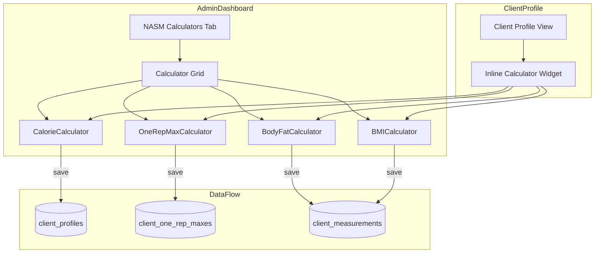
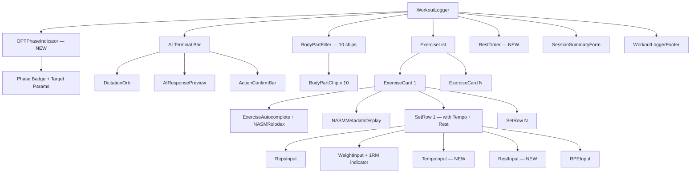
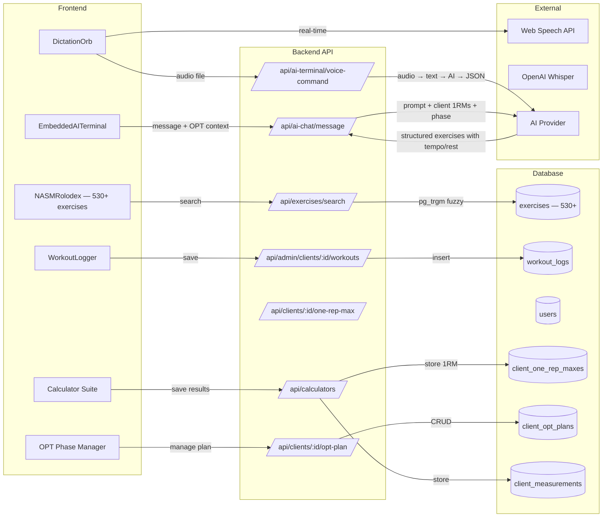

# SwanStudios Embedded AI Terminal + NASM-Protocol Workout System — Master Blueprint V2.0

> **Version:** 2.0 | **Date:** 2026-03-21
> **Author:** Sean Swan (CEO) + Claude Opus 4.6 (CEO AI) + Gemini 3.1 Pro (CTO)
> **Status:** PENDING AI VILLAGE VALIDATION — Blueprint-First Protocol Active
> **Priority:** P0 — Core Trainer Workflow
> **Predecessor:** V1.0 (`EMBEDDED-AI-TERMINAL-AND-WORKOUT-LOGGER-MASTER-PROMPT.md`)
> **AI Village Run:** Pending — Must pass 11-Brain validation before implementation

---

## Table of Contents

1. [Vision & Problem Statement](#1-vision--problem-statement)
2. [7-Star Documentation Standard (NEW MANDATORY)](#2-7-star-documentation-standard)
3. [No-Monolith File Rule (NEW MANDATORY)](#3-no-monolith-file-rule)
4. [Blueprint-First Protocol](#4-blueprint-first-protocol)
5. [NASM OPT Model Integration (NEW)](#5-nasm-opt-model-integration)
6. [1RM Conversion Engine (NEW)](#6-1rm-conversion-engine)
7. [NASM Calculator Suite (NEW)](#7-nasm-calculator-suite)
8. [Comprehensive Exercise Database — 500+ Exercises (EXPANDED)](#8-comprehensive-exercise-database)
9. [NASM-Standard Workout Forms (NEW)](#9-nasm-standard-workout-forms)
10. [Embedded AI Terminal Architecture](#10-embedded-ai-terminal-architecture)
11. [Workout Logger Redesign](#11-workout-logger-redesign)
12. [Voice-First Dictation Workflow](#12-voice-first-dictation-workflow)
13. [Component Wireframes](#13-component-wireframes)
14. [Data Flow Architecture](#14-data-flow-architecture)
15. [API Contract](#15-api-contract)
16. [Implementation Phases](#16-implementation-phases)
17. [Verification & QA](#17-verification--qa)

**Appendices:**
- [A: NASM OPT Phase Specifications](#appendix-a-nasm-opt-phase-specifications)
- [B: 1RM Conversion Chart (5–1000 lbs)](#appendix-b-1rm-conversion-chart)
- [C: Full Exercise Database (500+ Exercises by Category)](#appendix-c-full-exercise-database)
- [D: AI Village Amendments from V1.0](#appendix-d-ai-village-amendments-from-v10)
- [E: Files To Create / Modify](#appendix-e-files-to-create--modify)

---

## 1. Vision & Problem Statement

### The Problem (V1.0 + V2.0 Gaps)

**V1.0 problems (still valid):**
- AI lives in floating drawer, disconnected from page context
- Workout logging has no NASM autocomplete, no body-part rolodex
- Exercise entry is manual — no AI fill
- No voice-to-form pipeline

**V2.0 NEW gaps identified:**
- No NASM OPT periodization model — workouts don't follow the 5-phase progression
- No 1RM tracking or conversion — trainers can't calculate training loads per OPT phase
- No built-in calculators (BMI, body fat, calorie, 1RM) — trainers leave the app to use nasm.org
- Only 75 NASM exercises — missing hundreds of common exercises (dumbbells, cables, machines, kettlebells, bands, P90X, Tae Bo, landmine, etc.)
- Workout forms don't track NASM-standard TEMPO (eccentric/isometric/concentric) or structured rest periods
- No annual/monthly programming view for periodized training
- AI doesn't follow NASM OPT protocol when generating workouts
- Code documentation is inconsistent — no standard for comments across AI agents
- Large monolith files are accumulating (some >1000 lines)

### The Vision: 7-Star NASM-Protocol AI Training Platform

Everything from V1.0 PLUS:

1. **NASM OPT-native** — AI generates workouts following the 5-phase periodization model based on client's current phase
2. **1RM-aware** — System calculates and tracks estimated 1RM, auto-suggests training loads per OPT phase
3. **Built-in calculators** — BMI, body fat %, calorie/TDEE, 1RM — no leaving the app
4. **500+ exercises** — Comprehensive library from NASM, P90X, Tae Bo, Squat University, free-exercise-db, plus all equipment types
5. **NASM-standard forms** — Every workout log includes tempo (4/2/1), rest periods, RPE, and OPT phase context
6. **Annual/monthly programming** — Visual periodization planner showing phase progression across 12 months
7. **7-star documentation** — Every file has enterprise-grade comments that junior devs can understand
8. **No monolith files** — Max 300 lines per component, mandatory decomposition

---

## 2. 7-Star Documentation Standard (NEW MANDATORY)

### Why This Exists
With 6+ AI agents (Opus, Gemini, Sonnet, Flash, DeepSeek, MiniMax) and human developers working on this codebase, code without clear documentation becomes unreadable within days. Junior developers must be able to understand every component without asking anyone.

### The Standard

Every file in the codebase MUST follow this documentation pattern:

#### Level 1: File Header (MANDATORY — all files)
```typescript
/**
 * ============================================================================
 * FILE: ComponentName.tsx
 * PURPOSE: [One clear sentence explaining what this file does]
 * AUTHOR: [Who created it] | LAST MODIFIED: [Date]
 * AI VILLAGE VALIDATED: [Date of last validation run]
 * ============================================================================
 *
 * WHAT THIS FILE DOES:
 * --------------------
 * [2-3 sentences in plain English. A junior developer who has never seen this
 *  codebase should understand what this component does after reading this.]
 *
 * HOW IT FITS IN THE APP:
 * -----------------------
 * Parent: [ParentComponent] renders this inside [where]
 * Children: [ChildA], [ChildB] — each handles [what]
 * Data: Receives [props] from parent, fetches [API calls] on mount
 *
 * KEY DECISIONS:
 * --------------
 * - [Why we chose approach X over Y — e.g., "React Context not Zustand because..."]
 * - [Any non-obvious architectural choice and its rationale]
 *
 * NASM PROTOCOL CONTEXT (if applicable):
 * --------------------------------------
 * - [Which OPT phase this relates to]
 * - [How it enforces NASM standards]
 */
```

#### Level 2: Section Comments (MANDATORY — every logical section)
```typescript
// ─────────────────────────────────────────────────────────────
// SECTION: State Management
// PURPOSE: Track the exercise list, loading states, and AI responses
// WHY: We use local state (not context) because this data changes
//      on every keystroke during dictation — sharing it would cause
//      re-renders across the entire dashboard (see AI Village Issue #4)
// ─────────────────────────────────────────────────────────────
```

#### Level 3: Inline Comments (MANDATORY — non-obvious logic)
```typescript
// Brzycki formula: estimated1RM = weight / (1.0278 - 0.0278 × reps)
// More accurate than Epley for rep ranges 1-10
// Source: Brzycki, M. (1993). "Strength Testing"
const estimated1RM = weight / (1.0278 - 0.0278 * reps);

// OPT Phase 1 (Stabilization): 12-20 reps at 50-70% 1RM
// This percentage range ensures muscular endurance adaptation
// without exceeding the client's stabilization capacity
const targetWeight = Math.round(estimated1RM * phasePercentage);
```

#### Level 4: Function Documentation (MANDATORY — all exported functions)
```typescript
/**
 * Calculates the estimated 1-Rep Maximum using the Brzycki formula.
 *
 * WHY BRZYCKI: More accurate than Epley for rep ranges 1-10, which covers
 * all NASM OPT phases. Epley overestimates at high rep counts (Phase 1).
 *
 * @param weight - The weight lifted in pounds (must be > 0)
 * @param reps - The number of reps completed (must be 2-10, not valid for 1 rep)
 * @returns The estimated 1RM in pounds, rounded to nearest 5
 *
 * @example
 * calculate1RM(135, 10) // Returns 180 (135 / (1.0278 - 0.0278 * 10))
 * calculate1RM(225, 5)  // Returns 253 (225 / (1.0278 - 0.0278 * 5))
 */
```

#### Level 5: Blueprint Header (MANDATORY — components >100 lines)
See Section 4 (Blueprint-First Protocol) for the full wireframe/mermaid format.

### Enforcement
- AI Village Phase 1 validators check for documentation presence
- PRs missing documentation on new/modified files are blocked
- `CLAUDE.md` includes this standard as mandatory

---

## 3. No-Monolith File Rule (NEW MANDATORY)

### The Rule
**No single file may exceed 300 lines of code (excluding comments and blank lines).**

### Why
- Monolith files are the #1 cause of merge conflicts in multi-AI development
- Files >300 lines become impossible to reason about in a single context window
- Decomposition forces better separation of concerns
- Smaller files = faster AI Village validation (each file reviewed independently)

### Decomposition Strategy
When a component approaches 300 lines:

1. **Extract sub-components** — Any JSX rendered inside `.map()` becomes its own file
2. **Extract hooks** — Custom logic (data fetching, state machines, calculations) → `use[Feature].ts`
3. **Extract utils** — Pure functions (parsers, formatters, calculators) → `utils/[feature].ts`
4. **Extract types** — Shared interfaces/types → `[Feature]Types.ts`
5. **Extract constants** — Config objects, default values, enums → `[Feature]Constants.ts`
6. **Extract styled components** — When >5 styled components exist → `[Feature]Styles.ts`

### Example Decomposition
```
// BEFORE: WorkoutLogger.tsx (800 lines — VIOLATION)

// AFTER:
WorkoutLogger.tsx           (180 lines — orchestrator)
├── useWorkoutLogger.ts     (120 lines — state + API logic)
├── WorkoutLoggerTypes.ts   (80 lines — interfaces)
├── WorkoutLoggerStyles.ts  (100 lines — styled components)
├── ExerciseCard.tsx         (150 lines — single exercise)
├── SetRow.tsx              (80 lines — single set row)
├── BodyPartFilter.tsx      (100 lines — filter chips)
├── SessionSummary.tsx      (120 lines — summary form)
└── NASMRolodex.tsx         (150 lines — exercise picker)
```

### Exceptions
- Migration files (SQL operations are sequential by nature)
- Seed data files (large datasets)
- Type definition files (can be large if many interfaces)
- Test files (test suites can be long)

---

## 4. Blueprint-First Protocol

> Carried forward from V1.0 with enhancements.

### The Rule
**Every major component MUST have a blueprint comment block at the very top of the file.** This serves as the source of truth for what the component does, how it's structured, what data flows through it, and how sub-components relate.

### Blueprint Format — Main Components

```typescript
/**
 * ╔══════════════════════════════════════════════════════════════╗
 * ║  COMPONENT: [ComponentName]                                  ║
 * ║  PURPOSE: [One-line description]                             ║
 * ║  OWNER: [Which AI/person last modified]                      ║
 * ║  LAST VALIDATED: [Date of last AI Village run]               ║
 * ╚══════════════════════════════════════════════════════════════╝
 *
 * ┌─── WIREFRAME ─────────────────────────────────────────────┐
 * │ [ASCII art showing the visual layout of this component]    │
 * └───────────────────────────────────────────────────────────┘
 *
 * ┌─── DATA FLOW ─────────────────────────────────────────────┐
 * │ Props In:  { ... }                                         │
 * │ State:     { ... }                                         │
 * │ API Calls: GET/POST ...                                    │
 * │ Events:    [what this component emits]                     │
 * │ Children:  [sub-components and their roles]                │
 * └───────────────────────────────────────────────────────────┘
 *
 * ┌─── ARCHITECTURE (Mermaid) ────────────────────────────────┐
 * │ graph TD                                                   │
 * │   A[Component] --> B[Child1]                               │
 * │   A --> C[Child2]                                          │
 * └───────────────────────────────────────────────────────────┘
 *
 * ┌─── NASM PROTOCOL ─────────────────────────────────────────┐
 * │ OPT Phase: [Which phases this component serves]           │
 * │ Standards: [NASM standards enforced here]                  │
 * └───────────────────────────────────────────────────────────┘
 *
 * ┌─── SECURITY ──────────────────────────────────────────────┐
 * │ Auth: [Required role]                                      │
 * │ Input: [Sanitization rules]                                │
 * │ RBAC: [What this role can/cannot do]                       │
 * └───────────────────────────────────────────────────────────┘
 */
```

### Blueprint Format — Sub-Components

```typescript
/**
 * ┌─── SUB-COMPONENT: [Name] ─────────────────────────────────┐
 * │ PARENT: [ParentComponent]                                  │
 * │ PURPOSE: [What this sub-component does]                    │
 * │                                                            │
 * │ WIREFRAME:                                                 │
 * │ ┌────────────────────────────────────┐                    │
 * │ │ [Visual layout of this component]  │                    │
 * │ └────────────────────────────────────┘                    │
 * │                                                            │
 * │ Props: { ... }                                             │
 * │ State: Local only (...)                                    │
 * └────────────────────────────────────────────────────────────┘
 */
```

### Enforcement Rules
1. No component >100 lines may exist without a blueprint header
2. AI Village Phase 1 validators check for blueprint presence
3. When modifying a component, update its blueprint FIRST
4. Sub-components reference their parent's blueprint
5. Mermaid diagrams go in the blueprint, not separate files

---

## 5. NASM OPT Model Integration (NEW)

### What is the OPT Model?

The NASM Optimum Performance Training (OPT) model is a 5-phase periodization system that progressively trains clients from stabilization through power:

```
┌─────────────────────────────────────────────────────────────┐
│                    NASM OPT MODEL                            │
│                                                              │
│  Phase 5: POWER                    ┌─────┐                  │
│  Phase 4: MAXIMAL STRENGTH      ┌──┤     │                  │
│  Phase 3: HYPERTROPHY        ┌──┤  │     │                  │
│  Phase 2: STRENGTH ENDURANCE ┌──┤  │     │                  │
│  Phase 1: STABILIZATION      │  │  │     │                  │
│  ════════════════════════════╧══╧══╧═════╧══                │
│  Months: 1-2  │  3-4  │  5-6  │  7-8  │  9-10              │
│                                                              │
│  RE-ASSESSMENT after every 2 phases                         │
└─────────────────────────────────────────────────────────────┘
```

### Phase Specifications

| Phase | Name | Reps | Sets | Tempo | Rest | Intensity (% 1RM) | Goal |
|-------|------|------|------|-------|------|-------------------|------|
| 1 | Stabilization Endurance | 12-20 | 1-3 | 4/2/1 (slow) | 0-90s | 50-70% | Muscular endurance, core stability, joint integrity |
| 2 | Strength Endurance | 8-12 | 2-4 | 2/0/2 (moderate) | 0-60s | 70-80% | Increase lean body mass + stabilization |
| 3 | Muscular Development (Hypertrophy) | 6-12 | 3-5 | 2/0/2 (moderate) | 0-60s | 75-85% | Maximal muscle growth |
| 4 | Maximal Strength | 1-5 | 4-6 | X/0/X (explosive) | 3-5min | 85-100% | Increase motor unit recruitment |
| 5 | Power | 1-5 (strength) / 8-10 (power) | 3-6 | X/0/X (explosive) | 3-5min | 30-45% (power) / 85-100% (strength) | Superset: strength + power exercise |

> **Tempo notation:** Eccentric / Isometric (pause) / Concentric — e.g., "4/2/1" = 4s lowering, 2s hold, 1s lifting

### Annual Programming Template

```
┌─────────────────────────────────────────────────────────────────────┐
│ ANNUAL OPT PERIODIZATION PLAN — [Client Name]                       │
├──────┬──────┬──────┬──────┬──────┬──────┬──────┬──────┬──────┬─────┤
│ Mon  │ Jan  │ Feb  │ Mar  │ Apr  │ May  │ Jun  │ Jul  │ Aug  │ ... │
├──────┼──────┼──────┼──────┼──────┼──────┼──────┼──────┼──────┼─────┤
│Phase │  1   │  1   │  2   │  2   │  3   │  3   │  4   │  4   │  5  │
│Focus │Stab. │Stab. │Str.E │Str.E │Hyper │Hyper │Max.S │Max.S │Power│
│Reps  │12-20 │12-20 │ 8-12 │ 8-12 │ 6-12 │ 6-12 │ 1-5  │ 1-5  │1-10 │
│%1RM  │50-70 │50-70 │70-80 │70-80 │75-85 │75-85 │85-100│85-100│30-100│
│Tempo │4/2/1 │4/2/1 │2/0/2 │2/0/2 │2/0/2 │2/0/2 │X/0/X │X/0/X │X/0/X│
│Rest  │0-90s │0-90s │0-60s │0-60s │0-60s │0-60s │3-5m  │3-5m  │3-5m │
├──────┼──────┴──────┼──────┴──────┼──────┴──────┼──────┴──────┴─────┤
│Assess│   ✓ Re-assess│   ✓ Re-assess│   ✓ Re-assess│   ✓ Re-assess    │
│Cardio│ Zone 1-2    │ Zone 1-2    │ Zone 2-3    │ Zone 3-4          │
└──────┴─────────────┴─────────────┴─────────────┴───────────────────┘
```

### Weekly Programming Template (Phase 1 Example)

```
┌──────────────────────────────────────────────────────────────┐
│ WEEKLY PLAN — Phase 1: Stabilization Endurance               │
├─────┬──────────────────────────────────────────────────┬─────┤
│ Day │ Focus                                            │ Type│
├─────┼──────────────────────────────────────────────────┼─────┤
│ Mon │ Total Body — Stability (Foam Roll → Stretch →    │ Res │
│     │ Core → Balance → Resistance)                     │     │
│ Tue │ Cardio — Zone 1-2 (30-45 min steady state)      │ Card│
│ Wed │ Total Body — Stability (alternate exercises)     │ Res │
│ Thu │ Cardio — Zone 1-2 (interval: 1min work/1min rest)│ Card│
│ Fri │ Total Body — Stability (progressive overload)    │ Res │
│ Sat │ Active Recovery — Flexibility + Foam Rolling      │ Flex│
│ Sun │ REST                                              │ Off │
├─────┴──────────────────────────────────────────────────┴─────┤
│ RE-ASSESSMENT: Every 4 weeks (OHSA, 1RM test, measurements) │
└──────────────────────────────────────────────────────────────┘
```

### Data Schema for OPT Programming

```typescript
interface ClientOPTPlan {
  clientId: number;
  trainerId: number;
  startDate: Date;
  currentPhase: 1 | 2 | 3 | 4 | 5;
  phaseStartDate: Date;
  phaseDurationWeeks: number;        // Default: 4-8 weeks per phase
  annualPlan: AnnualPhaseMap[];       // 12 months mapped to phases
  weeklyTemplate: WeeklyPlanDay[];    // 7 days with workout types
  assessmentSchedule: Date[];         // When to re-assess
  notes: string;
}

interface AnnualPhaseMap {
  month: number;                      // 1-12
  phase: 1 | 2 | 3 | 4 | 5;
  focus: string;                      // e.g., "Stabilization Endurance"
  repRange: string;                   // e.g., "12-20"
  intensityRange: string;             // e.g., "50-70% 1RM"
  tempo: string;                      // e.g., "4/2/1"
  restRange: string;                  // e.g., "0-90s"
  cardioZone: string;                 // e.g., "Zone 1-2"
}

interface WeeklyPlanDay {
  dayOfWeek: 0-6;                     // 0=Sunday
  type: 'resistance' | 'cardio' | 'flexibility' | 'rest' | 'assessment';
  focus: string;                      // e.g., "Total Body — Stability"
  exercises: PlannedExercise[];
  cardioDetails?: CardioSession;
}

interface PlannedExercise {
  exerciseId: number;                 // FK to exercise_library
  orderIndex: number;
  targetSets: number;
  targetReps: string;                 // "12-20" (range for OPT phase)
  targetIntensity: number;            // % of 1RM (calculated)
  targetWeight?: number;              // Auto-calculated from 1RM × intensity %
  tempo: string;                      // "4/2/1"
  restSeconds: number;
  supersetGroupId?: string;           // For Phase 5 superset pairing
  notes?: string;
}
```

### AI Integration: OPT-Aware Workout Generation

When the AI generates workouts, it MUST follow the client's current OPT phase:

```typescript
// System prompt injection for AI workout generation
const optSystemPrompt = `
You are generating a workout for ${clientName} who is currently in
NASM OPT Phase ${currentPhase} (${phaseName}).

MANDATORY PARAMETERS FOR PHASE ${currentPhase}:
- Rep range: ${repRange}
- Sets: ${setRange}
- Tempo: ${tempo} (eccentric/isometric/concentric)
- Rest between sets: ${restRange}
- Intensity: ${intensityRange} of estimated 1RM
- ${currentPhase === 5 ? 'SUPERSET FORMAT: Pair a strength exercise (85-100% 1RM, 1-5 reps) with a power exercise (30-45% 1RM, 8-10 reps explosive)' : ''}

Client's estimated 1RMs:
- Bench Press: ${client1RMs.benchPress} lbs
- Squat: ${client1RMs.squat} lbs
- Deadlift: ${client1RMs.deadlift} lbs
- Overhead Press: ${client1RMs.overheadPress} lbs

Calculate target weights as: estimated1RM × ${intensityRange}%
Round to nearest 5 lbs.

Every exercise MUST include: sets, reps, weight (calculated), tempo, rest period.
Output as structured JSON with action type "CREATE_WORKOUT".
`;
```

---

## 6. 1RM Conversion Engine (NEW)

### The Brzycki Formula

```
estimated1RM = weight / (1.0278 - 0.0278 × reps)
```

This is the industry-standard formula used by NASM for estimating 1-Rep Maximum from submaximal lifts.

### Implementation

```typescript
// backend/utils/oneRepMax.mjs (or frontend/src/utils/oneRepMax.ts)

/**
 * Calculates estimated 1-Rep Maximum using the Brzycki formula.
 * Valid for 2-10 reps. For 1 rep, the weight IS the 1RM.
 *
 * @param weight - Weight lifted in pounds (or kg)
 * @param reps - Reps completed (2-10 for accuracy)
 * @returns Estimated 1RM rounded to nearest 5
 */
export function calculate1RM(weight: number, reps: number): number {
  if (reps === 1) return weight;
  if (reps < 1 || reps > 10) throw new Error('Reps must be 1-10 for accurate 1RM');
  if (weight <= 0) throw new Error('Weight must be positive');

  const raw1RM = weight / (1.0278 - 0.0278 * reps);
  return Math.round(raw1RM / 5) * 5; // Round to nearest 5
}

/**
 * Calculates the target weight for a given OPT phase percentage.
 *
 * @param estimated1RM - The client's estimated 1RM for this exercise
 * @param percentage - The target intensity (e.g., 0.65 for 65%)
 * @returns Target weight rounded to nearest 5
 */
export function calculateTargetWeight(estimated1RM: number, percentage: number): number {
  return Math.round((estimated1RM * percentage) / 5) * 5;
}

/**
 * Returns the percentage table for a given rep count.
 * Based on the NASM 1RM Conversion Chart.
 */
export function getRepMaxPercentage(reps: number): number {
  const table: Record<number, number> = {
    1: 1.00, 2: 0.95, 3: 0.93, 4: 0.90, 5: 0.87,
    6: 0.85, 7: 0.83, 8: 0.80, 9: 0.77, 10: 0.75,
  };
  return table[reps] ?? 0.75;
}

/**
 * OPT Phase intensity ranges for auto-calculating target weights.
 */
export const OPT_PHASE_INTENSITY: Record<number, { min: number; max: number }> = {
  1: { min: 0.50, max: 0.70 }, // Stabilization Endurance
  2: { min: 0.70, max: 0.80 }, // Strength Endurance
  3: { min: 0.75, max: 0.85 }, // Muscular Development (Hypertrophy)
  4: { min: 0.85, max: 1.00 }, // Maximal Strength
  5: { min: 0.30, max: 1.00 }, // Power (30-45% power + 85-100% strength)
};
```

### 1RM Tracking in Database

```sql
-- New table for tracking client 1RM history
CREATE TABLE client_one_rep_maxes (
  id SERIAL PRIMARY KEY,
  client_id INT NOT NULL REFERENCES users(id),
  exercise_id INT NOT NULL REFERENCES exercises(id),
  estimated_1rm DECIMAL(7,2) NOT NULL,        -- in lbs
  test_weight DECIMAL(7,2) NOT NULL,          -- weight used for test
  test_reps INT NOT NULL,                      -- reps achieved
  formula VARCHAR(20) DEFAULT 'brzycki',       -- formula used
  test_date DATE NOT NULL,
  assessed_by_id INT REFERENCES users(id),     -- trainer who assessed
  notes TEXT,
  created_at TIMESTAMP DEFAULT NOW(),
  updated_at TIMESTAMP DEFAULT NOW()
);

-- Index for quick lookups
CREATE INDEX idx_client_1rm_lookup
  ON client_one_rep_maxes(client_id, exercise_id, test_date DESC);
```

### UI Component: 1RM Calculator

```
┌──────────────────────────────────────────────────────┐
│ ── 1RM Calculator ──────────────────────────────────  │
│                                                       │
│  Exercise: [Barbell Bench Press              ▾]      │
│                                                       │
│  Weight Lifted:  [135]  lbs  ←→  [61.2]  kg         │
│  Reps Completed: [  8]                                │
│                                                       │
│  ┌────────────────────────────────────────────────┐  │
│  │  Estimated 1RM: 169 lbs (76.7 kg)             │  │
│  │  Formula: Brzycki                               │  │
│  └────────────────────────────────────────────────┘  │
│                                                       │
│  ── Training Loads by OPT Phase ──                   │
│  ┌────────────────────────────────────────────────┐  │
│  │ Phase 1 (50-70%): 85 - 120 lbs               │  │
│  │ Phase 2 (70-80%): 120 - 135 lbs              │  │
│  │ Phase 3 (75-85%): 125 - 145 lbs              │  │
│  │ Phase 4 (85-100%): 145 - 169 lbs             │  │
│  │ Phase 5 Power (30-45%): 50 - 75 lbs          │  │
│  │ Phase 5 Strength (85-100%): 145 - 169 lbs    │  │
│  └────────────────────────────────────────────────┘  │
│                                                       │
│  [💾 Save to Client Profile]  [📊 View History]      │
└──────────────────────────────────────────────────────┘
```

---

## 7. NASM Calculator Suite (NEW)

### Overview

Four calculators that eliminate the need for trainers to leave the app:

| Calculator | Inputs | Outputs | NASM Source |
|-----------|--------|---------|-------------|
| 1RM | Weight, Reps | Estimated 1RM, OPT phase loads | Brzycki formula |
| Calorie/TDEE | Age, Gender, Height, Weight, Activity Level | BMR, TDEE, Macro split | Mifflin-St Jeor |
| Body Fat % | Gender, Measurements (varies by method) | Body fat %, Lean mass | Navy/YMCA method |
| BMI | Height, Weight | BMI, Category, Health risk | Standard BMI formula |

### 7A. Calorie Calculator (Mifflin-St Jeor)

**Formulas:**
```
Male BMR   = (10 × weight_kg) + (6.25 × height_cm) - (5 × age) + 5
Female BMR = (10 × weight_kg) + (6.25 × height_cm) - (5 × age) - 161

TDEE = BMR × Activity Multiplier
```

**Activity Multipliers:**
| Level | Description | Multiplier |
|-------|-------------|------------|
| Sedentary | Little/no exercise, desk job | 1.2 |
| Lightly Active | Light exercise 1-3 days/week | 1.375 |
| Moderately Active | Moderate exercise 3-5 days/week | 1.55 |
| Very Active | Hard exercise 6-7 days/week | 1.725 |
| Extremely Active | Very hard exercise, physical job | 1.9 |

**Macro Split by Goal:**
| Goal | Protein | Carbs | Fat |
|------|---------|-------|-----|
| Fat Loss | 40% | 30% | 30% |
| Maintenance | 30% | 40% | 30% |
| Muscle Gain | 30% | 45% | 25% |
| Performance | 25% | 50% | 25% |

**UI Wireframe:**
```
┌──────────────────────────────────────────────────────┐
│ ── Calorie Calculator ──────────────────────────────  │
│                                                       │
│  Gender:  (●) Male  ( ) Female                       │
│  Age:     [  32]  years                              │
│  Height:  [5] ft [10] in  ←→  [177.8] cm            │
│  Weight:  [185]  lbs      ←→  [83.9]  kg            │
│                                                       │
│  Activity Level:                                      │
│  [Moderately Active — 3-5 days/week             ▾]  │
│                                                       │
│  Goal:                                                │
│  ( ) Fat Loss  (●) Maintenance  ( ) Muscle Gain      │
│                                                       │
│  ┌────────────────────────────────────────────────┐  │
│  │  BMR:  1,823 cal/day                           │  │
│  │  TDEE: 2,826 cal/day                           │  │
│  │                                                 │  │
│  │  ── Daily Macros (Maintenance) ──              │  │
│  │  Protein: 212g (848 cal)  ████████░░  30%     │  │
│  │  Carbs:   283g (1,130 cal) ██████████░ 40%    │  │
│  │  Fat:     94g  (848 cal)  ████████░░  30%     │  │
│  └────────────────────────────────────────────────┘  │
│                                                       │
│  [💾 Save to Client Profile]  [📊 Track Over Time]   │
└──────────────────────────────────────────────────────┘
```

### 7B. Body Fat Calculator

**Navy Method (NASM-recommended):**
```
Male:   %BF = 86.010 × log10(waist - neck) - 70.041 × log10(height) + 36.76
Female: %BF = 163.205 × log10(waist + hip - neck) - 97.684 × log10(height) - 78.387
```

**Body Fat Categories:**
| Category | Male | Female |
|----------|------|--------|
| Essential Fat | 2-5% | 10-13% |
| Athletes | 6-13% | 14-20% |
| Fitness | 14-17% | 21-24% |
| Average | 18-24% | 25-31% |
| Obese | 25%+ | 32%+ |

### 7C. BMI Calculator

**Formula:**
```
BMI = weight_kg / (height_m)²
  or
BMI = (weight_lbs × 703) / (height_inches)²
```

**BMI Categories:**
| BMI | Category | Health Risk |
|-----|----------|-------------|
| < 18.5 | Underweight | Increased |
| 18.5-24.9 | Normal | Low |
| 25.0-29.9 | Overweight | Increased |
| 30.0-34.9 | Obese Class I | High |
| 35.0-39.9 | Obese Class II | Very High |
| ≥ 40.0 | Obese Class III | Extremely High |

### Calculator Dashboard Integration

All 4 calculators live in a dedicated **"NASM Calculators"** tab in the admin dashboard, AND are accessible inline from the client profile view.



---

## 8. Comprehensive Exercise Database — 500+ Exercises (EXPANDED)

### V1.0 → V2.0 Expansion

| Version | Exercise Count | Sources |
|---------|---------------|---------|
| V1.0 | 75 | NASM.org only |
| V2.0 | **530+** | NASM + free-exercise-db + P90X + Tae Bo + Squat University + manual curation |

### Seeding Strategy

**Primary Source: free-exercise-db (Public Domain)**
- 800+ exercises with full metadata (muscles, equipment, instructions, images)
- License: Unlicense (Public Domain) — zero licensing risk
- Format: Single JSON file, downloadable from GitHub
- Maps to our existing exercise schema

**Supplemental Sources:**
- wger.de API (885 exercises, CC-BY-SA 3.0 — requires attribution)
- Manual curation for specialty exercises not in any API

**One-time seed script approach (NOT runtime API dependency):**
```javascript
// backend/seeders/YYYYMMDD-seed-comprehensive-exercises.cjs
// 1. Ingest free-exercise-db/exercises.json
// 2. Transform to our schema (add nasmSlug, source, difficulty scoring)
// 3. findOrCreate by name (re-runnable, idempotent)
// 4. Add source field: 'nasm' | 'free-exercise-db' | 'custom' | 'p90x' | 'taebo' | 'squat-university'
// 5. Manually append P90X, Tae Bo, landmine, specialty exercises
```

### Exercise Categories with Counts

| Category | Count | Equipment | Source |
|----------|-------|-----------|--------|
| **Barbell** | 30 | Barbell, Plates, Rack | NASM + free-exercise-db |
| **Dumbbell** | 35 | Dumbbells, Bench | NASM + free-exercise-db |
| **Cable Machine** | 25 | Cable Station, Attachments | NASM + free-exercise-db |
| **Machines** | 25 | Various gym machines | NASM + free-exercise-db |
| **Bodyweight** | 35 | None / Pull-Up Bar | NASM + free-exercise-db |
| **Kettlebell** | 20 | Kettlebell | NASM + free-exercise-db |
| **Resistance Bands** | 20 | Bands / Tubes | NASM + free-exercise-db |
| **Stability Ball** | 15 | Stability Ball | NASM + free-exercise-db |
| **Medicine Ball** | 15 | Medicine Ball | free-exercise-db |
| **Landmine** | 15 | Barbell + Landmine Attachment | Manual curation |
| **Cardio** | 20 | Treadmill, Bike, Rower, etc. | Manual curation |
| **P90X Specialty** | 30 | Various | Manual curation |
| **Tae Bo / Kickboxing** | 20 | None | Manual curation |
| **Squat University / Rehab** | 15 | Various | Manual curation |
| **Core & Stability** | 45 | Various | NASM + free-exercise-db |
| **Flexibility & Foam Rolling** | 50 | Foam Roller, Bands, None | NASM + free-exercise-db |
| **Injury Prevention/Recovery** | 50 | Various | free-exercise-db |
| **TOTAL** | **~530** | | |

### Enhanced Exercise Schema (V2.0)

```typescript
interface ExerciseV2 {
  // Identity
  id: number;
  name: string;
  nasmSlug: string | null;
  aliases: string[];                  // NEW: "bench press", "flat bench", etc.

  // Classification
  primaryBodyParts: string[];
  secondaryBodyParts: string[];
  equipment: string[];
  difficulty: 'Beginner' | 'Intermediate' | 'Advanced';
  category: string;
  exerciseType: 'Strength' | 'Cardio' | 'Flexibility' | 'Balance' | 'Plyometric' | 'Corrective';
  force: 'Push' | 'Pull' | 'Static' | null;       // NEW
  mechanic: 'Compound' | 'Isolation' | null;        // NEW

  // NASM OPT Mapping (NEW)
  optPhases: number[];               // Which OPT phases this exercise is appropriate for
  nasmMovementPattern: string;       // Squat, Lunge, Push, Pull, Bend, Twist, Gait

  // Source & RBAC
  source: 'nasm' | 'free-exercise-db' | 'custom' | 'p90x' | 'taebo' | 'squat-university' | 'wger';
  nasmSource: boolean;
  state: 'active' | 'draft' | 'archived';
  scope: 'global' | 'trainer';
  createdById: number | null;

  // Content
  instructions: string[];
  coachingCues: string[];            // NEW: NASM coaching cues
  videoUrl: string | null;
  imageUrl: string | null;
  thumbnailUrl: string | null;       // NEW: for rolodex preview

  // Defaults
  recommendedSets: string;           // "3-4"
  recommendedReps: string;           // "8-12"
  defaultTempo: string;              // "2/0/2"
  defaultRestSeconds: number;        // 60
}
```

### Body Part Filter Chips (Updated for 500+ exercises)

| Filter Chip | Body Parts Included | V2.0 Count |
|-------------|---------------------|------------|
| **All** | Everything | ~530 |
| **Chest** | Chest, Anterior Deltoids, Pectorals | ~45 |
| **Back** | Back, Lats, Rhomboids, Traps, Mid/Upper Back, Erector Spinae | ~40 |
| **Shoulders** | Shoulders, Deltoids (all heads) | ~30 |
| **Arms** | Biceps, Triceps, Forearms, Brachialis | ~35 |
| **Legs** | Quads, Hamstrings, Glutes, Calves, Groin, Hip Flexors | ~70 |
| **Core** | Abdominals, Obliques, Rectus Abdominis, Transverse Abdominis | ~50 |
| **Full Body** | Full Body, Compound, Plyometrics | ~40 |
| **Cardio** | Cardio equipment, HIIT, Kickboxing | ~40 |
| **Recovery** | Flexibility, Foam Rolling, Balance, Corrective | ~60 |

---

## 9. NASM-Standard Workout Forms (NEW)

### The Problem
Current workout forms track: exercise name, sets, reps, weight, RPE. This is incomplete per NASM standards.

### NASM-Standard Fields (MANDATORY)

Every workout log entry MUST include:

| Field | Type | Description | Example |
|-------|------|-------------|---------|
| Exercise | FK | Reference to exercise_library | Barbell Bench Press |
| Sets | INT | Number of sets | 4 |
| Reps | INT/Range | Reps per set (or range for plan) | 10 / "8-12" |
| Weight | DECIMAL | Weight used (lbs or kg) | 135 |
| **Tempo** | VARCHAR | Eccentric/Isometric/Concentric | "4/2/1" |
| **Rest** | INT | Rest between sets (seconds) | 90 |
| RPE | INT | Rate of Perceived Exertion (1-10) | 7 |
| **OPT Phase** | INT | Which OPT phase this set belongs to | 1 |
| Notes | TEXT | Form cues, deviations, observations | "Left shoulder clicking" |

### Enhanced SetRow Wireframe (Mobile)

```
┌───────────────────────────────────────────────────────────┐
│  #  │ Reps │ Weight │ Tempo  │ Rest │ RPE │              │
│ ────┼──────┼────────┼────────┼──────┼─────│              │
│  1  │ [12] │ [95]   │ [4/2/1]│ [90] │ [6] │  ← Phase 1  │
│  2  │ [12] │ [95]   │ [4/2/1]│ [90] │ [7] │              │
│  3  │ [12] │ [95]   │ [4/2/1]│ [--] │ [7] │  ← Last set │
│                                                            │
│ [+ Add Set]                                               │
│                                                            │
│ 🕐 Rest Timer: [01:30] ← auto-starts after logging set   │
│ Target: 12-20 reps @ 50-70% 1RM (Phase 1)                │
└───────────────────────────────────────────────────────────┘
```

### Tempo Input Component

The tempo field uses a specialized 3-segment input:

```
┌─── Tempo Input ────────────────────────┐
│                                         │
│  Eccentric │ Isometric │ Concentric    │
│  (lowering)│  (pause)  │ (lifting)     │
│  ┌───┐     │  ┌───┐   │  ┌───┐        │
│  │ 4 │  /  │  │ 2 │ / │  │ 1 │        │
│  └───┘     │  └───┘   │  └───┘        │
│  ▲         │  ▲       │  ▲            │
│  tap to    │  tap to  │  tap to       │
│  increment │  increm. │  increment    │
│                                         │
│  Presets: [Slow 4/2/1] [Mod 2/0/2]    │
│           [Explosive X/0/X]            │
└─────────────────────────────────────────┘
```

### Rest Timer Component

```
┌─── Rest Timer ─────────────────────────┐
│                                         │
│     ┌───────────────────┐              │
│     │    01:23           │  ← counting │
│     │    ───────●──      │  ← progress │
│     │    Target: 01:30   │             │
│     └───────────────────┘              │
│                                         │
│  [Skip Rest]     [+30s]  [-30s]        │
│                                         │
│  ♪ Vibrate at 10s remaining            │
│  ♪♪ Vibrate at 0s (rest complete)      │
└─────────────────────────────────────────┘
```

### Database Schema Update

```sql
-- Enhance existing workout_logs table
ALTER TABLE workout_logs ADD COLUMN IF NOT EXISTS tempo VARCHAR(10);
ALTER TABLE workout_logs ADD COLUMN IF NOT EXISTS rest_seconds INT;
ALTER TABLE workout_logs ADD COLUMN IF NOT EXISTS opt_phase INT CHECK (opt_phase BETWEEN 1 AND 5);
ALTER TABLE workout_logs ADD COLUMN IF NOT EXISTS exercise_id INT REFERENCES exercises(id);
ALTER TABLE workout_logs ADD COLUMN IF NOT EXISTS target_weight DECIMAL(7,2);
ALTER TABLE workout_logs ADD COLUMN IF NOT EXISTS target_reps INT;

-- Rest timer tracking
ALTER TABLE workout_logs ADD COLUMN IF NOT EXISTS actual_rest_seconds INT;
ALTER TABLE workout_logs ADD COLUMN IF NOT EXISTS rest_skipped BOOLEAN DEFAULT false;
```

---

## 10. Embedded AI Terminal Architecture

> Carried forward from V1.0. See V1.0 Sections 3 for full wireframes and tab-to-context mapping.

### Key V2.0 Enhancement: OPT-Aware AI Context

The AI terminal now includes the client's current OPT phase in every prompt:

```typescript
// Enhanced context builder
const buildAIContext = (tab: string, client: Client) => ({
  tabContext: TAB_CONTEXT_MAP[tab],
  clientId: client.id,
  clientName: client.fullName,
  optPhase: client.currentOPTPhase,           // NEW
  optPhaseSpec: OPT_PHASES[client.currentOPTPhase], // NEW — reps, sets, tempo, rest, intensity
  estimated1RMs: client.oneRepMaxes,           // NEW — { benchPress, squat, deadlift, ... }
  recentWorkouts: client.last5Workouts,
  goals: client.goals,
  injuries: client.painEntries,
});
```

### Tab-to-Context Mapping (Updated)

| Dashboard Tab | AI Context | Available Actions | OPT-Aware? |
|--------------|------------|-------------------|------------|
| Overview | `general` | Quick stats, daily summary | ❌ |
| Schedule | `scheduling` | Book/reschedule session | ❌ |
| Clients | `client_review` | Look up client, update profile | ✅ Shows OPT phase |
| Training Sessions | `workout_generation` | Log workout, create plan | ✅ Enforces OPT params |
| Client Progress | `progress_analysis` | Generate report, compare periods | ✅ Phase progression |
| **NASM Calculators** | `nasm_calculators` | Calculate 1RM, BMI, BF%, calories | ✅ Phase-specific loads |
| NASM Exercises | `exercise_library` | Search, create custom | ✅ Filter by OPT phase |
| Reports | `data_analysis` | Generate analytics, export | ✅ Phase timeline |

---

## 11. Workout Logger Redesign

> Carries forward V1.0 Section 4 with NASM-standard form enhancements.

### Updated Component Hierarchy



### OPT Phase Indicator (NEW)

Shows at the top of the workout logger, indicating the client's current OPT phase and auto-populating target parameters:

```
┌──────────────────────────────────────────────────────┐
│ ● Phase 1: Stabilization Endurance                    │
│   Reps: 12-20 | Sets: 1-3 | Tempo: 4/2/1 | Rest: 90s│
│   Intensity: 50-70% 1RM                              │
│   [Change Phase ▾]                                    │
└──────────────────────────────────────────────────────┘
```

### Updated Full Workout Logger Wireframe

```
┌──────────────────────────────────────────────────────────┐
│ ╔════════════════════════════════════════════════════════╗│
│ ║ 🎤 AI: "What exercises did you do today?"            ║│
│ ║ [Listening...] "4 sets of bench 135, slow tempo..."  ║│
│ ╚════════════════════════════════════════════════════════╝│
│                                                          │
│ ● Phase 2: Strength Endurance | Jackie Chen              │
│   Reps: 8-12 | Tempo: 2/0/2 | Rest: 60s | 70-80% 1RM  │
│                                                          │
│ ┌─ Body Part Filter ────────────────────────────────┐   │
│ │ [All] [Chest●] [Back] [Legs] [Arms] [Core] [...]  │   │
│ └────────────────────────────────────────────────────┘   │
│                                                          │
│ ┌─ Exercise 1 ──────────────────────────────────────┐   │
│ │ [Barbell Bench Press              ▾] ← autocomplete│   │
│ │ NASM: Chest, Shoulders | Beginner | Barbell        │   │
│ │ Est. 1RM: 185 lbs → Target: 130-150 lbs (70-80%)  │   │
│ │                                                     │   │
│ │  #  │ Reps │ Weight│ Tempo │ Rest │ RPE            │   │
│ │ ────┼──────┼───────┼───────┼──────┼─────           │   │
│ │  1  │ [10] │ [135] │[2/0/2]│ [60] │ [7]           │   │
│ │  2  │ [10] │ [135] │[2/0/2]│ [60] │ [7]           │   │
│ │  3  │ [10] │ [135] │[2/0/2]│ [60] │ [8]           │   │
│ │ [+ Add Set]                    [🗑 Remove]         │   │
│ └────────────────────────────────────────────────────┘   │
│                                                          │
│ ┌─ Rest Timer ──────────────────────────────────────┐   │
│ │   ⏱ 00:45 / 01:00   ─────────●──   [Skip] [+30s] │   │
│ └────────────────────────────────────────────────────┘   │
│                                                          │
│ [+ Add Exercise]                                         │
│                                                          │
│ ── Session Summary ──────────────────────────────────    │
│ Duration: [45] min | Phase: 2 | Exercises: 4             │
│ Volume: 12,450 lbs | Sets: 12 | Avg RPE: 7.2            │
│ Notes: [Great session, increased weight on bench]        │
│                                                          │
│ [💾 Save Workout]                                        │
└──────────────────────────────────────────────────────────┘
```

---

## 12. Voice-First Dictation Workflow

> Carried forward from V1.0 Section 6 with OPT-awareness.

### Enhanced Natural Language Examples (V2.0)

| Trainer Says | AI Parses To (OPT-Aware) |
|-------------|--------------------------|
| "Jackie did 4 sets of bench press at 135" | `{ exercise: "Barbell Bench Press", sets: 4, reps: 10, weight: 135, tempo: "2/0/2", rest: 60 }` ← auto-fills tempo/rest from Phase 2 defaults |
| "Stabilization day — planks, bird dogs, balance reaches" | `{ optPhase: 1, exercises: [...], tempo: "4/2/1", rest: 90 }` ← detects Phase 1 from keywords |
| "Power supersets — heavy squats then jump squats" | `{ optPhase: 5, superset: [{ name: "Back Squat", intensity: "85%", reps: 5 }, { name: "Jump Squat", intensity: "30%", reps: 10 }] }` |
| "What's Jackie's bench 1RM?" | `{ action: "LOOKUP_1RM", exercise: "Barbell Bench Press" }` → returns calculated 1RM + history |

---

## 13. Component Wireframes

> See V1.0 Section 7 for EmbeddedAITerminal, BodyPartFilter, NASMRolodex, and ExerciseCard wireframes.
> V2.0 adds: OPTPhaseIndicator, TempoInput, RestTimer, 1RMCalculator, CalorieCalculator, BodyFatCalculator, BMICalculator wireframes (shown in their respective sections above).

---

## 14. Data Flow Architecture



---

## 15. API Contract

### Existing Endpoints (Enhanced)

| Method | Endpoint | Purpose | V2.0 Changes |
|--------|----------|---------|-------------|
| `GET` | `/api/exercises/search?q=&bodyPart=&equipment=&source=&optPhase=` | Search exercises | Added equipment, source, optPhase filters |
| `POST` | `/api/admin/clients/:id/workouts` | Save workout | Now includes tempo, rest, optPhase per set |
| `POST` | `/api/ai-chat/message` | AI message | Includes OPT phase + 1RM context |
| `POST` | `/api/ai-terminal/voice-command` | Voice → AI → JSON | Single round-trip per AI Village |

### New Endpoints (V2.0)

| Method | Endpoint | Purpose | Auth |
|--------|----------|---------|------|
| `POST` | `/api/clients/:id/one-rep-max` | Record 1RM test result | trainer, admin |
| `GET` | `/api/clients/:id/one-rep-max?exerciseId=` | Get 1RM history for exercise | trainer, admin, client (own) |
| `GET` | `/api/clients/:id/one-rep-max/latest` | Get all latest 1RMs | trainer, admin, client (own) |
| `POST` | `/api/calculators/calorie` | Calculate BMR/TDEE | any authenticated |
| `POST` | `/api/calculators/bmi` | Calculate BMI | any authenticated |
| `POST` | `/api/calculators/body-fat` | Calculate body fat % | any authenticated |
| `POST` | `/api/calculators/one-rep-max` | Calculate 1RM (no save) | any authenticated |
| `GET` | `/api/clients/:id/opt-plan` | Get client's OPT annual plan | trainer, admin |
| `POST` | `/api/clients/:id/opt-plan` | Create/update OPT plan | trainer, admin |
| `GET` | `/api/clients/:id/opt-plan/weekly` | Get current week's plan | trainer, admin, client (own) |

### AI Action Types (Zod-validated)

```typescript
import { z } from 'zod';

const SetSchema = z.object({
  reps: z.number().min(1).max(100),
  weight: z.number().min(0),
  tempo: z.string().regex(/^\d\/\d\/\d$|^X\/\d\/X$/),
  restSeconds: z.number().min(0).max(600),
  rpe: z.number().min(1).max(10).optional(),
});

const ExerciseActionSchema = z.object({
  exerciseName: z.string(),
  exerciseId: z.number().optional(),
  sets: z.array(SetSchema),
  optPhase: z.number().min(1).max(5).optional(),
  notes: z.string().optional(),
});

const AIActionSchema = z.discriminatedUnion('action', [
  z.object({
    action: z.literal('CREATE_WORKOUT'),
    clientId: z.number(),
    exercises: z.array(ExerciseActionSchema),
    sessionNotes: z.string().optional(),
    optPhase: z.number().min(1).max(5),
  }),
  z.object({
    action: z.literal('CALCULATE_1RM'),
    exerciseName: z.string(),
    weight: z.number(),
    reps: z.number().min(1).max(10),
  }),
  z.object({
    action: z.literal('LOOKUP_1RM'),
    clientId: z.number(),
    exerciseName: z.string().optional(),
  }),
  z.object({
    action: z.literal('UPDATE_OPT_PHASE'),
    clientId: z.number(),
    newPhase: z.number().min(1).max(5),
    reason: z.string(),
  }),
  z.object({
    action: z.literal('LOG_NUTRITION'),
    clientId: z.number(),
    meals: z.array(z.object({
      name: z.string(),
      calories: z.number(),
      protein: z.number(),
      carbs: z.number(),
      fat: z.number(),
    })),
  }),
  z.object({
    action: z.literal('UPDATE_MEASUREMENTS'),
    clientId: z.number(),
    measurements: z.record(z.number()),
  }),
]);
```

---

## 16. Implementation Phases

### Phase 0: CLAUDE.md + Documentation Standards (15 min)
- Add 7-Star Documentation Standard to CLAUDE.md
- Add No-Monolith File Rule to CLAUDE.md
- Add NASM OPT Model reference to CLAUDE.md
- Add 1RM/Calculator requirements to CLAUDE.md

### Phase 1: Exercise Database Expansion — Seed 530+ Exercises (60 min)
- Download free-exercise-db exercises.json
- Write transformation script mapping to our Exercise model schema
- Add `source`, `aliases`, `force`, `mechanic`, `optPhases`, `nasmMovementPattern` columns
- Create comprehensive seeder with findOrCreate (idempotent)
- Manually add P90X, Tae Bo, landmine, Squat University exercises
- Add pg_trgm index for fuzzy search
- Test: Search returns exercises from all sources

### Phase 2: 1RM Engine + Calculator Suite (60 min)
- Create `backend/utils/oneRepMax.mjs` with Brzycki formula
- Create `client_one_rep_maxes` table migration
- Create 4 calculator API endpoints (calorie, BMI, body fat, 1RM)
- Create frontend calculator components (4 components, each <300 lines)
- Add "NASM Calculators" tab to admin dashboard
- Add inline calculator widget to client profile view

### Phase 3: NASM-Standard Workout Forms (45 min)
- Add tempo, rest_seconds, opt_phase columns to workout_logs
- Create TempoInput component (3-segment input with presets)
- Create RestTimer component (countdown with haptics)
- Create OPTPhaseIndicator component
- Update SetRow with tempo + rest fields
- Update workout save API to include new fields
- Auto-populate defaults from client's current OPT phase

### Phase 4: OPT Periodization System (60 min)
- Create `client_opt_plans` table migration
- Create annual plan CRUD API
- Create weekly plan API (derives from annual plan)
- Create OPTPlanManager component (annual view)
- Create WeeklyPlanView component (7-day view)
- AI system prompt enhancement with OPT phase context

### Phase 5: Embedded AI Terminal (V1.0 Phase 3 — carry forward) (60 min)
- Create EmbeddedAITerminal component with OPT-awareness
- Wire into UnifiedAdminDashboardLayout
- Tab-to-context mapping with OPT phase injection
- Client picker + 1RM context

### Phase 6: NASMRolodex + Exercise Autocomplete (V1.0 Phase 4 — carry forward) (45 min)
- NASMRolodex with 530+ exercises, react-window virtualization
- Body part filter chips (10 categories)
- Equipment filter (NEW)
- OPT phase filter (NEW)
- Fuzzy search with pg_trgm

### Phase 7: Voice-First + AI Pipeline (V1.0 Phases 5-6 — carry forward) (60 min)
- Enhanced DictationOrb with OPT-aware parsing
- AI generates exercises with tempo, rest, weight from 1RM
- Voice command endpoint consolidation
- Action cards with one-tap confirm

### Phase 8: Blueprint Headers on All Components (30 min)
- Add blueprint headers to all new and modified components
- Verify 7-star documentation on all files
- No monolith violations (all files <300 lines)

### Phase 9: Build + AI Village Validation + Deploy (30 min)
- `cd frontend && npm run build`
- `node scripts/validation-orchestrator.mjs`
- Opus CEO review
- Playwright QA at 4 viewports
- Push to main

---

## 17. Verification & QA

### Playwright Test Matrix (V2.0)

| # | Test | Viewport | Steps |
|---|------|----------|-------|
| 1 | 1RM Calculator saves to client | 375px | Enter weight/reps → verify 1RM → save → verify in profile |
| 2 | Calorie Calculator computes correctly | 768px | Enter stats → verify BMR/TDEE match Mifflin-St Jeor |
| 3 | OPT Phase auto-populates workout form | 430px | Set client to Phase 1 → open logger → verify tempo=4/2/1, rest=90 |
| 4 | Exercise search finds 530+ exercises | 1280px | Search "bench" → verify results from multiple sources |
| 5 | Rest timer counts down with haptics | 375px | Log a set → verify timer starts → verify vibration at 10s |
| 6 | Tempo input works on mobile | 375px | Tap each segment → verify 3-part display |
| 7 | AI generates OPT-compliant workout | 1280px | "Create Phase 2 workout for Jackie" → verify 8-12 reps, 2/0/2 tempo |
| 8 | All V1.0 tests still pass | all | Regression: AI terminal, rolodex, voice, save workflow |
| 9 | No file >300 lines (non-data) | N/A | Script: find files exceeding limit |
| 10 | All files have 7-star headers | N/A | Script: check for documentation blocks |

### AI Village Validation Checklist
- [ ] All 11 tracks pass (9 Phase 1 + Phase 2 + Phase 3)
- [ ] Phase 4 Opus CEO ratifies
- [ ] No CRITICAL findings
- [ ] Blueprint headers on all components >100 lines
- [ ] 7-star documentation verified
- [ ] No monolith files detected
- [ ] NASM OPT model correctly implemented
- [ ] 1RM calculations match NASM chart within ±5 lbs
- [ ] All 4 calculators produce correct results
- [ ] 530+ exercises searchable and categorized

---

## Appendix A: NASM OPT Phase Specifications

### Phase 1: Stabilization Endurance
- **Goal:** Improve muscular endurance, core stability, joint integrity, postural alignment
- **Reps:** 12-20
- **Sets:** 1-3
- **Tempo:** 4/2/1 (4s eccentric, 2s isometric hold, 1s concentric)
- **Rest:** 0-90 seconds
- **Intensity:** 50-70% of estimated 1RM
- **Exercise Selection:** Primarily stability exercises (balance, core, bodyweight, stability ball)
- **Cardio:** Zone 1-2, 30-45 minutes steady state
- **Duration:** 4-6 weeks for beginners, 2-4 weeks for experienced
- **Assessment:** OHSA (Overhead Squat Assessment), baseline 1RM tests

### Phase 2: Strength Endurance
- **Goal:** Increase lean body mass while maintaining stabilization
- **Reps:** 8-12
- **Sets:** 2-4
- **Tempo:** 2/0/2 (2s eccentric, no pause, 2s concentric)
- **Rest:** 0-60 seconds
- **Intensity:** 70-80% of estimated 1RM
- **Exercise Selection:** Superset format: stability exercise → strength exercise
- **Cardio:** Zone 1-2, intervals (1:1 work-to-rest ratio)
- **Duration:** 4-6 weeks

### Phase 3: Muscular Development (Hypertrophy)
- **Goal:** Maximal muscle growth (increase cross-sectional area of muscle)
- **Reps:** 6-12
- **Sets:** 3-5
- **Tempo:** 2/0/2 (moderate, controlled)
- **Rest:** 0-60 seconds
- **Intensity:** 75-85% of estimated 1RM
- **Exercise Selection:** Isolation and compound exercises, higher volume
- **Cardio:** Zone 2-3, moderate intensity
- **Duration:** 4-6 weeks

### Phase 4: Maximal Strength
- **Goal:** Increase motor unit recruitment and neuromuscular efficiency
- **Reps:** 1-5
- **Sets:** 4-6
- **Tempo:** X/0/X (explosive, as fast as controlled form allows)
- **Rest:** 3-5 minutes (full neural recovery)
- **Intensity:** 85-100% of estimated 1RM
- **Exercise Selection:** Compound multi-joint movements (squats, deadlifts, bench, overhead press)
- **Cardio:** Zone 3-4, HIIT
- **Duration:** 4-6 weeks

### Phase 5: Power
- **Goal:** Develop speed and force production (rate of force development)
- **Reps:** 1-5 (strength) / 8-10 (power)
- **Sets:** 3-6
- **Tempo:** X/0/X (explosive)
- **Rest:** 3-5 minutes
- **Intensity:** 85-100% (strength exercise) / 30-45% (power exercise)
- **Exercise Selection:** Superset format: heavy strength exercise → explosive power exercise
  - Example: Barbell Squat (5×3 @ 90%) → Box Jump (3×8 @ bodyweight)
- **Cardio:** Zone 4-5, sprint intervals
- **Duration:** 4-6 weeks
- **Note:** Only for clients who have completed Phases 1-4

---

## Appendix B: 1RM Conversion Chart (5–1000 lbs)

### Brzycki Formula Reference Table

The full conversion table uses: `estimated1RM = weight / (1.0278 - 0.0278 × reps)`

| Rep % of 1RM | 1 rep | 2 reps | 3 reps | 4 reps | 5 reps | 6 reps | 7 reps | 8 reps | 9 reps | 10 reps |
|--------------|-------|--------|--------|--------|--------|--------|--------|--------|--------|---------|
| % of 1RM | 100% | 95% | 93% | 90% | 87% | 85% | 83% | 80% | 77% | 75% |

**Sample conversions (selected weights):**

| Weight | 2 reps | 3 reps | 5 reps | 8 reps | 10 reps |
|--------|--------|--------|--------|--------|---------|
| 45 lbs | 47 | 48 | 52 | 56 | 60 |
| 95 lbs | 100 | 102 | 109 | 119 | 127 |
| 135 lbs | 142 | 145 | 155 | 169 | 180 |
| 185 lbs | 195 | 199 | 213 | 231 | 247 |
| 225 lbs | 237 | 242 | 259 | 281 | 300 |
| 275 lbs | 289 | 296 | 316 | 344 | 367 |
| 315 lbs | 332 | 339 | 362 | 394 | 420 |
| 405 lbs | 426 | 435 | 466 | 506 | 540 |
| 500 lbs | 526 | 538 | 575 | 625 | 667 |
| 600 lbs | 632 | 645 | 690 | 750 | 800 |
| 700 lbs | 737 | 753 | 805 | 875 | 933 |
| 800 lbs | 842 | 860 | 920 | 1000 | 1067 |
| 900 lbs | 947 | 968 | 1035 | 1125 | 1200 |
| 1000 lbs | 1053 | 1075 | 1149 | 1250 | 1333 |

> The full table from 5-1000 lbs in 5-lb increments is generated programmatically by the `calculate1RM()` utility function. The app displays this as an interactive lookup table in the 1RM Calculator component.

---

## Appendix C: Full Exercise Database (500+ Exercises by Category)

<details>
<summary>Click to expand — NASM Original (75 exercises)</summary>

### Core & Abdominals (10)
1. Side Plank — Abdominals — None — Beginner
2. Plank — Abdominals — None — Beginner
3. Plank Walkup — Abdominals — None — Intermediate
4. Straight-Arm Plank — Abdominals — None — Beginner
5. Bird Dog — Core, Erector Spinae, Multifidi — None — Beginner
6. Dead Bug — Core — None — Beginner
7. Floor Bridge — Core, Glutes, Groin — None — Beginner
8. Russian Twist — Core, Obliques, Glutes — Stability Ball — Intermediate
9. Reverse Crunch to Knee-Up with Rotation — Core, Rectus Abdominis, Obliques — Bench — Intermediate
10. Iron Cross — Back, Erector Spinae, Glutes, Chest — None — Intermediate

### Chest (17)
11-27. [Full list in V1.0 Appendix A — Push-Up variations, Cable Crossover, DB Presses, BB Bench variations]

### Back (6)
28-33. [Pull-Up, Band Assisted Pull-Up, Seated Row, Standing Tubing Row, Floor Prone Cobra, Face Pull]

### Shoulders & Arms (6)
34-39. [Pike Push-Up, Inverted Push-Up, Close Grip Bench, Bench Dips, BB Curl, KB Crush Curl]

### Legs — Squats & Quads (12)
40-51. [Prisoner Squat through Single-Leg Squat to Row]

### Legs — Hamstrings & Deadlifts (5)
52-56. [BB Deadlift, KB Deadlift, DB RDL, Good Mornings, BB RDL]

### Legs — Leg Curls (5)
57-61. [Lying Leg Curl variations, Seated Leg Curl variations]

### Legs — Calves (1)
62. Leg Press Calf Raise

### Full Body & Plyometrics (4)
63-66. [Jumping Jacks, Box Jumps, Lunge Jump, Tuck Jump]

### Flexibility & Stretching (5)
67-71. [Child's Pose, Butterfly, Lat Ball Stretch, Calf Stretch, Adductor Stretch]

### Foam Rolling (3)
72-74. [Adductors, Calves, Lats]

### Balance (1)
75. Single-Leg Balance Reach: Frontal Plane
</details>

<details>
<summary>Click to expand — Barbell Exercises (30)</summary>

76. Back Squat — Quads, Glutes, Hamstrings — Barbell, Rack — Intermediate
77. Front Squat — Quads, Core — Barbell, Rack — Intermediate
78. Overhead Squat — Full Body — Barbell — Advanced
79. Conventional Deadlift — Full Body — Barbell, Plates — Intermediate
80. Sumo Deadlift — Glutes, Adductors, Hamstrings — Barbell, Plates — Intermediate
81. Bench Press (Flat) — Chest, Triceps, Shoulders — Barbell, Bench — Beginner
82. Incline Bench Press — Upper Chest, Shoulders — Barbell, Bench — Intermediate
83. Decline Bench Press — Lower Chest, Triceps — Barbell, Bench — Intermediate
84. Close-Grip Bench Press — Triceps, Chest — Barbell, Bench — Intermediate
85. Overhead Press (Standing) — Shoulders, Triceps, Core — Barbell — Intermediate
86. Push Press — Shoulders, Triceps, Legs — Barbell — Intermediate
87. Bent-Over Row — Back, Biceps — Barbell — Intermediate
88. Pendlay Row — Back, Lats — Barbell — Intermediate
89. T-Bar Row — Mid Back, Lats, Biceps — Barbell, Landmine — Intermediate
90. Barbell Curl — Biceps — Barbell — Beginner
91. Barbell Shrug — Traps — Barbell — Beginner
92. Upright Row — Shoulders, Traps — Barbell — Intermediate
93. Barbell Lunge — Quads, Glutes — Barbell — Intermediate
94. Barbell Hip Thrust — Glutes, Hamstrings — Barbell, Bench — Intermediate
95. Hang Clean — Full Body — Barbell — Advanced
96. Power Clean — Full Body — Barbell — Advanced
97. Clean and Jerk — Full Body — Barbell — Advanced
98. Snatch — Full Body — Barbell — Advanced
99. Barbell Calf Raise — Calves — Barbell — Beginner
100. Floor Press — Chest, Triceps — Barbell — Intermediate
101. Zercher Squat — Quads, Core, Biceps — Barbell — Advanced
102. Barbell Rollout — Core — Barbell — Intermediate
103. Barbell Hack Squat — Quads — Barbell — Intermediate
104. Barbell Reverse Lunge — Quads, Glutes — Barbell — Intermediate
105. Barbell Thruster — Full Body — Barbell — Intermediate
</details>

<details>
<summary>Click to expand — Dumbbell Exercises (35)</summary>

106. DB Bench Press — Chest, Triceps — Dumbbells, Bench — Beginner
107. DB Incline Press — Upper Chest — Dumbbells, Bench — Beginner
108. DB Fly — Chest — Dumbbells, Bench — Beginner
109. DB Pullover — Chest, Lats — Dumbbell, Bench — Intermediate
110. DB Row (Single-Arm) — Back, Biceps — Dumbbell, Bench — Beginner
111. DB Lateral Raise — Shoulders (Medial Deltoid) — Dumbbells — Beginner
112. DB Front Raise — Shoulders (Anterior Deltoid) — Dumbbells — Beginner
113. DB Rear Delt Fly — Shoulders (Posterior Deltoid) — Dumbbells — Beginner
114. DB Shoulder Press — Shoulders, Triceps — Dumbbells — Beginner
115. DB Arnold Press — Shoulders (All Heads) — Dumbbells — Intermediate
116. DB Bicep Curl — Biceps — Dumbbells — Beginner
117. DB Hammer Curl — Biceps, Brachialis — Dumbbells — Beginner
118. DB Concentration Curl — Biceps — Dumbbell — Beginner
119. DB Tricep Kickback — Triceps — Dumbbells — Beginner
120. DB Overhead Extension — Triceps — Dumbbell — Beginner
121. DB Skull Crusher — Triceps — Dumbbells, Bench — Intermediate
122. DB Goblet Squat — Quads, Glutes — Dumbbell — Beginner
123. DB Romanian Deadlift — Hamstrings, Glutes — Dumbbells — Intermediate
124. DB Lunge — Quads, Glutes — Dumbbells — Beginner
125. DB Bulgarian Split Squat — Quads, Glutes — Dumbbells, Bench — Intermediate
126. DB Step-Up — Quads, Glutes — Dumbbells, Box/Step — Beginner
127. DB Calf Raise — Calves — Dumbbells — Beginner
128. DB Shrug — Traps — Dumbbells — Beginner
129. DB Upright Row — Shoulders, Traps — Dumbbells — Intermediate
130. DB Farmer Carry — Core, Grip, Traps — Dumbbells — Beginner
131. DB Chest Supported Row — Back — Dumbbells, Bench — Beginner
132. DB Wrist Curl — Forearms — Dumbbell — Beginner
133. DB Reverse Fly — Rear Delts, Upper Back — Dumbbells — Beginner
134. DB Floor Press — Chest, Triceps — Dumbbells — Beginner
135. DB Thrusters — Full Body — Dumbbells — Intermediate
136. DB Renegade Row — Back, Core — Dumbbells — Intermediate
137. DB Lateral Lunge — Quads, Adductors — Dumbbells — Intermediate
138. DB Sumo Squat — Quads, Glutes, Adductors — Dumbbell — Beginner
139. DB Hip Thrust — Glutes — Dumbbell, Bench — Intermediate
140. DB Single-Leg Deadlift — Hamstrings, Balance — Dumbbell — Intermediate
</details>

<details>
<summary>Click to expand — Cable Machine (25), Machines (25), Bodyweight (35), Kettlebell (20), Resistance Bands (20), Stability Ball (15), Medicine Ball (15), Landmine (15), Cardio (20), P90X (30), Tae Bo (20), Squat University (15)</summary>

### Cable Machine (25)
141-165. Cable Chest Press, Cable Fly (High/Mid/Low), Lat Pulldown (Wide/Close/Reverse), Seated Cable Row, Face Pull, Cable Bicep Curl, Cable Tricep Pushdown, Cable Overhead Tricep Extension, Cable Lateral Raise, Cable Front Raise, Cable Rear Delt Fly, Cable Woodchop (High-to-Low, Low-to-High), Cable Pallof Press, Cable Pull-Through, Cable Kickback, Cable Hip Abduction, Cable Hip Adduction, Straight-Arm Pulldown, Cable Crunch, Cable External Rotation, Cable Upright Row, Single-Arm Cable Row, Cable Crossover

### Machines (25)
166-190. Leg Press, Hack Squat, Leg Extension, Seated Leg Curl, Lying Leg Curl, Smith Machine Squat, Smith Machine Bench, Chest Press Machine, Pec Deck, Shoulder Press Machine, Lat Pulldown Machine, Seated Row Machine, Assisted Pull-Up, Calf Raise (Seated/Standing), Hip Abduction Machine, Hip Adduction Machine, Glute Kickback Machine, Preacher Curl Machine, Tricep Dip Machine, Reverse Hyper, Back Extension Machine, Ab Crunch Machine, Hip Thrust Machine, Leg Press Calf Raise

### Bodyweight (35)
191-225. Push-Up, Wide Push-Up, Diamond Push-Up, Decline Push-Up, Pike Push-Up, Pull-Up, Chin-Up, Inverted Row, Dip, Bodyweight Squat, Pistol Squat, Cossack Squat, Forward Lunge, Reverse Lunge, Lateral Lunge, Jump Squat, Box Jump, Burpee, Mountain Climber, Plank, Side Plank, Hollow Body Hold, Superman, Glute Bridge, Bear Crawl, Inchworm, Jumping Jack, High Knees, Butt Kicks, Tuck Jump, Broad Jump, Wall Sit, Calf Raise, Hanging Leg Raise, Bicycle Crunch

### Kettlebell (20)
226-245. KB Swing (Two-Hand), KB Swing (Single-Hand), KB Goblet Squat, KB Turkish Get-Up, KB Clean, KB Snatch, KB Press, KB Windmill, KB Halo, KB Row, KB High Pull, KB Lunge, KB Deadlift, KB Farmer Carry, KB Around the Body, KB Russian Twist, KB Figure 8, KB Thruster, KB Racked Squat, KB Good Morning

### Resistance Bands (20)
246-265. Banded Bicep Curl, Banded Tricep Extension, Banded Chest Press, Banded Chest Fly, Band Pull-Apart, Banded Lateral Raise, Banded Face Pull, Banded Overhead Press, Banded Bent-Over Row, Banded Squat, Banded Romanian Deadlift, Banded Glute Bridge, Banded Lateral Walk, Banded Clamshell, Banded Leg Press, Banded Push-Up, Banded Good Morning, Banded Pallof Press, Banded Monster Walk, Banded Hip Abduction

### Stability Ball (15)
266-280. SB Crunch, SB Russian Twist, SB Pike, SB Knee Tuck, SB Rollout, SB Push-Up, SB Hamstring Curl, SB Glute Bridge, SB Wall Squat, SB Back Extension, SB Plank, SB Pass-Through, SB Chest Press, SB I-Y-T Raise, SB Jackknife

### Medicine Ball (15)
281-295. MB Overhead Slam, MB Side Slam, MB Rotational Throw, MB Chest Pass, MB Overhead Throw, MB Russian Twist, MB V-Up, MB Woodchop, MB Squat to Press, MB Lunge with Twist, MB Push-Up, MB Rainbow Slam, MB Hip Toss, MB Underhand Toss, MB Plank Roll

### Landmine (15)
296-310. Landmine Press (Single-Arm), Landmine Press (Double-Arm), Landmine Row, Landmine Rotation, Landmine Squat, Landmine RDL, Landmine Reverse Lunge, Landmine Thruster, Landmine Lateral Raise, Landmine Floor Press, Landmine Anti-Rotation, Landmine Sumo Squat, Landmine Meadows Row, Landmine Goblet Squat, Landmine Half-Kneeling Press

### Cardio (20)
311-330. Treadmill Run, Treadmill Walk (Incline), Treadmill Sprint Intervals, Elliptical, Stationary Bike (Upright), Stationary Bike (Recumbent), Rowing Machine, Stair Climber, Jump Rope (Basic), Jump Rope (Double-Under), Battle Ropes (Alternating), Battle Ropes (Slam), Assault Bike, Sled Push, Sled Pull, Swimming, Lateral Shuffle, Bear Crawl Sprint, Ski Erg, Versa Climber

### P90X Specialty (30)
331-360. Airborne Heisman, Leapfrog Squat, Rock Star Hop, Gap Jump, Squat Reach Jump, Run-Stance Squat Switch, Double Airborne Heisman, Stacked-Foot Staggered Push-Up, Banana Roll, Leaning Crescent Lunge, Squat Run, Sphinx Push-Up, Bow to Boat, Low Lateral Skater, Prison Cell Push-Up, In-and-Out (Abs), Crunchy Frog, Fifer Scissors, Hip Rock and Raise, Pulse-Up (Abs), V-Up/Roll-Up, Oblique V-Up, Leg Climb, Mason Twist, Slow-Motion 3-in-1 Push-Up, Plange Push-Up, Two-Twitch Speed Push-Up, Side-to-Side Push-Up, Fly-Row-Press, One-Arm Balance Push-Up

### Tae Bo / Kickboxing (20)
361-380. Jab, Cross (Reverse Punch), Hook, Uppercut, Speed Bag, Double Jab, Front Kick, Side Kick, Roundhouse Kick, Back Kick, Knee Strike, Crescent Kick, Elbow Strike, Bob and Weave, Shuffle Step, Guard Stance Bounce, Double-Time Step, Jab-Cross Combo, Front Kick-Roundhouse Combo, Squat Thrust (Tae Bo)

### Squat University / Rehab-Prehab (15)
381-395. Good Morning (Barbell Mobility), Behind Neck Press & Stretch, Narrow Grip Overhead Squat, Clean Grip RDL, Goblet Squat with Pause, Heel-Elevated Squat, 90/90 Hip Switch, Pigeon Stretch, Banded Clamshell, Single-Leg Romanian Deadlift, Wall Sit, Box Squat, Barbell Mobility Complex, Ankle Dorsiflexion Stretch, Thoracic Spine Rotation

### Additional Core & Flexibility (50+)
396-530+. [Sourced from free-exercise-db — includes injury prevention, recovery, additional stretches, corrective exercises, and variations not covered above]
</details>

---

## Appendix D: AI Village Amendments from V1.0

> These amendments were produced by the 11-Brain Recursive Consensus System (Run 2026-03-21) and ratified by Opus 4.6 CEO.
> Full ruling: `AI-Village-Documentation/validation-prompts/latest/opus-ceo-ruling.md`

### Architecture Amendments (Phase 2 — 4 rounds)
1. **DELETE static frontend exercise file** — Use React Query + API with 24h stale + IndexedDB persistence
2. **Add `nasm_slug`** — Unique identifier prevents seed collision with custom exercises
3. **Single voice endpoint** — `POST /api/ai-terminal/voice-command` (audio → Whisper → LLM → JSON)
4. **AITerminalContext, not Zustand** — React Context for low-frequency state, local for high-frequency
5. **Draft Mode exercise RBAC** — state (active/draft/archived) + scope (global/trainer)
6. **Zod validation** — `AIActionSchema` discriminated union on all AI responses

### Design Amendments (Phase 3 — 5 rounds)
1. **Dual-Layer Glow** — Midnight Sapphire outline + Wing Purple outer glow
2. **Typography CORRECTED** — Fira Code for data (NOT deprecated), Plus Jakarta Sans headings, Sora UI
3. **Dark theme stays** — Crystalline Swan, NOT light-only
4. **Haptics** — `navigator.vibrate(50)` progressive enhancement only
5. **prefers-reduced-motion** — Global disable on all animations

### Security Amendments
1. AI prompt injection: sanitize input, 2000 char limit, Zod validation
2. Rate limiting: AI 30/min, Search 60/min, Voice 10/min
3. Audit logging: all CRUD + AI interactions
4. Security section in blueprint template

### Performance Amendments
1. Debounce AI parsing 300ms
2. React.memo on ExerciseCard + SetRow
3. pg_trgm index for fuzzy search
4. react-window virtualization for >100 exercises
5. Offline fallback for Web Speech API

---

## Appendix E: Files To Create / Modify

### New Files (V2.0)
| File | Purpose | Max Lines |
|------|---------|-----------|
| `backend/utils/oneRepMax.mjs` | Brzycki 1RM formula + OPT phase intensity | ~80 |
| `backend/utils/calculators.mjs` | BMR/TDEE, BMI, Body Fat calculations | ~120 |
| `backend/routes/calculatorRoutes.mjs` | Calculator API endpoints | ~100 |
| `backend/routes/oneRepMaxRoutes.mjs` | 1RM CRUD endpoints | ~80 |
| `backend/routes/optPlanRoutes.mjs` | OPT plan CRUD endpoints | ~100 |
| `backend/migrations/YYYYMMDD-create-client-one-rep-maxes.cjs` | 1RM tracking table | ~40 |
| `backend/migrations/YYYYMMDD-create-client-opt-plans.cjs` | OPT plan table | ~50 |
| `backend/migrations/YYYYMMDD-add-workout-log-nasm-fields.cjs` | Tempo, rest, optPhase columns | ~30 |
| `backend/migrations/YYYYMMDD-add-exercise-v2-fields.cjs` | source, aliases, force, mechanic, optPhases | ~40 |
| `backend/seeders/YYYYMMDD-seed-comprehensive-exercises.cjs` | 530+ exercises from all sources | ~800 (exception: seed data) |
| `frontend/src/utils/oneRepMax.ts` | Client-side 1RM calculations | ~60 |
| `frontend/src/utils/calculators.ts` | Client-side calculator formulas | ~100 |
| `frontend/src/components/Calculators/OneRepMaxCalculator.tsx` | 1RM calculator UI | ~200 |
| `frontend/src/components/Calculators/CalorieCalculator.tsx` | Calorie/TDEE calculator UI | ~200 |
| `frontend/src/components/Calculators/BodyFatCalculator.tsx` | Body fat calculator UI | ~200 |
| `frontend/src/components/Calculators/BMICalculator.tsx` | BMI calculator UI | ~180 |
| `frontend/src/components/Calculators/CalculatorGrid.tsx` | Calculator dashboard grid | ~100 |
| `frontend/src/components/WorkoutLogger/TempoInput.tsx` | 3-segment tempo input | ~120 |
| `frontend/src/components/WorkoutLogger/RestTimer.tsx` | Countdown rest timer | ~150 |
| `frontend/src/components/WorkoutLogger/OPTPhaseIndicator.tsx` | Phase badge + target params | ~80 |
| `frontend/src/components/OPTPlan/AnnualPlanView.tsx` | 12-month phase planner | ~250 |
| `frontend/src/components/OPTPlan/WeeklyPlanView.tsx` | 7-day workout plan | ~200 |
| `frontend/src/hooks/useOneRepMax.ts` | 1RM data hook | ~60 |
| `frontend/src/hooks/useOPTPlan.ts` | OPT plan data hook | ~80 |
| `frontend/src/components/AIAssistant/EmbeddedAITerminal.tsx` | Tab-embedded AI bar | ~300 |
| `frontend/src/components/WorkoutLogger/NASMRolodex.tsx` | Exercise picker (530+) | ~250 |
| `frontend/src/components/WorkoutLogger/BodyPartFilter.tsx` | Filter chips (10 categories) | ~100 |
| `frontend/src/components/WorkoutLogger/SetRow.tsx` | Set row with tempo + rest | ~120 |

### Modified Files (V2.0)
| File | Changes |
|------|---------|
| `CLAUDE.md` | 7-star standard, no-monolith rule, NASM OPT reference, calculator requirements |
| `frontend/src/components/DashBoard/UnifiedAdminDashboardLayout.tsx` | Add EmbeddedAITerminal, Calculators tab |
| `frontend/src/components/WorkoutLogger/WorkoutLogger.tsx` | Blueprint header, OPT integration, NASMRolodex |
| `frontend/src/components/WorkoutLogger/ExerciseCardComponent.tsx` | Tempo + rest fields, 1RM indicator |
| `backend/routes/exerciseRoutes.mjs` | Equipment, source, optPhase filters, expanded search |
| `backend/models/Exercise.mjs` | V2 fields (source, aliases, force, mechanic, optPhases) |
| `backend/models/WorkoutLog.mjs` | Tempo, rest_seconds, opt_phase fields |
| `backend/services/aiChatService.mjs` | OPT phase + 1RM context in AI prompts |

---

*SwanStudios — NASM-Protocol AI Training Platform v2.0*
*"Every workout follows the science. Every component tells its own story."*
*Blueprint-First Protocol | 7-Star Documentation | No-Monolith Rule*
*Pending 11-Brain Recursive Consensus Validation*
