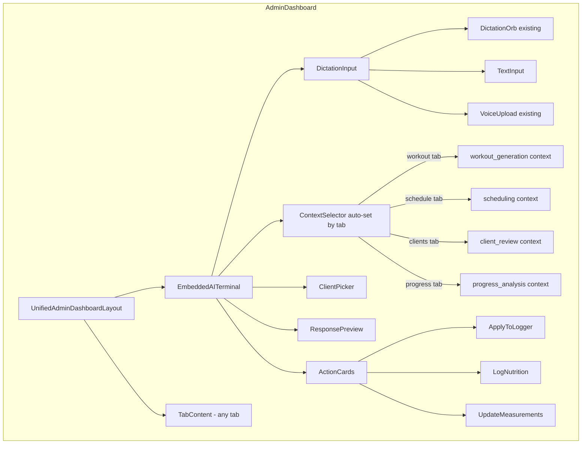
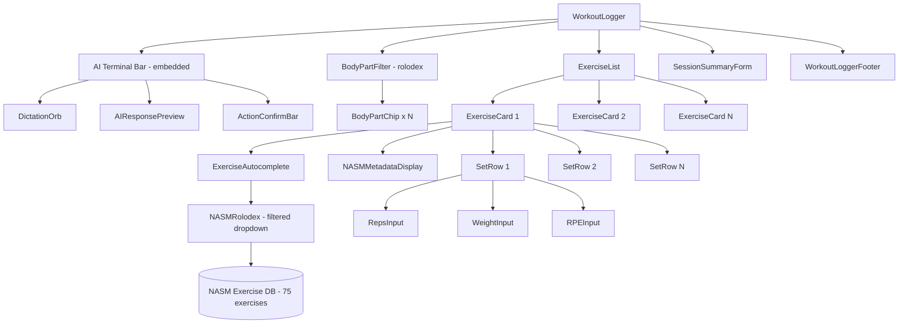
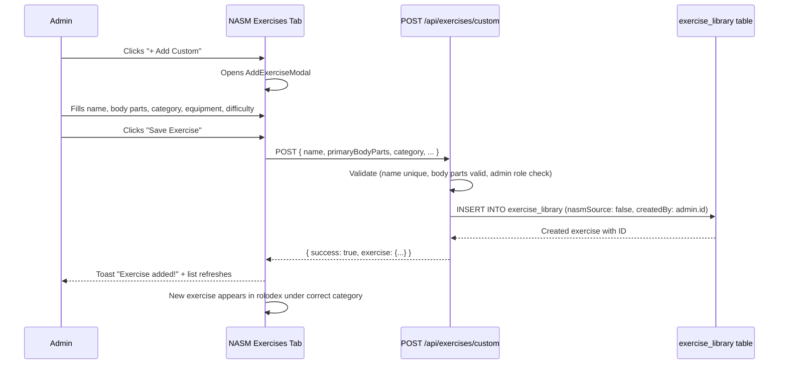
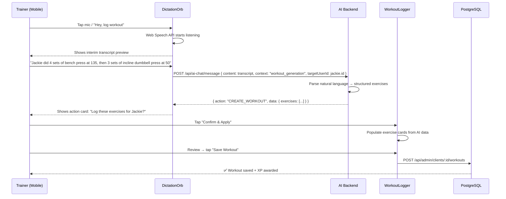
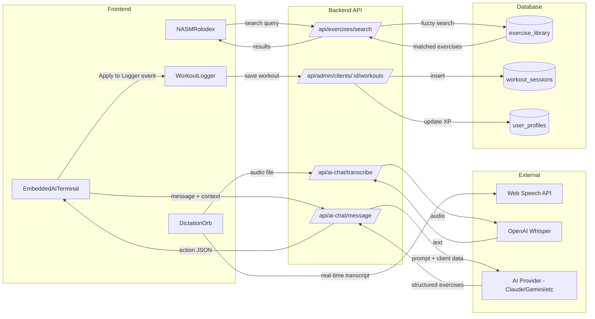

# SwanStudios Embedded AI Terminal + Workout Logger — Master Blueprint

> **Version:** 1.0 | **Date:** 2026-03-20
> **Author:** Sean Swan (CEO) + Claude Opus 4.6 (CEO AI) + Gemini 3.1 Pro (CTO)
> **Status:** APPROVED — Blueprint-First Protocol Active
> **Priority:** P0 — Core Trainer Workflow

---

## Table of Contents

1. [Vision & Problem Statement](#1-vision--problem-statement)
2. [Blueprint-First Protocol (NEW MANDATORY)](#2-blueprint-first-protocol)
3. [Embedded AI Terminal Architecture](#3-embedded-ai-terminal-architecture)
4. [Workout Logger Redesign](#4-workout-logger-redesign)
5. [NASM Exercise Database](#5-nasm-exercise-database)
6. [Voice-First Dictation Workflow](#6-voice-first-dictation-workflow)
7. [Component Wireframes](#7-component-wireframes)
8. [Data Flow Architecture](#8-data-flow-architecture)
9. [API Contract](#9-api-contract)
10. [Implementation Phases](#10-implementation-phases)
11. [Verification & QA](#11-verification--qa)

---

## 1. Vision & Problem Statement

### The Problem
The AI Assistant currently lives in a **floating drawer** that slides in from the right side. This creates friction:
- Trainer must open the drawer, losing visual context of the page they're on
- The AI has no awareness of which tab/page the trainer is viewing
- Workout logging requires multiple steps: open AI → generate plan → "Apply to Logger" → navigate → review
- The floating drawer competes for screen space on mobile (420px wide on desktop, 100vw on mobile)
- Exercise entry is manual — no NASM autocomplete, no body-part rolodex, no AI fill

### The Vision: 7-Star Embedded AI Secretary
The AI terminal is **baked into every admin dashboard tab** at the very top. No matter what tab the trainer clicks, the AI is RIGHT THERE — pre-loaded with context about that tab's data. The trainer speaks, the AI transcribes, parses, and fills forms in real-time.

**Core Principles:**
1. **Zero typing required** — Dictation-first, tap-to-confirm
2. **Context-aware** — AI knows which tab you're on and what data is available
3. **Touch-screen simple** — One-thumb operation on a phone
4. **NASM-native** — Every exercise from the NASM library is searchable by body part
5. **Real-time fill** — AI listens → transcribes → populates forms as you speak
6. **Blueprint-first** — Every component has its architecture documented at the top

---

## 2. Blueprint-First Protocol (NEW MANDATORY)

### Why This Exists
As the project grows with multiple AI agents (Opus, Gemini, Sonnet, Flash, DeepSeek, MiniMax) working on it, code quality degrades into "vibe coding" — each agent implements differently, components drift from their intended architecture, and the project becomes an organized mess that's hard to extend.

### The Rule
**Every major component MUST have a blueprint comment block at the very top of the file.** This serves as the source of truth for:
- What the component does (purpose)
- How it's structured (wireframe)
- What data flows through it (inputs/outputs)
- How sub-components relate (architecture diagram)

### Blueprint Format — Main Components

```typescript
/**
 * ╔══════════════════════════════════════════════════════════════╗
 * ║  COMPONENT: [ComponentName]                                  ║
 * ║  PURPOSE: [One-line description]                             ║
 * ║  OWNER: [Which AI/person last modified]                      ║
 * ║  LAST VALIDATED: [Date of last AI Village run]               ║
 * ╚══════════════════════════════════════════════════════════════╝
 *
 * ┌─── WIREFRAME ─────────────────────────────────────────────┐
 * │ ┌──────────────────────────────────────────────────────┐  │
 * │ │  AI Terminal Bar (collapsible)                        │  │
 * │ │  [🎤 Mic] [Type here...        ] [Context: Workouts] │  │
 * │ └──────────────────────────────────────────────────────┘  │
 * │                                                           │
 * │ ┌──────────────────────────────────────────────────────┐  │
 * │ │  Page Content Area                                    │  │
 * │ │  ┌─────────┐ ┌─────────┐ ┌─────────┐               │  │
 * │ │  │ Card 1  │ │ Card 2  │ │ Card 3  │               │  │
 * │ │  └─────────┘ └─────────┘ └─────────┘               │  │
 * │ └──────────────────────────────────────────────────────┘  │
 * └───────────────────────────────────────────────────────────┘
 *
 * ┌─── DATA FLOW ─────────────────────────────────────────────┐
 * │ Props In:  { clientId, userRole, tabContext }              │
 * │ State:     { exercises[], submitting, aiResponse }        │
 * │ API Calls: GET /api/exercises/search, POST /api/workouts  │
 * │ Events:    applyWorkoutToLogger, navigateToWorkoutLogger  │
 * │ Children:  ExerciseCard, SessionSummary, NASMProtocol     │
 * └───────────────────────────────────────────────────────────┘
 *
 * ┌─── ARCHITECTURE (Mermaid) ────────────────────────────────┐
 * │ graph TD                                                   │
 * │   A[WorkoutLogger] --> B[AITerminalBar]                   │
 * │   A --> C[ExerciseCard]                                   │
 * │   A --> D[NASMRolodex]                                    │
 * │   A --> E[SessionSummary]                                 │
 * │   B --> F[DictationOrb]                                   │
 * │   B --> G[AIChat Hook]                                    │
 * │   C --> H[SetRow]                                         │
 * │   D --> I[BodyPartFilter]                                 │
 * │   D --> J[ExerciseAutocomplete]                           │
 * └───────────────────────────────────────────────────────────┘
 */
```

### Blueprint Format — Sub-Components

```typescript
/**
 * ┌─── SUB-COMPONENT: [Name] ─────────────────────────────────┐
 * │ PARENT: [ParentComponent]                                  │
 * │ PURPOSE: [What this sub-component does]                    │
 * │                                                            │
 * │ WIREFRAME:                                                 │
 * │ ┌────────────────────────────────────┐                    │
 * │ │ [Exercise Name ▾] [Body Part ▾]   │                    │
 * │ │ Set 1: [reps] x [weight] lbs      │                    │
 * │ │ Set 2: [reps] x [weight] lbs      │                    │
 * │ │ [+ Add Set]                        │                    │
 * │ └────────────────────────────────────┘                    │
 * │                                                            │
 * │ Props: { exercise, onUpdate, onRemove }                   │
 * │ State: Local only (sets array)                            │
 * └────────────────────────────────────────────────────────────┘
 */
```

### Enforcement Rules
1. **No component >100 lines may exist without a blueprint header**
2. **AI Village validation checks for blueprint presence** (Phase 1 validator)
3. **When modifying a component, update its blueprint FIRST**
4. **Sub-components reference their parent's blueprint**
5. **Mermaid diagrams go in the blueprint, not separate files** (exception: full-page architecture docs in `docs/ai-workflow/blueprints/`)

---

## 3. Embedded AI Terminal Architecture

### Current State (Floating Drawer)
```
┌─────────────────────────────────────────────────────────┐
│ Admin Dashboard                                          │
│ ┌────┐ ┌──────────────────────────────────┐             │
│ │Side│ │  Tab Content                      │   ┌──────┐ │
│ │bar │ │  (no AI awareness)               │   │ AI   │ │
│ │    │ │                                   │   │Drawer│ │
│ │    │ │                                   │   │420px │ │
│ │    │ │                                   │   │      │ │
│ └────┘ └──────────────────────────────────┘   └──────┘ │
│                                          [🤖 FAB]       │
└─────────────────────────────────────────────────────────┘
```

### Target State (Embedded Terminal)
```
┌─────────────────────────────────────────────────────────┐
│ Admin Dashboard                                          │
│ ┌────┐ ┌──────────────────────────────────────────────┐ │
│ │Side│ │ ┌──────────────────────────────────────────┐ │ │
│ │bar │ │ │ 🎤 AI Terminal: "Log chest workout for   │ │ │
│ │    │ │ │ Jackie — 4x10 bench press 135lbs..."     │ │ │
│ │    │ │ │ [Context: Workouts] [Client: Jackie ▾]   │ │ │
│ │    │ │ └──────────────────────────────────────────┘ │ │
│ │    │ │                                              │ │
│ │    │ │  Tab Content (AI-enriched)                   │ │
│ │    │ │  ┌─────────┐ ┌─────────┐ ┌─────────┐       │ │
│ │    │ │  │ Card 1  │ │ Card 2  │ │ Card 3  │       │ │
│ │    │ │  └─────────┘ └─────────┘ └─────────┘       │ │
│ └────┘ └──────────────────────────────────────────────┘ │
└─────────────────────────────────────────────────────────┘
```

### Component: `EmbeddedAITerminal`



### Tab-to-Context Mapping

| Dashboard Tab | Route | AI Context | Available Actions |
|--------------|-------|------------|-------------------|
| Overview | `/dashboard/default` | `general` | Quick stats, daily summary |
| Schedule | `/dashboard/schedule` | `scheduling` | Book session, reschedule, cancel |
| User Management | `/dashboard/user-management` | `client_review` | Look up client, update profile |
| Training Sessions | `/dashboard/admin-sessions` | `workout_generation` | Log workout, create plan |
| Client Progress | `/dashboard/client-progress` | `progress_analysis` | Generate report, compare periods |
| Session Packages | `/dashboard/admin-packages` | `general` | Check package balance, renew |
| Client Management | `/dashboard/client-management` | `client_review` | Full client CRUD, onboard |
| Client Orientation | `/dashboard/client-orientation` | `onboarding` | Start onboarding, review forms |
| NASM Exercises | `/dashboard/nasm-exercises` | `exercise_library` | Search exercises, create custom |
| Reports | `/dashboard/reports` | `data_analysis` | Generate analytics, export |
| Settings | `/dashboard/settings` | `general` | Configure preferences |

### Implementation: Shared Layout Component

```typescript
// In UnifiedAdminDashboardLayout.tsx
// The EmbeddedAITerminal renders ONCE at the top of the content area.
// It receives the current tab route and auto-sets its AI context.

<ContentArea>
  <EmbeddedAITerminal
    userRole={userRole}
    currentTab={currentRoute}        // Auto-maps to AI context
    selectedClientId={selectedClient} // Shared state across tabs
    onClientSelect={setSelectedClient}
    onActionExecuted={refreshTabData} // Re-fetches tab data after AI action
    collapsed={terminalCollapsed}
    onToggleCollapse={setTerminalCollapsed}
  />
  <TabContent>
    <Outlet /> {/* React Router renders the active tab here */}
  </TabContent>
</ContentArea>
```

### Collapsed vs Expanded States

**Collapsed (default on mobile, toggleable on desktop):**
```
┌──────────────────────────────────────────────────┐
│ 🎤 Ask AI...  [Client: Jackie ▾]  [▼ Expand]    │
└──────────────────────────────────────────────────┘
```

**Expanded (after tap or voice activation):**
```
┌──────────────────────────────────────────────────┐
│ 🎤 "Log 4 sets of bench press at 135 for Jackie" │
│ ┌──────────────────────────────────────────────┐ │
│ │ AI: I'll log this workout for Jackie:        │ │
│ │ • Barbell Bench Press — 4x10 @ 135 lbs      │ │
│ │ [✓ Confirm & Save]  [✏️ Edit First]          │ │
│ └──────────────────────────────────────────────┘ │
│ [Context: Workouts]  [Client: Jackie ▾] [▲ Hide] │
└──────────────────────────────────────────────────┘
```

### Mobile Behavior (< 768px)
- Terminal collapses to a single-line bar with mic icon
- Tap mic → full-screen overlay for dictation
- AI response shows as a bottom sheet (60vh max)
- Action cards are swipeable horizontally
- Client picker is a full-screen searchable list

---

## 4. Workout Logger Redesign

### Current Problems
1. No exercise autocomplete from NASM database
2. No body-part filtering (rolodex)
3. Manual entry only — no AI fill
4. AI is in a separate floating drawer, disconnected from the form
5. No voice-to-form pipeline
6. Empty sets send `0` instead of `null` (fixed in latest commit)

### Target: Touch-Screen-First Logger with AI Baked In

```
┌──────────────────────────────────────────────────────┐
│ ╔══════════════════════════════════════════════════╗  │
│ ║ 🎤 AI: "What exercises did you do today?"       ║  │
│ ║ [Listening...] "4 sets of bench press 135..."   ║  │
│ ║ ┌────────────────────────────────────────────┐  ║  │
│ ║ │ ✓ Barbell Bench Press — 4x10 @ 135 lbs    │  ║  │
│ ║ │ ✓ Incline DB Press — 3x12 @ 50 lbs        │  ║  │
│ ║ │ ✓ Cable Crossover — 3x15 @ 30 lbs         │  ║  │
│ ║ │ [✓ Apply All] [✏️ Edit] [🗑 Clear]          │  ║  │
│ ║ └────────────────────────────────────────────┘  ║  │
│ ╚══════════════════════════════════════════════════╝  │
│                                                       │
│ ── Workout Log for Jackie | March 20, 2026 ────────  │
│                                                       │
│ ┌─ Body Part Filter ─────────────────────────────┐   │
│ │ [All] [Chest●] [Back] [Legs] [Arms] [Core]    │   │
│ │ [Shoulders] [Full Body] [Flexibility]          │   │
│ └────────────────────────────────────────────────┘   │
│                                                       │
│ ┌─ Exercise 1 ───────────────────────────────────┐   │
│ │ [Barbell Bench Press          ▾] ← autocomplete│   │
│ │ NASM: Chest, Shoulders | Beginner | Barbell    │   │
│ │                                                 │   │
│ │  Set │ Reps │ Weight │ RPE  │                   │   │
│ │ ─────┼──────┼────────┼──────│                   │   │
│ │  1   │ [10] │ [135]  │ [7]  │                   │   │
│ │  2   │ [10] │ [135]  │ [8]  │                   │
│ │  3   │ [10] │ [135]  │ [8]  │                   │
│ │  4   │ [10] │ [135]  │ [9]  │                   │   │
│ │ [+ Add Set]              [🗑 Remove Exercise]  │   │
│ └────────────────────────────────────────────────┘   │
│                                                       │
│ [+ Add Exercise]                                      │
│                                                       │
│ ── Session Summary ──────────────────────────────     │
│ Duration: [45] min | Intensity: [⬤⬤⬤⬤⬤⬤⬤○○○] 7/10  │
│ Notes: [Great session, increased weight on bench]     │
│                                                       │
│ [💾 Save Workout]                                     │
└──────────────────────────────────────────────────────┘
```

### Component Hierarchy



### NASM Rolodex Behavior

The exercise input field is an **autocomplete with a categorized rolodex dropdown**:

1. **Empty state:** Shows body part filter chips at top → selecting "Chest" shows only chest exercises
2. **Typing:** Fuzzy search across all exercises — "bench" matches "Barbell Bench Press", "Close Grip Bench Press", etc.
3. **Scrolling:** Within a body part, exercises are scrollable vertically like a rolodex/wheel
4. **Selection:** Tap exercise → auto-fills name + shows NASM metadata (muscles, equipment, difficulty)
5. **Custom:** If no match, allow free-text entry (for custom exercises not in NASM library)

```
┌─ Exercise Autocomplete ──────────────────────┐
│ [bench press...                           🔍] │
│ ┌──────────────────────────────────────────┐ │
│ │ CHEST                                     │ │
│ │ ● Barbell Bench Press          Beginner   │ │
│ │   Barbell, Bench, Plates                  │ │
│ │ ● Barbell Bench Press w/Bands  Advanced   │ │
│ │   Barbell, Bench, Bands                   │ │
│ │ ● Incline Barbell Bench Press  Intermed.  │ │
│ │   Barbell, Bench, Plates                  │ │
│ │ ● Close Grip Bench Press       Beginner   │ │
│ │   Bench                                   │ │
│ │                                           │ │
│ │ SHOULDERS                                 │ │
│ │ ● Bench Dips                   Intermed.  │ │
│ │   Bench                                   │ │
│ └──────────────────────────────────────────┘ │
│ [Can't find it? Add custom exercise →]       │
└──────────────────────────────────────────────┘
```

### Mobile Touch Optimization
- **Set rows:** Swipe left to delete a set (iOS-style)
- **Exercise cards:** Drag handle on left for reordering
- **Number inputs:** Tap to get a number pad overlay (not keyboard)
- **RPE slider:** Horizontal drag, 1-10 with haptic feedback on each notch
- **Body part chips:** Horizontal scroll with momentum, active chip auto-scrolls to center
- **All touch targets:** 44px minimum height (CLAUDE.md rule)

---

## 5. NASM Exercise Database

### Complete Library (75 Exercises from nasm.org/workout-exercise-guidance)

#### Data Schema

```typescript
// AMENDED per AI Village Phase 2 consensus + Opus CEO ruling
interface NASMExercise {
  id: number;
  name: string;
  nasmSlug: string | null;          // e.g., "barbell-bench-press" — unique for NASM exercises
  primaryBodyParts: string[];       // e.g., ["Chest", "Shoulders"]
  secondaryBodyParts: string[];     // e.g., ["Triceps", "Anterior Deltoids"]
  equipment: string[];              // e.g., ["Barbell", "Bench", "Plates"]
  difficulty: 'Beginner' | 'Intermediate' | 'Advanced';
  category: NASMCategory;
  nasmSource: boolean;              // true for NASM library, false for custom
  state: 'active' | 'draft' | 'archived';  // Draft Mode RBAC
  scope: 'global' | 'trainer';     // global = visible to all, trainer = creator only
  createdById: number | null;       // Admin/Trainer who created it (null for NASM seed)
}

type NASMCategory =
  | 'Core & Abdominals'
  | 'Chest'
  | 'Back'
  | 'Shoulders'
  | 'Arms'
  | 'Legs — Squats & Quads'
  | 'Legs — Hamstrings & Deadlifts'
  | 'Legs — Leg Curls'
  | 'Legs — Calves'
  | 'Full Body & Plyometrics'
  | 'Flexibility & Stretching'
  | 'Foam Rolling'
  | 'Balance';

type NASMBodyPart =
  | 'Abdominals' | 'Anterior Deltoids' | 'Arms' | 'Back' | 'Biceps'
  | 'Brachialis' | 'Calves' | 'Chest' | 'Core' | 'Deltoids'
  | 'Erector Spinae' | 'Full Body' | 'Glutes' | 'Groin' | 'Hamstrings'
  | 'Latissimus Dorsi' | 'Medius' | 'Mid Back' | 'Multifidi' | 'Obliques'
  | 'Posterior Deltoids' | 'Posterior Shoulder' | 'Quadriceps'
  | 'Rectus Abdominis' | 'Rhomboids' | 'Shins' | 'Shoulders'
  | 'Thighs' | 'Traps' | 'Triceps' | 'Upper Back';

type NASMEquipment =
  | 'Band or Tube' | 'Barbell' | 'Bench' | 'Box or Step' | 'Cable Machine'
  | 'Chains' | 'Chest Press Machine' | 'Dumbbells' | 'Foam Roller'
  | 'Kettlebell' | 'Leg Curl Machine' | 'Leg Press Machine'
  | 'Lying Leg Curl Machine' | 'Medicine Ball' | 'None' | 'Plates'
  | 'Pull-Up Bar' | 'Rope' | 'Safety Collars' | 'Seated Cable Row Machine'
  | 'Stability Ball' | 'Stretch Strap';
```

#### Body Part → Rolodex Filter Groups

For the mobile rolodex UI, we consolidate the 31 NASM body parts into **9 user-friendly filter chips**:

| Filter Chip | NASM Body Parts Included | Exercise Count |
|-------------|--------------------------|----------------|
| **All** | Everything | 75 |
| **Chest** | Chest, Anterior Deltoids | 17 |
| **Back** | Back, Latissimus Dorsi, Rhomboids, Traps, Mid Back, Upper Back, Erector Spinae | 6 |
| **Shoulders** | Shoulders, Deltoids, Posterior Deltoids, Posterior Shoulder | 4 |
| **Arms** | Arms, Biceps, Triceps, Brachialis | 4 |
| **Legs** | Quadriceps, Hamstrings, Glutes, Calves, Thighs, Groin, Medius, Shins | 23 |
| **Core** | Core, Abdominals, Obliques, Rectus Abdominis, Multifidi | 10 |
| **Full Body** | Full Body | 4 |
| **Recovery** | (Flexibility + Foam Rolling + Balance) | 9 |

#### Seed Migration

A new migration seeds the 75 NASM exercises into the existing `exercise_library` table:

```javascript
// backend/migrations/YYYYMMDD-seed-nasm-exercise-library.cjs
// Upserts by name to prevent duplicates
// Sets nasmSource: true to distinguish from custom exercises
// Preserves any existing custom exercises
```

#### Admin Custom Exercise Management (ADMIN-ONLY)

Admins (and only admins) can create custom exercises and assign them to the correct body-part categories. This allows the exercise library to grow beyond the initial 75 NASM exercises while maintaining proper categorization.

**Data Schema for Custom Exercises:**

```typescript
interface CustomExercise extends Omit<NASMExercise, 'nasmSource'> {
  nasmSource: false;              // Distinguishes from NASM library
  createdBy: number;              // Admin user ID who created it
  createdAt: Date;
  isActive: boolean;              // Soft-delete support
  // All same fields as NASMExercise:
  // name, primaryBodyParts, secondaryBodyParts, equipment, difficulty, category
}
```

**API Endpoints (Admin-only, RBAC-protected):**

| Method | Endpoint | Purpose | Auth |
|--------|----------|---------|------|
| `POST` | `/api/exercises/custom` | Create a new custom exercise | `admin` only |
| `PUT` | `/api/exercises/custom/:id` | Update a custom exercise | `admin` only |
| `DELETE` | `/api/exercises/custom/:id` | Soft-delete a custom exercise | `admin` only |
| `GET` | `/api/exercises/custom` | List all custom exercises | `admin`, `trainer` |

**Admin Exercise Creator UI (NASM Exercises Tab):**

```
┌──────────────────────────────────────────────────────────┐
│ ── NASM Exercise Library ────────────────────────────    │
│                                                          │
│ ┌─ Body Part Filter ──────────────────────────────────┐  │
│ │ [All] [Chest] [Back] [Legs●] [Arms] [Core] [...]   │  │
│ └─────────────────────────────────────────────────────┘  │
│                                                          │
│ ┌─ Search ────────────────────────────────────────────┐  │
│ │ 🔍 [Search exercises...]            [+ Add Custom]  │  │
│ └─────────────────────────────────────────────────────┘  │
│                                                          │
│ ┌─ Exercise List ─────────────────────────────────────┐  │
│ │ NASM  Barbell Bench Press       Chest    Beginner   │  │
│ │ NASM  Incline Barbell Press     Chest    Intermed.  │  │
│ │ ✏️    Trainer Cable Fly Twist    Chest    Intermed.  │  │ ← Custom (editable)
│ │ ✏️    Landmine Press             Shoulders Advanced  │  │ ← Custom (editable)
│ └─────────────────────────────────────────────────────┘  │
└──────────────────────────────────────────────────────────┘
```

**"Add Custom Exercise" Modal (Admin-only):**

```
┌──────────────────────────────────────────────────────┐
│  Add Custom Exercise                           [✕]   │
│                                                      │
│  Exercise Name *                                     │
│  [Landmine Press                              ]      │
│                                                      │
│  Primary Body Parts * (select multiple)              │
│  [Shoulders ✕] [Chest ✕]         [+ Add ▾]          │
│                                                      │
│  Secondary Body Parts (select multiple)              │
│  [Triceps ✕] [Core ✕]            [+ Add ▾]          │
│                                                      │
│  Category *                                          │
│  [Shoulders                                ▾]        │
│                                                      │
│  Equipment (select multiple)                         │
│  [Barbell ✕]                      [+ Add ▾]         │
│                                                      │
│  Difficulty *                                        │
│  ( ) Beginner  (●) Intermediate  ( ) Advanced        │
│                                                      │
│  Instructions (optional)                             │
│  [Step-by-step form cues for this exercise...]       │
│                                                      │
│  Video URL (optional)                                │
│  [https://...]                                       │
│                                                      │
│  [Cancel]                    [💾 Save Exercise]       │
└──────────────────────────────────────────────────────┘
```

**Key Rules:**
1. **Only admins** can create/edit/delete custom exercises (RBAC enforced backend + frontend)
2. **Trainers and clients** can see and use custom exercises but cannot modify them
3. **NASM exercises are read-only** — no one can edit or delete the 75 official exercises
4. **Body part multi-select** — A custom exercise can belong to multiple body parts (just like NASM exercises)
5. **Category assignment** — Admin picks the primary category from the existing 13 categories. The exercise then appears under that category in the rolodex.
6. **Custom exercises appear alongside NASM exercises** in the rolodex, distinguished by an "✏️ Custom" badge vs "NASM" badge
7. **Soft-delete only** — Deleting sets `isActive: false` so historical workout logs referencing that exercise still display correctly
8. **The body part filter chips dynamically update counts** — If admin adds 5 custom chest exercises, the "Chest" chip shows 22 (17 NASM + 5 custom)
9. **Admin can also add entirely new body part categories** — If admin needs "Forearms" or "Hip Flexors" that aren't in the 31 NASM list, they can create them and exercises will filter into a new chip or fall under the closest existing one

**Mermaid: Admin Exercise CRUD Flow:**



---

## 6. Voice-First Dictation Workflow

### Flow: Trainer Speaks → AI Fills Form



### Natural Language Examples

| Trainer Says | AI Parses To |
|-------------|-------------|
| "Jackie did 4 sets of bench press at 135" | `{ name: "Barbell Bench Press", sets: [{reps: 10, weight: 135}, {reps: 10, weight: 135}, {reps: 10, weight: 135}, {reps: 10, weight: 135}] }` |
| "3 sets of 12 incline dumbbell press, 50 pounds" | `{ name: "Two-Arm Incline Dumbbell Chest Press", sets: [{reps: 12, weight: 50} x3] }` |
| "We did a chest day — bench 4x10, incline 3x12, cable flies 3x15" | 3 exercises auto-matched to NASM library |
| "Squat day: back squats 5x5 at 225, then Bulgarian splits 3x10 each leg" | 2 exercises, NASM-matched, appropriate equipment |
| "Warmup was foam roll and stretching, then legs" | NASM Protocol section auto-checked + leg exercises |

### AI Matching Logic

When the AI parses exercise names from natural speech:
1. **Exact match** against NASM library name
2. **Fuzzy match** (Levenshtein distance < 3) — "bench press" → "Barbell Bench Press"
3. **Alias match** — "squats" → "Prisoner Squat" (bodyweight) or context-aware (if weight mentioned → "Barbell Deadlift" pattern)
4. **Body part inference** — "chest day" sets the filter to Chest exercises
5. **Fallback** — If no match, use free-text name and flag for trainer review

---

## 7. Component Wireframes

### 7A. EmbeddedAITerminal (Collapsed — Mobile)

```
┌──────────────────────────────────────────┐
│ 🎤  Ask AI anything...   [Jackie ▾] [▼] │  ← 56px bar
└──────────────────────────────────────────┘
```

### 7B. EmbeddedAITerminal (Expanded — Desktop)

```
┌──────────────────────────────────────────────────────────┐
│ ┌──────────────────────────────────────────────────────┐ │
│ │ 🎤 [Log chest workout for Jackie — 4x10 bench...]   │ │  ← Input
│ └──────────────────────────────────────────────────────┘ │
│ ┌──────────────────────────────────────────────────────┐ │
│ │ 🤖 AI: Creating workout log for Jackie Chen:        │ │
│ │                                                      │ │
│ │  1. Barbell Bench Press — 4 sets × 10 reps @ 135 lb │ │  ← Response
│ │  2. Incline DB Press — 3 sets × 12 reps @ 50 lb     │ │
│ │  3. Cable Crossover — 3 sets × 15 reps @ 30 lb      │ │
│ │                                                      │ │
│ │  [✅ Apply to Logger]  [✏️ Edit]  [🔄 Regenerate]    │ │  ← Actions
│ └──────────────────────────────────────────────────────┘ │
│ Context: Workouts  |  Client: Jackie Chen ▾  |  [▲ Hide] │
└──────────────────────────────────────────────────────────┘
```

### 7C. BodyPartFilter (Horizontal Scroll)

```
┌──────────────────────────────────────────────────────┐
│ ◀ [All] [Chest●] [Back] [Legs] [Arms] [Core] [...] ▶│  ← Scroll
└──────────────────────────────────────────────────────┘
   ↑ active chip has filled background + glow ring
```

### 7D. NASMRolodex Dropdown

```
┌──────────────────────────────────────────┐
│ 🔍 [bench pr...]                          │  ← Input with autocomplete
├──────────────────────────────────────────┤
│ ▲ scroll up                               │
│ ┌──────────────────────────────────────┐ │
│ │ CHEST                                 │ │  ← Category header (sticky)
│ ├──────────────────────────────────────┤ │
│ │ ● Barbell Bench Press                │ │
│ │   Beginner · Barbell, Bench          │ │  ← Metadata line
│ ├──────────────────────────────────────┤ │
│ │ ● Barbell Bench Press w/ Bands       │ │
│ │   Advanced · Barbell, Bench, Bands   │ │
│ ├──────────────────────────────────────┤ │
│ │ ● Incline Barbell Bench Press        │ │
│ │   Intermediate · Barbell, Bench      │ │
│ └──────────────────────────────────────┘ │
│ ▼ scroll down                             │
├──────────────────────────────────────────┤
│ [＋ Add custom exercise]                  │  ← Fallback
└──────────────────────────────────────────┘
```

### 7E. ExerciseCard (Filled — Mobile)

```
┌──────────────────────────────────────────┐
│ ☰ Exercise 1                    [🗑]     │  ← Drag handle + delete
│ [Barbell Bench Press              ▾]     │  ← Autocomplete input
│ Chest, Shoulders · Beginner · Barbell    │  ← NASM metadata
│                                          │
│  #  │ Reps  │ Weight │ RPE              │
│ ────┼───────┼────────┼─────             │
│  1  │ [10]  │ [135]  │ [7]              │  ← Tap = number pad
│  2  │ [10]  │ [135]  │ [8]              │
│  3  │ [10]  │ [135]  │ [8]              │
│  4  │ [10]  │ [135]  │ [9]              │
│                                          │
│ [+ Add Set]                              │
└──────────────────────────────────────────┘
```

---

## 8. Data Flow Architecture



---

## 9. API Contract

### Existing Endpoints (No Changes Needed)

| Method | Endpoint | Purpose |
|--------|----------|---------|
| `GET` | `/api/exercises/search?q=&bodyPart=&difficulty=&limit=20` | Search NASM exercises |
| `POST` | `/api/admin/clients/:clientId/workouts` | Save workout log |
| `GET` | `/api/admin/clients/:clientId/workouts` | Get workout history |
| `POST` | `/api/ai-chat/message` | Send message to AI |
| `POST` | `/api/ai-chat/transcribe` | Transcribe audio file |

### New/Enhanced Endpoints

| Method | Endpoint | Purpose |
|--------|----------|---------|
| `GET` | `/api/exercises/nasm?bodyPart=Chest&difficulty=Beginner` | Filter NASM exercises for rolodex |
| `GET` | `/api/exercises/body-parts` | Get list of body part filter options |
| `GET` | `/api/exercises/categories` | Get NASM categories with counts |

### Exercise Search Response (Enhanced)

```typescript
// GET /api/exercises/search?q=bench&bodyPart=Chest
{
  success: true,
  exercises: [
    {
      id: 24,
      name: "Barbell Bench Press",
      primaryBodyParts: ["Chest"],
      secondaryBodyParts: ["Shoulders", "Anterior Deltoids", "Triceps"],
      equipment: ["Bench", "Barbell", "Plates", "Safety Collars"],
      difficulty: "Beginner",
      category: "Chest",
      nasmSource: true,
      // existing fields preserved
      instructions: [...],
      videoUrl: null,
      imageUrl: null
    }
  ],
  totalCount: 17,
  query: "bench",
  filters: { bodyPart: "Chest" }
}
```

---

## 10. Implementation Phases

### Phase 1: Blueprint Headers + CLAUDE.md Update (30 min)
- Add blueprint comment blocks to all major components listed below
- Update CLAUDE.md with Blueprint-First Protocol rules
- Create component template in `docs/ai-workflow/templates/`

**Components to blueprint:**
- `WorkoutLogger.tsx` (main)
- `WorkoutLoggerHeader.tsx`
- `ExerciseCardComponent.tsx`
- `ExerciseAutocomplete.tsx`
- `SessionSummaryForm.tsx`
- `NASMProtocolSection.tsx`
- `WorkoutLoggerFooter.tsx`
- `UnifiedAdminDashboardLayout.tsx`
- `AIAssistantDrawer.tsx`

### Phase 2: NASM Exercise Seed + Rolodex Backend (45 min)
- Create migration to seed 75 NASM exercises
- Add `nasmSource` boolean column to exercise_library
- Add `GET /api/exercises/nasm` endpoint with body-part filtering
- Add `GET /api/exercises/body-parts` endpoint
- Test: `curl /api/exercises/search?q=bench&bodyPart=Chest`

### Phase 3: EmbeddedAITerminal Component (60 min)
- Create `frontend/src/components/AIAssistant/EmbeddedAITerminal.tsx`
- Collapsible bar with mic, text input, client picker, context auto-selector
- Wire into `UnifiedAdminDashboardLayout.tsx` at top of content area
- Tab-to-context mapping
- Reuse existing `useAIChat` hook and `DictationOrb` component
- Keep floating FAB as fallback for non-admin pages

### Phase 4: NASMRolodex + ExerciseAutocomplete Redesign (60 min)
- Create `frontend/src/components/WorkoutLogger/NASMRolodex.tsx`
- Body part filter chips (horizontal scroll)
- Categorized dropdown with sticky headers
- Fuzzy search with Levenshtein matching
- NASM metadata display below selected exercise
- Custom exercise fallback
- Wire into ExerciseCardComponent

### Phase 5: AI-to-Logger Pipeline Enhancement (45 min)
- Enhance `parseAIWorkoutPlan.ts` to match exercise names against NASM library
- Add NASM metadata to parsed exercises (muscles, equipment, difficulty)
- Action card in EmbeddedAITerminal: "Apply All to Logger"
- Real-time form population as AI transcribes
- Confirmation step before save

### Phase 6: Voice-to-Form Real-Time Fill (45 min)
- Enhance DictationOrb interim preview
- Stream transcript to AI as sentences complete (not wait for full stop)
- AI returns structured exercises incrementally
- Logger populates cards as each exercise is parsed
- Hold-to-talk mode for continuous dictation

### Phase 7: Mobile Touch Polish (30 min)
- Number pad overlay for reps/weight inputs
- Swipe-to-delete on set rows
- Drag-to-reorder on exercise cards
- Body part chip auto-scroll-to-center
- Bottom sheet for AI responses on mobile
- All touch targets verified at 44px

### Phase 8: Build + AI Village Validation + Deploy (30 min)
- `cd frontend && npm run build`
- `node scripts/validation-orchestrator.mjs --files [all changed files]`
- Opus CEO review of Phase 2+3 consensus
- Playwright QA at 375px, 430px, 768px, 1280px
- Push to main for Render deploy

---

## 11. Verification & QA

### Playwright Test Scenarios

| # | Test | Viewport | Steps |
|---|------|----------|-------|
| 1 | AI Terminal visible on every tab | 375px | Navigate to each of 11 tabs, verify terminal bar exists |
| 2 | AI Terminal context auto-sets | 1280px | Click "Training Sessions" tab → verify context = "Workouts" |
| 3 | Client picker works | 375px | Tap client picker → search "Jackie" → select → verify banner |
| 4 | NASM rolodex filters | 430px | Tap "Legs" chip → verify only leg exercises show |
| 5 | Exercise autocomplete | 768px | Type "bench" → verify dropdown with NASM matches |
| 6 | Voice dictation fills form | 375px | Tap mic → speak → verify AI response → tap Apply |
| 7 | Save workout end-to-end | 1280px | Fill 3 exercises → save → verify toast + API call |
| 8 | Mobile touch targets | 375px | Verify all buttons/inputs ≥ 44px height |
| 9 | Collapsed/expanded toggle | 375px | Tap expand → verify full terminal → tap collapse |
| 10 | WCAG contrast | all | Automated contrast check on all text elements |

### AI Village Validation Checklist
- [ ] All 11 tracks pass
- [ ] Phase 2 debate reaches consensus
- [ ] Phase 3 design debate reaches consensus
- [ ] Phase 4 Opus CEO ratifies
- [ ] No CRITICAL findings remaining
- [ ] Blueprint headers present on all modified components

---

## Appendix A: Full NASM Exercise List (75 Exercises)

<details>
<summary>Click to expand complete exercise database</summary>

### Core & Abdominals (10)
1. Side Plank — Abdominals — None — Beginner
2. Plank — Abdominals — None — Beginner
3. Plank Walkup — Abdominals — None — Intermediate
4. Straight-Arm Plank — Abdominals — None — Beginner
5. Bird Dog — Core, Erector Spinae, Multifidi — None — Beginner
6. Dead Bug — Core — None — Beginner
7. Floor Bridge — Core, Glutes, Groin — None — Beginner
8. Russian Twist — Core, Obliques, Glutes — Stability Ball — Intermediate
9. Reverse Crunch to Knee-Up with Rotation — Core, Rectus Abdominis, Obliques, Back, Latissimus Dorsi — Bench — Intermediate
10. Iron Cross — Back, Erector Spinae, Glutes, Medius, Chest — None — Intermediate

### Chest (17)
11. Push-Up — Chest, Shoulders, Anterior Deltoids, Triceps — None — Beginner
12. Plyometric Push-Up — Chest, Shoulders, Anterior Deltoids, Triceps — None — Intermediate
13. Decline Push-Up — Chest, Shoulders, Anterior Deltoids, Triceps — Bench — Intermediate
14. Incline Push-Up — Chest, Shoulders, Anterior Deltoids, Triceps — Bench — Beginner
15. Archer Push-Up — Chest, Shoulders, Anterior Deltoids, Triceps — Medicine Ball — Advanced
16. Modified Push-Up — Chest, Shoulders, Anterior Deltoids, Triceps — None — Beginner
17. Cable Crossover — Chest, Shoulders, Anterior Deltoids — Cable Machine — Beginner
18. Two-Arm Standing Cable Fly — Chest, Shoulders, Anterior Deltoids — Cable Machine — Beginner
19. Chest Press Machine — Chest, Shoulders, Anterior Deltoids, Triceps — Chest Press Machine — Beginner
20. Single-Arm Dumbbell Chest Press — Chest, Shoulders, Anterior Deltoids — Bench, Dumbbells — Intermediate
21. Two-Arm Dumbbell Chest Press with Band — Chest, Shoulders, Anterior Deltoids — Bench, Dumbbells, Band or Tube — Intermediate
22. Single-Arm Incline Dumbbell Chest Press — Chest, Shoulders, Anterior Deltoids — Bench, Dumbbells — Intermediate
23. Two-Arm Incline Dumbbell Chest Press — Chest, Shoulders, Anterior Deltoids — Bench, Dumbbells — Beginner
24. Barbell Bench Press — Chest — Bench, Barbell, Plates, Safety Collars — Beginner
25. Barbell Bench Press with Bands — Chest — Bench, Barbell, Plates, Safety Collars, Band or Tube — Advanced
26. Barbell Bench Press with Chains — Chest — Bench, Barbell, Plates, Safety Collars, Chains — Advanced
27. Incline Barbell Bench Press — Chest — Bench, Barbell, Plates, Safety Collars — Intermediate

### Back (6)
28. Pull-Up — Back, Latissimus Dorsi, Rhomboids, Traps, Shoulders, Posterior Deltoids, Arms, Brachialis — Pull-Up Bar — Intermediate
29. Band Assisted Pull-Up — Back, Latissimus Dorsi, Rhomboids, Traps, Shoulders, Posterior Deltoids, Arms, Brachialis — Pull-Up Bar, Band or Tube — Intermediate
30. Seated Machine Row: Close Grip — Back, Latissimus Dorsi, Rhomboids, Traps, Shoulders, Posterior Deltoids, Arms, Biceps — Seated Cable Row Machine — Beginner
31. Standing Tubing Row — Upper Back, Mid Back — Band or Tube — Beginner
32. Floor Prone Cobra — Upper Back, Shoulders — None — Beginner
33. Face Pull — Shoulders, Back, Arms — Cable Machine, Rope — Beginner

### Shoulders & Arms (6)
34. Pike Push-Up — Shoulders, Anterior Deltoids, Deltoids, Traps, Triceps — None — Intermediate
35. Inverted Push-Up — Shoulders, Anterior Deltoids, Deltoids, Traps, Triceps — Box or Step — Intermediate
36. Close Grip Bench Press — Deltoids, Triceps — Bench — Beginner
37. Bench Dips — Triceps, Shoulders, Anterior Deltoids — Bench — Intermediate
38. Barbell Bicep Curl — Biceps — Barbell — Beginner
39. Kettlebell Crush Curl with Squat — Arms, Brachialis, Biceps — Kettlebell — Beginner

### Legs — Squats & Quads (12)
40. Prisoner Squat — Thighs, Glutes, Calves — None — Beginner
41. Squat Jump — Full Body — None — Intermediate
42. Bulgarian Split Squat — Quadriceps, Glutes, Groin — Bench, Dumbbells — Intermediate
43. Goblet Squat — Quadriceps, Groin, Glutes — Kettlebell — Beginner
44. Dumbbell Front Squat — Quadriceps, Groin, Glutes — Dumbbells — Beginner
45. Squat Thrust (Burpees) — Full Body — None — Advanced
46. Kettlebell Front Squat — Thighs, Quadriceps, Groin, Glutes — Kettlebell — Beginner
47. Leg Press — Thighs, Quadriceps, Glutes, Groin — Leg Press Machine — Beginner
48. Single Leg Press — Thighs, Quadriceps, Glutes, Groin — Leg Press Machine — Beginner
49. Single-Leg Squat — Quadriceps, Groin, Glutes — None — Advanced
50. Single-Leg Squat Touchdown — Quadriceps, Glutes, Groin — None — Advanced
51. Single-Leg Squat to Row — Quadriceps, Groin, Glutes, Hamstrings, Biceps, Mid Back, Posterior Shoulder — Cable Machine — Advanced

### Legs — Hamstrings & Deadlifts (5)
52. Barbell Deadlift — Quadriceps, Glutes, Hamstrings, Groin — Barbell — Intermediate
53. Kettlebell Deadlift — Quadriceps, Hamstrings, Groin, Glutes — Kettlebell — Beginner
54. Dumbbell Romanian Deadlift — Hamstrings, Groin, Glutes — Dumbbells — Intermediate
55. Good Mornings — Hamstrings, Groin, Glutes — Barbell — Intermediate
56. Romanian Deadlift (Barbell) — Thighs, Hamstrings, Groin, Glutes — Barbell, Plates — Intermediate

### Legs — Leg Curls (5)
57. Lying Leg Curl — Hamstrings, Calves — Lying Leg Curl Machine — Beginner
58. Lying Leg Curl: Two-Leg Concentric, Single-Leg Eccentric — Thighs, Hamstrings, Calves — Lying Leg Curl Machine — Intermediate
59. Lying Leg Curl: Single-Leg — Thighs, Hamstrings, Calves — Lying Leg Curl Machine — Beginner
60. Seated Leg Curl — Hamstrings, Calves — Leg Curl Machine — Beginner
61. Single-Leg Seated Leg Curl — Thighs, Hamstrings, Calves — Leg Curl Machine — Beginner

### Legs — Calves (1)
62. Leg Press Calf Raise — Calves — Leg Press Machine — Beginner

### Full Body & Plyometrics (4)
63. Jumping Jacks — Full Body — None — Beginner
64. Box Jumps — Glutes, Thighs, Hamstrings, Quadriceps, Calves — Box or Step — Intermediate
65. Lunge Jump — Full Body, Glutes, Thighs, Calves — None — Intermediate
66. Tuck Jump — Full Body, Glutes, Thighs, Calves — None — Intermediate

### Flexibility & Stretching (5)
67. Child's Pose — Shoulders, Posterior Shoulder, Back, Latissimus Dorsi, Erector Spinae, Shins — None — Beginner
68. Static: Butterfly Stretch — Groin — None — Beginner
69. Static: Latissimus Dorsi Ball Stretch — Latissimus Dorsi — Stability Ball — Beginner
70. Static: Seated Calf Stretch — Calves — Stretch Strap — Beginner
71. Static: Standing Adductor Stretch — Groin — None — Beginner

### Foam Rolling (3)
72. Foam Roll: Adductors — Groin — Foam Roller — Beginner
73. Foam Roll: Calves — Groin, Calves — Foam Roller — Beginner
74. Foam Roll: Latissimus Dorsi — Mid Back — Foam Roller — Beginner

### Balance (1)
75. Single-Leg Balance Reach: Frontal Plane — Full Body — None — Beginner

</details>

---

## Appendix B: Files To Create / Modify

### New Files
| File | Purpose | Lines (est.) |
|------|---------|-------------|
| `frontend/src/components/AIAssistant/EmbeddedAITerminal.tsx` | Tab-embedded AI bar | ~350 |
| `frontend/src/components/WorkoutLogger/NASMRolodex.tsx` | Body part filtered exercise picker | ~250 |
| `frontend/src/components/WorkoutLogger/BodyPartFilter.tsx` | Horizontal chip filter bar | ~100 |
| `frontend/src/components/WorkoutLogger/SetRow.tsx` | Single set row (reps/weight/RPE) | ~80 |
| ~~`frontend/src/data/nasm-exercises.ts`~~ | **DELETED per AI Village Issue #1** — Use API + React Query instead | N/A |
| `backend/migrations/YYYYMMDD-seed-nasm-exercise-library.cjs` | Seed 75 NASM exercises | ~300 |

### Modified Files
| File | Changes |
|------|---------|
| `frontend/src/components/DashBoard/UnifiedAdminDashboardLayout.tsx` | Add EmbeddedAITerminal at top of content area |
| `frontend/src/components/WorkoutLogger/WorkoutLogger.tsx` | Add blueprint header, integrate NASMRolodex |
| `frontend/src/components/WorkoutLogger/ExerciseCardComponent.tsx` | Replace basic input with NASMRolodex autocomplete |
| `frontend/src/components/WorkoutLogger/ExerciseAutocomplete.tsx` | Enhance with body-part filtering |
| `frontend/src/utils/parseAIWorkoutPlan.ts` | NASM exercise name matching |
| `backend/routes/exerciseRoutes.mjs` | Add bodyPart filter, NASM-specific endpoints |
| `CLAUDE.md` | Add Blueprint-First Protocol section |

---

## Appendix C: AI Village Amendments (2026-03-21)

> These amendments were produced by the 11-Brain Recursive Consensus System and ratified by Opus 4.6 CEO.
> Full ruling: `AI-Village-Documentation/validation-prompts/latest/opus-ceo-ruling.md`

### Architecture Amendments (Phase 2 Debate — 4 rounds)
1. **DELETE static frontend exercise file** — No `frontend/src/data/nasm-exercises.ts`. Use React Query + `GET /api/exercises/library` with 24h stale time + IndexedDB persistence.
2. **Add `nasm_slug` to exercise schema** — Prevents seed migration from overwriting custom exercises. Upsert by slug, rename collisions to "(Custom)".
3. **Single voice endpoint** — Consolidate to `POST /api/ai-terminal/voice-command` (audio → Whisper → LLM → JSON in one round-trip). Target <2s latency.
4. **AITerminalContext, not Zustand** — React Context wraps layout. High-frequency state (transcript, audioLevel) stays LOCAL to EmbeddedAITerminal. Only `pendingAction` shared via context.
5. **Draft Mode exercise RBAC** — Exercises have `state` (active/draft/archived) + `scope` (global/trainer). Admin creates = active+global. Trainer creates = draft+trainer. Drafts blocked from production workout logs. Emergency "Quick Add" = active+trainer for live sessions.
6. **Zod validation on AI responses** — `AIActionSchema` discriminated union validates all AI action responses before reaching frontend.

### Design Amendments (Phase 3 Debate — 5 rounds)
1. **Dual-Layer Glow focus state** — Midnight Sapphire outline + Wing Purple outer glow on all interactive elements.
2. **Typography CORRECTED** — Fira Code is NOT deprecated (Gemini error). Fira Code = data/numeric inputs. Plus Jakarta Sans = headings. Sora = UI. Cormorant Garamond Italic = drama.
3. **Dark theme stays** — Crystalline Swan dark theme is production. NOT switching to light-only.
4. **Haptics** — `navigator.vibrate(50)` progressive enhancement only. No audio fallbacks.
5. **prefers-reduced-motion** — Global media query disables all pulse/shimmer animations.

### Security Amendments
1. **AI prompt injection protection** — Input sanitization (strip HTML, 2000 char limit), system prompt hardening, session-scoped context, Zod response validation, audit logging.
2. **Rate limiting** — AI: 30/min, Search: 60/min, Voice: 10/min per user.
3. **Audit logging** — All workout CRUD, exercise CRUD, AI interactions logged with userId, timestamp, action, resourceId, IP.
4. **Security section in blueprint template** — Every component blueprint must include security considerations.

### Performance Amendments
1. **Debounce AI parsing at 300ms** — Prevents re-render storm during dictation.
2. **React.memo on ExerciseCard and SetRow** — Prevents unnecessary re-renders.
3. **pg_trgm index** — `CREATE INDEX idx_exercise_name_trgm ON exercise_library USING gin (name gin_trgm_ops);` for fuzzy search.
4. **react-window virtualization** — For rolodex dropdown when exercise count >100.
5. **Offline fallback** — Web Speech API works client-side without internet. Queue API calls for when connectivity returns.

---

*SwanStudios — Blueprint-First Protocol v1.0*
*"Measure twice, code once. Every component tells its own story."*
*Validated by 11-Brain Recursive Consensus System — $0.32 cost, 434.5s runtime*
