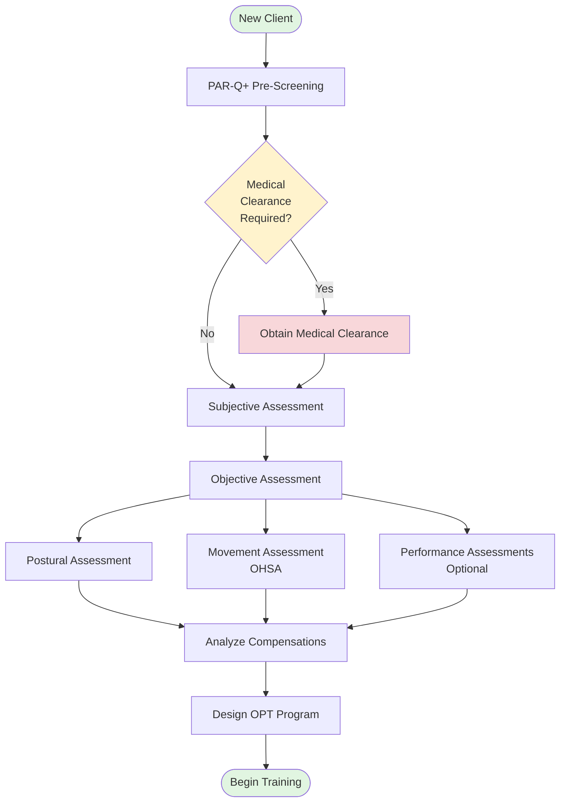

# NASM Protocol Requirements for SwanStudios
**Version:** 1.0
**Created:** 2026-01-15
**Purpose:** Define NASM OPT Model compliance requirements for client onboarding

---

## Executive Summary

SwanStudios must implement **NASM (National Academy of Sports Medicine) Optimum Performance Training (OPT) Model** protocols to:
1. Meet industry standards for certified personal training
2. Ensure client safety and liability protection
3. Provide professional-grade assessments for Fairmont target market
4. Enable evidence-based AI workout programming

---

## NASM OPT Model Overview

### Five Phases of Training
1. **Stabilization Endurance** (Corrective Exercise)
2. **Strength Endurance** (Foundation)
3. **Muscular Development** (Hypertrophy)
4. **Maximal Strength**
5. **Power**

### Assessment Protocol (Required Before Training)



---

## 1. PAR-Q+ Pre-Screening (MANDATORY)

### Purpose
- Identify clients who need medical clearance BEFORE physical activity
- Legal liability protection for trainers
- Client safety screening

### Implementation Requirements

**PAR-Q+ Questions (7 Core + Follow-ups):**

1. Has your doctor ever said that you have a heart condition OR high blood pressure?
2. Do you feel pain in your chest at rest, during your daily activities of living, OR when you do physical activity?
3. Do you lose balance because of dizziness OR have you lost consciousness in the last 12 months?
4. Have you ever been diagnosed with another chronic medical condition (other than heart disease or high blood pressure)?
5. Are you currently taking prescribed medications for a chronic medical condition?
6. Do you currently have (or have had within the past 12 months) a bone, joint, or soft tissue (muscle, ligament, or tendon) problem that could be made worse by becoming more physically active?
7. Has your doctor ever said that you should only do medically supervised physical activity?

**Scoring:**
- **All NO:** Cleared for physical activity
- **Any YES:** Follow-up questions required → May need medical clearance

**Database Schema:**
```javascript
parqScreening: {
  type: DataTypes.JSONB,
  allowNull: false,
  /*
  {
    q1_heart_condition: false,
    q2_chest_pain: false,
    q3_dizziness: false,
    q4_chronic_condition: true,
    q4_details: "Type 2 Diabetes",
    q5_medications: true,
    q5_list: ["Metformin 500mg"],
    q6_injury: false,
    q7_supervised_only: false,
    requiresMedicalClearance: false,
    completedDate: "2026-01-15",
    completedBy: "client"
  }
  */
}
```

---

## 2. Subjective Assessment (Client Questionnaire)

### Current Implementation: ✅ ACCEPTABLE
Our 85-question questionnaire covers NASM's subjective assessment requirements:

**NASM Requirements:**
- ✅ Personal information (age, occupation)
- ✅ Health history (medical conditions, medications)
- ✅ Lifestyle (sleep, stress, alcohol, tobacco)
- ✅ Goals and motivation
- ✅ Training history and experience
- ✅ Injury history
- ✅ Nutrition habits

**No Changes Needed** - Our questionnaire is already comprehensive.

---

## 3. Objective Assessment: Postural Assessment

### Static Postural Assessment (3 Views)

**Anterior View:**
- Foot/ankle pronation or supination
- Knee valgus (knock-knees) or varus (bow-legs)
- Hip adduction or abduction
- Shoulder elevation or protraction
- Head tilt

**Lateral View:**
- Forward head posture
- Rounded shoulders (kyphosis)
- Anterior pelvic tilt or posterior pelvic tilt
- Knee hyperextension or flexion
- Foot excessive dorsiflexion or plantarflexion

**Posterior View:**
- Foot/ankle pronation or supination (rear view)
- Knee valgus or varus
- Hip hiking or pelvic rotation
- Shoulder elevation or asymmetry
- Head tilt

**Database Schema:**
```javascript
posturalAssessment: {
  type: DataTypes.JSONB,
  /*
  {
    anteriorView: {
      footAnklePronation: 'left' | 'right' | 'bilateral' | 'none',
      kneeValgus: 'left' | 'right' | 'bilateral' | 'none',
      kneeVarus: 'left' | 'right' | 'bilateral' | 'none',
      shoulderElevation: 'left' | 'right' | 'bilateral' | 'none',
      headTilt: 'left' | 'right' | 'none'
    },
    lateralView: {
      forwardHead: boolean,
      roundedShoulders: boolean,
      anteriorPelvicTilt: boolean,
      posteriorPelvicTilt: boolean,
      kneeHyperextension: boolean
    },
    posteriorView: {
      hipHiking: 'left' | 'right' | 'none',
      asymmetricShoulders: 'left' | 'right' | 'none'
    },
    notes: "Client displays Upper Crossed Syndrome pattern"
  }
  */
}
```

---

## 4. Objective Assessment: NASM Overhead Squat Assessment (OHSA)

### Primary Movement Screen (MANDATORY)

**Protocol:**
- Client stands with feet shoulder-width apart, toes pointed forward
- Arms raised overhead (or holds dowel overhead)
- Client performs 5 bodyweight squats to comfortable depth
- Trainer observes from anterior and lateral views
- Document compensations at each kinetic chain checkpoint

### Kinetic Chain Checkpoints

**View 1: Anterior (Front) View**

| Checkpoint | Compensation | Possible Overactive Muscles | Possible Underactive Muscles |
|------------|--------------|----------------------------|------------------------------|
| **Feet** | Feet turn out | Soleus, lateral gastrocnemius, biceps femoris (short head) | Medial gastrocnemius, medial hamstrings, gracilis, sartorius, popliteus |
| **Feet** | Feet flatten | Peroneals, lateral gastrocnemius, biceps femoris (short head) | Anterior tibialis, posterior tibialis, gluteus medius/maximus |
| **Knees** | Knee valgus (inward) | Adductor complex, biceps femoris (short head), TFL, vastus lateralis | Gluteus medius/maximus, VMO |
| **Knees** | Knee varus (outward) | Biceps femoris (short head), TFL, vastus lateralis | Adductor complex, gracilis, sartorius, popliteus |

**View 2: Lateral (Side) View**

| Checkpoint | Compensation | Possible Overactive Muscles | Possible Underactive Muscles |
|------------|--------------|----------------------------|------------------------------|
| **LPHC** | Excessive forward lean | Soleus, gastrocnemius, hip flexor complex, abdominal complex | Anterior tibialis, gluteus maximus, erector spinae |
| **LPHC** | Low back arches | Hip flexor complex, erector spinae, latissimus dorsi | Gluteus maximus, hamstring complex, intrinsic core stabilizers |
| **Shoulders** | Arms fall forward | Latissimus dorsi, teres major, pectoralis major/minor | Mid/lower trapezius, rhomboids, rotator cuff |
| **Head** | Forward head | Upper trapezius, sternocleidomastoid, levator scapulae | Deep cervical flexors |

### Compensation Scoring

**None:** No observable compensation
**Minor:** Visible but controlled compensation
**Significant:** Pronounced compensation affecting movement quality

### NASM Assessment Score Calculation

```javascript
// Composite score 0-100
const calculateNASMScore = (ohsa) => {
  const checkpoints = [
    ohsa.feetTurnout,
    ohsa.feetFlattening,
    ohsa.kneeValgus,
    ohsa.kneeVarus,
    ohsa.excessiveForwardLean,
    ohsa.lowBackArch,
    ohsa.asymmetricWeightShift,
    ohsa.armsFallForward,
    ohsa.forwardHead
  ];

  const scoreMap = { 'none': 100, 'minor': 70, 'significant': 40 };
  const scores = checkpoints.map(comp => scoreMap[comp] || 100);
  const average = scores.reduce((a, b) => a + b, 0) / scores.length;

  return Math.round(average);
};

// Example:
// 7 "none", 2 "minor" = (7*100 + 2*70) / 9 = 93.3 → 93/100
```

### Database Schema

```javascript
overheadSquatAssessment: {
  type: DataTypes.JSONB,
  allowNull: false,
  /*
  {
    anteriorView: {
      feetTurnout: 'none' | 'minor' | 'significant',
      feetFlattening: 'none' | 'minor' | 'significant',
      kneeValgus: 'none' | 'minor' | 'significant',
      kneeVarus: 'none' | 'minor' | 'significant'
    },
    lateralView: {
      excessiveForwardLean: 'none' | 'minor' | 'significant',
      lowBackArch: 'none' | 'minor' | 'significant',
      armsFallForward: 'none' | 'minor' | 'significant',
      forwardHead: 'none' | 'minor' | 'significant'
    },
    asymmetricWeightShift: 'none' | 'minor' | 'significant',
    notes: "Client displays knee valgus and forward lean - likely tight calves and weak glutes",
    videoUrl: "s3://movement-screens/user-7-ohsa-2026-01-15.mp4" // Optional
  }
  */
},
nasmAssessmentScore: {
  type: DataTypes.INTEGER, // 0-100
  allowNull: false,
  comment: 'Calculated from OHSA compensations'
}
```

---

## 5. Performance Assessments (Optional - Based on Goals)

### Cardio Assessments

**YMCA Step Test:**
- 3-minute step test at 96 bpm cadence
- Measure recovery heart rate
- Estimate VO2max

**Rockport Walk Test:**
- 1-mile walk as fast as possible
- Record time and heart rate
- Calculate cardiovascular fitness level

### Strength Assessments

**Push-Up Test:**
- Men: Standard push-ups
- Women: Modified (knee) push-ups
- Count repetitions to failure
- Compare to age/gender norms

**Bodyweight Squat Test:**
- 60 seconds max repetitions
- Maintain proper form
- Compare to norms

### Flexibility Assessments

**Sit-and-Reach Test:**
- Measure hamstring/lower back flexibility
- Standard flexibility benchmark

**Thomas Test:**
- Hip flexor tightness assessment
- Identify rectus femoris vs. iliopsoas tightness

**Upper Crossed Syndrome Tests:**
- Shoulder internal rotation ROM
- Pec minor length test

**Database Schema:**
```javascript
performanceAssessments: {
  type: DataTypes.JSONB,
  /*
  {
    cardio: {
      test: 'YMCA Step Test',
      recoveryHeartRate: 120,
      vo2maxEstimate: 42,
      fitnessLevel: 'Good',
      date: '2026-01-15'
    },
    strength: {
      pushUpTest: { reps: 25, percentile: 75, rating: 'Above Average' },
      squatTest: { reps: 35, percentile: 80, rating: 'Good' }
    },
    flexibility: {
      sitAndReach: { inches: 12, percentile: 50, rating: 'Average' },
      thomasTest: { left: 'pass', right: 'fail - tight hip flexors' }
    }
  }
  */
}
```

---

## 6. Corrective Exercise Strategy (NASM Protocol)

### Integrated Corrective Exercise Continuum

Based on OHSA compensations, apply 4-phase corrective strategy:

**Phase 1: INHIBIT (Self-Myofascial Release)**
- Foam roll overactive muscles
- 30 seconds per muscle
- Example: Knee valgus → foam roll TFL, adductors

**Phase 2: LENGTHEN (Static Stretching)**
- Stretch overactive muscles
- 30 seconds per stretch
- Example: Forward lean → stretch calves, hip flexors

**Phase 3: ACTIVATE (Isolated Strengthening)**
- Activate underactive muscles
- 1-2 sets of 10-15 reps
- Example: Knee valgus → glute bridges, clamshells

**Phase 4: INTEGRATE (Movement Pattern Training)**
- Integrate corrected movement patterns
- Functional exercises with proper form
- Example: Ball wall squats, step-ups with proper knee alignment

**Database Schema:**
```javascript
correctiveExerciseStrategy: {
  type: DataTypes.JSONB,
  /*
  {
    compensationsIdentified: ['knee valgus', 'excessive forward lean', 'arms fall forward'],
    inhibit: [
      { muscle: 'TFL', exercise: 'Foam roll IT band', duration: '30s', sets: 1 },
      { muscle: 'Adductors', exercise: 'Foam roll inner thigh', duration: '30s', sets: 1 }
    ],
    lengthen: [
      { muscle: 'Hip flexors', exercise: 'Kneeling hip flexor stretch', duration: '30s', sets: 1 },
      { muscle: 'Calves', exercise: 'Standing calf stretch', duration: '30s', sets: 1 }
    ],
    activate: [
      { muscle: 'Glute medius', exercise: 'Side-lying hip abduction', reps: 15, sets: 2 },
      { muscle: 'Glute maximus', exercise: 'Glute bridges', reps: 15, sets: 2 }
    ],
    integrate: [
      { exercise: 'Ball wall squats', reps: 12, sets: 2, cue: 'Push knees out' },
      { exercise: 'Step-ups', reps: 10, sets: 2, cue: 'Prevent knee valgus' }
    ]
  }
  */
}
```

---

## 7. OPT Phase Selection Logic

### Based on NASM Assessment Score

```javascript
const selectOPTPhase = (nasmScore, goals, fitnessLevel) => {
  // Score 0-60: Significant compensations → Phase 1 (Stabilization Endurance)
  if (nasmScore < 60) {
    return {
      phase: 1,
      name: 'Stabilization Endurance',
      focus: 'Corrective exercise, core stability, balance',
      duration: '4-6 weeks',
      repRange: '12-20 reps',
      tempo: '4-2-1 (slow eccentric)',
      rest: '0-90 seconds'
    };
  }

  // Score 60-79: Minor compensations → Phase 2 (Strength Endurance)
  if (nasmScore < 80) {
    return {
      phase: 2,
      name: 'Strength Endurance',
      focus: 'Build foundation strength, improve movement quality',
      duration: '4-6 weeks',
      repRange: '8-12 reps',
      tempo: '2-0-2 (moderate)',
      rest: '0-60 seconds'
    };
  }

  // Score 80-100: Minimal compensations → Select based on goals
  if (goals.includes('muscle_gain')) {
    return {
      phase: 3,
      name: 'Muscular Development',
      focus: 'Hypertrophy, muscle growth',
      duration: '4-6 weeks',
      repRange: '6-12 reps',
      tempo: '2-0-2',
      rest: '0-60 seconds'
    };
  }

  if (goals.includes('strength')) {
    return {
      phase: 4,
      name: 'Maximal Strength',
      focus: 'Heavy lifting, strength gains',
      duration: '4-6 weeks',
      repRange: '1-5 reps',
      tempo: 'Explosive',
      rest: '3-5 minutes'
    };
  }

  if (goals.includes('athletic_performance')) {
    return {
      phase: 5,
      name: 'Power',
      focus: 'Explosive strength, speed, agility',
      duration: '4-6 weeks',
      repRange: '1-5 reps (power)',
      tempo: 'Explosive',
      rest: '3-5 minutes'
    };
  }

  // Default: Phase 2 for general fitness
  return {
    phase: 2,
    name: 'Strength Endurance',
    focus: 'General fitness, functional strength',
    duration: '4-6 weeks',
    repRange: '8-12 reps',
    tempo: '2-0-2',
    rest: '0-60 seconds'
  };
};
```

---

## 8. AI Workout Generation Integration

### Use NASM Data for Programming

**Input to AI:**
```javascript
const nasmDataForAI = {
  parqClearance: true,
  medicalClearanceRequired: false,
  nasmAssessmentScore: 75,
  ohsaCompensations: ['minor knee valgus', 'minor forward lean'],
  posturalDeviations: ['forward head', 'rounded shoulders'],
  correctiveExercises: {
    inhibit: ['foam roll TFL', 'foam roll calves'],
    lengthen: ['hip flexor stretch', 'calf stretch'],
    activate: ['glute bridges', 'floor cobras'],
    integrate: ['ball squats', 'step-ups']
  },
  optPhase: 2, // Strength Endurance
  primaryGoal: 'weight_loss',
  trainingTier: 'signature_60_ai',
  performanceData: {
    cardioLevel: 'good',
    strengthLevel: 'above average',
    flexibilityLevel: 'average'
  }
};

// AI Prompt Enhancement:
const aiPrompt = `
Generate a NASM OPT Model Phase ${nasmDataForAI.optPhase} workout for this client.

CRITICAL SAFETY REQUIREMENTS:
- Client displays ${nasmDataForAI.ohsaCompensations.join(', ')}
- AVOID exercises that exacerbate these compensations
- INCLUDE corrective exercises: ${nasmDataForAI.correctiveExercises.activate.join(', ')}
- Use tempo ${optPhaseConfig.tempo} and rep range ${optPhaseConfig.repRange}

Program Structure:
1. Warm-Up: 5-10 min (include foam rolling + stretching for tight muscles)
2. Core/Balance: 2-3 exercises (stabilization focus due to NASM score 75)
3. Resistance Training: 6-8 exercises (emphasize proper knee tracking and core bracing)
4. Cardio: 20-30 min (avoid high-impact if knee valgus is significant)
5. Cool-Down: 5-10 min (static stretching for overactive muscles)

Exercise Modifications:
- Squats: Use ball wall squats to teach proper form
- Lunges: Add balance component, cue knee alignment
- Upper body: Include rows/pull exercises to address rounded shoulders
`;
```

---

## 9. Implementation Checklist for ChatGPT-5

### Database Migration
- [ ] Create migration to add NASM fields to `client_baseline_measurements`
- [ ] Add `parqScreening` JSONB field
- [ ] Add `overheadSquatAssessment` JSONB field (replace generic `rangeOfMotion`)
- [ ] Add `posturalAssessment` JSONB field
- [ ] Add `performanceAssessments` JSONB field
- [ ] Add `correctiveExerciseStrategy` JSONB field
- [ ] Add `nasmAssessmentScore` INTEGER field (replace `movementScreenScore`)
- [ ] Add `medicalClearanceRequired` BOOLEAN field
- [ ] Add `medicalClearanceDate` DATE field
- [ ] Add `medicalClearanceProvider` STRING field

### Model Updates
- [ ] Update `ClientBaselineMeasurements.mjs` model with new NASM fields
- [ ] Add validation for OHSA compensation values ('none', 'minor', 'significant')
- [ ] Add method `calculateNASMScore()` to compute composite score
- [ ] Add method `generateCorrectiveStrategy()` based on OHSA results

### Controller Updates
- [ ] Update `POST /api/onboarding/:userId/movement-screen` to accept NASM OHSA data
- [ ] Auto-calculate `nasmAssessmentScore` from OHSA compensations
- [ ] Auto-generate `correctiveExerciseStrategy` from NASM lookup tables
- [ ] Add validation for PAR-Q+ screening before movement assessment

### Wireframe Updates
- [ ] Replace generic ROM sliders with NASM checkpoint dropdowns
- [ ] Add PAR-Q+ screening step before questionnaire
- [ ] Add OHSA video demos for each view (anterior, lateral)
- [ ] Show auto-generated corrective exercise recommendations
- [ ] Display NASM score (0-100) with interpretation

### AI Integration
- [ ] Update AI Workout Controller to use NASM data
- [ ] Add OPT phase selection logic based on NASM score
- [ ] Include corrective exercises in warm-up/cool-down
- [ ] Modify exercise selection to avoid compensations
- [ ] Add tempo and rep range based on OPT phase

---

## 10. NASM Compliance Validation

### Testing Requirements

**Test 1: PAR-Q+ Screening**
- Client with medical red flags → Medical clearance required
- Client with no red flags → Proceed to assessments

**Test 2: OHSA Scoring**
- All "none" → Score = 100
- Mix of "none" and "minor" → Score 70-99
- Any "significant" → Score < 70

**Test 3: OPT Phase Selection**
- Score < 60 → Phase 1 (Stabilization)
- Score 60-79 → Phase 2 (Strength Endurance)
- Score 80-100 + muscle gain goal → Phase 3 (Hypertrophy)

**Test 4: Corrective Exercise Generation**
- Knee valgus detected → Includes glute activation exercises
- Forward lean detected → Includes calf/hip flexor stretches

**Test 5: AI Workout Safety**
- Client with significant knee valgus → Avoids heavy loaded squats
- Client with forward head → Includes cervical strengthening

---

## 11. Legal & Professional Standards

### NASM Certification Requirements
- Trainers performing assessments must be NASM-CPT certified
- PAR-Q+ screening is mandatory per NASM guidelines
- Medical clearance must be obtained when indicated
- All assessments must be documented

### Liability Protection
- ✅ PAR-Q+ screening protects against pre-existing conditions
- ✅ Medical clearance requirement shifts liability appropriately
- ✅ Documented compensations show professional due diligence
- ✅ Corrective exercise prescription demonstrates evidence-based practice

---

## 12. References

**NASM Official Resources:**
- NASM Essentials of Personal Fitness Training (7th Edition)
- NASM Corrective Exercise Specialist (CES) Manual
- NASM OPT Model White Papers

**Key Concepts:**
- Overhead Squat Assessment Protocol
- Integrated Corrective Exercise Continuum
- OPT Model Phase Progression
- PAR-Q+ Physical Activity Readiness Questionnaire

---

**END OF NASM-PROTOCOL-REQUIREMENTS.md**
