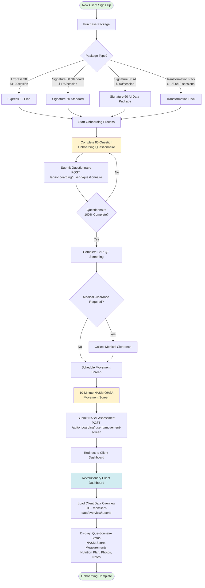
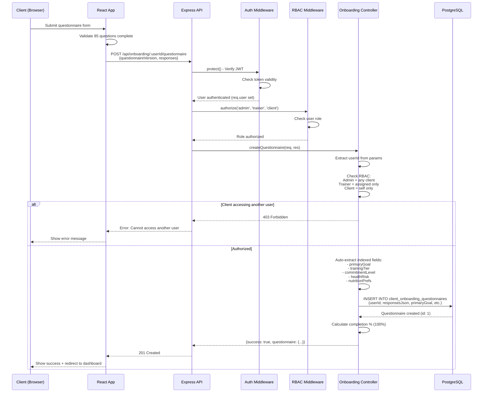
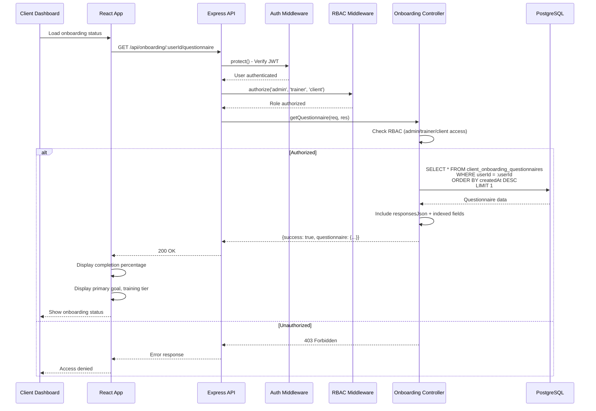
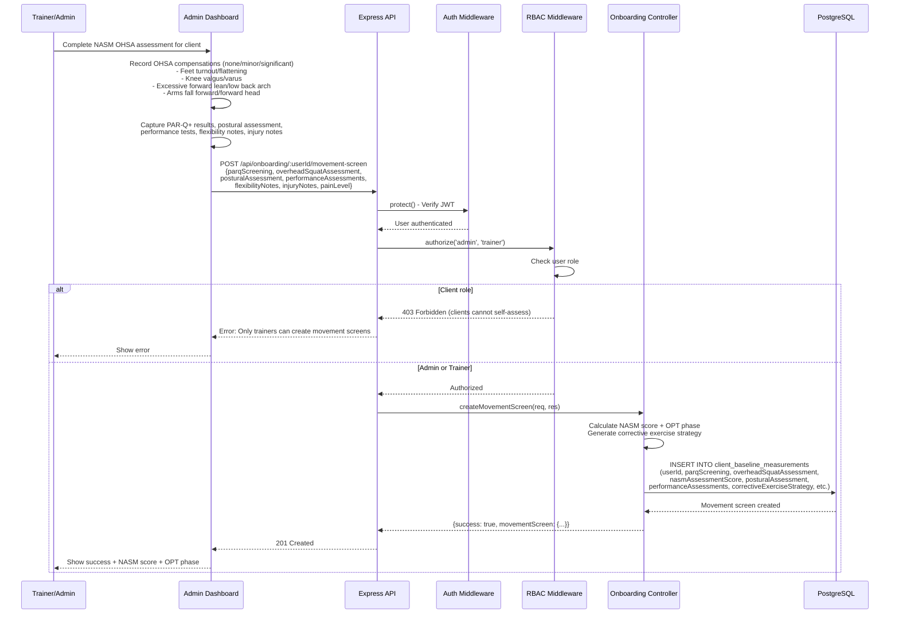
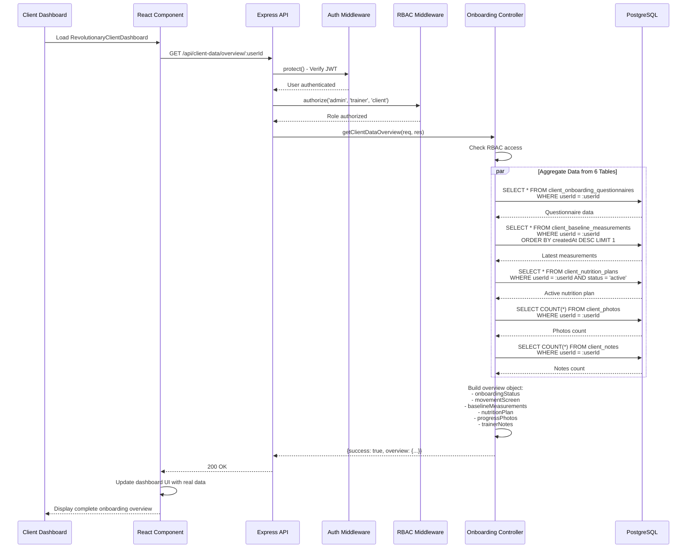
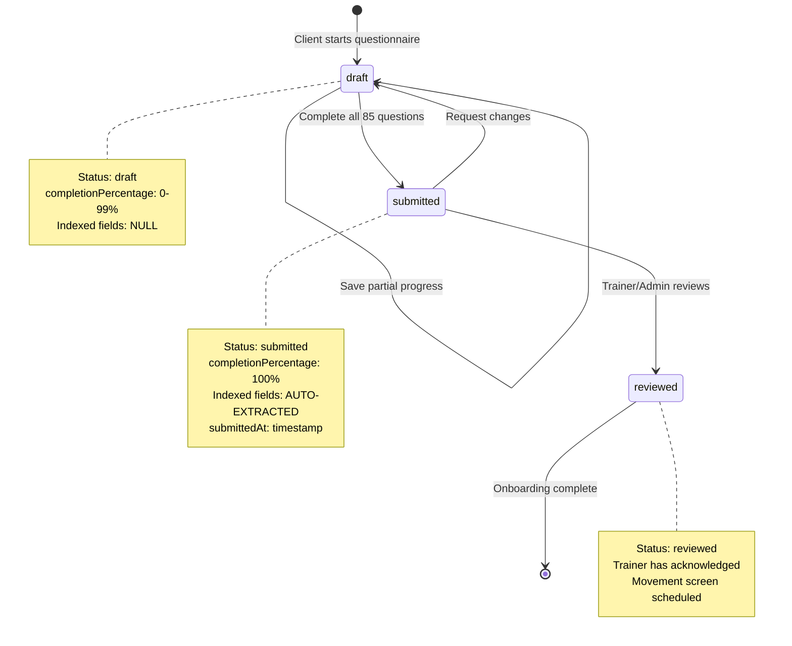
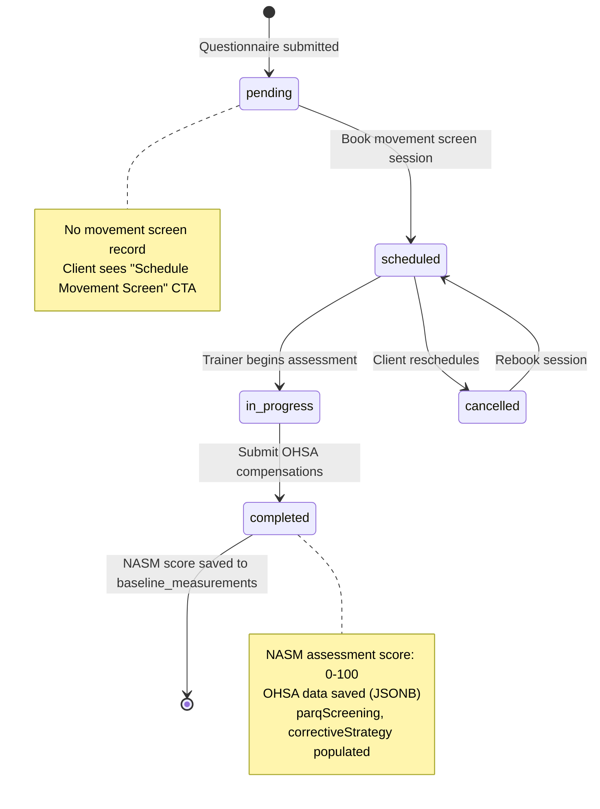
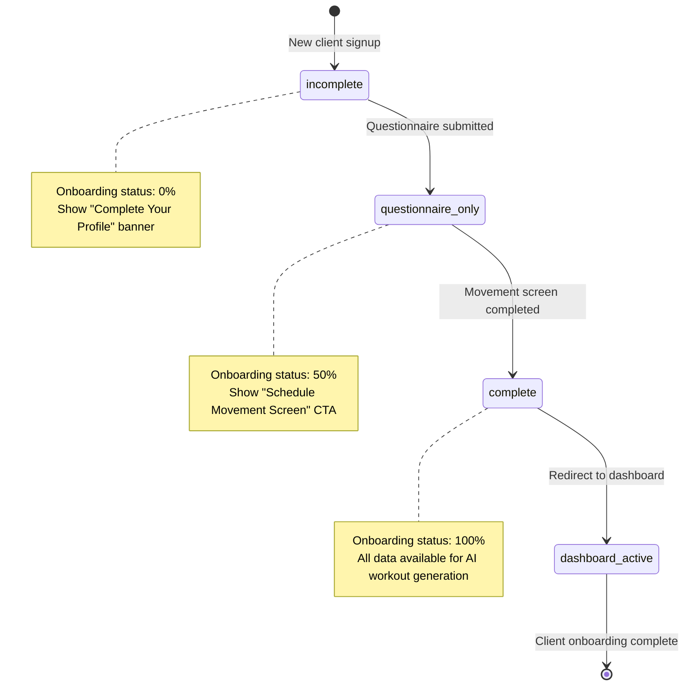

# Client Onboarding Flow - Architecture & API Design (Part 1)
**Version:** 1.0
**Created:** 2026-01-15
**Phase:** Phase 1.1 - Client Onboarding Blueprint
**Purpose:** Define user journey, API sequences, database relationships, and RBAC for client onboarding system
**Part:** 1 of 2
**Scope:** User journey flow, API sequence diagrams, state machines

---

## Table of Contents
1. [User Journey Flow](#user-journey-flow)
2. [API Sequence Diagrams](#api-sequence-diagrams)
3. [State Machine](#state-machine)

---

## User Journey Flow

### High-Level Client Onboarding Journey

### Detailed Questionnaire Flow (85 Questions, 13 Sections)

```mermaid
graph LR
    Start([Begin Questionnaire]) --> Section1[Section 1:<br/>Personal Info]
    Section1 --> Section2[Section 2:<br/>Goals & Package]
    Section2 --> Section3[Section 3:<br/>Health History]
    Section3 --> Section4[Section 4:<br/>Medications]
    Section4 --> Section5[Section 5:<br/>Nutrition Preferences]
    Section5 --> Section6[Section 6:<br/>Lifestyle & Schedule]
    Section6 --> Section7[Section 7:<br/>Fitness Experience]
    Section7 --> Section8[Section 8:<br/>Injury History]
    Section8 --> Section9[Section 9:<br/>Movement Limitations]
    Section9 --> Section10[Section 10:<br/>Training Preferences]
    Section10 --> Section11[Section 11:<br/>Accountability]
    Section11 --> Section12[Section 12:<br/>Success Metrics]
    Section12 --> Section13[Section 13:<br/>Additional Notes]
    Section13 --> Submit[Submit All Responses]

    Submit --> APICall[POST /api/onboarding/:userId/questionnaire]
    APICall --> Extract[Auto-Extract Indexed Fields]
    Extract --> Save[Save to Database]
    Save --> Complete([Questionnaire Complete])

    style Start fill:#e1f5e1
    style Complete fill:#e1f5e1
    style Submit fill:#d1ecf1
    style APICall fill:#d1ecf1
```

---

## API Sequence Diagrams

### 1. Create Questionnaire Response

### 2. Get Questionnaire

### 3. Create Movement Screen Assessment

### 4. Get Client Data Overview (Dashboard Aggregation)

---

## State Machine

### Questionnaire Status Flow

### Movement Screen Status Flow

### Onboarding Completion Flow

---

