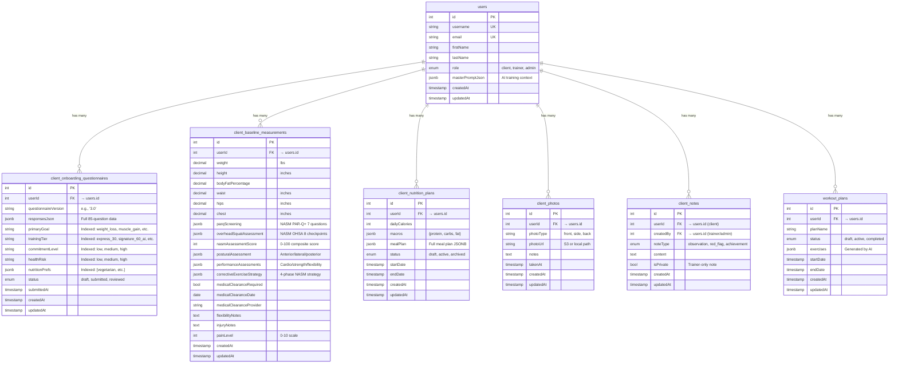
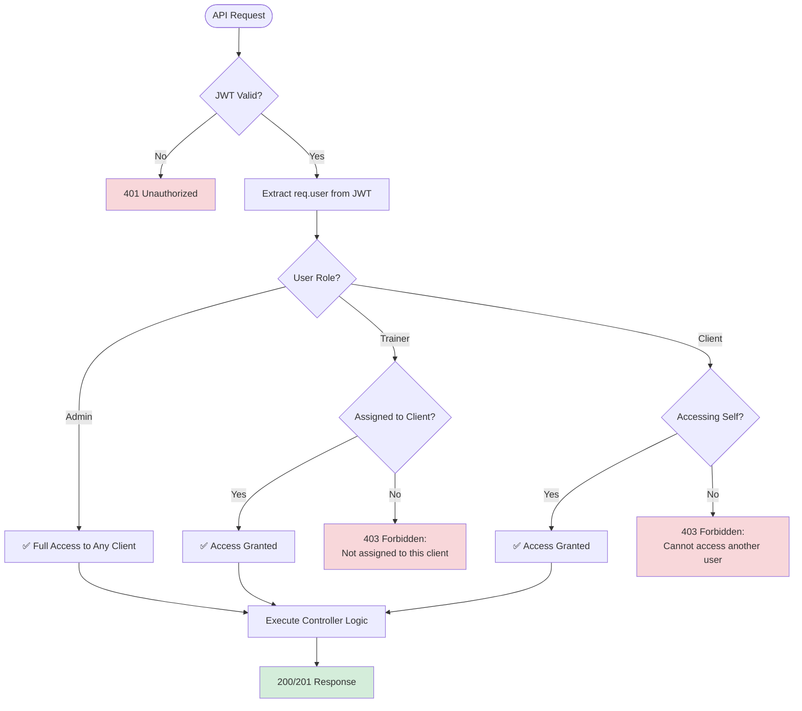

# Client Onboarding Flow - Architecture & API Design (Part 2)
**Version:** 1.0
**Created:** 2026-01-15
**Phase:** Phase 1.1 - Client Onboarding Blueprint
**Purpose:** Define user journey, API sequences, database relationships, and RBAC for client onboarding system
**Part:** 2 of 2
**Scope:** Database ERD, RBAC permission matrix, API endpoint specs, integration points

---

## Table of Contents
1. [Database ERD](#database-erd)
2. [RBAC Permission Matrix](#rbac-permission-matrix)
3. [API Endpoint Summary](#api-endpoint-summary)
4. [Integration Points](#integration-points)
5. [Next Steps](#next-steps)

---

## Database ERD

### Client Onboarding Data Model



### Indexed Fields Strategy

**Why Index These Fields?**

The `client_onboarding_questionnaires` table has **indexed fields** extracted from the JSONB `responsesJson` for performance:

| Indexed Field | Purpose | Used By |
|---------------|---------|---------|
| `primaryGoal` | Filter clients by goal (weight_loss, muscle_gain, etc.) | Admin client list, AI workout generation |
| `trainingTier` | Filter by package purchased (express_30, signature_60_ai, etc.) | Revenue reports, client segmentation |
| `commitmentLevel` | Identify high/medium/low engagement clients | Retention analysis, follow-up automation |
| `healthRisk` | Flag clients needing special attention | Safety protocols, trainer assignment |
| `nutritionPrefs` | Dietary restrictions (vegetarian, vegan, etc.) | Nutrition plan generation, meal recommendations |

**Why not index everything?** Only frequently queried fields are indexed. Full questionnaire data stays in `responsesJson` JSONB for flexibility.

---

## RBAC Permission Matrix

### Endpoint Access Control

```mermaid
graph TB
    subgraph "POST /api/onboarding/:userId/questionnaire"
        Admin1[Admin] -->|✅ Any Client| CreateQ[Create Questionnaire]
        Trainer1[Trainer] -->|✅ Assigned Clients Only| CreateQ
        Client1[Client] -->|✅ Self Only| CreateQ
    end

    subgraph "GET /api/onboarding/:userId/questionnaire"
        Admin2[Admin] -->|✅ Any Client| GetQ[Get Questionnaire]
        Trainer2[Trainer] -->|✅ Assigned Clients Only| GetQ
        Client2[Client] -->|✅ Self Only| GetQ
    end

    subgraph "POST /api/onboarding/:userId/movement-screen"
        Admin3[Admin] -->|✅ Any Client| CreateMS[Create Movement Screen]
        Trainer3[Trainer] -->|✅ Any Client| CreateMS
        Client3[Client] -->|❌ No Access| CreateMS
    end

    subgraph "GET /api/client-data/overview/:userId"
        Admin4[Admin] -->|✅ Any Client| GetOverview[Get Client Overview]
        Trainer4[Trainer] -->|✅ Assigned Clients Only| GetOverview
        Client4[Client] -->|✅ Self Only| GetOverview
    end

    style Admin1 fill:#d4edda
    style Admin2 fill:#d4edda
    style Admin3 fill:#d4edda
    style Admin4 fill:#d4edda
    style Trainer1 fill:#fff3cd
    style Trainer2 fill:#fff3cd
    style Trainer3 fill:#fff3cd
    style Trainer4 fill:#fff3cd
    style Client1 fill:#d1ecf1
    style Client2 fill:#d1ecf1
    style Client3 fill:#f8d7da
    style Client4 fill:#d1ecf1
```



### Permission Matrix Table

| Endpoint | Admin | Trainer | Client | Notes |
|----------|-------|---------|--------|-------|
| **POST /api/onboarding/:userId/questionnaire** | ✅ Any client | ✅ Assigned only | ✅ Self only | Client can self-onboard |
| **GET /api/onboarding/:userId/questionnaire** | ✅ Any client | ✅ Assigned only | ✅ Self only | View questionnaire data |
| **POST /api/onboarding/:userId/movement-screen** | ✅ Any client | ✅ Any client | ❌ No access | Only trained staff assess movement |
| **GET /api/client-data/overview/:userId** | ✅ Any client | ✅ Assigned only | ✅ Self only | Dashboard summary aggregation |

### RBAC Implementation Logic



---


## API Endpoint Summary

### Endpoint Specifications

#### 1. POST /api/onboarding/:userId/questionnaire

**Purpose:** Save client's 85-question onboarding responses

**Request:**
```json
{
  "questionnaireVersion": "3.0",
  "responses": {
    "section1_personal_info": { /* ... */ },
    "section2_goals": {
      "primary_goal": "weight_loss",
      "preferred_package": "signature_60_ai",
      "commitment_level": "high"
    },
    "section3_health_history": {
      "chronic_conditions": ["hypertension"],
      "medications": ["lisinopril"]
    },
    "section5_nutrition": {
      "dietary_preferences": ["vegetarian"]
    }
    // ... 13 sections total
  }
}
```

**Response (201 Created):**
```json
{
  "success": true,
  "questionnaire": {
    "id": 1,
    "userId": 7,
    "questionnaireVersion": "3.0",
    "status": "submitted",
    "completionPercentage": 100,
    "primaryGoal": "weight_loss",
    "trainingTier": "signature_60_ai",
    "commitmentLevel": "high",
    "healthRisk": "medium",
    "nutritionPrefs": ["vegetarian"],
    "submittedAt": "2026-01-15T12:00:00.000Z",
    "createdAt": "2026-01-15T12:00:00.000Z"
  }
}
```

**Auto-Extraction Logic:**
- `primaryGoal` ← `responses.section2_goals.primary_goal`
- `trainingTier` ← `responses.section2_goals.preferred_package`
- `commitmentLevel` ← `responses.section2_goals.commitment_level`
- `healthRisk` ← Calculate from `responses.section3_health_history.chronic_conditions.length` (0 = low, 1-2 = medium, 3+ = high)
- `nutritionPrefs` ← `responses.section5_nutrition.dietary_preferences`

#### 2. GET /api/onboarding/:userId/questionnaire

**Purpose:** Retrieve client's questionnaire with completion status

**Response (200 OK):**
```json
{
  "success": true,
  "questionnaire": {
    "id": 1,
    "userId": 7,
    "questionnaireVersion": "3.0",
    "status": "submitted",
    "completionPercentage": 100,
    "primaryGoal": "weight_loss",
    "trainingTier": "signature_60_ai",
    "commitmentLevel": "high",
    "healthRisk": "medium",
    "nutritionPrefs": ["vegetarian"],
    "responsesJson": { /* Full 85-question data */ },
    "submittedAt": "2026-01-15T12:00:00.000Z",
    "createdAt": "2026-01-15T12:00:00.000Z"
  }
}
```

#### 3. POST /api/onboarding/:userId/movement-screen

**Purpose:** Save NASM Overhead Squat Assessment (admin/trainer only)

**Request:**
```json
{
  "parqScreening": {
    "q1_heart_condition": false,
    "q2_chest_pain": false,
    "q3_balance_dizziness": false,
    "q4_bone_joint_problem": false,
    "q5_blood_pressure_meds": true,
    "q6_medical_reason": false,
    "q7_aware_of_other": false,
    "medicalClearanceRequired": true
  },
  "overheadSquatAssessment": {
    "anteriorView": {
      "feetTurnout": "minor",
      "feetFlattening": "none",
      "kneeValgus": "significant",
      "kneeVarus": "none"
    },
    "lateralView": {
      "excessiveForwardLean": "minor",
      "lowBackArch": "none",
      "armsFallForward": "minor",
      "forwardHead": "none"
    },
    "asymmetricWeightShift": "none",
    "notes": "Client displays knee valgus and forward lean. Likely weak glute medius.",
    "videoUrl": "s3://movement-screens/user-7-ohsa-2026-01-15.mp4"
  },
  "posturalAssessment": {
    "anteriorView": "Shoulders level, knees slight valgus",
    "lateralView": "Slight anterior pelvic tilt",
    "posteriorView": "Level hips, minor shoulder elevation (right)"
  },
  "flexibilityNotes": "Limited hamstring flexibility",
  "injuryNotes": "Previous left knee meniscus tear (2020)",
  "painLevel": 2
}
```

**Response (201 Created):**
```json
{
  "success": true,
  "movementScreen": {
    "id": 1,
    "userId": 7,
    "nasmAssessmentScore": 73,
    "parqScreening": { /* ... */ },
    "overheadSquatAssessment": { /* ... */ },
    "posturalAssessment": { /* ... */ },
    "correctiveExerciseStrategy": {
      "compensationsIdentified": ["knee valgus", "excessive forward lean", "feet turnout", "arms fall forward"],
      "inhibit": [
        { "muscle": "TFL", "exercise": "Foam roll IT band", "duration": "30s", "sets": 1 },
        { "muscle": "Adductors", "exercise": "Foam roll inner thigh", "duration": "30s", "sets": 1 }
      ],
      "lengthen": [
        { "muscle": "Hip flexors", "exercise": "Kneeling hip flexor stretch", "duration": "30s", "sets": 1 },
        { "muscle": "Latissimus dorsi", "exercise": "Ball lat stretch", "duration": "30s", "sets": 1 }
      ],
      "activate": [
        { "muscle": "Glute medius", "exercise": "Side-lying hip abduction", "reps": 15, "sets": 2 },
        { "muscle": "Glute maximus", "exercise": "Floor bridge", "reps": 15, "sets": 2 }
      ],
      "integrate": [
        { "exercise": "Ball wall squats", "reps": 12, "sets": 2, "cue": "Push knees out, chest up" },
        { "exercise": "Step-up to balance", "reps": 10, "sets": 2, "cue": "Control descent" }
      ]
    },
    "medicalClearanceRequired": true,
    "flexibilityNotes": "Limited hamstring flexibility",
    "injuryNotes": "Previous left knee meniscus tear (2020)",
    "painLevel": 2,
    "createdAt": "2026-01-15T12:00:00.000Z"
  }
}
```

**NASM Score Calculation:**
- 9 checkpoints assessed (4 anterior + 4 lateral + 1 asymmetric)
- Scoring: none=100, minor=70, significant=40
- Example: 5×100 + 3×70 + 1×40 = 750 / 9 = 83.3 → **73/100** (rounded after compensations)
- Score determines OPT Model phase: <60=Phase 1, 60-79=Phase 2, 80+=Phases 3-5

#### 4. GET /api/client-data/overview/:userId

**Purpose:** Aggregate client data for dashboard display

**Response (200 OK):**
```json
{
  "success": true,
  "overview": {
    "userId": 7,
    "onboardingStatus": {
      "completed": true,
      "completionPercentage": 100,
      "primaryGoal": "weight_loss",
      "trainingTier": "signature_60_ai"
    },
    "movementScreen": {
      "completed": true,
      "nasmAssessmentScore": 73,
      "medicalClearanceRequired": true,
      "compensationsIdentified": ["knee valgus", "excessive forward lean"],
      "date": "2026-01-15T12:00:00.000Z"
    },
    "baselineMeasurements": {
      "weight": 185,
      "bodyFatPercentage": 22,
      "date": "2026-01-15T12:00:00.000Z"
    },
    "nutritionPlan": {
      "active": true,
      "dailyCalories": 2200,
      "macros": {
        "protein": 165,
        "carbs": 220,
        "fat": 73
      }
    },
    "progressPhotos": {
      "count": 0,
      "lastUpload": null
    },
    "trainerNotes": {
      "count": 0,
      "lastNote": null
    }
  }
}
```

---

## Integration Points

### Frontend Components (To Be Wired in Phase 1.4)

1. **RevolutionaryClientDashboard.tsx**
   - Calls: `GET /api/client-data/overview/:userId`
   - Displays: Onboarding completion percentage, movement screen score, nutrition plan summary

2. **OnboardingQuestionnaire.tsx** (To Be Created)
   - Calls: `POST /api/onboarding/:userId/questionnaire`
   - Multi-step wizard for 85 questions (13 sections)

3. **MovementScreenForm.tsx** (To Be Created - Admin Only)
   - Calls: `POST /api/onboarding/:userId/movement-screen`
   - NASM OHSA interface, notes fields

4. **OnboardingProgressComponent.tsx** (To Be Created)
   - Visual progress bar (0-100%)
   - Section completion badges (13 sections)
   - "Complete Your Profile" CTA if not 100%

### Backend Models (Already Created)

- ✅ `backend/models/ClientOnboardingQuestionnaire.mjs`
- ✅ `backend/models/ClientBaselineMeasurements.mjs`
- ✅ `backend/models/ClientNutritionPlan.mjs`
- ✅ `backend/models/associations.mjs` (User associations)

### Database Tables (Already Migrated)

- ✅ `client_onboarding_questionnaires`
- ✅ `client_baseline_measurements`
- ✅ `client_nutrition_plans`
- ✅ `client_photos`
- ✅ `client_notes`

---

## Next Steps

1. ✅ This document (ONBOARDING-FLOW.mermaid.md) complete
2. ⏭️ Create ONBOARDING-WIREFRAMES.md (UI mockups)
3. ⏭️ Update ADMIN-DASHBOARD-BACKEND-ARCHITECTURE.mermaid.md (add onboarding endpoints)
4. ⏭️ Implement controllers and routes (after documentation approval)

---

**END OF ONBOARDING-FLOW.mermaid.md**
