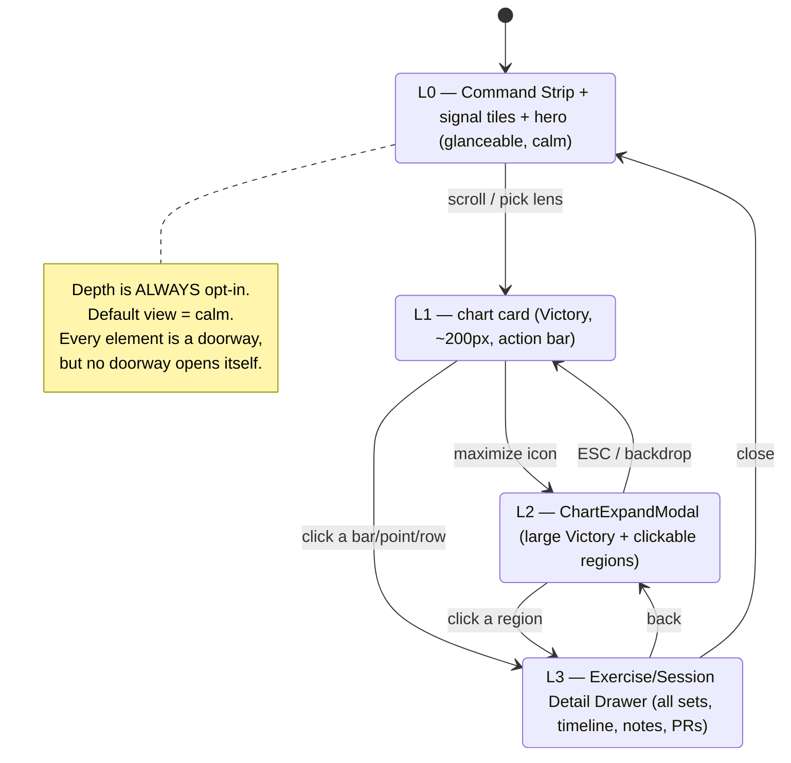

# SwanStudios — Progress Command Center · Fable Orchestrator Brief

> ⚠️ **STALE GROUND TRUTH — READ THE GAP-AUDIT FIRST.** This brief's §2/§4 were audited on branch `wip/comms-notifications-2026-07-05`, **289 commits behind `origin/main`**. The launch-charter arc already shipped ~40-50% of this plan to production (15-chart registry, `personal_records` table with Brzycki + idempotency + reps-domain guard, chart expand-modal, exercise drilldown). The **vision, wireframes, and data-contracts remain valid**, but "what's new vs done" is re-scoped in → **`docs/ai-workflow/blueprints/PROGRESS-COMMAND-CENTER-GAP-AUDIT-DELTA-2026-07-08.md`**. Build only the DELTA (Δ1-Δ11) from that doc, on a clean branch off `origin/main`.

**Date:** 2026-07-08 · **Author:** Opus 4.8 (grounded from live repo, 4 parallel surface audits) · **Recipient:** Fable 5 (Lead Orchestrator / Master Architect) · **Executor:** worker-bot (Opus 4.8 / Codex) building slice-by-slice to Fable's locked plan
**Status:** 🔒 **LOCKED** — Fable 5: **LOCK-WITH-CHANGES**, verified twice (§15 M1–M9, §16 M10–M18). Pipeline: repo audit → free triangle (§14) → Fable ruling (§15) → full body-integration → Fable verification pass on the integrated plan (§16). Build-ready; **§15 + §16 are the binding override layers**, key items also folded into the body slices. (Round-2 free triangle hit a Gemini/Codex provider outage; a Claude solo pass + the Fable verification stood in.)
**Feeds:** `docs/ai-workflow/brainstorms/FABLE-VISION-MASTER-BRIEF-2026-07-05.md` → **this is the deep-dive expansion of Workstream I (charts) + the progress dashboard as a whole.**
**Supersedes:** `docs/ai-workflow/blueprints/CLIENT-DATA-ENRICHMENT-PROGRESS-GRAPHS-PLAN.md` (STALE — see §0.3).

---

## 0. How to read this brief (latitude clause — read first)

**You are the lead orchestrator. You may change, refactor, restructure, rename, consolidate, or discard anything in this document.** This brief is not a locked spec — it is *verified reality + vision + intent + data truth*, expressed the way you think, so you can build the Progress Command Center in your own pure vision with zero ambiguity and zero further questions.

What is **binding** (do not violate):
- **CLAUDE.md house rules** (§0.1) — styled-components only, Victory charts only, Crystalline Swan palette, Dual-Button Glow, 44px targets, dark-first, ≤300 lines/file, zero PII to LLMs.
- **Data truth** — every metric traces to a real column in a real table (§4 data contract). No mock, no `DEMO_DATA` on a live surface, honest empty states.
- **The verified reality** in §2 (with `file:line`) — this is what actually exists today. Elevate from it; do not plan against the *claims* the incoming report made (they were partly fabricated — §0.2).

Everything else — IA, component names, section order, which modules ship, how depth is disclosed, whether to add a PR table vs a materialized view — is **yours to decide**. Where this brief marks an **⟐ ORCHESTRATOR DECISION**, that is an explicit fork I am handing you with the trade-offs pre-analyzed; pick and justify.

**Detail bar (Sean's ask):** the final plan must be executable by a lower-tier worker-bot with zero further questions — "to the T, everything mermaid, wireframed, broken into the tiniest data set." If a worker-bot would need to ask you a question, the plan is incomplete.

### 0.1 Binding house rules (CLAUDE.md, non-negotiable)
styled-components only (no MUI) · **Victory charts only (NO Recharts — the superseded plan violated this)** · Crystalline Swan palette via `var(--token, #fallback)` · Dual-Button Glow (blue bg → purple glow / purple bg → cyan glow) · 44px min touch targets · dark-first (`crystalline-dark` default) · WCAG 4.5:1 contrast · ≤300 lines/file (extract hooks/utils/styles/types) · blueprint header on components >100 lines · zero PII to LLMs (IDs only) · no "yoga/meditation" ("stretching"/"flexibility") · Credentials: "26+ years experience / NASM-protocol", never "NASM-certified" · 7-star docs on new files.
Responsive matrix: `320 · 375 · 414 · 768 · 1024 · 1280 · 1440 · 1920 · 2560×1440 · 3840×2160 · 3440`.

### 0.2 ⚠ Fabrications in the incoming report (caught by hostile audit — do NOT carry them forward)
The research report you were handed made confident claims that are **false against the live repo**. Corrected here so you plan against reality:

| Report claimed | Reality (verified) | Evidence |
|---|---|---|
| "15 chart IDs incl. weight, body-fat, est-1RM" in the client registry | **Registry is exactly 12 IDs.** Weight/body-fat/1RM charts do NOT exist on My Progress; they live only in unrelated admin measurement views. | `frontend/src/hooks/analytics/useClientProgressCharts.types.ts:9-22` |
| Naming drift is "12 vs 14 vs 15" | Real drift is **12 (inline grid) vs 14 (separate `/progress/detailed` route label)**. "15" is fabricated. | `CanonicalProgressChartsGrid.tsx:4`; `UniversalDashboardLayout.routes.tsx:186` |
| An "exercise-timeline drilldown endpoint, LIMIT 100, set-count per day" exists | **No such endpoint exists.** Nearest are `getPRTimelineChart` (180d, no limit) and `getAnchorLiftsChart` (90d, top-3). Neither returns per-day set counts or uses LIMIT 100. | `chartDataController.mjs:381-456` |
| "Estimated 1RM uses Brzycki for the most-logged lift" | Brzycki formula exists in 3 utils but **no backend path applies it to a most-logged lift**. The PR route comment even advertises "Brzycki 1RM estimates" while the service returns **raw max weight, no 1RM at all**. | `oneRepMaxService.mjs:70`; `analyticsService.mjs:117-165` |
| (Implied) PRs are durable/queryable | **No `PersonalRecord` table exists.** PRs are computed on the fly and written to an **undeclared** `ClientProgress.personalRecords` property — a latent drift bug. | no `personal_records` model; `workoutService.mjs:611-621` |
| (Implied) logged sets carry pain + catalog metadata | `workout_logs` has **no pain column** (pain is keyword-scraped from `notes`) and **no FK to the exercise catalog** (only free-text `exerciseName`). | `WorkoutLog.mjs:4-88` |

**Lesson for your plan:** the incoming report was strong on *product vision* and weak on *ground truth*. Keep its vision (Workout Ledger, true Rolodex, richer drilldowns, AI report selection, one registry). Rebuild its data assumptions on §2/§4.

### 0.3 Why the old CLIENT-DATA-ENRICHMENT plan is superseded (do not follow it)
`docs/ai-workflow/blueprints/CLIENT-DATA-ENRICHMENT-PROGRESS-GRAPHS-PLAN.md` predates the Phase-14 canonical rebuild and is unsafe to execute as written:
- **Rule 10 violation:** it specifies **Recharts** (`ComposedChart`, `RadarChart`, dual-axis) throughout. Swan is **Victory-only**.
- **Wrong taxonomy:** it targets the **legacy** `ClientProgressCharts.tsx` subsystem (Epley 1RM over `DailyWorkoutForm` JSON), which is one of the three *competing* surfaces this brief consolidates — not the canonical 12-chart path.
- **Wrong column names:** `measuredAt` (real: `measurementDate`), `MacroLog`/`logDate`/`totalCalories`/`fats` (real: `DailyMacroLog`/`date`/`calories`/`fat`). Building on those field names produces `column does not exist` at runtime (Rule 58 schema drift).
- **Salvage value:** its *AI-enrichment* half (Part 1 — pain/form/nutrition/goals into the master prompt) is orthogonal to this surface and remains a legitimate backlog item, but it belongs to Workstream H (next-best-action), not here. Mine it for ideas; do not import its code or field names.

---

## 1. Vision statement

**What it is:** the **Progress Command Center** — SwanStudios' single canonical, role-aware progress surface. One control room where a client sees their training truth, a trainer coaches from it, and an admin proves value from it — all driven by **one metric registry**, not three competing chart systems.

**What it's for (Product Core Loop):** this is the *"turn it into charts/progress proof → decide the next training action → make milestones shareable"* leg of the loop. Logging happens elsewhere (Workstream F); this surface is where logged truth becomes **proof, decision, and celebration.**

**Where it sits:** a **parent surface** with four role-scoped renderings (user / client / trainer / admin) and two child depth layers (Exercise Detail Drawer, Session Detail Drawer). It is the destination the logger, the calendar, and the next-best-action card all deep-link into.

**Why it matters:** Sean's words — it must *look cool, be fun, not overwhelming, and be deeply clickable so you can find more information on everything.* Today the data spine is strong but the experience is shallow: depth is capped (`slice(0,8)`), buried in tiny drilldowns, missing from staff views, and split across three data paths with different contracts. The move is **not "we have no data" — it's "promote the hidden depth, remove the caps, unify the surfaces, and make every pixel a doorway."**

**The three design tensions to hold simultaneously** (this is the whole brief in one line):
> **Cool + fun** (gamified, cinematic, celebratory) · **not overwhelming** (progressive disclosure — depth is opt-in per click) · **deeply clickable** (every tile, chart region, row, and calendar cell opens the truth beneath it).

---

## 2. Grounded current state (verified `file:line`)

### 2.1 What "My Progress" actually is today
Route `/dashboard/client/progress` → `ClientProgressDashboardPage.tsx:62` renders, in order: header → 6 gamification stat cards → XP bar → companion pet + weekly recap → personal-records strip → `<CanonicalProgressChartsGrid/>` (`:269`) → a locked CTA to a separate `/progress/detailed` route.

`CanonicalProgressChartsGrid.tsx` mounts **6 named panels** above a lens-filtered grid of **exactly 12 chart cards**:
- `ProgressProofCockpit` (`progress-proof/ProgressProofCockpit.tsx`, mounted `:66`)
- `ProgressChartCube` (`:73`)
- `ProgressChartWarRoomBoard` (`:78`)
- `ProgressChartRecoveryObservatory` (`:79`)
- `ExerciseCodexMatrix` (`:84`) — a static coverage **heatmap** ("Full Rolodex coverage… trained/sampled/untouched"), NOT a per-exercise timeline
- `ClientExerciseMegaStats` (`:85`) — "Exercise diary" ranked rows

### 2.2 The canonical 12-chart registry (single frontend contract)
`useClientProgressCharts.types.ts:9-43` — `CANONICAL_CHART_IDS` + `CANONICAL_CHART_ROUTES`, exactly 12:
`workoutFrequency · attendanceReliability · weeklyVolume · setsRepsTrend · durationTrend · intensityRpeTrend · prTimeline · anchorLifts · exerciseFrequency · movementPatternBalance · muscleGroupBalance · recoverySignal`

### 2.3 Backend analytics (Phase-14, truthful snake_case)
`chartDataController.mjs` — rebuilt on real tables (`workout_logs` JOIN `workout_sessions`, `body_measurements`, `daily_macro_logs`), explicitly avoiding the old broken PascalCase joins (`:11-14,53-54`). Served by BOTH:
- `/api/analytics/:userId/chart-*` — `analyticsRoutes.mjs:162-187`, tier-gated + `requireOwnershipOrTrainer` (admin/trainer path)
- `/api/client/analytics/chart-*` — `clientAnalyticsRoutes.mjs`, JWT-derived userId (client self path)

**Endpoints that exist today** (controller functions, all real-data):
| # | Endpoint | Metric | Notes / evidence |
|---|---|---|---|
| 1 | `chart-workout-frequency` | completed sessions/week | `getWorkoutFrequencyChart` |
| 2 | `chart-attendance-reliability` | status breakdown + reliability % | `getAttendanceReliabilityChart` |
| 3 | `chart-weekly-volume` | `SUM(weight*reps)`/week | `:218` |
| 4 | `chart-sets-reps-trend` | count(sets)+sum(reps)/week | — |
| 5 | `chart-duration-trend` | session duration | — |
| 6 | `chart-intensity-rpe-trend` | `AVG(wl.rpe)` w/ fallback `ws.intensity` | `:339-361` (set-RPE preferred, verified) |
| 7 | `chart-pr-timeline` | heaviest set/day/exercise, 180d | `:381-399`, `DISTINCT ON`, no limit |
| 8 | `chart-anchor-lifts` | top-3 exercises, heaviest/day, 90d | `:426-456` |
| 9 | `chart-exercise-frequency` | **all-time, NO cap**, by distinct sessions + sets | `:488-503` — `COUNT(DISTINCT sessionId)`, `GROUP BY exerciseName`, no LIMIT |
| 10 | `chart-movement-pattern-balance` | NASM movement patterns (ILIKE CASE on `exerciseName`) | `:586-587` |
| 11 | `chart-muscle-group-balance` | NASM muscle groups (ILIKE CASE on `exerciseName`) | `:697-698` |
| 12 | `chart-recovery-signal` | pain-note keyword scan + `RPE≥9`, 90d, LIMIT 10 | `:749-778` |
| 13 | `chart-weight-progression` | `body_measurements` | legacy-but-truthful (NOT on My Progress today) |
| 14 | `chart-body-fat-trend` | `body_measurements` | legacy-but-truthful |
| 15 | `chart-macro-split` | `daily_macro_logs` | legacy-but-truthful |
| 16–20 | deprecated shims | return empty payloads | back-compat only |

**Note the ILIKE-CASE reality (#10, #11):** movement pattern and muscle group are derived by *string-matching `exerciseName`*, not by joining the exercise catalog — because `workout_logs` has no catalog FK (§4.1). This works but is brittle for the "true Rolodex with equipment/difficulty/NASM-phase metadata" vision.

### 2.4 The three competing progress data paths (the core problem to consolidate)
| Surface | Route | Data path | Verdict |
|---|---|---|---|
| **CLIENT** | `/dashboard/client/progress` | `CanonicalProgressChartsGrid` → `useClientProgressCharts` → `/api/client/analytics/chart-*` (12 canonical) | **canonical** |
| **ADMIN** (Clients & Team) | `ClientDetailView` → `ProgressTabContent` → `AdminProgressChartsGrid` → `useAdminClientProgressCharts` → `/api/analytics/:userId/chart-*` | **canonical** (same 12 IDs; but the 12 card components are *duplicated* per surface, `AdminProgressChartDeck` vs `CanonicalProgressChartsGrid.*Cards`) |
| **USER** (V3 dashboard) | `/user-dashboard` → progress tab → `WorkoutsTab` → `GET /api/workout/sessions` (limit 200) → muscle-category counts + local streak | **competing taxonomy** — different endpoint, different classifier, `Other→Core` misclassification (`WorkoutsTabTransformers.ts:29`) |
| **TRAINER** | `/dashboard/trainer/client-progress` → `EnhancedClientProgressViewShell` → `ClientProgressView` → `ClientAnalyticsPanel` + `ClientProgressCharts` + `ExerciseHistoryChart` → **legacy** `/api/analytics/:userId/*` | **legacy** — bypasses the canonical hook entirely |
| **ADMIN** (2nd surface) | `AdminClientProgressView` V2 + `EnhancedWorkoutsModal`→`WorkoutChartsTab` → legacy `/api/analytics/:userId/*` | **legacy** |

**Also present:** the single-exercise drilldown that DOES exist — `Charts/ExerciseHistoryChart.tsx` (labeled "Exercise Rolodex", `/api/analytics/:userId/exercise-history`) — is mounted only on the **social profile** (`ProfileChartsSection.tsx:98`) and the **legacy trainer view** (`ClientAnalyticsPanel.tsx:138`). It is **absent from both the canonical client grid and the canonical admin grid.** So the one real "click an exercise → see its history" drawer exists but is wired to the wrong (legacy/social) surfaces.

### 2.5 The per-set richness exists but is siloed
`ClientMyWorkoutsPage.tsx` (`/workouts`) renders full per-set history (Set/Weight/Reps/Tempo/RPE/Rest, `:259-274`) but its stat cards are **page-scoped** ("On This Page", "Page Volume") because the session endpoint returns no lifetime totals (`:193-197`). The true workout ledger is present — just not integrated into Progress and not aggregated to lifetime.

---

## 3. Desired end state (the elevated vision)

One **Progress Command Center**, four role renderings, driven by a single **Progress Proof Registry**. Cinematic, celebratory, and calm — depth revealed on click, never dumped. Concretely:

1. **A control-room Command Strip** replaces the current stacked opener — identity, phase, freshness, and the single most important thing (next-best-action), with primary actions (Log · Report · Share · Ask Coach) always reachable.
2. **A single Progress Proof Registry** defines every metric once (id, title, endpoint, real source columns, privacy, role access, lens group, empty-state, drilldown, report/AI-slide eligibility). All four roles render from it. The three competing paths collapse into one.
3. **Everything is a doorway.** Three deliberate depth layers (§6): glance (L0) → card (L1) → fullscreen with clickable regions (L2) → detail drawer (L3). Nothing overwhelming because you only descend when you choose to.
4. **The caps come off for premium depth:** the true Exercise Rolodex (no `slice(0,8)`), the full Workout Ledger (every session, lifetime totals), rich Exercise + Session Detail Drawers.
5. **New premium modules** the data can honestly support: Training Density Calendar, Volume Load Heatmap (week × muscle), Effort Distribution (RPE zones), Recovery Risk Board, PR Ladder, Body-Comp × Training correlation, Plan Adherence, Nutrition/Readiness overlay, and staff Risk Rollups.
6. **Fun that never lies:** streaks, PR "next-target" boss battles, milestone celebrations, "what changed this month", badges — every one sourced from real logs, every card wearing a **data-completeness + source badge** so the celebration is earned, not marketed.
7. **An AI Report Studio** built on the existing `ProgressChartStudio` shell — select charts + range + tone + privacy → a proof-packet with source labels and completeness on every slide.

---

## 4. Data & API contract (the source of truth — build on THIS, not memory)

### 4.1 Real model columns (schema-drift landmines flagged)
Casing is **per-model, not global** — do not assume one convention.

**`WorkoutLog`** (`WorkoutLog.mjs`, table `workout_logs`, **camelCase columns, JS==DB**):
`id`(INT PK) · `sessionId`(UUID→workout_sessions.id) · `exerciseName`(STRING) · `setNumber`(INT) · `reps`(INT) · `weight`(FLOAT) · `tempo`(STRING) · `rest`(INT seconds — **NOT `restSeconds`**) · `rpe`(INT 1-10) · `notes`(TEXT) · `exerciseNote`(TEXT).
⚠ **No `painLevel` column** (pain is keyword-scraped from `notes`/`exerciseNote`). ⚠ **No FK to the exercise catalog** — only free-text `exerciseName` links a set to `Exercise`.

**`WorkoutSession`** (`WorkoutSession.mjs`, table `workout_sessions`, camelCase):
`id`(UUID PK) · `userId`(INT→Users) · `title` · `date`(DATE) · `duration`(INT min) · `intensity`(INT 1-10, nullable="not rated") · `notes` · `totalWeight`/`totalReps`/`totalSets`(denormalized) · `avgRPE`(FLOAT) · `workoutPlanId`(UUID→WorkoutPlans) · `workoutPlanDayId`(UUID→WorkoutPlanDays) · `status`(ENUM planned/in_progress/completed/skipped/cancelled) · `startedAt`/`completedAt` · `sessionType`('solo'|'trainer-led') · `sessionId`(INT→sessions.id, the *booked* session — **name collision** with WorkoutLog.sessionId) · `trainerId`(INT→Users, the "logged-by/trainer"; **no `loggedBy` field**).

**`Exercise`** (`Exercise.mjs`, table `"Exercises"` PascalCase, camelCase cols; JSON stored as TEXT):
`id`(UUID PK) · `name`(unique) · `exerciseType`(ENUM — the "category") · `primaryMuscles`/`secondaryMuscles`(TEXT-JSON — **NOT `muscleGroups`**) · `difficulty`(INT 0-1000 — numeric, not label) · `equipmentNeeded`(TEXT-JSON — **NOT `equipment`**) · `nasmMovementPattern`(STRING — the movement pattern) · `optPhases`(TEXT-JSON array 1-5 — the NASM phase, **array not scalar `nasmPhase`**) · plus `coachingCues`, `instructions`, `videoUrl`, etc.
⚠ Join to logs is by **string `name` ↔ `exerciseName`**, no referential integrity.

**`BodyMeasurement`** (`body_measurements`, camelCase):
`id`(INT) · `userId` · `recordedBy` · `measurementDate`(DATE — **NOT `date`/`measuredAt`**) · `weight`(DECIMAL) · `weightUnit`(ENUM) · `bodyFatPercentage`(DECIMAL) · `muscleMassPercentage` · discrete circumference columns (neck/chest/waist/… — **not a JSON blob**) · `photoUrls`(JSONB) · `milestonesAchieved`(JSONB).

**`DailyMacroLog`** (`daily_macro_logs`, camelCase):
`id`(INT) · `userId` · `date`(DATEONLY) · `calories`(FLOAT — **NOT `totalCalories`**) · `protein` · `carbs` · `fat`(FLOAT — **singular, NOT `fats`**) · `fiber`/`sugar`/`sodium`/… · `items`(JSONB).

**Planned structure (for adherence)** — **two parallel representations exist:**
- `WorkoutPlan` (`workout_plans`, ⚠ **HYBRID casing** — every attr has explicit `field:`; e.g. `trainerId`→`trainer_id`, `planData`→`plan_data` JSONB holding the full weeks→sessions→exercises tree). This is the single biggest drift risk in the app.
- Normalized child tables: `WorkoutPlanDay` (`workout_plan_days`) + `WorkoutPlanDayExercise` (`workout_plan_day_exercises`, camelCase: `exerciseId`(UUID→Exercises), `orderInWorkout`, `setScheme`, `repGoal`, `restPeriod`, `tempo`, `intensityGuideline`).
- `WorkoutSession.workoutPlanId`/`workoutPlanDayId` let you join planned↔completed **at the day level**. ⚠ `workout_logs` has **no FK** to `workout_plan_day_exercises` — per-set adherence requires string-matching `exerciseName`.
- `DailyWorkoutForm` (`daily_workout_forms`, ⚠ **fully snake_case via `field:`**) — `formData` JSONB holds per-exercise `formRating`(1-5) (not a real column).
- **`ClientPainEntry`** (`ClientPainEntry.mjs`, table camelCase) — **VERIFIED as the structured pain source** (Triangle F1): `userId`(INT) · `bodyRegion`(STRING50, notNull) · `side`(STRING20) · `painLevel`(INT, notNull) · `painType`/`posturalSyndrome`(STRING) · `aggravatingMovements`/`relievingFactors`/`aiNotes`(TEXT) · `isActive`(BOOL) · indexes `idx_pain_user_active (userId,isActive)` + `idx_pain_body_region`. ✅ "pain **by body area**" is directly supported by `bodyRegion` (indexed). ⚠ "pain **by exercise**" has no `exerciseId` FK — derive via the `aggravatingMovements` text or a name bridge (⟐D2). This is the ONE pain source of truth; do not re-scrape `notes` except as a fallback signal.

**PRs:** ⚠ **No `PersonalRecord` table exists.** PRs are computed in-memory (`workoutService.mjs:611-621`) and written to `ClientProgress.personalRecords` — a property the `ClientProgress` model **does not declare** (latent drift bug). Any durable/queryable PR feature must materialize PRs (see ⟐ Decision D3).

### 4.2 Gaps the schema lacks that this vision needs (rank + decide)
1. **Durable PR store** — none. PRs are ephemeral + written to an undeclared field. Needed for PR Ladder, PR markers, "next PR target." → **⟐ D3**.
2. **Structured pain** — no `painLevel` on logs; pain is keyword-scraped. `ClientPainEntry` exists as a normalized source. Needed for Recovery Risk Board "pain by body area/exercise." → **⟐ D4**.
3. **Log→catalog identity** — no FK; muscle/pattern/equipment/difficulty/NASM-phase per logged exercise depends on string matching. Needed for the true Rolodex metadata. → **⟐ D2**.
4. **Lifetime aggregates** — session endpoint returns page-scoped totals only. Needed for the Ledger + hero tiles. → straightforward new read-model endpoint (no schema change).
5. **Per-set plan-adherence link** — day-level only. Needed for "planned vs completed exercises/skipped/substituted." → **⟐ D5** (string-match vs add FK).

### 4.3 API surface the Command Center needs (proposed — you own the shapes)
Reuse the existing 12 `chart-*` endpoints unchanged. Add these (client-self twin under `/api/client/analytics`, staff twin under `/api/analytics/:userId`, both already patterned):

| New endpoint | Returns | Backed by | Status |
|---|---|---|---|
| `…/ledger?range&pattern&muscle&exercise&status&page` | paginated sessions w/ per-session rollups (volume, sets, reps, avgRPE, high-RPE count, pain-note count, pattern mix, muscle mix, adherence, who-logged) | `workout_sessions`+`workout_logs` aggregate | NEW |
| `…/summary-lifetime` | lifetime totals (workouts, volume, sets, reps, exercises trained, best est-1RM, current streak, longest streak) | aggregate | NEW (fixes 2.5) |
| `…/lens-summary` | per-lens `{lensId, populated, missingInputs}` — powers the L0 lens badges in ONE call instead of 12–20 completeness fetches on the calm landing (M3) | aggregate over registry lenses | NEW (M3) |
| `…/exercise-rolodex` | EVERY exercise: sessions, sets, reps, volume, maxLoad, best-est-1RM, best set, first/last trained, days-since, weekly trend, PR count, high-RPE flag, pain flag, + catalog metadata (pattern/muscle/equipment/difficulty/phase) | extend `getExerciseFrequencyChart` (already no-cap) + catalog bridge (⟐D2) | NEW (promotes #9) |
| `…/exercise-detail?name=` **(M4 — query-param, NOT a path segment: exercise names carry `%`/`+`/spaces/unicode; `?exerciseId=` is the preferred key post-backfill; drawer keys on `{exerciseId ?? normalizedName}`)** | one exercise: all sets, heaviest/volume/reps per day, avg RPE, rest/tempo trends, notes, pain notes, PR markers, est-1RM trend | `workout_logs` filtered | NEW (replaces the fabricated "LIMIT 100" claim; supersedes `ExerciseHistoryChart`) |
| `…/session-detail/:id` | one session: every set, exercise breakdown, trainer/client notes, plan adherence, substitutions | `workout_logs` by `sessionId` | NEW |
| `…/plan-adherence?range` | planned vs completed sessions/exercises, skipped, substitutions, adherence %, missed-week flags | plan tables ⋈ sessions (⟐D5) | NEW |
| `…/pr-ladder` | all PR events, current/previous, delta, days-between, droughts, next-target | ⟐D3 store | NEW (needs D3) |
| `…/density-calendar?range` | per-day: completed/skipped/planned, volume, high-RPE, pain flags | aggregate | NEW |
| Staff-only `/api/analytics/rollups` | client risk rollups (§ module 12) | cross-client aggregate | NEW |

Every response includes a **completeness envelope**: `{ data, meta: { sourceTable, rowsUsed, dateRange, completeness: 0–1, missingInputs: [...] } }` — this is what powers the "3 missing inputs / ready for report" badges and keeps every celebration honest.

**⚠ Compat constraint (Triangle C2):** the envelope is a response-shape change to the existing 12 `chart-*` endpoints, and `useCanonicalProgressChartsFetch` parses today's shape. Add `meta` **additively** — keep the `data` key and its current shape byte-identical — OR version the endpoints (`?v=2`). Do NOT re-nest `data`. A contract test (S0) must lock the existing `data` shape so the envelope can't silently break the canonical grid.

**⚠ Scale rigor (Triangle C1):** removing the `slice(0,8)` UI cap is correct, but the *server* must stay bounded. `…/exercise-detail` ("all sets") and `…/ledger` are **paginated/virtualized with a server-side page size**, never "return everything." Add DB indexes on `workout_logs(sessionId)`, `workout_logs(exerciseName)`, and `workout_sessions(userId, date)` before these ship (the fabricated "LIMIT 100" was gesturing at a real need — a *server* bound, not a *UI* cap). The Rolodex aggregate (`GROUP BY exerciseName`) is all-time by design but returns one row per exercise, so it is naturally bounded.

**⚠ Completeness has a formula, defined ONCE (Fable M5):** `completeness: 0–1` gates report-eligibility and badges, so it cannot be per-endpoint improvisation. Each **registry entry declares its own `completenessInputs`** (e.g. `recoverySignal` = `%sets-with-rpe × pain-source-coverage`); the envelope computes `completeness` mechanically from that declaration. Locked in S0 with the contract test — no metric invents its own formula.

**⚠ Timezone truth (Fable M6):** `workout_sessions.date` is a DATE. All day-bucketing — current streak, longest streak, Density Calendar cells — uses the **user's stored timezone** (single documented default fallback), computed in the read-model layer, not the DB's UTC day. The 11pm workout that "doesn't count" is a trust-destroying bug on a gamified surface.

**⚠ Auth on every staff twin (Fable M4):** each `/api/analytics/:userId/*` staff endpoint **explicitly mounts `requireOwnershipOrTrainer`** (and rollups is admin/assignment-scoped per Module 12/C3) — state it in the route, never leave it to "already patterned."

---

## 5. Architecture & data flow (mermaid)

### 5.1 Today — three competing paths (the problem)

```mermaid
flowchart TB
  subgraph DB[Real tables]
    WL[(workout_logs)]; WS[(workout_sessions)]; BM[(body_measurements)]; ML[(daily_macro_logs)]
  end
  subgraph Canonical[Phase-14 canonical]
    CDC[chartDataController.mjs\n12 chart-* fns]
  end
  subgraph Legacy[Legacy analytics]
    LA[analyticsService / dailyWorkoutFormRoutes\nEpley over DailyWorkoutForm JSON]
  end
  WL --> CDC; WS --> CDC; BM --> CDC; ML --> CDC
  WL --> LA; WS --> LA

  CDC -->|/api/client/analytics/chart-*| CL[CLIENT: CanonicalProgressChartsGrid]
  CDC -->|/api/analytics/:userId/chart-*| AD[ADMIN Clients&Team: AdminProgressChartsGrid]
  LA  -->|/api/analytics/:userId/*| TR[TRAINER: ClientProgressView + ClientProgressCharts]
  LA  -->|/api/analytics/:userId/*| AD2[ADMIN V2: WorkoutChartsTab]
  WS  -->|/api/workout/sessions limit 200| US[USER V3: WorkoutsTab\nOther→Core misclassify]

  style TR fill:#3a1a1a,stroke:#a55
  style AD2 fill:#3a1a1a,stroke:#a55
  style US fill:#3a2a1a,stroke:#a85
```


### 5.2 Target — one registry, four renderings
```mermaid
flowchart TB
  subgraph DB[Real tables + new stores]
    WL[(workout_logs)]; WS[(workout_sessions)]; BM[(body_measurements)]; ML[(daily_macro_logs)]
    PLAN[(workout_plans / plan_days / plan_day_exercises)]
    PR[(PR store — ⟐D3)]; PAIN[(ClientPainEntry — ⟐D4)]
  end
  DB --> RM[Progress Read-Model services\nchartDataController + new ledger/rolodex/detail/adherence/pr fns]
  RM --> API[/One API family:\n/api/client/analytics/* (self)\n/api/analytics/:userId/* (staff)/]
  API --> REG{{Progress Proof Registry\nmetric defined ONCE:\nid·title·endpoint·source cols·privacy·role·lens·empty·drilldown·reportEligible}}
  REG --> CLIENT[CLIENT rendering\nfull self-scoped Command Center]
  REG --> TRAINER[TRAINER rendering\nassigned-scoped + coach actions]
  REG --> ADMIN[ADMIN rendering\nall-client + rollups + billing ctx]
  REG --> USER[USER rendering\nlightweight snapshot + deep-link]
  CLIENT & TRAINER & ADMIN --> DRAWERS[Shared child drawers:\nExercise Detail · Session Detail]
  CLIENT & TRAINER & ADMIN --> STUDIO[AI Report Studio\nProgressChartStudio shell]
```

### 5.3 Registry → surface data flow (per role, privacy-filtered)
```mermaid
sequenceDiagram
  participant U as Role surface
  participant R as ProgressProofRegistry
  participant H as useProgressCharts hook
  participant A as API (self|staff twin)
  participant C as chartDataController + read-models
  U->>R: give me metrics for role=trainer, lens=Recovery
  R-->>U: filtered metric defs (role access + privacy + lens group)
  U->>H: fetch(metric.endpoint, scope)
  H->>A: GET (self: JWT userId | staff: :userId + ownership/assignment)
  A->>C: query real columns (§4.1)
  C-->>A: { data, meta:{completeness, missingInputs, sourceTable} }
  A-->>H: payload
  H-->>U: render card + completeness badge; click → drawer(endpoint detail)
```

### 5.4 Interaction depth — the "not overwhelming yet deeply clickable" state machine


---

## 6. Information architecture & wireframes

Depth model: **L0 glance → L1 card → L2 fullscreen → L3 drawer** (§5.4). The page is organized by **Proof Lenses** (pinned filters) so the client picks a focus rather than scrolling a wall of 12+ charts.

### 6.1 Desktop — Progress Command Center (L0, populated)
```
┌───────────────────────────────────────────────────────────────────────────────┐
│ ▚ COMMAND STRIP                                                                  │
│  Alex R. · Phase: Strength (OPT 3) · Last: 2d ago · Data fresh ✓  │  ▶ Next Best │
│  ██ 14-day streak   ██ 47 workouts   ██ Squat 245 best   ██ Vol +12% MoM         │
│                                            [ Log ] [ Report ] [ Share ] [ Ask ]  │
├───────────────────────────────────────────────────────────────────────────────┤
│ PROOF LENSES:  ‹All›  Weekly Load  Attendance  PR Archive  Exercise Rolodex      │
│                Workout Ledger  Recovery  Movement  Muscle  Body  Adherence  Report│
│  (each lens shows a badge: "12/12 populated" · "3 missing inputs" · "Report-ready")│
├──────────────────────────────────┬────────────────────────────────────────────┤
│  TRAINING OBSERVATORY            │   ▲ WHAT CHANGED THIS MONTH                 │
│  ┌────────┬────────┬─────────┐   │   • Strongest signal: Weekly volume ↑12%   │
│  │ Cube   │ WarRoom│ Recovery │   │   • Weakest: Attendance 3/5 wks           │
│  │ (proof)│ (deltas│ (risk)   │   │   • Missing: body-fat (0 measurements)    │
│  └────────┴────────┴─────────┘   │   • Coach action: deload wk suggested      │
│                                   │   • 🎉 Celebrate: 245 squat PR (+10)       │
├──────────────────────────────────┴────────────────────────────────────────────┤
│  ★ EXERCISE ROLODEX EXPLORER (centerpiece — NO cap)          [search ▢][filter]│
│  ┌─ totals: 63 trained · 1,240 sets · 18k reps · 412k vol ─────────────────────┐│
│  │  ▢▢▣▣▣ heatmap (mastered/trained/sampled/untouched)  │  ▤ searchable table  ││
│  │  by muscle × pattern                                  │  Exercise │Sess│1RM↑ ││
│  │                                                        │  Squat    │ 22 │245  ││ ← click row → L3 drawer
│  │                                                        │  Bench    │ 19 │185  ││
│  └────────────────────────────────────────────────────────────────────────────┘│
├───────────────────────────────────────────────────────────────────────────────┤
│  CHART GRID (grouped, each card: ⤢ expand · ⓘ explain · ⤓ export · ＋report)    │
│  Foundation:  [Frequency] [Attendance] [Duration]                               │
│  Work Output: [Weekly Volume] [Sets/Reps] [Volume Heatmap*]                     │
│  Strength:    [PR Timeline] [Anchor Lifts] [Est-1RM*] [PR Ladder*]              │
│  Coverage:    [Exercise Codex] [Muscle Balance] [Movement Balance]              │
│  Recovery:    [Recovery Signal] [Pain Overlay*] [Effort Distribution*]          │
│  Body/Fuel:   [Weight*] [Body-Fat*] [Macros×Training*]                          │
│  Plan:        [Adherence*] [Substitutions*]        (* = new module, §7)         │
├───────────────────────────────────────────────────────────────────────────────┤
│  WORKOUT LEDGER — every session   [timeline│table│card]  [filters: date·muscle·│
│  ▸ Jul 6 · Push A · 52min · 8.2k vol · RPE 7.4 · 0 pain · logged by you   →    │ ← click → session drawer
│  ▸ Jul 4 · Legs  · 61min · 11k vol · RPE 8.1 · 1 pain flag · trainer-led   →   │
└───────────────────────────────────────────────────────────────────────────────┘
```

### 6.2 Mobile (375px) — same brain, stacked & thumb-first (L0)
```
┌───────────────────────────┐
│ Alex R. · Strength ph3    │
│ Last 2d · fresh ✓         │
│ ▶ NEXT: Push A (between)  │ ← next-best-action, top priority
│ ██14d ██47 ██245 ██+12%   │ ← signal tiles, horizontal scroll
│ [Log][Report][Share][Ask] │ ← 44px, sticky
├───────────────────────────┤
│ LENS ▾  (All)             │ ← lens = bottom-sheet picker
├───────────────────────────┤
│ ▲ What changed this month │ ← collapsible accordion
├───────────────────────────┤
│ ★ ROLODEX  [🔎]           │
│ 63 trained · 1.2k sets    │
│ [heatmap] tap→ table sheet│
├───────────────────────────┤
│ CHARTS (1-col, tap ⤢)     │
│ [Weekly Volume        ⤢]  │
│ [PR Timeline          ⤢]  │ ← ⤢ → fullscreen L2
├───────────────────────────┤
│ LEDGER (cards)            │
│ ▸ Jul 6 Push A  8.2k  →   │
└───────────────────────────┘
```

### 6.3 L2 — ChartExpandModal (built on `ProgressChartStudio` shell)
```
┌───────────────────────────────────────────────── ✕ ─┐
│  Weekly Volume · last 12 weeks        [range▾][compare▾]│
│                                                         │
│     ▁▂▃▅▆█  ← large Victory chart (height ~480)         │
│     clickable columns → L3 drawer for that week         │
│                                                         │
│  ⓘ What this means: volume up 12% MoM, driven by squat  │
│  ▸ drill regions: [wk of Jul1: 11.2k ▸] [Jun24: 9.8k ▸] │
│  [⤓ PNG] [⤓ CSV] [＋ Add to Report] [Share proof-card]  │
└─────────────────────────────────────────────────────────┘
```

### 6.4 L3 — Exercise Detail Drawer (right-side, the "nitty-gritty")
```
                    ┌──────────────── Barbell Squat  ✕ ┐
                    │ 22 sessions · best est-1RM 245 · │
                    │ last trained 2d · 3 PRs · pattern:│
                    │ squat · muscle: quads · equip: BB │
                    ├──────────────────────────────────┤
                    │ EST-1RM TREND   ▁▂▃▄▅▆ (Victory)  │
                    │ VOLUME/DAY      ▂▃▂▅▆              │
                    │ PR MARKERS  ● Apr ● Jun ● Jul     │
                    ├──────────────────────────────────┤
                    │ ALL SETS (by day)                 │
                    │ Jul6 · 3×5 @225 RPE8 · note "…"   │
                    │ Jul2 · 5×5 @215 RPE7              │
                    │ ⚠ pain note Jun18 "knee tight"    │
                    │ [Coach interpretation ▾]          │
                    └──────────────────────────────────┘
```

### 6.5 Required states (every module ships all four)
```
LOADING  → shimmer skeleton matching final layout (no spinner-only)
EMPTY    → honest: "No workouts logged yet — log your first to unlock this."
            + primary [Log a workout] CTA. NEVER DEMO_DATA on a live surface.
POPULATED→ as above
ERROR    → "Couldn't load this signal. Retry." + the completeness envelope's
            missingInputs list if partial.
```

### 6.6 Role renderings (same registry, layers added/hidden)
```mermaid
flowchart LR
  REG[[Progress Proof Registry]]
  REG --> U[USER\nsnapshot: latest workout, mini-rolodex teaser,\nnext-best-action, deep-link to full Center\n(NOT the full paid cockpit)]
  REG --> C[CLIENT\nfull self-scoped Command Center\n(all lenses, ledger, rolodex, report studio)\nhides staff notes/comparisons]
  REG --> T[TRAINER\nassigned-client Center + coach actions\n(assign plan · note · flag risk · build report · compare)\nno separate taxonomy]
  REG --> A[ADMIN\nsame Center + all-client rollups\n(stale · at-risk · testimonial-ready · billing ctx)\nno forked chart definitions]
```

---

## 7. Module breakdown (12 modules — corrected & buildable)

Each module: what it is · data source (real) · depth behavior · ⟐ any decision. **Bold caveats are the hostile-review catches** the incoming report missed.

1. **Workout Ledger** — every session, virtualized/paginated, filterable (date·pattern·muscle·exercise·trainer·status·pain·RPE·PR). Row → Session Detail Drawer. Source: `workout_sessions`+`workout_logs` aggregate + new `…/ledger` + `…/summary-lifetime`. Fixes the page-scoped-stats silo (§2.5).
2. **True Exercise Rolodex Explorer** — heatmap + searchable no-cap table; every exercise's full stat line. Source: extend `getExerciseFrequencyChart` (already uncapped). **⚠ Catalog metadata (pattern/muscle/equipment/difficulty/phase) depends on the `exerciseName`↔`Exercise.name` string bridge — no FK (⟐D2).** Kill the `slice(0,8)` cap in the premium view (`CanonicalProgressChartsGrid.detailCards.tsx:156`); keep a "Top 8" mini only as a teaser.
3. **Exercise Detail Drawer** — all sets, per-day heaviest/volume/reps, RPE/rest/tempo trends, notes, pain notes, PR markers, est-1RM trend, coach interpretation. New `…/exercise-detail?name=` (query-param + `?exerciseId=` post-backfill, Fable M4). **Replaces the fabricated "LIMIT 100" endpoint; promote the real `ExerciseHistoryChart` logic off the social/legacy surfaces onto this canonical drawer.**
4. **Plan Adherence** — planned vs completed sessions/exercises, skipped, substitutions, adherence %, missed-week flags, "intervention needed." Source: plan tables ⋈ `workout_sessions.workoutPlanId/workoutPlanDayId`. **⚠ Per-set adherence is day-level only unless you bridge `exerciseName`↔`WorkoutPlanDayExercise` (⟐D5).**
5. **Training Density Calendar** — heatmap (completed/skipped/planned, volume, high-RPE, pain-flag days). New `…/density-calendar`. Fast readability + fun.
6. **Volume Load Heatmap** — week × muscle-group/pattern cell intensity. Source: reuse muscle/movement ILIKE-CASE queries (`:586-698`) bucketed by week. Exposes imbalance far better than the pie.
7. **Effort Distribution** — RPE-zone histogram, high-RPE exposure, easy/moderate/hard counts, redline streaks, "too much hard work w/o recovery." Source: `wl.rpe` (verified real, `:339-361`).
8. **Recovery Risk Board** — upgrade `chart-recovery-signal`: pain by body area/exercise, repeated flags, pain×volume, pain×high-RPE, days-since-deload, regression targets. **⚠ Today pain = keyword scrape of `notes` (`:749-778`); a real "pain by body area" needs the structured `ClientPainEntry` source (⟐D4).**
9. **PR Ladder** — all PR events, current/previous, delta, days-between, droughts, next-target "boss battle." **⚠ Blocked on a durable PR store — none exists; PRs are ephemeral + written to an undeclared property (⟐D3). This is the highest-leverage backend decision in the brief.**
10. **Body-Comp × Training correlation** — weight/body-fat trend (real, `body_measurements`, use `measurementDate`) overlaid on weekly volume/attendance; progress photos linked to chart milestones; privacy-safe. Promotes the legacy-but-truthful `chart-weight-progression`/`chart-body-fat-trend` onto the canonical surface.
11. **Nutrition / Readiness overlay** — protein consistency, macro-logging streak, calories vs training volume, under-fueled high-volume weeks. Source: `daily_macro_logs` (use `date` DATEONLY, `calories`, `fat` singular). Promotes `chart-macro-split`.
12. **Trainer/Admin Risk Rollups** — no-workout-7d, high-pain, low-attendance, expiring-plan queue, testimonial-ready, missed-sessions-but-active-credits, logged-but-missing-RPE/duration/notes. New staff-only `/api/analytics/rollups`. This is the admin proof-of-value keystone. **⚠ Security (Triangle C3):** this is a new cross-client surface = IDOR risk. Trainers see **only assigned clients** — scope by `ClientTrainerAssignment.status` (Rule 58: `.isActive` is a METHOD, the column is `status`; never read `.isActive` as a property). Admin-only for all-client. Fail-closed if assignment can't be resolved.

---

## 8. ⟐ Orchestrator Decisions (pre-analyzed forks — you pick + justify)

- **⟐D1 — Registry scope:** keep the canonical 12 and *layer* new modules as registry entries, OR renumber into lens groups (Foundation/Work/Strength/Coverage/Recovery/Body/Plan). *Recommendation: keep 12 IDs stable (contract tests depend on them), add new IDs additively, group by `lens` field. Rename nothing that has a passing contract test.*
- **⟐D2 — Log↔catalog identity:** (a) add nullable `exerciseId` FK to `workout_logs`, OR (b) keep string-match with a canonical name-normalization map. *Trade: (a) is correct long-term and unlocks reliable metadata, but touches the write path (Workstream F); (b) ships faster, stays brittle. Recommendation: (a) — but **staged to shrink the blast radius (Triangle F3/IV.1):** ① migration adds the nullable column only (no behavior change); ② new log-creation links `exerciseName→exerciseId` via a normalization service at write time; ③ a **separate, idempotent, observable background backfill job** populates history — never inline. **Backfill is fuzzy-match-fragile (Triangle F2):** treat name-matching as its own high-risk sub-slice with a canonical-name map, explicit unmatched-row handling, and a success metric (target % of logs linked); modules that need metadata must tolerate `exerciseId = null` gracefully until backfill converges. Do this ONCE, sequenced with F's write-path consolidation (see S1.5).*
- **⟐D3 — Durable PRs:** (a) real `personal_records` table, (b) a materialized view/read-model computed on read, (c) fix the `ClientProgress.personalRecords` undeclared-property bug and persist there. *Recommendation: (a) — a real table is the only thing that makes PR Ladder, markers, droughts, and "next target" queryable and honest; it also fixes a latent data-loss bug. **Write path staged to protect logging latency (Triangle F4/IV.2):** materialize **new** PRs on log-save reusing the existing gamification idempotency-key pattern (CLAUDE.md gotcha: idempotency keys prevent double-award); backfill **historical** PRs via a separate idempotent background job. PR detection must be a never-fail path — a PR-calc error must not block or fail the workout save.*
- **⟐D4 — Structured pain:** wire `ClientPainEntry` into the Recovery Board vs keep keyword-scrape. *Now GROUNDED (Triangle F1): `ClientPainEntry` is real with `bodyRegion`(indexed)/`side`/`painLevel`/`isActive` (§4.1) — "pain by body area" is directly supported. Recommendation: read `ClientPainEntry` for the structured board; keep the keyword scrape as a fallback-only signal. Caveat: "pain by exercise" needs the D2 bridge (no `exerciseId` on pain rows). Coordinate with Workstream D (pain charts) so pain has ONE source of truth.*
- **⟐D5 — Adherence depth:** day-level (ship now) vs per-set (needs the D2 FK). *Recommendation: ship day-level adherence in the first adherence slice; upgrade to per-set once D2 lands.*
- **⟐D6 — Legacy consolidation timing:** retire the trainer/admin legacy `ClientProgressCharts` + `WorkoutsTab` taxonomy in this initiative, or shim them to the registry first. *Recommendation: shim trainer + user surfaces onto the registry hook early (kills the `Other→Core` misclassification and the 3-path split), then delete the legacy components with grep+mount evidence (Rule 34) in a dedicated hygiene slice.*
- **⟐D7 — "14-chart" route:** reconcile the `/progress/detailed` "NASM 14-chart" label with the 12-registry reality — fold detailed into the Command Center as a lens, or keep as a premium-gated deep route. *Recommendation: fold into the Command Center (one surface), kill the naming drift, gate depth by tier not by a separate route.*
- **⟐D8 — Canonical 1RM (Triangle C4):** est-1RM appears in the Rolodex + PR Ladder, but §2.3 shows two inconsistent formulas live (Brzycki in `oneRepMaxService.mjs`/`calculators.mjs` vs Epley on the legacy `dailyWorkoutFormRoutes` path). The same lift would show different numbers on different surfaces. *Recommendation: designate ONE canonical 1RM service — Brzycki via `oneRepMaxService.mjs` — used by every module; the Epley path retires with the legacy taxonomy (⟐D6). Also fix the false `clientAnalyticsRoutes.mjs:113` comment that advertises "Brzycki 1RM" while returning raw max weight.*

---

## 9. Design language — "cool + fun + not overwhelming" (routes through swan-design-router)

Bound by the Swan Cinematic Design System + Crystalline Swan palette (this section is intent; the router owns execution):
- **Command-room, not gallery.** Dark sapphire depth backdrops, chrome-edged SheenCard geometry, GlowButton 44px controls, Frost White text. Store/showcase-tier motion only on celebratory moments (PR hit, milestone); client/data cards stay **low-motion** (no pointer-tracking, no hover-only actions).
- **Dual-Button Glow** enforced (blue bg → purple glow / purple bg → cyan glow).
- **Fun = honest gamification:** streak flames, XP bar, companion pet reactions, PR "boss battle" next-target rings, rarity badges (Common=Lavender / Rare=Gilded Fern / Epic=Wing Purple / Legendary=animated gradient), "what changed this month" reveal. Every fun element wears a data-source/completeness badge — celebration is earned.
- **Not overwhelming = progressive disclosure** (§5.4) + **Proof Lenses** so the client picks a focus. Default L0 is calm: strip + signal tiles + hero + observatory. The 12+ charts live *below* a lens filter, never all-at-once by default. On ≤430px the per-card action bar collapses to a kebab; the 6 intelligence boards move below-the-fold/tabbed (they currently starve the chart on 375px).
- **Deeply clickable:** every signal tile, chart region, rolodex row, ledger row, and calendar cell is a doorway to L3. Motion respects `prefers-reduced-motion`; all charts Victory.
- **Charts:** consult the `dataviz` discipline for series color, stat tiles, legends, tooltips — one coherent system across light/dark.

### 9.1 UX refinements from the hostile reviews (Triangle + Fable)
- **No dead-ends in the heatmap (F9).** A Rolodex heatmap cell (e.g. "Biceps · Pull") is itself clickable and **filters the adjacent searchable table** to that muscle/pattern in place — it does not just bounce to a generic table. From the filtered table, a row opens the L3 drawer. Same rule for the Volume Load Heatmap and Density Calendar cells.
- **Progressive disclosure is a ceiling, not a toll booth (F10 — override of Gemini's stricter call).** L1 data-point clicks go **straight to L3** (fewest clicks — Sean's mandate). L3 carries a one-tap "**view in full chart**" affordance that escalates to L2 for anyone who wants the bigger view + compare mode. Do NOT force L1→L2→L3.
- **Every "missing input" badge is actionable (F8).** A `3 missing inputs` badge expands to specific CTAs wired to the input form — `[Add body measurement]`, `[Log RPE on today's sets]`, `[Log a workout]` — never a dead label. This closes the completeness loop and drives activation.
- **Share = internal + proof-card image, privacy-enforced (F7).** The `[Share]` / `[Share proof-card]` actions produce a **rendered proof-card image** (via the `ProgressChartStudio` shell), not a raw-data export, and default to **internal** (community feed / coach). Any external share path runs the registry `privacy` level + a PII scrub (free-text notes stripped) — never raw client data, honoring Rule 8. **Photos excluded by default (Fable M8):** `body_measurements.photoUrls` is the single most sensitive artifact on the surface — never auto-included in a proof-card or report packet; opt-in per-share only, with explicit confirmation. Spec the exact share targets before S9.
- **`[Ask Coach]` — spec or cut, no dead buttons (Fable M9).** V1 wires the Command-Strip `[Ask]` to the existing coach-message path **if one exists**; if not, it is **cut from the V1 strip** rather than shipped inert. (Same discipline as F7's Share — a labeled button with no target is a shipped bug.)
- **Heatmaps are never color-only (Fable M7).** The Rolodex heatmap, Volume Load Heatmap, and Density Calendar all convey magnitude — encoding it purely by fill fails WCAG 1.4.1 (and 4.5:1 contrast does not rescue color-only semantics). Every cell carries a value label / accessible tooltip **plus a non-color channel** (intensity dots or pattern). Route through the `dataviz` discipline; applies S3/S6.
- **Cold-start / first-run (C5).** A brand-new user has zero logs, so the whole "fun" surface is empty. Design an explicit **first-run state**: a single inviting hero ("Log your first workout to light up your Command Center") + the one primary CTA, hiding the empty lenses/observatory until there's data. This is an activation surface (Rule 62), not just a per-card empty state.

---

## 10. Slice plan (numbered, independently shippable)

Pre-flight (from FABLE-VISION §0.5): **rebase onto current origin/main** (backend line numbers are working-tree-true and may have drifted); preserve any pain-chart WIP via 3-way merge. Each slice: failing-test-first (or explicit why-not) → build → recursive hostile review + fix to zero → verify from the real caller path → responsive matrix → then next.

- **S0 — Contract lock.** Version the registry as **Progress Proof Registry v1**; reconcile the "12 vs 14" labels (⟐D7); each registry entry declares its `completenessInputs` so the envelope computes `completeness` from one rule (Fable M5); add a contract test that FAILS if chart IDs / routes / UI cards / docs drift, and that **locks the existing `data` response shape** (C2) so the additive `meta` envelope can't break the canonical grid. *(Fixes the naming-drift root cause.)*
- **S1 — Shared registry + hook unification.** One registry file (id·title·endpoint·source cols·privacy·role·lens·`completenessInputs`·empty·drilldown·reportEligible) driving client + admin; shim trainer + user (V3) onto it (⟐D6) — kills the `Other→Core` misclassification and collapses 3 paths toward 1. Add the `meta` envelope **additively** (Triangle C2). **Build `…/lens-summary` + lens-lazy fetching (Fable M3):** the L0 strip fetches only the active lens's charts and reads badges from the single `…/lens-summary` call — not 12–20 completeness fetches on the calm landing. **⟐D7 route: client-side `<Navigate replace>` alias** from the retired `/progress/detailed` into the Center with its lens pre-selected (carry deep-link params; **NOT an HTTP 301** — it's an SPA route, Fable M17) — the existing locked CTA (§2.1) must not dead-link. **Strip buttons are slice-gated (Fable M14):** the Command Strip renders only wired actions per slice — `[Report]`/`[Share]` appear when S9 ships, not before.
- **S1.5 — Data Backbone Reinforcement (NEW — Triangle F5; Fable §15 = the highest-risk slice).** Consolidate the write-path/schema changes into ONE slice so the `workout_logs` save path is touched once, instrumented + flagged, never twice. Scope: ⟐D2 stage ① (nullable `exerciseId` column + write-time linking); ⟐D3 `personal_records` table + on-save materialization **using the M1 PR definition** — PR = est-1RM PR per exercise (canonical Brzycki), per completed session, raw max-weight secondary; schema `personal_records(id, userId, exerciseId nullable, exerciseName, est1rm, weight, reps, achievedAt, sessionId, previousRecordId)`; the **`ExerciseClassificationService`** (M2 — catalog-first, ILIKE fallback, consumed by charts #10/#11 + Rolodex + Volume Heatmap); the canonical 1RM service (⟐D8) + the `clientAnalyticsRoutes.mjs:113` comment fix; DB indexes (§4.3/C1). Both historical backfills run as **separate idempotent background jobs**, never inline, each emitting a linked-% metric. **Both hooks behind independent feature flags + never-fail wrappers (a PR/link error logs + still commits the save).** Failing-test-first contract suite on the *current* save path locked green BEFORE any S1.5 code. **⟐D2 exit gate: ≥95% of logs linked (or explicit "uncategorized") before S3 ships metadata claims.** **Write-path cluster (Fable §16, all in THIS slice):** kill the legacy `ClientProgress.personalRecords` ghost-write (M10 — exactly one PR path to observe); clamp the 1RM service to reps 1–10 + skip weight≤0, emit PR events from in-domain sets only (M11); `personal_records UNIQUE(userId, exerciseName, sessionId)` (prefer `exerciseId`) + **chronological** per-exercise backfill so `previousRecordId` chains hold (M12); **quote every camelCase identifier in raw DDL** — `"sessionId"`, `"exerciseName"` (M16, Rule-58). *Coordinate with Workstream F — same write path.*
- **S2 — Lifetime summary + Workout Ledger.** `…/summary-lifetime` + `…/ledger` + Session Detail Drawer; integrate the per-set richness from `ClientMyWorkoutsPage` as a reusable ledger (fixes the page-scoped-stats silo).
- **S3 — True Rolodex Explorer + Exercise Detail Drawer.** `…/exercise-rolodex` (uncapped, but server-paginated per C1) + `…/exercise-detail?name=` (paginated, query-param per M4); remove the `slice(0,8)` cap in the premium view; heatmap cells carry a non-color channel (M7); promote real `ExerciseHistoryChart` logic onto the canonical drawer. **Depends on S1.5** (⟐D2 metadata + indexes + the M2 classification service); **must not start until the ⟐D2 exit gate is met** (≥95% logs linked or explicit "uncategorized") so it renders real metadata, not a sea of `exerciseId=null` (Triangle F5 / Fable §15).
- **S4 — ChartExpandModal (L2) across all cards.** Reuse the `ProgressChartStudio` shell; add a maximize icon to `ProgressChartActionBar` so every card gets fullscreen + clickable drill regions free.
- **S5 — PR Ladder (store already live from S1.5).** With the `personal_records` table + on-save materialization shipped in S1.5 (⟐D3), build PR markers on timelines + the PR Ladder module (current/previous/delta/days-between/droughts/next-target boss-battle).
- **S6 — Recovery/Effort/Density/Volume-heatmap modules.** Effort Distribution + Density Calendar + Volume Load Heatmap (real now); Recovery Risk Board upgrade wiring `ClientPainEntry` (⟐D4). All heatmap cells carry a value label + non-color channel (Fable M7, WCAG 1.4.1); day-bucketing uses the user's timezone (Fable M6).
- **S7 — Plan Adherence.** Day-level first (⟐D5); Body-Comp×Training + Nutrition overlays promoted onto the canonical surface.
- **S8 — Staff action layer + Risk Rollups.** Trainer/admin coach actions (assign plan · note · flag · report · compare) reusing the same components; `/api/analytics/rollups`; make the admin proof-of-value view first-class.
- **S9 — AI Report Studio.** Deterministic summaries first (source-labeled, completeness-stamped) — these need no LLM and are the default. Richer AI explanations run **behind a mandatory PII-redaction layer (Triangle F6):** free-text `notes`/`exerciseNote` are scrubbed before any LLM call (Rule 8 — "IDs only" is insufficient for natural-language fields). Select charts + range + tone + privacy → proof-packet.
- **S10 — Hygiene + hostile validation.** Retire legacy `ClientProgressCharts`/`WorkoutsTab`/duplicate admin surfaces **and the deprecated shim endpoints #16–20 (§2.3)** with grep+mount evidence (Rule 34, Fable M9); backend route tests + schema-drift tests + frontend render tests + E2E smoke for Client Center and Admin/Trainer Hub.

*⚠ **LOCKED sequence is in §15** (Fable): `S0 → S1 → S1.5 → S2 → S3 → S4 → S5 → S6 → S7 → S8 → S9 → S10`. Note the deliberate **S2 before S3** — S2 (Ledger) has zero D2 dependency, so building it gives the D2/M2 backfill wall-clock time to converge before S3's Rolodex ships against real metadata (not `exerciseId=null` rows). Cut line if forced: everything ≥S6 can slip; **S0–S5 cannot.***

---

## 11. Uniformity / consolidation note (what this retires — Rule 34 evidence required)
- **Retire:** trainer `ClientProgressView` + `ClientAnalyticsPanel` + `ClientProgressCharts` (legacy `/api/analytics/:userId/*`), admin `WorkoutChartsTab`/`AdminClientProgressView` V2 legacy path, and the V3 `WorkoutsTab` session-based taxonomy — **only after** shimming their surfaces onto the registry (S1) and proving zero consumers with grep+mount (S10).
- **Consolidate:** the duplicated 12-card component sets (`AdminProgressChartDeck` vs `CanonicalProgressChartsGrid.*Cards`) into one registry-driven card renderer.
- **Promote:** the real single-exercise `ExerciseHistoryChart` logic off the social/legacy surfaces into the canonical Exercise Detail Drawer.
- **Do NOT import:** anything from the superseded Recharts plan (§0.3).

## 12. Hermes Learning hook (Workstream K seed)
> *One paragraph after this ships:* "SwanStudios consolidated three competing progress data-paths into one registry-driven Progress Command Center; the durable-PR table and the log↔catalog FK were the two schema decisions that unblocked honest strength/rolodex analytics; the incoming research report had fabricated a 15-chart registry and a LIMIT-100 drilldown that never existed — hostile ground-truth auditing before planning is what caught it."

## 13. Definition of done (initiative)
Every slice: failing-test-first → build → recursive hostile review + fix to zero → verify from the real caller path → responsive matrix (320→3840) → then next. The initiative is done when: the four roles render from ONE registry; the three competing paths are retired with evidence; every module has loading/empty/populated/error states with honest completeness badges (no DEMO_DATA on a live surface); PRs are durable; the Rolodex is uncapped; every card expands (L2) and every element opens a drawer (L3); Tier-A green (baseline disclosed, Rule 56); and a Hermes Learning Packet is emitted. Only then: push to Render.

## 14. Final Hostile Review (Triangle) — findings folded in

Tier-2 triangle fusion (`scripts/fusion-triangle.mjs`, run `pcc-brief-review-20260708`). Brains: **Gemini 3.1 Pro** (independent, 11.6 KB) + **Claude/Opus** (independent lens + Final Decider judge). Headless `claude -p` timed out; **Codex did not join the board** (invited via `.ai-workflow/coordination/review-queue.md` + board request.md — if it posts a verdict, fold before Fable locks). ≥2 independent brains = valid fusion; diversity reduced by Codex absence. Full record: `.ai-workflow/fusion/pcc-brief-review-20260708/synthesis.md`. **Verdict: APPROVE-WITH-REVISIONS (now applied).**

| # | Finding | Source | Where folded |
|---|---|---|---|
| F1 | `ClientPainEntry` pain source was unverified | Gemini | GROUNDED §4.1 + ⟐D4 (verified `bodyRegion` indexed) |
| F2 | `exerciseName` backfill is fuzzy-match fragile | Gemini | ⟐D2 (fuzzy sub-slice + success metric) |
| F3 | Stage the D2 rollout (column→link→async backfill) | Gemini | ⟐D2 + S1.5 |
| F4 | D3 PR materialization must not slow the write path | Gemini | ⟐D3 (on-save new + async historical, idempotency keys) |
| F5 | S3 depends on D2 → consolidate into a data-backbone slice | Gemini | **S1.5 (new)** + S3/S5 re-sequenced |
| F6 | Report Studio free-text → PII-to-LLM risk | Gemini | S9 (mandatory redaction layer) |
| F7 | "Share" shown but unspecced | Gemini | §9.1 (internal + proof-card image, privacy-enforced) |
| F8 | "Missing inputs" badges need CTAs | Gemini | §9.1 (actionable CTAs) |
| F9 | Heatmap cells not directly clickable | Gemini | §9.1 (cell click filters the table) |
| F10 | Force L1→L2→L3 | Gemini | **OVERRIDDEN** §9.1 (keep L1→L3 fast path + L3→L2 escalate; least-clicks wins) |
| F11 | `WorkoutSession.sessionId` name collision | Gemini | PARTIAL — read-model alias + lint note, not a mandatory prod rename |
| C1 | Unbounded detail queries need pagination + indexes | Claude | §4.3 (server-paginated + DB indexes) |
| C2 | Completeness envelope is a breaking response change | Claude | §4.3 + S0/S1 (add `meta` additively, contract-test the `data` shape) |
| C3 | Staff rollups = IDOR surface | Claude | Module 12 (assignment-scope by `status`, not `.isActive`) |
| C4 | No canonical 1RM (Brzycki vs Epley drift) | Claude | **⟐D8 (new)** — one canonical service |
| C5 | Cold-start/first-run not designed | Claude | §9.1 (first-run activation state) |

## 15. Fable Final Ruling — LOCKED (binding amendments)

Fable 5 (Final Decider, via OpenRouter `anthropic/claude-fable-5`) reviewed the triangle-hardened brief + the triangle synthesis. **VERDICT: LOCK-WITH-CHANGES.** Full verbatim ruling: `docs/ai-workflow/AI-HANDOFF/PROGRESS-COMMAND-CENTER-FABLE-RULING-2026-07-08.md`. The items below are **binding overrides** — where §15 conflicts with an earlier section, §15 wins.

**All 8 ⟐ decisions CONFIRMED, with 3 additions:**
- **⟐D2** — add an **exit gate**: ≥95% of historical logs linked (or an explicit "uncategorized" bucket) before S3 ships its metadata claims.
- **⟐D7** — the retired `/progress/detailed` route must **301/redirect into the Center with the lens pre-selected** (the existing locked CTA §2.1 must not dead-link).
- **⟐D8** — apply the "one canonical source" rule to **taxonomy** too, not just 1RM (see M2).

**Triangle dispositions:** F10 override **RATIFIED emphatically** ("L2 is a view amplifier, not a comprehension gate"). F5/F3/F4 (S1.5), F1/F2/F6/F7/F8/F9, C1–C5 all ratified. F11 given teeth: **no new endpoint may export the ambiguous `sessionId` name** — use `bookedSessionId` vs `workoutSessionId` in `…/ledger` + `…/session-detail`.

**M1–M9 — what BOTH brains missed (binding build instructions):**
| # | Missed issue | Fable ruling |
|---|---|---|
| **M1** | **"PR" is never defined** → D3/S5 unbuildable | PR = **est-1RM PR per exercise** (canonical Brzycki, D8), computed per completed session, raw max-weight kept secondary. Schema: `personal_records(id, userId, exerciseId nullable, exerciseName, est1rm, weight, reps, achievedAt, sessionId, previousRecordId)`. Write into the plan before S1.5 codes. |
| **M2** | Taxonomy fork — ILIKE-CASE (charts #10/#11) vs catalog metadata (Rolodex) = same lift, two classifications | One **`ExerciseClassificationService`** (catalog-first when `exerciseId` present, ILIKE fallback when null) consumed by #10/#11 + Rolodex + Volume Heatmap. Lands in **S1.5** with D8. |
| **M3** | L0 network fan-out — 12→~20 completeness fetches on the "calm" landing, mobile | Fetch only the **active lens's** charts; badges from one new **`…/lens-summary`** endpoint (`{lensId, populated, missingInputs}`). Add to §4.3, build in **S1**. |
| **M4** | `…/exercise-detail/:name` keys free-text in a URL path (encoding-bug factory) | Re-key to **query-param** (`?name=` now, `?exerciseId=` preferred post-backfill); drawers key on stable `{exerciseId ?? normalizedName}`. Every new staff twin **explicitly mounts `requireOwnershipOrTrainer`** (state it, don't imply). |
| **M5** | `completeness: 0–1` has **no formula** → 12 invented ones | Registry entry declares **`completenessInputs`**; the envelope computes from that declaration. Defined once in **S0**. |
| **M6** | Timezone — server-UTC day-bucketing breaks streaks + Density Calendar at day boundaries | All day-bucketing uses the **user's stored timezone** (documented default fallback); rule lives in the read-model, stated once in §4.3. |
| **M7** | Heatmaps encode magnitude by **color only** (WCAG 1.4.1 fail) | Every heatmap cell carries a value label / accessible tooltip **+ a non-color channel** (intensity dots/pattern). Applies S3/S6. |
| **M8** | F7 PII scrub **omits photos** (`body_measurements.photoUrls` — most sensitive) | Photos **excluded from proof-cards/report packets by default**, opt-in per-share with explicit confirmation. Extend §9.1/F7. |
| **M9** | `[Ask]` button unspecced (F7 disease, second button) | Wire `[Ask Coach]` to the existing coach-message path if one exists, **else CUT from V1** (no dead buttons). Add deprecated shims #16–20 to S10 retirement checklist. |

**LOCKED SEQUENCE:** `S0 → S1 → S1.5 → S2 → S3 → S4 → S5 → S6 → S7 → S8 → S9 → S10`. **Reorder vs the earlier value-cut note: S2 (Ledger) runs BEFORE S3 (Rolodex)** — S2 has zero D2 dependency, and building it gives the D2/M2 backfill wall-clock time to converge so the Rolodex ships against real metadata, not a sea of `exerciseId=null`. Cut line if forced: everything ≥S6 can slip; **S0–S5 cannot.**

**SINGLE HIGHEST RISK: the S1.5 write-path touch** (PR materialization + exerciseId linking both hook the workout-save path — the one path whose failure = silent training-data loss). **De-risk in order:** (1) failing-test-first contract suite on the *current* save path locked green before any S1.5 code; (2) both hooks behind independent feature flags; (3) both **never-fail** — a thrown PR-calc/link error logs + increments a metric and the save **still commits** (extend the gamification idempotency pattern); (4) canary rollout with a save-success-rate dashboard + one-flag rollback; (5) backfills run only as separate idempotent jobs with a linked-% metric, never inline — S3 does not exit until the M2/D2 convergence gate is met.

> **This plan is LOCKED as amended. Fold M1–M9 + the pre-build changes (§15) into the body before the worker-bot starts; no further questions should survive contact.** — Fable 5, Final Decider

## 16. Fable Verification Pass (on the integrated plan) — LOCKED, M10–M18 (binding)

Second Fable 5 pass, run on the **fully body-integrated** plan (after M1–M9 were folded) via OpenRouter `anthropic/claude-fable-5`. Full verbatim: `docs/ai-workflow/AI-HANDOFF/PROGRESS-COMMAND-CENTER-FABLE-VERIFY-2026-07-08.md`. **VERDICT: LOCK-WITH-CHANGES** — all 8 ⟐ decisions + all of §15's M1–M9 re-ratified; F10 override re-affirmed ("L2 is a view amplifier, not a comprehension gate"). §16 absorbs §15 and adds M10–M18. (Round-2 free triangle could not run — Gemini/Codex provider outage; a Claude solo pass + this Fable pass stood in.)

| # | Missed issue | Ruling (binding) | Folds into |
|---|---|---|---|
| **M10** | Legacy PR ghost-write — `workoutService.mjs:611-621` still writes the undeclared `ClientProgress.personalRecords`; new table = **dual-write drift** | Kill/redirect that write **in the same slice the table lands**; declare-or-drop the property. One PR write path, ever. | S1.5 |
| **M11** | Brzycki domain — `weight × 36/(37−reps)` divides by ≤0 at reps≥37, inflates at high reps, meaningless at weight≤0 | 1RM service **clamps reps 1–10 (configurable, documented), skips weight≤0**; PR events only from in-domain sets. | S1.5 / ⟐D8 |
| **M12** | "Idempotent backfill" is unenforceable without a constraint | `UNIQUE(userId, exerciseName, sessionId)` (prefer `exerciseId`); backfill **chronological per exercise** so `previousRecordId` chains are valid. | S1.5 |
| **M13** | M6 assumed a "stored timezone" **never verified to exist**; DATE columns can't be re-bucketed | S0 verifies/adds nullable `Users.timezone` (documented default); DATE rows taken **as written**; TZ governs timestamp-derived buckets (`completedAt`/`startedAt`) + new writes only. | S0 / §4.3 |
| **M14** | Generalize M9 — strip ships `[Log][Report][Share][Ask]` in S1 but Report/Share land in S9 = **dead buttons** | Strip renders **only wired actions per slice** (registry-driven, slice-gated). No labeled button without a target, ever. | §9.1 / S1 |
| **M15** | Two streak sources — `…/summary-lifetime` vs the existing gamification streak engine (§2.1) = two numbers on one L0 strip | **Read-model streak is canonical**; gamification consumes it (or S2 proves both derive from one function). | S2 |
| **M16** | Unquoted camelCase in raw DDL lowercase-folds → `column "sessionid" does not exist` (Rule-58 class) | All migrations quote identifiers: `"sessionId"`, `"exerciseName"`. | S1.5 |
| **M17** | D7 "301-redirect" is wrong — `/progress/detailed` is an **SPA route** | Client-side **`<Navigate replace>` alias** carrying lens preselect + deep-link params — **not** an HTTP 301. (Corrects the §15/S1 wording.) | S1 |
| **M18** | Ledger "who-logged" — **no `loggedBy` column exists** (§4.1) | Derive in read-model: `loggedBy = sessionType==='trainer-led' ? trainerId : userId`; export as **`loggedByUserId`** (F11). | §4.3 |

**Minor addenda (fold into existing items):** `Exercise.difficulty` (INT 0–1000) banding rule → owned by the M2 classification service; `Exercise` JSON-as-TEXT columns need defensive parse in M2; the FE drawer's `normalizedName` uses the **same shared normalizer** the S1.5 backend exports; `…/lens-summary` gets a staff twin with explicit `requireOwnershipOrTrainer`.

**Sequence (final):** `S0 → S1 → S1.5 → S2 → S3 → S4 → S5 → S6 → S7 → S8 → S9 → S10`. Flexibility clause (Fable): **S4 (ChartExpandModal) is the designated gate-stall slice** — pure frontend, zero D2 dependency; if the S3 exit gate hasn't converged when S2 completes, build S4 next and S3 follows the gate. No other reordering. Cut line: ≥S6 may slip; S0–S5 may not.

**Highest risk (unchanged): the S1.5 write-path touch.** De-risk adds M10 (remove the ghost write in the same slice → exactly one PR path to observe) and M12 (unique key enforces the idempotency the never-fail wrapper assumes) to the earlier 5-step plan.

> **RULING: LOCK-WITH-CHANGES.** M10–M18 folded (below + §16). "After the fold, no question should survive contact with the worker-bot." — Fable 5, Final Decider

---
*Grounded 2026-07-08: 4 repo audits → Tier-2 triangle (§14) → Fable ruling (§15, M1–M9) → full body-integration → Fable verification pass on the integrated plan (§16, M10–M18). **Status: 🔒 LOCKED — build-ready; §15+§16 are the binding override layers, key items also folded into the body slices.** Pipeline cost: free triangle (≈$0) + 2× Fable via OpenRouter (~$0.67 + ~$0.78 = ~$1.45). Round-2 free triangle unavailable (provider outage) — Claude solo + Fable stood in.*
