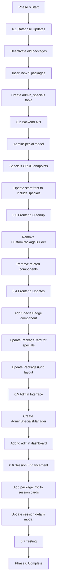

# STORE PACKAGE REDESIGN - PHASE 6
## Package Restructure + Admin Specials System

> **SUPERSEDED NOTICE (2026-02-06)**
>
> The "unlimited packages" concept in this document is **NOT being implemented**.
>
> **Authoritative Source:** `backend/render-production-seeder.mjs`
>
> **Correct Pricing Model:**
> - All packages have FIXED session counts (no unlimited)
> - Discounts are given as BONUS SESSIONS (2-7 extra), not price reductions
> - See `OPERATIONS-READY-TESTPLAN-AND-GAPS.md` for current authoritative package list

**Created:** 2026-01-31
**Status:** PARTIALLY SUPERSEDED
**Priority:** P1 (High)
**Depends On:** Phase 5 Complete
**Theme:** Galaxy-Swan (Cyan PRIMARY, Purple SECONDARY)

---

## 1. Executive Summary

Phase 6 restructures the package/pricing system with a simplified, client-focused offering:
- Replace 8 existing packages with 5 streamlined options
- Add Admin Specials system for bonus sessions (not discounts)
- Enhance session details modal to show package context
- Remove CustomPackageBuilder (replaced by fixed packages)

---

## 2. Current State Analysis

### 2.1 What Exists
| ID | Name | Sessions | Price/Session | Type |
|----|------|----------|---------------|------|
| 50 | Silver Swan Wing | 1 | $175 | Fixed |
| 51 | Golden Swan Flight | 8 | $170 | Fixed |
| 52 | Sapphire Swan Soar | 20 | $165 | Fixed |
| 53 | Platinum Swan Grace | 50 | $160 | Fixed |
| 54 | Emerald Swan Evolution | 48 (3mo) | $155 | Monthly |
| 55 | Diamond Swan Dynasty | 96 (6mo) | $150 | Monthly |
| 56 | Ruby Swan Reign | 144 (9mo) | $145 | Monthly |
| 57 | Rhodium Swan Royalty | 192 (12mo) | $140 | Monthly |

### 2.2 Problems with Current Structure
- Too many options (8) creates decision paralysis
- Monthly packages confusing (sessions per week × months)
- Custom package builder adds complexity without value
- No "Express" option for shorter sessions
- No admin specials/promotions system

### 2.3 What's Changing
- Reduce to 5 clear packages
- Remove CustomPackageBuilder component
- Add Express 30 (30-minute sessions)
- Add Admin Specials for bonus sessions
- Simplify unlimited packages (no sessions per week calc)

---

## 3. New Package Structure

### 3.1 Package Definitions

| # | Name | Sessions | Duration | Price | Price/Session |
|---|------|----------|----------|-------|---------------|
| 1 | **10-Pack Bundle** | 10 | 60 min | $1,650 | $165 |
| 2 | **24-Pack Bundle** | 24 | 60 min | $3,600 | $150 |
| 3 | **6-Month Unlimited** | Unlimited | 60 min | $7,200 | N/A |
| 4 | **12-Month Unlimited** | Unlimited | 60 min | $12,000 | N/A |
| 5 | **Express 30** | 10 | 30 min | $1,100 | $110 |

### 3.2 Package Details

**1. 10-Pack Bundle**
- 10 personal training sessions (60 min each)
- Valid for 6 months from purchase
- Best for: Clients starting their fitness journey
- Color: #00FFFF (Cyan)

**2. 24-Pack Bundle**
- 24 personal training sessions (60 min each)
- Valid for 12 months from purchase
- Best for: Committed clients (2 sessions/week pace)
- Color: #00A0E3 (Blue)

**3. 6-Month Unlimited**
- Unlimited sessions for 6 months
- Maximum 5 sessions per week
- Best for: Intensive transformation programs
- Color: #7851A9 (Purple)

**4. 12-Month Unlimited**
- Unlimited sessions for 12 months
- Maximum 5 sessions per week
- Best for: Long-term lifestyle change
- Color: #FFD700 (Gold)

**5. Express 30**
- 10 quick sessions (30 min each)
- Valid for 3 months from purchase
- Best for: Busy professionals, maintenance clients
- Color: #00FF88 (Green)

---

## 4. Database Changes

### 4.1 StorefrontItem Updates
No schema changes needed. Update existing records:

```sql
-- Deactivate old packages
UPDATE storefront_items SET "isActive" = false WHERE id BETWEEN 50 AND 57;

-- Insert new packages
INSERT INTO storefront_items (
  name, description, "packageType", price, sessions,
  "pricePerSession", months, "isActive", "displayOrder", color
) VALUES
  ('10-Pack Bundle', '10 personal training sessions (60 min each). Valid for 6 months.', 'fixed', 1650.00, 10, 165.00, 6, true, 1, '#00FFFF'),
  ('24-Pack Bundle', '24 personal training sessions (60 min each). Valid for 12 months.', 'fixed', 3600.00, 24, 150.00, 12, true, 2, '#00A0E3'),
  ('6-Month Unlimited', 'Unlimited sessions for 6 months. Maximum 5 per week.', 'monthly', 7200.00, NULL, NULL, 6, true, 3, '#7851A9'),
  ('12-Month Unlimited', 'Unlimited sessions for 12 months. Maximum 5 per week.', 'monthly', 12000.00, NULL, NULL, 12, true, 4, '#FFD700'),
  ('Express 30', '10 quick sessions (30 min each). Valid for 3 months.', 'fixed', 1100.00, 10, 110.00, 3, true, 5, '#00FF88');
```

### 4.2 New Table: admin_specials

```sql
CREATE TABLE "admin_specials" (
  "id" SERIAL PRIMARY KEY,
  "name" VARCHAR(100) NOT NULL,
  "description" TEXT,
  "bonusSessions" INTEGER NOT NULL DEFAULT 0,
  "bonusDuration" INTEGER DEFAULT 60,
  "applicablePackageIds" INTEGER[],
  "startDate" TIMESTAMP NOT NULL,
  "endDate" TIMESTAMP NOT NULL,
  "isActive" BOOLEAN DEFAULT true,
  "createdBy" INTEGER REFERENCES users(id),
  "createdAt" TIMESTAMP DEFAULT NOW(),
  "updatedAt" TIMESTAMP DEFAULT NOW(),
  "deletedAt" TIMESTAMP
);

CREATE INDEX idx_admin_specials_active ON "admin_specials"("isActive");
CREATE INDEX idx_admin_specials_dates ON "admin_specials"("startDate", "endDate");
```

### 4.3 Specials Examples

| Name | Bonus Sessions | Applicable To | Active Period |
|------|----------------|---------------|---------------|
| New Year Kickstart | +2 sessions | 10-Pack, 24-Pack | Jan 1-31 |
| Summer Strong | +4 sessions | All Bundles | Jun 1 - Aug 31 |
| Loyalty Boost | +1 session | Express 30 | Ongoing |

---

## 5. Backend: API Changes

### 5.1 New Endpoints

```
GET    /api/admin/specials              - List all specials
GET    /api/admin/specials/active       - List active specials
POST   /api/admin/specials              - Create special (Admin)
PUT    /api/admin/specials/:id          - Update special (Admin)
DELETE /api/admin/specials/:id          - Soft delete special (Admin)
```

### 5.2 Updated Endpoints

```
GET    /api/storefront                  - Include active specials with packages
POST   /api/cart/items                  - Apply special bonus sessions
GET    /api/user/sessions               - Include package name + remaining count
```

### 5.3 Storefront Response with Specials

```json
{
  "success": true,
  "data": {
    "packages": [
      {
        "id": 100,
        "name": "10-Pack Bundle",
        "price": 1650.00,
        "sessions": 10,
        "color": "#00FFFF",
        "activeSpecial": {
          "name": "New Year Kickstart",
          "bonusSessions": 2,
          "endsAt": "2026-01-31T23:59:59Z"
        }
      }
    ],
    "activeSpecials": [
      {
        "id": 1,
        "name": "New Year Kickstart",
        "bonusSessions": 2,
        "applicablePackageIds": [100, 101]
      }
    ]
  }
}
```

---

## 6. Frontend: Component Changes

### 6.1 Remove Components
- `frontend/src/pages/shop/components/CustomPackageBuilder.tsx`
- `frontend/src/pages/shop/components/CustomPackageCard.tsx`
- `frontend/src/pages/shop/components/CustomPackageErrorBoundary.tsx`
- `frontend/src/components/ShoppingCart/CustomPackageCartItem.tsx`

### 6.2 Update Components

**PackageCard.tsx**
- Add special badge when package has active special
- Show "Get X bonus sessions!" banner
- Display special end date countdown

**PackagesGrid.tsx**
- Remove CustomPackageBuilder integration
- Update grid layout for 5 packages (remove custom section)

**OptimizedGalaxyStoreFront.tsx**
- Remove custom package state/handlers
- Update package fetching to include specials

### 6.3 New Components

**SpecialBadge.tsx**
```
Location: frontend/src/pages/shop/components/SpecialBadge.tsx

+---------------------------+
| ✨ +2 BONUS SESSIONS      |
| Ends in 3 days            |
+---------------------------+
```

**AdminSpecialsManager.tsx**
```
Location: frontend/src/components/DashBoard/Pages/admin-specials/AdminSpecialsManager.tsx

+------------------------------------------------------------------+
| ACTIVE SPECIALS                                    [+ Add Special] |
+------------------------------------------------------------------+
| Name               | Bonus | Packages        | Period    | Status |
+------------------------------------------------------------------+
| New Year Kickstart | +2    | 10-Pack, 24-Pack| Jan 1-31  | Active |
| Summer Strong      | +4    | All Bundles     | Jun-Aug   | Pending|
+------------------------------------------------------------------+
```

---

## 7. Session Details Enhancement

### 7.1 Current Session Card (DayView)
```
+------------------+
| 8:00 AM          |
| John Doe         |
| Personal Training|
+------------------+
```

### 7.2 Enhanced Session Card
```
+------------------+
| 8:00 AM          |
| John Doe         |
| Personal Training|
| 24-Pack (18 left)|  <- NEW: Package context
+------------------+
```

### 7.3 Session Details Modal Enhancement

```
+------------------------------------------------------------------+
| SESSION DETAILS                                                   |
+------------------------------------------------------------------+
| Client: John Doe                                                  |
| Date: Feb 1, 2026 @ 8:00 AM                                       |
| Duration: 60 minutes                                              |
| Type: Personal Training                                           |
|                                                                   |
| PACKAGE INFO                                        <- NEW SECTION |
| +--------------------------------------------------------------+ |
| | Package: 24-Pack Bundle                                       | |
| | Purchased: Jan 15, 2026                                       | |
| | Sessions Used: 6 of 24                                        | |
| | Sessions Remaining: 18                                        | |
| | Expires: Jan 15, 2027                                         | |
| +--------------------------------------------------------------+ |
|                                                                   |
| [Cancel Session]  [Reschedule]  [Mark Complete]                   |
+------------------------------------------------------------------+
```

---

## 8. Implementation Flow



---

## 9. File Structure

```
backend/
├── models/
│   ├── AdminSpecial.mjs          (NEW)
│   └── StorefrontItem.mjs        (UPDATED - add color field if missing)
├── routes/
│   └── adminSpecialRoutes.mjs    (NEW)
├── controllers/
│   └── adminSpecialController.mjs (NEW)
├── migrations/
│   ├── YYYYMMDD-restructure-packages.mjs     (NEW)
│   └── YYYYMMDD-create-admin-specials.mjs    (NEW)

frontend/src/
├── pages/shop/
│   ├── OptimizedGalaxyStoreFront.tsx  (UPDATED)
│   └── components/
│       ├── PackageCard.tsx            (UPDATED)
│       ├── PackagesGrid.tsx           (UPDATED)
│       ├── SpecialBadge.tsx           (NEW)
│       ├── CustomPackageBuilder.tsx   (DELETE)
│       ├── CustomPackageCard.tsx      (DELETE)
│       └── CustomPackageErrorBoundary.tsx (DELETE)
├── components/
│   ├── DashBoard/Pages/
│   │   └── admin-specials/
│   │       └── AdminSpecialsManager.tsx (NEW)
│   ├── ShoppingCart/
│   │   └── CustomPackageCartItem.tsx  (DELETE)
│   └── UniversalMasterSchedule/
│       ├── Cards/
│       │   └── SessionCard.tsx        (UPDATED - package info)
│       └── components/
│           └── ScheduleModals.tsx     (UPDATED - package section)
```

---

## 10. Acceptance Criteria

### Backend
- [ ] Old packages (IDs 50-57) deactivated
- [ ] 5 new packages created with correct pricing
- [ ] admin_specials table created
- [ ] AdminSpecial model with CRUD operations
- [ ] Storefront API includes active specials
- [ ] Cart applies bonus sessions from specials

### Frontend
- [ ] CustomPackageBuilder and related components removed
- [ ] PackagesGrid displays 5 packages correctly
- [ ] PackageCard shows special badge when applicable
- [ ] SpecialBadge component created with countdown
- [ ] AdminSpecialsManager UI functional
- [ ] Session cards show package context
- [ ] Session details modal shows package section

### Integration
- [ ] Purchasing package applies special bonus sessions
- [ ] Special badge disappears after end date
- [ ] Admin can create/edit/delete specials
- [ ] Session remaining count updates correctly

---

## 11. Testing Requirements

### Unit Tests
```js
// adminSpecial.test.mjs
describe('Admin Specials', () => {
  it('creates special with bonus sessions');
  it('filters specials by date range');
  it('applies bonus to applicable packages only');
});

// packageCard.test.tsx
describe('PackageCard with Specials', () => {
  it('shows special badge when active');
  it('hides badge when special expired');
  it('displays countdown timer');
});
```

### Manual Test Plan
- Create new special with 2 bonus sessions
- Verify badge appears on applicable packages
- Purchase package, verify bonus sessions added
- Verify session count displays in schedule

---

## 12. UI Polish (Optional)

These items can be included in Phase 6 or deferred to Phase 6.5:

### 12.1 GlowButton Standardization
- Replace all CTAs with GlowButton component
- Consistent hover/active states

### 12.2 Static Background Toggle
- Add toggle to disable animated backgrounds
- Persist preference in localStorage
- Reduces motion for accessibility

### 12.3 Hero Background Match
- Ensure hero section background matches store cards
- Consistent Galaxy-Swan gradient

---

## 13. Risk Assessment

| Risk | Mitigation |
|------|------------|
| Existing cart items with old packages | Clear carts before migration, or map old→new |
| User confusion with new packages | Add "What changed" banner temporarily |
| Special timing edge cases | Use server time, not client time |
| Unlimited package abuse | Enforce 5/week cap in backend |

---

## 14. Success Metrics

- Package selection: 1 click to view details
- Special visibility: 100% of users see active specials
- Cart conversion: Maintain or improve current rate
- Admin special creation: < 1 minute

---

## 15. ChatGPT Implementation Prompt

```
PHASE 6: STORE PACKAGE REDESIGN

You are implementing Phase 6 of the SS-PT application.
Claude has approved this blueprint. Follow the specifications exactly.

IMPLEMENTATION ORDER:
1. Create migration to deactivate old packages (IDs 50-57)
2. Create migration to insert 5 new packages
3. Create migration for admin_specials table
4. Create AdminSpecial model
5. Create adminSpecialRoutes.mjs and controller
6. Update storefront API to include specials
7. Remove CustomPackageBuilder and related components
8. Create SpecialBadge.tsx component
9. Update PackageCard.tsx for specials
10. Update PackagesGrid.tsx layout
11. Create AdminSpecialsManager.tsx
12. Add package info to session cards
13. Update session details modal
14. Write tests

KEY REQUIREMENTS:
- Bonus sessions are ADDED, not discounts
- Specials have start/end dates
- 5 packages only (no custom builder)
- Session cards show "Package (X left)"
- Unlimited packages have weekly cap (5)

After each major component, run:
- npm run build (frontend)
- npm test (if tests exist)

Report back after completing each numbered step.
Document Version: 1.0
Approved By: Claude (Code Review)
For: ChatGPT Implementation Team
```

---

**Document Version:** 1.0  
**Created By:** Claude (Code Review)  
**For:** ChatGPT Implementation Team
