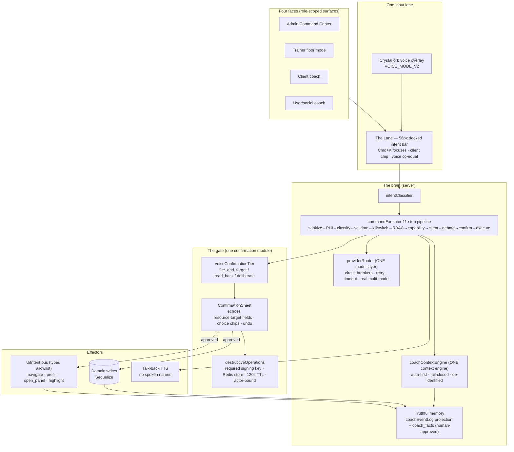
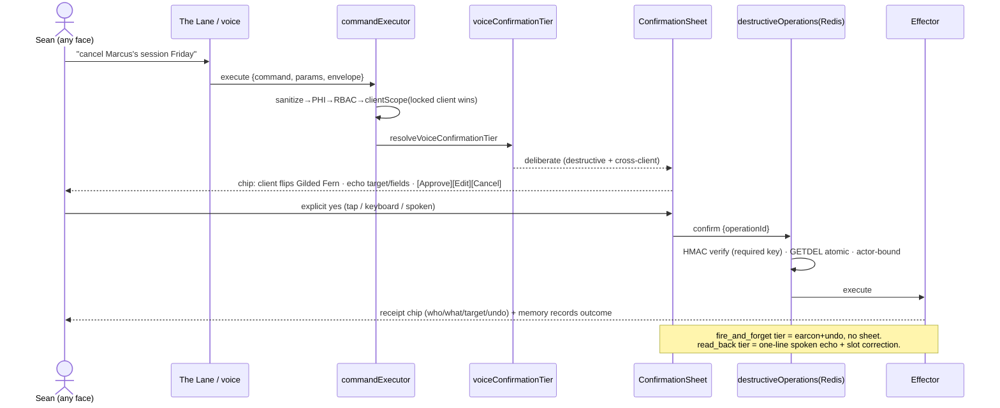
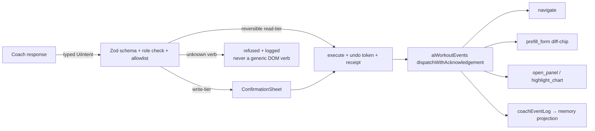

# SWAN JARVIS — BEYOND-JARVIS MASTER BLUEPRINT (2026-09-01)

> **Chain:** repo-verified audit against `origin/main @ 4c2fd507e` (backend + frontend
> architecture maps, SWA-65/SWA-107/Jarvis-Correction/V3-handoff context) → Fable hostile
> review (17 findings) → **GLM 5.3 hostile review** (10 new findings F13–F22, 15 plan
> corrections, 6 beyond-Jarvis mechanisms; 345s, $0 Z.ai seat) → **GLM 5.3-flash** second
> hostile pass (§ Flash addendum) → this Fable-authored fusion. Consult spend: **$0**
> (Z.ai subscription seats only).
> **Repository evidence outranks this document.** Every claim below carries file:line
> against `4c2fd507e`; re-verify before building — main moves fast.

## 0. The mission (Sean's remit, verbatim intent)
Make Swan Coach the Jarvis Sean wanted — one hive-mind brain, four faces, voice-first,
able to drive the app's own UI — with every action gated by a single beautiful
confirmation module — **and then make it BETTER than Jarvis.**

**The Beyond-Jarvis Contract** (what a production coach-brain has that movie-Jarvis lacks —
movie-Jarvis's real weakness is that his competence is *unfalsifiable*):
1. **Provable trust** — every action carries a receipt, a doctrine verdict, an undo path.
   Jarvis asks to be trusted; Swan Coach shows its work, checkable in 3 seconds.
2. **Truthful memory** — a projection over domain state that cannot believe a lie, with
   *typed, timestamped ignorance* ("unavailable since 10:02" ≠ "none on record").
3. **Four fail-closed faces** — admin/trainer/client/user scopes; Jarvis serves exactly
   one principal and has no concept of a boundary.
4. **Consent + caring boundaries** — the brain that says "don't train today," with a
   versioned citation; Jarvis never refuses Tony.
5. **Channel-split authority** — the mishearing channel (voice) is never the authorization
   channel for identity-crossing writes.
6. **UI-as-effector on a leash** — typed allowlist + kinetic budget + provenance-tagged
   prefill; never a rewrite-the-DOM free-for-all.
7. **Falsifiable improvement** — golden evals, a regression corpus of Sean's own gym
   mishearings, hostile review to dry, CI-gated. The brain gets provably better weekly.

## 1. Who did what (provenance)
| Seat | Role | Cost |
|---|---|---|
| Claude Fable 5 (this doc) | Audit orchestration, 17 findings, plan draft, fusion, Final Decider | sub |
| Explore agents ×2 | Backend + frontend architecture maps (file:line verified) | sub |
| GLM 5.3 (Z.ai) | Hostile review round 1 — 10 new findings, 15 plan corrections, M1–M6 | $0 |
| GLM 5.3-flash (Z.ai) | Hostile review round 2 on the extended packet (frontend map + source) | $0 |
Packets carried REAL SOURCE (9 backend + 4 frontend files inline), never descriptions —
the V3 lesson ("send the source; a prose packet was wrong on 2 of 3 blockers").

## 2. State map (verified 2026-09-01)

## Program ledger (what shipped, what is stranded)
| Lane | State | Evidence |
|---|---|---|
| Hive-mind C0–C4 (client-scope law, truthful memory log/projection, dormant confirmation tiers, intent eval, intake coverage) | LIVE on main | backend/services/ai/dispatchers/clientScope.mjs; frontend/src/utils/coachEventLog.ts, coachMemoryProjection.ts; backend/services/ai/voiceConfirmationTier.mjs (dormant by design) |
| C5 "one intent bar" core (intentBarState) | LIVE core; the visual 56px docked bar + Cmd+K + five-surface convergence NEVER BUILT | frontend/src/components/CoachIntentBar/intentBarState.ts exists; no dock component renders it across surfaces |
| JARVIS S1–S25 (voice pipeline, crystal orb overlay, two-phase decode, ReviewDecodedWorkout, talk-back, planner IA, 10 lenses) | ALL 25 ON MAIN but DARK — flags VOICE_MODE_V2, PLANNER_IA_V2, PLANNER_LENS_STYLES all default-OFF, never flipped | Linear SWA-107 thread, commits dce965656..2eb569d64 |
| Jarvis Readiness Correction S1–S12 (the security blueprint) | 19 commits STRANDED on branch claude/jarvis-audit-correction-20260821, NEVER MERGED: S11 adversarial approval pack, S4a/S4b Coach Gate CI, S2 approval-store seam, S5 honest catalog, S6 rate-limiter fixes, H1 IDOR fix (client-role self-scope), H6 frontend-dispatch safety gate, H7 global rate ceiling, F1 unhandled-utterance pipeline | git log origin/main..claude/jarvis-audit-correction-20260821 |
| coach_facts durable memory S1 | UNPUSHED branch feat/coach-facts-s1 @ 21ed0554b; design ruling pending (projection-vs-independent-belief) | Linear SWA-65 newest comment |
| plan_edit referee lane | LIVE, but CES/pain contraindication screening NOT wired ("contraindicated" verdict still reserved) and exerciseSwap key-desync unfixed | planEditDoctrineService.mjs:30; coachPlanEditApprovalService.mjs has no exerciseKey carry |
| PLAUD auto-ingest v2 (slices 0–11a) | In-flight on feat/plaud-capture-slice-0-1 @ 1afc031b0 by ANOTHER agent (GLM review round 3 running). OUT OF SCOPE for this review — do not re-review it | Linear SWA-107 newest comment |

## The standing P0 (verified live on main today)
backend/services/ai/destructiveOperations.mjs:
- :12 `const OPERATION_SECRET = process.env.OPERATION_SIGNING_KEY || crypto.randomBytes(32).toString('hex');`
  → unset in prod = HMAC secret random per process; deploy/restart voids in-flight approvals.
- :17 `const pendingOps = new Map();` → per-process approval store; mint on instance A,
  confirm on instance B fails "Operation not found". Redis client EXISTS at
  backend/config/session.mjs (ioredis from REDIS_URL) but the approval store does not use it.
- GitHub branch protection on main: OFF (verified 2026-08-21; no Coach Gate workflow in
  .github/workflows/ on main — only ai-eval-gate.yml, bodymap-validation.yml, docs-check.yml,
  swan-lens-guards.yml).

## Known open decisions (Sean-gated, carried from the boards)
- Merge/land the stranded jarvis-audit-correction branch (or re-derive it against current main).
- Flip gates: VOICE_MODE_V2 / PLANNER_IA_V2 / PLANNER_LENS_STYLES flag-flip QA never executed.
- coach_facts design ruling; acknowledgement-seam architecture (S3 residual: an ATTEMPTED save
  the server later rejects still acks true — seam shared by 4 command families).
- known-failing-baseline.json stale (main itself fails its own gate).
- OPERATION_SIGNING_KEY env var: set in Render + drop the fallback (S1 of the correction).

## 3. Findings ledger (F1–F22 + flash; every row verified or tagged)

Severity · LIVE (bites today) / LATENT (loaded gun) · verification stamp.

### The two interlocking P0s
| id | finding | stamp |
|---|---|---|
| F1 | The 08-21 corrected-blueprint security work (19 commits: S11 adversarial approval pack, S4a/S4b Coach Gate CI, S2 approval-store seam, S5 honest catalog, S6 rate fixes, H1 IDOR, H6 dispatch gate, H7 global ceiling, F1 unhandled-utterance) is stranded unmerged on `claude/jarvis-audit-correction-20260821` | [VERIFIED] `git log origin/main..` = 19; base `66ffde607` |
| F2 | `destructiveOperations.mjs:12` random-key fallback + `:17` per-process Map — deploy/restart voids in-flight destructive approvals; branch protection OFF amplifies (any push → restart → voided approvals, un-CI'd) | [VERIFIED] both lines live on `4c2fd507e`; no coach workflow in .github/workflows |

### Brain honesty (P1)
| id | finding | stamp |
|---|---|---|
| F3 | Chat-lane hive-mind bypasses the real context engine: `enrichWithUserData` ~890 ln monolith with its own authz model; `coachContextEngine` (auth-first, fail-closed) serves only brief_client/brief_my_day | [VERIFIED] map, aiChatService.mjs:1097 |
| F4 | Debate engine is single-model: 3 declared participants all routed through `sendChatMessage` with no provider arg (`debateOrchestrator.mjs:448`) — consensus language unearned | [VERIFIED] map |
| F5 | Coach chat has no circuit breaker/retry/timeout — the mature `providerRouter` serves only workout/long-horizon controllers | [VERIFIED] map |
| F15 | Context engine converts outages into lies: rejected domain → `[]` + ignorable footnote; day-sheet pain flags `.catch(() => [])` — a DB blink un-flags a client's pain in a LIVE brief | [VERIFIED] coachContextEngine.mjs:181-185, 283-291 (GLM) |
| F19 | Four contradictory official command counts (119/134/139 header-vs-registry-vs-tier-doc); safety tallies are hand-maintained prose | [VERIFIED] index.mjs:8-19 self-documents drift |

### Confirmation lane (the "little module" gaps)
| id | finding | stamp |
|---|---|---|
| F13g | No stored-payload read-back: `/execute` echoes `ctx.intent?.params` while the STORED op carries server-injected clientId; no `GET /pending/:id`; nothing detects display/execute divergence | [VERIFIED] aiCommandRoutes.mjs:320; route walk (GLM) |
| F16g | Named-but-unlocked hole: `cross_client` needs BOTH ids non-null; `unresolved_client` needs BOTH null — a voice command naming a client while nothing is locked escalates to nothing | [VERIFIED] voiceConfirmationTier.mjs:113-127 read this session (GLM) |
| F17g | HMAC signs neither `description` nor `affectedRecords` (the fields the human reads) and currently authenticates nothing (server-held Map re-serialized); becomes load-bearing-and-wrong the day the store round-trips Redis | [VERIFIED] destructiveOperations.mjs:31-45 (GLM) |
| F14g | `/cancel` runs with `protect` only — no kill switch, no rate limiter, despite commandLaneControls claiming whole-lane 503 | [VERIFIED] aiCommandRoutes.mjs:389 read this session (GLM) |
| F22g | One 5-op budget + one 120s clock shared by deliberate AND fire-hose confirmables — countdown pressure on the exact tier that exists to slow the click | [VERIFIED] destructiveOperations.mjs:14, 87-91, 291-299 (GLM) |
| F9 | Voice confirmation tiers dormant (0 consumers); the unified ConfirmationSheet does not exist as a component | [VERIFIED] maps |
| F18g | Client-scope law is per-dispatcher convention + invariant test (26/51 dispatcher files use the guard; enforcement = the test's shape-matching, not an executor gate) | [VERIFIED-NUANCED] grep 26/51; dispatcherClientScopeInvariant.test.mjs empty-allowlist |
| F21g | Alias pairs share handlers with independently-editable safety flags; route backstop keys on `result === null` so `undefined` reads as executed | [VERIFIED] commandDispatcher.mjs:238-239; aiCommandRoutes.mjs:329 |
| F20g | FRONTEND_DISPATCH branch promotes classifier params to executable browser events server-ungated (H6's gate is on the stranded branch); frontend allowlist is the only fence | [VERIFIED] aiCommandRoutes.mjs:277-289; frontend consumers enumerated in map |

### Frontend truth
| id | finding | stamp |
|---|---|---|
| F13 | The wrong-client chip guard (`intentBarState.ts`, written BECAUSE a wrong-client write hit production) is tested and rendered NOWHERE | [VERIFIED] map: no CoachIntentBar component exists |
| F14f | Surface docks render `confirmation_required` as plain text with NO confirm control — the operator must leave the planner/bootcamp/pain-chart/logger to approve | [VERIFIED] useSurfaceCoachDock.ts:170-172 |
| F15f | ~8,100-line dead SwanCoachAssistantPage island + 13 green tests proving nothing + the unmounted refusal UI; four UI generations coexist | [VERIFIED] map: zero mounts |
| F16f | AITerminalPanel's 14 mounts advertise a coach with no command lane — it cannot act | [VERIFIED] map |
| F17f | A11y on the safety path: expired card silent to screen readers, approve/reject unannounced, 28px chip, docks without focus management | [VERIFIED] map file:line |
| F10 | All three JARVIS capability flags dark; flag-flip QA never executed — Sean experiences a product months behind its own code | [VERIFIED] SWA-107 thread |

### Memory & consent
| id | finding | stamp |
|---|---|---|
| F11 | No long-term memory on main (coach_facts unpushed on `feat/coach-facts-s1@21ed0554b`, ruling pending); conversation = one JSONB blob; proposals via raw SQL, no model | [VERIFIED] |
| F7 | Consent asymmetry: `requireAiConsent` guards meal plans only; chat/command lanes uncovered — and the fix must be SUBJECT-scoped or it ships as an outage (6 of 7 prod users would 403; see the PR #47 lesson) | [VERIFIED] middleware grep + SWA-107 C16 |
| F6 | `AI_CHAT_CLIENT_ACCESS_SOFT=true` re-opens the SWA-192 cross-client hole — no expiry, no audit, no startup warning | [VERIFIED] aiChatRoutes.mjs:699-711 |
| F8 | Context engine has no injection-delimiting stage; currently display-only (brief is deterministic — probed this session), becomes an injection lane the day the engine feeds prompts | [VERIFIED-CORRECTED] briefClientDispatcher.mjs:89 probe |
| F12 | Dead weight distorts audits: MasterPromptModelManager (842 ln, 0 importers, phantom localhost models), EthicalAIPipeline (1406, self-declared broken), 3 model-naming vocabularies, stale costConfig | [VERIFIED] map |

## 4. Flash addendum — GLM 5.3-flash round 2 (FF-series), with verification stamps

Flash reviewed the EXTENDED packet (frontend map + 4 more source files). Every checkable
claim was probed before adoption; the disproofs are recorded because a review's misses
calibrate the seat (rule 68 external-model calibration).

### Adopted (verified or architecturally sound)
| id | finding | stamp |
|---|---|---|
| FF19 | **The cross-client alarm is unreachable by construction**: `resolveCommandClientId` collapses `ctx.resolvedClient?.id ?? params.clientId` into ONE id before anything downstream sees both candidates — so the dormant tier's `cross_client` trigger (needs BOTH ids) can never fire once naively wired, and tests will pass two identical ids. The frontend mirrors it: locked=null+target=B renders the QUIET 'unlocked' chip tone while effectiveClientId silently returns B. FIX (adopted into P1.4): the resolver returns both candidates + `collapsedFrom` marker; tier and chip consume the PRE-collapse pair; wire nothing through the tier until this lands | [VERIFIED] clientScope.mjs:12-14 + intentBarState.ts:96-115 |
| FF20 | `role_not_permitted` escalates to *deliberate* instead of *refusing* — an authorization failure becomes a negotiation ("say yes"), teaching actors that gates are persuadable. FIX (adopted, M3-flash): add `refusal` ABOVE deliberate in the tier order, deterministic RefusalCard with reason codes, counted in /metrics so over-refusal is observable | [VERIFIED] voiceConfirmationTier.mjs:131-135 |
| FF23 | Kill switches disable only on the exact lowercase string `'false'` — `False`/`FALSE`/`' false '`/`0` leave the lane HOT during an incident. FIX (adopted into P1.6): case-insensitive trim parse, startup warning on noncanonical values, /health reports effective switch state | [VERIFIED] commandLaneControls.mjs:20,30 |
| FF24 | The per-user pending cap is an O(n) Map scan the Redis port will silently kill; and session.mjs's ioredis client is the SESSION store — sharing it couples failure domains. FIX (adopted into P0.4): per-user counter as explicit acceptance criterion; separate logical DB index; alert on approval-store errors | [VERIFIED] destructiveOperations.mjs:291-299 |
| FF25 | Explicit-scope law covers DELETE only — an unscoped UPDATE/DEACTIVATE with `params:{}` passes prepare; `affectedRecords` is caller-supplied preview metadata never reconciled against real rows. FIX (adopted into P0.4 + M1): scope required for every destructive type; executor receipt carries the REAL affected count | [VERIFIED] destructiveOperations.mjs:69-84 |
| FF26 | Confirmation is consumed BEFORE the outcome exists — a transient downstream failure burns the confirm, and recovery is a full conversational re-issue against the rate limit. The system trains confirm-fast-and-hope. FIX (adopted into P1.1): keep single-use consumption (replay safety) but the failure path returns `expired_burned` with a one-tap re-mint of the original signed params | [VERIFIED] destructiveOperations.mjs:180,265 |
| FF27 | `buildTrainerDayContext` swallows failures with `.catch(() => [])` and returns NO dataQuality — the day sheet can silently drop a pain flag mid-session; LIMIT 20 truncates unmarked. Folded into F15/M2: the trivalent-veracity slice must cover BOTH context builders | [VERIFIED] coachContextEngine.mjs:277-291,319 |
| FF30 | `previousContext` (frontend-controlled, 2000 chars, identity-sanitized but not instruction-fenced) enters the classifier prompt — an injection lane bounded by the 11-step pipeline (can misdirect within the actor's own authority, not escape it). Folded into the P2.5.2 delimiting stage; `goals.description` added to F8's scope | [VERIFIED] aiCommandRoutes.mjs:74-85 |
| FF-3x | F3 EXTENDED: there are THREE context assemblies, not two — enrichWithUserData (chat), coachContextEngine (2 commands), buildCommandContextEnvelope (command lane, own authz via assertAssignmentOrAdmin). The P2.5.2 consolidation must name all three | [VERIFIED] aiCommandRoutes.mjs:212-226 |
| FF29 | `ctx.user` carries firstName/lastName into the pipeline — no prompt consumption found, but it is a loaded gun for the consolidation slice; strip to {id, role} at the route boundary | [LIKELY] route :192-197 verified; prompt-consumption grep deferred to slice |
| FF18′ | Confirm-time TOCTOU, NARROWED: the write kill switch IS re-checked at confirm (:798 — flash's window 3 disproven), but role/assignment re-verification at confirm time depends on each dispatcher's own asserts; the 120s window is real where a dispatcher doesn't re-assert. FIX (adopted into P1.1): stepRBAC + assignment re-check run inside executeConfirmedOperation before dispatch, uniformly | [VERIFIED-NARROWED] commandExecutor.mjs:796-801 + dispatch path read |

### Disproven on verification (kept for seat calibration — rule 68)
| claim | disproof |
|---|---|
| FF18 window 3 "kill-switch bypass at confirm" | executeConfirmedOperation re-checks `areCommandWritesEnabled()` at :798 with an explicit comment that minted ops must not execute after a flip |
| FF28 "dock fallback branch is dead code; chat answers render as failure rows" | useCoachCommand.ts:125 normalizes `data.fallbackToChat` → `{type:'fallback_to_chat'}`; the dock branch runs. (The silent-submit-on-no-client and voided voiceError sub-points stand as UX polish items) |
| FF31 "not_wired→chat fallback hands refused commands to the receipt-less lane" | commandFallbackPolicy.mjs admits exactly ONE type: `nutrition_advice` (read-only). The honest-refusal design holds |
| FF21 "AI_SUBMIT_WORKOUT is an auto-commit path" | `submit_workout_form` is FRONTEND_DISPATCH: the event submits the form the operator is LOOKING AT in the logger — the surface is the review step. Contextual, not an unreviewed commit (the dark ReviewDecodedWorkout concerns the VOICE_MODE_V2 two-phase path, sequenced behind the sheet anyway) |

### Flash's plan attacks adopted into the corrected plan
- PLANNER_IA_V2 flip now has P3.3's referee/contraindication wiring as a PRECONDITION
  ("ship the effector, backorder the guardrail" — rejected).
- ConfirmationSheet acceptance criteria now REQUIRE mounting in SurfaceCoachDock flows
  (deliberate voice yes collected AT the dock) + F17f a11y fixes BEFORE it becomes the only
  gate — one inaccessible component must not make every gated action inaccessible.
- Setting OPERATION_SIGNING_KEY in Render is STEP ZERO (hours, zero code risk) — pulled
  ahead of everything.
- coach_facts ruling is a DECISION REQUEST, not an assumed answer (decision-smuggling
  rejected; §8.4).
- FRONTEND_DISPATCH server-side move narrowed: take the 3 hottest commands by
  coachIntentRecorder frequency, not all 8.
- Spoken deliberate confirms bind to the op: echo nonce ("confirm 4-7" derived from the
  operationId hash) so background speech or a misheard "yeah" cannot satisfy the tier.
- Multi-model debate: fix the trust SIGNAL (label single-reviewer honestly); spend the
  multi-model money never — reserved only for destructive-proposal review if ever.

### Flash mechanisms merged into the canon
- **Receipt Envelope** (typed terminal-outcome envelope incl. realAffectedCount +
  dataQuality, rendered by ReceiptChip) → merged into M1/M6 receipts + F19 hygiene.
- **Server-side intent ledger** (append-only coach_intents table; two-phase ack at the DB
  level; context engine reads it as a fenced system-authored ACTION LEDGER block) →
  merged into P3.1/P3.2 as the implementation shape of the ack-seam fix + M2.
- **Refusal verdict** → M3-flash, adopted (fixes FF20).
- **Session pre-flight** (deterministic checklist chip on client-switch, projected from
  brief_client domains; hard dependency: the cross-client chip lands FIRST) → adopted
  into P3.4 as the trainer-side anticipation layer.
- **Undo as real primitive** (compensating handlers registered per write dispatcher;
  UNDO ops through the same HMAC machinery; entityVersion staleness refusal) → merged
  into M6/P4.2 as the concrete build shape.

---


## 4b. The corrected phase plan (fused: Fable draft → GLM 5.3 corrections → flash corrections)

## Phase 0 — Foundation (REORDERED: protection before merges, baseline before protection)
| # | Slice | Owner | Why this order |
|---|---|---|---|
| 0.-1 | **STEP ZERO (flash): Sean sets `OPERATION_SIGNING_KEY` in Render TODAY** — hours, zero code risk, kills the random-key half of the standing P0 before any other work | SEAN | Highest value per minute in the whole program |
| 0.0 | Refresh `known-failing-baseline.json` + fix/mark the 3 red CI checks (eval, bodymap npm test) | agent | A required check on a red main deadlocks the repo (GLM 2.2) |
| 0.1 | Sean: enable branch protection on main, require only proven-green checks | SEAN | Landing a 19-commit security rebase into an unprotected repo is another unprotected push (GLM 2.1) |
| 0.2 | Rebase + land `claude/jarvis-audit-correction-20260821` THROUGH the now-protected PR gate | agent | The stranded S11 pack/Coach Gate/H1-H8 work |
| 0.3 | S1: require OPERATION_SIGNING_KEY at boot (drop fallback). Sean sets it in Render first | agent+SEAN | The standing P0 |
| 0.4 | S2+: pendingOps → Redis. Key = `pending:{userId}:{opId}` (actor-bind IN the key, GLM 2.4); atomic GETDEL; delete the Map sweep timer; per-user counter not O(n) scan; SIGN description + affectedRecords hash and kill the shallow-copy shared refs (F17); shadow-read cutover with compare period (GLM 2.15). Acceptance test: mint on instance A, confirm on instance B PASSES | agent | F2+F17 die together or a new tamper seam ships with the fix |
| 0.5 | Dead-weight deletion: MasterPromptModelManager (842, 0 importers), EthicalAIPipeline tree, the 8,100-line SwanCoachAssistantPage island + its 13 green-but-meaningless tests, orphan pairs. Rule 34: propose-list first, Sean approves, then delete | agent+SEAN | Cheapest review-debt payoff (GLM 2.14); every audit re-excavates these |
| 0.6a | Pull-forward (flash): wire the plan_edit referee's contraindication screen (nasmCesPolicy + pain profile into the reserved verdict) + exerciseSwap key-carry fix — a PRECONDITION of the planner flip, not a Phase-3 item ("ship the effector, backorder the guardrail" — rejected) | agent | Guardrail before effector |
| 0.6b | Flag flips tranche 1: PLANNER_IA_V2 → PLANNER_LENS_STYLES with §6.6 gate QA (after 0.6a). VOICE_MODE_V2 does NOT flip until Phase 1 lands (voice without the unified sheet re-creates the confirmation drift C3 exists to kill) | agent+SEAN | Split tranches |
| 0.7 | coach_facts S1 lands with an explicit "no readers until Phase 2.5 context consolidation" dormancy marker (GLM 2.5, house labeled-dormant convention) | agent | Prevents a third context assembler growing in the gap |

## Phase 1 — The One Confirmation Module (Sean's "little module") + The Lane
- 1.1 Backend primitives FIRST (GLM 2.8/F13): `GET /api/ai-command/pending/:operationId`
  (owner-gated, returns stored op verbatim minus signature) + `/confirm` verifies
  renderedDigest = SHA-256(canonical(type,target,affectedCount,description,param-subset)+opId)
  recomputed from the STORED op; mismatch = 400 `render_mismatch` + audit row (M1).
  Also: unify the /execute echo — the response renders the STORED params, not ctx.intent.params.
- 1.2 `ConfirmationSheet` component: consumes voiceConfirmationTier + the read-back endpoint;
  choice chips [Approve][Edit target][Cancel]; keyboard+touch+voice; blast-radius arm delay
  (>3 records or destructive → 2-4s disabled chip while records visibly load, M1); no-undo
  badge BEFORE execution for irreversible commands (M6 registry); aria-live announcements +
  focus management (fixes F17-a11y); 44px everywhere.
- 1.3 Tier invocation SERVER-SIDE in stepConfirmation (GLM 2.7 — client-computed tiers are
  spoofable); thread `inputMode: voice|text|ui` through ROUTE_CONTEXT_KEYS `source` now.
  Observe-only first (log tier distribution), then enforce.
- 1.4 Tier upgrades (fused GLM+flash):
  (a) new escalation `unlocked_target` (target named while nothing locked → deliberate, F16g);
  (b) `refusal` rank ABOVE deliberate (FF20 — role_not_permitted / contraindicated /
  consent-withdrawn REFUSE with a deterministic reason-coded card, never negotiate;
  refusal counts surface in /metrics/summary);
  (c) FF19 pre-collapse pair: resolveCommandClientId returns BOTH candidates +
  collapsedFrom; tier and chip consume the pair — wire NOTHING through the tier before
  this lands or cross_client is dead code;
  (d) M3 channel-split: identity-crossing voice writes require a PHYSICAL confirm, and a
  deliberate SPOKEN yes binds to the op via echo nonce ("confirm 4-7" from the opId hash)
  so background speech or a misheard "yeah" cannot satisfy the tier.
- 1.4b Confirm-time re-verification (FF18′): stepRBAC + assignment re-check run inside
  executeConfirmedOperation before dispatch, uniformly (today only the kill switch and
  actor-bind are re-checked; role/assignment depend on per-dispatcher asserts).
- 1.4c Burned-confirm recovery (FF26): downstream failure after consumption returns
  `expired_burned` + one-tap re-mint of the original signed params — never a full
  conversational re-issue against the rate limit.
- 1.5 Build C5 "The Lane" (56px docked bar, Cmd+K focuses, client chip Gilded-Fern flip)
  and FINALLY RENDER intentBarState (F13-frontend: the guard exists, mount it). Surface
  docks gain inline confirm (kills the F14-frontend dead end — no more leaving the surface).
- 1.6 Route/switch hygiene: close the naked `/cancel` (F14g) with the same kill-switch +
  rate-limiter chain, router-level so the next route can't forget; kill-switch parsing
  goes case-insensitive-trimmed with startup warnings and /health reporting effective
  switch state (FF23 — an incident operator typing `False` must not get silence); scope
  law extends to every destructive type, not just DELETE, and execution receipts carry
  the REAL affected count, never caller-supplied preview metadata (FF25).

## Phase 2 — UI-as-effector (Jarvis drives the app — with a leash)
- 2.1 UiIntent allowlist on the existing bus: navigate, prefill_form, open_panel,
  highlight_chart, set_filter. Per-event Zod schema, role check, receipt, TTL 30s,
  `{origin: user|model, cause: receiptId}`.
- 2.2 M5 kinetic budget: server-minted velocity allowance (e.g. 5 UI effects/min/surface),
  excess → coachEventLog `budget_exceeded`, sheet shows "3 of 5 this minute". Budget is UX
  hygiene, NEVER cited as a security control; writes stay server-gated.
- 2.3 Prefill provenance: every prefilled value tagged model-composed vs copied-from-record,
  rendered as distinct chips (GLM 2.9 — kills the injected-prefill-looks-like-my-draft chain).
- 2.4 FRONTEND_DISPATCH server-side move, NARROWED (flash): take the 3 hottest commands
  by coachIntentRecorder frequency, not all 8; re-tier every moved command AND delete the
  aiCommandRoutes:277-289 ungated branch in the same slice (GLM 2.10, F20g). Savings feed
  P1/F14f — where the product actually bleeds.

## Phase 2.5 — One honest brain infrastructure
- 2.5.1 Chat → providerRouter AND debate contract preserved in the SAME slice (GLM 2.11 —
  debateOrchestrator calls sendChatMessage; splitting the slices breaks debate mid-deploy).
  Debate multi-model DEMOTED: reserve real multi-model for destructive-proposal review only;
  stop rendering "consensus" language for single-model output (GLM 2.14).
- 2.5.2 enrichWithUserData (890 ln) → coachContextEngine domain loaders, WITH M2 trivalent
  veracity landing in the same slice: every domain returns {value, veracity:
  measured|absent|unavailable, checkedAt}; degraded → "unavailable", NEVER empty (F15 —
  today a DB blink strips a trainer's pain flags silently). Injection delimiting/sanitize
  stage lands AT the engine (F8) since this is the moment it starts feeding prompts.
- 2.5.3 Consent parity done right: SUBJECT-scoped (brief_client checks the CLIENT's consent,
  not the trainer's), with a consent-backflow migration so deploy doesn't brick existing
  users (GLM 2.12 — as originally planned this ships as an outage).
- 2.5.4 SSE deferred until state is externalized (pendingOps done in 0.4; activeDebates
  still in-memory — externalize or keep SSE off; GLM 2.13). Not this quarter unless needed.

## Phase 3 — Memory with a spine (ORDER INVERTED per GLM 2.6)
- 3.1 FIX THE ACK SEAM FIRST: two-phase acknowledgement (accepted at dispatch, outcome on
  settle) across the 4 command families; projection gains accepted_pending_outcome.
  Extraction before this = coach_facts poisons itself with fabricated successes.
- 3.2 coach_facts S2 (extraction, propose-only) → S3 (read into the ONE context engine) →
  S4 (trainer review UI in the ConfirmationSheet family). Machine proposes, human activates.
- 3.3 M4 veto ledger (builds ON 0.6a's referee wiring, which was pulled forward):
  contraindication verdicts as append-only rows {clientAlias, region, doctrineVersion,
  sourceRows, issuedAt, supersededAt}; planner consults at proposal time, executor
  re-checks at sheet time; overrides are first-class ledger events with actor id; ledger
  unavailable → fail CLOSED (veto). "The brain that says no never auto-executes the no."
- 3.3b Session pre-flight (flash M4): on client-switch in a surface dock, ONE dismissible
  deterministic checklist chip projected from brief_client domains (pain flags, credits,
  plan staleness, last-workout delta), each item deep-linking to its surface. Zero new
  inference; trainer-side only. HARD DEPENDENCY: the cross-client chip (1.5) lands first,
  or pre-flight flags attach to the wrong person's bar.
- 3.4 Proactive briefings: shipped crons + nextBestActionService surface as consented cards
  (quiet hours, frequency caps); admin brief / trainer day-sheet / client recap — all
  projections over M2-veracity domain state with citations.

## Phase 4 — Beyond Jarvis (the falsifiable-competence layer)
- 4.1 Receipts as a scrubbable tape (M6): per-(actor,surface) timeline; "show your work"
  expands doctrine verdicts + data sources; tape visibility scoped to the actor + admin
  audit view with cause (never a surveillance surface).
- 4.2 Undo as inverse-command (M6): signed inverse proposal minted at execute time, run
  through the SAME pipeline (RBAC, tiers, confirmation); irreversible registry marks
  commands with no inverse; per-command inverse round-trip tests.
- 4.3 Calibrated honesty everywhere: M2 veracity words in every answer; lint bans truthiness
  flattening of domain values; golden eval fixture with injected DB failure asserting
  "unavailable" appears.
- 4.4 Wit on a leash (GLM coda): tone as a rendering tier over receipts — fire_and_forget
  may be witty; read_back plain; deliberate/refusals warm-formal zero-joke — enforced by
  golden fixtures, not vibes.
- 4.5 BYOM: CUT from this program (GLM 2.14 — privacy surface with no demonstrated demand
  for a 1-trainer SaaS). Revisit only on real demand, admin-only first.

## Registry/observability hygiene (rolls into 0.5/1.6)
- F19: derive command counts/destructive tally/confirmation-gated tally from getAllCommands()
  at boot, emit in /health; delete all prose numbers.
- F21: dispatcher contract test — every DISPATCHERS entry returns an object or throws
  (undefined must not read as executed); alias-pair definition diff test.
- F22: split pending-op budgets: deliberate ops get their own cap + NO visible countdown
  pressure (arm-delay instead); fire-hose confirmables get the counter.

## 5. The six Beyond-Jarvis mechanisms (GLM 5.3-authored, Fable-ratified)
Each: what to build · on which existing seam · the NEW risk it opens (stated honestly) ·
the test that proves it. Fused into the phases above; collected here as the design canon.

### M1 — Proof-of-Render confirmations + blast-radius arm delay (→ P1.1/P1.2)
Owner-gated `GET /ai-command/pending/:id` returns the STORED op; `/confirm` requires a
renderedDigest the server recomputes from the stored op — mismatch = `render_mismatch` +
audit row. Confirm chip arms after a dwell proportional to affected records. Kills: stale-
tab cross-op confirms (F13g), silent display/execute divergence, countdown-pressure clicks
(F22g). **New risk:** the digest proves the client HAD the true payload, not that a human
read it (an XSSed client computes digests fine) — it is an integrity check, never an
attestation; arm-delay must announce record lists to screen readers before chip state.

### M2 — Trivalent memory: a projection that cannot believe an outage (→ P2.5.2)
Every context domain returns `{value, veracity: measured|absent|unavailable, checkedAt}`;
degraded loaders hard-fail to `unavailable`; briefs speak absence-naming ("pain status
unavailable since 10:02" ≠ "no pain on record"). Jarvis's memory is a screenwriter's
convenience; this memory's *ignorance is typed and timestamped*. **New risk:** consumers
flattening tiers back to truthiness — lint ban + a poisoned-connection golden eval fixture.

### M3 — Channel-split authority: voice proposes, glass disposes (→ P1.3/P1.4)
Thread `inputMode: voice|text|ui` into stepConfirmation. Any identity-crossing write
(cross_client OR the F16g named-but-unlocked case) arriving by voice escalates to
deliberate + PHYSICAL confirm (tap or typed digit) — the same ears that misheard the
command must not be the ears that confirm it. Makes "voice widens input, never authority"
mechanical instead of aspirational. **New risk:** inputMode spoofing by a hostile client —
acceptable (such a client is already past this gate); log inputMode on every audit row.

### M4 — The veto ledger: "don't train today," with receipts (→ P3.3)
Contraindication verdicts (nasmCesPolicy × active pain) become append-only ledger rows
`{clientAlias, region, doctrineVersion, sourceRows, issuedAt, supersededAt}`; planner
consults at proposal, executor re-checks at sheet time; trainer override is a first-class
ledger event with actor id; ledger outage → fail CLOSED (veto). Jarvis never refuses Tony;
a production coach's core value IS the refusal — and a refusal with doctrineVersion +
source rows is defensible, not a nag. **New risk:** stale doctrine silently deciding —
render the version on the card.

### M5 — Kinetic budget + provenance-tagged prefill (→ P2.2/P2.3)
UiIntents carry `{origin, cause: receiptId, ttl}`; per-surface velocity budget (~5
effects/min, excess logged `budget_exceeded`, allowance visible in the sheet). Every
prefill value tagged model-composed vs copied-from-record, rendered distinctly — kills the
injected-text-becomes-my-draft chain (F8 × prefill). The allowlist bounds what the UI can
be told to do; the budget bounds *how hard the machine can push* — the actual habituation
variable. **New risk:** the budget is UX hygiene, NEVER a security control; all writes stay
server-gated regardless.

### M6 — Undo as inverse-command + irreversible registry + scrubbable tape (→ P4.1/P4.2)
Undo = a signed PROPOSAL of the inverse command minted at execute time, run through the
SAME pipeline (RBAC, tiers, confirmation) — undo can never be a lower-security side door.
A static registry marks no-inverse commands; the sheet shows "cannot be undone" BEFORE
execution. Receipts layer into a scrubbable per-(actor,surface) tape. **New risk:**
inverse-parity bugs (soft- vs hard-delete) — per-command round-trip tests; tape visibility
scoped so it never becomes admin surveillance of trainers.

### Coda — wit on a leash
Tone is a rendering tier over receipts, never a prompt-level persona: fire_and_forget may
be witty · read_back plain · deliberate/refusals warm-formal, zero joke tokens — enforced
by golden fixtures. The brain earns its personality where there are no stakes and forfeits
it exactly when the trainer is about to press the button.

## 6. Diagrams and wireframes

## D1 — Target architecture (one brain, four faces)


## D2 — Confirmation module sequence (the "little module")


## D3 — UiIntent bus (Jarvis drives the UI, safely)


## W1 — Wireframe: The Lane + ConfirmationSheet (mobile 414px)
```
┌─────────────────────────────────────┐
│  chat / dashboard content           │
│                                     │
│  ┌───────────────────────────────┐  │
│  │ ⚠ CONFIRM — deliberate        │  │ ← ConfirmationSheet (z-95)
│  │ Cancel session                │  │   renders the STORED op (read-back
│  │ Client: ▐ Client-61 ▌         │  │   endpoint), digest-verified (M1)
│  │ Fri Sep 5 · 3:00pm · 60min    │  │ ← chip GILDED FERN (cross-client!)
│  │ ⏳ arming… (blast radius 1)    │  │ ← arm delay ∝ affected records
│  │ This cannot be batched.       │  │   no-undo badge if irreversible
│  │ [ ✓ Approve ] [ Edit ] [ ✗ ]  │  │ ← 44px+, keyboard+voice reachable
│  │   voice write x-client ⇒ TAP  │  │ ← M3: physical confirm required
│  └───────────────────────────────┘  │
├─────────────────────────────────────┤
│ ▐ Client-61 ▌  🎤  Type or speak…  ⏎│ ← The Lane, 56px docked, Cmd+K focuses
│   "2 not yet synced"                │ ← C2 projection live token
└─────────────────────────────────────┘
```

## W2 — Wireframe: receipt chip (trust loop)
```
┌───────────────────────────────────┐
│ ✓ Logged: Bench 4×10 @185 → C-61  │
│   via voice · 2:41pm · [Undo 30s] │
│   ▸ show work (doctrine, sources) │
└───────────────────────────────────┘
```

## 7. Test specifications

## Phase 0
- T0.4a `destructiveOperations.multiInstance.test.mjs` — mint via store A, confirm via
  store B (two service instances over one Redis/fake): PASSES. The P0's regression test.
- T0.4b replay: confirm same opId twice → second fails (atomic GETDEL proven, not assumed).
- T0.4c ownership-in-key: user B confirming user A's opId → not-found + NO consumption of
  A's op (griefing edge, GLM 2.4).
- T0.4d tamper: mutate description in store between mint and confirm → signature rejects
  (F17 — description now signed).
- T0.4e boot: OPERATION_SIGNING_KEY unset → process refuses to listen; set → boots clean.
- T0.4f shadow-read compare harness: Map and Redis disagree → alert row, Redis wins read.
- T0.6 flag QA per §6.6 gate tables (existing, never executed — run them, record results).

## Phase 1
- T1.1a render-digest: render op A, confirm with op B's digest → 400 render_mismatch +
  audit row (M1 e2e).
- T1.1b read-back: GET /pending/:id returns stored params (server-injected clientId
  included) and NEVER the signature; non-owner → 404.
- T1.2a arm-delay: destructive op affecting 12 records → chip disabled ≥2s; single-record
  fire_and_forget → instant.
- T1.2b a11y: expired card moves focus to Re-issue + announces via role=status; approve/
  reject outcomes announced (aria-live); all interactive targets ≥44px (extend
  AttachmentPreview.touchTarget pattern to the sheet).
- T1.3 tier server-side: request with client-supplied tier field → ignored, server
  recomputes; observe-only mode logs {command, tier, reasons} distribution.
- T1.4a unlocked_target: voice write naming client-47 with nothing locked → deliberate +
  physical:true (F16 RED-first — this fails on main today).
- T1.4b channel-split: same command via text → standard tier (no over-escalation,
  habituation guard).
- T1.5a The Lane: Cmd+K focuses (no modal); chip flips on cross-client; intentBarState
  FINALLY has a rendering consumer test (component mount, not just state unit).
- T1.5b surface-dock confirm: confirmation_required in planner dock renders working
  Approve/Cancel WITHOUT navigation (kills the leave-the-surface dead end).
- T1.6 /cancel carries kill-switch + limiter (route-guard contract test walks the router
  and asserts guard chain on every mutating route — convention → enforcement).

## Phase 2
- T2.1 UiIntent: unknown verb refused + logged; schema-invalid payload refused; role
  mismatch refused.
- T2.2 velocity budget: 10 navigate intents in one minute → first 5 render, rest
  budget_exceeded in coachEventLog; counter visible.
- T2.3 provenance: model-composed prefill renders distinct chip; survives copy events.
- T2.4 moved-command re-tier: each formerly-FRONTEND_DISPATCH command has an explicit tier
  assertion; aiCommandRoutes ungated branch (277-289) is GONE (grep-negative test).

## Phase 2.5
- T2.5a provider unification: chat + debate both through providerRouter; debate contract
  (messages, {maxTokens, temperature}) preserved (GLM 2.11 — one slice, one test file).
- T2.5b trivalent veracity: pain loader rejected → context.pain.veracity='unavailable' AND
  brief text contains "unavailable", never "no active pain" (F15 RED-first — fails today).
- T2.5c golden eval: poisoned-connection fixture in the eval gate asserting absence-naming.
- T2.5d consent: subject-scoped — trainer with consent + client withdrawn → brief_client
  refused; backflow migration leaves 0 users bricked (query prod count first, GLM 2.12).
- T2.5e injection: goals.title carrying "ignore previous instructions" enters engine →
  delimited/sanitized before any prompt assembly (F8).

## Phase 3
- T3.1 ack seam: server-rejected save → outcome=failed surfaces in projection; ack carries
  accepted, not applied (RED-first against the 4 families — the S3 residual finally dies).
- T3.2 coach_facts: machine can only write proposed; activation requires human actor id
  (exists, 102/102 on branch — re-run on land); extraction runs ONLY on settled outcomes.
- T3.3 veto ledger: active knee pain + lunge swap → contraindicated, write fails closed
  with receipt; override event carries actor id; ledger outage → veto (fail closed), not
  allow-through.
- T3.4 briefing caps: quiet hours respected; frequency cap enforced; every card cites its
  domain rows.

## Phase 4
- T4.1 tape scoping: trainer sees own events only; admin audit view carries cause.
- T4.2 undo: log_workout inverse proposed through the FULL pipeline (RBAC+tier); inverse
  round-trip restores state byte-equal for every invertible command (registry-driven
  parametrized test); notify_client shows no-undo badge PRE-confirm.
- T4.4 tone tiers: golden fixtures — deliberate/refusal cards contain zero joke tokens;
  fire_and_forget receipts may vary.

## Registry hygiene
- TR1 counts derived at boot == getAllCommands() reality; /health echoes them; prose
  numbers deleted (grep-negative).
- TR2 dispatcher contract: every DISPATCHERS entry returns object-or-throws (undefined →
  test failure, F21).
- TR3 alias parity: assign_trainer vs assign_client_to_trainer definitions diff-equal on
  {roleRequired, destructive, requiresConfirmation, requiresClientRef}.

## 8. Decisions only Sean can make (blockers, in order of unblock value)
1. **Enable branch protection on main** (GitHub setting; agents cannot). Sequenced AFTER
   0.0's baseline refresh so the required checks are actually green.
2. **Set `OPERATION_SIGNING_KEY` in Render env** — until then the destructive-confirm lane
   dies on every deploy. (Carried item: rotate the Render API key — still owed from 08-12.)
3. **Approve landing the stranded `claude/jarvis-audit-correction-20260821` branch**
   (rebase + PR through the new gate) — or explicitly retire it and we re-derive.
4. **coach_facts design ruling** (SWA-65 open question): recommendation = option 1, it is
   the NON-PROJECTABLE half of truthful memory; human approval is its truth mechanism.
5. **Flag-flip authorization**: PLANNER_IA_V2 → PLANNER_LENS_STYLES now (tranche 1);
   VOICE_MODE_V2 only after the ConfirmationSheet lands (tranche 2).
6. **Dead-weight deletion approval** (Rule 34): the proposed-deletion list in 0.5 —
   including the 8,100-line legacy island — deletes nothing without your yes.
7. **Consent backflow**: approve the subject-scoped consent migration plan before 2.5.3
   (the naive version bricks 6 of 7 prod users — the PR #47 lesson).
8. **BYOM**: confirm CUT from this program (revisit on demand, admin-only first).

## 9. What this blueprint deliberately does NOT do (anti-scope)
- No SwanRuntime nine-file tree, no six-tier memory stack, no WebRTC realtime voice, no
  dashboard-rewriting SwanUiIntent union — the 08-21 correction's deferral list stands:
  none are in the dependency graph of anything broken.
- No vector/embedding RAG (Rule 72 standing prohibition).
- No PLAUD-lane changes — that program is in-flight in another lane
  (`feat/plaud-capture-slice-0-1`, GLM round 3); this blueprint keeps its hands off.
- No client write paths to plans, ever (trainer indispensability is structural).

## 10. Definition of done for the whole program
An admin, a trainer, a client, and a user each speak one sentence to Swan Coach and get a
correct, role-safe, fluid answer or a properly-confirmed action — measured by: command
success rate · time-to-first-feedback <1.5s · zero unconfirmed writes · zero cross-role
leaks in the escalation suite · the multi-instance mint/confirm e2e green · the poisoned-
connection eval asserting typed ignorance · the wrong-client chip VISIBLE and firing in a
recorded QA pass · flag-flip QA executed and recorded for all three dark flags.
