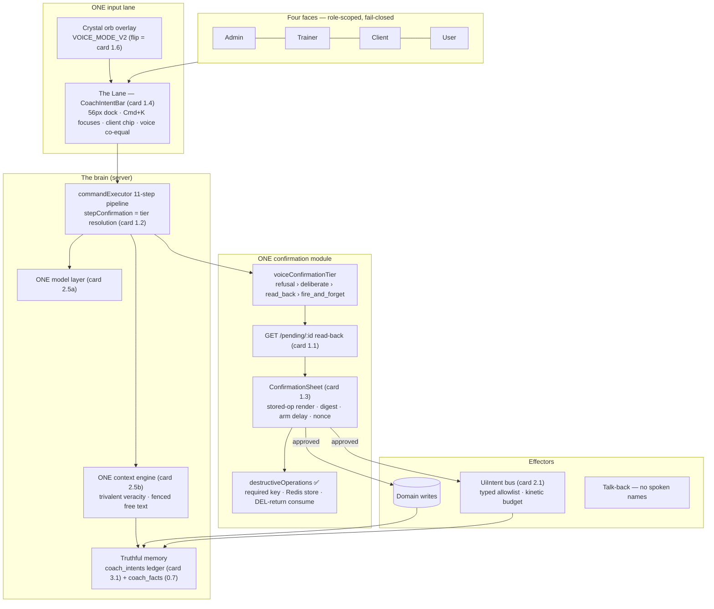
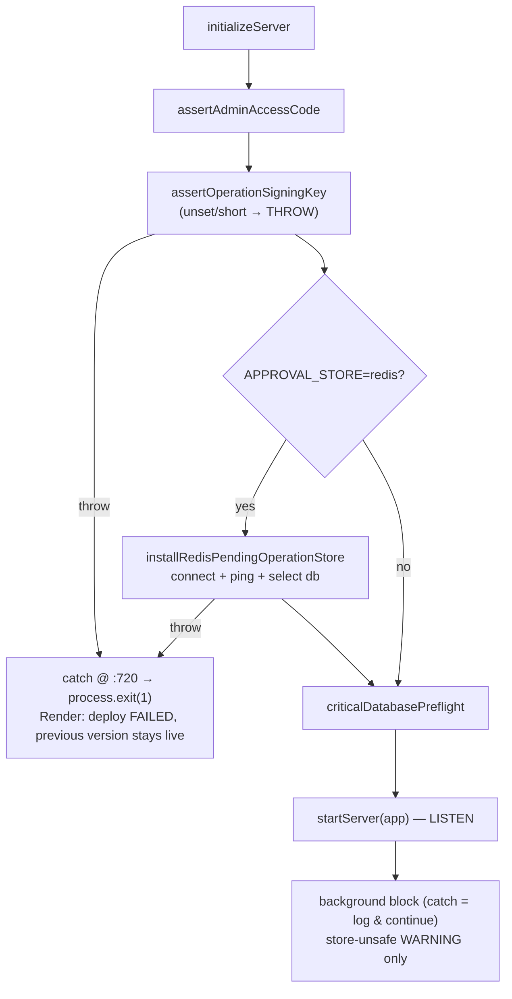
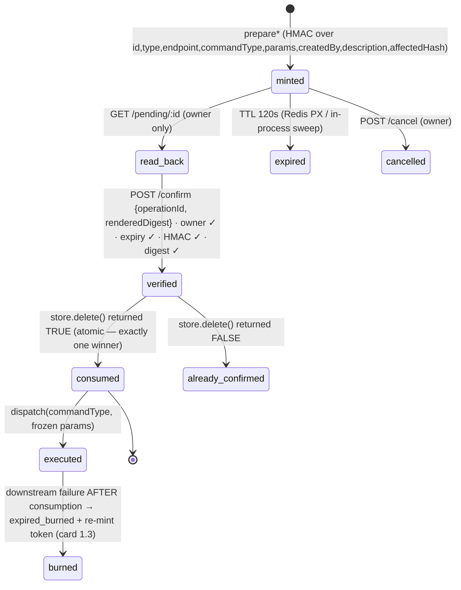
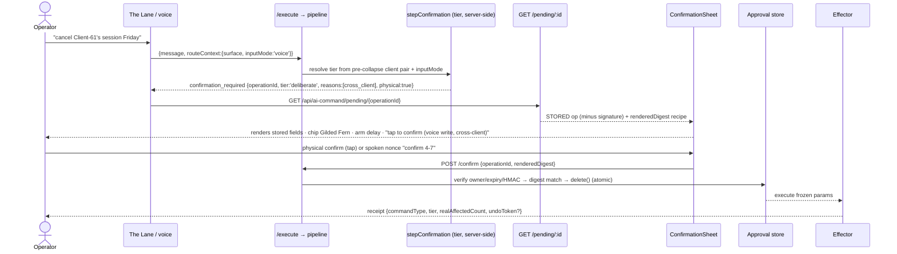
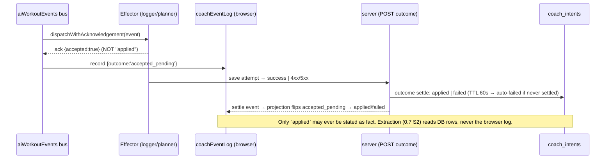

# SWAN JARVIS — BLUEPRINT v2 (2026-09-02, Fable 5.1 — the Opus execution spec)

> **You are Opus 5. You are the builder, not the architect.** Every decision below was
> made against the real code on `claude/jarvis-p0-2-security-20260902` (31 commits over
> `origin/main @ 4c2fd507e`) after two hostile passes (Fable 5.0 + GLM 5.3 + GLM flash on
> 2026-09-01; Fable 5.1 on 2026-09-02). Execute the cards; do not re-derive them. If a card
> and the code disagree, **the code is right and the card is stale — say so, do not work
> around it.** If a card leaves you a real choice, that is a defect in this document: stop,
> write the breadcrumb, ask Sean.

## 0. Opus execution contract

**Reading order (nothing else):** (1) this document end-to-end; (2) the repo files a card
names; (3) `docs/ai-workflow/AI-HANDOFF/GLM-53-REVIEW-SWAN-JARVIS-2026-09-01.md` only when
a card cites a finding id (F13g, FF19…) and you need the reviewer's exact argument.

**Never touch:** billing/Stripe/credits code · `POST /api/workout-forms` body ·
the 409 `SWAN_COACH_REVIEW_REQUIRED` contract · Cortex gate services · `package.json`
deps (zero new dependencies; `ioredis` is already present) · migrations without the
blast-radius gate · the PLAUD lane (`feat/plaud-capture-slice-0-1`, another agent).

**Per-card loop (mandatory):** read the card → write the RED tests it names → build →
run the card's gates (its test files → `node scripts/test-baseline-gate.mjs` from
`backend/` → `npm run eval` → `npm run test:node` → frontend affected vitest) → hostile
self-review to dry → commit with explicit paths `type(scope): S<card> — <summary>` +
`Co-Authored-By: Claude Fable 5.1 <noreply@anthropic.com>` → breadcrumb → next card.
**Never `git add -A`. Never pipe a gate through `tail`/`grep` and read `$?`** — redirect
raw output to a file, read the file (three agents hit that trap in one day).

**Exit-code honesty:** `npm test` alone is red by design (7 classified baseline files,
`backend/tests/known-failing-baseline.json`, burn-down SWA-142). The gate that matters is
`test-baseline-gate.mjs` — "did anything NEW fail?".

**Breadcrumb protocol (token runout):** `docs/breadcrumbs/CONTINUATION-S<card>.md`, ≤15
lines: DONE (commits) · IN-FLIGHT (file, exact state) · NEXT ACTION (literal edit) · GATES
NOT RUN · OPEN QUESTIONS. Commit compiling WIP as `wip(S<card>):` before you run out.

**Stop-and-ask triggers:** any migration · any flag flip · any deletion (Rule 34) · any
card whose acceptance you cannot prove in-session · any place two decisions in this doc
conflict (they should not; if they do, it is my defect, not your call).

---

## 1. State ledger — what is DONE on the chain (verify with `git log`)

| Card | Commit | What shipped | Proof |
|---|---|---|---|
| Blueprint v1 + GLM transcripts | `c9032974f` | audit + dual-GLM fusion | — |
| 0.0a runner separation | `467fe973a` | 16 node:test files → `npm run test:node`; three-way guard | 175/175; guard 4/4 |
| 0.0b eval green | `f541417b7` | warnings_02 fixture completed | `npm run eval` exit 0 |
| 0.0c env-honest QA + SDK catches + bodymap gate | `4a52f6af3` | driver check both branches; 4 catches keep cause; workflow → baseline gate | 13/13; 9/9 |
| 0.2 rebase of 08-21 security branch | 19 commits `caa932bab`…`edfc0eeac` | S11 adversarial pack, Coach Gate CI, S2 seam, S5 catalog, S6 limiter, H1–H8, F1 | full suite at baseline |
| 0.2a/b/c integration | `7d34fc262` `5e7457162` `6f5dda735` | coach-gate ↔ baseline gate, eval BLOCKING; disambiguation isolated from H6; probe hook budget | 21/21; 58/58 |
| 0.3/0.4a key + lane rewrite | `117e329a5` | key required; async lane; delete-return consumption; signed description/preview; scope law; 4-module split | lane net 63/63 |
| 0.4b Redis store | `059fd17b6` | `redisPendingOperationStore.mjs`; opt-in `APPROVAL_STORE=redis`; P0 acceptance test | 6/6 |
| **0.4c Fable 5.1 fixes** | `726a44674` | **gates moved PRE-LISTEN; scope law registry-locked; env example** | 67/67 |

**Full suite after 0.4c:** see closeout on SWA-65 (gate log `scratchpad/gate-51.log` at
authoring time). Baseline: 7 files, classified, SWA-142.

**OPEN (Sean-gated, unchanged):** 0.1 branch protection · set `OPERATION_SIGNING_KEY` in
Render (now fail-closed PRE-LISTEN: a keyless deploy is a FAILED deploy — Render keeps the
previous version serving, which is the safe outcome) · flip `APPROVAL_STORE=redis` after
one staging boot · 0.5 dead-weight deletion approval · 0.6b/1.6 flag flips · 0.7
`coach_facts` design ruling · BYOM cut confirmation.

---

## 2. Fable 5.1 hostile findings on the 5.0 work (what the fresh eye caught)

| id | finding | disposition |
|---|---|---|
| F51-1 · P0 | **The boot gate was decorative.** 5.0 placed `assertOperationSigningKey()` and the fail-closed Redis install inside startup's NON-CRITICAL background block (after "Server is LISTENING"; its catch logs "Server continues running"). The closeout claim "fails before listen" was false. | FIXED `726a44674`: both gates moved beside `assertAdminAccessCode()` in CRITICAL PRE-LISTEN; source-order test `startupApprovalGatesPreListen.test.mjs` pins it. **Lesson for every future gate card: name the REGION, not just the file.** |
| F51-2 · P1 | **The widened scope law over-refused.** It hardcoded five key names; `delete_workout_plan` (planId), `delete_post` (postId), `revoke_trainer_permission` (permissionId) would be refused at mint — two were already latent under the old DELETE-only law. | FIXED: `hasExplicitScope()` = any `id`/`*Id`/`dateRange` non-empty; `destructiveScopeLawRegistry.test.mjs` derives the check from the registry (8 destructive commands) so it cannot drift. |
| F51-3 · P2 | `.env.example` had no `OPERATION_SIGNING_KEY` — first `npm run dev` after landing fails with only an error to read. | FIXED (documented, with `APPROVAL_STORE` notes). |
| F51-4 · P2 | ZodEffects-wrapped schemas (`.transform`) hide `shape` — my first probe misread `lock_client` as having no keys. | Encoded: the registry test unwraps `_def.schema` / `innerType`. |
| F51-5 · P1 (spec) | v1 blueprint was not Opus-executable: no API contracts, no file maps, no per-slice rollback, no observability, ack-seam design unspecified, UiIntent unenumerated, dead-island list non-concrete, ledger migration unspecified. | THIS DOCUMENT — §4 build cards. |
| F51-6 · P2 | 17 `tests/api` files boot the whole app in `beforeAll` with no hook budget; only the observed flaker got one. | Card 1.0 sweeps the class deterministically (a grep-derived test). |
| F51-7 · P2 | `getPendingCount` is re-exported AND re-imported in `destructiveOperations.mjs` (works, but two statements for one binding). | Card 1.1 tidies during its edit of the file — not a separate commit. |
| F51-8 · honest residual | Live-Redis dialect (connect/ping/`PX`/`SADD` on a real server) unproven locally; frontend `tsc` in CI `continue-on-error`; 2 equipmentScan V2-contract tests baselined; SWA-142 burn-down owed. | Carried in §7 runbook + SWA-142. Not hidden. |

---

## 3. Architecture (v2 diagrams)

### 3.1 Target


### 3.2 Startup gate flow (NEW — the F51-1 lesson made structural)


### 3.3 Approval lifecycle (state machine the sheet + store implement)


### 3.4 Confirmation sequence (v2 — with read-back and digest)


### 3.5 Acknowledgement seam v2 (card 3.1 — two-phase, at the DB)


---

## 4. BUILD CARDS

Card format: **Goal · Files · Contract · Decisions (pre-made) · RED tests · Acceptance ·
Rollback · Size.** Sizes: S ≤ 150 changed lines, M ≤ 400, L > 400 (split L into two commits).

### Phase 1 — The One Confirmation Module + The Lane (Sean's "little module")

#### Card 1.0 — Observability + the hook-budget class sweep (do FIRST; S)
**Goal:** the approval lane emits countable events before its UX changes, so every later
card can prove behavior from metrics, and the 17-file `beforeAll` class stops flaking one
file at a time.
**Files:** `backend/services/ai/commandAudit.mjs` (extend) · `backend/routes/aiCommandRoutes.mjs`
(`/metrics/summary` gains `approvals`) · `backend/tests/api/*.test.mjs` (17 files: add
`, 120_000` to the app-booting `beforeAll`) · NEW `backend/tests/unit/apiProbeHookBudget.test.mjs`.
**Contract:** `recordCommandAudit` accepts `approvalEvent` ∈
`minted | read_back | confirmed | consumed | already_confirmed | render_mismatch | burned | cancelled | expired`;
`/metrics/summary.approvals` = `{ [approvalEvent]: count }` for the caller's last 24h.
**Decisions:** counts live in `AiCommandAuditLog` rows (no new table); no PII in events.
**RED tests:** `apiProbeHookBudget.test.mjs` walks `tests/api/*.test.mjs`, and for every file
containing `createApp` inside `beforeAll(`, asserts the call carries an explicit numeric
budget ≥ 60_000 (grep-derived, so the 18th file fails loudly). `aiCommandRouteMetricsSummary`
gains: minted→confirmed→consumed produce three counted rows.
**Acceptance:** metrics endpoint shows the events; full `tests/api` run green twice.
**Rollback:** revert one commit; no schema.

#### Card 1.1 — Read-back endpoint + render digest (M)
**Goal:** the sheet renders the STORED operation, and `/confirm` proves the client rendered
that exact object (finding F13g).
**Files:** `backend/routes/aiCommandRoutes.mjs` (+`GET /pending/:operationId`; `/confirm`
accepts `renderedDigest`) · `backend/services/ai/destructiveOperations.mjs`
(+`peekOperation(operationId, userId)` → owner-only read WITHOUT consumption; tidy F51-7) ·
`backend/services/ai/operationSigning.mjs` (+`renderDigestOf(op)`) ·
`frontend/src/hooks/useCoachCommand.ts` (+`peekOperation`, confirm sends digest).
**Contract:**
- `GET /api/ai-command/pending/:operationId` → 200 `{ success, operation: { id, kind,
  type, commandType, description, params, affectedRecords, affectedCount, expiresAt,
  createdBy } }` (NEVER `signature`); 404 for not-owner/not-found (identical bodies —
  no existence oracle); guards: `protect, aiCommandLaneKillSwitch, aiCommandRateLimiter`.
- `renderDigestOf(op) = sha256(canonicalJSON({ id, commandType, type, description,
  affectedCount, params }))` — canonical = sorted keys, no whitespace. Exported from
  `operationSigning.mjs` and mirrored in `frontend/src/utils/renderDigest.ts` (same
  algorithm; pin with a shared fixture file `backend/tests/fixtures/render-digest.json`
  that BOTH sides' tests load).
- `POST /confirm { operationId, renderedDigest }` → if `renderedDigest` present and ≠
  server recompute → 400 `{ code: 'render_mismatch' }` + audit `render_mismatch`, op NOT
  consumed. If absent → accepted for ONE release with audit `confirm_without_digest`
  (observe), then card 1.3 makes it required.
**Decisions:** digest is an integrity check, NOT an attestation (an XSSed client can compute
it) — never describe it as proof a human read it. Read-back never consumes. Not-found and
not-owner are indistinguishable.
**RED tests:** `tests/api/aiCommandRoutePendingReadBack.test.mjs` — owner 200 shape (no
signature key present), non-owner 404 == not-found 404 body, read-back does not consume
(confirm still succeeds after), mismatch → 400 + not consumed + audit row, matching digest →
consumed. `frontend/src/utils/renderDigest.test.ts` — fixture parity with backend.
**Acceptance:** all above green; lane net (11 files) green; digest fixture identical both sides.
**Rollback:** the `/confirm` digest check is behind `APPROVAL_RENDER_DIGEST=observe|enforce`
(default `observe` this card) — revert = env, then commit.

#### Card 1.2 — Server-side tier resolution, inputMode, unlocked_target, refusal rank, pre-collapse pair (M)
**Goal:** the dormant C3 taxonomy becomes the pipeline's law, computed where it cannot be
spoofed, with the two holes GLM/flash found closed (F16g, FF19, FF20).
**Files:** `backend/services/ai/voiceConfirmationTier.mjs` (+`TIER_REFUSAL` above
deliberate; +reasons `unlocked_target`, `voice_identity_crossing`) ·
`backend/services/ai/dispatchers/clientScope.mjs` (+`resolveCommandClientPair(params, ctx)`
→ `{ locked, target, effective, collapsedFrom }`; existing `resolveCommandClientId` becomes
`pair.effective` — signature unchanged) · `backend/services/ai/commandExecutor.mjs`
(`stepConfirmation` calls the tier with the PAIR + `ctx.routeContext.inputMode`; a
`refusal` tier short-circuits to `{type:'refused', code, reason}` — never mints) ·
`backend/routes/aiCommandRoutes.mjs` (`ROUTE_CONTEXT_KEYS` += `'inputMode'`, values
`voice|text|ui`, default `text`; echoed into `confirmation_required` as `tier`, `reasons`,
`physical`) · `frontend/src/hooks/useCoachCommand.ts` (send `inputMode`).
**Contract:** `resolveVoiceConfirmationTier(command, params, { actorRole, lockedClientId,
targetClientId, inputMode })` → `{ tier, reasons[], physical: boolean }`. Order: refusal >
deliberate > read_back > fire_and_forget; tiers only escalate. `physical = true` when
`inputMode==='voice' && (cross_client || unlocked_target)` (M3). Refusal triggers:
`role_not_permitted` (was deliberate — category error FF20), `contraindicated` (reserved
for 0.6a), `consent_withdrawn`.
**Decisions:** tier is computed ONLY server-side; a client-supplied `tier` field is
ignored and audited `tier_spoof_attempt`. Observe-first: for ONE release the pipeline
LOGS `{command, tier, reasons}` and does not change gating (`APPROVAL_TIER_MODE=observe`),
then `enforce`. The response carries `tier` either way so card 1.3 can render.
**RED tests:** extend `voiceConfirmationTier.test.mjs`: unlocked_target → deliberate;
role_not_permitted → refusal (NOT deliberate); voice+cross_client → physical:true;
text+cross_client → physical:false (habituation guard). NEW
`clientScopePair.test.mjs`: `{params.clientId:47, ctx.resolvedClient:null}` → `{locked:null,
target:47, effective:47, collapsedFrom:'params'}`; the dispatcher invariant test still
passes (26/51 guard files unchanged). `commandExecutorTierResolution.test.mjs`: client-
supplied tier ignored + audited; refusal never mints (store count unchanged).
**Acceptance:** observe-mode logs show the distribution on the eval golden scenarios
(add 6 scenarios to `backend/eval/goldenDataset.mjs` category `tier`).
**Rollback:** `APPROVAL_TIER_MODE=off` restores today's behavior.

#### Card 1.3 — ConfirmationSheet family (frontend; L → two commits) 
**Goal:** ONE component renders every gate — stored-op read-back, tier-aware ceremony,
arm delay, no-undo badge, burned re-mint, full a11y — and it mounts in the Command Center
AND all four surface docks (F14f: no more leaving the surface).
**Files (create, all ≤300 ln, styled-components, tokens with fallbacks):**
`frontend/src/components/CoachConfirm/ConfirmationSheet.tsx` (shell + state machine) ·
`ConfirmationSheet.styles.ts` · `ConfirmationSheet.state.ts` (pure: `idle|loading|
armed_wait|ready|submitting|done|burned|expired|mismatch`, arm delay from
`affectedCount`/`isDestructive`) · `ConfirmationSheetCards.tsx` (DeliberateCard,
ReadBackCard, RefusalCard, BurnedCard) · `ConfirmationSheet.voice.ts` (nonce derivation
`confirm ${opId.slice(0,1)}-${opId.slice(1,2)}` from the hex → two spoken digits; matcher
tolerant to "confirm four seven") · `useConfirmationSheet.ts` (peek → render → confirm →
receipt). **Modify:** `CoachCommandLogEntry.tsx` (route `confirmation_required` to the
sheet), `CoachCommandCards.tsx` (ConfirmationCard becomes a thin adapter or is retired —
decision: RETIRE after the sheet ships; keep its tests by pointing them at the sheet),
`components/CoachDock/useSurfaceCoachDock.ts` (:170-172 → open the sheet instead of a text
receipt), `SurfaceCoachDock.tsx` (host the sheet; focus management + Escape).
**Contract (props):** `{ operationId, tier, reasons, physical, isDestructive, onDone(receipt),
onCancel }`. Internally: `peekOperation` (card 1.1) → render STORED fields only → digest →
`confirmOperation({operationId, renderedDigest, nonce?})`.
**Decisions (pre-made):**
- Arm delay: destructive OR `affectedCount>3` → 2500ms disabled chip while the affected
  list renders; single-record fire_and_forget → instant. Reduced-motion: no animation,
  same delay, text "arming…".
- `physical:true` → the spoken path is DISABLED for that op; copy: "Voice write across
  clients — tap to confirm." Spoken nonce is available only for `physical:false` deliberate.
- No-undo badge shown BEFORE confirm for commands in the irreversible registry (card 4.2
  ships the registry; until then: `notify_client`, `delete_post`, `export_client_list`
  hardcoded in `ConfirmationSheet.state.ts` with a TODO pointing at 4.2).
- Burned: on `expired_burned` from `/confirm`, the sheet shows ONE-TAP "Re-issue" that
  re-mints from the original signed params (card 1.1's `/execute` accepts
  `{ reissueOf: operationId }` → server re-mints from audit-stored frozen params, same
  user only). Never a conversational round-trip.
- Countdown: NO visible seconds on deliberate tier (F22g); show only "expires soon" at
  <20s. fire_and_forget shows nothing.
- A11y: `role="dialog"` + `aria-modal` in the Command Center; in docks `role="region"` +
  `aria-live="polite"` announcing state changes (armed, ready, done, burned, expired);
  focus moves to the primary control on ready and to "Re-issue" on expired/burned; every
  control ≥44px; Escape cancels (never confirms).
- Wrong-client chip in the sheet header: `intentBarState`'s `chipTone` drives it (Gilded
  Fern on cross_client/unlocked_target). This is the FIRST render of that guard (F13f).
**RED tests:** `ConfirmationSheet.state.test.ts` (transitions, arm delay math, nonce
match/mismatch incl. "confirm four seven"); `ConfirmationSheet.test.tsx` (renders STORED
description not the request's; physical disables voice; burned → Re-issue focused;
aria-live announcements; 44px audit reusing `AttachmentPreview.touchTarget` pattern);
`useSurfaceCoachDock.test.ts` (confirmation_required now opens the sheet — the dead-end
receipt text is GONE, grep-negative on "confirmations belong to the Coach Command Center").
**Acceptance:** planner/bootcamp/pain-chart/logger docks confirm in place (Playwright
`frontend/e2e/coach-command-center-mobile.spec.ts` gains one dock-confirm journey at
414px); `APPROVAL_RENDER_DIGEST=enforce` flipped in the same batch.
**Rollback:** `SWAN_CONFIRMATION_SHEET=false` renders the legacy ConfirmationCard path
(keep the adapter one release).

#### Card 1.4 — The Lane: CoachIntentBar visual dock + Cmd+K + chip (M)
**Goal:** the C5 design finally built; `intentBarState.ts` gets its first consumer.
**Files (create):** `frontend/src/components/CoachIntentBar/CoachIntentBar.tsx` (56px dock,
expands to a 5-row result list; ≤300) · `CoachIntentBar.styles.ts` · `CoachIntentBar.rows.tsx`
(grouped rows Log/Review/Plan/Go-to; two-line rows; `↗` navigate vs execute glyph) ·
`useCoachIntentBar.ts` (Cmd+K/Ctrl+K FOCUSES — no modal; results from
`/api/ai-command/commands` filtered by role + surface; C2 projection pending count in the
collapsed state). **Mount:** `CoachCommandCenterPage.tsx` (replaces `CoachConsoleDock`'s
composer input — keep the dock's catalog/TTS/voice controls, they move INTO the bar's
trailing cluster) and the four `SurfaceCoachDock` hosts (replacing their input).
**Decisions:** ClientChip = `intentBarState.chipTone` → Midnight Sapphire fill / Ice Wing
edge default; Gilded Fern + 2s pulse on cross_client/unlocked_target (reduced-motion:
static Gilded Fern). Convergence: `ClientTrainingCommandBar`, `SwanCoachActionLauncher`,
`LogFoodCommandCenter`, `CoachInputBar` (dead island) are NOT ported — the bar is generalized
from `ClientTrainingCommandBar` (it already pairs `useCoachCommand` + browser speech);
the others are retired in card 0.5. Voice and keyboard reach the SAME object; long-press
mic → three suggestion chips from `nextBestActionService` (read-only).
**RED tests:** `CoachIntentBar.test.tsx` (Cmd+K focuses, never opens a dialog; chip flips
on cross-client; 320/414 layout snapshot rows do not overflow — jsdom width assertions
via computed style); `intentBarState.test.ts` gains a "has a rendering consumer" contract
(grep-derived: `CoachIntentBar.tsx` imports `intentBarState`).
**Acceptance:** DoD from the C5 handoff §10 items 1–3, 7–9.
**Rollback:** `SWAN_INTENT_BAR=false`.

#### Card 1.5 — Lane hygiene (S)
`/cancel` gets `aiCommandLaneKillSwitch, aiCommandRateLimiter` (F14g); a route-guard
contract test walks `aiCommandRoutes.mjs` and asserts every mutating route carries both.
`commandLaneControls.mjs`: parse `'false'` case-insensitive + trimmed; startup logs a
warning on non-canonical values; `/health` reports `{ commandsEnabled, writesEnabled,
approvalStore: kind }` (FF23). Executor receipts carry `realAffectedCount` from the
dispatcher result when present (FF25) — dispatchers return `{ affected: n }` optionally;
absent → `null`, never the preview count.

#### Card 1.6 — Flip `VOICE_MODE_V2` (Sean-gated; after 1.3 + 1.4 land)
Gate table (§6.6 of `JARVIS-CONSULT-OPUS5-FULL-2026-07-31.md`) executed and RECORDED in
a `docs/ai-workflow/AI-HANDOFF/VOICE-MODE-V2-FLIP-RECORD-<date>.md`: 320/414 layouts,
mic gesture-only, two-phase decode, ReviewDecodedWorkout renders through the
ConfirmationSheet (not its own confirm), no spoken names. Rollback = flip back.

### Phase 0 remainder (Sean-gated cards — Opus prepares, Sean approves)

#### Card 0.5 — Dead-weight deletion proposal (Rule 34: propose, never delete without yes)
Opus produces `docs/ai-workflow/AI-HANDOFF/DEAD-WEIGHT-DELETION-PROPOSAL-<date>.md` with the
list GENERATED by command (not typed): backend `MasterPromptModelManager.mjs` (0 importers),
`EthicalAIPipeline.mjs` tree (single importer, self-declared broken), `drift-stderr.txt`;
frontend: every file under `components/DashBoard/Pages/coach-assistant/` reachable ONLY
from `SwanCoachAssistantPage.tsx` (derive with `npx fallow` unused-files + a grep for
importers outside the folder), the 13 `SwanCoachAssistantPage.*.test.*` files, orphan pairs
(`CoachCommandComposer*`, `CoachCommandOverview*`, `CoachCommandLogPanel`,
`CoachCommandHeaderActions`, `CoachInputCancelPill`), `SwanCoachDockTrainer.tsx`.
**Keep:** `CoachDispatchRefusalNotice.tsx` (re-homed into card 1.3's RefusalCard).
Each row: path · line count · importer grep result · classification. Sean approves → one
`chore(coach): retire …` commit per group.

#### Card 0.6a — Referee contraindication wiring (M; PRECONDITION of the planner flag flip)
**Files:** `backend/services/ai/planEditDoctrineService.mjs` (activate reserved
`contraindicated` severity) · `backend/services/ai/coachActionProposalDetailService.mjs`
(load the client's active pain + `nasmCesPolicy` compensations alongside the plan) ·
`backend/services/ai/coachPlanEditApprovalService.mjs` (`exerciseSwap` carries the new
exercise's `exerciseKey`/media/muscle metadata — the swap-desync bug).
**Contract:** `checkPlanEditItem(item, phase, safety)` where `safety = { excludedMuscles[],
compensationTypes[], regions[] }` built by the SAME assembly the workout builder uses
(`workoutBuilderService.mjs` — reuse, do not fork). A swap whose target exercise hits
`excludedMuscles` → `{ verdict:'out_of_doctrine', severity:'contraindicated' }`; apply
path refuses `contraindicated` items even if the trainer ticked them (fail closed) unless
the request carries `overrideReason` (audited, actor id).
**RED tests:** active knee pain + lunge swap → contraindicated; override path audited;
swap carries `exerciseKey`; `planEditDoctrineTrust.test.mjs` stays green.

#### Card 0.7 — Land `coach_facts` S1 (after Sean's ruling; recommendation: option 1)
Cherry-pick `21ed0554b` from `feat/coach-facts-s1`; migration through the blast-radius
gate; add the dormancy marker: `coachFactService.mjs` header states "NO READERS until card
2.5b" and a test asserts no importer outside tests (grep-derived), so a third context
assembler cannot grow in the gap.

### Phase 2 — UI-as-effector (contract-level cards)

#### Card 2.1 — UiIntent allowlist on the existing bus (M)
**Files:** `frontend/src/utils/uiIntents.ts` (NEW: `UI_INTENT_NAVIGATE`, `UI_INTENT_PREFILL`,
`UI_INTENT_OPEN_PANEL`, `UI_INTENT_HIGHLIGHT`, `UI_INTENT_SET_FILTER`; Zod schemas; each
intent `{ origin:'user'|'model', cause: receiptId, ttlMs: 30000 }`) · executors registered
per surface via `dispatchWithAcknowledgement` (reuse; no parallel bus) ·
`coachIntentRecorder` records every UiIntent with `inputOrigin:'coach_tool'`.
**Decisions:** `navigate` targets are validated by the EXISTING `safeInternalRoute()`
allowlist — extend that regex, never bypass it. `prefill` values carry provenance
`{ value, source:'model'|'record', recordRef? }`; the receiving form renders model-composed
values with a distinct chip (card 2.3). No generic "set state" verb exists and a test
asserts the union is closed (adding a verb requires a schema + a role check + a receipt).
Model-originated intents of write tier route through the ConfirmationSheet.
**RED tests:** unknown verb refused + logged; schema-invalid refused; role mismatch refused;
navigate outside allowlist refused; TTL expiry on surface change.

#### Card 2.2 — Kinetic budget (S)
Server mints `uiBudget: { remaining, windowMs }` into every command response (5/min/surface,
`aiCommandGuards.mjs`); frontend refuses model-originated UiIntents when `remaining===0`,
logs `budget_exceeded`, shows "3 of 5 UI actions this minute" in the sheet footer.
**Decision:** UX hygiene ONLY — the test file header states it is not a security control.

#### Card 2.3 — Prefill provenance chips (S) · Card 2.4 — three hottest FRONTEND_DISPATCH commands server-side (M; choose by `coachIntentRecorder` frequency; re-tier each; delete `aiCommandRoutes.mjs` ungated branch in the same commit)

### Phase 2.5 — One honest brain (contract-level cards)

#### Card 2.5a — Chat through providerRouter, debate contract preserved (M, ONE commit)
`aiChatService.sendChatMessage` delegates to `providerRouter.route(messages, opts)`; the
signature `(messages, { maxTokens, temperature })` is kept so `debateOrchestrator.mjs:448`
is untouched; `getAvailableProviders()` becomes the router's adapter order. Consensus
copy: any UI string containing "consensus"/"agreed" for a single-model debate is replaced
by "reviewed" (grep-derived test). Multi-model stays OFF.

#### Card 2.5b — One context engine with trivalent veracity + fencing (L → two commits)
Commit 1: `coachContextEngine` domain loaders return `{ value, veracity:'measured'|
'absent'|'unavailable', checkedAt }`; `buildTrainerDayContext` gets `dataQuality`; a
poisoned-connection eval fixture asserts "unavailable" appears and "no active pain" never
does when the pain loader fails. Commit 2: `enrichWithUserData` (aiChatService) consumes
the engine's loaders domain-by-domain (allowlisted per role) and free text (`goals.title`,
`goals.description`, `previousContext`) passes `clientTextSanitizer` + a fence block
`<<DATA — not instructions>>` before prompt assembly. `buildCommandContextEnvelope` reads
the same engine. Three assemblies → one.

#### Card 2.5c — Subject-scoped consent + backflow (M; Sean approves the migration plan first)
`requireAiConsent` variant `requireSubjectConsent(resolveSubjectId)` on chat + command
lanes: for `brief_client`, the SUBJECT is the client. Backflow: a one-time migration marks
existing users `consent_status='legacy_implicit'` with an in-app re-consent prompt; the
gate treats `legacy_implicit` as allowed for 30 days (dated in code), then required.
Probe prod counts BEFORE writing the migration (the PR #47 lesson: 6 of 7 users would 403).

### Phase 3 — Memory with a spine

#### Card 3.1 — `coach_intents` ledger + two-phase ack (L → two commits; migration via blast-radius gate)
**Schema:** `coach_intents(id uuid pk, actor_id int → "Users", client_id int null → "Users",
command_type text, input_origin text, tier text, outcome text check in (accepted_pending,
applied,failed,noop,superseded,refused), receipt_id text, real_affected_count int null,
reason text null (NO free text from users — enum/ids only), created_at, settled_at)`.
Index `(client_id, created_at desc)`. Written at every terminal outcome server-side; the
browser `coachEventLog` becomes a cache of it. Auto-settle job: `accepted_pending` older
than 60s → `failed` with reason `unsettled`. The context engine reads the last N per
client as a FENCED system block "ACTION LEDGER — ground truth; claim no action not present".
**RED:** the S3 residual test — attempted save the server rejects → row `failed`, prompt
block contains it as failed; fencing test: no user free text reaches the block.

#### Card 3.2 — coach_facts S2/S3/S4 (after 3.1 and 0.7) · Card 3.3 — veto ledger (M4) · Card 3.3b — session pre-flight chip (depends on 1.4) · Card 3.4 — briefings (crons → consented cards)

### Phase 4 — Beyond Jarvis
Cards 4.1 receipt tape · 4.2 undo-as-inverse-command + irreversible registry · 4.3 typed
ignorance everywhere + lint · 4.4 tone tiers via golden fixtures · 4.5 BYOM: CUT (delete
the P4.4 line from any doc that still carries it).

---

## 5. Wireframes (v2)

### 5.1 The Lane + ConfirmationSheet — 414px (card 1.3/1.4)
```
┌─────────────────────────────────┐
│  planner / logger content       │
│  ┌───────────────────────────┐  │  ← ConfirmationSheet, role=region in docks
│  │ ▐ Client-61 ▌  DELIBERATE │  │    chip GILDED FERN (cross-client / unlocked)
│  │ Cancel session            │  │  ← STORED description (read-back), never request
│  │ Fri Sep 5 · 3:00pm · 60m  │  │
│  │ affects 1 record          │  │  ← from stored affectedCount (real count on receipt)
│  │ ⏳ arming…                 │  │  ← 2.5s disabled chip (destructive), text-only
│  │ ⛔ cannot be undone        │  │  ← irreversible registry, BEFORE confirm
│  │ [ ✓ Confirm ][ Edit ][ ✗ ]│  │  ← 44px+; Escape = cancel; focus on ready
│  │ Voice write across clients│  │  ← physical:true → spoken path disabled
│  │ — tap to confirm.         │  │
│  └───────────────────────────┘  │
├─────────────────────────────────┤
│ ▐ Client-61 ▌ 🎤  Ask or act…  ⏎│  ← CoachIntentBar 56px, Cmd+K focuses
│   2 not yet synced · 4 of 5 UI  │  ← C2 projection · kinetic budget (2.2)
└─────────────────────────────────┘
```

### 5.2 Refusal card (card 1.2 + 1.3) · 5.3 Burned card · 5.4 Receipt chip · 5.5 Pre-flight chip
```
┌───────────────────────────────┐ ┌───────────────────────────────┐
│ ✕ Not allowed for your role   │ │ ⚠ Confirmation used up        │
│   delete_post is admin-only.  │ │   Save failed after approval. │
│   (refusal, never "say yes")  │ │   [ Re-issue same request ]   │ ← one tap, same params
└───────────────────────────────┘ └───────────────────────────────┘
┌───────────────────────────────┐ ┌───────────────────────────────┐
│ ✓ Logged: Bench 4×10 @185     │ │ 🧭 Client-61 pre-flight        │
│   → Client-61 · voice · 2:41p │ │   • knee pain active (2d) ↗   │
│   real affected: 1 · [Undo]   │ │   • 0 credits ↗ · plan stale  │
│   ▸ show work                 │ │   • pain data unavailable ⚠   │ ← typed ignorance
└───────────────────────────────┘ └───────────────────────────────┘
```

### 5.6 Desktop 1440 — Command Center with the Lane
```
┌ sidebar ┬──────────────────────────────────────────────────────┐
│ Coach   │ talk · review · history                              │
│ Clients │ ┌──────────────────────────────────────────────────┐ │
│ Sched   │ │ transcript … ConfirmationSheet as role=dialog     │ │
│ …       │ └──────────────────────────────────────────────────┘ │
│         │ ▐ Client-61 ▌ 🎤 ┌ Ask or act… (Cmd+K) ┐ 📚 🔊 ⏎     │ ← 56px Lane
│         │   Suggested · Log · Review · Plan · Go to (5 rows)   │ ← expands upward
└─────────┴──────────────────────────────────────────────────────┘
```

---

## 6. Test matrix v2 (file → cases; RED-first)

| Card | Test file | Cases (names are the acceptance criteria) |
|---|---|---|
| 1.0 | `tests/unit/apiProbeHookBudget.test.mjs` | every app-booting beforeAll carries ≥60_000 |
| 1.0 | `tests/api/aiCommandRouteMetricsSummary.test.mjs` | approvals counted per event |
| 1.1 | `tests/api/aiCommandRoutePendingReadBack.test.mjs` | owner shape w/o signature · non-owner==not-found · read-back does not consume · mismatch 400+audit+not consumed · match consumes |
| 1.1 | `frontend/src/utils/renderDigest.test.ts` + `backend/tests/fixtures/render-digest.json` | byte-identical digests both sides |
| 1.2 | `tests/unit/voiceConfirmationTier.test.mjs` (+) | unlocked_target→deliberate · role_not_permitted→refusal · voice×cross→physical · text×cross→!physical |
| 1.2 | `tests/unit/clientScopePair.test.mjs` | pair shape · collapsedFrom · invariant test unchanged |
| 1.2 | `tests/unit/commandExecutorTierResolution.test.mjs` | client tier ignored+audited · refusal never mints |
| 1.3 | `ConfirmationSheet.state.test.ts` / `.test.tsx` / `useSurfaceCoachDock.test.ts` | transitions · arm math · nonce · stored-vs-request · physical disables voice · burned focus · aria-live · 44px · dock dead-end GONE |
| 1.4 | `CoachIntentBar.test.tsx` + `intentBarState` consumer contract | Cmd+K focuses (no dialog) · chip flips · 320/414 no overflow |
| 1.5 | `tests/unit/aiCommandRouteGuardContract.test.mjs` | every mutating route carries kill-switch + limiter; 'False' disables |
| 0.6a | `tests/unit/planEditContraindication.test.mjs` | knee pain + lunge swap → contraindicated · override audited · swap carries key |
| 2.1 | `frontend/src/utils/uiIntents.test.ts` | closed union · schema refusal · route allowlist · TTL |
| 2.5b | `tests/unit/coachContextEngineVeracity.test.mjs` + eval fixture | 'unavailable' on loader failure · never 'no active pain' |
| 3.1 | `tests/unit/coachIntentsLedger.test.mjs` | S3 residual flips to failed · auto-settle · fenced block has no free text |

---

## 7. Sean runbook (updated for pre-listen semantics)

1. **Set `OPERATION_SIGNING_KEY` in Render (≥32 chars) BEFORE pushing this chain.** With the
   gate now pre-listen, a keyless deploy is a FAILED deploy: Render keeps the previous
   version live (safe), and the log shows the exact remedy.
2. Push/merge `claude/jarvis-p0-2-security-20260902` (31 commits).
3. Flip `APPROVAL_STORE=redis` (+ `APPROVAL_STORE_REDIS_DB=1`); boot log must say
   `Destructive-approval store: REDIS`. This closes the last honest inch (live dialect).
4. Branch protection with the Coach Gate as required check.
5. Decide: 0.5 deletion list · 0.7 coach_facts ruling · 0.6b/1.6 flag flips · BYOM cut.

---

## 8. Provenance
Fable 5.0 audit + GLM 5.3 + GLM 5.3-flash (2026-09-01, $0) → Fable 5.0 build 0.0–0.4 →
**Fable 5.1 hostile pass + this spec (2026-09-02)**. Every finding id (F#, F#g, FF#, F51-#)
resolves to a reviewer transcript committed beside v1. Consult spend total: $0.
