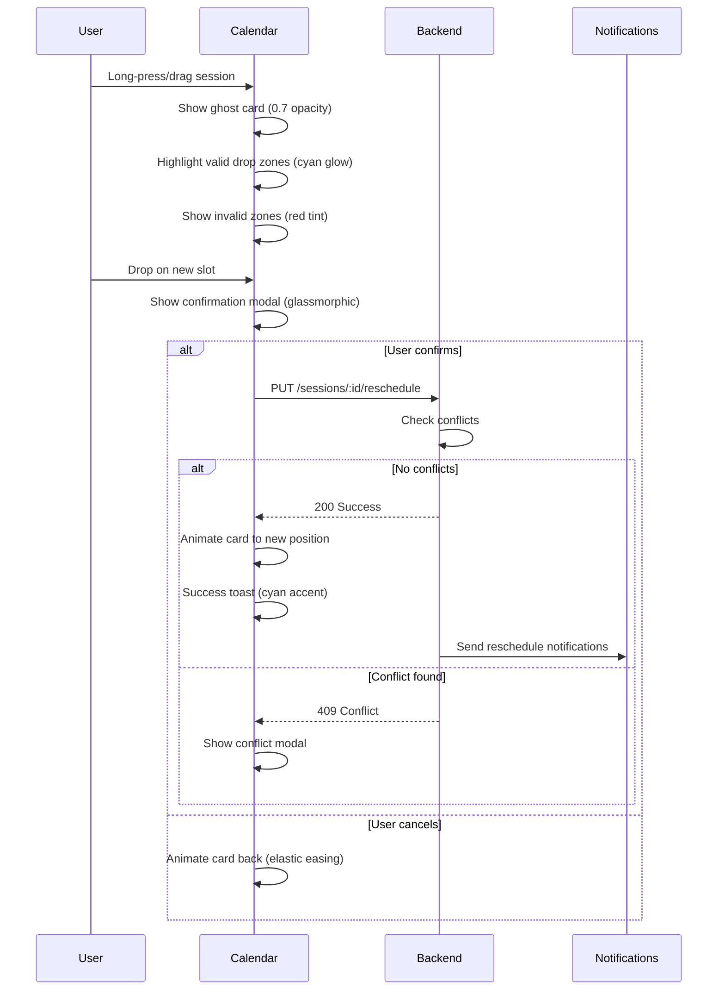
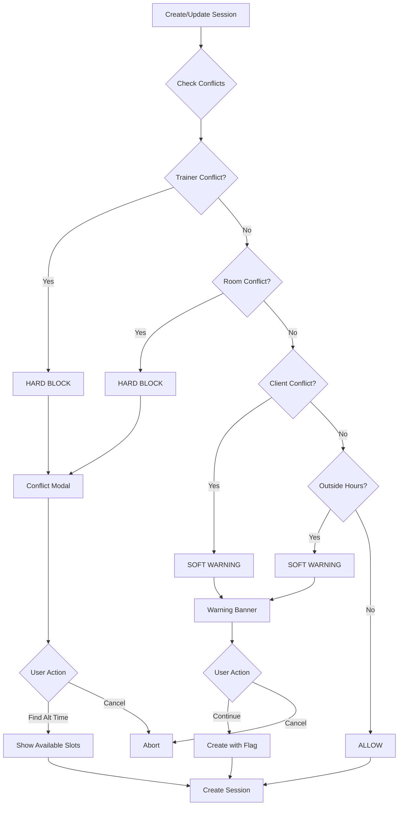
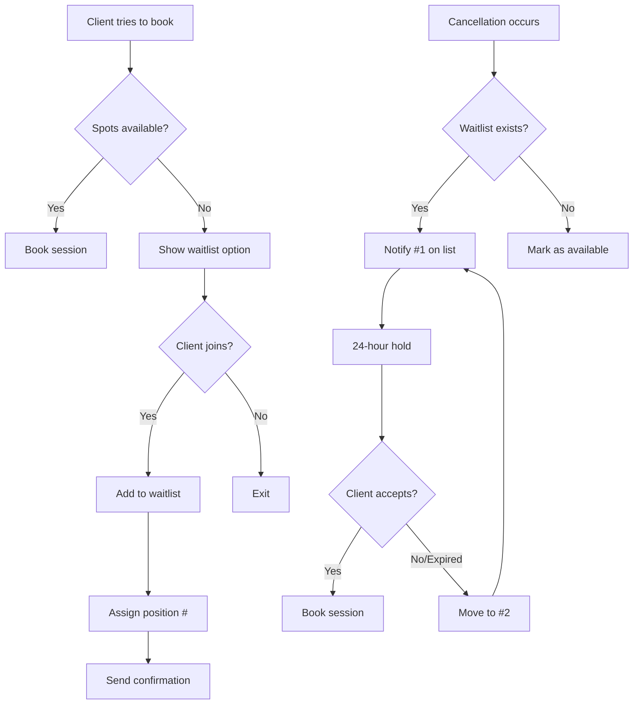
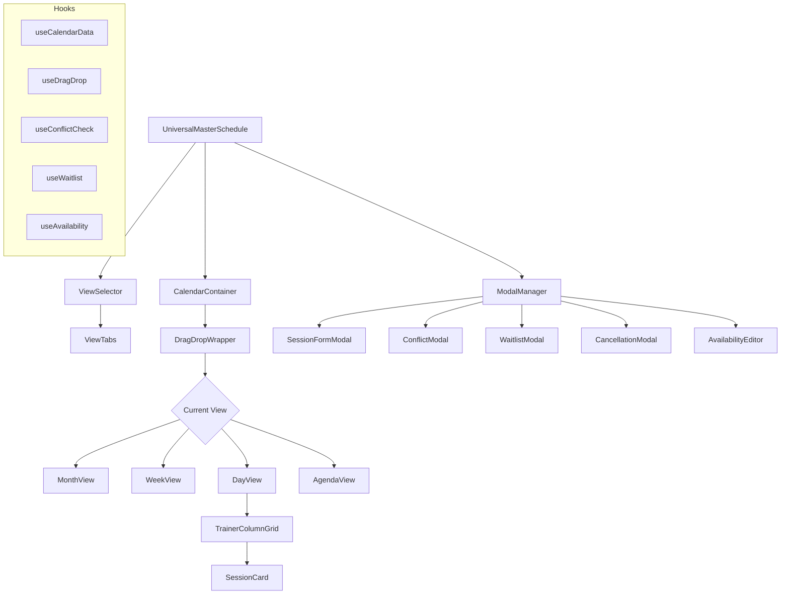

# Universal Master Schedule - MindBody Feature Parity Upgrade

## Document Information
- Created: 2026-01-22
- Updated: 2026-01-23
- Status: PHASE 1-3 COMPLETE, PHASE 4 IN PROGRESS
- Priority: HIGH
- Target Dashboards: Admin, Trainer (Client Phase 2)
- Theme: Galaxy-Swan (Cyan PRIMARY, Purple SECONDARY)

---

## Executive Summary

Upgrade the Universal Master Schedule to match MindBody's functionality while
maintaining SwanStudios' premium Galaxy-Swan aesthetic. This is NOT a visual copy
of MindBody - it is a modern, glassmorphic scheduling system with cosmic elegance.

Design philosophy:
- MindBody functionality + Galaxy-Swan aesthetics = premium experience
- Deep space backgrounds with cyan/purple neon accents
- Glassmorphic cards with backdrop-blur effects
- Smooth 120-180ms micro-interactions
- Mobile-first responsive design

---

## Current vs Target Feature Matrix

| Feature | Status | Target | Priority |
|---------|--------|--------|----------|
| Week View | DONE | Yes | - |
| Month View | DONE | Yes | P0 |
| Day View | DONE | Yes | P0 |
| Agenda View | DONE | Yes | P0 |
| Drag-and-Drop Reschedule | DONE | Yes | P0 |
| Conflict Detection | DONE | Yes | P0 |
| Multi-Trainer Columns | DONE | Yes | P0 |
| Trainer Availability | DONE | Yes | P1 |
| Client Database Dropdown | DONE | Yes | P0 |
| Manual Client Entry | DONE | Yes | P0 |
| Early Cancel (No Charge) | DONE | Yes | P1 |
| Auto-Deduct Sessions | DONE | Yes | P1 |
| Apply Payment Credits | DONE | Yes | P1 |
| Schedule Hours (5am-10pm) | DONE | Yes | P0 |
| Buffer Times | No | Yes | P1 |
| Waitlist | No | Yes | P1 |
| Capacity Controls | No | Yes | P1 |
| Late Cancel Fees | No | Yes | P2 |
| Room Management | No | Yes | P2 |

---

## Phase 1: Multi-View Calendar (P0 - CRITICAL)

### 1.1 View Selector Component

```
------------------------------------------------------------------+
| [Month] [Week] [Day] [Agenda]     < January 2026 >    [Today]    |
| Active tab: cyan glow underline + text                          |
| Inactive: muted white, purple hover                             |
| Glass background: rgba(30, 30, 60, 0.4)                         |
| Border: 1px solid rgba(0, 255, 255, 0.2)                        |
------------------------------------------------------------------+
```

Styling specs:
- Active tab: background linear-gradient(135deg, #00FFFF, #00A0E3)
- Inactive tabs: background rgba(30, 30, 60, 0.4)
- Tab hover: box-shadow 0 0 20px rgba(0, 255, 255, 0.3)
- Transition: all 0.18s cubic-bezier(0.4, 0, 0.2, 1)

### 1.2 Month View (Cosmic Grid)

```
+------------------------------------------------------------------+
| GALAXY-SWAN MONTH VIEW                                           |
| Background: #0a0a1a (void)                                       |
| Grid lines: rgba(0, 255, 255, 0.1)                               |
+------------------------------------------------------------------+
| Sun | Mon | Tue | Wed | Thu | Fri | Sat                          |
+-----+-----+-----+-----+-----+-----+-----+                        |
| 29  | 30  | 31  |  1  |  2  |  3  |  4                           |
|     |     |     | +2  | +3  | +1  |                             |
|     |     |     | [c] | [c] | [c] |                             |
+-----+-----+-----+-----+-----+-----+-----+                        |
|  5  |  6  |  7  |  8  |  9  | 10  | 11                           |
| +1  | +4  | +2  | +3  | BLK | +5  |                             |
| [c] | [c] | [c] | [c] | [p] | [c] |                             |
+-----+-----+-----+-----+-----+-----+-----+                        |
Legend: [c] cyan session badge, [p] purple blocked badge
```

Month view specs:
- Day cells: glass card with subtle border
- Session indicators: small cyan orbs with pulse animation
- Blocked time: purple-tinted cells
- Today: brighter glow border
- Click day: opens Day view for that date

### 1.3 Day View (Multi-Trainer Columns)

```
+------------------------------------------------------------------+
| STAFF SCHEDULE - Monday, January 6, 2026                         |
| Glass header: rgba(30, 30, 60, 0.6) + backdrop-blur: 10px        |
+------------------------------------------------------------------+
| Trainers: [Sean Swan] [Trainer 2] [Trainer 3]                    |
| Active: cyan gradient | Inactive: glass surface                  |
+------------------------------------------------------------------+
| TIME  | SEAN SWAN        | TRAINER 2       | TRAINER 3           |
+-------+------------------+-----------------+---------------------+
| 6:00  |                  | [BLOCKED]       |                     |
| 7:00  | [AVAILABLE +]    |                 | [AVAILABLE +]       |
| 8:00  | [John Doe 60m]   | [Sarah Kim 30m] | [AVAILABLE +]       |
| 9:00  | [John Doe 60m]   |                 |                     |
+-------+------------------+-----------------+---------------------+
Legend:
- Booked session: solid glass card, cyan glow border
- Available slot: dashed border, subtle pulse on hover
- Blocked time: purple tint, opacity 0.5
```

Day view specs:
- Trainer columns: glass panels with trainer avatar/name header
- Booked sessions: solid glass card with cyan glow border
- Available slots: dashed border, subtle pulse on hover
- Blocked time: purple-tinted, opacity 0.5
- Drag session: leaves cyan glow trail

### 1.4 Agenda View (Timeline Stream)

```
+------------------------------------------------------------------+
| UPCOMING SESSIONS                    Filter: [All] [This Week]   |
+------------------------------------------------------------------+
| TODAY - Monday, Jan 6                                            |
| ---------------------------------------------------------------- |
| 8:00 AM  John Doe    Sean Swan   60 min   [SCHEDULED] [Edit]     |
| 9:30 AM  OPEN SLOT   Sean Swan   30 min   [AVAILABLE] [Book]     |
| ---------------------------------------------------------------- |
| TOMORROW - Tuesday, Jan 7                                        |
| 7:00 AM  Sarah Kim   Sean Swan   60 min   [CONFIRMED]            |
+------------------------------------------------------------------+
```

Status badges:
- SCHEDULED: cyan background, white text
- CONFIRMED: green accent
- AVAILABLE: dashed border, "+ Book" CTA
- COMPLETED: muted, check icon

### 1.5 Drag-and-Drop Rescheduling



Drag visual effects:
- Dragging card: opacity 0.8, scale 1.05, box-shadow 0 0 30px rgba(0, 255, 255, 0.4)
- Valid drop zone: pulsing cyan border
- Invalid zone: background rgba(255, 0, 0, 0.1)
- Drop animation: cubic-bezier(0.68, -0.55, 0.265, 1.55) (elastic)

---

## Phase 2: Conflict Detection (P0 - CRITICAL)

### 2.1 Conflict Detection Flow



### 2.2 Conflict Modal Design

```
+------------------------------------------------------------------+
| SCHEDULING CONFLICT                                               |
| Glass modal: rgba(10, 10, 30, 0.95) + blur 20px                   |
| Border: 1px solid rgba(255, 100, 100, 0.3) (red accent)           |
+------------------------------------------------------------------+
| [!] This time slot has a conflict                                |
|                                                                  |
| CONFLICT DETAILS:                                                |
| - Sean Swan already has a session                               |
| - John Doe, 8:00 AM to 9:00 AM                                   |
| - Overlaps with requested 8:30 AM slot                           |
|                                                                  |
| SUGGESTED ALTERNATIVES:                                          |
| [9:00 AM] [10:00 AM] [2:00 PM]                                   |
|                                                                  |
| [Cancel]                       [Find More Times]                 |
+------------------------------------------------------------------+
```

---

## Phase 3: Trainer Availability (P1)

### 3.1 Availability Editor

```
+------------------------------------------------------------------+
| TRAINER AVAILABILITY - Sean Swan                                 |
+------------------------------------------------------------------+
| WEEKLY SCHEDULE                                                  |
| Day      Start     End     Status                               |
| Mon      6:00 AM   8:00 PM ON                                   |
| Tue      6:00 AM   8:00 PM ON                                   |
| Wed      6:00 AM   12:00 PM ON                                  |
| Thu      6:00 AM   8:00 PM ON                                   |
| Fri      6:00 AM   6:00 PM ON                                   |
| Sat      8:00 AM   12:00 PM ON                                  |
| Sun      -         -       OFF                                  |
|                                                                  |
| TIME OFF / VACATION                     [+ Add Time Off]         |
| Jan 15-17, 2026    Vacation           [Edit] [Delete]            |
| Feb 1, 2pm-5pm     Doctor appointment [Edit] [Delete]            |
|                                                                  |
| [Cancel]                                  [Save - Cyan Glow]     |
+------------------------------------------------------------------+
```

### 3.2 Availability Data Model

```sql
CREATE TABLE "TrainerAvailability" (
  "id" SERIAL PRIMARY KEY,
  "trainerId" INTEGER REFERENCES "Users"(id) ON DELETE CASCADE,
  "dayOfWeek" INTEGER CHECK ("dayOfWeek" >= 0 AND "dayOfWeek" <= 6),
  "startTime" TIME NOT NULL,
  "endTime" TIME NOT NULL,
  "isActive" BOOLEAN DEFAULT true,
  "effectiveFrom" DATE,
  "effectiveTo" DATE,
  "type" VARCHAR(20) DEFAULT 'available' CHECK ("type" IN ('available', 'blocked', 'vacation')),
  "reason" TEXT,
  "createdAt" TIMESTAMP DEFAULT NOW(),
  "updatedAt" TIMESTAMP DEFAULT NOW()
);

CREATE INDEX idx_trainer_availability_trainer ON "TrainerAvailability"("trainerId");
CREATE INDEX idx_trainer_availability_day ON "TrainerAvailability"("dayOfWeek");
```

---

## Phase 4: Buffer Times (P1)

### 4.1 Session Type Configuration

```
+------------------------------------------------------------------+
| SESSION TYPE SETTINGS                                            |
+------------------------------------------------------------------+
| Type: [Personal Training]                                        |
| Duration: [60] minutes                                           |
|                                                                  |
| BUFFER TIMES                                                     |
| Before: [15] minutes   After: [15] minutes                       |
|                                                                  |
| [x] Hide buffer from client view                                 |
| [ ] Allow admin override                                         |
|                                                                  |
| VISUAL PREVIEW:                                                  |
| 7:45 [buffer] | 8:00-9:00 SESSION | 9:15 [buffer]                |
+------------------------------------------------------------------+
```

---

## Phase 5: Waitlist System (P1)

### 5.1 Waitlist Flow



### 5.2 Waitlist UI

```
+------------------------------------------------------------------+
| SESSION FULL - Join Waitlist?                                    |
| Mon, Jan 6 @ 8:00 AM - Sean Swan                                 |
+------------------------------------------------------------------+
| This session is currently full (1/1 spots taken)                 |
| Join the waitlist to be notified if a spot opens.                |
| Current waitlist: 2 people ahead of you                          |
|                                                                  |
| [x] Notify me by email                                           |
| [x] Notify me by SMS                                             |
|                                                                  |
| [Cancel]                     [Join Waitlist - Cyan Glow]         |
+------------------------------------------------------------------+
```

### 5.3 Waitlist Data Model

```sql
CREATE TABLE "WaitlistEntries" (
  "id" SERIAL PRIMARY KEY,
  "sessionId" INTEGER REFERENCES "Sessions"(id) ON DELETE CASCADE,
  "userId" INTEGER REFERENCES "Users"(id) ON DELETE CASCADE,
  "position" INTEGER NOT NULL,
  "joinedAt" TIMESTAMP DEFAULT NOW(),
  "notified" BOOLEAN DEFAULT false,
  "notifiedAt" TIMESTAMP,
  "status" VARCHAR(20) DEFAULT 'waiting' CHECK ("status" IN ('waiting', 'offered', 'accepted', 'expired', 'cancelled')),
  "expiresAt" TIMESTAMP,
  "createdAt" TIMESTAMP DEFAULT NOW(),
  "updatedAt" TIMESTAMP DEFAULT NOW(),
  UNIQUE ("sessionId", "userId")
);

CREATE INDEX idx_waitlist_session ON "WaitlistEntries"("sessionId");
CREATE INDEX idx_waitlist_user ON "WaitlistEntries"("userId");
CREATE INDEX idx_waitlist_status ON "WaitlistEntries"("status");
```

---

## Phase 6: Cancellation Policies (P2)

### 6.1 Policy Engine

```
CANCELLATION RULES:
Time Before Session | Refund        | Fee  | Action
> 24 hours          | 100% credit   | $0   | Full refund
2-24 hours          | 50% credit    | $25  | Partial
< 2 hours           | 0%            | $50  | No-show

ADMIN OVERRIDES:
- Can waive any fee with reason
- Can force-cancel without notification
- Can restore credits manually
```

### 6.2 Cancellation Modal

```
+------------------------------------------------------------------+
| CANCEL SESSION                                                   |
| Glass modal with warning accent                                  |
+------------------------------------------------------------------+
| Session: Monday, Jan 6 @ 8:00 AM with Sean Swan                  |
|                                                                  |
| WARNING: Late cancellation                                       |
| This session is in less than 24 hours.                           |
|                                                                  |
| Cancellation policy:                                             |
| - You will forfeit 1 session credit                              |
| - A $25 late cancellation fee will apply                         |
|                                                                  |
| Reason (optional): [________________________]                    |
|                                                                  |
| [Keep Session]               [Cancel Anyway - Red Button]        |
+------------------------------------------------------------------+
```

---

## Database Schema Summary

### New Tables

```sql
-- Trainer Availability
CREATE TABLE "TrainerAvailability" (
  "id" SERIAL PRIMARY KEY,
  "trainerId" INTEGER REFERENCES "Users"(id),
  "dayOfWeek" INTEGER,
  "startTime" TIME NOT NULL,
  "endTime" TIME NOT NULL,
  "isActive" BOOLEAN DEFAULT true,
  "type" VARCHAR(20) DEFAULT 'available',
  "reason" TEXT,
  "createdAt" TIMESTAMP DEFAULT NOW(),
  "updatedAt" TIMESTAMP DEFAULT NOW()
);

-- Waitlist
CREATE TABLE "WaitlistEntries" (
  "id" SERIAL PRIMARY KEY,
  "sessionId" INTEGER REFERENCES "Sessions"(id),
  "userId" INTEGER REFERENCES "Users"(id),
  "position" INTEGER NOT NULL,
  "status" VARCHAR(20) DEFAULT 'waiting',
  "notified" BOOLEAN DEFAULT false,
  "expiresAt" TIMESTAMP,
  "createdAt" TIMESTAMP DEFAULT NOW()
);

-- Cancellation Fees
CREATE TABLE "CancellationFees" (
  "id" SERIAL PRIMARY KEY,
  "sessionId" INTEGER REFERENCES "Sessions"(id),
  "userId" INTEGER REFERENCES "Users"(id),
  "amount" DECIMAL(10,2) NOT NULL,
  "status" VARCHAR(20) DEFAULT 'pending',
  "waivedBy" INTEGER REFERENCES "Users"(id),
  "waiverReason" TEXT,
  "createdAt" TIMESTAMP DEFAULT NOW()
);

-- Session Types
CREATE TABLE "SessionTypes" (
  "id" SERIAL PRIMARY KEY,
  "name" VARCHAR(100) NOT NULL,
  "duration" INTEGER NOT NULL,
  "bufferBefore" INTEGER DEFAULT 0,
  "bufferAfter" INTEGER DEFAULT 0,
  "totalCapacity" INTEGER DEFAULT 1,
  "onlineCapacity" INTEGER DEFAULT 1,
  "color" VARCHAR(7) DEFAULT '#00FFFF',
  "isActive" BOOLEAN DEFAULT true
);

-- Locations
CREATE TABLE "Locations" (
  "id" SERIAL PRIMARY KEY,
  "name" VARCHAR(100) NOT NULL,
  "capacity" INTEGER,
  "type" VARCHAR(20) DEFAULT 'room',
  "equipment" TEXT[],
  "isActive" BOOLEAN DEFAULT true
);
```

### Sessions Table Updates

```sql
ALTER TABLE "Sessions" ADD COLUMN "sessionTypeId" INTEGER REFERENCES "SessionTypes"(id);
ALTER TABLE "Sessions" ADD COLUMN "locationId" INTEGER REFERENCES "Locations"(id);
ALTER TABLE "Sessions" ADD COLUMN "capacity" INTEGER DEFAULT 1;
ALTER TABLE "Sessions" ADD COLUMN "bookedCount" INTEGER DEFAULT 0;
ALTER TABLE "Sessions" ADD COLUMN "waitlistEnabled" BOOLEAN DEFAULT false;
ALTER TABLE "Sessions" ADD COLUMN "bufferBefore" INTEGER DEFAULT 0;
ALTER TABLE "Sessions" ADD COLUMN "bufferAfter" INTEGER DEFAULT 0;
ALTER TABLE "Sessions" ADD COLUMN "cancelledAt" TIMESTAMP;
ALTER TABLE "Sessions" ADD COLUMN "cancelledBy" INTEGER;
ALTER TABLE "Sessions" ADD COLUMN "cancellationReason" TEXT;
```

---

## API Endpoints

Calendar:
```
GET  /api/sessions/calendar?view=month|week|day|agenda&date=YYYY-MM-DD&trainerId=X
PUT  /api/sessions/:id/reschedule
POST /api/sessions/:id/check-conflicts
```

Trainer availability:
```
GET    /api/trainers/:id/availability?startDate=X&endDate=Y
POST   /api/trainers/:id/availability
PUT    /api/trainers/:id/availability/:availId
DELETE /api/trainers/:id/availability/:availId
PUT    /api/trainers/:id/availability/weekly
```

Waitlist:
```
POST   /api/sessions/:id/waitlist
DELETE /api/sessions/:id/waitlist
GET    /api/sessions/:id/waitlist
POST   /api/sessions/:id/waitlist/:entryId/offer
POST   /api/sessions/:id/waitlist/accept
```

Cancellation:
```
POST /api/sessions/:id/cancel
POST /api/cancellation-fees/:id/waive
GET  /api/users/:id/cancellation-fees
```

---

## Frontend Components

New components required:

| Component | Location | Priority |
|-----------|----------|----------|
| ViewSelector.tsx | UniversalMasterSchedule/Views/ | P0 |
| MonthView.tsx | UniversalMasterSchedule/Views/ | P0 |
| DayView.tsx | UniversalMasterSchedule/Views/ | P0 |
| AgendaView.tsx | UniversalMasterSchedule/Views/ | P0 |
| TrainerColumnGrid.tsx | UniversalMasterSchedule/Views/ | P0 |
| DragDropWrapper.tsx | UniversalMasterSchedule/DnD/ | P0 |
| SessionCard.tsx | UniversalMasterSchedule/Cards/ | P0 |
| ConflictModal.tsx | UniversalMasterSchedule/Modals/ | P0 |
| AvailabilityEditor.tsx | UniversalMasterSchedule/Modals/ | P1 |
| WaitlistPanel.tsx | UniversalMasterSchedule/Panels/ | P1 |
| WaitlistModal.tsx | UniversalMasterSchedule/Modals/ | P1 |
| CancellationModal.tsx | UniversalMasterSchedule/Modals/ | P2 |
| BufferTimeConfig.tsx | UniversalMasterSchedule/Config/ | P1 |

Component architecture:



---

## Galaxy-Swan Theme Tokens

Use these theme tokens from `frontend/src/styles/galaxy-swan-theme.ts`:

```typescript
// Backgrounds
galaxySwanTheme.background.primary      // #0a0a1a (void)
galaxySwanTheme.background.surface      // rgba(30, 30, 60, 0.6)

// Primary (Cyan/Blue)
galaxySwanTheme.primary.main            // #00FFFF
galaxySwanTheme.primary.blue            // #00A0E3

// Secondary (Purple)
galaxySwanTheme.secondary.main          // #7851A9
galaxySwanTheme.secondary.nebula        // #7b2cbf

// Glass effects
galaxySwanTheme.glass.mid               // 0.10 opacity
backdrop-filter: blur(10px)

// Shadows
galaxySwanTheme.shadows.primaryGlow     // cyan glow
galaxySwanTheme.shadows.secondaryGlow   // purple glow

// Borders
galaxySwanTheme.borders.elegant         // rgba(0, 255, 255, 0.2)

// Gradients
galaxySwanTheme.gradients.primaryCosmic // cyan to blue
```

---

## Implementation Order

Sprint 1 (P0 - Core Calendar):
1. ViewSelector component
2. MonthView component
3. DayView with TrainerColumnGrid
4. AgendaView component
5. DragDropWrapper with reschedule
6. ConflictModal

Sprint 2 (P1 - Advanced Features):
1. Trainer Availability backend + migration
2. AvailabilityEditor component
3. Buffer time configuration
4. Waitlist backend + migration
5. WaitlistPanel and WaitlistModal

Sprint 3 (P2 - Policies):
1. Cancellation policy engine
2. CancellationModal
3. Fee tracking and waiver system
4. Location/room management

---

## Success Metrics

- Session creation: < 30 seconds
- Drag-drop reschedule: < 5 seconds
- Zero double-bookings
- Mobile booking completion: > 90%
- Calendar load time: < 200ms
- Lighthouse accessibility: > 90

---

Document Version: 1.1
Last Updated: 2026-01-23
Theme: Galaxy-Swan (Cyan PRIMARY, Purple SECONDARY)
For: ChatGPT Implementation Team

---

## Implementation Log

### 2026-01-23 Updates

#### Completed Features

1. **Client Database Dropdown**
   - Admin can now select clients from the database when creating sessions
   - Fetches from `/api/auth/users/clients` endpoint
   - Shows client name and email in dropdown

2. **Manual Client Entry Option**
   - Toggle to switch between database selection and manual entry
   - Allows entering client name directly for new/unregistered clients

3. **Trainer Database Dropdown**
   - Admin can select trainers from the database
   - Fetches from `/api/auth/users/trainers` endpoint

4. **Early Cancel Option (No Charge)**
   - Checkbox available when cancelling sessions >24 hours before scheduled time
   - Early cancel refunds the session credit to the client
   - Backend updated to handle `earlyCancel` flag in cancel endpoint
   - Location: `SessionDetailModal.tsx`

5. **Auto-Deduct Sessions Service**
   - New service: `backend/services/sessionDeductionService.mjs`
   - Automatically marks past scheduled sessions as completed
   - Deducts session credits from client's balance
   - API endpoint: `POST /api/sessions/deductions/process`

6. **Apply Payment Modal**
   - New component: `ApplyPaymentModal.tsx`
   - Shows clients with exhausted credits who have upcoming sessions
   - Admin can add session credits to client accounts
   - API endpoints:
     - `GET /api/sessions/deductions/clients-needing-payment`
     - `POST /api/sessions/deductions/apply-payment`

7. **Schedule Hours Fix**
   - Changed schedule hours from 6am-10pm to 5am-10pm
   - Updated in `DayView.tsx` and `AvailabilityEditor.tsx`

8. **Sessions API Fix**
   - Fixed "Sessions array is required" error
   - Frontend now wraps session data in `{ sessions: [...] }` format

#### New Files Created

```
backend/services/sessionDeductionService.mjs
backend/routes/sessionDeductionRoutes.mjs
frontend/src/components/UniversalMasterSchedule/ApplyPaymentModal.tsx
```

#### Modified Files

```
frontend/src/components/UniversalMasterSchedule/UniversalMasterSchedule.tsx
frontend/src/components/UniversalMasterSchedule/SessionDetailModal.tsx
frontend/src/components/UniversalMasterSchedule/Views/DayView.tsx
frontend/src/components/UniversalMasterSchedule/Availability/AvailabilityEditor.tsx
backend/controllers/sessionController.mjs
backend/core/routes.mjs
```

#### New API Endpoints

```
POST /api/sessions/deductions/process
     - Admin only
     - Processes automatic session deductions for past sessions

GET  /api/sessions/deductions/clients-needing-payment
     - Admin/Trainer
     - Returns clients with 0 credits and upcoming sessions

POST /api/sessions/deductions/apply-payment
     - Admin only
     - Body: { clientId, sessionsToAdd, paymentNote? }
     - Adds session credits to client account
```

### Remaining Work

1. **Buffer Times** - P1 (not started)
2. **Waitlist System** - P1 (not started)
3. **Capacity Controls** - P1 (not started)
4. **Late Cancel Fees** - P2 (not started)
5. **Room Management** - P2 (not started)
