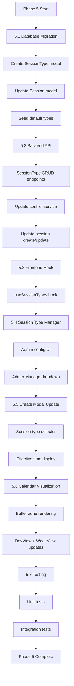
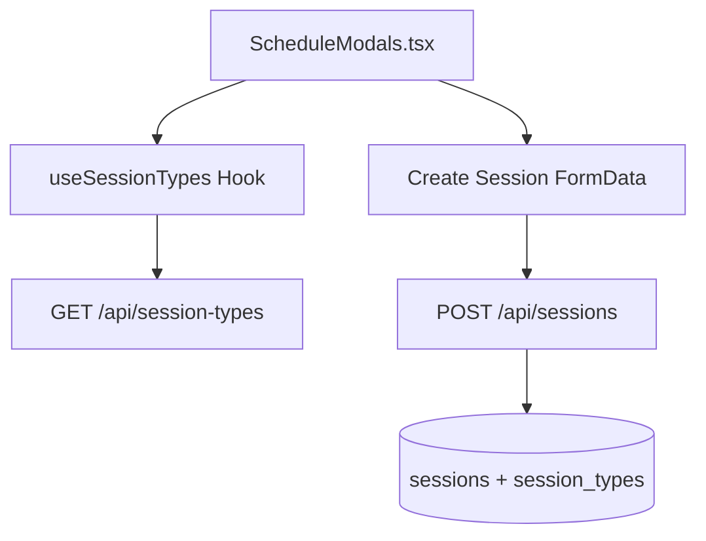
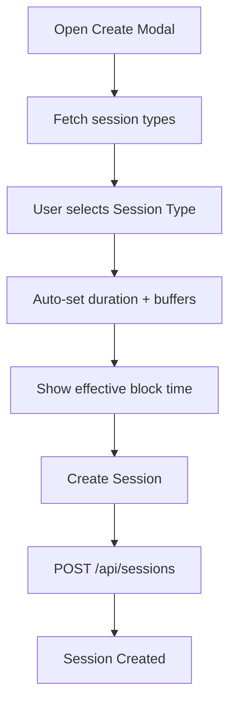

# UNIVERSAL MASTER SCHEDULE - PHASE 5
## Buffer Times + Session Type Configuration

**Created:** 2026-01-31
**Status:** APPROVED FOR IMPLEMENTATION
**Priority:** P1 (High)
**Depends On:** Phase 4 Complete
**Theme:** Galaxy-Swan (Cyan PRIMARY, Purple SECONDARY)

---

## 1. Executive Summary
Phase 5 adds Buffer Times and Session Type Configuration to the Universal Master Schedule. This enables admins to:
- Define different session types (Personal Training, Assessment, Group, etc.)
- Configure automatic buffer times before/after sessions
- Prevent back-to-back booking conflicts
- Standardize session durations and pricing

---

## 2. Current State Analysis

### 2.1 What Exists
- Session model with basic fields (duration, location, status)
- Create session modal with duration dropdown (30/60/90/120 min)
- Session templates stored in localStorage (Phase 4)

### 2.2 What's Missing
- SessionType database model
- Buffer time configuration (before/after)
- Session type selection in create flow
- Visual buffer indicators on calendar
- Admin session type management UI

---

## 3. Database Schema

### 3.1 New Table: session_types
```sql
CREATE TABLE "session_types" (
  "id" SERIAL PRIMARY KEY,
  "name" VARCHAR(100) NOT NULL,
  "description" TEXT,
  "duration" INTEGER NOT NULL DEFAULT 60,
  "bufferBefore" INTEGER NOT NULL DEFAULT 0,
  "bufferAfter" INTEGER NOT NULL DEFAULT 0,
  "color" VARCHAR(7) DEFAULT '#00FFFF',
  "price" DECIMAL(10,2),
  "isActive" BOOLEAN DEFAULT true,
  "sortOrder" INTEGER DEFAULT 0,
  "createdAt" TIMESTAMP DEFAULT NOW(),
  "updatedAt" TIMESTAMP DEFAULT NOW(),
  "deletedAt" TIMESTAMP
);

CREATE INDEX idx_session_types_active ON "session_types"("isActive");
```

### 3.2 Session Table Updates
```sql
ALTER TABLE "sessions" ADD COLUMN "sessionTypeId" INTEGER REFERENCES "session_types"(id);
ALTER TABLE "sessions" ADD COLUMN "bufferBefore" INTEGER DEFAULT 0;
ALTER TABLE "sessions" ADD COLUMN "bufferAfter" INTEGER DEFAULT 0;
```

### 3.3 Default Session Types (Seed Data)

| Name | Duration | Buffer Before | Buffer After | Color |
|------|----------|---------------|--------------|-------|
| Personal Training | 60 | 0 | 15 | #00FFFF |
| Extended Session | 90 | 0 | 15 | #00A0E3 |
| Assessment | 90 | 15 | 15 | #7851A9 |
| Quick Check-in | 30 | 0 | 10 | #00FF88 |
| Partner Training | 60 | 0 | 15 | #FF6B6B |

---

## 4. Backend: API Endpoints

### 4.1 Session Types CRUD
- GET    /api/session-types              - List all active session types
- GET    /api/session-types/:id          - Get single session type
- POST   /api/session-types              - Create session type (Admin)
- PUT    /api/session-types/:id          - Update session type (Admin)
- DELETE /api/session-types/:id          - Soft delete session type (Admin)
- POST   /api/session-types/reorder      - Update sort order (Admin)

### 4.2 Updated Session Endpoints
- POST   /api/sessions                   - Include sessionTypeId, auto-apply buffers
- PUT    /api/sessions/:id               - Update with buffer validation
- GET    /api/sessions/check-conflicts   - Include buffer time in conflict check

### 4.3 Conflict Check Enhancement
When checking for conflicts, the buffer times must be included:

Session: 8:00 AM - 9:00 AM (60 min)
Buffer After: 15 min
Effective Block: 8:00 AM - 9:15 AM

Next session cannot start before 9:15 AM

---

## 5. Frontend: Session Type Management

### 5.1 New Component: SessionTypeManager.tsx
**Location:** frontend/src/components/UniversalMasterSchedule/Config/SessionTypeManager.tsx

```
+------------------------------------------------------------------+
| SESSION TYPE SETTINGS                              [+ Add Type]   |
+------------------------------------------------------------------+
| Name             | Duration | Buffer | Buffer | Color  | Actions |
|                  |          | Before | After  |        |         |
+------------------------------------------------------------------+
| Personal Training| 60 min   | 0 min  | 15 min | [===]  | [E][D]  |
| Extended Session | 90 min   | 0 min  | 15 min | [===]  | [E][D]  |
| Assessment       | 90 min   | 15 min | 15 min | [===]  | [E][D]  |
| Quick Check-in   | 30 min   | 0 min  | 10 min | [===]  | [E][D]  |
+------------------------------------------------------------------+
| Drag rows to reorder                                              |
+------------------------------------------------------------------+
```

### 5.2 Styling
- Glass card container with Galaxy-Swan theme
- Sortable rows via drag handle
- Color picker for session type color
- Inline edit mode for quick changes
- Delete confirmation modal

---

## 6. Frontend: Create Session Integration

### 6.1 Updated Create Modal
Replace the static duration dropdown with session type selector:

```
+------------------------------------------------------------------+
| CREATE NEW SESSION                                                |
+------------------------------------------------------------------+
| Template: [-- No Template --] [v]                                 |
|                                                                   |
| Session Type: [Personal Training (60 min)] [v]                    |
|   Duration: 60 minutes                                            |
|   Buffer: 15 min after                                            |
|                                                                   |
| Date & Time: [Jan 31, 2026 @ 8:00 AM]                            |
|   Effective block: 8:00 AM - 9:15 AM (includes buffer)           |
|                                                                   |
| Trainer: [Sean Swan] [v]                                          |
| Client: [John Doe] [v]                                            |
| Location: [Main Studio] [v]                                       |
|                                                                   |
| [Cancel]  [Save as Template]  [Create Session]                    |
+------------------------------------------------------------------+
```

### 6.2 Key Changes
- Session Type dropdown replaces Duration dropdown
- Show calculated "Effective block" including buffers
- Auto-populate duration from session type
- Allow duration override with warning

---

## 7. Frontend: Calendar Buffer Visualization

### 7.1 Day/Week View Buffer Display

```
+------------------+
| 8:00 AM          |
| [John Doe - PT]  |  <- Session card (cyan glow)
| 60 min           |
+------------------+
| 9:00 AM          |
| [BUFFER]         |  <- Buffer zone (purple tint, dashed border)
| 15 min           |
+------------------+
| 9:15 AM          |
| [Available]      |  <- Next available slot
+------------------+
```

### 7.2 Buffer Zone Styling
```css
.buffer-zone {
  background: rgba(120, 81, 169, 0.15);
  border: 1px dashed rgba(120, 81, 169, 0.4);
  opacity: 0.7;
  pointer-events: none;
}
```

### 7.3 Buffer Zone Behavior
- Display after sessions with bufferAfter > 0
- Display before sessions with bufferBefore > 0
- Non-interactive (no click/drag)
- Collapse when viewing month view (too small)
- Show tooltip on hover: "15 min buffer"

---

## 8. Hook: useSessionTypes
**Location:** frontend/src/components/UniversalMasterSchedule/hooks/useSessionTypes.ts

```ts
interface SessionType {
  id: number;
  name: string;
  description?: string;
  duration: number;
  bufferBefore: number;
  bufferAfter: number;
  color: string;
  price?: number;
  isActive: boolean;
  sortOrder: number;
}

interface UseSessionTypesReturn {
  sessionTypes: SessionType[];
  loading: boolean;
  error: string | null;
  fetchSessionTypes: () => Promise<void>;
  createSessionType: (data: Partial<SessionType>) => Promise<SessionType>;
  updateSessionType: (id: number, data: Partial<SessionType>) => Promise<SessionType>;
  deleteSessionType: (id: number) => Promise<void>;
  reorderSessionTypes: (ids: number[]) => Promise<void>;
  getEffectiveEndTime: (startTime: Date, sessionTypeId: number) => Date;
}
```

---

## 9. Implementation Flow


---

## 10. File Structure
```
backend/
+-- models/
¦   +-- SessionType.mjs          (NEW)
¦   +-- Session.mjs              (UPDATED)
+-- routes/
¦   +-- sessionTypeRoutes.mjs    (NEW)
+-- controllers/
¦   +-- sessionTypeController.mjs (NEW)
+-- services/
¦   +-- conflictService.mjs      (UPDATED)
+-- migrations/
    +-- YYYYMMDD-add-session-types.mjs (NEW)

frontend/src/components/UniversalMasterSchedule/
+-- Config/
¦   +-- SessionTypeManager.tsx   (NEW)
+-- hooks/
¦   +-- useSessionTypes.ts       (NEW)
+-- components/
¦   +-- ScheduleModals.tsx       (UPDATED)
+-- Views/
¦   +-- DayView.tsx              (UPDATED)
¦   +-- WeekView.tsx             (UPDATED - if exists)
+-- Cards/
    +-- BufferZone.tsx           (NEW)
```

---

## 11. Acceptance Criteria

### Backend
- [ ] SessionType model created with all fields
- [ ] Session model updated with sessionTypeId and buffer fields
- [ ] Migration runs without errors
- [ ] Default session types seeded
- [ ] CRUD endpoints functional
- [ ] Conflict check includes buffer times

### Frontend
- [ ] useSessionTypes hook fetches and caches data
- [ ] SessionTypeManager UI allows CRUD operations
- [ ] Create modal shows session type selector
- [ ] Effective end time displayed with buffer
- [ ] Buffer zones render in Day view
- [ ] Buffer zones have correct styling (purple tint)

### Integration
- [ ] Creating session with type applies correct buffers
- [ ] Conflict detection respects buffer times
- [ ] Drag-drop respects buffer constraints
- [ ] Templates can include session type

---

## 12. Testing Requirements

### Unit Tests
```js
// useSessionTypes.test.ts
describe('useSessionTypes', () => {
  it('fetches session types on mount');
  it('calculates effective end time correctly');
  it('handles create/update/delete operations');
});

// conflictService.test.mjs
describe('Conflict Service with Buffers', () => {
  it('detects conflict when session overlaps buffer');
  it('allows booking after buffer ends');
  it('handles sessions with no buffer');
});
```

### Manual Test Plan
- Create session type with 15-min buffer
- Create session using that type
- Verify buffer zone appears on calendar
- Try to book session during buffer (should be blocked)
- Verify conflict message mentions buffer
- Edit session type, verify existing sessions update

---

## 13. Risk Assessment

| Risk | Mitigation |
|------|------------|
| Existing sessions lack sessionTypeId | Make field nullable, backfill optional |
| Buffer conflicts break drag-drop | Add buffer-aware drop validation |
| Performance with many session types | Limit to 20 active types, pagination |
| Mobile buffer visibility | Hide buffer zones on small screens |

---

## 14. Success Metrics
- Session type selection: < 2 clicks
- Buffer conflict prevention: 100%
- Admin type management: < 30 seconds per type
- Calendar render with buffers: < 300ms

---

## 15. ChatGPT Implementation Prompt

PHASE 5: BUFFER TIMES + SESSION TYPE CONFIGURATION

You are implementing Phase 5 of the Universal Master Schedule refactor.
Claude has approved this blueprint. Follow the specifications exactly.

IMPLEMENTATION ORDER:
1. Create backend migration for session_types table
2. Create SessionType model (backend/models/SessionType.mjs)
3. Update Session model with sessionTypeId, bufferBefore, bufferAfter
4. Create sessionTypeRoutes.mjs and sessionTypeController.mjs
5. Update conflictService.mjs to include buffer times
6. Create useSessionTypes.ts hook
7. Create SessionTypeManager.tsx component
8. Update ScheduleModals.tsx create flow
9. Create BufferZone.tsx component
10. Update DayView.tsx to render buffer zones
11. Add "Session Types" to Manage dropdown in ScheduleHeader.tsx
12. Write tests

KEY REQUIREMENTS:
- Buffer times are in MINUTES (integer)
- Effective end time = sessionDate + duration + bufferAfter
- Effective start time = sessionDate - bufferBefore
- Conflict check must use effective times, not raw times
- Buffer zones are visual only (no click handlers)
- Galaxy-Swan theme: purple tint for buffers

SEED DATA (run in migration):
INSERT INTO session_types (name, duration, "bufferBefore", "bufferAfter", color, "isActive", "sortOrder")
VALUES
  ('Personal Training', 60, 0, 15, '#00FFFF', true, 1),
  ('Extended Session', 90, 0, 15, '#00A0E3', true, 2),
  ('Assessment', 90, 15, 15, '#7851A9', true, 3),
  ('Quick Check-in', 30, 0, 10, '#00FF88', true, 4),
  ('Partner Training', 60, 0, 15, '#FF6B6B', true, 5);

After each major component, run:
- npm run build (frontend)
- npm test (if tests exist)

Report back after completing each numbered step.
Document Version: 1.0
Approved By: Claude (Code Review)
For: ChatGPT Implementation Team

---

## 16. Step 8 Addendum: ScheduleModals Integration

### 16.1 Architecture Diagram (Data Flow)


### 16.2 Create Session Flow (with Session Type)


### 16.3 API Specs (Step 8 Scope)

**GET /api/session-types**
Response:
```json
{
  "success": true,
  "data": [
    {
      "id": 1,
      "name": "Personal Training",
      "duration": 60,
      "bufferBefore": 0,
      "bufferAfter": 15,
      "color": "#00FFFF",
      "isActive": true,
      "sortOrder": 1
    }
  ]
}
```

**POST /api/sessions** (Create Session)
Request (updated fields):
```json
{
  "sessionDate": "2026-02-01T08:00:00.000Z",
  "trainerId": 12,
  "clientId": 45,
  "sessionTypeId": 1,
  "duration": 60,
  "bufferBefore": 0,
  "bufferAfter": 15,
  "location": "Main Studio",
  "notes": "Optional notes"
}
```

Response:
```json
{
  "success": true,
  "data": {
    "id": 9921,
    "sessionTypeId": 1,
    "duration": 60,
    "bufferBefore": 0,
    "bufferAfter": 15
  }
}
```

### 16.4 WHY Sections

**WHY replace the duration dropdown with Session Type?**
- Standardizes scheduling rules and reduces manual errors.
- Ensures buffer policies are always applied consistently.

**WHY show “Effective block” time?**
- Makes buffer impact visible to admins and trainers.
- Prevents accidental back-to-back scheduling conflicts.

**WHY auto-populate duration/buffers?**
- Reduces cognitive load and speeds session creation.
- Aligns with Phase 5 goal: <2 clicks to select a type.
