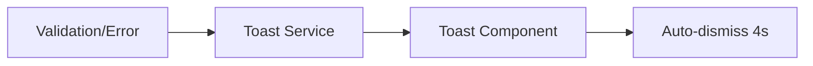
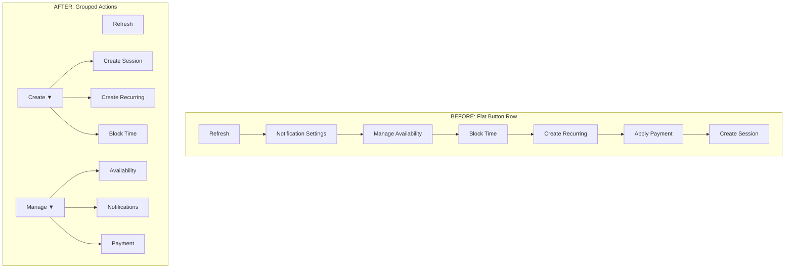
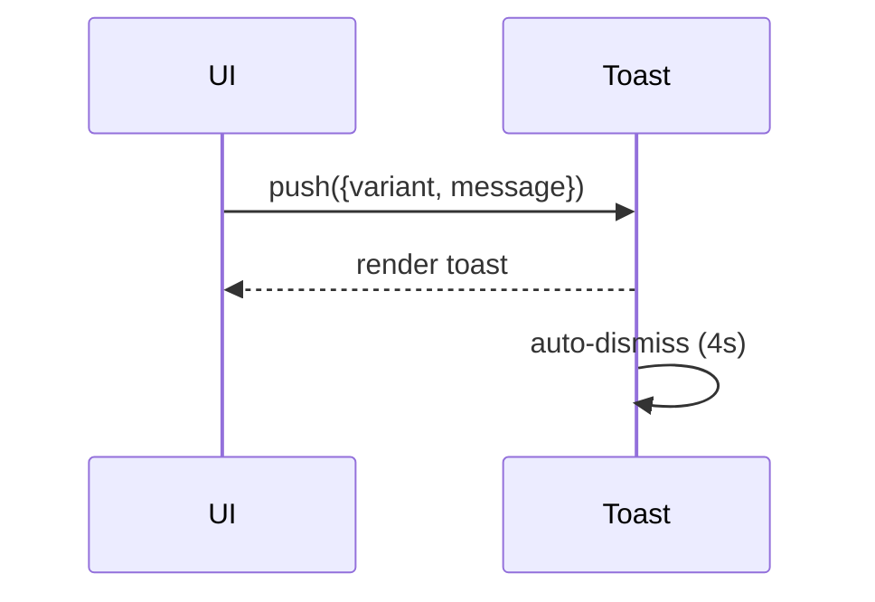
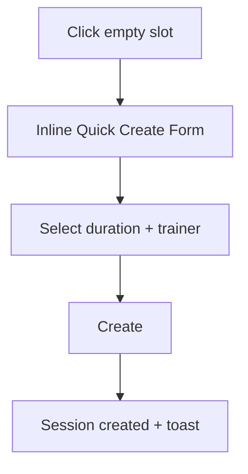

# BLUEPRINT: Universal Master Schedule Refactor (Phase 1)

## PHASE 4: UX ENHANCEMENTS

### 4.1 Toast Notification System
Replace blocking `alert()` calls with non-blocking toasts.

**Flowchart (alert() ? Toast):**


**Component Spec (Toast.tsx):**
```ts
type ToastVariant = 'success' | 'error' | 'warning' | 'info';

interface ToastProps {
  id: string;
  title?: string;
  message: string;
  variant: ToastVariant;
  duration?: number; // default 4000ms
  onClose: (id: string) => void;
  actionLabel?: string;
  onAction?: () => void;
}
```

### 4.2 Header Button Consolidation
Group primary actions into two dropdowns to reduce visual overload:
- **Create ▼**: Create Session, Create Recurring, Block Time  
- **Manage ▼**: Availability, Notifications, Payment  
Keep Refresh as standalone icon button.

**Before/After Grouping Diagram:**


### 4.3 Keyboard Shortcuts
Add productivity shortcuts for admins and power users.

**Shortcut Table:**
| Key | Action |
|-----|--------|
| N | Open Create Session |
| T | Jump to Today |
| ← / → | Previous / Next period |
| Esc | Close any open modal |

**Implementation Hook:**
`frontend/src/components/UniversalMasterSchedule/hooks/useKeyboardShortcuts.ts`

### 4.4 Session Templates
Templates reduce repetitive data entry in the create flow.

**Template Data Structure:**
```ts
interface SessionTemplate {
  id: string;
  name: string;
  duration: number;
  location: string;
  notes?: string;
}
```

**localStorage Persistence Pattern:**
```ts
const STORAGE_KEY = 'schedule.sessionTemplates';
const loadTemplates = (): SessionTemplate[] =>
  JSON.parse(localStorage.getItem(STORAGE_KEY) || '[]');
const saveTemplates = (templates: SessionTemplate[]) =>
  localStorage.setItem(STORAGE_KEY, JSON.stringify(templates));
```

---

## DIAGRAMS (PHASE 4)

### Toast Notification Flow


### Header Action Grouping (Structure)
```mermaid
graph LR
  H[Header Actions]
  H --> R[Refresh]
  H --> C[Create (dropdown)]
  H --> M[Manage (dropdown)]
  C --> CS[Create Session]
  C --> CR[Create Recurring]
  C --> BT[Block Time]
  M --> AV[Availability]
  M --> NF[Notifications]
  M --> PM[Payment]
```

### Quick Create Flow (Slot Click -> Inline Form -> Session Created)


## IMPLEMENTATION ORDER
1. **Phase 4.1** Toast notifications (replace alert calls)
2. **Phase 4.2** Header button consolidation (Create/Manage dropdowns)
3. **Phase 4.3** Keyboard shortcuts (useKeyboardShortcuts hook)
4. **Phase 4.4** Session templates (modal selector + localStorage)

## File Structure Changes

```
frontend/src/components/UniversalMasterSchedule/
├── components/
│   ├── ScheduleHeader.tsx
│   ├── ScheduleStats.tsx
│   ├── ScheduleCalendar.tsx
│   └── ScheduleModals.tsx
├── UniversalMasterSchedule.tsx (Refactored Container)
└── ... (existing sub-components)
```

## ✅ Success Criteria
- [ ] `UniversalMasterSchedule.tsx` reduced to < 300 lines.
- [ ] All data fetched via `useCalendarData`.
- [ ] Zero direct `fetch` calls in UI components.
- [ ] Full Galaxy-Swan theme compliance.
- [ ] All existing functionality (Recurring, Blocked, Payment) preserved.
