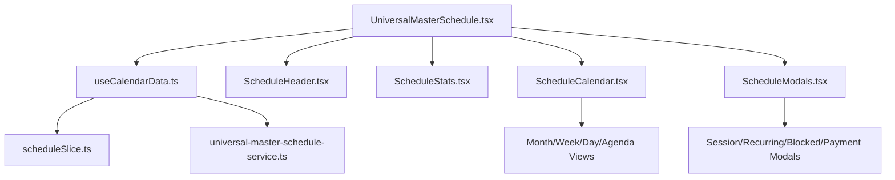

# BLUEPRINT: Universal Master Schedule Refactor (Phase 1)

## 🎯 Overview
Refactor the monolithic `UniversalMasterSchedule.tsx` (~1,700 lines) into a modular, production-ready system using the `useCalendarData` hook and Galaxy-Swan design tokens.

## 🏗️ Architecture Overview



## 🛠️ Refactor Plan

### 1. Modularization (Rule #5 Compliance)
Split the main component into sub-components:
- **`ScheduleHeader.tsx`**: Navigation, view selection, and primary actions.
- **`ScheduleStats.tsx`**: Overview metrics (Total, Available, Booked, Credits).
- **`ScheduleCalendar.tsx`**: Container for the various calendar views (Month, Week, Day, Agenda).
- **`ScheduleModals.tsx`**: Orchestrator for all schedule-related modals.

### 2. Hook Integration
- Replace internal `useState` for sessions, clients, and trainers with `useCalendarData`.
- Replace direct `fetch` calls in `handleCreateSession`, `handleBookSession`, and `handleReschedule` with service calls via `useCalendarData` or `universalMasterScheduleService`.
- Utilize Redux state for global schedule synchronization.

### 3. Galaxy-Swan Theme Enforcement
- Use `stellarTheme` from `UniversalMasterScheduleTheme.ts`.
- Ensure glass-morphism effects on all cards and modals.
- Use cosmic gradients for backgrounds.
- Reserve Swan Cyan (`#00FFFF`) for primary actions.

### 4. UX Enhancements
- **Segmented Controls**: Replace dropdowns in `SessionDetailModal` and `BlockedTimeModal` with segmented controls for faster data entry.
- **Haptic Feedback**: Integrate micro-interactions for drag-and-drop actions.

## 📂 File Structure Changes

```
frontend/src/components/UniversalMasterSchedule/
├── components/
│   ├── ScheduleHeader.tsx
│   ├── ScheduleStats.tsx
│   ├── ScheduleCalendar.tsx
│   └── ScheduleModals.tsx
├── UniversalMasterSchedule.tsx (Refactored Container)
└── ... (existing sub-components)
```

## ✅ Success Criteria
- [ ] `UniversalMasterSchedule.tsx` reduced to < 300 lines.
- [ ] All data fetched via `useCalendarData`.
- [ ] Zero direct `fetch` calls in UI components.
- [ ] Full Galaxy-Swan theme compliance.
- [ ] All existing functionality (Recurring, Blocked, Payment) preserved.
