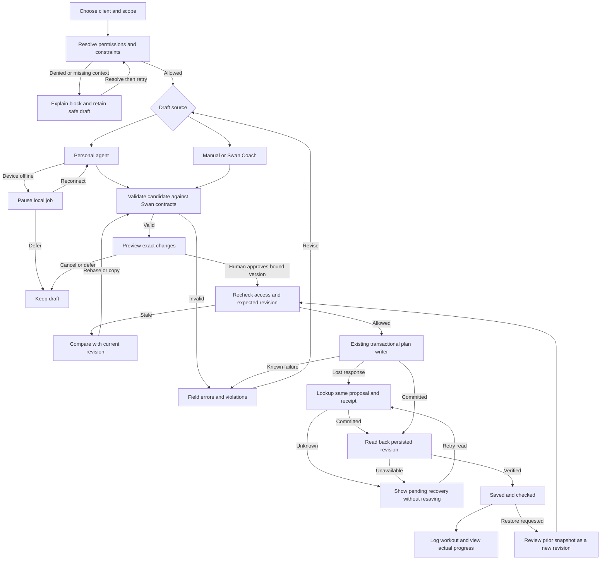
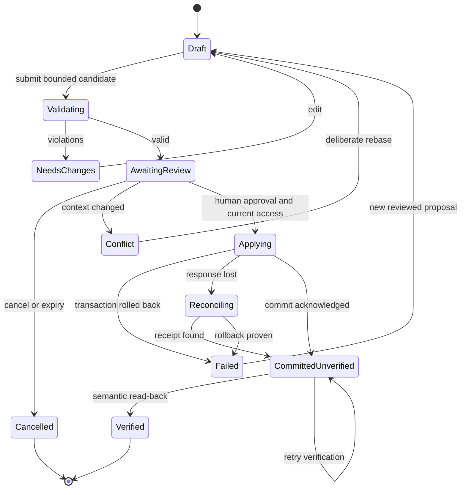
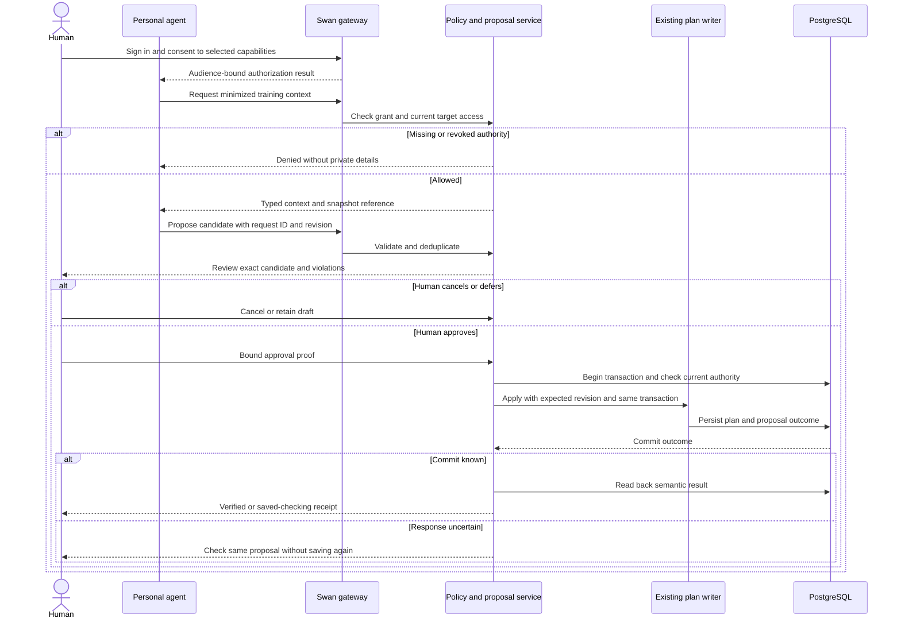
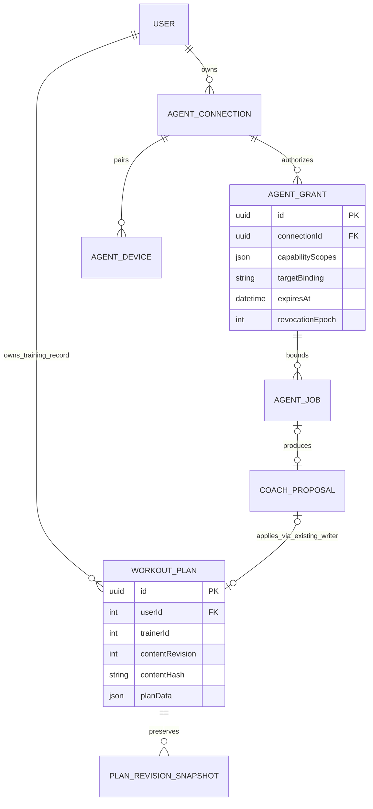
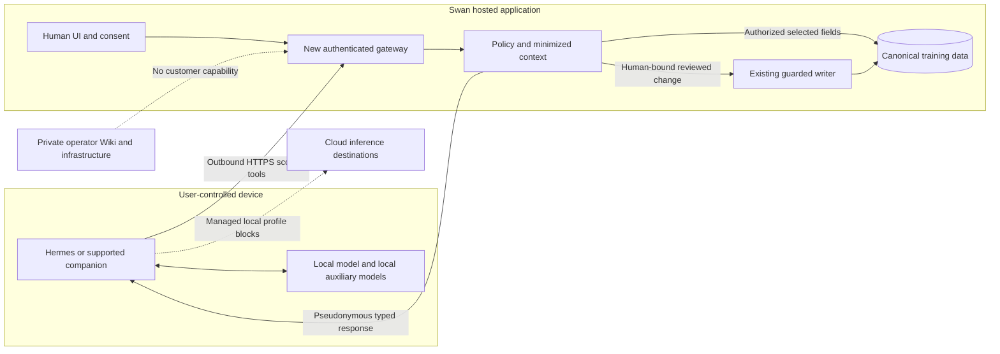
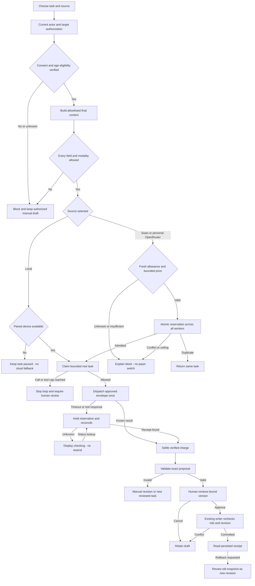
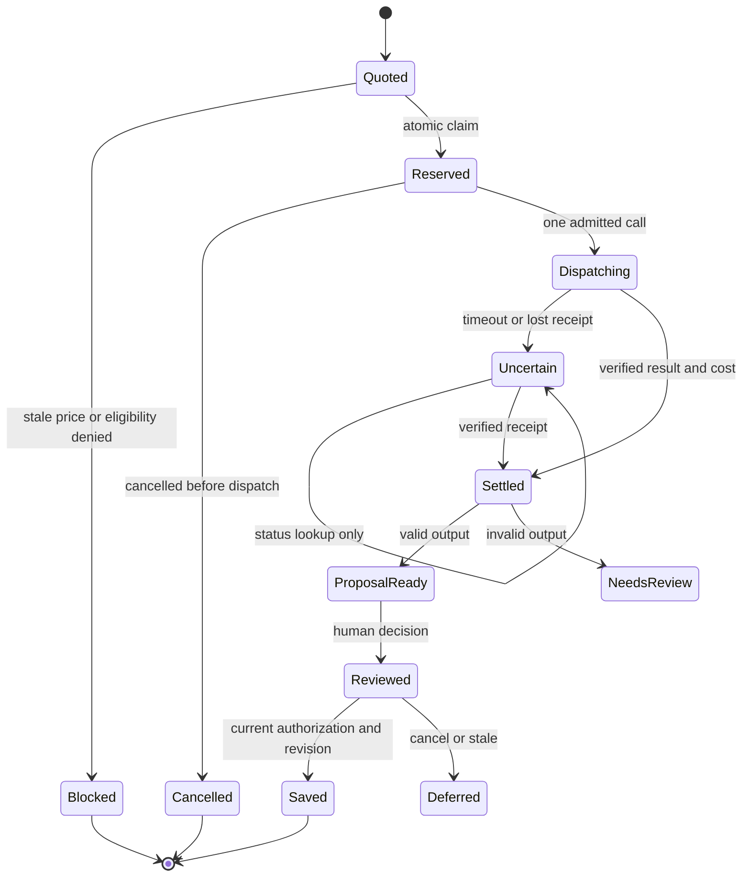
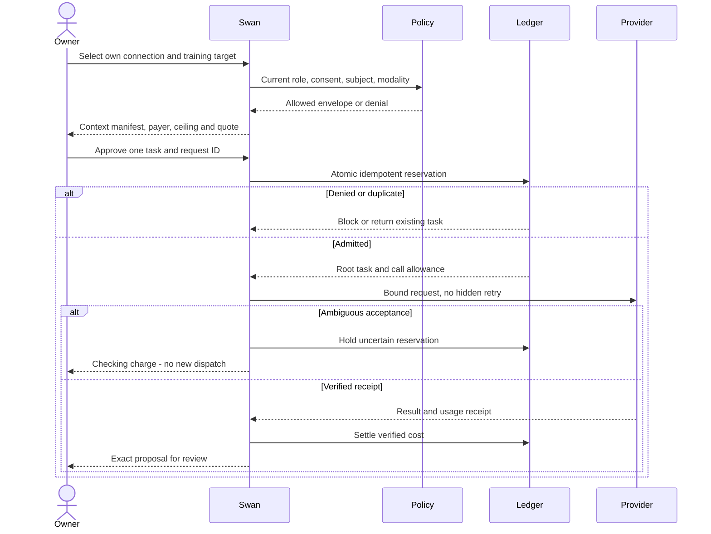

# Flow, state, sequence and data diagrams

Artifact: SWAN-AGENT-PLANNER-DIAGRAMS · v2.0 · 2026-09-06 · Owner: Sean
Status: proposed Mermaid source. See [contracts](02-agent-contracts.md).
Rendered preview: [five local diagrams](diagrams.html), using pinned Mermaid
11.12.0. No diagram content is submitted to an external rendering service.
These diagrams define planned behavior; they are not evidence that it runs.

## Training workflow, errors and rollback

## Durable proposal and device states

Device lifecycle: unpaired → pairing → connected → unknown → offline → reconnect.
Any non-revoked state can become revoked; re-pairing creates a new grant/key
binding. A delayed response from a revoked device never resurrects a cancelled job.

## Authorization and write sequence

## Proposed records and existing authority

## Privacy and trust boundaries

MCP does not control an arbitrary external agent's downstream model or network.
The dotted blocks are product requirements proved by managed-profile tests,
not a security boundary that Swan can impose on every customer's software.

## September 7–8 v2 addendum

The canonical direction is Training Studio with optional Program Map. Read 08-design-synthesis.md for the governing visual decisions, 09-model-connections-and-budgets.md for default Coach/personal OpenRouter/local policy and durable spending controls, and 10-coach-privacy-audit.md for current-source privacy gaps and release prerequisites. Earlier baseline results remain dated historical evidence. This pass changes the blueprint and synthetic preview only.

## V2 default Coach, personal credits and local dispatch

## V2 spend lifecycle

## V2 shared task reservation sequence

