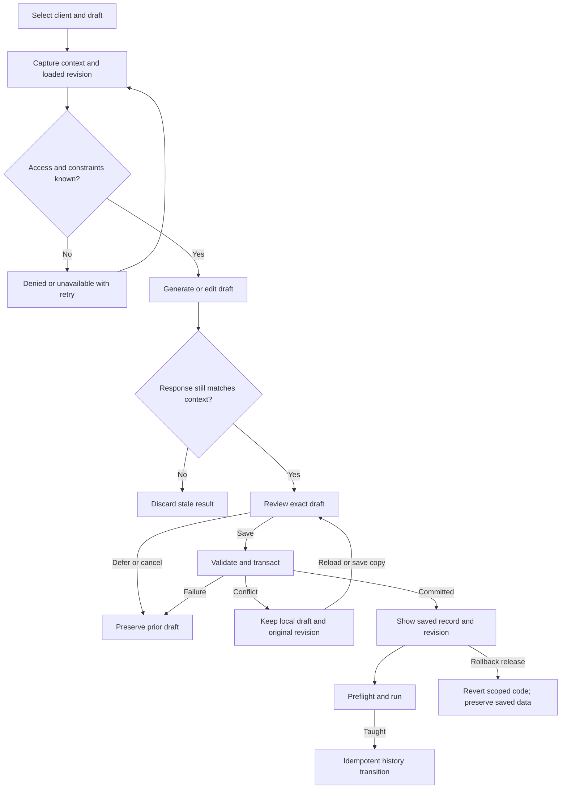
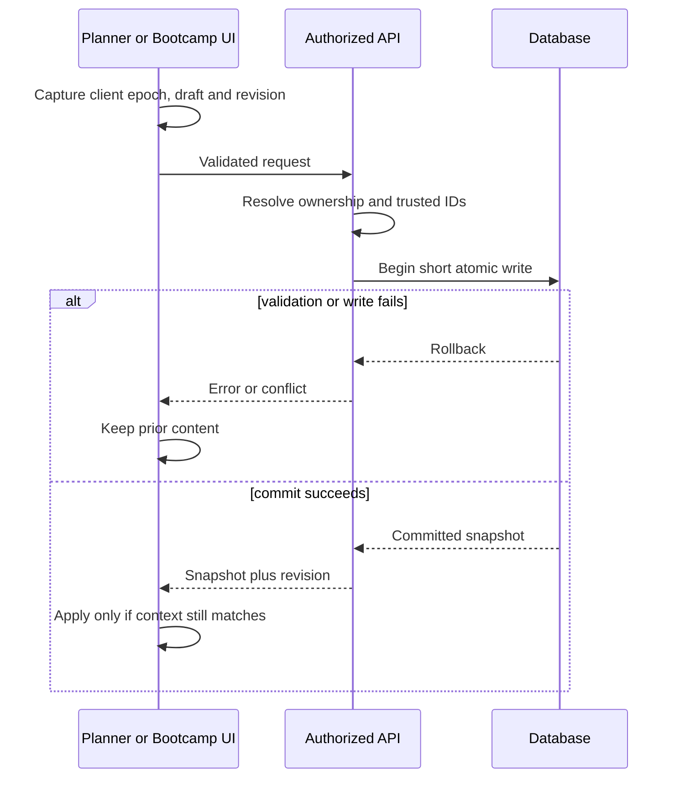
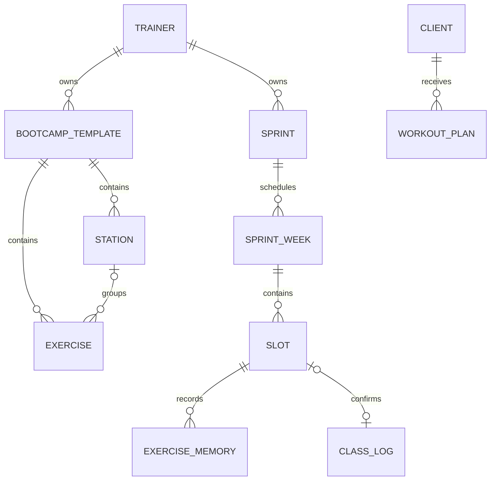

# Rolodex, Bootcamp, Sprint and Planner: reconciled repair contract

Artifact SWAN-AGENT-PLANNER-20260906-AUDIT-20260913 · Owner Sean · Architect Astra · Version 1

Status: AUDIT AND REPAIR PLAN IN PROGRESS. No application fixes, production writes, commits, pushes or deployments are represented by this document.

Authority: Sean requested an independent hostile review of the two pasted reviews, the associated components, missed defects, functional enhancements and UI/UX improvements, followed by repairs. This extends the existing Training Studio / optional Program Map packet. Its personal-agent/provider scope and C0 privacy gates remain separate; this task does not activate providers or purchase inference.

## Baseline and preservation

The caller directory is `C:/Users/BigotSmasher/Desktop/quick-pt/SS-PT`, which is not itself a Git checkout. The historical source is `C:/Users/BigotSmasher/Desktop/@Everything/quick-pt/SS-PT`, branch `wip/comms-notifications-2026-07-05`, HEAD `f8815a0b1dfba979da4707f3c20e4229009656aa`, with 185 tracked dirty entries at inspection. Both pasted reviews target this old branch.

At inspection, `HEAD...origin/main` had 599 commits unique to HEAD and 2,401 unique to main. This is divergent history, not a safe rebase or merge instruction. The existing canonical Planner packet already says to target the newer main implementation.

The isolated repair worktree is `C:/Users/BigotSmasher/Desktop/quick-pt/SS-PT/tmp/worktrees/rolodex-bootcamp-planner-20260913`, branch `codex/rolodex-bootcamp-planner-20260913`, baseline `c0cbe538d8ed2ca519bb494cdf3282bf43b76699`. No unrelated changes were imported. Dependency junctions reuse installed dependencies; no credentials or .env files were copied. Backend tests explicitly use a synthetic unreachable loopback database URL.

The original canonical packet was copied with SHA-256 equality checks for every regular file, excluding node_modules. The two attachments and original full report were copied without replacement. `tmp/rolodex-audit-evidence/preservation.json` records 73 copies. The installed portable snapshot additionally preserved 13 discovered planning artifacts, verified all 13 and restored two samples. Its manifest hash is `e645357042c361e171141a662282a7982fe8c047a1c0e344b5d99d6ae2c83dde`. This is local preservation, not remote backup.

Current baseline: 124 frontend files / 627 tests PASS; 36 backend files / 369 tests PASS. The initial frontend sandbox attempt failed at esbuild spawn EPERM; that is infrastructure failure, not a behavioral RED. Native worker execution passed. See the raw logs under `tmp/rolodex-audit-evidence`.

Canonical mounts remain `/dashboard/{admin,trainer}/workout-planner`, `/dashboard/{admin,trainer}/bootcamp`, and the Sprint routes declared by `UniversalDashboardLayout.routes.tsx`. `UniversalDashboardLayout.shellPieces.tsx` mounts the mapped components. `/api/exercises/library` remains the authenticated exercise reference contract. The removed client workout directory must not be rebuilt from stale review instructions.

## Audit verdict and disposition

REVISE. The green baseline misses important authorization, persistence, async-context and equipment/pain contracts. A claim of all four old P0s being broken in today's production cannot be carried forward: old-source evidence, new-source evidence and live behavior are different layers.

The detailed backend and frontend audit reports are preserved separately in this evidence set, with exact source lines and negative controls. This contract groups their findings without discarding them.

| Prior-review claim | Reconciled result on c0cbe538d |
|---|---|
| Bootcamp pain query uses nonexistent status column | Fixed in newer painAwareGating; new pain-target synonyms still fail |
| Bootcamp station targeting is universally case-broken | Old implementation replaced; newer targeting normalizes muscles |
| No Bootcamp taught/history UI | Stale: TaughtPanel and logging hook exist |
| Manual/hybrid profile prop missing | Stale: both props are wired; loading and matching remain wrong |
| Bootcamp regeneration always identical | Stale: sampled selection and exclusions exist |
| No LLM path / deterministic output always labeled AI | Stale: optional brain/provider code exists; runtime enablement not inferred |
| Old four frontend test failures persist | Not reproduced: newer scoped suite passes |
| Planner pain/equipment spelling mismatch | Confirmed; secondary-muscle and AND/OR semantics add further gaps |
| Sprint ownership gap | Confirmed; sibling generation-state and retry bugs also found |
| Sprint memory works | Rejected: current generated records omit the key the sprint reads |
| Deload, count distribution and seven-session window | Confirmed; prescription policy must be explicit |
| NASM library has no error/retry | Logger fixed; Planner/Bootcamp consumers discard shared error state |
| All provenance disappears on save | Too broad: class relaxation summary persists; critical exercise metadata does not |

## Requirements, acceptance and invariants

| ID | Outcome / measurable acceptance | Tests | Repair family (S1 server / S2 frontend; not review slices) |
|---|---|---|---|
| R-H01 | Submitted child IDs cannot redirect any write to another trainer's template; invalid class has zero writes | H01 | S1 |
| R-H02 | A template's parent and every child persist atomically; full-group/station classes reload with original counts, ordering and board identity | H02 | S1 |
| R-H03 | Sprint generate, reconnect and regenerate check normalized IDs and caller ownership before headers, job lookup or writes | H03 | S1 |
| R-H04 | Only one generation claimant owns a sprint; failure releases only its own claim; taught confirmation and history linkage happen once | H04 | S1 |
| R-H05 | Slot regeneration preserves old data on failure; canonical exercise memory survives resume and uses ordinal week numbers | H05 | S1 |
| R-H06 | Calendar-only schedule dates are timezone-independent and every displayed format resolves to its actual structure | H06 | S1 |
| R-H07 | Existing pain targets match canonical primary and secondary muscle tokens; unrecognized severe-pain targets remain visible | H07 | S1 |
| R-H08 | Equipment constraints distinguish absent, verified-empty, available and unavailable profiles; all required resources are present, while explicit alternatives stay OR | H08 | S1/S2 |
| R-H09 | Substitutions never reuse the source movement's demonstration, instructions or identity as proof of the replacement | H09 | S1/S2 |
| R-H10 | Planner requests can only apply to their initiating client and draft generation; older same-client requests cannot win | H10 | S2 |
| R-H11 | Prescription data round-trips, including non-70 intensity, zero rest, notes, tempo, identifiers and known metadata | H11 | S2 |
| R-H12 | Revision token stays paired to loaded content; 409/list refresh cannot authorize stale overwrite; activation does not clear dirty state | H12 | S2 |
| R-H13 | Delayed catalog loads and worker failure complete the latest search; all consumers expose failed/empty/filter-empty/retry distinctly | H13 | S2 |
| R-H14 | Failed or cancelled generation preserves prior draft; destructive structural change has confirm/undo; all persisted changes affect dirty state | H14 | S2 |
| R-H15 | Sprint HTTP errors, incomplete SSE, cancellation and route changes exit pending states without replaying generation POST | H15 | S2 |
| R-H16 | Floor PDF preserves main/alternative/low-impact board semantics, timing, rounds and one finisher occurrence | H16 | S2 |
| R-H17 | Sprint cards, slots and dialogs support keyboard activation, focus containment/restoration, Escape and named errors | H17 | S2 |
| R-H18 | Rolodex and save controls remain readable and usable across phone, desktop, QHD and 4K; missing media is concise and honest | H18 | S2 |
| R-H19 | Full-body count allocation does not drop the last movement families; registry respects stored movement patterns; rotation retains sessions | H19 | S1 |
| R-H20 | Progression and deload labels reflect actual prescribed data and never equate workload with impact eligibility | H20 | policy-dependent extension |
| R-H21 | Blend preserves UUID identifiers; invalid/empty IDs fail before dispatch | H21 | frontend identity |
| R-H22 | Next-action advice uses only client-plan facts actually loaded and does not assert another client's plan status from missing data | H22 | frontend identity |
| R-H23 | Run/Preflight navigation preserves the active class session; explicit restart is the only reset; pause reconciles elapsed deadlines | H23 | runner lifecycle |
| R-H24 | Late wake-lock acquisition is released after leaving Run; capability failures are visible; unmount clears all handles | H24 | runner lifecycle |
| R-H25 | Horizon rearrange/Undo checks the current content inside its state updater and cannot overwrite newer edits | H25 | frontend identity |
| R-H26 | Provider input uses validated enums, opaque exercise tokens and bounded nonidentifying decision facts; unsupported text never reaches dispatch | H26 | provider boundary |
| R-H27 | Timeout aborts a supported provider request; late results are discarded; unsupported cancellation is disclosed with bounded concurrency | H27 | provider boundary |
| R-H28 | Attendance writes one actually selected movement per slot, passes canonical validation, derives valid duration, and rolls back on failure | H28 | server history |
| R-H29 | Retried taught-log requests share one stable operation identity and one history/attendance effect; prescribed and measured work stay distinct | H29 | server history |
| R-H30 | Every acknowledged Bootcamp command option matches the accepted generation contract, or returns an explicit unsupported/invalid result | H30 | command contract |

Forbidden effects: no real-client test generation or saves; no production schema changes; no secret or medical-data egress; no inference fallback or provider activation; no overwrite of unrelated work; no broad deletes/staging; no weakening of permissions/revision/pain gates; no reclassification of absent review as approval.

## Architecture and implementation contracts

### Template and Sprint write boundaries

Routes validate finite positive IDs and input shape. Service functions own authorization and may be called by routes or internal callers; do not protect only one HTTP path. A trainer may mutate only owned objects; admin behavior follows the existing role policy explicitly. SSE ownership checks happen before flushing headers or revealing job state.

Template save uses explicit parent/child allowlists. Server-created IDs and foreign keys never come from spread payloads. Validate each station reference before starting the transaction. Use one short transaction for parent and all children, and return only after commit. Any required JSON/migration extension is an additive, separately verified schema slice, not a raw unrecognized ORM attribute. Existing associations must return full-group root exercises as well as station exercises without duplication.

Generation is outside database transactions. Acquire a status+version claim; all post-claim setup belongs under error cleanup. Each completed slot and its exercise memory commit together. A failed regeneration preserves its old slot/memory. Resume seeds memory from already generated/taught slots. Finalization is conditional on the owned version. Repeated taught confirmation is an idempotent transition, with one count increment and one linked class log. A retained generating state requires an explicit recovery/lease design; a time-based retry must not guess that another worker stopped.

Use UTC/calendar-only dates end to end. Validate frequency/focus nonempty lists and supported duration before scaffolding. Maintain explicit legacy-format aliases; never label a 4x4 fallback as a requested 3x5 class.

### Shared vocabulary and substitution truth

Prefer extending the existing ontology/taxonomy boundary with one pure shared vocabulary contract rather than rewriting the exercise endpoint. Preserve raw display labels; canonical tokens are for comparisons. Primary AND secondary muscles participate in existing severe-pain exclusions. Unknown mapping produces an honest unresolved warning, never a claim of safety.

Equipment arrays have inconsistent historical semantics. Catalog equipmentNeeded expresses requirements; legacy rows such as face_pulls and goblet_squat encode alternatives. Add explicit requirement groups / alternatives at normalization. A bench plus barbell requires both; a dumbbell-or-kettlebell movement accepts either; a bodyweight token cannot erase an additional mandatory rack. Do not mechanically replace every some() with every(). Match known aliases exactly, not generic substrings such as ball or machine. Retain the selected profile constraint after bridge failure/fallback. No-profile open-gym behavior and verified-empty bodyweight behavior must remain distinct.

A renamed substitution has source identity and replacement identity separately. If the replacement cannot be resolved to a verified library exercise, clear the source demo/instructions/equipment/muscle claims and mark details unverified. A knee modification must not fall back to an unrelated shoulder modification as evidence of knee suitability. Reload cannot rehydrate the source video as replacement media.

### Planner context, revision and persistence

Introduce a shared client/draft context epoch. Every generate/load/guided/safety/backup/blend/save response captures that identity, then checks it before UI writes. Latest-operation sequence handles same-client out-of-order completion. Client change and draft replacement advance the epoch. Aborting a network request is optional optimization; discarding stale results is mandatory. Do not claim a cancelled request undid an already completed server save.

Loaded content, loaded plan ID and expected contentRevision form one snapshot. A saved-plan list refresh never changes that snapshot. On 409 preserve the local draft; present reload-saved or save-as-copy resolution and keep the old revision until the user explicitly adopts a new baseline. Status-only activation preserves dirty content. Build dirty signatures from normalized persisted semantics, including deleting the last exercise.

Save typed intensity metadata while accepting old intensityGuideline values. Parse only supported percentages; preserve unknown original prescription text without presenting an invented numeric value as saved truth. Do not fill unknown source metadata with false labels. Existing zero values must survive nullish compatibility handling.

### Search, streaming, PDF and visual states

Separate exercise loading from query state. Search reacts to cache revision/query/category. Worker messages carry an operation ID; stale results are dropped. On worker error replay the current query synchronously and clear pending state. Use the same scoring core for worker and sync fallback. Propagate library failure/retry to Planner and Bootcamp, not only Logger. Keep `/api/exercises/library` authoritative.

Sprint streaming validates status/content type, parses complete frames, and requires a terminal event. EOF/missing body/malformed terminal state becomes retryable interruption. Own cancellation in the page's lifecycle; ignore callbacks for departed sprints. Reconnect may use the authorized GET stream; never silently issue a second POST.

PDF receives a normalized floor-script model: main stations in station/sort order, rounds/timing, finishers exactly once, and alternatives labeled as substitutions. Use the same compiled duration as Preflight/Run; PDF is not an independent timing calculator.

## Wireframes and interaction states

Direction: retain the Training Studio workbench; make client, draft and constraint truth visible at the action that depends on them. Signature feedback is the existing saved-record treatment, not an additional celebration system. Keep world/lens token consumption, 44px controls, focus rings, reduced motion and calm data surfaces. This is a targeted repair/polish pass, not a new theme or navigation hierarchy.

Desktop, 1440px and above:

```text
┌ Client ▾  Phase ▾  Scope ▾                  Draft / saved revision ┐
├ Generate  Advanced               Saving / Conflict / Saved status ┤
├ Rolodex (380–420px) ┬ Session / Program          ┬ Inspector      ┤
│ Search + filters   │ [Main exercise + sets]     │ Constraints    │
│ Equipment verified │ [Main exercise + sets]     │ Why / options  │
│ Image | name | Add │ [Substitution disclosure]  │                │
│ No demo (one badge)│                             │                │
├ Library error + Retry / filter-empty + Clear filters              ┤
└ Client + draft name · Unsaved changes       Save / Save as copy    ┘
```

Mobile, 320–414px:

```text
┌ Client ▾    Draft state ┐
│ Session | Program      │
│ Generate   Advanced    │
│ Equipment checking…    │
│ [exercise prescription]│
│ [exercise prescription]│
│ Exercises (sheet)      │
└ Unsaved · Save (44px+) ┘
  Library sheet: title + Close; Search; active filters;
  compact name/equipment rows + Details + Add; error/Retry.
```

Bootcamp keeps Build → Preflight → Run. Preflight rows show occupancy, required equipment, runtime and substitution readiness. A failing row focuses its corresponding setting/station. Sprint timeline cards show calendar date, focus, planned/generated/taught state and an explicit retryable error. Native buttons replace pointer-only divs.

| State | Required visible feedback and interaction |
|---|---|
| Loading | Library skeleton or equipment-check status; dependent add actions disabled with reason |
| Empty catalog | No exercises in library; do not call it no search matches |
| Filter-empty | No matching exercises; preserve search and offer Clear filters |
| Partial | Keep prior draft/catalog; name missing intelligence/media/profile truth |
| Success | Saved revision and saved content agree; completion never attaches to another client |
| Denied | Role/object access message; no object details leaked; safe return navigation |
| Validation error | Inline named field error, focus first invalid field, keep inputs |
| Failure | Inline retryable error near action; preserve previous content |
| Conflict | Keep local draft; explain newer saved version; Reload saved or Save as copy |
| Cancel/defer | Close inspection/stop listening; preserve draft; do not imply backend work undone |
| Recovery | Explicit reconnect/reload; no automatic duplicate writes |

Keyboard: dialog focus enters at title/first field, Tab stays within dialog, Escape cancels, closing restores trigger focus. Day/focus choices use pressed/selected semantics. Errors use a live region without stealing focus repeatedly. At 200% zoom controls wrap; sticky save bars must not cover last content. At 2560/3840 widths cap reading width rather than stretch prescription rows across the screen.

## Mermaid: state, sequence, data and trust boundaries







State and trust-boundary applicability: async context epochs and generation claims are explicit state machines; transactions and SSE need sequence contracts; existing relational associations need ERD and rollback analysis. No new ML model, calibration dataset, infrastructure deployment or public agent capability is included. Pseudonymous synthetic fixtures stay local; any optional review payload includes source/contract only, never live client/medical records or browser extracts.

| Actor | Library | Own trainer template/sprint | Another trainer object | Client plan |
|---|---|---|---|---|
| Unauthenticated | Deny | Deny | Deny | Deny |
| Client | Existing authenticated read contract | Deny | Deny | Existing self/feature gate only |
| Trainer | Read | Authorized CRUD/job access | Deny before lookup/events | Active assignment gate |
| Admin | Read | Existing admin policy | Explicit admin policy | Existing authorized admin policy |

## Tests and traceability

H01–H30 map one-to-one to requirements above. Each test suite must execute actual production helpers, hooks or service functions with synthetic dependencies; source-string expectations alone cannot certify authorization, transactionality, stale-response discard or SSE behavior. Existing green tests remain in the normal suite; intentional RED tests use a separately selected acceptance configuration. The supplemental reports expand F1 to backup and Coach result paths; those are part of H10 and may not be silently omitted from its closure.

Baseline commands from their respective frontend/backend directories:

```text
node node_modules/vitest/vitest.mjs run src/components/BootcampBuilder src/components/SprintPlanner src/components/DashBoard/Pages/admin-workout-planner src/hooks/BootcampSprintAuthPipeline.truth.test.ts --maxWorkers=2 --reporter=dot
node node_modules/vitest/vitest.mjs run __tests__/workoutBuilder tests/unit/bootcamp tests/unit/workoutBuilder tests/api/sprintRoutesSecurity.test.mjs tests/api/bootcamp --maxWorkers=2 --reporter=dot
```

Required targeted fixtures: cross-trainer child FK injection; late child failure rollback; full-group save/reload; duplicate/concurrent taught confirmation; competing claim with newer version; string route IDs; DST/calendar-only dates; legacy format; chest/pectorals, traps/trapezius, lats/latissimus and secondary muscles; bench+barbell and explicit dumbbell-or-kettlebell; unavailable profile; renamed knee alternative retaining jump video; A→B and A-old→A-new deferred responses; 409 then list refresh; activate while dirty; 40/70/85% roundtrip; deleting final exercise; library load while typing; worker crash/stale result; initial JSON SSE error and incomplete EOF; PDF substitution board and finisher counting; keyboard modal lifecycle.

Real-boundary gaps remain explicit: mocks do not prove PostgreSQL row locks/rollback, migrations, production authorization, provider identity, actual media reachability or live save/reload. Before release use a positively identified disposable database for transaction/race/restore tests and a synthetic authenticated browser harness on this exact worktree. Never run integration tests against local dev's production database.

Performance budgets: one initial library fetch per mounted consumer, no query-triggered duplicate fetches, latest search settles after worker failure; bounded visible rows and stable 44px actions; no repeated POST on stream reconnect; no provider call inside a transaction; generation operates slot-by-slot with bounded payload/progress updates. Measure device/search/render latency before claiming a numeric runtime improvement.

## Slices, operations and review

The initial idea of treating all server work as one slice and all frontend work as another is rejected as too broad. S1/S2 in the requirement table now identify repair families only. The bounded implementation steps and their logical review groups are specified in 13-server-repair-contract.md and 14-frontend-repair-contract.md. Do not merge unrelated changes merely to fit the default twelve-call ceiling. Review budget/cadence must be resolved before enrollment; the proposed final-Astra task override remains pending. H20's numeric prescription and compatibility choices are specified in the server contract and must never equate impact with workload.

Entry evidence: preserved source/plan, exact source scope, actual RED probes, green baseline and valid readiness/controller evidence. Exit evidence: relevant GREEN tests, unchanged forbidden boundaries, reviewed diff and current-revision review results. Final combined regression reruns the union plus type checking, build, diagram validation, responsive and keyboard checks. A release also requires actual DB/schema and authenticated browser evidence.

Operational owner: Sean. Rollback code by exact scoped diff/commit after review; do not roll back unrelated work or delete generated client history. No deployment is authorized in this pass. Any schema extension must include down/compatibility and isolated restore evidence; no migration runs by implication. Diagnostics report reason codes, operation state and counts, not client names, medical entries or credentials.

The initial hostile reviewers were native Astra subagents with explicit `gpt-6-astra`/`xhigh` dispatches. Their source reviews are advisory evidence, not application approval. No fresh GLM request was made. Existing GLM guard showed 11/15 rounds consumed and no active lock; live subscription UI showed remaining allowance. Those observations are preflight metadata, not complete review receipts.

Review timing clarification is pending: the existing 11-build-workflow.md selects per-slice GLM → Flash → Astra; Sean was offered that route or Luna builds with combined Astra review/repair. No unanswered choice is an override. Native tools expose requested model dispatch but do not report served-model identity/token counts; preserve those as unknown instead of fabricating strict schema-3 actor receipts. Controller/native-hook evidence must be established honestly before claiming plan-ready or implementation-verified status.

Completed source review and executable RED evidence are indexed in 15-audit-findings-and-fix-register.md. The current audit-readiness.json explicitly records the native metadata/cadence blockers. The next application step remains Luna's bounded server ownership/atomicity repair after honest controller enrollment. Sean has already authorized implementation; the pending decision concerns its local review configuration, not whether the requested product work is wanted. No application source has changed at this revision.
