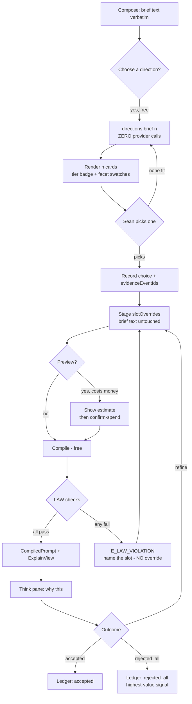
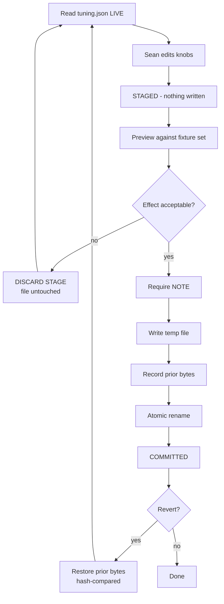
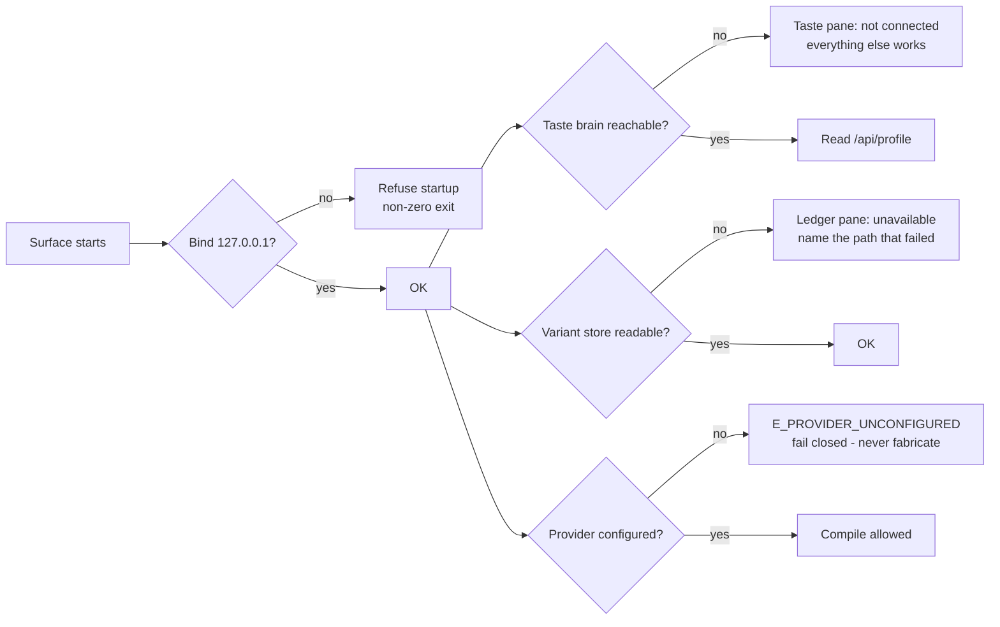
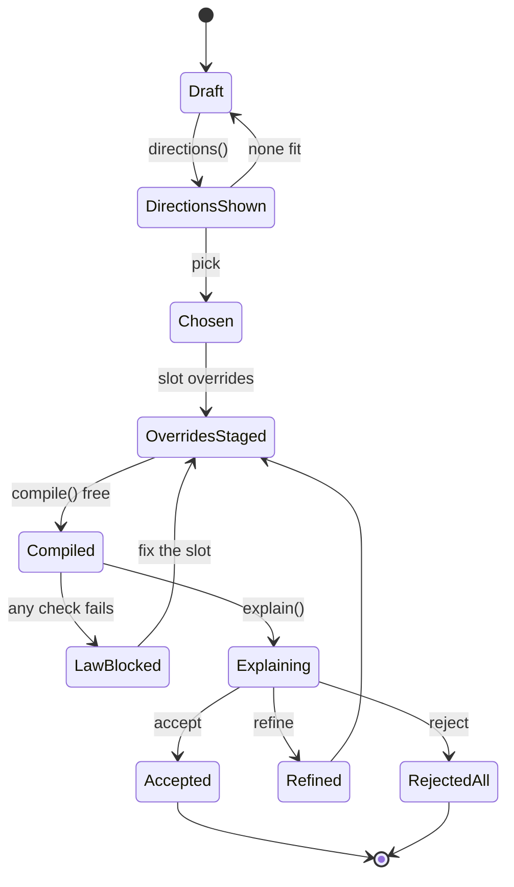
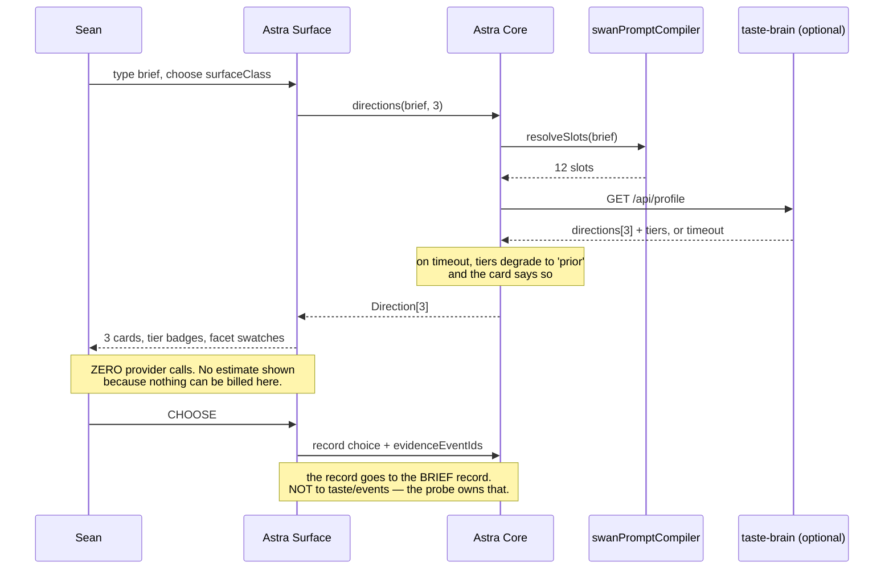
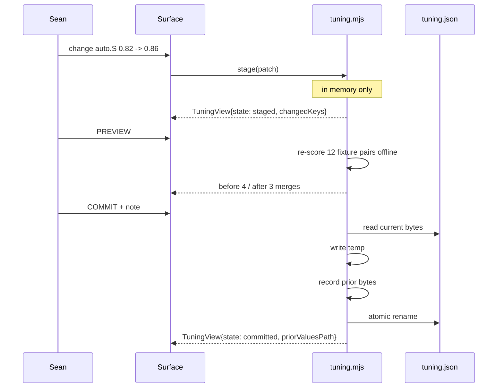
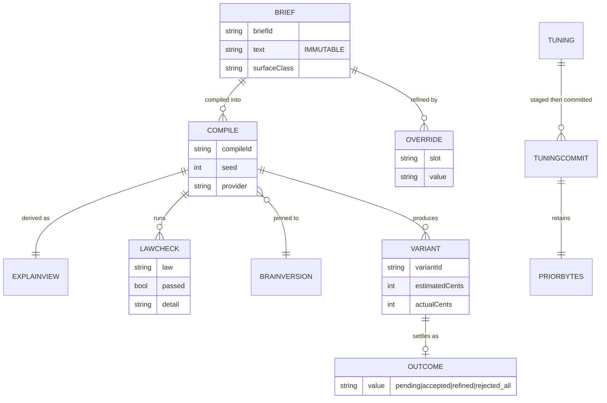

# Astra — Interface, Flows and Contracts

---

## 1. Layout and routes

Single window, left rail + main pane. Loopback only: `http://127.0.0.1:7411/`.

| Route | Pane | Method |
|---|---|---|
| `/` | Compose (default) | GET |
| `/choose` | Choose — Gate 0 directions | GET |
| `/think/:compileId` | Think — the explanation | GET |
| `/tune` | Tune — staged knobs | GET |
| `/law` | Law — the guardrail board | GET |
| `/state` | State — honest capability board | GET |
| `/ledger` | Ledger — rejected_all + cost drift | GET |
| `/api/directions` | directions(brief, n) | POST |
| `/api/compile` | compile with overrides | POST · token |
| `/api/explain/:id` | ExplainView | GET |
| `/api/tuning` | read knobs | GET |
| `/api/tuning/stage` | stage a patch (no write) | POST · token |
| `/api/tuning/commit` | atomic write + note | POST · token |
| `/api/tuning/revert` | restore prior bytes | POST · token |
| `/api/capabilities` | the honest board | GET |
| `/api/reject` | record `rejected_all` | POST · token |
| `/api/profile` | proxy to taste brain (optional) | GET |

Port **7411** is chosen to sit beside, not collide with, the taste probe on **7331**.

---

## 2. Wireframes

### 2.1 Compose + Choose (desktop, the default screen)

```
┌──────────────────────────────────────────────────────────────────────────────────────┐
│ ASTRA · Design Brain Console          brainVersion 0.2.0 · 127.0.0.1 · [STATE] ●ok   │
├───────────┬──────────────────────────────────────────────────────────────────────────┤
│ COMPOSE   │  BRIEF  (verbatim · immutable · rev 3)                    [DIAL: fields]  │
│ CHOOSE ◀  │  ┌────────────────────────────────────────────────────────────────────┐  │
│ THINK     │  │ a frozen lake at dawn, low vantage, the ice breathing             │  │
│ TUNE      │  └────────────────────────────────────────────────────────────────────┘  │
│ LAW       │  intent [hero ▾]   aspect [16:9 ▾]   surfaceClass [public ▾]  seed [auto]│
│ STATE     │                                                                          │
│ LEDGER    │  DIRECTIONS — Gate 0 · ZERO COST · nothing generated yet                 │
│           │  ┌───────────────────────┐ ┌───────────────────────┐ ┌────────────────┐  │
│           │  │ [EVIDENCE]            │ │ [PRIOR]               │ │ [PRIOR]        │  │
│           │  │ Glacier Cathedral     │ │ Slow Water            │ │ Iron Dawn      │  │
│           │  │ a nave of ice; light  │ │ melt as subject; the  │ │ horizon split  │  │
│           │  │ bending through melt  │ │ ONE impossible thing: │ │ by a dark      │  │
│           │  │ seams                 │ │ stillness that moves  │ │ occluder       │  │
│           │  │ ▓▓▓▓▓▓▓▓▓▓  facets    │ │ ▓▓▓▓▓▓▓▓▓▓  facets   │ │ ▓▓▓▓▓▓▓▓ facets│  │
│           │  │ palette: A-swan-native│ │ palette: B-world      │ │ palette: A     │  │
│           │  │                       │ │ from themes.md — not  │ │                │  │
│           │  │                       │ │ yet backed by picks   │ │                │  │
│           │  │ [CHOOSE] [PREVIEW $]  │ │ [CHOOSE] [PREVIEW $]  │ │ [CHOOSE] ...   │  │
│           │  └───────────────────────┘ └───────────────────────┘ └────────────────┘  │
│           │  ── 12 SLOTS (override layer — the brief above never changes) ──────────  │
│           │  1 intent      hero           7 light        low-key, 4200K, raking      │
│           │  2 subject     (deliberately  8 palette      #… #… #… (dominance order)  │
│           │                empty — pure   9 material     melt-scarred, wet black     │
│           │                phenomenon)   10 abstraction mid                          │
│           │  3 medium      photograph     11 negative    (kill-list applied)        │
│           │  4 styleAnchor personify()    12 output      16:9, opaque, 2×            │
│           │  5 composition low-vantage    6 optics       35mm f/2, 1/250, Portra    │
│           │  [STAGE OVERRIDES]   [RESET]                                              │
└───────────┴──────────────────────────────────────────────────────────────────────────┘
```

**Deliberate detail:** the brief is labelled *verbatim · immutable*, and slot 2 renders as
*"(deliberately empty — pure phenomenon)"* rather than a dash. The contract says slot 2 is *"often
deliberately empty"*; a blank cell would read as a bug. (`AC1.1`)

### 2.2 Think — the explanation (`/think/:compileId`)

```
┌──────────────────────────────────────────────────────────────────────────────────────┐
│ ◀ COMPOSE     THINK · compile 7f3a91c2 · brainVersion 0.2.0 · seed 8814 · gemini     │
├──────────────────────────────────────────────────────────────────────────────────────┤
│  RESOLVED SLOTS                        LAW CHECKS — 6 run, 6 passed                  │
│  1 intent      hero                    ✓ kill-list            no match               │
│  2 subject     (empty, phenomenon)     ✓ gold allowlist       none used              │
│  3 medium      photograph              ✓ LAW 4 optics         no literal creature    │
│  4 styleAnchor Anton Corbijn's         ✓ banned facets        none                  │
│                classical photograph    ✓ content law          clean                  │
│                of a frozen lake        ✓ Galaxy-Swan retired  no retired hex        │
│  5 composition low-vantage                                                          │
│  6 optics      35mm f/2 · Portra       FACETS APPLIED (3)                            │
│  7 light       low-key, 4200K          Temperature>Arctic · Mark>FineLines ·         │
│  8 palette     #E8EEF2 #0B1220 #C8A2   Surface>MeltScar                              │
│  9 material    melt-scarred black                                                   │
│ 10 abstraction mid                     CAPABILITIES (target: gemini)                 │
│ 11 negative    (kill-list, 5 entries)  honorsNegativePrompt  claimed → treated false │
│ 12 output      16:9 · opaque · 2×      seedIsDeterministic   verified                │
│                                        supportsInpainting    false                   │
│  COMPILED PROMPT                                        [COPY]  [WHY NOT?]            │
│  ┌──────────────────────────────────────────────────────────────────────────────┐   │
│  │ Anton Corbijn's classical photograph of a frozen lake at dawn, low vantage…   │   │
│  └──────────────────────────────────────────────────────────────────────────────┘   │
│  ── THIS RUN ──  outcome: pending   est 0.4¢   actual —   [MARK REJECTED-ALL]        │
└──────────────────────────────────────────────────────────────────────────────────────┘
```

`honorsNegativePrompt claimed → treated false` is rendered verbatim, because the compiler treats
`'claimed'` as `false` and a console that showed "claimed" without the consequence would mislead.
(`AC5.3`)

### 2.3 Tune — staged knobs (`/tune`)

```
┌──────────────────────────────────────────────────────────────────────────────────────┐
│ TUNE · scripts/design-brain/config/tuning.json          [DIAL]   state: STAGED (2)    │
├──────────────────────────────────────────────────────────────────────────────────────┤
│  KNOB              CURRENT     STAGED     PREVIEW EFFECT (fixture set: 12 pairs)      │
│  auto.S              0.82       0.86  →   auto-merges 4/12 → 3/12   (−1)              │
│  auto.O              0.60       0.60      unchanged                                   │
│  auto.margin         0.10       0.10      unchanged                                   │
│  auto.minTokens         3          3      unchanged                                   │
│  mergeBand.low       0.55       0.55      unchanged                                   │
│  weights.jaccard     0.35       0.35      unchanged                                   │
│  weights.overlap     0.50       0.50      unchanged                                   │
│  weights.trigram     0.15       0.15      unchanged                                   │
│  novelty.window         3          3      unchanged                                   │
│  novelty.productive  0.25       0.25      unchanged                                   │
│  novelty.tappedOut   0.10       0.10      unchanged                                   │
│  novelty.minKnown..     6          6      unchanged                                   │
│  novelty.minWindow..   12         12      unchanged                                   │
│                                                                                       │
│  ⚠ BLAST RADIUS  auto.S feeds the auto-corroboration gate. Raising it means fewer     │
│    claims merge without review. It does not touch the LAW filter or any token.        │
│  NOTE (required) ┌──────────────────────────────────────────────────────────────┐    │
│                  │ tighter auto-merge after the 2026-09-25 precision pass        │    │
│                  └──────────────────────────────────────────────────────────────┘    │
│  [PREVIEW]  [COMMIT (atomic + note)]  [DISCARD STAGE]      prior values recorded ✓    │
└──────────────────────────────────────────────────────────────────────────────────────┘
```

Three visibly distinct states: **LIVE** (matches disk) · **STAGED** (differs, not written) ·
**COMMITTED** (written, prior bytes retained). (`AC4.2`)

### 2.4 State — the honest board (`/state`)

```
┌──────────────────────────────────────────────────────────────────────────────────────┐
│ STATE · what is actually switched on          source: code + config, not prose       │
├──────────────────────────────────────────────────────────────────────────────────────┤
│  ACTIVE        compileImage · resolveSlots · personify · FACETS · serializers         │
│                directions (A1) · explain (A1) · tuning read · variants read           │
│  REFUSED       synthesize · corroborate · adjudicate · emit-vault · log-receipt       │
│                reason: non-operational until the signed source-classification         │
│                authority adapter supplies signed claim decisions                      │
│  RETIRED       attest · redact-provenance · log-spec   (retirement adapters,          │
│                fail closed)                                                           │
│  SPEC MODE     enabled: false   (config/spec-mode.json)  · no control to change it    │
│  TASTE         swan-taste-brain @ 127.0.0.1:7331   ● not connected                    │
│                                                                                       │
│  No control on this pane enables a refused lane. That is a design decision, not a     │
│  missing feature.                                                                     │
└──────────────────────────────────────────────────────────────────────────────────────┘
```

### 2.5 Narrow (≤ 560 px)

```
┌─────────────────────────────┐
│ ASTRA 0.2.0      [☰]  ●ok   │
├─────────────────────────────┤
│ BRIEF (verbatim · rev 3)    │
│ ┌─────────────────────────┐ │
│ │ a frozen lake at dawn…  │ │
│ └─────────────────────────┘ │
│ [EVIDENCE] Glacier Cathedral│
│ ▓▓▓▓▓▓▓▓ facets             │
│ [CHOOSE] [PREVIEW $0.4¢]    │
│ ─────────────────────────── │
│ [PRIOR] Slow Water          │
│ from themes.md — not yet    │
│ backed by your picks        │
│ [CHOOSE] [PREVIEW $0.4¢]    │
└─────────────────────────────┘
```
Rail collapses to `[☰]`. Directions stack. The tier badge and the palette line are **never** hidden by
the collapse — they are the load-bearing information. (`AC2.2`)

### 2.6 Required states (every pane must define all of these)

| State | Appearance | Copy rule |
|---|---|---|
| **loading** | skeleton rows, no spinner-only | names what is loading |
| **empty** | the reason it is empty | "no compiles yet — start in Compose", never a bare "No data" |
| **partial** | banner: "3 of 5 lawChecks shown — the rest failed to load" | never silently truncate |
| **success** | the content | — |
| **denied** | 401/403 explained | "this is a write; the console needs the mutation token" |
| **validation-error** | field-level, names the slot | — |
| **failure** | the error code verbatim (`E_LAW_VIOLATION` + slot) | never a generic "Something went wrong" |
| **retry/recovery** | one action, labelled with what it will redo | — |
| **keyboard/focus** | every control reachable, visible focus ring | no focus trap |
| **responsive** | §2.5 | — |

---

## 3. Flows (Mermaid source — **unrendered in this environment**)

### 3.1 The main loop



### 3.2 Tuning commit — the rollback path



### 3.3 Blocked / degraded paths



---

## 4. Contracts

### 4.1 Core types (Astra's own; the brain's types are the brain's)

```ts
type Tier = 'evidence' | 'prior';

interface Direction {            // the missing contract function, implemented in A1
  name: string;                  // evocative — "Glacier Cathedral"
  sentence: string;              // mood, hierarchy, the ONE impossible phenomenon
  phenomenon: string;            // the single impossible thing — load-bearing
  facets: string[];              // drives the deterministic swatch strip; no gen cost
  paletteLaw: 'A-swan-native' | 'B-world-native';
  tier: Tier;                    // 'evidence' requires >=2 of Sean's own picks, ids cited
  evidenceEventIds?: string[];   // present iff tier === 'evidence'
}

interface ExplainView {          // derived ONLY from the compile result — never a second log
  compileId: string;
  brainVersion: string;          // read at run time, never a literal
  seed: number;
  provider: string;
  modelVersion: string;
  slots: Record<string, string>; // 12 keys
  emptySlots: string[];          // slots deliberately empty, with the reason rendered
  facetsApplied: string[];
  lawChecks: { law: string; passed: boolean; detail?: string }[];   // EVERY check
  capabilities: Record<string, 'verified' | 'claimed' | 'false'>;
  promptText: string;
}

type TuningState = 'live' | 'staged' | 'committed';

interface TuningView {
  state: TuningState;
  current: Record<string, number>;   // read from disk
  staged: Record<string, number>;    // diff vs current
  changedKeys: string[];
  preview?: { fixture: string; before: number; after: number; delta: number }[];
  blastRadius: string[];             // engine behaviours the changed keys feed
  priorValuesPath?: string;          // set once committed
}

interface LaneState { lane: string; status: 'ACTIVE'|'REFUSED'|'RETIRED'; reason: string; source: string }
```

### 4.2 HTTP contract

| Endpoint | Request | Response | Auth | Notes |
|---|---|---|---|---|
| `POST /api/directions` | `{ text, intent, aspect, surfaceClass, n }` | `Direction[]` | none | **must make zero provider calls** |
| `POST /api/compile` | `{ briefId, slotOverrides, seed? }` | `CompiledPrompt` | token | free; no generation |
| `POST /api/preview` | `{ compileId, confirmSpend: true }` | `{ estimatedCents, basis }` → job | token | **the only billing endpoint** |
| `GET /api/explain/:id` | — | `ExplainView` | none | |
| `GET /api/tuning` | — | `TuningView` | none | |
| `POST /api/tuning/stage` | `{ patch }` | `TuningView` | token | writes nothing |
| `POST /api/tuning/commit` | `{ note }` | `TuningView` | token | atomic; prior bytes kept |
| `POST /api/tuning/revert` | — | `TuningView` | token | hash-compared restore |
| `GET /api/capabilities` | — | `LaneState[]` | none | |
| `POST /api/reject` | `{ compileId }` | `{ ok }` | token | records `rejected_all` |
| `GET /api/profile` | — | taste profile | none | proxy; optional |

### 4.3 Error contract

| Code | Meaning | Surface behaviour |
|---|---|---|
| `E_LAW_VIOLATION` | a LAW check failed | name the offending slot; offer **no** override |
| `E_IMAGE_FIRST_REQUIRED` | video compile without an init image | explain, link to the image step |
| `E_CAPABILITY_UNVERIFIED` | a required capability is `claimed` | name the capability, say `claimed` ≠ verified |
| `E_BRAIN_VERSION_MISMATCH` | consumer pinned a different version | show both versions; refuse silently proceeding |
| `E_PROVIDER_UNCONFIGURED` | no provider | fail closed; **never** fabricate media |
| `E_NOT_LOOPBACK` | bind address was not `127.0.0.1` | refuse startup, exit non-zero |

### 4.4 MCP tools (A7 — read, plus exactly one guarded write)

```
brain.directions(brief, n)        read   free
brain.compile(brief, overrides)   read   free, returns lawChecks
brain.explain(compileId)          read
brain.capabilities()              read   the honest board
brain.tuning.get()                read
brain.tuning.preview(patch)       read   NO write
brain.worlds()                    read   18 DNA recipes + seeded roulette
brain.doctrine(query)             read   corpus search
brain.reject(compileId, confirm)  WRITE  requires confirm: true
```

**Forbidden in the MCP surface:** any tool returning image bytes, provider credentials, or taste event
files; any write without `confirm`; any tool that changes canon or spec mode.

---

## 5. State and sequence

### 5.1 Compile state machine



### 5.2 Sequence — a direction choice, zero spend



### 5.3 Sequence — tuning commit



---

## 6. Data model, permissions and trust boundaries

### 6.1 What Astra reads and writes (ERD)



### 6.2 Permissions / authority matrix

| Actor | Read corpus | Read tuning | Write tuning | Compile | Preview (spend) | Write taste | Change canon | Enable spec |
|---|---|---|---|---|---|---|---|---|
| **Sean** (operator) | yes | yes | yes (via dial) | yes | yes | via probe only | **propose** | **propose** |
| **Astra surface** | yes | yes | staged→committed | yes | only with explicit confirm | **never** | no | no |
| **Astra MCP** | yes | yes | **no** | yes | no | never | no | no |
| **Builder agent** | yes | yes | no | yes | no | never | propose | propose |
| **Reviewer agent** | yes | yes | no | yes | no | never | no | no |

**No actor enables a REFUSED lane or spec mode through Astra.** Activation requires signed approval
outside this surface.

### 6.3 Trust boundaries

| Boundary | Crossing | Control |
|---|---|---|
| Browser ↔ Astra | loopback HTTP | `127.0.0.1` bind only; token + `SameSite=Strict` on mutations |
| Astra ↔ brain | in-process import | same process; no network |
| Astra ↔ taste repo | loopback HTTP, read-only | never writes; degrades on timeout |
| Astra ↔ provider | **never direct** | all provider work goes through the existing session/authority layer |
| Astra ↔ canon | read-only | proposal artifact only |

**Loopback is not authentication.** Any local process can reach `127.0.0.1:7411`. That is accepted for
reads (as the taste probe accepts it) and is why every mutation carries a token — the same fix the
NIGHTSHIFT build landed for its own local server.
