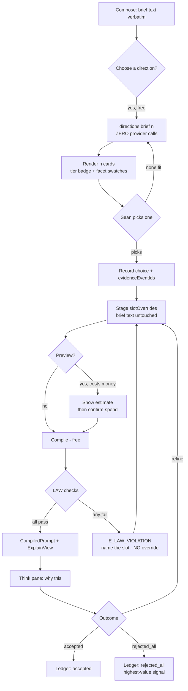
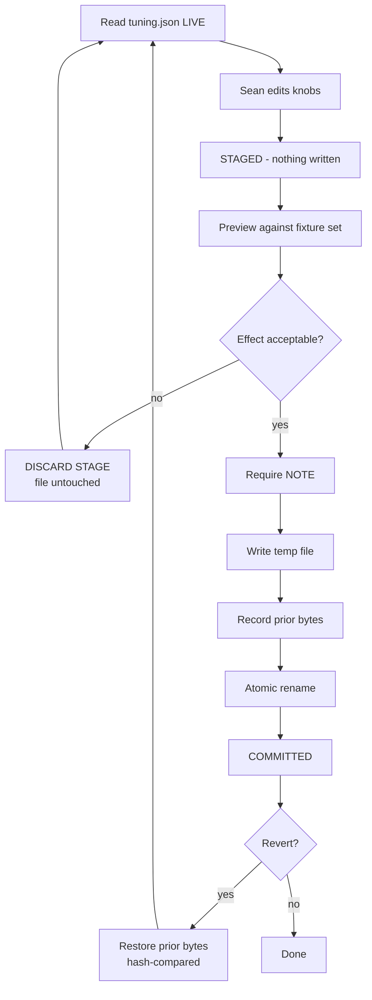
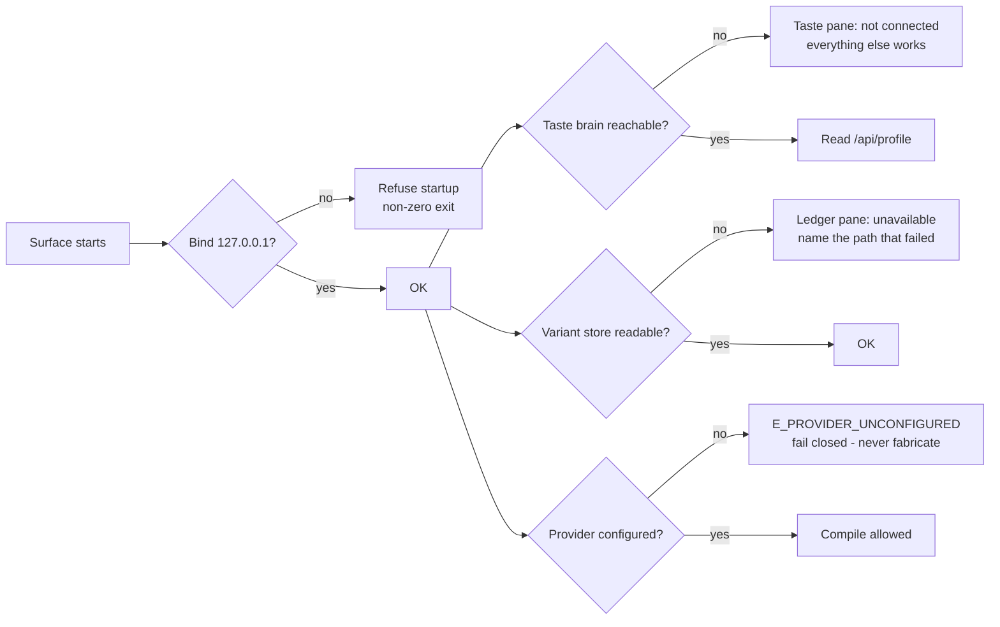
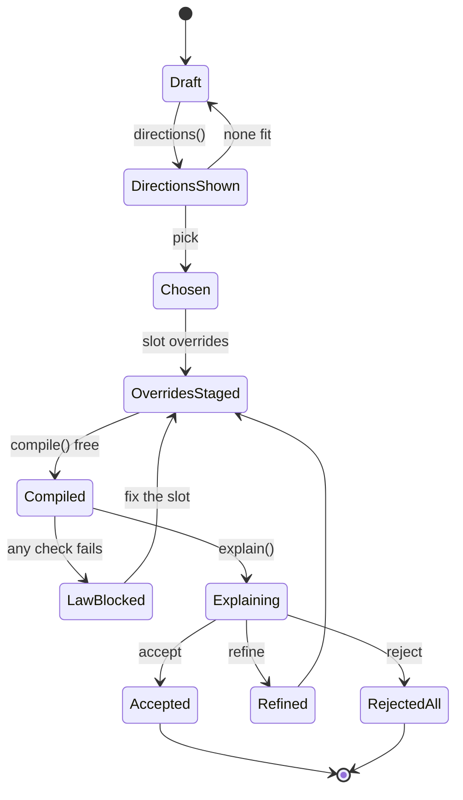
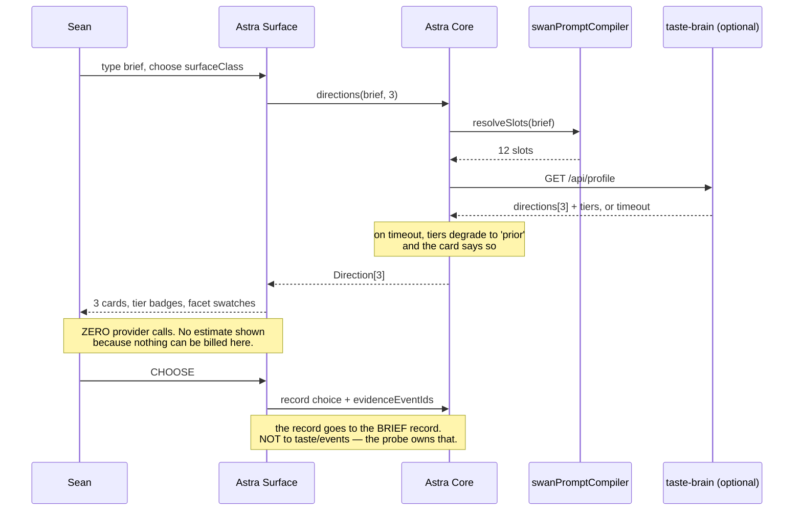
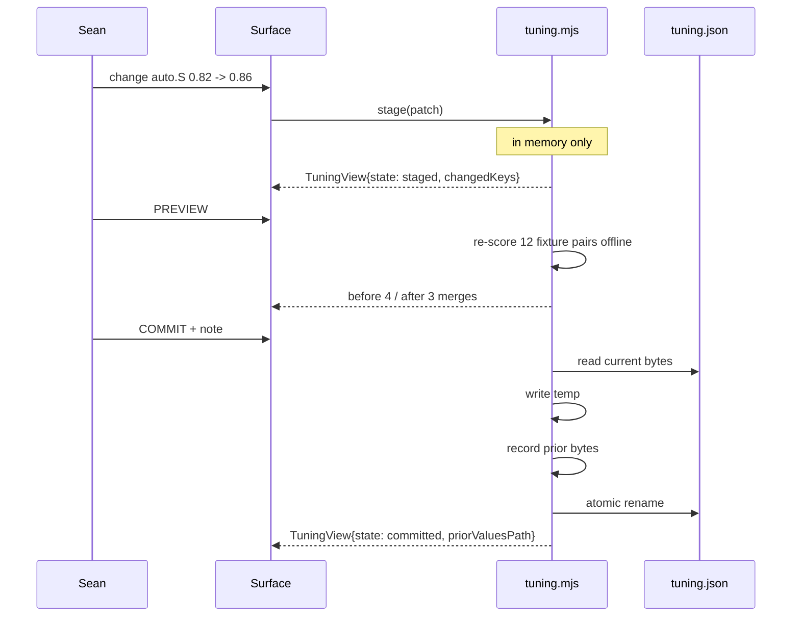
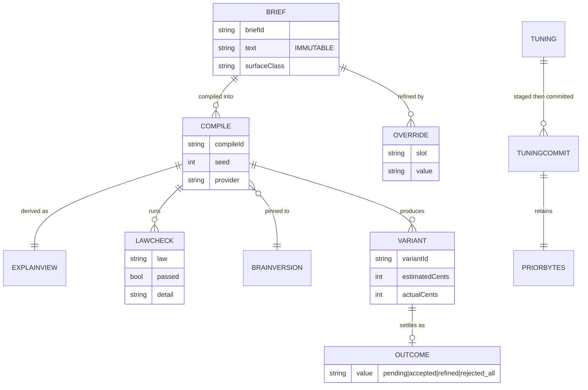

# Astra — Interface, Flows and Contracts

---

## 1. Layout and routes

Single window, left rail + main pane. Loopback only: `http://127.0.0.1:7411/`.

| Route | Pane | Method |
|---|---|---|
| `/` | Compose (default) | GET |
| `/choose` | Choose — Gate 0 directions | GET |
| `/think/:compileId` | Think — the explanation | GET |
| `/tune` | Tune — staged knobs | GET |
| `/law` | Law — the guardrail board | GET |
| `/state` | State — honest capability board | GET |
| `/ledger` | Ledger — rejected_all + cost drift | GET |
| `/api/directions` | directions(brief, n) | POST |
| `/api/compile` | compile with overrides | POST · token |
| `/api/explain/:id` | ExplainView | GET |
| `/api/tuning` | read knobs | GET |
| `/api/tuning/stage` | stage a patch (no write) | POST · token |
| `/api/tuning/commit` | atomic write + note | POST · token |
| `/api/tuning/revert` | restore prior bytes | POST · token |
| `/api/capabilities` | the honest board | GET |
| `/api/reject` | record `rejected_all` | POST · token |
| `/api/profile` | proxy to taste brain (optional) | GET |

Port **7411** is chosen to sit beside, not collide with, the taste probe on **7331**.

---

## 2. Wireframes

### 2.1 Compose + Choose (desktop, the default screen)

```
┌──────────────────────────────────────────────────────────────────────────────────────┐
│ ASTRA · Design Brain Console          brainVersion 0.2.0 · 127.0.0.1 · [STATE] ●ok   │
├───────────┬──────────────────────────────────────────────────────────────────────────┤
│ COMPOSE   │  BRIEF  (verbatim · immutable · rev 3)                    [DIAL: fields]  │
│ CHOOSE ◀  │  ┌────────────────────────────────────────────────────────────────────┐  │
│ THINK     │  │ a frozen lake at dawn, low vantage, the ice breathing             │  │
│ TUNE      │  └────────────────────────────────────────────────────────────────────┘  │
│ LAW       │  intent [hero ▾]   aspect [16:9 ▾]   surfaceClass [public ▾]  seed [auto]│
│ STATE     │                                                                          │
│ LEDGER    │  DIRECTIONS — Gate 0 · ZERO COST · nothing generated yet                 │
│           │  ┌───────────────────────┐ ┌───────────────────────┐ ┌────────────────┐  │
│           │  │ [EVIDENCE]            │ │ [PRIOR]               │ │ [PRIOR]        │  │
│           │  │ Glacier Cathedral     │ │ Slow Water            │ │ Iron Dawn      │  │
│           │  │ a nave of ice; light  │ │ melt as subject; the  │ │ horizon split  │  │
│           │  │ bending through melt  │ │ ONE impossible thing: │ │ by a dark      │  │
│           │  │ seams                 │ │ stillness that moves  │ │ occluder       │  │
│           │  │ ▓▓▓▓▓▓▓▓▓▓  facets    │ │ ▓▓▓▓▓▓▓▓▓▓  facets   │ │ ▓▓▓▓▓▓▓▓ facets│  │
│           │  │ palette: A-swan-native│ │ palette: B-world      │ │ palette: A     │  │
│           │  │                       │ │ from themes.md — not  │ │                │  │
│           │  │                       │ │ yet backed by picks   │ │                │  │
│           │  │ [CHOOSE] [PREVIEW $]  │ │ [CHOOSE] [PREVIEW $]  │ │ [CHOOSE] ...   │  │
│           │  └───────────────────────┘ └───────────────────────┘ └────────────────┘  │
│           │  ── 12 SLOTS (override layer — the brief above never changes) ──────────  │
│           │  1 intent      hero           7 light        low-key, 4200K, raking      │
│           │  2 subject     (deliberately  8 palette      #… #… #… (dominance order)  │
│           │                empty — pure   9 material     melt-scarred, wet black     │
│           │                phenomenon)   10 abstraction mid                          │
│           │  3 medium      photograph     11 negative    (kill-list applied)        │
│           │  4 styleAnchor personify()    12 output      16:9, opaque, 2×            │
│           │  5 composition low-vantage    6 optics       35mm f/2, 1/250, Portra    │
│           │  [STAGE OVERRIDES]   [RESET]                                              │
└───────────┴──────────────────────────────────────────────────────────────────────────┘
```

**Deliberate detail:** the brief is labelled *verbatim · immutable*, and slot 2 renders as
*"(deliberately empty — pure phenomenon)"* rather than a dash. The contract says slot 2 is *"often
deliberately empty"*; a blank cell would read as a bug. (`AC1.1`)

### 2.2 Think — the explanation (`/think/:compileId`)

```
┌──────────────────────────────────────────────────────────────────────────────────────┐
│ ◀ COMPOSE     THINK · compile 7f3a91c2 · brainVersion 0.2.0 · seed 8814 · gemini     │
├──────────────────────────────────────────────────────────────────────────────────────┤
│  RESOLVED SLOTS                        LAW CHECKS — 6 run, 6 passed                  │
│  1 intent      hero                    ✓ kill-list            no match               │
│  2 subject     (empty, phenomenon)     ✓ gold allowlist       none used              │
│  3 medium      photograph              ✓ LAW 4 optics         no literal creature    │
│  4 styleAnchor Anton Corbijn's         ✓ banned facets        none                  │
│                classical photograph    ✓ content law          clean                  │
│                of a frozen lake        ✓ Galaxy-Swan retired  no retired hex        │
│  5 composition low-vantage                                                          │
│  6 optics      35mm f/2 · Portra       FACETS APPLIED (3)                            │
│  7 light       low-key, 4200K          Temperature>Arctic · Mark>FineLines ·         │
│  8 palette     #E8EEF2 #0B1220 #C8A2   Surface>MeltScar                              │
│  9 material    melt-scarred black                                                   │
│ 10 abstraction mid                     CAPABILITIES (target: gemini)                 │
│ 11 negative    (kill-list, 5 entries)  honorsNegativePrompt  claimed → treated false │
│ 12 output      16:9 · opaque · 2×      seedIsDeterministic   verified                │
│                                        supportsInpainting    false                   │
│  COMPILED PROMPT                                        [COPY]  [WHY NOT?]            │
│  ┌──────────────────────────────────────────────────────────────────────────────┐   │
│  │ Anton Corbijn's classical photograph of a frozen lake at dawn, low vantage…   │   │
│  └──────────────────────────────────────────────────────────────────────────────┘   │
│  ── THIS RUN ──  outcome: pending   est 0.4¢   actual —   [MARK REJECTED-ALL]        │
└──────────────────────────────────────────────────────────────────────────────────────┘
```

`honorsNegativePrompt claimed → treated false` is rendered verbatim, because the compiler treats
`'claimed'` as `false` and a console that showed "claimed" without the consequence would mislead.
(`AC5.3`)

### 2.3 Tune — staged knobs (`/tune`)

```
┌──────────────────────────────────────────────────────────────────────────────────────┐
│ TUNE · scripts/design-brain/config/tuning.json          [DIAL]   state: STAGED (2)    │
├──────────────────────────────────────────────────────────────────────────────────────┤
│  KNOB              CURRENT     STAGED     PREVIEW EFFECT (fixture set: 12 pairs)      │
│  auto.S              0.82       0.86  →   auto-merges 4/12 → 3/12   (−1)              │
│  auto.O              0.60       0.60      unchanged                                   │
│  auto.margin         0.10       0.10      unchanged                                   │
│  auto.minTokens         3          3      unchanged                                   │
│  mergeBand.low       0.55       0.55      unchanged                                   │
│  weights.jaccard     0.35       0.35      unchanged                                   │
│  weights.overlap     0.50       0.50      unchanged                                   │
│  weights.trigram     0.15       0.15      unchanged                                   │
│  novelty.window         3          3      unchanged                                   │
│  novelty.productive  0.25       0.25      unchanged                                   │
│  novelty.tappedOut   0.10       0.10      unchanged                                   │
│  novelty.minKnown..     6          6      unchanged                                   │
│  novelty.minWindow..   12         12      unchanged                                   │
│                                                                                       │
│  ⚠ BLAST RADIUS  auto.S feeds the auto-corroboration gate. Raising it means fewer     │
│    claims merge without review. It does not touch the LAW filter or any token.        │
│  NOTE (required) ┌──────────────────────────────────────────────────────────────┐    │
│                  │ tighter auto-merge after the 2026-09-25 precision pass        │    │
│                  └──────────────────────────────────────────────────────────────┘    │
│  [PREVIEW]  [COMMIT (atomic + note)]  [DISCARD STAGE]      prior values recorded ✓    │
└──────────────────────────────────────────────────────────────────────────────────────┘
```

Three visibly distinct states: **LIVE** (matches disk) · **STAGED** (differs, not written) ·
**COMMITTED** (written, prior bytes retained). (`AC4.2`)

### 2.4 State — the honest board (`/state`)

```
┌──────────────────────────────────────────────────────────────────────────────────────┐
│ STATE · what is actually switched on          source: code + config, not prose       │
├──────────────────────────────────────────────────────────────────────────────────────┤
│  ACTIVE        compileImage · resolveSlots · personify · FACETS · serializers         │
│                directions (A1) · explain (A1) · tuning read · variants read           │
│  REFUSED       synthesize · corroborate · adjudicate · emit-vault · log-receipt       │
│                reason: non-operational until the signed source-classification         │
│                authority adapter supplies signed claim decisions                      │
│  RETIRED       attest · redact-provenance · log-spec   (retirement adapters,          │
│                fail closed)                                                           │
│  SPEC MODE     enabled: false   (config/spec-mode.json)  · no control to change it    │
│  TASTE         swan-taste-brain @ 127.0.0.1:7331   ● not connected                    │
│                                                                                       │
│  No control on this pane enables a refused lane. That is a design decision, not a     │
│  missing feature.                                                                     │
└──────────────────────────────────────────────────────────────────────────────────────┘
```

**`AC5.4` IS STATED AND MEASURED ON THIS PANE** (`A5-CORRECTIONS.md` C46). The wireframe above
predicted the *conclusion* — "no control enables a refused lane" — and A5 added the **evidence**:
a section that runs `auditEnable()` and prints the result. It reads
`0 of 60 attempts enabled anything`, where 60 is 5 actors × 12 lanes, and it lists each actor's
authority on enabling spec mode beside it. The number is on the screen because the requirement is
about the OPERATION across every actor, and a claim a reader can check beats a claim they have to
take on trust.

### 2.4a Law — the guardrail board (`/law`) ← **ADDED (A5, C44)**

**THIS SECTION DID NOT EXIST.** `/law` was listed in §1's route table with no wireframe anywhere —
§2.2 is the *Think* pane's LAW CHECKS block, §2.3 is Tune, §2.4 is State. So the pane A5 had to
build had no screen spec, and its shape was derived from the board's own data. Written down now so
the next reader is not re-deriving it.

```
┌──────────────────────────────────────────────────────────────────────────────────────┐
│ LAW · the guardrail board       source: shared/swanLawFilter.mjs     6 of 6 enforced  │
├──────────────────────────────────────────────────────────────────────────────────────┤
│  LAW                       PROTECTS              ENFORCEMENT SITE                     │
│  ✓ LAW2-gold-allowlist     gold, a Swan accent   shared/swanLawFilter.mjs:165         │
│  ✓ LAW3-kill-list          the banned families   shared/swanLawFilter.mjs:128         │
│  ✓ LAW3-banned-facet       the taxonomy          shared/swanLawFilter.mjs:214         │
│  ✓ LAW4-optics-not-…       optics over illusion  shared/swanLawFilter.mjs:137         │
│  ✓ LAW9-retired-palette    the retired palette   shared/swanLawFilter.mjs:175         │
│  ✓ LAW10-content           content wording       shared/swanLawFilter.mjs:183         │
│                                                                                       │
│  LAW 3 KILL-LIST — 8 families          definition: shared/swanLawPatterns.mjs:82      │
│  the negative slot must still name at least one of these; an override that empties    │
│  the slot deletes the law, so `negative` is not an overridable key.                   │
│                                                                                       │
│  READ-ONLY BY DESIGN — A failed check blocks the compile and Astra offers no          │
│  override. Silent stripping teaches the operator nothing and hides taste failures.    │
└──────────────────────────────────────────────────────────────────────────────────────┘
```

**THE CITATION IS THE PANE'S WHOLE POINT, AND IT IS VERIFIED.** A row whose enforcement marker can
no longer be found renders as `INCONCLUSIVE` with the reason and **no tick** — because a table of
six green ticks produced from a hand-typed count is exactly the defect this board exists to catch.
The `ENFORCED` word and the tick are coloured differently from `INCONCLUSIVE` so the two cannot be
mistaken for each other, and the marker is the enforcement **expression** (`CREATURE.test(withoutIdioms)`)
rather than the law's name — a marker that is the name would still resolve if the loop that finds
violations were deleted (`A5-CORRECTIONS.md` §5, mutation `M2`).

**ZERO CONTROLS, AND THE REASON IS ON THE PANE.** `READ_ONLY_PANES` carries the sentence from
`02-BLUEPRINT.md` §5 and the pane renders it verbatim (`C47`) — a decision that lives only in a
registry is one the next author has to go looking for, and this is where they will be looking.

### 2.5 Narrow (≤ 560 px)

```
┌─────────────────────────────┐
│ ASTRA 0.2.0      [☰]  ●ok   │
├─────────────────────────────┤
│ BRIEF (verbatim · rev 3)    │
│ ┌─────────────────────────┐ │
│ │ a frozen lake at dawn…  │ │
│ └─────────────────────────┘ │
│ [EVIDENCE] Glacier Cathedral│
│ ▓▓▓▓▓▓▓▓ facets             │
│ [CHOOSE] [PREVIEW $0.4¢]    │
│ ─────────────────────────── │
│ [PRIOR] Slow Water          │
│ from themes.md — not yet    │
│ backed by your picks        │
│ [CHOOSE] [PREVIEW $0.4¢]    │
└─────────────────────────────┘
```
Rail collapses to `[☰]`. Directions stack. The tier badge and the palette line are **never** hidden by
the collapse — they are the load-bearing information. (`AC2.2`)

### 2.6 Required states (every pane must define all of these)

| State | Appearance | Copy rule |
|---|---|---|
| **loading** | skeleton rows, no spinner-only | names what is loading |
| **empty** | the reason it is empty | "no compiles yet — start in Compose", never a bare "No data" |
| **partial** | banner: "3 of 5 lawChecks shown — the rest failed to load" | never silently truncate |
| **success** | the content | — |
| **denied** | 401/403 explained | "this is a write; the console needs the mutation token" |
| **validation-error** | field-level, names the slot | — |
| **failure** | the error code verbatim (`E_LAW_VIOLATION` + slot) | never a generic "Something went wrong" |
| **retry/recovery** | one action, labelled with what it will redo | — |
| **keyboard/focus** | every control reachable, visible focus ring | no focus trap |
| **responsive** | §2.5 | — |

---

## 3. Flows (Mermaid source — **unrendered in this environment**)

### 3.1 The main loop



### 3.2 Tuning commit — the rollback path



### 3.3 Blocked / degraded paths



---

## 4. Contracts

### 4.1 Core types (Astra's own; the brain's types are the brain's)

```ts
type Tier = 'evidence' | 'prior';

interface Direction {            // ✅ IMPLEMENTED in A1 — shared/swanDirections.mjs
  name: string;                  // evocative — "Glacier Cathedral"
  sentence: string;              // mood, hierarchy, the ONE impossible phenomenon
  phenomenon: string;            // the single impossible thing — load-bearing
  facets: string[];              // drives the deterministic swatch strip; no gen cost
  paletteLaw: 'A-swan-native' | 'B-world-native';
  tier: Tier;                    // 'evidence' requires >=2 of Sean's own picks, ids cited
  evidenceEventIds?: string[];   // present iff tier === 'evidence'
  swatches: { facet: string; hue: number; hex: string }[];   // deterministic, derived from facet NAMES
  tierReason: string;            // ALWAYS present — the card renders it, so PRIOR cannot look like EVIDENCE
}

// CORRECTED (C1 + C4). The original `lawChecks: {law, passed, detail?}[]` was wrong on
// sourcing: the compiler's `checks` carry NO detail, and `detail` lives on `violations`.
// `passed: null` is NOT a pass — it is NOT OBSERVED, and a blocked compile produces
// five of them. `slots` is an array, not a Record, because every empty slot must carry
// its REASON (a facet may have emptied it deliberately — see FACETS['Form>Abstract']).
interface ExplainView {          // derived ONLY from the compile result — never a second log
  blocked: boolean;
  partial: boolean;              // true when the view genuinely cannot be complete
  partialReason: string | null;
  brainVersion: string | null;   // read at run time, never a literal (T-U-05)
  briefId: string | null;
  seed: number | null;
  provider: string;
  modelVersion: string;
  aspect: string | null;
  aspectDivergence: { declared: string; inProse: string } | null;  // typed vs prose frame
  promptStyle: string | null;
  truncated: boolean;            // a silent quality loss unless surfaced
  droppedSegments: string[];
  negativeText: string | null;
  slots: { key: string; value: string; empty: boolean; emptyReason: string | null }[];  // 12
  emptySlots: string[];
  facetsApplied: string[];
  lawChecks: { law: string; passed: boolean | null; detail: string | null;
               slot: string | null; observed: boolean }[];   // EVERY check, passes AND fails
  capabilities: Record<string, 'verified' | 'claimed' | 'false'>;
  promptText: string;
}

type TuningState = 'live' | 'staged' | 'committed';

interface TuningView {
  state: TuningState;
  current: Record<string, number>;   // read from disk
  staged: Record<string, number>;    // diff vs current
  changedKeys: string[];
  preview?: { fixture: string; before: number; after: number; delta: number }[];
  blastRadius: string[];             // engine behaviours the changed keys feed
  priorValuesPath?: string;          // set once committed
}

// CORRECTED (C7). The original had three states. Spec mode is a fourth thing — a MODE,
// not a lane — and INCONCLUSIVE is what a row becomes when its marker is not found in
// the lane's own source. INCONCLUSIVE is not decoration: it is the mechanism that makes
// INV8 ("no lane reported ACTIVE without a code source") enforceable rather than
// aspirational. A row whose source cannot be found does not get to claim a status.
interface LaneState {
  lane: string;
  file?: string;                 // when the module name differs from the lane name
  status: 'ACTIVE' | 'REFUSED' | 'RETIRED' | 'DISABLED' | 'INCONCLUSIVE';
  reason?: string;               // present when INCONCLUSIVE
  marker: string;                // a literal that MUST exist in the lane's source
  guardKind: 'none' | 'conditional' | 'unconditional';
  gatedBy: string | null;        // what would unblock a REFUSED lane
  writes: string;                // what durable artifact it writes, or 'none'
  source: string;                // LIVE-resolved `file:line`, or the file when missing
  sourceLine: number | null;
  sourceMissing: boolean;
}
```

```ts
// LawRow — ADDED (A5, C45). §4.1 carried LaneState in full and NOTHING for the law board, so
// `lawBoard()`'s contract was invented at the keyboard. Same honesty mechanism as LaneState,
// deliberately: a marker, a live citation, and a degradation.
//
// `marker` IS THE ENFORCEMENT EXPRESSION, NOT THE LAW'S NAME. This is the one field worth
// arguing with. A marker of `'LAW3-kill-list'` would resolve happily against the line that
// PUSHES a violation — so deleting the loop that FINDS violations would leave the row green,
// citing the line that reports the failure it can no longer detect. Mutation `M2` in
// `A5-CORRECTIONS.md` §5 is that exact swap, and it is caught by a test that asserts the
// marker is an expression rather than by the citation test, which still passes.
interface LawRow {
  law: string;                   // one of LAW_NAMES — the board covers that set, in that order
  protects: string;              // what the law guards, in the operator's terms
  onFailure: string;             // what happens when it trips — every one of these blocks
  marker: string;                // the literal that RUNS the law, and must exist in the runner
  source: string;                // LIVE-resolved `shared/swanLawFilter.mjs:<line>`
  sourceLine: number | null;
  sourceMissing: boolean;
  status: 'ENFORCED' | 'INCONCLUSIVE';
  reason?: string;               // present when INCONCLUSIVE
}

// The kill-list is a SECOND thing to cite. The laws say the ban is enforced; this says what
// the ban CONTAINS — a kill-list whose definition vanished while the enforcement expression
// survived would be a law enforcing an empty list.
interface KillList {
  entries: string[];             // 8 families
  count: number;                 // == entries.length, derived
  source: string;                // `shared/swanLawPatterns.mjs:<line>`
  sourceLine: number | null;
  sourceMissing: boolean;
}
```

### 4.2 HTTP contract

| Endpoint | Request | Response | Auth | Notes |
|---|---|---|---|---|
| `POST /api/directions` | `{ text, intent, aspect, surfaceClass, n }` | `Direction[]` | none | **must make zero provider calls** |
| `POST /api/compile` | `{ briefId, slotOverrides, seed? }` | `CompiledPrompt` | token | free; no generation |
| `POST /api/preview` | `{ compileId, confirmSpend: true }` | `{ estimatedCents, basis }` → job | token | **the only billing endpoint** |
| `GET /api/explain/:id` | — | `ExplainView` | none | |
| `GET /api/tuning` | — | `TuningView` | none | |
| `POST /api/tuning/stage` | `{ patch }` | `TuningView` | token | writes nothing |
| `POST /api/tuning/commit` | `{ note }` | `TuningView` | token | atomic; prior bytes kept |
| `POST /api/tuning/revert` | — | `TuningView` | token | hash-compared restore |
| `GET /api/capabilities` | — | `LaneState[]` | none | |
| `POST /api/reject` | `{ compileId }` | `{ ok }` | token | records `rejected_all` |
| `GET /api/profile` | — | taste profile | none | proxy; optional |
| `GET /law` | — | the guardrail board (HTML) | none | **pane** — zero controls; every row cites a `file:line` |
| `GET /state` | — | the honest lane board (HTML) | none | **pane** — zero controls; renders the `AC5.4` sweep |

### 4.3 Error contract — CORRECTED (C2 + C3)

The original table listed `E_IMAGE_FIRST_REQUIRED`, `E_PROVIDER_UNCONFIGURED` and
`E_BRAIN_VERSION_MISMATCH`. **None of the three is thrown by this compiler.** `E_IMAGE_FIRST_REQUIRED`
belonged to `compileVideo`, which was **removed** (`compiler:271-275`) — that guard belongs to the video
lane's own tree. The other two were never implemented. This is the table of codes that exist.

| Code | Thrown by | Meaning | Surface behaviour |
|---|---|---|---|
| `E_LAW_VIOLATION` | `assertLawful` | a LAW check failed; carries `violations[]` | name the offending slot and detail; offer **no** override |
| `E_CAPABILITY_UNVERIFIED` | `compileImage` | requested aspect not in `supportedAspectRatios` | name the capability, say `claimed` ≠ verified |
| `E_CAPABILITY_UNAVAILABLE` | `requireCapability` | brief asked for a dead capability (seed / image-init) | explain that it is accepted, billed, and inert |
| `E_EMPTY_PROMPT` | `compileImage` | the brief resolved to no substantive content | refuse to submit a paid request; quote the render |
| `E_SPEC_MODE_DISABLED` | `spec-contract.mjs:65` | spec mode is gated off | show the gate; offer no control that enables it |
| `E_LEGACY_MODE_REFUSED` | `reference-modes.mjs:13` | an unsupported reference mode | name the mode; list the supported ones |
| `E_NOT_LOOPBACK` | `bind.mjs` | bind address was not `127.0.0.1` / `::1` | refuse startup, **exit non-zero** |
| `E_BAD_PORT` | `bind.mjs` | not a TCP port | refuse startup, exit non-zero |
| `E_TUNING_INVALID` / `E_TUNING_UNREADABLE` | `tuning.mjs` | the config is corrupt or missing | named error, **no write**, no default substitution |
| `E_EXPLAIN_INPUT` | `swanExplain.mjs` | `explain()` got neither a compile nor a violation | developer error; throw |

**Deliberately absent:** there is no `E_PROVIDER_UNCONFIGURED`, because "no provider" is not an error
this compiler raises — it is `provider: 'unconfigured'` on the record, and the **fail-closed** rule
(*the app never fabricates generated media*) lives in the generation lane, not here.

### 4.4 MCP tools (A7 — read, plus exactly one guarded write)

```
brain.directions(brief, n)        read   free
brain.compile(brief, overrides)   read   free, returns lawChecks
brain.explain(compileId)          read
brain.capabilities()              read   the honest board
brain.tuning.get()                read
brain.tuning.preview(patch)       read   NO write
brain.worlds()                    read   18 DNA recipes + seeded roulette
brain.doctrine(query)             read   corpus search
brain.reject(compileId, confirm)  WRITE  requires confirm: true
```

**Forbidden in the MCP surface:** any tool returning image bytes, provider credentials, or taste event
files; any write without `confirm`; any tool that changes canon or spec mode.

---

## 5. State and sequence

### 5.1 Compile state machine



### 5.2 Sequence — a direction choice, zero spend



### 5.3 Sequence — tuning commit



---

## 6. Data model, permissions and trust boundaries

### 6.1 What Astra reads and writes (ERD)



### 6.2 Permissions / authority matrix

| Actor | Read corpus | Read tuning | Write tuning | Compile | Preview (spend) | Write taste | Change canon | Enable spec |
|---|---|---|---|---|---|---|---|---|
| **Sean** (operator) | yes | yes | yes (via dial) | yes | yes | via probe only | **propose** | **propose** |
| **Astra surface** | yes | yes | staged→committed | yes | only with explicit confirm | **never** | no | no |
| **Astra MCP** | yes | yes | **no** | yes | no | never | no | no |
| **Builder agent** | yes | yes | no | yes | no | never | propose | propose |
| **Reviewer agent** | yes | yes | no | yes | no | never | no | no |

**No actor enables a REFUSED lane or spec mode through Astra.** Activation requires signed approval
outside this surface.

**AND THAT IS MEASURED, NOT DECLARED (A5).** The table above is data (`core/authority.mjs`
`AUTHORITY_MATRIX`), `attemptEnable({actor, target})` is the operation, and `auditEnable()` calls it
**once for every actor against every target** and returns the attempts that switched something on.
Measured: **60 attempts (5 actors × 12 lanes), `enabled: []`**, with the refusal codes accounting for
the board exactly — 15 `E_LANE_RETIRED`, 15 `E_LANE_REFUSED`, 25 `E_ALREADY_ACTIVE`, 5 `E_MODE_GATED`.

Three properties of that sweep are load-bearing, and each is asserted:

1. **The refusal is UNIFORM, INCLUDING FOR SEAN.** §6.2's strongest cell in either enabling column is
   `propose`, and **`propose` is not enable** — it returns a different code and names the artifact that
   has to be signed. A REFUSED lane is refused to the operator too, because a console that could switch
   one on could mint a claim into canon without review.
2. **`INCONCLUSIVE` is refused too.** A lane whose marker vanished has no defensible status, so enabling
   it would be switching on something nobody can describe. Treating "unknown" as "probably fine" is how
   a fail-closed guard becomes a fail-open one.
3. **An ACTIVE target reports `E_ALREADY_ACTIVE`, never success.** Enabling something already on did not
   enable anything, and reporting otherwise would be a false claim about a control.

The sweep reads its targets from the LIVE board, so a lane added later is swept without editing a list —
and the test asserts the attempt count is a **product** (`actors × targets`) rather than a literal, so a
sweep that silently covered a subset cannot pass. The transport half is separate and also asserted: no
`MUTATION_ROUTE` names an enable action. A fence in the domain and a scan of the door handles; a route
named `spec-mode-enable` six slices from now is what the second one catches.

### 6.3 Trust boundaries

| Boundary | Crossing | Control |
|---|---|---|
| Browser ↔ Astra | loopback HTTP | `127.0.0.1` bind only; token + `SameSite=Strict` on mutations |
| Astra ↔ brain | in-process import | same process; no network |
| Astra ↔ taste repo | loopback HTTP, read-only | never writes; degrades on timeout |
| Astra ↔ provider | **never direct** | all provider work goes through the existing session/authority layer |
| Astra ↔ canon | read-only | proposal artifact only |

**Loopback is not authentication.** Any local process can reach `127.0.0.1:7411`. That is accepted for
reads (as the taste probe accepts it) and is why every mutation carries a token — the same fix the
NIGHTSHIFT build landed for its own local server.
