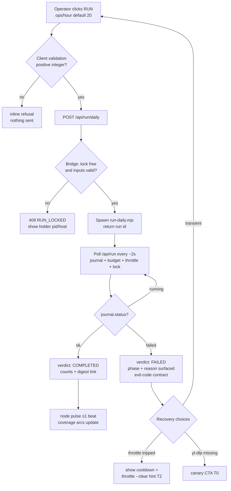
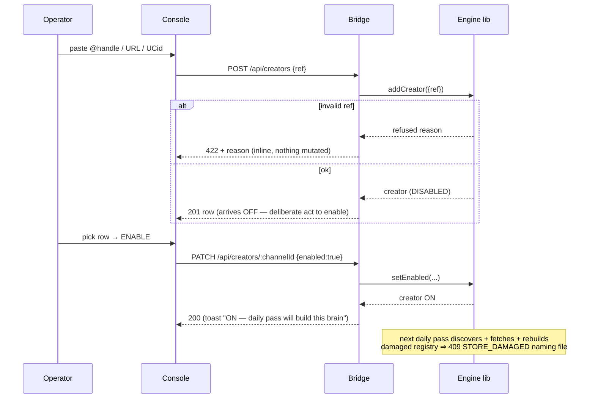
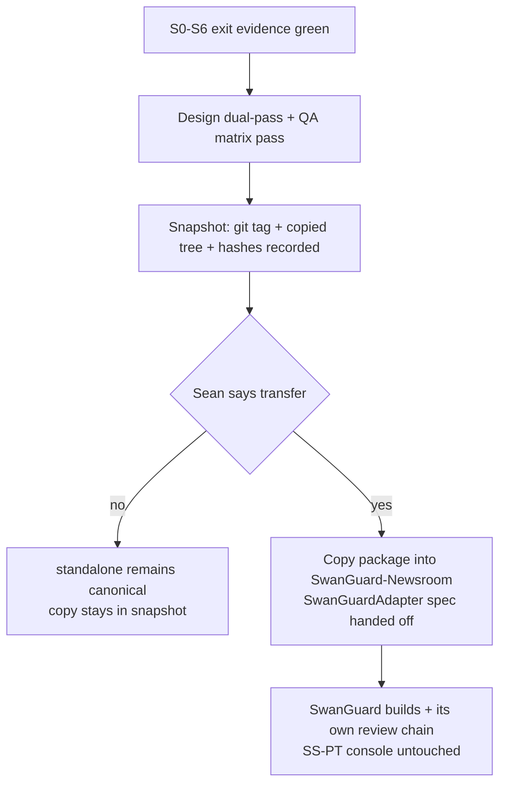

# 04 — Flows (Mermaid) — Creator Brains Console

Rendering note: authored as valid mermaid source; this packet was written in a terminal agent — open in any mermaid-capable viewer (GitHub renders these in-place). Diagrams cover happy, blocked, error, cancel/defer, retry and recovery paths.

## F1 — Daily pass from the console (happy + blocked + error + recovery)



## F2 — Add creator → enable → daily fold-in (happy + validation + refused)



## F3 — Ask the brains (happy / no-hit / damaged / skipped honesty)

```mermaid
flowchart TD
  A[Query box + optional creator filter] --> B[GET /api/query]
  B --> C{current.json pointer\nresolves?}
  C -- no --> C1[empty generation ⇒ honest zero hits\ncreator publishes empty, not stale]
  C -- yes --> D[queryBrains on published rules.jsonl]
  D --> E{hits?}
  E -- yes --> F[cited rows: key phrase, creator,\n▶watch at t_start_ms]
  E -- no --> G[zero-hit copy NAMES the searched terms\nnever "creator never said that"]
  D --> H[skipped/unparseable rows rendered\nas visible ⚠ list]
```

## F4 — Bridge failure & rollback paths

```mermaid
flowchart TD
  A[Bridge error paths] --> B[store read damaged]
  A --> C[unknown route]
  A --> D[mutation refused by engine]
  A --> E[bridge process dead]
  B --> B1[409 STORE_DAMAGED {file}\nUI refusal banner - action blocked not faked]
  C --> C1[404 envelope]
  D --> D1[422 + engine reason string verbatim]
  E --> E1[.cmd closed / bridge restart = full recovery\nstore is on disk - console holds no truth]
  F[Rollback whole console] --> F1[delete console/ dir + Desktop cmd\nengine CLI unchanged - zero data impact]
```

## F5 — Best-state transfer to SwanGuard (gated slice S7 — runs only on Sean's go)


