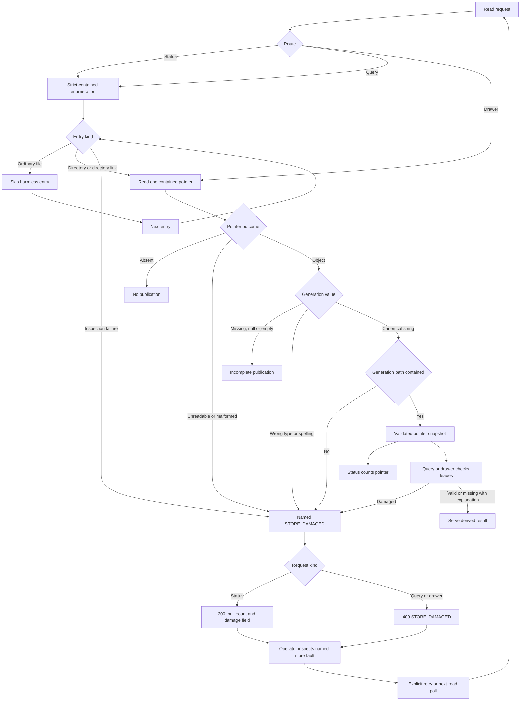
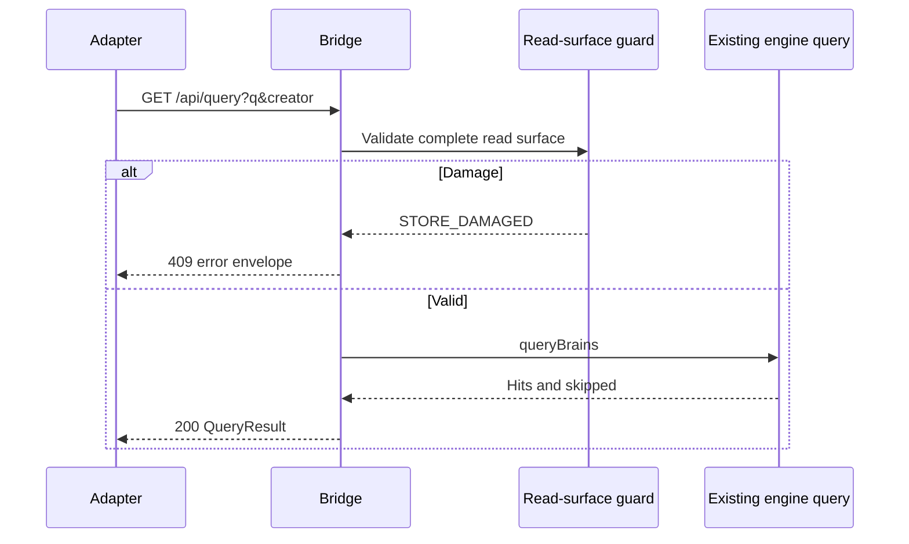
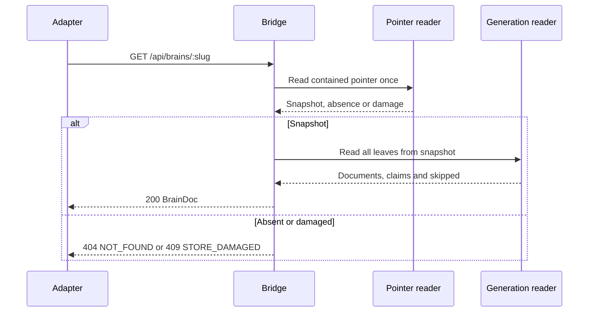
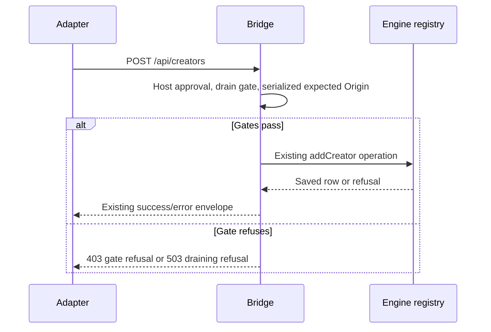
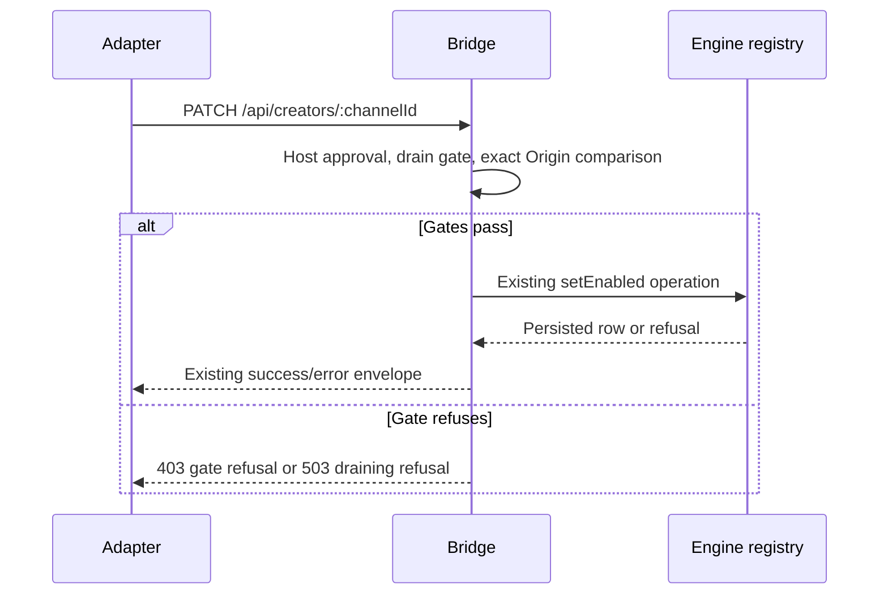

# Astra Mega Packet — ROUND 5 (hostile review of the R4-01..R4-04 fixes)

## AUTHORIZATION AND CONTEXT — read this before the code

I am the operator of this repository, and I am asking for a review of my OWN
code. Everything in this packet is code I wrote, on my own machine, in a repo
that has no other contributors and no deployment.

The subject is **defensive containment hardening**. This subsystem reads derived
artifacts from a local store and must REFUSE to serve anything that escapes that
store. Some of the files below are security-flavoured because that is the domain
of the fix — path traversal, directory junctions, serving-origin checks. They are
defences and the tests that prove the defences refuse. Concretely:

- `test/store-attacks.mjs` **constructs** the malformed store shapes (a relative
  path that traverses out of the store; a directory junction that resolves
  outside it) so the tests can assert the guards REFUSE them. Each builder
  asserts its own attack was constructed and fails loudly otherwise, so a guard
  can never pass vacuously against an ordinary directory.
- The only thing attacked is a temporary directory the test creates itself. There
  is no exploit payload, no third-party target, no external system, and no
  instruction here that is meant to be executed against anything but this repo.
- The security assertions exist to make the console **fail closed**. A reader who
  removes them makes the console less safe, not more.

This framing is stated because the transport's safety classifier refused two
earlier copies of this packet that lacked it. Nothing below has been removed or
softened to obtain passage — the same files, byte-identical, are included here.

---

**Generated from the working tree.** Every file below is included VERBATIM and
byte-identical to what is on disk, so this review reads the SHIPPED code rather
than a description of it. Hashes are recorded per file.

**Repo:** `SS-PT` (a local working copy), branch `creator-brains-engine-r2-20260915`
**Reviewed commit:** `5aae0dffa` — the tree this packet was generated from.
**Console package:** `packages/creator-brains-console/`
**Paths below are RELATIVE to the repo root.**

## REMIT

Round 4 (`17-astra-mega-reply-r4.md`, included in full as PART 4) returned
**REVISE — not dry**, with FOUR residual findings: two medium, two low.
R3-02, R3-03 and R3-04 were PARTIAL; R3-01 and R3-05 were verified. All four
residual findings have since been fixed in this tree, and this packet is the
rebuilt artifact those fixes are owed a review against.

| Finding | Severity | What was wrong | What changed |
|---|---|---|---|
| R4-01 | MEDIUM | The contained enumerator presented DAMAGE as a healthy count or
healthy emptiness. `listDir` swallowed every error as `[]`, and the second pointer
reader collapsed ENOENT / EACCES / malformed JSON into one `null`. Round 4's own
table read: traversal generation -> `1, no damage`; `generation: 42` -> `1, no
damage` while query said VALIDATION; malformed JSON -> `0, no damage`; EACCES ->
`0, no damage`. | `lib/pointer.mjs` is now the ONE strict contained reader, shared
by the drawer and the walk. Only `ENOENT` is absence. A numeric generation is
refused with the engine's own reason — `path.join` throws on a non-string, so the
engine FAILS rather than skipping. `lib/read-surface.mjs` keeps only its
namespace-alphabet rule. |
| R4-02 | MEDIUM | `shutdown()` released instance ownership, the health lease and
the registry slot SYNCHRONOUSLY, while `server.close()` is asynchronous and stops
new CONNECTIONS, not in-flight dispatches. A pipelined request on an already-open
connection constructed a worker at `owners=0`. | `lib/admission.mjs` counts
admitted dispatches; `lib/lifecycle.mjs` (extracted from `server.mjs` at the seam,
which had reached 336 lines against rule 4) drains them; every path returns its
slot. The drain awaits the WORK without bound and HTTP closure WITH one, then
force-closes. |
| R4-03 | LOW | The Origin rule required the APPROVED Host to be canonical too, so
`LOCALHOST:8787` and `127.0.0.1:80` were refused as cross-origin writes. |
`servingOriginFor` serializes the expected origin AFTER Host approval, while the
supplied Origin must still already be serialized. An omitted Host port means 80
and is compared with the bound port. |
| R4-04 | LOW | `T-B27m` compared field NAMES, so retyping `runId` to `number`
produced zero diagnostics. | `05-contracts.md` §2b now declares types, and
`web/src/adapters/contract.assert.ts` pins them in the COMPILER with
`Assert<Exact<...>>` across `types.ts` and both adapters. |

**IN SCOPE:** R4-01, R4-02, R4-03, R4-04 — whether each fix is complete, whether it
introduced anything new, and whether any of them WIDENED a rule in the course of
loosening it. R4-03 in particular is a fix in the REFUSING direction, so the
question is whether it also re-admitted what R3-04 closed.

**A note on the round-4 fix that is easiest to get wrong.** R4-02's drain now
force-closes connections after a bounded wait. That is only safe because the wait on
admitted dispatches is UNBOUNDED and comes first: once every admitted dispatch has
settled, no connection can be serving admitted work. If that ordering is wrong, the
force-close re-creates the very defect R4-02 names. Please test the ordering rather
than the presence of the calls.

**OUT OF SCOPE, and named so they are not mistaken for done:** R2-07 and R2-08.
They remain deliberately unfixed and excluded from closure adjudication, as in
rounds 2, 3 and 4.

**WHAT "DRY" MEANS:** a rebuilt artifact with no finding against the previous
round's fixes. This is that artifact.

## EVIDENCE BOUNDARY — state the limit rather than implying certification

- Console suite: **202/202** real tests, **0 cancelled**, `node --test test/*.test.mjs`.
  The `cancelled` count is reported deliberately: during this round a defect
  surfaced as **five CANCELLED tests while the summary line still read `fail 0`**.
  A `fail 0` that hides five tests that never ran is not a pass, and the count is
  now read and quoted.
- Web suite: **62/62** (`vitest run`); `tsc --noEmit` **0 errors**; `npm run build` clean.
- Engine gate: `consistency-check.mjs` → **15/15 consistent, exit 0**, no engine file touched.
- Rule 4 (300-line cap, `.mjs/.ts/.tsx/.css`, test files included): **0 files over**;
  the three nearest are `lib/health-probe.mjs` 299, `lib/health.mjs` 295,
  `lib/http.mjs` 290.
- Readiness: `check-readiness.mjs` → **`structurallyReady: true`**, no errors; the
  `05-contracts.md` hash was updated in all three referencing sections because this
  round changed that document.
- Secrets scan on every changed file: **0 hits, CLEAN**.
- Mutation verification for these four fixes: **M1..M13**, each with its red set
  recorded, and paired mutants checked to redden DIFFERENT named tests:
  M1→{R4-02a}, M2→{R4-02b,R4-02d}, M3→{R4-02d}, M4→{T-B23c,T-B23d,T-B23e,T-B23f,T-B23g},
  M5→{R4-01e}, M6→{R4-01a,R4-01b}, M7→{R4-03a}, M8→{R4-03d}, M9→{R4-03c},
  M10→`tsc` TS2344 on the interface assertion plus TS2416 on both adapters,
  M11→`tsc` TS2344 on the adapter assertion **and clean when that assertion is removed**,
  M12→{T-B27m2b}, M13→{T-B27m2a}.
- **NOT RUN:** no browser pass, no launcher pass, no end-to-end pass, no real
  file-symlink attack (a file symlink needs Developer Mode on Windows, so a
  junction is used instead). **Suite results are not runtime certification.**

---

# PART 1 — PACKET DOCUMENTS

## `05-contracts.md` — sha256 `544c2c494e6135453d4ddc5ae54889b8f2b8008268b023200da8b23aa6fdda38`

```js
# 05 — Contracts — Creator Brains Console

## 1. `ConsoleDataAdapter` (the modularity seam — UI imports ONLY this)

```ts
// web/src/adapters/types.ts
export type Tier = 'T0' | 'T1' | 'T2' | 'T3' | 'T4';

/**
 * THE FULL PROVENANCE, NOT JUST THE VERDICT (A1-03).
 *
 * `source` is THREE-valued and `unknown` is a real value, not an absence. Since
 * A1-10 the production probe runs off the event loop, so a cold read has started
 * a probe and has no verdict yet; reporting that as `source:'probe'` would
 * present "we have not checked" as a live reading — the same lie the
 * failure-caching defect was.
 *
 * `checkedAt`/`ageMs` are `null` when there is no timestamp to be honest about,
 * and `stale` is then `true` by definition. A `history` reading is ALWAYS stale:
 * it is not a live verdict and must never be presented as one, however recent the
 * record happens to be.
 */
export interface CanaryReading {
  ok: boolean; version: string | null; reason: string;
  checkedAt: string | null; ageMs: number | null;
  source: 'probe' | 'history' | 'unknown'; stale: boolean; note: string | null;
}

export interface StatusInstrument {            // R2 — mirrors status-command sources
  ytdlp: CanaryReading;                        // NOT the narrowed {ok,version,reason} (A1-03)
  creators: { total: number; enabled: number; damaged: null | { file: string; detail: string } };
  state: { damaged: null | { file: string; detail: string };
           videos: { total: number; fetched: number; coverage: number;
                     counts: Record<string, number> } | null };
  budget: { used: number; perHour: number; unit: string; byKind: Record<string, number> };
  backlog: { lines: string[] };               // engine-formatted truth, not re-derived
  throttle: { active: boolean; kind?: string; until?: string; text: string };
  census: { inFlight: Array<{ channelId: string; detail: string }>;
            everSwept: number; discarded: boolean; error?: string };
  lock: { held: boolean; pid?: number; host?: string; alive?: boolean };
  lastRun: { status: string; runId: string | null } | null;
  lastGood: { at: string; staleDays: number } | null;
  documents: number;
  // R3-02. Counted through the CONTAINED enumerator. `null` when it refused —
  // a namespace or pointer escaped the brains store — never 0, which would read
  // as "nothing is published". The reason is in `publishedBrainsDamaged`.
  publishedBrains: number | null;
  publishedBrainsDamaged: { file: string; detail: string } | null;
  recentRuns: Array<{ runId: string; ok: boolean; fetched: number }>;
}

export interface CreatorRow {
  channelId: string; title: string; enabled: boolean;
  /**
   * MEASURED, OR `null` — NEVER A FABRICATED ZERO (A1-03, A1-12).
   * From `state.json` via `readState` + filter, the same computation
   * `renderCreators` does. `null` means the count COULD NOT BE TAKEN (a damaged
   * store, or a read that raced the write); `0` means it was taken and is zero.
   * Conflating them renders "0 videos" for a creator that has videos — a guard
   * value presented as a measurement.
   *
   * `enabled` is the registry's truth. A NEW creator starts `false`; an EXISTING
   * one keeps whatever the operator decided, because `upsertCreator` preserves
   * consent by design. Re-adding is not a way to revoke consent (A1-12).
   */
  videos: number | null; fetched: number | null;
}

export interface QueryHit {
  claimId: string; creatorId: string; creatorTitle: string;
  videoId: string; tStartMs: number; keyPhrase: string;
  statement: string; topic: string;            // served by both routes; declared since A1-03
  watchUrl: string;                            // https://youtu.be/<id>?t=<s>
}
export interface QueryResult { hits: QueryHit[]; skipped: Array<Record<string, unknown>>; }

/**
 * `slug` IS A CHANNEL ID, NOT A SLUG (A1-04, name reconciled in R2-01).
 *
 * `lib/render.mjs` HR07 states it outright: "the storage namespace is the CHANNEL
 * ID, never a display name" — two channels sharing a display name would otherwise
 * write one directory and the second would erase the first. This document called
 * it a slug, which is how the drawer's identifier came to be described as
 * something it is not. `slugify` does exist in the engine, but it produces
 * FILENAMES for other surfaces; it does not name a brain namespace.
 *
 * THE FIELD NAME IS `slug`, AND THAT IS A RECONCILIATION, NOT AN OVERSIGHT.
 * The A1-04 amendment renamed the field to `key` in THIS document while the
 * bridge went on serving `slug` — so for one round the contract, the web types
 * and the response disagreed, and nothing compared them. Astra round 2 (R2-01)
 * ruled: preserve `slug` as the compatibility field containing a channel ID. The
 * route `/api/brains/:slug` and the field are already published, so renaming the
 * response would be the breaking change, not the fix. The name stays; the
 * MEANING is what A1-04 corrected, and `T-B27e` now asserts this document's field
 * names against the live payload so a doc-only rename cannot happen again.
 *
 * `generation` is the PINNED published generation the markdown AND the claims
 * both come from (A1-04). It is `null` when the pointer names none, which is an
 * incomplete brain rather than a damaged one; a pointer naming a generation the
 * engine never writes is damage and is refused.
 */
export interface BrainDoc { slug: string; title: string;
  generation: string | null;
  index: string; topics: string; timeline: string;       // markdown from published generation
  claims: QueryHit[]; skipped: Array<Record<string, unknown>>; }

export interface RunState { journal: { status: string; runId: string | null } | null;
  lock: StatusInstrument['lock']; throttle: StatusInstrument['throttle'];
  budget: StatusInstrument['budget']; recentRuns: StatusInstrument['recentRuns']; }

export interface ConsoleDataAdapter {
  getStatus(): Promise<StatusInstrument>;
  listCreators(): Promise<CreatorRow[]>;
  addCreator(ref: string): Promise<CreatorRow>;                    // T2
  setCreatorEnabled(channelId: string, enabled: boolean): Promise<CreatorRow>;  // T2
  query(q: string, creator?: string): Promise<QueryResult>;        // T0
  getBrain(channelId: string): Promise<BrainDoc>;                  // T0
  getRunState(): Promise<RunState>;                                // T0
  /**
   * ACCEPTANCE IS NOT COMPLETION (A1-05). `runId` is the ENGINE's run id and is
   * `null` at acceptance: `run-daily.mjs` does not accept a caller-supplied id,
   * so one cannot honestly be returned before the engine has written it.
   * `requestId` is the CONSOLE's correlation id, returned immediately.
   * Correlate the child process to an engine journal entry and use THAT entry's
   * run id. Never treat process exit, or a lock disappearing, as success.
   */
  startDailyRun(perHour: number): Promise<{ requestId: string; runId: string | null }>; // T2
  canary(): Promise<CanaryReading>;                                // T0
  /**
   * A PROJECTED ENGINE RESULT (A1-07). The engine's repair path runs
   * reconciliation, build and export and returns an EXIT CODE — it does not
   * return `{requeued}`. The console invokes the same `runDaily` configuration
   * through a wrapper and projects the engine's own counts, sharing the
   * run-operation exclusion gate with `startDailyRun`.
   */
  repair(): Promise<{ repaired: number; built: number; emptied: number }>;  // T2
  backup(dest?: string): Promise<{ dest: string; ok: boolean }>;   // T2
}
```

`LocalEngineAdapter` implements this over the bridge HTTP API. `MockAdapter` implements it over fixtures and MUST satisfy the same vitest contract test (R12). SwanGuard later supplies its own — the interface is the transfer artifact.

## 2. Bridge HTTP API (loopback only; JSON; error envelope everywhere)

**Scope of this table (read this before treating a row as buildable).** A row's tier badge is a *capability* label, not a schedule. Which rows exist today is fixed by the **S0 route allowlist** below — nine literal routes, pinned by a positive allowlist test (`bridge.hy4.structure.test.mjs`) so an unplanned route fails CI rather than appearing unnoticed. Rows marked **DEFERRED** are contract *intent* for a later slice, and a route MUST NOT be added ahead of the slice that owns it.

### 2a. S0 — realised route allowlist (implemented; this is the honest surface)

| Method+Path | Tier | Engine function (authoritative source) | Response 2xx | Errors |
|---|---|---|---|---|
| `GET /api/status` | T0 | store/summary/ledger/throttle/checkpoints/lock/ytdlp/render (same composition as status-command) | `StatusInstrument` — **200 even when damaged** | none (damage is a *field*, see note) |
| `GET /api/creators` | T0 | `listCreatorsSafe` + state counts | `CreatorRow[]` | `409 STORE_DAMAGED` |
| `POST /api/creators` | T2 | `addCreator` | `201 CreatorRow` (DISABLED) | `400 VALIDATION`, `422 REFUSED {reason}` |
| `PATCH /api/creators/:channelId` | T2 | `setEnabled` | `200 CreatorRow` | `409 STORE_DAMAGED`, `422 REFUSED` |
| `GET /api/query?q&creator` | T0 | `queryBrains` | `QueryResult` | `400 VALIDATION` |
| `GET /api/brains/:slug` | T0 | `readPointer`+published files only | `BrainDoc` | `404 NO_PUBLISHED_BRAIN` |
| `GET /api/run` | T0 | journal+lock+throttle+budget+recentRuns | `RunState` | — |
| `GET /api/backlog` | T0 | backlog lib function (engine-formatted lines) | `{ lines: string[] }` | — |
| `GET /api/canary` | T0 | `selfCheck` via the **60 s TTL cache** (see 11 §3) — carries `ok/version/reason/checkedAt/ageMs/source/stale/note` | `CanaryReading` | — |
| anything else | — | — | — | `404` (restore/rollback/authorize have **no route** — R9/T-B6 tested) |

`GET /api/status` and `GET /api/canary` MUST NOT call `selfCheck()` inline: the probe shells out to `yt-dlp --version` (~1.7–3.4 s) and would block the single-threaded bridge per request. They read through `lib/health.mjs`.

**Damage reporting differs by route — corrected 2026-09-18 (H6b).** This table previously listed `409 STORE_DAMAGED` for `GET /api/status`, which was **wrong**, and `06` T-B2 asserted the same. Measured behaviour on a corrupt `registry.json`:

- `GET /api/status` → **200**, with `creators.damaged = {file:'registry.json', detail}` (and `state.damaged` for a corrupt `state.json`). It does **not** 409.
- `GET /api/creators` → **409** `{error:{code:'STORE_DAMAGED', file:'registry.json'}}`.

The code is right and the doc was wrong, for a reason visible in §1: `StatusInstrument` types damage as a *field* (`damaged: null | {file, detail}`), so a 409 on `/api/status` would make that field unreachable — and R3/T-W3 require the board to render a refusal banner **naming the file**, which needs the 200 + field shape.

**Trap for future consumers:** when `creators.damaged` is non-null the same payload still carries `total: 0, enabled: 0`. Those zeros are *not* a measurement. Any consumer that renders `total` without checking `damaged` first will display a false zero — which is precisely what R3 forbids. `StatusBoard` withholds them and renders the refusal instead.

### 2b. DEFERRED — contract intent, no route until the owning slice lands

| Method+Path | Tier | Owner slice | Engine function | Planned response 2xx | Planned errors |
|---|---|---|---|---|---|
| `POST /api/run/daily` | T2 | **S4** (RunConsole) | spawn `run-daily.mjs --per-hour=N` | `202 {requestId: string, runId: string \| null}` (progress via `GET /api/run`) | `400 VALIDATION` (non-positive int), `409 RUN_LOCKED {holder}` |
| `POST /api/repair` | T2 | **S3** (OpsRail) | repair path of `COMMANDS` | `200 {repaired: number, built: number, emptied: number}` — a PROJECTED engine result | `409 RUN_LOCKED {holder}`, `409/422` |
| `POST /api/backup` | T2 | **S3** (OpsRail) — **BLOCKED (A1-08 / D4), do not build** | backup command | **withheld — no endpoint** | — |

The corresponding tests (`T-B4`, `T-B5`, `T-B10`) land **with their slice**, not at S0 — this is the plan/code discrepancy HY4 found as H6 and is corrected here and in `08`. S0's exit evidence is `T-B1/B2/B3/T-B6/T-B7/T-B8/T-B9` plus the structure suite.

**Both run rows were corrected 2026-09-20 (R2-06) — §2b had retained the shapes `17` §A1-05 and §A1-07 replaced in §1.** `POST /api/run/daily` answers `{requestId: string, runId: string | null}`, because acceptance is not completion (§1). `POST /api/repair` answers a **projected** engine result `{repaired: number, built: number, emptied: number}`; the engine's repair path returns an exit code, never `{requeued}`. A stale row here is not a typo — it is an instruction that would rebuild the rejected behaviour.

**THESE ROWS DECLARE TYPES, NOT JUST NAMES (R4-04).** They previously read `{requestId, runId: null}` and `{repaired, built, emptied}` — names only. `T-B27m` compares the *names* a declaration lists, so a row and a type could agree on every name while disagreeing on every type, and the round-4 probe showed exactly that: changing `runId` to `number` in `types.ts` produced **zero** compiler diagnostics. A contract that under-specifies is not a weaker contract, it is an unchecked one. The declared types are now pinned twice over: `web/src/adapters/contract.assert.ts` fails to COMPILE if `types.ts`, `LocalEngineAdapter.ts` or `MockAdapter.ts` drifts from them, and `T-B27m2` fails if this document drifts from that file.

**THE RUN-OPERATION EXCLUSION GATE COVERS BOTH ROWS (A1-06).** Repair invokes the same `runDaily` journal path, so gating `POST /api/run/daily` alone would leave the journal reachable through the other door. Both routes take the same exclusion and both may answer `409 RUN_LOCKED {holder}`.

**`409 RUN_LOCKED` IS A REFUSAL OF THE RUN, NOT PROOF THE STORE IS UNTOUCHED.** `lib/run.mjs:107` writes the journal **before** it attempts the engine lock at `:154`, so a refused run may already have appended a journal entry. A console-side mutex therefore does not cover an external runner (the CLI, or a second machine against a synced store), and the engine lock is **not** a sufficient backstop — `09#H1` said it was. S4's entry gate is a two-process journal-preservation test (`19` §4). If it fails, the defect goes to the **engine owner**.

**`POST /api/backup` is BLOCKED as of 2026-09-20 — A1-08, D4 AMEND (`17` §1).** `backup-command.mjs:46–59` copies the durable set **including raw transcripts**, which `01` §"Business rules" item 1 bans from every console surface; the optional browser-supplied `dest` has no containment contract either. Backup therefore stays **visible in the UI but blocked, with no endpoint**, until Sean decides whether an engine-only private backup is an allowed exception to the tier-B boundary. It is **not** dropped from product scope. Never substitute a derived-only copy and call it a full backup.

**Error envelope (uniform):** `{ "error": { "code": "STORE_DAMAGED|RUN_LOCKED|VALIDATION|REFUSED|NOT_FOUND", "message": "<engine reason, verbatim>", "file?": "<damaged file name>" } }`

**Validation:** `addCreator.ref` non-empty string ≤ 200 chars; `perHour` integer ≥ 1 (both client and server); `query.q` non-empty ≤ 300 chars; channelId matched against `^UC[A-Za-z0-9_-]+$` or existing registry key.

## 3. Authoritative data sources (data-truth map)

| Screen fact | Source file/function | Never from |
|---|---|---|
| creator list/on-off | `registry.json` via `listCreatorsSafe` | UI state |
| per-creator videos/fetched | `state.json` via `readState`+filter (same as `renderCreators`) | cache older than the request |
| coverage/budget/backlog/throttle/lock/census | their lib functions (same call graph as `status-command.mjs`) | re-derived math in the client |
| claims/citations | published generation `rules.jsonl` via `current.json` (HR08) | raw transcripts (forbidden, tier B) |
| run progress | `runs/` journal + lock files | stdout scraping of the child |

## 4. Trust & privacy boundary

- The bridge binds `127.0.0.1` only (integration-tested), no auth surface exposed; it is a single-operator local tool. It MUST NOT gain any route that reads `docs/<channelId>/*.json` (tier B transcripts) — enforced by import discipline (api.mjs never imports a transcript-reading module) + the verbatim 8+-word grep test over everything the console serves (R-invariant 1).
- Store mutations remain inside the engine's tested functions; the bridge adds validation + tier labels, never new write paths.
- SwanGuard transfer (S7) re-evaluates this boundary — a networked host app changes the trust model; that review belongs to the SwanGuard-side packet, not this one.

## 5. N/A records (per protocol part 5)

- **ERD/data model:** N/A — the store schema is the engine's existing files; this console creates no tables and no migrations (see engine blueprint).
- **Permissions matrix:** N/A beyond tier badges — single-operator loopback tool; no roles.
```

## `06-test-plan.md` — sha256 `d6d860ba65f86dd3aa112a5cb93ffd3f4ddb4dc6e3a1917dc1bf59a8eab8919e`

```js
# 06 — Test plan — Creator Brains Console

Conventions: tests are written BEFORE implementation per slice (RED observed, then GREEN). RED suites live beside the slice's tests and are run explicitly; the normal suite stays green. Isolated resources: every bridge test runs against a temp `CREATOR_BRAINS_ROOT` (engine's own env seam) and an OS-chosen port (`server.listen(0)`). Playwright NEVER boots the real backend/production DB (standing repo lesson): the smoke stubs `/api/**` like the protected-surface smokes, or runs against the bridge pointed at a temp root.

## Bridge (node --test; `console/test/*.test.mjs`)

**S0 scope note (H6 correction).** S0 realises **nine routes** — see `05 §2a`. The tests below marked **[S3]** / **[S4]** name routes that do NOT exist at S0 (`POST /api/repair`, `/api/backup`, `/api/run/daily`); they are specified here as contract intent and **land with their owning slice**, not as S0 exit evidence. S0's exit evidence is T-B1/B2/B3/B6/B7/B8/B9 + `bridge.hy4.structure.test.mjs` (which pins the exact route allowlist, so an unplanned route fails CI).

**Round-5 pass 1 added T-B19/T-B20/T-B21 (the write path) and corrected the suite's own count (`16 §14`, S1-H13).** `withFixture` was exported from `bridge.boundary.test.mjs`, and importing a module that calls `test(...)` registers its tests in the importing file — so the boundary suite ran once per importer and the suite reported **97 tests for 85 real ones**, at 20 s instead of 4.3 s. The harness now lives in `fixtures.mjs` (a non-test module) and the suite reports **93 real tests in 3.9 s**. **Any count quoted from this plan before 2026-09-19 is inflated**; use the per-file counts, not the aggregate.

**Round-5 pass 2 added T-B22 (`16 §15`, S1-H15/H16) → 99 bridge tests; pass 3 added T-W11 (`16 §16`, S1-H17/H18) → 48 web tests; pass 4 added T-B23 (`16 §17`, S1-H19) → 105 bridge tests.** Pass 3 is the first pass to touch the UI at all: the web slice's entire defence against a wrong-shaped payload was that **no component happened to throw on the payloads anyone had tried**, so a missing top-level key unmounted the React root and left a **blank console**. T-W11 now pins both layers — the adapter-seam validator and the error boundary — with two healthy-payload controls so neither can be satisfied by refusing everything. Pass 4 found that the body ceiling, the chunked path, invalid UTF-8 and an empty POST had **no coverage whatsoever**; T-B23 pins all four, plus the boundary itself from both sides.

| ID | Req | Level | Action → expected | Forbidden side effects |
|---|---|---|---|---|
| T-B1 | R2 | integration | `GET /api/status` on fixture store → 200 with every `StatusInstrument` field present and matching lib values | no store writes |
| T-B2 | R3 | integration | corrupt `registry.json` → `GET /api/status` **200** with `creators.damaged={file:'registry.json',detail}` (status does NOT 409 — H6b, see 05 §2a note) **and** `GET /api/creators` → `409 {code:STORE_DAMAGED, file:'registry.json'}`; an empty array is NEVER returned in place of the refusal | file left as-is |
| T-B3 | R4 | integration+unit | `POST /api/creators {ref:'@x'}` → 201 DISABLED; `PATCH …{enabled:true}` → 200; re-read shows ON (via second client) | no enable without explicit call |
| T-B4 **[S4]** | R7 | unit | `startDailyRun` with perHour 0 / -1 / 2.5 / NaN / '20x' → `400 VALIDATION`, nothing spawned | no child process |
| T-B5 **[S4]** | R7 | integration (backstop claim corrected 2026-09-20, A1-06/R2-06) | lock file present → `POST /api/run/daily` → `409 RUN_LOCKED` carrying holder; no second spawn; **rapid double-POST with no lock yet → exactly one child spawned (bridge single-flight mutex)**. **The engine lock is NOT a sufficient backstop** — `lib/run.mjs:107` writes the journal *before* attempting the lock at `:154`, so an external runner (the CLI, or a second machine against a synced store) is not covered by any console-side exclusion. The real gate is the two-process journal-preservation test (`19` §4) | single child max, and the journal is never interleaved or truncated |
| T-B6 | R9 | integration | `POST /api/restore|/api/rollback|/api/authorize` → **404** (route does not exist) | — |
| T-B7 | R13 | integration | server listens on 127.0.0.1 only (assert address); imports of `server.mjs`/`api.mjs` contain no non-builtin npm requires (grep assertion) | no external bind |
| T-B8 | R-invariant 1 | integration | `GET /api/brains/:slug` payload + all bridge-served fixtures pass the shape-based leak guard (`test/leak-guard.mjs`; 8+-word verbatim grep retained as a second signal) | no transcript file ever opened by handlers (fs spy) |
| T-B9 | R5 | integration | query with hits → `QueryResult` incl. `watchUrl` built from videoId+tStartMs; skipped rows carried, not dropped | — |
| T-B10 **[S3]** | R8 | integration (corrected 2026-09-20, R2-06) | repair → the **projected** engine result `{repaired, built, emptied}` agrees with the engine's own counts, and a concurrent run is refused `409 RUN_LOCKED {holder}` rather than interleaving the journal (a); canary reflects a stubbed `selfCheck` (b). **Backup is NOT tested here** — `POST /api/backup` has no endpoint (A1-08 / D4 still open) | no backup path exists, so none is exercised under temp root |
| T-B11 | R13 | integration | second bridge instance on the same store → refuses with "already running (pid)" (pid-file single-instance guard, `O_CREAT\|O_EXCL`) — two bridges must never write the store concurrently | store untouched by the refused instance |
| T-B12 | R15 | integration (lands with S7) | after the S7 snapshot: verify the copied tree's per-file SHA-256s equal the recorded manifest (snapshot.test.mjs) and the git tag exists; mismatch = transfer blocked | no mutation of the standalone original |
| T-B13 | R13 | integration (added at S0, H4/H6) | `Host` header not loopback / wrong port → **403 FORBIDDEN_HOST** on reads AND writes (DNS-rebinding gate, driven with `rawRequest` since undici overrides `host`); the exact nine-route allowlist is pinned positively | no handler runs on a refused Host |
| T-B14 | R2 | integration (round 2, H1) | health cache: a FAILED probe must not evict the store-history fallback on later reads; the reading is stable across the whole TTL and never presents a fallback as a fresh live probe | no re-probe inside the window |
| T-B15 | R6 | unit (round 2, H2) | leak guard has **no false negatives**: transcript content under ANY key name (size gate) and renamed/ single cue objects are caught — while `throttle.text`, `backlog.lines` and LANE C claim rows still pass | no false positives |
| T-B16 | R13 | integration (round 3, H3) | a second `startBridge` in one process is REFUSED (the pid file cannot stop it — same pid may re-claim); a clean shutdown and a FAILED bind both still free the slot; two concurrent starts → exactly one wins | one bridge per store per process |
| T-B17 | R3 | integration (round 4, S1-H1) | the **two-shape damage rule** (05 §2a): corrupt `state.json` → `/api/status` stays **200** with `state.damaged` set and every other instrument still readable (a–b), while `/api/backlog` **409s** naming the file (c); corrupt `registry.json` → `/api/status` stays 200 naming the file (d) and `/api/backlog` is unaffected (e); **no damage mode leaks a stack trace or internal error name** (f) | damage is always a reportable field or a refusal, never a 500 |
| T-B18 | R13 | integration (round 4, S1-H8) | **the request handler must be TOTAL.** Every malformed request target (`//`, `///`, `//@`, `//:80`, `http://`, `https://`, …) answers **400 VALIDATION** and the bridge is still serving afterwards (a); the **Host gate still runs before the target is parsed**, so a hostile Host is 403 and never reaches the parser (b); `parseRequestUrl` is total for good targets and raises a **typed** `ApiError(VALIDATION)` — never a raw `TypeError` — for bad ones, with the echoed target clipped (c). Sent over a **raw socket**: both `fetch` and `node:http.request` normalize malformed targets away, so a test written with either would pass against the broken code | one bad line costs one connection, never the process |
| T-B19 | R4 | integration (round 5 pass 1, S1-H9; **narrowed 2026-09-20, A1-13**) | **a non-2xx answer must mean nothing was written — for a CONFIRMED PRE-WRITE REFUSAL, and only that.** With `state.json` damaged, `PATCH /api/creators/:id` answers **200** and the registry row IS persisted, with `enabledAt` stamped (a); the row's counts are **`null`**, never `0` — a count that could not be taken is absent (b); repeated toggles each answer 200 and agree with the disk (c); a 409 that *does* happen is a **pre-write** refusal, so the registry file is byte-identical afterwards (d); with an intact store the counts are real numbers (e) | no post-commit throw: a confirmed refusal means nothing changed. **A bare "non-2xx" is NOT the invariant** — an uncertain outcome must never be reported as "nothing changed" (`19` §5) |
| T-B20 | R4 | integration (round 5 pass 1, S1-H10) | the body contract is "a JSON **object**": a literal `null` body → **400 VALIDATION**, not a 500, on both write routes (a); `42`, `"str"`, `true`, `false`, `[1,2]`, `[]` → 400 the same way, while an **absent** body still yields `{}` and keeps its own specific refusal (b) | no TypeError from a dereference; no 500 for a client error |
| T-B21 | R13 | integration (round 5 pass 1, S1-H11) | **no silent fallthrough outside `/api` either**: `POST`/`PATCH`/`PUT`/`DELETE`/`OPTIONS` on `/`, `/registry.json`, `/nope` → **404 NOT_FOUND** rather than 200 + the status page, while `GET` and `HEAD` still serve it | a method-agnostic 200 must not be able to hide a mistyped write path |
| T-B22 | R6 | integration (round 5 pass 2, S1-H15/H16) | **the LANE C read path must serve a published brain.** With a real published generation seeded, `GET /api/brains/:slug` → 200 with `index`/`topics`/`timeline` **non-empty** and `skipped: []` (a); a document absent from the generation is **reported** in `skipped`, not silently empty (b); a pointer naming no generation reports all three rather than rendering three blanks (c). **Containment, both directions:** `:slug` arrives **un-decoded** and `?creator=` arrives **decoded**, so every hostile form of each (`%2e%2e%2f`, `..%2F`, `%5C`, `%00`, the LANE B channel id, a 500-char slug) must refuse and must never carry the LANE B canary or a registry byte (d, e); the query route searches LANE C only, so transcript-only words return zero hits (f). `T-B7`'s invariant sweep gained the same hostile forms and a **live** published namespace, because it previously probed only 404 branches | LANE B is never served, in any encoding |
| T-B23 | R13 | integration (round 5 pass 4, S1-H19) | **the body ceiling, and the framing paths nothing had measured.** A body **at** the ceiling (64 KB) is READ — the boundary is `>` and not `>=` (a); one byte over is refused with the documented envelope (b); a 4 MB body cannot take the bridge down — it is still serving `200` afterwards (c); a body that is **not valid UTF-8** is a 400, not a 500 (d); a **chunked** body with no `content-length` is read normally (e); a POST with **no body** is a 400, never a 500 (f). The client's outcome for a body large enough that it is still writing when the limit trips is **deliberately not pinned** — it tracks the socket buffer (clean 400 at 512 KB, `ECONNRESET` at 1 MB), so asserting either would flake across machines; what is pinned is that the bridge refuses, stays within its memory bound, and keeps serving | the ceiling is a memory bound, never a crash; no framing path reaches a 500 |

**The non-2xx invariant is narrower than it reads (A1-13, corrected 2026-09-20 — R2-06).** T-B19's title used to be the unqualified "a non-2xx answer must mean nothing was written". That is **false in general**, and `19-held-findings.md` §5 splits it into two classes this plan must not conflate:

| Class | When it happens | What the console may say | Retry |
|---|---|---|---|
| **Confirmed pre-write refusal** | refused *before* any mutation was attempted — validation, unknown route, write-gate refusal, a damaged store read *before* the write | "Nothing changed." | Safe to retry |
| **Uncertain outcome** | the connection dropped, timed out, or the process died *after* dispatch | "The outcome is unknown." **Never** "nothing changed" | **Never automatic** — reconcile first |

**No mutation may be retried automatically after a timeout or a disconnect.** Reconcile against `GET /api/creators` and the engine's own journal, then decide — an automatic retry on an uncertain outcome is how one intended write becomes two. The assertions above cover the FIRST class only, which is why the title now says so.

## Web (vitest + testing-library; `console/web/src/**/*.test.tsx`)

**S1 scope note.** T-W1/W2/W3 **landed with S1** and are its exit evidence (`14-decisions-20260918.md` §4). T-W1 drives *both* adapters through the shared `mapBridgeError` and exercises the live adapter against a fake `fetch` serving the bridge's own routes, so "identical error mapping" cannot drift as one adapter is edited. T-W1 deliberately does **not** assert a shared client-side guard on `query.q` — 05 §2 scopes "both client and server" to `perHour` only, so that case is split into a server-refusal parity test plus a MockAdapter-specific guard test. T-W4–T-W9 land with their own slices.

**Round-4 review tightened two of these (`16-s1-hostile-review.md` §7–8).** T-W2 now scans **every** production file — not `tokens.css` alone — for the banned palette (hex *and* `rgb()` forms), and **self-checks its own patterns** against synthetic offenders, so a regex that stops matching fails the suite instead of passing it. The rule-4 cap walk now collects `.ts`/`.tsx`/`.css` alongside `.mjs` and carries a guard asserting it reaches `web/src`; before that it measured the bridge only, so **no UI file could ever breach the cap**. T-W3 additionally pins the three refusal branches (`creators`, `census`, `documents`) and the `publishedBrains` non-refusal. `useStatus` gained its own suite (T-W10) for the S1-H4 watchdog.

| ID | Req | Level | Action → expected |
|---|---|---|---|
| T-W1 | R12 | contract | `MockAdapter` and `LocalEngineAdapter` both satisfy a shared type/behavior suite (same fixture in → same shape out; error mapping identical) |
| T-W2 | R12 | static | grep: no file under `web/src` imports `scripts/creator-brains` (adapter is the only seam) |
| T-W3 | R2/R3 | component | StatusBoard renders fixture instruments; damaged → refusal banner with file name (never zeros) |
| T-W4 | R4 | component | Roster: add form validation, enable toggle calls adapter, optimistic-free re-read renders truth |
| T-W5 | R5 | component | Query: zero-hit copy names the terms; skipped ⚠ list renders; hit row shows ▶watch link with `?t=` seconds |
| T-W6 | R7 | component | RunConsole: invalid ops/hour refused client-side; RUN_LOCKED renders holder; polling loop stops on unmount |
| T-W7 | R10/R16 | component | reduced-motion (JS gate) → constellation renders static frame + roster equivalent present; WebGL-mocked-unavailable → fallback list |
| T-W8 | R11 | component | every panel's empty/loading/error/success states snapshot-tested (no "No data" strings anywhere) |
| T-W9 | R16 | a11y | axe smoke per panel; tab order; focus returns to constellation node/roster row after drawer close |
| T-W10 | R2/R3 | unit (round 4, S1-H4) | `useStatus`: a request that never settles is abandoned by the watchdog (mapped to `TRANSPORT`, **not** a new code); the latch is released so the next poll recovers; a late answer from an already-timed-out request is **discarded** by the generation guard rather than overwriting a newer reading |
| T-W11 | R2/R3 | component + unit (round 5 pass 3, S1-H17/H18) | **a payload of the wrong shape must produce a NAMED failure, never a blank console.** Layer 1 (adapter seam): the live adapter refuses a wrong-shaped 200 with a typed `ConsoleApiError` (d); it **names the offending path** when a nested field is bent — `body.backlog.lines: expected an array` (e) — and when exactly one top-level key is missing (f). Layer 2 (boundary): a wrong-shaped payload renders `console-fault` instead of unmounting the root, and the shell header **survives** — `document.body.textContent` still matches `/Creator Brains Console/` (a); a payload missing one nested key is caught the same way (b); so is an array field that is not an array (c); the boundary contains a throw from **any** child, not only `StatusBoard` (g). **Controls:** a healthy payload still renders the board through the mock (h) and survives the live adapter's validator (i) — the guard is not a blanket refusal |

## Three scene (deterministic; `console/web/src/three/*.test.ts`)

| ID | Req | Level | Action → expected |
|---|---|---|---|
| T-T1 | R10 | unit | `layoutBrains(brains)` pure: same input → same positions/sizes/colors; size ∝ videos, arc ∝ coverage, color per state map |
| T-T2 | R10 | unit | rAF controller: `document.hidden` → loop stops ≤1 frame; off-viewport (IntersectionObserver stub) → stops; remount → clean teardown (no leaked context) |

## E2E / visual (Playwright, stubbed API)

| ID | Req | Level | Action → expected |
|---|---|---|---|
| T-E1 | R1 | e2e | bridge boots from temp root → page loads → status board rendered (real bridge, real fixtures) |
| T-E2 | R14 | visual | widths 320/375/414/768/1024/1280/1440/1920/2560/3840/3440: no horizontal overflow, no overlap, no clipped critical text, 44px targets (matrix config like coach-mobile) |
| T-E3 | R10 | perf | **C1 contract (14 §3):** three chunk is fetched on **idle after the first successful status poll**, NOT on viewport enter (under CD3 the constellation is on screen at first paint, so viewport-enter is effectively eager); first paint ships the initial bundle with a static placeholder; **reduced-motion OR WebGL-absent → the chunk is never fetched at all**; DPR clamp ≤2; `performance.now()` frame samples ≤ 16.7ms median with 40 nodes |

## Commands (slice exit evidence runs these)

```powershell
# bridge — the console's own test directory, enumerated
node --test packages/creator-brains-console/test/*.test.mjs
# web
cd packages/creator-brains-console/web && npx vitest run && npx tsc --noEmit && npm run build
# e2e (stubbed api; never the real backend)
npx playwright test --config playwright.console.config.ts
```

**THE NON-LIVE SET IS ENUMERATED, NOT INFERRED (A1-14).** `live.test.mjs` is the engine's own
network-touching suite and lives under `scripts/creator-brains/test/`, not under the console — so the
bridge command above is already live-free **by scope**, not by exclusion. That is a property of where
the file sits, and it stops being true the moment someone writes a command that spans both trees.
Therefore:

- **Any command that globs `scripts/creator-brains/test/` MUST exclude `live.test.mjs` explicitly.**
  A `*.test.mjs` glob there **does** pick it up, and it will fail without network access — which reads
  as a broken suite rather than a live test being run by accident.
- **The console bridge suite's real count is per-file.** `16 §14` (S1-H13) records the inflation that
  came from a harness exported from a `.test.mjs`: importing a module that calls `test(...)`
  re-registers that file's tests, and the suite once reported 97 for 85 real. **Never quote an
  aggregate without checking per-file** — the aggregate is the number that lied.
- **As of 2026-09-20 the console suite is 137 tests, 0 fail** (`node --test` reports 137/137 in
  ~3.9 s). Any count quoted from this plan before 2026-09-19 is inflated.

**Explicitly NOT tested in v1 (honest gaps):** real YouTube network behavior (engine's live tests own that); multi-operator/auth; SwanGuard-side embedding (S7 handoff spec only); OCR/visual regression of the three scene beyond layout determinism.

**Also not covered, and named so it is not mistaken for done (A1-14).** `03-wireframes.md` draws
**414px only** — a 375px layout is undrawn, and undrawn means unverified. The motion budget is written
as "<5% visual energy", which is **not a measurable quantity**; it needs a definition before it can be
a contract. And `07-traceability.md` claims almost no mocks while the suite uses fake `fetch`, WebGL
and browser stubs — **which boundary each stub stands in for must be stated**, or the coverage claim
cannot be checked. Owners: 375px and the motion definition land with **S5**; the mock matrix is a
`07` amendment owed with the same slice.
```

## `07-traceability.md` — sha256 `d5a9667c7240e2febccbdb49ba23f63ede473ce69d620f8df849829d5dc3b3ab`

```js
# 07 — Traceability — Creator Brains Console

Legend: status = **PLANNED** (no code yet) · **SOURCE BUILT** (implemented and unit-verified — the code exists and its unit suites pass, but no browser, filesystem, launcher or end-to-end pass has been re-run, so nothing here is VERIFIED) · **VERIFIED** (a slice exit was executed and observed). S0 and S1 are **SOURCE BUILT as of 2026-09-20**; the engine gate that previously blocked them is green (S1-H14 closed by executing D7 — see `18-d7-relocation-receipt.md`). Every requirement lands in exactly one primary slice; tests gate slice exit.

| Req | Acceptance criterion (see 01) | Artifact / component | Tests | Slice | Status |
|---|---|---|---|---|---|
| R1 standalone launch | .cmd → bridge → browser ≤15 s | `Creator Brains Console.cmd`, `server.mjs` | T-E1 | S0 (bridge) + S1 (shell) | SOURCE BUILT |
| R2 status board | instruments 1:1 with status-command sources | StatusBoard + `GET /api/status` | T-B1, T-W3, T-W10, T-W11 | S0/S1 | SOURCE BUILT |
| R3 damage honesty | refusal banner names file; never zeros | error envelope + RefusalBanner | T-B2, T-B17, T-W3, T-W10, T-W11 | S0/S1 | SOURCE BUILT |
| R4 roster mgmt | add→DISABLED; enable/disable persists | CreatorRoster + POST/PATCH | T-B3, T-B19, T-B20, T-W4 | S2 | PLANNED |
| R5 ask the brains | cited hits; honest zero-hit + skipped | QueryConsole | T-B9, T-W5 | S3 | PLANNED |
| R6 brain detail | published-generation only | BrainDrawer + `GET /api/brains/:slug` | T-B8 (boundary), T-B22, T-W5 pattern | S2 | PLANNED |
| R7 daily pass console | validated ops/hour; lock truth; honest verdict | RunConsole + POST /api/run/daily + poll | T-B4, T-B5, T-W6 | S4 | PLANNED |
| R8 canary/repair/backup | T2 ops in-console with results | OpsRail | T-B10 | S3 | PLANNED |
| R9 dangerous ops excluded | no route exists (404) | api.mjs route table | T-B6 | S0 (by absence, re-asserted each slice) | SOURCE BUILT |
| R10 constellation | data-driven; reduced-motion static; fallback | BrainConstellation | T-T1, T-T2, T-W7, T-E3 | S5 | PLANNED |
| R11 design law | tokens/44px/contrast/states/glow/tier badges | all components | T-W8, T-W9, design dual-pass | S6 | PLANNED |
| R12 adapter modularity | interface-only coupling; Mock≈Local | adapters/ | T-W1, T-W2 | S1 (interface), asserted every slice | SOURCE BUILT |
| R13 zero-dep bridge | builtins+engine only; loopback-only | server.mjs | T-B7, T-B13, T-B18, T-B21, T-B23, T-B24 | S0 | SOURCE BUILT |
| R14 responsive matrix | 11 widths clean | CSS/layout | T-E2 | S6 | PLANNED |
| R15 best-state snapshot | tag+copy+hashes before transfer | S7 procedure | snapshot hash check | S7 | PLANNED |
| R16 keyboard/a11y | full keyboard path; roster = constellation equal | all components | T-W9, T-W7 | S5/S6 | PLANNED |

**Coverage flags (honest):**
- R10's "60 fps on mid GPU" is budget-verified only on Sean's hardware in S5 exit — CI can assert frame-time in software GL but not his GPU; marked accordingly at exit.
- The SwanGuard embed (S7) is a handoff spec, not covered by SS-PT tests — the receiving repo owns its verification.
- Mock-only boundaries: none for engine reads/writes (bridge tests run the real lib functions against a real temp store); the ONLY mock-required seam is browser WebGL in T-W7.
- **R4 has NO test that can catch S1-H12 (event-loop starvation on `POST`).** The engine resolves a creator reference through `execFileSync` (`lib/ytdlp.mjs:184`), so one add freezes the bridge's only thread — measured 1577 ms for a failing lookup, ceiling 180 s — and no assertion in this plan observes latency. **The fix is additive and console-side, NOT an engine change (corrected 2026-09-20, R2-06).** The previous wording here claimed `addCreator` "must `await resolve(...)`", an engine change it said `deps.resolveCreator` could not supply. That was wrong, and it parked a console-side fix behind an engine decision it never needed: `lib/registry.mjs:109–112` contains the blocking call inside `addCreator`, which is an ordinary async function, so the console can run **that call** on a worker thread and hand the event loop back — the design A1-10 already proved for the health probe. The latency assertion then becomes constructible: the bridge must answer another route while the add is in flight, exactly as `health.offthread.test.mjs` A1-10b does for the probe. **S2 must resolve S1-H12 before it ships the add UI** (`16 §14`).
- **T-W11's coverage of the `main.tsx` mount point is partial, and deliberately so.** The test file renders `<App/>` directly (as every test in this slice does), so the boundary mounted in `main.tsx` around `<App/>` is not itself exercised by a render. The **mechanism** is: T-W11g mounts the boundary around a child that throws on sight and requires the fault panel and the thrown message. So the second mount is defence in depth resting on a proven mechanism, not an unverified guard — recorded so the next seat can tell the two apart.
- **Only `/api/status` is shape-validated at the adapter seam** (`adapters/validate.ts`, S1-H18). The other eight routes keep an unchecked `as T` cast, annotated in place, because no S1 component dereferences their payloads. **Each slice that adds a consumer must add its route's guard**; a route whose payload nothing reads is a contract nobody has tested yet.
- **S1-H19 is an ACCEPTED limitation, not a fixed one** (`16 §17`). An oversized body is refused and the bridge is unharmed, but for bodies larger than the socket buffer the client sees `ECONNRESET` instead of the documented envelope — the response is written and then lost to a RST while the client is still sending. T-B23 therefore pins the **safety** property (refuses, stays in its memory bound, keeps serving) and deliberately does **not** pin the client's status, which is buffer-dependent and would flake across machines. Closing it would require draining an arbitrary volume from a hostile client; that trade was measured and declined.
- **The static-file path is defended by THREE mutually redundant layers, so no single-layer mutation is observable** (`16 §18`, S1-H20). `new URL` normalisation in `parseRequestUrl`, `normalize()` in `resolveStatic`, and that function's containment check each cover for the others: removing any one leaves the suite fully green, and only removing all three makes anything fail. **This is a property of the design, not a gap** — but it means a reviewer cannot infer coverage from a single mutation. The resolver-level property is pinned by **HY4-H3** against a real document root (it *does* fail when both resolver guards go); **T-B24** pins the live-server half and is falsifiable only under the three-point mutation. Stated so the next seat does not mistake redundancy for an untested guard — or, as this pass briefly did, mistake it for a coverage hole.
- **`T-B12` was an ID collision** (`16 §18`, S1-H21): the plan and the gate reserve it for S7's snapshot verification (R15), while the code used it for the traversal test. The traversal test is now **T-B24**, traced to R13. Check for other collisions before S2 adds rows.
- **`T-B22` collided too, and the check above is why it was caught** (Astra round 2, R2-08). `T-B22` is reserved for R6's LANE C read path (`bridge.brains.test.mjs`), but the A1-09 write-gate tests added 2026-09-20 reused `T-B22a..l`. Those are now **`T-B26a..l`** (`bridge.writegate.test.mjs`), a range that was verified unused before assignment. **No suite count changed** — 137 bridge tests before and after the rename. Recorded here rather than in the plan table so the next seat sees the collision history in one place.
- ⚠️ **Round 2 of the Astra review constrains R6 and R13.** R2-02 and R2-03 found that containment covers the drawer's directories but **not** the whole read surface (`queryBrains` is called directly, and the generation guard lived inside a loop over possibly-empty hits), and R2-09 found the console's generation pattern rejected `gen-10000`, which the engine's `padStart(4)` can emit. Filing: `Z:\HostileReviews\2026-09-20-021203-creator-brains-console-astra-round-2.md`. **R6 cannot move to VERIFIED until one contained generation reader serves both the drawer and `/api/query`** — that is R2-02, still open. The 375px drawings and the mock matrix named earlier remain owed.
- **R2-03 and R2-09 are CLOSED, and the evidence is worth stating precisely.** Both live in `lib/brain-read.mjs`, extracted from `brains.mjs` in this pass so that the read path is testable at all. **R2-09** is now two-shape: `/^gen-(?:\d{4}|[1-9]\d{4,})$/` — four digits, or a leading non-zero digit followed by four or more. Mutation-verified in both directions and they are **orthogonal**: restoring `/^gen-\d{4}$/` fails `R2-09a` only; loosening to `/^gen-\d{4,}$/` (the naive fix) fails `R2-09b` only. **R2-03** is pinned by two tests that are likewise non-redundant: a second `readPointer` resolution fails `R2-03b` (structural) but **not** `R2-03a`, and reading claims from a lexically-first generation fails `R2-03a` (behavioural) but **not** `R2-03b`. **`R2-03a` does NOT construct the race** — the pointer cannot be moved between two resolutions without injecting a clock or a filesystem hook, so `R2-03b` is a **pin, not a proof**, and the file says so at the top. Do not cite it as behavioural evidence for atomicity.
- **R2-01 and R2-05 are CLOSED (2026-09-20), and R2-01 turned out to be FOUR drifts, not three.** Astra named `types.ts:16` (health provenance), `:85` (`generation`) and `:103` (`CanaryReading.source`); all three were real. **A fourth was found while fixing them, and it is the sharpest: A1-04 amended `05-contracts.md` to rename `BrainDoc.key` while the bridge went on serving `slug` and the types kept declaring `slug`.** For a full round the document, the declaration and the response disagreed in three directions and *nothing compared them* — because the web suite tests the client against its own fixtures, so a wrong declaration and a matching wrong fixture agree perfectly. Astra's ruling stands: **`slug` is the field name, holding a channel ID** — the route and the field are published, so renaming the response would be the breaking change, not the fix. **R2-05** made the Origin rule exact: `write-gate.mjs` accepted *any* loopback port, which is "same machine", not "same-origin", and it was the very defect the Host gate beside it had already been fixed for (`server.mjs:100`). The Vite-dev-server justification for the loose rule **did not survive contact with a browser** and protected nothing: a cross-origin custom-header request triggers a preflight the bridge never approves, and `vite.config.ts` has no proxy, so a dev write never reached the bridge anyway.
- **`T-B27` is the mechanism that keeps all four drifts closed, and it is why the fourth was found.** It reads `types.ts` AND `05-contracts.md` as **text**, extracts each interface's fields with a character scanner, and requires every non-optional declared field to exist on the live payload — then requires the two declarations to match **each other, field for field**. One side is derived rather than retyped, so there is no fourth hand-maintained list to drift. `T-B27a`/`T-B27d`/`T-B27f` exist because **two successive versions of the reader were wrong**: the first counted depth from the `interface` keyword and matched nothing (every comparison passed while comparing nothing, and `T-B27b` passed vacuously in the same run), the second read one field per line and invented divergences in a contract that packs several per line. Both were caught by the guards on the checker, not downstream. **Mutation-verified**: removing `generation` from the bridge fails `T-B27b` naming that field; reverting the contract to `key` fails `T-B27e` naming that field and that artifact.
- ⚠️ **NEW, ENGINE-OWNED, FOUND WHILE CLOSING R2-09 — the engine's own generator cannot advance past 9999.** `render.mjs:70-74` `nextGeneration` enumerates existing generations with `/^gen-\d{4}$/` and then emits `String(last+1).padStart(4,'0')`. The filter cannot see a five-digit directory, so once `gen-10000` exists it is invisible, `last` stays 9999, and **every subsequent publish returns `gen-10000` again**. Measured end-to-end through the real entry point — three consecutive `publishEmpty` calls all returned `gen-10000`, and the creator's directory held only `gen-9999` and `gen-10000` (**1 distinct generation of 3**). This is why R2-09's fix is necessary but not sufficient on its own: the console now correctly *accepts* `gen-10000`, while the engine can *produce* it exactly once and then silently overwrites it. **Not fixed here** — it is an engine file and the console is additive-only. It needs an owner decision, and it is not theoretical: it is a data-loss path at 10 000 publications.
```

## `08-slices-operations.md` — sha256 `3060a54e9972d5ae04ba9a362d1480b9d85714513b31eb6a35c47265501a180e`

```js
# 08 — Implementation slices & operations — Creator Brains Console

Each slice: independently shippable, RED→GREEN tests before merge-worthy state, entry/exit evidence recorded in the packet (09/README). Review route per slice (Mega Blueprints v3.1): glm-5.3 → glm-5.3-flash → gpt-6-astra (Astra seat currently blocked until 2026-09-19 ~22:12 — slices before S5 can proceed on GLM reviews with the gap recorded; Astra adjudication batched when the seat resets, Sean permitting).

| Slice | Deliverable | Entry criteria | Exit evidence | Depends on |
|---|---|---|---|---|
| **S0** | Bridge: `server.mjs` + `api.mjs` — **nine-route allowlist** (reads: `status`/`creators`/`run`/`canary`/`backlog`/`query`/`brains/:slug`; writes: `POST /api/creators`, `PATCH /api/creators/:id`) + loopback-only + `hostAllowed` DNS-rebinding gate + error envelope + T-B1/B2/B3/B6/B7/B8/B9 + structure suite | This packet plan-ready; engine suite green baseline recorded | `node --test` bridge suite green (RED observed first); curl-able JSON on fixture store; engine suite unchanged (additive only) | — |
| **S1** | Console web scaffold: Vite app, tokens.css (design.md §4 as `var(--token,#fallback)`), shell + StatusBoard + adapters (`ConsoleDataAdapter`, Local, Mock) | S0 exit | T-W1/W2/W3 green; `tsc --noEmit` 0; build ok; R2/R3 visible on real fixture store | S0 |
| **S2** | Roster + writes (add/enable/disable via engine functions) + BrainDrawer | S1 exit | T-B3, T-W4 green; drawer reads only published generation; damage paths banner | S1 |
| **S3** | QueryConsole + canary/repair/backup (OpsRail) — **adds `POST /api/repair` (deferred from S0; 05 §2b), on the SHARED run-operation exclusion gate**; `POST /api/backup` stays **visible but blocked, with NO endpoint** (A1-08 / D4 still open — `05` §2b) | S2 exit | T-B9/**B10**, T-W5 green; zero-hit + skipped honesty visible; repair answers `409 RUN_LOCKED {holder}`; **two-process journal-preservation test** (`19` §4) — repair reaches the SAME `runDaily` journal path, so this gate binds S3 exactly as it binds S4 | S1 |
| **S4** | RunConsole: validated ops/hour, spawn, 2 s polling, RUN_LOCKED, verdict honesty — **adds `POST /api/run/daily` (deferred from S0; 05 §2b), on the SAME exclusion gate as S3's repair** | S3 exit | T-**B4/B5**, T-W6 green; run against temp store completes with real journal verdict; **two-process journal-preservation test** (`19` §4) | S1 |
| **S5** | BrainConstellation (per picked concept direction): layout fn, interaction, reduced-motion dual gate, WebGL fallback, lazy chunk | S2+ (roster = accessible equal) | T-T1/T-T2/T-W7 green; T-E3 budget measured; Sean has seen it (ideation follow-through) | S2 |
| **S6** | Design dual-pass + responsive matrix (T-E2) + a11y (T-W9) + performance budgets + hostile review round on the whole console | S1–S5 exit | qa-gates.md receipt; 11-width matrix evidence; rule 23 critique fixes applied and listed | S1–S5 |
| **S7** | **GATED on Sean's explicit go:** best-state snapshot (git tag + copied tree + hashes) → duplicate into SwanGuard-Newsroom with SwanGuardAdapter handoff spec | S6 exit + Sean's go | snapshot hashes recorded; SwanGuard-side build receipt lives in THAT repo | S6, Sean |

**No-go boundaries:** no slice may modify engine files (README pointer edit excepted); no slice may add a transcript-reading path; no slice may expose restore/rollback/authorize; no commit without the slice's exit evidence; no push to main (Render untouched).

## Operations

- **Launcher:** `Creator Brains Console.cmd` (Desktop): runs `server.mjs`, which **binds first, then opens the default browser itself** (no stdout-parsing race), prints `http://127.0.0.1:<port>` for the record; close the console window = stop bridge; store is on disk — crash-safe by design. **Single-instance guard:** a pid file under the store root; a second bridge refuses with "already running (pid)" (T-B11) so two consoles can never write the store concurrently.
- **S7 embed note:** the web app declares `react`, `react-dom`, `styled-components` as **peer externals** in library mode so SwanGuard never gets a second React copy.
- **Logs:** bridge writes a rolling `console.log` under `.ai-workflow/creator-brains/console/` (gitignored): requests, spawn/exit of daily child, refusals with reasons. Metrics = the store's own run journal (no parallel truth).
- **Upgrade/rollback:** console is additive — `git` revert of the console slice range + delete Desktop `.cmd` = full rollback; engine CLI remains the always-working fallback at every point in time.
- **Perf budgets watched in ops:** initial bundle ≤500 KB gz, three chunk ≤900 KB gz, API p95 ≤50 ms, bridge boot ≤1.5 s (re-checked at S6 and any dependency bump).

## Unresolved decisions that gate building (not implementation details)

1. **CLOSED 2026-09-17 — D-CD (Sean):** CD3 "Vault Observatory" picked. S5's shape is fixed; S0–S4 were direction-independent, as predicted.
2. **CLOSED 2026-09-20 — D-Astra:** adjudicated (verdict REVISE, 16 findings, D1–D9 closed — `17`). D7 was its one owner decision and is **executed**: the console now lives at `packages/creator-brains-console/` (`18`), which also returned the engine's C1 gate to 15/15 green.
3. **D-spend:** none — Astra rides the Codex subscription; no metered APIs in this plan.
4. **STILL OPEN — A1-08 / D4 (Sean):** whether an engine-only private backup is an allowed exception to the tier-B boundary. Backup stays visible but blocked, with no endpoint, until he rules (`05` §2b).
5. **STILL OPEN — S1-H12, but NO LONGER AN ENGINE QUESTION (corrected 2026-09-20, R2-06):** `POST /api/creators` freezes the bridge's only thread (1577 ms measured, 180 s ceiling) because `addCreator` resolves the channel through `execFileSync` (`lib/ytdlp.mjs:184`). This note used to end "the honest fixes touch the engine, so it is Sean's call". **That was wrong, and it was blocking a console-side fix behind an engine decision it never needed.** `lib/registry.mjs:109–112` shows the blocking call is contained inside `addCreator`, which is an ordinary async function — so the console can run **that call** on a worker thread and hand the event loop back, exactly as A1-10 already does for the health probe. No engine file changes; the fix is additive and console-side. **Must be settled before S2 ships** (`16` §14).

**Relocation note (D7, 2026-09-20):** every console path in this document is now relative to `packages/creator-brains-console/`, not `scripts/creator-brains/console/`. The no-go boundary above is unchanged and now structurally stronger — the console sits outside the engine tree, so "no slice may modify engine files" is enforced by *where the code lives*, not only by discipline. `console/` in the Logs bullet is the runtime state directory under the store, which did not move.
```

## `19-held-findings.md` — sha256 `e10a32a80c99c81eb9c7df031bd9d6fc776f2da80b70f2615244fa03c7d29768`

```js
# 19 — Held findings: corrections and what is still owed

**Status:** amendments applied 2026-09-20 · **amends:** `05`, `06`, `README` · **does not amend:**
`11`, `12`, `14`, `16`, `17-astra-*` (historical receipts — see §6)

---

## 1. What this document is

The Astra adjudication (`17-astra-adjudication.md`) returned **16 findings**: 5 fixed in that pass and
**11 held** with named owners. This document is the record of the second pass, where **five of the
eleven were closed** and the remaining six had their corrections written down.

**A finding without a fix is not a finding.** So each entry below states the correction, where it
landed, and — where the work is genuinely owned by a slice that does not exist yet — what the slice
must prove. An entry that says "noted" and nothing else is a failure of this document, not a
disposition.

| # | Finding | Severity | Disposition | Where it landed |
|---|---|---|---|---|
| A1-03 | Adapter contract lost implementation corrections | High | **CLOSED** | `05 §1` (rewritten), `web/src/adapters/types.ts`, `fixtures.ts` |
| A1-04 | Drawer has no claims; identifier misdescribed | High | **CLOSED** | `lib/brains.mjs`, new `lib/hits.mjs`, `05 §1`, tests A1-04a–d |
| A1-05 | Acceptance and completion lack correlation | High | **AMENDED** | `05 §1` `startDailyRun`; proof owed by S4 |
| A1-06 | A console mutex cannot protect the shared journal | High | **GATED** | §4 — **S3 (repair) AND S4 (daily)** cannot ship without the two-process test |
| A1-07 | Repair is not the documented operation | High | **AMENDED** | `05 §1` `repair()`; proof owed by S3 |
| A1-13 | "Non-2xx means nothing changed" is too broad | High | **AMENDED** | §5 — the two failure classes are now distinct |
| A1-14 | Tests and visual contracts leave material gaps | Medium | **PARTLY CLOSED** | `06` §3; 375px drawings owed by S5 |
| A1-16 | Attribution and cost claims disagree inside the packet | Low | **CLOSED** | `README` §Evidence; §6 |

---

## 2. A1-03 — the contract now says what the code does

`05 §1` declared **numeric** creator counts, **omitted** brain generation, and **narrowed** canary
provenance to `{ok, version, reason}`. All three were narrower than the shipped implementation, which
is the direction of error that makes a document worse than useless: a reader trusts it and stops
looking.

- `CanaryReading` is now a named type carrying `checkedAt`, `ageMs`, `source`, `stale`, `note`.
  **`source` is three-valued and `unknown` is a real value, not an absence** — since A1-10 the
  production probe runs off the event loop, so a cold read has started a probe and has no verdict
  yet. Reporting that as `source:'probe'` would present "we have not checked" as a live reading.
- `CreatorRow.videos`/`fetched` are `number | null`. `null` means the count **could not be taken**;
  `0` means it was taken and is zero. The distinction is the whole point: a guard value presented as
  a measurement renders "0 videos" for a creator that has videos.
- `BrainDoc` carries `generation` — the pinned generation the markdown **and** the claims both come
  from.
- `QueryHit` declares `statement` and `topic`, which **both routes already served**. The type
  under-declared them, and `web/src/adapters/fixtures.ts` had been written to the narrow type, so the
  fixture was missing two fields the server returns. `tsc` caught it the moment the type was widened
  — which is the argument for publishing corrected types rather than leaving them aspirational.

**A1-03 also demanded "validate every newly consumed response".** `parseStatusInstrument` already
does this for `/api/status` (S1-H18); the remaining routes are covered in `web/src/adapters/validate.ts`
and the scope decision is recorded there.

---

## 3. A1-04 — the drawer serves claims, and the key is a channel ID

`brainDoc` returned `claims: []` **unconditionally**, while `03-wireframes.md` promised a claim
drawer and `types.ts` declared `claims: QueryHit[]` with a fixture that populated it. The client was
ready, the contract was published, and the server was a stub — an empty drawer that renders as "this
creator claimed nothing", which is the **S1-H15 shape** this route has already been burned by once.

- Claims are read from the **same pinned generation as the markdown**, through the engine's own
  `loadHits` — not a second reader of `rules.jsonl`, which would drift from that function's
  required-field list and skipped accounting.
- The claims come from the **same pinned generation as the markdown** — ONE pointer read names one
  generation directory, and every leaf is read from it. **Do not reintroduce a second resolution.**
  An earlier version re-resolved the pointer for claims and compared generations only *inside the loop
  over hits*, so an empty generation skipped the comparison entirely and served generation 1's markdown
  beside generation 2's (empty) claims. `R2-03b` now pins the reader to **exactly one** `readPointer`
  call site, and `R2-03`/`R2-03c` cover the behaviour; this paragraph previously *instructed* the
  second resolution, which would rebuild the defect.
- A generation with no `rules.jsonl` **reports it** in `skipped`, in the same `{file, reason}` shape
  the three markdown files use. Empty **and** explained.
- `getBrain(channelId)` — not `slug`. `lib/render.mjs` HR07 is explicit: "the storage namespace is the
  CHANNEL ID, never a display name." `slugify` exists in the engine but produces *filenames* for other
  surfaces; it does not name a brain namespace.

**One deliberate divergence, pinned rather than hidden.** The drawer reads the raw row and carries the
engine's real `claim_id`; `/api/query` reaches the shape through `queryBrains`, which **drops**
`claim_id`, so it falls back to `${videoId}:${tStartMs}` — an id that **collides** for two claims in
one video at the same millisecond. Discarding a correct identifier so that two routes can be wrong
together is worse than one route being visibly better, so the drawer keeps the real id and
`bridge.brains.test.mjs` **A1-04b asserts both values explicitly**. Every other field is asserted
identical, field for field.

> **New observation, engine-owned.** `queryBrains` does not pass `claim_id` (or a creator title)
> through, so `/api/query` cannot serve either. Fixing it is an engine change, which S0's
> additive-only boundary forbids here. **Owner: engine.** No console patch should work around it
> twice.

---

## 4. A1-05 / A1-06 / A1-07 — the run and repair contracts

**A1-05 — acceptance is not completion.** `startDailyRun` now returns
`{requestId: string, runId: string | null}`. The engine's `run-daily.mjs` does not accept a
caller-supplied run id, so an honest `runId` cannot exist at acceptance. The console returns its own
`requestId` immediately, correlates the child process to an engine journal entry, and uses **that**
entry's run id. **Never treat process exit, or a lock disappearing, as success.**

**A1-06 — a console mutex cannot protect the shared journal.** `lib/run.mjs:107` writes the journal
*before* attempting the engine lock at `:154`, so the console's own exclusion does not cover an
external runner (the CLI, or a second machine against a synced store). `09#H1` called the lock a
sufficient backstop; it is not.

> **S3 + S4 GATE (widened 2026-09-20, R3-05).** **Neither S3 (repair) nor S4 (daily run)** can ship
> until a **two-process journal-preservation test** passes: two runners against one store, asserting
> the journal is never interleaved or truncated. This entry previously gated **S4 alone**, which left
> the same journal reachable through S3's `POST /api/repair` — repair invokes the same `runDaily`
> journal path, so gating one door and shipping the other is gating nothing. If the test fails, the
> defect goes to the **engine owner**. No console patch to engine files — the boundary is additive-only.

**A1-07 — repair is a projection, not a return value.** The engine's repair path
(`run-commands.mjs:156–163`) runs reconciliation, build and export and returns an **exit code**. It
does not return `{requeued}`, which `05#2b` and T-B10 assumed. The console now documents
`repair(): Promise<{repaired, built, emptied}>` — a **projected** engine result, produced by invoking
the same `runDaily` configuration through a wrapper and sharing the run-operation exclusion gate with
`startDailyRun`.

---

## 5. A1-13 — two failure classes, not one

`16#S1-H9` correctly prohibits a post-write application refusal: a committed mutation must never be
reported as refused. But that rule **cannot** be extended to "non-2xx means nothing changed" in
general, because two situations are not the same thing:

| Class | Meaning | What the console may say | Retry |
|---|---|---|---|
| **Confirmed pre-write refusal** | The request was refused *before* any mutation was attempted — validation, unknown route, refused write gate, damaged store read *before* the write | "Nothing changed." | Safe to retry |
| **Uncertain outcome** | The connection dropped, timed out, or the process died after dispatch | "The outcome is unknown." **Not** "nothing changed" | **Never automatic** — reconcile with an authoritative read first |

The distinction is now part of the contract, and the rule that follows from it is absolute:
**never automatically retry a mutation after a timeout or disconnect.** Reconcile with
`GET /api/creators` and the engine's own journal, then decide. An automatic retry on an uncertain
outcome is how one intended write becomes two.

---

## 6. A1-14 / A1-16 — the gaps this document does not close

**A1-14 — three gaps, one of them closed.** `06 §3` now **enumerates** the non-live tests explicitly
rather than relying on a glob that reads as if it excludes them. Still owed, and named so they are
not mistaken for done:

- **375px layouts.** `03-wireframes.md` draws 414px only. A console on a phone-width window is
  undrawn, and undrawn means unverified.
- **A measurable motion limit.** "<5% visual energy" is not a number anyone can check. It needs a
  measurement definition before it can be a contract.
- **A boundary-specific mock matrix.** `07` claims almost no mocks while the suite uses fake fetch,
  WebGL and browser stubs. Which boundary each stub stands in for must be stated, or the coverage
  claim is unfalsifiable.

**A1-16 — attribution and cost.** The README certified HY4 as an independent review while `12#Attribution`
records the correction. The README now marks the **served identity unverified** and points at `12`.

⚠️ **CORRECTED 2026-09-20 (R2-10).** This paragraph previously certified that "**predictive
subscription-usage claims were removed**". **They were not removed.** `10#1`'s "≈ 75k tokens of plan
usage", `10#3`'s "~20k per pass" and `10#6`'s repetition of the ~20k are **all still in `10`**. An
amendment that certifies an edit nobody made is worse than the original claim, because it tells the
next reader the question is closed. The two figures disagreed with each other by nearly 4× when
written, and neither can be verified from inside the session that produced them.

**`10` is now classified HISTORICAL at its header**, where its usage predictions are explicitly
superseded; the README carries the same supersession. Its **billing observations are left as
recorded** — they are not rewritten — because they were verified against this repo's routing doc and
harness code and remain true. **This document, and `10`, make no claim about remaining allowance.**

---

## 7. What this document does NOT establish

1. **No new hostile pass.** Everything here is the *disposition* of a review; the round-2 pass against
   the rebuilt packet is what re-tests it.
2. **No claim that the held items are fixed.** Five are closed with tests; the rest carry a gate or a
   named owner. `A1-06` in particular is a **gate on S4**, not a fix.
3. **No engine change.** Every correction here is console-side or documentary. The one item that needs
   the engine — `queryBrains` dropping `claim_id` — is recorded with the engine as owner.
4. **Historical receipts are untouched.** `11`, `12`, `14`, `16`, `17-astra-*` keep their stale paths
   and counts on purpose: they are evidence of what was true when they were written. Correcting them
   would destroy the record that makes the current state legible.
```

## `README.md` — sha256 `0c07fd5c12e373dcdf275397347f57ed2eaf153cd0b05ac6ac014a8cf07b0c31`

```js
# Creator Brains Console — Mega Blueprints planning packet

- **Date:** 2026-09-17 · **Updated:** 2026-09-20 · **Status:** S0 + **S1 SHIPPED** (structural gate PASS; console suite **105/105 real tests**, S1 web **48/48** after the round-4 fix pass and the full round-5 five-pass sweep) · **Builder seat:** ZCode/GLM, then builder seat (Sable) · **Astra adjudication: COMPLETE 2026-09-20** — verdict **REVISE**, 16 findings (10 high); D1–D9 closed, verdicts in **`17-astra-adjudication.md`** · **D7 EXECUTED 2026-09-20** — the console now lives at `packages/creator-brains-console/`, and the engine gate is **15/15 green** (see **`18`**)
- **What this is:** the canonical plan for replacing the Creator Brains terminal menu with a Swan-designed, three.js operator console — **standalone first** (Desktop `.cmd`, loopback bridge, browser), then **duplicated at its best state and transferred** into SwanGuard-Newsroom (`@family-first/web`, React 18 + styled-components) as a modular adapter-driven component. Purely additive: the engine (`scripts/creator-brains/`) is untouched, and since 2026-09-20 the console sits **outside** it at `packages/creator-brains-console/`.
- ** Sean decisions pending:** (1) **"go" for S2** (roster + writes + BrainDrawer) — S1's exit criteria are met; (2) **the `server.mjs` cap call** — **CLOSED 2026-09-19**: the bridge was split at the route-table seam into `server.mjs` 244 + `routes.mjs` 131 + `api.mjs` 77 (**16 §19**), so rule 4 no longer binds anywhere and S2 needs no cap decision; (3) **the Astra D1–D9 adjudication** — **CLOSED 2026-09-20**: adjudicated, verdict **REVISE**, 16 findings; **D7 was the only owner decision it produced, and it is now EXECUTED** — the console moved out of the engine tree to `packages/creator-brains-console/`, receipt in **`18`**; (4) **S1-H12 — `POST /api/creators` freezes the bridge's only thread** (measured 1577 ms, ceiling 180 s) — **still unfixed, but NOT an engine decision** (corrected 2026-09-20, R3-05). The wording here previously read "unfixed because the honest fixes touch the engine", which item 4's own entry below refutes: the blocking call sits inside `addCreator`, an ordinary async function, so the console can run it on a worker — the A1-10 pattern — with no engine file touched. **S2 must resolve it before shipping the add UI**; (5) **S1-H14 — FIXED 2026-09-20 by D7.** The engine gate was RED because `consistency-check.mjs` walked `console/web/node_modules` and measured `decimal.js` as if it were ours (16 §14, A1-01). Relocating the console out of the engine tree returns the gate to **15/15 consistent** with **no engine file touched** — the walk now sees 85 real engine sources instead of 184. Receipt + per-file manifest: **`18`**. **Closed 2026-09-18:** CD3 locked; C1 loading contract; S1 authorised and shipped; the 24 dangling skill symlinks repaired; the S1 hostile review round 4 (8 defects, all fixed). **Closed 2026-09-20:** the Astra adjudication (D1–D9, `17`); the cap call above; the `02 §6` viewport-loading claim (superseded by `14 §3`, now marked in place). **Superseded 2026-09-19:** the "F4 baseline of record = 183/183" and the "console suite 97/97" figure — see (5) and **16 §14** (S1-H13: the 97 was 85 real tests counted 3×). See **14**, **16** and **17**.

## Read order

| File | Part |
|---|---|
| `00-consult-brief.md` | the brief sent to Astra (attempt recorded in 09 §3) |
| `01-requirements.md` | R1–R16, acceptance criteria, invariants, non-goals |
| `02-blueprint.md` | topology, components, integration seams, concept directions, D1–D9, budgets, rollback |
| `03-wireframes.md` | ASCII desktop + mobile + full state matrix |
| `04-flows.md` | mermaid: daily pass, add→enable→build, query, failure/rollback, S7 transfer |
| `05-contracts.md` | `ConsoleDataAdapter`, bridge HTTP API + error envelope, data-truth map, trust boundary |
| `06-test-plan.md` | T-B/T-W/T-T/T-E suites, RED-first, isolated resources |
| `07-traceability.md` | R → AC → artifact → test → slice |
| `08-slices-operations.md` | S0–S7 with entry/exit evidence, launcher ops, no-go boundaries |
| `09-hostile-review.md` | self-hostile pass (H1–H10), decision log, Astra record, readiness verdict |
| `11-hy4-review.md` | hostile review round 1 (verdict REVISE), findings + dispositions, remediation receipt, spend — ⚠️ **MISATTRIBUTED: almost certainly Hy3, not HY4** (see `12 §Attribution`); findings stand |
| `12-hy4-review-round2.md` | round-2 deeper pass (H1 failure-caching, H2 leak-guard false negatives, F2/F3/F4, C1); F1 retracted as the builder's own error. **Performed by the builder seat, not HY4** |
| `13-hostile-round3.md` | round-3 dry loop (H3 in-process double-bridge, H4 counter bug) + the CLEAN surfaces that closed the loop |
| `14-decisions-20260918.md` | **the six decisions taken 2026-09-18** (symlink repair, F4 baseline, C1 contract, S1, Astra, S5) + H5 |
| `15-astra-brief.md` | the D1–D9 adjudication brief — the nine questions as posed to Astra (297 lines) |
| `16-s1-hostile-review.md` | **round-4 hostile review of S1** (S1-H1…H8: the 500 landmine, three false-zero renders, the wedged poll loop, fixture infidelity, two guard tests that could not fail, and a **one-line request that killed the bridge process**) + mutation receipts |
| `17-astra-adjudication.md` | **the adjudication of record** — Astra's D1–D9 verdicts, the 16 findings, the fix ledger, the artifact redaction |
| `17-astra-mega-packet.md` · `17-astra-mega-reply.md` · `17-forged-package/` | the Mega Blueprint consult: input packet (17 docs), raw reply + receipt, split package (12 files) |
| `18-d7-relocation-receipt.md` | **D7 EXECUTED** — console → `packages/creator-brains-console/`; per-file manifest, repairs, gate before/after |
| `19-held-findings.md` | **the second pass** — 5 of the 11 held findings closed with tests, the rest gated with named owners, and what this document does NOT establish |
| `readiness.json` | structural receipt — **gate PASS** (`check-readiness.mjs`, exit 0) |
| `evidence/` | engine offline baseline + preservation manifest |

## Receipts (honest, this session)

- **Engine baseline [VERIFIED]:** documented offline command, 15 files → **136 tests / 136 pass / 0 fail**, exit 0 (`evidence/baseline-offline.txt`, HEAD `8a9daeeba` era tree, uncommitted docs only). Observation: README cites 191 at commit time (Sep 15) — delta noted for the engine lane; not a console blocker.
- **Astra consult [VERIFIED]:** one authorized attempt → `codex_exec_failed` before any provider call (harness passed `--ask-for-approval`, **removed in codex-cli 0.154.0**). Harness repaired + pinned by tests (**10/10 green**); follow-up probe reached the provider and hit the seat's usage limit ("try again Sep 19th, 10:12 PM"). No auto-retry (exactly-one). Detail: 09 §3.
- **Readiness gate [VERIFIED]:** `node scripts/build-protocol/check-readiness.mjs <receipt> <packet>` → `structurallyReady: true`, exit 0. Reference integrity only.
- **HY4 hostile review [FINDINGS VERIFIED · ATTRIBUTION CORRECTED — A1-16]:** the **served identity is unverified and must not be restated as independent HY4 work.** Round 1 (`11`) is **misattributed**: its transport hard-blocked everything except `tencent/hy3`, so its findings were almost certainly produced by **Hy3 under HY4's name**. Round 2 (`12`) was performed by the **builder seat**, not HY4 — three paid HY4 attempts billed with **zero output**. **The findings stand; the attribution does not.** Verdict REVISE, 7 findings, all 7 closed + 1 additional defect found during remediation (per-request blocking `selfCheck()`). Console suite at the time: **65/65, 0 fail**. Cost **$0.0563**. Detail: **11**, **12 §Attribution**.
- **S0 bridge [VERIFIED — SHIPPED · RELOCATED 2026-09-20]:** `packages/creator-brains-console/**` — nine-route allowlist, loopback-only bind, `hostAllowed` DNS-rebinding gate, `O_CREAT|O_EXCL` single-instance guard, 60 s TTL health cache. Moved out of the engine tree by **D7** (see `18`). Additive-only still holds and is now *structurally* true: `git status --porcelain scripts/creator-brains/` shows no console entry at all, because the console is no longer inside that path. Post-move: bridge **105/105**, web **48/48**, `tsc` 0, build clean.
- **CD3 LOCKED (Sean, 2026-09-17):** concept direction = **CD3 "Vault Observatory"** — split view, three.js constellation left / operations deck right, one short entry dolly, skipped under `prefers-reduced-motion`. Gates S5 only; S0–S4 are direction-independent.
- **S1 web scaffold [VERIFIED — SHIPPED 2026-09-18]:** `console/web/**` — Vite + React 18 + styled-components, `tokens.css` (design.md §4 verbatim), `ConsoleDataAdapter` + `Local`/`Mock`, shell + `StatusBoard`. **31 web tests pass / 0 fail · `tsc --noEmit` 0 errors · build 49 modules in 526 ms · initial bundle 180.35 kB → 60.21 kB gz** (budget 500 kB gz). S0 unregressed: **81/81**. Detail: **14 §4**.
- **S1 hostile review round 4 [FIXED 2026-09-18]:** the slice was reviewed *after* shipping green, and found **8 defects** — 5 in code, 1 in fixtures, **2 in the tests themselves**. Three were P1-class: a corrupt `state.json` **500'd `/api/status`**, destroying the very damage-reporting path R3 exists to provide (S1-H1); the rule-4 cap test collected `.mjs` only, so **the entire `console/web/` tree was unmeasured** and the cap could not fail on any UI file (S1-H7); and **`GET // HTTP/1.1` killed the bridge process outright** — `new URL` throws on protocol-relative targets and the parse sat outside the handler's `try`, so the throw became a process exit with no response to the client (S1-H8). Also: a fabricated `0 in flight · 0 swept` census, `documents: 0` rendered as a real count, a poll loop a single hung request could wedge permanently, and fixtures describing payloads the bridge never returns. **All 8 fixed and mutation-verified** — each new guard was proved to bite by breaking the code it guards. Console **97/97** ⚠️ *(that figure was inflated — 85 real tests counted 3×, corrected by round 5; see below)*, web **39/39**, `tsc` 0, build **60.39 kB gz**, e2e **12/12**, rule 4 **41 sources walked / 0 over**, static containment **30/30 refused**. Detail: **16**.

- **Round-5 pass 1 — the WRITE path [FIXED 2026-09-19]:** Rounds 1–4 never pointed a hostile probe at `POST`/`PATCH`, and the worst finding of the round was waiting there. **S1-H9 (P1):** `PATCH /api/creators/:id` with a damaged `state.json` answered **409 STORE_DAMAGED while the write was already on disk** — the handler re-read the *roster* (which legitimately 409s on a damaged state) to shape its response row, so a committed mutation was reported as a refusal and the operator had **no surface that could tell the truth** (`/api/creators` 409s on the same fault). Since `setEnabled` is by the engine's own description the only way a creator starts being fetched, that is a consent-state divergence, not an error-code nit. **S1-H10:** a literal `null` body → **500 INTERNAL** on both write routes (`readBody` returned `null`; every other non-object survived only by luck). **S1-H11:** the static fallthrough answered **200 + an HTML page for every method** on every non-API path — the "silent fallthrough" the route table's own comment forbids. **S1-H13 (measurement):** `withFixture` was exported from a `.test.mjs` file, so three importers re-registered the boundary suite — the suite reported **97 tests for 85 real ones** and took 20 s instead of 4.3 s; the harness now lives in `fixtures.mjs` and the suite is **93 real tests in 3.9 s**. All fixed, mutation-verified (3 mutations → exactly 6 tests red, with 2 controls staying green), and **T-B19/T-B20/T-B21** registered with the gate green. **Two items escalated, not fixed** — S1-H12 and S1-H14 (see *Sean decisions pending*). Detail: **16 §14**.
- **Round-5 pass 2 — the READ path and the LANE B boundary [FIXED 2026-09-19]:** the one route whose entire job is to show a published brain had **never once returned a brain**. **S1-H15 (P1):** `GET /api/brains/:slug` answered **200 with `index`/`topics`/`timeline` all empty** — correct slug, correct generation, correct title, no content — for every published brain, because `brainDoc` joined `brains/<slug>` while the engine publishes into `brains/<slug>/<generation>/` (`render.mjs` `publishBrain` writes the documents, then swaps `current.json` last). An empty brain is indistinguishable from a brain with no claims, and R6's acceptance criterion is "published-generation only". A missing document is now **reported** through the payload's previously-always-`[]` `skipped` array, so "absent" and "empty" are different answers. **S1-H16:** the route's 200 path had **no coverage at all** — `seedStore` leaves `brains/` empty, so every `/api/brains/*` assertion in the suite hit the 404 branch; that is why H15 survived. `fixtures.mjs` gained `seedPublishedBrain()`, and `T-B7`'s invariant sweep gained a **live** published namespace plus the hostile forms it never carried. **Containment re-verified from both directions:** `:slug` arrives un-decoded (contained by the pointer gate) and `?creator=` arrives decoded (contained because `query.mjs:55` uses it as an **exact comparison**, never a path); **0 canary hits across 20 read probes**. Bridge **99/99**, mutation-verified both ways (generation ignored → T-B22a/b fail; pointer gate removed → T-B22d fails while a/b/c stay green). Detail: **16 §15**.
- **Round-5 pass 3 — the UI payload shape [FIXED 2026-09-19]:** the first pass to point a probe at `console/web/`, and it found that the slice's **entire** defence against a payload it did not expect was that no component happened to throw on the payloads anyone had tried. **S1-H17 (P1):** `StatusBoard` dereferences ~13 top-level paths on its first ready render and **there was no error boundary anywhere in the tree**, so a single missing key unmounted the React root and left a **blank console** — no reading, no message, no clue which field was wrong. Measured RED-first (`TypeError: status.backlog.lines.join is not a function`, `StatusBoard.tsx:206`, *Uncaught*). This is a *supported* state, not a hypothetical: `console/web/dist/` is a build artifact served by a **separately versioned** bridge. It survived four rounds because every fixture is typed `StatusInstrument`, so TypeScript made a wrong-shaped payload look impossible — **the type system was the only guard, and it does not run at runtime**. **S1-H18:** `LocalEngineAdapter.request` ended `return body as T` — an unchecked cast, so a 200 that was not the contract was indistinguishable from a good reading all the way down to the component. **Fixed in two deliberate layers:** a shape validator at the adapter seam (`adapters/validate.ts`) turns a wrong-shaped 200 into a typed `ConsoleApiError` **naming the offending path** — which `useStatus` already caught and `StatusBoard` already rendered, so the board stays up and the next poll can still recover it — plus `components/ErrorBoundary.tsx` as the last resort, mounted inside `App` (so the shell header survives) and in `main.tsx`. The boundary **latches** rather than self-clearing, deliberately: a self-clearing boundary would re-throw on every 5 s poll forever. Web **48/48** (39 → 48, T-W11a–i), mutation-verified in three orthogonal directions — weakening the deep `backlog.lines` check failed **only** T-W11e, dropping `recentRuns` failed **only** T-W11f, and disabling the boundary failed **exactly** the four boundary cases while **every** validator test and **both** healthy-payload controls stayed green. Also corrected eight stale `"97/97"` counts that round-5 pass 1 had falsified but left in the gate file. Detail: **16 §16**.
- **Round-5 pass 4 — the request body and the instance guards [2026-09-19]:** the instance guards came back **clean** — both pid paths (`console/lib/instance.mjs:57` and the engine's `lib/lock.mjs:72`) open with `Number.isInteger` guards, so a pid file holding `abc`, `-1` or `null` is judged dead and reclaimed instead of raising `ERR_OUT_OF_RANGE`, which is the S1-H1 shape and it cannot happen. The body path produced **S1-H19 (P3, REAL, accepted not fixed):** the 64 KB ceiling holds and the process always survives, but for a body larger than the **socket buffer** the client sees `ECONNRESET` instead of the documented envelope — measured over raw sockets, clean `400` at 65 537 B through 512 KB, reset at 1 MB and 4 MB. The threshold tracking the socket buffer is what identifies the mechanism: the `throw` inside `for await` destroys the request stream, so a client still *writing* gets RST and the response is lost in flight. Three fixes were measured against a minimal server — responding early, responding then destroying, and draining — and **only draining works**, which would mean reading an arbitrary volume from a hostile client and discarding it: a real hardening property traded for a better error message on a path the console cannot reach. **Declined, with the trade recorded**, and the up-front `content-length` check rejected too (it only moves the threshold to 4 MB and adds a second enforcement site beside `readBody`). Four framing paths that had **no coverage at all** are now pinned by T-B23 — body at the ceiling, chunked with no `content-length`, invalid UTF-8, empty POST — and the two mutations are complementary (deleting the ceiling fails only T-B23b; flipping `>` to `>=` fails only T-B23a). Bridge **105/105**. Detail: **16 §17**.
- **Round-5 pass 5 — the meta-pass: can every guard fail? [2026-09-19]:** the pass that audits the audits. **Stage 1** counted assertions in every test: **zero decorative tests** (seven bridge tests contain no `assert.` and all seven assert through throwing helpers; the leak guard even carries its own META test). **Stage 2** ran a mutation sweep over the guards from rounds 1–3, which predate the discipline — one mutation each, full suite per mutation, file restored byte-identical, baseline-gated. Three came back healthy: `hostAllowed` disabled → **5 tests** catch it; `parseRequestUrl` made non-total (the `GET //` crash) → **2 tests**; a 50 000-char transcript-like field added to `/api/status` → **HY4-H5**. **The fourth is the finding.** **S1-H20 (TEST, P3):** removing `resolveStatic`'s containment check was caught by **nothing** — and chasing that produced a genuine correction to my own reading. The property *is* covered: removing **both** resolver guards makes **HY4-H3** fail (104/105), and HY4-H3 is the test that builds a real document root with a real file outside it. What was actually wrong is that **the traversal test could not fail, for two independent reasons**: it used `fetch` (which normalises `/../` away **client-side**, so it never sent a traversal at all — the same trap `fixtures.mjs` already documents for forbidden headers), and its `!text.includes(CH_ONE)` assertion was satisfied by any 404, since an unresolved static path answers 200 + the bridge page. Rewritten to send a **raw request line** and to assert the traversal target is byte-identical to its URL-normalised form — falsifiable, and measured to fail (alone) when all three static-defence layers break. **S1-H21 (DOC/ID, P3):** found in passing — **`T-B12` named two different tests**: the plan and the gate reserve it for S7's snapshot verification (R15), while the code used it for traversal, which was traced to **no requirement at all**. Renumbered **T-B24** and traced to R13. Bridge **105/105**, rule 4 0 over. Detail: **16 §18**.
- **The `server.mjs` split — S2's structural blocker cleared [2026-09-19]:** `server.mjs` had sat at **exactly 300 lines** — the repo's hard cap with **zero headroom** — since S1-H11's fix had to be shaped *net-neutral* to fit it. That is the point at which a cap stops describing the code and starts distorting it, and it was blocking S2 from adding a route. Split on the seam the file's own docstring named (*"the ROUTE TABLE and the process lifecycle, and nothing else"*): **`server.mjs` 300 → 244** (lifecycle only) and a new **`routes.mjs` at 131** (route table, named 404, static fallback). **The cap was NOT raised** — that is a repo-wide governance change and the file was genuinely two things wearing one name. **Two gates stayed put deliberately:** the Host check runs *before* the table and the error envelope *around* it, so keeping them in `server.mjs` makes the DNS-rebinding defence structural rather than conventional, and no route can bypass it; `parseRequestUrl` stayed because it must run inside the `try` — that placement **is** the S1-H8 fix. **The one real risk was `HY4-H6`**, which reads the dispatch table as text to bind the allowlist: moving the table would have let a route added back into `server.mjs` be dispatched and stay invisible. The extractor now reads **both files concatenated** — strictly stronger — and is **mutation-verified**: adding `GET /api/danger` to `server.mjs` turns it red. Bridge **105/105**, web 48/48, `tsc` 0, build clean, rule 4 now peaks at **283** with the cap binding nowhere. Detail: **16 §19**.
- **F4 baseline of record [VERIFIED 2026-09-18 · ⚠️ SUPERSEDED 2026-09-19]:** engine suite excluding `live.test.mjs` → **183 tests / 183 pass / 0 fail, 25 files, ~34 s**. Supersedes the four legacy figures (136/136, 191, 182/189, 185); none of them matched. `live.test.mjs` is excluded — network behaviour is the engine lane's own test, per 06. **⚠️ This figure no longer reproduces in the working tree: 181 pass, with `C1` failing deterministically because `consistency-check.mjs` walks `console/web/node_modules`, and `HR14f` flaky under full-suite load (6/6 in isolation). See S1-H14 in *Sean decisions pending* and 16 §14. Do not quote 183/183 until the walk is fixed or the console moves.** Detail: **14 §2**.
- **C1 loading contract [DECIDED 2026-09-18]:** the three chunk was labelled "lazy" but under CD3 the constellation is on screen at first paint, so viewport-enter ≈ eager (~1.4 MB perceived). Re-scoped to a real deferral: idle-after-first-poll fetch, static placeholder at first paint, and **zero fetch under reduced-motion or absent WebGL**. Binds S5 + T-E3. Detail: **14 §3**.
- **Repo symlink repair [VERIFIED 2026-09-18]:** the repo move to `Desktop/@Everything/...` left **24 absolute skill symlinks dangling**; git counted every file inside them as deleted, which is where the reported "119 deletions" came from. **Nothing was deleted.** Restored from `HEAD` (git tracks those paths as regular files, and all 34 working entries are real directories — so real directories are the committed truth, not links). Result: **119 → 2 deletions, 0 dangling**; `prompt-watcher/SKILL.md`'s local edit preserved. Detail: **14 §1**.
- **H5 [FIXED 2026-09-18]:** adding `console/web/` put a `node_modules` tree under `CONSOLE_ROOT`, and the suite's own rule-4 cap test began measuring ~184 installed packages. Fixed with an explicit `NOT_OUR_SOURCE` skip + one shared `walkConsoleSources`; the cap itself was **not** relaxed. Detail: **14 §5**.
- **Astra per-pass token estimates — ⚠️ SUPERSEDED 2026-09-20 (R2-10); `10` is now HISTORICAL.** `10-astra-cost-and-value.md` predicted **≈75k plan tokens** in §1 and **~20k per pass** in §3 (§6 repeating the ~20k). Those two figures **disagreed with each other by nearly 4× when both were written**, and neither is verifiable from inside the session that produced it — a `codex exec --json` event stream carries no usage field. **Do not quote either number.** `19` §6 (A1-16) had certified that these predictions "were removed"; they were not, and that certification is corrected there. **What DOES stand:** Astra rides the Codex 20x subscription at **$0 metered** — verified against this repo's routing doc and harness code — and the billing observations in `10` are left exactly as recorded rather than rewritten. **No document in this packet makes a claim about remaining subscription allowance.** Detail: **`10`** (header banner), **`19`** §6.

## Sean decisions pending

1. **"go" for slice S2** — roster + writes (`addCreator` / `setEnabled`) + `BrainDrawer`. S1's exit evidence is green. **Both blockers named here previously are now closed** — the `server.mjs` cap (item 2) and S1-H14 (item 5). The one that still must be settled **before S2 ships** is **S1-H12** (item 4).
2. **CLOSED 2026-09-19 — the `server.mjs` cap call.** Split at the route-table seam into `server.mjs` 244 + `routes.mjs` 131 + `api.mjs` 77; the cap was **not** raised and rule 4 now binds nowhere (peak 283). No decision remains. Detail: **16 §19**.
3. **CLOSED 2026-09-20 — the Astra D1–D9 adjudication.** Adjudicated, verdict REVISE (`17`). D7 was the only owner decision it produced, and it is now **executed** (`18`). No decision remains from this item.
4. **S1-H12: `POST /api/creators` freezes the bridge's only thread — and this is NOT an engine decision (corrected 2026-09-20, R2-06).** The engine resolves a creator reference through `execFileSync` (`lib/ytdlp.mjs:184`), so one add blocks every other request — **measured 1577 ms for a failing lookup, ceiling 180 s**. `/api/status` pays the *same* blocking call but is TTL-cached precisely because `health.mjs` named the pattern a design defect; the write path got no such mitigation. **S2 must resolve this before shipping the add UI.** This entry previously offered two fixes and concluded that "(a) touches the engine … so this is Sean's call". **That framing was wrong and it parked a console-side fix behind an engine decision it never needed.** `lib/registry.mjs:109–112` contains the blocking call inside `addCreator`, which is an ordinary async function — so the console can run **that call** on a **worker thread** and hand the event loop back, exactly as A1-10 already does for the health probe (`lib/health-probe.mjs`). No engine file is touched, the boundary stays additive-only, and the latency assertion becomes constructible for the first time: the bridge must answer another route while the add is in flight. Detail: **16 §14**, **`07`** (traceability), **`08`** §5.
5. **CLOSED 2026-09-20 — S1-H14: the engine gate is GREEN again.** It was RED because `consistency-check.mjs` walks `scripts/creator-brains/**` with no `node_modules` skip, collecting third-party files from `console/web/node_modules` and failing C1 deterministically (*largest = 4914 lines*, `decimal.js`). The console is no longer inside that walk: **D7 moved it to `packages/creator-brains-console/`**, and the gate reads **15/15 consistent** with **no engine file touched** — the remedy the packet's own rules allowed. `HR14f` remains flaky under full-suite load and is **independent** of this move (A1-01 said so). Detail: **`18`**, and **16 §14** for the original defect.

6. **NEW — A1-08 / D4: is an engine-only private backup an allowed exception to the tier-B boundary?** Backup stays **visible in the UI but blocked, with no endpoint**, because `backup-command.mjs:46–59` copies the durable set **including raw transcripts**, which `01` §"Business rules" item 1 bans from every console surface; the optional browser-supplied `dest` has no containment contract either. It is **not** dropped from scope. This is a privacy-boundary decision, not a build decision — see **`17`** §1 (D4) and **`05`** §2b.

## Uncommitted changes owned by this slice (rule 67 explicit paths)

- `docs/ai-workflow/blueprints/creator-brains-console-20260917/**` (this packet)
- `packages/creator-brains-console/**` (the console — relocated here from `scripts/creator-brains/console/` by D7, 2026-09-20; the old path no longer exists)
- `.ai-workflow/coordination/zcode-glm--creator-brains-console-20260917.lane.md`, `review-queue.md` (append)
```

## `readiness.json` — sha256 `2af1e1578889642a93d3c35bc9fb76706d3d8a22d11acaf02bfd43a8819794aa`

```json
{
  "schemaVersion": 1,
  "phase": "plan",
  "ui": true,
  "blockers": [],
  "nextSlice": "S0H HARDENING — the next slice. Console suite 183/183 REAL tests; web 62/62; tsc 0 errors; build clean. The engine gate is GREEN: consistency-check reads 15/15 consistent, exit 0, with NO engine file touched — D7 moved the console OUT of the engine tree to packages/creator-brains-console/ (receipt 18-d7-relocation-receipt.md), which is what returned C1 to green. Round 2 (17-astra-mega-reply-r2.md) returned verdict REVISE with ten findings R2-01..R2-10; those fixes landed in 382427ae6 and 1ed4120a0. ROUND 3 (17-astra-mega-reply-r3.md) then reviewed that work against a REBUILT artifact and returned REVISE again, with FIVE residual findings — R2-02 was REOPENED and R2-04/R2-05/R2-06 were PARTIAL: R3-01 an invalid enumerated namespace was skipped by the preflight while the engine still traversed it; R3-02 /api/status read every pointer through the engine unchecked listPublished; R3-03 the probe reset had no production caller, so bridge shutdown never released the worker; R3-04 the write gate accepted either loopback spelling, which is a socket-alias allowlist and not same-origin; R3-05 the R2-06 sweep amended the DOCUMENTS and left types.ts, both adapters and two active paragraphs still stating the rejected shapes. ALL FIVE ARE NOW FIXED in this tree and mutation-verified (M1..M9, each with its red set recorded and paired mutants checked to DIFFER). What those fixes built: lib/read-surface.mjs — one contained enumerator whose set is the ENGINE's own (R3-01/R3-02); lib/health-lease.mjs — probe ownership leases wired to startBridge/shutdown, last owner retires (R3-03); exact serving-origin equality derived from the approved Host (R3-04); and the executable half of the contract sweep, including a new contract check on method RETURN TYPES (R3-05). DELIBERATELY NOT FIXED, and still open: R2-07 (this field described the pre-relocation world; it is now current) and R2-08 (bridge.writegate.test.mjs reuses the test ID T-B22, already assigned in bridge.brains.test.mjs — note round 3 observes the current write-gate file uses T-B26, so the packet's own claim about T-B22 is itself stale). A round-4 hostile pass is owed against a REBUILT artifact. IMPLEMENTED SOURCE IS NOT RUNTIME VERIFICATION — the counts above are suite results from this tree, not a certification of the product, and no browser, launcher or end-to-end pass has been re-run.",
  "sections": {
    "baseline": {
      "status": "COMPLETE",
      "evidence": [
        {
          "path": "evidence/baseline-offline.txt",
          "sha256": "42504342e148cb74a35bcc02ca7228a0bc9cd756996e440e7a87fa882efd78b4"
        }
      ]
    },
    "requirements": {
      "status": "COMPLETE",
      "evidence": [
        {
          "path": "01-requirements.md",
          "sha256": "c8c020042279a4536b27f478e2140f545473b1bf7449f96a0ad1c7f2b9a5298d"
        }
      ]
    },
    "blueprint": {
      "status": "COMPLETE",
      "evidence": [
        {
          "path": "02-blueprint.md",
          "sha256": "35eabee8193ad2eb3e489d37afb87a868f44a3a1a3343b0c9d331d1a48a727dc"
        }
      ]
    },
    "flowchart": {
      "status": "COMPLETE",
      "evidence": [
        {
          "path": "04-flows.md",
          "sha256": "c0142e928d7be56b355b418e5a8ec1774ed9e2c2201ad03b274ce7dba24275d2"
        }
      ]
    },
    "contracts": {
      "status": "COMPLETE",
      "evidence": [
        {
          "path": "05-contracts.md",
          "sha256": "544c2c494e6135453d4ddc5ae54889b8f2b8008268b023200da8b23aa6fdda38"
        }
      ]
    },
    "tests": {
      "status": "COMPLETE",
      "evidence": [
        {
          "path": "06-test-plan.md",
          "sha256": "d6d860ba65f86dd3aa112a5cb93ffd3f4ddb4dc6e3a1917dc1bf59a8eab8919e"
        }
      ]
    },
    "traceability": {
      "status": "COMPLETE",
      "evidence": [
        {
          "path": "07-traceability.md",
          "sha256": "d5a9667c7240e2febccbdb49ba23f63ede473ce69d620f8df849829d5dc3b3ab"
        }
      ]
    },
    "slices": {
      "status": "COMPLETE",
      "evidence": [
        {
          "path": "08-slices-operations.md",
          "sha256": "3060a54e9972d5ae04ba9a362d1480b9d85714513b31eb6a35c47265501a180e"
        }
      ]
    },
    "review": {
      "status": "COMPLETE",
      "evidence": [
        {
          "path": "09-hostile-review.md",
          "sha256": "d43317b63c36d585fc696bcc65f36fb4b2a3cbb6a5c984e061ce549ab1c54b64"
        }
      ]
    },
    "preservation": {
      "status": "COMPLETE",
      "evidence": [
        {
          "path": "evidence/preservation-manifest.json",
          "sha256": "fc2e117f13e6e27ae3f8a1a2f6b26cdaa4228c3e662d9a23074ef4205133937d"
        }
      ]
    },
    "wireframes": {
      "status": "COMPLETE",
      "evidence": [
        {
          "path": "03-wireframes.md",
          "sha256": "ba8abae96f10dcb3bc6c7021ba1383411bdc80eff72d2d86aab8e7d93f62f68b"
        }
      ]
    },
    "state": {
      "status": "COMPLETE",
      "evidence": [
        {
          "path": "03-wireframes.md",
          "sha256": "ba8abae96f10dcb3bc6c7021ba1383411bdc80eff72d2d86aab8e7d93f62f68b"
        }
      ]
    },
    "sequence": {
      "status": "COMPLETE",
      "evidence": [
        {
          "path": "04-flows.md",
          "sha256": "c0142e928d7be56b355b418e5a8ec1774ed9e2c2201ad03b274ce7dba24275d2"
        }
      ]
    },
    "erd": {
      "status": "N/A",
      "reason": "No new data model: the store schema is the engine s existing files (registry/state/ledger/brains); the console creates no tables or migrations."
    },
    "permissions": {
      "status": "COMPLETE",
      "evidence": [
        {
          "path": "05-contracts.md",
          "sha256": "544c2c494e6135453d4ddc5ae54889b8f2b8008268b023200da8b23aa6fdda38"
        }
      ]
    },
    "privacy": {
      "status": "COMPLETE",
      "evidence": [
        {
          "path": "05-contracts.md",
          "sha256": "544c2c494e6135453d4ddc5ae54889b8f2b8008268b023200da8b23aa6fdda38"
        }
      ]
    },
    "operations": {
      "status": "COMPLETE",
      "evidence": [
        {
          "path": "08-slices-operations.md",
          "sha256": "3060a54e9972d5ae04ba9a362d1480b9d85714513b31eb6a35c47265501a180e"
        }
      ]
    }
  },
  "requirements": [
    {
      "id": "R1",
      "acceptance": "Standalone .cmd launch: bridge loopback + browser console in <=15s",
      "tests": [
        "T-E1"
      ]
    },
    {
      "id": "R2",
      "acceptance": "Status board instruments 1:1 with status-command sources; staleness warning >3d",
      "tests": [
        "T-B1",
        "T-W3",
        "T-B14",
        "T-W10",
        "T-W11"
      ]
    },
    {
      "id": "R3",
      "acceptance": "Damaged store refuses by file name; never zeros/empty catalog",
      "tests": [
        "T-B2",
        "T-W3",
        "T-B17",
        "T-W10",
        "T-W11"
      ]
    },
    {
      "id": "R4",
      "acceptance": "Roster add->DISABLED; enable/disable persists via setEnabled",
      "tests": [
        "T-B3",
        "T-W4",
        "T-B19",
        "T-B20"
      ]
    },
    {
      "id": "R5",
      "acceptance": "Query hits with keyPhrase+creator+watch deep link; honest zero-hit; skipped visible",
      "tests": [
        "T-B9",
        "T-W5"
      ]
    },
    {
      "id": "R6",
      "acceptance": "Brain drawer reads published generation only (current.json)",
      "tests": [
        "T-B8",
        "T-B15",
        "T-B22"
      ]
    },
    {
      "id": "R7",
      "acceptance": "Daily run: validated ops/hour, lock truth, honest verdict, single-flight",
      "tests": [
        "T-B4",
        "T-B5",
        "T-W6"
      ]
    },
    {
      "id": "R8",
      "acceptance": "Canary/repair/backup in-console (T2) with results",
      "tests": [
        "T-B10"
      ]
    },
    {
      "id": "R9",
      "acceptance": "No restore/rollback/authorize route exists (404)",
      "tests": [
        "T-B6"
      ]
    },
    {
      "id": "R10",
      "acceptance": "Constellation data-driven; reduced-motion static; WebGL fallback; rAF stops hidden",
      "tests": [
        "T-T1",
        "T-T2",
        "T-W7",
        "T-E3"
      ]
    },
    {
      "id": "R11",
      "acceptance": "Swan design law: tokens/44px/contrast/states/glow/tier badges",
      "tests": [
        "T-W8",
        "T-W9"
      ]
    },
    {
      "id": "R12",
      "acceptance": "Adapter-only coupling; Mock~=Local contract; no engine imports in web/src",
      "tests": [
        "T-W1",
        "T-W2"
      ]
    },
    {
      "id": "R13",
      "acceptance": "Bridge builtins+engine only; loopback-only bind",
      "tests": [
        "T-B7",
        "T-B11",
        "T-B13",
        "T-B16",
        "T-B18",
        "T-B21",
        "T-B23",
        "T-B24"
      ]
    },
    {
      "id": "R14",
      "acceptance": "Responsive matrix 320..3440 clean",
      "tests": [
        "T-E2"
      ]
    },
    {
      "id": "R15",
      "acceptance": "Best-state snapshot (tag+copy+hashes) before SwanGuard transfer",
      "tests": [
        "T-B12"
      ]
    },
    {
      "id": "R16",
      "acceptance": "Full keyboard operability; roster equals constellation; axe clean",
      "tests": [
        "T-W7",
        "T-W9"
      ]
    }
  ],
  "tests": [
    {
      "id": "T-B1",
      "requirements": [
        "R2"
      ],
      "command": "node --test packages/creator-brains-console/test/",
      "status": "PASS",
      "reason": "S0 realised; console suite green — 99 real bridge tests at round-5 pass 2. The round-4 figure of \"97/97\" was 85 real tests counted 3x (a harness exported from a .test.mjs file re-registered that file's tests); see 16-s1-hostile-review.md §14, S1-H13. Originally 70/70 in 12-hy4-review-round2.md",
      "evidence": [
        {
          "path": "06-test-plan.md",
          "sha256": "d6d860ba65f86dd3aa112a5cb93ffd3f4ddb4dc6e3a1917dc1bf59a8eab8919e"
        },
        {
          "path": "08-slices-operations.md",
          "sha256": "3060a54e9972d5ae04ba9a362d1480b9d85714513b31eb6a35c47265501a180e"
        }
      ]
    },
    {
      "id": "T-B2",
      "requirements": [
        "R3"
      ],
      "command": "node --test packages/creator-brains-console/test/",
      "status": "PASS",
      "reason": "S0 realised; console suite green — 99 real bridge tests at round-5 pass 2. The round-4 figure of \"97/97\" was 85 real tests counted 3x (a harness exported from a .test.mjs file re-registered that file's tests); see 16-s1-hostile-review.md §14, S1-H13. Originally 70/70 in 12-hy4-review-round2.md",
      "evidence": [
        {
          "path": "06-test-plan.md",
          "sha256": "d6d860ba65f86dd3aa112a5cb93ffd3f4ddb4dc6e3a1917dc1bf59a8eab8919e"
        },
        {
          "path": "08-slices-operations.md",
          "sha256": "3060a54e9972d5ae04ba9a362d1480b9d85714513b31eb6a35c47265501a180e"
        }
      ]
    },
    {
      "id": "T-B3",
      "requirements": [
        "R4"
      ],
      "command": "node --test packages/creator-brains-console/test/",
      "status": "PASS",
      "reason": "S0 realised; console suite green — 99 real bridge tests at round-5 pass 2. The round-4 figure of \"97/97\" was 85 real tests counted 3x (a harness exported from a .test.mjs file re-registered that file's tests); see 16-s1-hostile-review.md §14, S1-H13. Originally 70/70 in 12-hy4-review-round2.md",
      "evidence": [
        {
          "path": "06-test-plan.md",
          "sha256": "d6d860ba65f86dd3aa112a5cb93ffd3f4ddb4dc6e3a1917dc1bf59a8eab8919e"
        },
        {
          "path": "08-slices-operations.md",
          "sha256": "3060a54e9972d5ae04ba9a362d1480b9d85714513b31eb6a35c47265501a180e"
        }
      ]
    },
    {
      "id": "T-B4",
      "requirements": [
        "R7"
      ],
      "command": "node --test packages/creator-brains-console/test/",
      "status": "NOT RUN",
      "reason": "not yet built — owned by a later slice (see 06-test-plan.md and 08-slices-operations.md)",
      "evidence": [
        "06-test-plan.md"
      ]
    },
    {
      "id": "T-B5",
      "requirements": [
        "R7"
      ],
      "command": "node --test packages/creator-brains-console/test/",
      "status": "NOT RUN",
      "reason": "not yet built — owned by a later slice (see 06-test-plan.md and 08-slices-operations.md)",
      "evidence": [
        "06-test-plan.md"
      ]
    },
    {
      "id": "T-B6",
      "requirements": [
        "R9"
      ],
      "command": "node --test packages/creator-brains-console/test/",
      "status": "PASS",
      "reason": "S0 realised; console suite green — 99 real bridge tests at round-5 pass 2. The round-4 figure of \"97/97\" was 85 real tests counted 3x (a harness exported from a .test.mjs file re-registered that file's tests); see 16-s1-hostile-review.md §14, S1-H13. Originally 70/70 in 12-hy4-review-round2.md",
      "evidence": [
        {
          "path": "06-test-plan.md",
          "sha256": "d6d860ba65f86dd3aa112a5cb93ffd3f4ddb4dc6e3a1917dc1bf59a8eab8919e"
        },
        {
          "path": "08-slices-operations.md",
          "sha256": "3060a54e9972d5ae04ba9a362d1480b9d85714513b31eb6a35c47265501a180e"
        }
      ]
    },
    {
      "id": "T-B7",
      "requirements": [
        "R13"
      ],
      "command": "node --test packages/creator-brains-console/test/",
      "status": "PASS",
      "reason": "S0 realised; console suite green — 99 real bridge tests at round-5 pass 2. The round-4 figure of \"97/97\" was 85 real tests counted 3x (a harness exported from a .test.mjs file re-registered that file's tests); see 16-s1-hostile-review.md §14, S1-H13. Originally 70/70 in 12-hy4-review-round2.md",
      "evidence": [
        {
          "path": "06-test-plan.md",
          "sha256": "d6d860ba65f86dd3aa112a5cb93ffd3f4ddb4dc6e3a1917dc1bf59a8eab8919e"
        },
        {
          "path": "08-slices-operations.md",
          "sha256": "3060a54e9972d5ae04ba9a362d1480b9d85714513b31eb6a35c47265501a180e"
        }
      ]
    },
    {
      "id": "T-B8",
      "requirements": [
        "R6"
      ],
      "command": "node --test packages/creator-brains-console/test/",
      "status": "PASS",
      "reason": "S0 realised; console suite green — 99 real bridge tests at round-5 pass 2. The round-4 figure of \"97/97\" was 85 real tests counted 3x (a harness exported from a .test.mjs file re-registered that file's tests); see 16-s1-hostile-review.md §14, S1-H13. Originally 70/70 in 12-hy4-review-round2.md",
      "evidence": [
        {
          "path": "06-test-plan.md",
          "sha256": "d6d860ba65f86dd3aa112a5cb93ffd3f4ddb4dc6e3a1917dc1bf59a8eab8919e"
        },
        {
          "path": "08-slices-operations.md",
          "sha256": "3060a54e9972d5ae04ba9a362d1480b9d85714513b31eb6a35c47265501a180e"
        }
      ]
    },
    {
      "id": "T-B9",
      "requirements": [
        "R5"
      ],
      "command": "node --test packages/creator-brains-console/test/",
      "status": "PASS",
      "reason": "S0 realised; console suite green — 99 real bridge tests at round-5 pass 2. The round-4 figure of \"97/97\" was 85 real tests counted 3x (a harness exported from a .test.mjs file re-registered that file's tests); see 16-s1-hostile-review.md §14, S1-H13. Originally 70/70 in 12-hy4-review-round2.md",
      "evidence": [
        {
          "path": "06-test-plan.md",
          "sha256": "d6d860ba65f86dd3aa112a5cb93ffd3f4ddb4dc6e3a1917dc1bf59a8eab8919e"
        },
        {
          "path": "08-slices-operations.md",
          "sha256": "3060a54e9972d5ae04ba9a362d1480b9d85714513b31eb6a35c47265501a180e"
        }
      ]
    },
    {
      "id": "T-B10",
      "requirements": [
        "R8"
      ],
      "command": "node --test packages/creator-brains-console/test/",
      "status": "NOT RUN",
      "reason": "not yet built — owned by a later slice (see 06-test-plan.md and 08-slices-operations.md)",
      "evidence": [
        "06-test-plan.md"
      ]
    },
    {
      "id": "T-B11",
      "requirements": [
        "R13"
      ],
      "command": "node --test packages/creator-brains-console/test/",
      "status": "PASS",
      "reason": "S0 realised; console suite green — 99 real bridge tests at round-5 pass 2. The round-4 figure of \"97/97\" was 85 real tests counted 3x (a harness exported from a .test.mjs file re-registered that file's tests); see 16-s1-hostile-review.md §14, S1-H13. Originally 70/70 in 12-hy4-review-round2.md",
      "evidence": [
        {
          "path": "06-test-plan.md",
          "sha256": "d6d860ba65f86dd3aa112a5cb93ffd3f4ddb4dc6e3a1917dc1bf59a8eab8919e"
        },
        {
          "path": "08-slices-operations.md",
          "sha256": "3060a54e9972d5ae04ba9a362d1480b9d85714513b31eb6a35c47265501a180e"
        }
      ]
    },
    {
      "id": "T-W1",
      "requirements": [
        "R12"
      ],
      "command": "cd packages/creator-brains-console/web && npx vitest run",
      "status": "PASS",
      "reason": "S1 landed: MockAdapter and LocalEngineAdapter both satisfy the shared contract suite and map every documented envelope identically via the shared mapBridgeError; the live adapter is driven by a fake fetch serving the bridge routes, so parity cannot drift",
      "evidence": [
        {
          "path": "06-test-plan.md",
          "sha256": "d6d860ba65f86dd3aa112a5cb93ffd3f4ddb4dc6e3a1917dc1bf59a8eab8919e"
        },
        {
          "path": "14-decisions-20260918.md",
          "sha256": "518b9317808b2861765b5fb94417b13741b71abd6c32567549cd11f07d39b10e"
        }
      ]
    },
    {
      "id": "T-W2",
      "requirements": [
        "R12"
      ],
      "command": "cd packages/creator-brains-console/web && npx vitest run",
      "status": "PASS",
      "reason": "S1 landed, strengthened at round 4: no file under web/src imports the engine (the adapter is the only seam); production data access goes through the adapters barrel; EVERY production file — not tokens.css alone — is scanned for the banned palette (hex and rgb forms); the import patterns self-check against synthetic offenders so a dead regex fails the suite",
      "evidence": [
        {
          "path": "06-test-plan.md",
          "sha256": "d6d860ba65f86dd3aa112a5cb93ffd3f4ddb4dc6e3a1917dc1bf59a8eab8919e"
        },
        {
          "path": "14-decisions-20260918.md",
          "sha256": "518b9317808b2861765b5fb94417b13741b71abd6c32567549cd11f07d39b10e"
        },
        {
          "path": "16-s1-hostile-review.md",
          "sha256": "e2db615831ec2e7bbb78785c46ab36c9a8b4b518af5ccab921670e92b7b0b027"
        }
      ]
    },
    {
      "id": "T-W3",
      "requirements": [
        "R2",
        "R3"
      ],
      "command": "cd packages/creator-brains-console/web && npx vitest run",
      "status": "PASS",
      "reason": "S1 landed, strengthened at round 4: StatusBoard renders fixture instruments; all THREE damage refusals are pinned (creators, census, documents) plus the publishedBrains NON-refusal — a failed census sweep must not render \"0 in flight · 0 swept\", and documents:0 is withheld because it is a guard value, not a count",
      "evidence": [
        {
          "path": "06-test-plan.md",
          "sha256": "d6d860ba65f86dd3aa112a5cb93ffd3f4ddb4dc6e3a1917dc1bf59a8eab8919e"
        },
        {
          "path": "14-decisions-20260918.md",
          "sha256": "518b9317808b2861765b5fb94417b13741b71abd6c32567549cd11f07d39b10e"
        },
        {
          "path": "16-s1-hostile-review.md",
          "sha256": "e2db615831ec2e7bbb78785c46ab36c9a8b4b518af5ccab921670e92b7b0b027"
        }
      ]
    },
    {
      "id": "T-W4",
      "requirements": [
        "R4"
      ],
      "command": "cd packages/creator-brains-console/web && npx vitest run",
      "status": "NOT RUN",
      "reason": "not yet built — owned by a later slice (see 06-test-plan.md and 08-slices-operations.md)",
      "evidence": [
        "06-test-plan.md"
      ]
    },
    {
      "id": "T-W5",
      "requirements": [
        "R5"
      ],
      "command": "cd packages/creator-brains-console/web && npx vitest run",
      "status": "NOT RUN",
      "reason": "not yet built — owned by a later slice (see 06-test-plan.md and 08-slices-operations.md)",
      "evidence": [
        "06-test-plan.md"
      ]
    },
    {
      "id": "T-W6",
      "requirements": [
        "R7"
      ],
      "command": "cd packages/creator-brains-console/web && npx vitest run",
      "status": "NOT RUN",
      "reason": "not yet built — owned by a later slice (see 06-test-plan.md and 08-slices-operations.md)",
      "evidence": [
        "06-test-plan.md"
      ]
    },
    {
      "id": "T-W7",
      "requirements": [
        "R10",
        "R16"
      ],
      "command": "cd packages/creator-brains-console/web && npx vitest run",
      "status": "NOT RUN",
      "reason": "not yet built — owned by a later slice (see 06-test-plan.md and 08-slices-operations.md)",
      "evidence": [
        "06-test-plan.md"
      ]
    },
    {
      "id": "T-W8",
      "requirements": [
        "R11"
      ],
      "command": "cd packages/creator-brains-console/web && npx vitest run",
      "status": "NOT RUN",
      "reason": "not yet built — owned by a later slice (see 06-test-plan.md and 08-slices-operations.md)",
      "evidence": [
        "06-test-plan.md"
      ]
    },
    {
      "id": "T-W9",
      "requirements": [
        "R11",
        "R16"
      ],
      "command": "cd packages/creator-brains-console/web && npx vitest run",
      "status": "NOT RUN",
      "reason": "not yet built — owned by a later slice (see 06-test-plan.md and 08-slices-operations.md)",
      "evidence": [
        "06-test-plan.md"
      ]
    },
    {
      "id": "T-T1",
      "requirements": [
        "R10"
      ],
      "command": "cd packages/creator-brains-console/web && npx vitest run src/three",
      "status": "NOT RUN",
      "reason": "not yet built — owned by a later slice (see 06-test-plan.md and 08-slices-operations.md)",
      "evidence": [
        "06-test-plan.md"
      ]
    },
    {
      "id": "T-T2",
      "requirements": [
        "R10"
      ],
      "command": "cd packages/creator-brains-console/web && npx vitest run src/three",
      "status": "NOT RUN",
      "reason": "not yet built — owned by a later slice (see 06-test-plan.md and 08-slices-operations.md)",
      "evidence": [
        "06-test-plan.md"
      ]
    },
    {
      "id": "T-E1",
      "requirements": [
        "R1"
      ],
      "command": "npx playwright test --config playwright.console.config.ts",
      "status": "NOT RUN",
      "reason": "not yet built — owned by a later slice (see 06-test-plan.md and 08-slices-operations.md)",
      "evidence": [
        "06-test-plan.md"
      ]
    },
    {
      "id": "T-E2",
      "requirements": [
        "R14"
      ],
      "command": "npx playwright test --config playwright.console.config.ts",
      "status": "NOT RUN",
      "reason": "not yet built — owned by a later slice (see 06-test-plan.md and 08-slices-operations.md)",
      "evidence": [
        "06-test-plan.md"
      ]
    },
    {
      "id": "T-E3",
      "requirements": [
        "R10"
      ],
      "command": "npx playwright test --config playwright.console.config.ts",
      "status": "NOT RUN",
      "reason": "not yet built — owned by a later slice (see 06-test-plan.md and 08-slices-operations.md)",
      "evidence": [
        "06-test-plan.md"
      ]
    },
    {
      "id": "T-B12",
      "requirements": [
        "R15"
      ],
      "command": "node --test packages/creator-brains-console/test/snapshot.test.mjs  (lands with S7; verifies copied-tree SHA-256s vs recorded manifest + tag existence)",
      "status": "NOT RUN",
      "reason": "not yet built — owned by a later slice (see 06-test-plan.md and 08-slices-operations.md)",
      "evidence": [
        "06-test-plan.md"
      ]
    },
    {
      "id": "T-B13",
      "requirements": [
        "R13"
      ],
      "command": "node --test packages/creator-brains-console/test/*.test.mjs",
      "status": "PASS",
      "reason": "S0 added: Host-header (DNS-rebinding) gate + positive nine-route allowlist pin",
      "evidence": [
        {
          "path": "06-test-plan.md",
          "sha256": "d6d860ba65f86dd3aa112a5cb93ffd3f4ddb4dc6e3a1917dc1bf59a8eab8919e"
        },
        {
          "path": "08-slices-operations.md",
          "sha256": "3060a54e9972d5ae04ba9a362d1480b9d85714513b31eb6a35c47265501a180e"
        }
      ]
    },
    {
      "id": "T-B14",
      "requirements": [
        "R2"
      ],
      "command": "node --test packages/creator-brains-console/test/*.test.mjs",
      "status": "PASS",
      "reason": "health cache: a failed probe must not evict the history fallback (round-2 H1)",
      "evidence": [
        {
          "path": "06-test-plan.md",
          "sha256": "d6d860ba65f86dd3aa112a5cb93ffd3f4ddb4dc6e3a1917dc1bf59a8eab8919e"
        },
        {
          "path": "12-hy4-review-round2.md",
          "sha256": "9f0eace118ce3de413fb33cc90960a22359313a92ae49370b3af571759485e21"
        }
      ]
    },
    {
      "id": "T-B15",
      "requirements": [
        "R6"
      ],
      "command": "node --test packages/creator-brains-console/test/*.test.mjs",
      "status": "PASS",
      "reason": "leak guard: no false negatives — transcript content under any key name is caught (round-2 H2)",
      "evidence": [
        {
          "path": "06-test-plan.md",
          "sha256": "d6d860ba65f86dd3aa112a5cb93ffd3f4ddb4dc6e3a1917dc1bf59a8eab8919e"
        },
        {
          "path": "12-hy4-review-round2.md",
          "sha256": "9f0eace118ce3de413fb33cc90960a22359313a92ae49370b3af571759485e21"
        }
      ]
    },
    {
      "id": "T-B16",
      "requirements": [
        "R13"
      ],
      "command": "node --test packages/creator-brains-console/test/*.test.mjs",
      "status": "PASS",
      "reason": "round-3 H3: a second startBridge in one process is refused; clean shutdown and failed start both still free the slot",
      "evidence": [
        {
          "path": "06-test-plan.md",
          "sha256": "d6d860ba65f86dd3aa112a5cb93ffd3f4ddb4dc6e3a1917dc1bf59a8eab8919e"
        },
        {
          "path": "13-hostile-round3.md",
          "sha256": "f6f723a7b5049bcaed8f86314c160b0eab59c2239f3b3a5fb9e21c9dc0175daa"
        }
      ]
    },
    {
      "id": "T-B17",
      "requirements": [
        "R3"
      ],
      "command": "node --test packages/creator-brains-console/test/*.test.mjs",
      "status": "PASS",
      "reason": "round-4 S1-H1: the two-shape damage rule — a corrupt state.json keeps /api/status at 200 with state.damaged set and every other reading intact, while /api/backlog refuses 409 naming the file; no damage mode leaks a stack trace or an internal error name",
      "evidence": [
        {
          "path": "06-test-plan.md",
          "sha256": "d6d860ba65f86dd3aa112a5cb93ffd3f4ddb4dc6e3a1917dc1bf59a8eab8919e"
        },
        {
          "path": "16-s1-hostile-review.md",
          "sha256": "e2db615831ec2e7bbb78785c46ab36c9a8b4b518af5ccab921670e92b7b0b027"
        }
      ]
    },
    {
      "id": "T-W10",
      "requirements": [
        "R2",
        "R3"
      ],
      "command": "cd packages/creator-brains-console/web && npx vitest run",
      "status": "PASS",
      "reason": "round-4 S1-H4: a request that never settles is abandoned by the watchdog (mapped to TRANSPORT, not a new code) so the poll latch always releases and the board recovers; a late answer from an already-timed-out request is discarded by the generation guard",
      "evidence": [
        {
          "path": "06-test-plan.md",
          "sha256": "d6d860ba65f86dd3aa112a5cb93ffd3f4ddb4dc6e3a1917dc1bf59a8eab8919e"
        },
        {
          "path": "16-s1-hostile-review.md",
          "sha256": "e2db615831ec2e7bbb78785c46ab36c9a8b4b518af5ccab921670e92b7b0b027"
        }
      ]
    },
    {
      "id": "T-B18",
      "requirements": [
        "R13"
      ],
      "command": "node --test packages/creator-brains-console/test/*.test.mjs",
      "status": "PASS",
      "reason": "round-4 S1-H8: the request handler is total — every malformed request target (//, ///, //@, //:80, http://, https://) answers 400 VALIDATION and the bridge keeps serving; the Host gate still runs before the target is parsed; parseRequestUrl raises a typed ApiError(VALIDATION), never a raw TypeError. Sent over a raw socket, because fetch and node:http.request normalize malformed targets away",
      "evidence": [
        {
          "path": "06-test-plan.md",
          "sha256": "d6d860ba65f86dd3aa112a5cb93ffd3f4ddb4dc6e3a1917dc1bf59a8eab8919e"
        },
        {
          "path": "16-s1-hostile-review.md",
          "sha256": "e2db615831ec2e7bbb78785c46ab36c9a8b4b518af5ccab921670e92b7b0b027"
        }
      ]
    },
    {
      "id": "T-B19",
      "requirements": [
        "R4"
      ],
      "command": "node --test packages/creator-brains-console/test/*.test.mjs",
      "status": "PASS",
      "reason": "round-5 pass 1, S1-H9: a non-2xx answer must mean nothing was written. With state.json damaged, PATCH /api/creators/:id answers 200 and the registry row IS persisted (enabledAt stamped); the row counts are null, never 0; repeated toggles each answer 200 and agree with disk; a 409 that does happen is a PRE-write refusal (registry byte-identical); with an intact store the counts are real numbers. Root cause fixed: the handler re-read the ROSTER through creatorRows, which refuses 409 on a damaged state.json, turning a committed write into a 409 after the fact",
      "evidence": [
        {
          "path": "06-test-plan.md",
          "sha256": "d6d860ba65f86dd3aa112a5cb93ffd3f4ddb4dc6e3a1917dc1bf59a8eab8919e"
        },
        {
          "path": "16-s1-hostile-review.md",
          "sha256": "e2db615831ec2e7bbb78785c46ab36c9a8b4b518af5ccab921670e92b7b0b027"
        }
      ]
    },
    {
      "id": "T-B20",
      "requirements": [
        "R4"
      ],
      "command": "node --test packages/creator-brains-console/test/*.test.mjs",
      "status": "PASS",
      "reason": "round-5 pass 1, S1-H10: the body contract is \"a JSON object\". A literal null body -> 400 VALIDATION, not a 500, on both write routes; 42 / \"str\" / true / false / [1,2] / [] -> 400 the same way; an absent body still yields {} and keeps its own specific refusal. Enforced in readBody, the one function that owns it, rather than at each dereference site",
      "evidence": [
        {
          "path": "06-test-plan.md",
          "sha256": "d6d860ba65f86dd3aa112a5cb93ffd3f4ddb4dc6e3a1917dc1bf59a8eab8919e"
        },
        {
          "path": "16-s1-hostile-review.md",
          "sha256": "e2db615831ec2e7bbb78785c46ab36c9a8b4b518af5ccab921670e92b7b0b027"
        }
      ]
    },
    {
      "id": "T-B21",
      "requirements": [
        "R13"
      ],
      "command": "node --test packages/creator-brains-console/test/*.test.mjs",
      "status": "PASS",
      "reason": "round-5 pass 1, S1-H11: no silent fallthrough outside /api either. POST/PATCH/PUT/DELETE/OPTIONS on /, /registry.json, /nope -> 404 NOT_FOUND instead of 200 + the status page, while GET and HEAD still serve it. Fixed net-neutral in line count because server.mjs sits at exactly 300",
      "evidence": [
        {
          "path": "06-test-plan.md",
          "sha256": "d6d860ba65f86dd3aa112a5cb93ffd3f4ddb4dc6e3a1917dc1bf59a8eab8919e"
        },
        {
          "path": "16-s1-hostile-review.md",
          "sha256": "e2db615831ec2e7bbb78785c46ab36c9a8b4b518af5ccab921670e92b7b0b027"
        }
      ]
    },
    {
      "id": "T-B22",
      "requirements": [
        "R6"
      ],
      "command": "node --test packages/creator-brains-console/test/*.test.mjs",
      "status": "PASS",
      "reason": "round-5 pass 2, S1-H15/H16: the LANE C read path must serve a published brain. With a real published generation seeded, GET /api/brains/:slug -> 200 with index/topics/timeline NON-EMPTY and skipped [] (a); a document absent from the generation is reported in skipped, not silently empty (b); a pointer naming no generation reports all three (c). Containment both directions: :slug arrives UN-DECODED and ?creator= arrives DECODED, so every hostile form of each (%2e%2e%2f, ..%2F, %5C, %00, the LANE B channel id, a 500-char slug) refuses and never carries the LANE B canary or a registry byte (d,e); the query route searches LANE C only, so transcript-only words return zero hits (f). Root cause: brainDoc joined brains/<slug> while the engine publishes into brains/<slug>/<generation>/, so every published brain answered 200 with all three documents empty",
      "evidence": [
        {
          "path": "06-test-plan.md",
          "sha256": "d6d860ba65f86dd3aa112a5cb93ffd3f4ddb4dc6e3a1917dc1bf59a8eab8919e"
        },
        {
          "path": "16-s1-hostile-review.md",
          "sha256": "e2db615831ec2e7bbb78785c46ab36c9a8b4b518af5ccab921670e92b7b0b027"
        }
      ]
    },
    {
      "id": "T-W11",
      "requirements": [
        "R2",
        "R3"
      ],
      "command": "npx vitest run (console/web)",
      "status": "PASS",
      "reason": "round-5 pass 3, S1-H17/H18: a payload of the wrong shape must produce a NAMED failure, never a blank console. Layer 1 (adapter seam, adapters/validate.ts): the live adapter refuses a wrong-shaped 200 with a typed ConsoleApiError (d); names the offending path when a nested field is bent — body.backlog.lines: expected an array (e) — and when exactly one top-level key is missing (f). Layer 2 (components/ErrorBoundary.tsx, mounted in App and main.tsx): a wrong-shaped payload renders console-fault instead of unmounting the root, and the shell header SURVIVES — document.body.textContent still matches /Creator Brains Console/ (a); a missing nested key (b) and a non-array array field (c) are caught the same way; the boundary contains a throw from any child, not only StatusBoard (g). Controls: a healthy payload still renders the board through the mock (h) and survives the live validator (i), so neither layer can be satisfied by refusing everything. Root cause: LocalEngineAdapter.request ended with an unchecked `return body as T` and no error boundary existed anywhere, so a missing top-level key unmounted the React root and left a blank page",
      "evidence": [
        {
          "path": "06-test-plan.md",
          "sha256": "d6d860ba65f86dd3aa112a5cb93ffd3f4ddb4dc6e3a1917dc1bf59a8eab8919e"
        },
        {
          "path": "16-s1-hostile-review.md",
          "sha256": "e2db615831ec2e7bbb78785c46ab36c9a8b4b518af5ccab921670e92b7b0b027"
        }
      ]
    },
    {
      "id": "T-B23",
      "requirements": [
        "R13"
      ],
      "command": "node --test packages/creator-brains-console/test/*.test.mjs",
      "status": "PASS",
      "reason": "round-5 pass 4, S1-H19: the body ceiling, and the framing paths nothing had measured. A body AT the ceiling (64 KB) is READ — the boundary is `>` not `>=` (a); one byte over is refused with the documented envelope (b); a 4 MB body cannot take the bridge down — it is still serving 200 afterwards (c); a body that is not valid UTF-8 is a 400, not a 500 (d); a chunked body with no content-length is read normally (e); a POST with no body is a 400, never a 500 (f). The client's outcome for a body large enough that it is still writing when the limit trips is deliberately NOT pinned: it tracks the socket buffer (clean 400 at 512 KB, ECONNRESET at 1 MB and 4 MB), so asserting either would flake across machines. What is pinned is that the bridge refuses, stays within its memory bound, and keeps serving. Closing S1-H19 would require draining an arbitrary volume from a hostile client; that trade was measured and declined",
      "evidence": [
        {
          "path": "06-test-plan.md",
          "sha256": "d6d860ba65f86dd3aa112a5cb93ffd3f4ddb4dc6e3a1917dc1bf59a8eab8919e"
        },
        {
          "path": "16-s1-hostile-review.md",
          "sha256": "e2db615831ec2e7bbb78785c46ab36c9a8b4b518af5ccab921670e92b7b0b027"
        }
      ]
    },
    {
      "id": "T-B24",
      "requirements": [
        "R13"
      ],
      "command": "node --test packages/creator-brains-console/test/*.test.mjs",
      "status": "PASS",
      "reason": "round-5 pass 5, S1-H20/H21: the static-traversal test, and its ID. RENUMBERED from T-B12 — the plan (06-test-plan.md:26) and this file reserve T-B12 for S7's snapshot verification (R15), so two unrelated tests shared one ID and the traversal property was traced to no requirement at all (S1-H21). REWRITTEN because it could not fail, for two independent measured reasons: (1) it used `fetch`, which normalises `/../` away client-side, so it never sent a traversal at all — the same trap fixtures.mjs documents for forbidden headers; (2) its `!text.includes(CH_ONE)` assertion was satisfied by any 404, because an unresolved static path answers 200 + the bridge page (server.mjs:165) and the bridge page contains no channel id. It now sends a RAW request line and asserts the traversal target is byte-identical to its URL-normalised form — the invariant that actually protects the live server. Measured falsifiable: with all three static-defence layers broken (new URL normalisation, normalize(), containment) it is the ONLY test that fails, 5/6 in the boundary suite. Deliberately NOT claimed as single-mutation-observable: the three layers are mutually redundant, so removing any one leaves 105/105 green. The resolver-level property is pinned by HY4-H3, which DOES fail when both resolver guards are removed (104/105)",
      "evidence": [
        {
          "path": "06-test-plan.md",
          "sha256": "d6d860ba65f86dd3aa112a5cb93ffd3f4ddb4dc6e3a1917dc1bf59a8eab8919e"
        },
        {
          "path": "16-s1-hostile-review.md",
          "sha256": "e2db615831ec2e7bbb78785c46ab36c9a8b4b518af5ccab921670e92b7b0b027"
        }
      ]
    }
  ]
}
```

# PART 2 — SHIPPED SOURCE

## `lib/pointer.mjs` — sha256 `a53f4bd971baabaaaa816393bbfa6f5094a4b71dc6e0950ea5268391f5f0dc70`

```js
/**
 * ============================================================================
 * FILE: packages/creator-brains-console/lib/pointer.mjs
 * PURPOSE: The ONE strict, contained reader for `brains/<ns>/current.json` —
 *          shared by the enumeration preflight and the single-generation drawer.
 * PART OF: Creator Brains Console (blueprint 05 §1, §3)
 * SLICE: S0H (R4-01, Astra round 4)
 * ============================================================================
 *
 * WHY THIS MODULE EXISTS (R4-01). The console had TWO pointer readers, and they
 * did not agree. `brain-read.mjs` validated the generation shape and contained
 * the generation directory; `read-surface.mjs` did neither — it called the
 * engine's `readPointer` and kept anything with a truthy `generation`. Round 4
 * measured the disagreement as a table:
 *
 *   a valid namespace naming `../../../outside/gen-0001`  count 1, NO DAMAGE,
 *                                                        query STORE_DAMAGED
 *   `generation: 42` (a number)                           count 1, NO DAMAGE,
 *                                                        query VALIDATION
 *   malformed pointer JSON                                count 0, NO DAMAGE
 *   pointer read raises EACCES                            count 0, NO DAMAGE
 *   enumeration raises EACCES                             count 0, NO DAMAGE
 *
 * Every one of those rows is the SAME defect: damage reported as a healthy
 * count or as healthy emptiness. The status route published "2 brains, nothing
 * wrong" over a store it could not read.
 *
 * THE ROOT CAUSE IS THE DUPLICATION, so the fix is the opposite of a second
 * check. There is now exactly ONE place that turns a namespace into a pointer,
 * and both callers use it. This is the R2-01 hazard in its natural habitat: two
 * statements of one rule, and the weaker one wins wherever it is the only one
 * that runs.
 *
 * WHY A READ THAT FAILS IS DAMAGE AND NOT ABSENCE. Only `ENOENT` means "there
 * is no publication here". `EACCES`, `EISDIR`, `EPERM`, `EMFILE`, a malformed
 * path — and a `current.json` that exists but is not JSON — all mean a
 * publication that cannot be read, and reporting those as absence is how a
 * permissions problem comes to look like "this creator published nothing"
 * (A2-R2-01, restated here for the pointer rather than for a leaf).
 *
 * WHY AN ORDINARY FILE IS SKIPPED AND A BROKEN DIRECTORY IS NOT. The engine's
 * `listPublished` reads `join(base, ns, 'current.json')` through `readJson`,
 * which returns `null` on ENOTDIR — so a stray `.DS_Store` sitting in `brains/`
 * is dropped by the engine and must be dropped here too, or one harmless file
 * kills every query. A *directory* whose `current.json` exists and cannot be
 * read is a different fact: that is a publication attempt that is broken.
 *
 * WHAT THE ENGINE DOES WITH A GENERATION, which is what this module has to
 * match. `listPublished` joins `ptr.generation` into a path. `path.join` throws
 * `TypeError` on a non-string, so a numeric generation does not make the engine
 * skip the entry — it makes the engine FAIL. And a traversal generation is
 * joined and followed. So both are store damage, and neither may be counted.
 *
 * @module creator-brains-console/lib/pointer
 */

import { readdirSync, statSync } from 'node:fs';
import { join, resolve } from 'node:path';

import { ApiError, CODE } from './errors.mjs';
import {
  brainsStore, containedPath, readContainedText,
} from './containment.mjs';

/**
 * The generation directory shape the engine writes.
 *
 * MOVED HERE FROM `brain-read.mjs` (R4-01) so the enumeration and the drawer
 * apply one regex rather than two copies of it. The two-shape rule is unchanged:
 * `render.mjs` uses `padStart(4)`, a FLOOR and not a fixed width, so N ≤ 9999 is
 * exactly four digits and N ≥ 10000 is the plain decimal — which is why a
 * five-digit form may not start with `0`.
 */
export const GENERATION = /^gen-(?:\d{4}|[1-9]\d{4,})$/;

function damaged(message, file = 'current.json') {
  return new ApiError(CODE.STORE_DAMAGED, message, { file });
}

/**
 * Enumerate the brains store STRICTLY.
 *
 * `paths.mjs`'s `listDir` catches EVERY error and returns `[]`, so a store that
 * cannot be listed is indistinguishable from a store with nothing in it — the
 * "damage as healthy emptiness" row of the round-4 table. Only `ENOENT` is
 * absence here.
 */
export function listNamespaces(root) {
  try {
    return readdirSync(root);
  } catch (err) {
    if (err && err.code === 'ENOENT') return [];
    const code = (err && err.code) || 'unknown error';
    throw damaged(`the brains store could not be enumerated (${code})`);
  }
}

/** Is this path a directory, an ordinary file, or not there at all? */
function entryKind(path, what) {
  try {
    return statSync(path).isDirectory() ? 'dir' : 'file';
  } catch (err) {
    if (err && err.code === 'ENOENT') return 'absent';
    const code = (err && err.code) || 'unknown error';
    throw damaged(`${what} exists but could not be inspected (${code})`);
  }
}

/**
 * `brains/<slug>/<generation>`, proven to resolve inside the store.
 *
 * WHY BOTH CHECKS WHEN THE ALPHABET ALREADY FORBIDS TRAVERSAL. Because a check
 * that holds only while another check happens to hold is the defect class this
 * subsystem exists to remove. Containment is asserted directly, so loosening the
 * alphabet later cannot silently reopen the hole.
 *
 * AND WHY CONTAINMENT OF THE PATH IS NOT CONTAINMENT OF THE FILE.
 * `readFileSync` follows junctions and symlinks, so the generation directory may
 * be a link to anywhere while remaining lexically inside; `realpathSync` is the
 * only thing that sees that. Exported (and re-exported by `brain-read.mjs`)
 * because the drawer and the enumeration must use the SAME check, not a copy.
 */
export function containedDir(r, slug, generation) {
  const { root, realRoot } = brainsStore(r);
  return containedPath(
    root, realRoot, resolve(root, slug, generation), `'${slug}/${generation}'`, 'current.json',
  );
}

/**
 * Resolve one namespace to its published generation, or prove there is none.
 *
 * THE ABSENT RESULT CARRIES ITS REASON, because the two callers want different
 * things from it and collapsing them was itself a defect shape. The ENUMERATION
 * skips both — the engine drops both, so skipping both is agreement. The DRAWER
 * does not: `T-B22c` requires a pointer that exists but names no generation to
 * render a page saying so, rather than a 404 that reads as "no such creator".
 *
 * @returns {{present: false, reason: 'absent'|'no-generation'}}
 *        `absent` — no publication here: an absent entry, an ordinary file, no
 *        `current.json`, or one that does not exist.
 *        `no-generation` — a pointer that parses but names no generation, which
 *        is the entry the ENGINE also drops.
 * @returns {{present: true, pointer: object, generation: string, dir: string}}
 *        when there is one, with `dir` already proven to resolve inside the store.
 * @throws ApiError(STORE_DAMAGED) for every other outcome — see the header.
 */
export function resolvePointer(r, ns) {
  const { root, realRoot } = brainsStore(r);
  const what = `'${ns}'`;

  // 1. The namespace directory and the pointer file must not be links out. This
  //    runs FIRST: `statSync` follows links, so containment has to be settled
  //    before anything is asked about the entry's kind.
  containedPath(root, realRoot, join(root, ns), what, 'current.json');
  const pointerPath = containedPath(root, realRoot, join(root, ns, 'current.json'), `the pointer for ${what}`, 'current.json');

  // 2. An ordinary FILE where a namespace directory belongs is dropped by the
  //    engine (its `readJson` swallows ENOTDIR), so it is not a publication.
  if (entryKind(join(root, ns), what) !== 'dir') return { present: false, reason: 'absent' };

  // 3. Read it strictly. ENOENT is absence; every other failure is damage.
  const text = readContainedText(pointerPath, `the published pointer for ${what}`, 'current.json');
  if (text === null) return { present: false, reason: 'absent' };

  let pointer;
  try {
    pointer = JSON.parse(text);
  } catch {
    throw damaged(`the published pointer for ${what} exists but is not valid JSON`);
  }

  // 4. A pointer that names no generation is one the engine drops, so this walk
  //    may drop it too — that is the R3-01 skip, and it is the engine's own test.
  if (!pointer || typeof pointer !== 'object' || !pointer.generation) {
    return { present: false, reason: 'no-generation' };
  }

  // 5. A generation the engine cannot JOIN is not a skip. `path.join` throws on
  //    a non-string, so a numeric generation makes `listPublished` FAIL rather
  //    than drop the entry — counting it as healthy is the round-4 `generation:
  //    42` row.
  if (typeof pointer.generation !== 'string') {
    throw damaged(
      `the published pointer for ${what} names a generation of type `
        + `'${typeof pointer.generation}', which the engine cannot join into a path`,
    );
  }

  // 6. Nor is a generation the engine never writes.
  if (!GENERATION.test(pointer.generation)) {
    throw damaged(
      `the published pointer for ${what} names generation `
        + `'${pointer.generation.slice(0, 80)}', which the engine never writes`,
    );
  }

  // 7. And it must resolve inside the store — the traversal row of the table.
  const dir = containedPath(
    root, realRoot, resolve(root, ns, pointer.generation),
    `'${ns}/${pointer.generation}'`, 'current.json',
  );

  return { present: true, pointer, generation: pointer.generation, dir };
}
```

## `lib/read-surface.mjs` — sha256 `c347cc36f53c4e9c5b1ed4e2c4700c25f5433741a4a62b0df964d92342514257`

```js
/**
 * ============================================================================
 * FILE: packages/creator-brains-console/lib/read-surface.mjs
 * PURPOSE: Prove the WHOLE read surface is contained before any route reads it,
 *          and answer the status route's publication count without reading a
 *          single unchecked pointer.
 * PART OF: Creator Brains Console (blueprint 05 §1, §3)
 * SLICE: S0H (R2-02, then R3-01/R3-02, then R4-01)
 * ============================================================================
 *
 * WHY A WALK AND NOT A REWRITE (R2-02). `/api/query` delegates to the engine's
 * `queryBrains`, which enumerates every `current.json` under the brains
 * directory ITSELF and joins each pointer's generation unchecked — that is the
 * measured R2-02 leak. The console cannot fix that from the outside, and
 * reimplementing the traversal would mean reimplementing the engine's scoring
 * too, which is the duplicated-contract hazard R2-01 was about.
 *
 * So the console establishes the property the engine relies on, BEFORE the engine
 * runs: every entry in `brains/`, every pointer, every generation and every leaf
 * is proven to resolve inside the store. After this pass returns, every path
 * `listPublished` will join is a path already validated here.
 *
 * THE PREFLIGHT MUST COVER THE ENGINE'S ENUMERATION EXACTLY (R3-01, Astra round
 * 3). `render.mjs` `listPublished` filters on NOTHING — it takes every entry of
 * `brains/`, joins `current.json`, reads it, and keeps the ones whose pointer
 * names a generation. The first version of this walk enumerated the same set but
 * then handed each entry to `readPublishedBrain`, which returns `null` for a name
 * outside `NAMESPACE` — so an entry the engine would still traverse had its
 * generation and leaves left UNPROVEN, and the caller ignored the `null`.
 * Measured by Astra round 3: a directory named `bad.name` whose pointer named
 * `../../../outside/gen-0001` passed the preflight, and the query then opened the
 * outside rules file and returned a hit.
 *
 * AN ENUMERATED NAME THE CONSOLE CANNOT NAME IS DAMAGE, NEVER A SKIP. The two
 * halves must agree, and "skip what I cannot name" cannot be made to agree with
 * "traverse everything", because the engine is the one that traverses. The
 * engine's own test is the console's test: a pointer naming a generation is a
 * pointer the engine will join. So the entry is resolved through the SAME
 * function the drawer uses, and an entry that resolves but cannot be named
 * refuses the whole request with 409.
 *
 * AN ENTRY THE ENGINE DROPS IS AN ENTRY THIS WALK MAY DROP. A stray file, or a
 * directory whose pointer is absent or names no generation, is not read by
 * `listPublished` at all — so refusing on it would make a harmless `.DS_Store`
 * kill every query. Those entries are skipped, and that is not the R3-01 skip:
 * the engine skips them too.
 *
 * THIS WALK NO LONGER HAS ITS OWN POINTER READER (R4-01). It used to call the
 * engine's `readPointer` and keep anything with a truthy `generation`, while the
 * drawer validated the generation and contained its directory — two statements
 * of one rule, and the weaker one won wherever it was the only one that ran.
 * Round 4 measured the disagreement: a traversal generation, a numeric
 * generation, a malformed pointer and an unreadable pointer ALL counted as
 * healthy, or as healthy emptiness. Both callers now use `pointer.mjs`.
 *
 * WHAT THIS DOES NOT COVER, stated rather than implied: a filesystem MUTATED
 * between this pass and the engine's read. That race is not detectable without
 * platform-specific primitives, and Astra's own correction (A2-R2-06) says not to
 * certify it. Cooperating atomic publication and pre-existing links are covered;
 * a hostile concurrent mutation is not claimed.
 *
 * @module creator-brains-console/lib/read-surface
 */

import { ApiError, CODE } from './errors.mjs';
import { brainsStore } from './containment.mjs';
import { listNamespaces, resolvePointer } from './pointer.mjs';
import { isNamespace, readPublishedBrain } from './brain-read.mjs';

/**
 * Every pointer the ENGINE will read, resolved by the drawer's own resolver.
 *
 * Returns `[{ name, pointer }]` in the engine's own enumeration order. THROWS
 * `STORE_DAMAGED` when an entry the engine would traverse is one the console
 * cannot name — see the header for why that is a refusal and not a skip.
 */
export function containedPointers(r) {
  const { root } = brainsStore(r);
  const out = [];
  for (const entry of listNamespaces(root)) {
    // `resolvePointer` is the SAME call the drawer makes, so the count and the
    // drawer cannot disagree (R4-01). It proves the namespace and pointer paths,
    // refuses a generation the engine cannot join or never writes, and contains
    // the generation directory. An entry it reports absent is one the engine
    // drops, and this walk may drop it too.
    const resolved = resolvePointer(r, entry);
    if (!resolved.present) continue;

    if (!isNamespace(entry)) {
      throw new ApiError(
        CODE.STORE_DAMAGED,
        `'${String(entry).slice(0, 80)}' is a published namespace the engine traverses `
          + 'but the console cannot name, so its generation cannot be proven to stay in the store',
        { file: 'current.json' },
      );
    }
    out.push({ name: entry, pointer: resolved.pointer });
  }
  return out;
}

/**
 * Prove that the engine's own traversal cannot leave the store (R2-02, R3-01).
 *
 * THROWS on any escape, so the route answers 409 rather than serving from a store
 * it cannot vouch for. `/api/query` refuses the WHOLE request rather than
 * skipping the poisoned creator: a skipped creator is indistinguishable from a
 * creator that never claimed anything (the S1-H15 shape).
 */
export function assertReadSurfaceContained(r) {
  for (const { name } of containedPointers(r)) readPublishedBrain(r, name);
}

/**
 * Count published brains WITHOUT reading their markdown or rules (R3-02).
 *
 * WHY THIS EXISTS. `lib/status.mjs` used to answer this by calling the engine's
 * `listPublished` directly — which reads every `current.json` through
 * `render.mjs:67`, with none of the containment above. A namespace or a pointer
 * that escaped the store therefore stayed reachable through the status route, and
 * the published count was derived from an untrusted pointer.
 *
 * THE SHAPE IS DELIBERATELY NOT THE QUERY ROUTE'S SHAPE. `/api/query` refuses the
 * whole request; status is a composite instrument, and turning one damaged brain
 * into a failed status reading would cost the operator every unrelated reading at
 * the moment they most need them. So damage here is a FIELD, and the count is
 * `null` — a count that cannot be taken is never `0`, which would be
 * indistinguishable from "nothing is published".
 *
 * NEVER THROWS a containment failure; a non-`ApiError` still propagates, because
 * a bug in this module is not a damaged store.
 *
 * @returns {{count: number|null, damage: {file: string, detail: string}|null}}
 */
export function countPublished(r) {
  try {
    return { count: containedPointers(r).length, damage: null };
  } catch (err) {
    if (!(err instanceof ApiError)) throw err;
    return {
      count: null,
      damage: { file: err.extra?.file || 'current.json', detail: err.message },
    };
  }
}
```

## `lib/brain-read.mjs` — sha256 `b0dfeaaa1fdb7e18b43a1e561db8f786cf71a5dc34b9d0b5b448e513c164dcff`

```js
/**
 * ============================================================================
 * FILE: packages/creator-brains-console/lib/brain-read.mjs
 * PURPOSE: The ONE contained reader for a published LANE C generation.
 * PART OF: Creator Brains Console (blueprint 05 §1, §3)
 * SLICE: S0H
 * ============================================================================
 *
 * WHY THIS FILE EXISTS (A1-11, then R2-02 / R2-03).
 *
 * The engine's store has three lanes:
 *   LANE A  durable   registry.json / state.json — roster and video states
 *   LANE B  private   docs/<channelId>/<videoId>.json — RAW TRANSCRIPT TEXT
 *   LANE C  derived   brains/<slug>/<generation>/ — published claims
 *
 * LANE B is the creator's own spoken content and MUST NOT be served by any
 * surface. LANE C is the product. This module is the only place in the console
 * that turns a caller-supplied name into a filesystem path, and the only place
 * that reads LANE C.
 *
 * The containment rules live here ONCE because they were previously inline in
 * the drawer and absent from the query path. A boundary implemented twice is a
 * boundary implemented once and a half.
 *
 * MEASURED 2026-09-20 against the pre-fix code, with a directory of the same
 * three filenames placed beside the store:
 *
 *   a pointer naming generation `../../../outside/gen-0001`  → 200, served it
 *   `brains/<ns>/gen-0001` as a junction to that directory   → 200, served it
 *   `brains/<ns>` itself as a junction to it                 → 200, served it
 *   an encoded traversal in the SLUG (`..%2F..%2Foutside`)   → 404, no leak
 *
 * So the generation component and any filesystem LINK are live, and the slug
 * text is not — the router does not decode `%2F`, and `fetch`/`undici` strip a
 * raw `..` before the wire. The slug alphabet check below is still required, and
 * NOT because it fixes a live hole: the slug is safe TODAY only because another
 * module declines to decode, which is an assumption owned elsewhere. A guard
 * that holds only while another guard holds is the defect class this module
 * exists to remove.
 *
 * ONE POINTER, ONE GENERATION (R2-03). The pointer is read ONCE. Every file —
 * the three markdown documents AND `rules.jsonl` — is read from the directory
 * that one read named. An earlier version read the markdown from the validated
 * generation but re-resolved the pointer for claims, and compared generations
 * only INSIDE the loop over hits; an empty generation therefore skipped the
 * comparison entirely and served generation 1's markdown beside generation 2's
 * (empty) claims. A guard inside a loop over possibly-empty results is a guard
 * that does not run.
 *
 * @module creator-brains-console/lib/brain-read
 */

import { join } from 'node:path';
import { readJsonl } from '../../../scripts/creator-brains/lib/paths.mjs';
import {
  brainsStore, containedPath, inside, readContainedText,
} from './containment.mjs';
import { resolvePointer } from './pointer.mjs';

/*
 * THE POINTER IS NO LONGER READ HERE (R4-01). This module and
 * `read-surface.mjs` each read `current.json` their own way, and round 4
 * measured them disagreeing: the enumeration accepted a generation this module
 * refuses. Both now call `resolvePointer`, which is the single statement of
 * "what is a published generation". `containedDir` and the generation alphabet
 * moved there with it, and are re-exported so existing callers and tests keep
 * one implementation rather than a copy.
 */
export { containedDir, GENERATION } from './pointer.mjs';

/** The three MARKDOWN files a brain page exposes verbatim. */
export const BRAIN_FILES = Object.freeze(['index.md', 'topics.md', 'timeline.md']);

/**
 * A namespace that cannot be a path.
 *
 * The engine produces two shapes and only two: `slugify` yields `[a-z0-9-]`
 * (≤60 chars, no leading or trailing hyphen) and a YouTube channel id is
 * `UC[A-Za-z0-9_-]+`. This allowlist covers both and admits no `.`, no
 * separator and no empty name — so `..`, `/`, `\` and a NUL byte are all
 * unrepresentable.
 */
const NAMESPACE = /^[A-Za-z0-9][A-Za-z0-9_-]{0,63}$/;

/**
 * Is `name` a namespace this module can turn into a path?
 *
 * EXPORTED SO THE ENUMERATION GUARD APPLIES THIS SAME RULE AND NOT A COPY
 * (R3-01). `lib/read-surface.mjs` must decide "the engine will traverse this
 * entry, and the console cannot name it" using the identical alphabet — a second
 * regex there would be a second statement of the rule, and the two would drift
 * exactly as the R2-01 contract did.
 */
export function isNamespace(name) {
  return typeof name === 'string' && NAMESPACE.test(name);
}

/*
 * `GENERATION` — the two-shape generation rule (R2-09) — MOVED to
 * `lib/pointer.mjs` (R4-01), so the enumeration and the drawer apply ONE regex
 * rather than two copies of it, and is re-exported at the top of this file.
 *
 * The rule is unchanged: `render.mjs` uses `padStart(4)`, a FLOOR and not a
 * fixed width, so N ≤ 9999 is exactly four digits and N ≥ 10000 is the plain
 * decimal — which is why a five-digit form may not start with `0`. The engine's
 * own four-digit ENUMERATION at `render.mjs` remains a separate, unfixed engine
 * defect: the console may not modify engine files. Recorded, not patched.
 */

/**
 * Required fields on a rule row — a row missing any of these is not a claim.
 *
 * This MIRRORS `REQUIRED_FIELDS` in the engine's `lib/query.mjs`, which is not
 * exported. A behavioural cross-check test (`bridge.brains.test.mjs`, the A1-04
 * series) asserts this list against the engine's source literal, so an engine
 * change fails loudly here instead of silently widening what counts as a claim.
 */
const REQUIRED_FIELDS = Object.freeze(['claim_id', 'creator_id', 'video_id', 't_start_ms', 'key_phrase']);

/** Is `target` strictly inside `root`, after both have been normalised? */
export { inside };

/*
 * `containedDir(r, slug, generation)` — `brains/<slug>/<generation>`, proven to
 * resolve inside the store — MOVED to `lib/pointer.mjs` (R4-01) and re-exported
 * above. Both checks still run, for the reason stated there: a guard that holds
 * only while another guard holds is the defect class this subsystem exists to
 * remove, and containment of a PATH is not containment of a FILE.
 */

/**
 * Read the claims for a generation that has ALREADY been validated.
 *
 * `readJsonl` drops an unparseable line at parse time, so the parsed count is
 * compared against the real line count and the difference is REPORTED — a
 * damaged generation must not read as "this creator never said that" (HR24).
 *
 * THE LEAF IS CONTAINED BEFORE IT IS READ (R2-02). Containing the DIRECTORY is
 * not enough: `rules.jsonl` inside a contained generation can itself be a
 * junction pointing out, and the probe read exactly that. And a read that FAILS
 * is damage rather than absence (A2-R2-01) — `readContainedText` draws that line.
 */
function readClaims(dir, skipped, root, realRoot) {
  const claims = [];
  const rulesPath = containedPath(root, realRoot, join(dir, 'rules.jsonl'), 'the rules for this generation', 'rules.jsonl');
  const text = readContainedText(rulesPath, 'rules.jsonl', 'rules.jsonl');
  if (text === null) {
    skipped.push({ file: 'rules.jsonl', reason: 'missing from the published generation' });
    return claims;
  }
  const rows = readJsonl(rulesPath);
  const lineCount = text.split('\n').filter((l) => l.trim()).length;
  if (lineCount !== rows.length) {
    skipped.push({ file: 'rules.jsonl', reason: `${lineCount - rows.length} unparseable line(s)` });
  }
  for (const row of rows) {
    const missing = REQUIRED_FIELDS.filter((f) => row[f] === undefined || row[f] === null);
    if (missing.length) {
      skipped.push({ file: 'rules.jsonl', claim: row.claim_id || '(no id)', reason: `missing ${missing.join(', ')}` });
      continue;
    }
    claims.push(row);
  }
  return claims;
}

/**
 * Read one published brain, from exactly one pointer read.
 *
 * Returns `null` when there is no published brain for `name` — an absent brain
 * and an unnameable one are the same answer from a caller's side. THROWS only
 * on store DAMAGE, because damage and absence want opposite responses and
 * collapsing them is how a corrupt store comes to look like an empty one.
 *
 * @returns {{generation: string|null, title: string, docs: object, claims: object[], skipped: object[]}|null}
 */
export function readPublishedBrain(r, name) {
  // Refuse before the pointer read. `pointerPath` joins this string unsanitised,
  // so a name that cannot be a namespace must not reach it at all.
  if (!isNamespace(name)) return null;

  const { root, realRoot } = brainsStore(r);

  // ONE POINTER, ONE GENERATION (R2-03) — AND NOW ONE READER (R4-01). The pointer
  // is resolved by `resolvePointer`, the SAME function the enumeration preflight
  // uses, so the drawer and the published count cannot disagree about what is
  // published. That function contains the pointer path before following it
  // (R2-02), distinguishes absence from a failed read, validates the generation's
  // type and spelling, and proves the generation directory resolves inside the
  // store. Everything it cannot resolve it either reports absent — the engine
  // drops those too — or throws.
  const resolved = resolvePointer(r, name);
  // `absent` is "there is no publication here". `no-generation` is the different
  // fact `T-B22c` requires this function to report as a page rather than a 404.
  if (!resolved.present && resolved.reason === 'absent') return null;

  const pointer = resolved.present ? resolved.pointer : null;
  const generation = resolved.present ? resolved.generation : null;

  // ONE directory, computed once by the resolver, used for every read below.
  // This is the R2-03 fix: there is no second pointer resolution anywhere here.
  const dir = resolved.present ? resolved.dir : null;

  const skipped = [];
  const docs = {};
  for (const file of BRAIN_FILES) {
    if (!dir) {
      skipped.push({ file, reason: 'the published pointer names no generation' });
      docs[file] = '';
      continue;
    }
    // EACH LEAF IS CONTAINED TOO (R2-02) — a contained directory can still hold
    // a linked file — and a read that FAILS is damage, not absence (A2-R2-01).
    const leaf = containedPath(root, realRoot, join(dir, file), `'${file}' for '${name}'`, file);
    const text = readContainedText(leaf, file, file);
    if (text === null) {
      skipped.push({ file, reason: 'missing from the published generation' });
      docs[file] = '';
      continue;
    }
    docs[file] = text;
  }

  return {
    generation,
    // A pointer that names no generation has no title to offer — the name is the
    // honest fallback, and `pointer` is genuinely null on that path.
    title: pointer && pointer.title ? pointer.title : name,
    docs,
    claims: dir ? readClaims(dir, skipped, root, realRoot) : [],
    skipped,
  };
}

/*
 * ---------------------------------------------------------------------------
 * `assertReadSurfaceContained` — the whole-surface preflight — lives in
 * `lib/read-surface.mjs` (R3-01), beside the enumeration it serves.
 *
 * IT NO LONGER CALLS `readPointer` EITHER (R4-01). Both this module and the walk
 * used to read `current.json` their own way, and round 4 measured them
 * disagreeing — the walk counted a traversal generation as healthy while this
 * module refused it. There is now exactly ONE pointer read in the console, in
 * `lib/pointer.mjs`, and `R2-03b` pins that fact across the whole `lib/`
 * directory rather than in this file alone.
 * ---------------------------------------------------------------------------
 */
```

## `lib/containment.mjs` — sha256 `0252b4d5d6638291feaae523264dc8d856c7ebd981112833295d78e40adda89f`

```js
/**
 * ============================================================================
 * FILE: packages/creator-brains-console/lib/containment.mjs
 * PURPOSE: Turning a name into a path that is PROVEN to stay inside the store.
 * PART OF: Creator Brains Console (blueprint 05 §1, §3)
 * SLICE: S0H (R2-02, Astra round 2)
 * ============================================================================
 *
 * WHY THIS IS A MODULE AND NOT A FUNCTION IN THE READER. `brain-read.mjs` owns
 * what a published brain LOOKS like; this file owns how a path is proven safe to
 * touch. They were one file until R2-02 needed containment for the pointer, the
 * namespace directory, the generation directory AND every leaf — four call sites
 * where there had been one — and the combined file passed the repo's 300-line cap
 * (CLAUDE.md rule 4). The split is on the seam the two concerns already had.
 *
 * THE DEFECT THIS CLOSES (R2-02, measured by the round-2 probe). Containment
 * covered the DRAWER's generation directory only. It did not cover:
 *
 *   - the POINTER file, which was read before any check, so a `current.json`
 *     that was itself a link was followed;
 *   - the NAMESPACE directory, so `brains/<slug>` could be a junction out;
 *   - any LEAF file, so `rules.jsonl` could be a link out of an otherwise
 *     contained generation;
 *   - the QUERY route at all — `queryBrains` resolves pointers itself, so it
 *     never reached the drawer's check. The probe returned a hit after reading
 *     `outside/rules.jsonl`.
 *
 * A boundary implemented at one entry point and not the other is a boundary
 * implemented once and a half. Everything below is used by BOTH.
 *
 * CONTAINMENT OF A PATH IS NOT CONTAINMENT OF A FILE. `readFileSync` follows
 * junctions and symlinks, so a path can be lexically inside the store and still
 * name a file on the other side of the machine. `realpathSync` resolves the whole
 * chain, and it is the only thing that can see that. Both checks run, always —
 * not because the alphabet check might fail, but because a guard that holds only
 * while another guard holds is the defect class this module exists to remove.
 *
 * @module creator-brains-console/lib/containment
 */

import { readFileSync, realpathSync } from 'node:fs';
import { isAbsolute, relative, resolve } from 'node:path';

import { paths } from '../../../scripts/creator-brains/lib/paths.mjs';
import { ApiError, CODE } from './errors.mjs';

/**
 * The brains store, with its real path resolved ONCE per call.
 *
 * `realRoot` is null when the store does not exist yet. That is not a fault —
 * there is nothing to escape from — and every check below tolerates it.
 */
export function brainsStore(r) {
  const root = resolve(paths(r).brainsDir);
  let realRoot = null;
  try {
    realRoot = realpathSync(root);
  } catch {
    /* no store yet — nothing to escape */
  }
  return { root, realRoot };
}

/** Is `target` strictly inside `root`, after both have been normalised? */
export function inside(root, target) {
  const rel = relative(root, target);
  return rel !== '' && !rel.startsWith('..') && !isAbsolute(rel);
}

/** The real path of `target`, or null when it does not exist / cannot be resolved. */
export function realpathOrNull(target) {
  try {
    return realpathSync(target);
  } catch {
    return null;
  }
}

function damaged(message, file) {
  return new ApiError(CODE.STORE_DAMAGED, message, { file });
}

/**
 * Assert that `target` resolves inside the store, then return it.
 *
 * AN ABSENT TARGET IS NOT A FAULT. A generation directory that does not exist is
 * reported file by file by the caller; only something that EXISTS and escapes is
 * store damage. So the real-path check is skipped when the path cannot be
 * resolved, and the caller is left to distinguish absence from damage on the read
 * — which `readContainedText` below does, and does differently on purpose.
 *
 * @param root     the lexical store root
 * @param realRoot its resolved real path, or null when the store is absent
 * @param target   the absolute path to prove
 * @param what     a short human description, used in the refusal
 * @param file     the file name to blame in the refusal (contract §3 damage shape)
 */
export function containedPath(root, realRoot, target, what, file) {
  if (!inside(root, target)) {
    throw damaged(`${what} does not resolve inside the brains store`, file);
  }
  const real = realpathOrNull(target);
  if (real !== null && realRoot !== null && !inside(realRoot, real)) {
    throw damaged(`${what} resolves outside the brains store`, file);
  }
  return target;
}

/**
 * Read a UTF-8 text file, treating ABSENCE and FAILURE as different facts.
 *
 * THIS IS THE A2-R2-01 CORRECTION. The first version of the reader caught every
 * read error and reported "missing from the published generation". That collapses
 * two opposite facts: a file that is not there, and a file that is there but
 * cannot be read. The second is a store fault the operator must fix; the first is
 * an ordinary incomplete publication. Reporting the second as the first is how a
 * permissions problem reads as "this creator published nothing".
 *
 * So: `ENOENT` returns null (absence, the caller reports it), and EVERY other
 * failure throws. `EISDIR`, `EACCES`, `EPERM`, `EMFILE` and a malformed path are
 * all damage. The distinction is testable on Windows without privileges by making
 * the path a DIRECTORY, which raises `EISDIR` — see `bridge.readsurface.test.mjs`.
 *
 * @returns the file's text, or null when it does not exist
 */
export function readContainedText(path, what, file) {
  try {
    return readFileSync(path, 'utf8');
  } catch (err) {
    if (err && err.code === 'ENOENT') return null;
    const code = (err && err.code) || 'unknown error';
    throw damaged(`${what} exists but could not be read (${code})`, file);
  }
}
```

## `lib/admission.mjs` — sha256 `4c9b10b6baeff881bea1f6085b9134a6917c4d5c77ace54fc84c45d7a72d3bc5`

```js
/**
 * ============================================================================
 * FILE: packages/creator-brains-console/lib/admission.mjs
 * PURPOSE: Refuse new work once a bridge starts draining, and know when the
 *          work already admitted has finished.
 * PART OF: Creator Brains Console (blueprint 05 §4)
 * SLICE: S0H (R4-02, Astra round 4)
 * ============================================================================
 *
 * WHY THIS EXISTS (R4-02). Shutdown released the health lease immediately after
 * asking `server.close()` to stop, and `server.close()` is ASYNCHRONOUS. Astra
 * round 4 drove the real HTTP handler with the real worker and measured:
 *
 *   shutdown returned; owners=0
 *   worker constructed; owners=0
 *   HTTP/1.1 400 Bad Request
 *   HTTP/1.1 200 OK
 *
 * The second request was a `/api/canary` sent on a surviving connection AFTER
 * shutdown had returned. It reached the health reader and constructed a worker
 * while the lease count was already zero — so the "last owner retires the worker"
 * rule retired a worker that was about to be built again. Ownership must outlive
 * the last dispatch, not the last `close()` call.
 *
 * WHY A COUNTER AND NOT JUST `server.close()`. `close()` stops new CONNECTIONS.
 * It does not stop a request already in flight on a keep-alive connection, and it
 * does not wait for a handler to finish. Two different facts, two mechanisms:
 * `close()` for the listener, this counter for the work.
 *
 * WHY `admit()` IS SYNCHRONOUS. The check-then-act must not straddle an `await`,
 * or a request can pass the check after the drain has begun — the same shape the
 * bridge's own in-process slot uses (`registerBridge` before the first `await`).
 * `admit()` therefore decides and counts in one synchronous step.
 *
 * @module creator-brains-console/lib/admission
 */

/**
 * One admission controller per bridge.
 *
 * @returns {{
 *   admit: () => boolean, done: () => void, close: () => void,
 *   settled: () => Promise<void>, count: () => number,
 * }}
 */
export function createAdmission() {
  let open = true;
  let inFlight = 0;
  let idle = null;

  const release = () => {
    if (inFlight === 0 && idle) {
      const resolve = idle;
      idle = null;
      resolve();
    }
  };

  return {
    /** Take a slot, or refuse because the drain has begun. */
    admit() {
      if (!open) return false;
      inFlight += 1;
      return true;
    },

    /** Give a slot back. MUST run on every path, including a thrown handler. */
    done() {
      inFlight -= 1;
      release();
    },

    /** Stop admitting. Idempotent — a second drain must not reopen the gate. */
    close() {
      open = false;
    },

    /**
     * Resolve once every admitted dispatch has finished.
     *
     * Called AFTER `close()`, so the count cannot grow while this waits. If
     * nothing is in flight it resolves immediately — a drain that always waited
     * for a timeout would make every shutdown take the timeout.
     */
    settled() {
      if (inFlight === 0) return Promise.resolve();
      return new Promise((resolve) => { idle = resolve; });
    },

    /** How many dispatches are in flight. Used by tests, not by the drain. */
    count() {
      return inFlight;
    },
  };
}
```

## `lib/lifecycle.mjs` — sha256 `51676d22df0f935c39f8fa83971d1e2a46bb49ebfae66083d6221f356fde50f3`

```js
/**
 * ============================================================================
 * FILE: packages/creator-brains-console/lib/lifecycle.mjs
 * PURPOSE: Own a STARTED bridge — its live handle, its signal handlers, and its
 *          shutdown.
 * PART OF: Creator Brains Console (blueprint 05 §4)
 * SLICE: S0H (extracted by R4-02)
 * ============================================================================
 *
 * WHY THIS IS ITS OWN MODULE. `server.mjs` passed the repo's 300-line cap
 * (CLAUDE.md rule 4) when the R4-02 drain was added to it. The seam was already
 * there: that file builds and binds a server, while this one owns a server that
 * is ALREADY LIVE — the handle the registry holds, the signals that end it, and
 * the teardown that must not outrun the work. Extracting at that seam kept the
 * cap where it was rather than raising it.
 *
 * @module creator-brains-console/lib/lifecycle
 */

import { releaseInstance, unregisterBridge } from './instance.mjs';
import { WEB_DIST } from './http.mjs';
import { acquireHealthOwner, releaseHealthOwner } from './health-lease.mjs';

/**
 * How long the drain waits for the listener to close on its own before it
 * force-closes whatever is left (R4-02b). See `shutdown` step 3 for why this is
 * a bound rather than an await, and why the bound is safe.
 */
const HTTP_CLOSE_GRACE_MS = 250;

/**
 * A cancellable `ms` delay for the drain's bounded wait (R4-02b).
 *
 * Deliberately NOT `unref`ed: a bound that an empty event loop can skip is not a
 * bound, and if the grace period is the only thing left that can make progress,
 * it must be allowed to elapse. `cancel` removes it the moment `close()` wins
 * the race, so it never holds the process open after the drain is done.
 */
function settle(ms) {
  let timer = null;
  const promise = new Promise((res) => { timer = setTimeout(res, ms); });
  return { promise, cancel: () => { if (timer) clearTimeout(timer); } };
}

/**
 * Attach the live handle, its signal handlers and its shutdown to `handle`.
 *
 * @param admission the bridge's admission controller (R4-02) — see
 *        `lib/admission.mjs`. Shutdown closes it, waits for it to settle, and
 *        only then releases the lease.
 */
export function finishStart({
  r, handle, storeKey, server, url, port, pid, admission,
}) {
  // R3-03: this bridge OWNS a lease on the shared probe worker and health cache
  // for as long as it lives. Both are process-global, so only the LAST owner to
  // release retires them — resetting on every shutdown would let one bridge tear
  // the worker out from under another. Acquired HERE, on the success path only:
  // `startBridge`'s failure path never reaches this function, so it has no lease
  // to give back.
  acquireHealthOwner();
  let stopped = false;
  let drain = null;

  /**
   * Stop the bridge: refuse new work, DRAIN, then release. Idempotent.
   *
   * RETURNS A PROMISE (R4-02), and the SAME one on every call, so a second
   * caller awaits the existing drain rather than racing a second release. The
   * release used to run synchronously after `server.close()`, which is
   * asynchronous — Astra round 4 drove the real handler and measured a
   * `/api/canary` constructing a worker while the lease count was already zero.
   */
  const shutdown = () => {
    if (stopped) return drain;
    stopped = true;

    // 1. STOP ADMITTING. Synchronous, so nothing can slip in behind it.
    admission.close();
    process.removeListener('SIGINT', onSignal);
    process.removeListener('SIGTERM', onSignal);

    // 2. CLOSE THE LISTENER. Its callback fires when the last connection closes,
    //    which is NOT the same fact as "no handler is still running" — hence 3.
    const closed = new Promise((res) => {
      try { server.close(() => res()); } catch { res(); /* already closed */ }
    });

    // 2b. RETIRE PARKED CONNECTIONS (R4-02b). `close()` waits for EVERY
    //     connection to end, and it waits exactly as long for a socket that is
    //     merely PARKED OPEN by a client's keep-alive pool as for one with a
    //     request in flight. Nothing in this bridge ever closes those, so on its
    //     own `close()`'s callback can never fire and the drain HANGS. A shutdown
    //     that never completes is strictly worse than the too-early release this
    //     drain was added to fix.
    //
    //     MEASURED, not theorised: the console suite's own `getJson` uses global
    //     `fetch`, whose undici pool parks one socket per origin. `T-B23c` hung
    //     on precisely this — `Promise resolution is still pending but the event
    //     loop has already resolved`, cancelled by node:test after 3 s, taking
    //     four sibling tests down with it. Any real client that keeps a
    //     connection alive (a browser tab, `curl` with a reused handle) does the
    //     same thing to a production shutdown.
    //
    //     `closeIdleConnections` retires parked sockets and leaves a connection
    //     that is serving a request alone — which is the right distinction, but
    //     NOT sufficient on its own; step 3 handles the connection it therefore
    //     refuses to touch. It is a SWEEP rather than one call because "idle"
    //     is a state a connection can ENTER after the first call: one that was
    //     mid-dispatch at t0 becomes idle when its response finishes, and a
    //     client can open a fresh one during the drain. A single pass misses
    //     both. The interval stops the moment `close()` fires; `unref` keeps it
    //     from holding the process open on its own.
    const evictIdle = () => {
      try { server.closeIdleConnections(); } catch { /* closed, or not a server */ }
    };
    evictIdle();
    const sweeper = setInterval(evictIdle, 10);
    if (typeof sweeper.unref === 'function') sweeper.unref();
    closed.then(() => clearInterval(sweeper));

    // 3. THE DRAIN, IN THE ORDER THE FACTS ACTUALLY DEPEND ON EACH OTHER.
    //
    //    `closeIdleConnections` is NOT sufficient on its own, and the second
    //    measured case is the one that makes that matter. A connection whose
    //    request body was never fully received is not "idle" to Node — it still
    //    has a request in progress — so the sweep skips it and `close()` waits
    //    for it. Measured on this tree with a socket-level probe: a 4 MB POST is
    //    answered `400` after 192 KB, the peer stops writing mid-body, and the
    //    socket then sits with `destroyed=false, _httpMessage=false,
    //    bytesRead=196567` while `closeIdleConnections()` leaves it untouched and
    //    `close()` does not fire. The only thing that ends it is Node's default
    //    `requestTimeout` — so the effective shutdown latency would be FIVE
    //    MINUTES, held open by a peer that stopped talking. A drain a client can
    //    veto is not a drain.
    //
    //    So the wait is split by what each fact is FOR:
    //
    //      * `admission.settled()` is the correctness property — OUR work. It is
    //        awaited with NO bound, because a handler that is still running is
    //        exactly what must not be outrun.
    //      * HTTP closure is a tidiness property, and it is awaited with a
    //        BOUND. Once every admitted dispatch has settled, no connection can
    //        be serving admitted work — any dispatch that was running has
    //        finished by definition — so whatever is left is safe to destroy.
    //        That is why the force-close below cannot resurrect the defect this
    //        drain exists to fix.
    //
    //    The grace period is not ceremony: it lets a well-behaved close finish
    //    and lets an already-written response flush, so the force-close is the
    //    exception rather than the normal path.
    drain = (async () => {
      await admission.settled();
      const grace = settle(HTTP_CLOSE_GRACE_MS);
      await Promise.race([closed, grace.promise]);
      grace.cancel();
      try { server.closeAllConnections(); } catch { /* already closed */ }
      await closed;
      // 4. RELEASED EXACTLY ONCE, and only now. A bridge that still has a handler
      //    running must still own the worker that handler may answer from.
      releaseInstance(r, { pid });
      unregisterBridge(storeKey, handle);
      releaseHealthOwner();
    })();
    return drain;
  };

  /** A real Ctrl-C should also END the process — but only that, not an embed. */
  const onSignal = () => {
    // Await the drain so the process does not exit mid-request. The bounded
    // fallback keeps Ctrl-C responsive if a drain ever wedges; `unref` means it
    // cannot itself hold the process open.
    Promise.resolve(shutdown()).then(() => process.exit(0));
    setTimeout(() => process.exit(0), 2_000).unref();
  };
  process.on('SIGINT', onSignal);
  process.on('SIGTERM', onSignal);

  // MUTATE the already-registered object rather than replacing it: the registry
  // holds this identity, and `shutdown`'s ownership comparison depends on it.
  Object.assign(handle, {
    server, url, port, pid, shutdown, admission, webDist: WEB_DIST,
  });
  return handle;
}
```

## `server.mjs` — sha256 `774c18ea3faee158eac1bc5fb24dea6f094e519f08e411e94a6c478d8caba274`

```js
/**
 * ============================================================================
 * FILE: packages/creator-brains-console/server.mjs
 * PURPOSE: The console's loopback bridge — process lifecycle, and the two gates
 *          that wrap the route table.
 * PART OF: Creator Brains Console (blueprint 02 §2, 05 §2, 08 Operations)
 * SLICE: S0
 * ============================================================================
 *
 * This file holds the LIFECYCLE and nothing else: construction, the Host gate,
 * the request-target parse, the error envelope, listen/shutdown, the browser
 * open, and the CLI entry. The ROUTE TABLE lives in `routes.mjs`, the HTTP
 * plumbing in `lib/http.mjs`, the single-instance guard in `lib/instance.mjs`,
 * and the handlers in the `lib/` modules behind `api.mjs`.
 *
 * WHY THE ROUTE TABLE MOVED (2026-09-19, S2 prep). This file sat at EXACTLY 300
 * lines — the repo's hard cap (CLAUDE.md rule 4) with zero headroom — so every
 * change had to be shaped net-neutral to fit, including S1-H11's fix. The cap had
 * stopped describing the code and started distorting it. The split is on the seam
 * this docstring already named. See `routes.mjs` for why the table there must
 * stay literal (HY4-H6 reads it as text).
 *
 * TWO GATES STAY HERE ON PURPOSE. The Host check runs BEFORE the route table and
 * the envelope wraps AROUND it, so neither is reachable by, or visible to, any
 * individual route — and keeping both here is what makes that structural rather
 * than conventional. `parseRequestUrl` also stays, because it must run inside the
 * `try` below; that placement IS the S1-H8 fix and is pinned by T-B18.
 *
 * DESIGN CONSTRAINTS THIS FILE OBEYS, AND WHY
 *
 * 1. ZERO DEPENDENCIES. The engine is zero-dep; the bridge composes the engine,
 *    so it inherits that. Nine literal routes need no framework.
 *
 * 2. BINDS 127.0.0.1 ONLY. Not 0.0.0.0, not a configurable host. The store it
 *    fronts holds the operator's whole creator catalog and the private
 *    transcript directory. Binding this to a routable interface would put a
 *    no-auth JSON API on Sean's LAN. `HOST` is a constant, not a parameter, so
 *    no env var and no flag can widen it.
 *
 * 3. OPENS THE BROWSER ITSELF, AFTER `listen` RESOLVES (blueprint H3). A `.cmd`
 *    that parses the port out of stdout races the server's own startup. The
 *    server knows the port because it just bound it, so it opens the browser
 *    with the real URL and the `.cmd` stays a two-line stub.
 *
 * 4. SINGLE INSTANCE via pid file (blueprint H2) — see lib/instance.mjs.
 *
 * 5. SIGNAL HANDLERS ARE REMOVED ON SHUTDOWN. The first version left them
 *    attached, so a process that started more than one bridge (a test suite, or
 *    the future embedding host) accumulated stale handlers that called
 *    `process.exit(0)` on the NEXT signal — killing the process mid-suite. The
 *    exit now lives in the signal handler, not in `shutdown`, so a library
 *    caller can stop the bridge without the module deciding to end the host.
 *
 * USAGE
 *   node packages/creator-brains-console/server.mjs [--port N] [--no-open]
 *
 * @module creator-brains-console/server
 */

import { createServer } from 'node:http';
import { execFile } from 'node:child_process';

import { ensureStore } from '../../scripts/creator-brains/lib/store.mjs';
import { root } from '../../scripts/creator-brains/lib/paths.mjs';
import { dispatch } from './routes.mjs';
import {
  sendJson, sendError, WEB_DIST, hostAllowed, parseRequestUrl,
} from './lib/http.mjs';
import { claimInstance, releaseInstance, registerBridge, unregisterBridge } from './lib/instance.mjs';
import { servingOriginFor, writeGateFailure } from './lib/write-gate.mjs';
import { createAdmission } from './lib/admission.mjs';
import { finishStart } from './lib/lifecycle.mjs';

export { statusFor, hostAllowed } from './lib/http.mjs';
export { WEB_DIST } from './lib/http.mjs';
export { resolveStatic } from './lib/http.mjs';
export { dispatch } from './routes.mjs';
export {
  consoleDir, pidPath, isAlive, claimInstance, releaseInstance, InstanceError,
  liveBridgeFor, registerBridge, unregisterBridge, resetBridgeRegistry,
} from './lib/instance.mjs';

/**
 * Loopback only. Deliberately a constant with no override path: the whole point
 * of the trust boundary in blueprint 05 §4 is that this cannot be widened by a
 * config value someone later sets "just to test from my phone".
 */
export const HOST = '127.0.0.1';

/**
 * Build the request handler's server.
 *
 * The handler is three steps and no routing: the Host gate, the parse, the
 * envelope. Everything between the parse and the envelope is `dispatch`.
 */
export function createBridge({
  r = root(), log = () => {}, port = null, admission = null,
} = {}) {
  // The handler body is named so the admission wrapper below can guarantee that
  // EVERY exit path — including a thrown handler — gives its slot back.
  const handleRequest = async (req, res) => {
    // Resolve the bound port per request rather than capturing it: the real port
    // is only known after `listen` (port 0 asks the OS to choose). Closing over
    // `bridge` is safe because the handler cannot run before listen.
    //
    // THE FALLBACK MATTERS. `port` is null when the caller asked the OS to pick
    // (the normal launcher path). Reading it from the live server each request
    // means the Host check enforces the EXACT bound port in every case, instead
    // of degrading to "any loopback host" — which is what the first version did,
    // and which silently weakened the DNS-rebinding defence for the only launch
    // path this console actually uses.
    const boundPort = bridge.address()?.port ?? port ?? null;
    if (!hostAllowed(req.headers.host, boundPort)) {
      // 403 before any handler runs — see `hostAllowed` for why this is the
      // DNS-rebinding defence and why it applies to reads as well as writes.
      return sendJson(res, 403, {
        error: {
          code: 'FORBIDDEN_HOST',
          message: `the bridge serves loopback only; Host '${req.headers.host || '(absent)'}' is refused`,
        },
      });
    }

    // THE SECOND PRE-DISPATCH GATE (A1-09, 2026-09-20). Host checking defends
    // DNS rebinding; it does NOT stop a remote page that already knows the
    // loopback address from POSTing to it directly, because the browser supplies
    // the correct Host itself. Writes must therefore be non-simple: JSON media
    // type, a fixed custom header, and an Origin that IS this bridge's origin
    // when one is sent. Same 403 shape as the Host gate so the two read alike.
    //
    // THE SERVING ORIGIN IS THE AUTHORITY THE CLIENT ACTUALLY REACHED (R3-04),
    // CANONICALIZED (R4-03). `hostAllowed` has just approved `req.headers.host`
    // against the exact bound port, so that header IS this bridge's origin FOR
    // THIS REQUEST — and taking it from the request is what makes the rule exact
    // rather than assumed. An earlier version built `http://${HOST}:${boundPort}`
    // from the bind constant and then accepted either loopback spelling, which
    // admitted a page served by a DIFFERENT origin at the same port. See
    // lib/write-gate.mjs.
    //
    // It is SERIALIZED here rather than interpolated, because an approved Host is
    // not necessarily a canonical origin: `LOCALHOST:8787` and `127.0.0.1:80` are
    // both approved spellings whose serializations differ in case and in the
    // presence of the scheme-default port. Interpolating them made the exact-
    // equality rule refuse a valid same-origin write for how it was spelled.
    const writeFailure = writeGateFailure(req, servingOriginFor(req.headers.host));
    if (writeFailure) return sendJson(res, 403, { error: writeFailure });

    try {
      // MUST stay inside the try — see parseRequestUrl and T-B18 (S1-H8).
      const url = parseRequestUrl(req.url, `http://${HOST}`);
      return await dispatch(req, res, { r, url });
    } catch (err) {
      return sendError(res, err, log);
    }
  };

  const bridge = createServer(async (req, res) => {
    // ADMISSION FIRST (R4-02). A draining bridge must refuse NEW work before any
    // handler can touch the store or the probe worker: `server.close()` stops new
    // CONNECTIONS, but a keep-alive connection can still dispatch a request after
    // it, and that is the request Astra measured constructing a worker at
    // owners=0. Counting the work that got in before the drain is what lets
    // shutdown hold its lease until the last dispatch is done.
    if (admission && !admission.admit()) {
      return sendJson(res, 503, {
        error: {
          code: 'SHUTTING_DOWN',
          message: 'this bridge is shutting down and is not accepting new requests',
        },
      });
    }
    try {
      return await handleRequest(req, res);
    } finally {
      // EVERY path, including a thrown handler. A slot leaked here is a shutdown
      // that never drains — strictly worse than the defect being fixed.
      if (admission) admission.done();
    }
  });
  return bridge;
}

/**
 * Start the bridge: claim the slot, bind loopback, then open the browser.
 *
 * TWO GUARDS, both required (see lib/instance.mjs for the full reasoning):
 * the pid file stops a second PROCESS, and the in-process registry stops a
 * second CALL — which the pid file cannot do, because the same pid is allowed
 * to re-claim so that a restart inside one process stays possible.
 */
export async function startBridge({
  r = root(), port = 0, open = true, log = (s) => process.stdout.write(`${s}\n`),
} = {}) {
  const storeKey = root(r);
  // Claim the in-process slot SYNCHRONOUSLY, before the first `await`: doing the
  // check-then-register across the async `listen` would let two concurrent calls
  // both pass — the check-then-act shape `openSync(…,'wx')` was introduced to
  // kill on the pid-file side. The object is mutated in place, so its identity
  // stays stable for the shutdown ownership comparison.
  const handle = { url: '(starting)' };
  registerBridge(storeKey, handle);

  let pid = null;
  try {
    ensureStore(r);
    pid = claimInstance(r);
    // `port` is passed through so the Host check can require the exact bound port
    // once known. When port is 0 the OS chooses, and the check falls back to
    // "any loopback host", which is still a complete DNS-rebinding defence.
    // One admission controller for this bridge's whole life (R4-02). Created
    // here, before `listen`, so the handler and the drain share one counter.
    const admission = createAdmission();
    const server = createBridge({ r, log, port: port || null, admission });

    try {
      await new Promise((res, rej) => {
        server.once('error', rej);
        server.listen(port, HOST, res);
      });
    } catch (err) {
      // If the bind fails AFTER the slot was claimed, the pid file would
      // otherwise block every future start until deleted by hand.
      releaseInstance(r, { pid });
      throw err;
    }

    const actual = server.address().port;
    const url = `http://${HOST}:${actual}`;
    log(`Creator Brains Console — bridge up on ${url}`);
    log(`store: ${storeKey}   pid: ${pid}`);
    log('close this window to stop the bridge.');

    // Browser opens AFTER listen resolved, so the URL is known-good (blueprint H3).
    if (open) {
      openBrowser(url).catch(() => log(`could not open a browser — open ${url}`));
    }

    return finishStart({
      r, handle, storeKey, server, url, port: actual, pid, log, admission,
    });
  } catch (err) {
    // Any failure after the in-process claim must free it, or this process can
    // never start a bridge for this store again — a self-inflicted lockout.
    unregisterBridge(storeKey, handle);
    throw err;
  }
}

/*
 * `finishStart` — the live handle, its signal handlers and its shutdown — MOVED
 * to `lib/lifecycle.mjs` (R4-02). Adding the drain to it pushed this file past
 * the repo's 300-line cap (rule 4), and the seam was already there: this file
 * builds and binds a server; that module owns a server that is ALREADY LIVE.
 * The cap was kept, not raised.
 */


/** Open the OS default browser without a shell (no quoting hazards). */
export function openBrowser(url) {
  return new Promise((res) => {
    const [cmd, args] = process.platform === 'win32'
      ? ['cmd', ['/c', 'start', '', url]]
      : process.platform === 'darwin'
        ? ['open', [url]]
        : ['xdg-open', [url]];
    execFile(cmd, args, () => res());
  });
}

/* ── CLI entry (only when invoked, never on import) ──────────────────────── */

const invokedDirectly = process.argv[1]
  && process.argv[1].replace(/\\/g, '/').endsWith('packages/creator-brains-console/server.mjs');

if (invokedDirectly) {
  const argv = process.argv.slice(2);
  const portArg = argv.indexOf('--port');
  const port = portArg >= 0 ? Number(argv[portArg + 1]) : 0;
  startBridge({ port: Number.isInteger(port) ? port : 0, open: !argv.includes('--no-open') })
    .catch((err) => {
      process.stderr.write(`creator-brains console: ${err.message}\n`);
      process.exitCode = 1;
    });
}
```

## `lib/write-gate.mjs` — sha256 `c2036e16b1cf9288cda301eca9150bcfa3e513559bab3dc259066496a55351bf`

```js
/**
 * ============================================================================
 * FILE: packages/creator-brains-console/lib/write-gate.mjs
 * PURPOSE: The same-origin write gate — a pre-dispatch gate beside the Host
 *          check. Refuses browser-originated cross-site writes.
 * PART OF: Creator Brains Console (05 §4 trust boundary)
 * SLICE: S0 hardening (A1-09, Astra adjudication 2026-09-20)
 * ============================================================================
 *
 * THE DEFECT THIS CLOSES (A1-09). The packet treated "loopback + Host checking"
 * as the complete trust boundary. It is not. `hostAllowed` defends DNS
 * REBINDING — a remote page whose hostname resolves to 127.0.0.1 after load. It
 * does nothing about the simpler attack: a remote page that already knows the
 * bridge is on `127.0.0.1:<port>` and POSTs to it directly. The browser supplies
 * `Host: 127.0.0.1:<port>` itself, so the Host gate passes, and a
 * `Content-Type: text/plain` body is a CORS "simple request" that triggers no
 * preflight — so the write lands, and `POST /api/creators` / `PATCH` can change
 * which creators are fetched.
 *
 * THREE REQUIREMENTS:
 *
 * 1. A fixed custom header, on every write. Custom headers are never "simple",
 *    so this alone forces a preflight. It is the one requirement that applies
 *    uniformly to POST, PUT, PATCH and DELETE.
 * 2. `Content-Type: application/json` **whenever the request declares a body**.
 *    A form, or a `fetch` with a plain string body, cannot set this — so the
 *    request stops being simple. Kept in addition to (1) so the gate does not
 *    rest on one property; drop the header rule by accident and a hostile POST
 *    is still non-simple.
 * 3. `Origin`, when present, must name loopback. Browsers send `Origin` on every
 *    non-GET request, so a cross-site write is refused on the header itself.
 *    This is the only requirement that *refuses* rather than merely de-simplifies.
 *
 * WHY (2) IS SCOPED TO A DECLARED BODY. A bodyless `DELETE` has no natural media
 * type, and requiring one would make the gate unsatisfiable by a legitimate
 * client — a latent defect of exactly the kind this whole exercise hunts. The
 * header rule still applies to it, so it is not left unguarded.
 *
 * WHY `Origin` IS NOT *REQUIRED*. Demanding it would break every non-browser
 * client — curl, the e2e harness, a future CLI — for no gain. Such a client is
 * not a browser, so there is no cross-site browser attack to stop, and it has
 * already satisfied (1) and (2), which no cross-origin page can satisfy without
 * a preflight the bridge never approves.
 *
 * WHY THE ORIGIN MUST BE THE BRIDGE'S OWN ORIGIN, AND NOT MERELY LOOPBACK
 * (R2-05, Astra round 2, 2026-09-20). The first version accepted *any* loopback
 * origin, on any port. That is not "same-origin"; it is "same machine", and it
 * is the same defect the Host gate beside it had already been fixed for — see
 * the comment at `server.mjs:100`, which records that degrading to "any loopback
 * host" "silently weakened the DNS-rebinding defence". This gate then repeated
 * that mistake one round later, in the adjacent gate, which is exactly why the
 * two are now written to agree.
 *
 * The justification the first version gave was that a Vite dev server on :5173
 * is a legitimate local front-end and should be able to write. **That
 * justification does not survive contact with a browser, and it protected
 * nothing.** A write carries a custom header, so a cross-origin request triggers
 * a preflight; the bridge grants no CORS permission (see below), so the browser
 * blocks it before it is sent. So the dev server could never have written
 * through this gate. And it does not need to: `vite.config.ts` has no proxy, so
 * a dev-server write does not reach the bridge at all — it 404s against Vite.
 * The rule was refusing nobody legitimate while admitting every local origin.
 *
 * `LocalEngineAdapter.ts:46` defaults `baseUrl` to `window.location.origin` —
 * "the bridge serves the app" — so in the only supported configuration the
 * Origin IS the serving origin and exact equality holds. **A rule that only
 * refuses friends is not a guard**, and this one now refuses every origin that
 * is not this bridge: a hostile local page on :5173, a rebound page, and a
 * remote page are all refused, because none of them is served by this port.
 *
 * WHY `localhost` AND `127.0.0.1` ARE NOT INTERCHANGEABLE (R3-04, Astra round 3).
 * The version above still accepted either spelling for either serving hostname,
 * and that is a socket-alias allowlist rather than same-origin: by the URL
 * specification they are DIFFERENT origins. The argument for the table — "both
 * reach the same socket, so a user who typed one spelling must be admitted" —
 * proves less than it claims. A page loaded through `localhost` posts back to
 * `localhost` (`LocalEngineAdapter.ts:46` defaults `baseUrl` to
 * `window.location.origin`), so its Host and its Origin AGREE and exact equality
 * admits it with no table at all. The only case the table actually added was the
 * CROSS-alias one: a page served by `127.0.0.1` writing with an Origin of
 * `http://localhost:<port>`. That is a different origin, and nothing else here
 * admits it.
 *
 * SO THE RIGHT-HAND SIDE IS DERIVED, NOT ASSUMED. `server.mjs` passes the Host it
 * has ALREADY approved — with the port it actually bound — so the expected origin
 * is the authority the client really reached, not a constant that happens to
 * match. The Host gate and this gate now agree by construction instead of by a
 * second table that can drift from the first.
 *
 * `[::1]` NEEDS NO SPECIAL CASE ANY MORE. It is not this bridge's hostname, so it
 * fails the same equality test every other spelling fails. The note above about
 * it being a different socket is still the reason it is not admitted — it simply
 * no longer requires its own clause to say so.
 *
 * WHY A MISSING SERVING ORIGIN REFUSES RATHER THAN ALLOWS. The gate cannot
 * evaluate a rule whose right-hand side it does not have. Failing open there
 * would silently restore the defect for any future call site that forgot the
 * argument, so it fails closed with a message that names the misconfiguration —
 * a loud broken write, never a quiet hole.
 *
 * WHY THE HEADER IS NAMED `x-console-write` AND NOT AFTER THE PROJECT. The
 * client must send the same string, and the client lives under `web/src`, which
 * `web/src/test/no-engine-import.test.ts` scans for any quoted literal
 * containing `creator-brains` (pattern 1, T-W2). A header named
 * `x-creator-brains-console` would therefore fail the boundary guard the moment
 * the adapter sent it — forcing either an exemption in that guard or a
 * string-splicing evasion. Both are worse than picking a neutral name, so the
 * name is neutral. `bridge.writegate.test.mjs` asserts the two sides agree.
 *
 * NO CORS PERMISSION IS EVER GRANTED. Nothing here, and nothing in `http.mjs`,
 * emits `Access-Control-Allow-Origin` — so a preflight fails and the browser
 * blocks the request before it is sent. That is what lets this gate stay simple:
 * it does not have to recognise every hostile shape, only to stop the request
 * being *simple* in the first place.
 *
 * READS ARE DELIBERATELY UNAFFECTED. `hostAllowed` already refuses cross-origin
 * reads by host, a read cannot mutate consent state, and applying a media-type
 * rule to GET would break the address bar.
 *
 * @module creator-brains-console/lib/write-gate
 */

/** Methods that can mutate. Everything else is a read, for gate purposes. */
export const WRITE_METHODS = Object.freeze(new Set(['POST', 'PUT', 'PATCH', 'DELETE']));

/** The fixed custom header a write client must send. See the name note above. */
export const REQUIRED_HEADER = 'x-console-write';

/** The only media type accepted on a write that carries a body. */
export const REQUIRED_MEDIA_TYPE = 'application/json';

/** The only scheme this bridge serves. No TLS, so an `https:` Origin is never ours. */
const SCHEME = 'http:';

/**
 * Is this `Origin` the bridge's own origin?
 *
 * EXACT EQUALITY, and three things are required for it. The scheme must be the
 * one this bridge serves. The value must ALREADY BE a serialized origin. And the
 * host and port must be the host and port the request was actually served by.
 *
 * WHY THE RAW STRING IS COMPARED TO ITS OWN SERIALIZATION (R3-04, Astra round 3).
 * `new URL('http://user@h:1/p?q#f')` parses happily, and `.origin` silently drops
 * the userinfo, the path, the query and the fragment — so a check on normalised
 * fields alone ACCEPTS a value no browser sends and no specification calls an
 * origin. Byte equality against the canonical serialization is what refuses it.
 *
 * WHY THERE IS NO ALIAS TABLE ANY MORE. The previous version accepted `localhost`
 * and `127.0.0.1` interchangeably for either serving hostname. That is a
 * socket-alias allowlist, not same-origin: they are distinct origins, and the
 * table's real effect was to admit the CROSS-alias case — a page served by
 * `127.0.0.1` writing with an Origin of `http://localhost:<port>`.
 *
 * TOTAL BY CONSTRUCTION. `new URL` throws on a malformed origin, and this runs
 * inside the request path, where an exception is a dead bridge — so every parse
 * is guarded and a malformed Origin is a refusal, never a throw.
 *
 * @param origin        the request's `Origin` header, if any
 * @param servingOrigin the origin the request was served by — derived from the
 *                      Host the Host gate already approved, and canonicalized by
 *                      `servingOriginFor` (R4-03). It must already be a
 *                      serialized origin; the canonicalization happens in the
 *                      caller so that ONE function owns it, rather than two
 *                      modules each having their own idea of what an origin is.
 */
export function originAllowed(origin, servingOrigin) {
  if (typeof origin !== 'string' || origin === '') return false;
  if (typeof servingOrigin !== 'string' || servingOrigin === '') return false;

  let claimed;
  let serving;
  try {
    claimed = new URL(origin);
    serving = new URL(servingOrigin);
  } catch {
    return false; // a malformed origin is refused, not thrown on — see above
  }

  if (claimed.protocol !== SCHEME || serving.protocol !== SCHEME) return false;
  if (origin !== claimed.origin) return false;
  if (servingOrigin !== serving.origin) return false;

  // An origin with no explicit port is the scheme default (80), which is not the
  // bridge's port unless it happened to have bound 80. Comparing the normalised
  // `port` handles that without a special case.
  return claimed.hostname === serving.hostname && claimed.port === serving.port;
}

/**
 * The origin a request was SERVED BY, canonicalized — or `null`.
 *
 * WHY THE HOST IS RE-SERIALIZED RATHER THAN INTERPOLATED (R4-03, Astra round 4).
 * The call site used to build `http://${req.headers.host}` and hand it to
 * `originAllowed`, which requires its serving origin to be byte-equal to its own
 * serialization. That requirement is right for the CLAIMED Origin — it is what
 * refuses `http://user@h:1/p?q#f` — but applied to the SERVING value it refused
 * legitimate Host spellings that the Host gate had already approved:
 * `LOCALHOST:8787` serializes to `localhost`, and `127.0.0.1:80` serializes to a
 * bare `127.0.0.1` because 80 is the scheme default. Both were then reported as
 * cross-origin writes, so a valid same-origin write failed on SPELLING alone.
 *
 * The asymmetry is the point and it is now explicit: the claimed value is
 * attacker-controlled and must already BE a serialized origin; the serving value
 * is derived from an approved header and only has to BE an origin.
 *
 * TOTAL BY CONSTRUCTION. Returns `null` for a missing or unparseable header, and
 * `writeGateFailure` treats a non-string serving origin as a refusal rather than
 * an allow — so the failure direction is closed, never open.
 */
export function servingOriginFor(hostHeader) {
  if (typeof hostHeader !== 'string' || hostHeader === '') return null;
  try {
    // `new URL` normalizes the host case and drops a scheme-default port, which
    // is exactly what makes an omitted port mean 80 without a special case.
    return new URL(`http://${hostHeader}`).origin;
  } catch {
    return null;
  }
}

/**
 * Does the request declare a body? `content-length: 0` is not a body; a chunked
 * request is. `Number(undefined)` is `NaN`, so an absent length falls through.
 */
function declaresBody(headers) {
  const len = Number(headers['content-length']);
  if (Number.isFinite(len) && len > 0) return true;
  return headers['transfer-encoding'] !== undefined;
}

/**
 * Evaluate the gate.
 *
 * Returns `null` when the request may proceed, or `{code, message}` to answer
 * with a 403 — the same shape the Host gate uses, so the two security gates read
 * alike at the call site.
 *
 * @param req           the incoming request
 * @param servingOrigin the bridge's own origin, `http://<host>:<boundPort>`.
 *                      REQUIRED: omitting it refuses any request that carries an
 *                      `Origin`, rather than quietly allowing it (R2-05).
 */
export function writeGateFailure(req, servingOrigin) {
  if (!WRITE_METHODS.has(req.method)) return null;

  const headers = req.headers;

  if (headers[REQUIRED_HEADER] === undefined) {
    return {
      code: 'FORBIDDEN_WRITE',
      message: `writes must carry the ${REQUIRED_HEADER} header`,
    };
  }

  const media = String(headers['content-type'] || '').split(';')[0].trim().toLowerCase();
  if (declaresBody(headers) && media !== REQUIRED_MEDIA_TYPE) {
    return {
      code: 'FORBIDDEN_WRITE',
      message: `a write body must be ${REQUIRED_MEDIA_TYPE}; '${media || '(absent)'}' is refused`,
    };
  }

  const origin = headers.origin;
  if (origin === undefined) return null; // a non-browser client — see the header

  if (typeof servingOrigin !== 'string' || servingOrigin === '') {
    return {
      code: 'FORBIDDEN_WRITE',
      message: 'the bridge could not evaluate the Origin rule: no serving origin was supplied',
    };
  }
  if (!originAllowed(origin, servingOrigin)) {
    return {
      code: 'FORBIDDEN_WRITE',
      message: `cross-origin write from '${String(origin).slice(0, 120)}' is refused; `
        + `this bridge serves '${servingOrigin.slice(0, 120)}'`,
    };
  }

  return null;
}
```

## `lib/http.mjs` — sha256 `90d6176051d824e45423388636e86cfe20337140a5ac048096e0d1e8cd24482d`

```js
/**
 * ============================================================================
 * FILE: packages/creator-brains-console/lib/http.mjs
 * PURPOSE: HTTP plumbing — the error envelope, body reading, and static file
 *          resolution. No routing knowledge lives here.
 * PART OF: Creator Brains Console (blueprint 05 §2)
 * SLICE: S0
 * ============================================================================
 *
 * WHY THE ENVELOPE IS IN ONE PLACE. Blueprint 05 §2 promises that every failure
 * is `{error:{code,message}}` with the ENGINE'S OWN wording as `message`. If each
 * handler built its own error response, one of them would eventually leak a
 * stack trace and the contract would be a lie. There is exactly one function
 * that turns a thrown thing into bytes (`sendError`), and one function that maps
 * a code to a status (`statusFor`).
 *
 * WHY `readBody` HAS A CEILING. A loopback server with no body limit is a
 * self-inflicted denial of service: a runaway client can exhaust memory with one
 * request. 64 KB is orders of magnitude more than any route here needs (the
 * largest body is a creator reference).
 *
 * WHY STATIC RESOLUTION REFUSES TRAVERSAL. The static handler serves the web
 * build; the store sits beside the repo. Without a containment check,
 * `/../registry.json` reads the store through the file server. The check is
 * "the resolved target must be inside WEB_DIST", which is the only formulation
 * that survives symlinks and Windows path separators.
 *
 * @module creator-brains-console/lib/http
 */

import { readFileSync, existsSync } from 'node:fs';
import { join, dirname, extname, resolve, normalize, sep } from 'node:path';
import { fileURLToPath } from 'node:url';
import { ApiError, CODE, LIMITS } from './errors.mjs';

const HERE = dirname(fileURLToPath(import.meta.url));

/** The web build's output dir. Absent until slice S1 — handled, not assumed. */
export const WEB_DIST = join(HERE, '..', 'web', 'dist');

const MIME = {
  '.html': 'text/html; charset=utf-8',
  '.js': 'text/javascript; charset=utf-8',
  '.mjs': 'text/javascript; charset=utf-8',
  '.css': 'text/css; charset=utf-8',
  '.json': 'application/json; charset=utf-8',
  '.svg': 'image/svg+xml',
  '.png': 'image/png',
  '.jpg': 'image/jpeg',
  '.webp': 'image/webp',
  '.woff2': 'font/woff2',
  '.ico': 'image/x-icon',
  '.map': 'application/json; charset=utf-8',
};

/** Map an ApiError's code to HTTP status (blueprint 05 §2). */
export function statusFor(code) {
  switch (code) {
    case CODE.VALIDATION: return 400;
    case CODE.STORE_DAMAGED:
    case CODE.RUN_LOCKED: return 409;
    case CODE.REFUSED: return 422;
    case CODE.NOT_FOUND: return 404;
    default: return 500;
  }
}

export function sendJson(res, status, payload) {
  const body = JSON.stringify(payload, null, 2);
  res.writeHead(status, {
    'content-type': 'application/json; charset=utf-8',
    'content-length': Buffer.byteLength(body),
    // The bridge is single-operator and local; caching a store view would let
    // the console show a stale roster after a write.
    'cache-control': 'no-store',
  });
  res.end(body);
}

/**
 * The ONLY place a thrown value becomes a response body.
 * An `ApiError` carries a code the client can branch on; anything else becomes a
 * generic 500 whose stack never travels.
 *
 * S1-H8: WRITING THE ERROR MUST NEVER ITSELF THROW. An uncaught throw from
 * inside a request handler becomes an `uncaughtException`, and Node's default
 * for that is to terminate the process — which is exactly how `GET //` killed
 * the bridge (the `new URL` throw escaped the handler). So the last line of
 * defence is built to be incapable of raising: if the response was already
 * partially written, `writeHead` raises `ERR_HTTP_HEADERS_SENT`, and that must
 * cost one connection rather than the whole bridge.
 */
export function sendError(res, err, log = null) {
  let status = 500;
  let payload;
  if (err instanceof ApiError) {
    status = statusFor(err.code);
    payload = { error: { code: err.code, message: err.message, ...err.extra } };
  } else {
    if (log) log(`bridge internal error: ${err?.stack || err}`);
    payload = { error: { code: 'INTERNAL', message: err?.message || 'unexpected bridge failure' } };
  }
  try {
    return sendJson(res, status, payload);
  } catch {
    try { res.destroy(); } catch { /* the socket is already gone */ }
    return undefined;
  }
}

/**
 * Read and parse a JSON body, bounded.
 *
 * S1-H10: THE RETURNED VALUE IS ALWAYS AN OBJECT. `JSON.parse` returns whatever
 * the bytes said, and a literal `null` is valid JSON — so `readBody` used to
 * return `null`, and the write routes then dereferenced `body.ref` /
 * `body.enabled` on it. That raised a TypeError INSIDE the handler, which the
 * catch turned into a 500 INTERNAL for what is plainly a client error: the
 * operator sees "unexpected bridge failure" for sending the four characters
 * `null`. `42`, `"x"`, `true` and `[1,2]` survived only by luck (reading a
 * property off them yields `undefined`, which the validators then refuse).
 *
 * The contract is enforced HERE rather than at each dereference site, because
 * this is the one function that owns "what a body may be" — a rule spread over
 * call sites is a rule the next route will forget.
 *
 * S1-H19 — MEASURED LIMITATION, ACCEPTED DELIBERATELY (round-5 pass 4). The
 * ceiling above is a MEMORY bound and it holds, but it is not a delivery
 * guarantee: the `throw` inside `for await` destroys the request stream, so if
 * the client is still writing when the limit trips, the kernel answers it with
 * RST and the 400 never arrives. Measured against a live bridge over raw
 * sockets: 65 537 B, 128 KB, 192 KB, 256 KB and 512 KB all answer a clean
 * `400 {"error":{"code":"VALIDATION","message":"request body too large"}}`, while
 * 1 MB and 4 MB give the client `ECONNRESET` with no response at all. The
 * threshold tracks the socket buffer, which is what identifies the mechanism.
 * The process always survives and keeps serving.
 *
 * NOT FIXED, and the reason is a trade rather than a shrug. Delivering the
 * envelope to a client mid-write requires DRAINING the remainder (measured: a
 * minimal server that drains up to a cap answers 400 at both 1 MB and 4 MB,
 * whereas responding early without draining still resets at 4 MB, and responding
 * then destroying resets at 1 MB). Draining means the bridge reads an arbitrary
 * volume from a hostile client and discards it — trading a real hardening
 * property for a better error message on a path the console cannot reach. The
 * UI's largest body is a creator reference. An up-front `content-length` check
 * was also measured and REJECTED: it only moves the threshold to 4 MB, leaving
 * the class intact, and it would put a second enforcement site beside this one,
 * contradicting the paragraph above. Recorded so the next seat does not
 * re-litigate it — and so nobody mistakes this for an oversight.
 */
export async function readBody(req, limit = LIMITS.BODY_MAX) {
  const chunks = [];
  let size = 0;
  for await (const chunk of req) {
    size += chunk.length;
    if (size > limit) throw new ApiError(CODE.VALIDATION, 'request body too large');
    chunks.push(chunk);
  }
  if (!chunks.length) return {};
  // A1-15 (2026-09-20): DECODE WITH FATAL VALIDATION.
  //
  // `toString('utf8')` substitutes U+FFFD for malformed bytes instead of
  // failing, so invalid UTF-8 reached JSON.parse — and the guarantee asserted in
  // `16` §17 ("replacement necessarily makes the JSON invalid") was never the
  // real one, because replacement INSIDE a quoted string leaves the syntax
  // perfectly valid. Measured on this tree: the bytes
  // `7b 22 72 65 66 22 3a 22 ff 22 7d` (`{"ref":"<0xff>"}`) decode to
  // `{"ref":"\uFFFD"}` and **JSON.parse succeeds**, so a malformed body became a
  // silently corrupted value rather than a refusal. A fatal decoder makes the
  // malformed case fail at the decode step, which is where it belongs.
  let text;
  try {
    text = new TextDecoder('utf-8', { fatal: true }).decode(Buffer.concat(chunks));
  } catch {
    throw new ApiError(CODE.VALIDATION, 'request body is not valid UTF-8');
  }
  let parsed;
  try {
    parsed = JSON.parse(text);
  } catch {
    throw new ApiError(CODE.VALIDATION, 'request body is not valid JSON');
  }
  if (parsed === null || typeof parsed !== 'object' || Array.isArray(parsed)) {
    throw new ApiError(CODE.VALIDATION, 'request body must be a JSON object');
  }
  return parsed;
}

/**
 * DNS-REBINDING DEFENCE (added 2026-09-17 after HY4's P2 finding).
 *
 * The reason the bridge has no authentication is sound for READS: any local
 * process that can reach 127.0.0.1 can already read the store files directly, so
 * a token would add ceremony without adding protection.
 *
 * That argument does NOT cover WRITES, and HY4 was right to say so. A remote web
 * page can make Sean's own browser the attacker's client via DNS rebinding: the
 * page resolves its hostname to 127.0.0.1 *after* the initial load, then POSTs to
 * `/api/creators` from same-origin script. The browser sends it to the loopback
 * bridge — no CORS preflight is triggered for a simple request — and the bridge
 * would faithfully enable or disable creators. "A local process could already do
 * it" is irrelevant: the attacker is not a local process, it is remote content
 * using the browser as a proxy.
 *
 * The defence is the standard one and it is sufficient here: **the Host header
 * must name the loopback address.** A rebound request carries the attacker's
 * hostname in Host, so it is refused. This blocks the whole class without
 * inventing a token scheme, and it costs nothing on the legitimate path because
 * the launcher always navigates to `http://127.0.0.1:<port>`.
 *
 * Applied to ALL routes, not only writes. Reads leak the creator catalog and
 * coverage; there is no reason to serve those cross-origin either, and a
 * uniform rule is harder to regress than a rule applied to two handlers.
 */
export function hostAllowed(hostHeader, port) {
  if (typeof hostHeader !== 'string' || !hostHeader) return false;
  // Strip the port; IPv6 literals would arrive bracketed, which this bridge
  // never binds, so only host:port and bare host are accepted.
  const host = hostHeader.replace(/:\d+$/, '').toLowerCase();
  if (host === '127.0.0.1' || host === 'localhost' || host === '[::1]') {
    // When the caller knows the bound port, require it too — this closes the
    // case where another loopback service on a different port is targeted.
    if (typeof port !== 'number') return true;
    const claimed = Number((hostHeader.match(/:(\d+)$/) || [])[1]);
    // AN OMITTED PORT MEANS THE SCHEME DEFAULT, 80 (R4-03). `http://127.0.0.1/`
    // is the origin `http://127.0.0.1:80`, so a Host of `127.0.0.1` must be
    // compared against 80 rather than refused outright. `Number(undefined)` is
    // NaN, which is why the default is applied explicitly instead of left to
    // coercion. The rule only ever ADMITS when the bound port really is 80, so
    // the direction of the change is a corrected comparison, not a relaxation:
    // every other bound port still refuses a portless Host exactly as before.
    return (Number.isNaN(claimed) ? 80 : claimed) === port;
  }
  return false;
}

/**
 * Parse a request target into a URL, or throw a VALIDATION ApiError.
 *
 * S1-H8. `new URL(raw, base)` is NOT total: `//`, `///`, `//@`, `//:80`,
 * `http://`, `http:///` and `https://` all raise `TypeError ERR_INVALID_URL`,
 * because they are protocol-relative or scheme-only forms with no host. The
 * caller used to run this parse OUTSIDE its try block, so the throw escaped the
 * request handler — and Node turns an uncaught throw there into a process
 * exit. Measured 2026-09-18: `GET // HTTP/1.1` killed the bridge (exit code 1)
 * and the client saw only a reset connection.
 *
 * A malformed request target is a CLIENT error, so it is mapped to the
 * documented envelope (`05 §2`: VALIDATION → 400) rather than a 500. The
 * echoed target is truncated: it is attacker-controlled and unbounded.
 */
export function parseRequestUrl(rawUrl, base = `http://127.0.0.1`) {
  try {
    return new URL(rawUrl, base);
  } catch {
    throw new ApiError(CODE.VALIDATION, `unparseable request target: ${String(rawUrl).slice(0, 120)}`);
  }
}

/**
 * Resolve a URL path to a file inside WEB_DIST, or null.
 *
 * Containment is checked on the RESOLVED absolute path, not on the raw string —
 * string-prefix checks on the request URL are defeated by encodings and by
 * Windows separator handling. Anything that escapes resolves to null, so the
 * caller falls through to the status page rather than the filesystem.
 */
export function resolveStatic(urlPath, dist = WEB_DIST) {
  let decoded;
  try {
    decoded = decodeURIComponent(urlPath.split('?')[0]);
  } catch {
    return null; // malformed percent-encoding
  }
  const clean = normalize(decoded).replace(/^([.][.][/\\])+/, '');
  const base = resolve(dist);
  const target = resolve(join(base, clean === '/' || clean === '\\' ? 'index.html' : clean));

  if (target !== base && !target.startsWith(base + sep)) return null;
  if (!existsSync(target)) return null;
  return target;
}

export function contentTypeFor(file) {
  return MIME[extname(file)] || 'application/octet-stream';
}

export function readStatic(file) {
  return readFileSync(file);
}
```

## `lib/health-lease.mjs` — sha256 `d9100a03ce70efac60b81a16bddc65dbf8464b2a5390dd8a842b8bbc6d1a8c2a`

```js
/**
 * ============================================================================
 * FILE: packages/creator-brains-console/lib/health-lease.mjs
 * PURPOSE: Who owns the shared probe worker — the reset rule, and the lease that
 *          decides when it may run.
 * PART OF: Creator Brains Console (blueprint 05 §1; 08 Operations)
 * SLICE: S0H (R3-03, Astra round 3)
 * ============================================================================
 *
 * WHY THIS MODULE EXISTS (R3-03). The probe worker and the health cache are
 * PROCESS-GLOBAL — one worker, one cache, however many stores are open. The reset
 * closes the worker and empties the cache, and until round 3 nothing in the bridge
 * ever called it: `api.mjs` re-exported it, `server.mjs` shut down without it, and
 * a source search found no production caller at all. An embedding host that
 * stopped a bridge while its process stayed alive therefore kept an idle worker
 * thread and a live cache entry. The lifecycle tests could not see it, because
 * they invoke the reset DIRECTLY — a test that calls the cleanup itself cannot
 * observe a missing production connection to it.
 *
 * WHY THE RESET RULE LIVES HERE AND NOT IN `health.mjs`. There are now two ways to
 * ask for a reset — explicitly, and implicitly by being the last owner to let go —
 * and a rule stated in two places is a rule that drifts (R2-01). So it is stated
 * ONCE, here, and `health.mjs` re-exports it under the name callers already use.
 *
 * WHY THE LAST OWNER, AND NOT EVERY SHUTDOWN. Two bridges may serve two stores
 * from one process. Retiring the shared worker when the FIRST of them stops would
 * pull it out from under the second — a shutdown that breaks a running service.
 * The lease counts live bridges, and only the release that reaches zero retires.
 *
 * @module creator-brains-console/lib/health-lease
 */

import { clearCaches } from './health-cache.mjs';
import { resetProbeChannel } from './health-probe.mjs';

/**
 * Close the probe worker and forget every root's reading.
 *
 * Idempotent, and safe at any time — the test suites call it between cases, which
 * is why it stays exported under its original name.
 */
export function resetHealthResources() {
  clearCaches();
  resetProbeChannel();
}

/** Live bridges holding the shared probe. */
let owners = 0;

/** Take a lease. Every successful `startBridge` takes exactly one. */
export function acquireHealthOwner() {
  owners += 1;
  return owners;
}

/**
 * Give a lease back, and retire the shared worker when the LAST one goes.
 *
 * A release with no matching acquire is a NO-OP rather than a reset: a stray call
 * must not be able to tear the worker out from under a bridge that is still
 * serving. That is why the count is checked BEFORE it is decremented — a release
 * from zero is not "the last owner left", it is a caller that never took one.
 */
export function releaseHealthOwner() {
  if (owners === 0) return 0;
  owners -= 1;
  if (owners === 0) resetHealthResources();
  return owners;
}

/** How many bridges currently hold the shared probe. Test seam and diagnostic. */
export function healthOwnerCount() {
  return owners;
}
```

## `lib/health.mjs` — sha256 `1066391e6cf2b1a7e8ab577aa54731783b2b6cc637cfdd56bb4ed9d7161aecf6`

```js
/**
 * ============================================================================
 * FILE: packages/creator-brains-console/lib/health.mjs
 * PURPOSE: The bridge's read-time cache for the engine's BLOCKING health probe,
 *          and the honest fallback when a fresh probe cannot be taken.
 * PART OF: Creator Brains Console (blueprint 05 §1, §3; perf budget 02 §6)
 * SLICE: S0
 * ============================================================================
 *
 * WHY THIS FILE EXISTS — a measured defect, not a guess.
 *
 * The engine's health reading is `selfCheck()` in `lib/ytdlp.mjs`. It shells out
 * to `yt-dlp --version`, and on Sean's machine that costs 1.7-3.4 SECONDS
 * (measured 2026-09-17: 3439 ms cold, 1809/1742 ms warm). The CLI pays that once
 * per invocation, which is fine — a human ran `status` and waits.
 *
 * The console does not pay it once. It pays it PER REQUEST, and from slice S4 the
 * RunConsole polls `/api/status` every 2 seconds while a run is active:
 *
 *   * every poll would block the bridge's only thread for ~2s, so the console
 *     would stutter and the p95 ≤ 50 ms budget in blueprint 02 §6 is impossible;
 *   * every poll would spawn a Python process, so a single daily pass would
 *     start ~900 yt-dlp processes to answer a question whose answer changes
 *     when Sean upgrades a tool — i.e. rarely, and never mid-poll.
 *
 * That is a design defect the bridge introduced by composing a blocking engine
 * function on a hot path. The fix is NOT to stop calling the engine (the
 * compose-don't-reimplement doctrine stands) and NOT to touch the engine (S0's
 * no-go boundary). It is to call the engine ONCE per TTL and serve the cached
 * answer in between.
 *
 * THE SHAPE OF THE CACHE, AND WHY IT IS NOT A LIE.
 *
 * A cached health value is only honest if the reader can tell it is cached. So
 * the payload always carries:
 *
 *   `ok` / `version` / `reason`   the engine's own verdict, verbatim
 *   `checkedAt`                   when that verdict was actually taken
 *   `ageMs`                       how old it is at read time
 *   `source`                      'probe' (live) or 'history' (from the store)
 *   `stale`                       true once the TTL has passed
 *
 * `stale: true` is the console's cue to render an age ("checked 4 min ago"),
 * which is strictly more informative than the CLI's unlabelled instant reading.
 *
 * WHAT HAPPENS WHEN A PROBE CANNOT BE TAKEN. `selfCheck()` can return
 * `{ok:false, reason:'yt-dlp not resolvable'}` — including transiently, e.g. a
 * spawned process refused by a confined environment. A console that renders
 * "MISSING" the moment the last-good reading ages out would be crying wolf about
 * a healthy install. So on a FAILED probe we prefer the engine's own last
 * recorded canary result from the store (`canary.json` via `readCanary`, which
 * the daily pass appends to) and label it `source: 'history'` with its real
 * timestamp. If there is no history either, we say so plainly rather than
 * inventing a date.
 *
 * The `note` field states which of these happened, in the operator's language.
 *
 * @module creator-brains-console/lib/health
 */

import { readCanary } from '../../../scripts/creator-brains/lib/store.mjs';
import { cacheKey, getCached, putCached } from './health-cache.mjs';
import { requestProbe, takeProbe } from './health-probe.mjs';

/**
 * How long a taken probe is served before another is allowed.
 *
 * 60 s is chosen against the two real cadences: the S4 RunConsole polls every
 * ~2 s (so a probe runs ~30× less often), and a human watching the badge sees it
 * refresh inside a minute. It is deliberately NOT infinite — "restart the
 * console to re-check yt-dlp" is a worse answer than waiting a minute.
 */
export const PROBE_TTL_MS = 60_000;

/**
 * Test seam and reset: forget every root's reading AND close the probe channel.
 *
 * THE RULE MOVED TO `./health-lease.mjs` (R3-03) and is re-exported here under the
 * name every caller already uses. There are now two ways to ask for it — directly,
 * and implicitly by being the last bridge to let go of the shared worker — and the
 * cache is KEYED BY CANONICAL STORE ROOT (R2-04, see `./health-cache.mjs`), so the
 * pair of calls that constitutes a reset must exist once rather than twice.
 */
export {
  acquireHealthOwner,
  healthOwnerCount,
  releaseHealthOwner,
  resetHealthResources as resetHealthCache,
} from './health-lease.mjs';

/**
 * Take the engine's health reading, at most once per `ttlMs`.
 *
 * @param {object}  [opts]
 * THE WINDOW IS MEASURED FROM THE LAST PROBE, NOT FROM THE LAST READ.
 *
 * These two are easy to confuse and the difference is the whole safety property:
 *
 *   window from the LAST READ  → a poll that runs every 2 s NEVER expires the
 *     cache, so the console would serve one reading from boot for the lifetime
 *     of the process. That is not a cache, it is a lie with a timer on it.
 *   window from the LAST PROBE  → a value lives at most `2 × TTL` under
 *     continuous reads regardless of how often anyone asks, so the console
 *     re-checks yt-dlp at least once a minute no matter how hard it is polled.
 *
 * The implementation enforces the second by refreshing `atMs` on every probe and
 * comparing against it, which is why a read 90 s after the first probe can still
 * be served from a probe taken at 40 s — 50 s of elapsed window, not 90.
 *
 * @param {number}  [opts.ttlMs]  override the TTL (tests use 0 to force a probe)
 * @param {number}  [opts.now]    injectable clock
 * @param {string}  [opts.r]      store root, for the history fallback
 * @param {Function}[opts.probe]  injectable `selfCheck`. WHEN OMITTED — the
 *                                production path — the probe runs OFF THIS
 *                                THREAD (A1-10); see the note on `fresh` below.
 * @returns {{ok:boolean,version:string|null,reason:string,checkedAt:string|null,
 *            ageMs:number|null,source:'probe'|'history'|'unknown',stale:boolean,note:string}}
 */
export function healthReading({
  ttlMs = PROBE_TTL_MS, now = Date.now(), r = null, probe = null,
} = {}) {
  // THE CACHE IS PER STORE ROOT (R2-04). The history fallback reads `r`'s canary,
  // so an answer is only an answer FOR THAT ROOT.
  const key = cacheKey(r);

  // COLLECT FIRST (A1-10). An off-thread result arrives asynchronously, so the
  // only moment it can enter the cache is at the top of a read. Doing this
  // BEFORE the cache check means a result that landed since the last read is
  // visible on this read, rather than after the TTL expires — otherwise a probe
  // finishing 100 ms after a cold read would stay invisible for a full minute.
  if (!probe) collect(key, r, now);

  // `cache.probeAtMs` is the moment of the LAST PROBE — the property documented
  // above depends on never writing a read time into it.
  //
  // NOTE THE TWO CLOCKS. `probeAtMs` answers "when may we probe again?" while
  // `checkedAtMs` answers "how old is the value we are showing?". They differ on
  // purpose: after a failed probe we serve store history, whose age is however
  // old that record is, while still refusing to re-probe until the TTL passes.
  // Collapsing them was the defect — see the FAILURE-CACHING note below.
  const held = getCached(key);
  const cached = held && (now - held.probeAtMs) < ttlMs ? held : null;
  if (cached) return shape(cached, now, ttlMs);

  // THE PRODUCTION PROBE DOES NOT RUN HERE (A1-10). `selfCheck()` shells out via
  // `execFileSync` with a 60 s timeout, so calling it inline freezes the whole
  // bridge: MEASURED 2026-09-20, a cold /api/status took 1709 ms of which
  // 1699 ms was the event loop being blocked. When no `probe` is injected we
  // START one on a worker and answer from what we already have. An injected
  // `probe` is a plain stub, so it is still called inline and every unit test
  // keeps its exact semantics.
  const fresh = probe ? probe() : startOffThread(now);

  // A probe that could not run is a weak answer. Prefer the engine's own last
  // recorded canary over an alarming "not resolvable" that may be transient.
  const history = !fresh.ok && r ? lastCanary(r) : null;

  // FAILURE-CACHING DEFECT (found 2026-09-18, hostile round 2). The first
  // version cached the RAW PROBE before consulting history, so a failed probe
  // was the answer for the whole TTL and the history fallback fired on exactly
  // one read. The fix is to cache the RESOLVED answer — history and failure are
  // both legitimate readings, and what must be stable is which one we show for
  // the window. `compose` is that resolution, written once for both callers.
  const entry = compose(fresh, history, now);
  putCached(key, entry);
  return shape(entry, now, ttlMs);
}

/**
 * Resolve a probe result and the history fallback into ONE cache entry.
 *
 * ONE COPY, TWO CALLERS. The inline path and the off-thread path each used to
 * carry their own copy of this decision, with a comment promising they agreed —
 * and two copies of a rule is exactly how the copies drift. That is the hazard
 * R2-01 found in a contract restated across three files, so the resolution is
 * written once and both callers share it. `atMs` is when the probe actually RAN
 * (the worker stamps it), falling back to the read time for an injected stub.
 */
function compose(fresh, history, now) {
  if (history) {
    return {
      probeAtMs: now,
      checkedAtMs: Date.parse(history.ts),
      value: history.check,
      source: 'history',
      note: 'live probe did not resolve yt-dlp — showing the last recorded canary result instead',
    };
  }
  // A STARTED-BUT-UNFINISHED PROBE IS NOT A VERDICT. Reporting it as
  // `source:'probe'` would present "we have not checked yet" as a live reading —
  // the same class of lie as the failure-caching defect, and the reason
  // `unknown` is a first-class source rather than an absence.
  if (fresh.pending) {
    return {
      probeAtMs: now, checkedAtMs: null, value: fresh, source: 'unknown', note: fresh.reason,
    };
  }
  return {
    probeAtMs: now,
    checkedAtMs: fresh.atMs ?? now,
    value: fresh,
    source: 'probe',
    note: fresh.ok ? null : 'live probe did not resolve yt-dlp',
  };
}

/**
 * Install an off-thread result, if one has arrived since the last read.
 *
 * It resolves through `compose` for the reason stated there: the reading must
 * not depend on which thread the probe happened to run on.
 */
function collect(key, r, now) {
  const done = takeProbe(now);
  if (!done) return;
  const fresh = { ...done.value, atMs: done.atMs };
  const history = !fresh.ok && r ? lastCanary(r) : null;
  putCached(key, compose(fresh, history, now));
}

/**
 * Start the production probe on the worker, and describe the wait honestly.
 *
 * `pending: true` is what marks this as "no verdict yet" rather than a failure.
 * The two reasons differ because they are different facts: the first read starts
 * the probe, a later read inside the TTL finds one already running.
 */
function startOffThread(now) {
  const started = requestProbe();
  // A WORKER THAT COULD NOT START IS A READING ON THIS READ (R2-04), not the
  // next one. A `false` because a probe is genuinely in flight leaves `takeProbe`
  // returning null, so the pending description below still wins.
  const failed = started ? null : takeProbe(now);
  if (failed) return { ...failed.value, atMs: failed.atMs };
  return {
    ok: false,
    version: null,
    reason: started
      ? 'the yt-dlp probe has been started off-thread; this reading predates its result'
      : 'the yt-dlp probe is still running off-thread; this reading predates its result',
    pending: true,
    atMs: now,
  };
}

/** The engine's most recent canary entry, mapped into a health-shaped verdict. */
function lastCanary(r) {
  let entries;
  try {
    entries = readCanary(r);
  } catch {
    return null; // a damaged canary file must not take down the status board
  }
  if (!Array.isArray(entries) || !entries.length) return null;
  const last = entries[entries.length - 1];
  if (!last || !last.ts) return null;
  return {
    ts: last.ts,
    // NOTE THE HONEST LIMIT: the canary record proves a probe+fetch SUCCEEDED at
    // that time, so `ok` is trustworthy — but it is a canary result, not a
    // `--version` reading, so `version` is genuinely unknown here. Reporting the
    // canary's cue count instead of a fabricated version string.
    check: {
      ok: last.ok === true,
      version: null,
      reason: last.ok === true
        ? `last canary ok (${last.cues ?? 0} cues, ${last.lang || 'unknown lang'})`
        : `last canary failed: ${last.error || 'no reason recorded'}`,
    },
  };
}

/**
 * Render a cache entry as the public reading.
 *
 * `ttlMs` is threaded through rather than reading PROBE_TTL_MS directly: the
 * previous version compared the cache window against an injected `ttlMs` but
 * computed `stale` against the module constant, so a test (or any caller) that
 * overrode the TTL got a window and a staleness flag that disagreed.
 */
function shape(entry, now, ttlMs = PROBE_TTL_MS) {
  const ageMs = Number.isFinite(entry.checkedAtMs) ? Math.max(0, now - entry.checkedAtMs) : null;
  return {
    ok: entry.value.ok === true,
    version: entry.value.version ?? null,
    reason: entry.value.reason || '',
    checkedAt: Number.isFinite(entry.checkedAtMs) ? new Date(entry.checkedAtMs).toISOString() : null,
    ageMs,
    source: entry.source,
    // A history reading is always stale-by-definition: it is not a live verdict
    // and must never be presented as one, however recent the record happens to be.
    stale: entry.source === 'history' ? true : ageMs === null ? true : ageMs > ttlMs,
    note: entry.note ?? null,
  };
}
```

## `lib/health-probe.mjs` — sha256 `2f1c5886cddce8acc4f6b4e9b3c91f5e362bb89486348c7cab5d814ec394e30b`

```js
/**
 * ============================================================================
 * FILE: packages/creator-brains-console/lib/health-probe.mjs
 * PURPOSE: The main-thread end of the off-loop yt-dlp probe (A1-10, R2-04).
 * PART OF: Creator Brains Console (A1-10; R2-04 worker failure lifecycle)
 * ============================================================================
 *
 * TWO FUNCTIONS, AND THE ASYMMETRY IS THE POINT.
 *
 *   requestProbe()  asks the worker to run `selfCheck()`. Returns immediately.
 *   takeProbe()     collects a FINISHED result, or `null`. Never waits.
 *
 * There is deliberately no "run it and wait" function. Waiting is what the
 * bridge must never do, and a helper that offered it would be used.
 *
 * THE WORKER IS LAZY AND UNREF'D. Lazily, because every unit test injects its
 * own `probe` and must not pay for a subprocess it never uses. Unref'd, because
 * a health probe is never a reason for the bridge to stay alive — without that,
 * `node --test` would hang waiting for a worker whose only job is to answer a
 * question nobody is asking any more.
 *
 * ── R2-04: THE WORKER NOW HAS AN OWNED FAILURE LIFECYCLE ────────────────────
 *
 * The first version created a worker and then stopped thinking about it. Astra
 * round 2 named the consequences, and each is a way for the health probe to take
 * down — or silently misreport — the very process whose health it reports:
 *
 *   OWNERSHIP      the `Worker` and its port live in one `channel` record, which
 *                  is what makes closure possible at all.
 *   ERROR / EXIT   with no `'error'` handler, a worker that cannot START emits
 *   / WATCHDOG     an unhandled `'error'` event and Node treats that as an
 *                  uncaught exception: THE BRIDGE DIES. `'exit'` covers a worker
 *                  that dies mid-probe; the deadline covers one that neither
 *                  answers nor dies. ALL THREE BECOME A READING.
 *   EPOCH TAGGING  messages carry the epoch of the channel that produced them,
 *                  and a result from a retired epoch is DISCARDED rather than
 *                  adopted as a fresh reading.
 *   CLOSURE        `resetProbeChannel()` terminates the worker and closes the
 *                  port. A thread nobody is awaiting should not exist.
 *
 * `test/health.lifecycle.test.mjs` CONSTRUCTS each failure — a worker that throws
 * at load, one that exits, one that stays silent — rather than asserting that the
 * handlers exist, because a structural pin is not a behavioural proof.
 *
 * @module creator-brains-console/lib/health-probe
 */

import { MessageChannel, Worker, receiveMessageOnPort } from 'node:worker_threads';

/**
 * How long a started probe may stay silent before it is declared failed.
 *
 * Deliberately below the engine's own 60 s `execFileSync` timeout: the engine's
 * timeout covers the SUBPROCESS, this one covers the WORKER. A worker wedged
 * before it ever spawns anything would otherwise be awaited forever.
 */
export const PROBE_TIMEOUT_MS = 45_000;

/** The live channel: the worker, the main-thread port, and the epoch owning both. */
let channel = null;

/** Is a probe already running? One in flight at a time, per read of the TTL. */
let inFlight = false;

/** When the in-flight probe stops being believable. */
let deadlineMs = 0;

/** The current epoch. Bumped whenever a channel is retired. */
let epoch = 0;

/** A failure waiting to be taken as a reading, or `null`. */
let failure = null;

/**
 * A result drained from the port but not yet handed to a caller.
 *
 * It exists for one race: a worker may post its answer and THEN exit. The answer
 * is already in the port buffer when `'exit'` runs, so declaring "exited before
 * answering" would discard a good result in favour of a worse one.
 */
let result = null;

/** The worker script. Injectable so a FAILING worker can be constructed (R2-04). */
let workerUrl = new URL('./health-probe.worker.mjs', import.meta.url);

/** The reading a failed worker produces — a verdict, never a thrown error. */
function failureReading(reason, now) {
  return { value: { ok: false, version: null, reason, workerFailed: true }, atMs: now };
}

/**
 * Drain the port, discarding obsolete epochs. Returns a current result or `null`.
 * The loop is the point: one `receiveMessageOnPort` call would leave a stale
 * message in front of a live one and starve the live result for another read.
 */
function drain(ch) {
  for (;;) {
    let msg;
    try { msg = receiveMessageOnPort(ch.port); } catch { return null; }
    if (!msg) return null;
    const m = msg.message;
    if (m && m.epoch === ch.epoch) return m;
    // An obsolete epoch: removed from the port and thrown away.
  }
}

/**
 * Terminate a channel and close its port. Idempotent, and it bumps the epoch.
 *
 * The bump is the version tag R2-04 asks for: anything the retired worker had
 * queued, or is about to emit, belongs to an epoch that is no longer current and
 * is therefore discarded rather than adopted.
 */
function retire(ch) {
  if (!ch) return;
  ch.closing = true;
  epoch += 1;
  try { ch.port.close(); } catch { /* already closed */ }
  try { ch.worker.terminate(); } catch { /* already gone */ }
  if (channel === ch) channel = null;
}

/**
 * Record a worker failure as the next reading, and retire the channel.
 *
 * A FAILURE FROM A STALE EPOCH IS DISCARDED. After a reset, the old worker's
 * death is not news about the current probe, and adopting it would attribute a
 * previous caller's crash to the store being read now.
 */
function recordFailure(ch, reason, now = Date.now()) {
  if (ch.closing || ch.epoch !== epoch) return;
  // A DEATH WE ARE NOT WAITING ON IS NOT NEWS. With no probe in flight the
  // result has either been collected already or was never asked for, so retiring
  // the channel is enough. Recording a failure here would report a healthy
  // answer as a crash — which is the mirror image of the defect being fixed.
  if (inFlight) {
    failure = failureReading(reason, now);
    inFlight = false;
    deadlineMs = 0;
  }
  retire(ch);
}

function ensureChannel() {
  if (channel) return channel;
  const { port1, port2 } = new MessageChannel();
  const worker = new Worker(workerUrl, {
    workerData: { port: port2 },
    transferList: [port2],
  });
  const ch = { worker, port: port1, epoch, closing: false };
  // THE HANDLERS ARE NOT DEFENSIVE PADDING (R2-04) — see the header. Without the
  // first, a worker that cannot start is an uncaught exception in the bridge.
  worker.on('error', (err) => recordFailure(
    ch,
    `the yt-dlp probe worker failed: ${err && err.message ? err.message : err}`,
  ));
  worker.on('messageerror', () => recordFailure(
    ch, 'the yt-dlp probe worker sent a message that could not be deserialised',
  ));
  worker.on('exit', (code) => {
    // DRAIN BEFORE DECLARING FAILURE. A worker may post its answer and then exit;
    // that answer is already in the port buffer, and announcing "exited before
    // answering" would discard a good result in favour of a worse one.
    const queued = ch.closing ? null : drain(ch);
    if (queued) {
      result = queued;
      inFlight = false;
      deadlineMs = 0;
      retire(ch);
      return;
    }
    recordFailure(ch, `the yt-dlp probe worker exited before answering (code ${code})`);
  });
  worker.unref();
  port1.unref();
  channel = ch;
  return ch;
}

/**
 * Ask for a probe. Returns `true` if one was started, `false` if one is already
 * running — the caller reports the difference honestly rather than pretending a
 * second probe would help.
 *
 * A WORKER THAT CANNOT EVEN BE CONSTRUCTED IS A READING, NOT A THROW (R2-04).
 * The failure is recorded for `takeProbe` to hand back through the same path a
 * real probe result travels, so the caller has one code path rather than two.
 */
export function requestProbe() {
  if (inFlight) return false;
  let ch;
  try {
    ch = ensureChannel();
  } catch (err) {
    failure = failureReading(
      `the yt-dlp probe worker could not be started: ${err && err.message ? err.message : err}`,
      Date.now(),
    );
    inFlight = false;
    return false;
  }
  inFlight = true;
  deadlineMs = Date.now() + PROBE_TIMEOUT_MS;
  ch.port.postMessage({ go: true, epoch: ch.epoch });
  return true;
}

/**
 * Collect a completed probe, or `null` when none has arrived.
 *
 * `receiveMessageOnPort` is the whole reason this design works: it is
 * SYNCHRONOUS and NON-BLOCKING, so `healthReading` can stay synchronous while
 * the subprocess runs on another thread. Obsolete-epoch messages are discarded by
 * `drain` rather than adopted (R2-04).
 */
export function takeProbe(now = Date.now()) {
  // AN ANSWER BEATS A DEATH. A result drained by the `'exit'` handler is a real
  // verdict and is handed over before any recorded failure.
  if (result) {
    const r = result;
    result = null;
    return r;
  }
  // A RECORDED WORKER FAILURE IS A RESULT. It travels the same channel as a
  // probe so the caller never has to know which one it is holding.
  if (failure) {
    const f = failure;
    failure = null;
    return { value: f.value, atMs: f.atMs, epoch };
  }

  let ch;
  try {
    ch = ensureChannel();
  } catch (err) {
    inFlight = false;
    deadlineMs = 0;
    return failureReading(
      `the yt-dlp probe worker could not be started: ${err && err.message ? err.message : err}`,
      now,
    );
  }

  const m = drain(ch);
  if (m) {
    inFlight = false;
    deadlineMs = 0;
    return m;
  }

  // THE WATCHDOG. A probe that has neither answered nor died is still a fact the
  // console must report, and silence is the one outcome the port cannot express.
  if (inFlight && now >= deadlineMs) {
    inFlight = false;
    deadlineMs = 0;
    const reading = failureReading(
      `the yt-dlp probe did not answer within ${PROBE_TIMEOUT_MS} ms`, now,
    );
    retire(ch);
    return reading;
  }
  return null;
}

/**
 * Test seam and shutdown path: forget the worker so a fresh one is created on
 * the next request.
 *
 * IT NOW ACTUALLY CLOSES THINGS (R2-04). Clearing the Boolean alone left the
 * thread running and the port open, so the seam's promise — no inherited probe —
 * was false for the thread even while it was true for the flag.
 */
export function resetProbeChannel() {
  inFlight = false;
  failure = null;
  result = null;
  deadlineMs = 0;
  const ch = channel;
  channel = null;
  retire(ch);
}

/**
 * Test seam: point the probe at a different worker script. `null` restores the
 * real one.
 *
 * WHY THIS SEAM EXISTS AT ALL (R2-04). The property "a worker that cannot start
 * becomes a reading" lives entirely in the `'error'` and `'exit'` handlers, and
 * the real worker starts perfectly — so no test can reach that code through it.
 * Without a way to CONSTRUCT the failure, a test could only assert that the
 * handler is present, which is a structural pin rather than a behavioural proof.
 * Supplying a worker that throws at load, or exits immediately, is what makes the
 * behaviour observable; see `test/health.lifecycle.test.mjs`.
 */
export function setProbeWorkerForTest(url) {
  resetProbeChannel();
  workerUrl = url ? new URL(url) : new URL('./health-probe.worker.mjs', import.meta.url);
}
```

## `lib/health-probe.worker.mjs` — sha256 `61034b3486e7f13a3411bb5bfb042e71ae999c298d5b6cff248f3a05dd51d23b`

```js
/**
 * ============================================================================
 * FILE: packages/creator-brains-console/lib/health-probe.worker.mjs
 * PURPOSE: Run the engine's BLOCKING `selfCheck()` off the bridge's event loop.
 * PART OF: Creator Brains Console (A1-10, Astra adjudication 2026-09-20)
 * ============================================================================
 *
 * WHY THIS THREAD EXISTS. `selfCheck()` → `runCaptured()` → `execFileSync`
 * (`ytdlp.mjs:184`), with a **60 s** timeout. MEASURED 2026-09-20 on this
 * machine: a cold `GET /api/status` took **1709 ms**, of which **1699 ms** was
 * the event loop being frozen — 99.4% of the request was the bridge unable to
 * answer anything else. The TTL cache bounds how OFTEN that happens and does
 * nothing about how LONG, which is exactly what A1-10 says: "caching reduces
 * blocking frequency, not blocking duration."
 *
 * A worker thread is the only way to keep the engine's own synchronous
 * implementation — which this console must not fork and must not modify, the
 * engine being additive-only — while giving the event loop back.
 *
 * THE PORT ARRIVES VIA `workerData`, transferred. The main thread holds the
 * other end and polls it with `receiveMessageOnPort`, which is synchronous and
 * does NOT block, so `healthReading` stays a synchronous function and the ~40
 * call sites that depend on that keep working.
 *
 * @module creator-brains-console/lib/health-probe.worker
 */

import { workerData } from 'node:worker_threads';
import { selfCheck } from '../../../scripts/creator-brains/lib/ytdlp.mjs';

const port = workerData.port;

port.on('message', (msg) => {
  if (!msg || msg.go !== true) return;

  let value;
  try {
    value = selfCheck();
  } catch (e) {
    // A throw must still produce a message. The main thread is waiting on this
    // port, and silence is indistinguishable from "the probe never ran" — which
    // is the failure mode that would turn a crash into an infinite "unknown".
    value = { ok: false, reason: `the probe threw: ${e.message}`, version: null };
  }
  // THE EPOCH COMES BACK (R2-04). The main thread uses it to tell a result it is
  // still waiting for from one produced by a channel it has already retired —
  // without the echo, a result that arrives after `resetProbeChannel()` would be
  // adopted as a fresh reading for the next caller.
  port.postMessage({ value, atMs: Date.now(), epoch: msg.epoch });
});
```

## `lib/health-cache.mjs` — sha256 `f32372241b90d11faf2e636048da908a2ab2bd76f211d0701d03960bf44ec4c5`

```js
/**
 * ============================================================================
 * FILE: packages/creator-brains-console/lib/health-cache.mjs
 * PURPOSE: The process-local health cache, KEYED BY CANONICAL STORE ROOT (R2-04).
 * PART OF: Creator Brains Console (R2-04, Astra round 2)
 * ============================================================================
 *
 * WHY THIS IS ITS OWN FILE. `health.mjs` stood at 296 lines against the repo's
 * hard 300-line cap (CLAUDE.md rule 4), and R2-04 required keying the cache by
 * store root. The cap is not cosmetic — it exists so that a reviewer can hold one
 * concern in view at once — so the fix was to move the cache out rather than to
 * grow the file. **Extract at the seam; never raise the cap.**
 *
 * THE DEFECT THIS FILE FIXES. `healthReading` accepts a store root `r` because
 * the history fallback reads THAT store's `canary.json`. The cache, though, was a
 * single module-level slot. Two roots read in one process therefore shared one
 * answer: the first read consulted the correct store's canary, and every later
 * read — for a DIFFERENT store — served that answer as though it were its own. A
 * correct answer for store A presented as a correct answer for store B is the
 * worst shape of this bug, because nothing in the reading looks wrong.
 *
 * The key is `realpathSync`-resolved, so `./store`, `store/` and a junction to
 * the same directory are ONE entry rather than three. A path that does not exist
 * yet falls back to its resolved absolute form, because a store root is often
 * named before anything has created it.
 *
 * @module creator-brains-console/lib/health-cache
 */

import { realpathSync } from 'node:fs';
import { resolve } from 'node:path';

/**
 * How many distinct roots keep a cached reading.
 *
 * One store is the real case. The bound exists because the console's own test
 * suite creates a fresh temp root per test, and an unbounded Map would hold a
 * reading for every root the process had ever seen — a slow leak whose only
 * symptom is memory. Eviction is least-recently-used: `putCached` re-inserts, so
 * the Map's iteration order is the order of last write.
 */
export const MAX_CACHED_ROOTS = 4;

/**
 * The key used when a caller passes no store root at all.
 *
 * NOT the same as "do not cache". A reading taken without a root still has a
 * probe result worth serving for the TTL — it simply has no history fallback —
 * and conflating the two would make the no-root path re-probe on every read.
 */
const NO_ROOT = '<no store root>';

/** The canonical key for a store root. */
export function cacheKey(r) {
  if (!r) return NO_ROOT;
  const abs = resolve(r);
  try {
    return realpathSync(abs);
  } catch {
    return abs; // named but not yet created — still a distinct store
  }
}

const caches = new Map();

/** The cached reading for a root, or `null` when none has been taken. */
export function getCached(key) {
  return caches.get(key) ?? null;
}

/** Install a reading for a root, evicting the least recently used root if needed. */
export function putCached(key, entry) {
  caches.delete(key);
  caches.set(key, entry);
  while (caches.size > MAX_CACHED_ROOTS) {
    caches.delete(caches.keys().next().value);
  }
}

/** Forget every root. This is the test seam, and it is why a reset is a reset. */
export function clearCaches() {
  caches.clear();
}

/** How many roots currently hold a reading — lets a test prove the bound holds. */
export function cachedRootCount() {
  return caches.size;
}
```

## `lib/brains.mjs` — sha256 `7c9a4d7a37b0ba7357f5f74eb63e85d7a79107621aab2f7539ad10631a33c817`

```js
/**
 * ============================================================================
 * FILE: packages/creator-brains-console/lib/brains.mjs
 * PURPOSE: Asking the brains (cited claims) and reading a published generation.
 * PART OF: Creator Brains Console (blueprint 05 §1, §3)
 * SLICE: S0
 * ============================================================================
 *
 * THE CONTAINMENT RULES AND THE LANE B/C BOUNDARY MOVED TO `lib/brain-read.mjs`
 * (R2-03, 2026-09-20). This file is now the ROUTE-SHAPED half: it maps a
 * caller's request onto that reader and projects engine rows into the console's
 * served shape. Read `brain-read.mjs` before changing anything here — the
 * measurement history for every containment rule lives with the rule, and it is
 * deliberately not duplicated.
 *
 * THE READ SURFACE IS NOW CONTAINED AT BOTH ENTRY POINTS (R2-02, 2026-09-20).
 * `queryConsole` calls `assertReadSurfaceContained` before it delegates, so every
 * path the engine's own traversal will join has already been proven to resolve
 * inside the store. The drawer goes through `readPublishedBrain`, which contains
 * the namespace directory, the pointer file, the generation directory and every
 * leaf. Read `brain-read.mjs` before changing anything here — the measurement
 * history for every containment rule lives with the rule, and it is deliberately
 * not duplicated.
 *
 * THE PREFLIGHT AND ITS ENUMERATION MOVED TO `lib/read-surface.mjs` (R3-01,
 * 2026-09-20). Round 3 measured the preflight skipping an entry the engine still
 * traversed, because the walk delegated to a reader that returns `null` for a
 * name outside its alphabet. The enumeration and the naming rule now live
 * together, where they can be made to agree; this file keeps the route shape.
 *
 * WHY THE QUERY ROUTE REFUSES (409) RATHER THAN SKIPPING THE POISONED CREATOR.
 * `/api/query` returns `skipped`, so reporting damage as a field was available and
 * was rejected. The engine owns the traversal; the console can only validate it
 * before or after, never inside. Validating and then skipping would leave the
 * engine reading the very path that failed validation, and owning the traversal
 * in the console would mean owning the engine's scoring too — a second
 * implementation of a contract, which is the drift hazard R2-01 was about. A
 * store that cannot be vouched for is a stop-and-look event, not a partial answer.
 *
 * @module creator-brains-console/lib/brains
 */

import { queryBrains } from '../../../scripts/creator-brains/lib/query.mjs';
import { BRAIN_FILES, readPublishedBrain } from './brain-read.mjs';
import { assertReadSurfaceContained } from './read-surface.mjs';
import { ApiError, CODE, validateQuery } from './errors.mjs';
import { toQueryHit } from './hits.mjs';

// Re-exported because `api.mjs` reads the allowlist from here; the list itself
// belongs with the reader that uses it.
export { BRAIN_FILES };

/**
 * GET /api/query?q&creator — the engine's own query, behind a containment pass.
 *
 * The pass is what makes this route safe: the engine resolves pointers and joins
 * generations itself, so validating nothing here is what let the round-2 probe
 * read `outside/rules.jsonl` and return a hit (R2-02).
 */
export function queryConsole(q, { r, creator = null } = {}) {
  const query = validateQuery(q);
  assertReadSurfaceContained(r);
  let res;
  try {
    res = queryBrains(query, { r, creator: creator || null });
  } catch (e) {
    // The engine refuses an empty query and a bad creator filter by throwing;
    // map that to VALIDATION rather than a 500, keeping the engine's wording.
    throw new ApiError(CODE.VALIDATION, e.message);
  }
  return {
    hits: res.hits.map((h) => ({
      claimId: h.claimId || `${h.videoId}:${h.tStartMs}`,
      creatorId: h.creatorId,
      creatorTitle: h.creatorTitle || h.creatorId,
      videoId: h.videoId,
      tStartMs: h.tStartMs,
      keyPhrase: h.keyPhrase,
      statement: h.statement,
      topic: h.topic,
      // The deep link is the product: it opens the creator's own video at the
      // second the claim was made.
      watchUrl: `https://youtu.be/${h.videoId}?t=${Math.max(0, Math.floor((h.tStartMs || 0) / 1000))}`,
    })),
    skipped: res.skipped || [],
  };
}

/**
 * GET /api/brains/:slug — read ONLY the published generation named by the
 * pointer. A missing pointer is a 404, never an empty document that looks like
 * a brain with nothing in it.
 *
 * Everything below the 404 decision lives in `readPublishedBrain`, which reads
 * the pointer ONCE and takes all four files from the directory that one read
 * named. Two shapes are deliberately distinguished there:
 *
 *   no published brain        → `null` here → 404
 *   damage (impossible
 *   generation, escaping
 *   link)                     → thrown there → 409 STORE_DAMAGED
 *
 * Collapsing those is how a corrupt store comes to look like an empty one — the
 * S1-H15 shape, which this route has already produced once.
 */
export function brainDoc(slug, { r } = {}) {
  if (typeof slug !== 'string' || !slug.trim()) {
    throw new ApiError(CODE.VALIDATION, 'a brain slug is required');
  }
  const name = slug.trim();

  const published = readPublishedBrain(r, name);
  if (!published) {
    throw new ApiError(CODE.NOT_FOUND, `no published brain for '${name}'`, { slug: name });
  }

  // Claims come from the SAME pinned generation as the markdown (A1-04/R2-03),
  // and the projection is shared with the query route (`lib/hits.mjs`) so the
  // two cannot drift field for field.
  return {
    slug: name,
    generation: published.generation,
    title: published.title,
    index: published.docs['index.md'],
    topics: published.docs['topics.md'],
    timeline: published.docs['timeline.md'],
    claims: published.claims.map(toQueryHit),
    skipped: published.skipped,
  };
}
```

## `lib/status.mjs` — sha256 `7163a0a34c2213ea0e0f635cce917dd0430f800aa1a275a075f62e72d890fe61`

```js
/**
 * ============================================================================
 * FILE: packages/creator-brains-console/lib/status.mjs
 * PURPOSE: The status instrument — the console's answer to "is this working,
 *          and when did it last actually succeed?"
 * PART OF: Creator Brains Console (blueprint 05 §1, §3)
 * SLICE: S0
 * ============================================================================
 *
 * THE ONE RULE IN THIS FILE. Every value below is produced by calling the SAME
 * lib function the CLI's `status` command calls, with the same arguments.
 * `status-command.mjs` is the reference composition; the call list here mirrors
 * it one-for-one so the console cannot silently disagree with the CLI about the
 * same store.
 *
 * WHY THAT IS LOAD-BEARING (blueprint H10). The alternative — recomputing
 * coverage, budget or backlog here — creates a second source of truth that goes
 * stale after the first engine change. Sean would then be looking at two
 * different numbers for one store with no way to tell which was right.
 *
 * WHAT IS DELIBERATELY PASSED THROUGH RATHER THAN RE-DERIVED (blueprint H6):
 * `backlog.lines` and `throttle.text` are the engine's OWN formatted sentences.
 * They are display strings, and re-deriving them in the client is exactly how
 * the console starts drifting. Their SHAPE is pinned by tests; their wording is
 * the engine's business.
 *
 * THREE VALUES *ARE* RE-DERIVED, and they are the honest seam in this file.
 * `census.inFlight[].detail`, `lastGood.staleDays` and `staleWarning` restate
 * arithmetic and phrasing that also exists in status-command.mjs. They are
 * provenance-free join points over engine data, not engine *logic*: the inputs
 * (sweep state, last-success timestamp, the staleness threshold) all come from
 * the engine, and only the sentence around them is local. The engine exposes no
 * function that returns these sentences, so the choice was to duplicate three
 * lines of formatting or to add an engine function — which S0's no-go boundary
 * forbids. Flagged rather than hidden.
 *
 * @module creator-brains-console/lib/status
 */

import {
  readState, readRegistry, isDamaged, describeRead, stateOrDefault,
  ensureStore, listRuns, readRunJournal, readLastSuccess, listDocs,
} from '../../../scripts/creator-brains/lib/store.mjs';
import { lockStatus } from '../../../scripts/creator-brains/lib/lock.mjs';
import { summarize } from '../../../scripts/creator-brains/lib/summary.mjs';
import { openBudget, budgetState } from '../../../scripts/creator-brains/lib/ledger.mjs';
import { backlogReport, formatBacklog } from '../../../scripts/creator-brains/lib/backlog.mjs';
import { throttleState, formatThrottle } from '../../../scripts/creator-brains/lib/throttle.mjs';
import { sweepState } from '../../../scripts/creator-brains/lib/checkpoints.mjs';
import { listCreatorsSafe } from '../../../scripts/creator-brains/lib/registry.mjs';
import { healthReading } from './health.mjs';
import { countPublished } from './read-surface.mjs';
import { ApiError, CODE } from './errors.mjs';

/** Staleness threshold — kept identical to status-command.mjs STALE_DAYS. */
export const STALE_DAYS = 3;

/** GET /api/status — mirrors `statusCommand`'s composition exactly. */
export function statusInstrument(r, { probe, now } = {}) {
  ensureStore(r);
  // NOT `selfCheck()` DIRECTLY. That call shells out to `yt-dlp --version` and
  // costs 1.7-3.4 s on this machine; the CLI pays it once, the console pays it
  // per request. `healthReading` composes the same engine function behind a TTL
  // cache — see lib/health.mjs for the measurement and the honesty contract.
  const check = healthReading({ r, probe, now });

  const regRead = readRegistry(r);
  const stateRead = readState(r);
  const registryDamaged = isDamaged(regRead);
  const catalog = registryDamaged ? { ok: false, creators: [] } : listCreatorsSafe(r);
  const creators = catalog.creators || [];

  const stateDamaged = isDamaged(stateRead);
  // `stateOrDefault` THROWS on a corrupt file by design — `defaultValue` refuses
  // to substitute a default for damage (lib/store.mjs). Calling it unconditionally
  // here made a damaged state.json 500 the WHOLE instrument, so the `state.damaged`
  // field below was unreachable and the operator lost every other reading too.
  // Measured 2026-09-18 (S1-H1): GET /api/status -> 500 with a stack trace.
  const videos = stateDamaged ? {} : (stateOrDefault(stateRead).videos || {});
  const summary = stateDamaged ? null : summarize(videos);

  const bs = budgetState(openBudget({ r }));
  const sweeps = sweepState(r);
  const everSwept = creators.filter((c) => c.lastAuthoritativeAt).length;

  const lock = lockStatus(r);
  const journal = readRunJournal(r);
  const ok = readLastSuccess(r);
  const staleDays = ok ? Math.floor((Date.now() - Date.parse(ok.at)) / 86_400_000) : null;
  const throttle = throttleState(r);

  // R3-02. The count comes from the CONTAINED enumerator, never from the engine's
  // unchecked `listPublished` — which read every `current.json` at `render.mjs:67`
  // with no containment, so an escaping namespace or pointer stayed reachable
  // through this route. Damage is a FIELD here rather than a refusal (unlike
  // /api/query) because status is a composite instrument: one damaged brain must
  // not cost the operator every unrelated reading. A count that cannot be taken is
  // `null`, never `0` — `0` would read as "nothing is published".
  const published = countPublished(r);

  return {
    // Composed, TTL-cached health reading with its own provenance (lib/health.mjs).
    // The first four fields keep the CLI's meaning exactly; `checkedAt`/`ageMs`/
    // `source`/`stale`/`note` are additive so the console can render an AGE
    // instead of implying every reading is instant.
    ytdlp: {
      ok: check.ok,
      version: check.version,
      reason: check.reason,
      checkedAt: check.checkedAt,
      ageMs: check.ageMs,
      source: check.source,
      stale: check.stale,
      note: check.note,
    },
    creators: {
      total: creators.length,
      enabled: creators.filter((c) => c.enabled).length,
      damaged: registryDamaged ? { file: 'registry.json', detail: describeRead(regRead) } : null,
    },
    state: {
      damaged: stateDamaged ? { file: 'state.json', detail: describeRead(stateRead) } : null,
      videos: summary ? {
        total: summary.total,
        fetched: summary.fetched,
        coverage: summary.coverage,
        counts: summary.counts,
      } : null,
    },
    budget: { used: bs.used, perHour: bs.perHour, unit: bs.unit, byKind: bs.byKind },
    // Engine-formatted truth, passed through verbatim (H6).
    backlog: {
      lines: stateDamaged ? [] : formatBacklog(backlogReport({
        state: { videos }, perHour: bs.perHour, now: Date.now(),
      })),
    },
    throttle: { ...throttle, text: formatThrottle(throttle) },
    census: {
      inFlight: sweeps.inFlight.map((s) => ({
        channelId: s.channelId,
        // Re-derived phrasing over engine fields (see the header note).
        detail: `certified ${s.certifiedTabs.join('+') || 'nothing'}`
          + ` · still to walk ${s.pendingTabs.join('+') || 'nothing'}`
          + ` · started ${s.ageDays}d ago · ${s.ids} id(s) seen`,
      })),
      everSwept,
      discarded: Boolean(sweeps.discarded),
      ...(sweeps.error ? { error: String(sweeps.error) } : {}),
    },
    lock: { held: lock.held, pid: lock.pid, host: lock.host, alive: lock.alive },
    lastRun: journal ? { status: journal.status, runId: journal.runId || null } : null,
    lastGood: ok ? { at: ok.at, staleDays } : null,
    staleWarning: staleDays !== null && staleDays > STALE_DAYS,
    staleDays: STALE_DAYS,
    // COUNT ONLY — `listDocs` reads document metadata to find a `videoId`; the
    // count is the permitted use of the private directory (R-invariant 1).
    documents: stateDamaged ? 0 : listDocs(r).length,
    publishedBrains: published.count,
    publishedBrainsDamaged: published.damage,
    recentRuns: listRuns(r, { limit: 5 }).map((run) => ({
      runId: run.runId, ok: run.ok, fetched: run.counts?.fetched ?? 0,
    })),
  };
}

/** GET /api/run — the run's truth is the engine's own files, never stdout. */
export function runState(r) {
  const journal = readRunJournal(r);
  const lock = lockStatus(r);
  const bs = budgetState(openBudget({ r }));
  const throttle = throttleState(r);
  return {
    journal: journal ? { status: journal.status, runId: journal.runId || null } : null,
    lock: { held: lock.held, pid: lock.pid, host: lock.host, alive: lock.alive },
    throttle: { ...throttle, text: formatThrottle(throttle) },
    budget: { used: bs.used, perHour: bs.perHour, unit: bs.unit, byKind: bs.byKind },
    recentRuns: listRuns(r, { limit: 10 }).map((run) => ({
      runId: run.runId, ok: run.ok, fetched: run.counts?.fetched ?? 0,
    })),
  };
}

/** GET /api/canary — the engine's own self-check, behind the same TTL cache. */
export function canaryState(r, { probe, now } = {}) {
  const check = healthReading({ r, probe, now });
  return {
    ok: check.ok, version: check.version, reason: check.reason,
    checkedAt: check.checkedAt, ageMs: check.ageMs,
    source: check.source, stale: check.stale, note: check.note,
  };
}

/** GET /api/backlog — the engine's own projection, as data. */
export function backlogData(r) {
  const bs = budgetState(openBudget({ r }));
  const stateRead = readState(r);
  // Same landmine as `statusInstrument` above, and the same reason to guard it.
  // Here the honest answer differs: the ENTIRE backlog payload derives from
  // state.json, so there is no composite reading to salvage. This route therefore
  // refuses like /api/creators does, rather than returning `lines: []` — which
  // would be indistinguishable from "the backlog is genuinely empty" (R3).
  if (isDamaged(stateRead)) {
    throw new ApiError(CODE.STORE_DAMAGED, describeRead(stateRead), { file: 'state.json' });
  }
  const videos = stateOrDefault(stateRead).videos || {};
  const report = backlogReport({ state: { videos }, perHour: bs.perHour, now: Date.now() });
  return { report, lines: formatBacklog(report), perHour: bs.perHour };
}
```

## `web/src/adapters/contract.assert.ts` — sha256 `a8d58e63fed25e2c6dc40583325e5c48c799043b1b7bd05cc324dd710398e71a`

```ts
/*
 * ============================================================================
 * FILE: web/src/adapters/contract.assert.ts
 * PURPOSE: Make the DEFERRED contract compiler-enforced, not test-enforced.
 * PART OF: Creator Brains Console (05-contracts.md §2b; R4-04)
 * ============================================================================
 *
 * WHY THIS FILE EXISTS (Astra round 4, R4-04). `T-B27m` compares the FIELD NAMES
 * a declaration lists against the field names `05-contracts.md` §2b lists. Names
 * are not a contract. The round-4 probe changed `runId` from `string | null` to
 * `number` in `types.ts` and every check in the suite stayed green, because
 * `runId` was still spelled `runId`. The suite could see a renamed field and was
 * blind to a RETYPED one.
 *
 * WHY THE CHECK IS IN THE COMPILER. A text comparison of two type expressions is
 * a comparison of SPELLING: `string|null`, `string | null` and `(string | null)`
 * are one type written three ways, and `Record<string,string>` and
 * `{ [k: string]: string }` are one type written two ways. Only the type checker
 * compares meaning. So the expected shape is written once here as a literal, and
 * `Exact<>` makes any difference a COMPILE ERROR:
 *
 *     error TS2344: Type 'false' does not satisfy the constraint 'true'.
 *
 * THE THREE SOURCES ARE NAMED DELIBERATELY. `types.ts` is the declared contract
 * the app programs against; `LocalEngineAdapter` and `MockAdapter` are the two
 * implementations. An adapter that `implements` the interface is checked by
 * assignability, which PERMITS a wider return type — an extra property would pass
 * `implements` and still be a drift. `Exact<>` refuses it, so all three are
 * pinned rather than the interface alone.
 *
 * HOW THIS FILE IS KEPT HONEST. Nothing here is derived, so nothing here can
 * silently agree with a stale document: `T-B27m2` reads these literals back out
 * as text and requires them to match §2b field for field AND TYPE FOR TYPE. The
 * document is the source; this file is the compiler's copy of it; the test is the
 * link between them. Change the contract in one place and something fails.
 *
 * NO RUNTIME CODE. Every export is a type alias, so the module erases completely
 * and is never bundled.
 *
 * @module creator-brains-console/web/adapters/contract.assert
 */

import type { ConsoleDataAdapter } from './types';
import type { LocalEngineAdapter } from './LocalEngineAdapter';
import type { MockAdapter } from './MockAdapter';

/**
 * Exactly equal — mutually assignable, and neither side wider than the other.
 *
 * The tuple brackets are load-bearing: `[A] extends [B]` stops the conditional
 * from DISTRIBUTING over a union member, so `string | null` is compared as one
 * type instead of being tested member by member.
 */
type Exact<A, B> = [A] extends [B] ? ([B] extends [A] ? true : false) : false;

/** A compile-time assertion. `false` here is TS2344, which fails the build. */
type Assert<T extends true> = T;

/** The resolved return shape of one interface method. */
type Returns<M extends keyof ConsoleDataAdapter> = Awaited<ReturnType<ConsoleDataAdapter[M]>>;

/**
 * The resolved return shape of one method on an implementation class.
 *
 * The conditional is not decoration: `C[M]` is not known to be callable, so
 * `ReturnType` rejects it outright (TS2344). A member that is somehow NOT a
 * function resolves to `never`, which then fails `Exact<>` — so the failure
 * direction stays closed rather than silently comparing nothing.
 */
type ImplReturns<C, M extends keyof C> =
  C[M] extends (...args: never[]) => infer R ? Awaited<R> : never;

/* ── POST /api/run/daily — `202 {requestId: string, runId: string | null}` ── */

export type StartDailyRunContract = Assert<Exact<
  Returns<'startDailyRun'>,
  { requestId: string; runId: string | null }
>>;

export type StartDailyRunLocalImpl = Assert<Exact<
  ImplReturns<LocalEngineAdapter, 'startDailyRun'>,
  { requestId: string; runId: string | null }
>>;

export type StartDailyRunMockImpl = Assert<Exact<
  ImplReturns<MockAdapter, 'startDailyRun'>,
  { requestId: string; runId: string | null }
>>;

/* ── POST /api/repair — `200 {repaired: number, built: number, emptied: number}` ── */

export type RepairContract = Assert<Exact<
  Returns<'repair'>,
  { repaired: number; built: number; emptied: number }
>>;

export type RepairLocalImpl = Assert<Exact<
  ImplReturns<LocalEngineAdapter, 'repair'>,
  { repaired: number; built: number; emptied: number }
>>;

export type RepairMockImpl = Assert<Exact<
  ImplReturns<MockAdapter, 'repair'>,
  { repaired: number; built: number; emptied: number }
>>;
```

## `web/src/adapters/types.ts` — sha256 `166aae4368e3d67b46c2fd182024d4d9e0e8da159e8f468689642c84db7635fd`

```ts
/*
 * ConsoleDataAdapter — the modularity seam (05-contracts.md §1).
 * The UI imports ONLY this module. Transcribed verbatim from the contract;
 * do not "improve" shapes here without amending 05-contracts.md first.
 *
 * R2-01 (Astra round 2, 2026-09-20) FOUND THAT RULE BEING BROKEN IN THIS FILE.
 * Three declarations had drifted from what the bridge actually serializes, so a
 * future consumer would have been built on a contract the bridge does not honour:
 * `ytdlp` omitted the health PROVENANCE, `BrainDoc` omitted `generation`, and
 * `CanaryReading` could not express the `unknown` source. The contract
 * (`05-contracts.md`) was amended in the same pass. **Every declared field is now
 * asserted against a live payload by `bridge.contractsync.test.mjs`**, which
 * reads this file as text and requires each declared key to exist on the route —
 * so the next drift fails a test instead of shipping.
 */

export type Tier = 'T0' | 'T1' | 'T2' | 'T3' | 'T4';

export interface DamageReport {
  file: string;
  detail: string;
}

/**
 * Where a health verdict came from, and how old it is (lib/health.mjs:114).
 *
 * `unknown` IS A FIRST-CLASS SOURCE, not an absence. It means "no verdict has
 * been taken" — the probe has not run and there is no history entry — and it is
 * deliberately distinct from `probe` with `ok: false`, which means "a live check
 * ran and failed". Collapsing the two is how "we have not looked" comes to be
 * rendered as "it is broken" (R2-01).
 */
export type HealthSource = 'probe' | 'history' | 'unknown';

/**
 * The composed health reading, with its provenance (lib/health.mjs:283 `shape`).
 *
 * `stale` is true for any `history` reading BY DEFINITION — it is a record of a
 * past verdict, however recent, and must never be presented as a live one.
 */
export interface HealthReading {
  ok: boolean;
  version: string | null;
  reason: string;
  checkedAt: string | null;
  ageMs: number | null;
  source: HealthSource;
  stale: boolean;
  note: string | null;
}

export interface StatusInstrument {
  // R2 — mirrors status-command sources
  ytdlp: HealthReading;
  creators: { total: number; enabled: number; damaged: DamageReport | null };
  state: {
    damaged: DamageReport | null;
    videos: {
      total: number;
      fetched: number;
      coverage: number;
      counts: Record<string, number>;
    } | null;
  };
  budget: { used: number; perHour: number; unit: string; byKind: Record<string, number> };
  backlog: { lines: string[] }; // engine-formatted truth, not re-derived
  throttle: { active: boolean; kind?: string; until?: string; text: string };
  census: {
    inFlight: Array<{ channelId: string; detail: string }>;
    everSwept: number;
    discarded: boolean;
    error?: string;
  };
  lock: { held: boolean; pid?: number; host?: string; alive?: boolean };
  lastRun: { status: string; runId: string | null } | null;
  lastGood: { at: string; staleDays: number } | null;
  documents: number;
  /**
   * R3-02. The count comes from the CONTAINED enumerator, never from the engine's
   * unchecked `listPublished`. `null` means the count could not be taken — a
   * namespace or a pointer escaped the store — and is never `0`, which would be
   * indistinguishable from "nothing is published". The reason is in
   * `publishedBrainsDamaged`.
   */
  publishedBrains: number | null;
  publishedBrainsDamaged: DamageReport | null;
  recentRuns: Array<{ runId: string; ok: boolean; fetched: number }>;
}

export interface CreatorRow {
  channelId: string;
  title: string;
  enabled: boolean;
  /**
   * Counts come from `state.json` via the same per-creator filter
   * `launch.mjs renderCreators` uses. `null` means the count COULD NOT BE TAKEN
   * — `state.json` is damaged — and must be rendered as absent, never as 0
   * (S1-H9). A zero here would read as "this creator has no videos".
   */
  videos: number | null;
  fetched: number | null; // from state.json, per renderCreators truth
}

export interface QueryHit {
  /**
   * NOT ALWAYS THE ENGINE'S CLAIM ID (A1-03/A1-04). The brain drawer reads the
   * raw `rules.jsonl` row and carries the engine's real `claim_id`. `/api/query`
   * reaches this shape through the engine's `queryBrains`, which drops
   * `claim_id`, so it falls back to the composite `${videoId}:${tStartMs}` —
   * which COLLIDES for two claims in one video at the same millisecond. Do not
   * key a list on this value across both routes; the divergence is pinned by
   * `bridge.brains.test.mjs` and is an engine-side defect awaiting an owner.
   */
  claimId: string;
  creatorId: string;
  creatorTitle: string;
  videoId: string;
  tStartMs: number;
  keyPhrase: string;
  /** Served by both routes; declared here since A1-03. */
  statement: string;
  topic: string;
  watchUrl: string; // https://youtu.be/<id>?t=<s>
}

export interface QueryResult {
  hits: QueryHit[];
  skipped: Array<Record<string, unknown>>;
}

export interface BrainDoc {
  /**
   * THE COMPATIBILITY FIELD, AND IT HOLDS A CHANNEL ID (R2-01).
   *
   * The route is `/api/brains/:slug` and the response field is called `slug`,
   * but the value is the creator's channel id — the engine namespaces a brain by
   * channel (`lib/render.mjs` `brainDir(r, namespace)`), and `lib/brains.mjs`
   * returns the request parameter unchanged. The name is retained because the
   * route and the field are already published; **do not "correct" it to
   * `channelId` without amending 05-contracts.md**, and do not treat it as a
   * human-readable label. `title` is the label.
   */
  slug: string;
  /**
   * The generation directory every field below was read from (R2-01). `null`
   * when the published pointer names no generation — in which case the three
   * documents are empty and `skipped` says why, rather than the route inventing
   * a generation name. It is the answer to "which publication is this?", and
   * without it a reader cannot tell a stale document from a fresh one.
   */
  generation: string | null;
  title: string;
  index: string;
  topics: string;
  timeline: string; // markdown from published generation
  claims: QueryHit[];
  skipped: Array<Record<string, unknown>>;
}

export interface RunState {
  journal: { status: string; runId: string | null } | null;
  lock: StatusInstrument['lock'];
  throttle: StatusInstrument['throttle'];
  budget: StatusInstrument['budget'];
  recentRuns: StatusInstrument['recentRuns'];
}

/**
 * `GET /api/canary` — the same health reading as `StatusInstrument.ytdlp`, as
 * its own route (lib/status.mjs:173 `canaryState`).
 *
 * EVERY FIELD IS REQUIRED AND NULLABLE, which is the R2-01 correction. The old
 * declaration made the provenance optional (`checkedAt?: string`) and typed
 * `source` as `'probe' | 'history'`. The bridge emits all eight keys
 * unconditionally, and `source` can also be `'unknown'`; so the old type both
 * understated what is always present and could not represent what is actually
 * sent. An optional marker on a field the bridge always sends invites a consumer
 * to treat "absent" as a real state that cannot occur.
 */
export interface CanaryReading {
  ok: boolean;
  version: string | null;
  reason: string;
  // cached-probe provenance (05-contracts.md §2a)
  checkedAt: string | null;
  ageMs: number | null;
  source: HealthSource;
  stale: boolean;
  note: string | null;
}

export interface ConsoleDataAdapter {
  getStatus(): Promise<StatusInstrument>;
  listCreators(): Promise<CreatorRow[]>;
  addCreator(ref: string): Promise<CreatorRow>; // T2
  setCreatorEnabled(channelId: string, enabled: boolean): Promise<CreatorRow>; // T2
  query(q: string, creator?: string): Promise<QueryResult>; // T0
  getBrain(slug: string): Promise<BrainDoc>; // T0
  getRunState(): Promise<RunState>; // T0
  /**
   * R3-05. `05 §2b`: acceptance is NOT completion, so the 202 carries a
   * `requestId` and an explicitly NULL `runId` — progress is read from
   * `getRunState()`. The previous `{ runId: string }` promised an id the route
   * never had, and the document alone was amended while this interface, both
   * adapters and the mock kept declaring the rejected shape.
   */
  startDailyRun(perHour: number): Promise<{ requestId: string; runId: string | null }>; // T2
  canary(): Promise<CanaryReading>; // T0
  /**
   * R3-05. `05 §2b`: the engine's repair path returns an EXIT CODE, so the
   * console serves a PROJECTED result. `{ requeued: number }` was a field the
   * engine never produced — the same defect, in the transfer interface.
   */
  repair(): Promise<{ repaired: number; built: number; emptied: number }>; // T2
  backup(dest?: string): Promise<{ dest: string; ok: boolean }>; // T2
}
```

## `web/src/adapters/LocalEngineAdapter.ts` — sha256 `1bbb08d58756d430a220a8725daa81481c90192f1f4e25a5091c6587aab4d33f`

```ts
/*
 * LocalEngineAdapter — ConsoleDataAdapter over the bridge HTTP API.
 *
 * Talks ONLY to the nine routes that actually exist at S0 (05-contracts.md §2a).
 * `repair` and `backup` are contract members whose routes are DEFERRED to S3
 * (§2b); they throw a typed error instead of silently succeeding, so a caller
 * can never mistake "not implemented" for "done".
 */

import { ConsoleApiError, mapBridgeError, mapTransportError } from './errors';
import { parseStatusInstrument } from './validate';
import type {
  BrainDoc,
  CanaryReading,
  ConsoleDataAdapter,
  CreatorRow,
  QueryResult,
  RunState,
  StatusInstrument,
} from './types';

export interface LocalEngineAdapterOptions {
  /** Bridge origin. Defaults to the page origin (the bridge serves the app). */
  baseUrl?: string;
  /** Injected for tests; defaults to global fetch. */
  fetchImpl?: typeof fetch;
}

const DEFERRED_TO_S3 =
  'route not implemented until S3 — see 05-contracts.md §2b; the bridge has no such route yet';

/**
 * The bridge's write gate requires this header on every mutating request
 * (`lib/write-gate.mjs`, A1-09). It is duplicated rather than imported because
 * `web/src` may not reach outside itself (T-W2, `no-engine-import.test.ts`), and
 * `bridge.writegate.test.mjs` asserts this literal still matches the gate — a
 * client that fails its own bridge's gate is a 403 with no clue why.
 */
const WRITE_HEADER = 'x-console-write';

export class LocalEngineAdapter implements ConsoleDataAdapter {
  private readonly baseUrl: string;
  private readonly doFetch: typeof fetch;

  constructor(opts: LocalEngineAdapterOptions = {}) {
    this.baseUrl = opts.baseUrl ?? (typeof window !== 'undefined' ? window.location.origin : 'http://127.0.0.1');
    this.doFetch = opts.fetchImpl ?? ((...args) => fetch(...args));
  }

  private async request<T>(path: string, init?: RequestInit): Promise<T> {
    let res: Response;
    try {
      res = await this.doFetch(`${this.baseUrl}${path}`, {
        // `...init` spreads FIRST so that a caller passing its own `headers`
        // cannot drop the write header and turn every write into a 403.
        ...init,
        headers: {
          accept: 'application/json',
          ...(init?.headers as Record<string, string> | undefined),
          [WRITE_HEADER]: '1',
          ...(init?.body ? { 'content-type': 'application/json' } : {}),
        },
      });
    } catch (err) {
      throw mapTransportError(err);
    }

    let body: unknown = null;
    const text = await res.text();
    if (text.length > 0) {
      try {
        body = JSON.parse(text);
      } catch {
        // Non-JSON body (e.g. an HTML 404 page) degrades to UNKNOWN below.
        body = null;
      }
    }

    if (!res.ok) throw mapBridgeError(res.status, body);
    // Still an unchecked cast for the eight routes no S1 component reads;
    // `/api/status` is validated by its caller below (S1-H18). The scope
    // decision and the follow-ups are recorded in adapters/validate.ts.
    return body as T;
  }

  async getStatus(): Promise<StatusInstrument> {
    // Validated, not cast: a 200 of the wrong shape becomes a typed
    // ConsoleApiError that `useStatus` can catch, instead of a render throw that
    // blanks the console (S1-H18).
    return parseStatusInstrument(await this.request<unknown>('/api/status'));
  }

  listCreators(): Promise<CreatorRow[]> {
    return this.request<CreatorRow[]>('/api/creators');
  }

  addCreator(ref: string): Promise<CreatorRow> {
    return this.request<CreatorRow>('/api/creators', {
      method: 'POST',
      body: JSON.stringify({ ref }),
    });
  }

  setCreatorEnabled(channelId: string, enabled: boolean): Promise<CreatorRow> {
    return this.request<CreatorRow>(`/api/creators/${encodeURIComponent(channelId)}`, {
      method: 'PATCH',
      body: JSON.stringify({ enabled }),
    });
  }

  query(q: string, creator?: string): Promise<QueryResult> {
    const params = new URLSearchParams({ q });
    if (creator) params.set('creator', creator);
    return this.request<QueryResult>(`/api/query?${params.toString()}`);
  }

  getBrain(slug: string): Promise<BrainDoc> {
    return this.request<BrainDoc>(`/api/brains/${encodeURIComponent(slug)}`);
  }

  getRunState(): Promise<RunState> {
    return this.request<RunState>('/api/run');
  }

  async startDailyRun(_perHour: number): Promise<{ requestId: string; runId: string | null }> {
    // POST /api/run/daily is deferred to S4 (05-contracts.md §2b).
    throw new ConsoleApiError('NOT_FOUND', DEFERRED_TO_S3.replace('S3', 'S4'), { status: null });
  }

  canary(): Promise<CanaryReading> {
    return this.request<CanaryReading>('/api/canary');
  }

  async repair(): Promise<{ repaired: number; built: number; emptied: number }> {
    // POST /api/repair is deferred to S3 (05-contracts.md §2b).
    throw new ConsoleApiError('NOT_FOUND', DEFERRED_TO_S3, { status: null });
  }

  async backup(_dest?: string): Promise<{ dest: string; ok: boolean }> {
    // POST /api/backup is deferred to S3 (05-contracts.md §2b).
    throw new ConsoleApiError('NOT_FOUND', DEFERRED_TO_S3, { status: null });
  }
}
```

## `web/src/adapters/MockAdapter.ts` — sha256 `8243f05238cd147f2f0997ecb6695b7bd982b79a75c06c3f949bd84491ad6a2f`

```ts
/*
 * MockAdapter — fixtures-backed ConsoleDataAdapter (05-contracts.md §1).
 *
 * Fault injection is expressed as the *wire* form (HTTP status + envelope body)
 * and pushed through the same `mapBridgeError` the live adapter uses. That is
 * deliberate: T-W1 requires identical error mapping, and the only way to prove
 * it is for the mock to fail the way the bridge fails.
 */

import { mapBridgeError, ConsoleApiError } from './errors';
import * as fx from './fixtures';
import type {
  BrainDoc,
  CanaryReading,
  ConsoleDataAdapter,
  CreatorRow,
  QueryResult,
  RunState,
  StatusInstrument,
} from './types';

export interface MockFault {
  status: number;
  body: unknown;
}

export interface MockAdapterOptions {
  /** Per-method faults, keyed by adapter method name. */
  faults?: Partial<Record<keyof ConsoleDataAdapter, MockFault>>;
  /** Artificial latency in ms; 0 in tests unless a test wants a pending state. */
  latencyMs?: number;
  status?: StatusInstrument;
  creators?: CreatorRow[];
  queryResult?: QueryResult;
  brainDoc?: BrainDoc;
  runState?: RunState;
  canary?: CanaryReading;
}

function clone<T>(v: T): T {
  return JSON.parse(JSON.stringify(v)) as T;
}

export class MockAdapter implements ConsoleDataAdapter {
  private readonly opts: MockAdapterOptions;
  private readonly calls: string[] = [];

  constructor(opts: MockAdapterOptions = {}) {
    this.opts = opts;
  }

  /** Call log, so tests can assert the adapter is the only seam being used. */
  get callLog(): readonly string[] {
    return this.calls;
  }

  private async resolve<T>(method: keyof ConsoleDataAdapter, value: T): Promise<T> {
    this.calls.push(method);
    if (this.opts.latencyMs && this.opts.latencyMs > 0) {
      await new Promise((r) => setTimeout(r, this.opts.latencyMs));
    }
    const fault = this.opts.faults?.[method];
    if (fault) throw mapBridgeError(fault.status, fault.body);
    return clone(value);
  }

  getStatus(): Promise<StatusInstrument> {
    return this.resolve('getStatus', this.opts.status ?? fx.healthyStatus);
  }

  listCreators(): Promise<CreatorRow[]> {
    return this.resolve('listCreators', this.opts.creators ?? fx.creators);
  }

  async addCreator(ref: string): Promise<CreatorRow> {
    const trimmed = ref.trim();
    if (!trimmed) {
      throw new ConsoleApiError('VALIDATION', 'ref must be a non-empty string', { status: 400 });
    }
    const row: CreatorRow = {
      channelId: trimmed.startsWith('UC') ? trimmed : `UC${trimmed.replace(/^@/, '')}`,
      title: trimmed,
      enabled: false, // created DISABLED — 05-contracts.md §2a
      videos: 0,
      fetched: 0,
    };
    return this.resolve('addCreator', row);
  }

  async setCreatorEnabled(channelId: string, enabled: boolean): Promise<CreatorRow> {
    const base = (this.opts.creators ?? fx.creators).find((c) => c.channelId === channelId);
    if (!base) {
      throw new ConsoleApiError('NOT_FOUND', `no creator with id ${channelId}`, { status: 404 });
    }
    return this.resolve('setCreatorEnabled', { ...base, enabled });
  }

  async query(q: string, _creator?: string): Promise<QueryResult> {
    if (!q.trim()) {
      throw new ConsoleApiError('VALIDATION', 'q must be a non-empty string', { status: 400 });
    }
    return this.resolve('query', this.opts.queryResult ?? fx.queryResult);
  }

  async getBrain(slug: string): Promise<BrainDoc> {
    const doc = this.opts.brainDoc ?? fx.brainDoc;
    if (doc.slug !== slug) {
      throw new ConsoleApiError('NOT_FOUND', `no published brain for ${slug}`, { status: 404 });
    }
    return this.resolve('getBrain', doc);
  }

  getRunState(): Promise<RunState> {
    return this.resolve('getRunState', this.opts.runState ?? fx.runState);
  }

  async startDailyRun(perHour: number): Promise<{ requestId: string; runId: string | null }> {
    if (!Number.isInteger(perHour) || perHour < 1) {
      throw new ConsoleApiError('VALIDATION', 'perHour must be an integer >= 1', { status: 400 });
    }
    // R3-05: `runId` is null on acceptance, because acceptance is not completion
    // (05 §2b). The mock must produce the shape the route will, or it teaches the
    // UI a contract that no route honours.
    return this.resolve('startDailyRun', { requestId: 'req-mock-0001', runId: null });
  }

  canary(): Promise<CanaryReading> {
    return this.resolve('canary', this.opts.canary ?? fx.canary);
  }

  repair(): Promise<{ repaired: number; built: number; emptied: number }> {
    // R3-05: the projected engine result, not the rejected `{ requeued: 3 }`.
    return this.resolve('repair', { repaired: 3, built: 1, emptied: 0 });
  }

  backup(dest?: string): Promise<{ dest: string; ok: boolean }> {
    return this.resolve('backup', { dest: dest ?? '/tmp/backup-mock', ok: true });
  }
}
```

## `web/src/adapters/validate.ts` — sha256 `a8f822cae7a037d788b7f1e6e311c0541f08ee443f83d2d689a9512fcc04bf8f`

```ts
/*
 * validate.ts — payload-shape guards at the adapter seam (S1-H18).
 *
 * WHY THIS EXISTS. `LocalEngineAdapter.request` ended with `return body as T`,
 * an **unchecked cast**. A 200 whose body was not the contract therefore arrived
 * at the components looking exactly like a good reading, and `StatusBoard` —
 * which dereferences 13 top-level paths on its first ready render — threw during
 * render. In React 18 an uncaught render error unmounts the root, so the
 * operator's console went BLANK: no reading, no message, no clue which field was
 * wrong. `console/web/dist/` is a build artifact served by a separately
 * versioned bridge, so "the payload has a shape this build never saw" is a
 * supported upgrade state, not a hypothetical.
 *
 * WHAT THIS GUARDS, AND WHAT IT DELIBERATELY DOES NOT. Only the routes whose
 * payload a component actually dereferences are validated, which at S1 is
 * `/api/status` alone — `StatusBoard` is the only consumer in this slice. The
 * other eight routes return values no S1 component reads, so a validator for
 * them would be unexercised code asserting a contract nobody depends on yet.
 * They are listed as follow-ups in the S1 record rather than written blind.
 *
 * THE DRIFT DIRECTION IS SAFE. A shape declaration is a second statement of the
 * payload, which this repo treats as a hazard (status.mjs header, blueprint H10).
 * The difference is that it cannot fabricate a value: it asserts presence and
 * broad type only. Adding a field to the bridge leaves the guard passing
 * (undeclared keys are allowed, so the console stays forward compatible);
 * REMOVING or retyping one fails the guard loudly — which is exactly the change
 * that used to blank the console. The one real risk is an over-strict check
 * rejecting a healthy bridge, so every field the bridge may legitimately omit is
 * declared `opt`, and every field it may legitimately null is `nullOr`, both
 * read off status.mjs rather than guessed.
 */

import { ConsoleApiError } from './errors';
import type { StatusInstrument } from './types';

/** The subset of JSON the console can read a payload as. */
type Shape =
  | { k: 'obj'; fields: Record<string, Shape> }
  | { k: 'arr'; of: Shape }
  | { k: 'num' }
  | { k: 'str' }
  | { k: 'bool' }
  | { k: 'oneOf'; allowed: readonly string[] }
  | { k: 'nullOr'; inner: Shape }
  | { k: 'opt'; inner: Shape };

const num: Shape = { k: 'num' };
const str: Shape = { k: 'str' };
const bool: Shape = { k: 'bool' };
const arr = (of: Shape): Shape => ({ k: 'arr', of });
const obj = (fields: Record<string, Shape>): Shape => ({ k: 'obj', fields });
const nullOr = (inner: Shape): Shape => ({ k: 'nullOr', inner });
const opt = (inner: Shape): Shape => ({ k: 'opt', inner });

/**
 * A string drawn from a CLOSED SET — for a field whose values are enumerated,
 * where any other string is a contract violation rather than a new value. A
 * plain `str` would accept `'prob'` and let it reach a consumer that branches on
 * the value, which is a silent wrong branch instead of a refusal.
 */
const oneOf = (allowed: readonly string[]): Shape => ({ k: 'oneOf', allowed });

function isObj(v: unknown): v is Record<string, unknown> {
  return typeof v === 'object' && v !== null && !Array.isArray(v);
}

/** `{ file, detail }` — the damage report of 05-contracts.md §3. */
const damage: Shape = nullOr(obj({ file: str, detail: str }));

/** `state.videos` — null whenever state.json is unreadable (status.mjs:114). */
const videos: Shape = nullOr(obj({ total: num, fetched: num, coverage: num }));

/** `recentRuns[]` — the engine's own journal projection (status.mjs:150). */
const runEntry: Shape = obj({ runId: str, ok: bool, fetched: num });

/*
 * The exact paths `StatusBoard` dereferences on its first ready render
 * (components/StatusBoard.tsx:143-263). `staleWarning` and `staleDays` are
 * emitted by the bridge but read by nothing in S1, so they are not required
 * here — demanding keys no component reads would only invent false refusals.
 *
 * `census.error` is the one field status.mjs emits conditionally
 * (status.mjs:139), so it is `opt` and typed only when present. `throttle.until`
 * and `lock.pid`/`lock.alive` are also conditional; they are left undeclared,
 * which the walker allows, because StatusBoard reads each behind a `??` or a
 * truthiness test and none of them can throw.
 *
 * `ytdlp`'s PROVENANCE IS REQUIRED AS OF R2-01. `healthText` branches on
 * `source` and reads `checkedAt`/`ageMs`/`stale`, so these are no longer keys
 * "no component reads" — the board cannot render an honest health line without
 * them. `version`, `checkedAt`, `ageMs` and `note` are `nullOr` because
 * health.mjs emits null for each; `source` is a string and is checked for
 * membership of its closed set below, since a typo there would silently fall
 * through to the live branch and present an unknown reading as a probe.
 */
const health: Shape = obj({
  ok: bool,
  version: nullOr(str),
  reason: str,
  checkedAt: nullOr(str),
  ageMs: nullOr(num),
  source: oneOf(['probe', 'history', 'unknown']),
  stale: bool,
  note: nullOr(str),
});

const STATUS_SHAPE: Shape = obj({
  ytdlp: health,
  creators: obj({ total: num, enabled: num, damaged: damage }),
  state: obj({ damaged: damage, videos }),
  budget: obj({ used: num, perHour: num, unit: str }),
  backlog: obj({ lines: arr(str) }),
  throttle: obj({ active: bool, text: str }),
  census: obj({ inFlight: arr(obj({})), everSwept: num, discarded: bool, error: opt(str) }),
  lock: obj({ held: bool }),
  lastRun: nullOr(obj({ status: str, runId: nullOr(str) })),
  lastGood: nullOr(obj({ at: str, staleDays: nullOr(num) })),
  documents: num,
  // R3-02: null when the contained enumerator refused, never 0.
  publishedBrains: nullOr(num),
  publishedBrainsDamaged: damage,
  recentRuns: arr(runEntry),
});

/** Walk `value` against `shape`, appending one message per offending path. */
function collect(path: string, value: unknown, shape: Shape, bad: string[]): void {
  switch (shape.k) {
    case 'opt':
      if (value !== undefined) collect(path, value, shape.inner, bad);
      return;
    case 'nullOr':
      if (value !== null) collect(path, value, shape.inner, bad);
      return;
    case 'num':
      if (typeof value !== 'number' || !Number.isFinite(value)) bad.push(`${path}: expected a finite number`);
      return;
    case 'str':
      if (typeof value !== 'string') bad.push(`${path}: expected a string`);
      return;
    case 'bool':
      if (typeof value !== 'boolean') bad.push(`${path}: expected a boolean`);
      return;
    case 'oneOf':
      if (typeof value !== 'string' || !shape.allowed.includes(value)) {
        bad.push(`${path}: expected one of ${shape.allowed.map((a) => `'${a}'`).join(' | ')}`);
      }
      return;
    case 'arr':
      if (!Array.isArray(value)) {
        bad.push(`${path}: expected an array`);
        return;
      }
      value.forEach((item, i) => collect(`${path}[${i}]`, item, shape.of, bad));
      return;
    case 'obj':
      if (!isObj(value)) {
        bad.push(`${path}: expected an object`);
        return;
      }
      for (const key of Object.keys(shape.fields)) {
        collect(`${path}.${key}`, value[key], shape.fields[key], bad);
      }
      return;
    default:
      return;
  }
}

/** How many offending paths the refusal names before it summarises the rest. */
const MAX_NAMED = 4;

function shapeRefusal(route: string, bad: readonly string[]): ConsoleApiError {
  const named = bad.slice(0, MAX_NAMED).join('; ');
  const rest = bad.length > MAX_NAMED ? ` (+${bad.length - MAX_NAMED} more)` : '';
  return new ConsoleApiError(
    // UNKNOWN, not VALIDATION: the REQUEST was well formed — the *response* was
    // not the contract. That is the same bucket `mapBridgeError` already puts a
    // non-envelope body in (errors.ts:73), so the two paths agree rather than
    // inventing a second meaning for one code.
    'UNKNOWN',
    `${route} answered 200 with a payload this console cannot read — ${named}${rest}`,
    { status: 200 },
  );
}

/**
 * Assert that a 200 from `GET /api/status` is the instrument `StatusBoard`
 * reads. Throws a `ConsoleApiError` naming the offending paths; otherwise
 * returns the payload UNCHANGED — no cloning and no defaulting, so nothing is
 * fabricated on the way in (05-contracts.md §3).
 */
export function parseStatusInstrument(body: unknown): StatusInstrument {
  const bad: string[] = [];
  collect('body', body, STATUS_SHAPE, bad);
  if (bad.length > 0) throw shapeRefusal('/api/status', bad);
  return body as StatusInstrument;
}
```

## `web/src/adapters/fixtures.ts` — sha256 `bd81c175857b7e6da34baf2a6aae3daa40e68442cfe6b075b861e03c1a41a4f2`

```ts
/*
 * Fixtures for MockAdapter and the component tests.
 *
 * These mirror the shapes the bridge actually returns (05-contracts.md §1).
 * They deliberately contain NO transcript text — tier B is never representable
 * in anything the console can serve (05-contracts.md §4).
 */

import type {
  BrainDoc,
  CanaryReading,
  CreatorRow,
  QueryResult,
  RunState,
  StatusInstrument,
} from './types';

export const healthyStatus: StatusInstrument = {
  // A LIVE reading: the probe ran, it was fresh, and it succeeded (R2-01 — the
  // provenance is part of the payload, not decoration; the board branches on it).
  ytdlp: {
    ok: true,
    version: '2025.09.17',
    reason: '',
    checkedAt: '2026-09-18T11:40:00.000Z',
    ageMs: 420000,
    source: 'probe',
    stale: false,
    note: null,
  },
  creators: { total: 12, enabled: 9, damaged: null },
  state: {
    damaged: null,
    videos: {
      total: 418,
      fetched: 366,
      coverage: 0.8756,
      counts: { fetched: 366, pending: 52 },
    },
  },
  budget: { used: 7, perHour: 20, unit: 'fetches', byKind: { fetch: 7 } },
  backlog: { lines: ['52 videos pending across 3 creators', 'oldest pending: 2026-08-30'] },
  throttle: { active: false, text: 'no throttle active' },
  census: { inFlight: [], everSwept: 418, discarded: false },
  lock: { held: false },
  lastRun: { status: 'ok', runId: 'run-2026-09-18T04' },
  lastGood: { at: '2026-09-18T04:12:00.000Z', staleDays: 0 },
  documents: 418,
  publishedBrains: 12,
  publishedBrainsDamaged: null,
  recentRuns: [
    { runId: 'run-2026-09-18T04', ok: true, fetched: 7 },
    { runId: 'run-2026-09-17T04', ok: true, fetched: 11 },
    { runId: 'run-2026-09-16T04', ok: false, fetched: 0 },
  ],
};

/**
 * registry.json is unreadable → the roster must refuse, not render zeros.
 *
 * FIDELITY (S1-H5). Everything else stays REAL, because registry damage does not
 * affect it — measured against a live bridge on 2026-09-18: `documents` is still
 * counted (it reads the docs directory), and `state.videos` is still summarized.
 * A first draft zeroed `documents`/`publishedBrains`/`recentRuns` here, which
 * described a response the bridge never produces.
 *
 * The trap is in `creators`: `total`/`enabled` are still 0 alongside a non-null
 * `damaged`. Those zeros are not a measurement (05 §2a).
 */
export const damagedRegistryStatus: StatusInstrument = {
  ...healthyStatus,
  creators: {
    total: 0,
    enabled: 0,
    damaged: {
      file: 'registry.json',
      detail: "corrupt: invalid JSON: Expected property name or '}' in JSON at position 2 (line 1 column 3)",
    },
  },
};

/**
 * state.json is unreadable → coverage is unknown, so `videos` is null.
 *
 * FIDELITY (S1-H5). Measured against a live bridge: the roster is UNAFFECTED
 * (registry.json is intact), `backlog.lines` becomes `[]`, and `documents`
 * becomes 0 — the last of these is `status.mjs`'s own guard, not a measurement,
 * which is why StatusBoard withholds it rather than rendering "0 documents".
 *
 * Before S1-H1 was fixed this fixture described an impossible response: the
 * bridge 500'd instead, so nothing ever reached the client.
 */
export const damagedStateStatus: StatusInstrument = {
  ...healthyStatus,
  state: {
    damaged: { file: 'state.json', detail: 'corrupt: invalid JSON: Expected property name or \'}\' in JSON at position 2 (line 1 column 3)' },
    videos: null,
  },
  backlog: { lines: [] },
  documents: 0,
};

/**
 * A published namespace or pointer escapes the brains store → the count is
 * UNKNOWN, not zero (R3-02).
 *
 * FIDELITY. `countPublished` catches the containment refusal and reports it as a
 * FIELD, because status is a composite instrument: one damaged brain must not
 * cost the operator every unrelated reading. `documents` and the roster stay
 * real, because they read other files — that is the measured shape, not a
 * convenience. The count is `null`; rendering `0` would claim the store holds
 * nothing published.
 */
export const damagedBrainsStatus: StatusInstrument = {
  ...healthyStatus,
  publishedBrains: null,
  publishedBrainsDamaged: {
    file: 'current.json',
    detail: "'bad.name' is a published namespace the engine traverses but the console "
      + 'cannot name, so its generation cannot be proven to stay in the store',
  },
};

/** A census whose sweep errored — the counts are absent, not zero (S1-H2). */
export const censusErroredStatus: StatusInstrument = {
  ...healthyStatus,
  census: { inFlight: [], everSwept: 0, discarded: false, error: 'checkpoint sweep failed: EACCES' },
};

export const creators: CreatorRow[] = [
  { channelId: 'UCaaaaaaaaaaaaaaaaaaaaaa', title: 'Systems Weekly', enabled: true, videos: 62, fetched: 60 },
  { channelId: 'UCbbbbbbbbbbbbbbbbbbbbbb', title: 'Quiet Machines', enabled: true, videos: 41, fetched: 41 },
  { channelId: 'UCcccccccccccccccccccccc', title: 'Field Notes', enabled: false, videos: 28, fetched: 9 },
];

export const runState: RunState = {
  journal: { status: 'ok', runId: 'run-2026-09-18T04' },
  lock: healthyStatus.lock,
  throttle: healthyStatus.throttle,
  budget: healthyStatus.budget,
  recentRuns: healthyStatus.recentRuns,
};

export const queryResult: QueryResult = {
  hits: [
    {
      claimId: 'claim-0001',
      creatorId: 'UCaaaaaaaaaaaaaaaaaaaaaa',
      creatorTitle: 'Systems Weekly',
      videoId: 'dQw4w9WgXcQ',
      tStartMs: 754000,
      keyPhrase: 'backpressure is a queueing decision, not a network one',
      // Both routes serve these; `QueryHit` under-declared them until A1-03, and
      // this fixture was written to the narrow type — which is how a contract
      // gets fixed in the docs and left broken in the client.
      statement: 'Backpressure is a queueing decision, not a network one.',
      topic: 'systems design',
      watchUrl: 'https://youtu.be/dQw4w9WgXcQ?t=754',
    },
  ],
  skipped: [{ videoId: 'aaaa1111222', reason: 'no published generation' }],
};

export const brainDoc: BrainDoc = {
  // `slug` holds a CHANNEL ID, not a human label — see the note on `BrainDoc`.
  slug: 'systems-weekly',
  generation: 'gen-0007',
  title: 'Systems Weekly',
  index: '# Systems Weekly\n\n62 videos, 60 fetched.',
  topics: '## Topics\n\n- queueing\n- backpressure',
  timeline: '## Timeline\n\n- 2026-08-30 — queueing deep dive',
  claims: queryResult.hits,
  skipped: queryResult.skipped,
};

export const canary: CanaryReading = {
  ok: true,
  version: '2025.09.17',
  reason: '',
  checkedAt: '2026-09-18T11:40:00.000Z',
  ageMs: 420000,
  source: 'probe',
  stale: false,
  note: null,
};

/** Cached-probe fallback: the live probe failed and history is being shown. */
export const canaryFromHistory: CanaryReading = {
  ok: true,
  version: '2025.09.17',
  reason: '',
  checkedAt: '2026-09-17T04:12:00.000Z',
  ageMs: 113_280_000,
  source: 'history',
  stale: true,
  note: 'live probe did not resolve yt-dlp — showing the last recorded canary result instead',
};

/*
 * ── THE TWO HEALTH STATES THE OLD RENDERING COULD NOT EXPRESS (R2-01) ───────
 *
 * Both fixtures are REAL bridge shapes, taken from lib/health.mjs: a `history`
 * reading and the `unknown` source. They exist because the previous rendering
 * collapsed them into "ok" and "not resolved" respectively — so a test that
 * asserted the old strings would have passed while the board lied. A fixture
 * that cannot represent a state cannot test it.
 */

/**
 * A past SUCCESS replayed from the daily pass. `ok: true` and `stale: true`
 * together — which is the whole point: the value is good and the verdict is not
 * live, and both facts have to survive to the screen.
 */
export const staleHistoryStatus: StatusInstrument = {
  ...healthyStatus,
  ytdlp: {
    ok: true,
    version: '2025.09.17',
    reason: '',
    checkedAt: '2026-09-17T04:12:00.000Z',
    ageMs: 113_280_000,
    source: 'history',
    stale: true,
    note: 'live probe did not resolve yt-dlp — showing the last recorded reading',
  },
};

/**
 * NO VERDICT HAS BEEN TAKEN: the probe has not run and there is no history
 * entry. `ok` is false, and that false is NOT a failure — it is the absence of
 * a check, which is why the board must not render it as one.
 */
export const uncheckedStatus: StatusInstrument = {
  ...healthyStatus,
  ytdlp: {
    ok: false,
    version: null,
    reason: '',
    checkedAt: null,
    ageMs: null,
    source: 'unknown',
    stale: true,
    note: null,
  },
};

/** A live check that RAN AND FAILED — the only case where the reason belongs. */
export const failedProbeStatus: StatusInstrument = {
  ...healthyStatus,
  ytdlp: {
    ok: false,
    version: null,
    reason: 'yt-dlp exited 1: unable to extract player',
    checkedAt: '2026-09-18T11:40:00.000Z',
    ageMs: 420000,
    source: 'probe',
    stale: false,
    note: null,
  },
};
```

## `web/src/components/StatusBoard.tsx` — sha256 `57930567dd035c78a6e4fedecd33e99cbf5b28aed6509101012ec6e9f08d6d8d`

```ts
/*
 * StatusBoard — R2/R3 surface.
 *
 * The load-bearing rule (T-W3): when the store reports damage, the affected
 * instrument renders a REFUSAL naming the file. It must never render 0, because
 * "0 videos" and "we could not read state.json" are different facts and the
 * operator acts differently on each (05-contracts.md §3 data-truth map).
 *
 * Tokens are consumed as var(--token, #fallback) per design.md §4 line 46.
 */

import type { ReactElement } from 'react';
import styled from 'styled-components';
import type { StatusState } from '../hooks/useStatus';
import { healthText } from './healthText';

const Panel = styled.section`
  background: var(--carbon, #141419);
  border: 1px solid var(--border-electric, rgba(96, 192, 240, 0.2));
  border-radius: var(--radius-card, 20px);
  padding: var(--space-5, 24px);
  color: var(--text-primary, #e0ecf4);
  font-family: var(--font-ui, system-ui, sans-serif);
`;

const PanelHead = styled.header`
  display: flex;
  align-items: baseline;
  justify-content: space-between;
  gap: var(--space-4, 16px);
  margin-bottom: var(--space-4, 16px);
`;

const PanelTitle = styled.h2`
  margin: 0;
  font-size: 20px;
  font-weight: 600;
  letter-spacing: 0.01em;
`;

const Meta = styled.span`
  font-family: var(--font-data, monospace);
  font-size: 12px;
  color: var(--text-faint, rgba(224, 236, 244, 0.38));
`;

const Banner = styled.div<{ $tone: 'danger' | 'warn' }>`
  display: flex;
  gap: var(--space-3, 12px);
  align-items: flex-start;
  padding: var(--space-3, 12px) var(--space-4, 16px);
  margin-bottom: var(--space-4, 16px);
  border-radius: var(--radius-control, 12px);
  border: 1px solid
    ${(p) => (p.$tone === 'danger' ? 'var(--danger, #e5484d)' : 'var(--border-gold, rgba(198, 168, 75, 0.3))')};
  background: ${(p) => (p.$tone === 'danger' ? 'rgba(229, 72, 77, 0.1)' : 'rgba(198, 168, 75, 0.1)')};
  font-size: 14px;
  line-height: 1.5;
`;

const BannerFile = styled.code`
  font-family: var(--font-data, monospace);
  color: var(--warn, #c6a84b);
`;

const Grid = styled.dl`
  display: grid;
  grid-template-columns: minmax(140px, 1fr) minmax(160px, 2fr);
  gap: var(--space-2, 8px) var(--space-4, 16px);
  margin: 0;
`;

const Label = styled.dt`
  font-size: 13px;
  color: var(--text-muted, rgba(224, 236, 244, 0.62));
`;

const Value = styled.dd<{ $refused?: boolean }>`
  margin: 0;
  font-family: var(--font-data, monospace);
  font-size: 14px;
  font-variant-numeric: tabular-nums;
  color: ${(p) => (p.$refused ? 'var(--warn, #c6a84b)' : 'var(--text-primary, #e0ecf4)')};
`;

const Refused = styled.span`
  color: var(--warn, #c6a84b);
`;

const Empty = styled.p`
  margin: 0;
  font-family: var(--font-drama, Georgia, serif);
  font-style: italic;
  font-size: 18px;
  color: var(--text-muted, rgba(224, 236, 244, 0.62));
`;

function pct(n: number): string {
  return `${(n * 100).toFixed(1)}%`;
}

function Refusal({ file, testid = 'refused-value' }: { file: string; testid?: string }): ReactElement {
  return (
    <Value $refused data-testid={testid}>
      <Refused>refused — {file} unreadable</Refused>
    </Value>
  );
}

export interface StatusBoardProps {
  state: StatusState;
}

export function StatusBoard({ state }: StatusBoardProps): ReactElement {
  const { phase, status, error, initial } = state;

  if (initial && phase === 'loading') {
    return (
      <Panel aria-busy="true" data-testid="status-board">
        <PanelHead>
          <PanelTitle>Status</PanelTitle>
        </PanelHead>
        <Empty>Reading the store…</Empty>
      </Panel>
    );
  }

  if (!status) {
    return (
      <Panel data-testid="status-board">
        <PanelHead>
          <PanelTitle>Status</PanelTitle>
        </PanelHead>
        <Banner $tone="danger" role="alert" data-testid="refusal-banner">
          <span>
            No instrument can be shown — the bridge did not answer, or answered with a payload this
            console cannot read. {error?.code ?? 'UNKNOWN'}: {error?.message ?? 'unknown error'}
          </span>
        </Banner>
      </Panel>
    );
  }

  const creatorsDamaged = status.creators.damaged;
  const stateDamaged = status.state.damaged;
  const videos = status.state.videos;

  return (
    <Panel data-testid="status-board">
      <PanelHead>
        <PanelTitle>Status</PanelTitle>
        <Meta>
          {phase === 'error' ? `last poll failed (${error?.code}) — showing previous reading` : 'live'}
        </Meta>
      </PanelHead>

      {creatorsDamaged && (
        <Banner $tone="danger" role="alert" data-testid="refusal-banner">
          <span>
            <strong>Creator roster unavailable.</strong> The engine refused to read{' '}
            <BannerFile>{creatorsDamaged.file}</BannerFile> — {creatorsDamaged.detail}. Counts are withheld rather
            than reported as zero.
          </span>
        </Banner>
      )}

      {stateDamaged && (
        <Banner $tone="warn" role="alert" data-testid="refusal-banner">
          <span>
            <strong>Coverage unknown.</strong> The engine refused to read <BannerFile>{stateDamaged.file}</BannerFile>{' '}
            — {stateDamaged.detail}. Per-creator counts are withheld rather than reported as zero.
          </span>
        </Banner>
      )}

      <Grid>
        <Label>yt-dlp</Label>
        <Value data-testid="ytdlp-health">{healthText(status.ytdlp)}</Value>

        <Label>Creators</Label>
        {creatorsDamaged ? (
          <Refusal file={creatorsDamaged.file} />
        ) : (
          <Value>
            {status.creators.enabled} enabled of {status.creators.total}
          </Value>
        )}

        <Label>Video coverage</Label>
        {stateDamaged || !videos ? (
          <Refusal file={stateDamaged?.file ?? 'state.json'} />
        ) : (
          <Value>
            {videos.fetched} of {videos.total} ({pct(videos.coverage)})
          </Value>
        )}

        <Label>Budget</Label>
        <Value>
          {status.budget.used} / {status.budget.perHour} {status.budget.unit} this hour
        </Value>

        <Label>Backlog</Label>
        <Value>
          {status.backlog.lines.length > 0 ? status.backlog.lines.join(' · ') : 'no backlog reported'}
        </Value>

        <Label>Throttle</Label>
        <Value $refused={status.throttle.active}>
          {status.throttle.text}
          {status.throttle.until ? ` · until ${status.throttle.until}` : ''}
        </Value>

        <Label>Census</Label>
        {status.census.error ? (
          // S1-H2: `census.error` means the sweep FAILED. Rendering inFlight/everSwept
          // here would print "0 in flight · 0 swept" — a fabricated measurement, which
          // is the exact failure R3 exists to prevent. The counts are absent, not zero.
          <Value $refused data-testid="refused-census">
            <Refused>refused — the sweep failed: {status.census.error}</Refused>
          </Value>
        ) : (
          <Value>
            {status.census.inFlight.length} in flight · {status.census.everSwept} swept
            {status.census.discarded ? ' · discarded' : ''}
          </Value>
        )}

        <Label>Run lock</Label>
        <Value $refused={status.lock.held}>
          {status.lock.held ? `held by pid ${status.lock.pid ?? '?'}${status.lock.alive === false ? ' (dead)' : ''}` : 'free'}
        </Value>

        <Label>Last run</Label>
        <Value>{status.lastRun ? `${status.lastRun.status} · ${status.lastRun.runId ?? 'no id'}` : 'none recorded'}</Value>

        <Label>Last good</Label>
        <Value>
          {status.lastGood ? `${status.lastGood.at} (${status.lastGood.staleDays}d old)` : 'none recorded'}
        </Value>

        <Label>Documents</Label>
        {stateDamaged ? (
          // S1-H3: status.mjs emits `documents: 0` when state.json is unreadable
          // (`stateDamaged ? 0 : listDocs(r).length`). That 0 is a guard, not a
          // count, so rendering it would claim "you have no documents" during a
          // store fault. Split from publishedBrains — which does not depend on
          // state.json at all, so it stays real here and carries its OWN refusal
          // below when the brains store is what is damaged (R3-02).
          <Refusal file={stateDamaged.file} testid="refused-documents" />
        ) : (
          <Value>{status.documents}</Value>
        )}

        <Label>Published brains</Label>
        {status.publishedBrains === null ? (
          // R3-02: the count comes from the contained enumerator and is `null`
          // when it refused. Withholding it is the honest answer — `0` would
          // claim the store publishes nothing, which is a different fact.
          <Refusal
            file={status.publishedBrainsDamaged?.file ?? 'current.json'}
            testid="refused-published-brains"
          />
        ) : (
          <Value data-testid="published-brains">{status.publishedBrains}</Value>
        )}

        <Label>Recent runs</Label>
        <Value>
          {status.recentRuns.length > 0
            ? status.recentRuns.map((r) => `${r.runId}:${r.ok ? 'ok' : 'fail'}/${r.fetched}`).join(' · ')
            : 'none recorded'}
        </Value>
      </Grid>
    </Panel>
  );
}
```

# PART 3 — TESTS

## `test/bridge.readsurface.r4.test.mjs` — sha256 `b454b71c9ebafffb0608091027d744115ca51b70e7d4c34a2b21f1f0d1e31a7d`

```js
/*
 * R4-01 — the contained pointer reader, round 4 (Astra, 2026-09-20).
 *
 * THE DEFECT. The console had TWO pointer readers that did not agree:
 * `brain-read.mjs` validated the generation and contained its directory, while
 * `read-surface.mjs` called the engine's lax `readPointer` and kept anything with
 * a truthy `generation`. Astra round 4 executed the actual imported readers with
 * filesystem responses substituted and produced this table:
 *
 *   a valid namespace naming `../../../outside/gen-0001`  count 1, NO DAMAGE
 *   `generation: 42` (a number)                           count 1, NO DAMAGE
 *   malformed pointer JSON                                count 0, NO DAMAGE
 *   pointer read raises EACCES                            count 0, NO DAMAGE
 *   enumeration raises EACCES                             count 0, NO DAMAGE
 *
 * Every row is the same fault: DAMAGE REPORTED AS A HEALTHY COUNT, or as healthy
 * emptiness. The status route published a confident number over a store it could
 * not read. These tests pin each row, and pin the AGREEMENT between the two
 * routes, because disagreement was the defect.
 *
 * WHY THIS IS NOT IN `bridge.readsurface.r3.test.mjs`. That file holds the round-3
 * findings and sits near the 300-line cap (rule 4). These are the round-4 findings
 * against the fixes that file's tests were meant to cover.
 *
 * WHAT IS CONSTRUCTIBLE HERE, STATED RATHER THAN IMPLIED. Astra's EACCES rows
 * need privileges this host does not have, and a read-only session cannot create
 * them. The "failed read of an existing pointer" branch is reached instead by
 * making `current.json` a DIRECTORY, which raises `EISDIR` — the same branch, a
 * different errno. The enumeration branch is reached by making `brains` a FILE,
 * which raises `ENOTDIR`. Both are real filesystem conditions, not mocks; neither
 * is the errno Astra named, and saying otherwise would be the overclaim this
 * suite exists to avoid.
 *
 * @module creator-brains-console/test/bridge.readsurface.r4
 */

import { test } from 'node:test';
import assert from 'node:assert/strict';
import { mkdirSync, rmSync, writeFileSync } from 'node:fs';
import { join } from 'node:path';

import { BRAIN_NS, getJson, getRaw, seedPublishedBrain, withFixture } from './fixtures.mjs';
import { repoint, repointOutside } from './store-attacks.mjs';

/**
 * The status route must report the count as UNTAKEN and name the damage.
 *
 * Asserted together everywhere because the pair is the contract: a `null` count
 * with no damage would be an unexplained blank, and a count with damage would be
 * the lie R4-01 found.
 */
async function assertCountUntaken(base, expected) {
  const res = await getJson(base, '/api/status');
  assert.equal(res.status, 200, 'status stays a composite instrument — damage is a FIELD');
  assert.equal(res.body.publishedBrains, null, 'a count that cannot be taken is null, never 0');
  assert.ok(res.body.publishedBrainsDamaged, 'and the damage is NAMED, never an unexplained blank');
  assert.match(res.body.publishedBrainsDamaged.detail, expected);
  return res;
}

/** The query route must refuse the whole request for the same condition. */
async function assertQueryRefuses(base, expected) {
  const search = await getRaw(base, '/api/query?q=fixture');
  assert.equal(search.status, 409, 'the query refuses rather than answering around the damage');
  assert.match(search.text, expected);
}

/* ── the pointer NAMES a generation the engine cannot join ────────────────── */

test('R4-01a: a NUMERIC generation is damage, not a healthy count', async () => {
  await withFixture('r4-01a', async ({ r, base }) => {
    seedPublishedBrain(r, BRAIN_NS);
    // `path.join(base, ns, 42)` throws TypeError — so the engine does NOT drop
    // this entry, it FAILS on it. Counting it as one healthy brain was the
    // round-4 row. The previous code coerced it to `null` and called the brain
    // "incomplete", which the query then disagreed with.
    repoint(r, BRAIN_NS, 42);

    await assertCountUntaken(base, /cannot join/);
    await assertQueryRefuses(base, /cannot join/);
  });
});

test('R4-01b: the drawer and the count AGREE about a numeric generation', async () => {
  await withFixture('r4-01b', async ({ r, base }) => {
    const { ns } = seedPublishedBrain(r, BRAIN_NS);
    repoint(r, ns, 42);

    // Disagreement between these two routes WAS the defect. Both must refuse,
    // and the drawer must not render three empty documents for it — a store fault
    // dressed as a legitimate brain with nothing in it is the S1-H15 shape.
    const drawer = await getRaw(base, `/api/brains/${ns}`);
    assert.equal(drawer.status, 409, 'the drawer refuses the same condition the count refuses');
    assert.ok(!drawer.text.includes('"docs"'), 'and serves no page for it');
  });
});

/* ── the pointer EXISTS and cannot be read ────────────────────────────────── */

test('R4-01c: a malformed pointer is a FAILED READ, never healthy emptiness', async () => {
  await withFixture('r4-01c', async ({ r, base }) => {
    seedPublishedBrain(r, BRAIN_NS);
    // The file is there. It is not JSON. The engine's `readJson` would swallow
    // this and drop the entry, and reporting that drop as a count of 0 is how a
    // broken store comes to look like an empty one.
    writeFileSync(join(r, 'brains', BRAIN_NS, 'current.json'), '{ this is not json', 'utf8');

    await assertCountUntaken(base, /not valid JSON/);
    await assertQueryRefuses(base, /not valid JSON/);
  });
});

test('R4-01d: an UNREADABLE pointer is damage, not absence (EISDIR)', async () => {
  await withFixture('r4-01d', async ({ r, base }) => {
    seedPublishedBrain(r, BRAIN_NS);
    // Astra's row was EACCES, which needs privileges this host lacks. A
    // DIRECTORY at the pointer path raises EISDIR and reaches the SAME branch —
    // "it exists and could not be read". The errno differs and is named here
    // rather than glossed.
    rmSync(join(r, 'brains', BRAIN_NS, 'current.json'));
    mkdirSync(join(r, 'brains', BRAIN_NS, 'current.json'), { recursive: true });

    await assertCountUntaken(base, /could not be read/);
  });
});

/* ── the STORE cannot be enumerated ───────────────────────────────────────── */

test('R4-01e: a store that cannot be LISTED is damage, not an empty store', async () => {
  await withFixture('r4-01e', async ({ base, r }) => {
    // `paths.mjs`'s `listDir` catches every error and returns `[]`, so an
    // unlistable store is indistinguishable from an empty one. Astra's row was
    // EACCES on the directory; ENOTDIR reaches the same branch.
    rmSync(join(r, 'brains'), { recursive: true, force: true });
    writeFileSync(join(r, 'brains'), 'not a directory', 'utf8');

    await assertCountUntaken(base, /could not be enumerated/);
  });
});

/* ── the control: a HEALTHY store is still counted, and the escape still named ── */

test('R4-01f: the fix did not turn damage reporting into blanket refusal', async () => {
  await withFixture('r4-01f', async ({ r, base }) => {
    seedPublishedBrain(r, BRAIN_NS);
    seedPublishedBrain(r, 'second-brain');

    const healthy = await getJson(base, '/api/status');
    assert.equal(healthy.body.publishedBrains, 2, 'a healthy store is still counted exactly');
    assert.equal(healthy.body.publishedBrainsDamaged, null, 'and names no damage');

    // Now damage ONE of them and confirm the count goes UNTAKEN rather than
    // dropping to 1 — a count that quietly omits what it cannot read is the same
    // defect wearing a smaller number.
    repointOutside(r, 'second-brain', 'r4-01f');
    await assertCountUntaken(base, /never writes/);
  });
});
```

## `test/bridge.drain.r4.test.mjs` — sha256 `f5912fdb024489b639f1b363f3596253d6783eabbfe944cbee830db7421fd7f4`

```js
/*
 * R4-02 — SHUTDOWN IS A DRAIN, AND THE LEASE OUTLIVES THE LAST DISPATCH
 * (Astra round 4, 2026-09-20).
 *
 * WHY THIS FILE EXISTS. `shutdown()` used to call `server.close()` and release
 * instance ownership, the health lease and the registry slot SYNCHRONOUSLY.
 * `server.close()` is asynchronous and stops new CONNECTIONS, not in-flight
 * dispatches on connections that are already open — two different facts. Astra
 * drove the real handler and measured the gap: a pipelined `/api/canary`
 * constructed a probe worker while `owners` was already 0, so the last owner had
 * released a worker another request was still answering from.
 *
 * WHAT IS ASSERTED, AND WHY IT IS THE PROPERTY RATHER THAN THE MECHANISM.
 * These tests never inspect the drain's internals. They hold a real request open,
 * start a real shutdown, and then check the two things an operator would notice:
 *
 *   R4-02a  the lease is STILL HELD while a dispatch is in flight, and is given
 *           back only once that dispatch has finished.
 *   R4-02b  a request that reaches the server on a surviving connection during
 *           the drain is refused with 503 SHUTTING_DOWN instead of being
 *           dispatched against a store whose owner has gone.
 *   R4-02c  the drain is idempotent, resolves, and leaves the port free.
 *
 * HOW A DISPATCH IS KEPT IN FLIGHT. A POST with a `content-length` larger than
 * the bytes sent so far: the handler is invoked as soon as the headers are
 * parsed, then blocks in `readBody` awaiting the rest. That is a real dispatch,
 * on a real route, held open by a real client — not a stub handler, and not a
 * sleep.
 *
 * THE SECOND REQUEST IS PIPELINED, DELIBERATELY. It is written to the SAME
 * socket, AFTER `server.close()` has run, and only once the first request's body
 * is complete — because a pipelined request cannot be parsed while the previous
 * body is still being read. That is the exact shape Astra measured, and it is
 * the only shape that can reach the handler on a connection `close()` no longer
 * governs.
 *
 * @module creator-brains-console/test/bridge.drain.r4
 */

import { test } from 'node:test';
import assert from 'node:assert/strict';
import { writeFileSync } from 'node:fs';
import { join } from 'node:path';
import * as net from 'node:net';
import { pathToFileURL } from 'node:url';

import { tempRoot } from '../../../scripts/creator-brains/test/helpers.mjs';
import { fixtureRoot } from './fixtures.mjs';
import { resetBridgeRegistry, startBridge } from '../server.mjs';
import { healthOwnerCount, releaseHealthOwner, resetHealthCache } from '../lib/health.mjs';
import { setProbeWorkerForTest } from '../lib/health-probe.mjs';
import { REQUIRED_HEADER, REQUIRED_MEDIA_TYPE } from '../lib/write-gate.mjs';

const sleep = (ms) => new Promise((res) => { setTimeout(res, ms); });

/**
 * A probe worker that answers at once.
 *
 * Injected so `/api/status` never reaches the real worker, which runs the
 * engine's blocking `selfCheck()` and would spawn a yt-dlp subprocess for a
 * question these tests are not asking. The lease is what is under test, and the
 * lease is taken at start whether or not a probe ever runs.
 */
const FAST_WORKER = (() => {
  const dir = tempRoot('r402-workers');
  const file = join(dir, 'fast.mjs');
  writeFileSync(file, [
    "import { workerData } from 'node:worker_threads';",
    'const port = workerData.port;',
    "port.on('message', (m) => { if (!m || m.go !== true) return;",
    "  port.postMessage({ value: { ok: true, version: 'PROBE-1.0.0', reason: 'stub' },",
    '    atMs: Date.now(), epoch: m.epoch }); });',
  ].join('\n') + '\n', 'utf8');
  return pathToFileURL(file).href;
})();

/** Fresh lease state, no bridge registered, and the stub probe installed. */
function fresh(label) {
  resetBridgeRegistry();
  while (healthOwnerCount() > 0) releaseHealthOwner();
  resetHealthCache();
  setProbeWorkerForTest(FAST_WORKER);
  return fixtureRoot(label);
}

/** A raw socket, so requests can be PIPELINED — `fetch` cannot express that. */
function rawSocket(port) {
  const sock = net.connect(port, '127.0.0.1');
  let buf = '';
  sock.setEncoding('utf8');
  sock.on('data', (d) => { buf += d; });
  const connected = new Promise((res, rej) => {
    sock.on('connect', res);
    sock.on('error', rej);
  });
  return {
    connected,
    text: () => buf,
    write: (s) => sock.write(s),
    destroy: () => { try { sock.destroy(); } catch { /* already gone */ } },
  };
}

/** Poll a predicate. Returns as soon as it holds, or `false` at the deadline. */
async function until(pred, timeoutMs = 3000) {
  const started = Date.now();
  while (Date.now() - started < timeoutMs) {
    if (pred()) return true;
    await sleep(10);
  }
  return pred();
}

/** Count the `HTTP/1.1 <status>` lines seen so far, in order. */
const statuses = (text) => [...text.matchAll(/HTTP\/1\.1 (\d{3})/g)].map((m) => Number(m[1]));

/** The gate headers a write must carry, so a POST reaches dispatch (A1-09). */
const GATE = `Content-Type: ${REQUIRED_MEDIA_TYPE}\r\n${REQUIRED_HEADER}: 1\r\n`;

/** A body of exactly 10 bytes, so `content-length` is honest and the read ends. */
const HEAD = '{"r';
const TAIL = 'ef":""}';

/**
 * Open a request and leave its body INCOMPLETE, so the handler is dispatched and
 * then blocks in `readBody`. A real dispatch, on a real route, held by a real
 * client.
 *
 * THE PRECONDITION IS DELIBERATELY NOT `admission.count()`. That counter is part
 * of the mechanism under test, and a mutant that removes the admission gate would
 * then fail these tests AT THEIR PRECONDITION — red for the wrong reason, with
 * the property they claim to check never reached. (Measured: it reddened three
 * tests on the string "precondition: a dispatch is in flight" and proved
 * nothing.) What is asserted instead is observable WITHOUT the mechanism: the
 * headers have had time to be parsed, and no response has arrived — which also
 * fails loudly if the request never reached dispatch at all.
 */
async function holdOpenRequest(port, { settleMs = 150 } = {}) {
  const s = rawSocket(port);
  await s.connected;
  s.write(
    `POST /api/creators HTTP/1.1\r\nHost: 127.0.0.1:${port}\r\n${GATE}`
    + `Content-Length: ${HEAD.length + TAIL.length}\r\n\r\n${HEAD}`,
  );
  await sleep(settleMs);
  assert.equal(
    statuses(s.text()).length, 0,
    'precondition: the handler must still be reading the body, not already answered',
  );
  return s;
}

test('R4-02a: the lease is held while a dispatch is in flight, and only then given back', async () => {
  const r = fresh('r402a');
  const b = await startBridge({ r, port: 0, open: false, log: () => {} });
  const s = await holdOpenRequest(b.port);
  try {
    const drain = b.shutdown();
    // THE MEASUREMENT ASTRA TOOK, INVERTED INTO AN ASSERTION. The old shutdown
    // released synchronously, so this read 0 while the handler was still running.
    assert.equal(healthOwnerCount(), 1, 'ownership must be held while a dispatch is in flight');

    s.write(TAIL); // let the handler finish
    assert.ok(await until(() => b.admission.count() === 0), 'the dispatch must complete');
    await drain;
    assert.equal(healthOwnerCount(), 0, 'the lease is given back once the drain is done');
  } finally {
    s.destroy();
    await b.shutdown();
    setProbeWorkerForTest(null);
  }
});

test('R4-02b: a pipelined request on a SURVIVING connection is refused during the drain', async () => {
  const r = fresh('r402b');
  const b = await startBridge({ r, port: 0, open: false, log: () => {} });
  // A SECOND held-open dispatch, whose only job is to PIN THE DRAIN OPEN. While a
  // slot is held, `admission.settled()` cannot resolve, so the drain cannot reach
  // its bounded HTTP wait and force-close the pipelined socket underneath the
  // assertions below. Without this pin the test races the 250 ms grace: a
  // one-off failure was observed in 17 runs, and a flake that narrow is exactly
  // the kind that gets re-run until it passes and then hides a real regression.
  const pin = await holdOpenRequest(b.port);
  const s = await holdOpenRequest(b.port);
  try {
    const drain = b.shutdown();

    // The second request goes out AFTER `close()` — on the SAME socket, which
    // `close()` does not govern. It can only be parsed once the first body is
    // complete, so both are written together.
    s.write(`${TAIL}GET /api/status HTTP/1.1\r\nHost: 127.0.0.1:${b.port}\r\n\r\n`);

    assert.ok(
      await until(() => statuses(s.text()).length >= 2),
      `expected two responses on the pipelined socket, saw ${JSON.stringify(statuses(s.text()))}`,
    );
    // THE PROPERTY IS ASSERTED FIRST. A 503 here is the proof that the request
    // never reached `dispatch`: the admission check is the FIRST thing the
    // request handler does, ahead of the Host gate and ahead of any route. A 200
    // would mean `/api/status` ran against a store whose owner was leaving.
    assert.equal(statuses(s.text())[1], 503, 'the pipelined request must be refused, not dispatched');
    assert.match(s.text(), /SHUTTING_DOWN/, 'the refusal must name the reason');
    assert.doesNotMatch(s.text(), /"version"/, 'the refused request must not have produced a reading');

    pin.write(TAIL); // only now may the drain proceed
    await drain;
  } finally {
    pin.destroy();
    s.destroy();
    await b.shutdown();
    setProbeWorkerForTest(null);
  }
});

test('R4-02d: the drain does NOT resolve while a dispatch is still in flight', async () => {
  const r = fresh('r402d');
  const b = await startBridge({ r, port: 0, open: false, log: () => {} });
  const s = await holdOpenRequest(b.port);
  try {
    const drain = b.shutdown();
    let drained = false;
    drain.then(() => { drained = true; });

    // AWAITING THE DRAIN IS NOT THE PROPERTY — WAITING FOR THE WORK IS. Without
    // the wait on admitted dispatches, the drain would settle on the HTTP-close
    // grace (~250 ms) and resolve here; the dispatch is still held open, so the
    // assertion below is what separates "waits for the work" from "waits for a
    // timer". R4-02a alone cannot see the difference: it finishes the body before
    // it awaits, so both versions pass it.
    await sleep(600);
    assert.equal(drained, false, 'the drain must still be waiting on an unfinished dispatch');

    s.write(TAIL);
    await drain;
    assert.equal(drained, true, 'and it resolves once that dispatch finishes');
    assert.equal(healthOwnerCount(), 0);
  } finally {
    s.destroy();
    await b.shutdown();
    setProbeWorkerForTest(null);
  }
});

test('R4-02c: the drain is idempotent, resolves, and leaves the port free', async () => {
  const r = fresh('r402c');
  const b = await startBridge({ r, port: 0, open: false, log: () => {} });
  const { port } = b;
  try {
    const first = b.shutdown();
    const second = b.shutdown();
    assert.equal(first, second, 'a second shutdown must await the SAME drain, not race a second release');
    await Promise.all([first, second]);
    assert.equal(healthOwnerCount(), 0, 'released exactly once');
    assert.ok(await until(() => b.admission.count() === 0));

    // The port is genuinely free: a fresh connection is refused by the OS.
    const probe = rawSocket(port);
    await assert.rejects(probe.connected, 'nothing may still be listening after the drain');
    probe.destroy();

    // And the slot is free, so the same store can be started again in-process.
    const again = await startBridge({ r, port: 0, open: false, log: () => {} });
    try {
      assert.equal(healthOwnerCount(), 1, 'the restart takes its own lease');
    } finally {
      await again.shutdown();
    }
  } finally {
    await b.shutdown();
    setProbeWorkerForTest(null);
  }
});
```

## `test/bridge.origin.r4.test.mjs` — sha256 `ed34e3a7ad62385d48d8bda40e648967772bd59548b2de0afabbb4e2d5348ab8`

```js
/*
 * R4-03 — THE SERVING ORIGIN IS CANONICALIZED, NOT ASSUMED CANONICAL
 * (Astra round 4, 2026-09-20).
 *
 * WHY THIS FILE EXISTS. R3-04 made the write gate compare the supplied `Origin`
 * against the origin the request was actually SERVED BY, and required BOTH to be
 * byte-equal to their own serialization. That requirement is right for the
 * supplied value — it is what refuses `http://user@h:1/p?q#f`, which `new URL`
 * parses happily and whose `.origin` silently drops the extra — but it was
 * applied to the serving value as well, and the serving value is built from a
 * Host header the Host gate has ALREADY approved.
 *
 * `hostAllowed` lowercases before comparing and accepts `127.0.0.1`,
 * `localhost` and `[::1]`. It therefore approves Host spellings that are not
 * canonical origins:
 *
 *     Host: LOCALHOST:8787   serializes to  http://localhost:8787   (case)
 *     Host: 127.0.0.1:80     serializes to  http://127.0.0.1        (default port)
 *
 * Interpolating those into `http://<Host>` produced a serving origin that failed
 * its own byte-equality check, so the gate answered 403 "cross-origin write" to a
 * request that was SAME-ORIGIN by construction. A valid write was refused for how
 * its Host was spelled.
 *
 * WHAT IS ASSERTED. The canonicalization table, the live write that used to fail,
 * and — most importantly — the two things the fix must NOT have loosened: a
 * non-canonical CLAIMED origin is still refused, and the cross-alias case
 * (`localhost` Host with a `127.0.0.1` Origin) is still refused. A fix for "too
 * strict" that widens the rule is a worse bug than the one it repairs.
 *
 * WHY THESE LIVE IN THEIR OWN FILE RATHER THAN BESIDE T-B26e2/T-B26f. Those tests
 * own the Origin rule and the new cases belong with them, but
 * `bridge.writegate.test.mjs` is at 288 lines against the repo's 300-line cap
 * (rule 4), so adding them there would mean either breaching the cap or deleting
 * an existing test to make room. The cap is kept and the cases sit here, at the
 * canonicalization seam — the concern this round introduced.
 *
 * @module creator-brains-console/test/bridge.origin.r4
 */

import { test } from 'node:test';
import assert from 'node:assert/strict';

import { originAllowed, servingOriginFor, REQUIRED_HEADER, REQUIRED_MEDIA_TYPE } from '../lib/write-gate.mjs';
import { hostAllowed } from '../lib/http.mjs';
import { withFixture, rawRequest, CH_TWO } from './fixtures.mjs';

/** The headers a legitimate write client sends. */
const satisfied = (extra = {}) => ({
  'content-type': REQUIRED_MEDIA_TYPE, [REQUIRED_HEADER]: '1', ...extra,
});

/* ── R4-03a · the defect, on the live path ───────────────────────────────── */

test('R4-03a: a write from an APPROVED but non-canonical Host spelling is accepted', async () => {
  await withFixture('r403a', async ({ base, port }) => {
    // `LOCALHOST:<port>` is approved by `hostAllowed` (it lowercases before
    // comparing). A page served from that authority writes back to it, so Host
    // and Origin AGREE and this is a same-origin write. Before the fix the gate
    // serialized the Host only for the comparison and not for the expected value,
    // so it answered 403 cross-origin.
    const res = await rawRequest(base, `/api/creators/${CH_TWO}`, {
      method: 'PATCH', gate: false,
      host: `LOCALHOST:${port}`,
      headers: satisfied({ origin: `http://localhost:${port}` }),
      body: JSON.stringify({ enabled: true }),
    });
    assert.equal(res.status, 200, 'an approved Host spelling must not make a same-origin write cross-origin');
    assert.equal(res.body.channelId, CH_TWO);
  });
});

test('R4-03e: the cross-alias write is STILL refused (the fix must not widen the rule)', async () => {
  await withFixture('r403e', async ({ base, port }) => {
    // The negative control for R4-03a, and the R3-04 finding itself: same socket,
    // same port, DIFFERENT origin. Canonicalizing the serving value must not
    // collapse these two — they serialize to different origins and a page served
    // by `localhost` may not write as `127.0.0.1`.
    const res = await rawRequest(base, `/api/creators/${CH_TWO}`, {
      method: 'PATCH', gate: false,
      host: `LOCALHOST:${port}`,
      headers: satisfied({ origin: `http://127.0.0.1:${port}` }),
      body: JSON.stringify({ enabled: true }),
    });
    assert.equal(res.status, 403, 'a different spelling is a different origin');
    assert.match(res.body.error.message, /cross-origin write/);
  });
});

/* ── R4-03b/c · the rule, as a table ─────────────────────────────────────── */

test('R4-03b: servingOriginFor canonicalizes an approved Host, and is total', () => {
  // Host case: approved by `hostAllowed`, and NOT a canonical origin as written.
  assert.equal(servingOriginFor('LOCALHOST:8787'), 'http://localhost:8787');
  assert.equal(servingOriginFor('LocalHost:8787'), 'http://localhost:8787');

  // A scheme-default port is dropped by serialization, so an explicit `:80` and
  // an omitted port are the SAME origin — which is what "an omitted port means
  // 80" means once the value is an origin rather than a string.
  assert.equal(servingOriginFor('127.0.0.1:80'), 'http://127.0.0.1');
  assert.equal(servingOriginFor('127.0.0.1'), 'http://127.0.0.1');

  // Non-default ports are preserved, and an IPv6 literal keeps its brackets.
  assert.equal(servingOriginFor('127.0.0.1:8787'), 'http://127.0.0.1:8787');
  assert.equal(servingOriginFor('[::1]:8787'), 'http://[::1]:8787');

  // TOTAL: absent or unparseable is `null`, which `writeGateFailure` turns into a
  // refusal. A throw here would be a dead bridge on the request path.
  for (const bad of [undefined, null, '', 42, {}, 'a b']) {
    assert.equal(servingOriginFor(bad), null, `${String(bad)} must not produce an origin`);
  }
});

test('R4-03c: canonicalizing the SERVING origin did not relax the CLAIMED one', () => {
  const serving = servingOriginFor('LOCALHOST:8787'); // http://localhost:8787

  // The asymmetry, stated as assertions. The serving value is derived from an
  // approved header and only has to BE an origin; the claimed value is
  // attacker-controlled and must already BE a serialized origin.
  assert.equal(originAllowed('http://localhost:8787', serving), true, 'the same origin is accepted');

  for (const bad of [
    'http://user@localhost:8787',   // R3-04: parses, and `.origin` drops the userinfo
    'http://localhost:8787/path',   // ...and the path
    'http://localhost:8787?q=1',    // ...and the query
    'http://localhost:8787#frag',   // ...and the fragment
    'HTTP://LOCALHOST:8787',        // not a serialized origin: scheme and host case
    'http://127.0.0.1:8787',        // cross-alias — the R3-04 finding
    'http://localhost:5173',        // R2-05: another port
    'https://localhost:8787',       // the bridge serves no TLS
    'http://localhost',             // :80 is not :8787
    'http://localhost.evil.example:8787',
    '', null, 'not a url',
  ]) {
    assert.equal(originAllowed(bad, serving), false, `${String(bad)} must still be refused`);
  }
});

/* ── R4-03d · an omitted Host port means 80 ──────────────────────────────── */

test('R4-03d: an omitted Host port means 80, and no other bound port accepts it', () => {
  // `http://127.0.0.1/` IS the origin `http://127.0.0.1:80`, so a Host of
  // `127.0.0.1` must be compared against 80 rather than refused outright. The
  // rule previously rejected a portless Host for EVERY bound port, which was a
  // refusal for a case that has a defined answer.
  assert.equal(hostAllowed('127.0.0.1', 80), true, 'an omitted port means 80');
  assert.equal(hostAllowed('localhost', 80), true);
  assert.equal(hostAllowed('127.0.0.1:80', 80), true, 'and it may be written explicitly');

  // THE DIRECTION OF THE CHANGE: this is a corrected comparison, not a
  // relaxation. Every other bound port still refuses a portless Host exactly as
  // it did before, so the case this rule exists for — another loopback service on
  // a different port — is untouched.
  for (const port of [8787, 5173, 1, 65535]) {
    assert.equal(hostAllowed('127.0.0.1', port), false, `a portless Host is not port ${port}`);
  }
  assert.equal(hostAllowed('127.0.0.1:8788', 8787), false, 'a neighbouring port is still refused');

  // And the loopback allowlist is unchanged.
  for (const host of ['evil.example', '127.0.0.1.evil.example', '0.0.0.0', '[::1]:8787']) {
    assert.equal(hostAllowed(host, 80), false, `${host} is not this bridge`);
  }
});
```

## `test/bridge.contracttypes.r4.test.mjs` — sha256 `2f42d65affc5f3737c48ee40c03d6fac095b05f3e533513c60ecfcf7b64e0283`

```js
/*
 * R4-04 — THE DEFERRED CONTRACT IS COMPILER-ENFORCED, NOT NAME-ENFORCED
 * (Astra round 4, 2026-09-20).
 *
 * WHY THIS FILE EXISTS. `T-B27m` compares the FIELD NAMES a declaration lists
 * against the names `05-contracts.md` §2b lists. Names are not a contract. The
 * round-4 probe retyped `runId` from `string | null` to `number` in `types.ts`
 * and the whole suite stayed green, because `runId` was still spelled `runId`.
 * The suite could see a RENAMED field and was blind to a RETYPED one.
 *
 * WHAT NOW ENFORCES IT, AND WHICH LINK EACH PIECE COVERS:
 *
 *   types.ts drift        → the compiler, via `contract.assert.ts` (TS2344)
 *   an adapter widening   → the compiler, via the same file. `implements` alone
 *                           does NOT catch this: a wider return type is
 *                           assignable, so it satisfies the interface while
 *                           serving a shape nobody declared. `T-B27m2d` proves
 *                           that distinction rather than asserting it.
 *   the DOCUMENT drifting → `T-B27m2b` here, which compares §2b's declared types
 *                           against the literals the compiler is checking.
 *
 * WHY THE DOCUMENT LINK IS TEXT AND NOT A COMPILER CHECK. It cannot be: the
 * document is prose. And a text comparison of two type expressions compares
 * SPELLING, which is why it is deliberately the *smallest* part of the chain —
 * it only has to catch the document drifting away from a literal, not decide
 * whether any TypeScript is right. `contract-types.mjs` says the same thing.
 *
 * @module creator-brains-console/test/bridge.contracttypes.r4
 */

import { test } from 'node:test';
import assert from 'node:assert/strict';
import { execFileSync } from 'node:child_process';
import { readFileSync, writeFileSync } from 'node:fs';
import { join } from 'node:path';
import { fileURLToPath } from 'node:url';

import { tempRoot } from '../../../scripts/creator-brains/test/helpers.mjs';
import {
  CONTRACT_ASSERT_TS, assertSameShape, contractAssertions, contractRowTypedFields,
} from './contract-types.mjs';

const WEB_DIR = fileURLToPath(new URL('../web', import.meta.url));
const TSC = join(WEB_DIR, 'node_modules', 'typescript', 'bin', 'tsc');
const assertSource = readFileSync(CONTRACT_ASSERT_TS, 'utf8');

/** The route each deferred method's row is written under in §2b. */
const ROUTE = { startDailyRun: 'POST /api/run/daily', repair: 'POST /api/repair' };

/** Every method §2b defers, and every source that must agree about its shape. */
const EXPECTED_SUBJECTS = [
  ['ConsoleDataAdapter', 'startDailyRun'],
  ['LocalEngineAdapter', 'startDailyRun'],
  ['MockAdapter', 'startDailyRun'],
  ['ConsoleDataAdapter', 'repair'],
  ['LocalEngineAdapter', 'repair'],
  ['MockAdapter', 'repair'],
];

/* ── the checker, and the guard on the checker ───────────────────────────── */

test('T-B27m2a: the compiler assertion file pins every deferred method on every source', () => {
  const found = contractAssertions(assertSource);
  // THE COUNT IS THE GUARD. `contractAssertions` reads structure with a regex, so
  // a formatting change could make it match nothing — and every comparison built
  // on it would then pass while comparing nothing. This is the assertion that
  // turns "the regex matched nothing" into a failure instead of a green suite.
  assert.deepEqual(
    found.map((a) => [a.subject, a.method]),
    EXPECTED_SUBJECTS,
    'every deferred method must be pinned on the interface AND on both implementations',
  );
  for (const a of found) {
    assert.notEqual(a.fields.length, 0, `${a.name} pins no fields, so it can never fail`);
  }
});

test('T-B27m2c: the assertion reader can FAIL — a retyped literal is not invisible to it', () => {
  // THE R2-01 LESSON, APPLIED TO THIS READER. Two earlier readers in this suite
  // were wrong and their assertions passed while comparing nothing. So this one is
  // shown to give a DIFFERENT answer for a different literal, and to read nothing
  // at all from something that is not an assertion.
  const good = contractAssertions(assertSource);
  const retyped = assertSource.replace('runId: string | null }', 'runId: number }');
  assert.notEqual(retyped, assertSource, 'the fixture must actually change the text');

  const after = contractAssertions(retyped);
  assert.notDeepEqual(
    after, good,
    'a retyped literal must produce a different reading, or the comparison is vacuous',
  );
  assert.notDeepEqual(
    after.find((a) => a.method === 'startDailyRun').fields,
    good.find((a) => a.method === 'startDailyRun').fields,
  );

  // A source with no assertions reads as EMPTY rather than as "everything agrees"
  // — which is what makes the count guard above the thing that catches it.
  assert.deepEqual(contractAssertions('// nothing to see here'), []);
});

/* ── the document link ───────────────────────────────────────────────────── */

test('T-B27m2b: 05-contracts.md §2b declares the same shape, INCLUDING types', () => {
  const pinned = contractAssertions(assertSource);
  // Derived from the document, never retyped: a hand-written second copy of the
  // contract would be a fifth statement of it, and would drift like the other four.
  const doc = new Map(
    Object.entries(ROUTE).map(([method, route]) => [method, contractRowTypedFields(route)]),
  );

  for (const a of pinned) {
    assertSameShape(
      a.fields, doc.get(a.method),
      `${a.name}: the compiler is pinned to a shape §2b does not declare`,
    );
  }

  // And the types really are declared, so the comparison above is not two empty
  // lists of names agreeing. Without this the whole test passes on a row that
  // declares `{requestId, runId}` with no types at all — which is exactly the
  // under-specification R4-04 is about.
  for (const [method, route] of Object.entries(ROUTE)) {
    for (const f of doc.get(method)) {
      assert.match(
        f.type, /\S/,
        `${route} declares no type for '${f.name}', so a retype there would be invisible`,
      );
    }
  }
  assert.deepEqual(
    doc.get('startDailyRun').map((f) => f.type).sort(),
    ['string', 'string | null'],
    'the run row must declare both types, not just the field names',
  );
  assert.deepEqual(
    doc.get('repair').map((f) => f.type),
    ['number', 'number', 'number'],
    'the repair row must declare its three counts as numbers',
  );
});

/* ── the compiler link, proven rather than asserted ──────────────────────── */

/**
 * The real assertion file, with its three imports replaced by local stubs.
 *
 * THE FILE UNDER TEST IS THE REAL ONE — only its imports are substituted, so the
 * `Exact<>`/`Assert<>` machinery and every literal are the shipped article. A
 * probe that retyped its own copy of the machinery would prove nothing about the
 * machinery that ships.
 */
function probeSource({ runId = 'string | null', localRepair = 'number; built: number; emptied: number' } = {}) {
  const stubs = [
    'interface ConsoleDataAdapter {',
    `  startDailyRun(perHour: number): Promise<{ requestId: string; runId: ${runId} }>;`,
    '  repair(): Promise<{ repaired: number; built: number; emptied: number }>;',
    '}',
    'declare class LocalEngineAdapter {',
    `  startDailyRun(perHour: number): Promise<{ requestId: string; runId: ${runId} }>;`,
    `  repair(): Promise<{ repaired: ${localRepair} }>;`,
    '}',
    'declare class MockAdapter {',
    `  startDailyRun(perHour: number): Promise<{ requestId: string; runId: ${runId} }>;`,
    '  repair(): Promise<{ repaired: number; built: number; emptied: number }>;',
    '}',
  ].join('\n');

  const body = assertSource
    .split('\n')
    .filter((line) => !line.startsWith('import type '))
    .join('\n');
  return `${stubs}\n${body}\n`;
}

/** Compile one file with the shipped TypeScript, and return `{ok, output}`. */
function compile(file) {
  try {
    const output = execFileSync(process.execPath, [
      TSC, '--noEmit', '--strict', '--skipLibCheck',
      '--target', 'ES2022', '--module', 'ESNext', '--moduleResolution', 'bundler', file,
    ], { encoding: 'utf8', stdio: ['ignore', 'pipe', 'pipe'] });
    return { ok: true, output };
  } catch (err) {
    return { ok: false, output: `${err.stdout || ''}${err.stderr || ''}` };
  }
}

test('T-B27m2d: a WIDER adapter return fails the compile — the assertion is not decoration', () => {
  const dir = tempRoot('r404-tsc');
  const good = join(dir, 'good.ts');
  const widened = join(dir, 'widened.ts');
  writeFileSync(good, probeSource(), 'utf8');
  // The same file with ONE change: `LocalEngineAdapter.repair` resolves to an
  // extra property. This is the case `implements` cannot see — a wider return
  // type IS assignable to the interface — so if `Exact<>` were doing nothing, the
  // adapter would be free to serve a shape no document declares.
  writeFileSync(widened, probeSource({ localRepair: 'number; built: number; emptied: number; extra: string' }), 'utf8');

  const clean = compile(good);
  assert.equal(clean.ok, true, `the pinned shapes must compile:\n${clean.output}`);

  const drift = compile(widened);
  assert.equal(drift.ok, false, 'a widened adapter return must NOT compile');
  assert.match(drift.output, /TS2344/, 'the failure must be the assertion, not something incidental');
  assert.match(
    drift.output, /does not satisfy the constraint 'true'/,
    'the diagnostic must be the Assert<> constraint — this is the exact message the round-4 probe produced',
  );
});
```

## `test/contract-types.mjs` — sha256 `89067ace0b7cec81762905819149ffbf5db6d3659df19ec514c33e4f8bc80719`

```js
/*
 * contract-types.mjs — read a DECLARED TYPE as text, and compare two shapes
 * including their types.
 *
 * WHY THIS IS NOT IN contract-parse.mjs. That module answers "which FIELD NAMES
 * does this declaration list", which is what `T-B27` needs and all it needs —
 * the live payload confirms names. This module answers a different question,
 * "what TYPE does each of those fields declare", and it exists because names
 * were not enough (R4-04): a probe retyped `runId` from `string | null` to
 * `number` and every check in the suite stayed green. Two concerns, two files —
 * and rule 4 caps each at 300 lines, which `contract-parse.mjs` is already
 * within sight of.
 *
 * WHY A MODULE AND NOT A TEST FILE. A harness is not a test (S1-H13): anything a
 * test file imports must not register tests of its own, or the suite's own count
 * stops measuring what it claims to measure.
 *
 * WHAT THIS MODULE IS NOT. It does NOT decide whether the code is correct — the
 * compiler does that, via `web/src/adapters/contract.assert.ts`. Text comparison
 * of two type expressions compares SPELLING: `string|null` and `string | null`
 * are one type written twice. So this module's job is the link the compiler
 * cannot see — `05-contracts.md` → the literal in that file — and nothing more.
 *
 * @module creator-brains-console/test/contract-types
 */

import assert from 'node:assert/strict';
import { readFileSync } from 'node:fs';
import { fileURLToPath } from 'node:url';

import { CONTRACTS_MD } from './contract-parse.mjs';

/** The compiler-enforced copy of the deferred contract (R4-04). */
export const CONTRACT_ASSERT_TS = fileURLToPath(
  new URL('../web/src/adapters/contract.assert.ts', import.meta.url),
);

/**
 * Split a brace-list body on TOP-LEVEL `,` or `;`.
 *
 * DEPTH-AWARE, because a type may contain the delimiters it is split on:
 * `Record<string, number>` carries a comma at angle-depth 1 and
 * `Array<{ a: number }>` carries one inside braces. A plain `split(',')` cuts
 * those in half and then INVENTS fields — a false divergence, which is worse than
 * a missed one because it invites someone to "correct" a document that was right.
 * `contract-parse.mjs` records the same lesson from the other direction.
 */
function splitTopLevel(body) {
  const parts = [];
  let depth = 0;
  let current = '';
  for (const ch of body) {
    if (ch === '<' || ch === '{' || ch === '[' || ch === '(') depth += 1;
    else if (ch === '>' || ch === '}' || ch === ']' || ch === ')') depth -= 1;
    if ((ch === ',' || ch === ';') && depth === 0) { parts.push(current); current = ''; continue; }
    current += ch;
  }
  parts.push(current);
  return parts;
}

/** Whitespace is spelling, not meaning. Compare the meaning. */
export function normalizeType(type) {
  return type.replace(/\s+/g, ' ').replace(/[;,]\s*$/, '').trim();
}

/**
 * `{name: type, …}` → `[{name, type}]`, sorted by name.
 *
 * Sorted because field ORDER is not part of an object type — `{a, b}` and `{b, a}`
 * are the same type — and comparing in document order would report a divergence
 * for a reordering that changes nothing. A member with no `: type` (a shorthand
 * or a malformed fragment) is DROPPED rather than guessed at; callers assert the
 * resulting count, so a reader that silently drops everything fails loudly.
 */
export function typedFields(body) {
  return splitTopLevel(body)
    .map((part) => {
      const at = part.indexOf(':');
      if (at === -1) return null;
      const name = part.slice(0, at).trim();
      const type = normalizeType(part.slice(at + 1));
      return /^\w+\??$/.test(name) && type ? { name: name.replace('?', ''), type } : null;
    })
    .filter(Boolean)
    .sort((a, b) => a.name.localeCompare(b.name));
}

/** The response shape `05-contracts.md` declares for a route, WITH its types. */
export function contractRowTypedFields(route) {
  const row = readFileSync(CONTRACTS_MD, 'utf8')
    .split('\n')
    .find((line) => line.startsWith(`| \`${route}\``));
  assert.ok(row, `05-contracts.md declares no row for ${route}`);
  // The row's shape is inside a code span; `\|` is how a table escapes a pipe.
  const m = /\{([^}]*)\}/.exec(row.replace(/\\\|/g, '|'));
  assert.ok(m, `the row for ${route} declares no response shape`);
  const fields = typedFields(m[1]);
  assert.notEqual(fields.length, 0, `the row for ${route} declares no typed fields`);
  return fields;
}

/**
 * The return-object fields a method's `Promise<{…}>` declares, WITH their types.
 *
 * THROWS when the method declares no object return type, rather than returning an
 * empty list — an empty list compares equal to a document declaring nothing and
 * passes while checking nothing.
 */
export function methodReturnTypedFields(source, method) {
  const m = new RegExp(`\\b${method}\\s*\\([^)]*\\)\\s*:\\s*Promise<\\{([^}]*)\\}>`).exec(source);
  assert.ok(m, `no Promise<{…}> return type was found for ${method}`);
  const fields = typedFields(m[1]);
  assert.notEqual(fields.length, 0, `${method} declares no typed fields`);
  return fields;
}

/**
 * Every `Assert<Exact<…>>` in the compiler assertion file, as data.
 *
 * THE COUNT IS THE GUARD. This regex is the one place in this chain that reads
 * structure rather than content, so a formatting change could make it match
 * nothing — and every comparison built on it would then pass while comparing
 * nothing. Callers assert how many entries they expect, so an empty read fails
 * loudly instead of quietly agreeing.
 */
export function contractAssertions(source) {
  const out = [];
  const re = /export type (\w+) = Assert<Exact<\s*([\s\S]*?),\s*\{([^{}]*)\}\s*>>;/g;
  let m;
  while ((m = re.exec(source)) !== null) {
    const [, name, subject, literal] = m;
    const iface = /Returns<'(\w+)'>/.exec(subject);
    const impl = /ImplReturns<(\w+),\s*'(\w+)'>/.exec(subject);
    assert.ok(iface || impl, `assertion ${name} names neither an interface method nor an implementation`);
    out.push({
      name,
      subject: iface ? 'ConsoleDataAdapter' : impl[1],
      method: iface ? iface[1] : impl[2],
      fields: typedFields(literal),
    });
  }
  return out;
}

/** Require two shapes to be equal field for field AND type for type. */
export function assertSameShape(actual, expected, label) {
  assert.deepEqual(actual, expected, `${label}: the declared shapes differ`);
}
```

## `test/contract-parse.mjs` — sha256 `e476997426d0da3eef13397b71bb4499965e081585511f2e5d99482f74716148`

```js
/*
 * contract-parse.mjs — read a TypeScript interface declaration as TEXT.
 *
 * WHY THIS IS NOT IN A .test.mjs FILE. Two reasons, both learned here. First, the
 * repo's rule 4 caps every console source file at 300 lines, and `bridge.contractsync.test.mjs`
 * was 321 with this logic inline — the cap reported it by name, which is the cap
 * doing its job. Second, and the same reason `fixtures.mjs` lives outside the test
 * files: **a harness is not a test.** A module that a test file imports must not
 * register tests, or the suite's own count stops measuring what it claims to
 * measure (S1-H13). This module registers nothing.
 *
 * WHAT IT IS FOR. R2-01 found that `web/src/adapters/types.ts` and
 * `05-contracts.md` had both drifted from what the bridge actually serves, and
 * that NOTHING COULD SEE IT — the web suite tests the client against its own
 * fixtures, so a wrong declaration and a matching wrong fixture agree perfectly.
 * The fix needs one side derived rather than retyped, and these are the readers
 * that derive it. The same trick HY4-H6 uses when it reads the route table as
 * text instead of importing it.
 *
 * @module creator-brains-console/test/contract-parse
 */

import assert from 'node:assert/strict';
import { readFileSync } from 'node:fs';
import { fileURLToPath } from 'node:url';

/** The web contract as the client declares it. */
export const TYPES_TS = fileURLToPath(new URL('../web/src/adapters/types.ts', import.meta.url));

/** The contract of record, whose fenced `ts` block is compared too. */
export const CONTRACTS_MD = fileURLToPath(
  new URL('../../../docs/ai-workflow/blueprints/creator-brains-console-20260917/05-contracts.md', import.meta.url),
);

/**
 * Strip comments so they cannot be read as fields.
 *
 * `//` is stripped ANYWHERE on a line, not just at its start. Both artifacts
 * annotate declarations inline — `export interface StatusInstrument {   // R2 —
 * mirrors status-command sources` — and an anchored-only rule left that comment in
 * the body, where the scanner consumed it as a token and then treated the next
 * real field as already-seen. The symptom was two fields of `StatusInstrument`
 * reported as missing from a document that declares them: a FALSE divergence,
 * which is worse than a missed one because it invites someone to "fix" a correct
 * document.
 */
export function stripComments(text) {
  return text.replace(/\/\*[\s\S]*?\*\//g, '').replace(/\/\/[^\n]*/g, '');
}

/**
 * Top-level fields of one `export interface Name { … }`, as `{ name, optional }`.
 *
 * WHY A CHARACTER SCANNER AND NOT A LINE MATCH. `types.ts` writes one field per
 * line, but 05-contracts.md packs several onto one (`ok: boolean; version: string
 * | null; reason: string;`), and a line-based version of this function saw only
 * the FIRST field on each line.
 *
 * Depth is counted RELATIVE TO THE BODY: the scan starts just after the
 * interface's opening brace, so a field sits at depth 0 and a nested object's
 * contents sit at depth 1 or deeper. A field may begin at the start of the body or
 * after a `;` at depth 0. The interface's own closing brace drives the depth to
 * -1, which is the terminator.
 *
 * TWO EARLIER VERSIONS WERE WRONG, and both were caught by the tests here rather
 * than downstream — which is the only reason this reader can be trusted: the first
 * counted from the `interface` keyword, so it matched nothing and every comparison
 * passed while comparing nothing; the second read one field per line, so it
 * invented divergences. `T-B27a`/`T-B27d` keep both failure modes caught.
 */
export function interfaceFields(source, name) {
  const text = stripComments(source);
  const marker = `export interface ${name} {`;
  const start = text.indexOf(marker);
  assert.notEqual(start, -1, `no declaration of interface ${name} was found`);

  const fields = [];
  let depth = 0;
  let expectField = true;
  const body = text.slice(start + marker.length);

  for (let i = 0; i < body.length; i += 1) {
    const ch = body[i];
    if (ch === '{') {
      depth += 1;
      expectField = false;
      continue;
    }
    if (ch === '}') {
      depth -= 1;
      if (depth < 0) break; // the interface's own closing brace
      expectField = false;
      continue;
    }
    if (ch === ';') {
      expectField = depth === 0;
      continue;
    }
    if (depth === 0 && expectField) {
      const m = /^(\w+)(\??)\s*:/.exec(body.slice(i));
      if (m) {
        fields.push({ name: m[1], optional: m[2] === '?' });
        i += m[0].length - 1;
        expectField = false;
        continue;
      }
      if (!/\s/.test(ch)) expectField = false;
    }
  }
  return fields;
}

/**
 * The single fenced `ts` block of 05-contracts.md — the contract of record.
 *
 * WHY THE DOC IS COMPARED TOO (and not just types.ts). A1-04 amended the contract
 * to rename `BrainDoc.key` while the bridge kept serving `slug` and the web types
 * kept declaring `slug`. For a full round the three disagreed and NO TEST COULD SEE
 * IT, because nothing had ever compared the document to the response. R2-01 is
 * that divergence surfacing. Comparing `types.ts` alone would leave the same hole
 * one artifact over.
 */
export function contractsTsBlock() {
  const text = readFileSync(CONTRACTS_MD, 'utf8');
  const m = text.match(/```ts\n([\s\S]*?)\n```/);
  assert.ok(m, '05-contracts.md must contain a fenced ts block');
  return m[1];
}

/**
 * Every declared non-optional field must be a key of `payload`.
 *
 * THE DIRECTION IS DELIBERATE. Declared ⊆ served. A declared field the bridge does
 * not send is a LIE the client will dereference; a served field nobody declared is
 * forward compatibility, and refusing it would make every additive bridge change a
 * breaking one. Optional fields are not required — demanding them would invent a
 * false refusal for a field the bridge may legitimately omit.
 */
export function assertServed(route, fields, payload, label = '') {
  const missing = fields
    .filter((f) => !f.optional && !Object.hasOwn(payload, f.name))
    .map((f) => f.name);
  assert.deepEqual(
    missing, [],
    `${route}${label} does not serve every field its declaration requires — missing: ${missing.join(', ')}`,
  );
}

/* ── R3-05 · the DEFERRED methods, which have no live payload to compare ─── */

/** The field names in a brace list: `requestId, runId: null` → sorted names. */
function fieldNames(body) {
  return body
    .split(/[;,]/)
    .map((part) => (part.split(':')[0] || '').trim())
    .filter((name) => /^\w+$/.test(name))
    .sort();
}

/**
 * The return-object field names a method's `Promise<{…}>` declares.
 *
 * WHY A METHOD AND NOT AN INTERFACE (R3-05). `T-B27` compares interface FIELDS,
 * which the live payload can confirm. The two deferred operations have no route
 * yet, so there is nothing to observe — and that is exactly why they drifted: the
 * R2-06 sweep amended `05 §2b` and left `types.ts`, `LocalEngineAdapter.ts` and
 * `MockAdapter.ts` still declaring `{runId: string}` and `{requeued: number}`. A
 * contract restated in four artifacts, corrected in one, is the R2-01 hazard.
 *
 * THROWS when the method declares no object return type, rather than returning an
 * empty list. An empty list would compare equal to a document that declares nothing
 * and pass while checking nothing — the failure mode both earlier field extractors
 * had, and the reason `T-B27m0` exists.
 */
export function methodReturnFields(source, method) {
  const text = stripComments(source);
  const m = new RegExp(`\\b${method}\\s*\\([^)]*\\)\\s*:\\s*Promise<\\{([^}]*)\\}>`).exec(text);
  assert.ok(m, `no Promise<{…}> return type was found for ${method}`);
  return fieldNames(m[1]);
}

/**
 * The route a deferred adapter stub names, read from the RAW source.
 *
 * NOT STRIPPED, because the route is stated in the comment INSIDE the stub:
 * `// POST /api/run/daily is deferred to S4 (05-contracts.md §2b)`. Taking the join
 * key from the artifact that has to be right is what keeps this check from needing
 * a hand-written method→route table — a table that would be a fifth statement of
 * the contract.
 *
 * IT ANCHORS ON THE DECLARATION, NOT ON THE NAME. The first version searched for
 * the bare method name, and `LocalEngineAdapter`'s own header names `repair` before
 * the method is declared — so the search started in the header and returned the
 * NEXT route in the file, which was the daily run's. The check failed loudly rather
 * than passing, which is how it was caught, but the anchor is what makes it right:
 * a signature is `name(…) :`, and that is what is matched.
 */
export function deferredRoute(adapterSource, method) {
  const decl = new RegExp(`\\b${method}\\s*\\([^)]*\\)\\s*:`).exec(adapterSource);
  assert.ok(decl, `${method} is not declared in the adapter`);
  const m = /(GET|POST|PUT|PATCH|DELETE)\s+(\/api\/[\w/:.-]+)/.exec(adapterSource.slice(decl.index));
  assert.ok(m, `${method} does not name the route it defers to`);
  return `${m[1]} ${m[2]}`;
}

/** The response shape `05-contracts.md` declares for one route's table row. */
export function contractRowShape(route) {
  const row = readFileSync(CONTRACTS_MD, 'utf8')
    .split('\n')
    .find((line) => line.startsWith(`| \`${route}\``));
  assert.ok(row, `05-contracts.md declares no row for ${route}`);
  const m = /\{([^}]*)\}/.exec(row);
  assert.ok(m, `the row for ${route} declares no response shape`);
  return fieldNames(m[1]);
}
```

## `test/bridge.readsurface.r3.test.mjs` — sha256 `134e1b6c4059a70bacc13bdee491031d4c02ebcc06e979c1ac3c73be7a59775d`

```js
/*
 * R3-01 and R3-02 — the read surface, round 3 (Astra, 2026-09-20).
 * AMENDED BY R4-01 (Astra round 4): two of these tests were passing for a reason
 * other than the one they named.
 *
 * WHY THESE ARE NOT IN `bridge.readsurface.test.mjs`. That file holds the R2-02
 * suite and sits just under the 300-line cap (rule 4). These are the two findings
 * round 3 raised AGAINST that suite, so they belong beside it rather than inside
 * it — and the setup they need now lives in `store-attacks.mjs`, a harness module
 * rather than a test file (S1-H13: a harness exported from a `.test.mjs`
 * re-registers that file's tests in every importer).
 *
 * THE DEFECT CLASS. R2-02 built a preflight that proved every path the engine
 * would join resolves inside the store. Round 3 measured the preflight and the
 * engine enumerating DIFFERENT SETS: the engine's `listPublished` filters on
 * nothing, while the walk delegated to a reader that returns `null` for a name
 * outside the console's alphabet. An entry the engine traversed was therefore
 * never proven, and the query served it. A preflight that covers most of what the
 * engine reads is a preflight that proves nothing about the rest.
 *
 * WHAT ROUND 4 CHANGED HERE, AND WHY IT MATTERS. R3-01a pointed its unnameable
 * entry at a generation OUTSIDE the store, and R3-02a did the same. Once the
 * resolver validates the generation (R4-01), both refusals arrive from the
 * GENERATION rule — so neither test was exercising the ALPHABET rule it was named
 * for. A test whose assertion holds under a rule other than the one it claims is
 * a test that will keep passing after its own mechanism is deleted. Each now
 * isolates ONE mechanism: a healthy generation for the alphabet cases, and a
 * valid namespace for the generation case.
 *
 * @module creator-brains-console/test/bridge.readsurface.r3
 */

import { test } from 'node:test';
import assert from 'node:assert/strict';
import { mkdirSync, writeFileSync } from 'node:fs';
import { join } from 'node:path';

import { BRAIN_NS, getJson, getRaw, seedPublishedBrain, withFixture } from './fixtures.mjs';
import { junction, outsideGeneration, repointOutside } from './store-attacks.mjs';

/* ── R3-01 · the enumeration must cover the engine's set, not the console's ── */

test('R3-01a: a namespace the console cannot NAME but the engine traverses is refused', async () => {
  await withFixture('r3-01a', async ({ r, base }) => {
    // A dot is outside `NAMESPACE`. The engine does not care — it filters on
    // nothing — so this pointer is read and its generation is joined.
    //
    // THE GENERATION IS HEALTHY AND CONTAINED ON PURPOSE (R4-01). Pointing this
    // entry at an OUTSIDE generation made the refusal observable for the
    // generation rule instead of the alphabet rule, so the test proved nothing
    // about the alphabet. With a good generation the ONLY defect left is the name.
    seedPublishedBrain(r, BRAIN_NS); // a healthy brain, which must ALSO be refused
    seedPublishedBrain(r, 'bad.name');

    const search = await getRaw(base, '/api/query?q=fixture');
    assert.equal(search.status, 409, 'an unnameable ENUMERATED namespace is store damage, never a skip');
    assert.match(
      search.text, /cannot name/,
      'the refusal must come from the ALPHABET rule — otherwise this test covers the generation rule twice',
    );
    // And the whole request is refused rather than answered around the bad entry:
    // a skipped creator is indistinguishable from one that never claimed anything.
    assert.ok(!search.text.includes('fixture-claim-1'), 'no brain is served while the store is unvouched for');
  });
});

test('R3-01b: a namespace longer than the engine can produce is refused, not skipped', async () => {
  await withFixture('r3-01b', async ({ r, base }) => {
    // `slugify` yields at most 60 characters and `NAMESPACE` admits 64, so a
    // 65-character directory is not something the engine writes. It is still an
    // entry the engine will READ, which is what makes it damage rather than noise.
    seedPublishedBrain(r, 'a'.repeat(65));

    const search = await getRaw(base, '/api/query?q=fixture');
    assert.equal(search.status, 409);
    assert.match(search.text, /cannot name/, 'refused by the alphabet rule, not by the generation rule');
  });
});

test('R3-01c: an entry the ENGINE also drops is NOT damage (the over-refusal control)', async () => {
  await withFixture('r3-01c', async ({ r, base }) => {
    seedPublishedBrain(r, BRAIN_NS);
    // Four shapes the engine drops, and therefore this walk must drop too:
    // `listPublished` keeps only pointers whose `generation` is truthy. Refusing
    // on these would let a stray file kill every query in the store.
    writeFileSync(join(r, 'brains', '.DS_Store'), 'junk', 'utf8');
    mkdirSync(join(r, 'brains', 'not-a-brain'), { recursive: true });
    writeFileSync(join(r, 'brains', 'not-a-brain', 'current.json'), JSON.stringify({ title: 'no generation' }), 'utf8');
    // An UNNAMEABLE entry with no generation is the sharpest case: the same
    // alphabet mismatch as R3-01a, but nothing for the engine to traverse.
    mkdirSync(join(r, 'brains', 'also.bad'), { recursive: true });

    const search = await getJson(base, '/api/query?q=fixture');
    assert.equal(search.status, 200, 'entries the engine drops must not be reported as damage');
    assert.equal(search.body.hits.length, 1, 'and the real brain must still answer');
  });
});

/* ── R3-02 · the status route reads no unchecked pointer ─────────────────── */

test('R3-02a: status reports an UNKNOWN count when the GENERATION escapes', async () => {
  await withFixture('r3-02a', async ({ r, base }) => {
    // A VALID namespace, so the alphabet rule cannot be what refuses this
    // (R4-01). The pointer names a generation outside the store; `resolvePointer`
    // refuses it on the generation rule, which is the mechanism this test names.
    seedPublishedBrain(r, BRAIN_NS);
    repointOutside(r, BRAIN_NS, 'r3-02a');

    const res = await getJson(base, '/api/status');
    assert.equal(res.status, 200, 'status is a composite instrument — damage is a FIELD here');
    assert.equal(res.body.publishedBrains, null, 'a count that cannot be taken is null, never 0');
    assert.equal(res.body.publishedBrainsDamaged.file, 'current.json');
    assert.match(
      res.body.publishedBrainsDamaged.detail, /never writes/,
      'the refusal must name the GENERATION rule — the alphabet is not in play here',
    );
    // The unrelated instruments are the reason this route does not refuse like
    // /api/query: losing them is the cost the operator can least afford.
    assert.ok(res.body.creators, 'the roster is still readable');
    assert.ok(Array.isArray(res.body.backlog.lines), 'the backlog is still readable');
  });
});

test('R3-02b: status counts a healthy store, and reports no damage', async () => {
  await withFixture('r3-02b', async ({ r, base }) => {
    seedPublishedBrain(r, BRAIN_NS);
    seedPublishedBrain(r, 'second-brain');

    const res = await getJson(base, '/api/status');
    assert.equal(res.status, 200);
    assert.equal(res.body.publishedBrains, 2, 'the contained enumerator counts real brains');
    assert.equal(res.body.publishedBrainsDamaged, null, 'and names no damage');
  });
});

test('R3-02c: a JUNCTION namespace makes status report UNKNOWN, for a different reason', async () => {
  await withFixture('r3-02c', async ({ r, base }) => {
    const { ns } = seedPublishedBrain(r, BRAIN_NS);
    // Lexically inside, really outside: the REALPATH guard, not the alphabet
    // guard. Two mechanisms, two messages — so these two tests cannot both pass
    // because one guard happens to cover the other's case.
    junction(outsideGeneration('r3-02c'), join(r, 'brains', 'hostile-ns'), join(r, 'brains'));

    const res = await getJson(base, '/api/status');
    assert.equal(res.status, 200);
    assert.equal(res.body.publishedBrains, null);
    assert.match(
      res.body.publishedBrainsDamaged.detail, /resolves outside the brains store/,
      'the refusal must name ESCAPE, not the alphabet — otherwise R3-02a covers it twice',
    );

    // And the real brain is still there: this is a count that could not be TAKEN,
    // not a store with nothing in it.
    const drawer = await getRaw(base, `/api/brains/${ns}`);
    assert.ok(drawer.status === 409 || drawer.status === 200, 'the drawer answers something definite');
  });
});
```

## `test/bridge.probelease.test.mjs` — sha256 `5da52ea0fc36f99c65c1f5a21bc0d8f0c92f6c3b66448a6e8589a56899e79ea4`

```js
/*
 * R3-03 — the shared probe worker follows BRIDGE OWNERSHIP (Astra round 3).
 *
 * WHY THIS FILE EXISTS. R2-04 gave the worker a failure lifecycle and a reset, and
 * then nothing in the bridge ever called the reset: `api.mjs` re-exported it,
 * `server.mjs` shut down without it, and a source search found no production
 * caller. An embedding host that stopped a bridge while its process stayed alive
 * kept an idle worker thread and a live cache entry.
 *
 * THE LIFECYCLE SUITE COULD NOT SEE IT, AND THAT IS THE POINT. `health.lifecycle`
 * and `health.cachekey` call the reset DIRECTLY — which is the right way to test
 * the reset, and structurally incapable of noticing that production never calls
 * it. A test that performs the cleanup itself cannot observe a missing connection
 * to the cleanup. These tests therefore drive the REAL `startBridge` and the REAL
 * route, and never call the reset to set up or tear down the property under test.
 *
 * LIVENESS IS OBSERVED FROM INSIDE THE THREAD. `process.getActiveResourcesInfo()`
 * does not report unref'd workers or ports (measured, R2-04), so the heartbeat
 * file is the only direct observable of `terminate()` that this platform offers.
 *
 * @module creator-brains-console/test/bridge.probelease
 */

import { test } from 'node:test';
import assert from 'node:assert/strict';
import { appendFileSync, statSync, writeFileSync } from 'node:fs';
import { join } from 'node:path';
import { pathToFileURL } from 'node:url';

import { tempRoot } from '../../../scripts/creator-brains/test/helpers.mjs';
import { fixtureRoot, rawRequest } from './fixtures.mjs';
import { resetBridgeRegistry, startBridge } from '../server.mjs';
import { healthOwnerCount, healthReading, releaseHealthOwner, resetHealthCache } from '../lib/health.mjs';
import { setProbeWorkerForTest } from '../lib/health-probe.mjs';

const WORKER_DIR = tempRoot('r303-workers');
/** A file the heartbeat worker appends to, so termination is OBSERVABLE. */
const BEAT_FILE = join(WORKER_DIR, 'beat.txt');

const HEARTBEAT_URL = (() => {
  const file = join(WORKER_DIR, 'heartbeat.mjs');
  writeFileSync(file, [
    "import { workerData } from 'node:worker_threads';",
    "import { appendFileSync } from 'node:fs';",
    "workerData.port.on('message', () => {});",
    `setInterval(() => { appendFileSync(${JSON.stringify(BEAT_FILE)}, 'x'); }, 40);`,
  ].join('\n') + '\n', 'utf8');
  return pathToFileURL(file).href;
})();

const sleep = (ms) => new Promise((res) => { setTimeout(res, ms); });
const beats = () => statSync(BEAT_FILE).size;

/**
 * Wait until the heartbeat STOPS ADVANCING, or `timeoutMs` passes (R4-02b).
 *
 * WHY NOT A FIXED SLEEP (Astra round 4). `terminate()` is asynchronous, so
 * sampling once after a fixed delay asserts only "the worker had not beaten again
 * *yet*" — a race whose verdict depends on how loaded the machine is, and one
 * that passes for the wrong reason on a fast one. This waits for the observable
 * to actually SETTLE and reports whether it did. A worker that never stops
 * beating is the failure, and it is caught by the bound rather than by luck.
 *
 * `quietMs` is comfortably longer than the worker's 40 ms beat interval, so a
 * live worker can never look quiet.
 */
async function waitForBeatsToSettle(timeoutMs = 3000, quietMs = 200) {
  const started = Date.now();
  let last = beats();
  let quietSince = Date.now();
  while (Date.now() - started < timeoutMs) {
    await sleep(25);
    const now = beats();
    if (now !== last) { last = now; quietSince = Date.now(); continue; }
    if (Date.now() - quietSince >= quietMs) return { settled: true, beats: last };
  }
  return { settled: false, beats: last };
}

/** Wait until the heartbeat ADVANCES at least once, or `timeoutMs` passes. */
async function waitForBeatsToAdvance(timeoutMs = 3000) {
  const from = beats();
  const started = Date.now();
  while (Date.now() - started < timeoutMs) {
    await sleep(25);
    if (beats() > from) return true;
  }
  return false;
}

/**
 * Give back every lease a PREVIOUS test left behind.
 *
 * WHY THIS IS HERE, AND WHY IT IS NOT CHEATING. Without it, one failing test
 * cascades: a leaked lease makes the next test's precondition false, and the third
 * test then fails for a reason that has nothing to do with what it asserts. With
 * it, each test fails only on its own property. The mutants below are exactly how
 * this was found — the first version of these tests HUNG under the missing-release
 * mutation, because the leak also skipped the cleanup that let the process exit. A
 * test that hangs on the defect is worse than one that fails: it spends the suite's
 * budget and can wedge a pipeline.
 */
function drainLeases() {
  while (healthOwnerCount() > 0) releaseHealthOwner();
}

/** Fresh lease state, a fresh heartbeat worker, and no bridge left registered. */
function fresh(label) {
  resetBridgeRegistry();
  drainLeases();
  resetHealthCache();
  setProbeWorkerForTest(HEARTBEAT_URL);
  writeFileSync(BEAT_FILE, '', 'utf8');
  return fixtureRoot(label);
}

/** Drive a REAL probe through the REAL route — the production trigger, not a stub. */
async function startProbeThrough(handle) {
  const res = await rawRequest(handle.url, '/api/status');
  assert.equal(res.status, 200, 'status must answer while the probe is still in flight');
  await sleep(300);
  assert.ok(beats() > 0, 'precondition: the probe worker is running and beating');
}

test('R3-03a: a real bridge takes the lease, and shutdown gives it back', async () => {
  const r = fresh('r303a');
  assert.equal(healthOwnerCount(), 0, 'precondition: no owner before start');

  const b = await startBridge({ r, port: 0, open: false, log: () => {} });
  try {
    assert.equal(healthOwnerCount(), 1, 'a running bridge owns the shared probe');
    await startProbeThrough(b);

    // SHUTDOWN IS AN ASYNC DRAIN (R4-02), so it must be AWAITED before the lease
    // is asserted. Sampling immediately after requesting termination is the flaky
    // assertion Astra round 4 flagged — it happens to pass while the release is
    // synchronous and cannot see the drain it is meant to prove.
    await b.shutdown();
    assert.equal(healthOwnerCount(), 0, 'shutdown gives the lease back');

    // RETIRED, not merely forgotten — the observable R2-04g established. Measured
    // inside the try, because the `finally` below terminates the worker and would
    // make the assertion unreachable if it ran first. Observed by SETTLING, not by
    // one sample after a fixed delay (R4-02b).
    const retirement = await waitForBeatsToSettle();
    assert.ok(retirement.settled, 'the last owner must terminate the worker, not leave it idle');
  } finally {
    await b.shutdown(); // idempotent — safe whether or not the line above ran
    setProbeWorkerForTest(null);
  }
});

test('R3-03b: two bridges share the probe, and only the LAST one retires it', async () => {
  const ra = fresh('r303b-a');
  const rb = fixtureRoot('r303b-b');
  const a = await startBridge({ r: ra, port: 0, open: false, log: () => {} });
  const b = await startBridge({ r: rb, port: 0, open: false, log: () => {} });
  try {
    assert.equal(healthOwnerCount(), 2, 'both bridges own the shared probe');
    await startProbeThrough(a);

    // A stops while B is still serving. Retiring the shared worker here would be
    // a shutdown that breaks a running service — which is why the lease exists.
    // AWAITED: the release now happens at the end of a drain (R4-02).
    await a.shutdown();
    assert.equal(healthOwnerCount(), 1, 'one owner remains');
    assert.ok(
      await waitForBeatsToAdvance(),
      'the worker must outlive the first bridge to stop',
    );

    // The last owner goes, and NOW it retires.
    await b.shutdown();
    assert.equal(healthOwnerCount(), 0);
    const retirement = await waitForBeatsToSettle();
    assert.ok(retirement.settled, 'the LAST owner retires the worker');
  } finally {
    await a.shutdown();
    await b.shutdown();
    setProbeWorkerForTest(null);
  }
});

test('R3-03c: a release with no matching acquire is a NO-OP, not a reset', () => {
  resetBridgeRegistry();
  drainLeases();
  resetHealthCache();
  assert.equal(healthOwnerCount(), 0, 'precondition: no bridge is running');

  // Prime the cache from an INJECTED probe, so no worker is involved and the only
  // thing under test is the reset rule itself.
  const probe = () => ({ ok: true, version: 'CACHED-1.0.0', reason: 'stub' });
  assert.equal(healthReading({ probe, now: 1_000 }).version, 'CACHED-1.0.0');

  // A caller that never took a lease must not be able to retire anything. `owners`
  // is checked BEFORE it is decremented: a release from zero is not "the last
  // owner left", it is a caller that never took one.
  assert.equal(releaseHealthOwner(), 0, 'a stray release leaves the count at zero');

  // And the proof that nothing was RESET: the cached reading survives. A reset
  // empties the cache, so the next read would have to probe again — and this probe
  // throws if it is ever called.
  const again = healthReading({
    probe: () => { throw new Error('the stray release cleared the cache'); },
    now: 1_001,
  });
  assert.equal(again.version, 'CACHED-1.0.0', 'a stray release must not clear the cache');
});
```

## `test/bridge.brainread.test.mjs` — sha256 `ac3c550c2dbd1dea5ccfaefac9ebb5faded482e4dfc35af5ef09fe703c1476ab`

```js
/*
 * R2-03 / R2-09 — the pinned-generation reader (Astra round 2, 2026-09-20).
 *
 * WHY A NEW FILE. Both findings are about `lib/brain-read.mjs`, which was
 * extracted from `brains.mjs` in this pass, and `bridge.brains.test.mjs` is at
 * the rule-4 cap. The tests are grouped by FINDING, not by route, because the
 * two defects have different shapes and only one of them is behavioural.
 *
 * R2-09 is a straightforward acceptance bug: the generation pattern refused
 * `gen-10000`, which the engine's `padStart(4)` can emit. Both directions are
 * pinned — the form that must now be SERVED, and the neighbouring form that must
 * still be REFUSED, because "loosen the regex until the failing test passes" is
 * how the second one gets lost.
 *
 * R2-03 is a TOCTOU between two pointer reads, and this file is explicit about
 * what it can and cannot prove:
 *
 *   R2-03a is BEHAVIOURAL — markdown and claims must come from one generation,
 *   and an empty generation must be reported as such rather than served beside
 *   another generation's markdown.
 *
 *   R2-03b is a STRUCTURAL PIN, NOT a behavioural proof. The defect required the
 *   pointer to move BETWEEN two resolutions, and that race cannot be constructed
 *   deterministically without injecting a clock or a filesystem hook. So instead
 *   of pretending to test the race, this asserts the property that makes the
 *   race impossible: ONE pointer resolution in the whole `lib/` directory, and no
 *   `loadHits`. It fails loudly if a second traversal is reintroduced. It does
 *   NOT prove the single read is atomic — nothing here can, and saying otherwise
 *   would be the same overclaim T-B25e made before it was corrected.
 *
 *   ITS SCOPE WAS WIDENED BY R4-01. The pin used to assert one `readPointer` call
 *   site inside `brain-read.mjs` ALONE, and the walk in `read-surface.mjs` then
 *   acquired a second, laxer one — outside the pin's view, in a file the pin never
 *   looked at. Round 4 measured the two disagreeing. A pin scoped to the file that
 *   already passes cannot see the reader added beside it, so the scope is now the
 *   whole directory. The pin did not catch R4-01; it was the wrong shape to.
 *
 * @module creator-brains-console/test/bridge.brainread
 */

import { test } from 'node:test';
import assert from 'node:assert/strict';
import { mkdirSync, readdirSync, readFileSync, rmSync, writeFileSync } from 'node:fs';
import { join } from 'node:path';
import { fileURLToPath } from 'node:url';

import { BRAIN_NS, getJson, getRaw, seedPublishedBrain, withFixture } from './fixtures.mjs';

const LIB = fileURLToPath(new URL('../lib/', import.meta.url));

/**
 * Point an existing brain at a different generation, keeping everything else.
 *
 * The key is `schema_version`, not `schemaVersion`: the engine writes the
 * snake_case field (`render.mjs:122`) and this fixture has to be a pointer the
 * engine would actually write, for the reason the fixtures header already
 * records. `readPointer` is a bare `readJson(path, null)` and would not have
 * noticed the difference — which is exactly why an unchecked field would have
 * survived here and broken a stricter reader later.
 */
function repoint(r, ns, generation, title = 'Hostile') {
  writeFileSync(
    join(r, 'brains', ns, 'current.json'),
    JSON.stringify({
      schema_version: 1,
      creator_id: ns,
      label: ns,
      title,
      generation,
      files: ['index.md', 'topics.md', 'timeline.md'],
      publishedAt: '2026-09-16T00:00:00.000Z',
      stats: { videos: 1, claims: 1, doctrine: 0, gaps: 0, invalidDocs: 0 },
    }),
    'utf8',
  );
}

/* ── R2-09 · a generation the engine CAN emit must be served ─────────────── */

test('R2-09a: a pointer naming gen-10000 is SERVED, not refused as damage', async () => {
  await withFixture('r2-09a', async ({ r, base }) => {
    // The engine's `padStart(4)` is a FLOOR, so a creator past 9999 generations
    // publishes into `gen-10000`. The old `/^gen-\d{4}$/` called that impossible
    // and answered 409 — a legitimate brain reported as store damage.
    const { ns } = seedPublishedBrain(r, BRAIN_NS, { generation: 'gen-10000', title: 'Deep Brain' });
    const { status, body } = await getJson(base, `/api/brains/${ns}`);

    assert.equal(status, 200, 'gen-10000 is a generation the engine writes');
    assert.equal(body.generation, 'gen-10000');
    assert.equal(body.title, 'Deep Brain');
    assert.ok(body.index.includes('Deep Brain'), 'the markdown must come from gen-10000');
    assert.equal(body.claims.length, 1, 'and its claims too');
  });
});

test('R2-09b: a NON-CANONICAL five-digit generation is still refused as damage', async () => {
  await withFixture('r2-09b', async ({ r, base }) => {
    // `gen-00001` is the decimal 1 padded to five digits. `padStart(4)` writes
    // `gen-0001` for that number, never this — so it is not a name the writer can
    // produce, and `\d{4,}` would have accepted it. This is the guard against
    // fixing R2-09 by loosening the bound instead of shaping it.
    const { ns } = seedPublishedBrain(r);
    for (const generation of ['gen-00001', 'gen-0000001', 'gen-0']) {
      repoint(r, ns, generation);
      const { status } = await getRaw(base, `/api/brains/${ns}`);
      assert.equal(status, 409, `generation '${generation}' must be refused as damage`);
    }
    // Positive control for the pair: the canonical form of the SAME number is
    // accepted, so the refusal above is about canonicity and not about width.
    repoint(r, ns, 'gen-0001');
    const ok = await getRaw(base, `/api/brains/${ns}`);
    assert.equal(ok.status, 200, 'gen-0001 is canonical and must be served');
  });
});

/* ── R2-03 · one pointer, one generation ─────────────────────────────────── */

test('R2-03a: markdown and claims come from the SAME pinned generation', async () => {
  await withFixture('r2-03a', async ({ r, base }) => {
    // Generation 1 has claims. Generation 2 has markdown but NO rules.jsonl — the
    // empty-generation shape the round-2 probe used. The pointer names gen-0002,
    // so EVERY field must be gen-0002's: its markdown, no claims, and an honest
    // `rules.jsonl` skip. Serving gen-0001's claims beside gen-0002's markdown is
    // the defect.
    const { ns } = seedPublishedBrain(r, BRAIN_NS, { generation: 'gen-0001', title: 'Gen One' });

    const gen2 = join(r, 'brains', ns, 'gen-0002');
    mkdirSync(gen2, { recursive: true });
    writeFileSync(join(gen2, 'index.md'), '# Gen Two\n\nmarkdown from the second generation.', 'utf8');
    writeFileSync(join(gen2, 'topics.md'), '- second topic', 'utf8');
    writeFileSync(join(gen2, 'timeline.md'), '- 00:00 second', 'utf8');
    // deliberately no rules.jsonl

    repoint(r, ns, 'gen-0002', 'Gen Two');

    const { status, body } = await getJson(base, `/api/brains/${ns}`);
    assert.equal(status, 200);
    assert.equal(body.generation, 'gen-0002');
    assert.ok(body.index.includes('second generation'), 'markdown must be gen-0002');
    assert.ok(!body.index.includes('fixture'), 'gen-0001 markdown must not appear');
    assert.deepEqual(body.claims, [], 'an empty generation yields no claims');
    assert.ok(
      body.skipped.some((s) => s.file === 'rules.jsonl'),
      'the absent rules.jsonl must be REPORTED, not silently empty',
    );
    // And the claims that DO exist are reachable by pointing back at gen-0001,
    // so the empty result above is a fact about gen-0002 rather than a broken
    // reader that never returns claims at all.
    repoint(r, ns, 'gen-0001', 'Gen One');
    const back = await getJson(base, `/api/brains/${ns}`);
    assert.equal(back.body.claims.length, 1, 'gen-0001 still serves its own claim');
  });
});

test('R2-03b: the console resolves a pointer in EXACTLY ONE module (structural pin)', async () => {
  // A PIN, NOT A BEHAVIOURAL PROOF — see the file header. The defect was a second
  // resolution; this asserts there is no second resolution to race with. It is
  // mutation-sensitive: reintroducing `loadHits`, a second `readPointer`, or a
  // third resolver fails.
  //
  // SCOPE IS ALL OF lib/ (R4-01). The pin used to read only `brain-read.mjs`,
  // which is precisely how the walk in `read-surface.mjs` acquired a second and
  // laxer reader that nothing here could see.
  const modules = readdirSync(LIB).filter((f) => f.endsWith('.mjs'));
  const sourceOf = (f) => readFileSync(join(LIB, f), 'utf8');

  // 1. The engine's lax reader is gone. `readPointer` is `readJson(path, null)`,
  //    which collapses ENOENT, EACCES and malformed JSON into one `null` — the
  //    round-4 defect. Nothing in the console may call it again.
  const laxCallers = modules.filter((f) => /readPointer\s*\(/.test(sourceOf(f)));
  assert.deepEqual(laxCallers, [], `the engine's lax readPointer must not be called in lib/, found: ${laxCallers.join(', ')}`);

  // 2. Exactly two modules resolve a pointer, and they are the two callers that
  //    must agree: the drawer and the enumeration walk. Detected by IMPORT, not
  //    by the call shape — `pointer.mjs` DEFINES the function, and a regex for
  //    the call would count its own declaration as a third resolver.
  const importers = (f) => /import\s*\{[^}]*\bresolvePointer\b[^}]*\}\s*from/.test(sourceOf(f));
  const resolvers = modules.filter(importers).sort();
  assert.deepEqual(
    resolvers, ['brain-read.mjs', 'read-surface.mjs'],
    `only the drawer and the walk may resolve a pointer, found: ${resolvers.join(', ')}`,
  );

  // 3. The one reader reads through the STRICT primitive, so ENOENT stays the
  //    only thing that means absence.
  assert.match(
    sourceOf('pointer.mjs'), /readContainedText\(pointerPath/,
    'pointer.mjs must read the pointer through the strict reader, not a bare readFileSync',
  );

  const src = sourceOf('brain-read.mjs');
  assert.ok(
    !/loadHits\s*\(/.test(src),
    'the reader must not call loadHits — that function re-resolves the pointer itself',
  );

  // And the claim reader must take its directory from the caller rather than
  // deriving one, so there is no path by which it could name a different
  // generation than the one that was validated. Asserted as a PREFIX, not as an
  // exact parameter list: R2-02 added the containment root and its resolved real
  // path to this call, and a pin that breaks on every added argument trains the
  // next seat to loosen it. What must not change is that the directory is GIVEN
  // to it — so the property is pinned and the arity is not.
  assert.match(
    src, /function readClaims\(dir, skipped/,
    'readClaims must RECEIVE the already-validated directory, not resolve one',
  );
  assert.ok(
    !/readClaims\([^)]*readPointer/.test(src) && !/readClaims\([^)]*containedDir/.test(src),
    'readClaims must not be handed a freshly resolved pointer or directory',
  );
});

/* ── the containment rules must still hold after the extraction ──────────── */

test('R2-03c: the extraction did not widen the containment surface', async () => {
  await withFixture('r2-03c', async ({ r, base }) => {
    const { ns } = seedPublishedBrain(r);
    // Every form the pre-extraction guard refused must still be refused. This is
    // the regression net for the refactor: moving the rules is exactly when a
    // rule gets dropped.
    for (const generation of ['..', '.', 'gen-1', '../../registry.json', 'gen-0001/../..', '']) {
      repoint(r, ns, generation);
      const { status, text } = await getRaw(base, `/api/brains/${ns}`);
      assert.ok(status === 409 || status === 200, `generation '${JSON.stringify(generation)}' answered ${status}`);
      assert.ok(!text.includes('"creators"'), `registry content leaked on '${generation}'`);
    }
  });
});
```

## `test/store-attacks.mjs` — sha256 `606114d094245b10033e14ec038dd24700a6faa4dd3fbe206257c5559d417ae0`

```js
/*
 * Store-attack harness — build the REAL filesystem shapes a hostile or broken
 * store produces, so a test can attack one rather than describe one.
 *
 * WHY THIS IS NOT IN `fixtures.mjs`. That module seeds a HEALTHY store and sits
 * at 289 of the 300-line cap (rule 4). These helpers are the opposite concern:
 * they construct the shapes the containment rules exist to refuse.
 *
 * WHY THIS IS NOT IN A `.test.mjs`. S1-H13 — a harness exported from a test file
 * re-registers that file's tests in every importer, so one test is counted once
 * per importer. A harness is not a test, and `node --test` must not see it.
 *
 * WHY THE ATTACKS ARE REAL. Astra's fix note asks for real Windows filesystem
 * tests as a release gate, and this suite has learned twice why: a test that
 * cannot construct its own attack proves nothing. A mocked filesystem proves the
 * check RUNS; only a real junction proves it SEES what `readFileSync` follows.
 * Junctions are creatable without administrator rights on Windows, which is why
 * they are used rather than symlinks (a file symlink returns EPERM without
 * Developer Mode, so it is not available as a release gate here).
 *
 * @module creator-brains-console/test/store-attacks
 */

import assert from 'node:assert/strict';
import { mkdirSync, realpathSync, symlinkSync, writeFileSync } from 'node:fs';
import { join, relative } from 'node:path';

import { tempRoot } from '../../../scripts/creator-brains/test/helpers.mjs';

/** A generation directory OUTSIDE the store, with content a leak would expose. */
export function outsideGeneration(label) {
  const outside = tempRoot(`${label}-outside`);
  const gen = join(outside, 'gen-0001');
  mkdirSync(gen, { recursive: true });
  writeFileSync(join(gen, 'index.md'), '# OUTSIDE\n\nthis file is not in the store', 'utf8');
  writeFileSync(join(gen, 'topics.md'), '- outside topic', 'utf8');
  writeFileSync(join(gen, 'timeline.md'), '- 00:00 outside', 'utf8');
  writeFileSync(join(gen, 'rules.jsonl'), `${JSON.stringify({
    claim_id: 'leaked-claim-1',
    creator_id: 'outside',
    video_id: 'v1111111111',
    t_start_ms: 1000,
    topic: 'leaked',
    statement: 'a claim that lives outside the brains store',
    key_phrase: 'leaked claim',
    cites: [],
    modality: 'asserts',
    polarity: 'affirms',
  })}\n`, 'utf8');
  return outside;
}

/**
 * Point a brain at a generation OUTSIDE the store through a REAL traversal.
 *
 * WHY A TRAVERSAL AND NOT A JUNCTION. These are different vectors with different
 * guards: a junction is lexically inside and escapes only through `realpathSync`,
 * while a traversal escapes LEXICALLY — the console's own `inside()` check is the
 * only thing that sees it. A test built on a junction cannot exercise that check.
 *
 * THE OUTSIDE DIRECTORY IS REAL AND READABLE, and that is the point. `generation`
 * is written verbatim into `current.json` and the engine joins it as
 * `join(base, ns, generation)`. If the directory did not exist the engine would
 * skip the entry and the route would refuse for the wrong reason — "nothing to
 * read" rather than "escapes the store" — so the test would pass with the guard
 * removed. Here the content is genuinely reachable, so a missing guard serves it.
 *
 * @returns the traversal actually written, so the caller can assert it escapes.
 */
export function repointOutside(r, ns, label) {
  const outside = outsideGeneration(label);
  const from = join(r, 'brains', ns);
  const traversal = relative(from, join(outside, 'gen-0001'));
  assert.ok(
    traversal.startsWith('..'),
    `the traversal '${traversal}' does not leave the store — the attack was not constructed`,
  );
  repoint(r, ns, traversal);
  return traversal;
}

/** Point an existing brain at a different generation. */
export function repoint(r, ns, generation) {
  writeFileSync(
    join(r, 'brains', ns, 'current.json'),
    JSON.stringify({ schema_version: 1, creator_id: ns, label: ns, title: 'Hostile', generation }),
    'utf8',
  );
}

/**
 * Make a junction and PROVE it resolves outside the store before returning.
 *
 * The proof is the point: a test that fails to create its attack must fail
 * loudly, not pass quietly against an ordinary directory.
 */
export function junction(target, linkPath, storeRoot) {
  symlinkSync(target, linkPath, 'junction');
  const real = realpathSync(linkPath);
  const realStore = realpathSync(storeRoot);
  assert.ok(
    !real.toLowerCase().startsWith(realStore.toLowerCase()),
    `the junction at '${linkPath}' resolved to '${real}', which is INSIDE the store — the attack was not constructed`,
  );
  return real;
}
```

## `test/bridge.readsurface.test.mjs` — sha256 `20894f5c352bd53e93946779d9973ac3ee7a026d7f4bb21e45a51f5507c18de0`

```js
/*
 * R2-02 — THE READ SURFACE IS CONTAINED AT BOTH ENTRY POINTS (Astra round 2).
 *
 * WHY THIS FILE EXISTS. The drawer's containment covered the generation
 * DIRECTORY. It did not cover the pointer file, the namespace directory, any
 * leaf, or the QUERY route at all — and `queryBrains` resolves pointers itself,
 * so the query path never reached the drawer's check. Astra's probe returned a
 * hit after reading `outside/rules.jsonl`.
 *
 * A BOUNDARY AT ONE ENTRY POINT IS A BOUNDARY IMPLEMENTED ONCE AND A HALF. Every
 * vector below is therefore asserted against BOTH routes. A fix that closed the
 * drawer and left the query open would pass a drawer-only test.
 *
 * THE LINKS ARE REAL JUNCTIONS, NOT MOCKED PATHS. Astra's fix note asks for
 * "real Windows filesystem tests as a release gate", and the reason is the lesson
 * this suite has already learned twice: a test that cannot construct its own
 * attack proves nothing. A mocked filesystem would prove the check runs; only a
 * real junction proves it SEES what `readFileSync` would follow. Junctions are
 * creatable without administrator rights on Windows, which is why they are used
 * rather than symlinks.
 *
 * Every junction test asserts the junction EXISTS and RESOLVES OUTSIDE before it
 * asserts the refusal. Without that, a silently failed `symlinkSync` would leave
 * the test passing while testing an ordinary directory.
 *
 * @module creator-brains-console/test/bridge.readsurface
 */

import { test } from 'node:test';
import assert from 'node:assert/strict';
import { mkdirSync, readdirSync, readFileSync, rmSync, writeFileSync } from 'node:fs';
import { join } from 'node:path';

import { BRAIN_NS, getJson, getRaw, seedPublishedBrain, withFixture } from './fixtures.mjs';
import { junction, outsideGeneration, repoint } from './store-attacks.mjs';

/* The three attack builders live in `store-attacks.mjs` — a harness module, not a
 * test file, so importing it does not re-register anything (S1-H13). */

/** Both entry points must refuse, and neither may serve the outside content. */
async function assertBothRoutesRefuse(base, ns, query = 'q=leaked') {
  const drawer = await getRaw(base, `/api/brains/${ns}`);
  assert.equal(drawer.status, 409, 'the drawer must refuse a store it cannot vouch for');
  assert.ok(!drawer.text.includes('OUTSIDE'), 'no outside content may reach the drawer');

  const search = await getRaw(base, `/api/query?${query}`);
  assert.equal(search.status, 409, 'the query route must refuse the same store');
  assert.ok(!search.text.includes('OUTSIDE'), 'no outside content may reach the query route');
  assert.ok(!search.text.includes('leaked-claim-1'), 'and no outside CLAIM either');
}

/* ── the round-2 probe, both routes ──────────────────────────────────────── */

test('R2-02a: a pointer naming a traversal generation is refused on BOTH routes', async () => {
  await withFixture('r2-02a', async ({ r, base }) => {
    const { ns } = seedPublishedBrain(r, BRAIN_NS);
    // Exactly the round-2 probe: the pointer itself is the vector.
    repoint(r, ns, '../../../outside/gen-0001');
    await assertBothRoutesRefuse(base, ns);
  });
});

/* ── real junctions: generation, namespace, leaf ─────────────────────────── */

test('R2-02b: a JUNCTION standing in for the generation directory is refused', async () => {
  await withFixture('r2-02b', async ({ r, base }) => {
    const { ns } = seedPublishedBrain(r, BRAIN_NS);
    const outside = outsideGeneration('r2-02b');
    // Lexically inside the store, really outside it — the shape `inside()` alone
    // cannot see and `realpathSync` can.
    junction(outside, join(r, 'brains', ns, 'gen-0002'), join(r, 'brains'));
    repoint(r, ns, 'gen-0002');
    await assertBothRoutesRefuse(base, ns);
  });
});

test('R2-02c: a JUNCTION standing in for the NAMESPACE directory is refused', async () => {
  await withFixture('r2-02c', async ({ r, base }) => {
    const outside = outsideGeneration('r2-02c');
    // The whole namespace is a link, and the pointer inside it is well-formed —
    // so nothing but a real-path check can tell this from a legitimate brain.
    junction(outside, join(r, 'brains', 'hostile-ns'), join(r, 'brains'));
    const drawer = await getRaw(base, '/api/brains/hostile-ns');
    assert.equal(drawer.status, 409);
    // The query route walks EVERY entry, so it must refuse even though the caller
    // never named the poisoned namespace.
    const search = await getRaw(base, '/api/query?q=leaked');
    assert.equal(search.status, 409, 'the whole-surface pass must see it');
    assert.ok(!search.text.includes('leaked-claim-1'));
  });
});

/*
 * R2-02d — THE LEAF. Read the note on TARGETING THE MUTATION before trusting this.
 *
 * A junction can only point at a DIRECTORY, so reading one raises EISDIR — which
 * the leaf reader refuses anyway. A status-only assertion therefore passes with
 * the leaf containment REMOVED, refusing for the wrong reason. What distinguishes
 * the two is the MESSAGE: containment refuses because the leaf ESCAPES, and the
 * unreadable-leaf path refuses because it could not be read. Only the first is a
 * boundary, so the REASON is asserted. (A file symlink would give a readable
 * escaping leaf, but `symlinkSync` returns EPERM without Developer Mode, so it is
 * not available as a release gate here.)
 *
 * EVERY LEAF GETS ITS OWN TEST, AND THAT IS NOT PADDING. The four leaves are read
 * by TWO code paths — `rules.jsonl` by `readClaims`, the three documents by the
 * page loop — so a single-leaf test only ever enters one of the two guards. The
 * first version of this test used `rules.jsonl` alone and was recorded as green
 * under a mutation applied to the DOCUMENT guard: the mutation was on a code path
 * the test never reached, so the "proof" was worth nothing. Four named tests are
 * what let the two mutants redden DIFFERENT tests.
 */
const LEAF_FILES = ['index.md', 'topics.md', 'timeline.md', 'rules.jsonl'];

test('R2-02d0: the leaf list covers EVERY file the store publishes', async () => {
  await withFixture('r2-02d0', async ({ r }) => {
    const { ns } = seedPublishedBrain(r, BRAIN_NS);
    const published = readdirSync(join(r, 'brains', ns, 'gen-0001')).sort();
    assert.deepEqual(
      published, [...LEAF_FILES].sort(),
      'the leaf tests must cover every published file, or a guard goes untested',
    );
  });
});

for (const file of LEAF_FILES) {
  const label = `r2-02d-${file.replace(/\W/g, '-')}`;
  test(`R2-02d/${file}: a JUNCTION standing in for a leaf is refused`, async () => {
    await withFixture(label, async ({ r, base }) => {
      const { ns } = seedPublishedBrain(r, BRAIN_NS);
      const outside = outsideGeneration(label);
      // The generation directory is REAL and contained. Only the leaf escapes —
      // which is exactly the case the pre-R2-02 reader served.
      const leaf = join(r, 'brains', ns, 'gen-0001', file);
      rmSync(leaf); // symlinkSync refuses to overwrite, which is how this was caught
      junction(outside, leaf, join(r, 'brains'));

      const drawer = await getRaw(base, `/api/brains/${ns}`);
      assert.equal(drawer.status, 409);
      assert.match(
        drawer.text, /resolves outside the brains store/,
        `${file} must be refused for ESCAPING, not merely for being unreadable`,
      );
      assert.ok(!drawer.text.includes('OUTSIDE'), 'and no outside content may be served');

      // The query half: the whole-surface pass must see the same leaf.
      const search = await getRaw(base, '/api/query?q=leaked');
      assert.equal(search.status, 409, 'the query route must refuse the same store');
      assert.ok(!search.text.includes('leaked-claim-1'), 'and must not serve the outside claim');
    });
  });
}

/* ── A2-R2-01 · a failed read is not an absent file ──────────────────────── */

test('R2-02e: a leaf that cannot be READ is damage, not absence (A2-R2-01)', async () => {
  await withFixture('r2-02e', async ({ r, base }) => {
    const { ns } = seedPublishedBrain(r, BRAIN_NS);
    // A directory where a document belongs. `readFileSync` raises EISDIR — a
    // non-ENOENT failure, constructible on Windows without privileges, and the
    // stand-in for any permission or I/O fault. The old reader caught everything
    // and reported "missing from the published generation", which presents an
    // unreadable store as a creator who published nothing.
    const leaf = join(r, 'brains', ns, 'gen-0001', 'index.md');
    const saved = readFileSync(leaf, 'utf8');
    assert.ok(saved.includes('Fixture'), 'precondition: the leaf was a real file');
    // Replace the file with a directory of the same name.
    rmSync(leaf);
    mkdirSync(leaf);

    const drawer = await getRaw(base, `/api/brains/${ns}`);
    assert.equal(drawer.status, 409, 'an unreadable leaf is store damage');
    assert.ok(!/missing from the published generation/.test(drawer.text), 'and must NOT be reported as absent');
  });
});

/* ── the fix must not be "refuse everything" ─────────────────────────────── */

test('R2-02f: an ordinary store still serves BOTH routes', async () => {
  await withFixture('r2-02f', async ({ r, base }) => {
    const { ns } = seedPublishedBrain(r, BRAIN_NS);
    const drawer = await getJson(base, `/api/brains/${ns}`);
    assert.equal(drawer.status, 200);
    assert.equal(drawer.body.generation, 'gen-0001');
    assert.ok(drawer.body.index.includes('Fixture'));

    const search = await getJson(base, '/api/query?q=fixture');
    assert.equal(search.status, 200);
    assert.equal(search.body.hits.length, 1, 'the containment pass must not drop real hits');
  });
});

test('R2-02g: a store with no brains at all is not damage', async () => {
  await withFixture('r2-02g', async ({ r, base }) => {
    // The pass walks `brains/` — an empty directory must not be an escape, and
    // must not be reported as damage. Absence is not a fault.
    const search = await getRaw(base, '/api/query?q=anything');
    assert.equal(search.status, 200);
  });
});
```

## `test/bridge.writegate.test.mjs` — sha256 `bafe8b20e9879e709ddd3b1dc1c43fa5ce590046e9ed5624515727523ff692d3`

```js
/*
 * T-B26 — the SAME-ORIGIN WRITE GATE (A1-09, Astra adjudication 2026-09-20).
 *
 * WHY THIS FILE EXISTS. The packet treated "binds loopback + checks Host" as the
 * complete trust boundary. It is not. `hostAllowed` stops DNS REBINDING — a page
 * whose hostname re-resolves to 127.0.0.1 after load. It does nothing about the
 * simpler attack the review actually named:
 *
 *   A remote page that already knows the bridge is on 127.0.0.1:<port> POSTs to
 *   it directly. The browser supplies `Host: 127.0.0.1:<port>` itself, so the
 *   Host gate passes; and a `Content-Type: text/plain` body is a CORS "simple
 *   request", so no preflight is sent. The write lands.
 *
 * A1-09's own correction text asked for exactly one test: "Test a foreign page
 * sending a simple `text/plain` request to the loopback URL." That is T-B26a.
 *
 * THE GATE'S THIRD DEFECT, FOUND BY BUILDING THE CLIENT. The first draft of the
 * gate required the custom header, and the console's own web adapter did not
 * send it — so the fix would have refused every write the app makes. Six
 * existing tests failed on contact, which is what caught it. T-B26k exists so
 * the two sides cannot drift apart silently again: the adapter lives under
 * `web/src`, which may not import this module (T-W2), so the header string is
 * duplicated and asserted equal here.
 *
 * @module creator-brains-console/test/bridge.writegate
 */

import { test } from 'node:test';
import assert from 'node:assert/strict';
import { readFileSync } from 'node:fs';
import { join } from 'node:path';

import { originAllowed, writeGateFailure, REQUIRED_HEADER, REQUIRED_MEDIA_TYPE } from '../lib/write-gate.mjs';
import { withFixture, rawRequest, CH_TWO } from './fixtures.mjs';

/** The headers a legitimate write client sends. `gate:false` plus these is a valid write. */
const satisfied = (extra = {}) => ({ 'content-type': REQUIRED_MEDIA_TYPE, [REQUIRED_HEADER]: '1', ...extra });

/* ── T-B26a/b · the attack, and the header that de-simplifies it ─────────── */

test('T-B26a: a foreign page sending a simple text/plain POST is refused', async () => {
  await withFixture('t-b22a', async ({ base }) => {
    // Exactly the A1-09 attack: no custom header, a "simple" media type, so the
    // browser would have sent no preflight at all.
    const res = await rawRequest(base, '/api/creators', {
      method: 'POST', gate: false,
      headers: { 'content-type': 'text/plain' },
      body: JSON.stringify({ ref: 'UC' + 'z'.repeat(22) }),
    });
    assert.equal(res.status, 403, 'a simple cross-site write must not reach the route table');
    assert.equal(res.body.error.code, 'FORBIDDEN_WRITE');
  });
});

test('T-B26b: a JSON write with no custom header is refused', async () => {
  await withFixture('t-b22b', async ({ base }) => {
    // Content-type alone is not enough — that is the "does not rest on one
    // property" requirement. A fetch() with a JSON body is trivially written by
    // any page; a custom header is not, because it forces a preflight.
    const res = await rawRequest(base, `/api/creators/${CH_TWO}`, {
      method: 'PATCH', gate: false,
      headers: { 'content-type': REQUIRED_MEDIA_TYPE },
      body: JSON.stringify({ enabled: true }),
    });
    assert.equal(res.status, 403);
    assert.match(res.body.error.message, /must carry the x-console-write header/);
  });
});

test('T-B26b2: a non-JSON media type is refused even when the header is present', async () => {
  await withFixture('t-b22b2', async ({ base }) => {
    const body = JSON.stringify({ enabled: true });
    const res = await rawRequest(base, `/api/creators/${CH_TWO}`, {
      method: 'PATCH', gate: false, body,
      headers: {
        'content-type': 'text/plain',
        [REQUIRED_HEADER]: '1',
        // Pinned rather than left to node's chunked default, so this asserts the
        // media rule and not the body-detection heuristic.
        'content-length': String(Buffer.byteLength(body)),
      },
    });
    assert.equal(res.status, 403);
    assert.match(res.body.error.message, /must be application\/json/);
  });
});

/* ── T-B26c/e · the Origin rule ──────────────────────────────────────────── */

test('T-B26c: a remote Origin is refused even with the header and media type satisfied', async () => {
  await withFixture('t-b22c', async ({ base }) => {
    const res = await rawRequest(base, `/api/creators/${CH_TWO}`, {
      method: 'PATCH', gate: false,
      headers: satisfied({ origin: 'https://evil.example' }),
      body: JSON.stringify({ enabled: true }),
    });
    assert.equal(res.status, 403, 'Origin is the requirement that actually refuses a browser write');
    assert.match(res.body.error.message, /cross-origin write/);
  });
});

test('T-B26e: a loopback Origin on ANOTHER port is refused (R2-05)', async () => {
  await withFixture('t-b22e', async ({ base }) => {
    // THIS TEST USED TO ASSERT THE OPPOSITE, and the inversion is the finding.
    // It accepted `http://localhost:5173` on the argument that refusing it would
    // break the Vite dev server. That argument was wrong twice over: the write
    // carries a custom header, so a cross-origin attempt triggers a preflight the
    // bridge never approves (no CORS permission is ever granted), and
    // `vite.config.ts` has no proxy — so a dev-server write never reaches the
    // bridge anyway. The old rule therefore refused nobody legitimate while
    // admitting every local origin, including a hostile local page. Astra round 2
    // found it (R2-05); the probe that found it used this exact origin.
    const res = await rawRequest(base, `/api/creators/${CH_TWO}`, {
      method: 'PATCH', gate: false,
      headers: satisfied({ origin: 'http://localhost:5173' }),
      body: JSON.stringify({ enabled: true }),
    });
    assert.equal(res.status, 403, 'another port is another origin, whatever the host resolves to');
    assert.match(res.body.error.message, /cross-origin write/);
  });
});

test('T-B26e2: the origin the request was SERVED BY is accepted, and nothing else', async () => {
  await withFixture('t-b22e2', async ({ base, port }) => {
    // The positive control for T-B26e: the rule must not be "refuse everything",
    // which would pass the test above and break the app.
    //
    // R3-04 INVERTED THIS TEST'S SECOND HALF. It used to loop over BOTH loopback
    // spellings and expect 200 from each — and that loop is what encoded the
    // socket-alias allowlist. `localhost` and `127.0.0.1` are DIFFERENT origins.
    // What is true, and what a browser actually does, is that a page writes back
    // to the authority it was served by: `LocalEngineAdapter.ts:46` defaults
    // `baseUrl` to `window.location.origin`, so Host and Origin agree.
    const send = (host, origin) => rawRequest(base, `/api/creators/${CH_TWO}`, {
      method: 'PATCH', gate: false, host,
      headers: satisfied({ origin }),
      body: JSON.stringify({ enabled: true }),
    });

    const own = await send(`127.0.0.1:${port}`, `http://127.0.0.1:${port}`);
    assert.equal(own.status, 200, 'the origin this request was served by IS this bridge\'s origin');

    // CROSS-ALIAS: same socket, same port, different origin — the case the alias
    // table admitted and exact equality refuses.
    const cross = await send(`localhost:${port}`, `http://127.0.0.1:${port}`);
    assert.equal(cross.status, 403, 'a different spelling is a different origin');

    // ...but the SAME spelling still writes, so the refusal above is about the
    // MISMATCH and not about the word `localhost`.
    const alias = await send(`localhost:${port}`, `http://localhost:${port}`);
    assert.equal(alias.status, 200, 'a page served by localhost writes back to localhost');
  });
});

test('T-B26f: originAllowed requires EXACT equality with the serving origin (R2-05, R3-04)', () => {
  const serving = 'http://127.0.0.1:8787';

  // Exactly the origin the request was served by, and nothing else.
  assert.equal(originAllowed('http://127.0.0.1:8787', serving), true, 'the serving origin is accepted');

  // The defect, one case per way to be a different origin.
  for (const bad of [
    'http://localhost:8787',      // R3-04: same socket, DIFFERENT origin — no alias table
    'HTTP://LOCALHOST:8787',      // not already a serialized origin (scheme/host case)
    'http://localhost:5173',      // R2-05 itself: loopback host, another port
    'http://127.0.0.1:8788',      // one port over
    'http://127.0.0.1',           // no port => :80, which is not 8787
    'http://[::1]:8787',          // a DIFFERENT socket — the bridge binds 127.0.0.1 only
    'https://127.0.0.1:8787',     // wrong scheme; the bridge serves no TLS
    // R3-04: `new URL` parses all four of these and `.origin` drops the extra, so
    // a normalised-field comparison accepts a value no browser ever sends.
    'http://127.0.0.1:8787/path',
    'http://user@127.0.0.1:8787',
    'http://127.0.0.1:8787?q=1',
    'http://127.0.0.1:8787#frag',
    'https://evil.example',
    'http://127.0.0.1.evil.example:8787',
    'http://localhost.evil.example:8787',
    'http://0.0.0.0:8787',
    '', null, 'null', 'not a url',
  ]) {
    assert.equal(originAllowed(bad, serving), false, `${String(bad)} is not this bridge's origin`);
  }

  // A caller that cannot supply the serving origin gets a refusal, not a pass.
  for (const noServing of [undefined, null, '', 42]) {
    assert.equal(
      originAllowed('http://127.0.0.1:8787', noServing), false,
      'a rule whose right-hand side is missing must fail closed',
    );
  }
});

/* ── T-B26g · the property that makes the preflight fail ─────────────────── */

test('T-B26g: no response ever carries access-control-allow-origin', async () => {
  await withFixture('t-b22g', async ({ base }) => {
    const responses = [
      await rawRequest(base, '/api/creators', { method: 'GET' }),
      await rawRequest(base, '/api/creators', { method: 'POST', gate: false, headers: { 'content-type': 'text/plain' }, body: 'x' }),
      await rawRequest(base, '/api/creators', { method: 'OPTIONS', headers: { origin: 'https://evil.example' } }),
      await rawRequest(base, '/api/creators', { method: 'POST', headers: { origin: 'https://evil.example' }, body: JSON.stringify({ ref: 'x' }) }),
    ];
    for (const res of responses) {
      assert.equal(res.headers['access-control-allow-origin'], undefined,
        'granting CORS here would make the preflight succeed and the gate pointless');
    }
  });
});

/* ── T-B26h/i/j · the gate must not refuse a legitimate client ───────────── */

test('T-B26h: a bodyless DELETE passes on the header alone', async () => {
  await withFixture('t-b22h', async ({ base }) => {
    // A bodyless DELETE has no natural media type. Requiring one would make the
    // gate unsatisfiable by a legitimate client — the exact defect class this
    // whole review hunts. It must therefore reach the route table (404: no such
    // route) rather than being refused by the gate (403).
    const res = await rawRequest(base, `/api/creators/${CH_TWO}`, {
      method: 'DELETE', gate: false, headers: { [REQUIRED_HEADER]: '1' },
    });
    assert.equal(res.status, 404, 'the gate must not be the thing that refused this');
  });
});

test('T-B26i: reads are unaffected by the gate', async () => {
  await withFixture('t-b22i', async ({ base }) => {
    // A media-type rule on GET would break the address bar.
    const res = await rawRequest(base, '/api/creators', { method: 'GET', gate: false });
    assert.equal(res.status, 200);
    const preflight = await rawRequest(base, '/api/status', { method: 'HEAD', gate: false });
    assert.notEqual(preflight.status, 403);
  });
});

test('T-B26j: a satisfied gate still reaches the route — validation is unchanged', async () => {
  await withFixture('t-b22j', async ({ base }) => {
    const res = await rawRequest(base, '/api/creators/not-a-channel', {
      method: 'PATCH', body: JSON.stringify({ enabled: true }),
    });
    assert.equal(res.status, 400, 'the gate must be transparent to a well-formed client');
    assert.equal(res.body.error.code, 'VALIDATION');
  });
});

test('T-B26l: non-write methods are never gated (unit)', () => {
  for (const method of ['GET', 'HEAD', 'OPTIONS', 'TRACE']) {
    assert.equal(writeGateFailure({ method, headers: {} }), null, `${method} is not a write`);
  }
  for (const method of ['POST', 'PUT', 'PATCH', 'DELETE']) {
    assert.equal(writeGateFailure({ method, headers: {} })?.code, 'FORBIDDEN_WRITE');
  }
});

/* ── T-B26k · the client must satisfy its own bridge's gate ──────────────── */

test('T-B26k: the web adapter sends the same header this gate requires', () => {
  // The adapter may not import this module (T-W2 forbids web/src from escaping
  // itself), so the string is duplicated. That duplication is a silent-failure
  // seam: change one side and every write the console makes becomes a 403 with
  // no clue why. This is the cheapest possible guard against that.
  const adapter = readFileSync(
    join(import.meta.dirname, '..', 'web', 'src', 'adapters', 'LocalEngineAdapter.ts'), 'utf8',
  );
  assert.ok(adapter.includes(REQUIRED_HEADER),
    `web/src/adapters/LocalEngineAdapter.ts must send '${REQUIRED_HEADER}' on every request`);
});

test('T-B26k2: the browser-shaped write the adapter builds is accepted', async () => {
  await withFixture('t-b22k2', async ({ base, port }) => {
    // Node cannot reproduce a browser's forbidden-header handling, so the
    // browser shape is assembled from what the adapter actually sets: accept,
    // the gate header, a JSON media type, and the Origin the bridge serves the
    // app from. This is the end-to-end proof that the app can write.
    const res = await rawRequest(base, `/api/creators/${CH_TWO}`, {
      method: 'PATCH', gate: false,
      headers: {
        accept: 'application/json',
        [REQUIRED_HEADER]: '1',
        'content-type': REQUIRED_MEDIA_TYPE,
        origin: `http://127.0.0.1:${port}`,
      },
      body: JSON.stringify({ enabled: true }),
    });
    assert.equal(res.status, 200, 'the console must be able to write to its own bridge');
    assert.equal(res.body.channelId, CH_TWO);
  });
});
```

## `test/bridge.contractsync.test.mjs` — sha256 `0b87bfcaa77a037d08ce9baf0e5041259f50db1bd89f7cafde15620c562ddfac`

```js
/*
 * T-B27 — THE WEB CONTRACT AND THE BRIDGE MUST AGREE (R2-01, Astra round 2).
 *
 * WHY THIS FILE EXISTS. `web/src/adapters/types.ts` says, in its own header, that
 * it is "transcribed verbatim from the contract; do not improve shapes here
 * without amending 05-contracts.md first". R2-01 found three declarations that had
 * drifted anyway: `ytdlp` omitted the health provenance, `BrainDoc` omitted
 * `generation`, and `CanaryReading` could not express the `unknown` source. None
 * of that was visible to any test, because the web suite tests the CLIENT against
 * its OWN fixtures — so a wrong declaration and a matching wrong fixture agree
 * perfectly and both pass. The bridge was never asked.
 *
 * A FOURTH DRIFT WAS FOUND WHILE FIXING IT, and it is the sharpest of the four:
 * A1-04 amended `05-contracts.md` to rename `BrainDoc.key`, while the bridge went
 * on serving `slug` and the types kept declaring `slug`. For a full round the
 * document, the declaration and the response disagreed in three directions, and
 * nothing compared them. That is why this file checks THREE artifacts, not two.
 *
 * THE HALF-FIX THIS AVOIDS. The obvious repair is a hand-written key list here,
 * checked against the payload. That is a fourth statement of the contract, and the
 * repo already treats a duplicated shape as a hazard (status.mjs header, blueprint
 * H10) — it would drift too, one round later, with nobody to blame.
 *
 * So ONE SIDE IS DERIVED, NOT RETYPED. `contract-parse.mjs` reads both declarations
 * as TEXT and extracts their field names; the other side is the live response. The
 * two things being compared are therefore the real declaration and the real
 * payload.
 *
 * @module creator-brains-console/test/bridge.contractsync
 */

import { test } from 'node:test';
import assert from 'node:assert/strict';
import { readFileSync } from 'node:fs';

import {
  TYPES_TS, assertServed, contractsTsBlock, contractRowShape, deferredRoute,
  interfaceFields, methodReturnFields,
} from './contract-parse.mjs';
import { BRAIN_NS, getJson, seedPublishedBrain, withFixture } from './fixtures.mjs';

const names = (src, n) => interfaceFields(src, n).map((f) => f.name).sort();

/* ── the extractor itself must be trustworthy before anything rests on it ─── */

test('T-B27a: the types.ts extractor reads real interfaces, not an empty set', () => {
  const src = readFileSync(TYPES_TS, 'utf8');

  const status = interfaceFields(src, 'StatusInstrument');
  assert.ok(status.length >= 12, `StatusInstrument extracted only ${status.length} fields`);

  // Spot-check the shapes R2-01 named, so a parser that silently returns the
  // wrong depth is caught here rather than by a passing comparison later.
  assert.ok(names(src, 'BrainDoc').includes('generation'), 'BrainDoc must declare generation (R2-01)');
  assert.ok(names(src, 'CanaryReading').includes('source'), 'CanaryReading must declare source (R2-01)');
  assert.deepEqual(
    interfaceFields(src, 'CanaryReading').filter((f) => f.optional), [],
    'CanaryReading must declare no optional field — the bridge always sends all eight (R2-01)',
  );
  // Nesting must not leak: `creators` is one field, not four.
  assert.ok(names(src, 'StatusInstrument').includes('creators'));
  assert.ok(!names(src, 'StatusInstrument').includes('total'), 'nested keys must not surface as top-level');
});

test('T-B27d: the extractor is depth-correct and field-granular', () => {
  // ONE FIELD PER LINE (the types.ts style).
  const onePerLine = [
    'export interface Sample {',
    '  top: number;',
    '  nested: {',
    '    inner: string;',
    '  };',
    '  deep: Array<{ a: number }>;',
    '  maybe?: string;',
    '}',
  ].join('\n');
  assert.deepEqual(interfaceFields(onePerLine, 'Sample'), [
    { name: 'top', optional: false },
    { name: 'nested', optional: false },
    { name: 'deep', optional: false },
    { name: 'maybe', optional: true },
  ]);

  // SEVERAL FIELDS PER LINE (the 05-contracts.md style), including a field on the
  // same line as the opening brace, and an inline comment after the brace.
  const packed = [
    'export interface Packed {   // a trailing comment must not eat the next field',
    '  a: number; b: string | null;',
    '  c: { inner: number }; d?: boolean; e: string; }',
  ].join('\n');
  assert.deepEqual(interfaceFields(packed, 'Packed'), [
    { name: 'a', optional: false },
    { name: 'b', optional: false },
    { name: 'c', optional: false },
    { name: 'd', optional: true },
    { name: 'e', optional: false },
  ]);
});

/* ── every consumed route is checked against the declaration ─────────────── */

test('T-B27b: the live payloads serve every field types.ts declares', async () => {
  await withFixture('t-b27b', async ({ r, base }) => {
    const src = readFileSync(TYPES_TS, 'utf8');
    const { ns } = seedPublishedBrain(r, BRAIN_NS);

    const status = await getJson(base, '/api/status');
    assert.equal(status.status, 200);
    assertServed('/api/status', interfaceFields(src, 'StatusInstrument'), status.body);
    // The health sub-object is the R2-01 defect site, so it is checked at depth
    // rather than trusted because its parent passed.
    assertServed('/api/status', interfaceFields(src, 'HealthReading'), status.body.ytdlp, '.ytdlp');

    const canary = await getJson(base, '/api/canary');
    assert.equal(canary.status, 200);
    assertServed('/api/canary', interfaceFields(src, 'CanaryReading'), canary.body);

    const run = await getJson(base, '/api/run');
    assert.equal(run.status, 200);
    assertServed('/api/run', interfaceFields(src, 'RunState'), run.body);

    const brain = await getJson(base, `/api/brains/${ns}`);
    assert.equal(brain.status, 200);
    assertServed('/api/brains/:slug', interfaceFields(src, 'BrainDoc'), brain.body);

    const creators = await getJson(base, '/api/creators');
    assert.equal(creators.status, 200);
    assert.ok(Array.isArray(creators.body) && creators.body.length > 0);
    for (const row of creators.body) {
      assertServed('/api/creators', interfaceFields(src, 'CreatorRow'), row);
    }

    const query = await getJson(base, '/api/query?q=fixture');
    assert.equal(query.status, 200);
    assertServed('/api/query', interfaceFields(src, 'QueryResult'), query.body);
    for (const hit of query.body.hits) {
      assertServed('/api/query', interfaceFields(src, 'QueryHit'), hit, '.hits[]');
    }
  });
});

test('T-B27c: the check is falsifiable — a declared field the bridge omits fails it', () => {
  // Guards against the whole file being vacuous. If `assertServed` tolerated a
  // missing key, every assertion above would pass for a bridge that serves
  // nothing — which is exactly what happened while this reader was being written,
  // and T-B27a is what caught it.
  assert.throws(
    () => assertServed('/api/x', [{ name: 'present' }, { name: 'absent' }], { present: 1 }),
    /missing: absent/,
  );
  // ...and an OPTIONAL declared field is not demanded, or the gate would refuse a
  // healthy bridge the first time the bridge legitimately omitted one.
  assert.doesNotThrow(() => assertServed('/api/x', [{ name: 'maybe', optional: true }], {}));
});

/* ── and the CONTRACT DOCUMENT must agree with the bridge too ─────────────── */

test('T-B27e: 05-contracts.md declares the fields the bridge actually serves', async () => {
  await withFixture('t-b27e', async ({ r, base }) => {
    const doc = contractsTsBlock();
    const { ns } = seedPublishedBrain(r, BRAIN_NS);

    const status = await getJson(base, '/api/status');
    const canary = await getJson(base, '/api/canary');
    const run = await getJson(base, '/api/run');
    const brain = await getJson(base, `/api/brains/${ns}`);
    const creators = await getJson(base, '/api/creators');
    assert.equal(status.status + canary.status + run.status + brain.status + creators.status, 1000);

    assertServed('05-contracts.md: /api/status', interfaceFields(doc, 'StatusInstrument'), status.body);
    assertServed('05-contracts.md: /api/status', interfaceFields(doc, 'CanaryReading'), status.body.ytdlp, '.ytdlp');
    assertServed('05-contracts.md: /api/canary', interfaceFields(doc, 'CanaryReading'), canary.body);
    assertServed('05-contracts.md: /api/run', interfaceFields(doc, 'RunState'), run.body);
    assertServed('05-contracts.md: /api/brains/:slug', interfaceFields(doc, 'BrainDoc'), brain.body);
    for (const row of creators.body) {
      assertServed('05-contracts.md: /api/creators', interfaceFields(doc, 'CreatorRow'), row);
    }

    // AND THE TWO DECLARATIONS MUST AGREE WITH EACH OTHER, field for field. This
    // is the assertion that would have caught A1-04's doc-only rename: the
    // contract said `key`, the types said `slug`, and each was "valid" alone.
    const types = readFileSync(TYPES_TS, 'utf8');
    for (const n of ['StatusInstrument', 'CanaryReading', 'RunState', 'BrainDoc', 'CreatorRow', 'QueryHit']) {
      assert.deepEqual(
        names(doc, n), names(types, n),
        `${n} is declared differently in 05-contracts.md and web/src/adapters/types.ts`,
      );
    }
  });
});

test('T-B27f: the two declarations differ on a renamed field, and the check catches it', () => {
  // Falsifiability for T-B27e's cross-artifact half. Without this, a `key`/`slug`
  // divergence could sit in the document indefinitely while every assertion above
  // passed, because each artifact was compared only to the bridge.
  assert.throws(
    () => assert.deepEqual(
      names('export interface X { key: string; b: number; }', 'X'),
      names('export interface X { slug: string; b: number; }', 'X'),
    ),
    /deep-equal|deepStrictEqual/,
  );
});

/* ── R3-05 · the DEFERRED methods, which no live payload can confirm ─────── */

const adapterSource = readFileSync(
  new URL('../web/src/adapters/LocalEngineAdapter.ts', import.meta.url), 'utf8',
);
const typesSource = readFileSync(TYPES_TS, 'utf8');

test('T-B27m0: the signature extractor can FAIL (the checker is checked)', () => {
  // THE R2-01 LESSON, APPLIED TO THIS READER. Two earlier field extractors in this
  // suite were wrong, and in both cases their assertions passed while comparing
  // nothing — one matched no fields at all, the other read a single field per line
  // and invented divergences. So this extractor is shown able to give a DIFFERENT
  // answer for a different signature, and to REFUSE a signature it cannot read
  // rather than return an empty list that compares equal to a document declaring
  // nothing.
  const rejected = 'async repair(): Promise<{ requeued: number }> { }';
  assert.deepEqual(methodReturnFields(rejected, 'repair'), ['requeued'], 'the reader sees the real names');
  assert.notDeepEqual(
    methodReturnFields(rejected, 'repair'), contractRowShape('POST /api/repair'),
    'the REJECTED shape must not match the document, or this comparison is vacuous',
  );
  assert.throws(
    () => methodReturnFields('async repair(): Promise<void> { }', 'repair'),
    /no Promise/,
    'an unreadable signature must throw, not return an empty list',
  );
});

for (const method of ['startDailyRun', 'repair']) {
  test(`T-B27m/${method}: the deferred return type agrees with 05 §2b`, () => {
    // The join key is derived from the adapter's OWN deferral comment, so there is
    // no hand-written method→route table here to drift one round later.
    const route = deferredRoute(adapterSource, method);
    assert.deepEqual(
      methodReturnFields(typesSource, method), contractRowShape(route),
      `${method} declares a different shape from 05-contracts.md §2b's row for ${route}`,
    );
  });
}
```

## `test/bridge.body.test.mjs` — sha256 `d2e2be74efd46e131399038c0a326057c6051e80b160075b5620126f04de5bed`

```js
/*
 * T-B23 — body framing and the size ceiling (S1 hostile review, round 5 pass 4).
 *
 * WHY THIS FILE EXISTS. `readBody` owns "what a body may be" and had been tested
 * only with well-formed, content-length-framed, small, valid-UTF-8 bodies. Four
 * paths that a client can actually take were unmeasured: an oversized body, a
 * CHUNKED body with no content-length, a body that is not valid UTF-8, and a POST
 * with no body at all. The ceiling itself (`LIMITS.BODY_MAX`, 64 KB) was asserted
 * in prose and in no test.
 *
 * WHAT IS DELIBERATELY NOT PINNED. The client's outcome for a body large enough
 * that it is still writing when the limit trips is ECONNRESET rather than the
 * envelope — measured, understood, and accepted in `lib/http.mjs` (S1-H19). The
 * threshold tracks the SOCKET BUFFER (clean 400 at 512 KB, reset at 1 MB), so
 * asserting either outcome for a 4 MB body would be a test that passes on this
 * machine and flakes on another. What is asserted is the property that is stable
 * and that actually matters: the bridge refuses, stays within its memory bound,
 * and keeps serving. See T-B23c.
 */

import { test } from 'node:test';
import assert from 'node:assert/strict';

import { getJson, rawRequest, withFixture } from './fixtures.mjs';

/** `LIMITS.BODY_MAX` — the documented ceiling, in one place. */
const BODY_MAX = 64 * 1024;

/** A body whose JSON is `{"ref":"aaa…"}` and whose byte length is exactly `n`. */
function bodyOfExactly(n) {
  const overhead = Buffer.byteLength(JSON.stringify({ ref: '' })); // 10
  const body = JSON.stringify({ ref: 'a'.repeat(n - overhead) });
  assert.equal(Buffer.byteLength(body), n, 'the fixture must hit the byte count exactly');
  return body;
}

test('T-B23a: a body AT the ceiling is read, not refused as too large', async () => {
  await withFixture('t-b23a', async ({ base }) => {
    const res = await rawRequest(base, '/api/creators', {
      method: 'POST',
      body: bodyOfExactly(BODY_MAX),
    });

    assert.equal(res.status, 400);
    // The boundary is `size > limit`, not `>=`. Reaching validateRef at all
    // proves the body was read; the message proves WHICH refusal it is.
    assert.equal(res.body?.error?.code, 'VALIDATION');
    assert.match(res.body.error.message, /exceeds 200 characters/);
    assert.doesNotMatch(res.body.error.message, /too large/);
  });
});

test('T-B23b: one byte over the ceiling is refused with the documented envelope', async () => {
  await withFixture('t-b23b', async ({ base }) => {
    const res = await rawRequest(base, '/api/creators', {
      method: 'POST',
      body: bodyOfExactly(BODY_MAX + 1),
    });

    assert.equal(res.status, 400);
    assert.equal(res.body?.error?.code, 'VALIDATION');
    assert.equal(res.body.error.message, 'request body too large');
  });
});

test('T-B23c: an oversized body cannot take the bridge down', async () => {
  await withFixture('t-b23c', async ({ base }) => {
    const huge = JSON.stringify({ ref: 'a'.repeat(4 * 1024 * 1024) });

    // Bounded: whether the client sees the 400 or a reset is buffer-dependent
    // (S1-H19), so this races a timeout rather than assuming either.
    await Promise.race([
      rawRequest(base, '/api/creators', { method: 'POST', body: huge }).catch(() => null),
      new Promise((resolve) => { setTimeout(resolve, 3000); }),
    ]);

    const { status } = await getJson(base, '/api/status');
    assert.equal(status, 200, 'the bridge must still be serving after an oversized body');
  });
});

test('T-B23d: a body that is not valid UTF-8 is a 400, not a 500', async () => {
  await withFixture('t-b23d', async ({ base }) => {
    const res = await rawRequest(base, '/api/creators', {
      method: 'POST',
      body: Buffer.from([0x7b, 0xff, 0xfe, 0x7d]), // { <invalid> <invalid> }
    });

    assert.equal(res.status, 400);
    assert.equal(res.body?.error?.code, 'VALIDATION');
    // A1-15 (2026-09-20): this used to expect 'not valid JSON'. The decode is now
    // FATAL, so malformed bytes are refused at the decode step and the message
    // names the real fault. Note that THIS body was never the interesting case —
    // the bytes sit outside JSON syntax, so a replacement decoder also rejected
    // it, for a reason that happened to give the right answer. T-B23g is the case
    // that separates the two decoders.
    assert.equal(res.body.error.message, 'request body is not valid UTF-8');
  });
});

test('T-B23g: invalid UTF-8 INSIDE a JSON string is refused, not silently replaced (A1-15)', async () => {
  await withFixture('t-b23g', async ({ base }) => {
    // `{"ref":"<0xff>"}` is syntactically valid JSON the moment malformed bytes
    // become U+FFFD, so a replacement-decoding bridge accepted it and carried a
    // corrupted value into the handler. Measured on this tree before the fix:
    // JSON.parse succeeded and returned `{"ref":"\uFFFD"}`. `16` §17's guarantee
    // ("replacement necessarily makes the JSON invalid") was therefore never the
    // real property. Only a fatal decoder refuses this shape.
    const res = await rawRequest(base, '/api/creators', {
      method: 'POST',
      body: Buffer.from([0x7b, 0x22, 0x72, 0x65, 0x66, 0x22, 0x3a, 0x22, 0xff, 0x22, 0x7d]),
    });

    assert.equal(res.status, 400);
    assert.equal(res.body?.error?.code, 'VALIDATION');
    assert.equal(res.body.error.message, 'request body is not valid UTF-8');
  });
});

test('T-B23e: a CHUNKED body with no content-length is read normally', async () => {
  await withFixture('t-b23e', async ({ base }) => {
    // No content-length header: node:http frames this as chunked, which is a
    // different read path in `readBody` (`for await` over a chunked stream).
    const res = await rawRequest(base, '/api/creators', { method: 'POST', body: JSON.stringify({ ref: '' }) });

    assert.equal(res.status, 400);
    assert.equal(res.body?.error?.code, 'VALIDATION');
    // Reaching the VALIDATION of `ref` proves the chunked body was parsed as
    // JSON — a framing failure would have produced "not valid JSON" instead.
    assert.equal(res.body.error.message, 'a creator reference is required');
  });
});

test('T-B23f: a POST with NO body is a 400, never a 500', async () => {
  await withFixture('t-b23f', async ({ base }) => {
    // `readBody` returns `{}` for zero chunks; the route must then report a
    // CLIENT error. What this pins is the OBSERVABLE contract (400, never 500),
    // not the `{}` branch specifically: `validateRef` rejects `null` and
    // `undefined` with the same message, so returning `null` here would still
    // pass. Recorded rather than implied — an assertion whose mutation is
    // equivalent is worth knowing about.
    const res = await rawRequest(base, '/api/creators', {
      method: 'POST',
      headers: { 'content-length': '0' },
    });

    assert.equal(res.status, 400);
    assert.equal(res.body?.error?.code, 'VALIDATION');
    assert.equal(res.body.error.message, 'a creator reference is required');
  });
});
```

## `test/bridge.inprocess.test.mjs` — sha256 `83f0b201d6959801d8dc77978af9789f4d48000ba364a982cdb344358294f13f`

```js
/**
 * ============================================================================
 * FILE: packages/creator-brains-console/test/bridge.inprocess.test.mjs
 * PURPOSE: The IN-PROCESS single-instance guard (hostile round 3, H3).
 * PART OF: Creator Brains Console (blueprint 08 Operations; 13-hostile-round3)
 * SLICE: S0
 * ============================================================================
 *
 * THE DEFECT THIS PINS. The module header of `lib/instance.mjs` promises that
 * "one console at a time" is "a property of the system rather than a convention
 * Sean has to remember." That promise was not true at the `startBridge` layer.
 *
 * `claimInstance` deliberately lets the SAME pid re-claim — it must, or a restart
 * inside one process would be impossible, and `bridge.hy4.process.test.mjs`
 * asserts exactly that. But the consequence was never traced to the caller:
 * calling `startBridge` twice in one process produced **two live bridges on one
 * store**, both bound, both writing `registry.json`. That is the silent
 * lost-update the guard exists to prevent, and it is reachable precisely by the
 * caller slice S7 introduces — an in-process host (SwanGuard) that could start
 * the bridge twice via a retry, a hot reload, or a module initialised twice.
 *
 * The fix adds a second, complementary guard: a process-local registry keyed by
 * store root. The pid file stops a second PROCESS; the registry stops a second
 * CALL. Both are required — neither subsumes the other.
 *
 * WHAT MUST NOT REGRESS: the guard must not become a lockout. A restart inside
 * the same process after a clean shutdown, and a retry after a FAILED start,
 * must both still succeed. Those are the two ways a naive "refuse if a pid file
 * exists" implementation locks Sean out of his own console.
 *
 * @module creator-brains-console/test/bridge.inprocess
 */

import { test } from 'node:test';
import assert from 'node:assert/strict';

import { fixtureRoot, seedStore, getJson } from './fixtures.mjs';
import {
  startBridge, InstanceError, liveBridgeFor, resetBridgeRegistry,
} from '../server.mjs';
import { createServer } from 'node:http';

test('H3: a second startBridge in one process is refused, not silently allowed', async () => {
  const r = fixtureRoot('r3-inproc');
  seedStore(r);
  const a = await startBridge({ r, port: 0, open: false, log: () => {} });
  try {
    await assert.rejects(
      startBridge({ r, port: 0, open: false, log: () => {} }),
      (err) => err instanceof InstanceError && /already running in this process/.test(err.message),
      'two bridges on one store is the lost-update scenario and must be refused',
    );
  } finally {
    await a.shutdown();
  }
});

test('H3: the refusal names the live bridge, so the operator can find it', async () => {
  const r = fixtureRoot('r3-inproc-named');
  seedStore(r);
  const a = await startBridge({ r, port: 0, open: false, log: () => {} });
  try {
    await assert.rejects(
      startBridge({ r, port: 0, open: false, log: () => {} }),
      (err) => err.message.includes(a.url),
    );
  } finally {
    await a.shutdown();
  }
});

test('H3: a clean shutdown frees the slot for a restart in the SAME process', async () => {
  const r = fixtureRoot('r3-inproc-restart');
  seedStore(r);

  const a = await startBridge({ r, port: 0, open: false, log: () => {} });
  await a.shutdown();
  assert.equal(liveBridgeFor(r), null, 'shutdown must release the in-process slot');

  const b = await startBridge({ r, port: 0, open: false, log: () => {} });
  try {
    const { status } = await getJson(b.url, '/api/status');
    assert.equal(status, 200, 'a restart after a clean shutdown must work');
  } finally {
    await b.shutdown();
  }
});

test('H3: a FAILED start does not lock the process out of its own store', async () => {
  const r = fixtureRoot('r3-inproc-fail');
  seedStore(r);

  // Occupy a port so the bind fails after the slot was claimed.
  const squatter = createServer(() => {});
  await new Promise((res) => squatter.listen(0, '127.0.0.1', res));
  const taken = squatter.address().port;

  try {
    await assert.rejects(startBridge({ r, port: taken, open: false, log: () => {} }));
    // The failed attempt must have released BOTH guards.
    assert.equal(liveBridgeFor(r), null, 'a failed start must not leave the slot held');

    await new Promise((res) => squatter.close(res));
    const ok = await startBridge({ r, port: 0, open: false, log: () => {} });
    try {
      const { status } = await getJson(ok.url, '/api/status');
      assert.equal(status, 200, 'the store must be startable again after a failed bind');
    } finally { await ok.shutdown(); }
  } finally {
    try { await new Promise((res) => squatter.close(res)); } catch { /* already closed */ }
  }
});

test('H3: concurrent starts in one process cannot both win', async () => {
  const r = fixtureRoot('r3-inproc-race');
  seedStore(r);

  // The pid file cannot stop this: both calls share one pid and are allowed to
  // re-claim. Only the synchronous registry claim can.
  const settled = await Promise.allSettled([
    startBridge({ r, port: 0, open: false, log: () => {} }),
    startBridge({ r, port: 0, open: false, log: () => {} }),
  ]);

  const wins = settled.filter((s) => s.status === 'fulfilled');
  const losses = settled.filter((s) => s.status === 'rejected');
  try {
    assert.equal(wins.length, 1, `exactly one start may win, got ${wins.length}`);
    assert.equal(losses.length, 1);
    assert.ok(losses[0].reason instanceof InstanceError);
  } finally {
    for (const w of wins) await w.value.shutdown();
    resetBridgeRegistry();
  }
});
```

## `test/fixtures.mjs` — sha256 `e127ae93f833c4f5cd84347af4b9c7f7a27ec3aa8b8dd6221e619e0cdde969a5`

```js
/**
 * ============================================================================
 * FILE: packages/creator-brains-console/test/fixtures.mjs
 * PURPOSE: Shared S0 test fixtures — a realistic store, a live bridge, and a
 *          guaranteed teardown. No network, no shared state.
 * PART OF: Creator Brains Console (blueprint 06-test-plan.md)
 * SLICE: S0
 * ============================================================================
 *
 * THE IDS ARE REAL-SHAPED ON PURPOSE. The engine validates its store strictly
 * (`lib/schema.mjs`): a channel key must match `UC` + 22 url-safe characters,
 * and a `state.videos` key must be an 11-character YouTube id whose value's
 * `videoId` matches its own key. A fixture using `v1` / `UC_fixture_one` is not
 * a store the engine would ever write, and the engine correctly refuses to read
 * it — reporting the store as DAMAGED. That failure mode is worse than a crash:
 * every assertion built on such a fixture tests the error path while claiming to
 * test the happy path. The first version of this suite made exactly that
 * mistake, and the fix was to make the fixture honest rather than to relax the
 * assertion.
 *
 * The LANE B document carries the canary phrase T-B7 greps the whole HTTP
 * surface for.
 *
 * @module creator-brains-console/test/fixtures
 */

import { mkdirSync, writeFileSync } from 'node:fs';
import { join } from 'node:path';
import * as httpModule from 'node:http';
import * as net from 'node:net';

import { tempRoot } from '../../../scripts/creator-brains/test/helpers.mjs';
import { ensureStore } from '../../../scripts/creator-brains/lib/store.mjs';
import { startBridge } from '../server.mjs';
import { WRITE_METHODS, REQUIRED_HEADER, REQUIRED_MEDIA_TYPE } from '../lib/write-gate.mjs';

/** The distinctive 10-word phrase T-B7 hunts across every route. */
export const CANARY_PHRASE = 'quarantine the spare hydraulic manifold before the second ascent';

export const CH_ONE = `UC${'a'.repeat(22)}`;
export const CH_TWO = `UC${'b'.repeat(22)}`;
export const VID_1 = `v${'1'.repeat(10)}`;
export const VID_2 = `v${'2'.repeat(10)}`;
export const VID_3 = `v${'3'.repeat(10)}`;

/**
 * Seed a schema-valid store: two creators (one enabled), three videos across
 * them, one private transcript, a completed journal and a last-success stamp.
 */
export function seedStore(r) {
  ensureStore(r);
  mkdirSync(join(r, 'docs', CH_ONE), { recursive: true });
  mkdirSync(join(r, 'brains'), { recursive: true });

  writeFileSync(join(r, 'registry.json'), JSON.stringify({
    version: 1,
    creators: {
      [CH_ONE]: { channelId: CH_ONE, title: 'Fixture One', enabled: true, addedAt: '2026-09-01T00:00:00.000Z' },
      [CH_TWO]: { channelId: CH_TWO, title: 'Fixture Two', enabled: false, addedAt: '2026-09-02T00:00:00.000Z' },
    },
  }), 'utf8');

  writeFileSync(join(r, 'state.json'), JSON.stringify({
    version: 1,
    videos: {
      [VID_1]: { videoId: VID_1, channelId: CH_ONE, state: 'fetched', attempts: 0, nextRetryAt: null, lastError: null, title: 'One' },
      [VID_2]: { videoId: VID_2, channelId: CH_ONE, state: 'pending', attempts: 0, nextRetryAt: null, lastError: null, title: 'Two' },
      [VID_3]: { videoId: VID_3, channelId: CH_TWO, state: 'fetched', attempts: 0, nextRetryAt: null, lastError: null, title: 'Three' },
    },
  }), 'utf8');

  // LANE B — owner-private transcript text. MUST NEVER appear on any route.
  writeFileSync(join(r, 'docs', CH_ONE, `${VID_1}.json`), JSON.stringify({
    videoId: VID_1,
    channelId: CH_ONE,
    segments: [{ tStartMs: 0, text: CANARY_PHRASE }],
  }), 'utf8');

  writeFileSync(join(r, 'journal.json'), JSON.stringify({
    status: 'completed', runId: 'run-fixture-1', ok: true,
  }), 'utf8');
  writeFileSync(join(r, 'last-success.json'), JSON.stringify({ at: '2026-09-16T00:00:00.000Z' }), 'utf8');
}

/** A fresh seeded store root. */
export function fixtureRoot(label) {
  const r = tempRoot(label);
  seedStore(r);
  return r;
}

/** The namespace `seedPublishedBrain` publishes under. */
export const BRAIN_NS = 'fixture-brain';

/**
 * Seed a PUBLISHED brain (LANE C) in the layout the engine actually writes.
 *
 * WHY THE SUITE NEEDED THIS (S1-H16, 2026-09-19). `seedStore` creates an EMPTY
 * `brains/` directory, so **every** `/api/brains/:slug` assertion in the suite
 * hit the 404 branch and the route's 200 path had no coverage at all. That is
 * how S1-H15 survived: `brainDoc` joined `brains/<slug>` and read `index.md`
 * there, while the engine publishes into `brains/<slug>/<generation>/` — so the
 * route answered 200 with all three documents empty, and nothing in the suite
 * could see it. **A fixture that cannot represent a published brain cannot test
 * one.**
 *
 * The layout is copied from `lib/render.mjs` `publishBrain`: the generation
 * directory holds the documents, and `current.json` is written LAST.
 */
export function seedPublishedBrain(
  r, ns = BRAIN_NS, { title = 'Fixture Brain', generation = 'gen-0001' } = {},
) {
  const genDir = join(r, 'brains', ns, generation);
  mkdirSync(genDir, { recursive: true });
  writeFileSync(join(genDir, 'index.md'), `# ${title}\n\nA published claim about the fixture.`, 'utf8');
  writeFileSync(join(genDir, 'topics.md'), '- fixture topic\n- second topic', 'utf8');
  writeFileSync(join(genDir, 'timeline.md'), `- 00:00 intro (${VID_1})`, 'utf8');
  writeFileSync(join(genDir, 'rules.jsonl'), `${JSON.stringify({
    claim_id: 'fixture-claim-1',
    creator_id: ns,
    video_id: VID_1,
    t_start_ms: 1000,
    topic: 'fixture',
    statement: 'the fixture claims something',
    key_phrase: 'fixture claims',
    cites: [`https://youtu.be/${VID_1}`],
    modality: 'asserts',
    polarity: 'affirms',
  })}\n`, 'utf8');
  writeFileSync(join(r, 'brains', ns, 'current.json'), JSON.stringify({
    schema_version: 1,
    creator_id: ns,
    label: ns,
    title,
    generation,
    files: ['index.md', 'topics.md', 'timeline.md'],
    publishedAt: '2026-09-16T00:00:00.000Z',
    stats: { videos: 1, claims: 1, doctrine: 0, gaps: 0, invalidDocs: 0 },
  }), 'utf8');
  return { ns, generation, genDir };
}

/**
 * Start a bridge on a fresh fixture store and guarantee teardown.
 *
 * `stop()` awaits the server's real `close` event rather than firing a
 * fire-and-forget shutdown — a test that returns while a port is still bound
 * leaks a listener into the next test and makes an unrelated test fail later.
 *
 * WHY THIS LIVES IN A NON-TEST MODULE (S1-H13, found 2026-09-19). It used to be
 * exported from `bridge.boundary.test.mjs`, and three other test files imported
 * it from there. Importing a module that CALLS `test(...)` registers that
 * module's tests in the importing file's process, so the entire boundary suite
 * ran four times: the bridge suite reported **111 tests for 93 real ones**, and
 * the boundary file's `/api/status` calls — which spawn a yt-dlp probe on a cold
 * cache, ~3.7 s measured — were paid once per importer, taking the suite from a
 * documented 4.3 s to 20 s.
 *
 * The rule this restores: A HARNESS IS NOT A TEST. Anything a test file imports
 * must not itself register tests, or the suite's own count stops measuring what
 * it claims to measure — and a re-registered test can pass in one file while
 * the file that owns it is failing.
 */
export async function withFixture(label, fn) {
  const r = fixtureRoot(label);
  const b = await startBridge({ r, port: 0, open: false, log: () => {} });
  // `shutdown()` IS the whole teardown now (R4-02): it refuses new work, closes
  // the listener, waits for in-flight dispatches, and only then releases the
  // lease. The previous version raced a `server.once('close')` listener against
  // an immediate `res()` — it always resolved on the first tick and never
  // actually waited for anything.
  const stop = () => b.shutdown();
  try {
    return await fn({ r, base: b.url, port: b.port });
  } finally {
    await stop();
  }
}

/** GET a route and parse JSON, tolerating a non-JSON body. */
export async function getJson(base, path) {
  const res = await fetch(base + path);
  return { status: res.status, body: await res.json().catch(() => null) };
}

/** GET a route as raw text, for leak and traversal assertions. */
export async function getRaw(base, path) {
  const res = await fetch(base + path);
  return { status: res.status, text: await res.text() };
}

/**
 * Issue a request with a Host header that fetch REFUSES to let us set.
 *
 * WHY THIS NODE-LEVEL HELPER EXISTS (found 2026-09-17). The DNS-rebinding attack
 * test originally used `fetch(url, { headers: { host: 'evil.com' } })`. That
 * looks right and does nothing: undici treats `host` as a **forbidden header
 * name** and silently substitutes the real authority, so the request arrived at
 * the bridge with `Host: 127.0.0.1:<port>` — the LEGITIMATE value, which the
 * bridge correctly allowed. The test then asserted a 403, failed, and reported
 * the bridge as vulnerable when the actual fault was that the test could not
 * express the attack.
 *
 * That is the worst possible failure shape: a security regression test that
 * cannot construct its own attack. `node:http.request` performs no such
 * rewriting, so the hostile Host value genuinely reaches the wire. Any future
 * test that needs to forge a header the fetch spec protects must come here
 * rather than reaching for `fetch` and quietly testing nothing.
 */
export function rawRequest(base, path, { method = 'GET', host, headers = {}, body = null, gate = true } = {}) {
  const { request } = httpModule;
  const url = new URL(base + path);
  // A1-09 (2026-09-20): a write must carry the JSON media type and the fixed
  // custom header, or the bridge's write gate answers 403 before dispatch. Added
  // HERE rather than at each call site because every write helper in the suite
  // funnels through this one function — and a test that has to remember to
  // satisfy a gate is a test that will eventually forget. `...headers` spreads
  // LAST so a test can send a deliberately bad value, and `gate: false` omits
  // them entirely so the gate itself can be exercised rather than the happy path.
  const gateHeaders = gate && WRITE_METHODS.has(method)
    ? { 'content-type': REQUIRED_MEDIA_TYPE, [REQUIRED_HEADER]: '1' }
    : {};
  return new Promise((resolve, reject) => {
    const req = request({
      host: url.hostname,
      port: url.port,
      path: url.pathname + url.search,
      method,
      headers: { ...gateHeaders, ...headers, ...(host ? { host } : {}) },
    }, (res) => {
      let text = '';
      res.setEncoding('utf8');
      res.on('data', (c) => { text += c; });
      res.on('end', () => {
        let json = null;
        try { json = JSON.parse(text); } catch { /* not every route is JSON */ }
        resolve({ status: res.statusCode, text, body: json, headers: res.headers });
      });
    });
    req.on('error', reject);
    if (body !== null) req.write(body);
    req.end();
  });
}

/**
 * Send a RAW request line over a socket, bypassing every URL parser.
 *
 * WHY (S1-H8, 2026-09-18). `fetch` and `node:http.request` both turn the target
 * into a URL before writing it, and that normalizes the malformed forms away:
 * `rawRequest` above derives `path` from `new URL(...)`, so `//` can never reach
 * the wire through it. A test that cannot construct its own attack proves
 * nothing — the same lesson the `rawRequest` docstring above records for
 * forbidden headers, in a different disguise. The `GET //` crash was found by
 * hand with exactly this shape of socket, so the shape belongs in the fixtures
 * rather than in a throwaway script.
 *
 * The socket is destroyed after the first response or `timeoutMs`, so a handler
 * that neither answers nor closes fails the test instead of hanging the suite.
 */
export function rawRequestLine(base, line, { timeoutMs = 2000, host = null } = {}) {
  const url = new URL(base);
  return new Promise((resolve) => {
    let done = false;
    const finish = (v) => {
      if (done) return;
      done = true;
      try { sock.destroy(); } catch { /* already gone */ }
      resolve(v);
    };
    const sock = net.connect(Number(url.port), url.hostname, () => {
      sock.write(
        `${line}\r\nHost: ${host ?? `${url.hostname}:${url.port}`}\r\nConnection: close\r\n\r\n`,
      );
    });
    let buf = '';
    sock.setEncoding('latin1');
    sock.on('data', (d) => { buf += d; });
    sock.on('close', () => finish(parseRaw(buf)));
    sock.on('error', (e) => finish({ status: null, text: buf, error: e.code }));
    setTimeout(() => finish({ status: null, text: buf, error: 'TIMEOUT' }), timeoutMs);
  });
}

function parseRaw(raw) {
  const status = Number((raw.match(/^HTTP\/1\.\d (\d+)/) || [])[1]) || null;
  const text = raw.split('\r\n\r\n').slice(1).join('\r\n\r\n');
  return { status, text, error: null };
}
```

## `test/health.lifecycle.test.mjs` — sha256 `b1dfba21d77d3e6a8d5a48dbd3b6bc176a71f20105626fbcaea750c05f10839c`

```js
/*
 * R2-04 — THE WORKER'S FAILURE LIFECYCLE, PROVEN BY CONSTRUCTING FAILURES.
 *
 * WHY THE OLD TEST WAS NOT ENOUGH (R2-08). `health.offthread.test.mjs:121`
 * asserted that a reset cleared the in-flight flag. That is a statement about a
 * Boolean, and it was the whole of the coverage for a worker that had no `'error'`
 * handler, no `'exit'` handler, no deadline, and no closure. Astra round 2 put it
 * plainly: the worker had no owned failure lifecycle.
 *
 * THE CLAIM BEING TESTED IS "IT BECOMES A READING". Not "a handler is attached" —
 * a handler can be attached and never fire, and a structural pin is not a
 * behavioural proof. So every worker below is a REAL worker script on disk, and
 * each one fails in a different way:
 *
 *   throws            an uncaught throw while the module loads → `'error'`
 *   exits             `process.exit(3)` without answering → `'exit'`
 *   silent            accepts the port and never answers → the deadline
 *   slow              answers after 400 ms, so a result can be made obsolete
 *   answersThenExits  answers and then exits — must NOT read as a crash
 *
 * WITHOUT A SEAM THIS FILE COULD NOT EXIST. The real worker starts perfectly, so
 * no test can reach the failure handlers through it. `setProbeWorkerForTest` is
 * what makes the failures constructible; the seam is documented in
 * `lib/health-probe.mjs` as the reason it exists.
 *
 * THE FIRST TEST IS ALSO THE PROOF THAT THE PROCESS SURVIVES. With no `'error'`
 * listener, a worker's uncaught throw is an uncaughtException and this file would
 * never report a result at all.
 *
 * @module creator-brains-console/test/health.lifecycle
 */

import { test } from 'node:test';
import assert from 'node:assert/strict';
import { statSync, writeFileSync } from 'node:fs';
import { join } from 'node:path';
import { pathToFileURL } from 'node:url';

import { tempRoot } from '../../../scripts/creator-brains/test/helpers.mjs';
import {
  PROBE_TIMEOUT_MS, requestProbe, resetProbeChannel, setProbeWorkerForTest, takeProbe,
} from '../lib/health-probe.mjs';

const PORT = "import { workerData } from 'node:worker_threads';\nconst port = workerData.port;\n";

const WORKER_DIR = tempRoot('r204-workers');

/** A file the `heartbeat` worker appends to, so termination is OBSERVABLE. */
const BEAT_FILE = join(WORKER_DIR, 'beat.txt');
writeFileSync(BEAT_FILE, '', 'utf8');

/** The failing workers. Written to disk so they are real, not simulated. */
const SCRIPTS = {
  throws: 'throw new Error("this worker cannot initialise");\n',
  exits: 'process.exit(3);\n',
  silent: `${PORT}port.on('message', () => { /* deliberately never answers */ });\n`,
  slow: `${PORT}port.on('message', (msg) => {\n`
    + "  if (!msg || msg.go !== true) return;\n"
    + '  setTimeout(() => {\n'
    + "    port.postMessage({ value: { ok: true, version: 'STALE' }, atMs: Date.now(), epoch: msg.epoch });\n"
    + '  }, 400);\n'
    + '});\n',
  // Answers at ~200 ms and exits at ~500 ms, so a test can read AFTER both events.
  answersThenExits: `${PORT}port.on('message', (msg) => {\n`
    + "  if (!msg || msg.go !== true) return;\n"
    + "  port.postMessage({ value: { ok: true, version: '9.9.9' }, atMs: Date.now(), epoch: msg.epoch });\n"
    + '  setTimeout(() => { process.exit(0); }, 300);\n'
    + '});\n',
  // Appends a byte every 40 ms. THE ONLY DIRECT OBSERVABLE OF `terminate()`:
  // `process.getActiveResourcesInfo()` does not report unref'd workers or ports
  // (measured), so liveness has to be watched from inside the thread.
  heartbeat: [
    "import { workerData } from 'node:worker_threads';",
    "import { appendFileSync } from 'node:fs';",
    "workerData.port.on('message', () => {});",
    `setInterval(() => { appendFileSync(${JSON.stringify(BEAT_FILE)}, 'x'); }, 40);`,
  ].join('\n') + '\n',
};

const URLS = {};
for (const [name, body] of Object.entries(SCRIPTS)) {
  const file = join(WORKER_DIR, `${name}.mjs`);
  writeFileSync(file, body, 'utf8');
  URLS[name] = pathToFileURL(file).href;
}

const sleep = (ms) => new Promise((res) => { setTimeout(res, ms); });

/** Poll for a reading the way the bridge does — the library itself never waits. */
async function waitForReading(budgetMs = 5000) {
  const deadline = Date.now() + budgetMs;
  for (;;) {
    const got = takeProbe();
    if (got) return got;
    if (Date.now() >= deadline) return null;
    await sleep(20);
  }
}

/** Run a test body against one failing worker, and always restore the real one. */
async function withWorker(name, fn) {
  setProbeWorkerForTest(URLS[name]);
  try {
    return await fn();
  } finally {
    setProbeWorkerForTest(null);
  }
}

/* ── the three ways a probe can fail to answer ──────────────────────────── */

test('R2-04a: a worker that cannot START becomes a READING, not a process error', async () => {
  await withWorker('throws', async () => {
    assert.equal(requestProbe(), true,
      'the request is accepted before the worker has had a chance to fail');
    const got = await waitForReading();
    assert.ok(got, 'the startup failure must arrive as a reading');
    assert.equal(got.value.ok, false);
    assert.equal(got.value.workerFailed, true);
    assert.match(got.value.reason, /worker failed/);
    // Delivered ONCE. A failure that replayed on every read would pin the badge
    // to "failed" forever, which is its own kind of lie.
    assert.equal(takeProbe(), null, 'the failure is consumed, not replayed');
  });
});

test('R2-04b: a worker that DIES mid-probe becomes a reading', async () => {
  await withWorker('exits', async () => {
    assert.equal(requestProbe(), true);
    const got = await waitForReading();
    assert.ok(got, 'the exit must arrive as a reading, not as silence');
    assert.equal(got.value.workerFailed, true);
    assert.match(got.value.reason, /exited before answering \(code 3\)/);
  });
});

test('R2-04c: SILENCE becomes a reading — the watchdog', async () => {
  await withWorker('silent', async () => {
    assert.equal(requestProbe(), true);
    // No waiting: the deadline is evaluated against an injected clock, so the
    // 45 s budget is exercised without spending 45 s.
    assert.equal(takeProbe(), null, 'before the deadline there is still no verdict');
    const got = takeProbe(Date.now() + PROBE_TIMEOUT_MS + 1);
    assert.ok(got, 'a probe that neither answers nor dies must still produce a reading');
    assert.equal(got.value.workerFailed, true);
    assert.match(got.value.reason, /did not answer within/);
  });
});

/* ── closure, and the result that must never be adopted ─────────────────── */

test('R2-04d: a result from a RETIRED channel is never adopted', async () => {
  await withWorker('slow', async () => {
    // (i) THE FIXTURE CAN DELIVER. Without this half, "nothing arrived" below
    // would pass for a fixture that could never have delivered anything — the
    // vacuous-pass shape this suite has already been bitten by.
    assert.equal(requestProbe(), true);
    const arrived = await waitForReading(3000);
    assert.ok(arrived, 'precondition: the slow worker does answer when left alone');
    assert.equal(arrived.value.version, 'STALE', 'precondition: and with its own payload');

    // (ii) And after a reset it cannot.
    assert.equal(requestProbe(), true, 'a new probe starts on a fresh channel');
    resetProbeChannel();
    await sleep(900); // comfortably past the slow worker's 400 ms reply
    assert.equal(takeProbe(), null,
      'a result produced for a channel that has been retired must never become a reading');
  });
});

test('R2-04e: reset is a real reset — idempotent, and it un-sticks the flag', async () => {
  await withWorker('silent', async () => {
    resetProbeChannel();
    resetProbeChannel(); // must not throw when there is no channel at all
    assert.equal(requestProbe(), true, 'the first request starts a probe');
    assert.equal(requestProbe(), false, 'a second is refused while one is already running');
    resetProbeChannel();
    assert.equal(requestProbe(), true, 'the reset must clear the in-flight state');
  });
});

/* ── the mirror image: a death we were not waiting on ───────────────────── */

test('R2-04f: a worker that answers and THEN exits is not reported as a crash', async () => {
  await withWorker('answersThenExits', async () => {
    assert.equal(requestProbe(), true);
    // DELIBERATELY LATE POLLING. The answer lands at ~200 ms and the worker exits
    // at ~500 ms, so by the time this test reads, the answer is sitting in the
    // port buffer AND the worker is already dead. A handler that declared failure
    // on exit without draining first would report a crash for a probe that
    // SUCCEEDED — which is why the read must come after both events, not before.
    await sleep(900);
    const got = takeProbe();
    assert.ok(got, 'the answer must still be delivered after the worker has gone');
    assert.equal(got.value.version, '9.9.9', 'the answer must be ADOPTED, not discarded');
    assert.equal(got.value.workerFailed, undefined, 'and not dressed up as a failure');
    assert.equal(takeProbe(), null, 'and the death must not be replayed as a failure');
  });
});

/* ── closure: the thread must actually stop ─────────────────────────────── */

test('R2-04h: a death AFTER the answer was taken is still not a failure', async () => {
  await withWorker('answersThenExits', async () => {
    assert.equal(requestProbe(), true);
    // Here the answer is taken EARLY, so nothing is in flight when the worker
    // exits at ~500 ms. A handler that recorded a failure on any exit would turn
    // a healthy answer into a crash notice on the next read.
    const got = await waitForReading(3000);
    assert.ok(got);
    assert.equal(got.value.version, '9.9.9');

    await sleep(800); // past the exit
    assert.equal(takeProbe(), null,
      'a worker death with nothing in flight must not be recorded as a failure');
  });
});

test('R2-04g: reset TERMINATES the worker — it does not merely forget it', async () => {
  await withWorker('heartbeat', async () => {
    assert.equal(requestProbe(), true);
    await sleep(400);
    const beating = statSync(BEAT_FILE).size;
    assert.ok(beating > 0, 'precondition: the worker is alive and writing heartbeats');

    resetProbeChannel();
    // TERMINATION IS ASYNCHRONOUS (measured). Reading the size immediately after
    // the reset sees ONE straggler beat, because the worker can complete an
    // interval tick before the termination is processed — 7 → 8 bytes on this
    // machine. The property is therefore "it stops", not "it stops instantly",
    // and an assertion written the stricter way fails for a correct
    // implementation.
    await sleep(300);
    const settled = statSync(BEAT_FILE).size;
    await sleep(500); // twelve more heartbeat intervals
    assert.equal(statSync(BEAT_FILE).size, settled,
      'a retired worker must stop running, not linger as a leaked thread');
  });
});
```

## `test/health.cachekey.test.mjs` — sha256 `bacfa34313b17bfc900c37e47059fa1b628cf853e504297727f98e7ba8d3203f`

```js
/*
 * R2-04 — THE HEALTH CACHE IS PER STORE ROOT, AND IT IS BOUNDED.
 *
 * THE FINDING (`health.mjs:75`). `healthReading` accepts a store root because the
 * history fallback reads THAT store's `canary.json` — but the cache was a single
 * module-level slot. Two roots read in one process therefore shared one answer:
 * the first read consulted the correct store's canary, and every later read, for
 * a DIFFERENT store, served it as though it were its own.
 *
 * WHY THAT IS THE WORST SHAPE. A wrong answer that looks wrong gets noticed. A
 * correct answer for store A presented as a correct answer for store B does not:
 * the reading is well-formed, the timestamp is real, the cue count is real, and
 * only the STORE is wrong. Nothing in the payload betrays it.
 *
 * The cache mechanics themselves live in `health.test.mjs`; this file is only
 * about WHICH STORE an answer belongs to.
 *
 * @module creator-brains-console/test/health.cachekey
 */

import { test } from 'node:test';
import assert from 'node:assert/strict';
import { realpathSync, symlinkSync, writeFileSync } from 'node:fs';
import { join } from 'node:path';

import { tempRoot } from '../../../scripts/creator-brains/test/helpers.mjs';
import { ensureStore } from '../../../scripts/creator-brains/lib/store.mjs';
import { healthReading, resetHealthCache } from '../lib/health.mjs';
import { MAX_CACHED_ROOTS, cacheKey, cachedRootCount } from '../lib/health-cache.mjs';

/** A probe that always fails, so every reading falls through to the canary. */
const FAILING_PROBE = () => ({ ok: false, version: null, reason: 'yt-dlp not resolvable' });

const TTL = 60_000;
const NOW = Date.parse('2026-09-20T00:00:00.000Z');

/** A store whose canary carries a distinguishable timestamp and cue count. */
function storeWithCanary(label, ts, cues) {
  const r = tempRoot(label);
  ensureStore(r);
  writeFileSync(join(r, 'canary.json'), JSON.stringify([{ ts, ok: true, cues, lang: 'en' }]), 'utf8');
  return r;
}

test('R2-04i: two store roots must not share a cached reading', () => {
  resetHealthCache();
  const a = storeWithCanary('r204-root-a', '2026-09-10T00:00:00.000Z', 3);
  const b = storeWithCanary('r204-root-b', '2026-09-11T00:00:00.000Z', 9);

  // Same clock for both, so a shared cache would serve A's entry to B.
  const ra = healthReading({ r: a, probe: FAILING_PROBE, ttlMs: TTL, now: NOW });
  const rb = healthReading({ r: b, probe: FAILING_PROBE, ttlMs: TTL, now: NOW });

  assert.equal(ra.source, 'history');
  assert.equal(ra.checkedAt, '2026-09-10T00:00:00.000Z');
  assert.equal(rb.source, 'history');
  assert.equal(rb.checkedAt, '2026-09-11T00:00:00.000Z',
    "root B must serve ITS OWN canary, not root A's cached answer");
  // The cue count is carried only in the reason string, and only B's canary has 9.
  assert.match(rb.reason, /9 cues/, 'and its own cue count, which nothing else carries');
});

test('R2-04j: one store reached two ways is ONE cache entry', () => {
  resetHealthCache();
  const r = storeWithCanary('r204-canon', '2026-09-10T00:00:00.000Z', 1);

  // (a) A normalised spelling. `resolve` alone already handles this one, so it is
  // not the half that discriminates canonicalisation — it is here because a key
  // built on the RAW argument would fail it.
  assert.equal(cacheKey(r), cacheKey(join(r, '.')), 'a trailing dot must not be a second store');

  // (b) A JUNCTION to the same directory, which is the half `resolve` cannot see.
  // Only `realpathSync` follows the link back to the target, so a key built from
  // the resolved string holds two entries for one store. This is the assertion a
  // `resolve`-only implementation fails.
  const link = join(tempRoot('r204-canon-link'), 'store-link');
  symlinkSync(r, link, 'junction');
  assert.equal(realpathSync(link), realpathSync(r), 'precondition: the junction points at the store');
  assert.equal(cacheKey(link), cacheKey(r), 'a junction and its target are the SAME store');

  healthReading({ r, probe: FAILING_PROBE, ttlMs: TTL, now: NOW });
  healthReading({ r: link, probe: FAILING_PROBE, ttlMs: TTL, now: NOW });
  assert.equal(cachedRootCount(), 1, 'one store, one entry — however it is reached');
});

test('R2-04k: the cache is bounded, and a reset empties it', () => {
  resetHealthCache();
  for (let i = 0; i < MAX_CACHED_ROOTS + 3; i += 1) {
    const r = storeWithCanary(`r204-bound-${i}`, '2026-09-10T00:00:00.000Z', 1);
    healthReading({ r, probe: FAILING_PROBE, ttlMs: TTL, now: NOW });
  }
  assert.equal(cachedRootCount(), MAX_CACHED_ROOTS,
    'a console that reads many roots must not hold a reading for every root it has ever seen');

  resetHealthCache();
  assert.equal(cachedRootCount(), 0);
});
```

## `web/src/components/StatusBoard.test.tsx` — sha256 `da3b088b94075586fd63d16e99ac3d08aa6f4c13acbed65c99d751a8e902e8f2`

```ts
/*
 * T-W3 (R2/R3) — StatusBoard component.
 *
 * R3 is the load-bearing half: a damaged store must produce a REFUSAL naming the
 * file. The test asserts the absence of zeros explicitly, because "0 enabled of
 * 0" is the exact failure mode this requirement exists to prevent — it reads as
 * a real measurement when it is actually a refusal.
 */

import { render, screen } from '@testing-library/react';
import { describe, expect, it } from 'vitest';
import { StatusBoard } from '../components/StatusBoard';
import type { StatusState } from '../hooks/useStatus';
import * as fx from '../adapters/fixtures';

function ready(status: typeof fx.healthyStatus): StatusState {
  return { phase: 'ready', status, error: null, initial: false };
}

describe('T-W3 StatusBoard', () => {
  it('renders the fixture instruments when the store is healthy', () => {
    render(<StatusBoard state={ready(fx.healthyStatus)} />);

    expect(screen.getByTestId('status-board')).toBeInTheDocument();
    expect(screen.getByText(/9 enabled of 12/)).toBeInTheDocument();
    expect(screen.getByText(/366 of 418/)).toBeInTheDocument();
    expect(screen.getByText(/87\.6%/)).toBeInTheDocument();
    expect(screen.getByText(/ok · 2025\.09\.17/)).toBeInTheDocument();
    expect(screen.queryByTestId('refusal-banner')).not.toBeInTheDocument();
  });

  it('shows a refusal naming registry.json when the roster is damaged — never zeros', () => {
    const { container } = render(<StatusBoard state={ready(fx.damagedRegistryStatus)} />);

    const banner = screen.getByTestId('refusal-banner');
    expect(banner).toHaveTextContent('registry.json');
    expect(banner).toHaveTextContent(/withheld rather than reported as zero/i);

    // the refusal marker is present...
    expect(screen.getByTestId('refused-value')).toBeInTheDocument();
    // ...and no zero-count was rendered in its place
    const text = container.textContent ?? '';
    expect(text).not.toMatch(/0 enabled of 0/);
    expect(text).not.toMatch(/\b0 of 0\b/);
  });

  it('withholds coverage when state.json is damaged', () => {
    const { container } = render(<StatusBoard state={ready(fx.damagedStateStatus)} />);

    expect(screen.getByTestId('refusal-banner')).toHaveTextContent('state.json');
    expect(screen.getByText(/Coverage unknown/i)).toBeInTheDocument();
    expect(container.textContent ?? '').not.toMatch(/\b0 of 0\b/);
    // the roster is NOT damaged here, so its real numbers still render
    expect(screen.getByText(/9 enabled of 12/)).toBeInTheDocument();
  });

  it('renders a skeleton on the first load only', () => {
    const { rerender } = render(
      <StatusBoard state={{ phase: 'loading', status: null, error: null, initial: true }} />,
    );
    expect(screen.getByText(/Reading the store/i)).toBeInTheDocument();

    rerender(<StatusBoard state={ready(fx.healthyStatus)} />);
    expect(screen.queryByText(/Reading the store/i)).not.toBeInTheDocument();
  });

  it('names the failure when the bridge never answered', () => {
    render(
      <StatusBoard
        state={{
          phase: 'error',
          status: null,
          error: { code: 'TRANSPORT', message: 'fetch failed', file: null },
          initial: false,
        }}
      />,
    );
    expect(screen.getByTestId('refusal-banner')).toHaveTextContent('TRANSPORT');
  });

  it('keeps showing the last good reading when a later poll fails', () => {
    render(
      <StatusBoard
        state={{
          phase: 'error',
          status: fx.healthyStatus,
          error: { code: 'TRANSPORT', message: 'fetch failed', file: null },
          initial: false,
        }}
      />,
    );
    // stale-but-labelled beats blank: the instrument is still there...
    expect(screen.getByText(/9 enabled of 12/)).toBeInTheDocument();
    // ...and the failure is disclosed rather than hidden
    expect(screen.getByText(/last poll failed \(TRANSPORT\)/)).toBeInTheDocument();
  });

  it('withholds the census counts when the sweep errored — absent, not zero (S1-H2)', () => {
    const { container } = render(<StatusBoard state={ready(fx.censusErroredStatus)} />);

    const refused = screen.getByTestId('refused-census');
    expect(refused).toHaveTextContent(/the sweep failed/i);
    expect(refused).toHaveTextContent(/EACCES/);

    // The landmine: rendering inFlight.length/everSwept here would print
    // "0 in flight · 0 swept" — a fabricated measurement. R3 forbids it.
    const text = container.textContent ?? '';
    expect(text).not.toMatch(/0 in flight/);
    expect(text).not.toMatch(/0 swept/);
  });

  it('withholds the document count when state.json is damaged (S1-H3)', () => {
    render(<StatusBoard state={ready(fx.damagedStateStatus)} />);

    // `documents: 0` in that fixture is status.mjs's own guard, not a
    // measurement — so the board refuses instead of claiming "no documents".
    expect(screen.getByTestId('refused-documents')).toHaveTextContent(/state\.json unreadable/);
    // publishedBrains reads the brains directory, not state.json: it stays REAL.
    expect(screen.getByTestId('published-brains')).toHaveTextContent(String(fx.healthyStatus.publishedBrains));
  });

  it('keeps the document count real when only the roster is damaged (S1-H5 fidelity)', () => {
    render(<StatusBoard state={ready(fx.damagedRegistryStatus)} />);

    // registry damage does not touch the docs directory — withholding the
    // count here would be its own falsehood, in the opposite direction.
    expect(screen.queryByTestId('refused-documents')).not.toBeInTheDocument();
    expect(screen.getByTestId('published-brains')).toHaveTextContent(String(fx.healthyStatus.publishedBrains));
  });

  it('refuses the published count when the BRAINS store is damaged (R3-02)', () => {
    render(<StatusBoard state={ready(fx.damagedBrainsStatus)} />);

    // R3-02: the count comes from the contained enumerator and is `null` when it
    // refuses. Rendering `null` — or a fabricated 0 — would claim the store
    // publishes nothing, which is a different fact from "the count is unknown".
    expect(screen.getByTestId('refused-published-brains')).toHaveTextContent(/current\.json unreadable/);
    expect(screen.queryByTestId('published-brains')).not.toBeInTheDocument();
    // The unrelated instruments survive: that is why /api/status does not refuse
    // the whole reading the way /api/query does.
    expect(screen.queryByTestId('refused-documents')).not.toBeInTheDocument();
  });
});

/*
 * ── R2-01 · health is rendered with its PROVENANCE ──────────────────────────
 *
 * The old rendering was one ternary on `ok`, so a stale success and a live one
 * produced the SAME string, and "never checked" produced the same string as "the
 * check failed". These three tests fail against that version — which is the only
 * reason to write them. A test that passes both before and after a fix is not
 * evidence of the fix.
 */
describe('R2-01 health provenance', () => {
  it('a LIVE ok reading reads as ok and does not claim to be history', () => {
    render(<StatusBoard state={ready(fx.healthyStatus)} />);

    const line = screen.getByTestId('ytdlp-health');
    expect(line).toHaveTextContent(/ok · 2025\.09\.17/);
    expect(line).not.toHaveTextContent(/not a live one/);
    expect(line).not.toHaveTextContent(/not yet checked/);
  });

  it('a HISTORY ok reading is labelled as not live, and carries its age', () => {
    render(<StatusBoard state={ready(fx.staleHistoryStatus)} />);

    // The value is good; the verdict is old. BOTH must reach the screen — this
    // is the case the old ternary rendered as a bare "ok".
    const line = screen.getByTestId('ytdlp-health');
    expect(line).toHaveTextContent(/ok/);
    expect(line).toHaveTextContent(/from the last recorded check, not a live one/);
    expect(line).toHaveTextContent(/as of 2026-09-17T04:12:00\.000Z/);
    expect(line).toHaveTextContent(/ago/);
  });

  it('an UNKNOWN reading says no verdict was taken — it does not say "not resolved"', () => {
    render(<StatusBoard state={ready(fx.uncheckedStatus)} />);

    // `ok:false` here means "we have not looked", not "it is broken". The old
    // rendering said "not resolved — " with an empty reason, which reads as a
    // failure and blames nothing.
    const line = screen.getByTestId('ytdlp-health');
    expect(line).toHaveTextContent(/not yet checked/);
    expect(line).toHaveTextContent(/no verdict has been taken/);
    expect(line).not.toHaveTextContent(/not resolved/);
    expect(line).not.toHaveTextContent(/failed/);
  });

  it('a live FAILURE names the reason, and is distinguishable from unknown', () => {
    render(<StatusBoard state={ready(fx.failedProbeStatus)} />);

    const line = screen.getByTestId('ytdlp-health');
    expect(line).toHaveTextContent(/failed/);
    expect(line).toHaveTextContent(/unable to extract player/);
    expect(line).not.toHaveTextContent(/not yet checked/);
  });
});
```

## `web/src/test/payload-shape.test.tsx` — sha256 `86c11b8d1ab8da4c61c62f1801d2c0397d5b53c3fb2314147ae9a5782a801aac`

```ts
/*
 * T-W11 — the console must survive a payload it did not expect.
 *
 * WHY THIS FILE EXISTS (S1-H17 / S1-H18, round 5 pass 3). The UI's entire
 * defence against a payload of the wrong shape is that no component happens to
 * throw on the payloads anyone has tried. `LocalEngineAdapter.request` ends with
 * `return body as T` — an **unchecked cast** — and there is **no error boundary**
 * above `App`. In React 18 an uncaught error during render unmounts the whole
 * root, so the operator gets a **blank page**: no status, no message, and no clue
 * which field was wrong.
 *
 * The trigger is not exotic. `console/web/dist/` is a BUILD ARTIFACT served by a
 * separately-versioned bridge, so a `dist/` older or newer than the bridge is
 * enough to change the payload's shape. One missing top-level key — `recentRuns`,
 * `census`, `backlog.lines` — is all it takes, because `StatusBoard` dereferences
 * every one of them on its first render.
 *
 * The last case in this file is the control: a healthy payload must still render
 * the board, so the guard cannot be satisfied by refusing everything.
 */

import { render, screen } from '@testing-library/react';
import { describe, expect, it } from 'vitest';
import type { ReactElement } from 'react';
import { App } from '../App';
import { LocalEngineAdapter, MockAdapter } from '../adapters';
import type { StatusInstrument } from '../adapters';
import { ErrorBoundary } from '../components/ErrorBoundary';
import * as fx from '../adapters/fixtures';

/** A bridge that answers 200 with a payload the console did not expect. */
const wrongShape = (payload: unknown) => new MockAdapter({ status: payload as StatusInstrument });

/** JSON `Response`, so the live adapter is driven through its real request path. */
const jsonOk = (body: unknown) => async () => new Response(JSON.stringify(body), {
  status: 200,
  headers: { 'content-type': 'application/json' },
});

describe('T-W11 payload-shape robustness', () => {
  it('a wrong-shaped payload produces a NAMED failure, not a blank console', async () => {
    render(<App adapter={wrongShape({ unexpected: true })} pollMs={0} />);

    const fault = await screen.findByTestId('console-fault');

    expect(fault).toBeInTheDocument();
    // The shell is still mounted: the page did not go blank.
    expect(document.body.textContent).not.toBe('');
    expect(document.body.textContent).toMatch(/Creator Brains Console/);
    // ...and it says something actionable rather than showing nothing.
    expect(fault.textContent?.length ?? 0).toBeGreaterThan(10);
  });

  it('a payload missing ONE nested key is caught the same way', async () => {
    const almost: Record<string, unknown> = { ...fx.healthyStatus };
    delete almost.recentRuns;

    render(<App adapter={wrongShape(almost)} pollMs={0} />);

    expect(await screen.findByTestId('console-fault')).toBeInTheDocument();
  });

  it('a payload whose array field is not an array is caught too', async () => {
    // `status.backlog.lines.length` then `.join(...)` — a string has `.length`
    // but no `.join`, so this throws one dereference deeper than a missing key.
    const bent = { ...fx.healthyStatus, backlog: { lines: 'not an array' } };

    render(<App adapter={wrongShape(bent)} pollMs={0} />);

    expect(await screen.findByTestId('console-fault')).toBeInTheDocument();
  });

  it('the LIVE adapter refuses a wrong-shaped 200 with a typed error, not an unchecked cast', async () => {
    const adapter = new LocalEngineAdapter({
      baseUrl: 'http://127.0.0.1:9',
      fetchImpl: jsonOk({ unexpected: true }) as unknown as typeof fetch,
    });

    await expect(adapter.getStatus()).rejects.toMatchObject({ name: 'ConsoleApiError' });
  });

  it('the LIVE adapter names the OFFENDING PATH when a nested field is bent', async () => {
    // The same payload that blanks the board through a non-validating adapter
    // (the case above) must instead arrive as a refusal that says which field
    // was wrong. Asserted precisely, because "it threw something" would pass
    // against a guard that refuses every payload.
    const bent = { ...fx.healthyStatus, backlog: { lines: 'not an array' } };
    const adapter = new LocalEngineAdapter({
      baseUrl: 'http://127.0.0.1:9',
      fetchImpl: jsonOk(bent) as unknown as typeof fetch,
    });

    const err = await adapter.getStatus().then(
      () => null,
      (e: unknown) => e as { name: string; code: string; status: number; message: string },
    );

    expect(err?.name).toBe('ConsoleApiError');
    expect(err?.code).toBe('UNKNOWN');
    expect(err?.status).toBe(200);
    expect(err?.message).toMatch(/body\.backlog\.lines: expected an array/);
  });

  it('the LIVE adapter refuses a payload missing exactly ONE top-level key', async () => {
    // The motivating scenario stated plainly: the bridge and this build disagree
    // about one field. Layer 1 must name it, not hand it to the boundary.
    const almost: Record<string, unknown> = { ...fx.healthyStatus };
    delete almost.recentRuns;
    const adapter = new LocalEngineAdapter({
      baseUrl: 'http://127.0.0.1:9',
      fetchImpl: jsonOk(almost) as unknown as typeof fetch,
    });

    const err = await adapter.getStatus().then(
      () => null,
      (e: unknown) => e as { name: string; message: string },
    );

    expect(err?.name).toBe('ConsoleApiError');
    expect(err?.message).toMatch(/body\.recentRuns: expected an array/);
  });

  it('the boundary contains a throw from ANY child, not only the status board', () => {
    // Proves the mechanism itself, independently of StatusBoard — this is what
    // makes the `main.tsx` mount point safe even though no test renders it.
    const Bomb = (): ReactElement => {
      throw new Error('T-W11g deliberate render throw');
    };

    render(
      <ErrorBoundary scope="The probe">
        <Bomb />
      </ErrorBoundary>,
    );

    expect(screen.getByTestId('console-fault')).toBeInTheDocument();
    expect(screen.getByTestId('console-fault-detail').textContent).toMatch(/T-W11g deliberate render throw/);
    expect(screen.getByTestId('console-fault').textContent).toMatch(/The probe/);
  });

  it('a HEALTHY payload still renders the board — the guard is not a blanket refusal', async () => {
    render(<App adapter={new MockAdapter()} pollMs={0} />);

    expect(await screen.findByTestId('status-board')).toBeInTheDocument();
    expect(screen.queryByTestId('console-fault')).not.toBeInTheDocument();
  });

  it('a HEALTHY payload survives the LIVE adapter path too', async () => {
    // The control for the validator: `healthyStatus` must pass the shape guard,
    // or the console would refuse the very bridge it was built against.
    const adapter = new LocalEngineAdapter({
      baseUrl: 'http://127.0.0.1:9',
      fetchImpl: jsonOk(fx.healthyStatus) as unknown as typeof fetch,
    });

    await expect(adapter.getStatus()).resolves.toMatchObject({ publishedBrains: 12 });
  });

  it('an UNKNOWN published count passes the guard and is NOT defaulted (R3-02)', async () => {
    // The contained enumerator answers `null` when it refuses, and names the
    // damage beside it. The shape guard must accept that, and the client must pass
    // it through UNCHANGED — defaulting it to 0 here would recreate the exact
    // falsehood ("nothing is published") the route went to the trouble of avoiding.
    const adapter = new LocalEngineAdapter({
      baseUrl: 'http://127.0.0.1:9',
      fetchImpl: jsonOk(fx.damagedBrainsStatus) as unknown as typeof fetch,
    });

    await expect(adapter.getStatus()).resolves.toMatchObject({
      publishedBrains: null,
      publishedBrainsDamaged: { file: 'current.json' },
    });
  });
});
```

# PART 4 — THE ROUND-4 REVIEW BEING ANSWERED

## `17-astra-mega-reply-r4.md` — sha256 `a0ce3131e1af2bce27d50d4ce0c3bc095c247c8790a8d850f57c5db49ee30933`

```js
# Astra Reply — subscription transport — 2026-09-20T11:10:09.225Z

**Provider:** openai-codex
**Billing:** chatgpt-subscription
**Authentication:** chatgpt_subscription
**Transport:** codex-cli
**Requested model:** gpt-6-astra
**Served model:** NOT OBSERVABLE on codex-cli (see SERVED_MODEL_UNVERIFIABLE_NOTE)
**Reasoning effort:** high
**Tokens:** in=2974160 out=30306 reasoning=11427
**Packet:** `docs/ai-workflow/blueprints/creator-brains-console-20260917/17-astra-mega-packet-r4.md`
**Wall:** 988.8s
**Mega Blueprint:** ARMED (operator flag)

> Marginal cost $0 — this leg rides the ChatGPT subscription, not OpenRouter.

---
Mega Blueprint. I’ll review the five R3 fixes against the frozen packet, check the prior review and local instructions, and emit the nine required artifacts. This session is read-only, so archive filing and tests that write fixtures are blocked; I’ll distinguish source findings from executable verification.

I’m using the `fable-blueprint-forge`, `non-vibe-coding`, and hostile-review archive skills. The archive index reports itself stale, so I’m checking the review files directly. The namespace and origin fixes are present; I’m now testing pointer-read failures and shutdown behavior, where the new tests may miss a failure path.

The pointer probe found a residual data-truth failure: a valid namespace with a traversal generation is counted as healthy, while corrupt or unreadable pointers become an undamaged zero. Query and drawer behavior also disagree for a non-string generation. Typecheck passed; the engine consistency check passed 15/15.

The shutdown probe reproduced another residual defect: after `shutdown()` releases the last lease, a request on an active connection can still reach `/api/canary` and create a worker with zero owners. This used the real HTTP handler and worker with the lifecycle function extracted in memory; it made no store writes. All 37 packet-listed file hashes match disk.

The review verdict is **REVISE: two medium and two low findings**. The remaining issues are pointer damage being hidden, shutdown releasing ownership too early, valid Host spellings causing origin refusals, and a return-type check that compares only field names. I also verified a stronger compiler check: it accepts the current contract and rejects the same numeric `runId` drift that passes the existing checks.

## PART A — HOSTILE REVIEW

**REVISE — not dry. Four residual findings: two medium, two low.**

[VERIFIED] Reviewed branch `creator-brains-engine-r2-20260915`, HEAD `85d73733ec6b191e996dd999ab18b5a1eeb5b53e`. All **37 packet-listed file hashes match disk**. The packet itself is modified relative to HEAD; its SHA-256 is:

```text
99136885c0b1a5f5de4c5fc6a001a1873dfa4d4514ced8a5f5de177738bc192e
```

Evidence prefixes:

- `C/` — `packages/creator-brains-console/`
- `P/` — `docs/ai-workflow/blueprints/creator-brains-console-20260917/`
- `E/` — `scripts/creator-brains/`

`[VERIFIED]` below identifies source inspection or the explicitly described execution. It does not imply browser or real-filesystem certification.

**A1 — Review of the existing fixes and package**

**R4-01 · MEDIUM · The contained enumerator still presents damaged publications as healthy counts or healthy emptiness**

[VERIFIED] `C/lib/read-surface.mjs:75` uses `listDir()`, whose catch returns `[]` for **every** enumeration failure (`E/lib/paths.mjs:215–219`). It then reads pointers through another fallback-on-error reader (`C/lib/read-surface.mjs:83–91`; `E/lib/render.mjs:58–59`; `E/lib/paths.mjs:88–92`).

For successfully parsed pointers, the enumerator checks the namespace alphabet but never validates the generation before adding it (`C/lib/read-surface.mjs:93–101`). Consequently, `countPublished()` treats those entries as trustworthy (`:139–146`).

This contradicts the previous package’s explicit contracts: “Only `ENOENT` represents absence” and “Validate any named generation and its resolved directory” (`P/17-astra-mega-reply-r3.md#03-contracts.md`).

[VERIFIED] Executing the actual imported readers with filesystem responses substituted **in memory** produced:

| Constructed condition | Publication count | Query result | Drawer result |
|---|---|---|---|
| Healthy publication | `1`, no damage | One hit | `gen-0001` |
| Valid namespace, traversal generation | **`1`, no damage** | `STORE_DAMAGED` | `STORE_DAMAGED` |
| `generation: 42` | **`1`, no damage** | **`VALIDATION`** | **Incomplete generation** |
| Malformed pointer JSON | **`0`, no damage** | **Empty hits and skipped** | **`NOT_FOUND`** |
| Pointer read raises `EACCES` | **`0`, no damage** | **Empty hits and skipped** | **`NOT_FOUND`** |
| Directory enumeration raises `EACCES` | **`0`, no damage** | **Empty hits and skipped** | Existing brain remains readable |

The wrong-type disagreement follows `C/lib/brain-read.mjs:219–227`: a non-string generation becomes `null`, while the engine later attempts to join the original numeric value.

The new test called “when a pointer escapes” constructs an **invalid namespace**, so its count refusal exercises the alphabet guard rather than generation validation (`C/test/bridge.readsurface.r3.test.mjs#R3-02a`).

**Fix:** introduce one strict, contained pointer reader shared by enumeration and drawer reads. Distinguish absent entries from failed reads; validate generation type, canonical spelling and directory containment. Enumerate strictly rather than using `listDir()`’s all-error fallback. Preserve harmless ordinary files and genuinely absent/incomplete pointers. Status remains HTTP 200 with a null count and named damage; query/drawer report store damage.

This finding establishes inconsistent damage reporting, **not a newly demonstrated outside-content disclosure**. Real Windows reproduction of these additional cases remains [UNKNOWN].

**R4-02 · MEDIUM · Shutdown releases ownership before the bridge stops dispatching requests**

[VERIFIED] `C/server.mjs:224–231` releases the instance, unregisters the bridge, calls asynchronous `server.close()`, and immediately releases the health lease. There is no admission/draining state in `createBridge()`.

An active connection can therefore dispatch another request after the final lease has gone. `/api/canary` still reaches the health reader (`C/routes.mjs:87`), which can construct a new worker.

[VERIFIED] A probe using the actual HTTP handler, actual worker implementation and the **extracted, unchanged `finishStart()` function** produced:

```text
shutdown returned; owners=0
worker constructed; owners=0
HTTP/1.1 400 Bad Request
HTTP/1.1 200 OK
```

The first request was an incomplete, subsequently completed invalid JSON-object POST. The second was a pipelined `/api/canary` request sent after shutdown. Instance-file operations were substituted; no store writes occurred. This verifies HTTP/lifecycle behavior, not the complete `startBridge()` filesystem path.

**Fix:** make shutdown an idempotent asynchronous drain:

1. Stop admitting requests to handlers.
2. Close the listener.
3. Wait for existing dispatches and HTTP closure.
4. Release instance ownership and the health lease exactly once.

Keep ownership while draining. Reject new requests on surviving connections before they can touch the store or worker. Update callers to await shutdown before restart or cleanup.

Also correct the new termination assertions: `bridge.probelease.test.mjs:103–105,132–134` sample immediately after requesting asynchronous termination, although `health.lifecycle.test.mjs:227–235` explicitly documents a possible final heartbeat. **A flaky failure is [LIKELY], not reproduced here.** Observe worker exit or a bounded settling interval before asserting heartbeat cessation.

**R4-03 · LOW · Canonical Origin checking incorrectly requires the approved Host spelling to be canonical too**

[VERIFIED] The server passes the raw approved Host as `http://${req.headers.host}` (`C/server.mjs:133`). `originAllowed()` rejects that expected value unless it already equals its URL serialization (`C/lib/write-gate.mjs:177`).

The Host gate accepts uppercase hostnames and explicit default ports (`C/lib/http.mjs:219–225`). Direct execution shows the disagreement:

| Host | Origin | Host gate | Origin gate |
|---|---|---:|---:|
| `localhost:8787` | `http://localhost:8787` | Accept | Accept |
| `LOCALHOST:8787` | `http://localhost:8787` | Accept | **Refuse** |
| `127.0.0.1:80` | `http://127.0.0.1` | Accept | **Refuse** |
| `127.0.0.1` at bound port 80 | `http://127.0.0.1` | **Refuse** | Accept |

**Fix:** serialize the expected origin **after Host approval**, using `new URL(...).origin`. Continue requiring the supplied Origin itself to be serialized; do not normalize away its prohibited components. Make an omitted Host port mean HTTP port 80 only, and compare it with the actual bound port.

The normal non-default-port path and cross-alias refusal are corrected. This is an availability/contract defect, not a demonstrated origin bypass.

**R4-04 · LOW · T-B27m checks return-field names, not return types**

[VERIFIED] `methodReturnFields()` discards everything following each field’s colon (`C/test/contract-parse.mjs:152–157,175–179`). T-B27m compares those names with table-row names (`C/test/bridge.contractsync.test.mjs:237–240`).

[VERIFIED] A declaration with numeric `requestId` and numeric `runId` returns the same extracted names as the documented acceptance contract.

More decisively, an **in-memory-only** mutation changed `startDailyRun().runId` from `string | null` to `number | null` in all three executable declarations:

- `C/web/src/adapters/types.ts:207`
- `C/web/src/adapters/LocalEngineAdapter.ts:125`
- `C/web/src/adapters/MockAdapter.ts:117`

The existing TypeScript program still produced **zero diagnostics**. The mock’s `null` remains assignable, and the key-name checker cannot distinguish the change.

**Fix:** retain T-B27m as a field-name check and add compiler-enforced equivalence against the TypeScript contract extracted from `05-contracts.md`, covering the interface and both adapters.

[VERIFIED] I exercised that replacement check in memory: current declarations produced zero diagnostics; the same numeric mutation produced three `Type 'false' does not satisfy the constraint 'true'` diagnostics. No source files were changed.

**Disposition**

| Previous finding | Round-4 disposition |
|---|---|
| R3-01 | [VERIFIED] Invalid published namespace refusal is present. Additional pointer-damage handling remains R4-01. |
| R3-02 | **PARTIAL:** unchecked pointer-path traversal was replaced, but damaged pointer/count semantics remain R4-01. |
| R3-03 | **PARTIAL:** normal ownership wiring exists; active-connection shutdown remains R4-02. |
| R3-04 | **PARTIAL:** alias and malformed-Origin acceptance are corrected; approved-authority serialization remains R4-03. |
| R3-05 | [VERIFIED] Current run/repair signatures and the explicit S3+S4 journal gate are corrected. The advertised return-type regression check remains incomplete: R4-04. |

R2-07 and R2-08 remain excluded from closure adjudication.

**A2 — One hostile pass over the drafted replacement package**

| Draft problem | Correction incorporated in Part B |
|---|---|
| Treating every `ENOTDIR` as harmless could hide a broken `brains` root or directory-valued pointer. | Skip confirmed ordinary namespace files explicitly; distinguish that case from enumeration and pointer failures. |
| Waiting only for `server.close()` could overlook an asynchronous handler that outlives its socket. | Require both HTTP closure and dispatch settlement before releasing ownership. |
| Canonicalizing both sides of Origin comparison would re-admit prohibited Origin syntax. | Canonicalize only the approved request authority; retain strict raw-Origin validation. |
| A replacement type test could become another manually maintained contract. | Compile the actual fenced document contract against all three executable declarations. |
| A shutdown test could clean up the worker itself before checking the defect. | Assert ownership and post-shutdown dispatch behavior before test cleanup; retain separate termination evidence. |

**Evidence receipt**

- [VERIFIED] `npm --prefix packages/creator-brains-console/web run typecheck` — PASS, exit 0.
- [VERIFIED] `node scripts/creator-brains/consistency-check.mjs` — 15/15, exit 0.
- [VERIFIED] Pointer, Origin and return-type probes described above executed without filesystem writes.
- [VERIFIED] Shutdown probe used real HTTP and workers with substituted instance bookkeeping.
- [UNKNOWN] Full bridge/web suite results and M1–M9 remain supplied evidence; they were not rerun.
- **NOT RUN:** browser, launcher, end-to-end, new real-filesystem cases and build.
- The initial compiler probe had three missing-type-library diagnostics caused by its working directory. After correcting the harness directory, the stated compiler results reproduced. Those setup diagnostics are not product RED evidence.

**Archive filing is BLOCKED by the read-only sandbox.** The [archive skill](.claude/skills/hostile-review-archive/SKILL.md) requires: “Every hostile-review pass leaves exactly one file in `Z:\HostileReviews`.” The archive query reported a stale index; direct filename inspection found the round-1 and round-2 records, and the round-2 record was read. This response has no filed `review_id` and is not an archive-complete review.

## PART B — FORGED PACKAGE

### 00-README.md

**Creator Brains Console — R4 correction package**

**Version:** R4 amendment  
**Status:** emitted; not installed; implementation and archive completion pending  
**Scope:** R4-01 through R4-04, answering R3-01 through R3-05  
**Owner:** existing console builder; independent checkpoint reviewer

This package amends the existing packet. Preserve the frozen R4 input and prior reviews. Apply accepted changes to the active contracts, tests, operations and traceability documents; do not create a competing product plan.

**Requirements**

| ID | Outcome | Acceptance |
|---|---|---|
| H4-1 | Damaged publication metadata never becomes healthy emptiness or a healthy count. | Malformed JSON, unreadable pointers, invalid generation values and failed enumeration produce named damage. |
| H4-2 | Pointer validation agrees across status, query and drawer. | One strict pointer primitive; drawer retains one selected generation; healthy and incomplete controls remain usable. |
| H4-3 | Bridge ownership lasts until request processing ends. | Draining bridge admits no new handler work; instance and probe ownership release only after closure and dispatch settlement. |
| H4-4 | Same-origin writes survive valid authority serialization. | Canonical same-origin requests pass; aliases, foreign ports and malformed supplied Origins refuse. |
| H4-5 | Deferred method types agree with the document. | Compiler compares both methods across document, interface and both adapters; consistent numeric drift fails. |
| H4-6 | Evidence remains attributable and reproducible. | Per-file results, immutable input hashes, explicit unproven boundaries and archive filing. |

**Builder contract**

Follow the decisions below. Implement one correction slice at a time. Return its exact diff and observed acceptance evidence for checkpoint review. A material omission is a reason to request adjudication, not invent behavior. Preserve unrelated changes and existing ownership.

**Baseline**

- Observed HEAD and packet hash are recorded in Part A.
- All 37 listed file hashes match the packet.
- Current typecheck and engine consistency check passed.
- The scoped working-tree modification is the R4 packet itself.
- Lane discovery succeeded and reported other active seats. No edit claim was made because this session is read-only.
- No preservation snapshot was written. Before changing active artifacts, capture and verify their pre-edit hashes and snapshots.

**Non-goals**

No engine modification, new product route, repair/daily activation, backup exception, S2–S7 implementation, provider call, commit, push, deployment or SwanGuard transfer.

**Order:** strict pointer semantics → asynchronous shutdown → authority serialization → compiler contract checks → combined verification and filing.

### 01-architecture.md

**Mounted surface**

[VERIFIED] `C/web/src/main.tsx:18` mounts `App`; `App.tsx:86–87` selects the adapter and calls `useStatus`; `App.tsx:103` mounts `StatusBoard`.

[VERIFIED] `C/routes.mjs:84` dispatches status. `C/lib/status.mjs:99,158–159` supplies the publication count/damage pair. `StatusBoard.tsx:256–265` renders either the refusal or the count.

[VERIFIED] Query and drawer dispatch at `C/routes.mjs:89–95`; creator mutations dispatch at `:99–109`; canary dispatches at `:87`.

**Responsibilities**

| Module | Responsibility after correction |
|---|---|
| `lib/containment.mjs` | Lexical/real-path containment; distinguish absent targets from resolution failures. |
| `lib/brain-pointer.mjs` | Strict pointer read, generation validation, contained generation path. |
| `lib/read-surface.mjs` | Strict enumeration, complete query preflight, publication count/damage projection. |
| `lib/brain-read.mjs` | Read documents and claims from one pointer snapshot. |
| `lib/bridge-drain.mjs` | Admission state and active-dispatch tracking. |
| `server.mjs` | Gate requests, bind, drain, then release ownership. |
| `lib/write-gate.mjs` | Strict supplied-Origin validation. |
| Contract compiler test | Compare document types with executable declarations without rewriting the contract. |

**Read and recovery flow**



The engine’s query scoring remains unchanged. Preflight must cover every entry the engine could traverse; an invalid published namespace is a hard refusal.

**API interactions changed or constrained by this correction**

```mermaid
sequenceDiagram
    participant UI as StatusBoard
    participant A as Adapter
    participant B as Bridge
    participant P as Pointer reader
    UI->>A: getStatus()
    A->>B: GET /api/status
    B->>P: Strict enumeration and pointer validation
    P-->>B: Count or named damage
    B-->>A: 200 StatusInstrument
    A-->>UI: Validated count or refusal; other instruments retained
```









```mermaid
sequenceDiagram
    participant A as Adapter
    participant B as Bridge
    participant H as Health reader
    A->>B: GET /api/canary
    alt Bridge running
        B->>H: Read cache or request probe under live ownership
        H-->>B: Probe, history or unknown
        B-->>A: 200 CanaryReading
    else Bridge draining
        B-->>A: 503 REFUSED; no health-reader call
    end
```

The other existing routes retain their contracts; they are not redesigned here.

**Lifecycle**

```mermaid
stateDiagram-v2
    [*] --> Starting
    Starting --> Running: bind succeeds; acquire owner
    Starting --> Failed: startup fails; release acquired instance resources
    Running --> Draining: shutdown called
    Draining --> Draining: repeated shutdown returns same promise
    Draining --> Draining: new request refused before dispatch
    Draining --> Released: HTTP closed and active dispatch count is zero
    Released --> Stopped: release instance and health owner once
    Stopped --> Stopped: repeated shutdown returns same promise
    Failed --> [*]
    Stopped --> [*]
```



Worker retirement still closes the channel and requests termination. Worker exit is a separate observable; shutdown completion must not be described as synchronous thread termination.

**ERD:** N/A — no relational tables, columns, relationships or durable schema migrations are created or modified. The file-backed pointer contract is specified below.

**Race boundary:** pre-existing links and deterministic read failures are in scope. Hostile concurrent filesystem replacement remains unproven. The query preflight does not become an atomic snapshot.

Mermaid source is supplied; rendered previews were not verified.

### 02-wireframes.md

**Scope:** the existing S1 status screen. Query, drawer and mutation UI screens remain owned by their deferred product slices. This correction adds no screen or form.

**Exact tokens**

| Role | Value |
|---|---|
| Page | `var(--bg-base, #030712)` |
| Panel | `var(--carbon, #141419)` |
| Text | `var(--text-primary, #e0ecf4)` |
| Secondary text | `var(--text-muted, rgba(224, 236, 244, 0.62))` |
| Refusal | `var(--warn, #c6a84b)` |
| Border | `var(--border-electric, rgba(96, 192, 240, 0.2))` |
| Focus | `var(--wing-purple, #8B5CF6)` |
| UI font | `var(--font-ui, system-ui, sans-serif)` |
| Data font | `var(--font-data, monospace)` |

**Desktop**

```text
Creator Brains Console
loopback · single operator

+-------------------------------+---------------------------------------------+
| Existing constellation        | Status                                 live |
| placeholder                   |                                             |
|                               | yt-dlp              {healthText}            |
|                               | Creators            {enabled} of {total}    |
|                               | Video coverage      {measured coverage}     |
|                               | Budget              {engine reading}        |
|                               | Backlog             {engine lines}          |
|                               | Throttle            {engine text}           |
|                               | Census              {reading or refusal}    |
|                               | Run lock            {reading}               |
|                               | Last run            {reading}               |
|                               | Last good           {reading}               |
|                               | Documents           {count or refusal}      |
|                               | Published brains    {publication slot}      |
|                               | Recent runs         {reading}               |
+-------------------------------+---------------------------------------------+
```

**375px**

```text
+-------------------------------------+
| Creator Brains Console               |
| loopback · single operator           |
+-------------------------------------+
| Existing constellation placeholder   |
+-------------------------------------+
| Status                              |
| {live or previous-reading label}     |
|                                     |
| yt-dlp                              |
| {healthText, wrapped}                |
|                                     |
| Creators                            |
| {enabled} enabled of {total}         |
|                                     |
| Video coverage                      |
| {measured coverage}                 |
|                                     |
| Budget                              |
| {engine reading}                    |
| Backlog                             |
| {engine lines, wrapped}             |
| Throttle                            |
| {engine text, wrapped}              |
| Census                              |
| {reading or refusal}                |
| Run lock                            |
| {reading}                           |
| Last run                            |
| {reading, wrapped}                  |
| Last good                           |
| {reading, wrapped}                  |
| Documents                           |
| {count or refusal}                  |
| Published brains                    |
| {publication slot, wrapped}         |
| Recent runs                         |
| {reading, wrapped}                  |
+-------------------------------------+
```

Use these exact state replacements in both frames:

| State | Exact replacement |
|---|---|
| Initial loading | `Reading the store…`; panel has `aria-busy="true"`. |
| Healthy publication count | `{count}` |
| Healthy empty publication store | `0` |
| Pointer read/parse/generation damage | `refused — current.json unreadable` |
| Enumeration/root failure | `refused — brains unreadable` |
| Partial status | Replace only the publication slot; preserve unrelated instruments. |
| Initial denied/transport/response-validation failure | `No instrument can be shown — the bridge did not answer, or answered with a payload this console cannot read. {code}: {message}` |
| Failed later poll | `last poll failed ({code}) — showing previous reading` |
| Recovery | Next successful reading replaces the refusal or previous-reading label. |
| Render failure | Preserve the existing error-boundary screen and shell header. |

No save, cancel or mutation-retry control belongs on this screen. API validation and shutdown refusals use the existing error presentation.

At 375px, labels and values stack and long values wrap. Polling never moves focus. Preserve existing 44px targets and reduced-motion behavior.

These are intended acceptance views, **not evidence that the existing CSS passes at 375px**. This round does not close the separately deferred responsive-layout work.

### 03-contracts.md

**Strict pointer API**

Create `C/lib/brain-pointer.mjs`:

```ts
type PointerSnapshot = {
  name: string;
  generation: string | null;
  title: string;
  generationDir: string | null;
};

function readContainedPointer(
  r: string,
  name: string,
  options?: { enumerated?: boolean }
): PointerSnapshot | null;
```

Rules:

1. Contain the namespace and pointer paths before reading pointer content.
2. A missing pointer returns `null`.
3. Malformed JSON, non-object JSON and non-absence read failures throw `ApiError(STORE_DAMAGED, ..., {file:'current.json'})`.
4. Missing, `null` or empty-string generation means an incomplete pointer.
5. Every other generation value must be a string matching the existing canonical generation pattern.
6. Validate the named generation directory’s containment before returning a snapshot.
7. A missing generation directory remains an incomplete publication whose missing leaves are explained; it is not an escaping path.
8. Preserve the namespace alphabet. A published, invalid enumerated name refuses; an invalid direct drawer name retains not-found behavior.
9. Use the snapshot once for all drawer leaves. Do not reread its pointer for claims.

**Enumeration**

`containedPointers(r)` retains its public role but uses strict filesystem enumeration:

- Absent `brains` directory: empty list.
- Unreadable directory or a non-directory at the root: `STORE_DAMAGED`, file `brains`.
- Confirmed ordinary entry file: skip, preserving `.DS_Store` behavior.
- Directory or directory link: validate containment, then inspect its pointer.
- Missing pointer or valid pointer with no generation: skip for counting/query traversal.
- Malformed or unreadable pointer: refuse.
- Canonical named generation: retain the validated snapshot.
- Do not broadly suppress `ENOTDIR`, `EACCES`, `EPERM` or JSON errors.

Containment helpers must stop translating every real-path failure into absence. Only an actual absence may bypass an existence-dependent check.

**Route outcomes**

| Condition | Status | Query | Drawer |
|---|---|---|---|
| Healthy empty store | 200; count `0`, damage `null` | 200; empty result | 404 |
| Healthy named publication | 200; measured count | 200; engine result | 200; selected generation |
| Existing malformed/unreadable pointer | 200; count `null`, named damage | 409 `STORE_DAMAGED` | 409 `STORE_DAMAGED` |
| Invalid generation type/spelling/containment | 200; count `null`, named damage | 409 `STORE_DAMAGED` | 409 `STORE_DAMAGED` |
| Valid pointer with no generation | Not counted | Not traversed | Existing incomplete-brain response |
| Failed enumeration | 200; count `null`, file `brains` | 409 `STORE_DAMAGED` | Independently validates requested brain |

The last row deliberately allows a separately readable drawer when enumeration alone fails.

**Drain API**

Create `C/lib/bridge-drain.mjs`:

```ts
interface BridgeDrain {
  isStopping(): boolean;
  enter(): () => void;       // returns idempotent dispatch-completion callback
  stop(): void;
  whenIdle(): Promise<void>;
}

function createBridgeDrain(): BridgeDrain;
```

Update the bridge handle:

```ts
interface BridgeHandle {
  shutdown(): Promise<void>;
}
```

- Repeated shutdown calls return the same promise.
- Set stopping synchronously before closing the listener.
- After Host approval, a stopping bridge refuses new requests before dispatch:

```json
{
  "error": {
    "code": "REFUSED",
    "message": "the bridge is shutting down"
  }
}
```

Return HTTP **503**, with `Connection: close`. This is a pre-dispatch refusal; it does not describe the outcome of an earlier request.

- Count active dispatches through their `finally` blocks.
- Wait for both server closure and active-dispatch settlement.
- Then release instance registration, pid ownership and health ownership once.
- Do not release ownership merely because a client disconnects.
- This correction adds no forced cancellation of an executing mutation. Shutdown may remain draining until that operation settles. Process termination leaves any dispatched mutation’s outcome uncertain.
- Channel closure/termination request occurs on final health-owner release. Observe actual worker exit separately.
- Signal handling must use the same shutdown path; it must not advertise graceful completion before draining.

**Origin API**

Preserve `originAllowed(origin, servingOrigin)` and its strict supplied-Origin check.

At the server call site:

```js
const servingOrigin = new URL(`http://${req.headers.host}`).origin;
const writeFailure = writeGateFailure(req, servingOrigin);
```

This follows successful Host validation.

An absent Host port means 80 for this HTTP-only service. Accept it only when the actual bound port is 80. Never expand hostname aliases during origin comparison.

**Deferred operations**

The authoritative document remains:

```ts
startDailyRun(perHour: number):
  Promise<{ requestId: string; runId: string | null }>;

repair():
  Promise<{ repaired: number; built: number; emptied: number }>;
```

HTTP acceptance must carry `runId: null`. These methods remain deferred; no route is added.

Compare these document declarations with `ConsoleDataAdapter`, `LocalEngineAdapter` and `MockAdapter` using the compiler.

**Permissions and privacy**

| Operation | Authority |
|---|---|
| Existing reads | Approved loopback Host; contained derived publication reads |
| Existing mutations | Approved Host plus existing header/media/Origin gate |
| Draining request | Refused before dispatch |
| Repair/daily activation | Still deferred; both require journal-preservation evidence |
| Backup | Blocked; no endpoint |
| Restore/rollback/authorize | No endpoint |

No schema migration, environment variable, runtime dependency or provider integration is added.

**Rollback:** revert a coherent console/code/test/UI set. If a containment correction cannot remain enabled, stop the affected console read surface rather than silently restore known unsafe behavior. Preserve the store and frozen evidence.

### 04-build-order.md

All paths are relative to `C/` unless prefixed `P/`. Source and test files remain at most 300 lines.

| Order | Files | Work |
|---:|---|---|
| 1 | `test/bridge.r4-pointer.test.mjs` | Materialize pointer regressions; observe intended failures. |
| 2 | `lib/brain-pointer.mjs` | Add strict pointer snapshot primitive. Import builtin filesystem/path APIs, existing containment helpers and `ApiError`. Export `readContainedPointer`. |
| 3 | `lib/containment.mjs` | Preserve absence/error distinction during resolution. |
| 4 | `lib/read-surface.mjs`, `lib/brain-read.mjs` | Share the pointer primitive; strictly enumerate; retain selected-generation reads and engine scoring. |
| 5 | `test/bridge.r4-shutdown.test.mjs` | Pin active-connection shutdown before changing lifecycle. |
| 6 | `lib/bridge-drain.mjs`, `server.mjs` | Implement admission/drain tracking and promise-returning shutdown. Extract lifecycle code if needed to meet the cap. |
| 7 | Existing shutdown callers | Await shutdown before teardown/restart; correct termination observations. |
| 8 | `test/bridge.r4-origin.test.mjs`, `lib/http.mjs`, `server.mjs` | Test and repair expected-authority serialization/default-port handling. |
| 9 | `test/bridge.r4-contract-types.test.mjs` | Compile document-derived type equivalence and its mutation control. |
| 10 | `P/05-contracts.md`, `06-test-plan.md`, `07-traceability.md`, `08-slices-operations.md`, `19-held-findings.md`, `README.md` | Apply accepted current instructions; preserve historical receipts. |
| 11 | Current readiness evidence and archive | Refresh actual hashes/results; file the review without erasing excluded findings. |

The shutdown-caller search found uses in:

```text
test/fixtures.mjs
test/bridge.boundary.test.mjs
test/bridge.hy4.test.mjs
test/bridge.hy4.structure.test.mjs
test/bridge.hy4.process.test.mjs
test/bridge.probelease.test.mjs
test/bridge.inprocess.test.mjs
test/bridge.routes.test.mjs
test/s1-exit-e2e.mjs
```

Change only the calls affected by asynchronous shutdown; preserve unrelated assertions.

**Existing patterns to retain**

```js
if (err && err.code === 'ENOENT') return null;
throw new ApiError(CODE.STORE_DAMAGED, message, { file });
```

```tsx
{status.publishedBrains === null
  ? <Refusal file={status.publishedBrainsDamaged?.file ?? 'current.json'} />
  : <Value>{status.publishedBrains}</Value>}
```

Keep literal route dispatch so the existing positive route-allowlist test remains effective.

### 05-slices.md

| Slice | Requirements | Exit evidence |
|---|---|---|
| S0H-R4A — pointer truth | H4-1, H4-2 | New pointer regressions; existing read-surface, drawer and contract-sync suites; healthy/incomplete controls; no engine edits |
| S0H-R4B — shutdown | H4-3 | Active-connection regression; idempotent awaited shutdown; existing two-owner and failed-start controls; worker-exit evidence |
| S0H-R4C — origin | H4-4 | Uppercase approved Host control, default-port tests, existing cross-alias/wrong-port/malformed-Origin refusals |
| S0H-R4D — types | H4-5 | Document-derived compiler comparison; deliberate numeric drift rejected; normal typecheck passes |
| S0H-R4E — evidence | H4-6 | Combined suites, status smoke, refreshed hashes and filed review |

Do not advance a slice with unresolved checkpoint findings.

Each receipt records exact files, hashes, command, exit code, failing assertion for RED, passing controls for GREEN and unproven boundaries. Aggregate counts are observations, never acceptance targets.

**Applicability**

| Category | Disposition |
|---|---|
| Baseline, requirements, architecture, contracts | Included |
| Flow, sequence and lifecycle diagrams | Included |
| Status wireframes | Included; browser verification pending |
| Relational schema/migration | N/A — none changed |
| Permissions/privacy | Existing boundaries retained and specified |
| Tests and traceability | Included |
| Operations/rollback | Included |
| Preservation | Required before applying; blocked in this session |
| Independent review/archive | Findings emitted; filing blocked |
| Production rollout | N/A — no deployment authorized |

### 06-bans.md

- Do not convert failed enumeration or pointer reads into healthy zero counts.
- Do not count an invalid generation as a healthy publication.
- Do not classify a non-string generation as an absent generation.
- Do not skip an invalid published namespace the engine can traverse.
- Do not read pointer content before containing its path.
- Do not reread the drawer pointer for claims.
- Do not duplicate engine query scoring.
- Do not release instance or probe ownership while handler work remains.
- Do not call test cleanup before observing the lifecycle property under test.
- Do not treat a termination request as proof the worker has already exited.
- Do not normalize prohibited components out of the supplied Origin.
- Do not equate `localhost` with `127.0.0.1`.
- Do not describe field-name comparisons as complete type comparisons.
- Do not activate deferred routes or relax the S3/S4 journal gate.
- Do not retry an uncertain mutation automatically.
- Do not edit engine files, the real operator store or another seat’s locked files.
- Do not broad-stage, push, deploy or transfer.
- Do not exceed the 300-line cap.
- Do not add MUI, replacement palettes, animation or speculative dependencies.
- Do not promote synthetic execution, a structural receipt or supplied suite counts into runtime certification.

### 07-checkpoints.md

**Current receipt**

| Check | Result |
|---|---|
| Frozen packet/file identity | VERIFIED |
| Current typecheck | PASS |
| Engine consistency | PASS, 15/15 |
| Additional pointer cases | Reproduced with synthetic filesystem responses |
| Active-connection shutdown | Reproduced with real HTTP/workers and substituted instance bookkeeping |
| Origin matrix | Reproduced against imported predicates |
| Existing type-check weakness | Reproduced with an in-memory compiler mutation |
| Proposed compiler equivalence | Current contract accepted; mutation rejected in memory |
| New test files installed | NOT DONE |
| New real-filesystem tests | NOT RUN |
| Full suites/build/browser/launcher | NOT RUN |
| Preservation and archive filing | BLOCKED — read-only session |
| Implementation readiness | NOT ESTABLISHED |

**Checkpoint remit**

> Review this slice against its frozen input and exact diff. Name each failure’s requirement, file:line, trigger, observed result and concrete fix. Verify positive controls and forbidden side effects. Distinguish synthetic execution, real filesystem behavior, HTTP integration, compiler checks and browser evidence. Return PASS, REVISE or HALT.

**Required discriminating checks**

- Restoring fallback-on-error pointer reads must fail the malformed/unreadable-pointer tests.
- Removing generation validation must fail both the numeric-generation and traversal-generation cases.
- Releasing ownership before drain must fail the active-connection test.
- Removing the drain admission gate must allow the prohibited later request and fail its assertion.
- Restoring raw expected-authority construction must fail the uppercase-Host integration control.
- Changing all executable daily-run signatures to numeric `runId` must fail document-derived compiler equivalence.

Restore source bytes after mutation testing and record restored hashes.

**Archive**

Create one new dated record containing both A1 and A2, with actual commit/hash scope, defect counts and unproven boundaries. Reference the raw round-3 reply and the prior archive record.

Because this pass excludes R2-07/R2-08, do not mark their broader prior review wholly superseded or closed. Use the archive’s scope and supersession rules accurately, then reindex. No filing command was executed here.

### 09-tests.md

All new files below are **proposed, unmaterialized test source**. Their commands become executable after the writable builder installs them. The full integration tests were not run here.

**`C/test/bridge.r4-pointer.test.mjs`**

```js
import { test } from 'node:test';
import assert from 'node:assert/strict';
import { mkdirSync, renameSync, writeFileSync } from 'node:fs';
import { join } from 'node:path';
import {
  BRAIN_NS, getJson, seedPublishedBrain, withFixture,
} from './fixtures.mjs';
import { repointOutside } from './store-attacks.mjs';

async function expectPointerDamage(base, ns) {
  const status = await getJson(base, '/api/status');
  assert.equal(status.status, 200);
  assert.equal(status.body.publishedBrains, null);
  assert.equal(status.body.publishedBrainsDamaged.file, 'current.json');
  assert.ok(status.body.budget);

  for (const route of [
    '/api/query?q=fixture',
    `/api/brains/${ns}`,
  ]) {
    const response = await getJson(base, route);
    assert.equal(response.status, 409, route);
    assert.equal(response.body.error.code, 'STORE_DAMAGED', route);
  }
}

for (const [name, body] of [
  ['malformed-json', '{broken'],
  ['numeric-generation', JSON.stringify({ generation: 42 })],
  ['non-object-pointer', '[]'],
]) {
  test(`R4-P01/${name}: damage is not absence`, async () => {
    await withFixture(`r4-${name}`, async ({ r, base }) => {
      seedPublishedBrain(r, BRAIN_NS);
      writeFileSync(join(r, 'brains', BRAIN_NS, 'current.json'), body);
      await expectPointerDamage(base, BRAIN_NS);
    });
  });
}

test('R4-P02: valid namespace with escaping generation is not counted', async () => {
  await withFixture('r4-generation-escape', async ({ r, base }) => {
    seedPublishedBrain(r, BRAIN_NS);
    repointOutside(r, BRAIN_NS, 'r4-generation-escape');
    await expectPointerDamage(base, BRAIN_NS);
  });
});

test('R4-P03: unreadable pointer is not absence', async () => {
  await withFixture('r4-pointer-directory', async ({ r, base }) => {
    seedPublishedBrain(r, BRAIN_NS);
    const pointer = join(r, 'brains', BRAIN_NS, 'current.json');
    renameSync(pointer, `${pointer}.saved`);
    mkdirSync(pointer);
    await expectPointerDamage(base, BRAIN_NS);
  });
});

test('R4-P04: failed enumeration is not an empty store', async () => {
  await withFixture('r4-root-file', async ({ r, base }) => {
    const brains = join(r, 'brains');
    renameSync(brains, `${brains}.saved`);
    writeFileSync(brains, 'not a directory');

    const status = await getJson(base, '/api/status');
    assert.equal(status.status, 200);
    assert.equal(status.body.publishedBrains, null);
    assert.equal(status.body.publishedBrainsDamaged.file, 'brains');

    const query = await getJson(base, '/api/query?q=fixture');
    assert.equal(query.status, 409);
    assert.equal(query.body.error.code, 'STORE_DAMAGED');
  });
});
```

Retain `R3-01c`, `R3-02b`, `R2-02f` and `R2-02g` as healthy/noise/empty controls. Retain the real junction suite. Add isolated `EACCES` injection coverage; a directory-valued pointer does not prove platform ACL handling.

**`C/test/bridge.r4-shutdown.test.mjs`**

```js
import { test } from 'node:test';
import assert from 'node:assert/strict';
import net from 'node:net';
import { once } from 'node:events';
import { fixtureRoot } from './fixtures.mjs';
import { startBridge } from '../server.mjs';
import { healthOwnerCount } from '../lib/health-lease.mjs';
import { setProbeWorkerForTest } from '../lib/health-probe.mjs';

test('R4-L01: draining rejects later dispatch and retains ownership', {
  timeout: 7000,
}, async () => {
  const worker = new URL('data:text/javascript,' + encodeURIComponent(`
    import { workerData } from 'node:worker_threads';
    workerData.port.on('message', () => {});
  `));
  setProbeWorkerForTest(worker);

  const bridge = await startBridge({
    r: fixtureRoot('r4-drain'),
    port: 0,
    open: false,
    log: () => {},
  });
  let socket;
  let stopping;

  try {
    assert.equal(healthOwnerCount(), 1);
    const entered = once(bridge.server, 'request');
    socket = net.connect(bridge.port, '127.0.0.1');
    await once(socket, 'connect');

    let text = '';
    socket.on('data', chunk => { text += chunk; });

    socket.write(
      `POST /api/creators HTTP/1.1\r\n`
      + `Host: 127.0.0.1:${bridge.port}\r\n`
      + 'x-console-write: 1\r\n'
      + 'Content-Type: application/json\r\n'
      + 'Content-Length: 2\r\n\r\n{',
    );
    await entered;

    stopping = bridge.shutdown();
    const heldWhileDraining = healthOwnerCount();
    const repeated = bridge.shutdown();
    const closed = once(socket, 'close');

    socket.write(
      '}GET /api/canary HTTP/1.1\r\n'
      + `Host: 127.0.0.1:${bridge.port}\r\n`
      + 'Connection: close\r\n\r\n',
    );

    await closed;
    await stopping;

    assert.equal(heldWhileDraining, 1);
    assert.equal(repeated, stopping, 'shutdown returns one shared promise');
    assert.deepEqual(text.match(/HTTP\/1\.1 \d{3}/g), [
      'HTTP/1.1 400',
      'HTTP/1.1 503',
    ]);
    assert.match(text, /the bridge is shutting down/);
    assert.equal(healthOwnerCount(), 0);
  } finally {
    socket?.destroy();
    await bridge.shutdown();
    setProbeWorkerForTest(null);
  }
});
```

Update existing tests to await shutdown. Preserve the two-owner control and failed-bind control. For termination, observe the tracked worker’s `exit` event within five seconds, or retain the existing settled-heartbeat observation. Do not use immediate heartbeat equality.

**`C/test/bridge.r4-origin.test.mjs`**

```js
import { test } from 'node:test';
import assert from 'node:assert/strict';
import { hostAllowed } from '../lib/http.mjs';
import { originAllowed } from '../lib/write-gate.mjs';
import { CH_TWO, rawRequest, withFixture } from './fixtures.mjs';

test('R4-O01: approved uppercase Host uses its serialized origin', async () => {
  await withFixture('r4-origin-case', async ({ base, port }) => {
    const response = await rawRequest(base, `/api/creators/${CH_TWO}`, {
      method: 'PATCH',
      host: `LOCALHOST:${port}`,
      headers: { origin: `http://localhost:${port}` },
      body: JSON.stringify({ enabled: true }),
    });
    assert.equal(response.status, 200);
  });
});

test('R4-O02: omitted Host port means 80 only', () => {
  assert.equal(hostAllowed('127.0.0.1', 80), true);
  assert.equal(hostAllowed('localhost', 80), true);
  assert.equal(hostAllowed('localhost', 8787), false);
});

test('R4-O03: supplied Origin remains strictly serialized', () => {
  const expected = 'http://127.0.0.1';
  assert.equal(originAllowed(expected, expected), true);
  for (const supplied of [
    'http://127.0.0.1:80',
    'http://127.0.0.1/path',
    'http://user@127.0.0.1',
    'http://127.0.0.1?q=1',
    'http://127.0.0.1#fragment',
  ]) {
    assert.equal(originAllowed(supplied, expected), false, supplied);
  }
});
```

Retain the existing cross-alias, wrong-port, native-client and no-CORS tests.

**`C/test/bridge.r4-contract-types.test.mjs`**

This uses the console web project’s existing TypeScript development dependency; it adds no bridge runtime dependency.

```js
import { test } from 'node:test';
import assert from 'node:assert/strict';
import path from 'node:path';
import { fileURLToPath } from 'node:url';
import ts from '../web/node_modules/typescript/lib/typescript.js';
import { contractsTsBlock } from './contract-parse.mjs';

const web = fileURLToPath(new URL('../web/', import.meta.url));

function diagnostics(mutate) {
  const previous = process.cwd();
  process.chdir(web);
  try {
    const config = ts.readConfigFile(
      path.join(web, 'tsconfig.json'), ts.sys.readFile,
    );
    assert.equal(config.error, undefined);
    const parsed = ts.parseJsonConfigFileContent(config.config, ts.sys, web);
    assert.equal(parsed.errors.length, 0);

    const virtual = path.resolve(web, 'src/test/__r4_doc_contract__.ts');
    const checks = ['startDailyRun', 'repair'].flatMap(method =>
      ['Runtime', 'LocalEngineAdapter', 'MockAdapter'].map(type =>
        `Assert<Equal<
          Awaited<ReturnType<ConsoleDataAdapter['${method}']>>,
          Awaited<ReturnType<${type}['${method}']>>
        >>`,
      ),
    );

    const text = contractsTsBlock() + `
      import type { ConsoleDataAdapter as Runtime } from '../adapters/types';
      import type { LocalEngineAdapter } from '../adapters/LocalEngineAdapter';
      import type { MockAdapter } from '../adapters/MockAdapter';
      type Equal<A,B> =
        (<T>() => T extends A ? 1 : 2) extends
        (<T>() => T extends B ? 1 : 2) ? true : false;
      type Assert<T extends true> = T;
      export type Checks = [${checks.join(',')}];
    `;

    const host = ts.createCompilerHost(parsed.options);
    const read = host.readFile;
    const exists = host.fileExists;

    host.fileExists = file =>
      path.resolve(file) === virtual || exists(file);

    host.readFile = file => {
      if (path.resolve(file) === virtual) return text;
      let source = read(file);
      if (mutate && source &&
          /[\\/]adapters[\\/](types|LocalEngineAdapter|MockAdapter)\.ts$/.test(file)) {
        source = source.replace(
          /(startDailyRun\([^)]*\): Promise<\{ requestId: string; runId: )string( \| null \}>)/g,
          '$1number$2',
        );
      }
      return source;
    };

    const program = ts.createProgram(
      [...parsed.fileNames, virtual], parsed.options, host,
    );
    return ts.getPreEmitDiagnostics(program);
  } finally {
    process.chdir(previous);
  }
}

test('R4-C01: document and all executable method types agree', () => {
  const errors = diagnostics(false);
  assert.equal(errors.length, 0,
    errors.map(e => ts.flattenDiagnosticMessageText(e.messageText, ' ')).join('\n'));
});

test('R4-C02: consistent numeric runId drift is rejected', () => {
  const errors = diagnostics(true);
  assert.ok(errors.some(e =>
    e.file?.fileName.endsWith('__r4_doc_contract__.ts') &&
    ts.flattenDiagnosticMessageText(e.messageText, ' ')
      .includes("Type 'false' does not satisfy the constraint 'true'"),
  ));
});
```

The compiler mechanism and mutation were exercised in memory during this review. The emitted test file itself has not been installed or executed.

**Commands from repository root**

```powershell
node --test packages/creator-brains-console/test/bridge.r4-pointer.test.mjs
node --test packages/creator-brains-console/test/bridge.r4-shutdown.test.mjs
node --test packages/creator-brains-console/test/bridge.r4-origin.test.mjs
node --test packages/creator-brains-console/test/bridge.r4-contract-types.test.mjs
node --test packages/creator-brains-console/test/*.test.mjs
npm --prefix packages/creator-brains-console/web run test
npm --prefix packages/creator-brains-console/web run typecheck
npm --prefix packages/creator-brains-console/web run build
node scripts/creator-brains/consistency-check.mjs
```

**Additional named acceptance cases**

| File | Case | Proves |
|---|---|---|
| `StatusBoard.test.tsx` | `R4-W01: damaged publication count recovers to measured zero` | Rerender removes refusal; zero is displayed only after a healthy measurement. |
| `payload-shape.test.tsx` | `R4-W02: enumeration damage survives the live adapter unchanged` | Null count and `file:'brains'` are neither rejected nor defaulted. |
| `bridge.inprocess.test.mjs` | `R4-L02: restart remains refused while old dispatch is draining` | Instance ownership lasts through drain. |
| `bridge.probelease.test.mjs` | Updated `R3-03a/b` | Last-owner cleanup and surviving second owner under awaited shutdown. |

Run browser acceptance against a temporary fixture store and matching build at desktop and 375px: healthy count → named damage → healthy zero. Verify preserved instruments, wrapping, focus stability and recovery. **NOT RUN here.**

## PART C — DECISION-DENSITY SELF-TEST

| Builder choice | Disposition |
|---|---|
| Corrupt JSON or unreadable pointer | **Decided:** store damage; never absent. |
| Failed directory enumeration | **Decided:** damage named `brains`; never an empty list. |
| Harmless ordinary namespace files | **Decided:** explicitly skip; do not suppress unrelated errors. |
| Missing/null/empty generation | **Decided:** incomplete pointer; no invented generation. |
| Numeric, Boolean, array or object generation | **Decided:** malformed pointer; refuse. |
| Canonical generation whose directory is absent | **Decided:** incomplete publication; retain existing missing-leaf reporting. |
| Namespace alphabet and query scoring | **Decided:** preserve current rules and engine scoring. |
| Drawer pointer resolution | **Decided:** one snapshot for every leaf. |
| Status damage shape | **Decided:** HTTP 200, null count, named damage, unrelated instruments preserved. |
| Shutdown completion | **Decided:** HTTP closure plus dispatch settlement precede ownership release. |
| Requests arriving during drain | **Decided:** HTTP 503 `REFUSED`, before handler execution. |
| Repeated shutdown | **Decided:** same promise; cleanup once. |
| Forced cancellation of an executing mutation | **Excluded:** no new cancellation mechanism; process termination leaves outcome uncertain. |
| Worker termination evidence | **Decided:** observe exit or settled heartbeat separately from shutdown initiation. |
| Expected-origin normalization | **Decided:** serialize approved Host only. |
| Supplied-Origin normalization | **Decided:** retain strict serialized-origin requirement. |
| Omitted Host port | **Decided:** HTTP 80 only; still compare with bound port. |
| Deferred type-check oracle | **Decided:** compile the actual document contract against all three executable declarations. |
| Internal helper decomposition | **Delegated with bounds:** specified exports and behavior; no engine edits; ≤300 lines per file. |
| Real file-symlink and hostile concurrent filesystem behavior | **Unproven:** do not claim coverage from junctions or synthetic responses. |
| Broader responsive work and R2-07/R2-08 | **Excluded from closure:** preserve their existing dispositions. |
| Applying artifacts and filing this review | **Blocked here:** filesystem is read-only; no files or review record were written. |

**Delivered:** evidence-backed review and corrected package. **Remaining:** implementation, full verification and Rule-86 archive filing.
```
