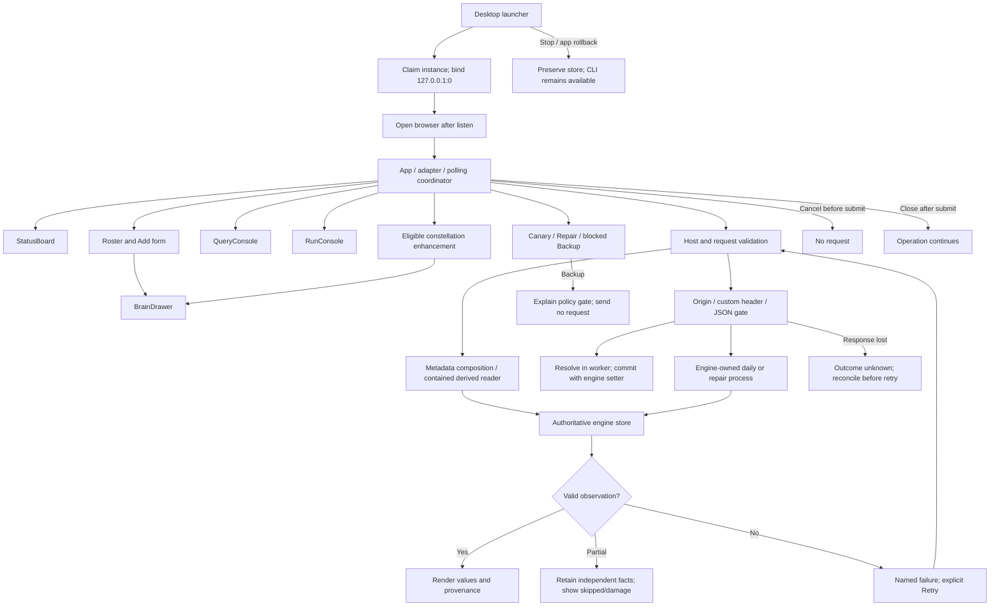
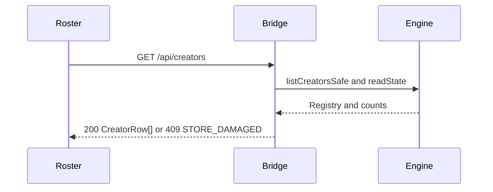
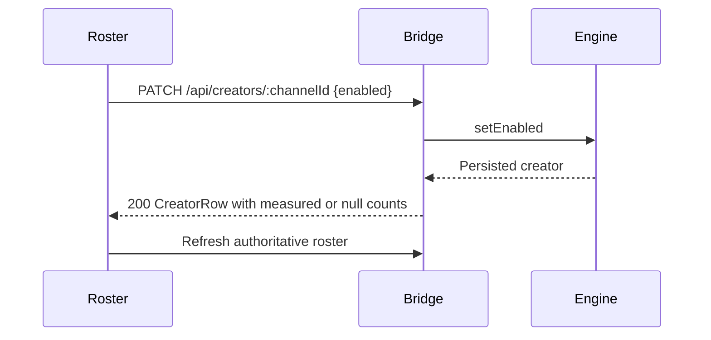
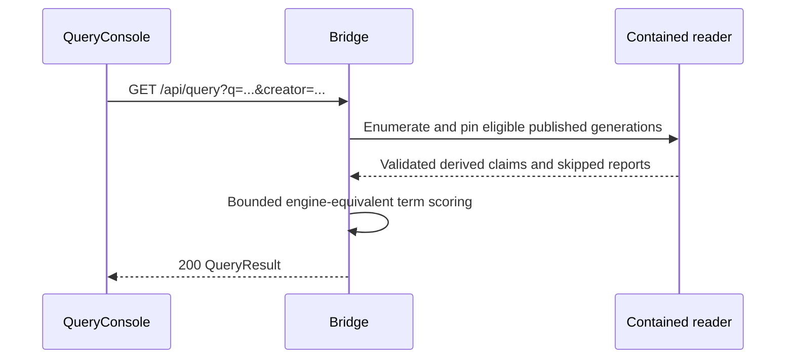
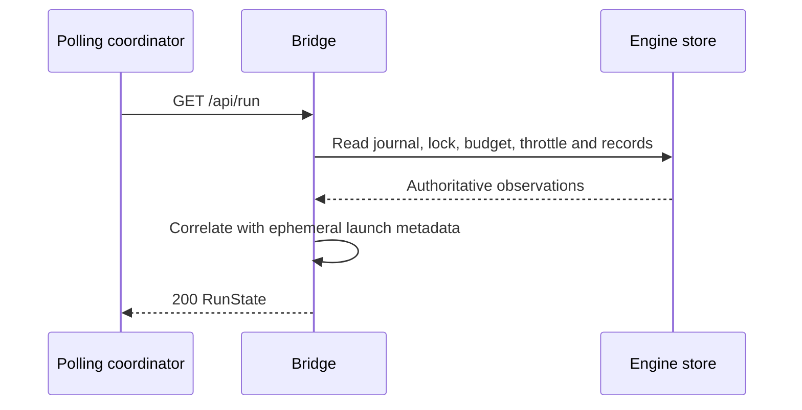
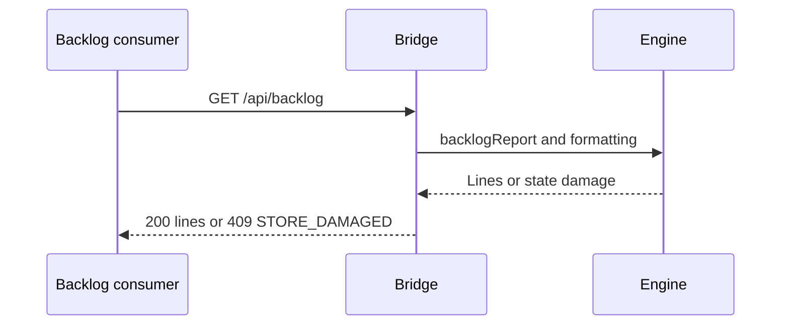
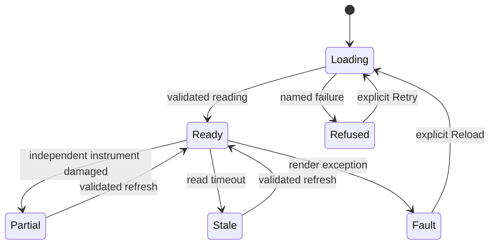
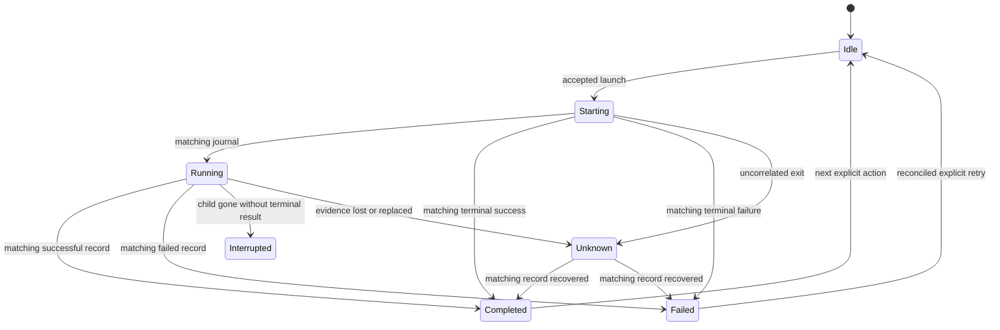
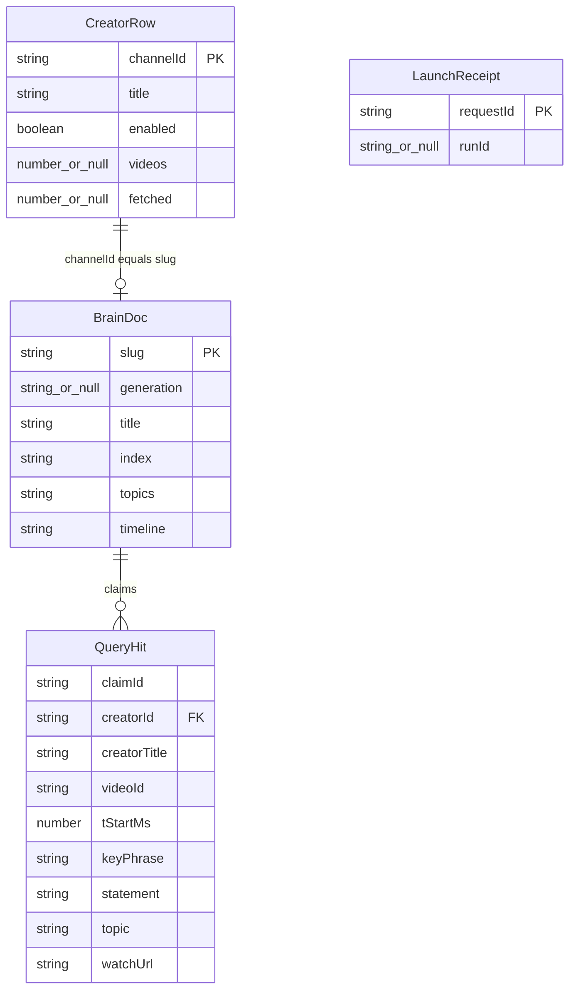

# Astra Reply — subscription transport — 2026-09-20T09:12:03.116Z

**Provider:** openai-codex
**Billing:** chatgpt-subscription
**Authentication:** chatgpt_subscription
**Transport:** codex-cli
**Requested model:** gpt-6-astra
**Served model:** NOT OBSERVABLE on codex-cli (see SERVED_MODEL_UNVERIFIABLE_NOTE)
**Reasoning effort:** high
**Tokens:** in=2429074 out=24124 reasoning=2627
**Packet:** `docs/ai-workflow/blueprints/creator-brains-console-20260917/17-astra-mega-packet.md`
**Wall:** 781.9s
**Mega Blueprint:** ARMED (document)

> Marginal cost $0 — this leg rides the ChatGPT subscription, not OpenRouter.

---
Mega Blueprints. I’ll verify the round-2 fixes against the current source, then emit the updated package in the required format. This session is read-only, so archive filing will remain blocked.

I’m using the forge and non-vibe-coding skills and have located the archived round-1 review. The amendments still conflict with active documents: the HTTP table promises the old run and repair responses, and the slice table still schedules the blocked backup route. I’m checking whether the code fixes hold across their callers.

Several closures do not survive the source check. The TypeScript contract still omits brain generation and unknown canary provenance. The drawer re-reads the pointer through `loadHits()` after checking containment, and `/api/query` bypasses that check entirely. The write header does match the adapter, but the Origin rule accepts any loopback port rather than requiring the serving origin.

The engine consistency check passes now: 15/15, with 85 `.mjs` files. TypeScript also passes, and the fatal UTF-8 decoder rejects an invalid byte inside a JSON string.

Two in-memory probes reproduced gaps in the new reader: `/api/query` follows a poisoned generation path outside `brains/`, and a pointer switch to an empty generation returns old markdown with an empty claims list. These exercised the actual functions with synthetic filesystem responses; they do not establish a live filesystem exploit.

I’m retaining the relocation, re-add consent/count fix, and fatal UTF-8 fix. The package will put the remaining reader and worker hardening before S2, use one contained generation reader for both drawer and query, and gate repair on the same cross-process journal proof as daily runs. The add resolver can run in a console-owned worker without changing engine files; the parent can commit through the existing synchronous resolver hook.

## PART A — HOSTILE REVIEW

**Verdict: REVISE.** The relocation is verified. Several claimed closures are incomplete, and the new containment and worker implementations introduce gaps that must close before S2.

Evidence prefixes:

- `C/` = `packages/creator-brains-console/`
- `E/` = `scripts/creator-brains/`
- `P/` = `docs/ai-workflow/blueprints/creator-brains-console-20260917/`

**Verified review boundary**

[VERIFIED] Inspected branch `creator-brains-engine-r2-20260915`, HEAD `3fb767374df673da32e26372459962b47baf838a`, dirty shared checkout. Input packet SHA-256:

```text
1d0bf0c40c8983be6a315dd1e078fe57441ddb4338e48a1932cfa63fdf46337b
```

[VERIFIED] Fresh checks:

- `node scripts/creator-brains/consistency-check.mjs`: **15/15**, 85 engine `.mjs` files, exit 0.
- `npm --prefix packages/creator-brains-console/web run typecheck`: **PASS**, exit 0.
- Fatal UTF-8 probe: malformed byte inside a quoted JSON string rejected; valid control accepted.
- In-memory filesystem probes exercised the actual drawer/query functions and reproduced the failures below.

[UNKNOWN] Current bridge/web suite results, real filesystem attacks, browser behavior, launcher behavior, GPU performance, and cross-process journal preservation. Fixture-writing suites were not executed in this read-only session. Historical mutation receipts were not independently reproduced.

**A1 — Verification of all sixteen round-1 findings**

| Round-1 ID | Round-2 disposition | Evidence and required correction |
|---|---|---|
| A1-01 | **CLOSED for installation-layout defect** | [VERIFIED] Fresh consistency check passes; neither staged nor unstaged engine changes outside the old console subtree appeared in the scoped diff. This does not establish a fresh full-engine suite result. |
| A1-02 | **PARTIAL** | [VERIFIED] Server split and relocation stand. `P/readiness.json:6`, `P/07-traceability.md:3`, and active document headers remain stale. Correct under R2-07. |
| A1-03 | **REOPENED** | [VERIFIED] `C/web/src/adapters/types.ts:16,85,103,123` still contradicts the amended contract. R2-01. |
| A1-04 | **PARTIAL** | [VERIFIED] Claims now exist, but generation consistency fails when the second generation contains no valid hits. R2-03. |
| A1-05 | **AMENDED, implementation deferred** | [VERIFIED] `P/05-contracts.md#1` changes acceptance, but §2b and actual adapter signatures retain the old shape. R2-06. |
| A1-06 | **GATE ACCEPTED; unresolved** | [VERIFIED] Journal precedes lock acquisition at `E/lib/run.mjs:107,154`. Apply the gate to repair too. R2-06. |
| A1-07 | **PARTIAL DOCUMENT CORRECTION** | [VERIFIED] Contract §1 is corrected; §2b, test T-B10, and adapters still promise `requeued`. R2-06. |
| A1-08 | **BLOCKED, correctly retained** | [VERIFIED] Backup remains absent from `C/routes.mjs:80`. Active S3 instructions must stop scheduling it. R2-06. |
| A1-09 | **PARTIAL** | [VERIFIED] Adapter sends the required header. Origin checking accepts unrelated loopback origins. R2-05. |
| A1-10 | **OFF-THREAD CHANGE PRESENT; closure incomplete** | [VERIFIED] Production probe uses a worker; lifecycle failures and stale-result isolation are missing. R2-04. |
| A1-11 | **REOPENED** | [VERIFIED] Directory checks cover the drawer only, not query or individual files. R2-02. |
| A1-12 | **SOURCE CORRECTION VERIFIED** | [VERIFIED] `C/lib/creators.mjs:99` preserves engine consent and uses nonthrowing measured-or-null counts. New regression tests exist; fresh suite execution remains NOT RUN. |
| A1-13 | **AMENDMENT ACCEPTED; propagation incomplete** | [VERIFIED] `P/19-held-findings.md#5` distinguishes refusal from uncertainty, but T-B19 still states the broader invariant. R2-06. |
| A1-14 | **PARTIAL** | [VERIFIED] Engine live-test exclusion is described; 375px drawings and mock matrix remain owed. New test-ID collisions exist. R2-08. |
| A1-15 | **VERIFIED** | [VERIFIED] `C/lib/http.mjs:173` uses fatal decoding; the direct malformed-string probe rejects with `VALIDATION`. |
| A1-16 | **PARTIAL** | [VERIFIED] README attribution improved; the amendment’s assertion that predictive usage claims were removed is false. R2-10. |

**A1 — Findings against the fixes and remaining active package**

| ID | Severity / confidence | Finding, evidence, concrete fix |
|---|---|---|
| **R2-01** | **High [VERIFIED]** | **The declared contract closure did not reach the contract or mounted consumer.** `types.ts:16` narrows status health; `:85` omits generation and retains `slug`; `:103` excludes `unknown` and null provenance. `LocalEngineAdapter.ts:80` still casts every non-status response. `StatusBoard.tsx:178` renders historical success as ordinary “ok” and pending health as “not resolved.” This contradicts `P/19-held-findings.md:21,46,53`. **Fix:** synchronize types, fixtures, serializers and consumed-route validators; render pending/history/failure explicitly. Preserve `slug` as the compatibility field containing a channel ID. |
| **R2-02** | **High [VERIFIED control flow; UNKNOWN live exploit]** | **Containment does not protect the complete read surface.** `C/lib/brains.mjs:147` calls `queryBrains` directly; `E/lib/render.mjs:68` joins unchecked pointer generations; `E/lib/query.mjs:57` reads that path. The synthetic probe returned a hit after reading `outside/rules.jsonl`. Drawer containment checks directories at `C/lib/brains.mjs:127`, then opens unchecked leaf files at `:241`; pointer files are also read before containment. **Fix:** one console-owned contained reader for pointer, generation and every derived leaf, used by both query and drawer. Reject escaping links before content reads. Retain real Windows filesystem tests as a release gate. |
| **R2-03** | **High [VERIFIED]** | **The generation guard operates on hits, so an empty generation bypasses it.** `C/lib/brains.mjs:259` resolves the pointer again; `:265` compares generation only inside the hit loop. The synthetic pointer-switch probe returned `generation:"gen-0001"`, markdown from generation 1, and empty claims read from generation 2. **Fix:** pin one pointer and read all four files directly from that generation. No second `loadHits()` traversal. Test switches to empty, malformed and missing-rules generations. |
| **R2-04** | **High [VERIFIED omissions; LIKELY process failure]** | **The worker has no owned failure lifecycle.** `C/lib/health-probe.mjs:36` creates a worker without `error`/`exit` handlers or a watchdog. `:75` clears only a Boolean; it neither terminates the worker nor drains/version-tags queued messages. `C/lib/health.mjs:75` caches history globally despite accepting a store root. **Fix:** retain worker/port ownership, handle error/exit/timeout, discard obsolete epoch messages, close resources on reset/shutdown, and isolate history by canonical store root. A worker startup failure must become a reading, not an unhandled process error. |
| **R2-05** | **Medium [VERIFIED contract deviation; UNKNOWN browser exploit]** | **“Same-origin” became “any loopback origin.”** `C/lib/write-gate.mjs:85,94,136` accepts any loopback port. The direct probe accepted `http://localhost:5173`. Its development justification at `:45` does not work in a browser: the adapter defaults to the page origin, while cross-origin custom-header requests receive no CORS permission. **Fix:** exact serving-origin equality, preserving Origin-less native clients and `x-console-write`. Serve the built app from the bridge; do not invent a cross-origin development exception. |
| **R2-06** | **High [VERIFIED]** | **Active build instructions can recreate rejected behavior.** `P/05-contracts.md#2b` retains `{runId}` and `{requeued}`; `P/08-slices-operations.md:10` schedules Backup; `P/06-test-plan.md#T-B19` retains “non-2xx means nothing was written.” Repair invokes the same `runDaily` journal path, but the amendment gates S4 alone. **Fix:** replace these instructions together; gate both repair and daily runs; retain Backup visibly blocked. Also replace the “engine change required” add-blocker claim with the additive resolver-worker design supported by `E/lib/registry.mjs:111`. |
| **R2-07** | **Medium [VERIFIED]** | **The machine-readable next step still describes the pre-relocation world.** `P/readiness.json:6` says the engine gate is red and D7 awaits Sean; `P/07-traceability.md:3` says no code exists. These are active control artifacts, not historical receipts. **Fix:** refresh current status and hashes, distinguish implemented source from runtime verification, and make the next slice S0H hardening. Preserve historical receipts unchanged. |
| **R2-08** | **Medium [VERIFIED]** | **New tests repeat the traceability defect and miss the relevant races.** `C/test/bridge.writegate.test.mjs:41` reuses T-B22a, already assigned at `bridge.brains.test.mjs:37`. `health.offthread.test.mjs:121` proves only that reset clears a flag. `bridge.brains.test.mjs:229` checks two namespaces, not a pointer switch during one read. **Fix:** retain T-B22 for brains, assign write-gate tests T-B26, enforce unique IDs, and add the explicit races in `09-tests.md`. |
| **R2-09** | **Medium [VERIFIED]** | **The containment fix rejects a generation the engine can emit.** `C/lib/brains.mjs:89` permits exactly four digits; `E/lib/render.mjs:76` uses `padStart(4)`, which emits `gen-10000` after 9999. The synthetic probe classified it as impossible store damage. **Fix:** accept canonical positive decimal generation suffixes padded to at least four digits. Separately report the engine’s four-digit enumeration at `render.mjs:74`; do not modify it in a console slice. |
| **R2-10** | **Low [VERIFIED]** | **The amendment certifies an edit that did not happen.** `P/19-held-findings.md:153` says predictive subscription estimates were removed; `P/10-astra-cost-and-value.md#1,#3,#6` retains them. **Fix:** classify document 10 as historical and explicitly supersede its usage predictions in the current README. Do not rewrite historical billing observations or claim remaining subscription capacity. |

**A2 — One hostile pass over this draft**

The following corrections are incorporated in Part B.

| ID | Draft defect | Correction |
|---|---|---|
| A2-R2-01 | A shared reader alone could still follow a symlink on `current.json` or a leaf. | The containment contract covers the pointer, ancestors, generation and each leaf; permission failures are not treated as absence. |
| A2-R2-02 | “Safe engine repair” sounded transcript-free, although the engine’s repair pipeline may internally consume its private tier. | Distinguish engine-internal processing from console presentation reads. The worker returns only the projected run result. |
| A2-R2-03 | Add-success copy required knowing whether a creator was newly created, but `CreatorRow` carries no such flag. | Use “Creator saved. Enabled: {Yes/No}.” Consent is shown from the response; creation status is not inferred. |
| A2-R2-04 | Exact-origin validation could reject a page served through the permitted `localhost` alias. | Derive the expected origin from the already validated request authority, including its actual port. |
| A2-R2-05 | Repair counts without `ok`, `runId`, or quarantine count could look successful after an unsuccessful run. | `RepairResult` includes engine identity, verdict and `quarantined`; missing counts cause a contract failure rather than fabricated zeros. |
| A2-R2-06 | A portable path-check plan implied protection against a malicious process continuously replacing filesystem links. | State that limitation explicitly. Test cooperating atomic publication and pre-existing links; do not certify hostile concurrent filesystem mutation without platform-specific proof. |

**Archive status:** [VERIFIED] The existing round-1 archive was queried and read. This output remains **unfiled** because this session permits no filesystem writes. The [archive skill](~/Desktop/@Everything/quick-pt/SS-PT/.claude/skills/hostile-review-archive/SKILL.md) requires: “Every hostile-review pass leaves exactly one file in `Z:\HostileReviews`.” Archive completion and reciprocal supersession remain pending.

## PART B — FORGED PACKAGE

### 00-README.md

**Creator Brains Console — round-2 governing revision**

Status: **REVISE; package emitted, not installed; implementation readiness not established.**

Owner: Sean. This revision retains CD3, D1–D9 adjudication and the executed D7 relocation. It authorizes no implementation, provider call, engine modification, transfer, push or deployment beyond the operator’s existing instructions.

**Path constants**

```text
C = packages/creator-brains-console
W = packages/creator-brains-console/web
E = scripts/creator-brains
P = docs/ai-workflow/blueprints/creator-brains-console-20260917
```

These are documentation abbreviations, not environment variables.

**Builder contract**

Follow decided behavior. Build one bounded slice at a time. Supply its diff, tests and real boundary evidence. Advance only after its checkpoint passes. Return consequential undisclosed decisions for adjudication; minor choices are bounded in Part C. Never replace missing evidence with historical test counts.

**Current state**

| Item | State |
|---|---|
| Relocated console and server split | [VERIFIED] Source present; D7 closed |
| Engine consistency | [VERIFIED] 15/15, 85 `.mjs` files |
| TypeScript | [VERIFIED] Current `typecheck` passes |
| Fatal UTF-8 decoding | [VERIFIED] Direct positive/negative probe |
| S0/S1 implementation | [VERIFIED] Present; remaining defects listed in Part A |
| Bridge/web test counts | Historical receipts only; fresh suites NOT RUN |
| Roster, drawer UI, query UI, run UI, constellation | Planned |
| Desktop launcher | Unproven; R1 incomplete |
| Backup | Visible blocked capability; endpoint absent |
| S7 | Explicit owner transfer gate |
| Archive / installed readiness receipt | BLOCKED by read-only session |

**Requirements and traceability**

| ID | Acceptance criterion | Component / test group | Slice |
|---|---|---|---|
| R1 | Desktop launch → usable console ≤15s; bind loopback port 0 | launcher; LAUNCH | S6 |
| R2 | All status instruments plus health provenance and >3-day warning | StatusBoard; HEALTH/WEB | S0H |
| R3 | Name damage; distinguish unknown, absent and measured zero | readers/validators; CONTRACT/READ | All |
| R4 | New creator disabled; re-add preserves consent; toggles persist | creator worker/roster; ADD | S2 |
| R5 | Search submitted terms; show cited hits and skipped data | query reader/UI; QUERY | S3a |
| R6 | One pinned generation; four derived files; no private presentation reads | published reader/drawer; READ | S0H/S2 |
| R7 | Valid budget; one accepted launch; engine-correlated verdict | run service/UI; RUN | S4 |
| R8 | Canary honest; repair reports actual result; Backup remains blocked | OpsRail; OPS | S3 |
| R9 | No restore/rollback/authorize/backup endpoint | route allowlist; ROUTES | All |
| R10 | Registry-driven scene; accessible equivalent; bounded loading/motion | constellation; SCENE | S5 |
| R11 | Closed tokens, 44px controls, contrast and complete states | components; WEB/VISUAL | All UI |
| R12 | UI uses adapter only; every consumed response validated | adapters; CONTRACT | All |
| R13 | Node-only bridge; exact-origin writes; bounded workers/readers | bridge; POLICY/HEALTH/READ | S0H |
| R14 | Eleven specified viewport sizes, including 375px | layout; VISUAL | S6 |
| R15 | Tag, copied source and verified manifest before authorized transfer | snapshot; TRANSFER | S7 |
| R16 | Complete keyboard workflow and focus restoration | DOM controls; WEB/VISUAL | S2–S6 |

**Document authority**

These nine documents supersede conflicting active planning instructions in original documents 01–08 and README when installed. Preserve original bytes first and record the mapping. Original reviews and receipts remain historical; document 10’s predictive usage claims are superseded, not validated.

No SQL tables, Sequelize models or database migrations are introduced. Filesystem data contracts, trust boundaries, sequences, state machines, rollback and tests apply. Mermaid rendering is NOT RUN.

### 01-architecture.md

**Mounted surface and ownership**

[VERIFIED] `W/src/main.tsx:15` mounts `<App/>`; `App.tsx:85` creates the adapter/poller and `:103` mounts StatusBoard. Other product panels are planned.

[VERIFIED] `C/server.mjs:94` constructs the Node HTTP server; gates precede `dispatch` at `:130`. `C/routes.mjs:84` begins the ordered read routes, `:99` the writes, and `:113` the unknown-route refusal. No Express/production-backend mount belongs to this surface.

The bridge owns validation, worker lifecycle and safe response projection. Engine setters own registry writes. Engine runners own acquisition/repair and their private internal processing. Console presentation reads only validated derived files and metadata.



**API sequences**

Common to every sequence: rejected Host never reaches dispatch. Invalid requests receive named errors. Transport loss after mutation dispatch is uncertain.

```mermaid
sequenceDiagram
  participant U as StatusBoard
  participant B as Bridge
  participant H as Health worker
  participant E as Engine metadata
  U->>B: GET /api/status
  B->>H: Request refresh if due; do not wait
  B->>E: Read independent instruments
  E-->>B: Values and damage reports
  B-->>U: 200 StatusInstrument with provenance
```



```mermaid
sequenceDiagram
  participant U as Add form
  participant B as Bridge
  participant W as Resolver worker
  participant E as Engine
  U->>B: POST /api/creators {ref}
  B->>B: Validate; claim add slot
  B->>W: Resolve validated reference
  W-->>B: Validated channel identity
  B->>E: addCreator with synchronous resolved-value hook
  Note over E: Fresh registry read occurs after resolution
  E-->>B: Persisted creator
  B-->>U: 201 CreatorRow; release slot
```



```mermaid
sequenceDiagram
  participant U as Drawer
  participant B as Bridge
  participant R as Contained reader
  U->>B: GET /api/brains/:channelId
  B->>R: Validate namespace; pin pointer once
  R->>R: Validate paths; read four files from pinned generation
  R-->>B: Documents, validated claims, skipped reports
  B-->>U: 200 BrainDoc or named refusal
```







```mermaid
sequenceDiagram
  participant U as OpsRail
  participant B as Bridge
  participant H as Health worker
  U->>B: GET /api/canary
  B->>H: Start refresh if TTL expired
  B-->>U: 200 current reading; pending/history labelled
  H-->>B: Epoch-tagged result or failure
  U->>B: Subsequent scheduled read
  B-->>U: Updated reading
```

```mermaid
sequenceDiagram
  participant U as RunConsole
  participant B as Bridge
  participant C as Daily child
  participant E as Engine store
  U->>B: POST /api/run/daily {perHour}
  B->>B: Validate; claim operation slot; check lock
  B->>C: Spawn fixed engine entry and arguments
  B-->>U: 202 requestId and null runId
  C->>E: Engine journal and terminal record
  U->>B: GET /api/run
  B->>E: Read matching evidence
  B-->>U: Correlated phase or unknown
```

```mermaid
sequenceDiagram
  participant U as OpsRail
  participant B as Bridge
  participant W as Repair worker
  U->>B: POST /api/repair {}
  B->>B: Claim shared operation slot; check lock
  B->>W: runDaily only reconcile/build/export
  Note over W: Engine internal processing remains engine-owned
  W-->>B: Run record
  B-->>U: 200 RepairResult including ok and runId
```

Backup has no API interaction: its disabled control explains the gate. An otherwise policy-valid direct `POST /api/backup` receives 404.





No relational schema is touched. This ER diagram describes **transport fields**, not database columns; complete field definitions are in `03-contracts.md`.



### 02-wireframes.md

**Exact tokens**

| Role | Token |
|---|---|
| Page | `var(--bg-base, #030712)` |
| Card / drawer | `var(--carbon, #141419)` / `var(--graphite, #1A1A24)` |
| Elevated surface | `var(--royal-depth, #003080)` |
| Required text | `var(--frost-white, #E0ECF4)` |
| Primary control | `var(--midnight-sapphire, #002060)` |
| Focus / primary glow | `var(--wing-purple, #8B5CF6)` |
| Secondary glow / enabled | `var(--ice-wing, #60C0F0)` |
| Warning / stale | `var(--gilded-fern, #C6A84B)` |
| Disabled marker | `var(--swan-lavender, #4070C0)` |
| Error accent | `var(--danger, #E5484D)` |
| Chart data only | `var(--arctic-cyan, #50A0F0)` |

Use existing spacing tokens 4/8/12/16/24/32/48/72px and radii 12/20/24px. Required text uses Frost White, including labels on warning/error surfaces. Measure contrast; do not infer it from token names.

**Desktop, 1440×900**

```text
+-----------------------------------------------------------------------+
| Creator Brains Console                         Last checked: {time}    |
| {global refusal or stale notice}                                       |
+----------------------------+------------------------------------------+
| BRAINS                     | STATUS                                   |
|                            | yt-dlp: {verdict, source, age, note}      |
| {static preview / scene}   | Creators | Coverage and states | Budget  |
|                            | Backlog | Throttle | Census | Lock       |
| [View creators]            | Last run | Last good | Documents         |
|                            | Published brains | Recent runs           |
|                            +------------------------------------------+
|                            | CREATORS                    [Add creator] |
|                            | {title}  Enabled: {Yes/No} {fetched}/{all} |
|                            | [Open brain]                [Enable/Disable]|
|                            +------------------------------------------+
|                            | ASK THE BRAINS                           |
|                            | Search terms [________________________]   |
|                            | Creator [All creators v]          [Ask]  |
|                            | {query state/results}                    |
|                            +------------------------------------------+
|                            | RUN THE DAILY PASS                       |
|                            | Operations per hour [20]      [Run pass] |
|                            | {phase, journal, budget, throttle, lock} |
|                            +------------------------------------------+
|                            | OPERATIONS                               |
|                            | [Check canary] [Repair] [Backup disabled]|
|                            | {result / blocked explanation}           |
|                            | Restore T4 · Rollback T4 · Authorize T3  |
|                            | CLI only                                 |
+----------------------------+------------------------------------------+
```

≥1280px: 40% scene, 60% deck; deck minimum 640px. At 768–1279px: preview above deck. At ≤767px: static 96px preview, no three.js download.

**Mobile, 375×812**

```text
+-----------------------------------+
| Creator Brains Console             |
| Last checked: {time}               |
| {global notice}                   |
+-----------------------------------+
| BRAINS                            |
| {static preview, 96px}             |
| [View creators]                   |
+-----------------------------------+
| STATUS                            |
| yt-dlp                            |
| {verdict / provenance / age}       |
| {each remaining instrument stacked}|
+-----------------------------------+
| CREATORS                          |
| [Add creator]                     |
| {title, wraps}                    |
| Enabled: {Yes/No}                 |
| Videos: {count/Unavailable}        |
| Fetched: {count/Unavailable}       |
| [Open brain] [Enable/Disable]      |
+-----------------------------------+
| ASK THE BRAINS                    |
| Search terms                      |
| [_______________________________] |
| Creator [All creators          v] |
| [Ask]                             |
| {query state/results}             |
+-----------------------------------+
| RUN THE DAILY PASS                |
| Operations per hour [20]          |
| [Run pass]                        |
| {phase and instruments}           |
+-----------------------------------+
| OPERATIONS                        |
| [Check canary] [Repair]            |
| [Backup disabled]                 |
| {result / blocked explanation}    |
| Restore T4 — CLI only             |
| Rollback T4 — CLI only            |
| Authorize T3 — CLI only           |
+-----------------------------------+
```

The same stacked structure works at 320px and 414px. No unspecified hamburger, MORE panel or hidden mobile action set.

**Add dialog, desktop 560px / mobile 375px**

```text
+----------------------------------------+
| Add creator                    [Close] |
| Handle, channel URL, or ID              |
| [____________________________________] |
| New creators start disabled.            |
| Existing creators keep their settings. |
| {validation / progress / result}        |
| [Cancel]                 [Add creator] |
+----------------------------------------+
```

At 375px, the dialog becomes a full-width sheet with 16px padding and vertically stacked controls when needed. During submission: “Resolving creator…” and “This request continues if you close this form.” Disable duplicate submission; Close remains available.

Success: **“Creator saved. Enabled: {Yes/No}.”**

**Drawer, desktop 640px / mobile full screen**

```text
+------------------------------------------------+
| {creator title}                        [Close] |
| {channelId}                                    |
| Published generation: {generation/None}         |
| [Index] [Topics] [Timeline] [Claims]             |
| {document or state frame}                      |
|                                                |
| {keyPhrase}                                    |
| {statement}                                    |
| {creatorTitle} · {timestamp}      [Watch video] |
| {N} items could not be read.                    |
| [Show details]                                 |
+------------------------------------------------+
```

At 375px, tabs wrap to two rows and citations stack. Documents are escaped plain text preserving line breaks; no HTML interpretation or remote embeds.

**Query results, desktop panel / mobile stacked card**

```text
+------------------------------------------------+
| Results for “{submitted terms}”                |
| {keyPhrase}                                    |
| {statement}                                    |
| {creatorTitle} · {timestamp}      [Watch video] |
| {N} items could not be searched.                |
| [Show details]                                 |
+------------------------------------------------+
```

**State frames used in every panel at both widths**

```text
LOADING / EMPTY                  PARTIAL / STALE
+----------------------------+  +----------------------------+
| {exact state copy below}   |  | {last confirmed content}   |
| {static skeleton or CTA}   |  | {notice and timestamp}     |
+----------------------------+  | [Show details] [Refresh]   |
                                +----------------------------+

ERROR / DENIED / VALIDATION       SUCCESS
+----------------------------+  +----------------------------+
| {named reason}             |  | {authoritative result}     |
| {inline field explanation} |  | {permitted next action}    |
| [Retry, when appropriate]  |  +----------------------------+
+----------------------------+
```

| Surface | Loading / empty | Partial, error or denied | Success / recovery |
|---|---|---|---|
| Status | “Reading engine status…” / “No creators yet — add your first creator.” | “Unable to read {file}.” / “Showing the last confirmed reading from {time}.” | Show all readable instruments; `[Refresh]` |
| Health | “Checking yt-dlp…” / “No recorded canary result.” | “Live probe failed. Recorded result from {time}.” / “Health is unknown.” | “yt-dlp resolved · {version} · checked {time}” |
| Roster | “Loading creators…” / “No creators yet — add one.” | “Counts unavailable.” / “Creator change confirmed. Roster refresh failed.” | “Creator is now enabled.” / “Creator is now disabled.” |
| Drawer | “Loading published brain…” / “No published brain for this creator.” | “{N} items could not be read.” / “Unable to read {file}.” | Documents and claims; `[Retry]` after read failure |
| Query | “Searching published brains…” / “No matching claims for “{terms}”.” | “{N} items could not be searched.” | Show submitted terms and citations; `[Ask]` |
| Run | “Reading run state…” / “The daily pass has not run yet.” | “Another run owns this store: PID {pid}, host {host}.” / “Run outcome unknown. Check engine records before retrying.” | “Starting…”, “Running”, “Completed”, “Failed”, “Interrupted”, “Outcome unknown” |
| Repair | “Repair is running…” / “No repair has been requested.” | “Repair outcome unknown. Check engine records before retrying.” | “Repair completed.” or “Repair failed.” plus four counts |
| Backup | No request or loading state | “Backup is unavailable until the private-backup boundary is approved.” | Disabled, explanatory copy always visible |
| Scene | “Brain overview is loading…” / “No creators yet — add your first creator.” | “Interactive view unavailable. Use the creator list.” | Roster-equivalent data |

Validation strings:

- “Enter a creator handle, channel URL, or channel ID.”
- “Use 200 characters or fewer.”
- “Enter search terms.”
- “Use 300 characters or fewer.”
- “Enter a positive whole number.”

Unknown holder fields show “unknown”. Cancel before dispatch sends nothing. A lost mutation response offers **“Refresh to check outcome”**, never an automatic retry.

All controls are ≥44×44px. Dialogs trap focus; Escape restores the invoking DOM control. Canvas clicks select the same creator as the roster; canvas is not a separate required keyboard workflow. Use polite live announcements for results, alert semantics for refusals, and static loading indicators under reduced motion.

### 03-contracts.md

**Target DTOs**

These are implementation targets for the hardening slice; they do not claim current source conformance.

```ts
type Damage = { file: string; detail: string };
type Skipped = { file: string; reason: string; creator?: string; claim?: string };
type Count = number | null;
type RequestOptions = { signal?: AbortSignal };

interface CanaryReading {
  ok: boolean;
  version: string | null;
  reason: string;
  checkedAt: string | null;
  ageMs: number | null;
  source: 'probe' | 'history' | 'unknown';
  stale: boolean;
  note: string | null;
}
interface LockReading {
  held: boolean;
  pid?: number;
  host?: string;
  alive?: boolean;
  ambiguous?: boolean;
}
interface BudgetReading {
  used: number;
  perHour: number;
  unit: string;
  byKind: Record<string, number>;
}
interface ThrottleReading {
  active: boolean;
  kind?: string;
  until?: string | null;
  text: string;
}
interface RecentRun {
  runId: string;
  ok: boolean;
  fetched: number;
}
interface StatusInstrument {
  ytdlp: CanaryReading;
  creators: { total: number; enabled: number; damaged: Damage | null };
  state: {
    damaged: Damage | null;
    videos: null | {
      total: number;
      fetched: number;
      coverage: number;
      counts: Record<string, number>;
    };
  };
  budget: BudgetReading;
  backlog: { lines: string[] };
  throttle: ThrottleReading;
  census: {
    inFlight: Array<{ channelId: string; detail: string }>;
    everSwept: number;
    discarded: boolean;
    error?: string;
  };
  lock: LockReading;
  lastRun: { status: string; runId: string | null } | null;
  lastGood: { at: string; staleDays: number } | null;
  documents: number;
  publishedBrains: number;
  recentRuns: RecentRun[];
}
interface CreatorRow {
  channelId: string;
  title: string;
  enabled: boolean;
  videos: Count;
  fetched: Count;
}
interface QueryHit {
  claimId: string;
  creatorId: string;
  creatorTitle: string;
  videoId: string;
  tStartMs: number;
  keyPhrase: string;
  statement: string;
  topic: string;
  watchUrl: string;
}
interface QueryResult {
  hits: QueryHit[];
  skipped: Skipped[];
}
interface BrainDoc {
  slug: string; // compatibility name; value is the channel ID
  generation: string | null;
  title: string;
  index: string;
  topics: string;
  timeline: string;
  claims: QueryHit[];
  skipped: Skipped[];
}
interface LaunchReceipt {
  requestId: string;
  runId: string | null;
}
type RunPhase =
  | 'starting' | 'running' | 'completed'
  | 'failed' | 'interrupted' | 'unknown';
interface RunState {
  journal: { status: string; runId: string | null } | null;
  lock: LockReading;
  throttle: ThrottleReading;
  budget: BudgetReading;
  recentRuns: RecentRun[];
  launch: null | {
    requestId: string;
    pid: number | null;
    runId: string | null;
    phase: RunPhase;
  };
}
interface RepairResult {
  runId: string;
  ok: boolean;
  repaired: number;
  built: number;
  emptied: number;
  quarantined: number;
}
interface ConsoleDataAdapter {
  getStatus(o?: RequestOptions): Promise<StatusInstrument>;
  listCreators(o?: RequestOptions): Promise<CreatorRow[]>;
  addCreator(ref: string): Promise<CreatorRow>;
  setCreatorEnabled(id: string, enabled: boolean): Promise<CreatorRow>;
  query(q: string, creator?: string, o?: RequestOptions): Promise<QueryResult>;
  getBrain(channelId: string, o?: RequestOptions): Promise<BrainDoc>;
  getRunState(o?: RequestOptions): Promise<RunState>;
  startDailyRun(perHour: number): Promise<LaunchReceipt>;
  canary(o?: RequestOptions): Promise<CanaryReading>;
  repair(): Promise<RepairResult>;
  backup(dest?: string): Promise<{ dest: string; ok: boolean }>;
}
```

`backup()` remains a typed `NOT_FOUND` rejection and sends no request. `dest` is compatibility surface, not permission to implement arbitrary destinations.

**HTTP contract**

| Method/path | Request | Success | Owning slice |
|---|---|---|---|
| GET `/api/status` | — | 200 `StatusInstrument`, composite damage fields | Existing/S0H |
| GET `/api/creators` | — | 200 `CreatorRow[]` | Existing |
| POST `/api/creators` | `{"ref":"@handle"}` | 201 `CreatorRow`; existing consent retained | Existing/S2 hardening |
| PATCH `/api/creators/:channelId` | `{"enabled":true}` | 200 `CreatorRow` | Existing |
| GET `/api/brains/:channelId` | encoded channel ID | 200 `BrainDoc` | Existing/S0H |
| GET `/api/query` | `q`; optional `creator` | 200 `QueryResult` | Existing/S0H |
| GET `/api/run` | — | 200 `RunState`; `launch` added in S4 | Existing/S4 |
| GET `/api/backlog` | — | 200 `{"lines":[]}` | Existing |
| GET `/api/canary` | — | 200 `CanaryReading` | Existing/S0H |
| POST `/api/repair` | `{}` | 200 `RepairResult`, including `ok:false` | S3b |
| POST `/api/run/daily` | `{"perHour":20}` | 202 `{"requestId":"…","runId":null}` | S4 |
| POST `/api/backup` | none supported | 404 after policy validation | Blocked |
| restore/rollback/authorize | any | 404 after policy validation | Excluded |

**Errors**

```json
{"error":{"code":"STORE_DAMAGED","message":"Unable to read state.json.","file":"state.json"}}
```

| Status | Code / meaning |
|---|---|
| 400 | `VALIDATION`: malformed target/body/identifier/query/budget |
| 403 | `FORBIDDEN_HOST`, `FORBIDDEN_WRITE`: pre-dispatch policy refusal |
| 404 | `NOT_FOUND`: absent route or unpublished brain |
| 409 | `STORE_DAMAGED`, `RUN_LOCKED`, `OPERATION_BUSY` |
| 422 | `REFUSED`: positively established pre-write engine refusal |
| 500 | `INTERNAL`: sanitized unexpected failure; mutation outcome may be unknown |

`RUN_LOCKED` includes `holder: LockReading`. Do not echo stacks, private absolute paths or unfiltered subprocess errors. Client transport or invalid-response errors are not fabricated HTTP responses. Oversized bodies may produce a connection reset; never retry the mutation automatically.

**Request policy**

1. Validate Host against allowed loopback names and the actual bound port.
2. Expected browser Origin is `http://` plus that validated authority.
3. Present Origin must exactly equal expected Origin. Reject `null`, other ports, aliases and schemes.
4. Origin-less native requests remain permitted.
5. Every mutating request requires `x-console-write: 1`.
6. Declared bodies require JSON media type; no CORS permission.
7. Body limit: 65,536 bytes; fatal UTF-8; non-null JSON object.
8. `ref`: trimmed, 1–200 characters. `q`: trimmed, 1–300 characters.
9. `enabled`: Boolean. `perHour`: positive safe integer JSON number.
10. Response caching: `no-store`.

Unknown routes remain absent; a failed security gate can return 403 before their 404.

**Contained derived reader**

New exports:

```ts
readPublishedBrain(channelId: string, o: { r: string }): BrainDoc;
readPublishedClaims(o: { r: string; creator?: string }): QueryResult;
searchPublishedClaims(
  q: string,
  o: { r: string; creator?: string; limit?: 40 }
): QueryResult;
```

- Namespace must be one safe component, ≤64 characters. New creator identities use the engine’s channel-ID validator. Legacy safe names remain readable; display titles never become paths.
- Canonicalize the selected store and validate `brains/`, namespace, `current.json`, generation and each leaf before content reads.
- Reject links outside the selected namespace/generation, including links to another creator’s generation. Fail closed on permission/realpath errors. Only `ENOENT` means missing.
- Read and validate `current.json` once per namespace per request. Missing pointer →404 for drawer; malformed pointer →409. Query records a bounded skipped report for a damaged namespace.
- No generation → `generation:null`, empty content, four named skipped entries.
- Generation spelling: `gen-` plus a positive decimal integer padded to at least four digits; suffix must fit a safe integer. Accept `gen-10000`; reject separators and noncanonical padding.
- Read only `index.md`, `topics.md`, `timeline.md`, `rules.jsonl`.
- Never call `loadHits()` or `queryBrains()` on uncontrolled store paths from a console presentation route.
- Parse rules once. Validate nonempty claim/creator identifiers, matching creator identity, valid YouTube video ID, finite nonnegative safe-integer timestamp and string key phrase. Missing optional `statement`/`topic` normalize to empty strings; wrong-typed values are skipped.
- Keep the actual `claim_id`. Join display title from the pinned pointer. Construct watch URLs from validated video ID and whole seconds.
- Query preserves current engine term scoring: lowercase whitespace terms; matched-term count descending, matched-character score descending; deterministic creator/claim-ID tie-break; maximum 40 hits.
- The small scoring projection is console-owned to avoid unsafe filesystem delegation. Pin parity against engine queries on valid synthetic fixtures.
- One pointer may change while a request is running; the request finishes from its pinned immutable generation. No second pointer traversal.
- Cooperating engine publication and pre-existing malicious links are in scope. Protection against an actively malicious local process replacing links between filesystem operations is **unproven**; do not claim it from `realpath()` checks.

Safety limits: pointer 64KiB; each markdown file 2MiB; rules 16MiB/50,000 lines per generation; one claim 64KiB; aggregate query scan 64MiB/200,000 rows. Exceeding a limit produces an explicit refusal/skipped reason, never a normal empty result. Tune only through a reviewed contract amendment using corpus-size evidence.

**Workers**

```ts
resolveCreator(ref: string, o: { timeoutMs: 185000 }):
  Promise<{ channelId: string; title: string; url: string }>;

readHealth(o: { r: string; now?: number }): CanaryReading;
disposeHealth(o: { r: string }): Promise<void>;

startDailyRun(perHour: number, o: { r: string }): Promise<LaunchReceipt>;
runRepair(o: { r: string }): Promise<RepairResult>;
```

Resolver: one pending job, no queue. Validate before spawning. Worker resolves only; parent calls:

```js
await addCreator({ ref, r, deps: { resolveCreator: () => resolved } });
```

The parent’s engine call reads registry after resolution. This avoids extending the existing synchronous commit window; it does not prove cross-process registry transaction isolation.

Health: one worker flight, 60-second refresh interval, 65-second worker watchdog accommodating the existing subprocess ceiling. Retain worker handles; handle error/exit; terminate and close ports on timeout/shutdown. Tag messages with epoch/job identity; reset invalidates old messages. Store-derived history is keyed by canonical root. Preserve prior readings with their original age while refresh is pending; never label pending as failed.

Run/repair: one shared operation slot per canonical store. Both require the external-runner journal gate. Daily child uses `process.execPath`, fixed absolute engine script, argument array, explicit store root and no shell. Correlate new journal run ID, child PID and launch-time window. A terminal result requires the matching engine record; exit zero is insufficient.

Repair calls `runDaily({r, only:['reconcile','build','export']})` in a worker. Engine-internal private processing remains engine-owned. Only the projected result crosses back into the console.

**Configuration and rollback**

`CREATOR_BRAINS_ROOT`: explicit root → existing environment override → engine default. No new provider secret or database configuration.

No store schema migration. Ship bridge and web bundle together when target contracts change. Application rollback stops the bridge, disables its launcher and restores approved console bytes. It does not undo consent changes or engine work. Restore remains owner CLI-only.

### 04-build-order.md

All files are under `C/` unless stated otherwise. Source and tests remain ≤300 canonical lines each.

| Order | File(s) | Imports / exports / responsibility | Budget |
|---|---|---|---|
| 1 | `P` current documents and readiness receipt | Preserve hashes; install this revision with supersession map | ≤300/document |
| 2 | `lib/write-gate.mjs`, `server.mjs` | Existing gate; pass validated serving origin; retain outer error handling | ≤280 each |
| 3 | `lib/published-paths.mjs` | Node fs/path; export pointer/leaf containment helpers | 240 |
| 4 | `lib/published-generation.mjs` | Path helpers; export pinned generation reader and bounded parser | 280 |
| 5 | `lib/published-query.mjs`, `lib/hits.mjs` | Reader + validated projection; export bounded scoring and `toQueryHit` | 240 each |
| 6 | `lib/brains.mjs` | Delegate drawer/query to common reader; remove unsafe second traversal | 220 |
| 7 | `lib/health-probe.mjs`, `lib/health-probe.worker.mjs`, `lib/health.mjs` | Worker ownership, epochs, timeout, root-specific history | 280 each |
| 8 | `web/src/adapters/types.ts`, `fixtures.ts`, `LocalEngineAdapter.ts`, `MockAdapter.ts` | Target DTOs, matching typed refusals, read signals | 280 each |
| 9 | `web/src/adapters/validate.ts`, `validate-derived.ts` | Existing validation pattern; export status and derived parsers | 260 each |
| 10 | `web/src/hooks/useStatus.ts`, `components/StatusBoard.tsx` | Abort timed-out reads; provenance-aware display | 280 each |
| 11 | `lib/resolve-creator.mjs`, `lib/resolve-creator.worker.mjs`, `lib/creators.mjs` | Resolver lifecycle; synchronous parent commit | 240 each |
| 12 | `web/src/components/CreatorRoster.tsx`, `AddCreatorForm.tsx`, `BrainDrawer.tsx` | Adapter-only UI, authoritative state, focus | 260 each |
| 13 | Corresponding hooks and `.styles.ts` | Separate lifecycle/styles; no global store | 220 each |
| 14 | `web/src/components/QueryConsole.tsx`, `QueryResults.tsx`, `OpsRail.tsx` | Search, canary, blocked Backup | 260 each |
| 15 | `lib/operation-slot.mjs`, `lib/repair.mjs`, `lib/repair.worker.mjs`, `routes.mjs` | Shared operation exclusion; projected repair result | 240 each |
| 16 | `lib/daily-launch.mjs`, `lib/run-observation.mjs`, `routes.mjs` | Fixed spawn and correlation | 260 each |
| 17 | `web/src/hooks/usePollingCoordinator.ts`, `useRun.ts`, `components/RunConsole.tsx` | One cadence owner; run state presentation | 260 each |
| 18 | `web/src/three/layoutBrains.ts`, `lifecycle.ts`, `BrainConstellation.tsx` | Deterministic data layout, eligibility and disposal | 260 each |
| 19 | Launcher template, `web/playwright.console.config.ts`, `web/e2e/*.spec.ts` | Actual fixture bridge and built-app verification | 260 each |
| 20 | S7 library build config and manifest tooling | Peer externals and receiving-adapter handoff | 260 each |

Tests listed in `09-tests.md` land before the corresponding implementation.

**Patterns to retain**

Literal route dispatch remains inspectable:

```js
if (req.method === 'GET' && p === '/api/creators') {
  return sendJson(res, 200, creatorRows(r));
}
```

The mounted inner boundary remains inside the shell:

```tsx
<ErrorBoundary scope="The status board">
  <StatusBoard state={status} />
</ErrorBoundary>
```

Styled-components continues using token fallbacks:

```tsx
const Panel = styled.section`
  background: var(--carbon, #141419);
  color: var(--frost-white, #E0ECF4);
  padding: var(--space-4, 16px);
`;
```

Fixture helpers remain in non-test modules. Do not import a test-registering module for its helper functions.

### 05-slices.md

| Slice | Scope / entry | Executable exit criteria |
|---|---|---|
| **S0H — hardening** | Existing relocated S0/S1. Files 1–10 in build order. | POLICY, READ, HEALTH, CONTRACT, WEB and ROUTES pass; current bridge/web suites pass; typecheck/build pass; real Windows leaf/junction tests and real built-app health provenance pass. No new route. |
| **S2 — roster and drawer** | S0H checkpoint. Files 11–13. | ADD and drawer/roster WEB cases pass; slow resolver leaves status responsive; real fixture add→toggle→re-add preserves consent; desktop/375px keyboard walkthrough. |
| **S3a — query and canary** | S2 checkpoint. File group 14. | QUERY and OpsRail WEB cases pass; citations and skipped reports visible; Backup sends no request. No new route. |
| **S3b — repair** | S3a plus **JOURNAL gate**. File group 15. | OPS and cross-process tests pass; result matches actual engine record including `ok` and quarantine count; add exactly the repair route. |
| **S3c — backup** | Owner resolves private-backup exception and destination contract. | **BLOCKED.** No implementation or endpoint in this package. |
| **S4 — daily run** | S3b plus JOURNAL gate. File groups 16–17. | RUN cases pass; one child under duplicate submission; fast/failed/interrupted runs remain truthful; Windows child-survival behavior measured. |
| **S5 — constellation** | S2 accessible roster; CD3 fixed. File group 18. | SCENE passes; zero prohibited chunk fetches; numeric motion/bundle/GPU evidence; Sean sees usability result. |
| **S6 — integrated candidate** | S0H/S2/S3a/S3b/S4/S5 complete. File group 19. | LAUNCH, VISUAL, full regression and combined hostile review pass. Backup’s blocked scope is explicit; full R8 completion is not claimed. |
| **S7 — transfer** | S6 plus explicit owner go. File group 20. | TRANSFER manifest matches; receiving repo builds and verifies its adapter/trust boundary. |

**Do not proceed to a dependent slice until its checkpoint passes.**

A failing JOURNAL gate returns to the engine owner. It does not permit editing engine files or substituting a console mutex for cross-process exclusion.

Run from repository root:

```powershell
$consolePath = 'packages/creator-brains-console'
$bridgeTests = @(Get-ChildItem "$consolePath/test" -Filter '*.test.mjs' |
  Sort-Object Name | ForEach-Object FullName)
node --test @bridgeTests
npm --prefix "$consolePath/web" test
npm --prefix "$consolePath/web" run typecheck
npm --prefix "$consolePath/web" run build

$engineTests = @(Get-ChildItem 'scripts/creator-brains/test' -Filter '*.test.mjs' |
  Where-Object Name -ne 'live.test.mjs' |
  Sort-Object Name | ForEach-Object FullName)
node --test @engineTests
node scripts/creator-brains/consistency-check.mjs
```

These fixture-writing/build commands require a writable implementation session. Record actual results and per-file test identities; no fixed aggregate count is an acceptance criterion.

### 06-bans.md

- No engine source modification, including generation rollover or journal locking, within console slices.
- No private transcript presentation reader, route, download, export or model transmission.
- No Backup endpoint until its boundary is separately decided.
- No restore/rollback/authorize, arbitrary-command, filesystem-browser or throttle-clear endpoint.
- No route before its owning slice.
- No unsafe `loadHits()`/`queryBrains()` filesystem traversal from presentation routes.
- No second pointer lookup during a pinned-generation read.
- No treating permission errors as missing files.
- No “containment verified” claim based solely on lexical paths or directory-only checks.
- No registry writes in the resolver worker; no stale registry carried through resolution.
- No assumption that an in-process slot protects against external engine runners.
- No automatic mutation retries or completion inferred from exit code/lock disappearance.
- No fabricated zero counts, fresh timestamps or successful health verdicts.
- No uncontrolled HTML or unvalidated citation URLs.
- No global history cache shared across store roots.
- No orphan worker messages accepted after reset, shutdown or timeout.
- No undocumented cross-origin development exception.
- No MUI, Tailwind, Electron, Web Component wrapper or new global state library.
- No off-palette decoration; Arctic Cyan is data-only.
- No hover-only controls or required canvas-only workflow.
- No three.js fetch on mobile, reduced motion or absent WebGL.
- No historical result presented as a fresh test.
- No broad staging, resets, cleanup, shared-lane takeover, main push or deployment.
- No retrospective editing of historical review findings.
- No user queries, transcript text, private paths, credentials or request bodies in logs.
- No claim that application rollback undoes engine mutations.
- No file exceeding 300 canonical lines; split by responsibility.

### 07-checkpoints.md

**Checkpoint evidence**

Each slice records the exact checkout/commit, dirty owned files, source hashes, requirement/test mapping, commands, actual results, expected behavioral RED where feasible, GREEN, real boundary evidence, limitations, rollback and next authorized slice.

Review the final diff against this package. Return **PASS**, **REVISE** with concrete findings, or **HALT** with the blocking boundary. A2 is package self-hardening, not an independent implementation approval. Preserve existing reviewer receipts and user-selected review authority; this package schedules no provider calls.

**Readiness receipt for this response**

| Item | Status |
|---|---|
| Packet identity | VERIFIED, hash in Part A |
| Current source and mounted consumer | VERIFIED within stated scope |
| D7 / engine consistency | VERIFIED |
| Current TypeScript | PASS |
| Fatal decoder positive/negative probe | PASS |
| Query traversal / empty-generation race | REPRODUCED using synthetic filesystem responses |
| Actual Windows filesystem attack tests | NOT RUN |
| Bridge/web regression suites | NOT RUN |
| Build / browser / launcher / GPU | NOT RUN |
| External-runner journal test | NOT RUN; gate retained |
| Updated artifact files / preserved snapshot | Emitted only; filesystem installation BLOCKED |
| Readiness integrity check on emitted package | NOT RUN |
| Archive filing | BLOCKED |
| Implementation readiness | NOT ESTABLISHED |

Inspected-source fingerprints:

```text
brains.mjs
a74de649a101c6930fe6d89a651eb337120dc3fcb0c549cfcfd03bedcb24e366
health-probe.mjs
47b497b85efa28dbc619eedba961107e88d73f47d294bb22927ac9d21bc9580f
types.ts
ee36b27c7d7dec4a8537977b136a53cd0647cc435633cfe15fe77bac843a8e34
```

**Performance and motion**

- Bridge bind ≤1.5s; Desktop-to-usable ≤15s.
- Warm metadata reads p95 ≤50ms on a declared fixture; measure cold reads separately.
- Status response ≤256KiB.
- Initial JS ≤500KiB gzip; three chunk ≤900KiB gzip.
- Scene test: 40 creators, DPR≤2, median frame time≤16.7ms on named hardware.
- Enhancement gate: first valid status read, width≥768px, visible/intersecting panel, no reduced motion, successful WebGL probe, then idle callback. Fallback timer: 1s after first valid status.
- Dolly≤2.5s, once per page load; skip if renderer is unavailable 3s after first valid status or the operator has interacted.
- Drift≤0.25°/s; no autonomous zoom or text pulsing.
- Stop rAF within one frame of hidden/offscreen; dispose on runtime reduced-motion changes.
- Poll coordinator: active 2s; active beyond 10min 5s; idle 5s; hidden 15s; immediate refresh on visibility return.
- Reads have a 15s watchdog and AbortSignal. Stale responses cannot replace newer observations.

**Operations**

Owner: Sean. Logs contain route template, method, status, duration, opaque request ID and sanitized lifecycle/refusal codes. Rotate at 1MiB, retain three files. No body/query/private-content logging.

On bridge restart, engine work remains authoritative; ephemeral launch metadata may be lost. Show uncertainty until matching engine evidence is recovered.

**Preservation and filing**

Before installing these documents, preserve the active packet and all owned tracked/untracked source with full SHA-256 manifest. Do not overwrite the round-1 raw reply or receipts. Refresh `readiness.json` only from installed bytes and actual evidence.

File round 2 through `Z:/HostileReviews/new-review.mjs`, superseding:

```text
2026-09-20-004440-creator-brains-console-astra-mega-blueprint
```

Complete the review body/header, reciprocal link and reindex before archive completion is claimed.

No filesystem artifacts were created by this pass. Future receipts/screenshots belong under the packet’s evidence directory.

### 09-tests.md

**Execution status:** New regression modules below are required implementation deliverables, not existing PASS evidence. Missing modules are setup gaps, not valid RED.

All integration stores must be newly created temporary roots. No default store, production DB or live YouTube acquisition. Fake external resolver/probe processes must be distinguishable from real engine-file integration.

| Group / file | Named cases and proof |
|---|---|
| **POLICY** `test/bridge.writegate.test.mjs` | Rename write-gate IDs to T-B26. `same origin accepted`; `different port refused`; `different alias refused`; `foreign and null Origin refused`; `native request accepted`; `custom header exact value required`; `JSON body required`; `OPTIONS grants no CORS`; actual adapter reaches bridge. Refusals leave registry bytes unchanged. |
| **READ** `test/published-generation.test.mjs` | `pointer pinned once`; `switch to empty generation keeps original claims`; `switch to malformed generation keeps original claims`; `missing rules reported`; `malformed pointer differs from absent`; `generation 10000 accepted`; bounds refuse explicitly. |
| **READ** `test/published-containment.test.mjs` | Real fixture: poisoned query pointer, namespace junction, generation junction, pointer symlink, markdown symlink, rules symlink, cross-creator link and permission denial. Assert refusal before outside content read, plus valid nonempty controls. |
| **READ** `test/published-claims.test.mjs` | Null/scalar JSONL rows, invalid timestamp/video ID, mismatched creator ID, duplicate claim identity, missing optional prose, oversized line. Invalid rows are named in `skipped`; valid actual IDs survive. |
| **HEALTH** `test/health.lifecycle.test.mjs` | `worker startup error becomes unknown`; `unexpected exit releases slot`; `watchdog terminates worker`; `old epoch ignored`; `reset drains old work`; `shutdown closes ports`; `store A history never appears in store B`; pending refresh preserves old timestamp. |
| **HEALTH** `test/health.offthread.test.mjs` | Deterministic slow fake subprocess proves concurrent route responsiveness; cold and expired-cache paths measured separately. Do not rely on installed yt-dlp taking 1.7s. |
| **CONTRACT** `web/src/test/route-contracts.test.ts` | Local/Mock parity; null counts; unknown/history provenance; generation; every newly consumed malformed nested payload; healthy controls; invalid success body becomes named contract error. |
| **WEB** `components/StatusBoard.test.tsx` | Historical `ok:true` is labelled history/stale; unknown pending is not failure; actual failure differs from pending; independent damage does not hide healthy instruments; >3-day warning uses gold. |
| **ADD** `test/creators.worker.test.mjs` | Slow resolution leaves HTTP responsive; worker never writes registry; parent reads registry after resolution; re-add preserves intervening consent change; measured/null counts; concurrent add receives busy; worker failure leaves registry unchanged. |
| **WEB** roster/add/drawer test files | No optimistic consent; neutral save copy; uncertain response triggers reconciliation; all drawer tabs; generation label; literal HTML stays text; focus restored on Close/Escape. |
| **QUERY** `test/query.parity.test.mjs` | Valid synthetic corpus matches engine scoring and top-40 behavior; ties deterministic; actual claim IDs retained; same-time distinct claims remain distinct; damaged namespace yields visible skipped entry. |
| **WEB** `components/QueryConsole.test.tsx` | Submitted-term copy; stale response discarded; creator filter; skipped rows; citation seconds; duplicate-time claims render independently. |
| **JOURNAL** `test/run-concurrency.test.mjs` | Two real engine child processes, shared temp store: losing runner cannot replace winner’s journal identity or terminal result. Repeat daily-vs-repair. Failure blocks both S3b and S4. |
| **OPS** `test/repair.test.mjs` | Real engine record projects all four counts and `ok`; failed result cannot read completed; busy exclusion; worker failure becomes uncertain; no raw content in result. |
| **RUN** `test/run-launch.test.mjs` | Positive safe-integer validation; one child under rapid double-submit; 202 contains null engine ID; fast terminal run correlates; unrelated/reused PID rejected by identity/time checks; exit zero alone unknown; failed record never completed; restart loses only documented metadata. |
| **WEB** OpsRail/RunConsole tests | Exact state copy; holder details; failed repair verdict; blocked Backup sends nothing; read abort on unmount; no automatic mutation retry. |
| **SCENE** `three/layoutBrains.test.ts`, `lifecycle.test.ts` | Sorted deterministic layout; real counts/unknown counts; hidden/offscreen pause; runtime reduced motion; full disposal and single renderer after remount. |
| **LAUNCH** `web/e2e/console-launch.spec.ts` | Actual built app and fixture bridge; real `main.tsx` mount; missing hashed asset fails visibly; launcher from unrelated cwd; single-instance behavior; ≤15s evidence. |
| **VISUAL** `web/e2e/console-responsive.spec.ts` | All eleven sizes, 44px controls, no clipping/overlap, complete keyboard tasks, focus restoration, axe and measured contrast. |
| **SCENE** `web/e2e/console-motion.spec.ts` | Network proves prohibited chunk fetches absent; late dolly skipped; DPR/motion bounds; hardware frame measurements separate from software GL. |
| **ROUTES** `test/bridge.hy4.structure.test.mjs` | Exact slice-specific allowlist across server/router; no premature routes; cap walk reaches web; unique test IDs. |
| **TRANSFER** `test/snapshot.test.mjs` | Tag exists; copied source matches complete manifest; changed/missing/unlisted owned source blocks transfer. |

**Executable seed regression**

Install as `C/test/r2-contract.test.mjs`. This is a complete runnable test module. The different-port test is expected to fail against the reviewed gate until S0H fixes it.

```js
import test from 'node:test';
import assert from 'node:assert/strict';
import { Readable } from 'node:stream';
import { readBody } from '../lib/http.mjs';
import { writeGateFailure } from '../lib/write-gate.mjs';

const request = (origin) => ({
  method: 'POST',
  headers: {
    host: '127.0.0.1:54321',
    origin,
    'content-type': 'application/json',
    'content-length': '2',
    'x-console-write': '1',
  },
});

test('R2-POLICY-01: same serving origin remains accepted', () => {
  assert.equal(writeGateFailure(request('http://127.0.0.1:54321')), null);
});

test('R2-POLICY-02: another loopback port is refused', () => {
  const result = writeGateFailure(request('http://127.0.0.1:5173'));
  assert.equal(result?.code, 'FORBIDDEN_WRITE');
});

test('R2-UTF8-01: invalid byte inside JSON string is rejected', async () => {
  const bytes = Buffer.from([123,34,114,101,102,34,58,34,255,34,125]);
  await assert.rejects(
    readBody(Readable.from([bytes])),
    (err) => err.code === 'VALIDATION' && /UTF-8/.test(err.message),
  );
});

test('R2-UTF8-02: valid JSON remains accepted', async () => {
  assert.deepEqual(
    await readBody(Readable.from([Buffer.from('{"ref":"sample"}')])),
    { ref: 'sample' },
  );
});
```

**Exact targeted commands**

```powershell
$c = 'packages/creator-brains-console'
node --test "$c/test/r2-contract.test.mjs"
node --test "$c/test/published-generation.test.mjs" "$c/test/published-containment.test.mjs" "$c/test/published-claims.test.mjs"
node --test "$c/test/health.lifecycle.test.mjs" "$c/test/health.offthread.test.mjs"
node --test "$c/test/creators.worker.test.mjs"
node --test "$c/test/query.parity.test.mjs"
node --test "$c/test/run-concurrency.test.mjs"
node --test "$c/test/repair.test.mjs" "$c/test/run-launch.test.mjs"
npm --prefix "$c/web" test
npm --prefix "$c/web" run typecheck
npm --prefix "$c/web" run build
```

From `C/web` after the isolated configuration exists:

```powershell
npx --no-install playwright test --config playwright.console.config.ts
```

Viewport matrix:

```text
320×812, 375×812, 414×896, 768×1024, 1024×768, 1280×800,
1440×900, 1920×1080, 2560×1440, 3840×2160, 3440×1440
```

**Mock boundary matrix**

| Evidence | Establishes | Does not establish |
|---|---|---|
| In-memory filesystem probes | Actual reader control flow under supplied filesystem responses | Real junction behavior or live-store exploit |
| Real temporary store + HTTP | Serialization and engine file-format integration | Live acquisition/provider availability |
| Fake resolver/probe subprocess | Scheduling, lifecycle and error containment | YouTube or installed yt-dlp availability |
| Fake fetch / MockAdapter | Consumer states and contract behavior | Actual bridge compatibility |
| Built app + fixture bridge | Mounted browser workflow | Production data or receiving-repo behavior |
| Software WebGL | Eligibility and teardown logic | Sean’s GPU performance |
| Mutation test | Named guard’s sensitivity | Complete feature correctness |

## PART C — DECISION-DENSITY SELF-TEST

| Builder choice | Disposition |
|---|---|
| Console location / server split | **Decided:** relocated package; no repeated D7 decision |
| First implementation work | **Decided:** S0H, before dependent UI |
| Contract identifier | **Decided:** retain `slug` wire compatibility; its value is channel ID |
| Claimed generation consistency | **Decided:** one pointer, four files, no second engine traversal |
| Query safety versus engine reuse | **Decided:** contained console reader and bounded scoring projection, engine-parity tests |
| Namespace/generation/link rules | **Decided:** explicit validation and per-file containment; real Windows proof required |
| Hostile concurrent filesystem replacement | **Explicit limit:** not certified by portable checks; no stronger claim without platform proof |
| Reader resource limits | **Decided:** exact limits in contracts; amendments require measured evidence |
| Claim identity/title | **Decided:** real claim ID and pinned pointer title |
| Missing optional claim prose | **Decided:** empty string only for absent optional fields; invalid types skipped |
| Cross-origin development | **Decided:** no exception; browser verification uses bridge-served build |
| Write header | **Decided:** `x-console-write: 1` |
| Health worker ownership | **Decided:** retained handles, epochs, timeout, cleanup, root-specific history |
| Pending health copy | **Decided:** pending/unknown/history are distinct from failure |
| Add blocking | **Decided:** resolve in worker, commit in parent through existing engine hook |
| Add queue/retry | **Decided:** one pending resolution, no queue or automatic retry |
| Add-success copy | **Decided:** neutral saved/enabled message; no invented creation flag |
| Cross-process registry isolation | **Explicit limit:** parent commit avoids a new long race; does not certify external writers |
| Repair and daily exclusion | **Decided:** shared slot plus cross-process journal gate |
| Engine journal defect | **Blocked boundary:** engine owner; no console engine patch |
| Launch correlation | **Decided:** request ID separate from engine ID; matching PID/time/run evidence |
| Repair result | **Decided:** identity, verdict and four measured counts |
| Backup | **Owner decision pending:** visible blocked control, no endpoint |
| Lost mutation response | **Decided:** uncertainty and reconciliation; no automatic retry |
| Cancel | **Decided:** pre-submit only; closing does not roll back dispatched work |
| Polling | **Decided:** one coordinator, specified cadence, read aborts and stale-response guards |
| Mobile / accessibility | **Decided:** stacked deck, full DOM workflow, drawn 375px states |
| Scene layout details | **Bounded delegation:** deterministic channel-ID ordering, data-driven encoding, no required occluded controls |
| Three.js version | **Bounded delegation:** pin in web lockfile; satisfy bundle/browser gates; no engine dependency |
| Minor styling/extraction | **Bounded delegation:** existing tokens, hierarchy, ≤300 lines and viewport/focus gates |
| Historical documents | **Decided:** preserve; current index explicitly supersedes stale claims |
| Review filing | **Pending:** writable session must file and link round 2 |
| Transfer | **Blocked until explicit owner go** and receiver evidence |

**Result:** the revised package is emitted. Code defects, runtime gates, artifact installation and archive filing remain explicitly unresolved.
