# Astra Reply — subscription transport — 2026-09-20T10:26:15.272Z

**Provider:** openai-codex
**Billing:** chatgpt-subscription
**Authentication:** chatgpt_subscription
**Transport:** codex-cli
**Requested model:** gpt-6-astra
**Served model:** NOT OBSERVABLE on codex-cli (see SERVED_MODEL_UNVERIFIABLE_NOTE)
**Reasoning effort:** high
**Tokens:** in=3195886 out=23615 reasoning=5877
**Packet:** `docs/ai-workflow/blueprints/creator-brains-console-20260917/17-astra-mega-packet-r3.md`
**Wall:** 900.8s
**Mega Blueprint:** ARMED (operator flag)

> Marginal cost $0 — this leg rides the ChatGPT subscription, not OpenRouter.

---
Mega Blueprint. I’ll check the eight fixes against the packet and current source, then emit the forged package in the required format. This session is read-only, so filing the review to `Z:\HostileReviews` is blocked; I’ll keep that limitation explicit.

I’m using the `fable-blueprint-forge` and `non-vibe-coding` skills. The archive has the round-2 review, and the working tree is dirty. I’m checking whether the containment preflight covers exactly the same namespaces and files that the engine later reads.

The source has two gaps worth testing: the preflight skips generation checks for names the engine still traverses, and `/api/status` still calls the engine’s pointer traversal without containment. The instruction sweep also leaves old run/repair adapter signatures and a journal gate that applies to S4 but not S3’s repair path. I’ll use in-memory probes to check the mechanisms without writing fixtures or touching the real store.

The in-memory probe reproduced the bypass: `bad.name` passes preflight without its pointer being read, then the engine query reads an outside rules file and returns a hit. That verifies the control-flow defect; real Windows filesystem reproduction remains unrun.

Four direct probes with real workers passed: startup failure, exit, stale-epoch filtering, and watchdog timeout. The remaining lifecycle gap is shutdown wiring: the bridge does not call the worker cleanup path.

The draft verdict is **REVISE**, with five residual findings across containment, shutdown, exact-origin matching, and active instructions. The health provenance display and generation-name fixes are present. In the package, I’m keeping `/api/status` at HTTP 200 with a damaged published-brain reading, and applying the journal-preservation gate before either repair or daily-run execution.

## PART A — HOSTILE REVIEW

**REVISE — not dry. Five residual findings: two high, three medium.** The containment bypass was reproduced using actual function bodies with a synthetic filesystem. Four direct tests using real worker threads passed. Full fixture suites, browser checks and real Windows filesystem attacks were **NOT RUN**.

Evidence prefixes:

- `C/` = `packages/creator-brains-console/`
- `P/` = `docs/ai-workflow/blueprints/creator-brains-console-20260917/`
- `E/` = `scripts/creator-brains/`

[VERIFIED] Reviewed a dirty working tree on `creator-brains-engine-r2-20260915`, observed HEAD `0ce516a256228e70c1c99152ff96fb37b48321db`. The supplied packet file’s SHA-256 was `72991daac8faf81d89532a87173d70ce873ad233983eeb96ecaeb9cff356ad5b`. This binds the packet, not every uncommitted source file.

**A1 — Findings against the existing fixes**

**R3-01 · HIGH · R2-02 remains bypassable through an invalid namespace**

[VERIFIED] `C/lib/brain-read.mjs:279–286` enumerates every entry and calls `readPublishedBrain()`. But `:186` returns `null` immediately for a namespace outside `NAMESPACE`. The caller ignores that return value. Consequently, neither its generation nor its leaves are checked.

The engine traverses that same entry without this restriction: `E/lib/render.mjs:66–68` reads its pointer and joins its generation; `E/lib/query.mjs:54–62` opens its rules. `C/lib/brains.mjs:55–58` therefore delegates after an incomplete preflight.

**Reproduction:** a synthetic `brains/bad.name/current.json` named `../../../outside/gen-0001`. The preflight accepted it without reading its pointer; the subsequent query opened the outside rules and returned one hit. This used the current functions with filesystem dependencies substituted in memory. **Real filesystem exploitability remains [UNKNOWN].**

The supplied `C/test/bridge.readsurface.test.mjs` covers valid namespace shapes; it does not construct this enumeration mismatch.

**Fix:** an invalid *enumerated* namespace must abort preflight with `409 STORE_DAMAGED`, before engine traversal. It must never mean “skip this entry,” because the engine will not skip it. Add cases for `bad.name` and a 65-character namespace, each pointing to a readable outside generation.

**R3-02 · MEDIUM · R2-02 still misses the status route’s pointer traversal**

[VERIFIED] `C/routes.mjs:84` mounts `/api/status`; `C/lib/status.mjs:149` calls `listPublished(r)` directly. That function reads every `current.json` at `E/lib/render.mjs:67`, without the new containment checks.

An escaping namespace or pointer link therefore remains reachable through another console read route. The output is a count; **this finding does not claim that status serves outside markdown or transcript text**. The defect is the unchecked file read and a count derived from an untrusted pointer.

**Fix:** derive `publishedBrains` through a contained pointer enumerator. Preserve status’s HTTP-200 partial-damage contract: return an unavailable count with a named damage field, and render that refusal while retaining unrelated instruments. Add a status-route junction test and a healthy-count control.

**R3-03 · MEDIUM · R2-04 implements reset, but does not connect it to bridge shutdown**

[VERIFIED] `C/lib/health-probe.mjs:274–281` closes the channel through `retire()`. However, `C/server.mjs:210–220` releases the instance and closes the HTTP server without releasing the probe or health cache. Source searches found no shutdown caller of either cleanup function.

The supplied lifecycle tests invoke `resetProbeChannel()` directly. They cannot detect this missing production connection. [LIKELY] An embedded bridge that shuts down while its process remains alive can retain an idle worker or an in-flight probe.

**Fix:** acquire a probe-owner lease after successful bridge startup; release it during shutdown. The last owner releases the worker and caches. Do not unconditionally reset the global channel when another bridge still owns it. Test real `startBridge()` → probe → `shutdown()`, including two simultaneous owners.

**R3-04 · MEDIUM · R2-05 implements a socket-alias allowlist, not exact origin equality**

[VERIFIED] `C/lib/write-gate.mjs:128–130,166–169` accepts both `localhost` and `127.0.0.1` for either serving hostname. `C/server.mjs:131` supplies the fixed bind hostname rather than the validated request authority.

Direct execution produced:

| Claimed Origin | Expected origin | Accepted |
|---|---|---:|
| `http://127.0.0.1:49321` | `http://127.0.0.1:49321` | Yes |
| `http://localhost:49321` | same | **Yes** |
| `http://127.0.0.1:5173` | same | No |
| `http://127.0.0.1:49321/path` | same | **Yes** |
| `http://user@127.0.0.1:49321` | same | **Yes** |

The port defect is corrected. The stronger exact-origin contract is not. `C/test/bridge.writegate.test.mjs:123–145` explicitly expects alias interchangeability, so that test preserves the deviation.

**Fix:** derive the expected origin from the already-approved request Host and actual bound port. Require the supplied Origin to be a serialized HTTP origin equal to it. A page loaded through `localhost` remains valid when posting to that same authority. Reject credentials, paths, queries and fragments. Preserve Origin-less native clients and the existing header/media-type requirements.

**Browser exploitation is [UNKNOWN]**; the remaining custom-header and CORS barriers were not bypassed in this review.

**R3-05 · HIGH · R2-06 leaves executable instructions that recreate rejected behavior**

[VERIFIED] The sweep corrected several rows but left three material conflicts:

1. **Repair precedes its external-runner gate.** `P/08-slices-operations.md:10` admits repair in S3; `:11` places the two-process journal-preservation evidence in S4. `P/19-held-findings.md:24,106` still explicitly gates only S4. A shared console mutex does not satisfy that external-process gate.
2. **The adapter contract still promises the rejected results.** `C/web/src/adapters/types.ts:192,194` declares `{runId:string}` and `{requeued:number}`. `LocalEngineAdapter.ts:125,134` retains those signatures; `MockAdapter.ts:128–129` returns `{requeued:3}`. Updating the document alone has not synchronized the transfer interface.
3. **Active prose still teaches the superseded implementation.** `P/19-held-findings.md:67–70` instructs a second `loadHits` pointer resolution and per-hit generation checks. `P/README.md:5` still says resolving the add-blocker requires engine changes, contradicting its corrected lower section.

**Fix:** require journal preservation before **either** repair or daily-run activation; synchronize both adapters and the interface with the amended contracts; replace those active paragraphs. Extend contract checks to method return types—`T-B27`’s field-name comparisons do not cover these signatures.

**Disposition of the eight targeted fixes**

| Fix | Round-3 disposition |
|---|---|
| R2-01 | [VERIFIED] Health provenance types, validator and mounted display corrections are present. T-B27 is a field-presence check, not complete type equivalence. Deferred method drift is recorded in R3-05. |
| R2-02 | **REOPENED:** R3-01 and R3-02. |
| R2-03 | [VERIFIED] Drawer source uses one pointer resolution and one selected generation. Concurrent filesystem behavior remains unproven. |
| R2-04 | **PARTIAL:** real-worker startup-error, exit, stale-epoch and watchdog probes passed; shutdown wiring remains R3-03. |
| R2-05 | **PARTIAL:** wrong-port refusal works; exact-origin contract remains R3-04. |
| R2-06 | **PARTIAL:** R3-05. |
| R2-09 | [VERIFIED] The two-shape generation regex accepts `gen-10000` and excludes padded five-digit forms. Existing engine rollover defect remains engine-owned. |
| R2-10 | [VERIFIED] Document 10 is marked historical and its predictions are explicitly superseded. No allowance claim is adopted here. |

R2-07 and R2-08 are excluded from the defect count. [VERIFIED] The current write-gate file uses `T-B26`; the packet’s claim that it still uses `T-B22` is stale. This observation is not a separate closure review of R2-08.

**Evidence limits**

- The junction tests construct real directory links and assert their resolution. They do not establish readable **file-symlink** behavior.
- The leaf tests distinguish escape from unreadability on the drawer response. Their query assertions do not make that same reason-level distinction.
- The paired mutation results are packet claims, not re-executed evidence in this turn.
- The synthetic traversal probe required two harness corrections before execution: exit 1 at `#!/usr/bin/env node`, then exit 1 at an incorrectly retained export block. Neither was product RED evidence.
- An additional control/metadata command returned no result before termination; no verification claim relies on it.

**A2 — One hostile pass over the drafted replacement package**

| Draft defect | Correction incorporated below |
|---|---|
| A blanket status preflight would turn one damaged brain into failure of the entire instrument. | Isolate published-brain damage; retain HTTP 200 and other readings. |
| Resetting the global worker on every shutdown could interrupt another bridge. | Use idempotent owner leases; reset only after the final release. |
| Comparing only with the numeric bind address would reject a legitimate page loaded through `localhost`. | Compare against the validated request authority, without alias equivalence. |
| Ignoring an invalid namespace would repeat the engine/preflight mismatch. | Enumerated invalid names are hard refusals, never skips. |
| A plan could imply that emitted documents or proposed tests had been installed and passed. | Mark the package as emitted, tests as unmaterialized/unrun, and archive filing as blocked. |

**Archive status: BLOCKED.** The prior round-2 filing was read. This session permits no filesystem writes, so this review has **not** been filed to `Z:\HostileReviews` or indexed. Under Rule 86, it is not a completed archived review.

## PART B — FORGED PACKAGE

### 00-README.md

# Creator Brains Console — Round-3 S0H correction package

**Version:** R3 proposed amendment  
**Status:** emitted for implementation; not installed; not runtime-certified  
**Owner:** console builder; independent checkpoint reviewer  
**Scope:** R3-01 through R3-05 only.

This package amends the existing Creator Brains Console packet. It does not replace historical reviews or authorize S2–S7 implementation, engine edits, deployment, transfer or paid review calls.

**Builder contract**

Implement one correction slice at a time. Preserve the current dirty work before edits. Follow the contracts below; return consequential omissions for adjudication. Each checkpoint requires the scoped diff and observed acceptance evidence. A proposed test is not a passing test.

**Requirements**

| ID | Required outcome | Acceptance |
|---|---|---|
| H-R1 | Every namespace the query engine may traverse has passed containment. | Invalid enumerated namespaces refuse before any outside read; valid brains remain queryable. |
| H-R2 | Status never follows an unchecked publication pointer. | Escaping pointer/namespace produces HTTP 200 with a named unavailable count; other instruments remain readable. |
| H-R3 | Probe resources follow bridge ownership. | Last shutdown retires the channel; another live owner prevents premature retirement. |
| H-R4 | Browser writes use exact request-origin equality. | Same-authority writes pass; cross-alias, wrong-port and malformed Origin values refuse. |
| H-R5 | Current instructions and transfer interfaces agree. | Run/repair signatures match the amendment; both operations share the external-runner entry gate. |
| H-R6 | Verification remains evidence-bounded. | No historical count, structural check or synthetic probe is presented as runtime certification. |

**Preservation and authority**

The packet hash and observed HEAD are recorded in Part A. They are not a preservation snapshot of the dirty tree. Before implementation, the writable owner must capture scoped pre-edit hashes and snapshots, confirm current lane ownership, and record any changes since this review.

`lane.mjs digest` reported “not a git repository — no ledger” although direct Git commands resolved the repository. **Ownership coverage is UNKNOWN; implementation must resolve that discrepancy.** Continuity promotion count was zero.

**Build order:** containment and status → lifecycle ownership → origin matching → contract/instruction reconciliation → combined verification and archive filing.

### 01-architecture.md

# Architecture

**Existing mounted paths [VERIFIED]**

- Browser: `web/src/App.tsx:85–104` constructs the adapter, polls status and mounts `StatusBoard`.
- HTTP: `routes.mjs:84–109` dispatches the existing nine routes.
- Query: `lib/brains.mjs:53–58` validates, preflights, then calls engine scoring.
- Drawer: `lib/brain-read.mjs:183–249` selects one generation.
- Probe: `lib/health.mjs` composes the root-specific reading; `lib/health-probe.mjs` owns the shared worker.

**Decisions**

1. Preserve engine query scoring. Correct the preflight’s traversal coverage.
2. Factor contained pointer reading so status can count publications without reading their markdown or rules.
3. Query continues to refuse the whole request when its read surface is damaged.
4. Status records publication damage locally and remains HTTP 200.
5. Keep the worker shared, with explicit bridge-owner leases.
6. Keep the nine-route allowlist unchanged.

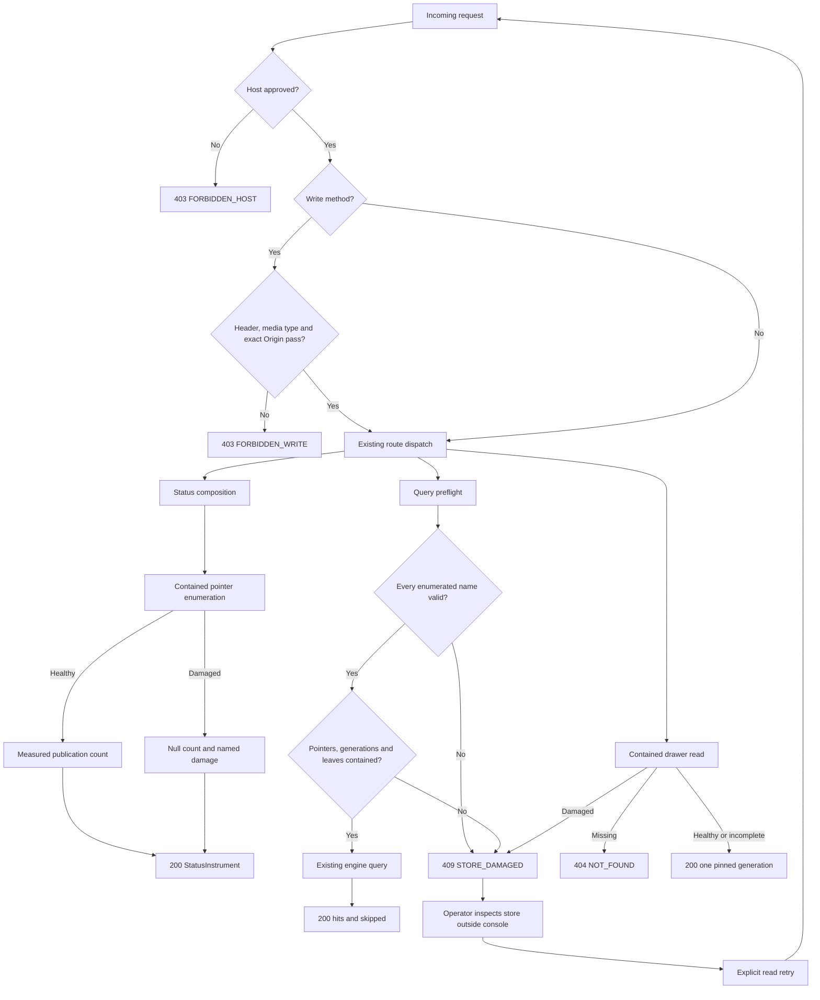

**API sequences**

The unchanged routes remain documented here to preserve the complete S0 boundary.

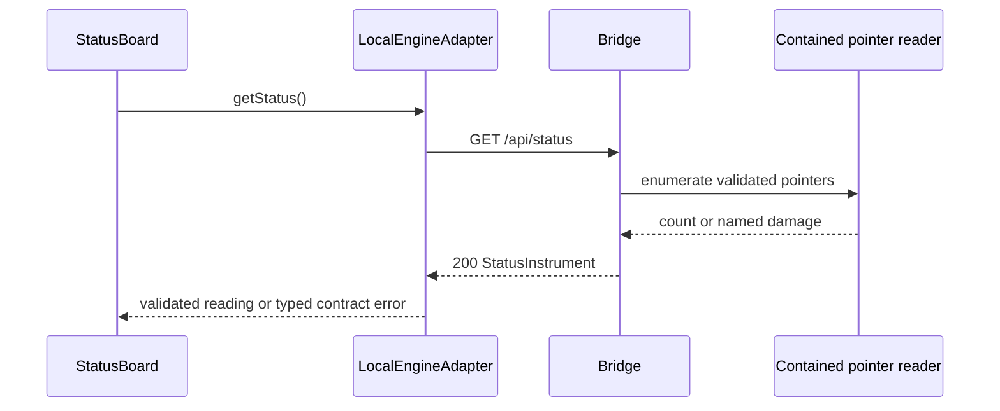

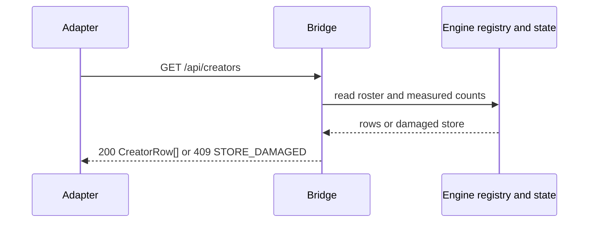

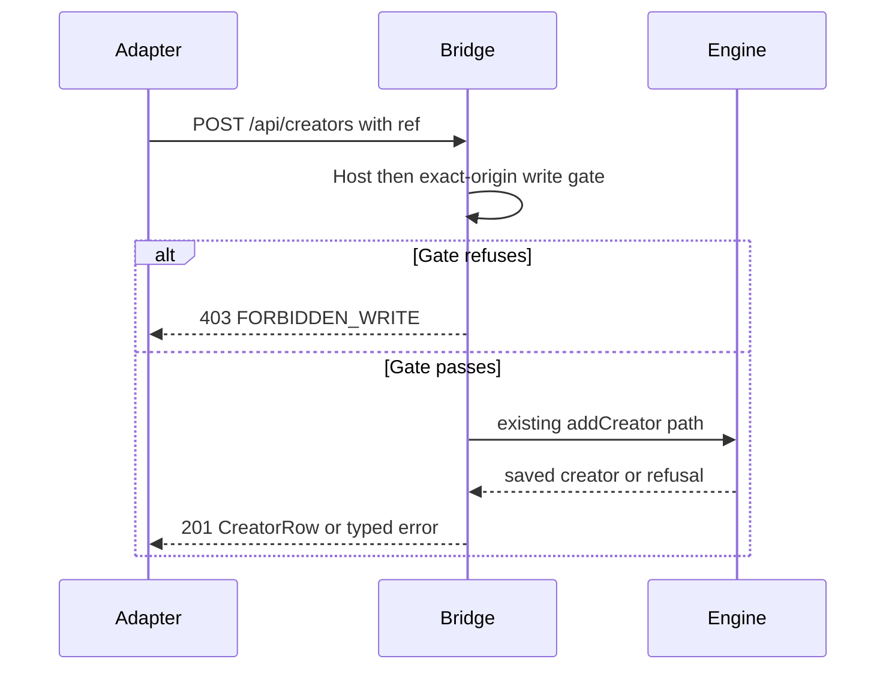

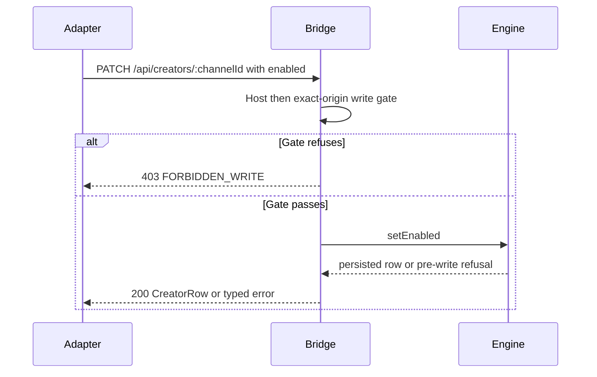

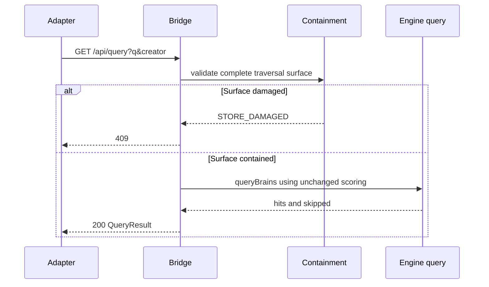

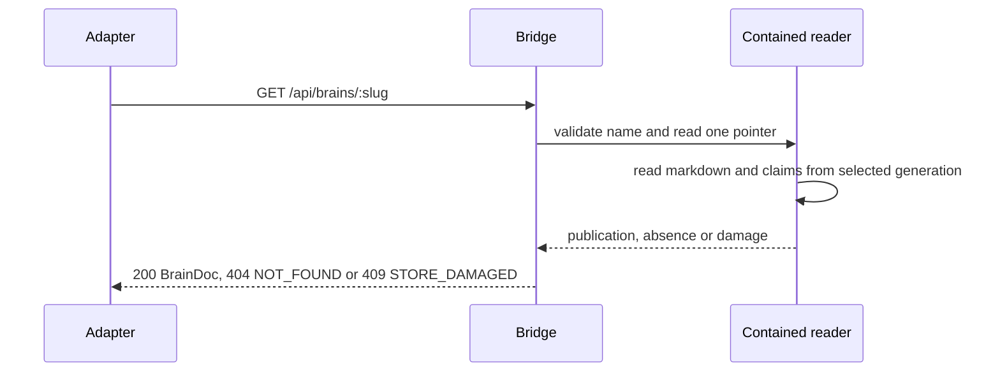

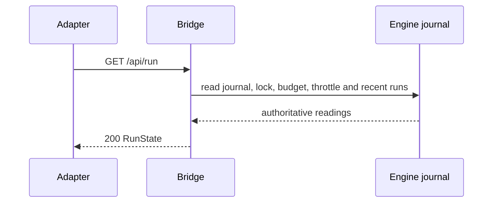

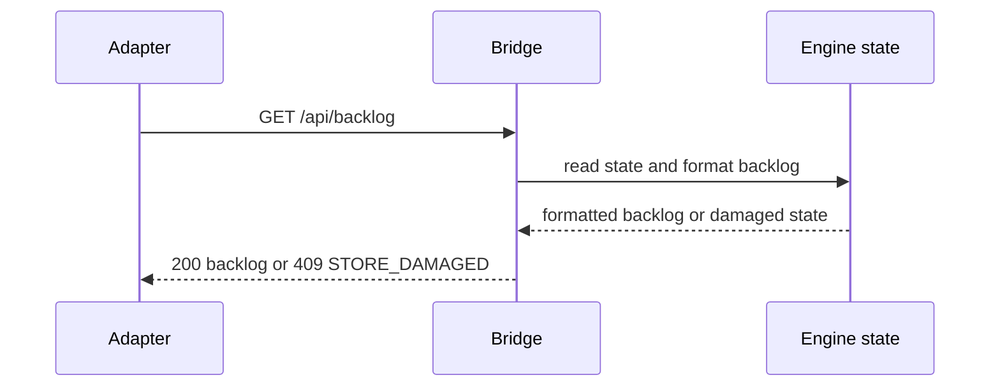

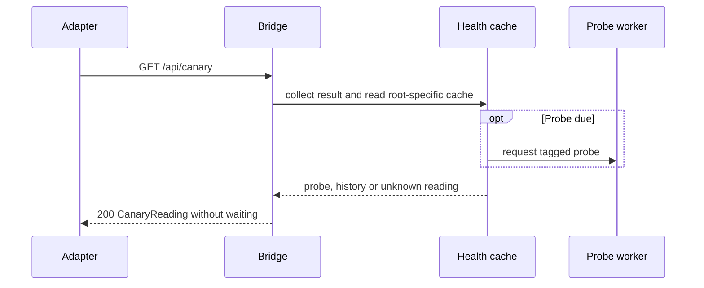

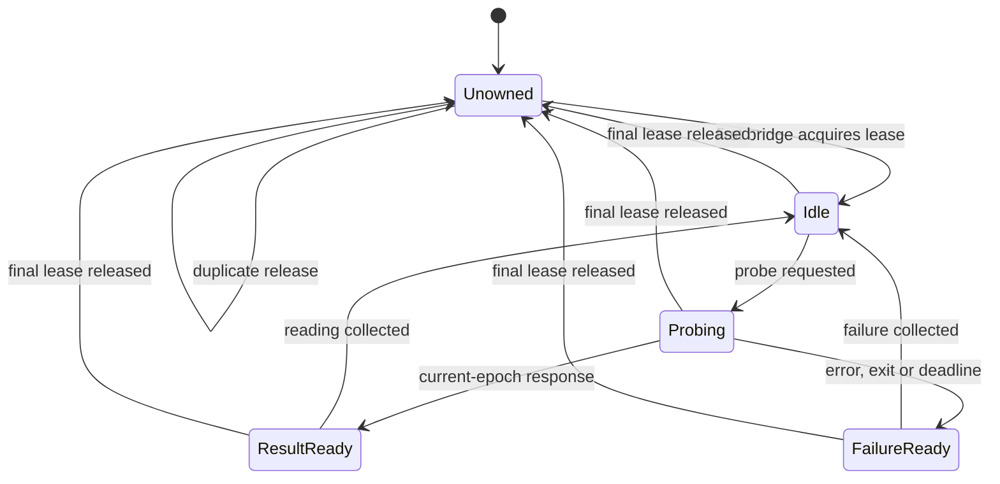

**ERD:** N/A — this correction creates or changes no database tables or durable store schema. API projections and in-memory owner state are specified in `03-contracts.md`; inventing SQL columns would misdescribe this file-backed engine.

**Race boundary:** pre-existing links are in scope. Protection against hostile concurrent link replacement remains unproven. This amendment does not claim portable filesystem atomicity.

Mermaid source is supplied; rendering was not verified.

### 02-wireframes.md

# Scoped wireframes

The affected screen is the existing S1 status shell. S2 roster/drawer, S3 query/operations and later constellation screens are outside this correction package; no new screens are authorized.

**Exact tokens**

| Use | Token |
|---|---|
| Page | `var(--bg-base, #030712)` |
| Panel | `var(--carbon, #141419)` |
| Primary text | `var(--frost-white, #E0ECF4)` |
| Warning and unavailable reading | `var(--warn, #C6A84B)` |
| Focus | `var(--wing-purple, #8B5CF6)` |
| Accent | `var(--ice-wing, #60C0F0)` |
| UI font | `var(--font-ui, system-ui)` |
| Data font | `var(--font-data, monospace)` |

**Desktop — existing shell, updated publication reading**

```text
Creator Brains Console
loopback · single operator

+--------------------------------+------------------------------------------+
|                                | Status                              live |
| The constellation arrives in   |                                          |
| S5 (CD3 “Vault Observatory”).   | yt-dlp            {health text}          |
|                                | Creators          {enabled} of {total}   |
|                                | Video coverage    {fetched}/{total}      |
|                                | Budget            {engine reading}       |
|                                | Backlog           {engine lines}         |
|                                | Throttle          {engine text}          |
|                                | Census            {reading or refusal}   |
|                                | Run lock          {reading}              |
|                                | Last run          {reading}              |
|                                | Last good         {reading}              |
|                                | Documents         {count or refusal}     |
|                                | Published brains  {count or refusal}     |
|                                | Recent runs       {reading}              |
+--------------------------------+------------------------------------------+
```

**375px — same screen and state slots**

```text
+-------------------------------------+
| Creator Brains Console               |
| loopback · single operator           |
+-------------------------------------+
| The constellation arrives in S5      |
| (CD3 “Vault Observatory”).           |
+-------------------------------------+
| Status                         live |
|                                     |
| yt-dlp                              |
| {health text, wrapping}              |
|                                     |
| Creators                            |
| {enabled} enabled of {total}         |
|                                     |
| Video coverage                      |
| {fetched} of {total} ({percentage})   |
|                                     |
| Budget / Backlog / Throttle          |
| {each label and value on own rows}   |
|                                     |
| Census / Run lock / Last run         |
| {each label and value on own rows}   |
|                                     |
| Last good / Documents                |
| {each label and value on own rows}   |
|                                     |
| Published brains                    |
| {count or named refusal, wrapping}   |
|                                     |
| Recent runs                         |
| {reading, wrapping}                  |
+-------------------------------------+
```

These frames use the same state replacements at both widths:

| State | Exact copy / rendered replacement |
|---|---|
| Initial loading | `Status` followed by `Reading the store…`; `aria-busy="true"`. |
| Healthy empty store | Published brains: `0`; last run, last good and recent runs: `none recorded`; backlog: `no backlog reported`. |
| Probe pending | `not yet checked — no verdict has been taken` |
| Successful live probe | `ok · {version}`; use `version unknown` when null. |
| Successful history | `ok as of {checkedAt} ({age} ago) — from the last recorded check, not a live one` |
| Failed history | `last check failed as of {checkedAt} ({age} ago) — {reason}` |
| Failed probe | `failed — {reason}` |
| Damaged publication pointer | Published brains: `refused — {file} unreadable`; immediately below: `{detail}`. Count withheld. |
| Recovering poll | Retain previous reading; header: `last poll failed ({code}) — showing previous reading`. Next successful poll replaces it. |
| Initial transport/contract failure | `No instrument can be shown — the bridge did not answer, or answered with a payload this console cannot read. {code}: {message}` |
| Render failure | `The console hit an error it could not render.` Keep the shell header visible. |
| Render-failure recovery | `reload the page to try again · the component stack is in the browser console` |
| Denied read | Use the initial-failure or previous-reading frame with the typed denial code; never substitute zero. |

No forms or mutation controls are added here. Client-side validation, save, cancel and mutation-retry states are therefore N/A for this screen. Gate refusals remain API behavior until their existing owning UI slices land.

At 375px, values wrap beneath labels; no horizontal page scrolling or clipped identifiers. Refusal updates use a named alert without moving focus. Polling must not steal focus. Existing controls retain 44px targets. No motion is added.

### 03-contracts.md

# Contracts

**Contained publication access**

```ts
type Damage = { file: string; detail: string };

type PointerSnapshot = {
  namespace: string;
  generation: string | null;
  title: string;
  pointerPath: string;
  generationDir: string | null;
};

function readContainedPointer(
  r: string,
  name: string,
  options?: { enumerated?: boolean }
): PointerSnapshot | null;

function listContainedPublishedPointers(
  r: string
): PointerSnapshot[];

function assertReadSurfaceContained(r: string): void;
```

Rules:

- Direct invalid drawer names retain the existing not-found behavior.
- Invalid names encountered during enumeration throw `STORE_DAMAGED`; they are never ignored.
- Use the existing namespace allowlist and canonical generation pattern.
- Contain the namespace and pointer before reading the pointer.
- Only `ENOENT` represents absence. Permission, I/O and malformed-JSON failures represent damage.
- Validate any named generation and its resolved directory.
- Query preflight additionally checks every served leaf.
- Status enumeration reads pointer metadata only; it never calls engine `listPublished()`.
- The drawer reads its pointer once and uses the resulting generation for all four files.
- These helpers introduce no store writes.

**Status amendment**

```ts
interface PublicationStatus {
  publishedBrains: number | null;
  publishedBrainsDamaged: Damage | null;
}
```

Both fields become required in `StatusInstrument`, fixtures and its runtime validator.

| Situation | `publishedBrains` | `publishedBrainsDamaged` |
|---|---:|---|
| Healthy empty store | `0` | `null` |
| Healthy publications | measured integer | `null` |
| Pointer enumeration/read/containment failure | `null` | `{file, detail}` |

`GET /api/status` remains HTTP 200. Other instruments retain their existing behavior. Deploy the serializer, adapter validator and mounted rendering together; an older incompatible bundle must surface its contract error rather than silently render a false count.

**Write gate**

```ts
originAllowed(origin: unknown, expectedOrigin: string): boolean;

writeGateFailure(
  req: IncomingMessage,
  expectedOrigin: string
): null | { code: 'FORBIDDEN_WRITE'; message: string };
```

- Host validation runs first.
- Build `expectedOrigin` from that validated request authority and the bound port.
- Accept a present Origin only when it is exactly the serialized HTTP origin expected for this request.
- No alias expansion, user information, path, query or fragment.
- Origin-less requests retain native-client support.
- `x-console-write` remains required on writes.
- Declared bodies require `application/json`.
- A refusal is HTTP 403 before body dispatch or mutation.
- No CORS permission is added.

**Probe ownership**

```ts
function acquireHealthOwner(): () => void;
```

The returned release function is idempotent. Successful bridge startup acquires one lease. Bridge shutdown releases it. Releasing the final lease invokes health-cache/channel cleanup; releasing an earlier lease does not interrupt another owner.

A failed bind acquires no lease. Explicit test reset remains available. Production worker messages continue to carry the channel epoch; stale messages are discarded.

**Deferred transfer-interface correction**

```ts
type DailyAcceptance = {
  requestId: string;
  runId: string | null;
};

type RepairCounts = {
  repaired: number;
  built: number;
  emptied: number;
};

interface DeferredOperations {
  startDailyRun(perHour: number): Promise<DailyAcceptance>;
  repair(): Promise<RepairCounts>;
}
```

These are interface corrections only. No route is added in S0H. At future HTTP acceptance, `runId` must be `null`. Repair counts alone do not establish a successful journal verdict.

Both future operations are blocked until the external two-process journal-preservation gate passes. A console mutex is an additional guard, not a substitute.

**Route preservation**

| Route | S0H behavior |
|---|---|
| `GET /api/status` | Updated partial-damage publication reading |
| `GET /api/creators` | Unchanged |
| `POST /api/creators` | Existing route; stricter exact-origin gate |
| `PATCH /api/creators/:channelId` | Existing route; stricter exact-origin gate |
| `GET /api/query` | Complete preflight before engine query |
| `GET /api/brains/:slug` | Shared pointer primitive; pinned generation retained |
| `GET /api/run` | Unchanged |
| `GET /api/backlog` | Unchanged |
| `GET /api/canary` | Same reading contract; lifecycle ownership corrected |

Backup remains blocked with no endpoint. Restore, rollback and authorize remain absent.

**Migration/environment:** no database migration, new environment variable, provider call or new dependency.

**Rollback:** preserve prior console code and matching web build together. If a containment correction must be reverted, disable the affected read surface rather than reopening the known escape. Engine CLI availability is independent; this package does not certify it.

### 04-build-order.md

# File-by-file order

Paths below are relative to `C/` unless prefixed `P/`. Every source/test file remains at or below 300 lines.

| Order | File | Change / boundary | Budget |
|---:|---|---|---:|
| 1 | `test/bridge.r3.readsurface.test.mjs` | Materialize the regressions in `09-tests.md`; real temp stores only. | ≤200 |
| 2 | `lib/brain-pointer.mjs` | New contained pointer primitive and enumerator; imports containment helpers, builtin filesystem/path APIs and engine path definitions. Exports the two pointer functions. | ≤220 |
| 3 | `lib/brain-read.mjs` | Consume pointer snapshots; explicitly reject invalid enumerated names. Preserve single-generation reads and leaf checks. | ≤300 |
| 4 | `lib/status.mjs` | Replace engine pointer enumeration with contained count composition; catch publication damage locally. | ≤250 |
| 5 | `web/src/adapters/types.ts`, `fixtures.ts`, `validate.ts` | Add nullable count plus required damage field; update healthy and damaged fixtures. | ≤300 each |
| 6 | `web/src/components/StatusBoard.tsx` | Render count or named refusal, preserving other readings. Extract a focused subcomponent if needed. | ≤300 |
| 7 | `test/health.r3.shutdown.test.mjs` | Add real bridge lifecycle tests, including two owners. | ≤200 |
| 8 | `lib/health-owners.mjs` | Own lease set and idempotent release; import `resetHealthCache`; export `acquireHealthOwner`. | ≤100 |
| 9 | `server.mjs` | Acquire after successful bind; release in shutdown; derive origin from validated authority. | ≤300 |
| 10 | `test/origin.r3.test.mjs`, `lib/write-gate.mjs` | Pin exact-origin behavior; remove socket-alias equivalence. | ≤300 each |
| 11 | `web/src/adapters/LocalEngineAdapter.ts`, `MockAdapter.ts`, `types.ts` | Synchronize deferred return types; keep live routes deferred. | ≤300 each |
| 12 | `web/src/test/r3-deferred-contract.test.ts` | Type-level parity assertions. | ≤80 |
| 13 | `P/05-contracts.md`, `06-test-plan.md`, `07-traceability.md`, `08-slices-operations.md`, `19-held-findings.md`, `README.md` | Replace active contradictions; preserve historical receipts. | Scoped edits |
| 14 | Current readiness evidence | Refresh hashes and status only after observing checks. | Existing schema |

**Patterns to preserve**

Existing route dispatch:

```js
if (req.method === 'GET' && p === '/api/status') {
  return sendJson(res, 200, statusInstrument(r));
}
```

Keep the literal route structure so the allowlist extractor remains effective.

Existing damage separation:

```js
if (err && err.code === 'ENOENT') return null;
throw damaged(`${what} exists but could not be read (${code})`, file);
```

Apply that distinction to pointer reading, rather than using the engine’s fallback-on-any-error JSON reader.

Existing UI integration:

```tsx
<ErrorBoundary scope="The status board">
  <StatusBoard state={status} />
</ErrorBoundary>
```

Retain this mount and its surviving shell header.

### 05-slices.md

# Correction slices and traceability

| Slice | Scope | Requirements | Exit evidence |
|---|---|---|---|
| S0H-R3A | Namespace coverage, contained pointer enumeration, partial status damage | H-R1, H-R2 | New read-surface regressions; existing drawer/query suites; status validator/component tests; no outside read on hostile fixtures |
| S0H-R3B | Worker ownership and shutdown | H-R3 | Existing lifecycle/cache suites plus actual bridge shutdown and two-owner cases |
| S0H-R3C | Exact request-origin equality | H-R4 | Origin matrix; live write-gate tests; unchanged positive native/browser-shaped controls |
| S0H-R3D | Adapter and active-instruction reconciliation | H-R5 | Deferred type assertions, typecheck, amended S3/S4 gate text, no new routes |
| S0H-R3E | Combined verification and archival | H-R6 | Per-file suite results, browser evidence for changed status states, archived review and reciprocal supersession |

**Stop condition:** do not advance to the next correction slice while its checkpoint has unresolved findings. Do not promote S2 or later work on the strength of this package.

Each slice records:

- exact changed files and pre/post hashes;
- RED result naming the intended assertion, followed by GREEN;
- control cases that remain successful;
- fixture root and platform;
- unverified boundaries and mutation evidence.

For S0H-R3A, live JSON checks must distinguish:

```text
Healthy empty:
HTTP 200
publishedBrains = 0
publishedBrainsDamaged = null

Escaping publication pointer:
HTTP 200
publishedBrains = null
publishedBrainsDamaged.file = "current.json"

Query over malformed enumerated namespace:
HTTP 409
error.code = "STORE_DAMAGED"
```

No suite count is fixed as an acceptance target. Counts are recorded after execution and checked per file.

### 06-bans.md

# Bans

- Do not edit engine source in this console correction.
- Do not skip invalid namespaces while delegating to an engine that still traverses them.
- Do not treat lexical containment as proof against filesystem links.
- Do not read pointer content before containing its path.
- Do not turn publication damage into a measured zero.
- Do not turn one publication fault into failure of unrelated status readings.
- Do not reread the drawer pointer for claims.
- Do not introduce a second query-scoring implementation.
- Do not equate `localhost` and `127.0.0.1` as browser origins.
- Do not terminate a shared probe while another bridge owns it.
- Do not equate unref’ing a worker with terminating it.
- Do not add repair, daily-run, backup or dangerous-operation routes in S0H.
- Do not activate repair before the external-runner journal gate.
- Do not automatically retry an uncertain mutation.
- Do not claim atomic filesystem protection from a source pin or synthetic test.
- Do not preserve superseded instructions in active sections without explicit historical labeling.
- Do not treat a structural readiness result as runtime evidence.
- Do not modify another agent’s locked files, broad-stage changes, push or deploy.
- Do not introduce MUI, new chart libraries, hardcoded replacement colors or additional animation.
- Do not exceed the 300-line source/test cap by growing an already-full file.

### 07-checkpoints.md

# Checkpoints and evidence receipt

**Current status**

| Check | Result |
|---|---|
| Prior archived round-2 review read | [VERIFIED] |
| Frozen packet hash captured | [VERIFIED] |
| Dirty-tree identity captured | [VERIFIED], not an immutable source snapshot |
| Lane ownership | **UNKNOWN** — digest failed to resolve repository |
| Invalid-namespace bypass | [VERIFIED] with actual function bodies and synthetic filesystem |
| Direct origin matrix | [VERIFIED] against imported implementation |
| Worker startup failure, exit, stale epoch, watchdog | PASS — four direct probes using real workers |
| Full bridge/web suites | NOT RUN — fixture-writing suites not executed in this read-only session |
| New acceptance tests below | NOT MATERIALIZED / NOT RUN |
| Windows junction/file-symlink release evidence | NOT RUN |
| Browser, launcher and end-to-end evidence | NOT RUN |
| Structural readiness recheck | NOT RUN |
| New review archived and indexed | BLOCKED — filesystem is read-only |

**Checkpoint remit**

> Review only this correction slice against its frozen diff. For each failure, name the requirement, file:line, reproducible trigger, observable incorrect result and concrete correction. Confirm that positive controls still pass. Distinguish source inspection, synthetic execution, real filesystem execution and browser execution. Return PASS, REVISE or HALT; do not infer completion from aggregate counts.

**Mutation obligations**

- Remove the invalid-enumerated-name refusal: the malformed-namespace tests must fail.
- Remove the status pointer guard: the status junction test must fail.
- Remove final-owner cleanup: the shutdown test must fail.
- Remove worker termination itself: the heartbeat termination test must fail.
- Accept hostname aliases again: the cross-alias origin test must fail.
- Restore either deferred adapter shape: typecheck must fail.

Record the exact mutation, failing test names, controls and restored-source hashes. Do not infer orthogonality merely because test names differ.

**Archive completion**

The writable owner must create a new dated Rule-86 record, referencing the round-2 review as superseded, fill the findings and unproven fields, and reindex. Preserve both sides of the supersession link. Do not edit the old findings into correctness.

**Hygiene:** this review wrote no source, fixture, screenshot or archive files. The emitted package and test sources still require materialization in the existing packet and console directories.

### 09-tests.md

# Executable acceptance tests

All new tests below are **proposed source, not installed or run**. Materialize them at the stated paths before execution. Existing fixture helpers provide isolated stores; never point these tests at the operator’s real store.

**`C/test/bridge.r3.readsurface.test.mjs`**

```js
import { test } from 'node:test';
import assert from 'node:assert/strict';
import { writeFileSync, symlinkSync, realpathSync } from 'node:fs';
import { join, relative, isAbsolute } from 'node:path';

import { tempRoot } from '../../../scripts/creator-brains/test/helpers.mjs';
import {
  BRAIN_NS, getJson, seedPublishedBrain, withFixture,
} from './fixtures.mjs';

for (const ns of ['bad.name', 'a'.repeat(65)]) {
  test(`R3-R01/${ns.length}: invalid enumerated namespace refuses query`, async () => {
    await withFixture(`r3-invalid-${ns.length}`, async ({ r, base }) => {
      const outside = tempRoot(`r3-outside-${ns.length}`);
      const external = seedPublishedBrain(outside, BRAIN_NS);
      seedPublishedBrain(r, ns);

      const escapedGeneration = relative(
        join(r, 'brains', ns),
        external.genDir,
      );
      assert.ok(
        escapedGeneration.startsWith('..') || isAbsolute(escapedGeneration),
        'fixture must point outside the store',
      );

      writeFileSync(
        join(r, 'brains', ns, 'current.json'),
        JSON.stringify({
          schema_version: 1,
          creator_id: ns,
          title: 'Synthetic outside pointer',
          generation: escapedGeneration,
        }),
      );

      const response = await getJson(base, '/api/query?q=fixture');
      assert.equal(response.status, 409);
      assert.equal(response.body.error.code, 'STORE_DAMAGED');
      assert.equal(response.body.hits, undefined);
    });
  });
}

test('R3-R02: status reports an escaping namespace without losing other readings', async () => {
  await withFixture('r3-status-link', async ({ r, base }) => {
    const outside = tempRoot('r3-status-outside');
    const external = seedPublishedBrain(outside, BRAIN_NS);
    const target = join(outside, 'brains', external.ns);
    const link = join(r, 'brains', 'linked-brain');

    symlinkSync(target, link, 'junction');
    assert.equal(realpathSync(link), realpathSync(target));

    const response = await getJson(base, '/api/status');
    assert.equal(response.status, 200);
    assert.equal(response.body.publishedBrains, null);
    assert.equal(response.body.publishedBrainsDamaged.file, 'current.json');
    assert.ok(response.body.budget);
    assert.ok(response.body.creators);
    assert.ok(response.body.ytdlp);
  });
});

test('R3-R03: healthy publication remains visible in status and query', async () => {
  await withFixture('r3-healthy', async ({ r, base }) => {
    seedPublishedBrain(r, BRAIN_NS);
    const status = await getJson(base, '/api/status');
    assert.equal(status.status, 200);
    assert.equal(status.body.publishedBrains, 1);
    assert.equal(status.body.publishedBrainsDamaged, null);

    const query = await getJson(base, '/api/query?q=fixture');
    assert.equal(query.status, 200);
    assert.equal(query.body.hits.length, 1);
  });
});
```

These assert observable route behavior. Before closing H-R1/H-R2, augment them with a read spy or equivalent isolated child-process instrumentation proving that refused requests never open the outside target. Status-only assertions do not establish that stronger property.

**`C/test/origin.r3.test.mjs`**

```js
import { test } from 'node:test';
import assert from 'node:assert/strict';
import { originAllowed, writeGateFailure } from '../lib/write-gate.mjs';

test('R3-O01: equality follows the request authority, without alias expansion', () => {
  const numeric = 'http://127.0.0.1:49321';
  const named = 'http://localhost:49321';

  assert.equal(originAllowed(numeric, numeric), true);
  assert.equal(originAllowed(named, named), true);
  assert.equal(originAllowed(named, numeric), false);
  assert.equal(originAllowed(numeric, named), false);
  assert.equal(originAllowed('http://127.0.0.1:49322', numeric), false);
});

test('R3-O02: a URL with non-origin components is refused', () => {
  const expected = 'http://127.0.0.1:49321';
  for (const origin of [
    `${expected}/path`,
    `${expected}?x=1`,
    `${expected}#fragment`,
    'http://user@127.0.0.1:49321',
    'null',
  ]) {
    assert.equal(originAllowed(origin, expected), false, origin);
  }
});

test('R3-O03: an Origin-less native JSON write remains permitted', () => {
  assert.equal(writeGateFailure({
    method: 'POST',
    headers: {
      'x-console-write': '1',
      'content-type': 'application/json',
      'content-length': '2',
    },
  }, 'http://127.0.0.1:49321'), null);
});
```

Also update the existing live write-gate tests: same Host/Origin pairs pass for each supported authority; cross-alias pairs refuse before registry mutation.

**`C/test/health.r3.shutdown.test.mjs`**

```js
import { test } from 'node:test';
import assert from 'node:assert/strict';
import { tempRoot } from '../../../scripts/creator-brains/test/helpers.mjs';
import { startBridge } from '../server.mjs';
import {
  requestProbe, takeProbe, setProbeWorkerForTest,
} from '../lib/health-probe.mjs';

const sleep = ms => new Promise(resolve => setTimeout(resolve, ms));

const worker = new URL('data:text/javascript,' + encodeURIComponent(`
  import { workerData } from 'node:worker_threads';
  workerData.port.on('message', message => {
    setTimeout(() => workerData.port.postMessage({
      epoch: message.epoch,
      atMs: Date.now(),
      value: { ok: true, version: 'SYNTHETIC', reason: '' },
    }), 150);
  });
`));

async function reading() {
  const deadline = Date.now() + 5000;
  while (Date.now() < deadline) {
    const value = takeProbe();
    if (value) return value;
    await sleep(20);
  }
  assert.fail('synthetic worker did not answer within 5 seconds');
}

test('R3-L01: final bridge shutdown discards its outstanding probe', async () => {
  const bridge = await startBridge({
    r: tempRoot('r3-shutdown'),
    port: 0, open: false, log: () => {},
  });
  setProbeWorkerForTest(worker);
  try {
    assert.equal(requestProbe(), true);
    assert.equal((await reading()).value.version, 'SYNTHETIC');

    assert.equal(requestProbe(), true);
    bridge.shutdown();
    await sleep(500);
    assert.equal(takeProbe(), null);
  } finally {
    bridge.shutdown();
    setProbeWorkerForTest(null);
  }
});

test('R3-L02: one bridge shutdown does not cancel another owner', async () => {
  const first = await startBridge({
    r: tempRoot('r3-owner-a'),
    port: 0, open: false, log: () => {},
  });
  const second = await startBridge({
    r: tempRoot('r3-owner-b'),
    port: 0, open: false, log: () => {},
  });
  setProbeWorkerForTest(worker);
  try {
    assert.equal(requestProbe(), true);
    first.shutdown();
    assert.equal((await reading()).value.version, 'SYNTHETIC');
  } finally {
    first.shutdown();
    second.shutdown();
    setProbeWorkerForTest(null);
  }
});
```

Retain `health.lifecycle.test.mjs`’s heartbeat termination test. The shutdown test establishes production wiring; heartbeat cessation establishes actual termination. Neither substitutes for the other.

**`C/web/src/test/r3-deferred-contract.test.ts`**

```ts
import { expectTypeOf, test } from 'vitest';
import type { ConsoleDataAdapter } from '../adapters/types';

test('R3-C01: daily acceptance carries correlation and nullable engine identity', () => {
  expectTypeOf<
    Awaited<ReturnType<ConsoleDataAdapter['startDailyRun']>>
  >().toEqualTypeOf<{
    requestId: string;
    runId: string | null;
  }>();
});

test('R3-C02: repair declares projected counts', () => {
  expectTypeOf<
    Awaited<ReturnType<ConsoleDataAdapter['repair']>>
  >().toEqualTypeOf<{
    repaired: number;
    built: number;
    emptied: number;
  }>();
});
```

**Typecheck is mandatory:** Vitest execution alone is not evidence that these type assertions passed.

**Exact commands — from repository root**

```powershell
node --test packages/creator-brains-console/test/bridge.r3.readsurface.test.mjs
node --test packages/creator-brains-console/test/health.r3.shutdown.test.mjs
node --test packages/creator-brains-console/test/origin.r3.test.mjs
node --test packages/creator-brains-console/test/bridge.readsurface.test.mjs packages/creator-brains-console/test/bridge.brainread.test.mjs packages/creator-brains-console/test/bridge.contractsync.test.mjs
node --test packages/creator-brains-console/test/health.lifecycle.test.mjs packages/creator-brains-console/test/health.cachekey.test.mjs
node --test packages/creator-brains-console/test/*.test.mjs
npm --prefix packages/creator-brains-console/web run test
npm --prefix packages/creator-brains-console/web run typecheck
npm --prefix packages/creator-brains-console/web run build
```

For the changed status presentation, extend `StatusBoard.test.tsx` and `payload-shape.test.tsx` with named cases:

- `R3-W01: publication damage withholds only the publication count`
- `R3-W02: healthy zero remains a measured zero`
- `R3-W03: missing publication damage field is a typed contract failure`
- `R3-W04: recovery replaces the publication refusal with the measured count`

Browser acceptance uses the real fixture-backed bridge and matching built UI at desktop and 375px. Record wrapping, preserved instruments, named refusal and recovery. These checks remain **NOT RUN**, and no screenshot evidence is supplied.

**Boundary matrix**

| Evidence | What it proves | What it does not prove |
|---|---|---|
| Synthetic filesystem probe | Current traversal control flow can bypass preflight | Windows link behavior |
| Real junction fixtures | Directory-link containment | Readable file-symlink behavior |
| Direct real-worker probes | Worker event/deadline mechanisms | Bridge shutdown ownership |
| Bridge shutdown tests | Lifecycle wiring | Termination without the heartbeat test |
| Origin unit matrix | Predicate contract | Browser CORS behavior |
| Type assertions + typecheck | Declared adapter return shapes | Future engine operation correctness |
| Component tests | Display-state behavior | Real browser layout |
| Fixture-backed browser checks | Mounted route and display integration | Real operator-store correctness |

## PART C — DECISION-DENSITY SELF-TEST

| Remaining choice | Disposition |
|---|---|
| Invalid namespace discovered during enumeration | **Decided:** refuse the entire traversal before engine invocation. |
| Invalid caller-supplied drawer name | **Decided:** retain not-found behavior. |
| Status publication damage | **Decided:** HTTP 200; nullable count plus required named damage field. |
| Counting publications | **Decided:** contained pointer metadata only; no engine `listPublished()` call. |
| Query scoring | **Decided:** retain engine scoring behind complete preflight. |
| Hostile concurrent filesystem replacement | **Bounded limitation:** not certified; requires separate platform-specific work. |
| File symlinks unavailable in the test environment | **Bounded:** mark that release evidence blocked; do not substitute junction success. |
| Shared worker shutdown | **Decided:** idempotent owner leases; final release cleans up. |
| Worker termination proof | **Decided:** keep heartbeat cessation separate from shutdown wiring. |
| `localhost` support | **Decided:** valid when it is the request’s approved authority; no cross-alias equality. |
| Malformed Origin values | **Decided:** refuse non-serialized origins. |
| Native clients without Origin | **Decided:** preserve existing support with header/media-type gates. |
| Deferred run/repair response shapes | **Decided:** synchronize the interface and both adapters now; add no routes. |
| External-runner journal gate | **Decided:** prerequisite for both repair and daily-run activation. |
| Add-worker implementation and backup exception | **Outside this correction:** retain existing S2 and owner gates. |
| UI scope | **Decided:** existing status shell only; no future-screen implementation. |
| Small helper names and internal decomposition | **Delegated with bounds:** listed exports/contracts preserved, no engine edits, ≤300 lines per file. |
| Timing in lifecycle tests | **Bounded:** readiness polling capped at five seconds; watchdog uses an injected clock; no arbitrary production timeout changes. |
| Test IDs/counts | **Decided:** use the new R3 prefixes; record observed per-file counts. |
| Shared-tree ownership | **Unresolved prerequisite:** repair or explain the lane-digest failure before editing. |
| Canonical document installation and preservation | **Blocked here:** writable owner must snapshot, apply and hash the amendment. |
| Review filing | **Blocked here:** writable owner must file and index this review before archive-completion claims. |

**Next authorized outcome:** materialize and verify the S0H corrections under the existing ownership workflow. This response supplies the review and proposed package; it does not establish implementation readiness, a dry round, or a filed review.
