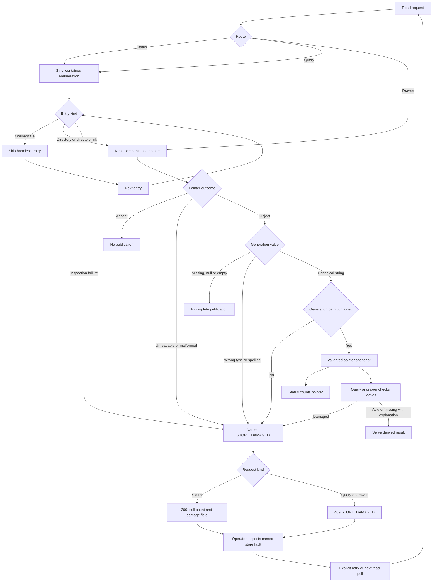
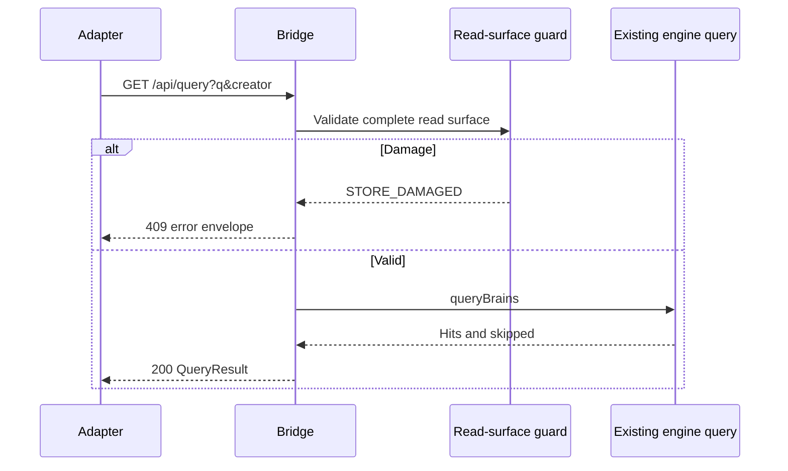
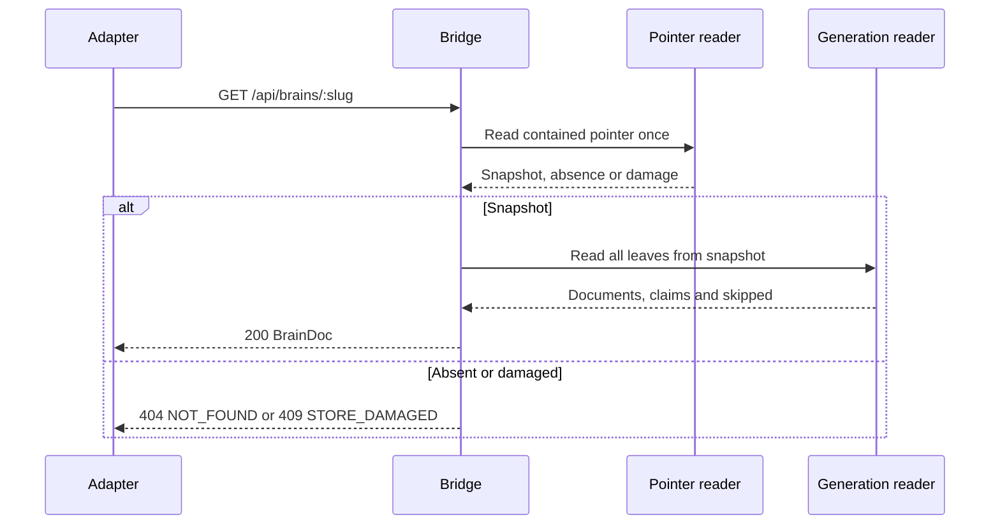
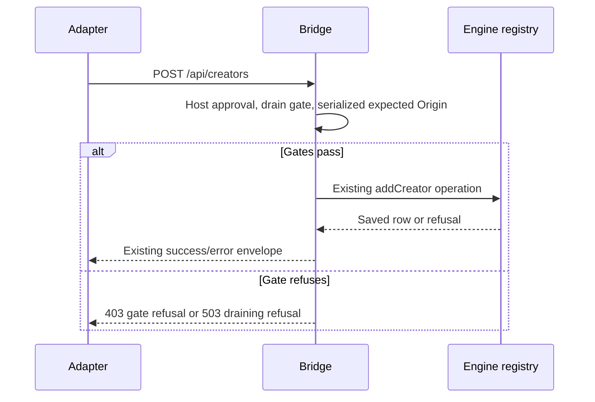
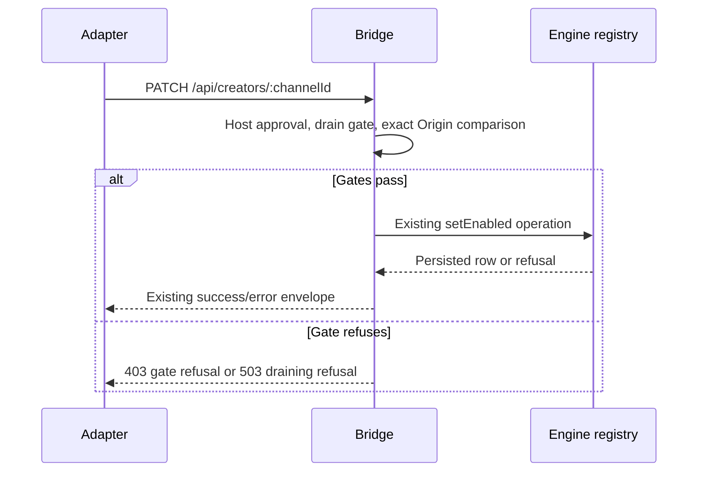

# Astra Reply — subscription transport — 2026-09-20T11:10:09.225Z

**Provider:** openai-codex
**Billing:** chatgpt-subscription
**Authentication:** chatgpt_subscription
**Transport:** codex-cli
**Requested model:** gpt-6-astra
**Served model:** NOT OBSERVABLE on codex-cli (see SERVED_MODEL_UNVERIFIABLE_NOTE)
**Reasoning effort:** high
**Tokens:** in=2974160 out=30306 reasoning=11427
**Packet:** `docs/ai-workflow/blueprints/creator-brains-console-20260917/17-astra-mega-packet-r4.md`
**Wall:** 988.8s
**Mega Blueprint:** ARMED (operator flag)

> Marginal cost $0 — this leg rides the ChatGPT subscription, not OpenRouter.

---
Mega Blueprint. I’ll review the five R3 fixes against the frozen packet, check the prior review and local instructions, and emit the nine required artifacts. This session is read-only, so archive filing and tests that write fixtures are blocked; I’ll distinguish source findings from executable verification.

I’m using the `fable-blueprint-forge`, `non-vibe-coding`, and hostile-review archive skills. The archive index reports itself stale, so I’m checking the review files directly. The namespace and origin fixes are present; I’m now testing pointer-read failures and shutdown behavior, where the new tests may miss a failure path.

The pointer probe found a residual data-truth failure: a valid namespace with a traversal generation is counted as healthy, while corrupt or unreadable pointers become an undamaged zero. Query and drawer behavior also disagree for a non-string generation. Typecheck passed; the engine consistency check passed 15/15.

The shutdown probe reproduced another residual defect: after `shutdown()` releases the last lease, a request on an active connection can still reach `/api/canary` and create a worker with zero owners. This used the real HTTP handler and worker with the lifecycle function extracted in memory; it made no store writes. All 37 packet-listed file hashes match disk.

The review verdict is **REVISE: two medium and two low findings**. The remaining issues are pointer damage being hidden, shutdown releasing ownership too early, valid Host spellings causing origin refusals, and a return-type check that compares only field names. I also verified a stronger compiler check: it accepts the current contract and rejects the same numeric `runId` drift that passes the existing checks.

## PART A — HOSTILE REVIEW

**REVISE — not dry. Four residual findings: two medium, two low.**

[VERIFIED] Reviewed branch `creator-brains-engine-r2-20260915`, HEAD `85d73733ec6b191e996dd999ab18b5a1eeb5b53e`. All **37 packet-listed file hashes match disk**. The packet itself is modified relative to HEAD; its SHA-256 is:

```text
99136885c0b1a5f5de4c5fc6a001a1873dfa4d4514ced8a5f5de177738bc192e
```

Evidence prefixes:

- `C/` — `packages/creator-brains-console/`
- `P/` — `docs/ai-workflow/blueprints/creator-brains-console-20260917/`
- `E/` — `scripts/creator-brains/`

`[VERIFIED]` below identifies source inspection or the explicitly described execution. It does not imply browser or real-filesystem certification.

**A1 — Review of the existing fixes and package**

**R4-01 · MEDIUM · The contained enumerator still presents damaged publications as healthy counts or healthy emptiness**

[VERIFIED] `C/lib/read-surface.mjs:75` uses `listDir()`, whose catch returns `[]` for **every** enumeration failure (`E/lib/paths.mjs:215–219`). It then reads pointers through another fallback-on-error reader (`C/lib/read-surface.mjs:83–91`; `E/lib/render.mjs:58–59`; `E/lib/paths.mjs:88–92`).

For successfully parsed pointers, the enumerator checks the namespace alphabet but never validates the generation before adding it (`C/lib/read-surface.mjs:93–101`). Consequently, `countPublished()` treats those entries as trustworthy (`:139–146`).

This contradicts the previous package’s explicit contracts: “Only `ENOENT` represents absence” and “Validate any named generation and its resolved directory” (`P/17-astra-mega-reply-r3.md#03-contracts.md`).

[VERIFIED] Executing the actual imported readers with filesystem responses substituted **in memory** produced:

| Constructed condition | Publication count | Query result | Drawer result |
|---|---|---|---|
| Healthy publication | `1`, no damage | One hit | `gen-0001` |
| Valid namespace, traversal generation | **`1`, no damage** | `STORE_DAMAGED` | `STORE_DAMAGED` |
| `generation: 42` | **`1`, no damage** | **`VALIDATION`** | **Incomplete generation** |
| Malformed pointer JSON | **`0`, no damage** | **Empty hits and skipped** | **`NOT_FOUND`** |
| Pointer read raises `EACCES` | **`0`, no damage** | **Empty hits and skipped** | **`NOT_FOUND`** |
| Directory enumeration raises `EACCES` | **`0`, no damage** | **Empty hits and skipped** | Existing brain remains readable |

The wrong-type disagreement follows `C/lib/brain-read.mjs:219–227`: a non-string generation becomes `null`, while the engine later attempts to join the original numeric value.

The new test called “when a pointer escapes” constructs an **invalid namespace**, so its count refusal exercises the alphabet guard rather than generation validation (`C/test/bridge.readsurface.r3.test.mjs#R3-02a`).

**Fix:** introduce one strict, contained pointer reader shared by enumeration and drawer reads. Distinguish absent entries from failed reads; validate generation type, canonical spelling and directory containment. Enumerate strictly rather than using `listDir()`’s all-error fallback. Preserve harmless ordinary files and genuinely absent/incomplete pointers. Status remains HTTP 200 with a null count and named damage; query/drawer report store damage.

This finding establishes inconsistent damage reporting, **not a newly demonstrated outside-content disclosure**. Real Windows reproduction of these additional cases remains [UNKNOWN].

**R4-02 · MEDIUM · Shutdown releases ownership before the bridge stops dispatching requests**

[VERIFIED] `C/server.mjs:224–231` releases the instance, unregisters the bridge, calls asynchronous `server.close()`, and immediately releases the health lease. There is no admission/draining state in `createBridge()`.

An active connection can therefore dispatch another request after the final lease has gone. `/api/canary` still reaches the health reader (`C/routes.mjs:87`), which can construct a new worker.

[VERIFIED] A probe using the actual HTTP handler, actual worker implementation and the **extracted, unchanged `finishStart()` function** produced:

```text
shutdown returned; owners=0
worker constructed; owners=0
HTTP/1.1 400 Bad Request
HTTP/1.1 200 OK
```

The first request was an incomplete, subsequently completed invalid JSON-object POST. The second was a pipelined `/api/canary` request sent after shutdown. Instance-file operations were substituted; no store writes occurred. This verifies HTTP/lifecycle behavior, not the complete `startBridge()` filesystem path.

**Fix:** make shutdown an idempotent asynchronous drain:

1. Stop admitting requests to handlers.
2. Close the listener.
3. Wait for existing dispatches and HTTP closure.
4. Release instance ownership and the health lease exactly once.

Keep ownership while draining. Reject new requests on surviving connections before they can touch the store or worker. Update callers to await shutdown before restart or cleanup.

Also correct the new termination assertions: `bridge.probelease.test.mjs:103–105,132–134` sample immediately after requesting asynchronous termination, although `health.lifecycle.test.mjs:227–235` explicitly documents a possible final heartbeat. **A flaky failure is [LIKELY], not reproduced here.** Observe worker exit or a bounded settling interval before asserting heartbeat cessation.

**R4-03 · LOW · Canonical Origin checking incorrectly requires the approved Host spelling to be canonical too**

[VERIFIED] The server passes the raw approved Host as `http://${req.headers.host}` (`C/server.mjs:133`). `originAllowed()` rejects that expected value unless it already equals its URL serialization (`C/lib/write-gate.mjs:177`).

The Host gate accepts uppercase hostnames and explicit default ports (`C/lib/http.mjs:219–225`). Direct execution shows the disagreement:

| Host | Origin | Host gate | Origin gate |
|---|---|---:|---:|
| `localhost:8787` | `http://localhost:8787` | Accept | Accept |
| `LOCALHOST:8787` | `http://localhost:8787` | Accept | **Refuse** |
| `127.0.0.1:80` | `http://127.0.0.1` | Accept | **Refuse** |
| `127.0.0.1` at bound port 80 | `http://127.0.0.1` | **Refuse** | Accept |

**Fix:** serialize the expected origin **after Host approval**, using `new URL(...).origin`. Continue requiring the supplied Origin itself to be serialized; do not normalize away its prohibited components. Make an omitted Host port mean HTTP port 80 only, and compare it with the actual bound port.

The normal non-default-port path and cross-alias refusal are corrected. This is an availability/contract defect, not a demonstrated origin bypass.

**R4-04 · LOW · T-B27m checks return-field names, not return types**

[VERIFIED] `methodReturnFields()` discards everything following each field’s colon (`C/test/contract-parse.mjs:152–157,175–179`). T-B27m compares those names with table-row names (`C/test/bridge.contractsync.test.mjs:237–240`).

[VERIFIED] A declaration with numeric `requestId` and numeric `runId` returns the same extracted names as the documented acceptance contract.

More decisively, an **in-memory-only** mutation changed `startDailyRun().runId` from `string | null` to `number | null` in all three executable declarations:

- `C/web/src/adapters/types.ts:207`
- `C/web/src/adapters/LocalEngineAdapter.ts:125`
- `C/web/src/adapters/MockAdapter.ts:117`

The existing TypeScript program still produced **zero diagnostics**. The mock’s `null` remains assignable, and the key-name checker cannot distinguish the change.

**Fix:** retain T-B27m as a field-name check and add compiler-enforced equivalence against the TypeScript contract extracted from `05-contracts.md`, covering the interface and both adapters.

[VERIFIED] I exercised that replacement check in memory: current declarations produced zero diagnostics; the same numeric mutation produced three `Type 'false' does not satisfy the constraint 'true'` diagnostics. No source files were changed.

**Disposition**

| Previous finding | Round-4 disposition |
|---|---|
| R3-01 | [VERIFIED] Invalid published namespace refusal is present. Additional pointer-damage handling remains R4-01. |
| R3-02 | **PARTIAL:** unchecked pointer-path traversal was replaced, but damaged pointer/count semantics remain R4-01. |
| R3-03 | **PARTIAL:** normal ownership wiring exists; active-connection shutdown remains R4-02. |
| R3-04 | **PARTIAL:** alias and malformed-Origin acceptance are corrected; approved-authority serialization remains R4-03. |
| R3-05 | [VERIFIED] Current run/repair signatures and the explicit S3+S4 journal gate are corrected. The advertised return-type regression check remains incomplete: R4-04. |

R2-07 and R2-08 remain excluded from closure adjudication.

**A2 — One hostile pass over the drafted replacement package**

| Draft problem | Correction incorporated in Part B |
|---|---|
| Treating every `ENOTDIR` as harmless could hide a broken `brains` root or directory-valued pointer. | Skip confirmed ordinary namespace files explicitly; distinguish that case from enumeration and pointer failures. |
| Waiting only for `server.close()` could overlook an asynchronous handler that outlives its socket. | Require both HTTP closure and dispatch settlement before releasing ownership. |
| Canonicalizing both sides of Origin comparison would re-admit prohibited Origin syntax. | Canonicalize only the approved request authority; retain strict raw-Origin validation. |
| A replacement type test could become another manually maintained contract. | Compile the actual fenced document contract against all three executable declarations. |
| A shutdown test could clean up the worker itself before checking the defect. | Assert ownership and post-shutdown dispatch behavior before test cleanup; retain separate termination evidence. |

**Evidence receipt**

- [VERIFIED] `npm --prefix packages/creator-brains-console/web run typecheck` — PASS, exit 0.
- [VERIFIED] `node scripts/creator-brains/consistency-check.mjs` — 15/15, exit 0.
- [VERIFIED] Pointer, Origin and return-type probes described above executed without filesystem writes.
- [VERIFIED] Shutdown probe used real HTTP and workers with substituted instance bookkeeping.
- [UNKNOWN] Full bridge/web suite results and M1–M9 remain supplied evidence; they were not rerun.
- **NOT RUN:** browser, launcher, end-to-end, new real-filesystem cases and build.
- The initial compiler probe had three missing-type-library diagnostics caused by its working directory. After correcting the harness directory, the stated compiler results reproduced. Those setup diagnostics are not product RED evidence.

**Archive filing is BLOCKED by the read-only sandbox.** The [archive skill](.claude/skills/hostile-review-archive/SKILL.md) requires: “Every hostile-review pass leaves exactly one file in `Z:\HostileReviews`.” The archive query reported a stale index; direct filename inspection found the round-1 and round-2 records, and the round-2 record was read. This response has no filed `review_id` and is not an archive-complete review.

## PART B — FORGED PACKAGE

### 00-README.md

**Creator Brains Console — R4 correction package**

**Version:** R4 amendment  
**Status:** emitted; not installed; implementation and archive completion pending  
**Scope:** R4-01 through R4-04, answering R3-01 through R3-05  
**Owner:** existing console builder; independent checkpoint reviewer

This package amends the existing packet. Preserve the frozen R4 input and prior reviews. Apply accepted changes to the active contracts, tests, operations and traceability documents; do not create a competing product plan.

**Requirements**

| ID | Outcome | Acceptance |
|---|---|---|
| H4-1 | Damaged publication metadata never becomes healthy emptiness or a healthy count. | Malformed JSON, unreadable pointers, invalid generation values and failed enumeration produce named damage. |
| H4-2 | Pointer validation agrees across status, query and drawer. | One strict pointer primitive; drawer retains one selected generation; healthy and incomplete controls remain usable. |
| H4-3 | Bridge ownership lasts until request processing ends. | Draining bridge admits no new handler work; instance and probe ownership release only after closure and dispatch settlement. |
| H4-4 | Same-origin writes survive valid authority serialization. | Canonical same-origin requests pass; aliases, foreign ports and malformed supplied Origins refuse. |
| H4-5 | Deferred method types agree with the document. | Compiler compares both methods across document, interface and both adapters; consistent numeric drift fails. |
| H4-6 | Evidence remains attributable and reproducible. | Per-file results, immutable input hashes, explicit unproven boundaries and archive filing. |

**Builder contract**

Follow the decisions below. Implement one correction slice at a time. Return its exact diff and observed acceptance evidence for checkpoint review. A material omission is a reason to request adjudication, not invent behavior. Preserve unrelated changes and existing ownership.

**Baseline**

- Observed HEAD and packet hash are recorded in Part A.
- All 37 listed file hashes match the packet.
- Current typecheck and engine consistency check passed.
- The scoped working-tree modification is the R4 packet itself.
- Lane discovery succeeded and reported other active seats. No edit claim was made because this session is read-only.
- No preservation snapshot was written. Before changing active artifacts, capture and verify their pre-edit hashes and snapshots.

**Non-goals**

No engine modification, new product route, repair/daily activation, backup exception, S2–S7 implementation, provider call, commit, push, deployment or SwanGuard transfer.

**Order:** strict pointer semantics → asynchronous shutdown → authority serialization → compiler contract checks → combined verification and filing.

### 01-architecture.md

**Mounted surface**

[VERIFIED] `C/web/src/main.tsx:18` mounts `App`; `App.tsx:86–87` selects the adapter and calls `useStatus`; `App.tsx:103` mounts `StatusBoard`.

[VERIFIED] `C/routes.mjs:84` dispatches status. `C/lib/status.mjs:99,158–159` supplies the publication count/damage pair. `StatusBoard.tsx:256–265` renders either the refusal or the count.

[VERIFIED] Query and drawer dispatch at `C/routes.mjs:89–95`; creator mutations dispatch at `:99–109`; canary dispatches at `:87`.

**Responsibilities**

| Module | Responsibility after correction |
|---|---|
| `lib/containment.mjs` | Lexical/real-path containment; distinguish absent targets from resolution failures. |
| `lib/brain-pointer.mjs` | Strict pointer read, generation validation, contained generation path. |
| `lib/read-surface.mjs` | Strict enumeration, complete query preflight, publication count/damage projection. |
| `lib/brain-read.mjs` | Read documents and claims from one pointer snapshot. |
| `lib/bridge-drain.mjs` | Admission state and active-dispatch tracking. |
| `server.mjs` | Gate requests, bind, drain, then release ownership. |
| `lib/write-gate.mjs` | Strict supplied-Origin validation. |
| Contract compiler test | Compare document types with executable declarations without rewriting the contract. |

**Read and recovery flow**



The engine’s query scoring remains unchanged. Preflight must cover every entry the engine could traverse; an invalid published namespace is a hard refusal.

**API interactions changed or constrained by this correction**

```mermaid
sequenceDiagram
    participant UI as StatusBoard
    participant A as Adapter
    participant B as Bridge
    participant P as Pointer reader
    UI->>A: getStatus()
    A->>B: GET /api/status
    B->>P: Strict enumeration and pointer validation
    P-->>B: Count or named damage
    B-->>A: 200 StatusInstrument
    A-->>UI: Validated count or refusal; other instruments retained
```









```mermaid
sequenceDiagram
    participant A as Adapter
    participant B as Bridge
    participant H as Health reader
    A->>B: GET /api/canary
    alt Bridge running
        B->>H: Read cache or request probe under live ownership
        H-->>B: Probe, history or unknown
        B-->>A: 200 CanaryReading
    else Bridge draining
        B-->>A: 503 REFUSED; no health-reader call
    end
```

The other existing routes retain their contracts; they are not redesigned here.

**Lifecycle**

```mermaid
stateDiagram-v2
    [*] --> Starting
    Starting --> Running: bind succeeds; acquire owner
    Starting --> Failed: startup fails; release acquired instance resources
    Running --> Draining: shutdown called
    Draining --> Draining: repeated shutdown returns same promise
    Draining --> Draining: new request refused before dispatch
    Draining --> Released: HTTP closed and active dispatch count is zero
    Released --> Stopped: release instance and health owner once
    Stopped --> Stopped: repeated shutdown returns same promise
    Failed --> [*]
    Stopped --> [*]
```



Worker retirement still closes the channel and requests termination. Worker exit is a separate observable; shutdown completion must not be described as synchronous thread termination.

**ERD:** N/A — no relational tables, columns, relationships or durable schema migrations are created or modified. The file-backed pointer contract is specified below.

**Race boundary:** pre-existing links and deterministic read failures are in scope. Hostile concurrent filesystem replacement remains unproven. The query preflight does not become an atomic snapshot.

Mermaid source is supplied; rendered previews were not verified.

### 02-wireframes.md

**Scope:** the existing S1 status screen. Query, drawer and mutation UI screens remain owned by their deferred product slices. This correction adds no screen or form.

**Exact tokens**

| Role | Value |
|---|---|
| Page | `var(--bg-base, #030712)` |
| Panel | `var(--carbon, #141419)` |
| Text | `var(--text-primary, #e0ecf4)` |
| Secondary text | `var(--text-muted, rgba(224, 236, 244, 0.62))` |
| Refusal | `var(--warn, #c6a84b)` |
| Border | `var(--border-electric, rgba(96, 192, 240, 0.2))` |
| Focus | `var(--wing-purple, #8B5CF6)` |
| UI font | `var(--font-ui, system-ui, sans-serif)` |
| Data font | `var(--font-data, monospace)` |

**Desktop**

```text
Creator Brains Console
loopback · single operator

+-------------------------------+---------------------------------------------+
| Existing constellation        | Status                                 live |
| placeholder                   |                                             |
|                               | yt-dlp              {healthText}            |
|                               | Creators            {enabled} of {total}    |
|                               | Video coverage      {measured coverage}     |
|                               | Budget              {engine reading}        |
|                               | Backlog             {engine lines}          |
|                               | Throttle            {engine text}           |
|                               | Census              {reading or refusal}    |
|                               | Run lock            {reading}               |
|                               | Last run            {reading}               |
|                               | Last good           {reading}               |
|                               | Documents           {count or refusal}      |
|                               | Published brains    {publication slot}      |
|                               | Recent runs         {reading}               |
+-------------------------------+---------------------------------------------+
```

**375px**

```text
+-------------------------------------+
| Creator Brains Console               |
| loopback · single operator           |
+-------------------------------------+
| Existing constellation placeholder   |
+-------------------------------------+
| Status                              |
| {live or previous-reading label}     |
|                                     |
| yt-dlp                              |
| {healthText, wrapped}                |
|                                     |
| Creators                            |
| {enabled} enabled of {total}         |
|                                     |
| Video coverage                      |
| {measured coverage}                 |
|                                     |
| Budget                              |
| {engine reading}                    |
| Backlog                             |
| {engine lines, wrapped}             |
| Throttle                            |
| {engine text, wrapped}              |
| Census                              |
| {reading or refusal}                |
| Run lock                            |
| {reading}                           |
| Last run                            |
| {reading, wrapped}                  |
| Last good                           |
| {reading, wrapped}                  |
| Documents                           |
| {count or refusal}                  |
| Published brains                    |
| {publication slot, wrapped}         |
| Recent runs                         |
| {reading, wrapped}                  |
+-------------------------------------+
```

Use these exact state replacements in both frames:

| State | Exact replacement |
|---|---|
| Initial loading | `Reading the store…`; panel has `aria-busy="true"`. |
| Healthy publication count | `{count}` |
| Healthy empty publication store | `0` |
| Pointer read/parse/generation damage | `refused — current.json unreadable` |
| Enumeration/root failure | `refused — brains unreadable` |
| Partial status | Replace only the publication slot; preserve unrelated instruments. |
| Initial denied/transport/response-validation failure | `No instrument can be shown — the bridge did not answer, or answered with a payload this console cannot read. {code}: {message}` |
| Failed later poll | `last poll failed ({code}) — showing previous reading` |
| Recovery | Next successful reading replaces the refusal or previous-reading label. |
| Render failure | Preserve the existing error-boundary screen and shell header. |

No save, cancel or mutation-retry control belongs on this screen. API validation and shutdown refusals use the existing error presentation.

At 375px, labels and values stack and long values wrap. Polling never moves focus. Preserve existing 44px targets and reduced-motion behavior.

These are intended acceptance views, **not evidence that the existing CSS passes at 375px**. This round does not close the separately deferred responsive-layout work.

### 03-contracts.md

**Strict pointer API**

Create `C/lib/brain-pointer.mjs`:

```ts
type PointerSnapshot = {
  name: string;
  generation: string | null;
  title: string;
  generationDir: string | null;
};

function readContainedPointer(
  r: string,
  name: string,
  options?: { enumerated?: boolean }
): PointerSnapshot | null;
```

Rules:

1. Contain the namespace and pointer paths before reading pointer content.
2. A missing pointer returns `null`.
3. Malformed JSON, non-object JSON and non-absence read failures throw `ApiError(STORE_DAMAGED, ..., {file:'current.json'})`.
4. Missing, `null` or empty-string generation means an incomplete pointer.
5. Every other generation value must be a string matching the existing canonical generation pattern.
6. Validate the named generation directory’s containment before returning a snapshot.
7. A missing generation directory remains an incomplete publication whose missing leaves are explained; it is not an escaping path.
8. Preserve the namespace alphabet. A published, invalid enumerated name refuses; an invalid direct drawer name retains not-found behavior.
9. Use the snapshot once for all drawer leaves. Do not reread its pointer for claims.

**Enumeration**

`containedPointers(r)` retains its public role but uses strict filesystem enumeration:

- Absent `brains` directory: empty list.
- Unreadable directory or a non-directory at the root: `STORE_DAMAGED`, file `brains`.
- Confirmed ordinary entry file: skip, preserving `.DS_Store` behavior.
- Directory or directory link: validate containment, then inspect its pointer.
- Missing pointer or valid pointer with no generation: skip for counting/query traversal.
- Malformed or unreadable pointer: refuse.
- Canonical named generation: retain the validated snapshot.
- Do not broadly suppress `ENOTDIR`, `EACCES`, `EPERM` or JSON errors.

Containment helpers must stop translating every real-path failure into absence. Only an actual absence may bypass an existence-dependent check.

**Route outcomes**

| Condition | Status | Query | Drawer |
|---|---|---|---|
| Healthy empty store | 200; count `0`, damage `null` | 200; empty result | 404 |
| Healthy named publication | 200; measured count | 200; engine result | 200; selected generation |
| Existing malformed/unreadable pointer | 200; count `null`, named damage | 409 `STORE_DAMAGED` | 409 `STORE_DAMAGED` |
| Invalid generation type/spelling/containment | 200; count `null`, named damage | 409 `STORE_DAMAGED` | 409 `STORE_DAMAGED` |
| Valid pointer with no generation | Not counted | Not traversed | Existing incomplete-brain response |
| Failed enumeration | 200; count `null`, file `brains` | 409 `STORE_DAMAGED` | Independently validates requested brain |

The last row deliberately allows a separately readable drawer when enumeration alone fails.

**Drain API**

Create `C/lib/bridge-drain.mjs`:

```ts
interface BridgeDrain {
  isStopping(): boolean;
  enter(): () => void;       // returns idempotent dispatch-completion callback
  stop(): void;
  whenIdle(): Promise<void>;
}

function createBridgeDrain(): BridgeDrain;
```

Update the bridge handle:

```ts
interface BridgeHandle {
  shutdown(): Promise<void>;
}
```

- Repeated shutdown calls return the same promise.
- Set stopping synchronously before closing the listener.
- After Host approval, a stopping bridge refuses new requests before dispatch:

```json
{
  "error": {
    "code": "REFUSED",
    "message": "the bridge is shutting down"
  }
}
```

Return HTTP **503**, with `Connection: close`. This is a pre-dispatch refusal; it does not describe the outcome of an earlier request.

- Count active dispatches through their `finally` blocks.
- Wait for both server closure and active-dispatch settlement.
- Then release instance registration, pid ownership and health ownership once.
- Do not release ownership merely because a client disconnects.
- This correction adds no forced cancellation of an executing mutation. Shutdown may remain draining until that operation settles. Process termination leaves any dispatched mutation’s outcome uncertain.
- Channel closure/termination request occurs on final health-owner release. Observe actual worker exit separately.
- Signal handling must use the same shutdown path; it must not advertise graceful completion before draining.

**Origin API**

Preserve `originAllowed(origin, servingOrigin)` and its strict supplied-Origin check.

At the server call site:

```js
const servingOrigin = new URL(`http://${req.headers.host}`).origin;
const writeFailure = writeGateFailure(req, servingOrigin);
```

This follows successful Host validation.

An absent Host port means 80 for this HTTP-only service. Accept it only when the actual bound port is 80. Never expand hostname aliases during origin comparison.

**Deferred operations**

The authoritative document remains:

```ts
startDailyRun(perHour: number):
  Promise<{ requestId: string; runId: string | null }>;

repair():
  Promise<{ repaired: number; built: number; emptied: number }>;
```

HTTP acceptance must carry `runId: null`. These methods remain deferred; no route is added.

Compare these document declarations with `ConsoleDataAdapter`, `LocalEngineAdapter` and `MockAdapter` using the compiler.

**Permissions and privacy**

| Operation | Authority |
|---|---|
| Existing reads | Approved loopback Host; contained derived publication reads |
| Existing mutations | Approved Host plus existing header/media/Origin gate |
| Draining request | Refused before dispatch |
| Repair/daily activation | Still deferred; both require journal-preservation evidence |
| Backup | Blocked; no endpoint |
| Restore/rollback/authorize | No endpoint |

No schema migration, environment variable, runtime dependency or provider integration is added.

**Rollback:** revert a coherent console/code/test/UI set. If a containment correction cannot remain enabled, stop the affected console read surface rather than silently restore known unsafe behavior. Preserve the store and frozen evidence.

### 04-build-order.md

All paths are relative to `C/` unless prefixed `P/`. Source and test files remain at most 300 lines.

| Order | Files | Work |
|---:|---|---|
| 1 | `test/bridge.r4-pointer.test.mjs` | Materialize pointer regressions; observe intended failures. |
| 2 | `lib/brain-pointer.mjs` | Add strict pointer snapshot primitive. Import builtin filesystem/path APIs, existing containment helpers and `ApiError`. Export `readContainedPointer`. |
| 3 | `lib/containment.mjs` | Preserve absence/error distinction during resolution. |
| 4 | `lib/read-surface.mjs`, `lib/brain-read.mjs` | Share the pointer primitive; strictly enumerate; retain selected-generation reads and engine scoring. |
| 5 | `test/bridge.r4-shutdown.test.mjs` | Pin active-connection shutdown before changing lifecycle. |
| 6 | `lib/bridge-drain.mjs`, `server.mjs` | Implement admission/drain tracking and promise-returning shutdown. Extract lifecycle code if needed to meet the cap. |
| 7 | Existing shutdown callers | Await shutdown before teardown/restart; correct termination observations. |
| 8 | `test/bridge.r4-origin.test.mjs`, `lib/http.mjs`, `server.mjs` | Test and repair expected-authority serialization/default-port handling. |
| 9 | `test/bridge.r4-contract-types.test.mjs` | Compile document-derived type equivalence and its mutation control. |
| 10 | `P/05-contracts.md`, `06-test-plan.md`, `07-traceability.md`, `08-slices-operations.md`, `19-held-findings.md`, `README.md` | Apply accepted current instructions; preserve historical receipts. |
| 11 | Current readiness evidence and archive | Refresh actual hashes/results; file the review without erasing excluded findings. |

The shutdown-caller search found uses in:

```text
test/fixtures.mjs
test/bridge.boundary.test.mjs
test/bridge.hy4.test.mjs
test/bridge.hy4.structure.test.mjs
test/bridge.hy4.process.test.mjs
test/bridge.probelease.test.mjs
test/bridge.inprocess.test.mjs
test/bridge.routes.test.mjs
test/s1-exit-e2e.mjs
```

Change only the calls affected by asynchronous shutdown; preserve unrelated assertions.

**Existing patterns to retain**

```js
if (err && err.code === 'ENOENT') return null;
throw new ApiError(CODE.STORE_DAMAGED, message, { file });
```

```tsx
{status.publishedBrains === null
  ? <Refusal file={status.publishedBrainsDamaged?.file ?? 'current.json'} />
  : <Value>{status.publishedBrains}</Value>}
```

Keep literal route dispatch so the existing positive route-allowlist test remains effective.

### 05-slices.md

| Slice | Requirements | Exit evidence |
|---|---|---|
| S0H-R4A — pointer truth | H4-1, H4-2 | New pointer regressions; existing read-surface, drawer and contract-sync suites; healthy/incomplete controls; no engine edits |
| S0H-R4B — shutdown | H4-3 | Active-connection regression; idempotent awaited shutdown; existing two-owner and failed-start controls; worker-exit evidence |
| S0H-R4C — origin | H4-4 | Uppercase approved Host control, default-port tests, existing cross-alias/wrong-port/malformed-Origin refusals |
| S0H-R4D — types | H4-5 | Document-derived compiler comparison; deliberate numeric drift rejected; normal typecheck passes |
| S0H-R4E — evidence | H4-6 | Combined suites, status smoke, refreshed hashes and filed review |

Do not advance a slice with unresolved checkpoint findings.

Each receipt records exact files, hashes, command, exit code, failing assertion for RED, passing controls for GREEN and unproven boundaries. Aggregate counts are observations, never acceptance targets.

**Applicability**

| Category | Disposition |
|---|---|
| Baseline, requirements, architecture, contracts | Included |
| Flow, sequence and lifecycle diagrams | Included |
| Status wireframes | Included; browser verification pending |
| Relational schema/migration | N/A — none changed |
| Permissions/privacy | Existing boundaries retained and specified |
| Tests and traceability | Included |
| Operations/rollback | Included |
| Preservation | Required before applying; blocked in this session |
| Independent review/archive | Findings emitted; filing blocked |
| Production rollout | N/A — no deployment authorized |

### 06-bans.md

- Do not convert failed enumeration or pointer reads into healthy zero counts.
- Do not count an invalid generation as a healthy publication.
- Do not classify a non-string generation as an absent generation.
- Do not skip an invalid published namespace the engine can traverse.
- Do not read pointer content before containing its path.
- Do not reread the drawer pointer for claims.
- Do not duplicate engine query scoring.
- Do not release instance or probe ownership while handler work remains.
- Do not call test cleanup before observing the lifecycle property under test.
- Do not treat a termination request as proof the worker has already exited.
- Do not normalize prohibited components out of the supplied Origin.
- Do not equate `localhost` with `127.0.0.1`.
- Do not describe field-name comparisons as complete type comparisons.
- Do not activate deferred routes or relax the S3/S4 journal gate.
- Do not retry an uncertain mutation automatically.
- Do not edit engine files, the real operator store or another seat’s locked files.
- Do not broad-stage, push, deploy or transfer.
- Do not exceed the 300-line cap.
- Do not add MUI, replacement palettes, animation or speculative dependencies.
- Do not promote synthetic execution, a structural receipt or supplied suite counts into runtime certification.

### 07-checkpoints.md

**Current receipt**

| Check | Result |
|---|---|
| Frozen packet/file identity | VERIFIED |
| Current typecheck | PASS |
| Engine consistency | PASS, 15/15 |
| Additional pointer cases | Reproduced with synthetic filesystem responses |
| Active-connection shutdown | Reproduced with real HTTP/workers and substituted instance bookkeeping |
| Origin matrix | Reproduced against imported predicates |
| Existing type-check weakness | Reproduced with an in-memory compiler mutation |
| Proposed compiler equivalence | Current contract accepted; mutation rejected in memory |
| New test files installed | NOT DONE |
| New real-filesystem tests | NOT RUN |
| Full suites/build/browser/launcher | NOT RUN |
| Preservation and archive filing | BLOCKED — read-only session |
| Implementation readiness | NOT ESTABLISHED |

**Checkpoint remit**

> Review this slice against its frozen input and exact diff. Name each failure’s requirement, file:line, trigger, observed result and concrete fix. Verify positive controls and forbidden side effects. Distinguish synthetic execution, real filesystem behavior, HTTP integration, compiler checks and browser evidence. Return PASS, REVISE or HALT.

**Required discriminating checks**

- Restoring fallback-on-error pointer reads must fail the malformed/unreadable-pointer tests.
- Removing generation validation must fail both the numeric-generation and traversal-generation cases.
- Releasing ownership before drain must fail the active-connection test.
- Removing the drain admission gate must allow the prohibited later request and fail its assertion.
- Restoring raw expected-authority construction must fail the uppercase-Host integration control.
- Changing all executable daily-run signatures to numeric `runId` must fail document-derived compiler equivalence.

Restore source bytes after mutation testing and record restored hashes.

**Archive**

Create one new dated record containing both A1 and A2, with actual commit/hash scope, defect counts and unproven boundaries. Reference the raw round-3 reply and the prior archive record.

Because this pass excludes R2-07/R2-08, do not mark their broader prior review wholly superseded or closed. Use the archive’s scope and supersession rules accurately, then reindex. No filing command was executed here.

### 09-tests.md

All new files below are **proposed, unmaterialized test source**. Their commands become executable after the writable builder installs them. The full integration tests were not run here.

**`C/test/bridge.r4-pointer.test.mjs`**

```js
import { test } from 'node:test';
import assert from 'node:assert/strict';
import { mkdirSync, renameSync, writeFileSync } from 'node:fs';
import { join } from 'node:path';
import {
  BRAIN_NS, getJson, seedPublishedBrain, withFixture,
} from './fixtures.mjs';
import { repointOutside } from './store-attacks.mjs';

async function expectPointerDamage(base, ns) {
  const status = await getJson(base, '/api/status');
  assert.equal(status.status, 200);
  assert.equal(status.body.publishedBrains, null);
  assert.equal(status.body.publishedBrainsDamaged.file, 'current.json');
  assert.ok(status.body.budget);

  for (const route of [
    '/api/query?q=fixture',
    `/api/brains/${ns}`,
  ]) {
    const response = await getJson(base, route);
    assert.equal(response.status, 409, route);
    assert.equal(response.body.error.code, 'STORE_DAMAGED', route);
  }
}

for (const [name, body] of [
  ['malformed-json', '{broken'],
  ['numeric-generation', JSON.stringify({ generation: 42 })],
  ['non-object-pointer', '[]'],
]) {
  test(`R4-P01/${name}: damage is not absence`, async () => {
    await withFixture(`r4-${name}`, async ({ r, base }) => {
      seedPublishedBrain(r, BRAIN_NS);
      writeFileSync(join(r, 'brains', BRAIN_NS, 'current.json'), body);
      await expectPointerDamage(base, BRAIN_NS);
    });
  });
}

test('R4-P02: valid namespace with escaping generation is not counted', async () => {
  await withFixture('r4-generation-escape', async ({ r, base }) => {
    seedPublishedBrain(r, BRAIN_NS);
    repointOutside(r, BRAIN_NS, 'r4-generation-escape');
    await expectPointerDamage(base, BRAIN_NS);
  });
});

test('R4-P03: unreadable pointer is not absence', async () => {
  await withFixture('r4-pointer-directory', async ({ r, base }) => {
    seedPublishedBrain(r, BRAIN_NS);
    const pointer = join(r, 'brains', BRAIN_NS, 'current.json');
    renameSync(pointer, `${pointer}.saved`);
    mkdirSync(pointer);
    await expectPointerDamage(base, BRAIN_NS);
  });
});

test('R4-P04: failed enumeration is not an empty store', async () => {
  await withFixture('r4-root-file', async ({ r, base }) => {
    const brains = join(r, 'brains');
    renameSync(brains, `${brains}.saved`);
    writeFileSync(brains, 'not a directory');

    const status = await getJson(base, '/api/status');
    assert.equal(status.status, 200);
    assert.equal(status.body.publishedBrains, null);
    assert.equal(status.body.publishedBrainsDamaged.file, 'brains');

    const query = await getJson(base, '/api/query?q=fixture');
    assert.equal(query.status, 409);
    assert.equal(query.body.error.code, 'STORE_DAMAGED');
  });
});
```

Retain `R3-01c`, `R3-02b`, `R2-02f` and `R2-02g` as healthy/noise/empty controls. Retain the real junction suite. Add isolated `EACCES` injection coverage; a directory-valued pointer does not prove platform ACL handling.

**`C/test/bridge.r4-shutdown.test.mjs`**

```js
import { test } from 'node:test';
import assert from 'node:assert/strict';
import net from 'node:net';
import { once } from 'node:events';
import { fixtureRoot } from './fixtures.mjs';
import { startBridge } from '../server.mjs';
import { healthOwnerCount } from '../lib/health-lease.mjs';
import { setProbeWorkerForTest } from '../lib/health-probe.mjs';

test('R4-L01: draining rejects later dispatch and retains ownership', {
  timeout: 7000,
}, async () => {
  const worker = new URL('data:text/javascript,' + encodeURIComponent(`
    import { workerData } from 'node:worker_threads';
    workerData.port.on('message', () => {});
  `));
  setProbeWorkerForTest(worker);

  const bridge = await startBridge({
    r: fixtureRoot('r4-drain'),
    port: 0,
    open: false,
    log: () => {},
  });
  let socket;
  let stopping;

  try {
    assert.equal(healthOwnerCount(), 1);
    const entered = once(bridge.server, 'request');
    socket = net.connect(bridge.port, '127.0.0.1');
    await once(socket, 'connect');

    let text = '';
    socket.on('data', chunk => { text += chunk; });

    socket.write(
      `POST /api/creators HTTP/1.1\r\n`
      + `Host: 127.0.0.1:${bridge.port}\r\n`
      + 'x-console-write: 1\r\n'
      + 'Content-Type: application/json\r\n'
      + 'Content-Length: 2\r\n\r\n{',
    );
    await entered;

    stopping = bridge.shutdown();
    const heldWhileDraining = healthOwnerCount();
    const repeated = bridge.shutdown();
    const closed = once(socket, 'close');

    socket.write(
      '}GET /api/canary HTTP/1.1\r\n'
      + `Host: 127.0.0.1:${bridge.port}\r\n`
      + 'Connection: close\r\n\r\n',
    );

    await closed;
    await stopping;

    assert.equal(heldWhileDraining, 1);
    assert.equal(repeated, stopping, 'shutdown returns one shared promise');
    assert.deepEqual(text.match(/HTTP\/1\.1 \d{3}/g), [
      'HTTP/1.1 400',
      'HTTP/1.1 503',
    ]);
    assert.match(text, /the bridge is shutting down/);
    assert.equal(healthOwnerCount(), 0);
  } finally {
    socket?.destroy();
    await bridge.shutdown();
    setProbeWorkerForTest(null);
  }
});
```

Update existing tests to await shutdown. Preserve the two-owner control and failed-bind control. For termination, observe the tracked worker’s `exit` event within five seconds, or retain the existing settled-heartbeat observation. Do not use immediate heartbeat equality.

**`C/test/bridge.r4-origin.test.mjs`**

```js
import { test } from 'node:test';
import assert from 'node:assert/strict';
import { hostAllowed } from '../lib/http.mjs';
import { originAllowed } from '../lib/write-gate.mjs';
import { CH_TWO, rawRequest, withFixture } from './fixtures.mjs';

test('R4-O01: approved uppercase Host uses its serialized origin', async () => {
  await withFixture('r4-origin-case', async ({ base, port }) => {
    const response = await rawRequest(base, `/api/creators/${CH_TWO}`, {
      method: 'PATCH',
      host: `LOCALHOST:${port}`,
      headers: { origin: `http://localhost:${port}` },
      body: JSON.stringify({ enabled: true }),
    });
    assert.equal(response.status, 200);
  });
});

test('R4-O02: omitted Host port means 80 only', () => {
  assert.equal(hostAllowed('127.0.0.1', 80), true);
  assert.equal(hostAllowed('localhost', 80), true);
  assert.equal(hostAllowed('localhost', 8787), false);
});

test('R4-O03: supplied Origin remains strictly serialized', () => {
  const expected = 'http://127.0.0.1';
  assert.equal(originAllowed(expected, expected), true);
  for (const supplied of [
    'http://127.0.0.1:80',
    'http://127.0.0.1/path',
    'http://user@127.0.0.1',
    'http://127.0.0.1?q=1',
    'http://127.0.0.1#fragment',
  ]) {
    assert.equal(originAllowed(supplied, expected), false, supplied);
  }
});
```

Retain the existing cross-alias, wrong-port, native-client and no-CORS tests.

**`C/test/bridge.r4-contract-types.test.mjs`**

This uses the console web project’s existing TypeScript development dependency; it adds no bridge runtime dependency.

```js
import { test } from 'node:test';
import assert from 'node:assert/strict';
import path from 'node:path';
import { fileURLToPath } from 'node:url';
import ts from '../web/node_modules/typescript/lib/typescript.js';
import { contractsTsBlock } from './contract-parse.mjs';

const web = fileURLToPath(new URL('../web/', import.meta.url));

function diagnostics(mutate) {
  const previous = process.cwd();
  process.chdir(web);
  try {
    const config = ts.readConfigFile(
      path.join(web, 'tsconfig.json'), ts.sys.readFile,
    );
    assert.equal(config.error, undefined);
    const parsed = ts.parseJsonConfigFileContent(config.config, ts.sys, web);
    assert.equal(parsed.errors.length, 0);

    const virtual = path.resolve(web, 'src/test/__r4_doc_contract__.ts');
    const checks = ['startDailyRun', 'repair'].flatMap(method =>
      ['Runtime', 'LocalEngineAdapter', 'MockAdapter'].map(type =>
        `Assert<Equal<
          Awaited<ReturnType<ConsoleDataAdapter['${method}']>>,
          Awaited<ReturnType<${type}['${method}']>>
        >>`,
      ),
    );

    const text = contractsTsBlock() + `
      import type { ConsoleDataAdapter as Runtime } from '../adapters/types';
      import type { LocalEngineAdapter } from '../adapters/LocalEngineAdapter';
      import type { MockAdapter } from '../adapters/MockAdapter';
      type Equal<A,B> =
        (<T>() => T extends A ? 1 : 2) extends
        (<T>() => T extends B ? 1 : 2) ? true : false;
      type Assert<T extends true> = T;
      export type Checks = [${checks.join(',')}];
    `;

    const host = ts.createCompilerHost(parsed.options);
    const read = host.readFile;
    const exists = host.fileExists;

    host.fileExists = file =>
      path.resolve(file) === virtual || exists(file);

    host.readFile = file => {
      if (path.resolve(file) === virtual) return text;
      let source = read(file);
      if (mutate && source &&
          /[\\/]adapters[\\/](types|LocalEngineAdapter|MockAdapter)\.ts$/.test(file)) {
        source = source.replace(
          /(startDailyRun\([^)]*\): Promise<\{ requestId: string; runId: )string( \| null \}>)/g,
          '$1number$2',
        );
      }
      return source;
    };

    const program = ts.createProgram(
      [...parsed.fileNames, virtual], parsed.options, host,
    );
    return ts.getPreEmitDiagnostics(program);
  } finally {
    process.chdir(previous);
  }
}

test('R4-C01: document and all executable method types agree', () => {
  const errors = diagnostics(false);
  assert.equal(errors.length, 0,
    errors.map(e => ts.flattenDiagnosticMessageText(e.messageText, ' ')).join('\n'));
});

test('R4-C02: consistent numeric runId drift is rejected', () => {
  const errors = diagnostics(true);
  assert.ok(errors.some(e =>
    e.file?.fileName.endsWith('__r4_doc_contract__.ts') &&
    ts.flattenDiagnosticMessageText(e.messageText, ' ')
      .includes("Type 'false' does not satisfy the constraint 'true'"),
  ));
});
```

The compiler mechanism and mutation were exercised in memory during this review. The emitted test file itself has not been installed or executed.

**Commands from repository root**

```powershell
node --test packages/creator-brains-console/test/bridge.r4-pointer.test.mjs
node --test packages/creator-brains-console/test/bridge.r4-shutdown.test.mjs
node --test packages/creator-brains-console/test/bridge.r4-origin.test.mjs
node --test packages/creator-brains-console/test/bridge.r4-contract-types.test.mjs
node --test packages/creator-brains-console/test/*.test.mjs
npm --prefix packages/creator-brains-console/web run test
npm --prefix packages/creator-brains-console/web run typecheck
npm --prefix packages/creator-brains-console/web run build
node scripts/creator-brains/consistency-check.mjs
```

**Additional named acceptance cases**

| File | Case | Proves |
|---|---|---|
| `StatusBoard.test.tsx` | `R4-W01: damaged publication count recovers to measured zero` | Rerender removes refusal; zero is displayed only after a healthy measurement. |
| `payload-shape.test.tsx` | `R4-W02: enumeration damage survives the live adapter unchanged` | Null count and `file:'brains'` are neither rejected nor defaulted. |
| `bridge.inprocess.test.mjs` | `R4-L02: restart remains refused while old dispatch is draining` | Instance ownership lasts through drain. |
| `bridge.probelease.test.mjs` | Updated `R3-03a/b` | Last-owner cleanup and surviving second owner under awaited shutdown. |

Run browser acceptance against a temporary fixture store and matching build at desktop and 375px: healthy count → named damage → healthy zero. Verify preserved instruments, wrapping, focus stability and recovery. **NOT RUN here.**

## PART C — DECISION-DENSITY SELF-TEST

| Builder choice | Disposition |
|---|---|
| Corrupt JSON or unreadable pointer | **Decided:** store damage; never absent. |
| Failed directory enumeration | **Decided:** damage named `brains`; never an empty list. |
| Harmless ordinary namespace files | **Decided:** explicitly skip; do not suppress unrelated errors. |
| Missing/null/empty generation | **Decided:** incomplete pointer; no invented generation. |
| Numeric, Boolean, array or object generation | **Decided:** malformed pointer; refuse. |
| Canonical generation whose directory is absent | **Decided:** incomplete publication; retain existing missing-leaf reporting. |
| Namespace alphabet and query scoring | **Decided:** preserve current rules and engine scoring. |
| Drawer pointer resolution | **Decided:** one snapshot for every leaf. |
| Status damage shape | **Decided:** HTTP 200, null count, named damage, unrelated instruments preserved. |
| Shutdown completion | **Decided:** HTTP closure plus dispatch settlement precede ownership release. |
| Requests arriving during drain | **Decided:** HTTP 503 `REFUSED`, before handler execution. |
| Repeated shutdown | **Decided:** same promise; cleanup once. |
| Forced cancellation of an executing mutation | **Excluded:** no new cancellation mechanism; process termination leaves outcome uncertain. |
| Worker termination evidence | **Decided:** observe exit or settled heartbeat separately from shutdown initiation. |
| Expected-origin normalization | **Decided:** serialize approved Host only. |
| Supplied-Origin normalization | **Decided:** retain strict serialized-origin requirement. |
| Omitted Host port | **Decided:** HTTP 80 only; still compare with bound port. |
| Deferred type-check oracle | **Decided:** compile the actual document contract against all three executable declarations. |
| Internal helper decomposition | **Delegated with bounds:** specified exports and behavior; no engine edits; ≤300 lines per file. |
| Real file-symlink and hostile concurrent filesystem behavior | **Unproven:** do not claim coverage from junctions or synthetic responses. |
| Broader responsive work and R2-07/R2-08 | **Excluded from closure:** preserve their existing dispositions. |
| Applying artifacts and filing this review | **Blocked here:** filesystem is read-only; no files or review record were written. |

**Delivered:** evidence-backed review and corrected package. **Remaining:** implementation, full verification and Rule-86 archive filing.
