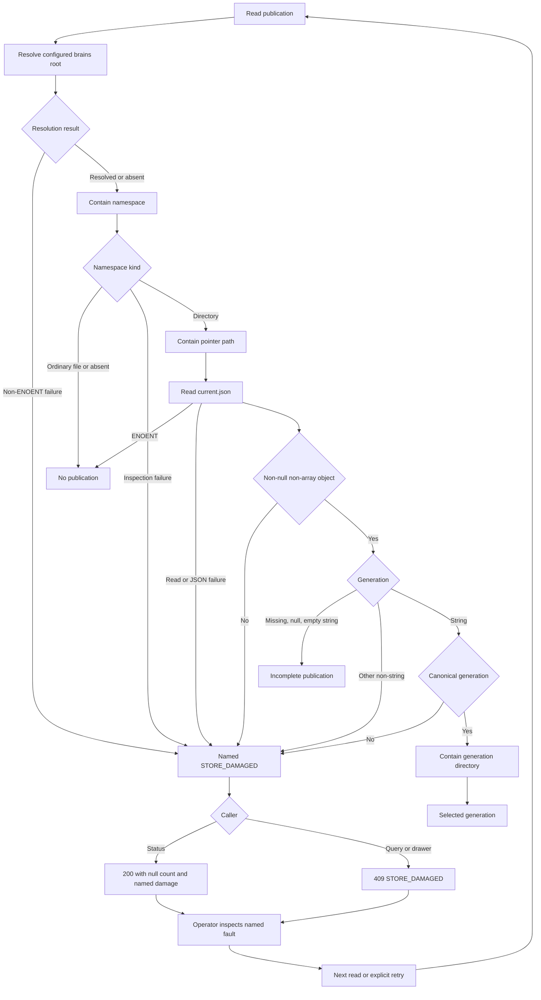
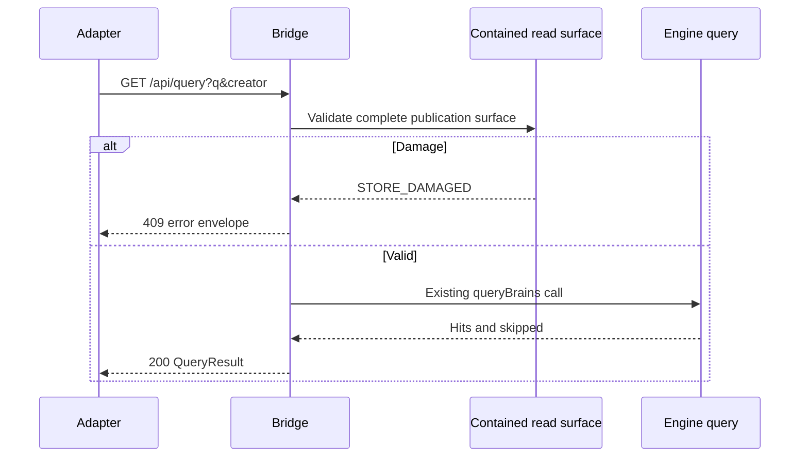
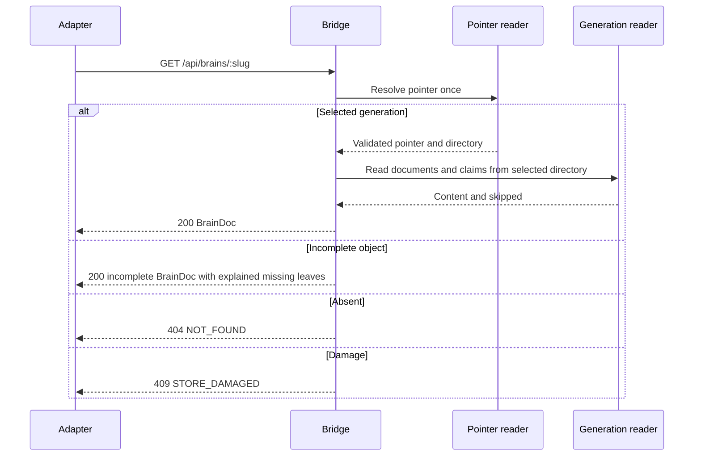
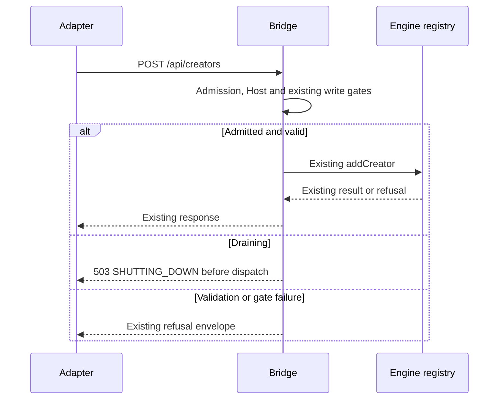
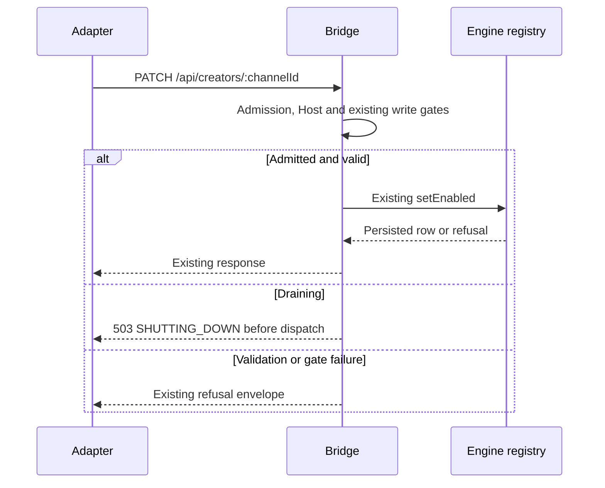
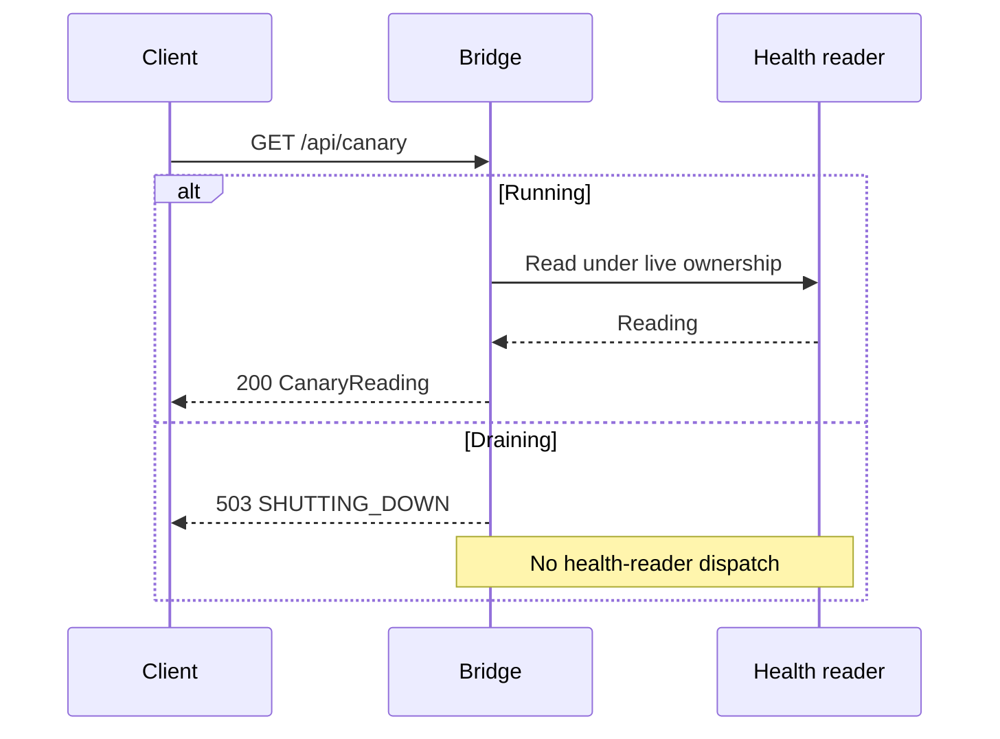
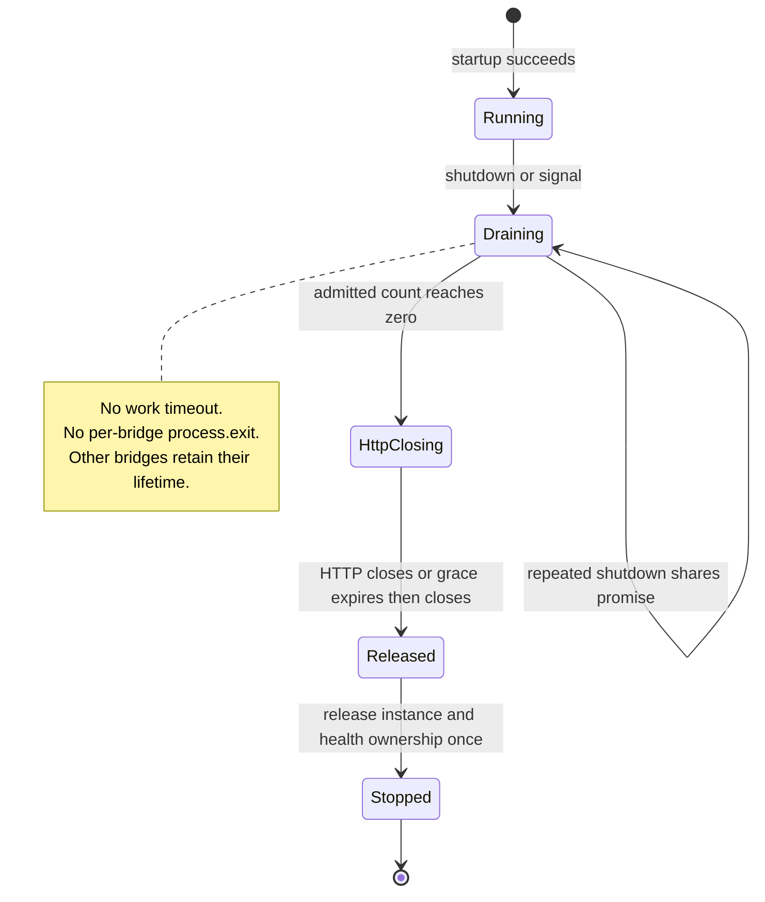
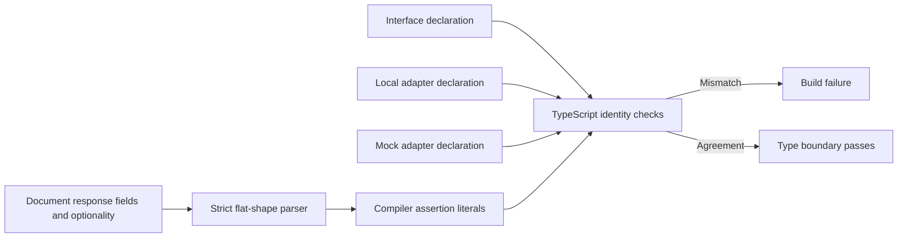

# Astra Reply — subscription transport — 2026-09-20T12:04:37.395Z

**Provider:** openai-codex
**Billing:** chatgpt-subscription
**Authentication:** chatgpt_subscription
**Transport:** codex-cli
**Requested model:** gpt-6-astra
**Served model:** NOT OBSERVABLE on codex-cli (see SERVED_MODEL_UNVERIFIABLE_NOTE)
**Reasoning effort:** xhigh
**Tokens:** in=3154317 out=27558 reasoning=7671
**Packet:** `docs/ai-workflow/blueprints/creator-brains-console-20260917/17-astra-mega-packet-r5.md`
**Wall:** 1088.4s
**Mega Blueprint:** ARMED (operator flag)

> Marginal cost $0 — this leg rides the ChatGPT subscription, not OpenRouter.

---
Mega Blueprint. I’ll check the four R4 fixes against the packet, test the boundaries without modifying the tree, and emit the required nine-document package. This session is read-only, so fixture-writing tests and archive filing are blocked; I’ll keep those limits explicit.

I’m using the `fable-blueprint-forge`, `non-vibe-coding`, and hostile-review archive skills. The archive contains the R4 review, and I’m checking its specific closure criteria. The main risks are error cases still classified as absence, shutdown paths that bypass the drain, and type changes the new compiler assertion may still accept.

All 51 packet-listed hashes match disk. Typecheck passes, and the engine consistency check passes 15/15.

The new checks catch the original numeric-generation and numeric-`runId` cases, but two sibling gaps remain: non-object pointer JSON still becomes a healthy zero, and optional extra fields or `any` still pass the advertised exact-type assertion. I’m checking the shutdown ordering next, including its signal handler.

The ordinary shutdown drain holds ownership until admitted work finishes, then refuses the pipelined request with 503. The signal path bypasses that guarantee: its two-second timer calls `process.exit(0)` with work still admitted, and an idle bridge can trigger exit while a second bridge is busy.

The Origin fix passed the targeted checks: uppercase Host spelling works, while cross-alias, foreign-port and malformed Origins remain refused. The review is REVISE; I’m drafting the corrections and their acceptance tests now.

The draft now addresses four residual findings. The self-review caught two fixes that needed tightening: strict path errors must still allow harmless ordinary files, and removing only the signal timeout would still let an idle bridge terminate a busy one. The type checks also need to preserve optional fields and reject `any`.

The final package will distinguish the probes I ran from tests still owed. Archive filing remains blocked by this session’s read-only filesystem.

## PART A — HOSTILE REVIEW

**REVISE — not dry. Four residual findings: three medium, one low.**

[VERIFIED] Reviewed HEAD `5aae0dffaf410813025759032812a32170585684` on `creator-brains-engine-r2-20260915`. All **51 packet-listed file hashes match disk**. The R5 packet is untracked; the console source has no working-tree diff against HEAD.

Packet SHA-256:

```text
220475ed0055ae0e40be35a7b6954cbee66261098c6333e5776246151619947c
```

Evidence prefixes:

- `C/` = `packages/creator-brains-console/`
- `P/` = `docs/ai-workflow/blueprints/creator-brains-console-20260917/`
- `E/` = `scripts/creator-brains/`

`[VERIFIED]` identifies inspected source or the particular execution described. Synthetic filesystem responses do not establish real Windows filesystem behavior.

**A1 — Review of the existing fixes and blueprints**

**R5-01 · MEDIUM · Malformed pointer shapes and falsy generation types still become healthy emptiness**

[VERIFIED] `C/lib/pointer.mjs:175–176` returns `no-generation` for:

```js
!pointer || typeof pointer !== 'object' || !pointer.generation
```

Consequently, the type check at `:183` never sees numeric zero or Boolean false. Arrays and non-object JSON also pass through the absence path.

Executing the actual imported readers with filesystem responses substituted in memory produced:

| Pointer content | Publication count | Damage | Drawer |
|---|---:|---|---|
| Healthy `gen-0001` object | `1` | None | Published generation |
| Invalid JSON | `null` | Named damage | Refused |
| `{"generation":42}` | `null` | Named damage | Refused |
| `null`, `[]`, `42`, `false` | **`0`** | **None** | Incomplete brain |
| `{"generation":0}` | **`0`** | **None** | Incomplete brain |
| `{"generation":false}` | **`0`** | **None** | Incomplete brain |

[VERIFIED] This contradicts the preceding package’s non-object JSON rule, `P/17-astra-mega-reply-r4.md:539`, and its explicit `[]` regression case at `:845`.

The engine also skips falsy generations (`E/lib/render.mjs:66–67`); it does **not** throw for zero or false. That explains the implementation, but does not satisfy the stricter damage contract accepted for this correction.

**Fix:** require a non-null, non-array object before inspecting `generation`. Only a missing property, `null`, or `''` means incomplete. Every other non-string value—including `0` and `false`—is `STORE_DAMAGED`. Preserve healthy, missing-pointer and incomplete-object controls.

---

**R5-02 · MEDIUM · Real-path failures still disable containment**

[VERIFIED] Two broad catches remain:

- `C/lib/containment.mjs:53–61`: any root resolution failure becomes `realRoot = null`.
- `C/lib/containment.mjs:71–76`: any target resolution failure becomes `null`.

`containedPath()` then skips real-path containment whenever either value is null (`:102–106`) and permits the subsequent read.

[VERIFIED] In-memory filesystem substitution against the actual imported readers demonstrated:

| Injected resolution failure | Subsequent filesystem responses | Result |
|---|---|---|
| Root `realpathSync` throws `EACCES` | Descendants resolve outside the lexical store; pointer read succeeds | **Count `1`, no damage; pointer read occurs** |
| Pointer `realpathSync` throws `EACCES` | Pointer read succeeds | **Count `1`, no damage; pointer read occurs** |

This proves the fail-open control flow. **[UNKNOWN]** Whether a particular Windows ACL/reparse-point configuration produces these combinations was not tested; this is not a demonstrated real-filesystem disclosure.

[VERIFIED] The previous package explicitly required this repair: `P/17-astra-mega-reply-r4.md:560` says containment helpers must distinguish absence from resolution failure.

**Fix:** only `ENOENT` may represent absence. Convert other resolution failures to named `STORE_DAMAGED` before reading the target. Preserve harmless ordinary namespace files by checking their kind **after namespace containment but before resolving `file/current.json`**. Otherwise, making `ENOTDIR` strict would break the existing ordinary-file control.

---

**R5-03 · MEDIUM · Signal shutdown bypasses the otherwise-correct drain**

[VERIFIED] The ordinary shutdown ordering is corrected:

```text
await admitted work
→ bounded HTTP closure
→ force-close remaining connections
→ release ownership
```

That ordering is explicit at `C/lib/lifecycle.mjs:152–163`. A real HTTP probe held an incomplete POST through shutdown:

- At 650 ms: one admitted dispatch, one owner, shutdown unresolved.
- After completing the POST and pipelining a canary request: HTTP **400**, then **503**.
- `closeAllConnections()` ran with **zero admitted dispatches**.
- Ownership released afterward.

However, `onSignal()` has two independent early-exit paths at `:169–174`:

```js
Promise.resolve(shutdown()).then(() => process.exit(0));
setTimeout(() => process.exit(0), 2_000).unref();
```

[VERIFIED] Driving the installed signal handler with `process.emit('SIGTERM')`, while replacing only `process.exit` with a recorder, produced:

| Scenario | Recorded exit attempt |
|---|---|
| One bridge; admitted POST still incomplete after two seconds | `exit(0)` with **one dispatch and one owner remaining** |
| Two bridges; one idle, one with an incomplete POST | Idle bridge attempted `exit(0)` while the other still had **one dispatch and one owner** |

The two-bridge failure means removing the timeout alone is insufficient.

These probes used real HTTP handling and the real lifecycle function, with synthetic instance bookkeeping. They did not send an OS signal or exercise the complete filesystem-backed startup path.

[VERIFIED] The signal behavior contradicts `P/17-astra-mega-reply-r4.md:619` and the R5 packet’s unbounded-work-drain requirement.

**Fix:** remove both per-bridge `process.exit()` calls and the two-second timer. Each signal handler invokes its bridge’s existing shutdown promise; the standalone process exits naturally after its resources retire. An embedded bridge must not terminate its host or another bridge. A drain failure records an error and sets a nonzero exit status; it must not manufacture successful termination.

---

**R5-04 · LOW · The new “Exact” guard still accepts meaningful contract drift**

[VERIFIED] `C/web/src/adapters/contract.assert.ts:54` uses mutual assignability:

```ts
type Exact<A, B> = [A] extends [B]
  ? ([B] extends [A] ? true : false)
  : false;
```

Its header promises that extra properties are refused (`:25–28`). Optional extra properties remain mutually assignable, and an `any` field also defeats this comparison.

[VERIFIED] Compiling the actual web project with source mutations supplied only through an in-memory compiler host produced:

| Mutation | Current compiler diagnostics |
|---|---:|
| Unmodified source | `0` |
| All three daily-run declarations: numeric `runId` | Three assertion failures |
| All three daily-run declarations: `runId: any` | **`0`** |
| Local repair return: additional `extra?: string` | **`0`** |
| Local repair return: additional required `extra: string` | One assertion failure |

There is a separate document-link hole: `C/test/contract-types.mjs:83` strips `?`, so `runId` and `runId?` produce identical extracted fields.

**Fix:** use a stricter compiler identity comparison, retain optionality in the document parser, and reject malformed fragments rather than dropping them. Add discriminating controls for `any`, optional extra fields and required-to-optional document changes.

[VERIFIED] A symmetric generic-function comparator, substituted in memory into the actual assertion file, accepted the current project and rejected all three compiler mutations above. It has not been installed.

**Disposition**

| Previous finding | R5 disposition |
|---|---|
| R4-01 | **PARTIAL.** Strict enumeration and ordinary read errors improved; malformed shapes and real-path failures remain R5-01/R5-02. |
| R4-02 | **PARTIAL.** Programmatic drain ordering is corrected; signal termination remains R5-03. |
| R4-03 | **VERIFIED within the exercised boundary.** Expected-origin serialization works without accepting tested aliases or malformed supplied Origins. |
| R4-04 | **PARTIAL.** Numeric drift is caught; exactness and document optionality remain R5-04. |

R2-07 and R2-08 remain excluded from closure adjudication.

**R4-03 verification boundary**

[VERIFIED] The actual HTTP gate accepted uppercase approved Host spelling far enough to reach the expected empty-reference validation error. Cross-alias, foreign-port, uppercase supplied-Origin and path-bearing Origin requests returned `403 FORBIDDEN_WRITE`. Imported predicates also accepted omitted/default ports only at bound port 80.

This establishes gate behavior; it is not a browser or successful persistent-write test.

**A2 — One hostile pass over the drafted package**

| Draft defect | Correction incorporated below |
|---|---|
| Making every real-path error fatal would reject harmless namespace files through `file/current.json`. | Contain namespace → inspect kind → skip ordinary file → resolve pointer. |
| Removing only the signal timeout leaves the idle-bridge exit path. | Remove all per-bridge process exits; retain natural process lifetime. |
| Replacing `Exact` alone leaves document optionality invisible. | Preserve an `optional` Boolean in parsed fields and test it. |
| A malformed-field parser could discard one field while retaining enough others to pass a count guard. | Reject every unsupported nonempty fragment. |
| A synthetic resolution probe could be presented as Windows containment certification. | Separate synthetic error-path proof, existing junction evidence and unperformed real-filesystem work. |
| A new mobile drawing could imply the existing CSS was verified. | Label drawings as acceptance views; retain the outstanding browser boundary. |

**Evidence receipt**

- [VERIFIED] All 51 packet-listed hashes match disk.
- [VERIFIED] Web typecheck: PASS, exit 0.
- [VERIFIED] Engine consistency check: 15/15, exit 0.
- [VERIFIED] Pointer-shape, resolution-error, HTTP drain, signal-handler, Origin and compiler probes described above.
- [UNKNOWN] Supplied 202/202 bridge, 62/62 web and M1–M13 results were not independently rerun.
- **NOT RUN:** full suites, build, browser, launcher, end-to-end, real ACL cases and real file-symlink cases.
- No source, fixture, receipt or archive file was written.

**Archive completion is BLOCKED by the read-only filesystem.** The [archive skill](~/Desktop/@Everything/quick-pt/SS-PT/.claude/skills/hostile-review-archive/SKILL.md) requires: “Every hostile-review pass leaves exactly one file in `Z:\HostileReviews`.” The R4 archive was consulted. This response has no filed `review_id` and is not archive-complete.

## PART B — FORGED PACKAGE

### 00-README.md

**Creator Brains Console — R5 correction package**

**Status:** emitted, not installed  
**Scope:** R5-01 through R5-04; closure review of R4-01 through R4-04  
**Baseline:** commit and packet hash recorded in Part A  
**Implementation owner:** existing console builder  
**Review boundary:** source, synthetic filesystem failures, HTTP/lifecycle probes and compiler behavior

This amendment retains the existing console architecture and product slices. Apply its corrections to the active documents; preserve frozen packets and historical reviews.

| Requirement | Acceptance criterion | Implementation | Test |
|---|---|---|---|
| H5-1 | Malformed pointer shapes never become healthy absence. | `lib/pointer.mjs` | R5-P01/P02 |
| H5-2 | Resolution failure cannot authorize a content read. | `lib/containment.mjs`, pointer ordering | R5-C01 plus existing noise/junction controls |
| H5-3 | Signals cannot end the process while another admitted dispatch remains. | `lib/lifecycle.mjs` | R5-S01/S02; existing R4 drain suite |
| H5-4 | Deferred contracts reject `any`, optional additions and document optionality drift. | Compiler assertion and parser | R5-T01–T05 |
| H5-5 | Evidence distinguishes tested mechanisms from unperformed runtime work. | Checkpoints and archive record | Hashes, exit codes, cancellation counts, filing |

**Non-goals:** no engine edits, new routes, S2–S7 implementation, backup exception, production operation, provider call, commit, push or transfer.

**Entry:** verify current ownership through the lane mechanism, preserve the affected bytes, and establish a writable isolated test environment. The current review could not inspect live lane ownership because `lane.mjs digest` failed under the sandbox; no edit claim was made.

**Exit:** all scoped acceptance tests pass, controls remain green, no tests are cancelled, independent review findings are resolved or explicitly retained, and the review is filed.

### 01-architecture.md

**Canonical integration**

[VERIFIED] `C/web/src/main.tsx:15–18` mounts `App`; `App.tsx:85–87` selects the adapter and calls `useStatus`; `App.tsx:103` mounts `StatusBoard`.

[VERIFIED] `LocalEngineAdapter.ts:86–89` requests `/api/status`; `C/routes.mjs:84` dispatches it. `C/lib/status.mjs:158–159` supplies the publication count/damage pair; `StatusBoard.tsx:256–265` renders that pair.

[VERIFIED] Query and drawer dispatch at `C/routes.mjs:89–95`. Existing creator mutations dispatch at `:99–109`. No route is added.

**Ownership**

| Module | Responsibility |
|---|---|
| `containment.mjs` | Lexical containment and strict real-path resolution |
| `pointer.mjs` | Namespace kind, pointer shape, generation validation and selected directory |
| `read-surface.mjs` | Complete enumeration, query preflight and count/damage projection |
| `brain-read.mjs` | Documents and claims from the selected generation |
| `admission.mjs` | Synchronous admission closure and admitted-dispatch count |
| `lifecycle.mjs` | Drain, connection cleanup, resource release and signal delegation |
| `contract.assert.ts` | Compiler assertions for both deferred methods across three declarations |
| `contract-types.mjs` | Document-to-assertion comparison, including optionality |

**Publication flow**



**Status interaction**

```mermaid
sequenceDiagram
    participant U as StatusBoard
    participant A as LocalEngineAdapter
    participant B as Bridge
    participant P as Publication reader
    U->>A: getStatus()
    A->>B: GET /api/status
    B->>P: countPublished(root)
    P-->>B: count or named damage
    B-->>A: 200 StatusInstrument
    A-->>U: Validated reading
    U->>U: Render count or refusal; preserve other instruments
```

**Query interaction**



**Drawer interaction**



**Existing write interactions**





**Canary during drain**



**Lifecycle**



Standalone process exit follows normal Node resource lifetime. Host embedding remains alive while its own resources remain.

**Contract checking**



**ERD:** N/A — these corrections create or modify no relational tables, columns, foreign keys or durable schema. They validate the existing file-backed pointer contract.

No atomic filesystem snapshot is introduced. Concurrent hostile replacement between validation and read remains unproven. Mermaid source is supplied; rendered previews were not verified.

### 02-wireframes.md

**Affected screen:** existing S1 StatusBoard. These corrections add no screen, form or mutation control. Query, drawer and operation screens remain owned by their existing product slices.

**Exact palette tokens**

| Role | Token |
|---|---|
| Page | `var(--bg-base, #030712)` |
| Panel | `var(--carbon, #141419)` |
| Primary text | `var(--text-primary, #e0ecf4)` |
| Secondary text | `var(--text-muted, rgba(224, 236, 244, 0.62))` |
| Refusal | `var(--warn, #c6a84b)` |
| Border | `var(--border-electric, rgba(96, 192, 240, 0.2))` |
| UI font | `var(--font-ui, system-ui, sans-serif)` |
| Data font | `var(--font-data, monospace)` |

**Desktop acceptance view**

```text
Creator Brains Console
loopback · single operator

+--------------------------------------+--------------------------------------+
| The constellation arrives in S5      | Status                          live |
| (CD3 “Vault Observatory”).           |                                      |
|                                      | yt-dlp            {health reading}   |
|                                      | Creators          {measured counts}  |
|                                      | Video coverage    {reading}          |
|                                      | Budget            {reading}          |
|                                      | Backlog           {engine lines}     |
|                                      | Throttle          {engine text}      |
|                                      | Census            {reading/refusal}  |
|                                      | Run lock          {reading}          |
|                                      | Last run          {reading}          |
|                                      | Last good         {reading}          |
|                                      | Documents         {count/refusal}    |
|                                      | Published brains  {publication slot} |
|                                      | Recent runs       {reading}          |
+--------------------------------------+--------------------------------------+
```

**375px acceptance view**

```text
+-------------------------------------+
| Creator Brains Console              |
| loopback · single operator          |
+-------------------------------------+
| The constellation arrives in S5     |
| (CD3 “Vault Observatory”).          |
+-------------------------------------+
| Status                              |
| {reading status}                    |
|                                     |
| yt-dlp                              |
| {health reading, wrapped}           |
| Creators                            |
| {measured counts}                   |
| Video coverage                      |
| {reading}                           |
| Budget                              |
| {reading}                           |
| Backlog                             |
| {engine lines, wrapped}             |
| Throttle                            |
| {engine text, wrapped}              |
| Census                              |
| {reading or refusal}                |
| Run lock                            |
| {reading}                           |
| Last run                            |
| {reading}                           |
| Last good                           |
| {reading}                           |
| Documents                           |
| {count or refusal}                  |
| Published brains                    |
| {publication slot, wrapped}         |
| Recent runs                         |
| {reading, wrapped}                  |
+-------------------------------------+
```

Use these state substitutions in both views:

| State | Exact copy or behavior |
|---|---|
| Initial loading | `Reading the store…`; `aria-busy="true"` |
| Healthy | Publication slot contains the measured integer |
| Healthy empty | Publication slot contains `0` |
| Pointer-shape or pointer-resolution failure | `refused — current.json unreadable` |
| Root-resolution or enumeration failure | `refused — brains unreadable` |
| Partial status | Only the affected instrument is withheld |
| Initial transport/denial/response-validation failure | `No instrument can be shown — the bridge did not answer, or answered with a payload this console cannot read. {code}: {message}` |
| Later poll failure | `last poll failed ({code}) — showing previous reading` |
| Recovery | Next valid reading replaces the refusal or stale-reading label |
| Render failure | Existing error boundary remains visible; shell header survives |

No automatic mutation retry follows a shutdown or disconnect. This screen continues read polling only.

At 375px, labels and values stack and long values wrap. Polling must not move keyboard focus. Preserve existing touch targets and reduced-motion behavior; add no animation.

**Verification boundary:** these are updated acceptance drawings, not a claim that the current CSS passes at 375px. The broader responsive work remains open.

### 03-contracts.md

**Pointer contract**

Retain `resolvePointer(r, ns)` and its existing result shapes:

```ts
type PointerResolution =
  | { present: false; reason: 'absent' | 'no-generation' }
  | {
      present: true;
      pointer: object;
      generation: string;
      dir: string;
    };
```

Apply this order:

1. Resolve the configured brains root.
2. Contain the namespace.
3. Inspect namespace kind.
4. Skip a confirmed ordinary file or absent namespace.
5. Contain and read `current.json`.
6. Parse JSON and require a non-null, non-array object.
7. Classify the generation explicitly.
8. Validate and contain a named generation.

| Input | Outcome |
|---|---|
| Missing namespace/pointer | `absent` |
| Ordinary namespace file | `absent` |
| Object with missing `generation` | `no-generation` |
| Object with `generation: null` or `''` | `no-generation` |
| Non-object JSON, including `null` and arrays | `STORE_DAMAGED` |
| Any other non-string generation | `STORE_DAMAGED` |
| Noncanonical generation string | `STORE_DAMAGED` |
| Canonical contained generation | Selected generation |
| Canonical generation with absent leaves | Existing missing-leaf reporting |

Retain:

```js
/^gen-(?:\d{4}|[1-9]\d{4,})$/
```

No new requirements are imposed on unrelated pointer metadata.

**Resolution contract**

- Only `ENOENT` represents absence.
- `EACCES`, `EPERM`, `ENOTDIR`, `EMFILE` and other resolution failures become `STORE_DAMAGED`.
- Root failures name `brains`.
- Namespace, pointer and generation failures name `current.json`.
- Leaf failures retain their leaf filename.
- Do not read content after its containment resolution failed.
- A successfully resolved target cannot be authorized against an unresolved root.
- A configured root reached through a junction uses its resolved root as the containment boundary.
- Ordinary namespace files are skipped before resolving their nonexistent child pointer; `ENOTDIR` is not globally suppressed.

**Route projection**

| Condition | Status | Query | Drawer |
|---|---|---|---|
| Healthy publication | 200, measured count | Existing result | Published brain |
| Healthy empty store | 200, count `0` | Empty result | 404 |
| Malformed pointer or failed resolution | 200, count `null`, named damage | 409 `STORE_DAMAGED` | 409 `STORE_DAMAGED` |
| Incomplete valid object | Not counted | Not traversed | Explained incomplete brain |

An enumeration-only failure need not prevent an independently readable drawer. No route is added or removed.

**Lifecycle contract**

```ts
shutdown(): Promise<void>
```

- Close admission synchronously.
- Repeated calls return the same promise.
- Await admitted work without a deadline.
- Only afterward apply the existing 250 ms HTTP grace and connection cleanup.
- Release instance registration and health ownership once, after closure.
- A disconnected client does not authorize abandoning its dispatched operation.
- Signal handlers invoke this same shutdown.
- Signal handlers never call `process.exit()` or schedule a process-exit timer.
- Standalone process termination follows normal resource lifetime.
- On shutdown failure, report the failure and set a nonzero exit status.
- External forced termination or a second termination signal is not graceful completion; an interrupted mutation has an uncertain outcome.

Preserve the shipped draining response:

```json
{
  "error": {
    "code": "SHUTTING_DOWN",
    "message": "this bridge is shutting down and is not accepting new requests"
  }
}
```

It is HTTP 503 with connection closure. It applies only to the refused request, not an earlier admitted mutation. The current adapter may map this server code to its existing `UNKNOWN` fallback; this amendment does not add a UI error vocabulary.

**Origin contract**

Retain the R4 implementation:

- Approve Host against the bound port.
- Serialize that approved Host to obtain the expected Origin.
- Require the supplied Origin itself to be serialized.
- Compare exact origins; do not equate loopback aliases.
- Omitted HTTP port means 80 only.
- Preserve custom-header, media-type and no-CORS rules.

**Deferred method contract**

```ts
startDailyRun(perHour: number):
  Promise<{ requestId: string; runId: string | null }>;

repair():
  Promise<{ repaired: number; built: number; emptied: number }>;
```

All fields are required. These declarations do not authorize either endpoint.

Replace the comparator with:

```ts
type Exact<A, B> =
  (<T>() => T extends A ? 1 : 2) extends
  (<T>() => T extends B ? 1 : 2)
    ? (
        (<T>() => T extends B ? 1 : 2) extends
        (<T>() => T extends A ? 1 : 2)
          ? true
          : false
      )
    : false;
```

Keep all six existing assertions. This comparator is acceptance-tested for the concrete flat contracts above; do not advertise it as a universal TypeScript equivalence theorem.

The document parser returns:

```ts
type ParsedField = {
  name: string;
  optional: boolean;
  type: string;
};
```

It preserves optionality, rejects duplicate names and rejects unsupported nonempty fragments. Its scope is the existing flat object declarations. Broader syntax requires an explicit parser extension and tests.

**Operations**

No migration, environment variable, runtime dependency or provider integration is added. Compiler tests use the installed web TypeScript development dependency.

Rollback preserves store contents. If a containment correction cannot remain enabled, stop the affected console surface rather than restore a known fail-open path. Historical review artifacts remain immutable except for required archive supersession links.

### 04-build-order.md

The entry points are `resolvePointer`, `containedPath`, `finishStart`’s signal handler, `Exact` and `typedFields`.

| Order | Files | Required change |
|---:|---|---|
| 1 | New R5 test files in `09-tests.md` | Install regression cases; record intended RED failures |
| 2 | `C/lib/pointer.mjs` | Explicit object/generation classification; reorder ordinary-file handling |
| 3 | `C/lib/containment.mjs` | Preserve only `ENOENT` as absence; fail before unauthorized reads |
| 4 | Existing read-surface suites | Prove healthy, incomplete, noise and junction controls remain valid |
| 5 | `C/lib/lifecycle.mjs` | Remove per-bridge process exits and signal deadline; retain ordinary drain |
| 6 | Existing drain/lease/instance suites | Preserve restart, failed-bind, multi-owner and force-close ordering |
| 7 | `C/web/src/adapters/contract.assert.ts` | Replace comparator without weakening six assertions |
| 8 | `C/test/contract-types.mjs` | Preserve optionality; reject unsupported fragments and duplicates |
| 9 | Existing contract-sync/type suites | Maintain document linkage and extractor non-vacuity |
| 10 | Active packet sections | Record accepted contracts, commands and evidence; preserve excluded findings |
| 11 | Archive | File this pass and the implementation review with accurate scope |

Use existing helpers and exports; do not create another pointer reader or lifecycle abstraction. Keep every source and test file within the 300-line cap.

Before each edit, recheck ownership. Stage only explicit owned paths if a later task authorizes committing.

### 05-slices.md

| Slice | Scope | Exit evidence |
|---|---|---|
| S0H-R5A | Pointer shape and strict resolution | R5-P/R5-C green; existing healthy/noise/containment controls green |
| S0H-R5B | Signal lifetime | R5-S green; ordinary drain, restart and lease controls green |
| S0H-R5C | Exact deferred contracts | R5-T green; existing contract document checks and typecheck green |
| S0H-R5D | Combined verification and filing | Full suites with zero cancelled tests, refreshed hashes, scoped review filed |

A slice cannot advance on setup/import failure masquerading as RED. Its receipt records the failing assertion, exit code, affected bytes and subsequent passing controls.

**Applicability**

| Category | Disposition |
|---|---|
| Requirements, architecture, contracts, traceability | Included |
| Flow, sequence and lifecycle diagrams | Included |
| Desktop and 375px status views | Included; browser verification pending |
| Relational ERD and migration | N/A — no relational schema changes |
| Privacy and permissions | Existing boundaries retained |
| Tests, operations and rollback | Included |
| Preservation | Required before edits; not performed here |
| Runtime deployment | N/A — not authorized |
| Archive filing | Required; blocked in this read-only review |

S2 remains outside this correction. Repair and daily-run activation retain the shared journal-preservation gate. Backup remains blocked without an endpoint.

### 06-bans.md

- Do not treat malformed pointer JSON values as incomplete objects.
- Do not use truthiness to classify generation types.
- Do not translate arbitrary resolution failures into absence.
- Do not read a target whose containment could not be established.
- Do not break ordinary namespace-file handling by globally tightening `ENOTDIR`.
- Do not reread the drawer pointer for claims.
- Do not duplicate engine scoring or modify engine files.
- Do not force-close connections before admitted work settles.
- Do not terminate the process from one bridge’s signal handler.
- Do not use a timeout to turn unfinished work into successful shutdown.
- Do not normalize prohibited syntax out of a supplied Origin.
- Do not equate loopback aliases.
- Do not call mutual assignability exact identity.
- Do not discard optional markers or malformed contract fragments.
- Do not activate deferred endpoints or retry uncertain mutations automatically.
- Do not infer Windows ACL, browser or launcher correctness from synthetic probes.
- Do not accept cancelled tests as passes.
- Do not rewrite historical receipts or close excluded findings.
- Do not edit another seat’s locked files, broad-stage, push or deploy.

### 07-checkpoints.md

**Current receipt**

| Check | Result |
|---|---|
| Packet/file identity | VERIFIED: 51 hashes |
| Typecheck | PASS |
| Engine consistency | PASS: 15/15 |
| Pointer-shape failures | Reproduced with synthetic filesystem responses |
| Real-path failure behavior | Reproduced with synthetic filesystem responses |
| Ordinary drain order | Reproduced using real HTTP and lifecycle |
| Signal early exits | Reproduced through installed handlers with intercepted process exit |
| Origin boundary | Targeted predicates and HTTP gate exercised |
| Compiler drift | Reproduced with the actual project and in-memory mutations |
| Proposed comparator | Current contract accepted; tested mutations rejected |
| New test files installed | NOT DONE |
| Full suites/build/browser/launcher | NOT RUN |
| Real ACL/file-symlink cases | NOT RUN |
| Preservation/archive | BLOCKED |
| Closure | REVISE |

**Mutation requirements**

| Mutation | Required discriminator |
|---|---|
| Restore pointer truthiness classification | R5-P01 |
| Restore broad real-path catches | R5-C01 |
| Restore two-second signal exit | R5-S01 |
| Restore exit-on-one-bridge-completion | R5-S02 |
| Restore mutual-assignability comparator | R5-T02/T03 |
| Strip optionality in document parser | R5-T04 |
| Silently drop malformed fragments | R5-T05 |

Record healthy controls separately. Restore and verify source hashes after any on-disk mutation run; prefer compiler-host mutations where sufficient.

**Review remit**

> Review only the frozen R5 correction diff. Verify each requirement through its real caller where feasible, inspect the negative and positive controls, and distinguish synthetic execution from real filesystem and browser evidence. Return PASS, REVISE or HALT with file:line evidence and concrete fixes.

**Archive disposition**

File one dated record for this pass, containing A1, A2, baseline hashes, defect counts and unproven boundaries. Reference the previous R4 record:

```text
2026-09-20-044144-creator-brains-console-astra-round-4-hostile
```

Apply reciprocal supersession links only for the overlapping reviewed scope. Do not imply closure of R2-07/R2-08 or other excluded product work. Reindex after filing.

### 09-tests.md

The following are complete proposed test files. They are **not installed or executed as files in this session**. Their mechanisms correspond to the probes reported in Part A. Filesystem fixture tests require a writable isolated environment.

**`C/test/bridge.pointershape.r5.test.mjs`**

```js
/**
 * R5 pointer-shape regressions.
 * Exercises all three read projections against isolated fixture stores.
 */
import { test } from 'node:test';
import assert from 'node:assert/strict';
import { writeFileSync } from 'node:fs';
import { join } from 'node:path';
import {
  BRAIN_NS, getJson, seedPublishedBrain, withFixture,
} from './fixtures.mjs';

const malformed = [
  ['null', 'null'],
  ['array', '[]'],
  ['number', '42'],
  ['boolean', 'false'],
  ['string', '"pointer"'],
  ['zero-generation', '{"generation":0}'],
  ['false-generation', '{"generation":false}'],
];

for (const [name, text] of malformed) {
  test(`R5-P01/${name}: malformed pointer is damage`, async () => {
    await withFixture(`r5-pointer-${name}`, async ({ r, base }) => {
      seedPublishedBrain(r, BRAIN_NS);
      writeFileSync(
        join(r, 'brains', BRAIN_NS, 'current.json'), text,
      );

      const status = await getJson(base, '/api/status');
      assert.equal(status.status, 200);
      assert.equal(status.body.publishedBrains, null);
      assert.equal(
        status.body.publishedBrainsDamaged.file, 'current.json',
      );
      assert.ok(status.body.budget);

      for (const route of [
        '/api/query?q=fixture',
        `/api/brains/${BRAIN_NS}`,
      ]) {
        const response = await getJson(base, route);
        assert.equal(response.status, 409, route);
        assert.equal(
          response.body.error.code, 'STORE_DAMAGED', route,
        );
      }
    });
  });
}

for (const pointer of [{}, { generation: null }, { generation: '' }]) {
  test(`R5-P02/${JSON.stringify(pointer)}: incomplete is usable`, async () => {
    await withFixture('r5-incomplete', async ({ r, base }) => {
      seedPublishedBrain(r, BRAIN_NS);
      writeFileSync(
        join(r, 'brains', BRAIN_NS, 'current.json'),
        JSON.stringify(pointer),
      );

      const status = await getJson(base, '/api/status');
      assert.equal(status.status, 200);
      assert.equal(status.body.publishedBrains, 0);
      assert.equal(status.body.publishedBrainsDamaged, null);

      const drawer = await getJson(base, `/api/brains/${BRAIN_NS}`);
      assert.equal(drawer.status, 200);
      assert.equal(drawer.body.generation, null);
      assert.ok(drawer.body.skipped.length >= 3);
    });
  });
}
```

**`C/test/containment.failure.r5.test.mjs`**

This injects resolution errors, not Windows ACLs. It proves that those errors stop content reads.

```js
/**
 * R5 containment failure paths.
 * Builtin substitutions are process-local and restored in finally.
 */
import { test } from 'node:test';
import assert from 'node:assert/strict';
import fs from 'node:fs';
import { syncBuiltinESMExports } from 'node:module';
import { join, resolve } from 'node:path';
import {
  BRAIN_NS, fixtureRoot, seedPublishedBrain,
} from './fixtures.mjs';
import { countPublished } from '../lib/read-surface.mjs';
import { brainDoc, queryConsole } from '../lib/brains.mjs';

for (const location of ['root', 'pointer']) {
  for (const code of ['EACCES', 'EPERM', 'EMFILE']) {
    test(`R5-C01/${location}/${code}: fail before reading`, () => {
      const r = fixtureRoot(`r5-resolution-${location}-${code}`);
      seedPublishedBrain(r, BRAIN_NS);
      assert.equal(countPublished(r).count, 1, 'healthy control');

      const root = join(r, 'brains');
      const pointer = join(root, BRAIN_NS, 'current.json');
      const failed = resolve(location === 'root' ? root : pointer);
      const expectedFile = location === 'root'
        ? 'brains' : 'current.json';

      const originalRealpath = fs.realpathSync;
      const originalRead = fs.readFileSync;
      let pointerReads = 0;

      fs.realpathSync = function (path, ...args) {
        if (resolve(String(path)) === failed) {
          throw Object.assign(new Error(`synthetic ${code}`), { code });
        }
        return originalRealpath.call(fs, path, ...args);
      };
      fs.readFileSync = function (path, ...args) {
        if (resolve(String(path)) === resolve(pointer)) pointerReads++;
        return originalRead.call(fs, path, ...args);
      };
      syncBuiltinESMExports();

      try {
        const count = countPublished(r);
        assert.equal(count.count, null);
        assert.equal(count.damage.file, expectedFile);

        const isDamage = (err) =>
          err.code === 'STORE_DAMAGED'
          && err.extra?.file === expectedFile;

        assert.throws(() => queryConsole('fixture', { r }), isDamage);
        assert.throws(() => brainDoc(BRAIN_NS, { r }), isDamage);
        assert.equal(pointerReads, 0, 'failed containment forbids read');
      } finally {
        fs.realpathSync = originalRealpath;
        fs.readFileSync = originalRead;
        syncBuiltinESMExports();
      }

      assert.equal(countPublished(r).count, 1, 'restored control');
    });
  }
}
```

Retain the existing ordinary-file, absent-store, incomplete-generation and junction controls. Do not “fix” this suite by removing those controls.

**`C/test/bridge.signal.r5.test.mjs`**

This drives the actual installed signal handlers while preventing a failing implementation from killing the test runner.

```js
/**
 * R5 signal lifetime.
 * No OS signal is sent; process.emit invokes installed bridge handlers.
 */
import { test } from 'node:test';
import assert from 'node:assert/strict';
import net from 'node:net';
import { once } from 'node:events';
import { fixtureRoot } from './fixtures.mjs';
import { startBridge } from '../server.mjs';
import { healthOwnerCount } from '../lib/health-lease.mjs';

const sleep = (ms) => new Promise((resolve) => setTimeout(resolve, ms));

async function exercise(twoBridges) {
  const handles = [];
  const exits = [];
  const originalExit = process.exit;
  let socket;
  let busy;
  let observation;

  try {
    busy = await startBridge({
      r: fixtureRoot('r5-signal-busy'),
      port: 0, open: false, log: () => {},
    });
    handles.push(busy);

    if (twoBridges) {
      handles.push(await startBridge({
        r: fixtureRoot('r5-signal-idle'),
        port: 0, open: false, log: () => {},
      }));
    }

    const entered = once(busy.server, 'request');
    socket = net.connect(busy.port, '127.0.0.1');
    socket.on('data', () => {});
    socket.on('error', () => {});
    await once(socket, 'connect');

    socket.write(
      'POST /api/creators HTTP/1.1\r\n'
      + `Host: 127.0.0.1:${busy.port}\r\n`
      + 'Content-Type: application/json\r\n'
      + 'x-console-write: 1\r\n'
      + 'Content-Length: 10\r\n'
      + 'Connection: close\r\n\r\n'
      + '{"r',
    );
    await entered;
    assert.equal(busy.admission.count(), 1);

    process.exit = (code) => {
      exits.push({
        code,
        admitted: busy.admission.count(),
        owners: healthOwnerCount(),
      });
    };

    process.emit('SIGTERM');
    await sleep(2200);

    observation = {
      admitted: busy.admission.count(),
      owners: healthOwnerCount(),
      exits: exits.slice(),
    };
  } finally {
    if (socket && !socket.destroyed) socket.write('ef":""}');
    await Promise.all(handles.map((handle) => handle.shutdown()));
    socket?.destroy();
    process.exit = originalExit;
  }

  assert.equal(observation.admitted, 1, 'work remained admitted');
  assert.ok(observation.owners >= 1, 'busy bridge retained ownership');
  assert.deepEqual(observation.exits, [], 'no exit before work settled');
  assert.deepEqual(exits, [], 'a bridge never exits its host process');
}

test('R5-S01: signal has no admitted-work deadline', {
  timeout: 10000,
}, () => exercise(false));

test('R5-S02: idle bridge cannot terminate busy bridge', {
  timeout: 10000,
}, () => exercise(true));
```

Retain `bridge.drain.r4.test.mjs` as the independent proof that force-closing happens only after admitted work settles. Retain failed-start, restart and multiple-owner tests.

**`C/test/contracttypes.r5.test.mjs`**

This checks the actual web project with source changes supplied only in memory.

```js
/**
 * R5 contract exactness.
 * Uses the installed TypeScript compiler without emitting or editing files.
 */
import { test } from 'node:test';
import assert from 'node:assert/strict';
import path from 'node:path';
import { fileURLToPath } from 'node:url';
import ts from '../web/node_modules/typescript/lib/typescript.js';
import { typedFields, assertSameShape } from './contract-types.mjs';

const web = fileURLToPath(new URL('../web/', import.meta.url));

function compile(mode) {
  const previous = process.cwd();
  process.chdir(web);
  try {
    const config = ts.readConfigFile(
      path.join(web, 'tsconfig.json'), ts.sys.readFile,
    );
    assert.equal(config.error, undefined);
    const parsed = ts.parseJsonConfigFileContent(config.config, ts.sys, web);
    assert.equal(parsed.errors.length, 0);

    const host = ts.createCompilerHost(parsed.options);
    const read = host.readFile;
    const changed = new Set();

    host.readFile = (file) => {
      let source = read(file);
      if (source === undefined) return source;
      const before = source;

      if (
        (mode === 'any' || mode === 'number')
        && /[\\/]adapters[\\/](types|LocalEngineAdapter|MockAdapter)\.ts$/.test(file)
      ) {
        source = source.replace(
          /(startDailyRun\([^)]*\): Promise<\{ requestId: string; runId: )string \| null/g,
          `$1${mode === 'any' ? 'any' : 'number | null'}`,
        );
      }

      if (
        mode === 'optional-extra'
        && /[\\/]adapters[\\/]LocalEngineAdapter\.ts$/.test(file)
      ) {
        source = source.replace(
          /(repair\(\): Promise<\{ repaired: number; built: number; emptied: number)( \}>)/,
          '$1; extra?: string$2',
        );
      }

      if (source !== before) changed.add(path.resolve(file));
      return source;
    };

    host.getSourceFile = (file, languageVersion) => {
      const source = host.readFile(file);
      return source === undefined
        ? undefined
        : ts.createSourceFile(file, source, languageVersion);
    };

    const program = ts.createProgram(
      parsed.fileNames, parsed.options, host,
    );
    return {
      diagnostics: ts.getPreEmitDiagnostics(program),
      changed: changed.size,
    };
  } finally {
    process.chdir(previous);
  }
}

function assertionFailures(diagnostics) {
  return diagnostics.filter((d) =>
    d.code === 2344
    && /[\\/]adapters[\\/]contract\.assert\.ts$/.test(d.file?.fileName ?? ''),
  );
}

test('R5-T01: current project satisfies compiler contract', () => {
  const result = compile('baseline');
  assert.equal(result.changed, 0);
  assert.equal(
    result.diagnostics.length, 0,
    result.diagnostics.map((d) =>
      ts.flattenDiagnosticMessageText(d.messageText, '\n'),
    ).join('\n'),
  );
});

for (const [id, mode, changed, failures] of [
  ['R5-T02', 'any', 3, 3],
  ['R5-T03', 'optional-extra', 1, 1],
  ['R5-T03-control', 'number', 3, 3],
]) {
  test(`${id}: ${mode} drift fails actual assertions`, () => {
    const result = compile(mode);
    assert.equal(result.changed, changed, 'mutation reached its targets');
    assert.equal(assertionFailures(result.diagnostics).length, failures);
  });
}

test('R5-T04: document optionality is preserved', () => {
  const required = typedFields('runId: string | null');
  const optional = typedFields('runId?: string | null');

  assert.equal(required[0].optional, false);
  assert.equal(optional[0].optional, true);
  assert.throws(() => assertSameShape(required, optional, 'optionality'));
});

test('R5-T05: malformed and duplicate fields fail closed', () => {
  assert.throws(() => typedFields('requestId: string; runId'));
  assert.throws(() => typedFields('runId: string; runId: string'));
});
```

**Commands from repository root**

```powershell
node --test packages/creator-brains-console/test/bridge.pointershape.r5.test.mjs
node --test packages/creator-brains-console/test/containment.failure.r5.test.mjs
node --test packages/creator-brains-console/test/bridge.signal.r5.test.mjs
node --test packages/creator-brains-console/test/contracttypes.r5.test.mjs

node --test packages/creator-brains-console/test/bridge.readsurface.r4.test.mjs
node --test packages/creator-brains-console/test/bridge.drain.r4.test.mjs
node --test packages/creator-brains-console/test/bridge.origin.r4.test.mjs
node --test packages/creator-brains-console/test/bridge.contracttypes.r4.test.mjs

node --test packages/creator-brains-console/test/*.test.mjs
npm --prefix packages/creator-brains-console/web run test
npm --prefix packages/creator-brains-console/web run typecheck
npm --prefix packages/creator-brains-console/web run build
node scripts/creator-brains/consistency-check.mjs
```

Acceptance requires exit 0, zero failures and **zero cancelled tests**. Report observed counts rather than targeting the packet’s historical totals.

**Boundary matrix**

| Evidence | Proves | Does not prove |
|---|---|---|
| R5-P HTTP fixture tests | Route projections on real temporary files | Operator-store behavior |
| R5-C substitutions | Non-absence resolution errors prevent reads | Windows ACL/reparse-point reproduction |
| R5-S intercepted exits | Installed signal-handler decisions and ownership | OS signal delivery or launcher behavior |
| Existing R4 drain tests | Admission/connection ordering | Signal lifetime by themselves |
| R5-T compiler host | Actual declarations reject specified drift | Deferred endpoint runtime correctness |
| Existing component tests | Refusal and healthy-state rendering mechanisms | Mounted desktop/mobile layout |

Browser acceptance remains owed: on a temporary store, observe healthy count → pointer damage → healthy zero at desktop and 375px, preserving other instruments and keyboard focus. No browser completion is claimed here.

## PART C — DECISION-DENSITY SELF-TEST

| Remaining builder choice | Disposition |
|---|---|
| Non-object pointer JSON | **Decided:** damage |
| Missing/null/empty generation | **Decided:** incomplete valid object |
| Zero/false generation | **Decided:** damage |
| Other pointer metadata validation | **Bounded:** unchanged; outside these findings |
| Generation grammar | **Decided:** preserve existing canonical pattern |
| Missing generation leaves | **Decided:** retain explained missing-leaf behavior |
| Ordinary namespace files | **Decided:** skip after namespace containment, before child resolution |
| Real-path error classification | **Decided:** only `ENOENT` is absence |
| Failed root diagnostic | **Decided:** `brains` |
| Failed pointer/generation diagnostic | **Decided:** `current.json` |
| Resolved target with unresolved root | **Decided:** refuse; no containment authority exists |
| Configured root junction | **Decided:** containment uses resolved configured root |
| Pointer snapshot ownership | **Decided:** one drawer resolution |
| Query scoring | **Decided:** existing engine function unchanged |
| Admitted-work shutdown deadline | **Decided:** none |
| HTTP cleanup deadline | **Decided:** existing 250 ms, after work settlement |
| Signal-triggered process termination | **Decided:** no per-bridge exit; natural resource lifetime |
| Multiple bridges | **Decided:** each drains; none terminates another |
| Forced external interruption | **Decided:** uncertain outcome, never graceful success |
| Shutdown rejection | **Decided:** report error and nonzero exit status |
| Origin behavior | **Decided:** retain verified R4 rules |
| Compiler identity | **Decided:** stricter comparator, tested against these flat contracts |
| Document parser | **Decided:** preserve optionality; reject malformed/duplicate fields |
| Parser expansion | **Delegated with bounds:** explicit syntax support and regression tests; no silent fallback |
| Helper decomposition | **Delegated with bounds:** existing exports, no engine edits, ≤300 lines |
| Real ACL/file-symlink and concurrent replacement | **Unproven:** no certification from synthetic responses |
| Browser/launcher verification | **Pending:** temporary resources and matching build required |
| R2-07/R2-08 and deferred product slices | **Excluded from closure** |
| Applying artifacts and archive filing | **Blocked here:** read-only filesystem; no files written |
