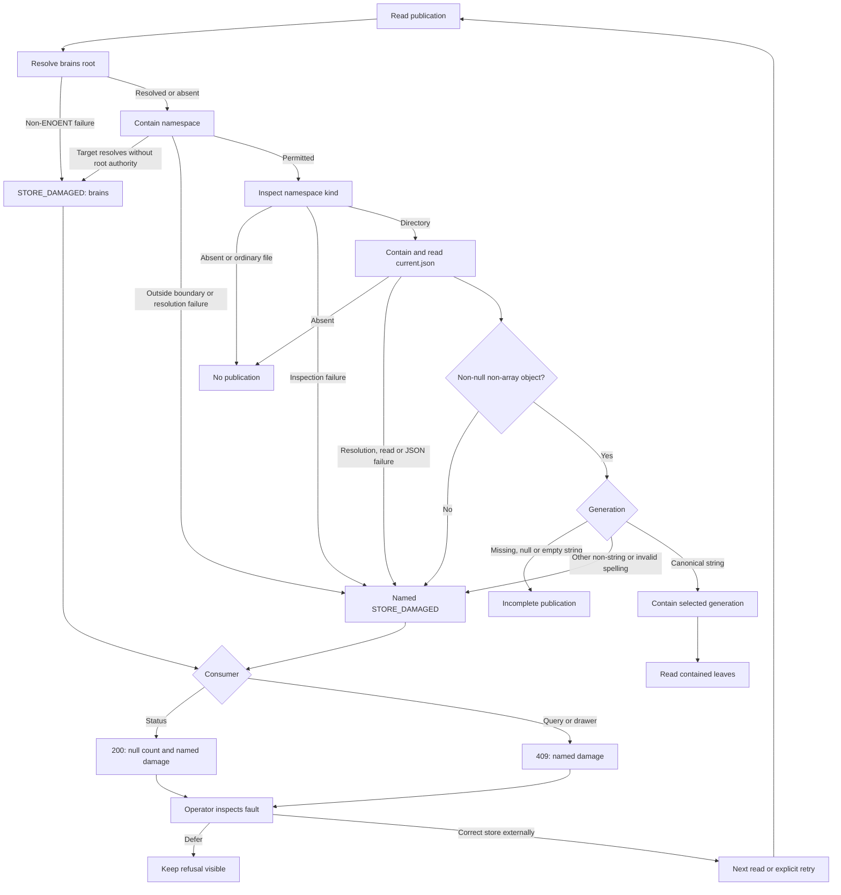
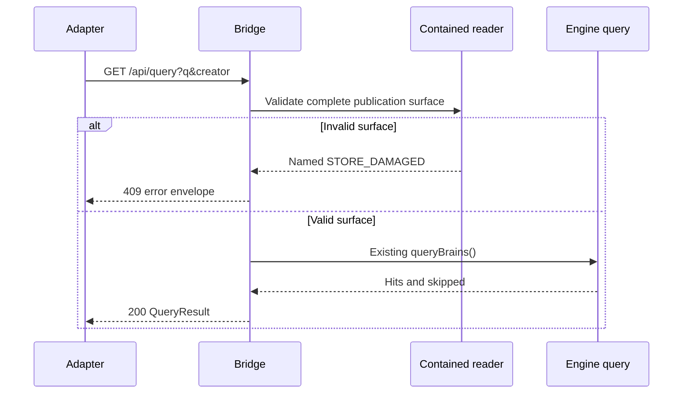
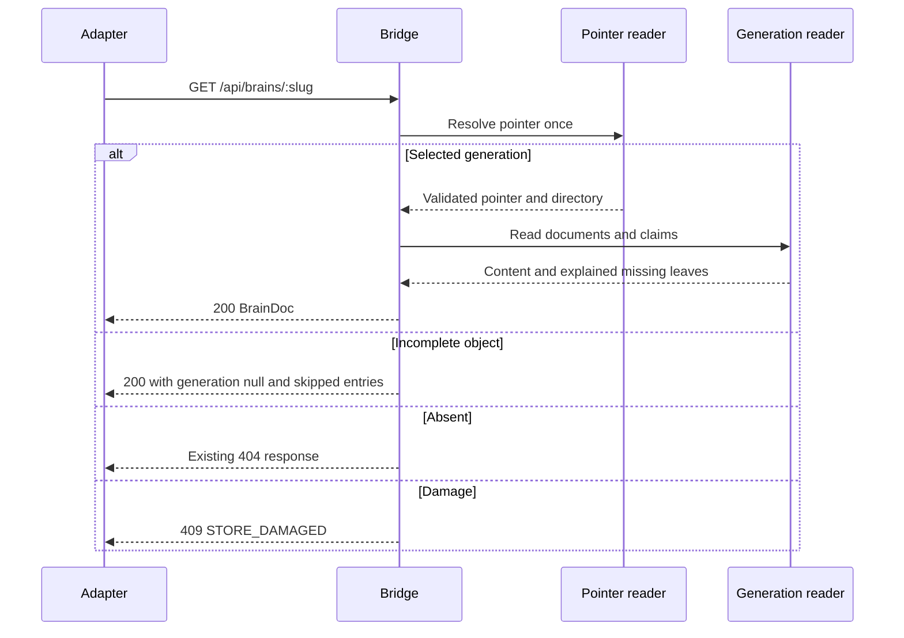
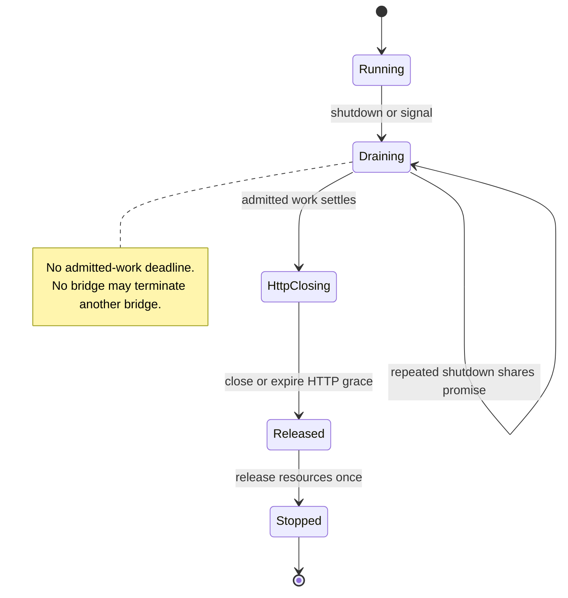
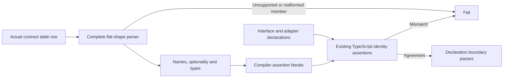

# Astra Reply — subscription transport — 2026-09-21T00:15:46.306Z

**Provider:** openai-codex
**Billing:** chatgpt-subscription
**Authentication:** chatgpt_subscription
**Transport:** codex-cli
**Requested model:** gpt-6-astra
**Served model:** NOT OBSERVABLE on codex-cli (see SERVED_MODEL_UNVERIFIABLE_NOTE)
**Reasoning effort:** xhigh
**Tokens:** in=3093007 out=23892 reasoning=5193
**Packet:** `docs/ai-workflow/blueprints/creator-brains-console-20260917/17-astra-mega-packet-r6.md`
**Wall:** 987.7s
**Mega Blueprint:** ARMED (operator flag)

> Marginal cost $0 — this leg rides the ChatGPT subscription, not OpenRouter.

---
Mega Blueprint. I’ll review the four R5 fixes and their neighboring failure cases, then emit the required nine-document package. I’ll load the forge skill and prior archive record first. This session is read-only, so filing the review and running tests that create fixtures are blocked.

I’m using the `fable-blueprint-forge`, `non-vibe-coding`, and hostile-review archive skills. The archive has the R5 review. I’m checking its concrete fix requirements—particularly ordinary-file handling before pointer resolution, signal lifetime, and parser fragments that could still disappear silently.

All 55 packet-listed hashes match disk. Web typecheck passes, and engine consistency is 15/15.

The optionality check now works, but the parser still drops unsupported fields: adding `readonly extra?: string` leaves the extracted contract unchanged. R5 explicitly required rejecting those fragments. I’m checking the remaining containment cases next.

The pointer-shape fix preserves missing, `null`, and empty-generation behavior. The compiler fix also rejects the tested `any`, optional-extra, required-extra, and optional-field mutations.

Containment still resolves `file/current.json` before checking that the namespace is an ordinary file. Windows returns `ENOENT` for that case here; an injected `ENOTDIR` makes it report store damage. The prior package explicitly required the opposite ordering.

The signal fix held in both real HTTP probes: one busy bridge and a busy-plus-idle pair. Neither attempted to exit; ownership remained until the admitted request finished. The three optionality tests also passed with Node’s process isolation disabled; the default runner was blocked by `spawn EPERM`.

The draft retains three residual findings: ordinary-file ordering, containment failure handling and diagnostics, and parser fragments silently discarded. I’m checking that the proposed repairs preserve healthy empty stores and the existing controls.

The self-review tightened three repairs: an absent root remains valid only while the target is also absent; namespace containment must still run before the ordinary-file skip; and parser tests must exercise the actual contract-table reader.

The evidence supports REVISE. R5-01 and R5-03 held within the tested boundaries; R5-02 and R5-04 remain partial. The package will include runnable regressions and distinguish them from executed probes. Archive filing remains blocked by the read-only filesystem.

## PART A — HOSTILE REVIEW

**REVISE — not dry. Three residual findings: one medium, two low.**

[VERIFIED] Reviewed HEAD `b23155b99e6fff3db73016f15ea7e44348abcc24`, branch `creator-brains-engine-r2-20260915`. All **55 packet-listed hashes match disk**. The scoped working-tree status contains only the untracked R6 packet; no reviewed source files were changed during this review.

Packet SHA-256:

```text
2cfbb39779093993746ab8a9e2de869f02fa2677407eeed6905480756ad778d7
```

Evidence prefixes:

- `C/` — `packages/creator-brains-console/`
- `P/` — `docs/ai-workflow/blueprints/creator-brains-console-20260917/`
- `E/` — `scripts/creator-brains/`

`[VERIFIED]` means inspected source or the specifically described execution. Injected filesystem responses prove control flow, not Windows ACL behavior.

**A1 — Existing fixes, blueprints and tests**

**R6-01 · MEDIUM · Strict resolution still runs before the ordinary-file skip**

[VERIFIED] `C/lib/pointer.mjs:155–160` executes this order:

```text
contain namespace
→ resolve namespace/current.json
→ inspect namespace kind
→ skip ordinary file
```

The previous package explicitly required:

```text
contain namespace
→ inspect namespace kind
→ skip ordinary file
→ resolve namespace/current.json
```

Evidence: `P/17-astra-mega-reply-r5.md:105`, `:200`, `:587`.

[VERIFIED] With an ordinary-file namespace and an injected `ENOTDIR` for its child pointer, the actual reader reports damage before reaching the skip. `C/lib/containment.mjs:113–117` correctly refuses that resolution error; the caller incorrectly asks it to resolve the child.

[VERIFIED] On this Windows host, resolving a child beneath the real `server.mjs` file returned `ENOENT`. That explains why the existing ordinary-file control stays green here. It does **not** exercise the `ENOTDIR` ordering. The specific ordinary-file control is `C/test/bridge.readsurface.r3.test.mjs:80`, **R3-01c**; R4-01f is the broader healthy-reading control.

**Impact:** a harmless namespace file becomes store damage when child resolution reports `ENOTDIR`. This is over-refusal introduced by tightening the resolver without completing the required caller ordering. No actual failure of the ordinary-file control on this Windows host is claimed.

**Fix:** move pointer-path containment below the namespace-kind check. Keep namespace containment **before** inspection, so an escaping junction cannot become an allowed skip. Do not globally suppress `ENOTDIR`.

---

**R6-02 · LOW · Resolution failures lose their filename, and the helper still has incomplete absence handling**

[VERIFIED] The primary R5-02 repair works: injected `EACCES`, `EPERM`, `EMFILE` and `ELOOP` root failures refuse before pointer reads.

Three remaining details violate the adopted resolver contract:

| Residual | Evidence | Observed result |
|---|---|---|
| Failure loses its filename | `C/lib/containment.mjs:87–90`, `:114–117` call `damaged()` without `file` | Root `EACCES` becomes `count:null` blaming **`current.json`** through the fallback at `C/lib/read-surface.mjs:142`; a leaf-resolution failure has `extra:{}`. |
| Falsy thrown values become absence | `C/lib/containment.mjs:86` uses `err && …` | Injected `undefined`, `null`, `false`, `0` and `''` return `realRoot:null`. |
| A resolved target is accepted without a resolved root | `C/lib/containment.mjs:145` checks containment only when both are non-null | With `realRoot:null`, an injected outside target is returned unchanged. |

[VERIFIED] The previous package requires root failures to name `brains`, leaf failures to retain their filename, and a resolved target to have a resolved containment root: `P/17-astra-mega-reply-r5.md:617–621`.

**Boundary:** the missing diagnostic is reproduced through `countPublished()`. The falsy throws and unresolved-root/resolved-target combination are synthetic helper cases. **[UNKNOWN]** A real filesystem configuration producing the latter combination was not established; this is not a demonstrated filesystem disclosure or a claim to solve concurrent replacement.

**Fix:**

- Only `err?.code === 'ENOENT'` returns absence; every other thrown value refuses.
- Root-resolution failures carry `file:'brains'`.
- Pass the caller’s filename through target resolution.
- If a target resolves but the root did not, refuse with `file:'brains'`.
- Preserve the healthy case where both root and target are absent.

**Seam adjudication:** [VERIFIED] `setRealpathForTest()` defaults to the real resolver, has no inspected runtime caller, and restoration returned real resolutions. It is a useful failure-injection instrument. Its process-global state requires serial tests and restoration in `finally`; its existence does not itself expose a remote bypass.

---

**R6-03 · LOW · The parser still silently discards unsupported contract members**

[VERIFIED] `C/test/contract-types.mjs:76–93` still drops fragments without a recognized name/type, then calls `.filter(Boolean)`. Its comment at `:72–74` explicitly endorses dropping them.

The following additions to the repair response extract exactly the same three fields as the unchanged declaration:

```ts
readonly extra?: string
"extra"?: string
[key: string]: unknown
```

[VERIFIED] In-memory document mutations exercised the actual table reader. The typed document comparisons accepted those added members; the older name-only comparison also failed to distinguish them. Duplicate fields are accepted by `typedFields()` rather than rejected.

This is the exact incomplete repair identified by the previous package: `P/17-astra-mega-reply-r5.md:175`, `:203`, `:717`, and its proposed malformed/duplicate regression at `:1222–1225`.

[VERIFIED] The new tests at `C/test/contract-types.r5.test.mjs:28–62` cover optionality and identical declarations, but not unsupported fragments or duplicates.

**Fix:** parse the supported flat declaration grammar completely. Reject every unsupported nonempty member, duplicate name, empty type and malformed delimiter. Supporting additional TypeScript syntax requires an explicit parser extension; ignoring that syntax must never mean agreement. Add a regression through `contractRowTypedFields()`, not only the tokenizer.

**The compiler repair itself holds:** [VERIFIED] in-memory mutations of the actual web project rejected `any`, optional extra fields, required extra fields, optional `runId`, `unknown` and `never`. The unmodified project compiled without diagnostics. Do not replace the comparator again to fix a document-parser defect.

**Disposition of R5**

| Finding | R6 disposition |
|---|---|
| R5-01 | **VERIFIED within the injected-filesystem boundary.** Malformed JSON values refuse; missing/null/empty generation remains incomplete. |
| R5-02 | **PARTIAL.** Ordinary resolution errors now refuse; R6-01/R6-02 remain. |
| R5-03 | **VERIFIED within the exercised HTTP/lifecycle boundary.** Neither busy nor idle bridges attempted process exit. |
| R5-04 | **PARTIAL.** Compiler identity and optionality checks work; unsupported parser fragments remain R6-03. |

R2-07 and R2-08 remain excluded from closure adjudication.

**R5-01 verification**

[VERIFIED] Executing the actual readers with filesystem responses substituted in memory produced:

| Pointer | Publication count | Drawer/query |
|---|---:|---|
| `null`, `[]`, `42`, `false`, `"pointer"` | `null`, named damage | `STORE_DAMAGED` |
| `{"generation":0}` / `{"generation":false}` | `null`, named damage | `STORE_DAMAGED` |
| `{}` / generation `null` / generation `''` | `0`, no damage | Explained incomplete drawer; empty query |
| Canonical `gen-10000` | `1`, no damage | Selected generation |

**R5-03 verification**

[VERIFIED] Real HTTP probes used the actual admission, routes and lifecycle functions, with synthetic instance bookkeeping and intercepted `process.exit`.

For both one busy bridge and a busy-plus-idle pair:

- After `SIGTERM` handler dispatch and 2.2 seconds: one request remained admitted, ownership remained, **zero exit attempts**.
- Completing that request and pipelining a canary request produced **400, then 503**.
- Shutdown then released ownership; **zero exit attempts** remained.

This does not establish OS signal delivery, launcher behavior or complete filesystem-backed startup.

**A2 — One hostile pass over the drafted package**

| Draft defect | Correction incorporated into Part B |
|---|---|
| Refusing every null root would break an honestly absent store. | Refuse only when a target resolves without root authority; retain the both-absent control. |
| Moving all containment after `stat()` would let an escaping namespace reach inspection. | Namespace containment remains first; only child resolution moves. |
| Testing `typedFields()` alone could miss a table-reader bypass. | Add actual document-row mutation tests. |
| Refusing errors without asserting filenames would preserve the misleading diagnostic. | Test `brains`, `current.json` and leaf filenames separately. |
| Synthetic error cases could be presented as a new filesystem exploit. | Mark their reachability limit explicitly; retain real-filesystem work as unproven. |
| New acceptance drawings could imply current mobile CSS passed. | Label wireframes as acceptance artifacts; browser verification remains pending. |

**Evidence receipt**

- [VERIFIED] Packet identity: **55/55 hashes match**.
- [VERIFIED] Web typecheck: **PASS, exit 0**.
- [VERIFIED] Engine consistency check: **15/15, exit 0**; this is not an engine runtime-suite result.
- [VERIFIED] Existing optionality suite with process isolation disabled: **3 passed, 0 failed, 0 cancelled**.
- [VERIFIED] Pointer, resolver, compiler, document-parser and HTTP/lifecycle probes described above.
- **BLOCKED:** the default Node test runner failed to spawn its child with `spawn EPERM`, before executing the optionality tests. The no-isolation rerun passed.
- **NOT RUN:** full console/web suites, build, browser, launcher, end-to-end, real ACL cases and file-symlink attacks.
- **Not independently reverified:** packet-reported 224/224, 62/62 and M14–M20.
- No source, fixture, receipt or archive files were written.

**Archive filing is BLOCKED by the read-only filesystem.** The [hostile-review archive skill](~/Desktop/@Everything/quick-pt/SS-PT/.claude/skills/hostile-review-archive/SKILL.md:33) requires: “Every hostile-review pass leaves exactly one file in `Z:\HostileReviews`.” The R5 record was consulted, but this response has no filed `review_id` and is not archive-complete.

## PART B — FORGED PACKAGE

### 00-README.md

**Creator Brains Console — R6 correction package**

**Status:** emitted; not installed.  
**Verdict:** REVISE.  
**Baseline:** HEAD and packet hash in Part A.  
**Scope:** residual corrections to R5-02 and R5-04; preserve R5-01 and R5-03.  
**Owner:** existing console builder.

This amendment retains the existing architecture, routes and S0–S7 product plan. It supersedes conflicting instructions only for the scoped corrections below. Frozen packets and historical reviews remain preserved.

| Requirement | Acceptance criterion | Component | Tests |
|---|---|---|---|
| H6-1 | Ordinary namespace files are skipped without resolving a child pointer. Escaping namespaces still refuse first. | `pointer.mjs` | R6-C01/C02 |
| H6-2 | Only ENOENT means absence; resolved targets require resolved root authority. | `containment.mjs` | R6-C03/C04/C05 |
| H6-3 | Resolution failures name the correct root or leaf. | Containment → count/error projection | R6-C03/C06/C07 |
| H6-4 | Unsupported, malformed or duplicate contract members cannot disappear. | `contract-types.mjs` | R6-T01/T02 |
| H6-5 | Healthy declarations, incomplete pointers and draining behavior remain valid. | Existing readers, compiler and lifecycle | R6-T03/T04; retained R5 suites |
| H6-6 | Evidence states its actual execution boundary. | Receipt and archive | Checkpoints |

**Non-goals:** engine changes; new routes; S2–S7 implementation; backup authorization; production operations; provider calls; commits, pushes or transfer.

**Entry gate:** verify current lane ownership and scoped hashes; preserve affected bytes before editing; use isolated writable resources for fixture tests.

**Exit gate:** scoped regressions and retained controls pass, no tests are cancelled, combined verification is recorded, and the review is filed. Structural checks alone do not establish runtime completion.

### 01-architecture.md

**Mounted path**

[VERIFIED] `C/web/src/main.tsx:15–18` mounts `App`; `App.tsx:87` calls `useStatus`; `:103` mounts `StatusBoard`. `LocalEngineAdapter.ts:86–89` requests `/api/status`, dispatched at `C/routes.mjs:84`. Publication count/damage comes from `C/lib/status.mjs:158–159` and is rendered at `StatusBoard.tsx:256–265`.

Query and drawer dispatch remain at `C/routes.mjs:89–95`. Existing mutation routes remain at `:99–109`.

| Module | Responsibility |
|---|---|
| `containment.mjs` | Lexical boundary, strict resolution, root authority and diagnostic filename |
| `pointer.mjs` | Namespace kind, pointer shape and selected generation |
| `read-surface.mjs` | Complete enumeration and count/damage projection |
| `brain-read.mjs` | Documents and claims from the selected generation |
| `admission.mjs` / `lifecycle.mjs` | Retained admission closure, drain and resource ownership |
| `contract-types.mjs` | Complete parsing of the supported flat response declarations |
| `contract.assert.ts` | Retained compiler assertions across interface and both adapters |

**Publication and recovery flow**



**Status interaction**

```mermaid
sequenceDiagram
    participant U as StatusBoard
    participant A as Adapter
    participant B as Bridge
    participant R as Contained reader
    U->>A: getStatus()
    A->>B: GET /api/status
    B->>R: countPublished(root)
    R-->>B: Measured count or named damage
    B-->>A: 200 StatusInstrument
    A->>A: Validate response
    A-->>U: Reading
    U->>U: Render count or refusal; preserve other instruments
```

**Query interaction**



**Drawer interaction**



**Retained mutation/drain interaction**

```mermaid
sequenceDiagram
    participant C as Client
    participant B as Bridge
    participant L as Lifecycle
    C->>B: POST /api/creators or PATCH /api/creators/:id
    B->>B: Admit; apply existing gates and dispatch
    L->>B: Signal invokes shutdown()
    B->>B: Close admission
    Note over B,L: Retain ownership while admitted work remains
    B-->>C: Original request result
    C->>B: GET /api/canary after admission closes
    B-->>C: 503 SHUTTING_DOWN
    B-->>L: Admitted count is zero
    L->>L: Close connections, then release ownership
    Note over L: No per-bridge process.exit()
```

**Lifecycle**



**Contract checking**



**ERD:** N/A — this correction creates or changes no tables, columns, foreign keys or durable schema. Existing file-backed pointer fields are specified in `03-contracts.md`; they are not relational columns.

No atomic filesystem snapshot is introduced. Validation/read races under concurrent hostile replacement remain outside the proven boundary. Mermaid source is supplied; rendered previews were not verified.

### 02-wireframes.md

**Affected screen:** existing StatusBoard. No new screen, form or control is introduced. Query and drawer responses retain their existing shapes; their future product screens remain outside this correction.

**Exact palette**

| Role | Token |
|---|---|
| Page | `var(--bg-base, #030712)` |
| Panel | `var(--carbon, #141419)` |
| Text | `var(--text-primary, #e0ecf4)` |
| Secondary text | `var(--text-muted, rgba(224, 236, 244, 0.62))` |
| Refusal | `var(--warn, #c6a84b)` |
| Border | `var(--border-electric, rgba(96, 192, 240, 0.2))` |
| UI font | `var(--font-ui, system-ui, sans-serif)` |
| Data font | `var(--font-data, monospace)` |

**Desktop acceptance view**

```text
Creator Brains Console
loopback · single operator

+--------------------------------------+--------------------------------------+
| The constellation arrives in S5      | Status                          live |
| (CD3 “Vault Observatory”).           |                                      |
|                                      | yt-dlp            {health reading}   |
|                                      | Creators          {measured counts}  |
|                                      | Video coverage    {reading}          |
|                                      | Budget            {reading}          |
|                                      | Backlog           {engine lines}     |
|                                      | Throttle          {engine text}      |
|                                      | Census            {reading/refusal}  |
|                                      | Run lock          {reading}          |
|                                      | Last run          {reading}          |
|                                      | Last good         {reading}          |
|                                      | Documents         {count/refusal}    |
|                                      | Published brains  {publication slot} |
|                                      | Recent runs       {reading}          |
+--------------------------------------+--------------------------------------+
```

**375px acceptance view**

```text
+-------------------------------------+
| Creator Brains Console              |
| loopback · single operator          |
+-------------------------------------+
| The constellation arrives in S5     |
| (CD3 “Vault Observatory”).          |
+-------------------------------------+
| Status                              |
| {reading status}                    |
|                                     |
| yt-dlp                              |
| {health reading, wrapped}           |
| Creators                            |
| {measured counts}                   |
| Video coverage                      |
| {reading}                           |
| Budget                              |
| {reading}                           |
| Backlog                             |
| {engine lines, wrapped}             |
| Throttle                            |
| {engine text, wrapped}              |
| Census                              |
| {reading or refusal}                |
| Run lock                            |
| {reading}                           |
| Last run                            |
| {reading}                           |
| Last good                           |
| {reading}                           |
| Documents                           |
| {count or refusal}                  |
| Published brains                    |
| {publication slot, wrapped}         |
| Recent runs                         |
| {reading, wrapped}                  |
+-------------------------------------+
```

Apply these substitutions to both views:

| State | Exact copy or behavior |
|---|---|
| Initial loading | `Reading the store…`; `aria-busy="true"` |
| Healthy publication | Measured integer |
| Healthy empty/incomplete store | `0` |
| Root resolution failure | `refused — brains unreadable` |
| Pointer resolution/shape failure | `refused — current.json unreadable` |
| Partial damage | Withhold only the affected instrument |
| Initial transport, denial or response-validation failure | `No instrument can be shown — the bridge did not answer, or answered with a payload this console cannot read. {code}: {message}` |
| Subsequent poll failure | `last poll failed ({code}) — showing previous reading` |
| Recovery | Next valid reading replaces refusal/stale label |
| Render failure | Existing error boundary remains; shell header survives |

Labels and values stack at 375px; long values wrap. Polling does not move focus. Preserve existing keyboard behavior and 44px controls. Add no animation or automatic mutation retry.

**Verification boundary:** these are acceptance drawings. Current desktop/mobile CSS and browser behavior were not verified in this review.

### 03-contracts.md

**Pointer classification**

Retain the existing API and these outcomes:

| Input | Outcome |
|---|---|
| Missing namespace or pointer | `absent` |
| Contained ordinary namespace file | `absent`, without child resolution |
| Non-null object with missing/null/empty generation | `no-generation` |
| Non-object JSON, including arrays and `null` | `STORE_DAMAGED` |
| Other non-string generation | `STORE_DAMAGED` |
| Noncanonical generation string | `STORE_DAMAGED` |
| Canonical contained generation | Selected generation |
| Absent generation leaves | Existing explained missing-leaf behavior |

Retain:

```js
/^gen-(?:\d{4}|[1-9]\d{4,})$/
```

Do not introduce new validation requirements for unrelated pointer metadata.

**Required ordering**

```text
resolve root
→ contain namespace
→ inspect namespace
→ return absent for ordinary file/absence
→ contain pointer
→ read and validate pointer
→ contain generation
```

**Resolution contract**

1. Only a caught value whose `code` is exactly `ENOENT` represents absence.
2. Every other thrown value becomes `ApiError(STORE_DAMAGED)`.
3. Preserve errno in the message when available.
4. Root-resolution errors carry `file:'brains'`.
5. `containedPath()` passes its existing `file` argument into target resolution.
6. A resolved target with `realRoot:null` refuses with `file:'brains'`.
7. An absent target remains permitted for the caller’s missing-content handling.
8. Both absent root and absent target remain healthy absence.
9. Do not claim that failure to resolve proves a target exists; diagnostic wording says it “could not be resolved.”
10. The configured root may itself resolve through a junction; its resolved destination remains the boundary.

Suggested compatible helper signature:

```ts
realpathOrNull(target: string, file = 'current.json'): string | null
```

No content read follows a containment-resolution failure.

**Route projection**

| Condition | `/api/status` | `/api/query` | `/api/brains/:slug` |
|---|---|---|---|
| Healthy | 200, measured count | Existing result | Existing published result |
| Empty/incomplete | 200, count `0` | Empty result | Existing absent/incomplete distinction |
| Root damage | 200, count `null`, file `brains` | 409, file `brains` | 409, file `brains` |
| Pointer damage | 200, count `null`, file `current.json` | 409, named damage | 409, named damage |

Generation/leaf failures retain the filename supplied by their caller. Enumeration-only failure need not prevent an independently readable drawer.

**Test-seam contract**

`setRealpathForTest()` remains test-only instrumentation:

- Default and reset behavior use the real resolver.
- No route, environment variable or configuration enables it.
- Tests using it run serially within their process.
- Restore in `finally`, with suite cleanup as a backstop.
- Injected outcomes are labeled synthetic in receipts.

**Flat response declaration grammar**

The parser’s supported scope is the current flat response shapes:

```ts
type ParsedField = {
  name: string;
  optional: boolean;
  type: string;
};
```

Required behavior:

- Identifier names; optional `?`; explicit nonempty type.
- Current primitive types and their unions: `string`, `number`, `boolean`, `null`.
- Comma or semicolon separators; whitespace variation and a trailing separator allowed.
- Field order ignored; optionality retained.
- Duplicate names, interior empty members, unsupported modifiers, quoted names, index signatures, nested/generic types and malformed delimiters refuse.
- Normalize insignificant whitespace around union separators.
- Unsupported syntax must throw, never disappear.

This is a deliberately bounded parser, not a general TypeScript parser. A future contract requiring broader syntax must extend the grammar and tests together.

Retain all six compiler assertions and the current identity comparator. Deferred return contracts remain:

```ts
startDailyRun(perHour: number):
  Promise<{ requestId: string; runId: string | null }>;

repair():
  Promise<{ repaired: number; built: number; emptied: number }>;
```

These declarations authorize no new endpoint.

**Retained lifecycle contract**

Close admission synchronously; await admitted work without a deadline; apply the existing 250 ms HTTP cleanup grace afterward; release ownership once. Signals call the same shutdown promise. No per-bridge process exit. Shutdown failure records an error and sets a nonzero exit status.

An interrupted admitted mutation has an uncertain outcome. Never retry it automatically.

**Operations and permissions**

No new migration, environment variable, runtime dependency, endpoint or permission is introduced. Existing loopback, Host, Origin, write-header and media-type gates remain unchanged.

Rollback preserves the store. If a correction cannot remain enabled, stop the affected console surface rather than restore a known containment bypass. Engine CLI behavior is outside this correction’s verification.

### 04-build-order.md

| Order | Entry point | Work |
|---:|---|---|
| 1 | Current lane and scoped Git state | Verify ownership; preserve affected bytes and hashes |
| 2 | New R6 tests | Record intended assertion failures against this baseline |
| 3 | `resolvePointer()` | Move child-pointer resolution below namespace-kind handling |
| 4 | `brainsStore()` / `realpathOrNull()` / `containedPath()` | Complete error classification, filename propagation and root-authority requirement |
| 5 | Existing read-surface tests | Preserve ordinary-file, empty-store, incomplete-pointer and junction controls |
| 6 | `typedFields()` | Replace partial extraction with complete bounded parsing |
| 7 | Actual contract-table reader | Prove unsupported additions refuse through the caller |
| 8 | Existing compiler and lifecycle checks | Preserve R5-01/R5-03 and exact-type controls |
| 9 | Combined verification | Record observed counts, cancellations, hashes and limits |
| 10 | Active documents and archive | Apply this amendment; file review and reindex |

Use existing modules and exports. No additional pointer reader, engine query implementation or lifecycle abstraction. Keep source and test files within the 300-line cap.

No setup/import failure counts as RED. Record the failing assertion and subsequent healthy controls separately.

### 05-slices.md

| Slice | Scope | Exit evidence |
|---|---|---|
| S0H-R6A | Namespace ordering and resolver contract | R6-C green; existing read-surface controls green |
| S0H-R6B | Strict flat declaration parsing | R6-T green; existing contract-sync/type checks green |
| S0H-R6C | Combined evidence and filing | Full scoped suites, zero cancellations, refreshed identity and archived review |

**Applicability**

| Package category | Disposition |
|---|---|
| Requirements and acceptance | H6-1–H6-6 |
| Architecture and integration | `01-architecture.md` |
| Desktop/mobile wireframes | Included; browser proof pending |
| Flow, sequence and state diagrams | Included |
| ERD/migration | N/A — no relational or durable schema change |
| Contracts/privacy/permissions | Existing boundary retained; strict reader contract updated |
| Executable tests and traceability | `09-tests.md`, requirement table |
| Operations/rollback | `03-contracts.md` |
| Hostile review | A1 and one A2 pass |
| Readiness | REVISE; emitted artifacts are not installed fixes |

S2–S7 do not advance from this review. Repair and daily-run activation retain their journal-preservation gates. Backup remains blocked without an endpoint.

### 06-bans.md

- Do not resolve `file/current.json` before skipping a confirmed ordinary namespace file.
- Do not move namespace containment behind inspection.
- Do not suppress `ENOTDIR` globally.
- Do not classify unknown or falsy thrown values as ENOENT.
- Do not authorize a resolved target without a resolved root.
- Do not convert a root-resolution failure into a `current.json` diagnostic.
- Do not treat incomplete valid pointer objects as malformed JSON values.
- Do not replace unknown measurements with zero.
- Do not silently discard unsupported contract members.
- Do not broaden the parser without bounded syntax and tests.
- Do not replace the working compiler comparator to repair the text parser.
- Do not weaken signal drain, admission or ownership behavior.
- Do not modify engine files, activate deferred endpoints or retry uncertain writes automatically.
- Do not present injected filesystem responses as ACL, reparse-point or concurrent-replacement certification.
- Do not accept truncated, cancelled or unexpectedly missing tests as passes.
- Do not rewrite historical findings, close excluded findings or claim unfiled archive completion.

### 07-checkpoints.md

**Current receipt**

| Check | Result |
|---|---|
| Packet identity | VERIFIED: 55 hashes |
| Web typecheck | PASS |
| Engine consistency | PASS: 15/15 |
| Optionality tests | PASS: 3/3, zero cancelled; no-isolation runner |
| Pointer classification | Scoped synthetic probes passed |
| Ordinary-file ENOTDIR ordering | Defect reproduced with injected resolver |
| Root/leaf diagnostics | Defect reproduced |
| Missing root authority | Synthetic helper defect reproduced |
| Compiler drift controls | Tested mutations rejected |
| Unsupported document members | Parser omission reproduced |
| Signal drain | Real HTTP/lifecycle probes passed |
| Full suites/build/browser/launcher | NOT RUN |
| Real ACL/file-symlink cases | NOT RUN |
| Source changes/new test installation | NOT DONE |
| Archive filing | BLOCKED |
| Closure | REVISE |

**Required discriminating mutations**

| Mutation | Must fail |
|---|---|
| Resolve child pointer before namespace-kind check | R6-C01 |
| Inspect escaping namespace before containment | R6-C02 |
| Restore truthy-only root-error check | R6-C03 |
| Permit resolved target without root authority | R6-C04 |
| Refuse all absent roots/targets | R6-C05 healthy control |
| Drop root/leaf filename | R6-C06/C07 |
| Restore fragment-dropping parser | R6-T01/T02 |
| Reject every declaration | R6-T03/T04 healthy controls |

Retain the existing R5 pointer, signal and compiler mutation evidence. Any new on-disk mutation run requires byte restoration and hash confirmation afterward.

**Archive handoff**

The next writable filing must reference:

```text
2026-09-20-050552-creator-brains-console-astra-round-5-hostile
```

File the R6 scope, three findings, A2 corrections, baseline identity and unproven boundaries. Use the archive tool’s reciprocal supersession mechanism for overlapping scope, then reindex. Do not imply closure of excluded product work.

### 09-tests.md

The following are complete proposed files. They are **not installed or executed under these filenames in this session**. The corresponding current-code behaviors were probed as reported in Part A.

The new containment file uses explicitly synthetic filesystem responses and creates no store. Existing real temporary-store and junction tests remain necessary.

**`C/test/containment.r6.test.mjs`**

```js
/**
 * R6 containment regressions.
 * Synthetic resolver/stat responses; no ACL or junction certification.
 * Run serially: the filesystem substitutions are process-global.
 */
import { test, afterEach } from 'node:test';
import assert from 'node:assert/strict';
import fs from 'node:fs';
import { syncBuiltinESMExports } from 'node:module';
import { join, resolve } from 'node:path';

import {
  brainsStore, containedPath, setRealpathForTest,
} from '../lib/containment.mjs';
import { resolvePointer } from '../lib/pointer.mjs';
import { countPublished } from '../lib/read-surface.mjs';

const store = resolve('r6-synthetic-store');
const root = join(store, 'brains');
const namespace = join(root, 'ordinary-file');
const pointer = join(namespace, 'current.json');
const originalStat = fs.statSync;

function error(code) {
  return Object.assign(new Error(`injected ${code}`), { code });
}

function isDamage(file) {
  return (err) => {
    assert.equal(err.code, 'STORE_DAMAGED');
    assert.equal(err.extra?.file, file);
    return true;
  };
}

function restore() {
  fs.statSync = originalStat;
  syncBuiltinESMExports();
  setRealpathForTest(null);
}

afterEach(restore);

test('R6-C01: ordinary file skips before child resolution', () => {
  let childResolutions = 0;
  let inspections = 0;
  fs.statSync = (path) => {
    assert.equal(String(path), namespace);
    inspections++;
    return { isDirectory: () => false };
  };
  syncBuiltinESMExports();

  setRealpathForTest((path) => {
    if (String(path) === pointer) {
      childResolutions++;
      throw error('ENOTDIR');
    }
    return String(path);
  });

  assert.deepEqual(resolvePointer(store, 'ordinary-file'), {
    present: false, reason: 'absent',
  });
  assert.equal(inspections, 1);
  assert.equal(childResolutions, 0);
});

test('R6-C02: escaping namespace refuses before inspection', () => {
  let inspections = 0;
  fs.statSync = () => {
    inspections++;
    return { isDirectory: () => false };
  };
  syncBuiltinESMExports();

  setRealpathForTest((path) =>
    String(path) === namespace
      ? resolve('r6-outside')
      : String(path),
  );

  assert.throws(
    () => resolvePointer(store, 'ordinary-file'),
    isDamage('current.json'),
  );
  assert.equal(inspections, 0);
});

for (const [label, value] of [
  ['undefined', undefined],
  ['null', null],
  ['false', false],
  ['zero', 0],
  ['empty-string', ''],
  ['EACCES', error('EACCES')],
]) {
  test(`R6-C03/${label}: non-ENOENT root failure refuses`, () => {
    setRealpathForTest(() => { throw value; });
    assert.throws(() => brainsStore(store), isDamage('brains'));
  });
}

test('R6-C04: resolved target requires resolved root authority', () => {
  setRealpathForTest(() => resolve('r6-outside', 'target'));
  assert.throws(
    () => containedPath(
      root, null, namespace, 'namespace', 'current.json',
    ),
    isDamage('brains'),
  );
});

test('R6-C05: absent root and target remain legitimate absence', () => {
  setRealpathForTest(() => { throw error('ENOENT'); });
  const absent = brainsStore(store);
  assert.equal(absent.realRoot, null);
  assert.equal(
    containedPath(
      absent.root, absent.realRoot,
      namespace, 'namespace', 'current.json',
    ),
    namespace,
  );
});

test('R6-C06: count projection names the failed root', () => {
  setRealpathForTest(() => { throw error('EACCES'); });
  const result = countPublished(store);
  assert.equal(result.count, null);
  assert.equal(result.damage.file, 'brains');
  assert.match(result.damage.detail, /EACCES/);
});

for (const file of ['current.json', 'index.md']) {
  test(`R6-C07/${file}: resolution preserves caller filename`, () => {
    setRealpathForTest(() => { throw error('EPERM'); });
    assert.throws(
      () => containedPath(
        root, root, join(namespace, file), 'target', file,
      ),
      isDamage(file),
    );
  });
}
```

**`C/test/contract-types.r6.test.mjs`**

```js
/**
 * R6 strict contract-reader regressions.
 * Document mutations are supplied in memory; no file is changed.
 * Run serially because builtin substitutions are process-global.
 */
import { test } from 'node:test';
import assert from 'node:assert/strict';
import fs from 'node:fs';
import { syncBuiltinESMExports } from 'node:module';

import { CONTRACTS_MD } from './contract-parse.mjs';
import {
  typedFields, assertSameShape, contractRowTypedFields,
} from './contract-types.mjs';

const route = 'POST /api/repair';
const baseline = 'repaired: number; built: number; emptied: number';
const originalRead = fs.readFileSync;

function withDocument(source, fn) {
  fs.readFileSync = function (path, ...args) {
    if (String(path) === CONTRACTS_MD) return source;
    return originalRead.call(fs, path, ...args);
  };
  syncBuiltinESMExports();
  try {
    return fn();
  } finally {
    fs.readFileSync = originalRead;
    syncBuiltinESMExports();
  }
}

for (const [label, body] of [
  ['readonly', `${baseline}; readonly extra?: string`],
  ['quoted', `${baseline}; "extra"?: string`],
  ['index-signature', `${baseline}; [key: string]: unknown`],
  ['missing-type', `${baseline}; extra`],
  ['empty-type', `${baseline}; extra:`],
  ['duplicate', `${baseline}; repaired: number`],
  ['unclosed-type', `${baseline}; extra: Array<string`],
  ['empty-member', `${baseline};; extra: string`],
]) {
  test(`R6-T01/${label}: unsupported declaration refuses`, () => {
    assert.throws(() => typedFields(body));
  });
}

for (const member of [
  'readonly extra?: string',
  '"extra"?: string',
  '[key: string]: unknown',
]) {
  test(`R6-T02/${member}: actual table reader refuses omission`, () => {
    const source = originalRead(CONTRACTS_MD, 'utf8');
    const prefix = `| \`${route}\``;
    const rows = source.split('\n');
    const matches = rows.filter((line) => line.startsWith(prefix));
    assert.equal(matches.length, 1, 'one actual response row');

    const replacement = matches[0].replace(
      'emptied: number',
      `emptied: number; ${member}`,
    );
    assert.notEqual(replacement, matches[0], 'mutation reached row');

    const mutated = rows.map((line) =>
      line.startsWith(prefix) ? replacement : line,
    ).join('\n');

    withDocument(mutated, () => {
      assert.throws(() => contractRowTypedFields(route));
    });
  });
}

test('R6-T03: healthy fields preserve order-independent identity', () => {
  assertSameShape(
    typedFields('a: string; b?: number; c: boolean;'),
    typedFields('c: boolean, b?: number, a: string'),
    'healthy reordered declaration',
  );
  assertSameShape(
    typedFields('runId: string|null'),
    typedFields('runId: string | null'),
    'union whitespace',
  );
  assert.notDeepEqual(
    typedFields('runId: string | null'),
    typedFields('runId?: string | null'),
  );
});

test('R6-T04: actual unchanged document remains readable', () => {
  assertSameShape(
    contractRowTypedFields(route),
    typedFields(baseline),
    'actual repair response',
  );
});
```

**Retained controls**

| File | Required evidence |
|---|---|
| `bridge.readsurface.r3.test.mjs` | R3-01c ordinary-file and incomplete-entry controls |
| `bridge.readsurface.r4.test.mjs` | Damage projection plus R4-01f healthy control |
| `containment.r5.test.mjs` | Real absence controls, injected non-absence refusal and resolver restoration |
| `bridge.signal.r5.test.mjs` | No forced exit; busy/idle ownership; complete expected test count |
| `bridge.drain.r4.test.mjs` | No force-close before admitted work settles |
| `contract-types.r5.test.mjs` | Required/optional distinction and identical-shape control |
| `bridge.contracttypes.r4.test.mjs` | Actual document-to-compiler-assertion linkage |
| `bridge.contractsync.test.mjs` | Existing declaration/payload field linkage |

Retain compiler-host mutations for `runId:any`, optional extra fields and required extra fields. Require the mutation to reach its intended file and produce the expected assertion diagnostic; setup errors are not successful mutation detection.

**Commands from repository root**

```powershell
node --test packages/creator-brains-console/test/containment.r6.test.mjs
node --test packages/creator-brains-console/test/contract-types.r6.test.mjs

node --test packages/creator-brains-console/test/bridge.readsurface.r3.test.mjs
node --test packages/creator-brains-console/test/bridge.readsurface.r4.test.mjs
node --test packages/creator-brains-console/test/containment.r5.test.mjs
node --test packages/creator-brains-console/test/bridge.signal.r5.test.mjs
node --test packages/creator-brains-console/test/bridge.drain.r4.test.mjs
node --test packages/creator-brains-console/test/contract-types.r5.test.mjs
node --test packages/creator-brains-console/test/bridge.contracttypes.r4.test.mjs
node --test packages/creator-brains-console/test/bridge.contractsync.test.mjs

node --test packages/creator-brains-console/test/*.test.mjs
npm --prefix packages/creator-brains-console/web run test
npm --prefix packages/creator-brains-console/web run typecheck
npm --prefix packages/creator-brains-console/web run build
node scripts/creator-brains/consistency-check.mjs
```

The existing pure optionality suite was executable here with:

```powershell
node --experimental-test-isolation=none --test packages/creator-brains-console/test/contract-types.r5.test.mjs
```

Do not use no-isolation mode to combine unrelated suites that mutate process-global state.

**Acceptance and evidence boundaries**

- Require exit 0, zero failed/cancelled tests and the complete expected set of named cases.
- Record per-file counts; do not use historical aggregate totals as an expected count.
- Synthetic resolver/stat tests prove branch behavior and ordering.
- Existing real temporary-store/junction tests prove their specific constructed filesystem cases.
- Compiler-host mutations prove declaration rejection, not deferred endpoint execution.
- HTTP lifecycle probes prove admission/drain behavior, not OS delivery or launcher behavior.
- Browser acceptance remains pending: desktop and 375px, healthy count → named root/pointer refusal → recovered count, with other instruments and focus preserved.

## PART C — DECISION-DENSITY SELF-TEST

| Builder choice | Disposition |
|---|---|
| Namespace inspection order | **Decided:** contain namespace first; inspect next; resolve child only for directories |
| Ordinary namespace file | **Decided:** skip without child resolution |
| ENOTDIR handling | **Decided:** remains damage when actually encountered |
| Absence classification | **Decided:** exact ENOENT only |
| Falsy thrown values | **Decided:** damage |
| Resolved target with unresolved root | **Decided:** refuse, naming `brains` |
| Both root and target absent | **Decided:** preserve legitimate absence |
| Root diagnostic | **Decided:** `brains` |
| Pointer/generation diagnostic | **Decided:** existing caller filename, normally `current.json` |
| Leaf diagnostic | **Decided:** preserve leaf filename |
| Pointer shape/generation grammar | **Decided:** retain R5-01 behavior |
| Other pointer metadata | **Bounded:** unchanged; outside this correction |
| Filesystem race guarantees | **Unproven:** no atomic snapshot or hostile-replacement certification |
| Resolver seam | **Decided:** retain; serial tests; restore in `finally`; no runtime enablement |
| Parser grammar | **Decided:** bounded flat primitive declarations and unions |
| Unsupported syntax | **Decided:** refuse completely |
| Duplicate/empty/malformed members | **Decided:** refuse |
| Optionality/order/whitespace | **Decided:** retain optionality; ignore field order and insignificant whitespace |
| Parser expansion | **Delegated with bounds:** explicit grammar change and positive/negative tests together |
| Compiler comparator | **Decided:** retain current implementation and all six assertions |
| Shutdown and signal behavior | **Decided:** retain R5-03; no process exit or admitted-work deadline |
| Helper decomposition | **Delegated with bounds:** existing modules/exports, no engine changes, ≤300 lines |
| UI changes | **Decided:** no new screen/control; existing refusal renders corrected filenames |
| Desktop/375px verification | **Pending:** acceptance drawings supplied; browser execution still owed |
| Deferred routes and backup | **Decided:** existing gates remain |
| R2-07/R2-08 | **Excluded from closure** |
| Applying package/tests | **Pending:** emitted, not installed |
| Archive filing | **BLOCKED here:** read-only filesystem; predecessor identified; no filed review ID |
