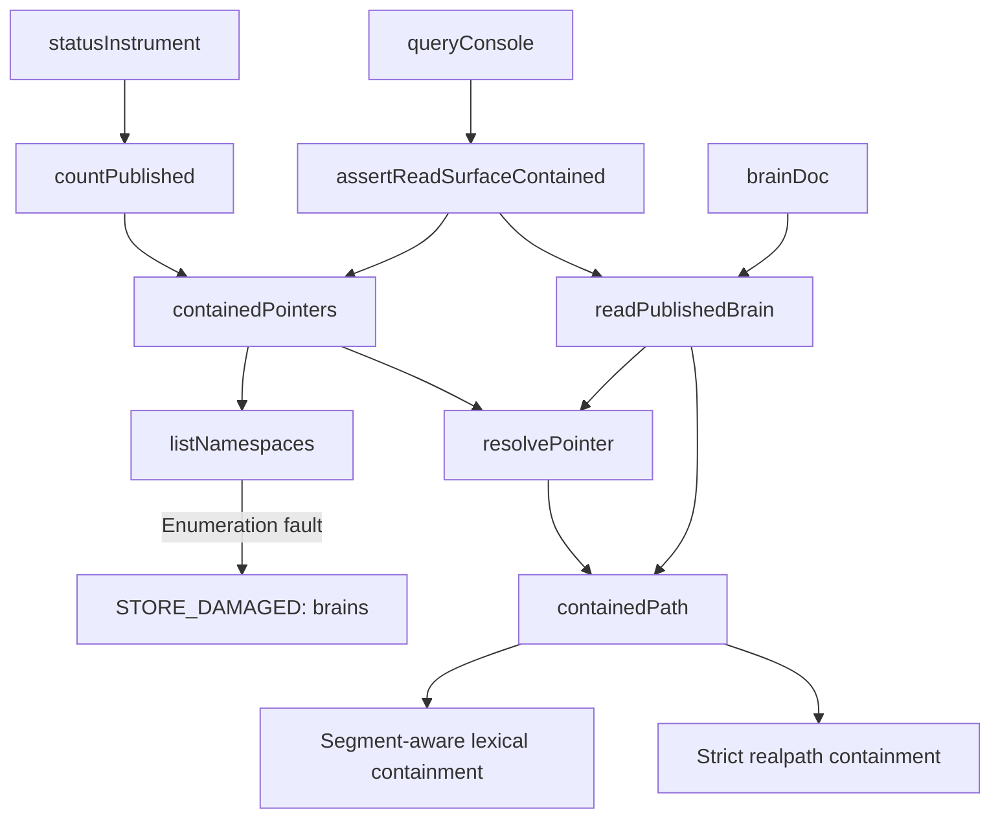
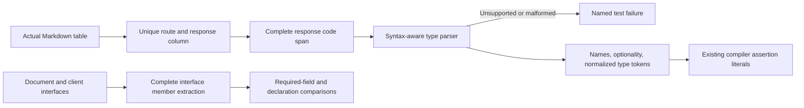

**Plain-English Summary**

**REVISE — not dry.** The three fixes address their original examples, but five neighboring defects remain: one medium and four low.

A harmless file named `..notes` still makes the publication reader refuse the store. Enumeration failures still blame the wrong file. The contract readers can still overlook declarations, and their whitespace handling can both reject equivalent types and conflate different string literals.

**Technical Summary**

This review covers the **supplied source attributed to commit `93733ed52`**. Commit identity, hashes, suite totals and mutation results were **not independently verified**. Local commands were blocked. Executed evidence consists of in-memory reproductions transcribed from the supplied JavaScript, with filesystem/import operations excluded.

`C/` below means `packages/creator-brains-console/`. Line references are counted from the supplied source blocks.

## PART A — HOSTILE REVIEW

### A1 — Findings against the fixes and their neighbors

**R7-01 · MEDIUM · A contained ordinary file beginning with `..` still defeats the skip**

Evidence: [containment.mjs:108](~/.../packages/creator-brains-console/lib/containment.mjs:108), `C/lib/pointer.mjs#resolvePointer`.

```js
return rel !== '' && !rel.startsWith('..') && !isAbsolute(rel);
```

The predicate rejects **any name beginning with two dots**, including the ordinary contained filename `..notes`. A parent-directory component is specifically `..`; a name such as `..notes` is a different component. `path.relative()` supplies the relative path that must be evaluated by component boundaries. [Node.js path documentation](https://nodejs.org/api/path.html#pathrelativefrom-to).

Concrete input:

```text
brains/
  fixture-brain/     healthy published brain
  ..notes           ordinary file containing "notes"
```

`resolvePointer()` checks namespace containment before the ordinary-file skip. For `..notes`, that first check throws. Consequently, the supplied call graph makes `countPublished()` return an unknown count and makes `queryConsole()` refuse the entire query.

**Why this is a new neighbor:** R6-01 correctly moved child resolution below inspection, but the preceding containment predicate still prevents a harmless ordinary file from reaching that inspection. R3-01c tests `.DS_Store`; R6-01a/b test `stray-file`. None selects this neighboring filename.

**Concrete fix:** retain namespace containment first. Change only the relative-path predicate, importing `sep` from `node:path`:

```js
return rel !== ''
  && rel !== '..'
  && !rel.startsWith(`..${sep}`)
  && !isAbsolute(rel);
```

Retain realpath containment and tests for the parent, sibling directories, root equality and escaping junctions.

**Evidence boundary:** the relative-string predicate was evaluated in memory. The real filesystem/reader reproduction is supplied in Part B and was not run.

---

**R7-02 · LOW · Root enumeration errors still blame `current.json`**

Evidence: [pointer.mjs:94](~/.../packages/creator-brains-console/lib/pointer.mjs:94), its `damaged()` default at line 76.

```js
throw damaged(`the brains store could not be enumerated (${code})`);
```

R6-02 fixes the filename for **root resolution**, but its neighboring **root enumeration** failure still takes the default `file:'current.json'`.

Concrete input: make `brains` an ordinary file. Resolving that file can succeed; enumerating it fails. `countPublished()` preserves the resulting incorrect filename because `extra.file` is already populated.

The existing R4-01e regression checks the enumeration message and unknown count, but never asserts `damage.file`.

**Concrete fix:**

```js
throw damaged(
  `the brains store could not be enumerated (${code})`,
  'brains',
);
```

Add a filename assertion through `countPublished()`, retaining `ENOENT → []`.

**Evidence boundary:** established by the supplied call and default argument; no new filesystem execution is claimed.

---

**R7-03 · LOW · The strict member parser still receives only a selected substring of the contract**

Evidence: [contract-types.mjs:135](~/.../packages/creator-brains-console/test/contract-types.mjs:135) and line 138.

```js
.find((line) => line.startsWith(`| \`${route}\``));

const m = /\{([^}]*)\}/.exec(row.replace(/\\\|/g, '|'));
```

The outer reader selects the first matching row and the first brace pair anywhere in that row. Strictness inside `typedFields()` cannot examine text this extraction omitted.

The in-memory reproduction returned **identical fields** for these response declarations:

```ts
{ requestId: string; runId: string | null }

{ requestId: string; runId: string | null } & { extra: string }

{ requestId: string; runId: string | null } | { error: string }
```

An intersection adds requirements; it is a substantive type expression. [TypeScript object types](https://www.typescriptlang.org/docs/handbook/2/objects.html#intersection-types).

A second matching route row declaring numeric fields was also ignored. Braces in the engine-function column would be selected before the response column.

There is a corresponding incomplete-read problem inside the tokenizer: `typedFields('a: Array<string')` returns a field instead of refusing the unclosed type. Passing a nested object through the table reader truncates it at its first `}`.

**Concrete fix:**

1. Require exactly one actual table row for the route.
2. Select its response column using the table header.
3. Extract the complete response code span.
4. Parse the entire type expression and require the supported top-level object shape.
5. Reject trailing unions/intersections, malformed syntax and unsupported members explicitly.
6. Preserve the nested `Array<{ d: string }>` control already adopted by R6.

The repair must consume the whole input; adding more member-name exclusions will not close it.

---

**R7-04 · LOW · The sibling interface reader still silently drops required fields**

Evidence: [contract-parse.mjs:100](~/.../packages/creator-brains-console/test/contract-parse.mjs:100), line 107, and `stripComments()` at line 47.

For this valid declaration:

```ts
export interface X {
  a: string;
  readonly extra: string;
}
```

the reproduced `interfaceFields()` result was:

```js
[{ name: 'a', optional: false }]
```

A payload containing only `a` therefore satisfies the existing missing-field check. Quoted required names and `$extra` disappear the same way.

This is the **same unsupported-member omission R6-03 fixed**, one parser away. It remains relevant because `bridge.contractsync.test.mjs` uses this reader for both the document and client declarations. A required field added only to the document can disappear before either comparison sees it.

A second manifestation exists in `stripComments()`:

```ts
export interface X {
  url: 'https://example.invalid'; extra: string;
}
```

Its comment regex treats the literal’s `//` as a comment and erases the rest of that line. The scanner then accepts the truncated interface.

**Concrete fix:** use syntax-aware interface extraction. Preserve every supported property’s name and optionality, including required `readonly` properties. Unsupported index signatures or members must throw. Detect unclosed declarations, and recognize comments only outside literals.

The typed-response reader may retain its explicit refusal of `readonly` members; the interface presence reader must either extract them or refuse, never omit them.

---

**R7-05 · LOW · Whitespace normalization both rejects equivalent types and merges different literals**

Evidence: [contract-types.mjs:64](~/.../packages/creator-brains-console/test/contract-types.mjs:64).

```js
return type.replace(/\s+/g, ' ').replace(/[;,]\s*$/, '').trim();
```

Two directions were reproduced:

| Inputs | Current result | Required result |
|---|---|---|
| `string|null` and `string | null` | Different parsed types | Equivalent supported spelling |
| `'two  spaces'` and `'two spaces'` | Identical parsed types | Different string literal types |

Thus editing the legitimate run row to `runId: string\|null` makes the document comparison fail. Conversely, significant whitespace inside a literal is erased.

The first case was explicitly required by the R6 forged package’s flat-declaration contract and proposed R6-T03 control; the shipped R6 tests omit it.

**Concrete fix:** normalize whitespace between tokens, including around union separators, while preserving literal token contents exactly. Do not fix this with a global pipe-spacing replacement: that would also modify pipes inside string literals.

### Disposition of R6

| Finding | Disposition |
|---|---|
| **R6-01** | Named ordering repair holds in the supplied source. Namespace containment remains first; ordinary-file inspection precedes child resolution. R7-01 preserves the same over-refusal class in the preceding predicate. |
| **R6-02** | Named resolver repairs hold in the supplied source: falsy throws refuse, filenames propagate, and resolved targets require root authority. Root-enumeration attribution remains R7-02. |
| **R6-03** | **PARTIAL.** Its named unsupported-member, duplicate and empty-type examples now refuse. Complete extraction, sibling interface parsing and whitespace handling remain defective. |

No new containment escape was established. **R2-07 and R2-08 remain excluded from closure adjudication.**

### Sibling sweep

This inventory covers the supplied packet, not an independently searched repository.

| Family | Siblings examined | Assessment |
|---|---|---|
| Pointer callers | `containedPointers()`, `readPublishedBrain()` | Both use `resolvePointer()`; no second pointer implementation identified in these callers. |
| Directory helper | `containedDir()` | Shares `containedPath()` and therefore the R7-01 predicate. No ordinary-file skip belongs in this helper. |
| Path containment | Namespace, pointer, generation, markdown leaves, rules leaf | All use `containedPath()`; the realpath and root-authority checks remain present. |
| Absence predicates | `brainsStore()`, `realpathOrNull()`, `listNamespaces()`, `entryKind()`, `readContainedText()` | The remaining `err && err.code === 'ENOENT'` predicates **refuse falsy throws**. Their direction differs from the repaired `!==` predicate; they are not another falsy-absence finding. |
| Error attribution | Root resolution, enumeration, namespace inspection, pointer/leaf reads | Enumeration retains the wrong default filename: R7-02. |
| Typed parsers | `typedFields()`, table reader, method-return reader, assertion reader | Table extraction and normalization remain defective. No supplied caller of `methodReturnTypedFields()` was identified; do not call that export runtime coverage. |
| Name-only parsers | `interfaceFields()`, `fieldNames()`, `methodReturnFields()`, `contractRowShape()` | Interface omission is R7-04. `fieldNames()` still filters unsupported fragments; the two deferred rows additionally have the typed comparison, but both row readers share first-object extraction. Consolidate them. |
| Assertion count | `contractAssertions()` and T-B27m2a | The six-subject check prevents an empty extraction from passing. It does not establish complete document parsing. |
| Other realpath fallback | `health-cache.mjs#cacheKey` | Its fallback chooses a cache key; it does not authorize a file read. It is not evidence of the containment bypass class. |

### Test-seam adjudication

`setRealpathForTest()` is a useful instrument for the stated platform asymmetry:

- The supplied implementation defaults to `realpathSync`.
- The supplied tests restore it in `finally`, with an additional suite cleanup.
- R6-01a first proves its injected child resolver is active, then proves `resolvePointer()` does not consult that child.
- The tests exercise the production control flow with one filesystem operation substituted.

It remains process-global and could be left armed by a defective test or an in-process caller. No supplied route or configuration exposes it. This is a serial-test/restoration requirement, not a demonstrated remote bypass.

R6-01e and M27 target preservation of namespace containment. They do not independently certify every possible placement relative to `statSync()`, or real ACL/reparse behavior.

### Evidence receipt

| Evidence | Status |
|---|---|
| Supplied source and previous review inspected | Completed |
| Transcribed parser/predicate reproductions in isolated JavaScript | Executed |
| Importing actual repository modules | Not executed |
| Commit, hashes, six-path scope and sixteen-path restoration | Packet-reported; not independently verified |
| Console 251/251, web 62/62, typecheck and engine gate | Packet-reported; not rerun |
| M21–M27 | Packet-reported; not rerun |
| Browser, launcher, HTTP, filesystem and ACL probes | Not run |
| Local forge skill, continuity and coordination reads | Blocked |
| Source edits, commits, archive filing | None |

## PART B — FORGED PACKAGE

### 00-README.md

**Creator Brains Console — Round 7 correction package**

**Status:** emitted for implementation; not installed.  
**Review target:** supplied snapshot attributed to `93733ed52`.  
**Verdict:** REVISE.  
**Owner:** console builder; final commit decision remains with the project’s Final Decider.

| Requirement | Acceptance | Finding |
|---|---|---|
| H7-1 | Contained dot-prefix files reach the ordinary-file skip; actual escapes refuse | R7-01 |
| H7-2 | Enumeration damage names `brains` | R7-02 |
| H7-3 | Contract rows and response expressions are consumed completely | R7-03 |
| H7-4 | Interface members are extracted or explicitly refused | R7-04 |
| H7-5 | Insignificant whitespace is normalized; literals retain their contents | R7-05 |
| H7-6 | Evidence distinguishes source inspection, injected tests and runtime execution | All |

Retain the existing routes, pointer classification, root-authority checks, compiler assertions and lifecycle behavior. This package authorizes no deferred endpoint or engine modification.

Readiness requires real-module regression results, retained controls, zero unexpected cancellations, a fresh artifact identity and the subsequent review.

### 01-architecture.md

The runtime correction affects two existing functions:

```text
containment.inside()
pointer.listNamespaces()
```

The test infrastructure correction affects the shared declaration readers.

**Supplied runtime call graph**



This is a source call graph. `routes.mjs`, the current `App` mount and `main.tsx` are not supplied as source in this round; their canonical runtime mounting has not been independently established.

**Declaration-check architecture**



Use the project’s installed TypeScript parser **only in test infrastructure**, after confirming its installed version and import path. Keep it out of `lib/`, `server.mjs` and the browser bundle. Existing compiler probes already reference the web package’s TypeScript installation.

Parsing provides syntax and member boundaries. A small token-aware normalizer provides the existing comparison representation. Do not replace the six `Exact<>` assertions.

**ERD:** N/A — no durable schema, model or relationship changes.

### 02-wireframes.md

No new screen or control is introduced. These acceptance views describe the existing publication instrument.

**Desktop**

```text
Status                                      live

Creators             2 enabled of 3
Published brains     1
Recent runs          {existing reading}
```

**375px**

```text
Status
live

Creators
2 enabled of 3

Published brains
refused — brains unreadable

Recent runs
{existing reading}
```

| State | Publication instrument |
|---|---|
| Healthy publication plus `..notes` ordinary file | Real publication count |
| Empty store plus `..notes` ordinary file | `0` |
| Enumeration fault | `refused — brains unreadable` |
| Pointer fault | Existing `current.json` refusal |
| Recovery | Next successful poll displays the measured count |

Retain existing tokens, wrapping, keyboard behavior and unrelated instruments. No new animation or focus movement.

**Boundary:** these are acceptance drawings; no browser layout was verified.

### 03-contracts.md

**Containment**

Given `rel = relative(root, target)`:

- Reject `rel === ''`.
- Reject `rel === '..'`.
- Reject `rel` beginning with a parent component followed by the native separator.
- Reject an absolute relative result.
- Permit contained components such as `..notes`.
- Continue applying the same predicate to resolved paths.

Ordering remains:

```text
resolve root
→ contain namespace
→ inspect namespace
→ skip absent/non-directory entry
→ contain and read pointer
→ validate generation
→ contain generation and leaves
```

Do not globally suppress `ENOTDIR`.

**Diagnostics**

| Operation that failed | `file` |
|---|---|
| Brains-root resolution | `brains` |
| Brains-root enumeration | `brains` |
| Pointer resolution/read/shape | `current.json` |
| Leaf resolution/read | Caller’s leaf filename |
| Target resolved without root authority | `brains` |

**Markdown response reader**

1. Search actual tables outside fenced blocks.
2. Require exactly one matching method/path row.
3. Locate `Response 2xx` or `Planned response 2xx` from that table’s header.
4. Read its response code span, preserving escaped table pipes.
5. Permit the existing optional HTTP status prefix.
6. Require the complete remaining expression to be one supported object type.
7. Reject trailing object unions/intersections and conflicting duplicate rows.
8. Ignore explanatory prose outside the selected span; never silently truncate syntax inside it.

**Typed-field reader**

Preserve names, optionality and current supported type forms, including the R6 nested-array control. Continue refusing duplicate names, empty types, interior empty members, typed-field modifiers and index signatures.

Validate complete syntax before extracting fields. Unbalanced or mismatched delimiters must refuse.

**Interface presence reader**

Extract supported property signatures completely, including required `readonly`, quoted property names and identifiers containing `$`. These forms do not remove the property from the payload contract.

Unsupported members that cannot be represented by the presence checker must fail explicitly. Reject truncated interfaces and ambiguous duplicate declarations rather than selecting a prefix.

**Normalization**

- Normalize trivia outside literals.
- Normalize spacing around union separators.
- Preserve literal token contents, including repeated spaces and embedded pipes.
- Preserve optionality.
- Ignore field order.
- Do not claim general semantic equivalence for arbitrary TypeScript expressions.

**Public API and lifecycle**

No API shape, route, write permission, cache, drain or signal behavior changes.

### 04-build-order.md

1. Establish current lane ownership and exact scoped baseline in a writable execution environment.
2. Add the proposed regressions and observe their intended failures.
3. Correct `inside()` at its existing shared definition.
4. Give enumeration failures the explicit `brains` filename.
5. Replace first-row/first-brace extraction with complete table-response selection.
6. Introduce shared syntax-aware parsing for the declaration readers.
7. Preserve typed-reader refusals while completing interface presence extraction.
8. Add token-aware whitespace normalization.
9. Run retained containment, pointer, contract-sync and compiler controls.
10. Record the rebuilt artifact, counts, cancellations and review filing.

Do not stage unrelated changes or construct a commit from an index based on an unverified older HEAD.

### 05-slices.md

| Slice | Scope | Exit |
|---|---|---|
| S0H-R7A | Containment predicate and enumeration attribution | Real temporary-store regressions and existing junction/ordering tests pass |
| S0H-R7B | Complete contract readers and normalization | Actual-document mutations, interface controls and compiler assertions pass |
| S0H-R7C | Combined evidence and review | Fresh identity, complete results and filed review |

Keep source and test files within the 300-line cap; extract shared parser mechanics when needed.

**N/A:** migrations, new permissions, new endpoints, new product flows and new motion.

### 06-bans.md

- Do not classify every `..` prefix as a parent-directory component.
- Do not move namespace containment behind the ordinary-file skip.
- Do not weaken realpath or unresolved-root refusal.
- Do not use the pointer filename for root enumeration damage.
- Do not silently select one of several matching route declarations.
- Do not extract a response from another table column.
- Do not stop parsing at the first closing brace.
- Do not silently discard unsupported interface members.
- Do not strip comment markers or whitespace from string literals.
- Do not add a runtime TypeScript dependency to repair test infrastructure.
- Do not count setup failures, missing cases or cancellations as successful mutation detection.
- Do not close R2-07/R2-08 or certify filesystem races from this work.

### 07-checkpoints.md

**Required discriminating checks**

| Mutation/regression | Required detector |
|---|---|
| Restore `rel.startsWith('..')` | Dot-prefix ordinary-file test |
| Permit actual parent/sibling escape | Containment boundary controls |
| Restore default enumeration filename | Root-enumeration diagnostic test |
| Ignore response suffix | Intersection/union tests |
| Select first matching route | Duplicate-row test |
| Select first braces anywhere | Response-column test |
| Stop at nested closing brace | Nested-type table control |
| Drop unsupported interface property | Required-property extraction test |
| Strip `//` inside literal | Literal/comment test |
| Keep raw union spacing | Actual-row whitespace control |
| Collapse literal contents | Significant-literal-whitespace test |

Record expected named failures before mutation runs. Restore bytes afterward and verify the restoration.

**Execution commands for the implementation environment**

```powershell
node --test packages/creator-brains-console/test/containment.r7.test.mjs
node --test packages/creator-brains-console/test/contract-readers.r7.test.mjs
node --test packages/creator-brains-console/test/*.test.mjs
node scripts/creator-brains/consistency-check.mjs
```

Retain the existing web/typecheck gates when rebuilding the complete review artifact. Record actual per-file counts; do not reuse the packet’s aggregate as an independently observed result.

**Archive:** not filed in this session. The next filing must identify R6 as the predecessor, retain its historical record and distinguish these five findings from the excluded items.

### 09-tests.md

These are complete proposed regression files. **They were not installed or executed.** They import the actual repository functions; the in-memory reproductions reported in Part A did not.

**`C/test/containment.r7.test.mjs`**

```js
/**
 * R7 containment regressions.
 * Covers contained dot-prefix names and root enumeration attribution.
 * Uses only temporary stores created by the existing test helpers.
 * Retain the R5/R6 resolver-injection and real-junction suites.
 *
 * @module creator-brains-console/test/containment.r7
 */
import { test } from 'node:test';
import assert from 'node:assert/strict';
import { writeFileSync } from 'node:fs';
import { join, resolve } from 'node:path';

import { tempRoot } from '../../../scripts/creator-brains/test/helpers.mjs';
import { inside } from '../lib/containment.mjs';
import { resolvePointer } from '../lib/pointer.mjs';
import { countPublished } from '../lib/read-surface.mjs';
import {
  BRAIN_NS, getJson, seedPublishedBrain, withFixture,
} from './fixtures.mjs';

test('R7-C01: containment checks parent components, not name prefixes', () => {
  const root = resolve('r7-boundary');

  for (const target of [
    join(root, '..notes'),
    join(root, '..notes', 'item'),
    join(root, 'ordinary', 'item'),
  ]) {
    assert.equal(inside(root, target), true, target);
  }

  for (const target of [
    root,
    resolve(root, '..'),
    resolve(root, '..', 'outside', 'item'),
    resolve(`${root}-sibling`, 'item'),
  ]) {
    assert.equal(inside(root, target), false, target);
  }
});

test('R7-C02: a contained dot-prefix file does not poison publication reads', async () => {
  await withFixture('r7-c02', async ({ r, base }) => {
    seedPublishedBrain(r, BRAIN_NS);

    const before = await getJson(base, '/api/query?q=fixture');
    assert.equal(before.status, 200);
    assert.equal(before.body.hits.length, 1);

    writeFileSync(join(r, 'brains', '..notes'), 'ordinary file\n', 'utf8');

    assert.deepEqual(resolvePointer(r, '..notes'), {
      present: false,
      reason: 'absent',
    });

    const status = await getJson(base, '/api/status');
    assert.equal(status.status, 200);
    assert.equal(status.body.publishedBrains, 1);
    assert.equal(status.body.publishedBrainsDamaged, null);

    const query = await getJson(base, '/api/query?q=fixture');
    assert.equal(query.status, 200);
    assert.equal(query.body.hits.length, 1);
  });
});

test('R7-C03: enumeration failure names brains through countPublished', () => {
  const r = tempRoot('r7-c03');
  writeFileSync(join(r, 'brains'), 'ordinary file\n', 'utf8');

  const result = countPublished(r);
  assert.equal(result.count, null);
  assert.ok(result.damage);
  assert.equal(result.damage.file, 'brains');
  assert.match(result.damage.detail, /could not be enumerated/);
});
```

**`C/test/contract-readers.r7.test.mjs`**

```js
/**
 * R7 declaration-reader regressions.
 * Mutates actual contract text in memory; never edits the document.
 * Exercises complete response extraction, interface presence and normalization.
 * These tests register only their own cases.
 *
 * @module creator-brains-console/test/contract-readers.r7
 */
import { test } from 'node:test';
import assert from 'node:assert/strict';
import { readFileSync } from 'node:fs';

import {
  CONTRACTS_MD, assertServed, contractsTsBlock, interfaceFields,
} from './contract-parse.mjs';
import {
  assertSameShape, contractRowTypedFields, typedFields,
} from './contract-types.mjs';

const ROUTE = 'POST /api/run/daily';
const SOURCE = readFileSync(CONTRACTS_MD, 'utf8');
const PREFIX = `| \`${ROUTE}\``;
const MATCHES = SOURCE.split('\n').filter((line) => line.startsWith(PREFIX));

assert.equal(MATCHES.length, 1, 'one actual run row is required');
const ORIGINAL_ROW = MATCHES[0];
const RESPONSE = /`202 ([^`]*)`/.exec(ORIGINAL_ROW);
assert.ok(RESPONSE, 'the actual run row must declare its 202 response');

const ORIGINAL_TYPE = RESPONSE[1].replace(/\\\|/g, '|');

function withRunType(type) {
  const escaped = type.replace(/\|/g, '\\|');
  const changed = ORIGINAL_ROW.replace(
    /`202 [^`]*`/,
    () => `\`202 ${escaped}\``,
  );
  assert.notEqual(changed, ORIGINAL_ROW, 'mutation must reach the actual row');
  return SOURCE.replace(ORIGINAL_ROW, changed);
}

test('R7-T01: the unchanged document remains readable', () => {
  assertSameShape(
    contractRowTypedFields(ROUTE, SOURCE),
    typedFields(ORIGINAL_TYPE.slice(1, -1)),
    'actual run response',
  );
});

for (const [label, suffix] of [
  ['intersection', ' & { extra: string }'],
  ['union', ' | { error: string }'],
]) {
  test(`R7-T02/${label}: response syntax after the first object cannot vanish`, () => {
    assert.throws(
      () => contractRowTypedFields(
        ROUTE, withRunType(`${ORIGINAL_TYPE}${suffix}`),
      ),
      /unsupported|response|object|syntax/i,
    );
  });
}

test('R7-T03: conflicting duplicate route rows refuse', () => {
  const conflicting = withRunType('{requestId: number, runId: number}')
    .split('\n')
    .find((line) => line.startsWith(PREFIX));
  assert.ok(conflicting);

  const duplicated = SOURCE.replace(
    ORIGINAL_ROW,
    `${ORIGINAL_ROW}\n${conflicting}`,
  );
  assert.throws(
    () => contractRowTypedFields(ROUTE, duplicated),
    /duplicate|multiple|exactly one|ambiguous/i,
  );
});

test('R7-T04: braces in another column cannot become the response', () => {
  const source = [
    '| Method+Path | Tier | Owner slice | Engine function | Planned response 2xx | Planned errors |',
    '|---|---|---|---|---|---|',
    `| \`${ROUTE}\` | T2 | S4 | \`{decoy: number}\` | \`202 ${RESPONSE[1]}\` | — |`,
  ].join('\n');

  assertSameShape(
    contractRowTypedFields(ROUTE, source),
    contractRowTypedFields(ROUTE, SOURCE),
    'response column selection',
  );
});

test('R7-T05: nested supported types survive the actual table reader', () => {
  const type = '{requestId: string, meta: Array<{ d: string }> }';
  assertSameShape(
    contractRowTypedFields(ROUTE, withRunType(type)),
    typedFields('requestId: string, meta: Array<{ d: string }>'),
    'nested response type',
  );
});

for (const type of ['a: Array<string', 'a: Array<(string]>']) {
  test(`R7-T06/${type}: malformed type syntax refuses`, () => {
    assert.throws(
      () => typedFields(type),
      /unsupported|invalid|syntax|delimiter|expected/i,
    );
  });
}

for (const member of [
  'readonly extra: string;',
  '"extra": string;',
  '$extra: string;',
]) {
  test(`R7-T07/${member}: required interface properties remain visible`, () => {
    const expectedName = member.startsWith('$') ? '$extra' : 'extra';
    const source = `export interface X { a: string; ${member} }`;
    const fields = interfaceFields(source, 'X');

    assert.ok(fields.some(
      (field) => field.name === expectedName && field.optional === false,
    ));
    assert.throws(
      () => assertServed('/api/x', fields, { a: 'present' }),
      /missing:/,
    );
  });
}

test('R7-T08: required additions to the actual document cannot disappear', () => {
  const document = contractsTsBlock();
  const marker = 'export interface BrainDoc {';
  assert.ok(document.includes(marker));

  const baseline = interfaceFields(document, 'BrainDoc');
  const payload = Object.fromEntries(baseline.map((field) => [field.name, null]));
  assertServed('presence-only baseline', baseline, payload);

  const changed = document.replace(
    marker,
    `${marker} readonly extra: string;`,
  );
  assert.notEqual(changed, document);

  const fields = interfaceFields(changed, 'BrainDoc');
  assert.ok(fields.some((field) => field.name === 'extra' && !field.optional));
  assert.throws(
    () => assertServed('mutated BrainDoc', fields, payload),
    /missing: extra/,
  );
});

test('R7-T09: a comment marker inside a literal does not erase fields', () => {
  assert.deepEqual(
    interfaceFields(
      "export interface X { url: 'https://example.invalid'; extra: string; }",
      'X',
    ),
    [
      { name: 'url', optional: false },
      { name: 'extra', optional: false },
    ],
  );
});

test('R7-T10: a truncated interface refuses', () => {
  assert.throws(
    () => interfaceFields('export interface X { a: string;', 'X'),
    /unsupported|invalid|syntax|unclosed|expected/i,
  );
});

test('R7-T11: union whitespace in the actual response is insignificant', () => {
  const compact = ORIGINAL_TYPE.replace(/string\s*\|\s*null/g, 'string|null');
  assert.notEqual(compact, ORIGINAL_TYPE);

  assertSameShape(
    contractRowTypedFields(ROUTE, withRunType(compact)),
    contractRowTypedFields(ROUTE, SOURCE),
    'union whitespace',
  );
});

test('R7-T12: literal whitespace and literal pipes retain their meaning', () => {
  assert.notDeepEqual(
    typedFields("a: 'two  spaces'"),
    typedFields("a: 'two spaces'"),
  );
  assert.notDeepEqual(
    typedFields("a: 'x|y'"),
    typedFields("a: 'x | y'"),
  );
});
```

Retain the existing R6 unsupported-member controls, optionality tests, six-subject assertion inventory and compiler mutation tests. The presence-only payload in R7-T08 tests extraction/comparison; the existing live payload suite remains necessary.

### A2 — One hostile review of this draft

| Draft risk | Correction incorporated |
|---|---|
| Permitting `..notes` could accidentally permit traversal | Require a parent-component boundary; retain root equality, absolute-path and realpath checks |
| “Complete parsing” could introduce a runtime dependency | Confine TypeScript parsing to test infrastructure |
| A flat-parser rewrite could break R6’s accepted nested-array example | Preserve that syntax and test it through the table reader |
| Normalizing union spacing globally could alter literals | Preserve literal tokens; add embedded-pipe and repeated-space controls |
| An interface test could demand the typed parser accept previously refused modifiers | Keep interface-presence and typed-response acceptance policies explicit |
| Synthetic payload checks could be presented as HTTP evidence | Label the presence-only payload and retain the live suite |
| Proposed tests could be mistaken for installed fixes | Mark both files emitted and unexecuted |
| A repo link could imply commit verification | State that all findings concern the supplied snapshot and its line numbering |

## PART C — DECISION-DENSITY SELF-TEST

| Decision | Resolution |
|---|---|
| Named R6 ordering | Preserve |
| Containment correction | Check parent-directory components |
| Root authority and non-ENOENT errors | Preserve fail-closed behavior |
| Enumeration filename | `brains` |
| Duplicate contract rows | Refuse |
| Response extraction | Header-selected column; complete code span and type |
| Top-level response unions/intersections | Explicitly unsupported; refuse |
| Nested type control | Preserve and test through the caller |
| Interface member omissions | Eliminate; extract supported properties or refuse |
| Comment handling | Syntax-aware; literals preserved |
| Whitespace | Normalize between tokens only |
| Compiler identity assertions | Preserve all six |
| Parser implementation dependency | Existing TypeScript installation, test-only; version inspection required |
| New routes, schema, permissions, motion | N/A |
| Runtime and browser certification | Not established |
| R2-07/R2-08 | Excluded |
| Repository modifications and archive filing | Not performed |
| Closure | **REVISE — five scoped findings remain** |

Execution policy rejected the local read commands with **“blocked by policy”**; approval escalation was unavailable. This prevented commit verification, local skill loading, repository test execution and archive filing.