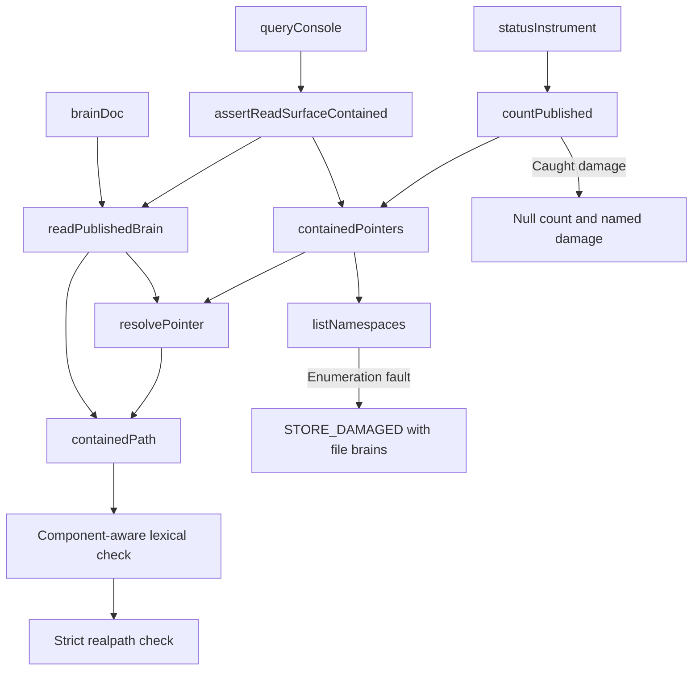
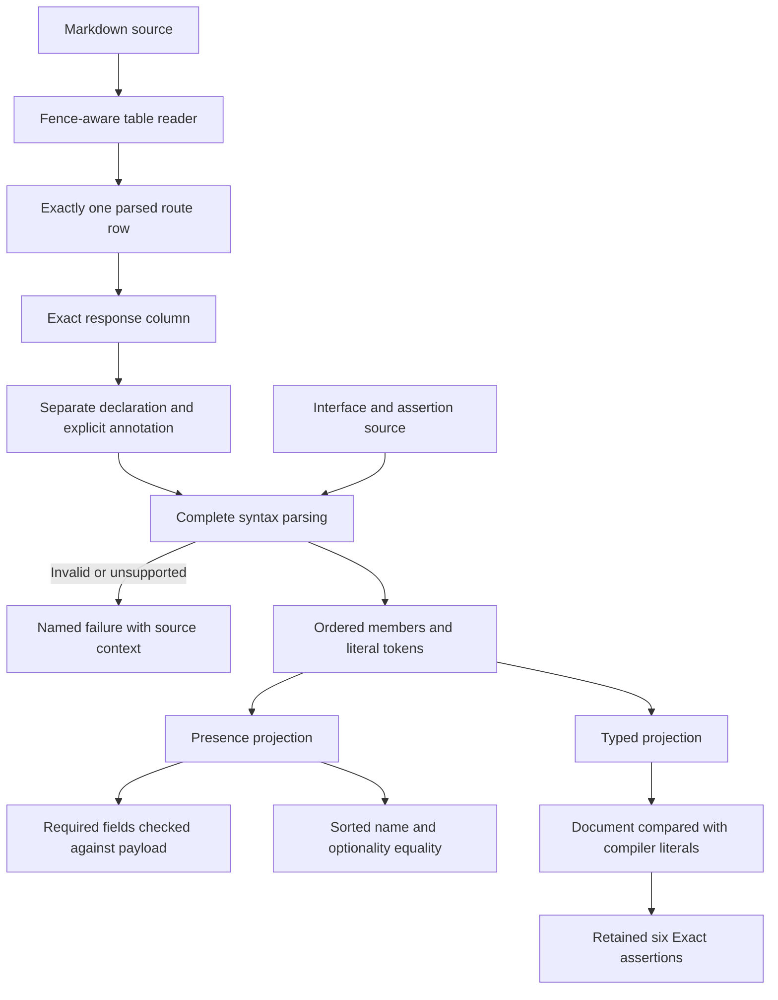
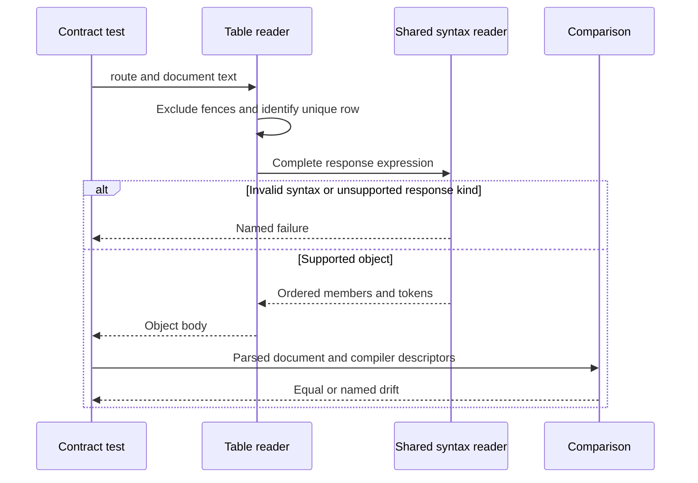
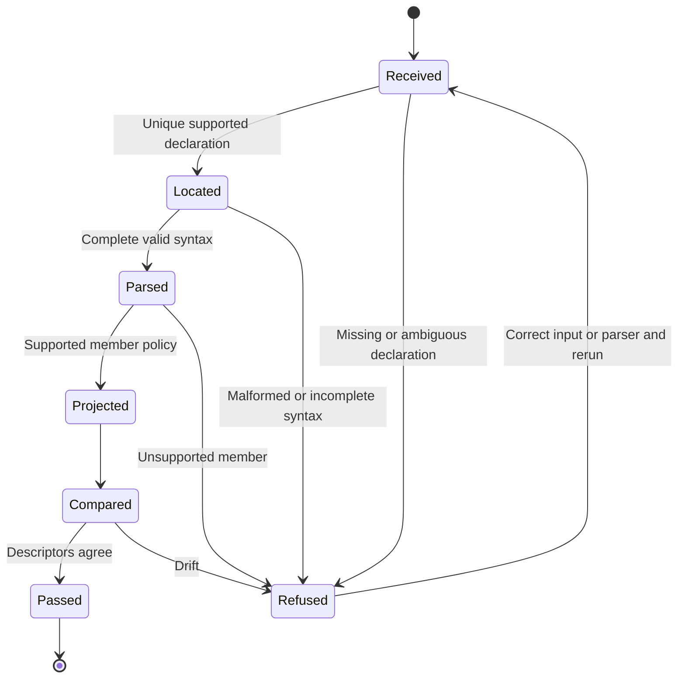

# Astra Reply — subscription transport — 2026-09-21T05:05:02.432Z

**Provider:** openai-codex
**Billing:** chatgpt-subscription
**Authentication:** chatgpt_subscription
**Transport:** codex-cli
**Requested model:** gpt-6-astra
**Served model:** NOT OBSERVABLE on codex-cli (see SERVED_MODEL_UNVERIFIABLE_NOTE)
**Reasoning effort:** xhigh
**Tokens:** in=1360713 out=30900 reasoning=14017
**Packet:** `docs/ai-workflow/blueprints/creator-brains-console-20260917/17-astra-mega-packet-r8.md`
**Wall:** 949.5s
**Mega Blueprint:** ARMED (operator flag)

> Marginal cost $0 — this leg rides the ChatGPT subscription, not OpenRouter.

---
Mega Blueprints. I’m applying the packet’s included `fable-blueprint-forge` skill and reviewing only the supplied text, focusing on neighboring parser defects and legitimate inputs the fixes may now refuse.

The table reader still accepts an array response as its element’s object shape. Its stated backstop does not catch a document-only change: the unchanged compiler literal still compares equal to the truncated result. In-memory checks also confirmed that a differently spaced duplicate row is ignored, while a fenced example is counted as a real declaration.

The two runtime fixes hold in the supplied source. The remaining failures are in the verification code: escaped quotes still hide later fields and collapse distinct literal types, interface parsing accepts incomplete declarations, and the final cross-document comparison discards optionality. I’m building the correction package around those confirmed gaps and preserving the existing refusal controls.

There are further over-refusals: the name reader rejects `'a:b'`, and the junction test helper rejects a real outside directory when its name starts with the store’s name. The mutation summary also contradicts its own list: seven mutants have single-test failure sets, and some sets overlap. I’ll separate those evidence corrections from the implementation findings.

## PART A — HOSTILE REVIEW

**REVISE — not dry.** Eight scoped findings remain, all **LOW severity**, affecting contract verification, attack-fixture validation, or evidence reporting. Several are incomplete requirements from R7 rather than newly discovered defects.

**R7-01 and R7-02 hold in the supplied source. R7-03, R7-04 and R7-05 remain partial.** No new production containment escape was established.

`C/` means `packages/creator-brains-console/`. Line references count from the supplied code blocks.

**Evidence labels:** [VERIFIED] means visible in the packet or reproduced using transcribed, isolated JavaScript. It does **not** mean repository execution. Commit identity, hashes, installed dependencies and reported suite results remain [UNKNOWN] independently. No filesystem, repository, browser or network inspection occurred.

### A1 — Existing package and implementation review

**R8-01 · LOW · The response reader still compares an object fragment as the complete response**

[VERIFIED] Evidence: `C/test/contract-table.mjs:190–194`, and `contract-table.mjs#wholeObjectShape`.

The isolated reproduction returned the same body for all five declarations:

```ts
{requestId: string, runId: string | null}
{requestId: string, runId: string | null}[]
null | {requestId: string, runId: string | null}
Array<{requestId: string, runId: string | null}>
{requestId: string, runId: string | null} extends object ? never : unknown
```

The reader finds the first `{`, ignores preceding syntax, and permits most trailing syntax. It also selects only the first code span: a response cell containing a second response declaration is accepted as the first declaration alone.

**The packet’s array backstop is incorrect.** Only the document needs to change to an array response. The compiler literal can remain an object: extraction removes the document’s `[]`, and the two sides still compare equal. `methodReturnTypedFields()` never receives the changed document expression.

**Fix:** consume the complete declared type, require a top-level object, and reject arrays, wrappers, unions and conditionals at that level. Separate explicitly delimited annotations from type syntax. Reject additional response declarations in the same cell. Preserve the existing annotated-response control.

---

**R8-02 · LOW · “Exactly one row” counts formatting matches, not actual table declarations**

[VERIFIED] Evidence: `C/test/contract-table.mjs:175–184`, `contract-table.mjs#rowIndexes`, and R7 package `03-contracts.md#Markdown response reader`.

Two independent reproductions:

- Appending a conflicting row beginning with ``|`POST /api/run/daily` ``—without the space after the opening pipe—leaves the first row accepted.
- Appending a fenced Markdown example containing the same table produces “declares 2 table rows,” although the example is not an active declaration.

The first hides a duplicate. The second is **another over-refusal**. R7 explicitly required actual tables outside fenced blocks; that requirement was not implemented.

**Fix:** recognize table structure and fence context first, then compare the parsed method/path cell. Accept supported whitespace variations consistently. Require exactly one method/path column and one exact response header; `/response/i` with `findIndex()` must not silently choose between ambiguous columns.

---

**R8-03 · LOW · Escaped quotes remain structural in the neighboring scanners**

[VERIFIED] Evidence: `C/test/contract-types.mjs:75–90`, `C/test/contract-parse.mjs:135–139`, and `C/test/contract-names.mjs:163–170`.

The comment stripper handles escapes. The interface scanner, top-level splitter, object scanner and normalizer do not.

Reproduced:

```ts
export interface X {
  a: 'it\'s';
  extra: string;
}
```

`interfaceFields()` returns only `a`. Likewise:

```js
memberNames("a: 'it\\'s'; extra: string")
// ['a']
```

The normalizer also makes these distinct literals equal:

```ts
'it\'s  two'
'it\'s two'
```

Both become `'it\'s two'`.

**Fix:** use shared syntax/token handling that understands escaped quotes and backslashes. Preserve literal tokens without rewriting their contents. Test through both field readers and the response-table reader, not only `stripComments()`.

---

**R8-04 · LOW · Complete-input validation requested by R7 is still absent**

[VERIFIED] Evidence: `C/test/contract-parse.mjs:98–157`, `C/test/contract-names.mjs#splitTopLevel`, and R7 package `09-tests.md#R7-T06/R7-T10`.

These inputs were accepted in isolated reproductions:

```ts
export interface X { a: string;
```

```ts
a: Array<string
a: Array<(string]>
```

The first returns a field list without a closing interface brace. The other two return typed fields despite unclosed or mismatched delimiters.

The next neighboring omission is ordinary property separation:

```ts
export interface X { a: string, extra: number }
```

```ts
export interface X {
  a: string
  extra: number
}
```

Both return only `a`. Once `expectField` becomes false, a comma or newline never starts another field.

The method-return readers retain the old `[^}]*` extraction too. A nested object return is refused rather than read completely; consolidating the table reader did not complete those siblings.

**Fix:** validate syntax before projection, require complete declarations, reject ambiguous duplicate interface/method declarations, and derive property boundaries from syntax. Preserve document order for `interfaceFields()`. Implement the already-requested malformed-type and truncated-interface regressions.

---

**R8-05 · LOW · Shared name handling still disagrees about token boundaries**

[VERIFIED] Evidence: `C/test/contract-names.mjs:204–208`, and `contract-names.mjs#stripComments`.

Two reproductions:

```js
memberNames("'a:b': string")
// throws: unsupported field name
```

`readMember()` recognizes the quoted name, but `memberNames()` independently treats the colon **inside that name** as the field separator.

```js
stripComments('readonly/* note */slug: string')
// 'readonlyslug: string'
```

Removing the block comment joins two tokens. The interface reader subsequently reports a property named `readonlyslug`.

The quoted-colon case is **another over-refusal** within the newly supported quoted-name grammar.

**Fix:** obtain the separator from the parsed member, not `indexOf(':')`. Replace comments with trivia that preserves token boundaries and line breaks. Decode supported quoted property names to their actual property keys; preserve raw literal text separately for type comparison.

---

**R8-06 · LOW · The repaired optionality bit is discarded by the comparison’s caller**

[VERIFIED] Evidence: `C/test/bridge.contractsync.test.mjs:42` and `bridge.contractsync.test.mjs#T-B27e`.

```js
const names = (src, n) =>
  interfaceFields(src, n).map((f) => f.name).sort();
```

Changing only the document’s `BrainDoc.title` to `title?: string` leaves this comparison unchanged. The live payload already contains `title`, so the two presence checks also pass.

R7-04 preserves optionality in extraction, but this downstream projection removes it before comparing declarations.

**Fix:** compare sorted `{name, optional}` descriptors between document and client declarations. Keep `assertServed()` directional: optional fields need not exist on every payload. Declaration equality and payload presence are separate checks.

---

**R8-07 · LOW · The attack helper retains the path-prefix defect beside the repaired guard**

[VERIFIED] Evidence: `C/test/store-attacks.mjs:102`; related construction assertion at line 75.

```js
!real.toLowerCase().startsWith(realStore.toLowerCase())
```

For a store `/tmp/store` and a junction resolving to `/tmp/store-outside/gen-0001`, the assertion rejects the fixture even though its target is outside the store.

This is the path-component-versus-string-prefix class, now in the instrument used to validate attacks. The lowercase conversion also imposes case-insensitive reasoning on every platform.

**Fix:** compare native path relationships by components. For traversal fixtures, prove the constructed path resolves to the intended outside target and lies outside the **store**, not merely above the namespace. Keep fixture validation independent of production `inside()` so one faulty predicate cannot validate itself.

**Boundary:** the faulty string predicate was reproduced. No new junction was created during this consult.

---

**R8-08 · LOW · The mutation summary contradicts its listed evidence**

[VERIFIED] Evidence: packet `17-astra-mega-packet-r8.md#EVIDENCE BOUNDARY`.

The text says ten mutants each redden exactly one test. Its own enumeration identifies **seven**:

```text
M32, M33, M35, M36, M37, M39, M40
```

It also says two mutants must not redden the same test, but M34 and M36 both list `R7-04e`. Distinct failure sets are not disjoint failure sets.

**Fix:** report the actual signatures and distinguish:

- different failure sets;
- overlapping failure sets;
- intentionally disjoint detector pairs.

Retain original predictions, corrections and observed results separately. Do not present this narrative as independently checked mutation receipts; those receipts are not supplied.

### R7 dispositions and sibling inventory

| Family | Supplied siblings examined | Disposition |
|---|---|---|
| R7-01 containment | `inside`, `containedPath`, `containedDir`, pointer and leaf callers | [VERIFIED] Component boundary correction holds. Realpath and unresolved-root checks remain. Fixture predicate remains R8-07. |
| R7-02 attribution | Root resolution/enumeration, pointer inspection/read, leaf read, `countPublished` | [VERIFIED] Enumeration now explicitly names `brains`; `countPublished` preserves it. No further root-attribution defect established. |
| R7-03 extraction | Table row reader, name/typed projections, method-return readers, assertion extractor | **PARTIAL:** R8-01, R8-02 and R8-04. |
| R7-04 member parsing | Comment stripper, `readMember`, splitter, interface extraction, comparison callers | **PARTIAL:** R8-03 through R8-06. |
| R7-05 normalization | Union/intersection spacing, literal state, callers through `typedFields` | **PARTIAL:** ordinary quoted literals work; escaped literals still collapse under R8-03. |

[VERIFIED] The R7-01c test proves that `resolvePointer()` accepts a published `..notes` directory. It does **not** prove the whole query accepts that publication: `containedPointers()` subsequently rejects it through the separate namespace alphabet. Preserve that distinction. The required harmless-file control is an **ordinary file** named `..notes`.

**Named asymmetry adjudication:** different presence and typed-response policies are legitimate when explicit. A refusal is a failing check, not a vacuous pass. Document ordering does not require duplicate parsers: one parsed representation can support an ordered presence projection and a sorted typed projection. The typed grammar also rejects `$` names, which its current explanatory header fails to state.

**Resolver-seam adjudication:** [VERIFIED] supplied tests restore the injected resolver, and R6-01a demonstrates the seam is reached before testing its avoidance. This is useful control-flow evidence. The mutable resolver remains process-global; tests using it must be serial within that process. Actual ACL behavior, file symlinks and hostile concurrent filesystem mutation remain unproven.

**Document coverage:** the supplied contracts, test plan, traceability, operations, held findings, README, readiness receipt and R7 forged package were considered for the scoped fixes. Referenced requirements, original wireframes and original flow documents supplied only by filename/hash were not reviewed. R2-07 and R2-08 remain excluded.

### A2 — One review of the draft correction package

The draft was reviewed once. These corrections are incorporated below:

| Draft defect | Correction incorporated |
|---|---|
| Rejecting every code-span suffix would reinstate R7’s annotation over-refusal | Explicit annotation delimiters; preserve the existing em-dash control and progress annotation |
| Sorting shared parser output would break `T-B27d` | Shared representation preserves source order; comparison projections sort |
| Unifying parsers could silently widen R6’s typed-member policy | Separate syntax recognition from the existing typed-member restrictions |
| Descriptor tests alone would miss an unwired production test caller | Require a document-only optionality mutation through actual `T-B27e` |
| Reusing production `inside()` in attack construction would couple the oracle to the guard | Independent fixture relationship check and known sibling-directory control |
| Importing a new comparator would make missing-export errors look like RED evidence | Extract the existing comparison without behavior change before running its regression |
| Selecting the existing compiler could imply its installation was verified | Dependency/version discovery is a blocking implementation entry check |
| Requiring disjoint mutant sets would reject legitimate shared dependencies | Record exact sets; require disjointness only for specifically designated pairs |

### Evidence receipt

| Item | Status |
|---|---|
| Supplied source inspection | [VERIFIED] Completed within scope |
| Transcribed parser and predicate experiments | [VERIFIED] Executed in isolated JavaScript |
| Actual repository-module tests | NOT RUN |
| Console 274/274; web 62/62; typecheck; engine 15/15 | Packet-reported; not rerun |
| M28–M40 execution and restoration | Packet-reported; raw receipts not inspected |
| Commit/hash/worktree verification | NOT RUN |
| Browser, launcher, filesystem and end-to-end verification | NOT RUN |
| Repository changes | None |
| Archive filing | NOT PERFORMED — disk access is excluded by this consult |

## PART B — FORGED PACKAGE

### 00-README.md

**Creator Brains Console — R8 correction package**

**Status:** implementation specification emitted; not installed, tested or approved for advancement.

**Target:** supplied source attributed to commit `b09320bca`.  
**Scope:** contract-test infrastructure, attack-fixture validation and corrected mutation reporting.  
**Runtime disposition:** retain the R7-01 containment predicate and R7-02 enumeration filename fix.

| Requirement | Acceptance criterion | Finding |
|---|---|---|
| H8-1 | Complete response expressions are validated before extracting members | R8-01 |
| H8-2 | Only actual table declarations enter the unique-route check | R8-02 |
| H8-3 | Escaped literals preserve contents and cannot hide subsequent members | R8-03 |
| H8-4 | Malformed/incomplete syntax fails; supported members cannot disappear | R8-04 |
| H8-5 | Comments and quoted names preserve token/property boundaries | R8-05 |
| H8-6 | Cross-document equality includes optionality | R8-06 |
| H8-7 | Attack builders distinguish outside siblings from contained descendants | R8-07 |
| H8-8 | Evidence summaries agree with their recorded failure sets | R8-08 |

**Builder contract:** execute one slice at a time. Preserve existing controls. Return the scoped diff and actual acceptance evidence at each checkpoint. Missing dependencies, setup failures, cancellations and unexecuted tests are not passing evidence.

**Evidence correction:** the supplied mutation enumeration describes thirteen mutants, seven single-test failure sets, and some overlapping sets. Execution remains packet-reported.

This package does not close R2-07/R2-08, authorize deferred routes, modify engine code, or establish runtime readiness.

### 01-architecture.md

**Runtime boundary retained**



This diagram represents supplied function calls. The route-table implementation is absent; mounted-route certification is not claimed.

**Contract-verification architecture**

Use the web package’s existing TypeScript installation for **test-only syntax recognition**. The packet already uses that installation for compiler probes; its exact version and loadable parser entry remain implementation entry checks.







**API sequence diagrams:** N/A — the correction adds or changes no API interaction. The sequence above covers the changed verification subsystem.

**ER diagram:** N/A — no tables, columns, migrations or durable data model are changed.

**Rendering:** literal Mermaid source is supplied; rendered previews were not produced.

### 02-wireframes.md

**N/A — scope-bounded consult, no repository surface in scope for UI modification.**

This correction package changes test infrastructure and evidence text. It introduces no screen, control, copy string, palette token, responsive rule, animation or focus transition.

The supplied `StatusBoard` remains context for the retained `brains` diagnostic. No replacement desktop or 375px drawing is fabricated from the absent original wireframe document. Existing viewport obligations remain unverified and unchanged.

### 03-contracts.md

**Shared parsed representation**

```ts
type Member = {
  name: string;
  optional: boolean;
  readonly: boolean;
  nameKind: 'identifier' | 'string' | 'number';
  typeText: string;
};

parseInterfaceMembers(source: string, name: string): Member[];
parseObjectMembers(expression: string, label: string): Member[];
parseMethodObjectMembers(source: string, method: string): Member[];
```

These are proposed test-helper interfaces, not public application APIs.

**Syntax requirements**

- Parsing must report syntax diagnostics and consume the complete selected declaration.
- An object expression must be one top-level object type. Arrays, generic wrappers, top-level unions/intersections and conditionals refuse.
- Interface lookup requires one matching declaration. Declaration merging and overload ambiguity refuse until deliberately supported.
- Preserve property order in the shared representation.
- Recognize supported separators, comments, escaped literals and quoted property keys.
- A parser wrapper must not permit injected trailing declarations to escape validation.
- Unknown syntax produces a named failure; it never produces fewer fields.
- Preserve the existing nested `Array<{ d: string }>` control.

**Projection policies**

| Reader | Policy |
|---|---|
| `interfaceFields` | Return ordered `{name, optional}`; support supplied readonly, quoted, `$` and numeric-name cases |
| `memberNames` | Return sorted names with optional `?`; obtain boundaries from parsed members |
| `typedFields` | Preserve R6’s restricted root-member policy, including refusal of readonly, quoted and `$` names, duplicate names, empty types and interior empty members |
| Method-return readers | Share complete syntax extraction; preserve their current names/typed return shapes |
| Assertion reader | Parse assertion structure; retain the exact six-subject inventory |

The presence reader may accept syntax the typed projection explicitly refuses. Sorting happens after parsing.

**New comparison seam**

```ts
assertInterfaceAgreement(
  documentSource: string,
  clientSource: string,
  interfaceName: string
): void;
```

It compares sorted `{name, optional}` descriptors. `T-B27e` must call it. `assertServed()` continues checking required-field presence separately.

**Markdown selection**

1. Exclude fenced code blocks, including backtick and tilde fences.
2. Parse supported top-level tables, accepting whitespace variations and optional outer pipes.
3. Match the parsed `Method+Path` cell exactly.
4. Require exactly one matching row.
5. Require one exact `Response 2xx` or `Planned response 2xx` column.
6. Decode Markdown table escaping before parsing type text.
7. Consume the declaration code span completely, allowing its optional three-digit status prefix.
8. Reject additional response declarations in the cell.

**Annotation boundary**

Preserve the supplied conventions:

```text
{…} — explanatory prose
{…} (progress via GET /api/run)
```

The em-dash annotation may occur inside or outside the declaration code span. The progress annotation may include the separate inline-code route `GET /api/run`.

An explicit annotation boundary is required. Arbitrary trailing text is not automatically prose. Braces inside an explicitly delimited annotation are prose; brackets or type operators attached to the declaration remain type syntax.

**Normalization**

Preserve literal token text exactly, including escaped quotes, repeated spaces and embedded pipes. Normalize trivia outside literals and spacing around `|` and `&`. Retain existing outputs such as:

```text
string | null
Array<{ d: string }>
```

General semantic equivalence between differently expressed TypeScript types is not promised by this textual link. The existing compiler assertions retain that separate responsibility.

**Attack fixtures**

Use native component relationships over resolved paths. Validate the intended outside target independently of production `inside()`. Do not lowercase paths unconditionally.

**Operations**

No new environment variables, migrations, permissions or endpoints. Rollback restores only the scoped test-helper/test changes. Preserve production containment fixes and historical review artifacts.

### 04-build-order.md

All paths below are under `C/`. New paths are proposals, not verified files.

| Order | File | Work and dependencies | Budget |
|---|---|---|---|
| 1 | `test/contract-parse.mjs` | Extract current cross-document comparison into `assertInterfaceAgreement`; initially preserve existing behavior | ≤300 lines |
| 2 | `test/bridge.contractsync.test.mjs` | Wire `T-B27e` to that seam; retain existing presence and inventory checks | ≤300 |
| 3 | Three `*.r8.test.mjs` files in `09-tests.md` | Add discriminating regressions after the seam exists | ≤300 each |
| 4 | `test/contract-syntax.mjs` | New shared syntax reader using the existing web TypeScript installation; exports the three proposed parsing functions | ≤280 |
| 5 | `test/contract-format.mjs` | New token-based trivia/literal normalization; imported by existing normalization export | ≤200 |
| 6 | `test/contract-table.mjs` | Fence/table/declaration selection; imports shared syntax reader | ≤280 |
| 7 | `test/contract-names.mjs` | Replace independent name/separator logic; preserve existing exports | ≤280 |
| 8 | `test/contract-parse.mjs` | Complete interface/method extraction and descriptor comparison | ≤280 |
| 9 | `test/contract-types.mjs` | Shared method/assertion extraction and normalization; retain typed policy | ≤280 |
| 10 | `test/store-attacks.mjs` | Repair fixture containment assertions | ≤200 |
| 11 | Successor evidence package | Correct mutation summary; preserve original packet and predictions | ≤300 per document |

Existing patterns to retain:

```js
// Harness modules register no tests.
export function contractRowShape(route, source = readFileSync(CONTRACTS_MD, 'utf8')) {
  return memberNames(responseShapeFor(route, source));
}
```

```js
// A failure must prove the intended boundary, not incidental setup failure.
assert.equal(drift.ok, false);
assert.match(drift.output, /TS2344/);
```

**Dependency gate:** confirm the parser comes from the same installed TypeScript package as the existing `TSC` probe. Record its version. Missing installation or unsupported API is BLOCKED; do not install or substitute another version silently.

### 05-slices.md

| Slice | Scope | Executable exit |
|---|---|---|
| H8-A | Comparison seam and regression fixtures | Existing baseline remains green after extraction; new regressions fail on intended assertions |
| H8-B | Complete table and syntax parsing, policies and consumer comparison | Table/parser R8 files and retained R5/R6/R7 contract suites pass |
| H8-C | Attack-fixture predicates | R8 fixture tests and existing containment/pointer/read-surface suites pass |
| H8-D | Combined evidence and review | Full console suite, web/typecheck and engine gate recorded; mutation summary reconciled; rebuilt artifact reviewed |

**Stop line:** do not advance to the next slice until its checkpoint passes. Setup failures or unavailable filesystem capabilities block the relevant checkpoint; they do not count as a detected regression.

For H8-B, mutate only document optionality in an isolated execution copy and run actual `T-B27e`. It must fail. Removing the new comparison call must make that experiment lose its detector, demonstrating that the seam is wired.

No new HTTP behavior is part of these slices.

### 06-bans.md

- Do not weaken the R7-01/R7-02 runtime fixes.
- Do not compare the first object fragment as a complete response.
- Do not count fenced examples as active declarations.
- Do not silently choose a duplicate row, response column, interface or method.
- Do not treat escaped quotes as literal terminators.
- Do not delete comment boundaries and join tokens.
- Do not discard optionality before declaration equality.
- Do not erase unsupported syntax to manufacture agreement.
- Do not widen the typed-member policy merely because the syntax parser recognizes more forms.
- Do not import TypeScript parsing into runtime code or the browser bundle.
- Do not reuse production containment as the attack fixture’s sole oracle.
- Do not classify missing imports, cancelled tests or setup failures as meaningful RED evidence.
- Do not require every mutant’s failure set to be disjoint.
- Do not modify engine files, add deferred routes, enable backup, or push to main.
- Do not close excluded findings or rewrite historical review verdicts.
- Do not claim this emitted package was installed, executed or archived.

### 07-checkpoints.md

**Entry**

Record the actual implementation checkout, revision, scoped dirty state and ownership. Confirm the existing TypeScript installation and baseline before changing behavior. These checks were not performed in this consult.

**Focused commands**

Run from the repository root:

```powershell
node --test packages/creator-brains-console/test/contract-table.r8.test.mjs
node --test packages/creator-brains-console/test/contract-readers.r8.test.mjs
node --test packages/creator-brains-console/test/store-attacks.r8.test.mjs
node --test packages/creator-brains-console/test/*.test.mjs
node scripts/creator-brains/consistency-check.mjs
```

Run separately from `packages/creator-brains-console/web`:

```powershell
npx vitest run
npx tsc --noEmit
npm run build
```

**Mutation requirements**

| Mutation | Required detector |
|---|---|
| Restore first-object response extraction | Array/prefix/generic/conditional response cases |
| Restore raw row-prefix matching | Whitespace duplicate case |
| Count fenced examples | Fenced-example positive control |
| Ignore escaped quotes | Required-next-field and literal-identity cases |
| Accept incomplete syntax | Truncated interface and malformed-type cases |
| Delete comment separators | Block-comment boundary case |
| Use first raw colon | Quoted-colon case |
| Drop optionality | Actual `T-B27e` document-only mutation |
| Restore fixture prefix test | Outside-sibling fixture case |

Record expected and actual named failures, process exit, discovered count, cancellations and restoration identity. Keep corrected predictions alongside their originals.

**Verdicts:** PASS, REVISE or HALT per slice. This consult is REVISE. A subsequent independent checkpoint reviews the rebuilt artifact; no provider call or spend is authorized here.

**Archive:** filing remains outstanding because this consult excludes disk access. The filing owner must use the actual predecessor review ID and archive schema; neither ID nor successful filing is invented here.

### 09-tests.md

The following are **proposed runnable regression files**, not installed or executed repository tests. The in-memory experiments in Part A used transcribed functions.

Materialize the comparison seam before running its regression so a missing export cannot be mistaken for RED.

**`C/test/contract-table.r8.test.mjs`**

```js
/*
 * R8 table extraction regressions.
 * Uses in-memory Markdown and actual exported readers.
 * No store, network, or repository mutations.
 */
import { test } from 'node:test';
import assert from 'node:assert/strict';
import { contractRowShape } from './contract-parse.mjs';
import { contractRowTypedFields } from './contract-types.mjs';

const ROUTE = 'POST /api/run/daily';
const SHAPE = '{requestId: string, runId: string | null}';
const HEADER = '| Method+Path | Response 2xx |\n|---|---|';
const code = (value) => `\`${value.replace(/\|/g, '\\|')}\``;
const row = (cell, gap = ' ') => `|${gap}\`${ROUTE}\` | ${cell} |`;
const doc = (shape) => `${HEADER}\n${row(code(`202 ${shape}`))}`;
const read = (source) => contractRowTypedFields(ROUTE, source);

test('R8-T01: the supported object remains readable', () => {
  assert.deepEqual(read(doc(SHAPE)).map((f) => f.name), [
    'requestId', 'runId',
  ]);
});

for (const [label, expression] of [
  ['array', `${SHAPE}[]`],
  ['prefix-union', `null | ${SHAPE}`],
  ['generic', `Array<${SHAPE}>`],
  ['conditional', `${SHAPE} extends object ? never : unknown`],
]) {
  test(`R8-T02/${label}: the complete response must be an object`, () => {
    const source = doc(expression);
    assert.throws(() => read(source), /unsupported|response|object|syntax/i);
    assert.throws(
      () => contractRowShape(ROUTE, source),
      /unsupported|response|object|syntax/i,
    );
  });
}

test('R8-T03: a differently spaced duplicate cannot disappear', () => {
  const duplicate = row(code('202 {different: number}'), '');
  assert.throws(
    () => read(`${doc(SHAPE)}\n${duplicate}`),
    /duplicate|exactly one|multiple|ambiguous|table rows/i,
  );
});

test('R8-T04: a fenced example is not an active declaration', () => {
  const example = doc('{different: number}');
  const source = `${doc(SHAPE)}\n\n\`\`\`markdown\n${example}\n\`\`\``;
  assert.deepEqual(read(source), read(doc(SHAPE)));
});

test('R8-T05: a second response code span cannot disappear', () => {
  const cell = `${code(`202 ${SHAPE}`)} or ${code('200 {error: string}')}`;
  assert.throws(
    () => read(`${HEADER}\n${row(cell)}`),
    /multiple|second|ambiguous|response|unsupported/i,
  );
});

test('R8-T06: explicit annotations remain supported', () => {
  for (const annotation of [
    ' — a projected result',
    ' — a projected result {count}',
  ]) {
    assert.deepEqual(read(doc(SHAPE + annotation)), read(doc(SHAPE)));
  }
  const progress = `${code(`202 ${SHAPE}`)} (progress via ${code('GET /api/run')})`;
  assert.deepEqual(read(`${HEADER}\n${row(progress)}`), read(doc(SHAPE)));
});
```

**Proves:** complete expressions, actual-table uniqueness, additional declaration detection and supported annotation acceptance.

**`C/test/contract-readers.r8.test.mjs`**

```js
/*
 * R8 declaration-reader regressions.
 * All input is synthetic text; comparisons use actual helper exports.
 */
import { test } from 'node:test';
import assert from 'node:assert/strict';
import {
  assertInterfaceAgreement,
  interfaceFields,
  methodReturnFields,
  stripComments,
} from './contract-parse.mjs';
import { memberNames } from './contract-names.mjs';
import {
  methodReturnTypedFields,
  normalizeType,
  typedFields,
} from './contract-types.mjs';

const TWO = [
  { name: 'a', optional: false },
  { name: 'extra', optional: false },
];

test('R8-P01: escaped quotes cannot hide the next required field', () => {
  const body = "a: 'it\\'s'; extra: string";
  assert.deepEqual(interfaceFields(`export interface X { ${body}; }`, 'X'), TWO);
  assert.deepEqual(memberNames(body), ['a', 'extra']);
});

test('R8-P02: escaped literal contents retain their identity', () => {
  const first = "'it\\'s  two'";
  const second = "'it\\'s two'";
  assert.equal(normalizeType(first), first);
  assert.equal(normalizeType(second), second);
  assert.notEqual(normalizeType(first), normalizeType(second));
});

for (const [label, separator] of [
  ['semicolon', '; '],
  ['comma', ', '],
  ['newline', '\n'],
]) {
  test(`R8-P03/${label}: every property remains visible`, () => {
    const source = `export interface X { a: string${separator}extra: number }`;
    assert.deepEqual(interfaceFields(source, 'X'), TWO);
  });
}

test('R8-P04: a truncated interface refuses', () => {
  assert.throws(
    () => interfaceFields('export interface X { a: string;', 'X'),
    /unclosed|syntax|invalid|expected|unsupported/i,
  );
});

for (const body of ['a: Array<string', 'a: Array<(string]>']) {
  test(`R8-P05/${body}: malformed type syntax refuses`, () => {
    assert.throws(
      () => typedFields(body),
      /unclosed|syntax|invalid|expected|unsupported|delimiter/i,
    );
  });
}

test('R8-P06: a colon inside a quoted name is not the separator', () => {
  assert.deepEqual(memberNames("'a:b': string"), ['a:b']);
  assert.deepEqual(
    interfaceFields("export interface X { 'a:b': string; }", 'X'),
    [{ name: 'a:b', optional: false }],
  );
});

test('R8-P07: removing a comment cannot join tokens', () => {
  assert.match(stripComments('readonly/* note */slug: string'), /readonly\s+slug/);
  assert.deepEqual(
    interfaceFields(
      'export interface X { readonly/* note */slug: string; }', 'X',
    ),
    [{ name: 'slug', optional: false }],
  );
});

test('R8-P08: declaration equality preserves optionality', () => {
  assert.throws(
    () => assertInterfaceAgreement(
      'export interface X { a?: string; }',
      'export interface X { a: string; }',
      'X',
    ),
    /differ|optional|declaration/i,
  );
});

test('R8-P09: declaration order is not equality drift', () => {
  assert.doesNotThrow(() => assertInterfaceAgreement(
    'export interface X { a: string; b?: number; }',
    'export interface X { b?: number; a: string; }',
    'X',
  ));
});

test('R8-P10: duplicate interface declarations refuse', () => {
  const source = [
    'export interface X { a: string; }',
    'export interface X { extra: number; }',
  ].join('\n');
  assert.throws(
    () => interfaceFields(source, 'X'),
    /duplicate|multiple|exactly one|ambiguous/i,
  );
});

test('R8-P11: nested method returns reach both projections intact', () => {
  const source =
    'async repair(): Promise<{data: Array<{ d: string }>}> { throw 0; }';
  assert.deepEqual(methodReturnFields(source, 'repair'), ['data']);
  assert.deepEqual(methodReturnTypedFields(source, 'repair'), [
    { name: 'data', optional: false, type: 'Array<{ d: string }>' },
  ]);
});
```

**Proves:** lexical preservation, complete member consumption, syntax refusal, boundary-correct property extraction and descriptor comparison.

**`C/test/store-attacks.r8.test.mjs`**

```js
/*
 * R8 attack-fixture validation.
 * Creates only directories and junctions beneath a test-owned temporary parent.
 * Junction construction failure is a fixture/platform blocker, not guard proof.
 */
import { test } from 'node:test';
import assert from 'node:assert/strict';
import { mkdirSync, realpathSync } from 'node:fs';
import { join } from 'node:path';
import { tempRoot } from '../../../scripts/creator-brains/test/helpers.mjs';
import { junction } from './store-attacks.mjs';

test('R8-F01: an outside sibling sharing the store prefix is accepted', () => {
  const parent = tempRoot('r8-fixture-sibling');
  const store = join(parent, 'store');
  const outside = join(parent, 'store-outside');
  mkdirSync(store, { recursive: true });
  mkdirSync(outside, { recursive: true });

  const link = join(store, 'outside-link');
  assert.doesNotThrow(() => junction(outside, link, store));
  assert.equal(realpathSync(link), realpathSync(outside));
  assert.notEqual(realpathSync(link), realpathSync(store));
});

test('R8-F02: a contained target is still rejected as an attack fixture', () => {
  const parent = tempRoot('r8-fixture-contained');
  const store = join(parent, 'store');
  const contained = join(store, 'contained');
  mkdirSync(contained, { recursive: true });

  assert.throws(
    () => junction(contained, join(store, 'inside-link'), store),
    /inside|attack was not constructed/i,
  );
});
```

**Proves:** the fixture validator accepts the intended outside topology and rejects a contained control. Neither test claims production containment coverage.

Retain the supplied R5/R6/R7 containment, pointer, contract-policy and compiler suites. Run the actual-document optionality mutation through `T-B27e` as required by H8-B; helper-only success is insufficient.

## PART C — DECISION-DENSITY SELF-TEST

| Choice | Decision or bounded delegation |
|---|---|
| R7 runtime containment and attribution | Preserve; no new runtime patch proposed |
| Complete response meaning | Require a top-level object; never extract through wrappers |
| Annotation ambiguity | Only explicit supported delimiters separate prose |
| Duplicate table declarations | Compare parsed cells outside fences |
| Table-header ambiguity | Require exact, unique method/path and response columns |
| Syntax implementation | Existing web TypeScript installation, test-only |
| Installed compiler version/API | [UNKNOWN] Verify at implementation entry; missing capability blocks |
| Interface/property ordering | Preserve during parsing; sort only comparison projections |
| Presence versus typed grammar | Explicitly separate policies; retain R6 restrictions |
| Escaped literals | Preserve token contents exactly |
| Comments and quoted keys | Preserve token boundaries; use parsed property separators and keys |
| Optionality | Compare descriptors; retain directional payload-presence checks |
| Method/assertion extraction | Share complete syntax parsing; retain six-subject inventory |
| New comparator regression | Extract and wire the existing behavior before observing RED |
| Caller-wiring proof | Document-only mutation through actual `T-B27e` |
| Fixture containment oracle | Independent native component relationship check |
| Missing junction capability | BLOCKED fixture evidence; never silent pass |
| Mutation overlap | Allowed unless a named pair is explicitly required to be disjoint |
| File organization | Named files and budgets above; further extraction requires checkpoint review |
| UI, schema, migrations, environment | No changes; applicability recorded explicitly |
| R2-07/R2-08 | Excluded and not closed |
| Commit, hashes, suites and runtime | Independently unverified in this consult |
| Archive | Outstanding; no filing claimed |
| Advancement | **REVISE** until repaired source and actual regression evidence are reviewed |
